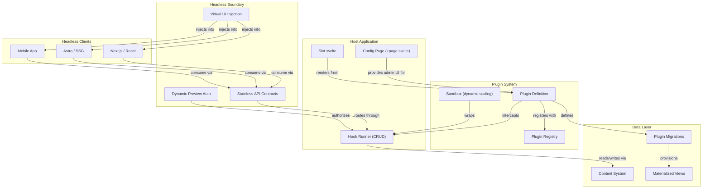

# Plugin Architecture

SveltyCMS features a robust, enterprise-grade plugin architecture for deep customization without modifying the core. Plugins leverage **Slots** for UI injection, **Lifecycle Hooks** for CRUD interception, **Migrations** for database provisioning, a **Sandbox** for security isolation, and **Headless Delivery** boundaries for decoupled frontends.

---

## System Overview



## System Discovery & Autoloading

SveltyCMS dynamically scans and registers plugins on system boot. There are no static hardcoded imports of plugins in the core codebase.

- **Vite Dev/Build**: Scans all `src/plugins/*/index.ts` paths using Vite's native eager glob tool `import.meta.glob("./*/index.ts", { eager: true })`.
- **Bun/Node runtime (CLI/Vitest)**: Utilizes a resilient directory scanning fallback (`fs.readdirSync`) to import plugins dynamically.

This allows any custom or optional plugin to be added to or deleted from the `src/plugins/` directory without causing compile-time errors.

## HTTP APIs from plugins (not a fifth extension type)

Plugins already expose backend endpoints. There is no separate “API extension” product.

1. **`{ type: "route" }`** in `definePlugin` — registered in `pluginRouteRegistry` at boot. The catch-all dispatcher (`src/routes/api/[...path]/+server.ts`) matches `METHOD + path` when the first path segment is **not** a core namespace. `requiredCapabilities: "public"` skips session auth (use for signed webhooks). `[]` requires a signed-in user. String arrays are checked with `hasPermissionWithRoles`. Disabled plugins return `403 PLUGIN_DISABLED`.
2. **Dedicated handlers** (Commerce, Stripe) live under `handlers/*.ts` and **still** gate on `pluginRegistry.getPluginState`. That is for guest CSRF / tenant rules, not a second plugin system.

```typescript
parts: [
  {
    type: "route",
    routes: [
      {
        path: "/api/my-integration/webhook",
        method: "POST",
        requiredCapabilities: "public",
        handler: async (event) => Response.json({ ok: true }),
      },
    ],
  },
];
```

Do not add `/api/plugins/[pluginId]` actions for guest storefront traffic — that path requires `plugins:execute`.

---

## Plugin Structure

Every plugin lives in `src/plugins/{plugin-id}/` and follows this structure:

```
src/plugins/my-plugin/
├── index.ts                  ← Plugin definition + metadata
├── index.server.ts           ← Server-only: hooks, migrations (optional)
├── components/               ← Svelte components (optional)
│   └── MyComponent.svelte
├── server/                   ← Server-side services (optional)
│   └── service.ts
└── my-plugin.mdx             ← Plugin documentation
```

---

## Plugin Interface

```typescript
export interface Plugin {
  metadata: PluginMetadata; // Required: name, version, icon, category
  config?: PluginConfig; // Optional: public/private settings schema
  hooks?: PluginLifecycleHooks; // Optional: CRUD interception
  ssrHook?: PluginSSRHook; // Optional: server-side data enrichment
  ui?: PluginUIContribution; // Optional: UI columns, actions, edit tabs, slots
  migrations?: PluginMigration[]; // Optional: database table provisioning
  enabledCollections?: string[]; // Optional: restrict to specific collections
}
```

---

## Injection Zones

Plugins inject UI components into predefined zones. All zones are rendered via the `<Slot>` component (`src/components/system/slot.svelte`).

| Zone                 | Location                    | Used By                           |
| -------------------- | --------------------------- | --------------------------------- |
| `dashboard`          | Main dashboard widgets      | PageSpeed, Stripe                 |
| `sidebar`            | Admin sidebar navigation    | Editable Website                  |
| `entry_edit`         | Entry editor tabs/panels    | Any content plugin                |
| `entry_edit_sidebar` | Entry editor sidebar        | SEO plugins                       |
| `entry_edit_header`  | Entry editor header actions | Workflow actions                  |
| `config`             | System configuration area   | Stripe, settings plugins          |
| `config_grid`        | Config page icon grid       | Smart Importer, any config plugin |
| `collection_builder` | Collection builder page     | Schema plugins                    |

| `media_gallery` | Media gallery page | Media plugins |
| `media_gallery_toolbar` | Media gallery toolbar | Image optimization plugins |

| `user_profile` | User profile/settings page | Profile extensions |
| `user_profile_sidebar` | User profile sidebar | Account plugins |
| `entry_list_actions` | Entry list action buttons | PageSpeed refresh |

| `global-toolbar` | Top toolbar (all routes) | System status (rendered in layout) |
| `global-footer` | Footer (all routes) | Debug bar (rendered in layout) |
| `sticky-action-bar` | Bottom sticky bar | Bulk operations |

**Adding slots to a route page:**

```svelte
<script lang="ts">
  import Slot from "@src/components/system/slot.svelte";
</script>

<Slot name="user_profile" />
<Slot name="collection_builder" />
```

---

## Plugin Admin Pages & Declarative Nav

Plugins can contribute **full admin pages** — mounted under `/plugin/<path>` inside the admin shell — plus declarative sidebar nav items. This is the Drupal-style "module page" pattern: a plugin page is a real URL with server data loading, RBAC gating, and a nav entry, not an overlay.

### 1. The `page` part

Declared via `definePlugin` (`src/plugins/define-plugin.ts`):

```typescript
import { definePlugin } from "@src/plugins/define-plugin";

export const recaptchaPlugin = definePlugin({
  metadata: { id: "recaptcha", name: "reCAPTCHA", version: "1.0.0", description: "..." },
  parts: [
    {
      type: "page",
      pages: [
        {
          id: "recaptcha:console",
          path: "recaptcha", // → /plugin/recaptcha
          title: "reCAPTCHA Console",
          component: () => import("./RecaptchaPage.svelte"), // lazy, tree-shaken
          load: async ({ tenantId, user }) => ({
            siteKey: await getSiteKey(tenantId), // server-only; never leaks secrets
          }),
          nav: { group: "Security", label: "reCAPTCHA", icon: "mdi:captcha", order: 10 },
          requiredCapabilities: ["manage:settings"], // mandatory (TS error when omitted)
        },
      ],
    },
  ],
});
```

### 2. How it mounts

- **Registration is isomorphic** — `src/plugins/index.ts` registers `page` parts into `pluginPageRegistry` on client and server (same pattern as slots).
- **Route** — a single catch-all `src/routes/(app)/plugin/[...path]/` resolves the page by path.
- **Server load** (`+page.server.ts`) — enforces `requiredCapabilities` (**403 fail-closed**; admins bypass via fast-path, roles must carry every required capability), runs the page's optional `load` hook, and returns `{ pageId, title, props }`.
- **Client** (`+page.svelte`) — looks up the lazy component by `pageId` and renders it inside `<AdminPageShell>` with the server props.
- `/plugin` redirects to the first nav item (or `/config` when none).

### 3. Declarative sidebar nav

The `nav` field renders a **Plugins** section in the left sidebar (`LeftSidebar`) with `data-sveltekit-preload-data="hover"` links. Items are grouped and ordered; capability filtering is a UX nicety — the route enforces 403 regardless.

### 4. Admin zones (dormant registries, now rendered)

Two previously declared-but-unrendered systems are now rendered by `<AdminZone>` (`src/components/system/admin-zone.svelte`):

| System               | Zones                                                                 | How to contribute                     |
| :------------------- | :-------------------------------------------------------------------- | :------------------------------------ |
| `adminTool` part     | `sidebar` · `toolbar` · `dashboard` · `config`                        | `{ type: "adminTool", tools: [...] }` |
| `AdminAreaExtension` | `sidebar` · `header` · `footer` · `content-header` · `content-footer` | `registerAdminAreaExtension(ext)`     |

```typescript
parts: [
  {
    type: "adminTool",
    tools: [
      {
        id: "status",
        label: "Status",
        icon: "mdi:heart-pulse",
        component: () => import("./StatusTool.svelte"),
        zone: "toolbar",
        order: 5,
        requiredCapabilities: ["dashboard:read"], // default: ["admin"]
      },
    ],
  },
],
```

Zones are wired into the shell: `header`/`toolbar`/`footer` in `(app)/+layout.svelte`, `sidebar` in `LeftSidebar`, `dashboard` in the dashboard page, `config` in the config page, `content-header`/`content-footer` in `AdminPageShell`. Components are lazy-loaded, ordered, and gated by an optional `condition(context)`.

---

## Lifecycle Hooks

```typescript
hooks: {
  beforeSave: async (context, collection, data) => { return data; },
  afterSave: async (context, collection, result) => {},
  beforeDelete: async (context, collection, id) => {},
  afterDelete: async (context, collection, id) => {},
  // Auth hooks — fires after credential verification, before session cookie
  afterAuthenticate: async (event) => {
    // event.user, event.method, event.ip, event.userAgent
    // return { deny: true, message: "Blocked" } to block login
    // return { requires2FA: true } to force 2FA gating
  },
}
```

---

## Sandbox Boundaries

All plugin hooks execute within a sandbox (`src/plugins/sandbox.ts`) with **architecture-aware dynamic scaling**:

| Boundary                  | Limit                                                                | Why                      |
| ------------------------- | -------------------------------------------------------------------- | ------------------------ |
| **Collection access**     | Only `plugin_{id}_*` for writes                                      | Prevent data corruption  |
| **Protected collections** | `users`, `sessions`, `tokens`, `roles`, `audit_logs` blocked         | Never access auth data   |
| **Query count**           | 100 queries per hook (default); dynamically scaled up for migrations | Prevent resource abuse   |
| **Timeout**               | 5 seconds per hook (default); 30s for migrations                     | Prevent hangs            |
| **Error boundary**        | Catches all errors                                                   | Plugin crash ≠ CMS crash |

> **Dynamic Scaling**: The sandbox adapts limits based on the execution context. **Migrations** receive a higher query budget (up to 500 queries) and extended timeout (30s) since they provision infrastructure. **Hooks** retain the strict 100-query / 5s limits to prevent runtime performance degradation. This architecture-aware approach ensures migrations can complete complex schema provisioning while hooks remain fast and safe.

---

## Headless Delivery Boundaries

SveltyCMS plugins support **decoupled frontend architectures** through three key headless mechanisms:

### 1. Virtual UI Injection

Plugins can register **API-only layout definitions** for consumption by external frontends. Instead of injecting Svelte components into the admin UI, plugins export JSON-serializable slot contracts that external frontends (Next.js, Astro, mobile apps) render natively.

```typescript
// Plugin exports virtual slot definitions for headless frontends
export const virtualSlots = [
  {
    id: "headless-blog-header",
    zone: "page_header",
    schema: { type: "object", properties: { title: "string", author: "string" } },
    endpoint: "/api/plugins/blog/header-data",
  },
];
```

### 2. Optional SvelteKit Site Starter

SveltyCMS ships a **free, recommended** SvelteKit public frontend at `routes/(site)` with **Svedit** inline page design. **Website Starter** is the default setup preset; `SITE_STARTER_ENABLED` (default `true`) toggles public routes at `/`.

- **Free**: Public routes, `pages` collection, native UI components
- **Not required**: Disable for pure headless; use Astro/Next/Vue with the same APIs

See [Site Starter guide](/docs/development/site-starter.mdx).

### 3. Premium Live Preview (Editable Website plugin)

Real-time iframe preview and bidirectional editing require the **[Editable Website & Live Preview](/src/plugins/editable-website/editable-website.mdx)** plugin (€14.99 marketplace, 14-day trial):

```typescript
// Preview token flow (plugin calls this from the Live Preview tab)
POST /api/preview/authorize  →  { previewUrl: "https://myfrontend.com/?preview_token=..." }
```

- Collection schema: `livePreview: "/{slug}?lang={lang}"` + `plugins: ["editable-website"]`
- Works with the site starter (same origin) or external frontends (absolute URL pattern)
- Protocol: `svelty:init`, `svelty:update`, `svelty:field:click`, `svelty:save` — see [Live Preview Architecture](/docs/reference/architecture/live-preview-architecture.mdx)

### 4. Stateless API Contracts

All plugin interaction with external frontends goes through **documented REST/GraphQL endpoints** with:

- **Origin validation** via plugin config (`allowedOrigins`, `frontendBaseUrl`, `allowedCheckoutOrigins`)
- **Fail-closed semantics**: If a plugin configures `failClosedOnCacheMiss: true`, missing cache entries return 404 instead of falling through
- **Edge KV synchronization**: Redirects and sitemaps push to edge stores for sub-5ms resolution on decoupled frontends

---

## The Config Page + Plugin Pattern

The recommended architecture for admin-facing plugins uses TWO layers:

```
┌──────────────────────────────────────────┐
│  Config Page (routes/(app)/config/...)    │  ← Admin UI
│  +page.svelte, +page.server.ts            │     CRUD forms, list views
├──────────────────────────────────────────┤
│  Plugin (src/plugins/...)                 │  ← Business logic
│  hooks, migrations, services              │     Auto-behaviors, cache sync
└──────────────────────────────────────────┘
```

### Case Study: Smart AI-Driven Migration Pro

| Layer       | File                               | Purpose                                            |
| ----------- | ---------------------------------- | -------------------------------------------------- |
| Config Page | `config/migration/+page.svelte`    | Drag-drop upload, format detection, progress UI    |
| Config Page | `config/migration/+page.server.ts` | Server actions: detect, dryRun, import, rollback   |
| Plugin      | `smart-importer/index.ts`          | Plugin metadata, config, slot registration         |
| Plugin      | `smart-importer/index.server.ts`   | 7 AST compilers, 8 format parsers, UCP engine, DLQ |
| Plugin      | `smart-importer/components/`       | TransformationTree.svelte (visual schema mapper)   |

**Conditional tile**: The Migration tile only appears in the Config grid when the plugin is installed and enabled. The config page's `+page.server.ts` checks `pluginRegistry.getPluginState('smart-importer', tenantId)`.

### Case Study: Redirect Manager

| Layer             | File                               | Purpose                                     |
| ----------------- | ---------------------------------- | ------------------------------------------- |
| Config Page       | `config/redirects/+page.svelte`    | Manual CRUD for redirect rules              |
| Plugin hooks      | `redirect-manager/index.server.ts` | Auto-redirect on slug change                |
| Plugin migrations | `redirect-manager/index.server.ts` | Creates `redirects` + `redirects_mv` tables |
| Plugin services   | `redirect-manager/index.server.ts` | Edge KV sync, Materialized View sync        |

---

## Available Plugins

| Plugin                            | Category    | Docs                                                                 |
| --------------------------------- | ----------- | -------------------------------------------------------------------- |
| **Smart AI-Driven Migration Pro** | Migration   | [smart-importer.mdx](/src/plugins/smart-importer/smart-importer.mdx) |
| PageSpeed                         | Performance | [pagespeed.mdx](/src/plugins/pagespeed/pagespeed.mdx)                |

| Editable Website | Editing (premium) | [editable-website.mdx](/src/plugins/editable-website/editable-website.mdx) — €14.99 live preview |
| Redirect Manager | SEO | [redirect-manager.mdx](/src/plugins/redirect-manager/redirect-manager.mdx) |
| Sitemap | SEO | [sitemap.mdx](/src/plugins/sitemap/sitemap.mdx) |

| WebMCP | AI | [webmcp.mdx](/src/plugins/webmcp/webmcp.mdx) |
| Cookie Consent | Privacy | [cookie-consent.mdx](/src/plugins/cookie-consent/cookie-consent.mdx) |
| Stripe | Payments | [stripe.mdx](/src/plugins/stripe/stripe.mdx) |
| Unified Data Hub | Data federation | [unified-data-hub.mdx](/src/plugins/unified-data-hub/unified-data-hub.mdx) |

---

## Best Practices

1. **Lazy Loading**: Use `() => import(...)` for UI components to keep bundle size low.
2. **Type Safety**: Import from `@src/plugins/types` for all interfaces.
3. **Sandbox Compliance**: Stay within 100 queries and 5s timeout per hook (migrations receive dynamic scaling).
4. **Collection Prefixing**: Use `plugin_{id}_` for all plugin-owned collections. For abstract migrations, use `dbAdapter.schema.ensureCollection()` instead of raw `createModel`:

   ```typescript
   // ✅ Recommended: abstract migration
   migrations: [
     {
       up: async (dbAdapter) => {
         await dbAdapter.schema.ensureCollection("plugin_my-plugin_logs", {
           fields: [
             { label: "Action", name: "action", type: "text", required: true },
             { label: "Timestamp", name: "timestamp", type: "text" },
           ],
           status: "publish",
         });
       },
     },
   ];

   // ❌ Legacy: raw createModel
   up: async (dbAdapter) => {
     await (dbAdapter as any).createModel({ _id: "plugin_my-plugin_logs" });
   };
   ```

5. **Optional Dependencies**: Dynamic import server-side deps so plugins are truly optional.
6. **Documentation**: Every plugin must have an `.mdx` file in its directory.
7. **Config Page Pattern**: Admin-facing plugins should pair with a config page for CRUD.
8. **Conditional Tiles**: Check `pluginRegistry` in `+page.server.ts` to show/hide tiles.

---

## Related

- [Plugin Development Guide](development.mdx)
- [Marketplace System](../../../reference/architecture/marketplace.mdx)
- [AI Integration](../../development/ai-integration.mdx)
- [Security Overview](../../../reference/security/index.mdx)
