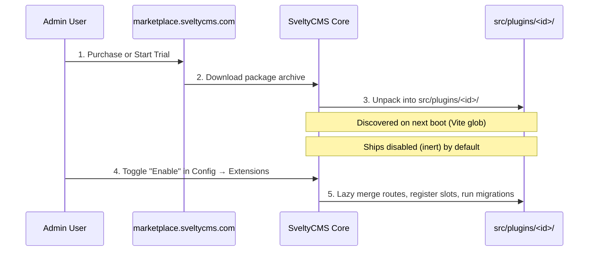

# Plugin Marketplace & Monetization

Plugins are the most powerful extension mechanism in SveltyCMS. They can contribute isomorphic server hooks, database migrations, custom API routes, UI injection slots, and background jobs.

This guide details how to package, publish, install, and monetize plugins via **marketplace.sveltycms.com**, with a particular focus on the **14-day keyless trial** and license verification architecture.

---

## 🏪 Portable Plugin Packages

A marketplace plugin is distributed as a self-contained folder containing its runtime code, manifest, documentation, and optional migrations.

### Required Package Structure

```text
src/plugins/<plugin-id>/
  ├── plugin.json         # Manifest (ID, version, license, entry points)
  ├── index.ts            # Client-side definition (UI slots, columns, metadata)
  ├── index.server.ts     # Server-side definition (hooks, migrations, API routes)
  ├── <plugin-id>.mdx     # Marketplace documentation & feature guide
  └── tests/              # Optional package unit/integration tests
```

### Plugin Manifest (`plugin.json`)

```json
{
  "id": "pagespeed",
  "name": "Google PageSpeed Insights",
  "description": "Continuous Core Web Vitals monitoring and automated SEO audits",
  "version": "1.2.0",
  "author": "SveltyCMS Ecosystem",
  "type": "plugin",
  "license": "freemium",
  "price": 14.99,
  "category": "analytics",
  "icon": "mdi:speedometer",
  "capabilities": ["analytics:read", "pagespeed:run"]
}
```

The marketplace catalog (`GET /api/packages?type=plugin`) and the in-app catalog (**Config → Extensions → Marketplace**) use this manifest for categorization, pricing, and installation.

---

## 📥 Install & Discovery Lifecycle

Marketplace plugin installations write directly to `src/plugins/<plugin-id>/`.



1. **Inert upon install:** A freshly installed marketplace plugin ships disabled by default. It contributes **no active routes, capabilities, or migrations** until explicitly enabled by an administrator.
2. **Lazy activation:** Toggling a plugin on does not require a server reboot; routes and schema hooks are merged dynamically at runtime.

---

## 💰 Monetization & 14-Day Free Trial Architecture

SveltyCMS extensions follow the **"Redis vs. Memory Cache"** philosophy: basic, fundamental operations remain accessible and free, while advanced automation, AI capabilities, and high-volume background tasks are monetized.

### Monetization Tiers

| Tier                  | Payment                           | Trial Window          | Behavior & Expectations                                                                                  |
| :-------------------- | :-------------------------------- | :-------------------- | :------------------------------------------------------------------------------------------------------- |
| **Free**              | 0 €                               | Unlimited             | Available to all users and installations indefinitely.                                                   |
| **Freemium (Hybrid)** | Paid (€/one-time or subscription) | **14-Day Full Trial** | Basic features remain free forever. Advanced/automated features require an active license after 14 days. |
| **Fully Paid (Pro)**  | Paid (€)                          | **14-Day Full Trial** | Entire plugin requires an active license after the 14-day evaluation window.                             |

### How the 14-Day Keyless Trial Works

Every installation starts with an automatic, zero-configuration **14-day trial**:

- **Timestamp Anchor:** The trial duration is anchored to the creation timestamp of the first registered administrator user in the database (`computeTrialStatus()` in `src/utils/license-manager.ts`).
- **Zero Friction:** During these 14 days, `checkExtensionLicense("plugin", "<id>")` returns `{ active: true, daysRemaining: X, hasLicense: false }`.
- **Full Access:** All premium endpoints, UI controls, and background workers execute unrestricted without requiring the user to create an account or input a credit card.
- **Trial Expiration:** When `daysRemaining <= 0`, `status.active` flips to `false`. Premium routes reject with `403 LICENSE_REQUIRED`, and UI components display `<UpgradePrompt />`.

---

## 🛡️ Implementing License Enforcement

License validation must always be enforced with **defense-in-depth**: server-side protection is mandatory (never rely purely on frontend UI toggles).

### 1. Server-Side Protection (`index.server.ts`)

In server-side hooks or API route handlers, check entitlement before executing premium logic:

```typescript
// src/plugins/my-plugin/index.server.ts
import { checkExtensionLicense } from "@src/utils/license-manager";
import { raise } from "@utils/error-handling";

export async function handleBulkAnalytics(req: Request) {
  const license = await checkExtensionLicense("plugin", "my-plugin");

  // If trial has expired and no valid license key is present
  if (!license.active && !license.hasLicense) {
    raise(
      403,
      "Bulk automated analytics requires a Pro license or active trial. Upgrade at marketplace.sveltycms.com",
      "LICENSE_REQUIRED",
    );
  }

  // Execute premium logic...
}
```

### 2. Freemium Fallback Pattern (Graceful Degradation)

Whenever possible, prefer **graceful fallback** over hard errors:

```typescript
// Example: Live Shipping Plugin
const license = await checkExtensionLicense("plugin", "shipping-live");

if (license.active || license.hasLicense) {
  // Premium: Fetch live carrier rates from FedEx / UPS API
  return await fetchLiveCarrierRates(cart);
} else {
  // Free fallback: Calculate standard rates from local database table
  logger.info("[shipping-live] Trial expired. Falling back to local shipping zone rates.");
  return await calculateLocalTableRates(cart);
}
```

### 3. Frontend UI Gate (`<UpgradePrompt />`)

Use the reactive `checkExtensionLicense` client query or the `/api/system/license-status` endpoint:

```svelte
<!-- src/plugins/my-plugin/ui-slot.svelte -->
<script lang="ts">
  import { onMount } from "svelte";
  import UpgradePrompt from "@components/ui/upgrade-prompt.svelte";

  let status = $state({ active: true, daysRemaining: 14, hasLicense: false });

  onMount(async () => {
    const res = await fetch("/api/system/license-status?type=plugin&id=my-plugin");
    if (res.ok) {
      status = (await res.json()).data;
    }
  });
</script>

{#if status.active}
  <!-- Premium Dashboard View -->
  <div class="pro-analytics-panel">
    {#if !status.hasLicense && status.daysRemaining !== null}
      <div class="p-2 mb-4 text-xs rounded bg-warning-500/10 text-warning-500 border border-warning-500/30">
        Trial active: {status.daysRemaining} days remaining.
      </div>
    {/if}
    <slot />
  </div>
{:else}
  <!-- Upgrade Prompt CTA -->
  <UpgradePrompt
    extensionId="plugin:my-plugin"
    price="€19.99"
    features={["Automated AI generation", "Unlimited bulk processing", "Direct webhook push"]}
  />
{/if}
```

---

## 🔑 License Activation & Configuration

Users can activate their purchased license keys through two zero-downtime mechanisms:

1. **System Settings UI:** Navigate to **Config → System Settings → Private Settings** and set `LICENSE_KEY` (master key for all extensions) or `LICENSE_KEY_PLUGIN_<ID>` (per-extension key).
2. **Private Config File:** In self-hosted production setups, configure `config/private.ts`:
   ```typescript
   export const privateConfig = {
     LICENSE_KEY: "svelty_lic_prod_abcdef123456",
     LICENSE_KEY_PLUGIN_PAGESPEED: "svelty_lic_pagespeed_xyz987",
   };
   ```

### Dynamic Cache Invalidation

When a user saves or updates a license key, the license cache key (`${extensionId}|${specificKey}|${masterKey}`) changes instantly. The next request directly re-verifies against `https://marketplace.sveltycms.com/api/v1/license/verify` without requiring a server reboot.

### Outage Resilience (Fail-Open vs. Fail-Closed)

To prevent enterprise customers from suffering downtime during network glitches or marketplace maintenance:

- **Configured Key + Marketplace Unreachable:** **Fail-Open** (`active: true, hasLicense: true`). A legitimate paying customer is never blocked by external network issues.
- **No Key + Marketplace Unreachable:** **Fail-Closed** (`active: false`) once the 14-day trial has passed. Unlicensed installations cannot exploit network outages to gain unauthorized access.

---

## 📚 Related Documents

- [Plugin Architecture](./architecture.mdx)
- [Plugin Development Guide](./development.mdx)
- [Dashboard Widget Marketplace](../dashboard/marketplace.mdx)
- [Widget Marketplace](../widgets/marketplace.mdx)
- [License Gate Inventory](../../reference/security/license-endpoint-inventory.mdx)
