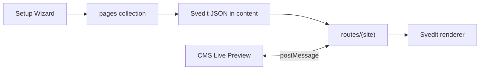

# SvelteKit Site Starter

SveltyCMS is **headless** — you can always build public sites with Astro, Next.js, Vue, or any stack that consumes the REST/GraphQL APIs. For most teams, the **recommended path** is the **in-repo SvelteKit frontend** at `routes/(site)` together with **[Svedit](https://github.com/michael/svedit)** for visual frontpage design.

> [!TIP]
> **Website Starter** is the default setup preset. It seeds a `pages` collection, enables public routes, and publishes a homepage with a Svedit layout — ready to edit in Live Preview after setup.

> [!NOTE]
> Disable the site starter for pure headless deployments with `SITE_STARTER_ENABLED: false` in public settings.

---

## Architecture

| Layer               | Location                                                                      | Role                                                               |
| ------------------- | ----------------------------------------------------------------------------- | ------------------------------------------------------------------ |
| **Setup preset**    | Website Starter (default)                                                     | Seeds `pages` collection + published `home` entry                  |
| **Page content**    | `pages.content`                                                               | Svedit document JSON (primary layout)                              |
| **Public routes**   | `src/routes/(site)/`                                                          | SvelteKit SSR homepage and catch-all pages                         |
| **Svedit renderer** | `src/components/site/svedit/`                                                 | Block components (hero, paragraph, CTA)                            |
| **Flat fields**     | `heroHeading`, `body`, …                                                      | Fallback when `content` has no Svedit document                     |
| **Live preview**    | [Editable Website plugin](/src/plugins/editable-website/editable-website.mdx) | Premium iframe sync + inline Svedit editing (€14.99, 14-day trial) |



---

## Quick Start

### 1. Use the default preset

The Setup Wizard pre-selects **Website Starter**. It creates:

- A `pages` collection with `livePreview: "/{slug}?lang={lang}"` and `plugins: ["editable-website"]`
- A **published homepage** (`slug: home` → `/`) with a default Svedit layout

### 2. Visit the public site

- **Guests** → `http://localhost:5173/` shows the seeded homepage
- **Logged-in editors** → `/` redirects to the CMS dashboard

### 3. Design the frontpage

| Method                              | Cost                  | Best for                |
| ----------------------------------- | --------------------- | ----------------------- |
| **CMS form** (fields + Svedit JSON) | Free                  | Quick edits, developers |
| **Live Preview** (inline Svedit)    | Plugin (14-day trial) | Visual frontpage design |

**Live Preview (paid bridge — trial included on Website Starter setup):**

1. Open **Pages → Home** → **Live Preview** tab (plugin auto-enabled after setup)
2. Edit hero, paragraphs, and CTA blocks **inline** on the live site
3. Changes sync via `svelty:document:update` — save in the CMS to persist

**Free path:** Edit **Page Layout (Svedit)** (`content`) or flat fields (`heroHeading`, `body`, …) in the form tab. The public site updates after publish — no license required.

### 4. Add more pages

| Slug      | URL        | Notes                             |
| --------- | ---------- | --------------------------------- |
| `home`    | `/`        | Homepage (seeded by default)      |
| `about`   | `/about`   | Add via Pages collection          |
| `contact` | `/contact` | Publish with status **Published** |

---

## Svedit integration

SveltyCMS ships `svedit` as a dependency. The site starter defines:

| Piece            | Path                                                     |
| ---------------- | -------------------------------------------------------- |
| Document schema  | `src/services/site/svedit/schema.ts`                     |
| Default homepage | `src/services/site/svedit/default-home-document.ts`      |
| Session factory  | `src/components/site/svedit/create-site-session.ts`      |
| Node components  | `src/components/site/svedit/*-node.svelte`               |
| Renderer         | `src/components/site/svedit/svedit-page-renderer.svelte` |

`page-renderer.svelte` detects a Svedit document in `content` (object with `document_id` + `nodes`) and renders via `<Svedit>`. Legacy `{ blocks: [...] }` JSON and flat CMS fields still work as fallbacks.

Extend the schema with new node types (features grid, testimonials, …) and register matching Svelte components in `create-site-session.ts`.

---

## Configuration

### `SITE_STARTER_ENABLED`

Public setting (default: `true`). Set to `false` to redirect anonymous `/` visitors to `/login` while keeping CMS and APIs unchanged.

### Reserved routes

Admin paths always require authentication: `/api`, `/login`, `/setup`, `/config`, `/admin`, language-prefixed CMS routes (`/en`, `/de`, …).

---

## Headless alternatives

The site starter is the **reference implementation** for SvelteKit teams. For other frameworks:

| Stack                     | Integration                                                                                       |
| ------------------------- | ------------------------------------------------------------------------------------------------- |
| **Astro / Next.js / Vue** | Fetch `GET /api/collections/pages` (published)                                                    |
| **Draft preview**         | `POST /api/preview/authorize` + `GET /api/preview` handshake                                      |
| **Live sync in iframe**   | Implement `svelty:init` / `svelty:update` / `svelty:document:update` — see `src/utils/preview.ts` |

You can run SveltyCMS headless-only and adopt Svedit in a separate SvelteKit frontend that consumes the API.

---

## Route layout note

SvelteKit allows only one loader per URL. The former `src/routes/+page.server.ts` (CMS-only redirect) conflicted with the public site at `/`, so it was removed. Authenticated editor redirects now run inside `src/routes/(site)/+page.server.ts` via `redirectAuthenticatedUserToCms()`.

Disable the site starter (`SITE_STARTER_ENABLED: false`) to restore headless-only behavior — guests hitting `/` are sent to `/login` instead of the public homepage.

---

## File reference

```
src/routes/(site)/
├── +layout.svelte
├── +layout.server.ts
├── +page.svelte            # Homepage (slug "home")
├── +page.server.ts
└── [...slug]/              # Catch-all public pages

src/components/site/
├── page-renderer.svelte    # Svedit-first, flat-field fallback
├── svedit/                 # Svedit schema components + renderer
├── site-preview-bridge.svelte
├── site-header.svelte
└── site-footer.svelte

src/services/site/
├── svedit/                 # Schema, default doc, parsers
├── page-resolver.server.ts
├── site-config.server.ts
└── website-starter-seed.server.ts  # Shared seed blueprint (setup + testing API)
```

---

## Related

- [Editable Website Plugin](/src/plugins/editable-website/editable-website.mdx) — Premium live preview (€14.99)
- [Live Preview Architecture](/docs/reference/architecture/live-preview-architecture.mdx)
- [Svedit](https://github.com/michael/svedit) — Inline Svelte editing library
- [Plugin Architecture](/docs/development/plugins/architecture.mdx)
- [Getting Started](/docs/getting-started.mdx)
