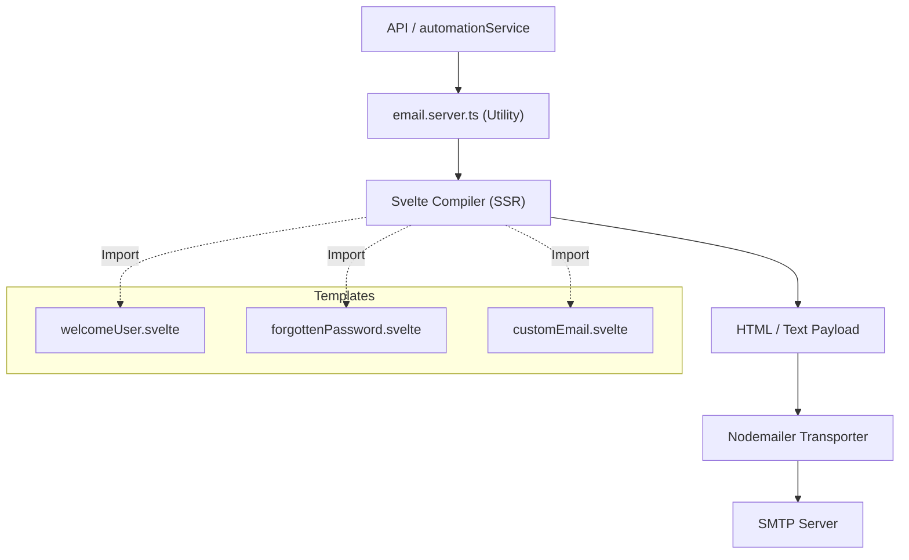

# Email System Guide

SveltyCMS features a powerful, template-driven email system that leverages Svelte components for rendering and Nodemailer for SMTP delivery. This system is integrated across the CMS, powering authentication emails, system alerts, and user-defined automations.

## Core Concepts

### 1. Svelte-Based Templates

Emails are built using standard Svelte components located in `src/components/emails/`. This allows for:

- **Better-Svelte-Email**: Leveraging the `better-svelte-email` library for high-quality, component-based email construction.
- **Full Tailwind CSS v4 Support**: Create stunning, responsive, and flexible layouts using the Tailwind CSS utility-first approach. SveltyCMS automatically inlines these styles during rendering for 99% client compatibility.
- **Dynamic Content**: Passing props to templates just like any regular Svelte component.
- **Type Safety**: Defining strict prop interfaces for each template using TypeScript.

### 2. Automatic Style Inlining

SveltyCMS uses a custom renderer that processes Tailwind CSS v4 classes at runtime. This means you can use classes like `bg-blue-500` or `p-4` in your Svelte files, and they will be converted to inline `style="background-color: #3b82f6; padding: 1rem;"` attributes in the generated email HTML.

### 2. Zero-Configuration Preview (Dev Mode)

When running in development mode, SveltyCMS skips actual SMTP delivery if hostnames like `dummy` or `example.com` are used, logging the rendered HTML to the console instead.

## SMTP Configuration

To enable email delivery, configure the following keys in **System Settings**:

| Key              | Description                  | Example                              |
| :--------------- | :--------------------------- | :----------------------------------- |
| `SMTP_HOST`      | SMTP server hostname         | `smtp.gmail.com`                     |
| `SMTP_PORT`      | SMTP server port             | `465` (SSL) or `587` (TLS)           |
| `SMTP_USER`      | Username for authentication  | `notifications@yourdomain.com`       |
| `SMTP_PASS`      | Password for authentication  | `*************`                      |
| `SMTP_MAIL_FROM` | Default "From" email address | `SveltyCMS <noreply@yourdomain.com>` |

> [!IMPORTANT]
> Ensure that your SMTP provider allows connections from your server's IP address and that any firewall settings permit outgoing traffic on the chosen SMTP port.

## Available Templates

| Template            | Purpose                      | Key Props                                  |
| :------------------ | :--------------------------- | :----------------------------------------- |
| `welcomeUser`       | Sent to new signups          | `username`, `hostLink`                     |
| `forgottenPassword` | Password reset link          | `email`, `token`, `resetLink`, `expiresIn` |
| `updatedPassword`   | Password change confirmation | `username`                                 |
| `userToken`         | User invitation Link         | `email`, `role`, `tokenLink`               |
| `databaseFailure`   | Critical system alerts       | `error`, `metrics`, `systemState`          |
| `customEmail`       | Generic notification         | `body`, `sitename`                         |

## Programmatic Usage

### API Endpoint (REST)

You can trigger emails via a standard REST API. This is useful for external services or custom frontend logic.

**Endpoint**: `POST /api/sendMail`
**Authentication**: Requires session or API token.

```json
{
	"recipientEmail": "user@example.com",
	"subject": "Hello from SveltyCMS",
	"templateName": "welcomeUser",
	"props": {
		"username": "John Doe"
	}
}
```

### Automation System Integration

The most common way to send emails is through the **GUI Automation System**.

1. Go to **Config > Automations**.
2. Create a new Automation (e.g., Trigger: `Entry Created`).
3. Add a **Send Email** operation.
4. Use **Tokens** to dynamically populate fields:
   - **Recipient**: `{{ entry.author_email }}`
   - **Body**: `Hi {{ entry.author_name }}, your post "{{ entry.title }}" has been published!`

## Architecture



## Related Documentation

- **[Automation System](./Automation_System.mdx)**: Learn how to trigger emails based on CMS events.
- **[Webhooks API](../api/Webhooks.mdx)**: For outbound events to third-party services.
- **[System Settings](../api/Settings_API.mdx)**: Manage SMTP credentials.
