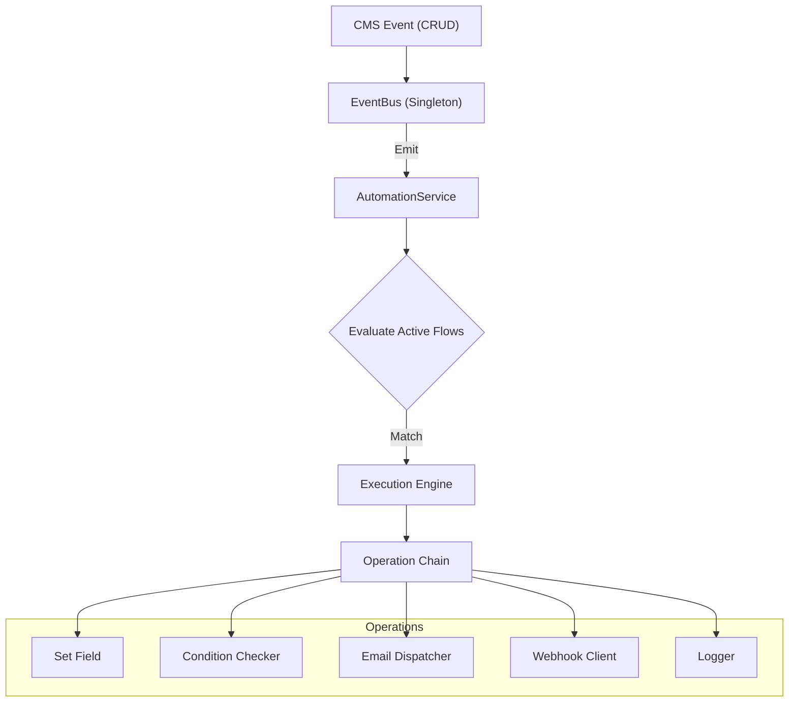
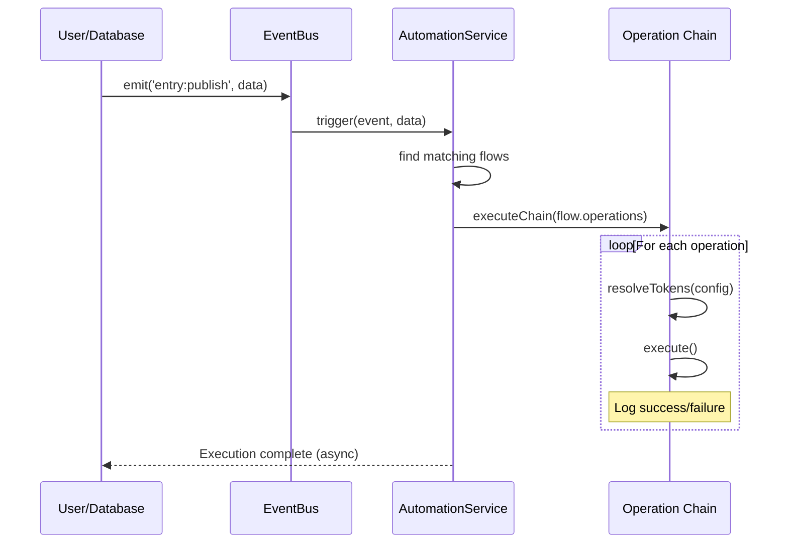

# GUI Automation System

SveltyCMS includes a visual **Automation Builder** for creating event-driven workflows — no custom code required. Automations extend the existing [Webhook System](/docs/api/Webhooks) by adding multiple operation types, conditional logic, and a step-by-step editor GUI.

> [!TIP]
> **Enterprise Use Cases:** Send email notifications on publish, call external APIs on content changes, auto-set fields for editorial workflows, log audit events, and chain conditions together.

---

## Key Concepts

### Triggers

Every automation starts with a **trigger** — the event or condition that starts the flow.

| Trigger Type   | Description                    | Example                          |
| :------------- | :----------------------------- | :------------------------------- |
| **Event Hook** | Fires when a CMS event occurs  | `entry:publish`, `media:upload`  |
| **Schedule**   | Fires at specific times (cron) | `0 9 * * 1-5` (weekdays at 9 AM) |
| **Manual**     | Fires only via the UI or API   | One-off data migrations          |

#### Available Events

| Event             | Category | Description             |
| :---------------- | :------- | :---------------------- |
| `entry:create`    | Content  | New entry created       |
| `entry:update`    | Content  | Existing entry modified |
| `entry:delete`    | Content  | Entry deleted           |
| `entry:publish`   | Content  | Entry published         |
| `entry:unpublish` | Content  | Entry unpublished       |
| `media:upload`    | Media    | File uploaded           |
| `media:delete`    | Media    | File removed            |

### Operations

Operations are the **actions** that execute when a trigger fires. They run sequentially as a chain.

| Operation        | Icon                   | Description                                               |
| :--------------- | :--------------------- | :-------------------------------------------------------- |
| **Send Webhook** | `mdi:webhook`          | HTTP POST/PUT/PATCH with HMAC-SHA256 signing              |
| **Send Email**   | `mdi:email-outline`    | HTML email with token-based dynamic content               |
| **Log Message**  | `mdi:text-box-outline` | Write to the server log at info/warn/error level          |
| **Set Field**    | `mdi:form-textbox`     | Modify an entry field value (e.g., set `reviewed = true`) |
| **Condition**    | `mdi:filter-outline`   | Gate downstream operations (equals, contains, exists)     |

### Token System

All text fields in operations support **token placeholders** for dynamic values:

```
{{ entry.title }}         → Entry title
{{ entry.status }}        → Entry status
{{ entry.author }}        → Author name
{{ entry.<field_name> }}  → Any entry field

{{ trigger.event }}       → Event name (e.g. "entry:publish")
{{ trigger.collection }}  → Collection name
{{ trigger.timestamp }}   → ISO timestamp

{{ user.email }}          → Current user email
{{ user.username }}       → Current username
{{ system.now }}          → Current date/time
```

---

## Using the Automation Builder

### Step 1: Trigger Configuration

Navigate to **Config → Automations** and click **New Automation**.

- Enter a descriptive **name** (e.g., "Notify editors on publish")
- Select the **trigger type** (Event Hook, Schedule, or Manual)
- For event triggers, check the **specific events** you want to react to
- Toggle **Active** to control whether the automation fires

### Step 2: Operation Chain

Build your operation chain by clicking operation cards:

1. **Send Email** — Set recipient, subject, and HTML body with tokens
2. **Send Webhook** — Configure URL, method, body template, and signing secret
3. **Condition** — Gate the chain (e.g., only proceed if `status === 'publish'`)
4. **Set Field** — Modify entry data (e.g., `reviewed_by = {{ user.username }}`)
5. **Log Message** — Record events at your chosen severity level

Operations execute **in order**. Reorder them using the up/down arrows, or remove them with the ✕ button.

### Step 3: Preview & Test

Review your complete flow summary and run a **test execution** with mock data. The test result shows per-operation status, duration, and any errors.

---

## API Reference

All endpoints require admin authentication.

### List All Automations

```
GET /api/automations
```

**Response:**

```json
{
  "success": true,
  "data": [{ "id": "...", "name": "...", "active": true, ... }]
}
```

### Create Automation

```
POST /api/automations
Content-Type: application/json

{
  "name": "Email on Publish",
  "active": true,
  "trigger": {
    "type": "event",
    "events": ["entry:publish"]
  },
  "operations": [
    {
      "type": "email",
      "config": {
        "to": "editors@example.com",
        "subject": "Published: {{ entry.title }}",
        "body": "<p>{{ entry.title }} was published by {{ user.username }}.</p>"
      }
    }
  ]
}
```

### Update Automation

```
PATCH /api/automations/:id
Content-Type: application/json

{ "active": false }
```

### Delete Automation

```
DELETE /api/automations/:id
```

### Test Automation

```
POST /api/automations/:id/test
```

**Response:**

```json
{
	"success": true,
	"data": {
		"status": "success",
		"duration": 42,
		"operationResults": [{ "type": "email", "status": "success", "duration": 35 }]
	}
}
```

---

## Architecture

The Automation System uses a decoupled, event-driven architecture to ensure minimal impact on core CMS performance.

### Logic Flow



### Sequence of Execution



### Key Files

| File                                            | Purpose                                     |
| :---------------------------------------------- | :------------------------------------------ |
| `src/services/automation/types.ts`              | Type definitions, event/operation metadata  |
| `src/services/automation/event-bus.ts`          | Singleton event bus with wildcard listeners |
| `src/services/automation/automation-service.ts` | CRUD + execution engine                     |
| `src/routes/api/automations/`                   | REST API endpoints                          |
| `src/routes/(app)/config/automations/`          | GUI pages (list + editor)                   |

---

## Competitive Comparison

| Feature          | SveltyCMS          | Directus    | Payload      | Strapi          | Contentful     |
| :--------------- | :----------------- | :---------- | :----------- | :-------------- | :------------- |
| **GUI Builder**  | ✅ Native (3-step) | ✅ Flows    | ❌ Code-only | ❌ Lifecycle JS | 💲 Enterprise  |
| **Event Hooks**  | ✅ 7 events        | ✅ Events   | ✅ Hooks     | ⚠️ Model-level  | 💲 Webhooks    |
| **Email Action** | ✅ Native          | ✅ Native   | ❌ Custom    | ⚠️ Plugin       | 💲 Enterprise  |
| **Conditions**   | ✅ Native          | ✅ Native   | ❌ Code      | ❌ No           | ❌ No          |
| **Token System** | ✅ `{{ }}`         | ⚠️ Limited  | ❌ No        | ❌ No           | ❌ No          |
| **DB-Agnostic**  | ✅ Yes             | ⚠️ SQL only | ⚠️ SQL only  | ⚠️ SQL only     | N/A (SaaS)     |
| **Open Source**  | ✅ Free            | ✅ Free     | ✅ Free      | ⚠️ Some gated   | ❌ Proprietary |
