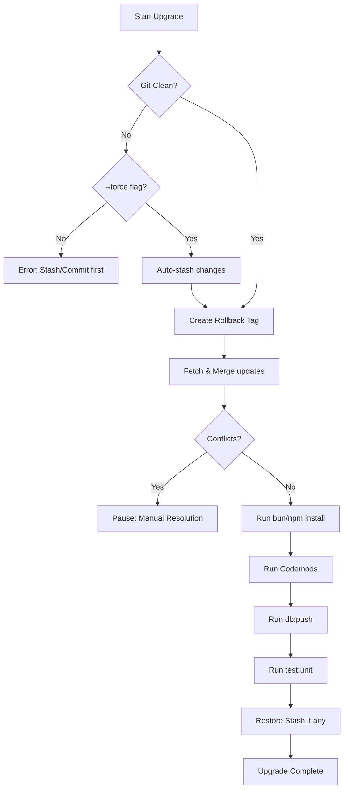

# Upgrading SveltyCMS

SveltyCMS is designed to be upgraded easily while preserving your custom collections and configurations. We provide a CLI tool to automate the process, including dependency updates, database migrations, and **automated code transformations (codemods)**.

## The Upgrade Process

The upgrade tool performs the following steps:



1. **Git Verification**: Ensures you are in a valid Git repository.
2. **Auto-Stash**: If you have uncommitted changes and use the `--force` flag, the tool automatically stashes them and restores them after the upgrade.
3. **Rollback Tag**: Creates a local Git tag (e.g., `pre-upgrade-2026-04-06-12-00-00`) as a safety net before any changes are merged.
4. **Upstream Fetch**: Fetches the latest changes from the official SveltyCMS repository.
5. **Pre-commit Merge**: Merges changes into your local branch without committing, allowing you to review.

6. **Dependency Refresh**: Runs `bun install` to ensure all new packages are installed. On Windows, `npm install` is used instead to avoid known `bun install` corruption issues.
7. **Codemods**: Automatically executes scripts in `scripts/codemods/`. Scripts starting with an underscore (e.g., `_utils.ts`) are ignored by the runner.
8. **Database & Tests**: Runs `db:push` and `test:unit` to ensure everything is working correctly.

## How to Run the Upgrade

Run the following command in your project root:

```
bun run scripts/upgrade.ts
```

### Advanced Options

| Flag            | Description                                                             |
| --------------- | ----------------------------------------------------------------------- |
| `--dry-run`     | See what would happen without making any changes.                       |
| `--skip-tests`  | Do not run the unit test suite after upgrade.                           |
| `--skip-db`     | Do not run `db:push` after upgrade.                                     |
| `--skip-merge`  | Skip fetch+merge (useful if resuming after manual conflict resolution). |
| `--force`       | Auto-stash uncommitted changes before upgrade.                          |
| `--branch=NAME` | Upgrade from a specific branch (defaults to `next`).                    |

## Codemods

SveltyCMS uses "codemods" to automate the tedious parts of an upgrade. If a new version renames a property in a configuration file or changes a component's API, a codemod script will automatically update your local files during the upgrade.

### Naming Convention

Codemods in `scripts/codemods/` follow a specific naming pattern:

- **`NN-description.ts`**: Numbered prefix (e.g., `01-migrate-schema.ts`) determines the execution order.
- **`_name.ts`**: Files starting with an underscore are treated as internal utilities and are **not** executed by the upgrade runner.

### Codemod Utilities (`_utils.ts`)

The shared utilities module provides reusable helpers used by all codemod scripts:

- **`MigrationManager`** — Chains multiple migration rules and tracks which changes were applied per file.
- **`deepUpsertProperty(obj, path, value)`** — Inserts or updates a nested property using dot-notation paths, creating intermediate objects as needed.
- **`validateSchema(obj)`** — Post-migration validation that checks required fields (`name`, `fields`) still exist after transformation.
- **`upsertProperty` / `renameProperty`** — Single-level property insertion, update, and rename operations.

### Current Codemods

| #   | File                                 | What it does                                                                                                                             |
| :-- | :----------------------------------- | :--------------------------------------------------------------------------------------------------------------------------------------- |
| 01  | `01-migrate-collection-schema-v2.ts` | Adds `version: 2` marker and renames deprecated schema fields                                                                            |
| 02  | `02-update-permissions-structure.ts` | Converts legacy `publicAccess` to structured `permissions` object with merge logic preserving existing role permissions                  |
| 03  | `03-add-soft-delete-fields.ts`       | Injects `isDeleted` boolean field into every collection schema for soft-delete support                                                   |
| 04  | `04-migrate-role-names.ts`           | Role name standardization (planned)                                                                                                      |
| --  | `_utils.ts`                          | Shared utilities: `MigrationManager`, `deepUpsertProperty`, `validateSchema`, `upsertProperty`, `renameProperty`, `createCodemodProject` |

## Best Practices

- **Review the Rollback Tag**: Before starting, the tool provides a rollback tag. If anything goes wrong, you can return to your previous state using `git reset --hard <tag-name>`.
- **Review Changes**: After the script finishes, use `git diff` to review the changes before committing.
- **Resolve Conflicts**: If the merge fails, the tool will pause. Resolve conflicts in your editor, `git add` the changes, then run the upgrade again with `--skip-merge`.

## Troubleshooting

### Rolling Back

If the upgrade causes issues, you can roll back to the state before the upgrade started:

```
# List available rollback tags
git tag --list "pre-upgrade-*"

# Reset to the desired tag
git reset --hard pre-upgrade-YYYY-MM-DD-HH-MM-SS
```

### "bun install" corruption on Windows

If you're on Windows and `bun install` produces errors or corrupted `node_modules`:

1. Delete `node_modules` (but keep `bun.lock`)
2. Run `npm install` instead
3. `bun run dev` will work normally after npm install

### "Merge conflict — manual resolution required"

If conflicts occur:

1. Resolve them in your IDE.
2. `git add .`
3. Run `bun run scripts/upgrade.ts --skip-merge` to complete the remaining steps (install, codemods, etc.).

---

## Related

- [Getting Started](../../getting-started.mdx)
- [Architecture Overview](../../reference/architecture/index.mdx)
- [Security Overview](../../reference/security/index.mdx)
