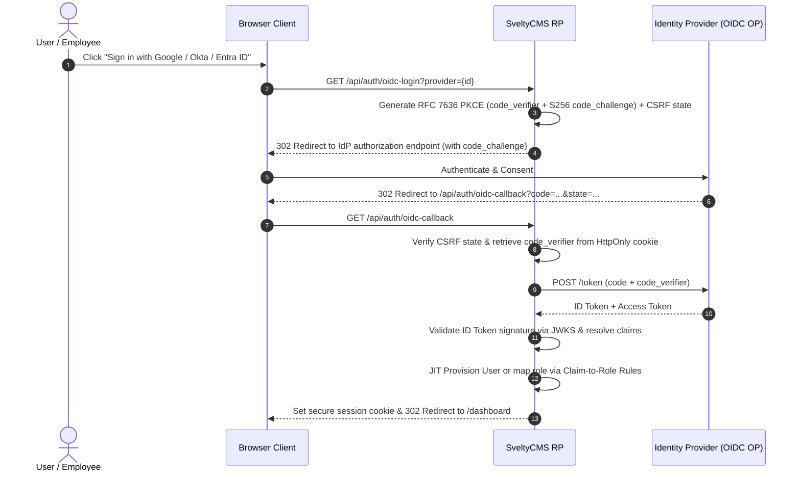

# Access Management

SveltyCMS provides a robust **Role-Based Access Control (RBAC)** system combined with granular permissions to secure your content and sensitive settings.

The Access Management dashboard is located at `/config/accessManagement`.

---

## 👥 Roles & Permissions

Users are assigned a **Role**, and Roles are assigned **Permissions**. This allows you to manage access for groups of users efficiently (e.g., "Editors", "Authors", "Admins").

### Admin Role

The **Admin** role is special. A role with the `isAdmin: true` flag has **all permissions enabled automatically**. You cannot modify individual permissions for an Admin role.

### Creating & Managing Roles

1.  Navigate to **Config > Access Management**.
2.  Click **Create New Role**.
3.  Enter a Role Name (e.g., "Content Editor") and optional Description.
4.  Toggle **Is Admin** if you want this role to have unrestricted access.

### Permission Matrix

For non-admin roles, you must explicitly grant permissions. The system organizes permissions into logical groups:

#### 1. Collection Permissions

Control access to specific content types.

- **read**: View entries in the collection.
- **create**: Add new entries.
- **update**: Edit existing entries.
- **delete**: Remove entries.
- **publish**: (If enabled) Publish/Unpublish entries.

#### 2. System Permissions

Control access to core system features:

- **User Management**: Create, edit, or delete users (`user:create`, `user:read`, etc.).
- **Configuration**: Access system settings, logs, and server info.
- **Content Management**: General content access (`content:files`, etc.).
- **Media Management**: Upload and manage files in the Media Library.
  - **Admins**: Can view, edit, and delete all media files in the system.
  - **Other Roles**: Are restricted to viewing and managing only the media they have personally uploaded (via the Media Gallery or MediaUpload widget).

- **Webhooks Management**: Configure and secure external HTTP triggers (`config:webhooks`).
- **API Access**: Permission to use system API endpoints (`api:read`, `api:write`).

> [!TIP]
> Changes to permissions take effect immediately for new requests, but users may need to refresh their session (logout/login) for UI elements to update fully.

---

## 🔑 Website Tokens

**Website Tokens** are persistent API keys designed for **machine-to-machine** communication. They are ideal for:

- Connecting your frontend website (Next.js, SvelteKit, etc.) to the CMS.
- Running automated build scripts.
- Third-party integrations.

### Website Tokens vs. User Tokens

| Feature         | Website Token               | User Token                  |
| :-------------- | :-------------------------- | :-------------------------- |
| **Purpose**     | Server-side integration     | User authentication (Login) |
| **Expiration**  | Permanent (until revoked)   | Temporary (Session-based)   |
| **Permissions** | Scoped to specific actions  | Inherits User's Role        |
| **Creation**    | Manually generated in Admin | Generated via Login API     |

### Managing Website Tokens

1.  **Generate Token**:
    - Enter a descriptive name (e.g., "Production Website").
    - Click **Generate**.
    - **Copy the token immediately**. For security, it is shown only once.

2.  **Usage**:
    - Include the token in the `Authorization` header of your API requests:
      ```bash
      Authorization: Bearer <your_token>
      ```

3.  **Revocation**:
    - Click **Delete** next to a token to immediately invalidate it. All applications using that token will lose access.

### Permissions for Tokens

You can now assign **Granular Permissions** to Website Tokens. By default, a token has **Read Only** access. During creation, you can select specific permissions (e.g., `user:create`, `collection:update`) to grant precise access rights.

### Token Expiration

For enhanced security, Website Tokens can have an expiration date:

- **30 Days** (Short-term)
- **90 Days** (Standard rotation)
- **1 Year** (Long-term integration)
- **Custom Date**
- **Never** (Use with caution)

Tokens nearing expiration (less than 7 days) are highlighted in the management table. Expired tokens are automatically rejected by the API.

---

## 🛡️ Enterprise SSO & OIDC Identity Providers

SveltyCMS includes native **Single Sign-On (SSO)** support for **OpenID Connect (OIDC)** and **SAML 2.0**, accessible directly from **Config > Access Management** (Tab 4: _SSO & OIDC_).



### Pre-Configured Provider Presets

The SSO configuration panel provides 1-click presets for popular enterprise identity providers:

- **Google Workspace**: `https://accounts.google.com`
- **Microsoft Entra ID (Azure AD)**: `https://login.microsoftonline.com/{tenantId}/v2.0`
- **Okta**: `https://{yourOktaDomain}.okta.com`
- **Auth0**: `https://{yourDomain}.auth0.com`
- **Keycloak**: `https://{keycloakDomain}/realms/{realm}`
- **Generic OIDC**: Any standard OpenID Connect compliant identity provider.

### Automated OIDC Discovery

When specifying an issuer URL, clicking **Verify Discovery** automatically queries the identity provider's `/.well-known/openid-configuration` document and configures:

- Authorization Endpoint
- Token Endpoint
- JWKS URI (for RS256/ES256 cryptographic signature validation)
- End Session Endpoint (for RP-Initiated federated logout)

### RFC 7636 PKCE Hardening

All OIDC login transactions strictly implement **RFC 7636 PKCE (Proof Key for Code Exchange)** using the `S256` SHA-256 method:

1. SveltyCMS generates a cryptographically random 32-byte `code_verifier`.
2. Computes the base64url-encoded SHA-256 `code_challenge`.
3. Stores the verifier in a secure, short-lived HttpOnly cookie (`oidc_login_state`).
4. Sends the `code_challenge` and `code_challenge_method=S256` to the authorization server.
5. Exchanges the authorization code along with the verifier, immunizing against authorization code injection or interception attacks.

### Just-In-Time (JIT) Auto-Provisioning

When enabled, users logging in via SSO for the first time are automatically provisioned in SveltyCMS without requiring pre-registration or manual administrative invites.

- **Default Role**: Newly provisioned accounts are assigned a configurable default role (e.g. `viewer` or `author`).
- **Claim-to-Role Mapping**: Define fine-grained mapping rules based on JWT claims (e.g. `groups`, `roles`, or `department`):
  - `groups: CMS-Admins` $\to$ `admin`
  - `groups: Content-Editors` $\to$ `editor`
  - `groups: Contributors` $\to$ `author`
- **Role Sync on Login**: When toggled, the user's role is automatically updated on subsequent logins if group memberships change in the corporate directory.

### Credential Protection

SSO provider settings are persisted in encrypted system preferences. Client secrets are never returned to client applications in plaintext (`••••••••` masking) and are verified through RBAC-gated endpoints requiring administrator privileges.

---

## Related

- [Authentication API Reference](../../reference/api/auth.mdx)
- [Getting Started](../../getting-started.mdx)
- [Architecture Overview](../../reference/architecture/index.mdx)
- [Security Overview](../../reference/security/index.mdx)
