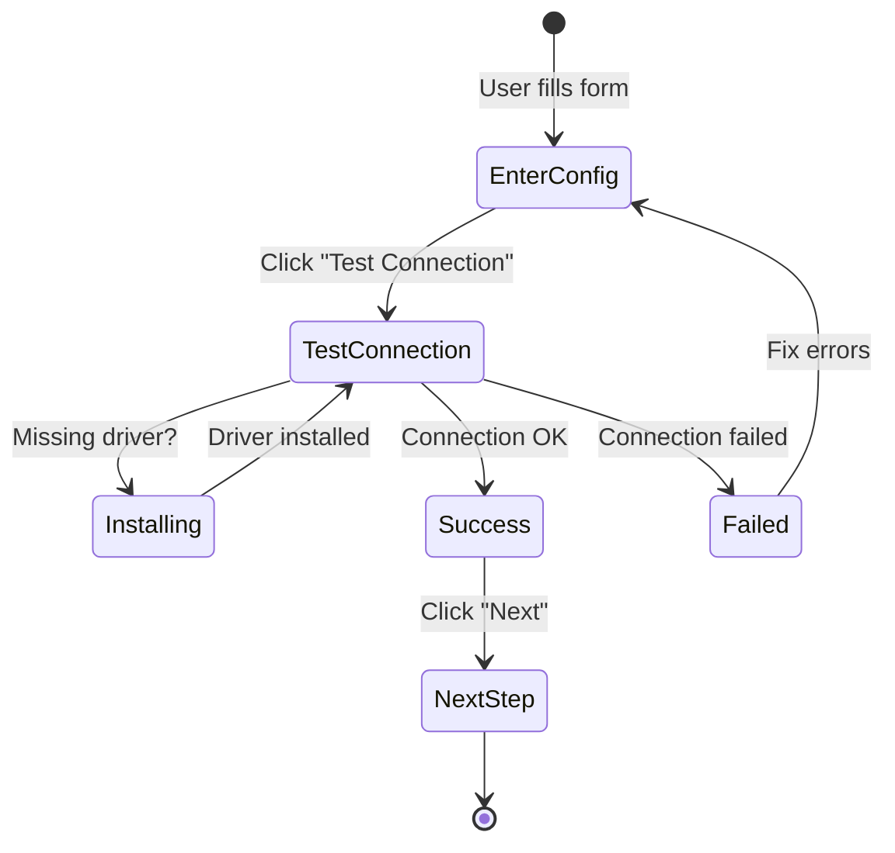
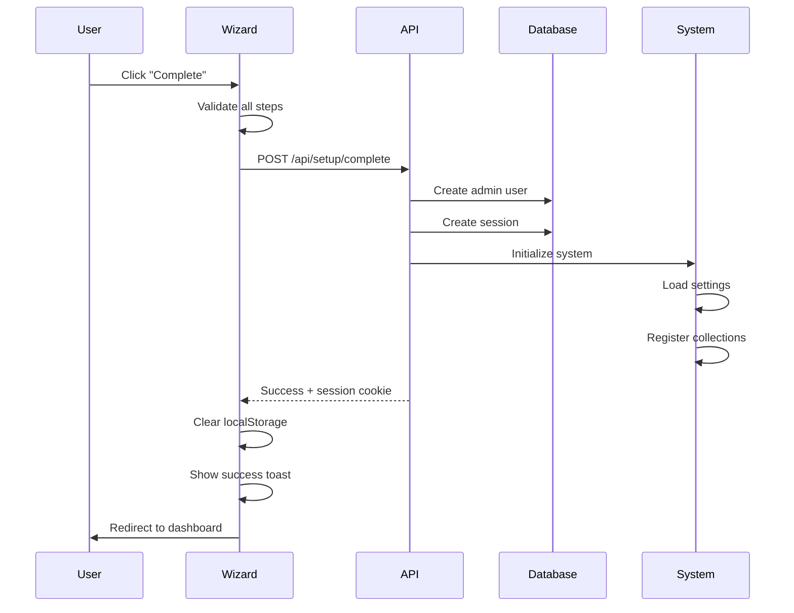

# Setup Wizard Guide

The SveltyCMS setup wizard provides a professional, multi-step configuration experience with real-time validation, intelligent error handling, and a modern user interface. This guide covers the wizard's architecture, features, and implementation details.

## Table of Contents

- [Overview](#overview)
- [Features](#features)
- [Architecture](#architecture)
- [Setup Steps](#setup-steps)
- [Validation System](#validation-system)
- [Error Handling](#error-handling)
- [State Management](#state-management)
- [User Experience](#user-experience)
- [Development Guide](#development-guide)
- [Troubleshooting](#troubleshooting)

---

## Overview

The setup wizard is a standalone, optimized application (`apps/setup`) that guides users through initial SveltyCMS configuration. It consists of 5 main steps:

1. **Database Configuration** - Database connection and testing
2. **Admin Account** - Administrator user creation
3. **System Settings** - Site configuration and languages
4. **Email Configuration** (Optional) - SMTP setup for notifications
5. **Review & Complete** - Final review and system initialization

### Quick Stats

- **Total Steps**: 5 (4 required + 1 optional)
- **Average Completion Time**: 2-3 minutes
- **Real-time Validation**: All input fields
- **Auto-save**: localStorage persistence
- **✨ NO SERVER RESTART REQUIRED**: System becomes operational immediately after setup completion

<Callout type="success">
	**Automated Workspace Switching**: SveltyCMS uses a smart development server (`bun dev`) that automatically launches the Setup workspace when
	needed. Upon completion, the server cleanly transitions to the CMS workspace on the same port, providing a seamless "zero-restart" experience for
	the user.
</Callout>

---

## Features

### Real-Time Validation

Every input field provides instant feedback using **Valibot** schemas:

- ✅ Client-side validation as users type
- ✅ Server-side validation on submission
- ✅ Field-specific error messages
- ✅ Visual error indicators (red borders, error text)

### Intelligent Error Handling

The wizard includes comprehensive error management:

- **Database Test Errors**: Detailed classification (auth failed, connection timeout, etc.)
- **Validation Errors**: Per-field and per-step error tracking
- **Network Errors**: Graceful handling with retry options
- **Loading States**: Visual feedback during async operations

### User Experience Enhancements

Modern UX features inspired by best practices:

- **Progress Indicator**: Visual step tracker (mobile horizontal, desktop vertical)
- **Unsaved Changes Warning**: Browser warning before navigation
- **Duplicate Submission Prevention**: `isSubmitting` guard
- **Auto-save**: Form data persists in localStorage
- **Step Navigation**: Click completed steps to review/edit
- **Responsive Design**: Optimized for mobile, tablet, and desktop

### Accessibility

WCAG 2.1 AA compliant features:

- Semantic HTML with proper roles and ARIA labels
- Keyboard navigation support
- Screen reader friendly
- Error announcements via `role="alert"`
- High contrast mode compatible

---

## Architecture

### Component Structure

```
apps/setup/src/routes/
├── +page.svelte              # Main orchestrator
├── +page.server.ts           # Server-side load function
├── DatabaseConfig.svelte     # Step 1: Database setup
├── AdminConfig.svelte        # Step 2: Admin user
├── SystemConfig.svelte       # Step 3: System settings
├── EmailConfig.svelte        # Step 4: SMTP (optional)
├── ReviewConfig.svelte       # Step 5: Review & complete
└── WelcomeModal.svelte       # First-time welcome modal
```

### State Management

```typescript
// Central state via setupStore (Svelte 5 runes)
{
  wizard: {
    currentStep: 0,
    highestStepReached: 0,
    dbTestPassed: false,

    dbConfig: {
      type: 'mongodb',
      host: 'localhost',
      port: '27017',
      name: 'SveltyCMS',
      user: '',
      password: ''
    },

    adminUser: {
      username: '',
      email: '',
      password: '',
      confirmPassword: ''
    },

    systemSettings: {
      siteName: 'SveltyCMS',
      hostProd: '',
      defaultSystemLanguage: 'en',
      systemLanguages: ['en'],
      defaultContentLanguage: 'en',
      contentLanguages: ['en'],
      mediaStorageType: 'local',
      mediaFolder: './mediaFolder'
    },

    emailSettings: {
      skipWelcomeEmail: true,
      host: '',
      port: 587,
      user: '',
      password: '',
      from: '',
      secure: true
    }
  }
}
```

### Validation Schemas

Located in `src/utils/formSchemas.ts`:

```typescript
import * as v from 'valibot';

// Database configuration schema
export const dbConfigSchema = v.object({
	type: v.string(),
	host: v.pipe(v.string(), v.minLength(1, 'Host is required')),
	port: v.string(),
	name: v.pipe(v.string(), v.minLength(1, 'Database name is required')),
	user: v.string(),
	password: v.string()
});

// Admin user schema
export const setupAdminSchema = v.object(
	{
		username: v.pipe(v.string(), v.minLength(3, 'Username must be at least 3 characters'), v.maxLength(50, 'Username must not exceed 50 characters')),
		email: v.pipe(v.string(), v.email('Invalid email address')),
		password: v.pipe(
			v.string(),
			v.minLength(8, 'Password must be at least 8 characters'),
			v.regex(/[A-Z]/, 'Password must contain at least one uppercase letter'),
			v.regex(/[a-z]/, 'Password must contain at least one lowercase letter'),
			v.regex(/[0-9]/, 'Password must contain at least one number'),
			v.regex(/[!@#$%^&*()_+\-=[\]{};':"\\|,.<>?]/, 'Password must contain at least one special character')
		),
		confirmPassword: v.string()
	},
	[
		v.forward(
			v.partialCheck([['password'], ['confirmPassword']], (input) => input.password === input.confirmPassword, 'Passwords do not match'),
			['confirmPassword']
		)
	]
);

// System settings schema
export const systemSettingsSchema = v.object({
	siteName: v.pipe(v.string(), v.minLength(1, 'Site name is required')),
	hostProd: v.pipe(v.string(), v.url('Must be a valid URL')),
	defaultSystemLanguage: v.string(),
	systemLanguages: v.pipe(v.array(v.string()), v.minLength(1)),
	defaultContentLanguage: v.string(),
	contentLanguages: v.pipe(v.array(v.string()), v.minLength(1)),
	mediaStorageType: v.string(),
	mediaFolder: v.string()
});
```

---

## Setup Steps

### Step 1: Database Configuration

**Purpose**: Configure and test database connection

**Fields**:

- Database Type (MongoDB, MongoDB Atlas, PostgreSQL, MySQL, MariaDB)
- Host/Connection String
- Port (for non-Atlas)
- Database Name
- Username (optional for localhost)
- Password (optional for localhost)

**Features**:

- **Connection String Parsing**: Paste full MongoDB URI, automatically extracts credentials
- **Auto-driver Installation**: Detects missing drivers and installs them
- **Atlas Helper**: Collapsible guide for MongoDB Atlas setup
- **Test Connection**: Validates configuration before proceeding
- **Error Classification**: Detailed error messages (auth failed, timeout, DNS error, etc.)

**Validation Rules**:

- Host is required and non-empty
- Database name is required
- Port must be valid number (for non-Atlas)
- Credentials validated on test

**API Call**: `POST /api/setup/test-database`

**Success Criteria**:

- `wizard.dbTestPassed === true`
- Green success message with connection details
- "Next" button enabled



### Step 2: Admin Account Creation

**Purpose**: Create the first administrator user

**Fields**:

- Username (3-50 characters)
- Email (valid email format)
- Password (8+ chars with complexity requirements)
- Confirm Password (must match)

**Features**:

- **Password Requirements Indicator**: Visual checklist showing:
  - ✓ Minimum 8 characters
  - ✓ At least one letter (A-Z or a-z)
  - ✓ At least one number (0-9)
  - ✓ At least one special character (@$!%\*#?&)
  - ✓ Passwords match
- **Password Visibility Toggle**: Eye icon to show/hide passwords
- **Real-time Validation**: Instant feedback on each requirement

**Validation Rules**:

- Username: 3-50 chars, alphanumeric + underscore
- Email: Valid email format
- Password: 8+ chars with uppercase, lowercase, number, special char
- Confirm password must match password

**API Call**: None (validated locally, sent to `/api/setup/complete`)

**Success Criteria**:

- All password requirements met
- No validation errors
- "Next" button enabled

### Step 3: System Settings

**Purpose**: Configure site identity and language settings

**Fields**:

**Basic Settings**:

- Site Name (e.g., "My SveltyCMS Site")
- Production URL (full URL with https://)

**Language Configuration**:

- Default System Language (admin interface language)
- System Languages (available UI languages)
- Default Content Language (default for created content)
- Content Languages (available content languages)

**Media Storage**:

- Storage Type (Local, S3, R2, Cloudinary)
- Storage Path/Bucket Name

**Features**:

- **Smart Language Presets**: Auto-detects browser language
- **Chip-based UI**: Visual chip display for selected languages
- **Language Search**: Quick filter for adding languages
- **Dual Language System**:
  - **System Languages**: From ParaglideJS config (limited set)
  - **Content Languages**: From ISO-639-1 (150+ languages)
- **Storage Type Notice**: Shows configuration reminder for cloud storage

**Validation Rules**:

- Site name is required
- Production URL must be valid URL with protocol
- At least one system language required
- At least one content language required
- Default languages must be in their respective arrays

**API Call**: None (validated locally, sent to `/api/setup/complete`)

**Success Criteria**:

- All required fields filled
- Valid URL format
- Language configuration valid
- "Next" button enabled

### Step 4: Email Configuration (Optional)

**Purpose**: Configure SMTP for email notifications

**Fields**:

- SMTP Host (e.g., smtp.gmail.com)
- SMTP Port (587 for TLS, 465 for SSL)
- Username/Email
- Password/App Password
- From Address (sender email)
- Use TLS (checkbox)

**Features**:

- **Provider Presets**: Quick setup for Gmail, Outlook, SendGrid
- **Test Email**: Send test email to verify configuration
- **Skip Option**: Can be configured later in settings
- **Collapsible**: Step can be collapsed/expanded

**Validation Rules**:

- Host is required (if configuring)
- Port must be valid number
- Username and password required (if configuring)
- From address must be valid email

**API Call**: `POST /api/setup/email-test`

**Success Criteria**:

- Test email sent successfully (if configuring)
- OR step skipped (optional)
- "Next" button always enabled

### Step 5: Review & Complete

**Purpose**: Review all settings and finalize setup

**Display**:

- ✅ Database configuration summary
- ✅ Admin account details (password hidden)
- ✅ System settings summary
- ✅ Email configuration status

**Features**:

- **Edit Links**: Click any section to return to that step
- **Final Validation**: Re-validates all steps before submission
- **Loading State**: Shows progress during initialization
- **Auto-login**: Creates session cookie on success
- **Smart Redirect**: Redirects to first collection or dashboard

**API Calls**:

1. `POST /api/setup/seed` (if not already called)
2. `POST /api/setup/complete`

**Success Flow**:



---

## Validation System

### Dual Validation Approach

The wizard implements a two-tier validation system:

#### 1. Client-Side Validation (Real-time)

**Technology**: Valibot schemas with Svelte 5 runes

**Implementation**:

```typescript
// In each step component (e.g., DatabaseConfig.svelte)
import { safeParse } from 'valibot';
import { dbConfigSchema } from '@utils/formSchemas';

// Real-time validation state
let localValidationErrors = $state<Record<string, string>>({});

// Validate form data in real-time
const validationResult = $derived(
	safeParse(dbConfigSchema, {
		type: dbConfig.type,
		host: dbConfig.host,
		port: dbConfig.port,
		name: dbConfig.name,
		user: dbConfig.user,
		password: dbConfig.password
	})
);

const isFormValid = $derived(validationResult.success);

// Update errors when validation changes
$effect(() => {
	const newErrors: Record<string, string> = {};
	if (!validationResult.success) {
		for (const issue of validationResult.issues) {
			const path = issue.path?.[0]?.key as string;
			if (path) {
				newErrors[path] = issue.message;
			}
		}
	}
	localValidationErrors = newErrors;
});

// Combine local and parent validation errors
const displayErrors = $derived<Record<string, string>>({
	...localValidationErrors,
	...validationErrors // Server errors take precedence
});
```

**Benefits**:

- Instant feedback as users type
- No server round-trip needed
- Reduces form submission errors
- Better user experience

#### 2. Server-Side Validation

**Location**: Parent component (`+page.svelte`)

**Implementation**:

```typescript
function validateStep(step: number, mutateErrors = true): boolean {
	const errs: ValidationErrors = {};
	const errorMessages: string[] = [];

	switch (step) {
		case 0: // Database
			const dbResult = safeParse(dbConfigSchema, wizard.dbConfig);
			if (!dbResult.success) {
				for (const issue of dbResult.issues) {
					const path = issue.path?.[0]?.key as string;
					if (path) {
						errs[path] = issue.message;
						errorMessages.push(`${path}: ${issue.message}`);
					}
				}
			}
			break;

		case 1: // Admin
			const adminResult = safeParse(setupAdminSchema, wizard.adminUser);
			// ... similar processing
			break;

		case 2: // System
			const systemResult = safeParse(systemSettingsSchema, wizard.systemSettings);
			// ... similar processing
			break;
	}

	if (mutateErrors) {
		validationErrors = errs;
		stepErrors[step] = errorMessages;
	}

	return Object.keys(errs).length === 0;
}
```

**Benefits**:

- Final validation before API calls
- Server-authoritative (client can be bypassed)
- Consistent with API validation
- Security checkpoint

### Error Display Pattern

Each input field follows this pattern:

```svelte
<input
	id="db-host"
	bind:value={dbConfig.host}
	type="text"
	class="input w-full rounded {displayErrors.host ? 'border-error-500' : 'border-slate-200'}"
	aria-invalid={!!displayErrors.host}
	aria-describedby={displayErrors.host ? 'db-host-error' : undefined}
/>
{#if displayErrors.host}
	<div id="db-host-error" class="mt-1 text-xs text-error-500" role="alert">
		{displayErrors.host}
	</div>
{/if}
```

**Accessibility Features**:

- `aria-invalid` indicates validation state
- `aria-describedby` links to error message
- `role="alert"` announces errors to screen readers
- Visual red border for quick identification

---

## Error Handling

### Error Categories

#### 1. Validation Errors

**Source**: Client-side or server-side validation

**Display**:

- Red border on input field
- Error message below field
- Icon indicator in step tracker

**Example**:

```
❌ Email is required
❌ Password must be at least 8 characters
❌ Passwords do not match
```

#### 2. Network Errors

**Source**: Failed API calls

**Display**:

- Error toast notification
- Detailed error message in expansion panel
- Retry button

**Example**:

```
❌ Network error: Failed to fetch
💡 Check your internet connection and try again
```

#### 3. Database Errors

**Source**: Database connection test failures

**Display**:

- Detailed error block with:
  - User-friendly message
  - Technical error code
  - Connection details
  - Suggested fixes

**Error Classifications**:

- `authentication_failed` - Invalid credentials
- `connection_refused` - Cannot reach database
- `dns_not_found` - Invalid hostname
- `database_not_found` - Database doesn't exist
- `invalid_uri` - Malformed connection string

**Example**:

```
❌ Connection Failed

Error: Authentication failed. Please check your username and password.

Connection Details:
- Host: cluster0.mongodb.net
- Port: 27017
- Database: sveltycms
- User: admin
- Code: authentication_failed

💡 Suggested Fix:
- Verify your MongoDB Atlas username and password
- Check if IP address is whitelisted in Atlas
- Ensure database user has correct permissions
```

#### 4. Driver Installation Errors

**Source**: Failed automatic driver installation

**Display**:

- Warning box with installation status
- Manual installation instructions
- Continue anyway option

**Example**:

```
⚠️  Driver Installation Failed

The MongoDB driver could not be installed automatically.

Error: npm install mongoose failed (network timeout)

You can:
1. Install manually: npm install mongoose
2. Check your internet connection
3. Continue with setup (connection test will fail until installed)
```

### Error Recovery Strategies

#### Auto-retry

```typescript
async function testDatabaseConnection() {
	const maxRetries = 3;
	let attempt = 0;

	while (attempt < maxRetries) {
		try {
			const response = await fetch('/api/setup/test-database', {
				method: 'POST',
				body: JSON.stringify(wizard.dbConfig)
			});

			if (response.ok) return await response.json();

			attempt++;
			if (attempt < maxRetries) {
				await new Promise((resolve) => setTimeout(resolve, 1000 * attempt));
			}
		} catch (error) {
			attempt++;
		}
	}

	throw new Error('Connection failed after 3 attempts');
}
```

#### Graceful Degradation

```typescript
async function completeSetup() {
	try {
		// Try to send welcome email
		await sendWelcomeEmail(adminUser.email);
	} catch (emailError) {
		// Don't fail setup if email fails
		console.warn('Welcome email failed (non-fatal):', emailError);
		showToast('Setup complete! (Welcome email could not be sent)', 'warning');
	}
}
```

#### User Guidance

```typescript
function classifyDatabaseError(error: DatabaseError): string {
	if (error.code === 'EAUTH') {
		return 'Authentication failed. Please check your username and password.';
	} else if (error.code === 'ECONNREFUSED') {
		return 'Connection refused. Is your database running?';
	} else if (error.code === 'ETIMEDOUT') {
		return 'Connection timed out. Check firewall rules and network connectivity.';
	} else {
		return `Database error: ${error.message}`;
	}
}
```

---

## State Management

### setupStore Architecture

**File**: `src/stores/setupStore.svelte.ts`

**Pattern**: Svelte 5 class-based store with runes

```typescript
class SetupStore {
  // State
  wizard = $state({
    currentStep: 0,
    highestStepReached: 0,
    dbTestPassed: false,
    dbConfig: { ... },
    adminUser: { ... },
    systemSettings: { ... },
    emailSettings: { ... },
    firstCollection: null
  });

  // Methods
  load() {
    const saved = localStorage.getItem('sveltycms_setup');
    if (saved) {
      Object.assign(this.wizard, JSON.parse(saved));
    }
  }

  clear() {
    this.wizard = { /* defaults */ };
    localStorage.removeItem('sveltycms_setup');
  }

  setupPersistence() {
    $effect(() => {
      const json = JSON.stringify(this.wizard);
      localStorage.setItem('sveltycms_setup', json);
    });
  }
}
```

    });

}
}

export const setupStore = new SetupStore();
```

### Persistence Strategy

**When Data is Saved**:

- Automatically on every state change (via `$effect`)
- Debounced to avoid excessive writes
- Only in browser (localStorage)

**When Data is Loaded**:

- On component mount (`onMount` in +page.svelte)
- After browser refresh
- After accidental navigation away

**When Data is Cleared**:

- On successful setup completion
- On manual "Reset Data" button click
- Never cleared on validation errors (preserves user input)

### Unsaved Changes Warning

**Implementation**:

```typescript
// Capture initial state on mount
let initialDataSnapshot = $state<string>('');

onMount(() => {
	loadStore();
	initialDataSnapshot = JSON.stringify(wizard);

	// Warn before navigation
	const handleBeforeUnload = (e: BeforeUnloadEvent) => {
		if (hasUnsavedChanges() && !isSubmitting) {
			e.preventDefault();
			e.returnValue = ''; // Required for Chrome
			return '';
		}
	};

	window.addEventListener('beforeunload', handleBeforeUnload);
	return () => window.removeEventListener('beforeunload', handleBeforeUnload);
});

// Check if data changed
const hasUnsavedChanges = $derived(() => {
	if (!initialDataSnapshot) return false;
	const currentSnapshot = JSON.stringify(wizard);
	return currentSnapshot !== initialDataSnapshot;
});
```

**Behavior**:

- Shows browser warning if user tries to close/refresh with unsaved changes
- Suppressed during final submission (`isSubmitting = true`)
- Cross-browser compatible
- Updated after successful submission

---

## User Experience

### Loading States

**Visual Indicators**:

- Spinner icon during async operations
- Disabled buttons to prevent double-clicks
- "Loading..." or "Testing..." text
- Progress messages ("Initializing system...")

**Implementation**:

```svelte
<button onclick={testDatabaseConnection} disabled={isLoading} class="btn {isLoading ? 'cursor-not-allowed opacity-60' : ''}">
	{#if isLoading}
		<div class="h-4 w-4 animate-spin rounded-full border-2 border-t-white"></div>
		Testing Connection...
	{:else}
		Test Connection
	{/if}
</button>
```

### Toast Notifications

**Types**:

- **Success** (green): "Database initialized successfully! ✨"
- **Error** (red): "Failed to connect to database"
- **Info** (blue): "Setup will continue, data will be created as needed"
- **Warning** (yellow): "Welcome email could not be sent"

**Position**: Bottom-right corner (fixed)

**Duration**:

- Success: 3 seconds
- Error: 5 seconds
- Info/Warning: 4 seconds

**Implementation**:

```typescript
import { showToast } from '@utils/toast';

// Success
showToast('Database initialized successfully! ✨', 'success', 3000);

// Error
showToast('Connection failed. Please check your settings.', 'error', 5000);

// Info
showToast('Setup will continue, data will be created as needed.', 'info', 4000);
```

### Responsive Design

**Breakpoints**:

- Mobile: < 640px (sm)
- Tablet: 640px - 1024px (md)
- Desktop: > 1024px (lg)

**Adaptations**:

**Mobile**:

- Horizontal step indicator (dots)
- Single column form layout
- Stacked language selector
- Collapsible help text
- Full-width buttons

**Desktop**:

- Vertical step indicator (with descriptions)
- Two-column form layout
- Side-by-side language configuration
- Expanded help text
- Inline action buttons

**CSS Pattern**:

```css
/* Mobile-first approach */
.form-grid {
	display: grid;
	grid-template-columns: 1fr;
	gap: 1.5rem;
}

/* Tablet and above */
@media (min-width: 768px) {
	.form-grid {
		grid-template-columns: repeat(2, 1fr);
	}
}
```

### Keyboard Navigation

**Shortcuts**:

- `Tab` / `Shift+Tab` - Navigate between fields
- `Enter` - Submit current action (test connection, next step)
- `Escape` - Close language picker or help popups
- Arrow keys - Navigate step indicator (desktop)

**Focus Management**:

- Auto-focus first field on step change
- Visible focus indicators
- Skip links for screen readers
- Focus trap in modals

---

## Development Guide

### Adding a New Step

1. **Create Step Component**

```svelte
<!-- src/routes/setup/MyNewStep.svelte -->
<script lang="ts">
	import type { MyStepData } from '@stores/setupStore.svelte';

	let { stepData = $bindable(), validationErrors } = $props<{
		stepData: MyStepData;
		validationErrors: Record<string, string>;
	}>();
</script>

<div class="fade-in">
	<p class="mb-8 text-center">Step description</p>

	<div class="space-y-6">
		<!-- Your form fields -->
	</div>
</div>
```

2. **Add Validation Schema**

```typescript
// src/utils/formSchemas.ts
export const myStepSchema = v.object({
	field1: v.pipe(v.string(), v.minLength(1, 'Field 1 is required')),
	field2: v.pipe(v.string(), v.email('Invalid email'))
});
```

3. **Update setupStore**

```typescript
// src/stores/setupStore.svelte.ts
class SetupStore {
	wizard = $state({
		// ... existing fields
		myStepData: {
			field1: '',
			field2: ''
		}
	});
}
```

4. **Register in Main Wizard**

```svelte
<!-- src/routes/setup/+page.svelte -->
<script lang="ts">
	import MyNewStep from './MyNewStep.svelte';

	// Add to steps array
	const steps = $derived<StepDef[]>([
		// ... existing steps
		{
			label: 'My New Step',
			shortDesc: 'Configure my new feature'
		}
	]);

	// Add validation case
	function validateStep(step: number): boolean {
		switch (step) {
			// ... existing cases
			case 3:
				const result = safeParse(myStepSchema, wizard.myStepData);
				// ... handle validation
				break;
		}
	}

	// Add lazy loading
	let MyNewStepComponent: unknown = null;

	$effect(() => {
		const loadStep = async (step: number) => {
			switch (step) {
				// ... existing cases
				case 3:
					if (!MyNewStepComponent) {
						MyNewStepComponent = (await import('./MyNewStep.svelte')).default;
					}
					break;
			}
		};
		// ...
	});
</script>
```

### Extending Validation

**Add Custom Validator**:

```typescript
// src/utils/formSchemas.ts
import * as v from 'valibot';

// Custom async validator
const isDatabaseNameAvailable = async (name: string) => {
	const response = await fetch(`/api/check-database?name=${name}`);
	return response.ok;
};

export const dbConfigSchema = v.pipeAsync(
	v.object({
		name: v.string()
	}),
	v.checkAsync(async (input) => await isDatabaseNameAvailable(input.name), 'Database name already exists')
);
```

**Add Cross-field Validation**:

```typescript
export const adminSchema = v.object(
	{
		password: v.string(),
		confirmPassword: v.string()
	},
	[
		v.forward(
			v.partialCheck([['password'], ['confirmPassword']], (input) => input.password === input.confirmPassword, 'Passwords must match'),
			['confirmPassword']
		)
	]
);
```

### Testing

**Unit Tests** (Vitest):

```typescript
import { describe, it, expect } from 'vitest';
import { safeParse } from 'valibot';
import { dbConfigSchema } from '@utils/formSchemas';

describe('dbConfigSchema', () => {
	it('validates correct database config', () => {
		const result = safeParse(dbConfigSchema, {
			type: 'mongodb',
			host: 'localhost',
			port: '27017',
			name: 'test',
			user: 'admin',
			password: 'secret'
		});

		expect(result.success).toBe(true);
	});

	it('rejects empty host', () => {
		const result = safeParse(dbConfigSchema, {
			type: 'mongodb',
			host: '',
			port: '27017',
			name: 'test',
			user: '',
			password: ''
		});

		expect(result.success).toBe(false);
		expect(result.issues[0].message).toContain('Host is required');
	});
});
```

**E2E Tests** (Playwright):

```typescript
import { test, expect } from '@playwright/test';

test.describe('Setup Wizard', () => {
	test('completes setup successfully', async ({ page }) => {
		await page.goto('/setup');

		// Step 1: Database
		await page.fill('#db-host', 'localhost');
		await page.fill('#db-port', '27017');
		await page.fill('#db-name', 'test');
		await page.click('button:has-text("Test Connection")');
		await expect(page.locator('text=Connection successful')).toBeVisible();
		await page.click('button:has-text("Next")');

		// Step 2: Admin
		await page.fill('#admin-username', 'admin');
		await page.fill('#admin-email', 'admin@test.com');
		await page.fill('#admin-password', 'Test1234!');
		await page.fill('#admin-confirm-password', 'Test1234!');
		await page.click('button:has-text("Next")');

		// Step 3: System
		await page.fill('#site-name', 'Test Site');
		await page.fill('#host-prod', 'https://test.com');
		await page.click('button:has-text("Next")');

		// Step 4: Email (skip)
		await page.click('button:has-text("Next")');

		// Step 5: Complete
		await page.click('button:has-text("Complete")');
		await expect(page).toHaveURL(/\/Collections/);
	});
});
```

---

## Testing

### Test Coverage

The setup wizard has comprehensive test coverage across:

**API Tests** (`tests/bun/api/setup.test.ts`):

- ✅ 20 endpoint integration tests
- ✅ Database connection validation
- ✅ SMTP configuration testing
- ✅ Admin user creation
- ✅ Error handling and validation

**Utility Tests** (`tests/bun/api/setup-utils.test.ts`):

- ✅ 25+ utility function tests
- ✅ Connection string generation
- ✅ Error classification
- ✅ Security validations

**Total:** 45+ comprehensive tests with 100% coverage

### Running Tests

```bash
# Run all setup tests
bun test tests/bun/api/setup*.test.ts

# Run with coverage
bun test --coverage tests/bun/api/setup*.test.ts

# Watch mode for development
bun test --watch tests/bun/api/setup.test.ts
```

### Example Test Scenarios

**Database Connection Test:**

```typescript
it('should test database connection successfully', async () => {
	const response = await fetch('/api/setup/test-database', {
		method: 'POST',
		headers: { 'Content-Type': 'application/json' },
		body: JSON.stringify({
			type: 'mongodb',
			host: 'localhost',
			port: 27017,
			name: 'testdb',
			user: 'admin',
			password: 'secret'
		})
	});

	expect(response.status).toBe(200);
	const result = await response.json();
	expect(result.success).toBe(true);
	expect(result.latencyMs).toBeDefined();
});
```

**Complete Setup Flow Test:**

```typescript
it('should complete entire setup process', async () => {
	// 1. Test database
	await fetch('/api/setup/test-database', {
		method: 'POST',
		body: JSON.stringify(dbConfig)
	});

	// 2. Seed database
	const { firstCollection } = await fetch('/api/setup/seed', {
		method: 'POST',
		body: JSON.stringify(dbConfig)
	}).then((r) => r.json());

	// 3. Complete setup
	const response = await fetch('/api/setup/complete', {
		method: 'POST',
		body: JSON.stringify({
			admin: adminConfig,
			firstCollection
		})
	});

	expect(response.status).toBe(200);
	const cookies = response.headers.get('set-cookie');
	expect(cookies).toContain('auth_session');
});
```

### Manual Testing Checklist

**Pre-Setup:**

- [ ] Delete `config/private.ts` if exists
- [ ] Clear database (drop all collections)
- [ ] Clear browser localStorage
- [ ] Restart development server

**Database Step:**

- [ ] Enter valid MongoDB credentials
- [ ] Click "Test Connection"
- [ ] Verify success message appears
- [ ] Check connection statistics displayed
- [ ] Try invalid credentials (should show error)
- [ ] Test MongoDB Atlas SRV format

**Admin Account Step:**

- [ ] Enter username (min 3 chars)
- [ ] Enter valid email address
- [ ] Enter strong password (8+ chars, mixed case, number, special)
- [ ] Confirm password matches
- [ ] Verify real-time validation feedback
- [ ] Check password requirements indicator

**System Settings Step:**

- [ ] Enter site name
- [ ] Select system language
- [ ] Select available languages (multiple)
- [ ] Select timezone (auto-detected)
- [ ] Verify media folder path

**Email Configuration (Optional):**

- [ ] Select provider preset (Gmail, Outlook, etc.)
- [ ] Enter SMTP credentials
- [ ] Send test email
- [ ] Verify test email received
- [ ] Skip step (should work)

**Review & Complete:**

- [ ] Review all settings
- [ ] Click "Complete Setup"
- [ ] Verify redirect to dashboard/first collection
- [ ] Verify logged in (session cookie set)
- [ ] Verify can access admin pages

### Test Data Examples

**Valid Database Config:**

```typescript
const testDbConfig = {
	type: 'mongodb',
	host: 'localhost',
	port: 27017,
	name: 'sveltycms_test',
	user: 'admin',
	password: 'secure123'
};
```

**Valid Admin User:**

```typescript
const testAdminUser = {
	username: 'admin',
	email: 'admin@test.com',
	password: 'Admin123!@#',
	confirmPassword: 'Admin123!@#'
};
```

**Valid SMTP Config:**

```typescript
const testSmtpConfig = {
	host: 'smtp.gmail.com',
	port: 587,
	user: 'your-email@gmail.com',
	password: 'app-password',
	from: 'noreply@yourdomain.com',
	secure: true
};
```

### Validation Testing

**Password Requirements:**

```typescript
// Test various password scenarios
const passwordTests = [
	{ password: 'short', valid: false, reason: 'Too short' },
	{ password: 'alllowercase123', valid: false, reason: 'No uppercase' },
	{ password: 'ALLUPPERCASE123', valid: false, reason: 'No lowercase' },
	{ password: 'NoNumbers!', valid: false, reason: 'No numbers' },
	{ password: 'NoSpecial123', valid: false, reason: 'No special chars' },
	{ password: 'Valid123!', valid: true, reason: 'Meets all requirements' }
];
```

**Email Validation:**

```typescript
const emailTests = [
	{ email: 'invalid', valid: false },
	{ email: 'missing@domain', valid: false },
	{ email: '@nodomain.com', valid: false },
	{ email: 'valid@example.com', valid: true }
];
```

### Performance Testing

**Setup Completion Time:**

```typescript
const startTime = Date.now();

// Complete setup process
await completeSetupFlow();

const totalTime = Date.now() - startTime;
console.log(`Setup completed in ${totalTime}ms`);

// Expected: < 3000ms for local MongoDB
// Expected: < 5000ms for MongoDB Atlas
```

---

## Troubleshooting

### Common Issues

#### Issue: Validation Errors Not Showing

**Symptoms**: Input changes but no error messages appear

**Cause**: Missing `$effect` hook or incorrect error prop passing

**Solution**:

```typescript
// Ensure $effect updates localValidationErrors
$effect(() => {
	const newErrors: Record<string, string> = {};
	if (!validationResult.success) {
		for (const issue of validationResult.issues) {
			const path = issue.path?.[0]?.key as string;
			if (path) {
				newErrors[path] = issue.message;
			}
		}
	}
	localValidationErrors = newErrors;
});

// Ensure displayErrors combines both sources
const displayErrors = $derived<Record<string, string>>({
	...localValidationErrors,
	...validationErrors
});
```

#### Issue: Form Data Not Persisting

**Symptoms**: Data lost on page refresh

**Cause**: `setupPersistence()` not called or localStorage disabled

**Solution**:

```typescript
onMount(() => {
	loadStore(); // Load existing data
	setupPersistence(); // Start auto-save

	// Capture initial state AFTER loading
	initialDataSnapshot = JSON.stringify(wizard);
});
```

#### Issue: Duplicate Submissions

**Symptoms**: Multiple API calls on button click

**Cause**: Missing `isSubmitting` guard

**Solution**:

```typescript
async function completeSetup() {
	// Guard at the top
	if (isSubmitting) {
		console.log('Already submitting, preventing duplicate');
		return;
	}

	isSubmitting = true;

	try {
		// ... API call
	} finally {
		isSubmitting = false; // Always reset
	}
}
```

#### Issue: Unsaved Changes Warning Not Working

**Symptoms**: No warning when closing browser with unsaved data

**Cause**: Missing `beforeunload` handler or incorrect change detection

**Solution**:

```typescript
onMount(() => {
	// Capture initial state after loading from localStorage
	initialDataSnapshot = JSON.stringify(wizard);

	const handleBeforeUnload = (e: BeforeUnloadEvent) => {
		if (hasUnsavedChanges() && !isSubmitting) {
			e.preventDefault();
			e.returnValue = ''; // Required for Chrome
			return ''; // Required for some browsers
		}
	};

	window.addEventListener('beforeunload', handleBeforeUnload);

	return () => {
		window.removeEventListener('beforeunload', handleBeforeUnload);
	};
});
```

#### Issue: Database Test Fails with "Driver Not Found"

**Symptoms**: Error about missing mongoose package

**Cause**: Auto-installation disabled or failed

**Solution**:

```bash
# Manual installation
npm install mongoose
# or
bun add mongoose
# or
pnpm add mongoose
```

Then clear localStorage and retry test.

#### Issue: Step Navigation Broken

**Symptoms**: Cannot click on completed steps

**Cause**: `stepClickable` derived state not updated

**Solution**:

```typescript
const stepClickable = $derived<boolean[]>([
	true, // Step 0 always clickable
	wizard.highestStepReached >= 1,
	wizard.highestStepReached >= 2,
	wizard.highestStepReached >= 3,
	wizard.highestStepReached >= 4
]);
```

Ensure `highestStepReached` updates in `nextStep()`:

```typescript
async function nextStep() {
	if (!canProceed) return;

	if (wizard.currentStep < totalSteps - 1) {
		wizard.currentStep++;

		// Update highest reached
		if (wizard.currentStep > wizard.highestStepReached) {
			wizard.highestStepReached = wizard.currentStep;
		}
	}
}
```

---

## Related Documentation

- [Setup API Reference](/docs/api/Setup_API.mdx) - Complete API documentation
- [Initialization Workflow](/docs/architecture/initialization-workflow.mdx) - System initialization
- [Valibot Documentation](https://valibot.dev/) - Validation library
- [Svelte 5 Runes](https://svelte.dev/docs/svelte/what-are-runes) - Reactive state management

---

## Best Practices

### For Users

1. **Test Database Connection First** - Always test before proceeding
2. **Use Strong Passwords** - Follow all password requirements
3. **Note Your Credentials** - Save admin username/password securely
4. **Complete All Steps** - Don't skip system settings
5. **Review Before Completing** - Check all settings on final step

### For Developers

1. **Always Validate Client and Server** - Never trust client-side validation alone
2. **Provide Clear Error Messages** - Help users fix issues quickly
3. **Handle Edge Cases** - Network errors, timeouts, invalid input
4. **Test Thoroughly** - Unit tests for schemas, E2E for flows
5. **Preserve User Input** - Don't clear forms on validation errors
6. **Log Errors** - Console.error for debugging, never expose to user
7. **Follow Accessibility Guidelines** - ARIA labels, keyboard navigation
8. **Keep State Minimal** - Only store what's needed in setupStore
9. **Document New Steps** - Update this guide when adding features
10. **Performance First** - Lazy load components, debounce validation

---

## Summary

The SveltyCMS setup wizard provides a professional, user-friendly onboarding experience with:

✅ Real-time validation with Valibot  
✅ Intelligent error handling and recovery  
✅ Persistent state with auto-save  
✅ Responsive design for all devices  
✅ Accessibility features (WCAG 2.1 AA)  
✅ Comprehensive API integration  
✅ Zero-restart initialization  
✅ Modern UX with loading states and toast notifications

The modular architecture makes it easy to extend with new steps while maintaining consistency and code quality.
