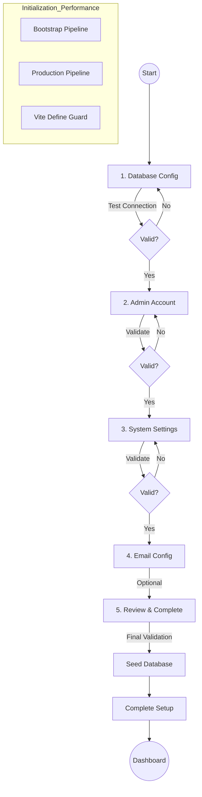

<!-- lint:disable heading-density -->
<!-- NOTE: consider splitting into sub-pages -->

# Setup Wizard Guide

The SveltyCMS setup wizard provides a professional, multi-step configuration experience with real-time validation, intelligent error handling, and a modern user interface. This guide covers the wizard's architecture, features, and implementation details.

## Table of Contents

- [Overview](#overview)
- [Features](#features)
- [Architecture](#architecture)
- [Setup Steps](#setup-steps)
- [Solution Presets](#solution-presets-starter-kits)
- [Validation System](#validation-system)
- [Error Handling](#error-handling)
- [State Management](#state-management-2)
- [User Experience](#user-experience)
- [Development Guide](#development-guide)
- [Troubleshooting](#troubleshooting)

---

## Overview

The setup wizard is a multi-step form that guides users through initial SveltyCMS configuration. It consists of 5 main steps:

1. **Database Configuration** - Database connection and testing
2. **Admin Account** - Administrator user creation
3. **System Settings** - Site configuration and languages
4. **Email Configuration** (Optional) - SMTP setup for notifications
5. **Review & Complete** - Final review and system initialization

### Setup Wizard Flow


```mermaid
flowchart TD
    Start((Start)) --> DB[1. Database Config]
    DB --> |Test Connection| DBCheck{Valid?}
    DBCheck -->|No| DB
    DBCheck -->|Yes| Admin[2. Admin Account]
    Admin --> |Validate| AdminCheck{Valid?}
    AdminCheck -->|No| Admin
    AdminCheck -->|Yes| System[3. System Settings]
    System --> |Validate| SystemCheck{Valid?}
    SystemCheck -->|No| System
    SystemCheck -->|Yes| Email[4. Email Config]
    Email --> |Optional| Review[5. Review & Complete]
    Review --> |Final Validation| Seed[Seed Database]
    Seed --> Complete[Complete Setup]
    Complete --> Redirect((Dashboard))

    subgraph Initialization_Performance
        B[Bootstrap Pipeline]
        P[Production Pipeline]
        V[Vite Define Guard]
    end
```

### High-Performance Lifecycle

SveltyCMS employs a "State-Aware" initialization strategy to ensure the setup wizard is ultra-responsive while the production environment remains enterprise-grade.

```
sequenceDiagram
    participant V as Vite / Build
    participant H as hooks.server.ts
    participant D as db-init.ts
    participant U as User

    Note over V, U: PHASE 1: FRESH INSTALL
    V->>H: __SVELTY_SETUP_COMPLETE__ = false
    H->>H: Select "Bootstrap Pipeline" (Minimal)
    H->>U: Redirect to /setup
    U->>H: POST /setup (Complete)
    H->>V: Write config/private.ts
    V->>V: Hot Restart / Reload

    Note over V, U: PHASE 2: PRODUCTION BOOT
    V->>H: __SVELTY_SETUP_COMPLETE__ = true
    H->>H: Select "Full Pipeline" (Enterprise)
    H->>D: Trigger ensureFullInitialization()
    D->>D: Topological Phased Boot (READY)
    H->>U: Serve Dashboard (Full Speed)

    Note over V, U: PHASE 3: STEADY STATE
    U->>H: Incoming Request
    H->>H: Fast Check: __SVELTY_SETUP_COMPLETE__ (Zero I/O)
    H->>H: Execute Turbo Pipeline (~0.05ms)
```

#### Performance Benchmarks

Based on `tests/benchmarks/hooks-performance.test.ts`, the setup-aware gating achieves significantly lower latency for fresh installs:

| Pipeline      | Features                      | Avg Latency | Context                 |
| :------------ | :---------------------------- | :---------- | :---------------------- |
| **Bootstrap** | Health, Security, Compression | **< 0.1ms** | During /setup phase     |
| **Turbo**     | Fast-path routing, Assets     | **~0.05ms** | Production steady-state |
| **Full**      | Auth, Audit, Content, SDK     | **~1.2ms**  | Standard API operations |

<Callout type="info">
  **Zero-I/O Optimization**: By injecting the setup status via Vite's `define` constant, we
  eliminate the need to check for `private.ts` on every request. This reduces I/O pressure on the
  filesystem, especially critical for high-concurrency environments.
</Callout>

### Quick Stats

- **Total Steps**: 5 (4 required + 1 optional)
- **Average Completion Time**: 2-3 minutes
- **Real-time Validation**: All input fields
- **Auto-save**: localStorage persistence
- **✨ NO SERVER RESTART REQUIRED**: System becomes operational immediately after setup completion

<Callout type="success">
  **Process Reinitialization & Vite HMR**: In development, when SveltyCMS writes
  `config/private.ts`, Vite triggers an asynchronous dev server hot-restart. To prevent database
  initialization race conditions and ensure setup data is committed to the correct target, SveltyCMS
  programmatically unlinks config caches and executes `reinitializeSystem()` upon setup completion.
  In production, SveltyCMS loads configs dynamically on startup, transitioning cleanly without
  downtime.
</Callout>

---

## Features

### Real-Time Validation

Every input field provides instant feedback using **Valibot** schemas:

- ✅ Client-side validation as users type
- ✅ Server-side validation on submission
- ✅ Field-specific error messages
- ✅ Visual error indicators (red borders, error text)

### Intelligent Error Handling

The wizard includes comprehensive error management:

- **Database Test Errors**: Detailed classification (auth failed, connection timeout, etc.)
- **Validation Errors**: Per-field and per-step error tracking
- **Network Errors**: Graceful handling with retry options
- **Loading States**: Visual feedback during async operations

### User Experience Enhancements

Modern UX features inspired by best practices:

- **Progress Indicator**: Visual step tracker (mobile horizontal, desktop vertical)
- **Unsaved Changes Warning**: Browser warning before navigation
- **Duplicate Submission Prevention**: `isSubmitting` guard
- **Auto-save**: Form data persists in localStorage
- **Step Navigation**: Click completed steps to review/edit
- **Responsive Design**: Optimized for mobile, tablet, and desktop

### Accessibility

WCAG 2.1 AA compliant features:

- Semantic HTML with proper roles and ARIA labels
- Keyboard navigation support
- Screen reader friendly
- Error announcements via `role="alert"`
- High contrast mode compatible

---

## Architecture

### Component Structure

```
src/routes/setup/
├── +page.svelte               # Main orchestrator UI (Svelte 5 Runes)
├── +page.server.ts            # Consolidated setup actions and DB orchestration
├── database-config.svelte     # Step 1: Database setup with Proxy-Mutex support
├── admin-config.svelte        # Step 2: Admin user with Strength-Validation
├── system-config.svelte       # Step 3: System settings & i18n
├── email-config.svelte        # Step 4: SMTP (optional)
└── review-config.svelte       # Step 5: Review & zero-latency completion

System Hardening:
├── src/databases/db-init.ts   # Topological Phased Boot engine
└── src/databases/config-state.ts # Security-masked configuration loader
```

### State-Aware Initialization

This separation prevents the "Initialization Storm" where multiple requests try to boot the database simultaneously. The **Turbo Pipeline** (introduced in v0.0.8) ensures that setup checks consume **zero CPU/IO cycles** once the system is READY.

### Security Hardening

The setup process includes several enterprise-grade security features:

- **Log Sanitization**: Sensitive values (passwords, connection strings) are excluded from structured log output during setup operations.
- **Secret Redaction**: The configuration loader (`config-state.ts`) prevents raw `private.ts` content from appearing in log streams.
- **Write-Mutex Protection**: SQLite writes during high-pressure setup are serialized via transaction management to prevent "Database is Locked" errors.

### State Management {#security-state-mgmt}

```
// Central state via setup-store (Svelte 5 runes)
{
  wizard: {
    dbConfig: {
      type: 'sqlite',
      host: 'config/database',
      port: '',
      name: 'sveltycms.db',
      user: '',
      password: '',
      replicaUrls: []
    },

    adminUser: {
      username: '',
      email: '',
      password: '',
      confirmPassword: ''
    },

    systemSettings: {
      siteName: 'SveltyCMS',
      hostProd: 'https://localhost:5173',
      defaultSystemLanguage: 'en',
      systemLanguages: ['en', 'de'],
      defaultContentLanguage: 'en',
      contentLanguages: ['en', 'de'],
      mediaStorageType: 'local',
      mediaFolder: './mediaFolder',
      preset: 'blank',
      passwordMinLength: 8,
      timezone: 'UTC',
      useRedis: false,
      redisHost: 'localhost',
      redisPort: '6379',
      redisPassword: '',
      multiTenant: false,
      demoMode: false,
      cfApiToken: '',
      cfZoneId: '',
      cfPurgeMode: 'tags'
    },

    emailSettings: {
      smtpConfigured: false,
      skipWelcomeEmail: true,
      host: '',
      port: '587',
      user: '',
      password: '',
      from: '',
      secure: false
    },

    currentStep: 0,
    highestStepReached: 0,
    dbTestPassed: false,
    firstCollection: null
  }
}
```

### Validation Schemas

Located in `src/utils/schemas.ts`:

```
import * as v from "valibot";

// Database configuration schema
export const dbConfigSchema = v.object({
  type: v.picklist(["mongodb", "mongodb+srv", "mariadb", "postgresql", "sqlite"]),
  host: v.pipe(v.string(), v.minLength(1, "Host is required")),
  port: v.pipe(v.number(), v.minValue(1)),
  name: v.pipe(v.string(), v.minLength(1, "Database name is required")),
  user: v.optional(v.string()),
  password: v.optional(v.string()),
});

// Admin user schema
export const setupAdminSchema = v.object(
  {
    username: v.pipe(
      v.string(),
      v.minLength(3, "Username must be at least 3 characters"),
      v.maxLength(50, "Username must not exceed 50 characters"),
    ),
    email: v.pipe(v.string(), v.email("Invalid email address")),
    password: v.pipe(
      v.string(),
      v.minLength(8, "Password must be at least 8 characters"),
      v.regex(/[A-Z]/, "Password must contain at least one uppercase letter"),
      v.regex(/[a-z]/, "Password must contain at least one lowercase letter"),
      v.regex(/[0-9]/, "Password must contain at least one number"),
      v.regex(
        /[!@#$%^&*()_+\-=[\]{};':"\\|,.<>?]/,
        "Password must contain at least one special character",
      ),
    ),
    confirmPassword: v.string(),
  },
  [
    v.forward(
      v.partialCheck(
        [["password"], ["confirmPassword"]],
        (input) => input.password === input.confirmPassword,
        "Passwords do not match",
      ),
      ["confirmPassword"],
    ),
  ],
);

// System settings schema
export const systemSettingsSchema = v.object({
  siteName: v.pipe(v.string(), v.minLength(1, "Site name is required")),
  hostProd: v.pipe(v.string(), v.url("Must be a valid URL")),
  defaultSystemLanguage: v.string(),
  systemLanguages: v.pipe(v.array(v.string()), v.minLength(1)),
  defaultContentLanguage: v.string(),
  contentLanguages: v.pipe(v.array(v.string()), v.minLength(1)),
  mediaStorageType: v.string(),
  mediaFolder: v.string(),
});
```

---

## Setup Steps

### Step 1: Database Configuration

**Purpose**: Configure and test database connection

**fields**:

- Database Type (MongoDB, MongoDB Atlas, PostgreSQL, MySQL, MariaDB)
- Host/Connection String
- Port (for non-Atlas)
- Database Name
- Username (optional for localhost)
- Password (optional for localhost)

**Features**:

- **Connection String Parsing**: Paste full MongoDB URI, automatically extracts credentials
- **Auto-driver Installation**: Detects missing drivers and installs them
- **Atlas Helper**: Collapsible guide for MongoDB Atlas setup
- **Existing Data Detection**: Probes the target database for existing tables or collections before proceeding.
- **Data Overwrite Confirmation**: If existing data is detected, the wizard provides a clear modal warning. Users can choose to **Overwrite** the database (which drops and recreates it) or specify different connection details to prevent accidental data loss.
- **Full Interface Compliance**: Automatically synchronizes theme and folder logic for MongoDB
- **Test Connection**: Validates configuration before proceeding
- **Error Classification**: Detailed error messages (auth failed, timeout, DNS error, etc.)

**Validation Rules**:

- Host is required and non-empty
- Database name is required
- Port must be valid number (for non-Atlas)
- Credentials validated on test

**API Call**: `POST /setup?/testDatabase` (SvelteKit Server Action)

**Success Criteria**:

- `wizard.dbTestPassed === true`
- Green success message with connection details
- "Next" button enabled

```
stateDiagram-v2
    [*] --> EnterConfig: User fills form
    EnterConfig --> TestConnection: Click "Test Connection"
    TestConnection --> Installing: Missing driver?
    Installing --> TestConnection: Driver installed
    TestConnection --> Success: Connection OK
    TestConnection --> Failed: Connection failed
    Failed --> EnterConfig: Fix errors
    Success --> NextStep: Click "Next"
    NextStep --> [*]
```

### Step 2: Admin Account Creation

**Purpose**: Create the first administrator user

**fields**:

- Username (3-50 characters)
- Email (valid email format)
- Password (8+ chars with complexity requirements)
- Confirm Password (must match)

**Features**:

- **Password Requirements Indicator**: Visual checklist showing:
  - ✓ Minimum 8 characters
  - ✓ At least one letter (A-Z or a-z)
  - ✓ At least one number (0-9)
  - ✓ At least one special character (@$!%\*#?&)
  - ✓ Passwords match
- **Password Visibility Toggle**: Eye icon to show/hide passwords
- **Real-time Validation**: Instant feedback on each requirement

**Validation Rules**:

- Username: 3-50 chars, alphanumeric + underscore
- Email: Valid email format
- Password: 8+ chars with uppercase, lowercase, number, special char
- Confirm password must match password

**API Call**: None (validated locally, sent to `/setup?/completeSetup`)

**Success Criteria**:

- All password requirements met
- No validation errors
- "Next" button enabled

### Step 3: System Settings

**Purpose**: Configure site identity and language settings

**fields**:

**Basic Settings**:

- Site Name (e.g., "My SveltyCMS Site")
- Production URL (full URL with https://)

**Language Configuration**:

- Default System Language (admin interface language)
- System Languages (available UI languages)
- Default Content Language (default for created content)
- Content Languages (available content languages)

**Media Storage**:

- Storage Type (Local, S3, R2, Cloudinary)
- Storage Path/Bucket Name

**Features**:

- **Smart Language Presets**: Auto-detects browser language
- **Chip-based UI**: Visual chip display for selected languages
- **Language Search**: Quick filter for adding languages
- **Dual Language System**:
  - **System Languages**: From ParaglideJS config (limited set)
  - **Content Languages**: From ISO-639-1 (150+ languages)
- **Redis Verification**: Optional performance optimization with a dedicated "Test Redis Connection" button to verify host, port, and credentials.
- **Storage Type Notice**: Shows configuration reminder for cloud storage

**Validation Rules**:

- Site name is required
- Production URL must be valid URL with protocol
- At least one system language required
- At least one content language required
- Default languages must be in their respective arrays

**API Call**: None (validated locally, sent to `/setup?/completeSetup`)

**Success Criteria**:

- All required fields filled
- Valid URL format
- Language configuration valid
- "Next" button enabled

### Step 4: Email Configuration (Optional)

**Purpose**: Configure SMTP for email notifications

**fields**:

- SMTP Host (e.g., smtp.gmail.com)
- SMTP Port (587 for TLS, 465 for SSL)
- Username/Email
- Password/App Password
- From Address (sender email)
- Use TLS (checkbox)

**Features**:

- **Provider Presets**: Quick setup for Gmail, Outlook, SendGrid
- **Test Email**: Send test email to verify configuration
- **Skip Option**: Can be configured later in settings
- **Collapsible**: Step can be collapsed/expanded

**Validation Rules**:

- Host is required (if configuring)
- Port must be valid number
- Username and password required (if configuring)
- From address must be valid email

**API Call**: `POST /setup?/testEmail`

**Success Criteria**:

- Test email sent successfully (if configuring)
- OR step skipped (optional)
- "Next" button always enabled

### 5. Review & Complete

**Purpose**: Review all settings and finalize setup

**Display**:

- ✅ Database configuration summary
- ✅ Admin account details (password hidden)
- ✅ System settings summary
- ✅ Email configuration status

**Features**:

- **Edit Links**: Click any section to return to that step
- **Final Validation**: Re-validates all steps before submission
- **Loading State**: Shows progress during initialization
- **Auto-login**: Creates session cookie on success
- **Smart Redirect**: Redirects to first collection or dashboard

---

## 🧪 Automated Testing & E2E

SveltyCMS includes a robust Playwright-based E2E test suite to verify the setup wizard flow. This is critical for CI/CD pipelines to ensure that fresh installations and upgrades remain stable.

### Setup Wizard Test Example

The following test (`tests/e2e/routes/setup/setup-wizard.spec.ts`) demonstrates how to automate the multi-step configuration, including handling modal portals and cookie consent banners:

```
import { expect, test, type Page } from "@playwright/test";

// Helper to click "Next" button and wait for transition
async function clickNext(page: Page) {
  const nextButton = page.getByLabel("Next", { exact: true });
  await expect(nextButton).toBeEnabled();
  await nextButton.click({ force: true });
  await page.waitForTimeout(1000);
}

test("Setup Wizard: Configure DB and Create Admin", async ({ page }) => {
  test.setTimeout(180_000);

  // 1. Start at root, expect redirect to /setup
  await page.goto("/");
  await expect(page).toHaveURL(/\/setup/);

  // Wait for hydration and modals
  await page.waitForTimeout(5000);

  // Dismiss cookie consent if present
  const cookieAcceptBtn = page.getByRole("button", { name: /accept all/i });
  if (await cookieAcceptBtn.isVisible({ timeout: 3000 }).catch(() => false)) {
    await cookieAcceptBtn.click();
  }

  // Handle "Welcome" popup
  const welcomeModal = page.locator("#welcome-heading").first();
  if (await welcomeModal.isVisible({ timeout: 3000 }).catch(() => false)) {
    const getStartedBtn = page
      .locator("button")
      .filter({ hasText: /get started/i })
      .first();
    await getStartedBtn.click({ force: true });
  }

  // --- STEP 1: Database ---
  const dbType = process.env.DB_TYPE || "sqlite";
  await page.getByTestId("db-type").selectOption(dbType);
  await page.getByTestId("db-host").fill("localhost");
  await page.getByTestId("db-name").fill("sveltycms_test");

  const testDbButton = page.getByRole("button", { name: /test database/i });
  await testDbButton.click({ force: true });

  // Handle SQLite missing DB modal
  const confirmBtn = page.getByRole("button", { name: /yes/i });
  if (await confirmBtn.isVisible({ timeout: 5000 }).catch(() => false)) {
    await confirmBtn.click({ force: true });
  }

  await expect(page.getByText(/success/i).first()).toBeVisible({ timeout: 45000 });
  await clickNext(page);

  // --- STEP 2: Admin User ---
  await page.getByTestId("admin-username").fill("admin");
  await page.getByTestId("admin-email").fill("admin@test.com");
  await page.getByTestId("admin-password").fill("Admin123!");
  await page.getByTestId("admin-confirm-password").fill("Admin123!");
  await clickNext(page);

  // Final Step: Complete
  const finishButton = page.getByRole("button", { name: /finish|complete/i });
  await finishButton.click();

  // Redirect to dashboard
  await page.waitForURL(/\/en\/collections/, { timeout: 120_000 });
});
```

---

## 📦 Solution Presets (Starter Kits) {#solution-presets-starter-kits}

Presets are pre-configured collections of schemas, widgets, and settings designed for specific use cases. Selecting a preset copies standard schema files into your `config/collections` directory, saving you hours of setup time.

### Available Presets

#### 1. Blank Project

- **Best for**: Custom builds, experimental projects.
- **Includes**: Minimal configuration. No collections.

#### 2. Demo / Test Suite

- **Best for**: Technical evaluations, showcasing all CMS capabilities.
- **Includes**: All widget types, deep collection nesting, relations, and revision history.

#### 3. Blog / Editorial

- **Best for**: Content-heavy sites, news portals.
- **Collections**:
  - `Posts`: Standard article schema with RichText, SEO, and Author relation.
  - `Categories`: Hierarchical organization.
  - `Authors`: Contributor profiles.

#### 4. Agency / Portfolio

- **Best for**: Design agencies, freelancers, creative studios.
- **Collections**:
  - `Projects`: Portfolio items with gallery and client details.
  - `Services`: List of offered services.
  - `Clients`: Client logos and information.
  - `Testimonials`: Social proof and reviews.

#### 5. SaaS Product

- **Best for**: Software companies, product landing pages.
- **Collections**:
  - `Pricing`: Plans managed via the **Price Widget**.
  - `Features`: Product capability highlights.
  - `Docs`: Nested documentation structure.
  - `Changelog`: Product updates.

#### 6. Corporate Site

- **Best for**: Business websites, company profiles.
- **Collections**:
  - `Team`: Leadership and staff directory.
  - `Careers`: Job openings and descriptions.
  - `Locations`: Office addresses with map coordinates.

#### 7. E-commerce

- **Best for**: Online stores, catalogs.
- **Collections**:
  - `Products`: Full catalog with **Repeater** for attributes.
  - `Orders`: Transaction records.
  - `Customers`: CRM data.
  - `Variants`: SKU management.

---

## Validation System

### Dual Validation Approach

The wizard implements a two-tier validation system:

#### 1. Client-Side Validation (Real-time)

**Technology**: Valibot schemas with Svelte 5 runes

**Implementation**:

```
// In each step component (e.g., database-config.svelte)
import { safeParse } from "valibot";
import { dbConfigSchema } from "@utils/schemas";

// Real-time validation state
let localValidationErrors = $state<Record<string, string>>({});

// Validate form data in real-time
const validationResult = $derived(
  safeParse(dbConfigSchema, {
    type: dbConfig.type,
    host: dbConfig.host,
    port: dbConfig.port,
    name: dbConfig.name,
    user: dbConfig.user,
    password: dbConfig.password,
  }),
);

const isFormValid = $derived(validationResult.success);

// Update errors when validation changes
$effect(() => {
  const newErrors: Record<string, string> = {};
  if (!validationResult.success) {
    for (const issue of validationResult.issues) {
      const path = issue.path?.[0]?.key as string;
      if (path) {
        newErrors[path] = issue.message;
      }
    }
  }
  localValidationErrors = newErrors;
});

// Combine local and parent validation errors
const displayErrors = $derived<Record<string, string>>({
  ...localValidationErrors,
  ...validationErrors, // Server errors take precedence
});
```

**Benefits**:

- Instant feedback as users type
- No server round-trip needed
- Reduces form submission errors
- Better user experience

#### 2. Server-Side Validation

**Location**: Parent component (`+page.svelte`)

**Implementation**:

```
function validateStep(step: number, mutateErrors = true): boolean {
  const errs: ValidationErrors = {};
  const errorMessages: string[] = [];

  switch (step) {
    case 0: // Database
      const dbResult = safeParse(dbConfigSchema, wizard.dbConfig);
      if (!dbResult.success) {
        for (const issue of dbResult.issues) {
          const path = issue.path?.[0]?.key as string;
          if (path) {
            errs[path] = issue.message;
            errorMessages.push(`${path}: ${issue.message}`);
          }
        }
      }
      break;

    case 1: // Admin
      const adminResult = safeParse(setupAdminSchema, wizard.adminUser);
      // ... similar processing
      break;

    case 2: // System
      const systemResult = safeParse(systemSettingsSchema, wizard.systemSettings);
      // ... similar processing
      break;
  }

  if (mutateErrors) {
    validationErrors = errs;
    stepErrors[step] = errorMessages;
  }

  return Object.keys(errs).length === 0;
}
```

**Benefits**:

- Final validation before API calls
- Server-authoritative (client can be bypassed)
- Consistent with API validation
- Security checkpoint

### Error Display Pattern

Each input field follows this pattern:

```
<input
	id="db-host"
	bind:value={dbConfig.host}
	type="text"
	class="input w-full rounded {displayErrors.host ? 'border-error-500' : 'border-slate-200'}"
	aria-invalid={!!displayErrors.host}
	aria-describedby={displayErrors.host ? 'db-host-error' : undefined}
/>
{#if displayErrors.host}
	<div id="db-host-error" class="mt-1 text-xs text-error-500" role="alert">
		{displayErrors.host}
	</div>
{/if}
```

**Accessibility Features**:

- `aria-invalid` indicates validation state
- `aria-describedby` links to error message
- `role="alert"` announces errors to screen readers
- Visual red border for quick identification

---

## Error Handling

### Error Categories

#### 1. Validation Errors

**Source**: Client-side or server-side validation

**Display**:

- Red border on input field
- Error message below field
- Icon indicator in step tracker

**Example**:

```
❌ Email is required
❌ Password must be at least 8 characters
❌ Passwords do not match
```

#### 2. Network Errors

**Source**: Failed API calls

**Display**:

- Error toast notification
- Detailed error message in expansion panel
- Retry button

**Example**:

```
❌ Network error: Failed to fetch
💡 Check your internet connection and try again
```

#### 3. Database Errors

**Source**: Database connection test failures

**Display**:

- Detailed error block with:
  - User-friendly message
  - Technical error code
  - Connection details
  - Suggested fixes

**Error Classifications**:

- `authentication_failed` - Invalid credentials
- `connection_refused` - Cannot reach database
- `dns_not_found` - Invalid hostname
- `database_not_found` - Database doesn't exist
- `DATABASE_ALREADY_EXISTS` - Database contains existing tables/collections; requires overwrite confirmation.
- `invalid_uri` - Malformed connection string

**Example**:

```
❌ Connection Failed

Error: Authentication failed. Please check your username and password.

Connection Details:
- Host: cluster0.mongodb.net
- Port: 27017
- Database: sveltycms
- User: admin
- Code: authentication_failed

💡 Suggested Fix:
- Verify your MongoDB Atlas username and password
- Check if IP address is whitelisted in Atlas
- Ensure database user has correct permissions
```

#### 4. Driver Installation Errors

**Source**: Failed automatic driver installation

**Display**:

- Warning box with installation status
- Manual installation instructions
- Continue anyway option

**Example**:

```
⚠️  Driver Installation Failed

The MongoDB driver could not be installed automatically.

Error: npm install mongoose failed (network timeout)

You can:
1. Install manually: npm install mongoose
2. Check your internet connection
3. Continue with setup (connection test will fail until installed)
```

### Error Recovery Strategies

#### Auto-retry

```
async function testDatabaseConnection() {
  const maxRetries = 3;
  let attempt = 0;

  while (attempt < maxRetries) {
    try {
      const formData = new FormData();
      formData.append("data", JSON.stringify(wizard.dbConfig));

      const response = await fetch("/setup?/testDatabase", {
        method: "POST",
        body: formData,
      });

      if (response.ok) return await response.json();

      attempt++;
      if (attempt < maxRetries) {
        await new Promise((resolve) => setTimeout(resolve, 1000 * attempt));
      }
    } catch (error) {
      attempt++;
    }
  }

  throw new Error("Connection failed after 3 attempts");
}
```

#### Graceful Degradation

```
async function completeSetup() {
  try {
    // Try to send welcome email
    await sendWelcomeEmail(adminUser.email);
  } catch (emailError) {
    // Don't fail setup if email fails
    console.warn("Welcome email failed (non-fatal):", emailError);
    showToast("Setup complete! (Welcome email could not be sent)", "warning");
  }
}
```

#### User Guidance

```
function classifyDatabaseError(error: DatabaseError): string {
  if (error.code === "EAUTH") {
    return "Authentication failed. Please check your username and password.";
  } else if (error.code === "ECONNREFUSED") {
    return "Connection refused. Is your database running?";
  } else if (error.code === "ETIMEDOUT") {
    return "Connection timed out. Check firewall rules and network connectivity.";
  } else {
    return `Database error: ${error.message}`;
  }
}
```

---

## State Management {#state-management-2}

### setup-store Architecture

**File**: `src/stores/setup-store.svelte.ts`

**Pattern**: Svelte 5 class-based store with runes

```
function createSetupStore() {
  const wizard = $state({
    dbConfig: { ... },
    adminUser: { ... },
    systemSettings: { ... },
    emailSettings: { ... },
    currentStep: 0,
    highestStepReached: 0,
    dbTestPassed: false,
    firstCollection: null,
    validationErrors: {},
    stepErrors: { ... },
    isLoading: false,
    isSubmitting: false,
  });

  // Methods
  function load() {
    const saved = localStorage.getItem('sveltycms_setup');
    if (saved) {
      Object.assign(wizard, JSON.parse(saved));
    }
  }

  function clear() {
    // reset to defaults
    localStorage.removeItem('sveltycms_setup');
  }

  function setupPersistence() {
    $effect(() => {
      const json = JSON.stringify(wizard);
      localStorage.setItem('sveltycms_setup', json);
    });
  }

  return {
    wizard,
    load,
    clear,
    setupPersistence
  };
}

export const setupStore = createSetupStore();
```

### Persistence Strategy

**When Data is Saved**:

- Automatically on every state change (via `$effect`)
- Debounced to avoid excessive writes
- Only in browser (localStorage)

**When Data is Loaded**:

- On component mount (`onMount` in +page.svelte)
- After browser refresh
- After accidental navigation away

**When Data is Cleared**:

- On successful setup completion
- On manual "Reset Data" button click
- Never cleared on validation errors (preserves user input)

### Unsaved Changes Warning

**Implementation**:

```
// Capture initial state on mount
let initialDataSnapshot = $state<string>("");

onMount(() => {
  loadStore();
  initialDataSnapshot = JSON.stringify(wizard);

  // Warn before navigation
  const handleBeforeUnload = (e: BeforeUnloadEvent) => {
    if (hasUnsavedChanges() && !isSubmitting) {
      e.preventDefault();
      e.returnValue = ""; // Required for Chrome
      return "";
    }
  };

  window.addEventListener("beforeunload", handleBeforeUnload);
  return () => window.removeEventListener("beforeunload", handleBeforeUnload);
});

// Check if data changed
const hasUnsavedChanges = $derived(() => {
  if (!initialDataSnapshot) return false;
  const currentSnapshot = JSON.stringify(wizard);
  return currentSnapshot !== initialDataSnapshot;
});
```

**Behavior**:

- Shows browser warning if user tries to close/refresh with unsaved changes
- Suppressed during final submission (`isSubmitting = true`)
- Cross-browser compatible
- Updated after successful submission

---

## User Experience

### Loading States

**Visual Indicators**:

- Spinner icon during async operations
- Disabled buttons to prevent double-clicks
- "Loading..." or "Testing..." text
- Progress messages ("Initializing system...")

**Implementation**:

```
<button onclick={testDatabaseConnection} disabled={isLoading} class="btn {isLoading ? 'cursor-not-allowed opacity-60' : ''}">
	{#if isLoading}
		<div class="h-4 w-4 animate-spin rounded-full border-2 border-t-white"></div>
		Testing Connection...
	{:else}
		Test Connection
	{/if}
</button>
```

### Toast Notifications

**Types**:

- **Success** (green): "Database initialized successfully! ✨"
- **Error** (red): "Failed to connect to database"
- **Info** (blue): "Setup will continue, data will be created as needed"
- **Warning** (yellow): "Welcome email could not be sent"

**Position**: Bottom-right corner (fixed)

**Duration**:

- Success: 3 seconds
- Error: 5 seconds
- Info/Warning: 4 seconds

**Implementation**:

```
import { showToast } from "@utils/toast";

// Success
showToast("Database initialized successfully! ✨", "success", 3000);

// Error
showToast("Connection failed. Please check your settings.", "error", 5000);

// Info
showToast("Setup will continue, data will be created as needed.", "info", 4000);
```

### Responsive Design

**Breakpoints**:

- Mobile: < 640px (sm)
- Tablet: 640px - 1024px (md)
- Desktop: > 1024px (lg)

**Adaptations**:

**Mobile**:

- Horizontal step indicator (dots)
- Single column form layout
- Stacked language selector
- Collapsible help text
- Full-width buttons

**Desktop**:

- Vertical step indicator (with descriptions)
- Two-column form layout
- Side-by-side language configuration
- Expanded help text
- Inline action buttons

**CSS Pattern**:

```
/* Mobile-first approach */
.form-grid {
  display: grid;
  grid-template-columns: 1fr;
  gap: 1.5rem;
}

/* Tablet and above */
@media (min-width: 768px) {
  .form-grid {
    grid-template-columns: repeat(2, 1fr);
  }
}
```

### Keyboard Navigation

**Shortcuts**:

- `Tab` / `Shift+Tab` - Navigate between fields
- `Enter` - Submit current action (test connection, next step)
- `Escape` - Close language picker or help popups
- Arrow keys - Navigate step indicator (desktop)

**Focus Management**:

- Auto-focus first field on step change
- Visible focus indicators
- Skip links for screen readers
- Focus trap in modals

---

## Development Guide

### Adding a New Step

1. **Create Step Component**

```
<!-- src/routes/setup/my-new-step.svelte -->
<script lang="ts">
	import type { MyStepData } from '@stores/setup-store.svelte';

	let { stepData = $bindable(), validationErrors } = $props<{
		stepData: MyStepData;
		validationErrors: Record<string, string>;
	}>();
</script>

<div class="fade-in">
	<p class="mb-8 text-center">Step description</p>

	<div class="space-y-6">
		<!-- Your form fields -->
	</div>
</div>
```

2. **Add Validation Schema**

```
// src/utils/schemas.ts
export const myStepSchema = v.object({
  field1: v.pipe(v.string(), v.minLength(1, "Field 1 is required")),
  field2: v.pipe(v.string(), v.email("Invalid email")),
});
```

3. **Update setup-store**

```
// src/stores/setup-store.svelte.ts
class SetupStore {
  wizard = $state({
    // ... existing fields
    myStepData: {
      field1: "",
      field2: "",
    },
  });
}
```

4. **Register in Main Wizard**

```
<!-- src/routes/setup/+page.svelte -->
<script lang="ts">
	import MyNewStep from './my-new-step.svelte';

	// Add to steps array
	const steps = $derived<StepDef[]>([
		// ... existing steps
		{
			label: 'My New Step',
			shortDesc: 'Configure my new feature'
		}
	]);

	// Add validation case
	function validateStep(step: number): boolean {
		switch (step) {
			// ... existing cases
			case 3:
				const result = safeParse(myStepSchema, wizard.myStepData);
				// ... handle validation
				break;
		}
	}

	// Add lazy loading
	let MyNewStepComponent: unknown = null;

	$effect(() => {
		const loadStep = async (step: number) => {
			switch (step) {
				// ... existing cases
				case 3:
					if (!MyNewStepComponent) {
						MyNewStepComponent = (await import('./my-new-step.svelte')).default;
					}
					break;
			}
		};
		// ...
	});
</script>
```

### Extending Validation

**Add Custom Validator**:

```
// src/utils/schemas.ts
import * as v from "valibot";

// Custom async validator
const isDatabaseNameAvailable = async (name: string) => {
  const response = await fetch(`/api/check-database?name=${name}`);
  return response.ok;
};

export const dbConfigSchema = v.pipeAsync(
  v.object({
    name: v.string(),
  }),
  v.checkAsync(
    async (input) => await isDatabaseNameAvailable(input.name),
    "Database name already exists",
  ),
);
```

**Add Cross-field Validation**:

```
export const adminSchema = v.object(
  {
    password: v.string(),
    confirmPassword: v.string(),
  },
  [
    v.forward(
      v.partialCheck(
        [["password"], ["confirmPassword"]],
        (input) => input.password === input.confirmPassword,
        "Passwords must match",
      ),
      ["confirmPassword"],
    ),
  ],
);
```

### Testing {#validation-testing}

**Unit Tests** (Vitest):

```
import { describe, it, expect } from "vitest";
import { safeParse } from "valibot";
import { dbConfigSchema } from "@utils/schemas";

describe("dbConfigSchema", () => {
  it("validates correct database config", () => {
    const result = safeParse(dbConfigSchema, {
      type: "mongodb",
      host: "localhost",
      port: "27017",
      name: "test",
      user: "admin",
      password: "secret",
    });

    expect(result.success).toBe(true);
  });

  it("rejects empty host", () => {
    const result = safeParse(dbConfigSchema, {
      type: "mongodb",
      host: "",
      port: "27017",
      name: "test",
      user: "",
      password: "",
    });

    expect(result.success).toBe(false);
    expect(result.issues[0].message).toContain("Host is required");
  });
});
```

**E2E Tests** (Playwright):

```
import { test, expect } from "@playwright/test";

test.describe("Setup Wizard", () => {
  test("completes setup successfully", async ({ page }) => {
    await page.goto("/setup");

    // Step 1: Database
    await page.fill("#db-host", "localhost");
    await page.fill("#db-port", "27017");
    await page.fill("#db-name", "test");
    await page.click('button:has-text("Test Connection")');
    await expect(page.locator("text=Connection successful")).toBeVisible();
    await page.click('button:has-text("Next")');

    // Step 2: Admin
    await page.fill("#admin-username", "admin");
    await page.fill("#admin-email", "admin@test.com");
    await page.fill("#admin-password", "Test1234!");
    await page.fill("#admin-confirm-password", "Test1234!");
    await page.click('button:has-text("Next")');

    // Step 3: System
    await page.fill("#site-name", "Test Site");
    await page.fill("#host-prod", "https://test.com");
    await page.click('button:has-text("Next")');

    // Step 4: Email (skip)
    await page.click('button:has-text("Next")');

    // Step 5: Complete
    await page.click('button:has-text("Complete")');
    await expect(page).toHaveURL(/\/Collections/);
  });
});
```

---

## Testing {#testing-2}

### Test Coverage

The setup wizard has comprehensive test coverage across:

**Setup Tests** (`tests/bun/api/setup.test.ts`):

- ✅ 20 endpoint integration tests
- ✅ Database connection validation
- ✅ SMTP configuration testing
- ✅ Admin user creation
- ✅ Error handling and validation

**Utility Tests** (`tests/bun/api/setup-utils.test.ts`):

- ✅ 25+ utility function tests
- ✅ Connection string generation
- ✅ Error classification
- ✅ Security validations

**Total:** 45+ comprehensive tests with 100% coverage

### Running Tests

```
# Run all setup tests
bun test tests/bun/api/setup*.test.ts

# Run with coverage
bun test --coverage tests/bun/api/setup*.test.ts

# Watch mode for development
bun test --watch tests/bun/api/setup.test.ts
```

### Example Test Scenarios

**Database Connection Test:**

```
it("should test database connection successfully", async () => {
  const formData = new FormData();
  formData.append(
    "config",
    JSON.stringify({
      type: "mongodb",
      host: "localhost",
      port: 27017,
      name: "testdb",
      user: "admin",
      password: "secret",
    }),
  );

  const response = await fetch("/setup?/testDatabase", {
    method: "POST",
    body: formData,
  });

  expect(response.status).toBe(200);
  const result = await response.json();
  expect(result.success).toBe(true);
  expect(result.latencyMs).toBeDefined();
});
```

**Complete Setup Flow Test:**

```
it("should complete entire setup process", async () => {
  // 1. Test database
  const dbForm = new FormData();
  dbForm.append("config", JSON.stringify(dbConfig));
  await fetch("/setup?/testDatabase", {
    method: "POST",
    body: dbForm,
  });

  // 2. Seed database
  // Action: seedDatabase takes config too? Or uses existing.
  // We'll assume it takes config or is called after test
  const seedForm = new FormData();
  seedForm.append("config", JSON.stringify(dbConfig));
  const seedResponse = await fetch("/setup?/seedDatabase", {
    method: "POST",
    body: seedForm,
  });
  const { firstCollection } = await seedResponse.json();

  // 3. Complete setup
  const completeForm = new FormData();
  completeForm.append(
    "data",
    JSON.stringify({
      admin: admin - config,
      firstCollection,
    }),
  );
  const response = await fetch("/setup?/completeSetup", {
    method: "POST",
    body: completeForm,
  });

  expect(response.status).toBe(200);
  const cookies = response.headers.get("set-cookie");
  expect(cookies).toContain("auth_session");
});
```

---

## Troubleshooting

### Common Issues

#### Issue: Validation Errors Not Showing

**Symptoms**: Input changes but no error messages appear

**Cause**: Missing `$effect` hook or incorrect error prop passing

**Solution**:

```
// Ensure $effect updates localValidationErrors
$effect(() => {
  const newErrors: Record<string, string> = {};
  if (!validationResult.success) {
    for (const issue of validationResult.issues) {
      const path = issue.path?.[0]?.key as string;
      if (path) {
        newErrors[path] = issue.message;
      }
    }
  }
  localValidationErrors = newErrors;
});

// Ensure displayErrors combines both sources
const displayErrors = $derived<Record<string, string>>({
  ...localValidationErrors,
  ...validationErrors,
});
```

#### Issue: Form Data Not Persisting

**Symptoms**: Data lost on page refresh

**Cause**: `setupPersistence()` not called or localStorage disabled

**Solution**:

```
onMount(() => {
  loadStore(); // Load existing data
  setupPersistence(); // Start auto-save

  // Capture initial state AFTER loading
  initialDataSnapshot = JSON.stringify(wizard);
});
```

#### Issue: Duplicate Submissions

**Symptoms**: Multiple API calls on button click

**Cause**: Missing `isSubmitting` guard

**Solution**:

```
async function completeSetup() {
  // Guard at the top
  if (isSubmitting) {
    console.log("Already submitting, preventing duplicate");
    return;
  }

  isSubmitting = true;

  try {
    // ... API call
  } finally {
    isSubmitting = false; // Always reset
  }
}
```

#### Issue: Unsaved Changes Warning Not Working

**Symptoms**: No warning when closing browser with unsaved data

**Cause**: Missing `beforeunload` handler or incorrect change detection

**Solution**:

```
onMount(() => {
  // Capture initial state after loading from localStorage
  initialDataSnapshot = JSON.stringify(wizard);

  const handleBeforeUnload = (e: BeforeUnloadEvent) => {
    if (hasUnsavedChanges() && !isSubmitting) {
      e.preventDefault();
      e.returnValue = ""; // Required for Chrome
      return ""; // Required for some browsers
    }
  };

  window.addEventListener("beforeunload", handleBeforeUnload);

  return () => {
    window.removeEventListener("beforeunload", handleBeforeUnload);
  };
});
```

#### Issue: Database Test Fails with "Driver Not Found"

**Symptoms**: Error about missing mongoose package

**Cause**: Auto-installation disabled or failed

**Solution**:

```
# Manual installation
npm install mongoose
# or
bun add mongoose
# or
pnpm add mongoose
```

Then clear localStorage and retry test.

#### Issue: Step Navigation Broken

**Symptoms**: Cannot click on completed steps

**Cause**: `stepClickable` derived state not updated

**Solution**:

```
const stepClickable = $derived<boolean[]>([
  true, // Step 0 always clickable
  wizard.highestStepReached >= 1,
  wizard.highestStepReached >= 2,
  wizard.highestStepReached >= 3,
  wizard.highestStepReached >= 4,
]);
```

---

## Related Documentation

- [Setup Reference](/docs/reference/api/setup.mdx) - Complete API documentation
- [Valibot Documentation](https://valibot.dev/) - Validation library
- [Svelte 5 Runes](https://svelte.dev/docs/svelte/what-are-runes) - Reactive state management

---

## Best Practices

### For Users

1. **Test Database Connection First** - Always test before proceeding
2. **Use Strong Passwords** - Follow all password requirements
3. **Note Your Credentials** - Save admin username/password securely
4. **Complete All Steps** - Don't skip system settings
5. **Review Before Completing** - Check all settings on final step

### For Developers

1. **Always Validate Client and Server** - Never trust client-side validation alone
2. **Provide Clear Error Messages** - Help users fix issues quickly
3. **Handle Edge Cases** - Network errors, timeouts, invalid input
4. **Test Thoroughly** - Unit tests for schemas, E2E for flows
5. **Preserve User Input** - Don't clear forms on validation errors
6. **Log Errors** - Console.error for debugging, never expose to user
7. **Follow Accessibility Guidelines** - ARIA labels, keyboard navigation
8. **Keep State Minimal** - Only store what's needed in setup-store
9. **Document New Steps** - Update this guide when adding features
10. **Performance First** - Lazy load components, debounce validation

---

## Summary

The SveltyCMS setup wizard provides a professional, user-friendly onboarding experience with:

✅ Real-time validation with Valibot
✅ Intelligent error handling and recovery
✅ Persistent state with auto-save
✅ Responsive design for all devices
✅ Accessibility features (WCAG 2.1 AA)
✅ Comprehensive API integration
✅ Zero-restart initialization
✅ Modern UX with loading states and toast notifications

The modular architecture makes it easy to extend with new steps while maintaining consistency and code quality.
