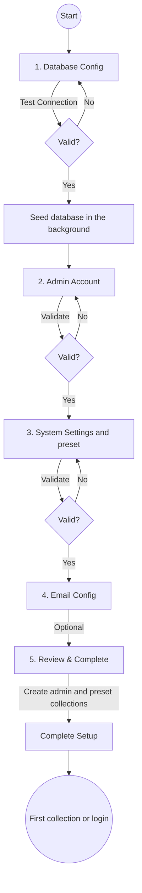

<!-- lint:disable heading-density -->

# Setup Wizard Guide

This page is the operator's path through first-run setup: what to prepare, what each of the five steps asks for, how to confirm it worked, and what to do when a step fails. The 90-second version is the [setup walkthrough](../../onboarding/setup-wizard.mdx) and install commands are [Getting started](../../getting-started.mdx). How the installer itself works — its phases, the config it writes, and the boot that follows — is [Boot and initialization](../../reference/architecture/initialization-workflow.mdx).

The SveltyCMS setup wizard provides a professional, multi-step configuration experience with real-time validation, intelligent error handling, and a modern user interface.

## Table of Contents

- [Overview](#overview)
- [Features](#features)
- [Setup Steps](#setup-steps)
- [Solution Presets](#solution-presets-starter-kits)
- [Error Handling](#error-handling)
- [User Experience](#user-experience)
- [Troubleshooting](#troubleshooting)

---

## Overview

The setup wizard is a multi-step form that guides users through initial SveltyCMS configuration. It consists of 5 main steps:

1. **Database Configuration** - Database connection and testing
2. **Admin Account** - Administrator user creation
3. **System Settings** - Site configuration, languages, and the project blueprint
4. **Email Configuration** (Optional) - SMTP setup for notifications
5. **Review & Complete** - Final review and system initialization

### Before you start

- **A target database — or none at all.** SQLite needs only a writable path. For MongoDB, PostgreSQL, MySQL, or MariaDB, have host, port, and database name ready, plus a user and password for every type except plain `mongodb`.
- **The production URL** the install will serve, for example `https://cms.example.com`.
- **The administrator account**: username, email, and a password that meets the rules in [Step 2](#step-2-admin-account-creation).
- **SMTP details** if the CMS should send mail — optional, and changeable later in settings.
- **A willingness to overwrite an existing database.** If the target already contains tables, the wizard detects that and asks before it drops anything.

### Setup Wizard Flow


```mermaid
flowchart TD
    Start((Start)) --> DB[1. Database Config]
    DB --> |Test Connection| DBCheck{Valid?}
    DBCheck -->|No| DB
    DBCheck -->|Yes| Seed[Seed database in the background]
    Seed --> Admin[2. Admin Account]
    Admin --> |Validate| AdminCheck{Valid?}
    AdminCheck -->|No| Admin
    AdminCheck -->|Yes| System[3. System Settings and preset]
    System --> |Validate| SystemCheck{Valid?}
    SystemCheck -->|No| System
    SystemCheck -->|Yes| Email[4. Email Config]
    Email --> |Optional| Review[5. Review & Complete]
    Review --> |Create admin and preset collections| Complete[Complete Setup]
    Complete --> Redirect((First collection or login))
```

### Quick Stats

- **Total Steps**: 5 (4 required + 1 optional)
- **Average Completion Time**: 2-3 minutes
- **Real-time Validation**: All input fields
- **Auto-save**: localStorage persistence
- **No server restart required**: the system becomes operational immediately after setup completion

---

## Features

### Real-Time Validation

Every input field provides instant feedback using **Valibot** schemas:

- ✅ Client-side validation as users type
- ✅ Server-side validation on submission
- ✅ Field-specific error messages
- ✅ Visual error indicators (red borders, error text)

### Intelligent Error Handling

The wizard includes comprehensive error management:

- **Database Test Errors**: Detailed classification (auth failed, connection timeout, etc.)
- **Validation Errors**: Per-field and per-step error tracking
- **Network Errors**: Graceful handling with retry options
- **Loading States**: Visual feedback during async operations

### User Experience Enhancements

Modern UX features inspired by best practices:

- **Progress Indicator**: Visual step tracker (mobile horizontal, desktop vertical)
- **Unsaved Changes Warning**: Browser warning before navigation
- **Duplicate Submission Prevention**: `isSubmitting` guard
- **Auto-save**: Form data persists in localStorage
- **Step Navigation**: Click completed steps to review/edit
- **Responsive Design**: Optimized for mobile, tablet, and desktop

### Accessibility

WCAG 2.1 AA compliant features:

- Semantic HTML with proper roles and ARIA labels
- Keyboard navigation support
- Screen reader friendly
- Error announcements via `role="alert"`
- High contrast mode compatible

---

## Setup Steps

### Step 1: Database Configuration

**Purpose**: Configure and test database connection

**fields**:

- Database Type (SQLite, PostgreSQL, MySQL, MariaDB, MongoDB, MongoDB Atlas)
- Host/Connection String
- Port (for non-Atlas)
- Database Name
- Username (required for PostgreSQL, MySQL, MariaDB and `mongodb+srv`, optional for a local MongoDB)
- Password (same rules as the username)

**Features**:

- **Connection String Parsing**: Paste full MongoDB URI, automatically extracts credentials
- **Driver Installation on Test**: MongoDB and SQLite drivers ship with the CMS; for the other types the wizard installs the driver through the detected package manager when you click **Test Connection**
- **Atlas Helper**: Collapsible guide for MongoDB Atlas setup
- **Existing Data Detection**: Probes the target database for existing tables or collections before proceeding.
- **Data Overwrite Confirmation**: If existing data is detected, the wizard provides a clear modal warning. Users can choose to **Overwrite** the database (which drops and recreates it) or specify different connection details to prevent accidental data loss.
- **Test Connection**: Validates configuration before proceeding
- **Error Classification**: Detailed error messages (auth failed, timeout, DNS error, etc.)

**Validation Rules**:

- Host is required and non-empty
- Database name is required, and may contain letters, numbers, hyphens, underscores, and dots
- Port must be a number between 1 and 65535 (not required for Atlas)
- Username and password are required for PostgreSQL, MySQL, MariaDB and `mongodb+srv`
- Credentials validated on test

**Server calls**: `testDatabaseConnection` and `installDatabaseDriver` (remote functions in `src/routes/setup/setup.remote.ts`); the same test logic is also exposed as the `testDatabase` form action.

**Success Criteria**:

- Green success message with connection details
- "Next" button enabled
- Seeding has already started in the background: the wizard writes `config/private.ts` and seeds settings, roles, and themes while you fill in the remaining steps
- Editing the connection fields after a green test hides the success summary and asks for another test — the check always applies to the connection you are about to use

```
stateDiagram-v2
    [*] --> EnterConfig: User fills form
    EnterConfig --> TestConnection: Click "Test Connection"
    TestConnection --> Installing: Missing driver?
    Installing --> TestConnection: Driver installed
    TestConnection --> Success: Connection OK
    TestConnection --> Failed: Connection failed
    Failed --> EnterConfig: Fix errors
    Success --> NextStep: Click "Next"
    NextStep --> [*]
```

### Step 2: Admin Account Creation

**Purpose**: Create the first administrator user

**fields**:

- Username (2-50 characters: letters, numbers, and `@ $ ! % * # . _ -`)
- Email (valid email format)
- Password (8+ chars with complexity requirements)
- Confirm Password (must match)

**Features**:

- **Password Requirements Indicator**: Visual checklist showing:
  - ✓ Minimum 8 characters
  - ✓ At least one letter (A-Z or a-z)
  - ✓ At least one number (0-9)
  - ✓ At least one special character (@$!%\*#?&)
  - ✓ Passwords match
- **Password Visibility Toggle**: Eye icon to show/hide passwords
- **Real-time Validation**: Instant feedback on each requirement

**Validation Rules**:

- Username: 2-50 characters, letters, numbers and `@ $ ! % * # . _ -` only
- Email: Valid email format
- Password: 8+ chars with uppercase, lowercase, number, special char
- Confirm password must match password

<Callout type="info">
  The checklist mirrors the field. The server additionally requires one uppercase and one lowercase
  letter when the administrator account is created, so include both.
</Callout>

**Server calls**: None (validated in the step; sent to `completeSetup` when you finish)

**Success Criteria**:

- All password requirements met
- No validation errors
- "Next" button enabled

### Step 3: System Settings

**Purpose**: Configure site identity, language settings, and the project blueprint

**fields**:

**Basic Settings**:

- Site Name (e.g., "My SveltyCMS Site")
- Production URL (full URL with https://)

**Language Configuration**:

- Default System Language (admin interface language)
- System Languages (available UI languages)
- Default Content Language (default for created content)
- Content Languages (available content languages)

**Media Storage**:

- Storage Type (Local, S3, R2, Cloudinary)
- Storage Path/Bucket Name

**Project Blueprint**:

- The preset carousel described in [Solution Presets](#solution-presets-starter-kits)

**Advanced (optional)**:

- Multi-tenant mode, demo mode, timezone, minimum password length
- Redis (host, port, password) — run **Test Redis Connection** if you enable it
- Cloudflare purge (API token, zone ID, purge mode)

**Features**:

- **Smart Language Presets**: Auto-detects browser language
- **Chip-based UI**: Visual chip display for selected languages
- **Language Search**: Quick filter for adding languages
- **Dual Language System**:
  - **System Languages**: Same ISO 639-1 picker as content. **English and German ship compiled.** Extra codes are written to `project.inlang/settings.json` and machine-translated (`bun translate`) when setup completes. RTL languages use `getTextDirection()` in `@utils/string`.
  - **Content Languages**: From ISO-639-1 (150+ languages), no rebuild required.
- **Redis Verification**: Optional performance optimization with a dedicated "Test Redis Connection" button to verify host, port, and credentials. The button is optional, the check is not: enabling Redis without a passing test blocks "Next".
- **Storage Type Notice**: Shows configuration reminder for cloud storage

**Validation Rules**:

- Site name is required
- Production URL must be valid URL with protocol
- At least one system language required
- At least one content language required
- Default languages must be in their respective arrays

**Server calls**: None for the form itself; `testRedisConnection` for the Redis test (validated locally, sent to `completeSetup` when you finish)

**Success Criteria**:

- All required fields filled
- Valid URL format
- Language configuration valid
- Redis test passed, if Redis is enabled
- "Next" button enabled

### Step 4: Email Configuration (Optional)

**Purpose**: Configure SMTP for email notifications

**fields**:

- SMTP Host (e.g., smtp.gmail.com)
- SMTP Port (587 for TLS, 465 for SSL)
- Username/Email
- Password/App Password
- From Address (sender email)
- Use TLS (checkbox)

**Features**:

- **Provider Presets**: Quick setup for Gmail, Outlook, SendGrid
- **Test Email**: Send test email to verify configuration
- **Skip Option**: Can be configured later in settings
- **Collapsible**: Step can be collapsed/expanded

**Validation Rules**:

- Host is required (if configuring)
- Port must be valid number
- Username and password required (if configuring)
- From address must be valid email

**Server call**: `testEmailConnection` (remote function in `src/routes/setup/setup.remote.ts`) for the test email

**Success Criteria**:

- Test email sent successfully (if configuring)
- OR step skipped (optional)
- "Next" button always enabled

### 5. Review & Complete

**Purpose**: Review all settings and finalize setup

**Display**:

- ✅ Database configuration summary
- ✅ Admin account details (password hidden)
- ✅ System settings summary
- ✅ Email configuration status

**Features**:

- **Edit Links**: Click any section to return to that step
- **Final Validation**: Re-validates all steps before submission
- **Loading State**: Shows progress during initialization
- **Preset Collections**: The blueprint you picked in step 3 is written to `config/collections` (`config/{tenant}/collections` in multi-tenant mode) and registered here, not earlier
- **Auto-login**: Creates the session cookie on success (24-hour session)
- **Smart Redirect**: Lands on the first seeded collection, or `/login` when there is none to open
- **Re-run Guard**: If the database already holds an administrator, completion is refused rather than overwriting it

**Server call**: `completeSetup` (remote command in `src/routes/setup/setup.remote.ts`), also exposed as the `completeSetup` form action

---

## 📦 Solution Presets (Starter Kits) {#solution-presets-starter-kits}

Presets are pre-configured collections of schemas, widgets, and settings designed for specific use cases. You choose one in the **Project Blueprint** carousel on [Step 3](#step-3-system-settings); the collections are created when you complete the wizard, and the preset id is stored as a setting.

### Available Presets

The preset cards advertise a scope; the collections actually created are the ones listed below (from `src/routes/setup/presets.ts`).

#### 1. Blank Project

- **Best for**: Custom builds, headless-first installs.
- **Includes**: Minimal configuration. No collections.

#### 2. Website Starter

- **Recommended default.**
- **Best for**: A SvelteKit frontend in the same repo with inline page design.
- **Includes**: Seeded homepage, `pages` collection with live preview, Svedit block editing, and the Editable Website plugin, which is enabled on completion.

#### 3. Blog / Editorial

- **Best for**: Content-heavy sites, news portals.
- **Collections**:
  - `Posts`: Standard article schema with RichText, SEO, and Author relation.
  - `Categories`: Hierarchical organization.
  - `Authors`: Contributor profiles.

#### 4. Agency / Portfolio

- **Best for**: Design agencies, freelancers, creative studios.
- **Collections**:
  - `Projects`: Portfolio items with gallery and client details.
  - `Services`: List of offered services.
  - `Team`: Team members and their profiles.

#### 5. SaaS Product

- **Best for**: Software companies, product landing pages.
- **Collections**:
  - `Pricing`: Plans managed via the **Price Widget**.
  - `Features`: Product capability highlights.
  - `Documentation`: Product documentation articles, organized by category.

#### 6. Corporate Site

- **Best for**: Business websites, company profiles.
- **Collections**:
  - `Team`: Team members across departments.
  - `Careers`: Job openings with requirements.
  - `Press`: Press releases and media coverage.

#### 7. E-commerce

- **Best for**: Online stores, catalogs.
- **Collections**: `products` (variants with own SKU/price/inventory), `product_categories`, `product_reviews`, `coupons`, `tax_rates`, `shipping_zones`, `carts`, `orders`.
- **Import**: [Smart Importer](../../../src/plugins/smart-importer/smart-importer.mdx) maps WooCommerce (WXR/REST) or Shopify JSON/CSV into `products`.
- **Dashboard**: add **Commerce Orders** and **Commerce Inventory** widgets (freemium, 14-day trial) from the dashboard picker.
- **Map**: [E-Commerce Overview](../content/ecommerce.mdx) — preset, importer, dashboard widgets, checkout pipeline, Stripe.

---

## Error Handling

### Error Categories

#### 1. Validation Errors

**Source**: Client-side or server-side validation

**Display**:

- Red border on input field
- Error message below field
- Icon indicator in step tracker

**Example**:

```
❌ Email is required
❌ Password must be at least 8 characters
❌ Passwords do not match
```

#### 2. Network Errors

**Source**: Failed API calls

**Display**:

- Error toast notification
- Detailed error message in expansion panel
- Retry button

**Example**:

```
❌ Network error: Failed to fetch
💡 Check your internet connection and try again
```

#### 3. Database Errors

**Source**: Database connection test failures

**Display**:

- Detailed error block with:
  - User-friendly message
  - Technical error code
  - Connection details
  - Suggested fixes

**Error Classifications** (from `src/routes/setup/error-classifier.ts`):

- `AUTH_FAILED` - Invalid credentials for this database user.
- `CONNECTION_REFUSED` - Cannot reach the server: down, wrong host, timed out, or your IP is not allowlisted.
- `DB_NOT_FOUND` - The database does not exist. The wizard offers to create it.
- `DB_ALREADY_EXISTS` - The database already contains tables; the wizard asks before overwriting.
- `CASE_MISMATCH` - A database with the same name in a different case exists; reuse the existing name or overwrite.
- `INVALID_CONFIG` - Malformed connection string, or an SSL/TLS handshake failure.
- Anything unmapped arrives as `Database connection failed: <message>` with the server log as the next step.

**Example**:

```
❌ Connection Failed

Error: Authentication failed. Please check your username and password.

Connection Details:
- Host: cluster0.mongodb.net
- Port: 27017
- Database: sveltycms
- User: admin
- Code: authentication_failed

💡 Suggested Fix:
- Verify your MongoDB Atlas username and password
- Check if IP address is whitelisted in Atlas
- Ensure database user has correct permissions
```

#### 4. Driver Installation Errors

**Source**: Failed automatic driver installation

**Display**:

- Warning box with installation status
- Manual installation instructions
- Continue anyway option

**Example**:

```
⚠️  Driver Installation Failed

The MongoDB driver could not be installed automatically.

Error: npm install mongoose failed (network timeout)

You can:
1. Install manually: npm install mongoose
2. Check your internet connection
3. Continue with setup (connection test will fail until installed)
```

How the wizard classifies these errors, and how its validation layers are built, is in [Boot and initialization](../../reference/architecture/initialization-workflow.mdx#setup-wizard-internals).

---

## User Experience

### Loading States

**Visual Indicators**:

- Spinner icon during async operations
- Disabled buttons to prevent double-clicks
- "Loading..." or "Testing..." text
- Progress messages ("Initializing system...")

### Toast Notifications

**Types**:

- **Success** (green): a step succeeded, e.g. "Setup complete! Redirecting..."
- **Error** (red): a failed test, seed, or completion
- **Info** (blue): a notice while longer work runs
- **Warning** (yellow): a non-blocking problem

**Position**: Bottom-right corner (fixed)

**Duration**:

- Success: 2 seconds on completion
- Error: 5 seconds for a failed completion, 4 seconds for a failed seed, 8 seconds when setup is already complete
- Info/Warning: 4 seconds by default

### Responsive Design

**Breakpoints**:

- Mobile: < 640px (sm)
- Tablet: 640px - 1024px (md)
- Desktop: > 1024px (lg)

**Adaptations**:

**Mobile**:

- Horizontal step indicator (dots)
- Single column form layout
- Stacked language selector
- Collapsible help text
- Full-width buttons

**Desktop**:

- Vertical step indicator (with descriptions)
- Two-column form layout
- Side-by-side language configuration
- Expanded help text
- Inline action buttons

**CSS Pattern**:

```
/* Mobile-first approach */
.form-grid {
  display: grid;
  grid-template-columns: 1fr;
  gap: 1.5rem;
}

/* Tablet and above */
@media (min-width: 768px) {
  .form-grid {
    grid-template-columns: repeat(2, 1fr);
  }
}
```

### Keyboard Navigation

**Shortcuts**:

- `Tab` / `Shift+Tab` - Navigate between fields
- `Enter` - Submit current action (test connection, next step)
- `Escape` - Close language picker or help popups
- Arrow keys - Navigate step indicator (desktop)

**Focus Management**:

- Auto-focus first field on step change
- Visible focus indicators
- Skip links for screen readers
- Focus trap in modals

---

## Troubleshooting

### Common Issues

#### Issue: Database Test Fails with "Driver Not Found"

**Symptoms**: Error about missing mongoose package

**Cause**: The driver install that runs with **Test Connection** failed (network, permissions) or was skipped

**Solution**:

```
# Manual installation
npm install mongoose
# or
bun add mongoose
# or
pnpm add mongoose
```

Then clear localStorage and retry test. MongoDB and SQLite drivers ship with the CMS, so this only affects PostgreSQL, MySQL, and MariaDB (`postgres`, `mysql2`).

#### Issue: A Step Will Not Let Me Continue

**Symptoms**: "Next" stays disabled

**Cause and fix, by step**:

- **Step 1**: there is no connection test yet for the current values. Editing host, port, name, user, or password after a green result clears it — press **Test Connection** again. There is no automatic retry: fix the reported cause first.
- **Step 2**: one of the password requirements is unmet, or the two passwords differ.
- **Step 3**: site name or production URL missing, no language selected, or Redis is enabled without a passing Redis test.
- **Step 5**: seeding is still running; the button enables when it finishes.

#### Issue: Setup Refuses to Finish Because Administrators Exist

**Symptoms**: Completion returns "Database contains registered administrator accounts. Setup cannot be re-run."

**Cause**: The target database already holds an `admin` user, so the wizard will not overwrite it

**Solution**: Point the wizard at a fresh database and name, or remove the existing administrators yourself if you really intend to re-run first-run setup.

#### Issue: Collections Are Missing or the Wizard Keeps Returning to /setup

These are boot-time conditions rather than wizard steps: see the troubleshooting in [Boot and initialization](../../reference/architecture/initialization-workflow.mdx#troubleshooting).

---

## Related Documentation

- [Setup Reference](/docs/reference/api/setup.mdx) - Complete API documentation
- [Boot and initialization](../../reference/architecture/initialization-workflow.mdx) - Installer phases, generated config, and restart behavior
- [Valibot Documentation](https://valibot.dev/) - Validation library
- [Svelte 5 Runes](https://svelte.dev/docs/svelte/what-are-runes) - Reactive state management

---

## Best Practices

### For Users

1. **Test Database Connection First** - Always test before proceeding
2. **Use Strong Passwords** - Follow all password requirements
3. **Note Your Credentials** - Save admin username/password securely
4. **Complete All Steps** - Don't skip system settings
5. **Review Before Completing** - Check all settings on final step

---

## Summary

The SveltyCMS setup wizard provides a professional, user-friendly onboarding experience with:

✅ Real-time validation with Valibot
✅ Intelligent error handling and recovery
✅ Persistent state with auto-save
✅ Responsive design for all devices
✅ Accessibility features (WCAG 2.1 AA)
✅ Solution presets that create your first collections
✅ No-restart initialization

What happens underneath — the installer phases, the generated `config/private.ts`, and the boot that follows — is in [Boot and initialization](../../reference/architecture/initialization-workflow.mdx).
