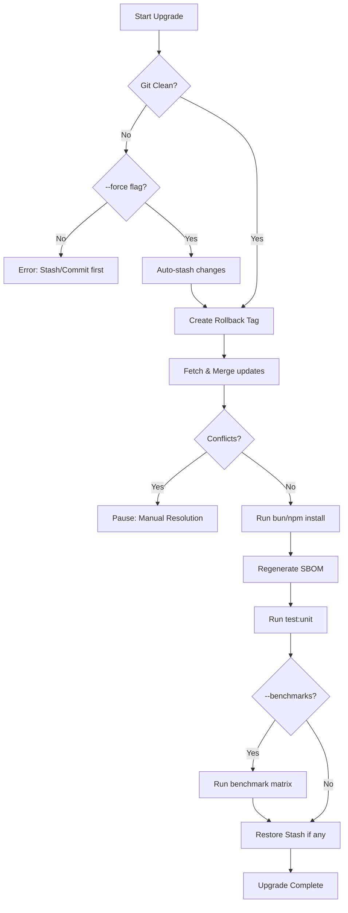

# Upgrading SveltyCMS

SveltyCMS is designed to be upgraded easily while preserving your custom collections and configurations. We provide a CLI tool to automate the process: fetch and merge, dependency install, SBOM regeneration, and post-upgrade tests. Schema changes need no manual database step — see _Schema & database changes_ below.

> [!IMPORTANT]
> **One schema path (as of 2026-09-30).** The SQL system schema is declared once in `src/databases/system-schema-spec.ts` and applied at boot from that spec. Fresh databases are created from it (measured: 27 tables + 117 indexes, ~330 ms once). A database that already has the tables receives any **missing spec column** on the next boot (`ALTER TABLE … ADD COLUMN`). `CREATE TABLE IF NOT EXISTS` does not do that by itself, and a boot that only ran it used to store a marker and leave the old table behind — MariaDB login then failed inserting `auth_sessions.amr` / `mfaVerifiedAt`. After that column pass succeeds, the marker is the column-synced fingerprint and later boots skip both the DDL pass and the column scan (~2 ms).
>
> **Renames:** `renamedFrom` on a system `ColumnSpec` or a collection field is the automatic rename (the old column exists and the new one does not, before `ADD`; Mongo `$rename` once per process when the model is created). The dropped v0.0.8 repairs (`security` → `password`, `redirects_mv.from|to`) stay manual. A database that needs one of those one-off repairs is upgraded through the release that introduced it, or by export → re-provision → import.
>
> **Aggregation on SQL engines (as of September 2026).** `crud.aggregate()` now runs on SQLite, PostgreSQL and MariaDB (the `supportsAggregation` capability flag is `true`; it was `false`), executing the portable subset of the MongoDB pipeline through `src/databases/core/aggregation-translator.ts`. Two consequences for existing callers: a pipeline that asked for `$min`/`$max` on a **non-materialized** field is now refused with `NOT_SUPPORTED` on PostgreSQL/MariaDB — those engines extract JSON as TEXT, so the previous answers were lexicographic (`MIN` of `{10, 2}` is `"10"`) and were never the intended number; declare the field `indexed` or `materialize: true` to aggregate it natively. Stages outside the subset (`$lookup`, `$unwind`, `$facet`, compound `$group._id`, out-of-order stages) fail closed with the same named error instead of running on MongoDB only.

## The Upgrade Process

The upgrade tool performs the following steps:



1. **Git Verification**: Ensures you are in a valid Git repository.
2. **Auto-Stash**: If you have uncommitted changes and use the `--force` flag, the tool automatically stashes them and restores them after the upgrade.
3. **Rollback Tag**: Creates a local Git tag (e.g., `pre-upgrade-2026-04-06-12-00-00`) as a safety net before any changes are merged.
4. **Upstream Fetch**: Fetches the latest changes from the official SveltyCMS repository.
5. **Pre-commit Merge**: Merges changes into your local branch without committing, allowing you to review.

6. **Dependency Refresh**: Runs `bun install` to ensure all new packages are installed. On Windows, `npm install` is used instead to avoid known `bun install` corruption issues.
7. **SBOM Sync**: Runs `bun run audit:sbom` to regenerate the CycloneDX SBOM (`sbom.json`) so it matches the updated dependency tree (see _Dependency Updates & SBOM_ below).
8. **Tests**: Runs `test:unit` — the same suite the pre-commit gate uses. With `--benchmarks`, the benchmark matrix runs afterwards.
9. **Schema**: Nothing to run. The system schema is reconciled at the next boot and collection tables are provisioned on demand — see _Schema & database changes_.

## How to Run the Upgrade

Run the following command in your project root:

```
bun run scripts/upgrade.ts
```

### Advanced Options

| Flag            | Description                                                             |
| --------------- | ----------------------------------------------------------------------- |
| `--dry-run`     | See what would happen without making any changes.                       |
| `--skip-tests`  | Do not run the unit test suite after upgrade.                           |
| `--skip-sbom`   | Do not regenerate the SBOM after install.                               |
| `--skip-merge`  | Skip fetch+merge (useful if resuming after manual conflict resolution). |
| `--force`       | Auto-stash uncommitted changes before upgrade.                          |
| `--branch=NAME` | Upgrade from a specific branch (defaults to `next`).                    |
| `--benchmarks`  | Also run the benchmark matrix (opt-in; slow, enterprise-sized run).     |

## Dependency Updates & SBOM

SveltyCMS ships a dedicated dependency-update flow that keeps the CycloneDX SBOM (`sbom.json`) in lockstep with the resolved dependency tree:

1. **Check for outdated packages**: `bun outdated`
2. **Update + regenerate SBOM in one command**: `bun run update` — runs `bun update` and then `bun run audit:sbom`, so `sbom.json` (name + version + SHA-512 hashes per package) always reflects what was actually installed.
3. **Safety net**: If you change dependencies any other way (native `bun update`, `bun install`, `bun add`, `bun remove`), the pre-commit hook detects `bun.lock`/`package.json` changes and regenerates + stages `sbom.json` automatically before every commit.

The SBOM feeds vulnerability scanners (e.g., Dependency-Track, Grype) and supports SOC 2 / GDPR Art. 32 supply-chain compliance. See [Security Overview](../../reference/security/index.mdx).

> **Note on `bun outdated`**: packages pinned to an exact version (e.g., `graphql` is pinned to `16.14.2`) or released as a new major outside your declared range will appear as "outdated" but are intentionally left untouched by `bun update`. Review the output and bump `package.json` deliberately for those.

## Schema & database changes

There is no `db:push` (or any other database step) in the upgrade:

- **System schema** — declared once in `src/databases/system-schema-spec.ts` and applied at boot. A database that already has the tables receives any missing spec column on the next start (`ALTER TABLE … ADD COLUMN`), and a declared `ColumnSpec.renamedFrom` renames before the add. After that pass succeeds, the column-synced fingerprint makes later boots skip the DDL pass and the column scan (~2 ms).
- **Collection tables** — provisioned by the adapter (`createModel`) when a schema is loaded; new fields enter the row-store hybrid on the next provisioning pass (`indexed`, `unique`, `materialize: true`, `number` / `integer`, and the exact string types `decimal` / `bigint` / `calendarDay` / `bytes`).
- **Aggregation callers** — see the `NOT_SUPPORTED` note in the callout above: a `$min`/`$max` on a non-materialized field is now refused instead of answered lexicographically.

Start the upgraded server once; the boot log reports what the schema pass added.

## Before you upgrade

- **Back up your database.** The rollback tag restores code, not data. Use your engine's tooling (`pg_dump`, `mysqldump`, `mongodump`, or a copy of the SQLite file) and test the restore path at least once.
- **Read the release notes** for the target version and confirm the branch you track in [Version Channels](./version-channels.mdx).
- **Strict SemVer**: releases follow [Semantic Versioning](https://semver.org/) strictly — the version is derived from the release's Conventional Commits (`feat` → minor, breaking → major, everything else → patch; a breaking change stays a minor while on `0.x`). A patch or minor release therefore never hides a breaking change; an incompatible change only ever ships as the matching major.
- **Container installs** upgrade by deploying the new image tag — the schema is applied on the first boot of the new image; this CLI is for git checkouts.

## Best Practices

- **Review the Rollback Tag**: Before starting, the tool provides a rollback tag. If anything goes wrong, you can return to your previous state using `git reset --hard <tag-name>` (code only — restore your database backup for data).
- **Review Changes**: After the script finishes, use `git diff` to review the changes before committing.
- **Resolve Conflicts**: If the merge fails, the tool will pause. Resolve conflicts in your editor, `git add` the changes, then run the upgrade again with `--skip-merge`.
- **Verify after starting**: check that `/api/system/health` reports ready and watch the boot log for an `Added N missing system column(s)` line.

## Troubleshooting

### Rolling Back

If the upgrade causes issues, you can roll back to the state before the upgrade started. This restores **code only** — restore your database backup to roll back data:

```
# List available rollback tags
git tag --list "pre-upgrade-*"

# Reset to the desired tag
git reset --hard pre-upgrade-YYYY-MM-DD-HH-MM-SS
```

### "bun install" corruption on Windows

If you're on Windows and `bun install` produces errors or corrupted `node_modules`:

1. Delete `node_modules` (but keep `bun.lock`)
2. Run `npm install` instead
3. `bun run dev` will work normally after npm install

### "Merge conflict — manual resolution required"

If conflicts occur:

1. Resolve them in your IDE.
2. `git add .`
3. Run `bun run scripts/upgrade.ts --skip-merge` to complete the remaining steps (install, SBOM, tests).

---

## Related

- [Getting Started](../../getting-started.mdx)
- [Architecture Overview](../../reference/architecture/index.mdx)
- [Security Overview](../../reference/security/index.mdx)
