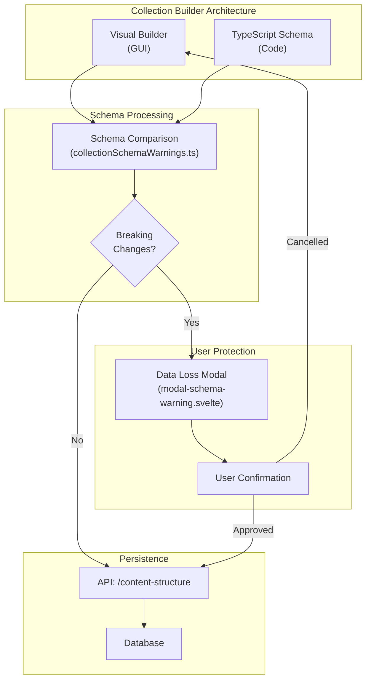

# Collection Builder Guide

> [!NOTE] Competitive comparisons based on publicly available documentation as of June 2026. Performance data self-measured via `bun test tests/benchmarks/`.

## Overview

The Collection Builder is a visual tool for creating and managing content collections in SveltyCMS. It provides an intuitive interface for defining content structures, organizing collections into categories, and configuring fields using the modern widget system.

### Why the Tabbed Editor Is Better

| Before (Stepper)                                  | After (Tabs)                                                                               |
| ------------------------------------------------- | ------------------------------------------------------------------------------------------ |
| Linear flow: must complete Step 1 to reach Step 2 | **Free navigation**: jump between Basic, Widgets, and Settings anytime                     |
| 2 steps: Basic → Fields                           | **3 tabs**: Basic Setup → Widgets & Fields → Settings & Permissions                        |
| Permissions buried in general settings            | **Dedicated Permissions tab** with status, sort, pagination, API visibility, RBAC overview |
| No API visibility control in editor               | **API toggle**: hide sensitive collections from REST/GraphQL with one click                |
| Stepper UI requires clicking "Next" to advance    | **Keyboard-navigable tabs**: Arrow keys, Home/End, ARIA-compliant                          |
| No pagination config per collection               | **Entries per page**: 5-200, configurable per collection                                   |
| Default sort hardcoded                            | **Per-collection sort**: field + direction, visible in Settings tab                        |

### Code ↔ GUI Parity

SveltyCMS is the only headless CMS that achieves **true bidirectional parity** between code and GUI:

| Feature             | Code-First                              | GUI Builder                                   |
| ------------------- | --------------------------------------- | --------------------------------------------- |
| Schema definition   | `export const schema: Schema = { ... }` | Visual form → AST → same TypeScript output    |
| Widget fields       | `fields: [widgets.input({...})]`        | Drag-and-drop widget sidebar                  |
| Status & visibility | `status: 'published'`                   | Status dropdown + API toggle                  |
| Sort & pagination   | `entriesPerPage: 30`                    | Settings tab number input                     |
| Field validation    | Valibot schemas per field               | Visual Logic Builder (`showIf`, `requiredIf`) |
| Custom hooks        | `beforeSave`, `afterSave` functions     | Coming — Permissions tab code snippets        |

**How it works**: When you save in the GUI, the builder uses the TypeScript Compiler API to generate a real `.ts` file. This file is then compiled and stored in the database — identical to what a developer would write by hand. When you open an existing collection, it loads from the database regardless of how it was created.



> **Note**: The Collection Builder is currently in **beta** and under active development. Some features may not be fully functional yet. Report issues on [GitHub](https://github.com/SveltyCMS/SveltyCMS/issues).

### Roadmap

**⏸️ Deferred:**

- LeftSidebar DND ordering - Enable drag-and-drop reordering directly in sidebar (TreeView has built-in support)

**🔧 Not Yet Integrated:**

- Widget Factory - Visual widget creation tool
- Marketplace integration - Download widgets from `marketplace.sveltycms.com`

## Getting Started

### Accessing the Collection Builder

**Navigation Path**: `/config/collectionbuilder`

**Requirements**:

- User must have `admin` role OR
- User must have collection management permissions

### Collection Builder Interface

The Collection Builder has two main views:

1. **Category Tree View** (`/config/collectionbuilder`)
   - Hierarchical tree showing categories, child counts, and nested collections
   - Real-time drag-and-drop nesting with floating target preview (`↳ Inside {category}`)
   - Full keyboard reordering support (`Alt + Up/Down`) with roving tabindex
   - Live statistics counter (`X collections · Y categories`)
   - **Unified Favorites & Tagging**: 1-click star toggle (★) and colorful tag pills directly on tree items
   - **Dual Filter Toolbar**: Instant filtering by search text, `[★ Favorites]`, and `[All Tags ▼]` dropdown
   - Create, duplicate, edit, and delete categories and collections

2. **Collection Editor View** (`/config/collectionbuilder/[action]/[collectionPath]`)
   - Edit or create individual collections
   - Configure collection settings, metadata, tags, and favorite status
   - Manage collection fields

## Category Management

### Understanding Categories

Collections are organized into **categories** for structured hierarchy and navigation:

- **Category**: A folder container for related collections and subcategories
- **Nested Structure**: Multi-level nesting with expandable tree nodes
- **Drag-and-Drop**: Nest collections inside categories or reorder them at any level
- **Live Visual Feedback**: Dynamic drag preview shows real-time nesting targets
- **Keyboard Reordering**: Move nodes up and down without a mouse using `Alt + Arrow` keys

### Creating Categories

**Step-by-Step**:

1. Navigate to `/config/collectionbuilder`
2. Click **"Add Category"** button in the header toolbar
3. Fill in category details:
   - **Name**: Unique category name (e.g., "Blog", "Products", "Pages")
   - **Icon**: Select an icon from IconPicker
4. Click **"Save Category"** to create
5. Category appears immediately in the hierarchy with live status badges

### Editing Categories

**To Edit**:

1. Click the edit (pencil) icon on any category node
2. Modify:
   - Category name
   - Category icon
3. Click **"Save Category"**
4. Updates appear immediately in the tree view

### Moving Collections Between Categories

**Drag-and-Drop**:

1. Grab the drag handle (`⋮⋮`) or click and hold a collection card
2. Drag over the desired category (the preview card displays `↳ Inside {target}`)
3. Release to drop into the category
4. Hierarchy persists automatically to database and manifest

**Keyboard**:

1. Focus the collection node using `Tab` / Arrow keys
2. Press `Alt + Up` or `Alt + Down` to reorder within the hierarchy

## Collection Management

### Creating a New Collection

#### Method 1: From Category Board

1. Navigate to `/config/collectionbuilder`
2. Click **"+"** icon in a category column
3. Enter collection name
4. System navigates to collection editor

#### Method 2: Direct Creation

1. Navigate to `/config/collectionbuilder/create/[collectionName]`
2. Fill in collection details
3. Configure fields
4. Click **"Save"** to create

### Collection Editor

The collection editor has **three tabs** for efficient workflow:

#### Tab 1: Basic Setup

**Collection Information**:

**Name** (required):

- Display name for the collection
- Used in navigation and UI
- Auto-generates slug and database name
- Example: "Blog Posts"

**Icon** (required):

- Visual identifier for the collection
- Uses IconPicker for icon selection
- Example: `mdi:post`

**Slug** (auto-generated):

- URL-friendly identifier
- Auto-generated from name
- Used in routing: `/collection/[slug]`
- Example: "blog_posts"

**Description** (optional):

- Brief description of collection purpose
- Displayed in admin interface

**Organization & Tags**:

- **Collection Tags**: Comma-separated tag taxonomy for grouping collections
- **Suggested Tags**: Auto-completion suggestions from existing workspace tags
- **Favorite Status**: 1-click star toggle for rapid access

#### Tab 2: Widgets & Fields

This tab manages the fields (widgets) that make up your collection's content structure.

**Features**:

- Visual list of all fields
- Drag-and-drop field reordering
- **Visual Logic Builder**: Configure complex `showIf` and `requiredIf` dependencies
- Add/edit/delete fields with live preview

#### Tab 3: Settings & Permissions

Configure collection-level behavior and access control:

- **Status**: Published / Draft toggle
- **API Visibility**: Show or hide collection from the REST/GraphQL API
- **Default Sort**: Field + direction for entry listings
- **Pagination**: Entries per page (5-200)
- **Permissions Overview**: Role-based access (Admin, Editor, Viewer)

### Adding fields to Collections

**Step-by-Step Process**:

1. **Open Collection Editor**
   - Navigate to collection or create new one
   - Switch to **"Widgets"** tab

2. **Add New Field**
   - Click **"Add Field"** button
   - Modal opens: "Select a Widget"

3. **Choose Widget Type**
   - Browse available widgets:
     - **Input**: Single-line text input
     - **Textarea**: Multi-line text
     - **RichText**: WYSIWYG editor
     - **Number**: Numeric input
     - **Date**: Date picker
     - **DateTime**: Date and time picker
     - **Boolean**: True/false toggle
     - **Select**: Dropdown selection
     - **MediaUpload**: File/image upload
     - **Relation**: Link to other collections
     - **Array**: Multiple values
     - **Custom Widgets**: Additional widget types
   - Click widget to select
   - Click **"Submit"**

4. **Configure Widget**
   - Second modal opens: "Define your Widget"
   - Three tabs available:

#### Widget Configuration Tabs

**Tab 1: Default Settings**

**Basic Configuration**:

**Label** (required):

- Display name for the field
- Shown in forms and UI
- Example: "Post Title", "Author Name"

**Database Field Name** (required):

- Internal field identifier
- Used in database and API
- Snake_case recommended
- Example: "post_title", "author_name"

**Required**:

- Toggle: Is this field mandatory?
- Validation enforced on save

**Translated**:

- Enable multi-language support
- Stores values per language
- Uses language-specific fields in database

**Widget-Specific Options**:

Different widgets have different configuration options:

**Text Input Widget**:

- Placeholder text
- Min/max length
- Character counter
- Input type (text, email, URL, tel, etc.)
- Pattern validation (regex)

**RichText Widget**:

- Toolbar configuration
- Allowed HTML tags
- Media upload settings
- Maximum content length

**Number Widget**:

- Min/max values
- Step increment
- Decimal places
- Number formatting (currency, percentage)

**MediaUpload Widget**:

- Allowed file types (image/_, video/_, .pdf, etc.)
- Maximum file size (MB)
- Image dimensions (min/max width/height)
- Multiple file upload toggle
- Crop settings

**Relation Widget**:

- Target collection (which collection to link to)
- Display field (which field to show in dropdown)
- Multiple selection toggle
- Nested editing capability

**Select Widget**:

- Options list (add multiple options)
- Default value
- Allow multiple selection
- Searchable dropdown

**Tab 2: Specific Settings**

Advanced widget-specific configurations:

- Display settings (show in lists, cards, previews)
- Validation rules (custom validation logic)
- Default values
- Help text
- Conditional visibility

**Tab 3: Permissions**

Field-level access control:

- Read permissions
- Write permissions
- Delete permissions
- Role-based restrictions

5. **Save Widget Configuration**
   - Click **"Save"** button
   - Widget added to collection
   - Appears in fields list

### Managing Existing fields

**Reorder fields**:

1. Drag field up or down in the list
2. Drop in desired position
3. Click **"Save"** to persist order

**Edit Field**:

1. Click field card in the list
2. Widget configuration modal opens
3. Modify settings
4. Click **"Save"**

**Delete Field**:

1. Click delete icon on field card
2. Confirm deletion
3. Field removed from collection
4. Click **"Save"** to persist

### Smart Type Inference & Quick-Add Bar

For rapid schema design without tedious modal clicking, the Collection Widgets tab includes an enterprise **Quick-Add Bar**:

- **Instant Natural-Language Heuristics**: Type common field names such as `email`, `price`, `cover_image`, `tags`, `is_published`, `author_id`, `rating`, `birth_date`, or `bio`.
- **Automatic Widget Detection**:
  - `email`, `mail` → **Email** input widget with pre-configured validation regex
  - `price`, `cost`, `total`, `amount` → **Currency / Number** widget with formatted step increment
  - `photo`, `image`, `avatar`, `thumbnail`, `cover` → **MediaUpload** widget restricted to images
  - `description`, `content`, `body`, `bio` → **RichText** or **Textarea** WYSIWYG widget
  - `tags`, `categories`, `labels` → **Array / Tags** widget
  - `is_*`, `has_*`, `enable_*`, `active` → **Boolean** toggle widget
  - `*_id`, `*_ref`, `parent` → **Relation** widget automatically linked to target collections
  - `date`, `birthday`, `created_at` → **Date / DateTime** picker widget
- **Keyboard Execution**: Hit `Enter ↵` to immediately create, configure, and add the inferred field to the active canvas.

### Live Visual Canvas ↔ TypeScript Code Split-View

SveltyCMS delivers bidirectional awareness between visual GUI configuration and code:

- **Mode Switcher**: Toggle seamlessly between:
  - **Canvas**: Focused visual drag-and-drop builder with widget palette.
  - **Split View**: Side-by-side display with Visual Canvas on the left and Live TypeScript Schema on the right.
  - **TypeScript**: Full-screen code view for reviewing the generated `config/collections/{name}.ts` definition.
- **Real-Time Synchronized Code**: As fields are reordered, added, or modified in the canvas, the generated TypeScript schema updates reactively without saving to disk.
- **One-Click Clipboard Export**: Copy production-ready `defineCollection({ ... })` TypeScript code directly into version control.
- **Full Engine Parity**: The client-side generator mirrors `compilation/compile.ts` to ensure 100% parity with server-compiled ASTs.

### Database Introspection & Schema Ingestion (DDL & JSON)

You can reverse-engineer existing database structures and APIs directly into SveltyCMS collections:

- **SQL DDL Reverse-Engineering**:
  - Paste standard `CREATE TABLE` statements from PostgreSQL, MySQL, MariaDB, or SQLite.
  - Automatically parses column names, data types, nullability, and primary keys.
  - Maps relational foreign keys (`REFERENCES other_table(id)`) to **Relation** widgets with target collection presets.
  - Maps `ENUM(...)` constraints to pre-populated **Select** dropdown options.
  - Maps text, timestamp, boolean, JSON, and numeric types into their canonical SveltyCMS widgets.
- **JSON Sample Ingestion**:
  - Paste any JSON object or array of documents from existing REST/GraphQL endpoints.
  - Analyzes value types, date patterns, image URLs, and array structures to synthesize full collection schemas.
- **Instant Collection Bootstrapping**: Ingested schemas populate the collection builder form and widget canvas in one click.

### Saving Collections

**Save Process**:

1. **Validate Form**:
   - Check all required fields filled
   - Verify widget configurations
   - Ensure unique collection name

2. **Click Save Button**:
   - Located at top right of editor
   - Saves both Collection Form and Widgets tabs

3. **Confirmation**:
   - Success toast: "Collection Saved Successfully"
   - If schema drift is detected, a warning prompts confirmation before saving
   - If save fails, an error toast displays the server error message
   - System compiles collection schema
   - Database tables/collections created

### Deleting Collections

**Delete Process** (Edit mode only):

1. Open collection in editor
2. Click **"Delete"** button (red button)
3. Confirmation dialog appears
4. Confirm deletion
5. Collection removed from system
6. Associated database table preserved (archival)

## Content Structure API

### Saving Changes

When you make changes to categories and collections, use the **"Save"** button to persist:

**API Endpoint**: `POST /api/content-structure`

**Operations Tracked**:

- **create**: New category or collection
- **update**: Modified properties (icon, name)
- **move**: Changed parent or order
- **rename**: Name changes
- **delete**: Removed items

**Batch Operations**:

- All changes saved together
- Atomic operations (all or nothing)
- Rollback on errors

## Unified Favorites & Tagging System

The Collection Builder provides a centralized, cross-view tagging and favoriting workflow:

### 1-Click Favorites (Starring)

- **Direct on Tree Nodes**: Click the star icon (★) on any collection or category row to toggle favorite status.
- **Cross-Component Sync**: Starring an item instantly reflects across the Builder tree board, the Collection Editor form, and the LeftSidebar navigation without requiring a page reload.
- **Category Favoriting**: Whole categories can be favorited to highlight organizational workspaces.
- **Dedicated Filter**: Click the `[★ Favorites]` toolbar chip in either the Collection Builder or the LeftSidebar to view starred items.

### Color-Coded Tag Taxonomy

- **Deterministic WCAG 2.2 AA Palette**: Tags are automatically assigned harmonious, token-based status-shade colors (`tertiary`, `primary`, `secondary`, `warning`, `success`), eliminating manual color management while keeping contrast high.
- **Multi-View Tag Filtering**: Filter collections by tag in both the LeftSidebar and the Collection Builder toolbar.
- **Modal & In-Form Editing**: Add or remove tags directly from any tree node action button or inside Tab 1 (Collection Definition) of the collection editor.

### LeftSidebar Integration

- **Quick-Add Shortcut**: The LeftSidebar Collections header includes an instant `+` shortcut that opens the Collection Builder directly.
- **Live Reorder Reflection**: Any reorganization or tagging immediately synchronizes with the active sidebar tree.

## Widget System Integration

### Available Widgets

SveltyCMS uses a **modern widget architecture** with three pillars:

1. **Definition Pillar**: Widget metadata and schema
2. **Input Pillar**: Data entry component
3. **Display Pillar**: Data display component

**Core Widgets**:

- Input (single-line text)
- Textarea (multi-line text)
- RichText (WYSIWYG editor)
- Number (numeric input)
- Boolean (toggle)
- Date/DateTime (date pickers)
- MediaUpload (file/image)
- Relation (collection links)
- Select (dropdown)
- Array (multiple values)

**Custom Widgets**:

- Located in `src/widgets/custom/`
- Can be added to extend functionality
- Follow same three-pillar architecture

### Widget Factory System

Widgets are created using the factory pattern:

```
import { createWidget } from "@widgets/widget-factory";

const widget = createWidget({
  Name: "my-widget",
  Icon: "mdi:my-icon",
  Description: "My custom widget",
  GuiSchema: {
    /* configuration */
  },
});
```

See [Widget Architecture](/docs/development/widgets/development) for details.

## Best Practices

### Collection Design

**Naming Conventions**:

- Use descriptive, clear names
- Keep collection names concise
- Use singular form (e.g., "Post" not "Posts")
- Avoid special characters

**Organization**:

- Group related collections in categories
- Use consistent naming patterns
- Plan collection structure before creating
- Document collection purposes

**Field Configuration**:

- Mark truly required fields only
- Provide helpful labels and descriptions
- Use appropriate widget types
- Configure validation rules
- Set sensible defaults

### Performance

**Optimize Field Count**:

- Use only necessary fields
- Avoid excessive relation fields
- Consider field index requirements
- Plan for scalability

**Indexing**:

- Database indexes created automatically
- Searchable fields are indexed
- Sortable fields are indexed
- Consider query patterns

### Security

**Permissions**:

- Set field-level permissions carefully
- Use least privilege principle
- Review permission inheritance
- Test permissions thoroughly

**Validation**:

- Configure input validation
- Set length limits
- Validate file types and sizes
- Use server-side validation

## Troubleshooting

### Common Issues

**"Collection name already exists"**:

- Collection names must be unique
- Check existing collections
- Use different name or edit existing

**"Invalid widget configuration"**:

- Check all required fields filled
- Verify widget-specific settings
- Review validation errors in form

**"Cannot save changes"**:

- Check for validation errors
- Verify permissions
- Review browser console for errors
- Check server logs

**"Widgets not appearing"**:

- Ensure widgets are activated in Widget Management
- Check widget store initialization
- Verify widget imports
- See [Widget Management](/docs/development/widgets/index)

### Debug Information

**Browser Console**:

- Check for JavaScript errors
- Review network requests
- Inspect collection state
- Verify widget loading

**Server Logs**:

- Check `/logs/app.log`
- Look for validation errors
- Review permission denials
- Monitor database operations

### Known Limitations (Beta)

**Current Limitations**:

- Some advanced widget configurations may not be fully functional
- Nested collection structures have depth limits
- Bulk operations on multiple collections limited
- **Real-time Collaboration**: Native SSE-based activity stream and AI assistant integrated into the UI.

**Workarounds**:

- Save frequently to avoid data loss
- Test configurations in development first
- Report issues on GitHub for fixes

## API Reference

### Content Structure Endpoint

```
POST /api/content-structure
Content-Type: application/json

{
  "operations": [
    {
      "type": "create",
      "node": {
        "name": "New Category",
        "icon": "mdi:folder",
        "nodeType": "category"
      }
    },
    {
      "type": "move",
      "node": {
        "_id": "123",
        "parentId": "456",
        "order": 2
      }
    }
  ]
}
```

### Collection Schema

```
interface Schema {
  _id: string;
  name: string;
  slug: string;
  icon: string;
  description?: string;
  status: "published" | "unpublished" | "draft";
  fields: FieldInstance[];
  permissions?: PermissionConfig;
  createdAt: Date;
  updatedAt: Date;
}

interface FieldInstance {
  widget: WidgetDefinition;
  label: string;
  db_fieldName: string;
  required?: boolean;
  translated?: boolean;
  permissions?: FieldPermissions;
  // Widget-specific properties...
}
```

## Data Loss Warnings

SveltyCMS protects your data with built-in breaking change detection:

### How It Works

When you modify a collection schema (via GUI or code), the system compares the new schema against the existing one and warns about:

| Change Type      | Risk Level   | Description                                               |
| ---------------- | ------------ | --------------------------------------------------------- |
| `field_removed`  | 🔴 Data Loss | Field deleted - existing data will be lost                |
| `type_changed`   | 🟡 Warning   | Widget type changed - data format may become incompatible |
| `required_added` | 🟡 Warning   | New required field - existing entries become invalid      |
| `unique_added`   | 🟡 Warning   | New unique constraint - may cause duplicate conflicts     |

### GUI Protection

When saving a collection with breaking changes, a **confirmation modal** displays:

- List of detected breaking changes
- Data loss risk indicators
- Required checkbox confirmation for data loss changes

### Code-Level Warnings

The schema comparison engine (`collectionSchemaWarnings.ts`) can be used programmatically:

```
import { analyzeSchemaChanges } from "@utils/collectionSchemaWarnings";

const result = analyzeSchemaChanges(oldSchema, newSchema);
if (result.hasDataLoss) {
  console.warn("⚠️ Data loss detected:", result.summary);
}
```

---

## CMS Comparison

### Why Choose SveltyCMS?

**Enterprise-Ready Features:**

- 🔒 **Data Protection** - Built-in schema change warnings prevent accidental data loss
- 🏗️ **Dual Workflow** - Visual builder for marketers, TypeScript schemas for developers
- ⚡ **Performance** - SvelteKit's SSR and hydration outperforms React/Vue alternatives
- 🔧 **Type Safety** - End-to-end TypeScript from schema to API to frontend
- 🏢 **Multi-Tenant** - Built-in support for multiple sites/clients from one instance
- 🔄 **Hot Reload** - ContentSync (`watcher` / `collection-save`) compiles atomically, provision models for changed schemas only, soft-invalidates UI (no full reload)

**Extensible Widget Ecosystem:**

SveltyCMS uses a 3-pillar widget architecture:

1. **Core Widgets** - Essential fields (Text, Number, Date, etc.) included by default
2. **Custom Widgets** - Organization-specific widgets you create
3. **Marketplace Widgets** - Community widgets from [marketplace.sveltycms.com](https://marketplace.sveltycms.com)

> **Coming Soon**: The Widget Factory will allow creating custom widgets visually, and the marketplace will enable sharing and monetizing widgets.

### How SveltyCMS Compares

| Feature                | SveltyCMS | WordPress    | Drupal | Directus  | Strapi | PayloadCMS | Sanity |
| ---------------------- | --------- | ------------ | ------ | --------- | ------ | ---------- | ------ |
| **Architecture**       | Both      | Visual       | Both   | Visual    | Both   | Code-first | Both   |
| **TypeScript Native**  | ✅        | ❌           | ❌     | ✅        | ✅     | ✅         | ✅     |
| **Headless**           | ✅        | Plugin       | Plugin | ✅        | ✅     | ✅         | ✅     |
| **Visual Builder**     | ✅        | ✅           | ✅     | ✅        | ✅     | ❌         | ✅     |
| **Automated Upgrades** | ✅ (AST)  | ⚠️           | ⚠️     | ⚠️        | ❌     | ❌         | ❌     |
| **Data Loss Warnings** | ✅        | ❌           | ❌     | ✅        | ⚠️     | ⚠️         | ⚠️     |
| **Widget System**      | 3-Pillar  | Plugin-based | Module | Interface | Plugin | Field      | Schema |
| **Self-Hosted**        | ✅        | ✅           | ✅     | ✅        | ✅     | ✅         | Cloud  |
| **Multi-Tenant**       | ✅        | ❌           | ⚠️     | ✅        | ⚠️     | ✅         | ✅     |
| **Modern Framework**   | SvelteKit | PHP          | PHP    | Vue       | React  | React      | React  |

### Key Differentiators

**🚀 Automated Upgrades (Codemods):**

SveltyCMS is one of the few CMS platforms that uses **AST-based codemods** (`ts-morph`) to automatically migrate your custom TypeScript schemas when you upgrade. If a new version introduces a breaking change, our upgrade tool "performs surgery" on your source code to keep it compatible, preserving your comments and formatting.

**vs WordPress/Drupal** (Traditional CMS):

- Modern JavaScript stack vs PHP
- True headless architecture
- Type-safe content modeling

**vs Directus** (Visual-first):

- Similar visual approach
- SvelteKit performance benefits
- 3-pillar widget architecture

**vs PayloadCMS** (Code-first):

- SveltyCMS supports BOTH visual and code workflows
- PayloadCMS is code-only (no GUI builder)
- Similar TypeScript-first approach

**vs Strapi** (Popular headless):

- Modern SvelteKit vs older React
- Built-in data loss warnings
- More flexible widget system

**vs Sanity** (Cloud-native):

- Self-hosted by default (no cloud lock-in)
- Similar schema flexibility
- More traditional CMS workflow

---

## Related Documentation

### Architecture

- [Compilation Pipeline](/docs/reference/architecture/compilation-pipeline) - compile + ContentSync HMR (`syncContentState`)
- [Content System](/docs/reference/architecture/content-system) - Stores, loader, soft invalidate
- [Initialization Workflow](/docs/reference/architecture/initialization-workflow) - System startup and collection loading

### Widgets

- [Widget Architecture](/docs/development/widgets/development) - Modern widget system design
- [Widget Management](/docs/development/widgets/index) - Managing widgets

### Guides

- [Smart Importer](https://marketplace.sveltycms.com) - Migrating legacy content into collections (marketplace plugin)
- [Permission System](/docs/guides/configuration/access-management) - Roles and permissions
- [Multi-Tenant Setup](/docs/reference/architecture/multi-tenancy) - Tenant configuration

---

**Feedback**: Report issues on [GitHub](https://github.com/SveltyCMS/SveltyCMS/issues)
