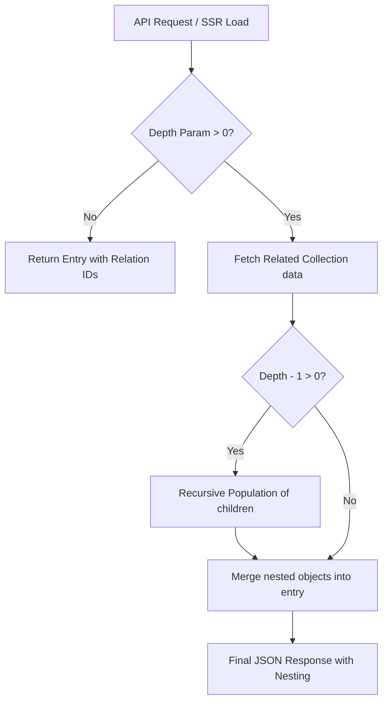

# Relationship Population with Depth Control

## Overview

## Data Flow Diagram



## The Problem

By default, relationship fields in SveltyCMS store only the ID of related entries:

```typescript
{
  _id: "post-123",
  title: "My Blog Post",
  author: "user-456",  // ← Just an ID
  categories: ["cat-1", "cat-2"]  // ← Array of IDs
}
```

To display the author's name or category titles, you need to make additional API calls. However, sometimes you want the related data to be included automatically:

```typescript
{
  _id: "post-123",
  title: "My Blog Post",
  author: {  // ← Full author object
    _id: "user-456",
    name: "John Doe",
    email: "john@example.com"
  },
  categories: [  // ← Full category objects
    { _id: "cat-1", name: "Technology" },
    { _id: "cat-2", name: "AI" }
  ]
}
```

The **depth parameter** gives you fine-grained control over this behavior.

## How It Works

### Depth Levels

The `depth` parameter accepts values from **0 to 10**:

- **depth=0**: Return only IDs (most efficient, smallest payload)
- **depth=1**: Populate direct relationships (default)
- **depth=2**: Populate relationships and their relationships
- **depth=3+**: Continue populating nested relationships up to the specified depth

### Example: Blog Posts with Authors and Comments

Consider this data structure:

```
Post
├─ author (User)
│  └─ department (Department)
└─ comments (Array of Comments)
   └─ author (User)
      └─ department (Department)
```

**With depth=0** (IDs only):

```json
{
	"author": "user-123",
	"comments": ["comment-1", "comment-2"]
}
```

**Payload size**: ~200 bytes

**With depth=1** (populate direct relations):

```json
{
	"author": {
		"_id": "user-123",
		"name": "John Doe",
		"department": "dept-456"
	},
	"comments": [
		{
			"_id": "comment-1",
			"text": "Great post!",
			"author": "user-789"
		}
	]
}
```

**Payload size**: ~800 bytes

**With depth=2** (populate nested relations):

```json
{
	"author": {
		"_id": "user-123",
		"name": "John Doe",
		"department": {
			"_id": "dept-456",
			"name": "Engineering"
		}
	},
	"comments": [
		{
			"_id": "comment-1",
			"text": "Great post!",
			"author": {
				"_id": "user-789",
				"name": "Jane Smith",
				"department": "dept-999"
			}
		}
	]
}
```

**Payload size**: ~1.5KB

## Usage

### In API Requests

Add the `depth` query parameter to any entry read request:

```bash
# Get entries with default depth (1)
GET /api/collections/posts

# Get entries with only IDs (no population)
GET /api/collections/posts?depth=0

# Get entries with nested relations populated
GET /api/collections/posts?depth=2
```

### In SSR Page Loads

The depth parameter is automatically extracted from the URL and applied during server-side rendering:

```
/en/posts?depth=2
```

This works transparently with SvelteKit's load functions.

### Per-Field Population Depth

You can also configure population depth per field in your collection schema:

```typescript
import { widgets } from '@cms/widgets/proxy';

export const schema: Schema = {
	fields: [
		widgets.Relation({
			label: 'Author',
			db_fieldName: 'author',
			collection: 'users',
			displayField: 'name',
			populationDepth: 2 // ← Always populate this field to depth 2
		}),
		widgets.Relation({
			label: 'Category',
			db_fieldName: 'category',
			collection: 'categories',
			displayField: 'name',
			populationDepth: 0 // ← Never populate, always return ID
		})
	]
};
```

Field-level depth takes precedence over the global `depth` query parameter.

## Performance Impact

### Token/Bandwidth Savings

Population depth directly impacts response size. Example measurements for a typical blog entry:

| Depth | Relations | Payload Size | AI Token Count\* |
| ----- | --------- | ------------ | ---------------- |
| 0     | 0         | 500 bytes    | ~125 tokens      |
| 1     | 5         | 3 KB         | ~750 tokens      |
| 2     | 15        | 12 KB        | ~3,000 tokens    |
| 3     | 45        | 40 KB        | ~10,000 tokens   |

\*Approximate, varies by content

### Database Query Impact

The population utility uses efficient MongoDB `$lookup` aggregation to minimize N+1 queries:

- **Without batching**: 1 query + N queries per relation = 1 + N queries
- **With batching** (current implementation): 1 query + 1 query per relation type = ~2-5 queries

Example:

- 10 blog posts each with author + category
- Without batching: 1 + (10 × 2) = 21 queries
- With batching: 1 + 2 = **3 queries** (10× more efficient)

## Best Practices

### 1. Use Depth=0 for Lists

When displaying entry lists, you rarely need full related data:

```typescript
// Good: Lightweight list view
GET /api/collections/posts?depth=0&limit=50

// Inefficient: Massive payload for list
GET /api/collections/posts?depth=2&limit=50
```

### 2. Use Higher Depth for Detail Views

Single entry views benefit from populated relations:

```typescript
// Good: Full data for single entry
GET /api/collections/posts/123?depth=2

// Inefficient: Extra request needed for each relation
GET /api/collections/posts/123?depth=0
```

### 3. Set Sensible Field-Level Defaults

Configure commonly-needed relations with appropriate depth:

```typescript
// Author is always needed - populate by default
(widgets.Relation({
	label: 'Author',
	db_fieldName: 'author',
	collection: 'users',
	displayField: 'name',
	populationDepth: 1
}),
	// Tags are shown as badges - no population needed
	widgets.RelationList({
		label: 'Tags',
		db_fieldName: 'tags',
		collection: 'tags',
		displayField: 'name',
		populationDepth: 0
	}));
```

### 4. Limit Depth for Circular Relations

Avoid infinite loops with circular references:

```typescript
// User → Posts → User → Posts → ...
// LIMIT depth to prevent explosion

GET /api/collections/users/123?depth=2  // ✓ Safe
GET /api/collections/users/123?depth=5  // ✗ May cause issues
```

### 5. Cache Populated Results

Populated data is cached using the same cache keys as unpopulated data, but with depth included:

```
collection:posts:page:1:lang:en:depth:2
```

Adjust cache TTL based on data volatility:

- Rarely changing relations (users, categories): Longer TTL
- Frequently changing content (comments, stats): Shorter TTL

## Advanced Usage

### Selective Field Population

Combine `depth` with field filtering for precise control:

```bash
# Populate only specific fields to depth 2
GET /api/collections/posts?depth=2&fields=author,category

# Get everything but only populate author
GET /api/collections/posts?depth=1&populateFields=author
```

(Note: Field filtering may require additional implementation)

### Multi-Tenant Considerations

Population automatically respects tenant boundaries:

- Related entries from other tenants are filtered out
- Depth population maintains tenant isolation
- No additional configuration needed

### GraphQL Integration (Future)

If GraphQL support is added, depth can map to nested field selection:

```graphql
query {
	posts {
		title
		author {
			# depth=1
			name
			department {
				# depth=2
				name
			}
		}
	}
}
```

## Troubleshooting

### Relations Not Populating

1. **Check depth parameter**: Ensure `depth > 0`
2. **Verify field configuration**: Confirm the field is a Relation/RelationList widget
3. **Check permissions**: Ensure you have read access to the related collection
4. **Inspect collection ID**: Verify the `collection` field references a valid collection

### Performance Issues with High Depth

1. **Reduce depth**: Lower the depth value to reduce queries
2. **Use field-level depth**: Set `populationDepth: 0` for heavy relations
3. **Implement caching**: Ensure cache service is configured correctly
4. **Monitor query count**: Check logs for N+1 query patterns

### Circular Reference Errors

1. **Limit depth**: Keep depth ≤ 3 for schemas with circular refs
2. **Use field-level control**: Set `populationDepth: 0` on circular fields
3. **Redesign schema**: Consider breaking circular dependencies

## Implementation Details

### How Population Works Internally

1. **Query entries**: Fetch requested entries from database
2. **Identify relations**: Scan schema for Relation/RelationList fields
3. **Batch fetch**: Collect all related IDs and fetch in single query per collection
4. **Recursive populate**: If depth > 1, repeat for nested relations
5. **Update entries**: Replace IDs with populated objects

### Security & Permissions

- Related entries respect the same permission model as direct queries
- Users can only populate relations they have read access to
- Multi-tenant filtering is applied at every depth level

## See Also

- [Collection Schema Configuration](../configuration/collections.mdx)
- [Performance Optimization Guide](../guides/performance.mdx)
- [Caching Strategy](../architecture/caching.mdx)
- [Multi-Tenant Architecture](../architecture/multi-tenancy.mdx)
