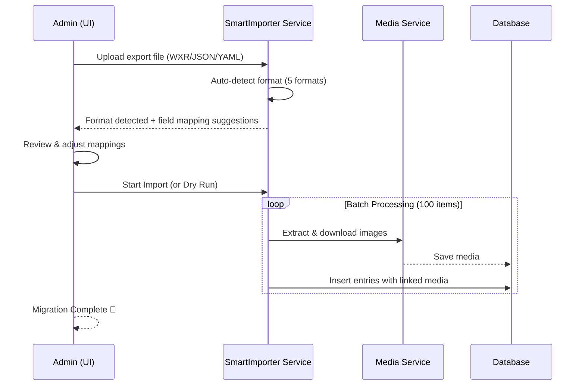

## 🔄 Migration Workflow



## 🚀 Key Features

- **5-Format Auto-Detection**: Automatically identifies WordPress WXR XML, Strapi JSON, Directus JSON, Drupal YAML/CSV, and SveltyCMS JSON exports — no manual format selection needed.
- **AI-Powered Field Mapping**: 30+ heuristic field mappings with format-specific lookup tables (e.g., `post_title→title`, `body→content`, ACF fields→widget types). Confidence levels (high/medium/low) for each suggestion.
- **Drupal Enhanced Support**: Detects complex text fields (body with format → richtext), taxonomy terms (field_tags, field_category → tags/categories), entity references (target_type/target_id → relatedContent), and media fields. Supports Single Content Sync YAML and Content Export CSV formats. **Post-import**: entity references are resolved to actual SveltyCMS document IDs using a source→destination map table (like Drupal Migrate API). **Revision import**: Drupal revision history (`vid`, `revision_log`) is imported as SveltyCMS `contentRevisions`.
- **WordPress Enhanced Support**: Full WXR parsing with ACF/CMB2 custom field detection, category/tag taxonomy extraction, richtext content detection (`content:encoded`, rendered HTML), and featured image/media attachment extraction.
- **Drag-and-Drop UI**: Upload any supported export file via `src/routes/(app)/config/importer/+page.svelte` — the importer auto-detects the format and shows an editable field mapping preview before import.
- **ACF/CMB2 Detection**: Automatically detects Advanced Custom Fields and Custom Meta Boxes in WordPress exports and maps them to corresponding widget types.
- **Media Handling**: Extracts image URLs from exports, offers to download and import or reference externally.
- **Batch Processing**: 100 items per batch with event-loop yielding via `setTimeout` — handles 10,000+ item datasets without server starvation.
- **Dry-Run Mode**: Validates the entire import without inserting — see exactly what will be created before committing.
- **Progress Tracking**: Real-time progress bar with item-by-item status during import.

---

## 🛠 Migration Guides

Choose your source platform below for a detailed step-by-step migration plan.

---

### 🔵 WordPress → SveltyCMS

WordPress sites can be migrated via **WXR export file** (recommended) or **live REST API sync**.

#### Method A: WXR Export File (Recommended)

**Step 1 — Export from WordPress**

1. In your WordPress admin, go to **Tools → Export**.
2. Choose "All content" or select specific post types (Posts, Pages, Media).
3. Click **Download Export File**. You'll get a `.xml` WXR file.

**Step 2 — Import to SveltyCMS**

1. Go to **Config → Importer** in SveltyCMS admin.
2. Drag your `.xml` file onto the upload area.
3. The importer auto-detects it as WordPress WXR format.
4. Select a target collection or let the importer scaffold one.
5. Review the AI-suggested field mappings (see table below).
6. Click **Dry Run** to validate, then **Start Import**.

**What gets imported:**

| WordPress Field        | SveltyCMS Target | Notes                                           |
| :--------------------- | :--------------- | :---------------------------------------------- |
| `post_title` / `title` | `title`          | High confidence match                           |
| `content:encoded`      | `content`        | HTML detected as richtext                       |
| `excerpt:encoded`      | `excerpt`        |                                                 |
| `wp:post_name`         | `slug`           |                                                 |
| `wp:status`            | `status`         | publish→published, draft→draft, pending→pending |
| `wp:post_date`         | `createdAt`      |                                                 |
| `wp:post_modified`     | `updatedAt`      |                                                 |
| `dc:creator`           | `author`         | Author name preserved                           |
| `wp:post_parent`       | `parentId`       | Hierarchical pages preserved                    |
| `wp:menu_order`        | `order`          | Display order preserved                         |
| `wp:post_format`       | `format`         | standard, aside, gallery, etc.                  |
| `wp:comment_status`    | `commentStatus`  | open / closed                                   |
| Categories (domain)    | `categories`     | Array of category names                         |
| Tags (`post_tag`)      | `tags`           | Array of tag names                              |
| Post meta (ACF/CMB2)   | `customFields`   | Non-underscore meta keys → custom fields        |
| `_thumbnail_id`        | `featuredImage`  | Resolved to `wp-media:{id}`                     |
| Comments               | `comments`       | Author, email, date, content, parent            |
| Attachments            | Media library    | URLs extracted for optional download            |

**Post-Import Checklist:**

- [ ] Review author mapping — map WordPress usernames to SveltyCMS users
- [ ] Download media attachments if desired (set `importMedia: true`)
- [ ] Verify hierarchical content (pages with parentId reordered correctly)
- [ ] Check custom fields — ACF/CMB2 fields are available in `customFields` for manual mapping
- [ ] Verify comment import — comments preserve author, date, threaded structure

#### Method B: Live REST API Sync

1. Ensure your WordPress site has the REST API enabled (enabled by default).
2. In SveltyCMS Importer UI, select **WordPress (REST API)** as source.
3. Enter your WordPress site URL (e.g., `https://mysite.com`) and content type (`posts`, `pages`).
4. Optionally provide an Application Password for authenticated access.
5. Click **Connect** — the importer fetches schema and sample data.
6. Review AI field mappings and start import.

> **Note**: REST API sync is best for simple content. For full fidelity (comments, ACF fields, media, hierarchy), use the WXR file method.

---

### 🟦 Drupal → SveltyCMS

Drupal sites offer three migration paths: **JSON:API live sync**, **Single Content Sync YAML**, or **Content Export CSV**.

#### Method A: JSON:API Live Sync (Recommended)

**Prerequisites:**

- Drupal site with JSON:API module enabled (included in Drupal core 8+)
- API key or Basic Auth for authenticated access to unpublished content

**Step 1 — Enable JSON:API on Drupal**

1. JSON:API is enabled by default in Drupal 9+. Verify at `/admin/modules`.
2. For authenticated access, enable **Basic Auth** or **API Key** module.

**Step 2 — Connect from SveltyCMS**

1. Go to **Config → Importer** in SveltyCMS admin.
2. Select **Drupal (JSON:API)** as source type.
3. Enter your Drupal URL (e.g., `https://mysite.com`) and content type (e.g., `article`, `page`).
4. Optionally provide an API key for authenticated access.
5. Click **Connect** — the importer fetches the schema with auto-detected field types.

**Step 3 — Review & Import**

1. Review the AI field mapping suggestions.
2. Click **Dry Run** to see sample data without inserting.
3. Click **Start Import** to begin the migration.

**Field Type Detection:**

| Drupal Field Pattern             | Detected As | SveltyCMS Widget    |
| :------------------------------- | :---------- | :------------------ |
| `body` with `format`/`processed` | `richtext`  | RichText            |
| `field_image`, `field_media`     | `media`     | MediaUpload         |
| `field_tags`, `field_category`   | `taxonomy`  | Tags / Categories   |
| `field_related_content`          | `relation`  | Relation (resolved) |
| `field_*` with `uri`+`title`     | `link`      | URL                 |
| `created`, `changed`             | `date`      | DateTime            |

**What gets imported:**

- **Richtext**: `body.value` → `content`, `body.format` → `contentFormat`
- **Taxonomy**: Resolved from JSON:API `included` data → `tags` / `categories` arrays
- **Entity References**: Collected during import, resolved in a second pass using source-UUID → SveltyCMS-ID map
- **Revisions**: `vid`, `revision_log`, full attribute snapshot → `contentRevisions`
- **Language**: `langcode` preserved

#### Method B: Single Content Sync YAML

**Step 1 — Export from Drupal**

1. Install and enable the [Single Content Sync](https://www.drupal.org/project/single_content_sync) module.
2. Go to **Content** → find the node → click **Export**.
3. For bulk export: select multiple nodes, choose **Export content** action, click **Apply**.
4. Download the ZIP file (contains YAML files + assets) or single YAML file.

**Step 2 — Import to SveltyCMS**

1. Drag the `.yml` file onto the importer upload area.
2. The importer auto-detects it as Drupal YAML format.
3. Nested YAML structures are parsed: `body` with `value`/`format`, taxonomy references, entity references.
4. Review field mappings and start import.

#### Method C: Content Export CSV

**Step 1 — Export from Drupal**

1. Install and enable the [Content Export CSV](https://www.drupal.org/project/content_export_csv) module.
2. Go to **Content → Content Export**.
3. Choose content type and click **Export**.
4. Download the `.csv` file.

**Step 2 — Import to SveltyCMS**

1. Drag the `.csv` file onto the importer upload area.
2. The importer auto-detects headers as field names.
3. Field types are inferred from column name patterns (`field_image` → media, `field_tags` → tags).
4. Review mappings and start import.

**Post-Import Checklist:**

- [ ] Verify entity references resolved correctly (check relatedContent arrays)
- [ ] Check revision history imported (contentRevisions table)
- [ ] Review taxonomy terms — they should appear as tag/category arrays
- [ ] If using Drupal Paragraphs, those are imported as entity references — manually restructure if needed
- [ ] URL aliases (pathauto) are mapped to `slug` — verify SEO URLs preserved

---

### 🟧 Strapi → SveltyCMS

**Step 1 — Export from Strapi**

1. Use Strapi's Content-Type Builder or a backup/export plugin to get a JSON export.
2. The file should have `data` array with `id` and `attributes` objects.

**Step 2 — Import to SveltyCMS**

1. Drag the JSON file onto the importer.
2. The importer detects Strapi format from `data` / `contentTypes` structure.
3. Known field mappings: `title`→`title`, `content`/`body`→`content`, `description`/`excerpt`→`excerpt`, `slug`→`slug`, `created_at`→`createdAt`, `updated_at`→`updatedAt`, `published_at`→`publishedAt`, `image`/`cover`→`featuredImage`.
4. Review and import.

---

### 🟪 Directus → SveltyCMS

**Step 1 — Export from Directus**

1. Use Directus's export functionality or database dump.
2. Format should be JSON with `collections` / `fields` structure, or array of items.

**Step 2 — Import to SveltyCMS**

1. Drag the JSON file onto the importer.
2. The importer detects Directus format.
3. Known field mappings: `title`/`name`→`title`, `content`/`body`→`content`, `description`→`excerpt`, `slug`→`slug`, `status`→`status`, `date_created`→`createdAt`, `date_updated`→`updatedAt`, `image`/`thumbnail`→`featuredImage`.
4. Review and import.

---

### 🟢 SveltyCMS → SveltyCMS

For migrating between SveltyCMS instances or restoring backups.

**Step 1 — Export from SveltyCMS**

1. Use the native export format with `metadata` / `collections` structure.
2. Each collection is a key with an array of items.

**Step 2 — Import**

1. Drag the JSON file onto the importer.
2. All fields are preserved as-is since the format is native.
3. `_id` values are preserved for idempotent imports.

---

## 🤖 AI-Powered Field Mapping

After uploading your file, the heuristic engine (`mapFields()`) analyzes both schemas and suggests mappings with confidence levels:

- **🟢 High confidence**: Direct name match (e.g., `title→title`, `slug→slug`, `createdAt→createdAt`)
- **🟡 Medium confidence**: Semantic match (e.g., `post_content→content`, `post_excerpt→excerpt`, `featured_image→featuredImage`)
- **🔴 Low confidence**: Best guess via alias lookup — review carefully

You can **manually adjust** any mapping by selecting a different target field. The editable mapping preview updates in real-time.

---

## ✅ Execute or Dry-Run

- **Dry Run**: Click "Validate" to process all mappings without inserting data. Detects schema mismatches and validation errors early.
- **Full Import**: Click "Start Import" to begin the migration. A progress bar shows real-time status including items processed, errors, and estimated time remaining.

---

## 🔒 Security & Performance (v2026 Enhanced)

- **Tenant Isolation**: Imports are strictly scoped to your current `tenantId` via `dbAdapter` injection.
- **Validation**: All imported data is run through your widget's Valibot schemas to ensure integrity before insert.
- **Batch Processing**: 100 items per batch with `setTimeout(0)` event-loop yielding to keep the server responsive during large migrations.
- **Progress Tracking**: `onProgress` callback fires per-batch with `{ percentage, current, total, phase }`.
- **Graceful Error Handling**: Failed items are collected and reported — successful items are committed. No partial-corruption scenarios.

## 📡 API & Service Reference

The importer is a **service + UI component** — no dedicated REST endpoint needed:

```
import { SmartImporter } from "@services/smart-importer";

const importer = new SmartImporter(dbAdapter, tenantId);

// Auto-detect format
const format = await importer.detectFormat(file);
// → 'wordpress' | 'strapi' | 'directus' | 'drupal' | 'sveltycms'

// Dry-run validation
const preview = await importer.import(file, {
  dryRun: true,
  onProgress: (p) => console.log(`${p.percentage}% complete`),
});

// Full import
const result = await importer.import(file, {
  dryRun: false,
  targetCollection: "posts",
  fieldMapping: adjustedMappings, // optional overrides
  onProgress: (p) => console.log(`Imported ${p.current}/${p.total}`),
});

console.log(`Imported: ${result.imported}, Skipped: ${result.skipped}, Errors: ${result.errors}`);
```

Refer to `src/services/smart-importer.ts` for the full API.

---

## Related

- [Getting Started](../../getting-started.mdx)
- [Architecture Overview](../../architecture/index.mdx)
- [Security Overview](../../architecture/security/index.mdx)
