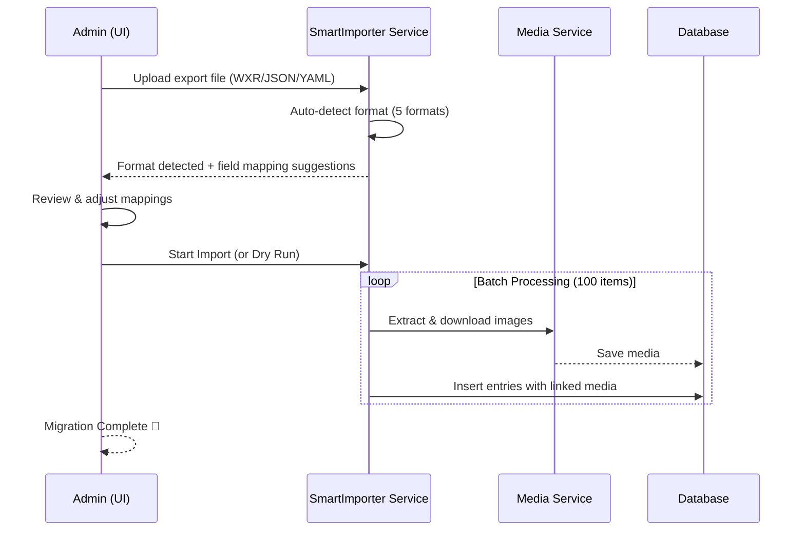

## 🔄 Migration Workflow



## 🚀 Key Features

- **5-Format Auto-Detection**: Automatically identifies WordPress WXR XML, Strapi JSON, Directus JSON, Drupal YAML/CSV, and SveltyCMS JSON exports — no manual format selection needed.
- **AI-Powered Field Mapping**: 30+ heuristic field mappings with format-specific lookup tables (e.g., `post_title→title`, `body→content`, ACF fields→widget types). Confidence levels (high/medium/low) for each suggestion.
- **Drupal Enhanced Support**: Detects complex text fields (body with format → richtext), taxonomy terms (field_tags, field_category → tags/categories), entity references (target_type/target_id → relatedContent), and media fields. Supports Single Content Sync YAML and Content Export CSV formats. **Post-import**: entity references are resolved to actual SveltyCMS document IDs using a source→destination map table (like Drupal Migrate API). **Revision import**: Drupal revision history (`vid`, `revision_log`) is imported as SveltyCMS `contentRevisions`.
- **WordPress Enhanced Support**: Full WXR parsing with ACF/CMB2 custom field detection, category/tag taxonomy extraction, richtext content detection (`content:encoded`, rendered HTML), and featured image/media attachment extraction.
- **Drag-and-Drop UI**: Upload any supported export file via `src/routes/(app)/config/importer/+page.svelte` — the importer auto-detects the format and shows an editable field mapping preview before import.
- **ACF/CMB2 Detection**: Automatically detects Advanced Custom Fields and Custom Meta Boxes in WordPress exports and maps them to corresponding widget types.
- **Media Handling**: Extracts image URLs from exports, offers to download and import or reference externally.
- **Batch Processing**: 100 items per batch with event-loop yielding via `setTimeout` — handles 10,000+ item datasets without server starvation.
- **Dry-Run Mode**: Validates the entire import without inserting — see exactly what will be created before committing.
- **Progress Tracking**: Real-time progress bar with item-by-item status during import.

---

## 🛠 How to Use

### Step 1: Upload Your Export File

Access the Smart Importer via the admin panel. The component is at `src/components/admin/smart-importer.svelte`.

1. **Drag and Drop** your export file onto the upload area.
2. **Auto-Detection**: The `SmartImporter.detectFormat()` method instantly identifies the format from file structure:
   - **WordPress**: WXR XML files (`.xml` with `<rss>` / `<channel>` / `<item>` structure) — handles posts, pages, custom post types, ACF/CMB2 fields
   - **Strapi**: JSON export files with `data` / `contentTypes` structure
   - **Directus**: JSON schema + data exports with `collections` / `fields` structure
   - **Drupal**: Single Content Sync YAML (`.yml`), Content Export CSV (`.csv`), or JSON:API responses — detects richtext body format, taxonomy terms, entity references
   - **SveltyCMS**: Native JSON export format with `metadata` / `collections` structure
3. **Target Collection**: Select an existing collection or let the importer scaffold a new one based on detected fields.

### Drupal-Specific Notes

- **YAML (Single Content Sync)**: The importer parses nested YAML structures with entity references. Fields like `field_body` with `format: text_with_summary` are detected as richtext. Taxonomy references (`field_tags`, `field_category`) are extracted as tag/category arrays. Entity references (`field_related_content`) are preserved as related content IDs.
- **CSV (Content Export CSV)**: Headers are used as field names. The importer auto-detects field types from column names (e.g., `field_image` → media, `field_tags` → tags).
- **JSON:API (Live Sync)**: Use the `fetchDrupalData()` adapter in `source-adapters.ts` for live migration from a running Drupal instance. The adapter detects richtext fields (format + processed), taxonomy relationships (term type), and media references automatically.
- **Relationship Resolution**: After all items are imported, the importer builds a source-UUID → SveltyCMS-ID map (like Drupal Migrate API's map tables) and resolves entity references in a second pass. Taxonomy terms are imported as tag/category arrays; entity references become proper SveltyCMS relation fields.
- **Revision Import**: If the target collection supports revisions (`revision: true`), Drupal revision history is imported as `contentRevisions`. Each revision stores the full attribute snapshot, `vid` as version number, and `revision_log` as commit message.

### WordPress-Specific Notes

- **WXR Format**: The importer extracts posts, pages, and custom post types from WordPress export files. `content:encoded` fields with HTML are detected as richtext content. Categories and tags are extracted from their respective taxonomy domains. ACF/CMB2 custom fields are collected as `customFields` for manual mapping.
- **Rich Text Detection**: WordPress REST API responses with `rendered` HTML objects are automatically detected as richtext type. WXR `content:encoded` fields with HTML tags are similarly treated as richtext content.

### Step 2: Review Field Mappings

The heuristic engine (`mapFields()`) analyzes both schemas and suggests mappings with confidence levels:

- **🟢 High confidence**: Direct name match (e.g., `title→title`, `slug→slug`, `createdAt→createdAt`)
- **🟡 Medium confidence**: Semantic match (e.g., `post_content→content`, `post_excerpt→excerpt`, `featured_image→featuredImage`)
- **🔴 Low confidence**: Best guess via alias lookup — review carefully

You can **manually adjust** any mapping by selecting a different target field. The editable mapping preview updates in real-time.

### Step 3: Execute or Dry-Run

- **Dry Run**: Click "Validate" to process all mappings without inserting data. Detects schema mismatches and validation errors early.
- **Full Import**: Click "Start Import" to begin the migration. A progress bar shows real-time status including items processed, errors, and estimated time remaining.

---

## 🔒 Security & Performance (v2026 Enhanced)

- **Tenant Isolation**: Imports are strictly scoped to your current `tenantId` via `dbAdapter` injection.
- **Validation**: All imported data is run through your widget's Valibot schemas to ensure integrity before insert.
- **Batch Processing**: 100 items per batch with `setTimeout(0)` event-loop yielding to keep the server responsive during large migrations.
- **Progress Tracking**: `onProgress` callback fires per-batch with `{ percentage, current, total, phase }`.
- **Graceful Error Handling**: Failed items are collected and reported — successful items are committed. No partial-corruption scenarios.

## 📡 API & Service Reference

The importer is a **service + UI component** — no dedicated REST endpoint needed:

```
import { SmartImporter } from "@services/smart-importer";

const importer = new SmartImporter(dbAdapter, tenantId);

// Auto-detect format
const format = await importer.detectFormat(file);
// → 'wordpress' | 'strapi' | 'directus' | 'drupal' | 'sveltycms'

// Dry-run validation
const preview = await importer.import(file, {
  dryRun: true,
  onProgress: (p) => console.log(`${p.percentage}% complete`),
});

// Full import
const result = await importer.import(file, {
  dryRun: false,
  targetCollection: "posts",
  fieldMapping: adjustedMappings, // optional overrides
  onProgress: (p) => console.log(`Imported ${p.current}/${p.total}`),
});

console.log(`Imported: ${result.imported}, Skipped: ${result.skipped}, Errors: ${result.errors}`);
```

Refer to `src/services/smart-importer.ts` for the full API.

---

## Related

- [Getting Started](../../getting-started.mdx)
- [Architecture Overview](../../architecture/index.mdx)
- [Security Overview](../../architecture/security/index.mdx)
