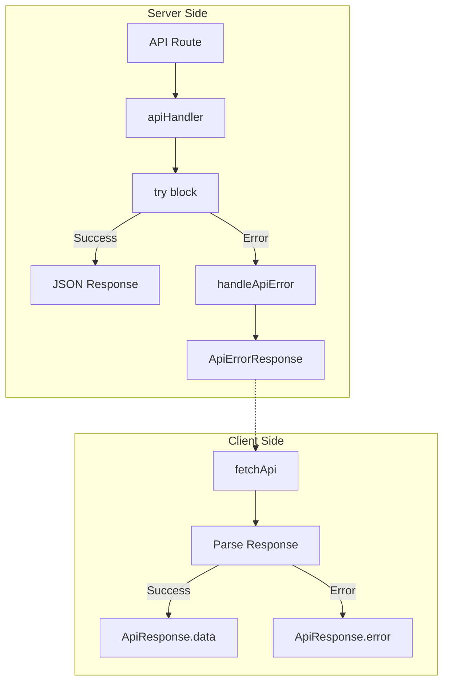

# Unified Error Handling

SveltyCMS implements a comprehensive error handling system that provides consistent error responses across the entire API surface, integrates with client-side validation, and enables robust debugging in development.

---

## Overview

The unified error handling system consists of three core modules:

| Module               | Path                         | Purpose                                        |
| -------------------- | ---------------------------- | ---------------------------------------------- |
| **errorHandling.ts** | `src/utils/errorHandling.ts` | Core error types, handlers, and utilities      |
| **apiHandler.ts**    | `src/utils/apiHandler.ts`    | Higher-order function for API route protection |
| **apiClient.ts**     | `src/utils/apiClient.ts`     | Client-side fetch wrapper with error handling  |



---

## Core Concepts

### ApiErrorResponse Interface

All API errors return a standardized response shape:

```typescript
interface ApiErrorResponse {
	success: false;
	message: string; // Human-readable error message
	code?: string; // Machine-readable error code
	issues?: string[]; // Validation or field-specific issues
	status?: number; // HTTP status code (for logging)
	stack?: string; // Stack trace (development only)
}
```

### AppError Class

The `AppError` class is the standard way to throw errors in the application:

```typescript
import { AppError } from '@utils/errorHandling';

// Basic usage
throw new AppError('User not found', 404, 'NOT_FOUND');

// With details
throw new AppError('Validation failed', 400, 'VALIDATION_ERROR', { fields: ['email', 'password'] });
```

#### Constructor Parameters

| Parameter | Type      | Default            | Description                  |
| --------- | --------- | ------------------ | ---------------------------- |
| `message` | `string`  | required           | Human-readable error message |
| `status`  | `number`  | `500`              | HTTP status code             |
| `code`    | `string`  | `'INTERNAL_ERROR'` | Machine-readable error code  |
| `details` | `unknown` | `undefined`        | Additional error context     |

### Error Codes

Standard error codes used across the application:

| Code               | Status | Description                 |
| ------------------ | ------ | --------------------------- |
| `VALIDATION_ERROR` | 400    | Invalid input data          |
| `UNAUTHORIZED`     | 401    | Authentication required     |
| `FORBIDDEN`        | 403    | Insufficient permissions    |
| `NOT_FOUND`        | 404    | Resource not found          |
| `CONFLICT`         | 409    | Resource already exists     |
| `INTERNAL_ERROR`   | 500    | Server error                |
| `NETWORK_ERROR`    | -      | Client-side network failure |

---

## Server-Side Usage

### The apiHandler Wrapper

Wrap all API routes with `apiHandler` to enable automatic error handling:

```typescript
// src/routes/api/users/+server.ts
import { json } from '@sveltejs/kit';
import { apiHandler } from '@utils/apiHandler';
import { AppError } from '@utils/errorHandling';

export const GET = apiHandler(async (event) => {
	const userId = event.params.id;

	if (!userId) {
		throw new AppError('User ID is required', 400, 'MISSING_USER_ID');
	}

	const user = await db.users.findById(userId);

	if (!user) {
		throw new AppError('User not found', 404, 'NOT_FOUND');
	}

	return json({ success: true, data: user });
});
```

### Benefits of apiHandler

1. **No try-catch needed**: Errors are caught automatically
2. **Consistent responses**: All errors follow `ApiErrorResponse` format
3. **Valibot integration**: Validation errors are formatted automatically
4. **Logging**: Errors are logged with request context
5. **Stack traces**: Available in development mode only

### Handling Different Error Types

The `handleApiError` function handles various error types:

```typescript
// Valibot validation errors
import { parse } from 'valibot';
const data = parse(userSchema, await event.request.json());
// ➜ ValiError is caught and formatted as ApiErrorResponse

// SvelteKit HttpErrors
import { error } from '@sveltejs/kit';
throw error(403, 'Access denied');
// ➜ Converted to ApiErrorResponse with FORBIDDEN code

// Custom AppErrors
throw new AppError('Custom message', 400, 'CUSTOM_CODE');
// ➜ Directly formatted as ApiErrorResponse

// Unknown errors
throw new Error('Something went wrong');
// ➜ Wrapped with INTERNAL_ERROR code
```

---

## Client-Side Usage

### The fetchApi Function

Use `fetchApi` for all API calls to get consistent error handling:

```typescript
import { fetchApi } from '@utils/apiClient';

// GET request
const response = await fetchApi<User[]>('/api/users');

if (response.success) {
	console.log('Users:', response.data);
} else {
	console.error('Error:', response.message);
	console.error('Code:', response.code);
}
```

### ApiResponse Interface

```typescript
interface ApiResponse<T> {
	success: boolean;
	data?: T; // Present when success: true
	message?: string; // Error message when success: false
	code?: string; // Error code when success: false
	issues?: string[]; // Validation issues when applicable
}
```

### Making Requests

```typescript
// POST request with body
const result = await fetchApi<User>('/api/users', {
	method: 'POST',
	headers: { 'Content-Type': 'application/json' },
	body: JSON.stringify({ name: 'John', email: 'john@example.com' })
});

// PUT request
const updateResult = await fetchApi<User>(`/api/users/${id}`, {
	method: 'PUT',
	headers: { 'Content-Type': 'application/json' },
	body: JSON.stringify(userData)
});

// DELETE request
const deleteResult = await fetchApi(`/api/users/${id}`, {
	method: 'DELETE'
});
```

### Error Handling Patterns

```typescript
async function createUser(data: UserInput) {
	const response = await fetchApi<User>('/api/users', {
		method: 'POST',
		headers: { 'Content-Type': 'application/json' },
		body: JSON.stringify(data)
	});

	if (!response.success) {
		// Check error code for specific handling
		switch (response.code) {
			case 'VALIDATION_ERROR':
				// Show validation errors
				response.issues?.forEach((issue) => showFieldError(issue));
				break;
			case 'CONFLICT':
				showToast('User already exists', 'warning');
				break;
			case 'NETWORK_ERROR':
				showToast('Please check your connection', 'error');
				break;
			default:
				showToast(response.message || 'An error occurred', 'error');
		}
		return null;
	}

	return response.data;
}
```

---

## Validation Integration

### Widget Validation

Widgets integrate with the `validationStore` for field-level error handling. The `handleWidgetValidation` helper standardizes this process:

```typescript
// In widget input.svelte
import { handleWidgetValidation } from '@widgets/widgetErrorHandler';
import { validationStore } from '@stores/store.svelte';
import { parse } from 'valibot';

async function validateInput() {
	const result = handleWidgetValidation(() => parse(validationSchema, currentValue), {
		fieldName,
		updateStore: true,
		isTouched
	});

	// Result contains { valid, message, issues }
	return result.valid;
}
```

### ValidationStore API

```typescript
// Set an error
validationStore.setError('email', 'Invalid email format');

// Clear an error
validationStore.clearError('email');

// Clear all errors
validationStore.clearAllErrors();

// Check if valid
if (validationStore.isValid) {
	// All fields are valid
}

// Get specific error
const emailError = validationStore.getError('email');
```

---

## Utility Functions

### getErrorMessage

Extract a human-readable message from any error:

```typescript
import { getErrorMessage } from '@utils/errorHandling';

try {
	await riskyOperation();
} catch (error) {
	const message = getErrorMessage(error);
	console.error('Operation failed:', message);
}
```

### isAppError

Type guard to check if an error is an AppError:

```typescript
import { isAppError } from '@utils/errorHandling';

if (isAppError(error)) {
	console.log('Status:', error.status);
	console.log('Code:', error.code);
}
```

### wrapError

Convert any error into an AppError:

```typescript
import { wrapError } from '@utils/errorHandling';

try {
	await externalApiCall();
} catch (error) {
	throw wrapError(error, 'External API call failed', 502);
}
```

---

## Testing

### Unit Testing Error Handling

```typescript
import { describe, test, expect } from 'vitest';
import { AppError, handleApiError, getErrorMessage } from '@utils/errorHandling';

describe('AppError', () => {
	test('creates error with correct properties', () => {
		const error = new AppError('Test error', 400, 'TEST_CODE');

		expect(error.message).toBe('Test error');
		expect(error.status).toBe(400);
		expect(error.code).toBe('TEST_CODE');
		expect(error.name).toBe('AppError');
	});
});

describe('getErrorMessage', () => {
	test('extracts message from AppError', () => {
		const error = new AppError('Custom message', 400);
		expect(getErrorMessage(error)).toBe('Custom message');
	});

	test('extracts message from standard Error', () => {
		const error = new Error('Standard error');
		expect(getErrorMessage(error)).toBe('Standard error');
	});

	test('returns default for unknown types', () => {
		expect(getErrorMessage('string error')).toBe('string error');
		expect(getErrorMessage(null)).toBe('An unknown error occurred');
	});
});
```

### Integration Testing API Endpoints

```typescript
import { describe, test, expect } from 'vitest';

describe('API Error Handling', () => {
	test('returns validation error for invalid input', async () => {
		const response = await fetch('/api/users', {
			method: 'POST',
			headers: { 'Content-Type': 'application/json' },
			body: JSON.stringify({ email: 'invalid' })
		});

		const data = await response.json();

		expect(response.status).toBe(400);
		expect(data.success).toBe(false);
		expect(data.code).toBe('VALIDATION_ERROR');
		expect(data.issues).toBeDefined();
	});

	test('returns 404 for non-existent resource', async () => {
		const response = await fetch('/api/users/non-existent-id');
		const data = await response.json();

		expect(response.status).toBe(404);
		expect(data.success).toBe(false);
		expect(data.code).toBe('NOT_FOUND');
	});
});
```

### Running Tests with Bun

```bash
# Run all tests
bun test

# Run error handling tests
bun test --grep "error"

# Run with coverage
bun test --coverage
```

---

## Best Practices

### Do's

1. **Always use apiHandler** for API routes
2. **Use specific error codes** for different failure modes
3. **Include helpful error messages** for users
4. **Log with context** in development
5. **Validate on both client and server**
6. **Use the type guards** for safe error checking

### Don'ts

1. **Don't expose stack traces** in production
2. **Don't catch and swallow errors** silently
3. **Don't use generic error messages** when specific ones are better
4. **Don't bypass apiHandler** in API routes
5. **Don't store sensitive data** in error details

### Error Message Guidelines

```typescript
// ❌ Bad: Too technical
throw new AppError('ECONNREFUSED: Connection refused', 500);

// ✅ Good: User-friendly
throw new AppError('Unable to connect to the database. Please try again later.', 500, 'DB_CONNECTION_ERROR');

// ❌ Bad: Too vague
throw new AppError('Invalid input', 400);

// ✅ Good: Specific
throw new AppError('Email address is not valid', 400, 'INVALID_EMAIL');
```

---

## Troubleshooting

### Common Issues

**Stack traces showing in production**

- Check `NODE_ENV` is set to `production`
- Verify `dev` flag is not hardcoded

**Validation errors not formatted correctly**

- Ensure using Valibot schema with `parse()`
- Check `handleApiError` receives the ValiError

**CORS errors masking API errors**

- Check CORS headers are configured
- Verify preflight requests are handled

**Network errors not caught**

- Ensure using `fetchApi` wrapper
- Check for browser extensions blocking requests

---

## Related Documentation

- [API Documentation](/docs/api/index.mdx) - API endpoint reference
- [Widget Development Guide](/docs/widgets/development.mdx) - Widget validation patterns
- [Testing Guide](/docs/testing.mdx) - Testing strategies
- [Troubleshooting](/docs/troubleshooting.mdx) - Common issues and solutions

---

## API Reference

### Exports from errorHandling.ts

```typescript
// Classes
export class AppError extends Error { ... }

// Functions
export function handleApiError(err: unknown, event: RequestEvent): Response;
export function getErrorMessage(err: unknown): string;
export function isAppError(err: unknown): err is AppError;
export function isHttpError(err: unknown): err is HttpError;
export function wrapError(err: unknown, message?: string, status?: number): AppError;

// Types
export interface ApiErrorResponse { ... }
```

### Exports from apiHandler.ts

```typescript
export function apiHandler(handler: ApiHandlerCallback): RequestHandler;
```

### Exports from apiClient.ts

```typescript
export function fetchApi<T>(endpoint: string, options?: RequestInit): Promise<ApiResponse<T>>;
export interface ApiResponse<T> { ... }
```
