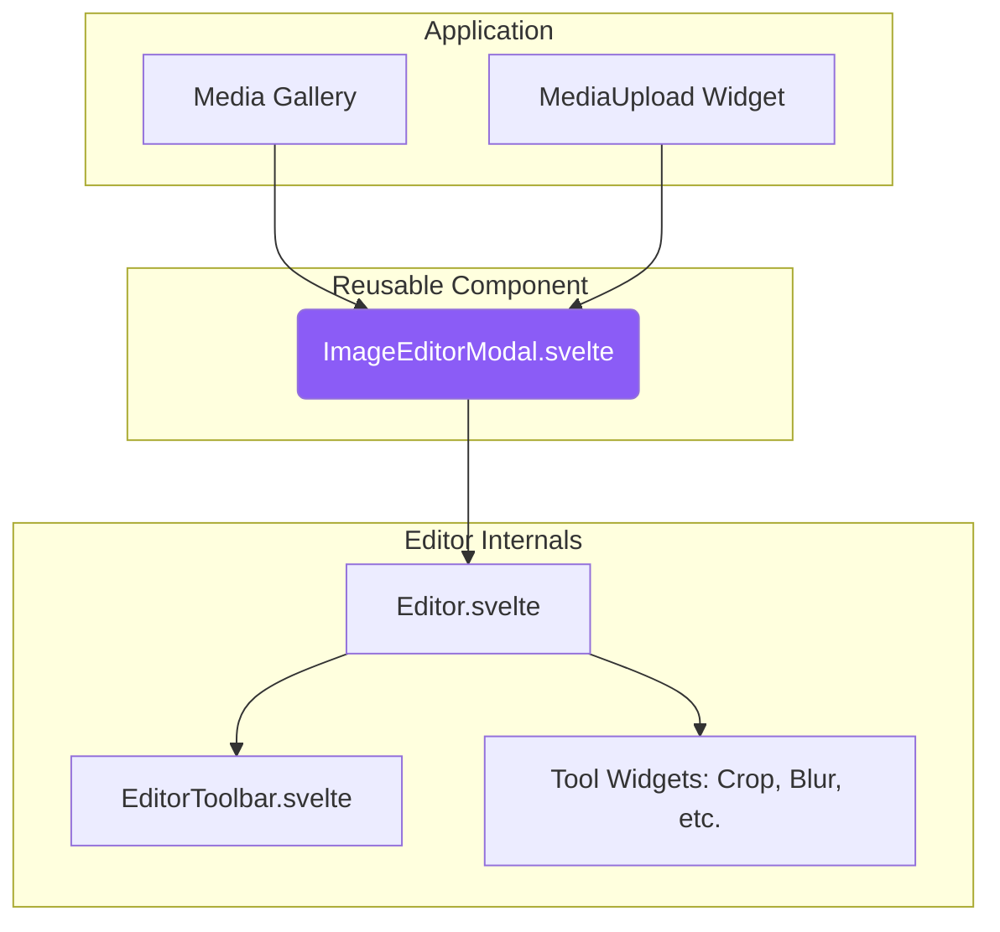

# Image Editor Guide

The SveltyCMS Image Editor is a powerful, integrated tool for media manipulation, redesigned with a modern user experience and a non-destructive workflow. This guide covers its architecture, features, and how it integrates into the CMS.

## 🏗️ Architecture & UI:

The editor has been refactored from a standalone page into a fully reusable modal component, prioritizing a clean and efficient user experience.



- **`ImageEditorModal.svelte`:** A wrapper that provides the modal UI (overlay, panel, header) and is responsible for launching the editor.
- **`Editor.svelte`:** The core editor, containing the Konva.js stage, tool components, and state management via the `imageEditorStore`.
- **`EditorToolbar.svelte`:** A single, intelligent bottom toolbar that dynamically displays controls for the currently active tool.
- **`widgets/`:** Tool-specific logic and controls are modularized into `src/components/imageEditor/widgets/`. Each widget (e.g., `Blur`, `Crop`) contains its own `Tool.svelte` (canvas logic) and `Controls.svelte` (UI inputs), making the editor highly extensible.

### Key UI Principles

1.  **Left Sidebar for Tools:** A simple, vertical sidebar on the left (desktop) allows you to select a tool (Crop, Blur, Annotate, etc.).
2.  **Distraction-Free Canvas:** The image takes up the main area of the screen with no other UI elements cluttering the view.
3.  **Single, Contextual Bottom Toolbar:** All controls are consolidated into a single toolbar at the bottom. This toolbar intelligently adapts to show only the relevant options for the active tool. For example, when "Crop" is active, it shows aspect ratio and rotation buttons. When "FineTune" is active, it shows sliders for brightness and contrast.

## 🎯 Core Philosophy: Non-Destructive Editing

Non-destructive editing is a best practice for any professional Content Management System. SveltyCMS fully embraces this philosophy. When you perform an action like cropping or applying a filter, you are not overwriting your original image.

- **Originals are Sacred:** The original uploaded image is never modified.
- **Edits as Variants:** Every time you save an edited image, a new, separate image file is created.
- **Reversibility:** You can always go back to the original asset.
- **Multiple Versions:** Create unlimited variations from a single source image for different use cases (e.g., a wide banner, a square thumbnail).

This is the same methodology used by enterprise Digital Asset Management (DAM) systems and professional tools like Adobe Lightroom, ensuring your source assets are always preserved.

## 💡 Media Handling and Asset Variants

To properly manage non-destructive edits, it's crucial to link edited images (variants) back to their source.

**Proposed Implementation:**

We recommend adding an `originalId: DatabaseId` field to the `MediaItem` schema.

- When an image is first uploaded, its `originalId` is `null`.
- When an image with `id: "img_123"` is edited and saved, a **new** media item is created (e.g., with `id: "variant_456"`).
- This new variant will have its `originalId` field set to `"img_123"`.

This creates a clear parent-child relationship between your assets.


### Benefits for the Media Gallery

This structure unlocks powerful features for the Media Gallery UI:

- **Grouped Assets:** Instead of seeing 10 nearly identical images, the gallery can show one "master" image with a badge indicating "9 variants".
- **Version History:** Clicking the master image could reveal a timeline of all its children, showing a clear history of edits.
- **Reduced Clutter:** It keeps the main gallery view clean and focused on the primary assets.
- **Easy Rollback:** Users can easily find and revert to the original asset at any time.

## ✨ Features & Tools

All editing tools operate in a non-destructive manner. When you apply a blur or add an annotation, you are creating a new object or filter on the Konva.js stage. These changes are only "baked" into a final image when you click the main "Save" button, which generates a new image variant.

- **Crop:** Crop, rotate, and flip. Supports multiple aspect ratios (Free, 1:1, 4:3, 16:9, 3:2, 9:16) and shapes (Rectangle, Circular).
- **Rotate:** Fine-tune rotation with a slider (-180° to 180°), quick 90° rotation buttons, and horizontal/vertical flip.
- **Zoom:** Zoom in/out with mouse wheel, slider, or buttons. Includes Fit to Screen, Fill Screen, and Actual Size (100%) options. Pan by dragging when zoomed in.
- **Blur:** Apply regional blur or pixelation. Features a fully interactive UI with resizable, rotatable regions (Rectangle/Ellipse), independent strength settings, and easy add/remove controls.
- **Focal Point:** Set the focal point for intelligent, art-directed cropping in responsive layouts. Click anywhere on the image to set the focal point coordinates.
- **FineTune:** Adjust brightness, contrast, saturation, exposure, and more using intuitive sliders.
- **Annotate:** Add text, arrows, rectangles, circles, and lines to the image. All annotations are editable with resize/rotate handles.
- **Watermark:** Overlay a watermark image. The position, scale, and opacity are configurable in the `MediaUpload` widget's options. Server-side processing applies the watermark upon saving.

### Zoom Tool

The Zoom tool provides precise viewport control for detailed editing:

| Feature | Description |
|---------|-------------|
| **Mouse Wheel** | Scroll to zoom in/out centered on cursor |
| **Zoom Slider** | Precise zoom control from 10% to 500% |
| **Zoom Buttons** | Quick +/- buttons for step zooming |
| **Fit to Screen** | Zoom to fit entire image in viewport (90% padding) |
| **Fill Screen** | Zoom to fill viewport (may crop edges) |
| **Actual Size** | View at 100% (native resolution) |
| **Pan** | Click and drag to pan when zoomed in |

### Focal Point Selection

The focal point system enables intelligent, art-directed cropping for responsive images. There are two ways to set a focal point:

#### Quick Focal Point Modal (Media Gallery)

1. In the **Media Gallery**, hover over any image.
2. Click the **crosshair icon** (🎯) to open the Quick Focal Modal.
3. Drag the crosshair to the most important part of the image.
4. Click **Save** to persist the focal point to the image metadata.

#### Inline Focal Point (MediaUpload Widget)

1. When an image is loaded in the `MediaUpload` widget, a crosshair overlay appears.
2. Drag the crosshair to set the focal point.
3. The coordinates are saved when the form is submitted.

#### Using Focal Points

Focal points are stored as percentages (0-100) in `metadata.focalPoint`:

```typescript
{ focalPoint: { x: 60, y: 30 } } // 60% from left, 30% from top
```

Use the **Transform API** with the `focal` parameter:

```
/api/media/transform/image.jpg?w=400&h=400&focal=60,30
```

### Watermark Presets

Collections can define watermark presets that auto-load in the Image Editor:

```typescript
// In collection schema
widgets.MediaUpload({
	label: 'Product Image',
	watermark: {
		url: '/static/watermarks/logo.png',
		position: 'southeast', // bottom-right
		scale: 20 // 20% of image width
	}
});
```

When the user opens the Watermark tool, the preset watermark is automatically loaded and positioned. Upon saving, the watermark is baked into the image via Sharp.js.

## 🔧 API Integration

### Edit Endpoint

The Image Editor integrates with the `/api/media/edit` endpoint for server-side processing:

```http
POST /api/media/edit
Content-Type: multipart/form-data

file: <edited image file>
mediaId?: <original media ID for variant tracking>
operations?: <JSON string of applied operations>
focalPoint?: <JSON string of focal point {x, y}>
```

**Response:**

```json
{
  "success": true,
  "data": {
    "_id": "new_media_id",
    "filename": "image-edited-1234567890-hash.webp",
    "path": "mediaFolder/image-edited-1234567890-hash.webp",
    "url": "/mediaFolder/image-edited-1234567890-hash.webp",
    "width": 1920,
    "height": 1080,
    "size": 245760,
    "metadata": {
      "originalId": "original_media_id",
      "focalPoint": { "x": 50, "y": 30 },
      "operations": { "crop": {...}, "rotate": 90 }
    }
  }
}
```

**Supported Operations:**

- `rotate`: Rotation angle in degrees
- `flip`: Vertical flip
- `flop`: Horizontal flip
- `crop`: Extract region with `{ left, top, width, height }`
- `resize`: Resize with `{ width, height, fit }`
- `brightness`, `saturation`, `lightness`: Color adjustments
- `blur`: Blur intensity
- `sharpen`: Apply sharpening
- `grayscale`: Convert to grayscale
- `watermark`: Apply watermark with `{ buffer, position, opacity }`

## 🔄 Integration Workflow

### From the Media Gallery

1.  Navigate to the `Media Gallery`.
2.  Hover over any image and click the "Edit" (pen) icon.
3.  The `ImageEditorModal` opens with the selected image.
4.  Make your edits using the various tools.
5.  Click **Save**. The editor creates a new image file, which is uploaded to the server. The modal closes, and the gallery refreshes to show the new variant.

### From the MediaUpload Widget

1.  In a collection entry (e.g., a Post), click the `MediaUpload` widget.
2.  Upload a new image or select one from the gallery.
3.  The image preview appears in the widget.
4.  Click the "Edit" icon on the preview.
5.  The `ImageEditorModal` opens.
6.  Make edits and click **Save**.
7.  The edited image is uploaded, and the widget's preview and stored media ID are updated to reflect the new, edited version.

## 🔌 Extensibility: Internal vs. External Editors

SveltyCMS provides a powerful internal editor, aligning with the goal of keeping data private and self-hosted. The modular architecture, where each tool is a "widget" within the editor, makes it highly extensible.

For users who rely on external Digital Asset Management (DAM) platforms like Cloudinary, the recommended enterprise approach is to develop a dedicated **Storage Adapter** and **Plugin**. This provides a seamless, integrated experience without compromising the core self-hosted functionality. A simple token would be insufficient for a robust integration.

## 🚀 Future in an NX Monorepo

As SveltyCMS transitions to an NX monorepo, the Image Editor is a prime candidate for its own workspace library (`libs/image-editor`). This will decouple the UI component from the main CMS application, allowing it to be tested, versioned, and even used in other projects independently, reinforcing its reusable nature.

## 📚 Related Documentation

- **[Media Gallery Guide](/docs/guides/content/media-gallery-guide.mdx):** A user-focused guide to the gallery UI.
- **[Media Handling Guide](/docs/guides/development/media-handling.mdx):** Details on the `MediaService` and storage architecture.
- **[Widget Development Guide](/docs/widgets/widget-development-guide.mdx):** Learn how to build custom widgets for the CMS.
- **[Image Editor Architecture](/docs/architecture/image-editor.mdx):** A technical deep-dive into the editor's components.
