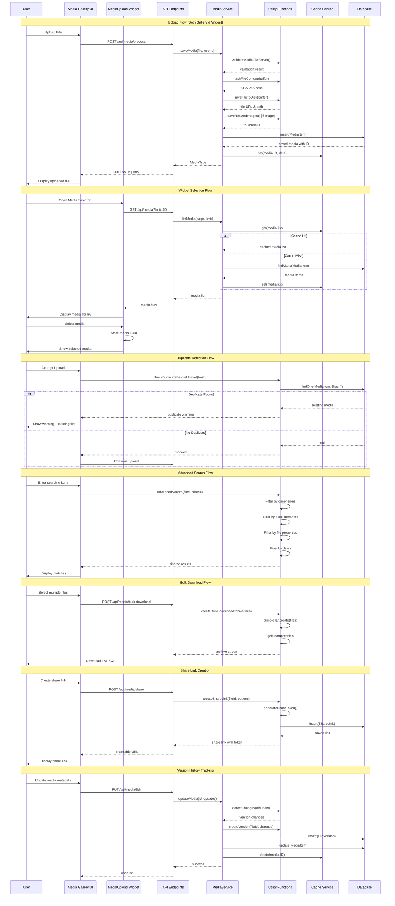
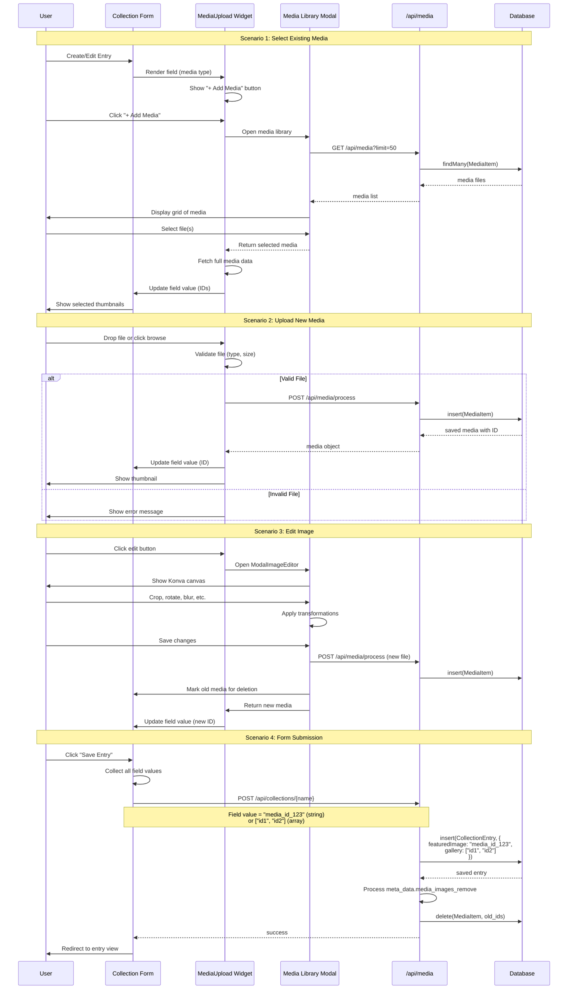
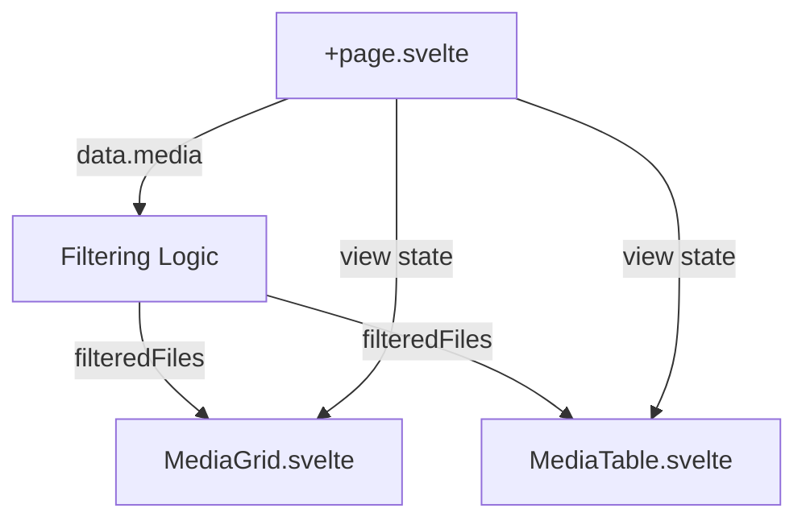
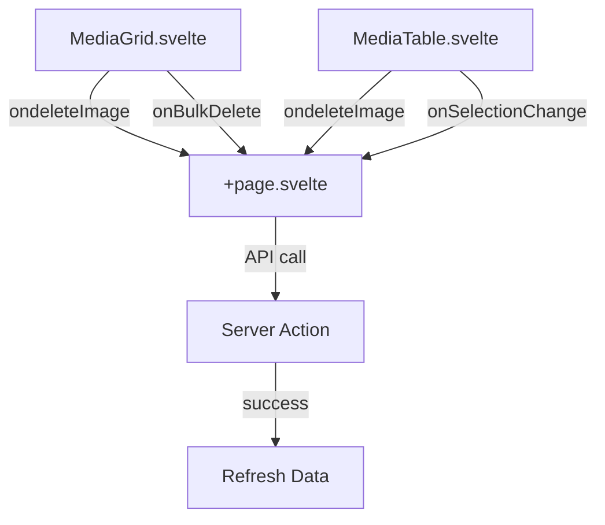

```mermaid
graph TB
    subgraph "Client Layer"
        UI[Media Gallery UI<br/>+page.svelte]
        UW[MediaUpload Widget<br/>Collections Form]
        GRID[MediaGrid.svelte<br/>Grid View]
        TABLE[MediaTable.svelte<br/>Table View]
        UPLOAD[Upload Components<br/>Local/Remote]
        VGRID[VirtualMediaGrid.svelte<br/>10k+ Files]
    end

    subgraph "API Layer"
        API1[GET /api/media<br/>List Files]
        API2[POST /api/media/process<br/>Upload & Process]
        API3[DELETE /api/media/delete<br/>Delete Files]
        API4[POST /api/media/remote<br/>Remote Upload]
        API5[GET /api/media/get<br/>Fetch File]
        API6[POST /api/media/manipulate<br/>Edit/Transform]
        API7[POST /api/media/trash<br/>Soft Delete]
    end

    subgraph "Service Layer"
        MS[MediaService.ts<br/>Business Logic]
        CS[CacheService<br/>Performance]
        SS[SettingsService<br/>Configuration]
    end

    subgraph "Utility Layer"
        U1[mediaProcessing.ts<br/>Hash, Sanitize, EXIF]
        U2[mediaStorage.ts<br/>Save, Resize, Cloud]
        U3[mediaUtils.ts<br/>Validation]
        U4[mediaModels.ts<br/>Type Definitions]
        U5[advancedSearch.ts<br/>Multi-Criteria]
        U6[duplicateDetection.ts<br/>Hash-based]
        U7[bulkDownload.ts<br/>TAR.GZ]
        U8[sharing.ts<br/>Expiring Links]
        U9[versionHistory.ts<br/>Track Changes]
        U10[storageAnalytics.ts<br/>Insights]
    end

    subgraph "Database Layer"
        DB[(Database Adapter)]
        COLL1[MediaItem Collection]
        COLL2[ShareLinks Collection]
        COLL3[FileVersions Collection]
    end

    UI --> GRID
    UI --> TABLE
    UI --> VGRID
    UI --> UPLOAD
    UW -.->|Uses Same APIs| API2

    GRID --> API1
    GRID --> API3
    TABLE --> API1
    TABLE --> API3
    UPLOAD --> API2
    UPLOAD --> API4
    VGRID --> U5
    VGRID --> U6
    VGRID --> U7

    API1 --> MS
    API2 --> MS
    API3 --> MS
    API4 --> MS
    API5 --> MS
    API6 --> MS
    API7 --> MS

    MS --> U1
    MS --> U2
    MS --> U3
    MS --> U4
    MS --> CS
    MS --> SS
    MS --> DB

    U5 --> U6
    U7 --> U1
    U8 --> U9
    U10 --> U4

    DB --> COLL1
    DB --> COLL2
    DB --> COLL3

    style UI fill:#4f46e5,color:#fff
    style UW fill:#7c3aed,color:#fff
    style MS fill:#059669,color:#fff
    style DB fill:#dc2626,color:#fff
```

# Media Gallery - Complete Architecture

Complete technical documentation for the entire Media Gallery ecosystem, including all components, APIs, services, and utilities.

---

## 📐 System Architecture Diagram



---

## 🔄 Data Flow Architecture



---

## 🗂️ Complete File Structure

```
src/
├── routes/
│   ├── (app)/mediagallery/
│   │   ├── +page.svelte                 # Main gallery page
│   │   ├── +page.server.ts              # Server-side data loading & actions
│   │   ├── MediaGrid.svelte             # Grid view component
│   │   ├── MediaTable.svelte            # Table view component
│   │   ├── VirtualMediaGrid.svelte      # Virtual scrolling (10k+ files)
│   │   ├── Filter.svelte                # Search & filter component
│   │   └── uploadMedia/
│   │       ├── +page.svelte             # Upload page wrapper
│   │       ├── LocalUpload.svelte       # Local file upload UI
│   │       ├── RemoteUpload.svelte      # Remote URL upload UI
│   │       └── ModalUploadMedia.svelte  # Upload preview modal
│   │
│   └── api/media/
│       ├── +server.ts                   # GET: List media files
│       ├── process/+server.ts           # POST: Upload & process files
│       ├── delete/+server.ts            # DELETE: Delete files
│       ├── remote/+server.ts            # POST: Upload from URL
│       ├── get/+server.ts               # GET: Fetch specific file
│       ├── exists/+server.ts            # GET: Check file existence
│       ├── trash/+server.ts             # POST: Soft delete
│       └── manipulate/[id]/+server.ts   # POST: Edit/transform media
│
├── services/
│   └── MediaService.ts                  # Core media business logic
│
├── utils/media/
│   ├── mediaModels.ts                   # TypeScript interfaces & enums
│   ├── mediaProcessing.ts               # Hash, sanitize, EXIF extraction
│   ├── mediaStorage.ts                  # Save, resize, cloud storage
│   ├── mediaUtils.ts                    # Validation utilities
│   ├── advancedSearch.ts                # Multi-criteria search (NEW)
│   ├── duplicateDetection.ts            # Hash-based duplicate finder (NEW)
│   ├── bulkDownload.ts                  # TAR.GZ archive creator (NEW)
│   ├── sharing.ts                       # Expiring share links (NEW)
│   ├── versionHistory.ts                # File version tracking (NEW)
│   └── storageAnalytics.ts              # Storage insights (NEW)
│
├── widgets/core/mediaUpload/
│   ├── index.ts                         # Widget definition & schema
│   ├── MediaUpload.svelte               # Single file upload widget
│   ├── Input.svelte                     # Media selector input (multi-upload)
│   ├── Display.svelte                   # Display selected media
│   ├── ModalImageEditor.svelte          # Image editing modal
│   ├── mediaupload.mdx                  # Widget documentation
│   └── types.ts                         # Widget-specific types
│
└── databases/
    ├── mongodb/
    │   ├── methods/mediaMethods.ts      # MongoDB-specific media queries
    │   └── models/media.ts              # MongoDB schemas
    └── dbInterface.ts                   # Database-agnostic interface
```

---

## 🎯 MediaUpload Widget Integration

### Widget Architecture

```mermaid
graph LR
    subgraph "Collection Form"
        FORM[Collection Entry Form]
    end

    subgraph "MediaUpload Widget"
        INPUT[Input.svelte<br/>Media Selector]
        DISPLAY[Display.svelte<br/>Show Selected]
        EDITOR[ModalImageEditor.svelte<br/>Edit Image]
        SINGLE[MediaUpload.svelte<br/>Single Upload]
    end

    subgraph "Media Library"
        MODAL[Media Library Modal]
        GALLERY[Gallery Grid]
        SEARCH[Search & Filter]
    end

    subgraph "Shared Services"
        API[Media API]
        STORAGE[MediaService]
    end

    FORM -->|Render Widget| INPUT
    INPUT -->|Open Library| MODAL
    MODAL --> GALLERY
    MODAL --> SEARCH
    GALLERY -->|Select Media| INPUT
    INPUT -->|Store ID(s)| FORM
    INPUT -->|Display| DISPLAY
    DISPLAY -->|Edit| EDITOR
    SINGLE -->|Upload New| API
    INPUT -->|Upload New| API
    API --> STORAGE

    style FORM fill:#3b82f6,color:#fff
    style INPUT fill:#8b5cf6,color:#fff
    style API fill:#10b981,color:#fff
```

### Widget Features & Capabilities

#### **1. MediaUpload Widget (Single File)**

**Location:** `src/widgets/core/mediaUpload/MediaUpload.svelte`

**Use Case:** Single image upload for collection fields (e.g., featured image, avatar)

**Features:**

- ✅ Direct file upload via drag-and-drop or file browser
- ✅ Image preview with metadata display
- ✅ Built-in image editor (crop, rotate, blur, filters)
- ✅ File validation (type, size)
- ✅ Focal point selection (TODO)
- ✅ Watermark application (TODO)
- ✅ Thumbnail generation
- ✅ Reactive state with Svelte 5 runes

**Props:**

```typescript
interface Props {
	field: FieldType & { path: string };
	value?: File | MediaImage;
}
```

**Workflow:**

1. User drops file or clicks to browse
2. Validation occurs (MIME type, size limits)
3. Preview displayed with metadata
4. Optional: Edit image (ModalImageEditor)
5. On save: Uploads to `/api/media/process`
6. Stores media ID in collection document

#### **2. Media Selector Widget (Multi-Upload)**

**Location:** `src/widgets/core/mediaUpload/Input.svelte`

**Use Case:** Select multiple existing media from library (e.g., gallery field, attachments)

**Features:**

- ✅ Browse existing media library via modal
- ✅ Multi-select with checkboxes
- ✅ Drag-and-drop reordering (svelte-dnd-action)
- ✅ Thumbnail grid display
- ✅ Remove selected files
- ✅ Upload new files directly
- ✅ Stores media IDs (not full objects)

**Props:**

```typescript
interface Props {
	field: FieldType;
	value: string | string[] | null | undefined; // Media IDs
	error?: string | null;
}
```

**Data Binding:**

```svelte
<script>
	let { field, value = $bindable() } = $props();

	// Effect 1: Fetch full media data when IDs change
	$effect(() => {
		const ids = Array.isArray(value) ? value : value ? [value] : [];
		fetchMediaData(ids).then((files) => (selectedFiles = files));
	});

	// Effect 2: Update parent value when selection changes
	$effect(() => {
		const newIds = selectedFiles.map((f) => f._id);
		value = field.multiupload ? newIds : newIds[0] || null;
	});
</script>
```

#### **3. Display Widget**

**Location:** `src/widgets/core/mediaUpload/Display.svelte`

**Use Case:** Show selected media in table/list views

**Features:**

- ✅ Thumbnail display (50x50px)
- ✅ Tooltip with file name
- ✅ Multiple file support
- ✅ Lazy data fetching

---

### Widget Integration with Collections



---

### FocalPoint & Watermark Support

**Status:** Partially Implemented (Needs Enhancement)

#### Focal Point

**Purpose:** Define the "important area" of an image for smart cropping

**Current Implementation:**

- ❌ Not yet implemented in widget
- ⚠️ `ModalImageEditor.svelte` has commented-out Konva code

**Planned Implementation:**

```typescript
interface FocalPoint {
	x: number; // 0-100% from left
	y: number; // 0-100% from top
}

interface MediaImage {
	// ... existing fields
	focalPoint?: FocalPoint;
}
```

**UI Flow:**

1. User clicks "Set Focal Point" in widget
2. Opens ModalImageEditor with crosshair tool
3. User clicks on image center point
4. Focal point stored as percentage coordinates
5. Backend uses focal point when generating thumbnails

**Backend Integration:**

```typescript
// src/utils/media/mediaStorage.ts
async function saveResizedImages(buffer: Buffer, focalPoint?: FocalPoint) {
	// When cropping, center on focal point instead of geometric center
	const cropX = focalPoint ? Math.round((image.width * focalPoint.x) / 100) : Math.round(image.width / 2);

	const cropY = focalPoint ? Math.round((image.height * focalPoint.y) / 100) : Math.round(image.height / 2);

	// Sharp.js crop with extract
	await sharp(buffer)
		.extract({
			left: Math.max(0, cropX - targetWidth / 2),
			top: Math.max(0, cropY - targetHeight / 2),
			width: targetWidth,
			height: targetHeight
		})
		.toFile(outputPath);
}
```

#### Watermark

**Purpose:** Add copyright or branding to images

**Current Implementation:**

- ❌ Not yet implemented

**Planned Implementation:**

```typescript
interface WatermarkConfig {
	enabled: boolean;
	imagePath?: string; // Path to watermark image
	text?: string; // Text watermark
	position: 'top-left' | 'top-right' | 'bottom-left' | 'bottom-right' | 'center';
	opacity: number; // 0-100
	scale: number; // 0-100 (percentage of image size)
}

interface MediaImage {
	// ... existing fields
	watermark?: WatermarkConfig;
}
```

**UI Flow:**

1. User toggles "Apply Watermark" in widget
2. Selects watermark type (image or text)
3. Configures position, opacity, scale
4. Preview shown in ModalImageEditor
5. Applied during upload/save

**Backend Integration:**

```typescript
// src/utils/media/mediaProcessing.ts
async function applyWatermark(imageBuffer: Buffer, config: WatermarkConfig): Promise<Buffer> {
	const base = sharp(imageBuffer);

	if (config.imagePath) {
		// Image watermark
		const watermark = await sharp(config.imagePath)
			.resize({ width: Math.round((baseWidth * config.scale) / 100) })
			.toBuffer();

		return base
			.composite([
				{
					input: watermark,
					gravity: config.position,
					blend: 'over',
					opacity: config.opacity / 100
				}
			])
			.toBuffer();
	} else if (config.text) {
		// Text watermark (requires svg overlay)
		const svg = `
      <svg width="${baseWidth}" height="${baseHeight}">
        <text x="50%" y="95%" 
              font-size="24" 
              fill="white" 
              fill-opacity="${config.opacity / 100}" 
              text-anchor="middle">
          ${config.text}
        </text>
      </svg>
    `;

		return base
			.composite([
				{
					input: Buffer.from(svg),
					gravity: config.position
				}
			])
			.toBuffer();
	}

	return imageBuffer;
}
```

---

## Related Documentation

### API Reference

- [**Media API Reference**](/docs/api/Media_API) - Complete API documentation:
  - `POST /api/media/process` - Upload files
  - `GET /api/media` - List media
  - `POST /api/media/search` - Advanced search (18+ criteria)
  - `GET /api/media/search` - Search suggestions
  - `POST /api/media/bulk-download` - Download as TAR.GZ
  - `POST /api/media/trash` - Soft delete
  - `POST /api/media/manipulate/[id]` - Image manipulation
  - `GET /api/media/exists` - Check existence
  - `POST /api/media/remote` - Remote URL upload
  - Plus DELETE, PATCH operations

### User Guides

- [**Media Gallery Guide**](/docs/guides/media-gallery-guide) - Complete UX guide with storage analytics
- [**Media Gallery Implementation**](/docs/guides/media-gallery-implementation) - Code examples and patterns
- [**Media Handling**](/docs/guides/media-handling) - MediaService architecture and storage configuration

---

## 📡 API Endpoints Reference

### Core Endpoints

### Main Page (`+page.svelte`)

**Responsibilities:**

- Manages view state (grid/table, size)
- Handles folder navigation
- Coordinates search/filter
- Passes data to child components

**Key State:**

```typescript
let files = $state<MediaImage[]>([]);               // All media files
let filteredFiles = $derived(...);                   // Filtered results
let view = $state<'grid' | 'table'>('grid');        // Current view mode
let gridSize = $state<'tiny' | 'small' | 'medium' | 'large'>('small');
let selectedMediaType = $state<'All' | MediaTypeEnum>('All');
let currentSystemVirtualFolder = $state<SystemVirtualFolder | null>(null);
```

**Data Flow:**

1. Server loads media from database → `data.media`
2. Component filters by search + type → `filteredFiles`
3. Child components receive filtered data
4. User actions trigger parent handlers
5. Parent updates state → children re-render

---

### Filter Component (`Filter.svelte`)

**Location:** `src/routes/(app)/mediagallery/Filter.svelte`

**Purpose:** Advanced search and filtering UI for the media gallery

**Features:**

- ✅ Multi-criteria search (filename, tags, dimensions, file size, date ranges)
- ✅ Real-time filtering (debounced 300ms)
- ✅ Media type filter (All, Images, Documents, Videos, Audio)
- ✅ System virtual folder navigation (Recent, Favorites, Trash, Large Files)
- ✅ Advanced filter toggle (show/hide extra criteria)
- ✅ Clear filters button
- ✅ Search suggestions dropdown
- ✅ Responsive design

**Props Interface:**

```typescript
interface Props {
	onFilterChange: (filters: FilterCriteria) => void;
	onMediaTypeChange: (type: MediaTypeEnum | 'All') => void;
	onVirtualFolderChange: (folder: SystemVirtualFolder | null) => void;
	currentMediaType?: MediaTypeEnum | 'All';
	currentVirtualFolder?: SystemVirtualFolder | null;
}

interface FilterCriteria {
	filename?: string;
	tags?: string[];
	minWidth?: number;
	maxWidth?: number;
	minHeight?: number;
	maxHeight?: number;
	minSize?: number;
	maxSize?: number;
	uploadedAfter?: Date;
	uploadedBefore?: Date;
	hasTransparency?: boolean;
	camera?: string;
	focalLength?: number;
}
```

**Usage Example:**

```svelte
<!-- In +page.svelte -->
<script lang="ts">
	import Filter from './Filter.svelte';

	let searchFilters = $state<FilterCriteria>({});
	let selectedMediaType = $state<'All' | MediaTypeEnum>('All');
	let currentSystemVirtualFolder = $state<SystemVirtualFolder | null>(null);

	// Derived: Apply filters to files
	let filteredFiles = $derived(() => {
		let result = files;

		// Apply media type filter
		if (selectedMediaType !== 'All') {
			result = result.filter((f) => f.type === selectedMediaType);
		}

		// Apply virtual folder filter
		if (currentSystemVirtualFolder) {
			result = applyVirtualFolder(result, currentSystemVirtualFolder);
		}

		// Apply advanced search criteria
		result = applySearchFilters(result, searchFilters);

		return result;
	});
</script>

<Filter
	onFilterChange={(filters) => (searchFilters = filters)}
	onMediaTypeChange={(type) => (selectedMediaType = type)}
	onVirtualFolderChange={(folder) => (currentSystemVirtualFolder = folder)}
	currentMediaType={selectedMediaType}
	currentVirtualFolder={currentSystemVirtualFolder}
/>
```

**Filter Application Logic:**

```typescript
// Apply advanced search filters
function applySearchFilters(files: MediaImage[], filters: FilterCriteria): MediaImage[] {
	let result = files;

	if (filters.filename) {
		const term = filters.filename.toLowerCase();
		result = result.filter((f) => f.filename.toLowerCase().includes(term));
	}

	if (filters.tags?.length) {
		result = result.filter((f) => filters.tags.some((tag) => f.tags?.includes(tag)));
	}

	if (filters.minWidth) {
		result = result.filter((f) => f.width >= filters.minWidth);
	}

	if (filters.maxWidth) {
		result = result.filter((f) => f.width <= filters.maxWidth);
	}

	if (filters.minSize) {
		result = result.filter((f) => f.size >= filters.minSize);
	}

	if (filters.uploadedAfter) {
		result = result.filter((f) => new Date(f.uploadDate) >= filters.uploadedAfter);
	}

	// ... similar checks for other criteria

	return result;
}
```

**Virtual Folder Types:**

```typescript
type SystemVirtualFolder =
	| 'recent' // Files uploaded in last 7 days
	| 'favorites' // User-favorited files
	| 'trash' // Soft-deleted files
	| 'large' // Files over 5 MB
	| 'unused'; // Files not referenced in any collection
```

**Performance Considerations:**

- Debounced search input (300ms) to avoid excessive re-filtering
- Client-side filtering for <1000 files (instant results)
- Server-side search API for 1000+ files (POST /api/media/search)
- Cached filter results using `$derived` rune
- Memoized filter functions

---

### Grid View (`MediaGrid.svelte`)

**Features:**

- Responsive grid layout (CSS Grid)
- Batch selection mode with checkboxes
- Hover actions (info, edit, delete)
- Lazy-loaded images
- File info popup

**Props Interface:**

```typescript
interface Props {
	filteredFiles?: MediaImage[];
	gridSize?: 'tiny' | 'small' | 'medium' | 'large';
	ondeleteImage?: (file: MediaImage) => void;
	onBulkDelete?: (files: MediaImage[]) => void;
}
```

**Performance Optimizations:**

- Lazy loading with `loading="lazy"`
- Image decoding with `decoding="async"`
- ObjectURL cleanup on unmount
- Virtual scrolling ready (coming soon)

**Grid Sizes:**

```css
tiny:   64x64px   (h-16 w-16)
small:  96x96px   (h-24 w-24)
medium: 192x192px (h-48 w-48)
large:  320x320px (h-80 w-80)
```

---

### Table View (`MediaTable.svelte`)

**Features:**

- Sortable columns
- Pagination (configurable rows per page)
- Row selection
- Responsive table layout

**Props Interface:**

```typescript
interface Props {
	filteredFiles?: MediaBase[];
	tableSize?: 'small' | 'medium' | 'large';
	ondeleteImage?: (file: MediaBase) => void;
	onSelectionChange?: (selectedFiles: MediaBase[]) => void; // ✅ Callback for selected rows
}
```

**Usage Example:**

```svelte
<script lang="ts">
import MediaTable from './MediaTable.svelte';

let selectedFiles = $state<MediaBase[]>([]);

function handleSelectionChange(files: MediaBase[]) {
  selectedFiles = files;
  console.log(`${files.length} files selected`);
}

async function handleBulkDelete() {
  if (selectedFiles.length === 0) return;
  
  // Delete selected files
  await Promise.all(
    selectedFiles.map(f => fetch(`/api/media/delete`, {
      method: 'DELETE',
      body: JSON.stringify({ id: f._id })
    }))
  );

  
  selectedFiles = [];
}
</script>

<MediaTable filteredFiles={files} tableSize="medium" ondeleteImage={handleDeleteSingle} onSelectionChange={handleSelectionChange} />

{#if selectedFiles.length > 0}
	<div class="bulk-actions">
		<p>{selectedFiles.length} files selected</p>
		<button onclick={handleBulkDelete}>Delete Selected</button>
	</div>
{/if}
```

**Table Sizes:**

```css
small:  thumbnail 128px height
medium: thumbnail 192px height
large:  thumbnail 320px height
```

**Performance:**

- Client-side sorting (no server requests)
- Pagination reduces DOM nodes
- Virtual scrolling for large datasets

---

### Local Upload (`LocalUpload.svelte`)

**Features:**

- Drag-and-drop zone
- File browser integration
- Client-side validation
- Real-time upload progress
- Upload speed indicator

**Validation Rules:**

```typescript
const MAX_FILE_SIZE = 50 * 1024 * 1024; // 50MB

const ALLOWED_TYPES = [
	'image/jpeg',
	'image/png',
	'image/gif',
	'image/webp',
	'image/svg+xml',
	'video/mp4',
	'video/webm',
	'audio/mpeg',
	'audio/wav',
	'application/pdf',
	'application/msword',
	'application/vnd.openxmlformats-officedocument.wordprocessingml.document'
];
```

**Upload Flow:**

1. User drops files or selects via browser
2. `validateFile()` checks type and size
3. Valid files → modal preview
4. User confirms → `uploadFiles()` via XHR
5. Progress events update UI
6. Success → redirect to gallery

**Progress Tracking:**

```typescript
xhr.upload.addEventListener('progress', (e) => {
	uploadProgress = Math.round((e.loaded * 100) / e.total);

	const timeDiff = (Date.now() - startTime) / 1000;
	uploadSpeed = loadedDiff / timeDiff; // bytes/second
});
```

---

### Upload Modal (`ModalUploadMedia.svelte`)

**Features:**

- File preview cards
- Add more files
- Individual file deletion
- Duplicate detection
- ObjectURL management

**State Management:**

```typescript
let files = $bindable([]); // Shared with parent
let objectUrls = $state<Map<string, string>>(new Map());
let fileSet = $state(new Set<string>()); // Duplicate tracking
let duplicateWarning = $state('');
```

**ObjectURL Lifecycle:**

```svelte
$effect(() => {
  // Create URLs for new files
  for (const file of files) {
    if (!objectUrls.has(fileKey)) {
      const url = URL.createObjectURL(file);
      objectUrls.set(fileKey, url);
    }
  }

  // Cleanup removed files
  return () => {
    previousUrls.forEach((url) => {
      if (!currentUrls.has(url)) {
        URL.revokeObjectURL(url);
      }
    });
  };
});
```

---

## Server-Side Logic

### Load Function (`+page.server.ts`)

**Responsibilities:**

- Fetch all media from database
- Fetch virtual folder structure
- Permission checking
- Data serialization (ObjectId → string)

**Data Loading:**

```typescript
// Fetch from multiple collections
const mediaCollections = ['media_images', 'media_documents', 'media_audio', 'media_videos'];

for (const collection of mediaCollections) {
	const result = await dbAdapter.crud.find(collection, {});
	if (result.success && result.data) {
		allMediaResults.push(...result.data);
	}
}

// Deduplicate by hash
const deduplicatedMedia = allMediaResults.reduce((acc, item) => {
	const existing = acc.find((m) => m.hash === item.hash);
	return existing ? acc : [...acc, item];
}, []);
```

**Permission Check:**

```typescript
const hasMediaPermission =
	isAdmin ||
	tenantRoles.some((role) => role.permissions?.some((p) => p.resource === 'media' && (p.actions.includes('read') || p.actions.includes('write'))));
```

---

### Actions (`+page.server.ts`)

#### Default Action (File Upload)

```typescript
export const actions: Actions = {
	default: async ({ request, locals }) => {
		const formData = await request.formData();
		const files = formData.getAll('files');

		const mediaService = new MediaService(dbAdapter);
		const access: MediaAccess = 'public';

		for (const file of files) {
			if (file instanceof File) {
				await mediaService.saveMedia(file, user._id, access, 'global');
			}
		}

		return { success: true };
	}
};
```

#### Delete Media Action

```typescript
deleteMedia: async ({ request }) => {
	const body = await request.json();
	const { image } = body;

	const success = await dbAdapter.deleteMedia(image._id.toString());
	return { success };
};
```

#### Remote Upload Action

```typescript
remoteUpload: async ({ request, locals }) => {
	const formData = await request.formData();
	const remoteUrls = JSON.parse(formData.get('remoteUrls') as string);

	const mediaService = new MediaService(dbAdapter);

	for (const url of remoteUrls) {
		await mediaService.saveRemoteMedia(url, user._id, 'public');
	}

	return { success: true };
};
```

---

## State Management

### Parent → Child Data Flow



### Child → Parent Event Flow



---

## Performance Patterns

### Lazy Loading Images

```svelte
 {
		e.target.src = '/static/Default_User.svg';
	}}
/>
```

### Client-Side Filtering

```typescript
let filteredFiles = $derived(
	files.filter((file) => {
		const matchesSearch = !globalSearchValue || file.filename.toLowerCase().includes(globalSearchValue.toLowerCase());
		const matchesType = selectedMediaType === 'All' || file.type === selectedMediaType;
		return matchesSearch && matchesType;
	})
);
```

### Debounced Search

```typescript
let searchDebounce: ReturnType<typeof setTimeout>;

function handleSearch(value: string) {
	clearTimeout(searchDebounce);
	searchDebounce = setTimeout(() => {
		globalSearchValue = value;
	}, 300);
}
```

---

## Best Practices for Developers

### Adding New Features

1. **State Management:**
   - Use `$state` for reactive variables
   - Use `$derived` for computed values
   - Avoid nested reactive statements

2. **Performance:**
   - Lazy load images
   - Paginate large lists
   - Debounce user input
   - Use virtual scrolling for 1000+ items

3. **Error Handling:**
   - Validate on client and server
   - Show user-friendly error messages
   - Log errors for debugging
   - Graceful fallbacks (e.g., default images)

4. **Accessibility:**
   - Semantic HTML
   - ARIA labels
   - Keyboard navigation
   - Screen reader support

### Testing Checklist

- [ ] Upload files of various types
- [ ] Test file size validation (>50MB)
- [ ] Test unsupported file types
- [ ] Test drag-and-drop
- [ ] Test batch operations (select all, delete)
- [ ] Test search and filter
- [ ] Test pagination in table view
- [ ] Test grid size switching
- [ ] Test mobile responsiveness
- [ ] Test with 1000+ files
- [ ] Test network errors
- [ ] Test permission restrictions

---

## Extension Points

### Adding New Upload Types

1. Add MIME type to `ALLOWED_TYPES` in `LocalUpload.svelte`
2. Add server-side handling in MediaService
3. Add icon mapping in `ModalUploadMedia.svelte`
4. Add collection in `+page.server.ts` load function

### Custom View Modes

1. Create new component (e.g., `MediaList.svelte`)
2. Add to `+page.svelte` view switcher
3. Pass `filteredFiles` as prop
4. Implement same event handlers

### Bulk Operations

1. Add button to batch toolbar in `MediaGrid.svelte`
2. Implement handler function
3. Call server action with selected files
4. Update UI on success

---

---

## 🔗 Widget-Gallery-API Integration Map

```mermaid
graph TD
    subgraph "Widget Usage in Collections"
        CF[Collection Form]
        FI[Featured Image Field<br/>type: media, multiupload: false]
        GAL[Gallery Field<br/>type: media, multiupload: true]
    end

    subgraph "Widget Components"
        W1[MediaUpload.svelte<br/>Single File]
        W2[Input.svelte<br/>Multi-Select]
        W3[Display.svelte<br/>Thumbnails]
        W4[ModalImageEditor.svelte<br/>Edit Tool]
    end

    subgraph "Shared Media Library"
        ML[Media Library Modal]
        MGG[MediaGrid from Gallery]
        MSearch[Search & Filter]
    end

    subgraph "API & Storage"
        API[/api/media/*]
        MS[MediaService]
        DB[(Database)]
    end

    CF -->|Renders| FI
    CF -->|Renders| GAL
    FI -->|Uses| W1
    GAL -->|Uses| W2
    W1 -->|Opens| ML
    W2 -->|Opens| ML
    ML -->|Displays| MGG
    ML -->|Uses| MSearch
    W1 -->|Upload| API
    W2 -->|Upload| API
    W1 -->|Edit| W4
    W4 -->|Save| API
    ML -->|Fetch| API
    API --> MS
    MS --> DB

    style CF fill:#3b82f6,color:#fff
    style W1 fill:#8b5cf6,color:#fff
    style W2 fill:#8b5cf6,color:#fff
    style ML fill:#10b981,color:#fff
    style API fill:#f59e0b,color:#fff
```

**Key Points:**

1. **Widgets Re-use Gallery Components**: The `MediaUpload` widget opens the same media library modal used by the main gallery
2. **Consistent API Access**: Both gallery and widgets use `/api/media/*` endpoints
3. **Shared MediaService**: All operations go through the same business logic layer
4. **ID-based Storage**: Widgets store only media IDs in collection documents, not full media objects
5. **Lazy Loading**: Full media data fetched on-demand when displaying/editing

---

## 🎯 FocalPoint & Watermark Implementation Guide

### Current Status

| Feature              | Status             | Location                              | Notes                          |
| -------------------- | ------------------ | ------------------------------------- | ------------------------------ |
| Focal Point          | ❌ Not Implemented | `ModalImageEditor.svelte` (commented) | Konva code exists but disabled |
| Watermark            | ❌ Not Implemented | N/A                                   | Needs full implementation      |
| Image Editor         | ⚠️ Partial         | `ModalImageEditor.svelte`             | Most code commented out        |
| Thumbnail Generation | ✅ Implemented     | `mediaStorage.ts`                     | 5 sizes (xs, sm, md, lg, xl)   |

### Implementation Roadmap

#### Phase 1: Enable ModalImageEditor

1. **Uncomment Konva Integration**

   ```svelte
   <!-- ModalImageEditor.svelte -->
   <script>
   	import Konva from 'konva';

   	// Uncomment edit.startEdit(), edit.saveEdit(), edit.addBlur()
   	// Test with current image manipulation features
   </script>
   ```

2. **Add Focal Point Tool**

   ```typescript
   const focalPointTool = {
   	async addFocalPoint() {
   		const crosshair = new Konva.Circle({
   			x: stage.width() / 2,
   			y: stage.height() / 2,
   			radius: 20,
   			stroke: '#ff0000',
   			strokeWidth: 3,
   			draggable: true
   		});

   		const verticalLine = new Konva.Line({
   			points: [0, crosshair.y(), stage.width(), crosshair.y()],
   			stroke: '#ff0000',
   			strokeWidth: 1,
   			dash: [10, 5]
   		});

   		const horizontalLine = new Konva.Line({
   			points: [crosshair.x(), 0, crosshair.x(), stage.height()],
   			stroke: '#ff0000',
   			strokeWidth: 1,
   			dash: [10, 5]
   		});

   		crosshair.on('dragmove', () => {
   			verticalLine.points([0, crosshair.y(), stage.width(), crosshair.y()]);
   			horizontalLine.points([crosshair.x(), 0, crosshair.x(), stage.height()]);
   		});

   		layer.add(crosshair, verticalLine, horizontalLine);
   	},

   	saveFocalPoint() {
   		const focalPoint = {
   			x: (crosshair.x() / image.naturalWidth) * 100,
   			y: (crosshair.y() / image.naturalHeight) * 100
   		};
   		return focalPoint;
   	}
   };
   ```

3. **Update MediaService to Store Focal Point**

   ```typescript
   // MediaService.ts - saveMedia()
   const media: MediaBase = {
   	// ... existing fields
   	focalPoint: formData.get('focalPoint') ? JSON.parse(formData.get('focalPoint')) : undefined
   };
   ```

4. **Use Focal Point in Thumbnail Generation**

   ```typescript
   // mediaStorage.ts - saveResizedImages()
   async function saveResizedImages(
   	buffer: Buffer,
   	focalPoint?: FocalPoint
   	// ... other params
   ) {
   	for (const [size, dimensions] of Object.entries(sizes)) {
   		const { width, height } = dimensions;

   		// Calculate crop position based on focal point
   		const metadata = await sharp(buffer).metadata();
   		const sourceWidth = metadata.width!;
   		const sourceHeight = metadata.height!;

   		let left = 0;
   		let top = 0;

   		if (focalPoint) {
   			// Center crop on focal point
   			const focalX = Math.round((sourceWidth * focalPoint.x) / 100);
   			const focalY = Math.round((sourceHeight * focalPoint.y) / 100);

   			left = Math.max(0, Math.min(focalX - width / 2, sourceWidth - width));
   			top = Math.max(0, Math.min(focalY - height / 2, sourceHeight - height));
   		}

   		await sharp(buffer)
   			.extract({ left, top, width: Math.min(width, sourceWidth), height: Math.min(height, sourceHeight) })
   			.resize(width, height, { fit: 'cover' })
   			.toFile(outputPath);
   	}
   }
   ```

#### Phase 2: Implement Watermark

1. **Add Watermark Configuration UI**

   ```svelte
   <!-- ModalImageEditor.svelte -->
   <div class="watermark-controls">
   	<label>
   		<input type="checkbox" bind:checked={watermarkEnabled} />
   		Apply Watermark
   	</label>

   	{#if watermarkEnabled}
   		<select bind:value={watermarkType}>
   			<option value="text">Text</option>
   			<option value="image">Image</option>
   		</select>

   		{#if watermarkType === 'text'}
   			<input type="text" bind:value={watermarkText} placeholder="Copyright © 2025" />
   		{:else}
   			<input type="file" accept="image/*" on:change={handleWatermarkImageUpload} />
   		{/if}

   		<label>
   			Position:
   			<select bind:value={watermarkPosition}>
   				<option value="top-left">Top Left</option>
   				<option value="top-right">Top Right</option>
   				<option value="bottom-left">Bottom Left</option>
   				<option value="bottom-right">Bottom Right</option>
   				<option value="center">Center</option>
   			</select>
   		</label>

   		<label>
   			Opacity:
   			<input type="range" min="0" max="100" bind:value={watermarkOpacity} />
   			{watermarkOpacity}%
   		</label>

   		<label>
   			Scale:
   			<input type="range" min="10" max="100" bind:value={watermarkScale} />
   			{watermarkScale}%
   		</label>
   	{/if}
   </div>
   ```

2. **Add Watermark to Konva Layer**

   ```typescript
   const watermarkTool = {
   	async addWatermark() {
   		if (watermarkType === 'text') {
   			const text = new Konva.Text({
   				text: watermarkText,
   				fontSize: 24,
   				fontFamily: 'Arial',
   				fill: 'white',
   				opacity: watermarkOpacity / 100,
   				shadowColor: 'black',
   				shadowBlur: 10,
   				shadowOffsetX: 2,
   				shadowOffsetY: 2
   			});

   			// Position based on selection
   			const positions = {
   				'top-left': { x: 20, y: 20 },
   				'top-right': { x: stage.width() - text.width() - 20, y: 20 },
   				'bottom-left': { x: 20, y: stage.height() - text.height() - 20 },
   				'bottom-right': { x: stage.width() - text.width() - 20, y: stage.height() - text.height() - 20 },
   				center: { x: stage.width() / 2 - text.width() / 2, y: stage.height() / 2 - text.height() / 2 }
   			};

   			text.position(positions[watermarkPosition]);
   			layer.add(text);
   		} else {
   			// Image watermark
   			const watermarkImg = new Image();
   			watermarkImg.onload = () => {
   				const wmImage = new Konva.Image({
   					image: watermarkImg,
   					opacity: watermarkOpacity / 100,
   					scaleX: watermarkScale / 100,
   					scaleY: watermarkScale / 100
   				});

   				// Position logic similar to text
   				layer.add(wmImage);
   			};
   			watermarkImg.src = watermarkImageDataUrl;
   		}
   	}
   };
   ```

3. **Server-Side Watermark Application**

   ```typescript
   // mediaProcessing.ts
   export async function applyWatermark(imageBuffer: Buffer, config: WatermarkConfig): Promise<Buffer> {
   	const image = sharp(imageBuffer);
   	const metadata = await image.metadata();

   	if (config.type === 'text') {
   		// Create SVG text overlay
   		const svg = `
         <svg width="${metadata.width}" height="${metadata.height}">
           <defs>
             <filter id="shadow">
               <feDropShadow dx="2" dy="2" stdDeviation="3" flood-opacity="0.5"/>
             </filter>
           </defs>
           <text 
             x="${getXPosition(config.position, metadata.width!)}" 
             y="${getYPosition(config.position, metadata.height!)}"
             font-size="24" 
             font-family="Arial"
             fill="white" 
             fill-opacity="${config.opacity / 100}"
             filter="url(#shadow)">
             ${config.text}
           </text>
         </svg>
       `;

   		return image
   			.composite([
   				{
   					input: Buffer.from(svg),
   					blend: 'over'
   				}
   			])
   			.toBuffer();
   	} else {
   		// Image watermark
   		const watermark = await sharp(config.imagePath!)
   			.resize({
   				width: Math.round((metadata.width! * config.scale) / 100)
   			})
   			.toBuffer();

   		return image
   			.composite([
   				{
   					input: watermark,
   					gravity: mapPositionToGravity(config.position),
   					blend: 'over'
   				}
   			])
   			.toBuffer();
   	}
   }

   function mapPositionToGravity(position: string): string {
   	const map = {
   		'top-left': 'northwest',
   		'top-right': 'northeast',
   		'bottom-left': 'southwest',
   		'bottom-right': 'southeast',
   		center: 'center'
   	};
   	return map[position] || 'southeast';
   }
   ```

#### Phase 3: Widget Integration

1. **Add Focal Point & Watermark to Widget UI**

   ```svelte
   <!-- MediaUpload.svelte -->
   <div class="image-options">
   	<button onclick={() => (showImageEditor = true)}> Edit Image </button>

   	<button onclick={() => (showFocalPointTool = true)}> Set Focal Point </button>

   	<button onclick={() => (showWatermarkOptions = true)}> Add Watermark </button>
   </div>

   {#if showFocalPointTool}
   	<ModalImageEditor
   		mode="focalPoint"
   		{_data}
   		{field}
   		onSave={(focalPoint) => {
   			_data.focalPoint = focalPoint;
   			showFocalPointTool = false;
   		}}
   	/>
   {/if}

   {#if showWatermarkOptions}
   	<WatermarkConfigModal
   		onSave={(config) => {
   			_data.watermark = config;
   			showWatermarkOptions = false;
   		}}
   	/>
   {/if}
   ```

2. **Display Focal Point Indicator**

   ```svelte
   <div class="image-preview relative">
   	

   	{#if _data.focalPoint}
   		<div class="focal-point-indicator" style="left: {_data.focalPoint.x}%; top: {_data.focalPoint.y}%;">
   			<iconify-icon icon="mdi:crosshairs" class="text-red-500" />
   		</div>
   	{/if}

   	{#if _data.watermark?.enabled}
   		<div class="watermark-badge">
   			<iconify-icon icon="mdi:watermark" class="text-blue-500" />
   			Watermark Applied
   		</div>
   	{/if}
   </div>

   <style>
   	.focal-point-indicator {
   		position: absolute;
   		transform: translate(-50%, -50%);
   		pointer-events: none;
   	}

   	.watermark-badge {
   		position: absolute;
   		top: 8px;
   		right: 8px;
   		background: rgba(0, 0, 0, 0.7);
   		color: white;
   		padding: 4px 8px;
   		border-radius: 4px;
   		font-size: 12px;
   	}
   </style>
   ```

3. **Apply During Upload**

   ```typescript
   // When uploading from widget
   const formData = new FormData();
   formData.append('files', file);

   if (_data.focalPoint) {
   	formData.append('focalPoint', JSON.stringify(_data.focalPoint));
   }

   if (_data.watermark?.enabled) {
   	formData.append('watermark', JSON.stringify(_data.watermark));
   }

   const response = await fetch('/api/media/process', {
   	method: 'POST',
   	body: formData
   });
   ```

---

## 📊 Enterprise Features Integration

### Virtual Scrolling

**Component:** `VirtualMediaGrid.svelte`

**When to Use:**

- Gallery with 1,000+ files
- Collections with large image galleries
- Admin panel with all media

**Integration:**

```svelte
<!-- +page.svelte -->
<script>
	const USE_VIRTUAL_SCROLLING_THRESHOLD = 100;
	let shouldUseVirtualScrolling = $derived(filteredFiles.length > USE_VIRTUAL_SCROLLING_THRESHOLD);
</script>

{#if shouldUseVirtualScrolling}
	<VirtualMediaGrid {filteredFiles} {gridSize} {ondeleteImage} onBulkDownload={handleBulkDownload} onBulkEdit={handleBulkEdit} />
{:else}
	<MediaGrid {filteredFiles} {gridSize} {ondeleteImage} />
{/if}
```

### Advanced Search

**Component:** Search modal using `advancedSearch.ts`

**Integration:**

```svelte
<script>
	import { advancedSearch, getSearchSuggestions } from '@utils/media/advancedSearch';

	let searchCriteria = $state<SearchCriteria>({});
	let suggestions = $derived(getSearchSuggestions(files));

	function handleAdvancedSearch() {
		const result = advancedSearch(files, searchCriteria);
		filteredFiles = result.files;
		showMatchedCriteria(result.matchedCriteria);
	}
</script>

<button onclick={() => (showAdvancedSearchModal = true)}> Advanced Search </button>

{#if showAdvancedSearchModal}
	<AdvancedSearchModal
		{suggestions}
		onSearch={(criteria) => {
			searchCriteria = criteria;
			handleAdvancedSearch();
			showAdvancedSearchModal = false;
		}}
	/>
{/if}
```

### Duplicate Detection

**Integration Points:**

1. **Pre-Upload Check**

   ```typescript
   // LocalUpload.svelte
   async function validateFiles(files: File[]) {
   	for (const file of files) {
   		const buffer = await file.arrayBuffer();
   		const hash = await hashFileContent(Buffer.from(buffer));

   		const duplicate = checkDuplicateBeforeUpload(hash, existingFiles);
   		if (duplicate) {
   			showDuplicateWarning(file.name, duplicate);
   			return false;
   		}
   	}
   	return true;
   }
   ```

2. **Find Duplicates Tool**

   ```svelte
   <script>
   	function findAllDuplicates() {
   		const duplicates = findDuplicates(files);
   		const savings = calculateStorageSavings(duplicates);

   		showDuplicatesModal(duplicates, savings);
   	}
   </script>

   <button onclick={findAllDuplicates}> Find Duplicates </button>
   ```

### Bulk Download

**Server Action:**

```typescript
// +page.server.ts
export const actions = {
	bulkDownload: async ({ request }) => {
		const formData = await request.formData();
		const fileIds = JSON.parse(formData.get('fileIds') as string);

		// Fetch files from DB
		const files = await Promise.all(fileIds.map((id) => dbAdapter.crud.findOne('MediaItem', { _id: id })));

		// Create archive
		const archive = await createBulkDownloadArchive(
			files.map((f) => f.data),
			'/tmp/archives'
		);

		// Stream to response
		const stream = await streamArchiveToResponse(archive.path, archive.filename, new Headers());

		return new Response(stream, {
			headers: {
				'Content-Type': 'application/gzip',
				'Content-Disposition': `attachment; filename="${archive.filename}"`
			}
		});
	}
};
```

---

## 🧪 Testing Checklist

### Widget Testing

- [ ] **Single File Upload (MediaUpload.svelte)**
  - [ ] Upload via drag-and-drop
  - [ ] Upload via file browser
  - [ ] File validation (type, size)
  - [ ] Preview display
  - [ ] Edit image (if ModalImageEditor enabled)
  - [ ] Set focal point
  - [ ] Apply watermark
  - [ ] Delete uploaded file
  - [ ] Form submission stores media ID

- [ ] **Multi-Select (Input.svelte)**
  - [ ] Open media library modal
  - [ ] Select single file
  - [ ] Select multiple files
  - [ ] Reorder selected files (drag-and-drop)
  - [ ] Remove selected file
  - [ ] Upload new file from widget
  - [ ] Form submission stores array of IDs

- [ ] **Display Widget**
  - [ ] Shows thumbnails for single ID
  - [ ] Shows thumbnails for multiple IDs
  - [ ] Shows fallback for missing media
  - [ ] Tooltip displays filename

### Gallery Testing

- [ ] **Media Gallery**
  - [ ] Load 10 files
  - [ ] Load 100 files
  - [ ] Load 1,000+ files (virtual scrolling)
  - [ ] Search by filename
  - [ ] Filter by media type
  - [ ] Switch grid sizes (tiny, small, medium, large)
  - [ ] Switch to table view
  - [ ] Sort table columns
  - [ ] Paginate table
  - [ ] Batch select files
  - [ ] Bulk delete
  - [ ] Navigate virtual folders
  - [ ] Upload new files
  - [ ] Delete individual file

### Enterprise Features Testing

- [ ] **Advanced Search**
  - [ ] Search by dimensions
  - [ ] Search by file size
  - [ ] Search by upload date
  - [ ] Search by EXIF metadata
  - [ ] Search for duplicates only
  - [ ] Combine multiple criteria

- [ ] **Duplicate Detection**
  - [ ] Upload duplicate file (blocked)
  - [ ] Find all duplicates
  - [ ] View duplicate groups
  - [ ] Merge duplicates
  - [ ] Calculate storage savings

- [ ] **Bulk Download**
  - [ ] Select 5 files → download TAR.GZ
  - [ ] Select 50 files → download TAR.GZ
  - [ ] Verify archive contents
  - [ ] Extract and verify files

- [ ] **Share Links**
  - [ ] Create share link with expiration
  - [ ] Create share link with password
  - [ ] Create share link with download limit
  - [ ] Access shared file (valid token)
  - [ ] Access expired link (blocked)
  - [ ] Revoke share link
  - [ ] View access logs

- [ ] **Version History**
  - [ ] Upload file (v1 created)
  - [ ] Update metadata (v2 created)
  - [ ] Replace file (v3 created)
  - [ ] View version history
  - [ ] Compare versions
  - [ ] Restore previous version

- [ ] **Storage Analytics**
  - [ ] View storage breakdown (by type, folder, user)
  - [ ] View storage trends
  - [ ] View insights & recommendations
  - [ ] View top consumers
  - [ ] View storage predictions

---

## 🚀 Performance Best Practices

### Client-Side Optimization

1. **Lazy Load Images**

   ```svelte
   
   ```

2. **Virtual Scrolling for Large Lists**
   - Use `VirtualMediaGrid` for 100+ files
   - Renders only visible items + buffer

3. **Debounce Search Input**

   ```typescript
   let searchDebounce: ReturnType<typeof setTimeout>;
   function handleSearchInput(value: string) {
   	clearTimeout(searchDebounce);
   	searchDebounce = setTimeout(() => {
   		globalSearchValue = value;
   	}, 300);
   }
   ```

4. **ObjectURL Cleanup**
   ```svelte
   $effect(() => {
     const urls = files.map(f => URL.createObjectURL(f));
     return () => urls.forEach(url => URL.revokeObjectURL(url));
   });
   ```

### Server-Side Optimization

1. **Cache Media Lists**

   ```typescript
   // Check cache first
   const cached = await cacheService.get('media:list');
   if (cached) return cached;

   // Fetch from DB
   const media = await db.crud.findMany('MediaItem', {});

   // Cache for 1 hour
   await cacheService.set('media:list', media, 3600);
   ```

2. **Paginate Large Queries**

   ```typescript
   const result = await db.crud.findMany(
   	'MediaItem',
   	{},
   	{
   		offset: (page - 1) * limit,
   		limit: limit
   	}
   );
   ```

3. **Use Thumbnails**
   - Never load original images in gallery
   - Use `thumbnails.sm` (200x200) for grid
   - Use `thumbnails.xs` (50x50) for widget display

4. **Lazy Metadata Extraction**
   - Extract EXIF only when needed
   - Don't block upload on metadata extraction

---

## 📚 Related Documentation

- [Media Handling Guide](./media-handling.mdx) - End-user guide
- [Media Gallery UX Guide](./media-gallery-guide.mdx) - UX improvements
- [Media API Reference](../api/Media_API.mdx) - API endpoints
- [Widget Architecture](../widgets/widget-architecture.mdx) - Widget system
- [Database Adapter](../database/database-adapter.mdx) - DB abstraction

---

## 🎓 Developer Quick Start

### Adding a New Media Feature

1. **Create Utility Function** (if needed)

   ```typescript
   // src/utils/media/myFeature.ts
   export function myFeature(files: MediaBase[]): Result {
   	// Implementation
   }
   ```

2. **Add API Endpoint** (if needed)

   ```typescript
   // src/routes/api/media/my-feature/+server.ts
   export const POST: RequestHandler = async ({ request }) => {
   	// Handle request
   	return json({ success: true });
   };
   ```

3. **Add UI Component**

   ```svelte
   <!-- src/routes/(app)/mediagallery/MyFeature.svelte -->
   <script>
   	// Component logic
   </script>
   ```

4. **Integrate into Gallery**

   ```svelte
   <!-- +page.svelte -->
   <button onclick={handleMyFeature}> My Feature </button>
   ```

5. **Test & Document**
   - Add to testing checklist
   - Update this documentation
   - Add JSDoc comments

---

**Last Updated:** 2025-11-07  
**Contributors:** AI Agent  
**Version:** 2.0 (Enterprise Features)
