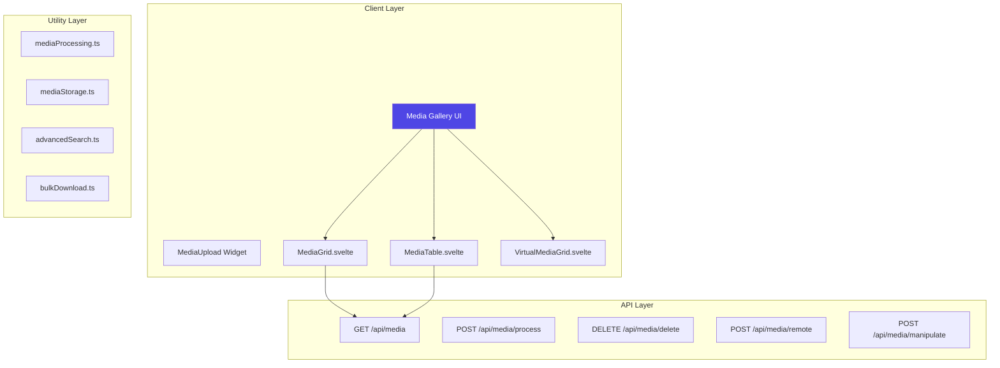

# Media Gallery Architecture

This document provides a complete technical reference for the SveltyCMS Media Gallery ecosystem, including storage abstraction, API endpoints, utilities, and performance optimizations.

## 🏗️ Architecture Overview



---

## 🗂️ File Structure

```
src/
├── routes/(app)/mediagallery/
│   ├── +page.svelte              # Main gallery page
│   ├── +page.server.ts           # Server-side data loading
│   ├── MediaGrid.svelte          # Grid view
│   ├── MediaTable.svelte         # Table view
│   ├── VirtualMediaGrid.svelte   # Virtual scrolling (10k+ files)
│   ├── Filter.svelte             # Search & filter
│   ├── AdvancedSearchModal.svelte
│   └── uploadMedia/
│       ├── LocalUpload.svelte
│       ├── RemoteUpload.svelte
│       └── ModalUploadMedia.svelte
│
├── utils/media/
│   ├── mediaModels.ts            # Type definitions
│   ├── mediaProcessing.server.ts # Hash, EXIF extraction
│   ├── mediaStorage.server.ts    # Save, resize, cloud
│   ├── advancedSearch.ts         # Multi-criteria search
│   ├── bulkDownload.ts           # TAR.GZ archive
│   ├── sharing.ts                # Expiring share links
│   └── storageAnalytics.ts       # Usage insights
│
└── widgets/core/MediaUpload/
    ├── index.ts                  # Widget definition
    ├── MediaUpload.svelte        # Single file upload
    ├── Input.svelte              # Media selector
    └── Display.svelte            # Display selected
```

---

## 🔧 Core Utilities

### Storage Abstraction (`mediaStorage.server.ts`)

Switch between Local, S3, R2, and Cloudinary with zero code changes:

```typescript
import { saveFile, deleteFile } from '@utils/media/mediaStorage.server';

// Saves to configured provider (S3/Local/etc)
const url = await saveFile(buffer, 'avatars/user-123.jpg');

// Deletes from configured provider
await deleteFile(url);
```

**Configuration**:

- `MEDIA_STORAGE_TYPE`: `'local'` | `'s3'` | `'r2'` | `'cloudinary'`
- `MEDIA_BUCKET_NAME`: S3/R2 bucket name
- `MEDIA_FOLDER`: Root folder prefix

### Image Processing

All uploads are processed with Sharp:

- **Auto-Resizing**: Generates thumbnails (`sm`, `md`, `lg`)
- **Format Conversion**: Auto-convert to `avif`, `webp`
- **Metadata Extraction**: Width, height, EXIF data, dominant colors

### Advanced Search (`advancedSearch.ts`)

```typescript
import { advancedSearch } from '@utils/media/advancedSearch';

const results = advancedSearch(allFiles, {
	tags: ['nature', 'vacation'],
	minWidth: 1920,
	aspectRatio: 'landscape',
	camera: 'Canon',
	uploadedAfter: new Date('2024-01-01')
});
```

---

## ⚡ Performance Features

### Virtual Scrolling

`VirtualMediaGrid.svelte` handles 10,000+ files by rendering only visible items:

| Files Count | DOM Nodes | Reduction |
| ----------- | --------- | --------- |
| 1,000       | ~120      | 88%       |
| 10,000      | ~140      | 99%       |

Automatically enabled when `filteredFiles.length > 100`.

### Hash-Based Duplicate Prevention

Duplicates are blocked at upload time, not cleaned up after:

```typescript
const hash = await hashFileContent(buffer);
const existing = await db.crud.findOne('MediaItem', { hash });
if (existing) throw new Error('File already exists');
```

### Bulk Download

TAR.GZ archive creation with pure Node.js:

```typescript
POST /api/media/bulk-download
{ "fileIds": ["file_1", "file_2"] }
// Returns: application/gzip stream
```

---

## 📡 API Endpoints

| Endpoint                     | Method | Description            |
| ---------------------------- | ------ | ---------------------- |
| `/api/media`                 | GET    | List media files       |
| `/api/media/process`         | POST   | Upload & process files |
| `/api/media/delete`          | DELETE | Delete files           |
| `/api/media/remote`          | POST   | Upload from URL        |
| `/api/media/search`          | POST   | Advanced search        |
| `/api/media/bulk-download`   | POST   | Download as TAR.GZ     |
| `/api/media/trash`           | POST   | Soft delete            |
| `/api/media/manipulate/[id]` | POST   | Image manipulation     |

---

## 🧩 MediaUpload Widget

### Single Upload (`MediaUpload.svelte`)

For collection fields like featured image:

```svelte
<MediaUpload {field} bind:value />
```

Features: Drag-and-drop, preview, image editor integration, validation.

### Multi-Select (`Input.svelte`)

For gallery fields:

```svelte
<Input {field} bind:value />
```

Features: Media library modal, multi-select, drag-to-reorder, stores media IDs.

---

## 🔄 On-the-Fly Transform API

Transform images on request with Sharp.js:

```http
GET /api/media/transform/path/to/image.jpg?w=800&h=600&focal=60,30&format=webp
```

**Supported Parameters:**

| Parameter | Description         | Example       |
| --------- | ------------------- | ------------- |
| `w`       | Target width        | `w=800`       |
| `h`       | Target height       | `h=600`       |
| `fit`     | Resize mode         | `fit=cover`   |
| `focal`   | Focal point (x,y %) | `focal=60,30` |
| `format`  | Output format       | `format=webp` |
| `q`       | Quality (1-100)     | `q=85`        |

---

## 📊 Competitive Analysis

SveltyCMS media handling compared to industry leaders:

| Feature                 | SveltyCMS | Sanity | Contentful | WordPress | PayloadCMS |
| ----------------------- | --------- | ------ | ---------- | --------- | ---------- |
| Transform API           | ✅        | ✅     | ✅         | ❌ Plugin | ✅         |
| Focal point in URL      | ✅        | ✅     | ❌         | ❌        | ❌         |
| Full canvas editor      | ✅ Konva  | ❌     | ❌ Basic   | ❌ Basic  | ❌         |
| Blur/Annotate/Watermark | ✅        | ❌     | ❌         | ❌        | ❌         |
| Bulk download (TAR.GZ)  | ✅        | ❌     | ❌         | ❌        | ❌         |
| Secure sharing links    | ✅        | ❌     | ❌         | ❌ Plugin | ❌         |
| Advanced search (EXIF)  | ✅        | ⚠️     | ⚠️         | ❌        | ⚠️         |
| Self-hosted option      | ✅        | ❌     | ❌         | ✅        | ✅         |

**Unique to SveltyCMS:** Full canvas editor, bulk download, secure sharing, 18+ search criteria

---

## 📚 Related Documentation

- [Media Gallery Guide](/docs/guides/content/media-gallery-guide) - User guide with UX features
- [Image Editor Architecture](/docs/architecture/image-editor) - Image editing integration
- [Media API Reference](/docs/api/Media_API) - Complete 14-endpoint API documentation
