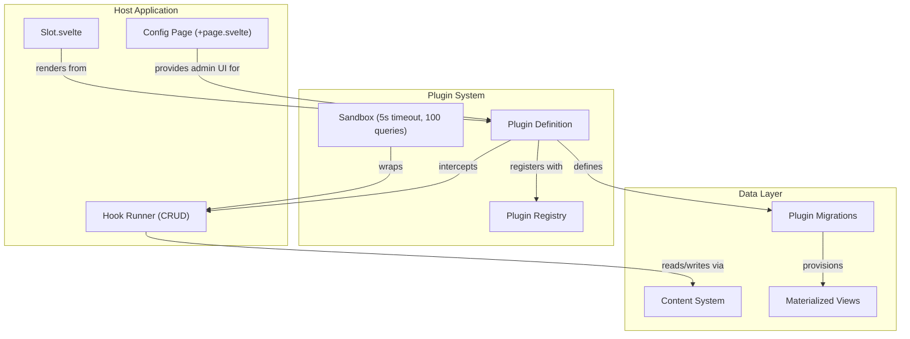

# Plugin Architecture

SveltyCMS features a robust, enterprise-grade plugin architecture for deep customization without modifying the core. Plugins leverage **Slots** for UI injection, **Lifecycle Hooks** for CRUD interception, **Migrations** for database provisioning, and a **Sandbox** for security isolation.

---

## System Overview



## System Discovery & Autoloading

SveltyCMS dynamically scans and registers plugins on system boot. There are no static hardcoded imports of plugins in the core codebase.

- **Vite Dev/Build**: Scans all `src/plugins/*/index.ts` paths using Vite's native eager glob tool `import.meta.glob("./*/index.ts", { eager: true })`.
- **Bun/Node runtime (CLI/Vitest)**: Utilizes a resilient directory scanning fallback (`fs.readdirSync`) to import plugins dynamically.

This allows any custom or optional plugin to be added to or deleted from the `src/plugins/` directory without causing compile-time errors.

---

## Plugin Structure

Every plugin lives in `src/plugins/{plugin-id}/` and follows this structure:

```
src/plugins/my-plugin/
├── index.ts                  ← Plugin definition + metadata
├── index.server.ts           ← Server-only: hooks, migrations (optional)
├── components/               ← Svelte components (optional)
│   └── MyComponent.svelte
├── server/                   ← Server-side services (optional)
│   └── service.ts
└── my-plugin.mdx             ← Plugin documentation
```

---

## Plugin Interface

```typescript
export interface Plugin {
  metadata: PluginMetadata; // Required: name, version, icon, category
  config?: PluginConfig; // Optional: public/private settings schema
  hooks?: PluginLifecycleHooks; // Optional: CRUD interception
  ssrHook?: PluginSSRHook; // Optional: server-side data enrichment
  ui?: PluginUIContribution; // Optional: UI columns, actions, edit tabs, slots
  migrations?: PluginMigration[]; // Optional: database table provisioning
  enabledCollections?: string[]; // Optional: restrict to specific collections
}
```

---

## Injection Zones

Plugins inject UI components into predefined zones. All zones are rendered via the `<Slot>` component (`src/components/system/slot.svelte`).

| Zone                 | Location                    | Used By                           |
| -------------------- | --------------------------- | --------------------------------- |
| `dashboard`          | Main dashboard widgets      | PageSpeed, Stripe                 |
| `sidebar`            | Admin sidebar navigation    | Editable Website                  |
| `entry_edit`         | Entry editor tabs/panels    | Any content plugin                |
| `entry_edit_sidebar` | Entry editor sidebar        | SEO plugins                       |
| `entry_edit_header`  | Entry editor header actions | Workflow actions                  |
| `config`             | System configuration area   | Stripe, settings plugins          |
| `config_grid`        | Config page icon grid       | Smart Importer, any config plugin |
| `collection_builder` | Collection builder page     | Schema plugins                    |

| `media_gallery` | Media gallery page | Media plugins |
| `media_gallery_toolbar` | Media gallery toolbar | Image optimization plugins |

| `user_profile` | User profile/settings page | Profile extensions |
| `user_profile_sidebar` | User profile sidebar | Account plugins |
| `entry_list_actions` | Entry list action buttons | PageSpeed refresh |

| `global-toolbar` | Top toolbar (all routes) | System status (rendered in layout) |
| `global-footer` | Footer (all routes) | Debug bar (rendered in layout) |
| `sticky-action-bar` | Bottom sticky bar | Bulk operations |

**Adding slots to a route page:**

```svelte
<script lang="ts">
  import Slot from "@src/components/system/slot.svelte";
</script>

<Slot name="user_profile" />
<Slot name="collection_builder" />
```

---

## Lifecycle Hooks

```typescript
hooks: {
  beforeSave: async (context, collection, data) => { return data; },
  afterSave: async (context, collection, result) => {},
  beforeDelete: async (context, collection, id) => {},
  afterDelete: async (context, collection, id) => {},
}
```

---

## Sandbox Boundaries

All plugin hooks execute within a sandbox (`src/plugins/sandbox.ts`):

| Boundary                  | Limit                                                        | Why                      |
| ------------------------- | ------------------------------------------------------------ | ------------------------ |
| **Collection access**     | Only `plugin_{id}_*` for writes                              | Prevent data corruption  |
| **Protected collections** | `users`, `sessions`, `tokens`, `roles`, `audit_logs` blocked | Never access auth data   |
| **Query count**           | 100 queries per hook                                         | Prevent resource abuse   |
| **Timeout**               | 5 seconds per hook                                           | Prevent hangs            |
| **Error boundary**        | Catches all errors                                           | Plugin crash ≠ CMS crash |

---

## The Config Page + Plugin Pattern

The recommended architecture for admin-facing plugins uses TWO layers:

```
┌──────────────────────────────────────────┐
│  Config Page (routes/(app)/config/...)    │  ← Admin UI
│  +page.svelte, +page.server.ts            │     CRUD forms, list views
├──────────────────────────────────────────┤
│  Plugin (src/plugins/...)                 │  ← Business logic
│  hooks, migrations, services              │     Auto-behaviors, cache sync
└──────────────────────────────────────────┘
```

### Case Study: Smart AI-Driven Migration Pro

| Layer       | File                               | Purpose                                            |
| ----------- | ---------------------------------- | -------------------------------------------------- |
| Config Page | `config/migration/+page.svelte`    | Drag-drop upload, format detection, progress UI    |
| Config Page | `config/migration/+page.server.ts` | Server actions: detect, dryRun, import, rollback   |
| Plugin      | `smart-importer/index.ts`          | Plugin metadata, config, slot registration         |
| Plugin      | `smart-importer/index.server.ts`   | 7 AST compilers, 8 format parsers, UCP engine, DLQ |
| Plugin      | `smart-importer/components/`       | TransformationTree.svelte (visual schema mapper)   |

**Conditional tile**: The Migration tile only appears in the Config grid when the plugin is installed and enabled. The config page's `+page.server.ts` checks `pluginRegistry.getPluginState('smart-importer', tenantId)`.

### Case Study: Redirect Manager

| Layer             | File                               | Purpose                                     |
| ----------------- | ---------------------------------- | ------------------------------------------- |
| Config Page       | `config/redirects/+page.svelte`    | Manual CRUD for redirect rules              |
| Plugin hooks      | `redirect-manager/index.server.ts` | Auto-redirect on slug change                |
| Plugin migrations | `redirect-manager/index.server.ts` | Creates `redirects` + `redirects_mv` tables |
| Plugin services   | `redirect-manager/index.server.ts` | Edge KV sync, Materialized View sync        |

---

## Available Plugins

| Plugin                            | Category    | Docs                                                                 |
| --------------------------------- | ----------- | -------------------------------------------------------------------- |
| **Smart AI-Driven Migration Pro** | Migration   | [smart-importer.mdx](/src/plugins/smart-importer/smart-importer.mdx) |
| PageSpeed                         | Performance | [pagespeed.mdx](/src/plugins/pagespeed/pagespeed.mdx)                |

| Editable Website | Editing | [editable-website.mdx](/src/plugins/editable-website/editable-website.mdx) |
| Redirect Manager | SEO | [redirect-manager.mdx](/src/plugins/redirect-manager/redirect-manager.mdx) |
| Sitemap | SEO | [sitemap.mdx](/src/plugins/sitemap/sitemap.mdx) |

| WebMCP | AI | [webmcp.mdx](/src/plugins/webmcp/webmcp.mdx) |
| Cookie Consent | Privacy | [cookie-consent.mdx](/src/plugins/cookie-consent/cookie-consent.mdx) |
| Stripe | Payments | [stripe.mdx](/src/plugins/stripe/stripe.mdx) |

---

## Best Practices

1. **Lazy Loading**: Use `() => import(...)` for UI components to keep bundle size low.
2. **Type Safety**: Import from `@src/plugins/types` for all interfaces.
3. **Sandbox Compliance**: Stay within 100 queries and 5s timeout per hook.
4. **Collection Prefixing**: Use `plugin_{id}_` for all plugin-owned collections.
5. **Optional Dependencies**: Dynamic import server-side deps so plugins are truly optional.
6. **Documentation**: Every plugin must have an `.mdx` file in its directory.
7. **Config Page Pattern**: Admin-facing plugins should pair with a config page for CRUD.
8. **Conditional Tiles**: Check `pluginRegistry` in `+page.server.ts` to show/hide tiles.

---

## Related

- [Plugin Development Guide](development.mdx)
- [Marketplace System](../../../architecture/marketplace.mdx)
- [AI Integration](../../development/ai-integration.mdx)
- [Security Overview](../../../architecture/security/index.mdx)
