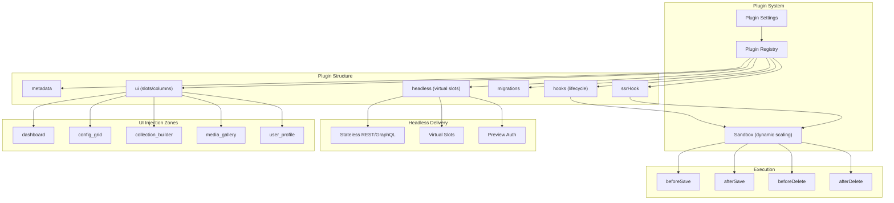

# Plugin Development Guide

SveltyCMS features an isomorphic plugin system that runs on both server and client, with full TypeScript support, RBAC-gated UI slots, lifecycle hooks for CRUD operations, sandboxed execution boundaries, and headless API contracts for decoupled frontends.

## Architecture Overview



## Quick Start: Minimal Plugin

Create a new directory in `src/plugins/my-plugin/` and define your plugin in `index.ts`:

```typescript
// src/plugins/my-plugin/index.ts
import type { Plugin } from "@src/plugins/types";

export const myPlugin: Plugin = {
  metadata: {
    id: "my-plugin",
    name: "My Custom Plugin",
    description: "Adds custom functionality",
    version: "1.0.0",
    enabled: true,
    icon: "mdi:star",
  },
};
```

Because SveltyCMS features **System Discovery & Autoloading**, there is no need to manually register or import your plugin inside any central files. Simply saving your plugin code inside the `src/plugins/` directory is enough for the CMS to automatically scan, register, and boot your plugin.

## Plugin Interface

```typescript
interface Plugin {
  metadata: PluginMetadata; // Required: id, name, version, enabled
  config?: PluginConfig; // Public/private settings
  hooks?: PluginLifecycleHooks; // CRUD interception
  ssrHook?: PluginSSRHook; // SSR data enrichment
  ui?: PluginUIContribution; // UI columns, actions, tabs, slots
  migrations?: PluginMigration[]; // DB schema migrations
  enabledCollections?: string[]; // Restrict to specific collections
}
```

## Lifecycle Hooks

Hooks intercept CRUD operations with a sandboxed context:

```typescript
hooks: {
  beforeSave: async (context, collection, data) => {
    // Validate, transform, or enrich data before save
    if (collection === 'blog_posts') {
      data.wordCount = data.content?.split(/\s+/).length || 0;
    }
    return data; // Must return data
  },

  afterSave: async (context, collection, result) => {
    // Trigger side effects after save (e.g., cache invalidation)
    await context.dbAdapter.crud.insert('plugin_my-plugin_logs', {
      action: 'save',
      collection,
      entryId: result._id,
      timestamp: new Date()
    });
  },

  beforeDelete: async (context, collection, id) => {
    // Guard deletions or archive before remove
  },

  afterDelete: async (context, collection, id) => {
    // Cleanup related plugin data
  }
}
```

## Security: Draft-by-Default Airgap

All external mutations (API, webhooks, AI agents) that create or update content MUST default to `draft` status. This prevents unauthorized publishing from non-human actors:

```typescript
// ✅ Correct: Draft-by-Default airgap
hooks: {
  beforeSave: async (context, collection, data) => {
    // AI agents, webhooks, and headless API mutations always draft
    if (context.source === 'api' || context.source === 'webhook') {
      data.status = 'draft';
    }
    return data;
  },
}

// ❌ Wrong: Allowing external sources to publish directly
hooks: {
  afterSave: async (context, collection, result) => {
    // No status enforcement — external agents could publish malicious content
  },
}
```

**Draft-by-Default applies to:**
- WebMCP AI agent tools (all mutations force `status: "draft"`)
- Stripe webhook payment events
- Smart Importer content migrations
- Any public-facing API POST/PATCH that doesn't explicitly require `publish` permission

Human review is required to transition draft entries to published status. This airgap is enforced at the hook level and cannot be bypassed by external callers.

## SSR Data Enrichment

Add custom data to entry lists during server-side rendering:

```typescript
ssrHook: async (context, entries) => {
  return entries.map((entry) => ({
    entryId: String(entry._id),
    updatedAt: new Date().toISOString(),
    data: { score: Math.random() * 100 },
  }));
};
```

## UI Injection Zones

Plugins can inject UI components into 16 predefined zones. All zones are rendered via the `<Slot>` component (`src/components/system/slot.svelte`).

| Zone                 | Location             | Used By              |
| -------------------- | -------------------- | -------------------- |
| `dashboard`          | Main dashboard       | Stats, widgets       |
| `sidebar`            | Admin sidebar        | Navigation links     |
| `entry_edit`         | Entry editor         | Custom tabs/panels   |
| `entry_edit_sidebar` | Entry editor sidebar | SEO metadata         |
| `entry_edit_header`  | Entry editor header  | Workflow actions     |
| `config`             | Settings page        | Plugin configuration |

| `config_grid` | Config page icon grid | Conditional tiles |
| `collection_builder` | Collection builder page | Schema extensions |
| `media_gallery` | Media gallery page | Media plugins |
| `media_gallery_toolbar` | Media gallery toolbar | Image optimizers |

| `user_profile` | User profile page | Profile extensions |
| `user_profile_sidebar` | User profile sidebar | Account settings |
| `entry_list_actions` | Entry list | Custom actions |

| `global-toolbar` | Top toolbar (layout) | System status |
| `global-footer` | Footer (layout) | Debug info |
| `sticky-action-bar` | Bottom sticky bar | Bulk operations |

```typescript
ui: {
  slots: [
    {
      id: "my-widget",
      zone: "dashboard",
      position: 10,
      component: () => import("./components/Widget.svelte"),
      permissions: ["admin"],
    },
    {
      id: "my-config-tile",
      zone: "config_grid",
      component: () => import("./components/ConfigTile.svelte"),
    },
  ];
}
```

## Database Migrations

Plugins create their own collections via abstract migrations using `dbAdapter.schema.ensureCollection()`:

```typescript
migrations: [
  {
    id: "001_create_results",
    pluginId: "my-plugin",
    version: 1,
    description: "Create results collection via abstract schema adapter",
    up: async (dbAdapter) => {
      // ✅ Recommended: abstract ensureCollection
      await dbAdapter.schema.ensureCollection("plugin_my-plugin_results", {
        fields: [
          { label: "Score", name: "score", type: "number" },
          { label: "Timestamp", name: "timestamp", type: "text" },
        ],
        status: "publish",
      });
    },
  },
];
```

**Why `ensureCollection`?** It abstracts away database-specific details, works across all four adapters (MongoDB, PostgreSQL, MariaDB, SQLite), and handles idempotent creation (won't error if the collection already exists).

```typescript
// ❌ Legacy: raw createModel — adapter-specific, no abstraction
up: async (dbAdapter) => {
  await (dbAdapter as any).createModel({
    _id: "plugin_my-plugin_results",
    name: "plugin_my-plugin_results",
    slug: "plugin_my-plugin_results",
    fields: [...],
    status: "publish",
  } as any);
};
```

## Headless API Contracts

Plugins designed for headless delivery expose **virtual slots** — API-only layout definitions that external frontends (Next.js, Astro, React Native) render using their own component libraries:

```typescript
// Extend your plugin with virtual slot definitions
export const virtualSlots = [
  {
    id: "headless-product-card",
    zone: "collection_item",
    schema: {
      type: "object",
      properties: {
        title: { type: "string" },
        price: { type: "number" },
        imageUrl: { type: "string" },
      },
    },
    endpoint: "/api/plugins/shop/product-card",
  },
  {
    id: "headless-cart-widget",
    zone: "page_sidebar",
    schema: { type: "object", properties: { itemCount: "number", total: "number" } },
    endpoint: "/api/plugins/shop/cart-data",
  },
];
```

External frontends fetch structured data from these endpoints and render using their native components — no Svelte dependency required. The CMS serves as a pure data source with well-typed API contracts.

## Security Boundaries (Sandbox)

All plugin hooks execute within a sandboxed context (`src/plugins/sandbox.ts`) with **dynamic scaling**:

| Boundary                  | Limit | Why |
| ------------------------- | ----- | --- |
| **Collection access** | Only `plugin_<id>_*` for writes | Prevent data corruption |
| **Protected collections** | `users`, `sessions`, `tokens`, `roles`, `audit_logs` blocked | Never access auth data |
| **Query count** | 100 per hook (default); up to 500 for migrations | Dynamic scaling prevents resource abuse |
| **Timeout** | 5s per hook; 30s for migrations | Extended timeout for schema provisioning |
| **Error boundary** | Catches all errors | Plugin crash ≠ CMS crash |

> **Dynamic Scaling**: Migrations receive relaxed limits (500 queries, 30s timeout) to handle complex schema provisioning. Hooks retain strict limits to keep runtime operations fast.

## Per-Tenant Plugin State

Plugins can be enabled/disabled per tenant:

```typescript
// Toggle via registry
await pluginRegistry.togglePlugin("my-plugin", true, tenantId, userId);

// Check state
const state = await pluginRegistry.getPluginState("my-plugin", tenantId);
```

## Conditional Config Tiles

For plugins that add tiles to the Config page grid, make them conditional by checking the plugin state in `+page.server.ts`:

```typescript
// In config/+page.server.ts
import { pluginRegistry } from "@src/plugins/registry";

const smartImporterPlugin = pluginRegistry.get("smart-importer");
const state = await pluginRegistry.getPluginState("smart-importer", tenantId);
const isEnabled = state?.enabled ?? smartImporterPlugin?.metadata.enabled;
```

Then in `+page.svelte`:

```svelte
{#if data?.pluginState?.smartImporter}
  <a href="/config/migration" class="...">Migration</a>
{/if}
```

## Existing Plugins (Reference Implementations)

| Plugin                            | Description                          | Docs                                                                       |
| --------------------------------- | ------------------------------------ | -------------------------------------------------------------------------- |
| **Smart AI-Driven Migration Pro** | 36+ platform content migration       | [smart-importer.mdx](/src/plugins/smart-importer/smart-importer.mdx)       |
| PageSpeed                         | Lighthouse-based performance scoring | [pagespeed.mdx](/src/plugins/pagespeed/pagespeed.mdx)                      |
| WebMCP                            | Headless MCP server for AI agents    | [webmcp.mdx](/src/plugins/webmcp/webmcp.mdx)                               |
| Cookie Consent                    | GDPR cookie banner with consent log  | [cookie-consent.mdx](/src/plugins/cookie-consent/cookie-consent.mdx)       |
| Redirect Manager                  | Headless redirect router + MV cache  | [redirect-manager.mdx](/src/plugins/redirect-manager/redirect-manager.mdx) |
| Stripe                            | Payment processing + webhooks        | [stripe.mdx](/src/plugins/stripe/stripe.mdx)                               |

## Best Practices

1. **Always prefix** your collections with `plugin_<your-id>_`
2. **Return data** from `beforeSave` — it's required
3. **Handle errors** gracefully — thrown errors in hooks are caught by the sandbox
4. **Use abstract migrations** — prefer `dbAdapter.schema.ensureCollection()` over raw `createModel`
5. **Keep hooks fast** — stay under the 5s timeout; use migrations for heavy provisioning
6. **Test independently** — mock the `PluginContext` for unit tests
7. **Use conditional tiles** — check `pluginRegistry` before showing config tiles
8. **Document** — every plugin must have an `.mdx` in its directory
9. **Draft-by-Default Airgap** — all external mutations must save as draft; human review required for publish
10. **Headless contracts** — export virtual slot definitions for external frontend consumption

---

## Related

- [Plugin Architecture Guide](architecture.mdx) — Deep dive into the system design
- [Marketplace System](../../../architecture/marketplace.mdx) — Plugin distribution
- [AI Integration](../../development/ai-integration.mdx) — Widget scaffolder + behavioral learning
- [Security Overview](../../../architecture/security/index.mdx)
