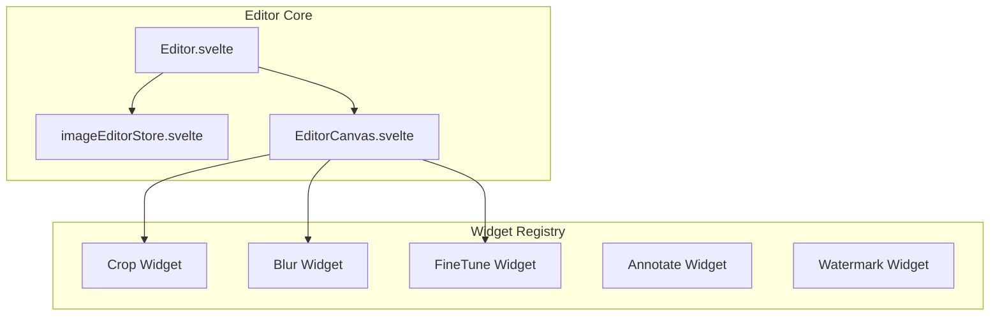

# Image Editor

The SveltyCMS Image Editor is a professional-grade, canvas-based tool for media manipulation. It follows a **non-destructive workflow**, ensuring that original assets are always preserved while allowing for complex edits and variants.

---

## 🏗️ Architecture

The editor is built on a modular widget system, allowing each tool (Crop, Blur, FineTune) to operate independently.



### Canvas Engine: Modern & Lightweight

- **Engine**: Powered by [**svelte-canvas**](https://github.com/dnass/svelte-canvas), a thin reactive wrapper for the native Web Canvas API.
- **Bundle Optimization**: Removed the 500KB+ Konva.js dependency, resulting in a **90%+ reduction** in editor overhead.
- **Svelte 5 Powered**: Uses **Runes** (`$state`, `$derived`) for a single source of truth between the UI and the rendering loop.

---

## 💡 Smart Workflow: Server-Side Baking

SveltyCMS implements a "Smart Saving" strategy that outperforms traditional client-side editors:

1.  **Instruction Set**: Edits (crop, rotate, filters) are stored as a JSON instruction object.
2.  **Zero-Loss Quality**: Instead of exporting a lossy blob from the browser, the editor sends these instructions to the server.
3.  **Sharp.js Pipeline**: The server applies the transformations to the **original, uncompressed asset** using the high-performance Sharp.js library.
4.  **Non-Destructive**: The original file remains untouched; edited versions are saved as linked variants with their own version history.

---

## ♿ Accessibility & Usability (WCAG 2.2 AA)

Designed for both power users and creators with accessibility needs:

- **Keyboard Control**: Full navigation support for tool selection and precision cropping.
- **ARIA Integration**: Every tool and handle includes proper ARIA roles and live status updates.
- **Mobile First**: Touch-optimized handles and gesture-based panning/zooming for a "Pintura-like" experience on tablets and phones.


---

## ✨ Core Tools

### 1. Crop & Focal Point

- **Smart Cropping**: Set a **Focal Point** (x,y percentage) to guide the automated cropping in responsive layouts.
- **Aspect Ratios**: Presets for 1:1, 4:3, 16:9, and free-form.

### 2. FineTune & Filters

- **Adjustments**: Brightness, contrast, saturation, exposure, and temperature.
- **Filters**: Grayscale, sepia, and custom pixel-level filters.

### 3. Annotate & Blur

- **Vector Shapes**: Add arrows, rectangles, and text annotations.
- **Privacy**: Selective region blur/pixelation for sensitive content.

### 4. Watermark Presets

- **Automatic Loading**: Collection-level watermark presets (defined in schemas) auto-load when the editor is opened for a specific field.
- **Positioning**: 9-point snap positioning with opacity and scale control.

---

## 🔧 Developer Integration

### Widget Discovery

Tools are automatically discovered from the `src/components/imageEditor/widgets/` directory via `import.meta.glob`.

### API Integration

The editor communicates with the server via the manipulate endpoint:

```http
POST /api/media/manipulate/[id]
```

This triggers the server-side Sharp.js pipeline to generate the edited variant.

---

## 📚 Related Documentation

- [**Media Gallery Guide**](./media-gallery.mdx) - DAM features and asset organization.
- [**Media API Reference**](../api/Media_API.mdx) - Technical details on the manipulation API.
- [**Project Roadmap**](../project/roadmap-2026.mdx) - Future canvas migration details.
