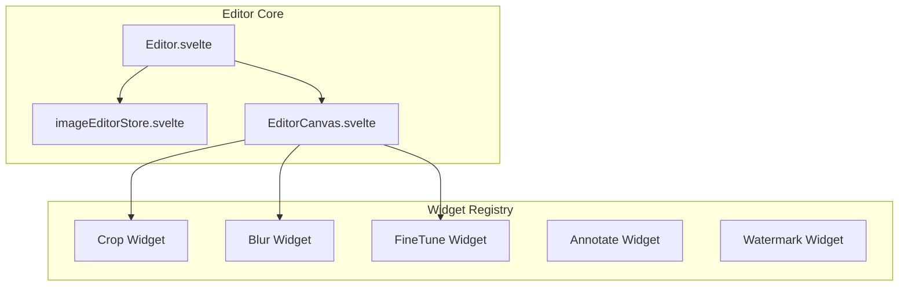

# Image Editor

The SveltyCMS Image Editor is a professional-grade, canvas-based tool for media manipulation. It follows a **non-destructive workflow**, ensuring that original assets are always preserved while allowing for complex edits and variants.

---

## 🏗️ Architecture

The editor is built on a modular widget system, allowing each tool (Crop, Blur, FineTune) to operate independently.



### Canvas Engine: Current & Future

- **Current**: Powered by **Konva.js**, providing a robust object-oriented approach to canvas manipulation.
- **Future Roadmap**: We are planning to migrate from Konva to [**svelte-canvas**](https://github.com/dnass/svelte-canvas) to further reduce bundle size and leverage Svelte's native reactivity for canvas rendering, moving closer to a lightweight DAM system.

---

## 💡 Non-Destructive Workflow

Unlike traditional CMS editors that overwrite files, SveltyCMS treats the original upload as "sacred."

1. **Original Asset**: Stored permanently with no modifications.
2. **Edits as Variants**: Saving an edit creates a new `MediaItem` with an `originalId` linking it back to the source.
3. **Baking**: Changes are only "baked" into the pixels during the save process via Sharp.js on the server.

---

## ✨ Core Tools

### 1. Crop & Focal Point

- **Smart Cropping**: Set a **Focal Point** (x,y percentage) to guide the automated cropping in responsive layouts.
- **Aspect Ratios**: Presets for 1:1, 4:3, 16:9, and free-form.

### 2. FineTune & Filters

- **Adjustments**: Brightness, contrast, saturation, exposure, and temperature.
- **Filters**: Grayscale, sepia, and custom pixel-level filters.

### 3. Annotate & Blur

- **Vector Shapes**: Add arrows, rectangles, and text annotations.
- **Privacy**: Selective region blur/pixelation for sensitive content.

### 4. Watermark Presets

- **Automatic Loading**: Collection-level watermark presets (defined in schemas) auto-load when the editor is opened for a specific field.
- **Positioning**: 9-point snap positioning with opacity and scale control.

---

## 🔧 Developer Integration

### Widget Discovery

Tools are automatically discovered from the `src/components/imageEditor/widgets/` directory via `import.meta.glob`.

### API Integration

The editor communicates with the server via the manipulate endpoint:

```http
POST /api/media/manipulate/[id]
```

This triggers the server-side Sharp.js pipeline to generate the edited variant.

---

## 📚 Related Documentation

- [**Media Gallery Guide**](./media-gallery.mdx) - DAM features and asset organization.
- [**Media API Reference**](../api/Media_API.mdx) - Technical details on the manipulation API.
- [**Project Roadmap**](../project/roadmap-2026.mdx) - Future canvas migration details.
