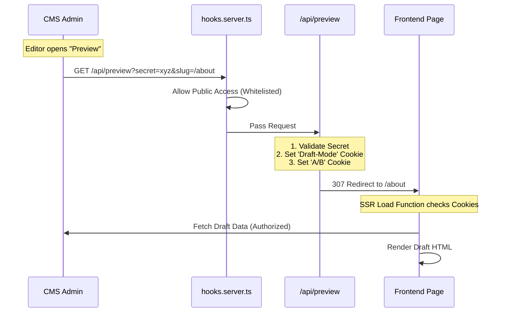

# Live Preview Architecture

SveltyCMS implements an **Enterprise Handshake Protocol** for Live Preview. Instead of loading pages directly, the CMS communicates with a dedicated API endpoint on your frontend to establish a secure, authorized session before rendering draft content.

---

## Architecture Overview

This "Handshake" architecture solves three critical enterprise challenges:

| Challenge       | Solution                                                                                          |
| --------------- | ------------------------------------------------------------------------------------------------- |
| **Security**    | Prevents unauthorized access to draft content via a shared Secret Token                           |
| **Stability**   | Sets Server-Side Cookies to ensure A/B tests and draft modes work with SSR (no layout shift)      |
| **Reliability** | Initializes the session on the correct domain, bypassing 3rd-party cookie restrictions in iframes |



---

## 1. CMS Configuration

To enable the handshake, configure your collection to point to your frontend's API endpoint, not the page URL.

### Collection Config

Use the `livePreview` string pattern to construct the API call.

```typescript
// config/collections/Posts.ts
export const schema: Schema = {
    slug: 'posts',

    // Pattern: [TenantURL]/api/preview?secret=[Key]&slug=[TargetPage]
    livePreview: '/api/preview?slug=/posts/{slug}',

    fields: [ ... ]
};
```

### Tenant Settings

Ensure your Tenant Configuration (in the Database) includes:

- **websiteUrl**: The base domain of the frontend (e.g., `https://www.acme.com`)
- **previewSecret**: A secure random string shared with the frontend environment variables

---

## 2. Frontend Implementation

### The Handshake Endpoint

Create a server-side route in your SvelteKit frontend to handle the handshake.

**File: `src/routes/api/preview/+server.ts`**

```typescript
import { redirect, error } from '@sveltejs/kit';
import { PREVIEW_SECRET } from '$env/static/private';

export async function GET({ url, cookies }) {
	const secret = url.searchParams.get('secret');
	const slug = url.searchParams.get('slug');
	const variant = url.searchParams.get('ab_variant');

	// 1. Security Check
	if (secret !== PREVIEW_SECRET) {
		throw error(401, 'Invalid Token');
	}

	if (!slug) {
		throw error(400, 'Missing Slug');
	}

	// 2. Set Draft Mode Cookie
	// This allows your load functions to fetch draft data
	cookies.set('cms_draft_mode', 'true', {
		path: '/',
		httpOnly: true,
		sameSite: 'none', // Critical for Iframes
		secure: true, // Critical for SameSite=None
		maxAge: 60 * 60 // 1 hour session
	});

	// 3. Set A/B Testing Cookie (Optional)
	if (variant) {
		cookies.set('ab_test_variant', variant, {
			path: '/',
			httpOnly: true,
			secure: true,
			sameSite: 'none'
		});
	}

	// 4. Redirect to the actual page to render
	throw redirect(307, slug);
}
```

### Middleware Integration (hooks.server.ts)

If your frontend uses the SveltyCMS Middleware (`handleApiRequests.ts`) to guard `/api/*` routes, you must whitelist the preview endpoint.

Since the CMS iframe might not share the user's login session (especially in cross-domain multi-tenancy), this endpoint relies on the **Secret Token** for security, not the User Session.

Update `src/databases/auth/apiPermissions.ts` or your whitelist logic:

```typescript
// Allow public access to the preview endpoint
export const API_PERMISSIONS = {
	// ... existing permissions ...
	'api:preview': ['*'] // Allow all (guarded by Secret inside the endpoint)
};
```

Or update `handleApiRequests.ts` logic:

```typescript
function isPublicApiRoute(pathname: string, method?: string): boolean {
	// ... existing checks ...

	// Allow Handshake Endpoint
	if (pathname === '/api/preview') return true;

	return false;
}
```

---

## 3. Data Fetching (Draft Mode)

Your page load functions should check for the cookie set by the handshake.

```typescript
// src/routes/posts/[slug]/+page.server.ts
export const load = async ({ cookies, params }) => {
	const isDraft = cookies.get('cms_draft_mode') === 'true';
	const variant = cookies.get('ab_test_variant') || 'A';

	// Fetch from CMS
	const post = await cms.getPost(params.slug, {
		draft: isDraft, // Fetch draft if cookie exists
		variant: variant
	});

	return { post };
};
```

---

## 4. Real-Time Updates

After the initial load (handled by the handshake + SSR), use the `useLivePreview` hook to subscribe to real-time keystroke updates from the CMS.

```typescript
// src/lib/useLivePreview.ts
export function useLivePreview<T>(initialData: T) {
	// ... standard postMessage listener implementation ...
}
```

---

## 5. Enterprise Considerations

### A/B Testing Stability

This architecture is superior for A/B testing because the variant is established via **Cookie before the page renders**.

| Approach              | Behavior                                                                                                       |
| --------------------- | -------------------------------------------------------------------------------------------------------------- |
| **Without Handshake** | `?variant=B` query param. If the user clicks a link, the param is lost, and they might flip back to Variant A. |
| **With Handshake**    | The cookie persists. The user stays in Variant B for the entire session.                                       |

### Cache Control & Treeshaking

- **Headers**: The handshake endpoint should set `Cache-Control: no-store` to prevent CDN caching of the redirect.
- **Optimization**: The preview logic is isolated in `/api/preview`. It adds zero JavaScript bundle size to your actual production pages.

---

## Comparison

| Feature                  | Direct URL (`?preview=true`) | API Handshake (`/api/preview`)   |
| ------------------------ | ---------------------------- | -------------------------------- |
| **Security**             | ❌ Low (Guessable)           | ✅ High (Token guarded)          |
| **Multi-Tenant Cookies** | ❌ Blocked by Safari         | ✅ Works (First-party context)   |
| **A/B Consistency**      | ⚠️ Query Param based         | ✅ Cookie based (Session sticky) |
| **Setup Effort**         | Low                          | Medium (One-time endpoint setup) |

> [!IMPORTANT]
> Use the API Handshake method for all production deployments.

---

## Related Documentation

- [fields Component](/docs/architecture/components/fields.mdx) - Dynamic field rendering
- [Unified Error Handling](/docs/guides/development/error-handling.mdx) - API error handling patterns
- [Widget System Overview](/docs/widgets/widget-system-overview.mdx) - Widget architecture
