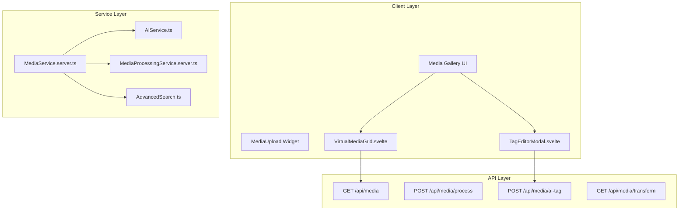

# Media Gallery & DAM System

The SveltyCMS Media Gallery is a centralized hub for managing media assets, evolving into a full **Digital Asset Management (DAM)** system. It combines a high-performance UI with robust backend services and AI-powered automation.

---

## 🏗️ Architecture Overview

The media system is built on a decoupled architecture, allowing for flexible storage providers and optimized client-side rendering. It is now powered by a dedicated **MediaProcessingService** for deep technical analysis.

### File Structure

- `src/routes/(app)/mediagallery/`: Main gallery UI components.
- `src/utils/media/`: Server-side processing, storage abstraction, and search logic.
- `src/services/MediaProcessingService.server.ts`: **New** Deep metadata and technical analysis engine.
- `src/components/media/tagEditor/`: AI and manual tagging interface.

---

## 🚀 Key Features

### 1. High-Performance Rendering

- **Virtual Scrolling**: `VirtualMediaGrid.svelte` handles 10,000+ files by rendering only visible items.
- **Lazy Loading**: Images load only when visible using Intersection Observer.
- **On-the-Fly Transforms**: Responsive images via `GET /api/media/transform` using Sharp.js.

### 2. AI-Native Tagging (Ollama Integration)

Unlike standard CMS platforms that use simple keyword matching, SveltyCMS features **native AI image analysis**.

- **Real-time Analysis**: Uses `llava` via local Ollama to "see" images and generate descriptive tags.
- **Privacy-First**: Analysis happens on your own infrastructure, never sending raw images to third-party APIs.
- **Intelligent Suggestions**: Automated tagging of objects, moods, and settings to improve searchability.

### 3. Enterprise DAM Engine

- **Deep Metadata Extraction**: Automatically parses **EXIF, IPTC, and XMP** data into searchable database fields (Camera model, Software, etc.).
- **Asset Versioning**: Full version history for every media item. Edits and replacements are tracked, allowing for rollbacks and variant management.
- **Hash-Based De-duplication**: Prevents redundant storage by checking file content hashes (SHA-256) before upload.
- **Advanced Search**: Filter by 18+ criteria including EXIF data, dominant color, and camera model.

---

## 📤 Upload & Processing

### Local & Cloud Storage

SveltyCMS supports multiple storage backends with zero code changes:

- **Local**: Filesystem storage.
- **Cloud**: S3-compatible (AWS S3, Cloudflare R2) and Cloudinary.

### Processing Pipeline

1. **Validation**: Client-side size and type checks.
2. **Hashing**: SHA-256 computation for duplicate prevention.
3. **Transformation**: Automatic thumbnail generation (`sm`, `md`, `lg`) and WebP/AVIF conversion.
4. **Metadata Extraction**: EXIF, dimensions, and color palette extraction.

---

## 🎨 Image Editor Integration

The gallery is deeply integrated with the [Image Editor](./image-editor.mdx), supporting:

- **Non-Destructive Editing**: Originals are preserved; edits are saved as variants.
- **Focal Point Management**: Visual crosshair selection for art-directed cropping.
- **Watermarking**: Automatic application of collection-level watermark presets.

---

## 📡 API Summary

All media operations are exposed via a type-safe REST API. For a complete reference, see the [Media API Documentation](../api/Media_API.mdx).

| Endpoint                   | Description                                 |
| -------------------------- | ------------------------------------------- |
| `/api/media/process`       | Upload and process new files                |
| `/api/media/ai-tag`        | Generate AI tags for an image               |
| `/api/media/transform`     | On-the-fly resizing and cropping            |
| `/api/media/bulk-download` | Download multiple files as a TAR.GZ archive |

---

## 🛠️ Best Practices

- **Organize by Folders**: Use virtual folders to keep large sets manageable (<500 files per folder).
- **Leverage WebP**: Use the Transform API to serve modern formats for better performance.
- **Set Focal Points**: Always set a focal point for hero images to ensure they look good on all devices.
- **Monitor Analytics**: Regularly check the Storage Analytics dashboard for optimization opportunities.

---

## 📚 Related Documentation

- [**Media API Reference**](../api/Media_API.mdx) - Detailed endpoint documentation.
- [**Image Editor Guide**](./image-editor.mdx) - Technical details on the canvas-based editor.
- [**AI Integration**](./development/ai-integration.mdx) - Details on the MCP server and RAG architecture.
