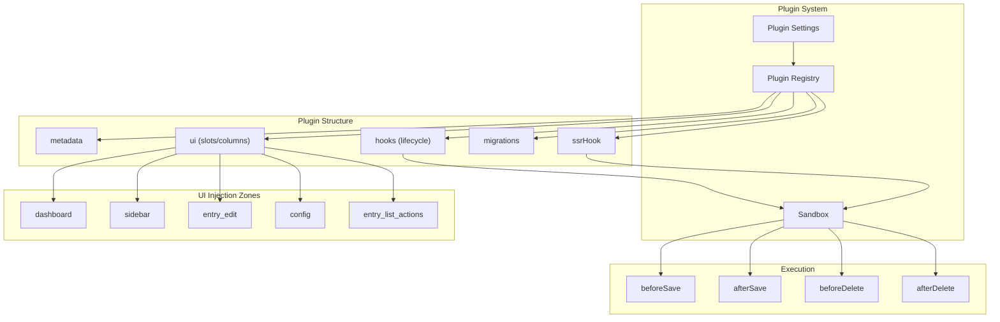

# Plugin Development Guide

SveltyCMS features an isomorphic plugin system that runs on both server and client, with full TypeScript support, RBAC-gated UI slots, lifecycle hooks for CRUD operations, and sandboxed execution boundaries.

## Architecture Overview



## Quick Start: Minimal Plugin

```typescript
// src/plugins/my-plugin/index.ts
import type { Plugin } from '@src/plugins/types';

export const myPlugin: Plugin = {
	metadata: {
		id: 'my-plugin',
		name: 'My Custom Plugin',
		description: 'Adds custom functionality',
		version: '1.0.0',
		enabled: true,
		icon: 'mdi:star'
	}
};
```

Register it in `src/plugins/index.ts`:

```typescript
import { myPlugin } from './my-plugin';

export const availablePlugins: Plugin[] = [
	pageSpeedPlugin,
	editableWebsitePlugin,
	myPlugin // ← Add here
];
```

## Plugin Interface

```typescript
interface Plugin {
	metadata: PluginMetadata; // Required: id, name, version, enabled
	config?: PluginConfig; // Public/private settings
	hooks?: PluginLifecycleHooks; // CRUD interception
	ssrHook?: PluginSSRHook; // SSR data enrichment
	ui?: PluginUIContribution; // UI columns, actions, tabs
	migrations?: PluginMigration[]; // DB schema migrations
	enabledCollections?: string[]; // Restrict to specific collections
}
```

## Lifecycle Hooks

Hooks intercept CRUD operations with a sandboxed context:

```typescript
hooks: {
  beforeSave: async (context, collection, data) => {
    // Validate, transform, or enrich data before save
    if (collection === 'blog_posts') {
      data.wordCount = data.content?.split(/\s+/).length || 0;
    }
    return data; // Must return data
  },

  afterSave: async (context, collection, result) => {
    // Trigger side effects after save (e.g., cache invalidation)
    await context.dbAdapter.crud.insert('plugin_my-plugin_logs', {
      action: 'save',
      collection,
      entryId: result._id,
      timestamp: new Date()
    });
  },

  beforeDelete: async (context, collection, id) => {
    // Guard deletions or archive before remove
  },

  afterDelete: async (context, collection, id) => {
    // Cleanup related plugin data
  }
}
```

## SSR Data Enrichment

Add custom data to entry lists during server-side rendering:

```typescript
ssrHook: async (context, entries) => {
	// Return enriched data for each entry
	return entries.map((entry) => ({
		entryId: String(entry._id),
		updatedAt: new Date().toISOString(),
		data: { score: Math.random() * 100 }
	}));
};
```

## UI Injection Zones

Plugins can inject UI components into predefined zones:

| Zone                 | Location       | Use Case             |
| -------------------- | -------------- | -------------------- |
| `dashboard`          | Main dashboard | Stats, widgets       |
| `sidebar`            | Admin sidebar  | Navigation links     |
| `entry_edit`         | Entry editor   | Custom tabs/panels   |
| `config`             | Settings page  | Plugin configuration |
| `entry_list_actions` | Entry list     | Custom actions       |

```typescript
ui: {
  columns: [
    { id: 'score', label: 'Score', width: '80px', sortable: true }
  ],
  actions: [
    { id: 'analyze', label: 'Analyze', icon: 'mdi:magnify', handler: 'onAnalyze' }
  ]
}
```

## Database Migrations

Plugins create their own collections via migrations:

```typescript
migrations: [
	{
		id: '001_create_results',
		pluginId: 'my-plugin',
		version: 1,
		description: 'Create results collection',
		up: async (dbAdapter) => {
			await dbAdapter.crud.insert('plugin_my-plugin_results', {
				_id: '__INIT__',
				initialized: true
			});
			await dbAdapter.crud.deleteMany('plugin_my-plugin_results', { _id: '__INIT__' });
		}
	}
];
```

## Security Boundaries (Sandbox)

All plugin hooks execute within a sandboxed context (`src/plugins/sandbox.ts`):

| Boundary                  | Limit                                                        | Why                      |
| ------------------------- | ------------------------------------------------------------ | ------------------------ |
| **Collection access**     | Only `plugin_<id>_*` for writes                              | Prevent data corruption  |
| **Protected collections** | `users`, `sessions`, `tokens`, `roles`, `audit_logs` blocked | Never access auth data   |
| **Query count**           | 100 queries per hook                                         | Prevent resource abuse   |
| **Timeout**               | 5 seconds per hook                                           | Prevent hangs            |
| **Error boundary**        | Catches all errors                                           | Plugin crash ≠ CMS crash |

## Per-Tenant Plugin State

Plugins can be enabled/disabled per tenant:

```typescript
// Toggle via registry
await pluginRegistry.togglePlugin('my-plugin', true, tenantId, userId);

// Check state
const state = await pluginRegistry.getPluginState('my-plugin', tenantId);
```

## Existing Plugins

| Plugin               | Description                            | Collections Used           |
| -------------------- | -------------------------------------- | -------------------------- |
| **PageSpeed**        | Lighthouse-based performance scoring   | `plugin_pagespeed_results` |
| **Editable Website** | Live preview with enterprise handshake | —                          |
| **WebMCP**           | MCP server for AI assistants           | —                          |
| **Cookie Consent**   | GDPR cookie banner                     | —                          |

## Best Practices

1. **Always prefix** your collections with `plugin_<your-id>_`
2. **Return data** from `beforeSave` — it's required
3. **Handle errors** gracefully — thrown errors in hooks are caught by the sandbox
4. **Use migrations** for DB schema — don't create collections in hooks
5. **Keep hooks fast** — stay under the 5s timeout
6. **Test independently** — mock the `PluginContext` for unit tests
