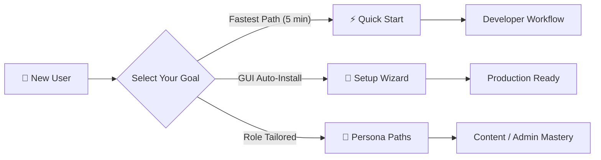

# Onboarding & Learning Paths

Welcome to SveltyCMS! Whether you are an engineer building digital experiences, an administrator configuring enterprise security, or an editor creating content, these guided tutorials will get you productive immediately.

---

## Learning Tracks

| Guide                                        | Target Audience             | Time to Complete | What You Will Build                                                                        |
| :------------------------------------------- | :-------------------------- | :--------------- | :----------------------------------------------------------------------------------------- |
| **[Quick Start](./quick-start.mdx)**         | Developers & Engineers      | 5 minutes        | A running SveltyCMS instance with SQLite, an admin user, and sample content collection.    |
| **[Setup Wizard Guide](./setup-wizard.mdx)** | Administrators & DevOps     | 10 minutes       | Database-agnostic configuration (PostgreSQL, MariaDB, MongoDB, SQLite) with multi-tenancy. |
| **[Persona Paths](./persona-paths.mdx)**     | Content Creators & Managers | 15 minutes       | Tailored workflows for editorial review, multi-language localization, and permissions.     |

---

## Diátaxis Documentation Navigation

SveltyCMS documentation is organized by cognitive intent:

1. **🚀 [Onboarding (Tutorials)](./index.mdx)**: Step-by-step learning journeys for beginners.
2. **🛠️ [Guides (How-To)](../guides/index.mdx)**: Task-oriented recipes for specific goals (e.g. Paraglide i18n, E-Commerce, Smart Importer).
3. **📖 [Reference (Information)](../reference/index.mdx)**: Complete specifications for REST APIs, GraphQL, widgets, and schemas.
4. **🏗️ [Architecture (Concepts)](../reference/architecture/index.mdx)**: In-depth technical explanations of database resilience, L1/L2 caching, and security layers.

---

## Next Steps

- Jump right into the **[Quick Start Guide](./quick-start.mdx)**.
- Explore the **[Persona Paths](./persona-paths.mdx)** to tailor your setup.
- Read about our **[Database Architecture](../reference/database/index.mdx)**.
