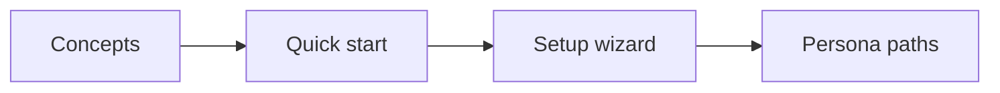

# Onboarding

These pages are tutorials: follow them in order and you finish with a running CMS. The product model is one page, [Concepts](../concepts/index.mdx). Task recipes live in [Guides](../guides/index.mdx).

## Tracks

| Guide                                 | Who                         | You finish with                                   |
| :------------------------------------ | :-------------------------- | :------------------------------------------------ |
| [Concepts](../concepts/index.mdx)     | Everyone                    | The six ideas, and a pointer to the right docs    |
| [Quick start](../getting-started.mdx) | Developers                  | SQLite, an admin user, and a sample collection    |
| [Setup wizard](./setup-wizard.mdx)    | Administrators              | A chosen database and a completed first-run setup |
| [Persona paths](./persona-paths.mdx)  | Editors, admins, developers | The next docs for that role                       |

## Where the other docs sit

| Kind        | Question                           | Open                                                       |
| :---------- | :--------------------------------- | :--------------------------------------------------------- |
| Tutorial    | How do I learn this by doing it?   | This folder, and [Getting started](../getting-started.mdx) |
| How-to      | How do I complete this task?       | [Guides](../guides/index.mdx)                              |
| Reference   | What is the exact contract?        | [Reference](../reference/index.mdx)                        |
| Explanation | Why does the engine work this way? | [Architecture](../reference/architecture/index.mdx)        |

## Next steps

- Read [Concepts](../concepts/index.mdx), then the [Quick start](../getting-started.mdx).
- Pick a role in [Persona paths](./persona-paths.mdx).
