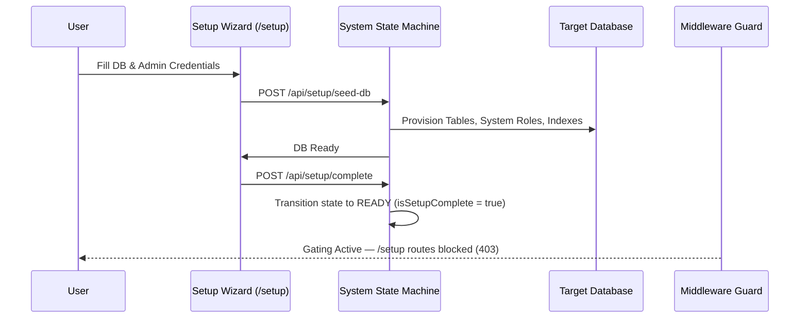

# Setup Wizard Guide

The SveltyCMS **Setup Wizard** is a progressive, self-healing installation flow that provisions your database, seeds system permissions and roles, and locks down bootstrapping endpoints.

---

## Supported Database Engines

SveltyCMS features a 100% database-agnostic architecture. Choose the database that fits your operational needs:

| Database Engine              | Recommended Environment                        | Connection Requirements                                                     |
| :--------------------------- | :--------------------------------------------- | :-------------------------------------------------------------------------- |
| **SQLite (In-Process)**      | Local Development, Edge, Small to Medium Sites | Zero external dependencies; automated file creation in `./db/sveltycms.db`. |
| **PostgreSQL (v15+)**        | Enterprise, High Concurrency, Microservices    | Host, Port (5432), Database Name, Username, Password.                       |
| **MariaDB / MySQL (v10.6+)** | Standard Cloud VPS, Shared Hosting             | Host, Port (3306), Database Name, Username, Password.                       |
| **MongoDB (v6.0+)**          | Document-first, Schemaless, Atlas Cloud        | Mongo Connection String (`mongodb://` or `mongodb+srv://`).                 |

---

## Step-by-Step Walkthrough

### 1. Database Configuration

Select your engine and input credentials. SveltyCMS tests connection resilience and retries automatically before applying schemas.

### 2. Administrator Account

Set up the super-admin identity:

- **Email**: Must be a valid email format.
- **Password**: Minimum 8 characters with lowercase, uppercase, numeric, and symbol enforcement.
- **2FA (Optional)**: Can be activated immediately or later in User Profile.

### 3. Localization & Multi-Tenancy

- **Base Locale**: Set default system language (e.g. `en`, `de`, `fr`, `es`).
- **Multi-Tenant Mode**: Enable strict tenant isolation with automated `tenantId` row partitioning.

---

## Security & Bootstrap Gating

Once setup completes:

1. `isSetupComplete()` returns `true`.
2. The `handleSystemState` hook redirects any navigation to `/setup` directly to `/login`.
3. All `/api/setup/*` API routes fail closed with `403 Forbidden`.

> [!CAUTION]
> Once finalized, database connection parameters live securely in `config/private.ts` (or environment variables). You cannot re-run the setup wizard without manually resetting configuration.

---

## Next Steps

- Review the **[Security Architecture](../reference/security/index.mdx)** for authentication and CSRF details.
- Discover how to build content models with **[Collections Guide](../guides/content/index.mdx)**.
