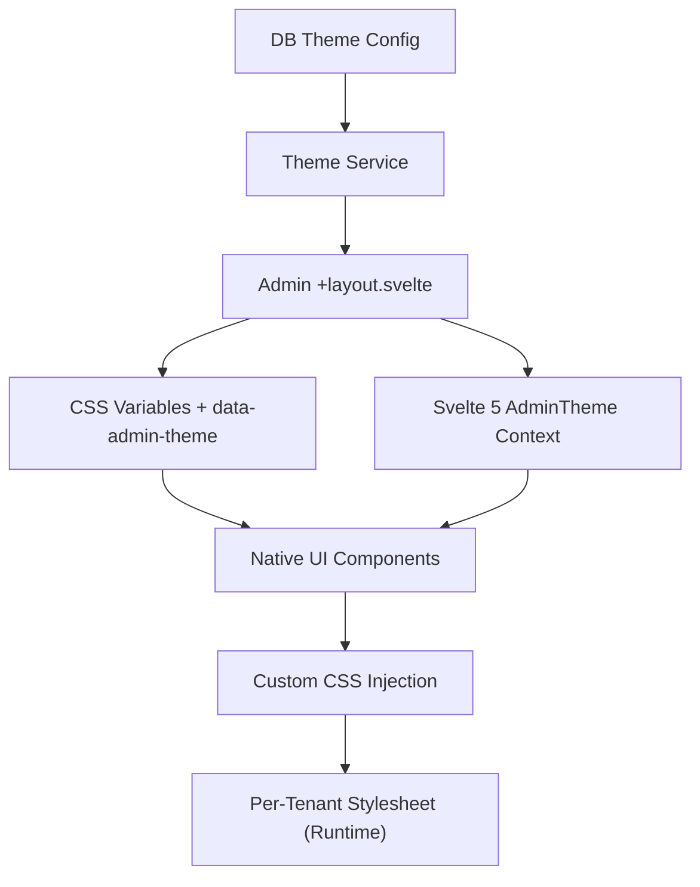

# Administration Theme System Architecture (Gin-Inspired)

This document is the strategic blueprint for making SveltyCMS's admin UI as flexible, opinionated, and extensible as **Drupal Gin** — and then going further, thanks to Svelte 5's reactive component model.

---

## 1. Vision: Gin-Level Flexibility

Drupal Gin has become the gold standard for modern admin UIs because it goes beyond color theming — it delivers a cohesive, modular, and deeply customizable experience with dedicated modules for every part of the admin interface.

SveltyCMS aims to match or exceed each:

| Gin Module             | SveltyCMS Equivalent                                 | Priority |
| :--------------------- | :--------------------------------------------------- | :------- |
| **Gin Toolbar**        | Enhanced top + side navigation with role-based menus | High     |
| **Gin Login**          | Branded, fully themed login + forgot password pages  | High     |
| **Gin Layout Builder** | Themed + improved Layout/Block system                | Medium   |
| **Gin Type Tray**      | Content type browser / quick-create tray             | High     |
| **Gin Dashboard**      | Widget-based, customizable home dashboard            | High     |

We achieve this through **color theming** (Skeleton.dev compatible) + **structural theming** (CSS variables + Svelte 5 Context) — with zero PHP/Twig overhead.

### SveltyCMS Advantages Over Gin

- **True reactive Svelte components** → much smoother UX than Drupal's PHP + Twig render pipeline
- **Easier per-tenant / multi-site theming** via native `tenantId` isolation
- **Better mobile responsiveness** out of the box (no Drupal legacy baggage)
- **Live preview** in the theme customizer (possible natively with Svelte 5 `$state`)
- **Zero compilation overhead** — CSS variables swap instantly at runtime

---

## 2. Core Architecture



---

## 3. Pillar A: Design Tokens — `--admin-*` Structural Variables

All structural tokens live in `src/utilities.css` (imported by `app.css`), protected from theme copy-paste overwrites.

```css
/* src/utilities.css — :root defaults (cozy density) */
:root {
  /* Density Scale (0.85 = compact, 1.0 = cozy, 1.25 = spacious) */
  --admin-density: 1;

  /* Radii */
  --admin-radius-base: 0.75rem;
  --admin-radius-card: 0.875rem;
  --admin-radius-input: 0.625rem;
  --admin-radius-button: 0.5rem;

  /* Borders & Shadows */
  --admin-border-width: 1px;
  --admin-shadow-elevation: 0 1px 3px 0 rgb(0 0 0 / 0.1);
  --admin-shadow-elevated: 0 10px 15px -3px rgb(0 0 0 / 0.05);

  /* Layout Sizing */
  --admin-sidebar-width: 260px;
  --admin-header-height: 64px;

  /* Features */
  --admin-sticky-bar-height: 56px;

  /* Editorial Status Colors */
  --admin-color-draft: oklch(65% 0 219deg);
  --admin-color-published: oklch(69.59% 0.15 162.47deg);
  --admin-color-scheduled: oklch(58.74% 0.2 256.12deg);
  --admin-color-review: oklch(76.86% 0.16 70.07deg);
}

/* Compact density overrides */
[data-density="compact"] {
  --admin-density: 0.85;
  --admin-radius-card: 6px;
  --admin-radius-input: 4px;
  --admin-sidebar-width: 200px;
  --admin-header-height: 48px;
}

/* Spacious density overrides */
[data-density="spacious"] {
  --admin-density: 1.25;
  --admin-radius-card: 16px;
  --admin-radius-input: 10px;
  --admin-sidebar-width: 300px;
  --admin-header-height: 72px;
}
```

Components read these directly:

```svelte
<div class="card shadow-sm"
     style="border-radius: var(--admin-radius-card, 0.875rem);
            border-width: var(--admin-border-width, 1px);">
```

---

## 4. Pillar B: Svelte 5 `AdminTheme` Context

The `AdminTheme` class in `src/components/ui/theme-context.svelte.ts` is the reactive source of truth for structural theme state — consumed by all native UI components via Svelte context.

```typescript
// src/components/ui/theme-context.svelte.ts
export interface ThemeConfig {
  id: string;
  name: string;
  density: "compact" | "cozy" | "spacious";
  variant: "flat" | "bordered" | "elevated";
  accentMode: "default" | "primary-only" | "custom";
  role: "editor" | "reviewer" | "translator" | "admin" | "manager";
  customCss?: string;
  features: {
    stickyActionBar: boolean;
    collapsibleSidebar: boolean;
    brandedLogin: boolean;
    highContrastMode: boolean;
    reducedMotion: boolean;
  };
}
```

Set in `(app)/+layout.svelte`, consumed in every native component:

```svelte
<!-- src/routes/(app)/+layout.svelte -->
<script lang="ts">
  import { setThemeContext } from '@components/ui/theme-context.svelte';

  const theme = setThemeContext({ density: 'cozy', variant: 'bordered' });
</script>

<div data-density={theme.density} data-admin-theme={theme.themeName}>
  {@render children()}
</div>
```

**Fallback Guard**: If `getThemeContext()` returns `undefined` (unit tests, setup screens), components resolve to the standard `cozy/bordered` defaults automatically.

---

## 5. Admin Theme Settings Panel (Gin Settings Equivalent)

**Location**: `Settings → Appearance → Admin Theme`

| Tab                  | Features                                                                                      |
| :------------------- | :-------------------------------------------------------------------------------------------- |
| **Presets & Import** | Skeleton.dev imports, curated Svelty presets, paste theme JSON                                |
| **Colors**           | Accent color (light/dark pairing toggle), focus ring color, custom palettes                   |
| **Layout & Density** | Compact / Cozy / Spacious, sidebar width (resizable), header density                          |
| **Navigation**       | Vertical sidebar (default), top toolbar option, collapsible / hidden states                   |
| **Visual Style**     | Border radius (global + per-component), shadow intensity, card style (flat/bordered/elevated) |
| **Features**         | Sticky action bar, dark mode behavior, reduced motion, high contrast mode                     |
| **Advanced**         | Custom CSS textarea (with sanitization), reset to defaults, Export / Import theme JSON        |

### Key Flexibility Features (Must-Have for Gin Parity)

- ✅ **Sticky Action Bar** — Save / Preview / Delete buttons that stick on scroll in content edit forms
- ✅ **Resizable / Collapsible Sidebar**
- ✅ **Per-user Theme Overrides** (like Gin's per-user settings)
- ✅ **Accent Color + Focus Color** with live preview
- ✅ **Custom Logo / Branding** on login + admin header
- ✅ **Dark Mode** with auto + forced options
- ✅ **Custom CSS injection** (safely sanitized, per-tenant)
- ✅ **Role-based layout variations**

---

## 6. Figma Integration

### Design Token Pipeline

```
Figma Variables (Tokens Studio) → JSON Export → Style Dictionary build
→ CSS custom properties in app.css / tenant stylesheets
```

- **1-to-1 Mapping**: Figma variable names map directly to `--admin-*` CSS properties
- **Mode Switching**: Figma modes (Light/Dark, Classic/Custom) → `data-admin-theme` attributes
- **Component Parity**: Svelte component props (`variant`, `density`) match Figma component variants exactly

### Figma API Dynamic Importer

An administrator can input a Figma File URL + Personal Access Token → SveltyCMS fetches variables via the Figma REST API (`/v1/files/:key/variables`) → writes a new theme record to DB → live in one click.

### Skeleton.dev Coexistence

Themes from `https://themes.skeleton.dev/themes/create` can be pasted directly into the `@theme` block. SveltyCMS overlays `--admin-*` structural tokens on top — color palette swaps globally, structural layout stays controlled.

---

## 7. Visual Regression Prevention

1. **CSS Variable Fallbacks**: All `var(--admin-*, fallback)` references include the current value as fallback so the browser never renders a broken layout if no custom theme is served.
2. **Default Root Mappings**: `:root` in `utilities.css` initializes all `--admin-*` tokens to the current production values.
3. **Svelte 5 Context Fallback Guard**: Components resolve to cozy/bordered defaults when `getThemeContext()` returns `undefined`.
4. **Playwright Visual Regression**: Baseline screenshots before CSS variable migration, zero-tolerance pixel comparison.

---

## 8. Implementation Roadmap

### Phase 1: Foundation — ✅ COMPLETED

- `app.css` + `utilities.css` separation
- Initial `--admin-*` CSS variables (spacing scale, radii, sidebar, header, status colors)
- `AdminTheme` reactive class + `setThemeContext` / `getThemeContext` in `theme-context.svelte.ts`
- `data-density` classes in admin layout root

### Phase 2: Core Theme Engine — 🔄 IN PROGRESS

- [ ] Finalize full structural CSS variables (add `--admin-radius-base`, `--admin-radius-button`, `[data-density]` overrides, sticky bar height)
- [ ] Expand `AdminTheme` interface: `variant`, `accentMode`, `customCss`, `features` map
- [ ] Refactor key UI components (Button, Card, Input, Table, Sidebar) to consume theme context
- [ ] Add `data-admin-theme` + `data-density` attributes to admin layout root element

### Phase 3: Settings UI — Next Priority

- [ ] Build full **Admin Theme Settings** page (`settings/appearance/admin-theme`)
- [ ] Implement Skeleton.dev preset import
- [ ] Custom CSS injection with DOMPurify sanitization
- [ ] Live theme preview system (Svelte 5 `$state` → instant re-render)

### Phase 4: Gin Feature Parity

- [ ] **Sticky Action Bar** on all content edit forms
- [ ] **Resizable / Collapsible Sidebar** with `localStorage` persistence
- [ ] **Branded Login page** with tenant logo + custom accent
- [ ] **Role-based navigation** layout adjustments
- [ ] **Dashboard widget system** (drag-and-drop, per-role defaults)

### Phase 5: Advanced

- [ ] Per-user theme overrides (stored in user preferences)
- [ ] Figma API sync utility
- [ ] Theme marketplace / community plugins
- [ ] Theme Export / Import JSON

---

## 9. Adaptive Workspaces

Beyond visual theming — SveltyCMS adapts the entire workspace to the user's role:

- **Role-Based Layouts**: Translators → localization tables focus; Managers → dashboard metrics; Developers → compact density + raw JSON views
- **Density Modes**: `compact` (heavy listings, developer logs), `cozy` (standard editing), `spacious` (distraction-free writer mode)
- **Real-Time Contrast Validation**: Dynamic color scale analysis verifying focus rings, text, and alert states meet WCAG 3.0 contrast ratios
- **Status-Color Tokens**: `--admin-color-draft`, `--admin-color-published`, `--admin-color-scheduled`, `--admin-color-review` linked directly to content review states

---

## 10. Next Steps (Immediate Actions)

1. **Finalize `--admin-*` variables** in `utilities.css` — add `[data-density]` overrides, `radius-base`, `radius-button`, `sticky-bar-height`
2. **Expand `AdminTheme` context** — add `variant`, `accentMode`, `features` map, `customCss`
3. **Refactor core components** — Button, Card, Input to consume `--admin-radius-*` and theme context `variant`
4. **Build Theme Settings UI** — this is the highest-value visible deliverable
5. **Sticky Action Bar** component — immediate UX win on content edit forms
6. **Update visual regression test baselines** before any structural migration
