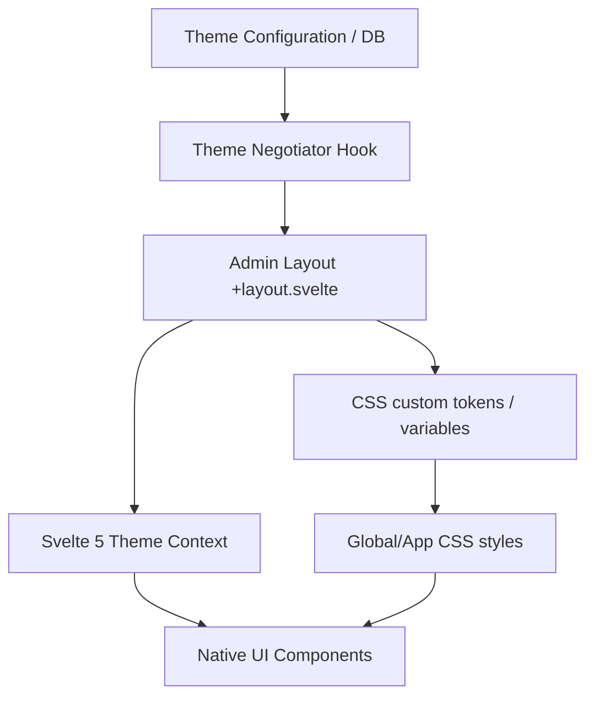

# Administration Theme System Architecture

This document presents the detailed architectural blueprint for achieving layout and styling flexibility within the SveltyCMS administration panels, matching or exceeding the capabilities of Drupal's administrative theme customization systems (such as the **Gin Theme**).

---

## 1. The Challenge: Beyond Simple Color Swapping

Traditional theme systems (including standard Tailwind implementations) focus on swapping color variables (e.g., changing `--color-primary-500` from blue to green). However, advanced CMS admin themes do more than change colors; they dynamically alter:

- **Structural Layouts:** Sidebar positioning, header densities, floating action panels, and layout spacing.
- **Design Metrics:** Focus rings, border radii, border thicknesses, container spacing, and shadow weights.
- **Typography & Density:** Content density levels (compact, cozy, spacious), and specialized font pairings.
- **Component Templates:** Transforming native UI elements (buttons, inputs, cards) from standard flat forms into modern rounded containers.

---

## 2. Proposed Architecture: SveltyCMS Admin Theme System

To enable this flexibility, SveltyCMS will decouple layout structure, component configuration, and design tokens from hardcoded values.



### Key Pillars of the System

### Pillar A: Layout & Metric Abstraction (CSS Custom Properties)

We will transition Tailwind v4 styles from static values to dynamic tokens computed at runtime.

```css
/* src/app.css or theme styles */
:root[data-admin-theme="gin"] {
  /* Dynamic Spacing & Border Scales */
  --admin-spacing-scale: 1.1;
  --admin-border-width: 2px;
  --admin-radius-card: 16px;
  --admin-radius-input: 12px;
  --admin-shadow-elevation: 0 10px 15px -3px rgba(0, 0, 0, 0.05);

  /* Color Customizations */
  --color-primary-500: oklch(62% 0.18 250deg); /* Accent blue */
  --color-surface-900: oklch(14% 0.02 240deg); /* Warm charcoal */

  /* Navigation layout properties */
  --admin-sidebar-width: 280px;
  --admin-header-height: 70px;
}
```

Components (e.g., card.svelte, input.svelte) will read these layout metrics directly:

```html
<!-- Native card with dynamic metrics support -->
<div
  class="card border-[length:var(--admin-border-width)] shadow-[var(--admin-shadow-elevation)]"
  style="border-radius: var(--admin-radius-card);"
>
  ...
</div>
```

---

### Pillar B: Svelte 5 Component Context System (`ThemeContext`)

To support structural changes (e.g., a button displaying as a pill with high shadow borders in one theme, but flat and squared in another), we will introduce a Svelte Context Provider in the root Admin layout.

```typescript
// src/components/ui/theme-context.svelte.ts
export interface ThemeConfig {
  name: string;
  density: "compact" | "cozy" | "spacious";
  variant: "flat" | "bordered" | "neumorphic";
  shadows: boolean;
}

export const ADMIN_THEME_KEY = Symbol("admin-theme");
```

In the main administration layout:

```html
<!-- src/routes/(admin)/+layout.svelte -->
<script lang="ts">
  import { setContext } from "svelte";

  let currentThemeConfig = $state<ThemeConfig>({
    name: "gin",
    density: "cozy",
    variant: "bordered",
    shadows: true,
  });

  setContext(ADMIN_THEME_KEY, currentThemeConfig);
</script>
```

In our native UI components (e.g., button.svelte):

```html
<script lang="ts">
  import { getContext } from "svelte";
  import { ADMIN_THEME_KEY, type ThemeConfig } from "./theme-context.svelte";

  const theme = getContext<ThemeConfig>(ADMIN_THEME_KEY);

  // Reactively calculate styles based on current theme structure
  const densityPadding = $derived.by(() => {
    if (!theme) return "px-4 py-2";
    if (theme.density === "compact") return "px-2 py-1 text-xs";
    if (theme.density === "spacious") return "px-6 py-3 text-base";
    return "px-4 py-2"; // Cozy
  });
</script>
```

---

## 3. How Figma Can Assist the Workflow

Integrating **Figma** into this design pipeline creates a powerful workflow bridging design and production code.

### 1. Figma Variables & Design Tokens (1-to-1 Mapping)

Figma Variables support multiple types (Color, Float/Number, String, Boolean) and **Modes** (e.g., Light Mode vs. Dark Mode, or Default Theme vs. Gin Theme).

- **Token Alignment:** We map Figma Variable names directly to SveltyCMS's CSS custom properties. For example, a Figma numeric variable named `spacing/scale` translates directly to `--admin-spacing-scale`.
- **Variable Modes:** Changing the layout mode in Figma (e.g., switching the page mode from "Classic" to "Gin") instantly updates padding, radius, and shadow properties in the mockup. SveltyCMS replicates this behavior via DOM data attributes (e.g., `data-admin-theme="gin"`).

### 2. Auto-generated Token Pipelines (Style Dictionary)

Rather than manually coding styles, we establish a continuous delivery pipeline for themes:

1.  **Figma Tokens Studio:** Designers manage colors, layout values, and typographic scales using the _Tokens Studio_ plugin in Figma.
2.  **JSON Export:** Design variables are exported as structured JSON tokens.
3.  **Style Dictionary / Build Task:** SveltyCMS integrates a build step using `Style Dictionary` to automatically parse these JSON files and compile them into CSS custom properties under `src/app.css` or tenant-specific stylesheets.

### 3. Component Variant Parity

We match component properties inside SveltyCMS with **Figma Component Variants**.

- If our Svelte Button component supports `variant` (primary, secondary, etc.) and `shape` (round, angle), the corresponding Figma Button component contains identical variant dimensions.
- This ensures that UI mocks generated in Figma are rendered identically in the CMS engine with zero code transformations.

### 4. Figma API Dynamic Theme Importer (Advanced Feature)

SveltyCMS can include a theme synchronizer utility inside the administration Settings panel:

- An administrator inputs a Figma File URL and their Figma Personal Access Token.
- The SveltyCMS backend calls the **Figma REST API** (`/v1/files/:key/variables`) to retrieve the design variables.
- The system dynamically writes these variables into a new custom theme database record, allowing administrators to design a theme in Figma and sync it to SveltyCMS in one click.

### 5. Semantic SCSS/CSS Variable Rollout (Payload CMS v5 Paradigm)

Payload CMS v5 separates its structural styling layer using CSS Layers (`@layer payload-default`), dynamic overrides, and structured CSS variables (e.g. `--theme-elevation-100`, `--theme-elevation-500`).
SveltyCMS will implement a **Semantic SCSS/CSS Variable Rollout** system directly synced to Figma design collections:

- **Decoupled Primitives & Semantics:** Primitives (exact hex codes like `#3b82f6` or `gray/100`) are mapped in a background base SCSS layer.
- **Semantic Tokens Rollout:** Design styles are coded entirely using semantic tokens (e.g., `--theme-bg-elevation-1`, `--theme-border-input-focus`).
- **CSS Layer Boundaries:** By encapsulating core components inside a Svelte/Tailwind CSS layer (e.g. `@layer components`), developers can load a complete semantic SCSS theme file rolled out from Figma variables that overrides every layout border, spacing ratio, and component styling dynamically.

### 6. Coexistence with Skeleton Theme Generator (themes.skeleton.dev)

SveltyCMS utilizes standard Tailwind v4 and Skeleton-compatible variable mappings (e.g. `--color-primary-500`, `--color-surface-900`) inside [src/app.css](file:///D:/SveltyCMS/src/app.css).
To allow users to directly copy-paste custom generated themes from `https://themes.skeleton.dev/themes/create`, our admin theme architecture defines a layered approach:

- **Color Overwrites (Copied Palette):** When a user pastes a custom theme into the `@theme` block, the primary, secondary, and surface color palettes swap globally.
- **Structural Layering (Layout Theme):** SveltyCMS overlays layout-specific tokens (e.g. `--admin-spacing-scale`, `--admin-border-width`) on top of the pasted color tokens.
- **Adaptive Component Classes:** Components react to the color palette updates automatically (since they use class maps like `preset-filled-primary-500` which reference the newly pasted variables), while their structure adjusts depending on SveltyCMS's contextual variables.

### 7. Future-Proofing: The Dynamic CSS Custom Theme Paradigm

While Figma serves as a designer's sandbox to model themes, SveltyCMS's **injected CSS Variable theme system** is the ultimate future-proof mechanism for achieving Drupal/WordPress-level admin theme portability:

- **Zero Compilation Overhead:** Traditional platforms require compilation tasks (Sass/Webpack/Vite rebuilds) to swap administrative designs. By executing styling entirely via runtime CSS variables, a new layout (e.g., a "Wordpress Dashboard Clone" or "Drupal Gin Dashboard") can be loaded instantly by serving a static `.css` file.
- **Enterprise Multi-Tenant Isolation:** Dynamic custom variables allow the server to inject tenant-specific CSS properties at render time. Tenant A (using a corporate flat theme) and Tenant B (using a modern rounded theme) share the exact same compiled SvelteKit JavaScript bundles, keeping runtime performance at sub-millisecond level.
- **Simple Plugin Overrides:** Community developers can package fully customized admin themes as basic CSS plugins containing variable overwrites, which are registered in SveltyCMS without touching Svelte source files.

### 8. Visual Regression Prevention & Default Aesthetic Safety

To guarantee that the current look and feel of the SveltyCMS administration panel does not change during the refactoring process, we enforce three safety guardrails:

0.  **Dynamic Accent Color Pairing Consistency:**
    All dynamic components must follow the `tertiary-500` (Light) / `primary-500` (Dark) color pairing for accents and main buttons. No refactoring should hardcode `primary-500` for light-mode actions unless theme parameters override it.
1.  **Local CSS Variable Fallbacks (`var(--token, fallback)`):**
    All CSS custom property references in Svelte templates contain the current design values as hardcoded CSS fallbacks. For example:
    - Instead of `style="border-radius: var(--admin-radius-card);"`, we write `style="border-radius: var(--admin-radius-card, 0.75rem);"`.
    - If no custom theme stylesheet is served or variables fail to load, the browser falls back to the exact current style definitions.
2.  **Default Theme Root Mappings in `app.css`:**
    Under the `:root` pseudo-class in [src/app.css](file:///D:/SveltyCMS/src/app.css), we initialize all `--admin-*` tokens matching SveltyCMS's current design values (e.g. `--admin-spacing-scale: 1.0;`, `--admin-border-width: 1px;`, `--admin-radius-card: 0.75rem;`).
3.  **Svelte 5 Context Fallback Guard:**
    If `getContext(ADMIN_THEME_KEY)` returns `undefined` (because a component is loaded outside the admin layout context, such as in unit tests or setup screens), components resolve to the standard cozy/rounded layout properties automatically.
4.  **Baseline Visual Regression Tests:**
    Before executing the CSS variables migration, we record visual screenshot baselines using our automated Playwright integration suite. We compare new runs pixel-for-pixel to ensure exactly `0%` visual deviance from our current production styling.

### 9. Theme-Exclusive Features & Advanced Extension Capabilities (Drupal Gin Model)

Drupal admin themes like **Gin** do not merely style core layouts; they inject dynamic UI features (e.g. custom shortcuts, dynamic navigation toolbars, sticky action headers, and real-time palette tweaks) that are missing from standard themes.
SveltyCMS supports this level of advanced flexibility via our **Svelte 5 Context API & Asset Injection pipeline**:

- **Feature Flags in Context Store:** The Svelte 5 `ThemeConfig` context includes a `features` map (e.g. `{ quickSearch: true, stickyHeader: true, layoutToggles: true }`). The admin layout uses these flags to conditionally mount and render advanced components or structural changes.
- **Dynamic Script & Style Injection:** Custom admin themes can define optional JS/CSS files to be loaded on the fly (e.g. `gin-features.js` to handle specialized layout gestures or sidebar behaviors).
- **Polymorphic Snippet Slots:** SveltyCMS layouts expose optional layout hooks (e.g. `{#if theme.slots.headerBar} ... {/if}`) allowing custom themes to render custom headers, user menus, or status modules in places where the default layout might only display plain text.

---

## 4. Implementation Roadmap & Timeline Estimation

The conversion of the SveltyCMS administration panel to use this dynamic design token system is estimated to take **9 to 13 working days (~2 weeks)** for a single engineer, broken down into the following phases:

### Phase 1: design token abstraction (Est. 2-3 Days)

- **CSS Variable Mapping (1.5 days):** Extract hardcoded dimensions, shadows, and spacing rules from [src/app.css](file:///D:/SveltyCMS/src/app.css) into `--admin-*` tokens.
- **Theme Context Setup (1 day):** Create the Svelte 5 `ThemeContext` controller and hook it into the admin root layout `(admin)/+layout.svelte`.

### Phase 2: Component Refactoring (Est. 3-4 Days)

- **Component Token Wiring (3 days):** Refactor the 36 native UI components (cards, inputs, dropdowns, tables, buttons) to reactively read context properties and layout metrics.
- **Aesthetic Quality Assurance (1 day):** Ensure layout density, borders, and margins render consistently under extreme styling changes.

### Phase 3: DB Integration & settings Panel (Est. 2-3 Days)

- **Database & Settings Integration (1.5 days):** Add settings tables, tenant preferences schema, and CRUD endpoints to store the active theme configuration.
- **Sync Utility & GUI (1.5 days):** Build the copy-paste GUI and the Figma API synchronization module in the administration dashboard.

### Phase 4: Validation & Quality Control (Est. 2-3 Days)

- **Cross-Browser and E2E Auditing (1.5 days):** Verify spacing metrics across layouts, test performance impact, and validate responsive rendering.
- **Accessibility & WCAG Auditing (1 day):** Verify color contrast scales, keyboard focus rings, and screen-reader flow during theme swaps.
