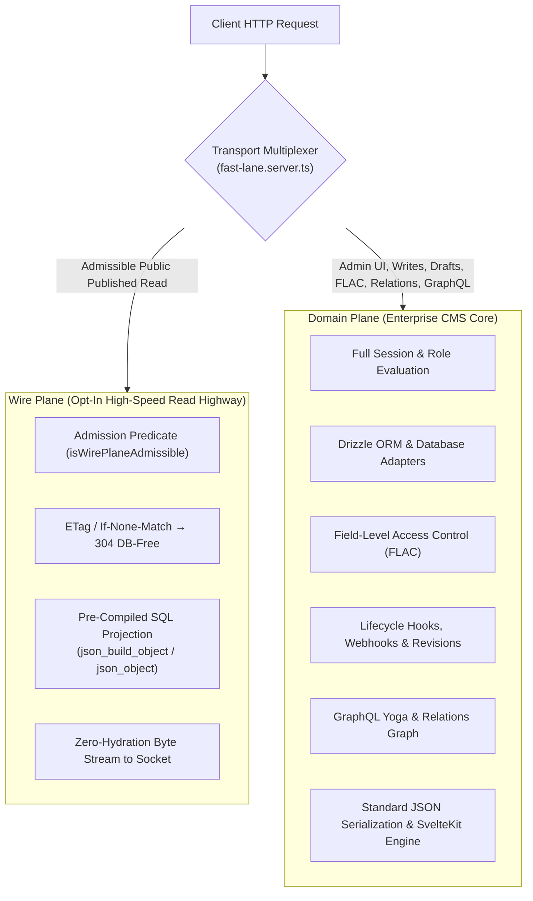

# Architecture 2027: Enterprise Two-Plane Core

> [!IMPORTANT]
> **Strategic Objective for 2027:**
> Transition SveltyCMS into an enterprise-grade **Two-Plane CMS**:
>
> 1. **The Wire Plane (Opt-in High-Speed Highway):** Pre-compiled SQL JSON projections piped directly to the socket for public, published, immutable reads where field-level redaction (FLAC) and relational populates are not needed.
> 2. **The Domain Plane (Default Enterprise Engine):** Full Drizzle ORM entity mapping, field-level access control (FLAC), draft/published revisions, lifecycle hooks, relational graph resolution, and GraphQL Yoga.
>
> All performance claims are held to an audited **4-Cell Benchmark Contract** separating cache hits from cold origin database misses.

---

## 1. Architectural Foundation: The Two Planes

A content management system cannot be treated as a static byte-pipe. Dynamic CMS capabilities—such as field-level ACLs, multi-locale fallbacks, draft previews, computed widgets, relations, webhooks, and validation—require object hydration and business logic.



### 1.1 Wire Admission Predicate

The Wire Plane is governed by a strict admission predicate (`isWirePlaneAdmissible`), never an ad-hoc shortcut. A request is admitted to the Wire Plane **only when all of the following hold**:

1. **Published Status:** The target document status is strictly `published` (no draft previews or unapproved revisions).
2. **Public Projection Equivalence:** The requester is unauthenticated/public, or their session token carries permissions whose FLAC set equals or exceeds the complete public projection (no per-field redaction required).
3. **No Dynamic Expansion:** No relational `populate` query parameter is present; no locale fallback altering projection shape is active.
4. **No Mutating Hooks:** The target collection defines no `afterRead` or transformation hooks that mutate the outgoing document body.
5. **Projection Hash Match:** The compiled SQL text projection hash matches the active collection schema epoch.

If any criterion fails, the request falls back transparently to the **Domain Plane** with a logged admission reason.

---

## 2. The 4-Cell Benchmark Contract

To prevent category errors that conflate in-memory cache hits with database driver saturation, every Wire Plane implementation and PR must report against four distinct cells on identical hardware and commits:

| Cell                                   | Metric Classification | What It Measures                                                 | Target / Behaviour                                                    |
| :------------------------------------- | :-------------------- | :--------------------------------------------------------------- | :-------------------------------------------------------------------- |
| **Cell 1: L1 / 304 Hit**               | Cache Plane           | In-memory single-flight / HTTP 304 `If-None-Match` short-circuit | 10,000+ RPS (Zero DB I/O, independent of driver)                      |
| **Cell 2: Origin Miss (Domain Plane)** | Canonical CMS Miss    | Drizzle ORM query + DTO mapping + FLAC + `JSON.stringify()`      | 500–1,500 RPS (Baseline canonical pipeline)                           |
| **Cell 3: Origin Miss (Wire Plane)**   | Accelerated Wire Miss | Pre-compiled `json_build_object` / `json_object` streaming       | Measurable RPS↑, p95↓, RSS↓ vs Cell 2 (Postgres & SQLite)             |
| **Cell 4: Raw Driver Ceiling**         | Physical Driver Limit | Bare driver throughput via `raw-db-ceiling.ts` (lab limit)       | Machine-specific reference printed by `raw-db-ceiling.ts` on that run |

> [!IMPORTANT]
> **4-Cell Merge Law:**
>
> 1. **Cell 1 must NEVER appear in a "vs ceiling" percentage** against database driver limits. Cell 1 is an in-memory short-circuit; claiming 10k+ RPS as database performance is a category error.
> 2. **Cell 3 must beat Cell 2 on both PostgreSQL and SQLite** on the identical commit, verified with byte-identity envelope snapshots (`trimPointReadEnvelope`).
> 3. **Cell 4 stays a machine-specific reference ceiling**, not a target the CMS claims to exceed.
> 4. **Admission Predicate Gate:** The Wire admission predicate (`isWirePlaneAdmissible`) lands in lockstep with compiled point-read SQL for at least one collection on PostgreSQL and SQLite, accompanied by envelope snapshots. Until Cell 3 lands, the predicate acts as scaffolding and executable documentation in TypeScript.

---

## 3. Scalable Multi-Tenant Connection Architecture

Enterprise SaaS environments hosting thousands of tenants require bounded connection management to prevent database process exhaustion.

### 3.1 Shared Pool + RLS Default (1k–10k Tenants)

- **Default Mode:** All standard tenants on a cluster share the primary database connection pool.
- **Transaction-Local Isolation:** Multi-tenancy is scoped using PostgreSQL session configuration:
  ```sql
  SELECT set_config('app.tenant_id', $1, true); -- is_local = true strictly required
  ```
  Setting `is_local = true` ensures that when the connection returns to the pool, the tenant context is automatically cleared, preventing cross-tenant data bleed on connection reuse.
- **External Pooling:** Scalability to thousands of concurrent clients is managed via **PgBouncer** or **Odyssey** in transaction pooling mode.

### 3.2 Dedicated Tenant Pools (Enterprise BYODB SKU)

- Dedicated driver pools (`_tenantPools`) are reserved strictly for high-tier enterprise tenants that supply their own custom database DSN (`DATABASE_URL_TENANT_X`).
- **Capacity Cap & LRU Eviction:** The dedicated pool map is bounded by `MAX_TENANT_POOLS` (default 16, configurable via environment). When the limit is reached, the least recently used pool is gracefully drained and closed.

---

## 4. Dynamic Multi-Word Bitsets & Session Caching

CMS permission matrices are multidimensional:

$$\text{Permissions} = \text{Tenants} \times \text{Collections} \times \text{Actions} \times \text{Fields}$$

A static 64-bit integer limits the entire system to 64 flags and cannot scale to real-world schemas.

### 4.1 Dynamic Bitset Engine

- **`Uint32Array` Bitset Structure:** Permissions are mapped to dynamic bit vectors that grow in 32-bit word blocks, scaling to thousands of granular permissions.
- **Session-Cached Bitsets:** During authentication, the user's compiled permissions (`permBits: number[]`) and active permission revision (`permRev: number`) are cached directly on the session object in Redis and memory.
- **Atomic Cross-Worker Invalidation:** When roles or permissions mutate, an in-memory broadcast increments the revision epoch and invalidates active worker caches without database round-trips.

---

## 5. Dual-Transport Architecture (`fast-lane.server.ts`)

SveltyCMS rejects maintaining a competing, standalone raw-socket HTTP micro-kernel. Instead, `src/hooks/fast-lane.server.ts` acts as the unified transport multiplexer:

- **Single Business Logic:** Authentication, tenancy checks, rate limiting, and security headers are enforced uniformly.
- **Fast-Lane Hand-off:** Admissible Wire Plane reads hand raw pre-compiled byte buffers directly to the socket response.
- **SvelteKit Core:** Complex application logic, admin UI chrome, GraphQL Yoga, and mutation pipelines run through the standard SvelteKit 3 engine.

---

## 6. Implementation Status & True Phase 5 Criteria

| Phase       | Milestone                        | Scope                                                                    | Status      |
| :---------- | :------------------------------- | :----------------------------------------------------------------------- | :---------- |
| **Phase 1** | Wire Plane Compiled Projections  | `findPublishedProjection(id)` on SQL adapters; JSON generation in engine | In Progress |
| **Phase 2** | Dynamic Session Bitsets          | `permBits` and `permRev` on session objects; `Uint32Array` evaluation    | In Progress |
| **Phase 3** | Fast-Lane Byte Streaming         | `tryWireReadLane` in `fast-lane.server.ts` with admission predicate      | In Progress |
| **Phase 4** | Bounded Tenant Pools & RLS       | Shared pool `set_config(..., true)` + `MAX_TENANT_POOLS` LRU cap         | In Progress |
| **Phase 5** | Longevity Soak & GA Verification | 24-hour PostgreSQL soak (32 workers, 100k/1M docs), 4-cell matrix        | Staged      |

### Phase 5 Verification Requirements:

Before Phase 5 can be designated as complete:

1. **24-Hour Sustained Soak:** Executed against PostgreSQL 18 with 32 concurrent workers on a mixed workload (`LONG_SOAK_HOURS=24`).
2. **Noise-Aware Leak Proof:** Demonstrating a flat native residual slope (`rss - heapTotal - external`) over steady windows $\ge 15\text{ minutes}$.
3. **Scale Datasets:** Performance verified against 100,000 and 1,000,000 seeded documents.
4. **Networked 4-Cell Matrix:** Published audited results separating Cache-Hit (Cell 1) from Origin-Miss (Cells 2 & 3).
