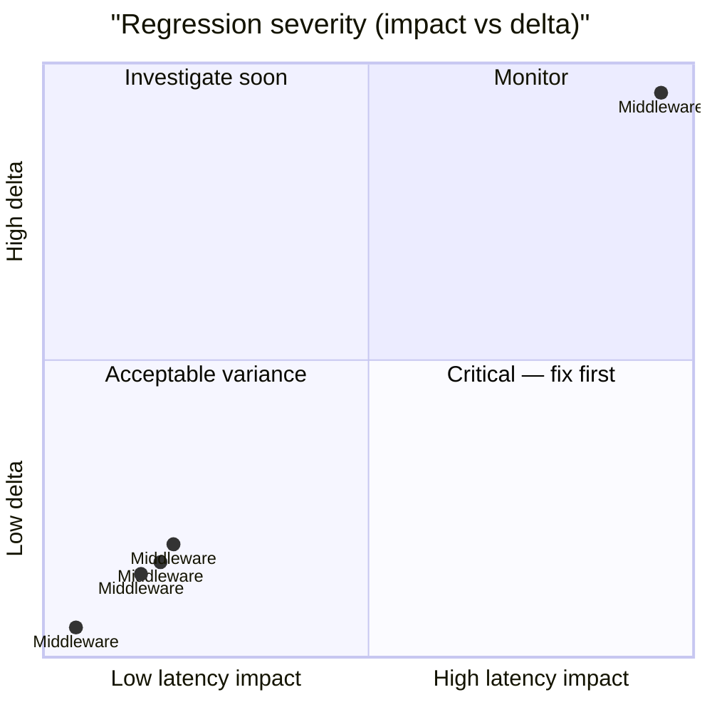

# 🚀 MariaDB Performance Ledger

> [!NOTE] Competitive comparisons based on publicly available documentation as of June 2026. All SveltyCMS metrics self-measured via `bun test tests/benchmarks/`.

> [!IMPORTANT]
> **Console-only by default.** Use `BENCHMARK_RECORD=1` to write results to this report.
>
> ```bash
> BENCHMARK_RECORD=1 bun test tests/benchmarks/auth-performance.test.ts
> ```
>
> The full matrix runner (`bun run scripts/benchmark-matrix/index.ts --sql`) always records.

<!-- BENCHMARK_START -->

<!-- EXECUTIVE_START -->
<!-- LATEST_AUDIT_HEADER -->

## 📊 Latest Performance Audit

<!-- EXECUTIVE_FIX_NOTES_START -->

### 📝 Fix Overlays

> [!NOTE]
> Phase notes and remediation entries appear here after matrix or surgical runs.

<!-- EXECUTIVE_FIX_NOTES_END -->

> [!NOTE]
> **Partial update** — dimension rollups and issues reflect only tests invoked in this run.

**✅ PASS** _(partial invocation)_ · 1/41 tests · 40 skipped · **mariadb** · standalone run

### Dimension health

| Dimension      | Tests | Status | Worst Δ | Issues |
| -------------- | ----: | ------ | ------- | ------ |
| **Core**       |     5 | 🟢     | +6099%  | 0      |
| **API**        |     0 | ⚪     | —       | 0      |
| **Scale**      |     0 | ⚪     | —       | 0      |
| **Resilience** |     0 | ⚪     | —       | 0      |

### Issues (action required)

> ✅ **All clear** — no regressions or budget violations detected.

### Executive latency matrix

| Scenario       | Latency | Trend                                         | Budget | Result |
| -------------- | ------- | --------------------------------------------- | ------ | ------ |
| **Middleware** | 0.074ms | ⚪ stable at 0.085ms (±0.096ms) (3 runs)      | < 5ms  | 🟢     |
| **Middleware** | 0.808ms | 🔴 slower: 0.085ms → 0.808ms (+851%) (3 runs) | < 5ms  | 🟢     |
| **Middleware** | 1.048ms | 🔴 slower: 0.085ms → 1.05ms (+1133%) (3 runs) | < 5ms  | 🟢     |
| **Middleware** | 0.926ms | 🔴 slower: 0.085ms → 0.926ms (+989%) (3 runs) | < 5ms  | 🟢     |
| **Middleware** | 5.269ms | 🔴 slower: 0.085ms → 5.27ms (+6099%) (3 runs) | < 5ms  | 🟢     |

### Historical pulse

> **Scope:** Sparklines only — full run tables: [`tests/benchmarks/results/history.sqlite`](../../../tests/benchmarks/results/history.sqlite)

| Metric                      | Trend | Sparkline | Latest      |
| --------------------------- | ----- | --------- | ----------- |
| cold start phased (cold)    | 🟢    | `▁`       | 31976.981ms |
| database performance (warm) | 🟢    | `▁▇█`     | 2.652ms     |

<details>
<summary>📈 Latency trend chart (last 10 runs)</summary>

```mermaid
xychart-beta
  title "mariadb REST p95 (last 10 runs)"
  x-axis ["R1", "R2", "R3", "R4", "R5", "R6", "R7", "R8", "R9", "R10"]
  y-axis "Latency (ms)"
  line "p95" : [0.000, 0.000, 0.000, 0.000, 0.000, 0.000, 0.000, 0.000, 0.000, 0.000]
```

</details>
<details>
<summary>📊 Regression severity matrix (quadrant)</summary>



</details>

<!-- EXECUTIVE_PARTIAL_WATERMARK -->

<!-- EXECUTIVE_ALERTS_START -->
<!-- EXECUTIVE_ALERTS_END -->

<!-- EXECUTIVE_END -->

<!-- SUMMARY_START -->

<!-- SUMMARY_RUN_OVERLAY_START -->

### Current Run Summary (2026-07-07)

> **Scope:** Only tests that ran in THIS invocation.

> ⚠️ Executive PASS/FAIL reflects the last full matrix run.

**Run ID:** `f43331ff-473a-4ed3-9235-319efb91f320` · **Tests invoked:** 1 · **Metrics:** 5 · **DB:** mariadb

| Test              | Metric                        | Avg (ms) | p95 (ms) | RPS   | Trend | Detail                                        |
| ----------------- | ----------------------------- | -------- | -------- | ----- | ----- | --------------------------------------------- |
| Hooks Performance | Static Asset (No Middleware)  | 0.074    | 0.111    | 11842 | 🟢    | ⚪ stable at 0.085ms (±0.096ms) (3 runs)      |
| Hooks Performance | Turbo Pipeline (Light)        | 0.808    | 1.268    | 1148  | ⚪    | 🔴 slower: 0.085ms → 0.808ms (+851%) (3 runs) |
| Hooks Performance | Full Security + Auth Pipeline | 1.048    | 1.472    | 954   | ⚪    | 🔴 slower: 0.085ms → 1.05ms (+1133%) (3 runs) |
| Hooks Performance | REST with API Caching         | 0.926    | 1.344    | 1020  | ⚪    | 🔴 slower: 0.085ms → 0.926ms (+989%) (3 runs) |
| Hooks Performance | Mutation + Audit Logging      | 5.269    | 6.187    | 179   | ⚪    | 🔴 slower: 0.085ms → 5.27ms (+6099%) (3 runs) |

<!-- SUMMARY_RUN_OVERLAY_END -->

<!-- SUMMARY_HISTORY_START -->

### Historical Trends (2026-07-07)

> **Scope:** Sparklines only — full run tables live in `history.sqlite` (link below). Runs = sparkline bar count.

**Detail:** [`tests/benchmarks/results/history.sqlite`](../../../tests/benchmarks/results/history.sqlite) · `SELECT test_id, phase, avg_ms, p95_ms, rps, timestamp FROM runs WHERE db_type='mariadb' AND redis=0 ORDER BY timestamp DESC`

**Series:** 7 · **DB:** mariadb

| Metric                      | Trend | Sparkline (last 7) | Latest      |
| --------------------------- | ----- | ------------------ | ----------- |
| CACHE PERFORMANCE (warm)    | 🟢    | `▁`                | 0.385ms     |
| COLD START PHASED (cold)    | 🟢    | `▁`                | 31976.981ms |
| DATABASE PERFORMANCE (warm) | 🟢    | `▁▇█`              | 2.652ms     |
| HOOKS PERFORMANCE (warm)    | 🟢    | `▂█▁▁`             | 0.074ms     |
| REST API PERFORMANCE (warm) | 🟢    | `▁`                | 0.638ms     |
| TRANSACTION ACID (warm)     | 🟢    | `▁`                | 2.385ms     |
| TRUTH LATENCY (warm)        | 🟢    | `▁`                | 0.001ms     |

<!-- SUMMARY_HISTORY_END --><!-- SUMMARY_END -->

<!-- LEDGER_START -->

## 🔬 Full benchmark ledger (41 modules)

Expand dimension groups, then any row, for ASCII truth tables. Executive summary above shows pass/fail and issues only.

<!-- LEDGER_DIMENSION:CORE:START -->

<details id="ledger-dimension-core">
<summary><strong>Core</strong> · 18 tests</summary>

<!-- SECTION:API_LATENCY:START -->

<details id="section-api_latency">
<summary><strong>🏷️ API LAYER LATENCY</strong> · 🟢 2.731ms · ➡️ recorded (awaiting trend) · <a href="../../../tests/benchmarks/api-latency.test.ts">source</a></summary>

<!-- LEDGER_TRUTH_START -->

```text
╔═════════════════════════════════════════════════════════════════════════════════════════╗
║                             SVELTYCMS  —  API LAYER LATENCY                             ║
║                       File: tests/benchmarks/api-latency.test.ts                        ║
║                                Ran: 2026-07-21 16:08:39                                 ║
║                      API Latency Benchmark (Production Optimized)                       ║
╠═════════════════════════════════════════════════════════════════════════════════════════╣
║ HTTP: findById @ 8c            │        2.731 ms │ p95:        4.280 ms │ RPS:        356 ║
╚═════════════════════════════════════════════════════════════════════════════════════════╝
```

<!-- LEDGER_TRUTH_END -->

</details>
<!-- SECTION:API_LATENCY:END -->

<!-- SECTION:COLD_START:START -->

<details id="section-cold_start">
<summary><strong>🏷️ PHASED COLD START</strong> · 🟢 31976.981ms · ➡️ recorded (awaiting trend) · <a href="../../../tests/benchmarks/cold-start-phased.test.ts">source</a></summary>

<!-- LEDGER_TRUTH_START -->

```text
╔═════════════════════════════════════════════════════════════════════════════════════════╗
║                           SVELTYCMS — PHASED COLD START AUDIT                           ║
║                    File: tests/benchmarks/cold-start-phased.test.ts                     ║
║                                Ran: 2026-07-07 13:27:56                                 ║
║       Measures server cold-start latency to READY state, using the built server.        ║
╠═════════════════════════════════════════════════════════════════════════════════════════╣
║ Cold Start (IDLE → READY)      │    31976.981 ms │ p95:    38197.920 ms │ RPS:          0 ║
╚═════════════════════════════════════════════════════════════════════════════════════════╝
```

<!-- LEDGER_TRUTH_END -->

</details>
<!-- SECTION:COLD_START:END -->

<!-- SECTION:TRUTH_AUDIT:START -->

<details id="section-truth_audit">
<summary><strong>🏷️ SRE TRUTH AUDIT</strong> · ⚪ ⏳ pending · ➡️ pending · <a href="../../../tests/benchmarks/truth-latency.test.ts">source</a></summary>

<!-- LEDGER_TRUTH_START -->

```text
╔═════════════════════════════════════════════════════════════════════════════════════════╗
║                               SVELTYCMS — SRE TRUTH AUDIT                               ║
║                      File: tests/benchmarks/truth-latency.test.ts                       ║
║                                Ran: 2026-07-21 16:08:27                                 ║
║     Validates performance claims by comparing SDK, Middleware, and Real HTTP Stack      ║
╠═════════════════════════════════════════════════════════════════════════════════════════╣
║ Logic Baseline                 │        0.000 ms │ p95:        0.001 ms │ RPS:  2,094,972 ║
║ Local SDK (Full)               │        0.005 ms │ p95:        0.009 ms │ RPS:    192,579 ║
║ HTTP End-to-End                │        1.016 ms │ p95:        2.105 ms │ RPS:        984 ║
╚═════════════════════════════════════════════════════════════════════════════════════════╝
```

<!-- LEDGER_TRUTH_END -->

</details>
<!-- SECTION:TRUTH_AUDIT:END -->

<!-- SECTION:INCREMENTAL:START -->

<details id="section-incremental">
<summary><strong>🏷️ Incremental Content Reload</strong> · 🟢 0.306ms · ➡️ recorded (awaiting trend) · <a href="../../../tests/benchmarks/content-incremental-reload.test.ts">source</a></summary>

<!-- LEDGER_TRUTH_START -->

```text
╔═════════════════════════════════════════════════════════════════════════════════════════╗
║                      SVELTYCMS — INCREMENTAL CONTENT RELOAD AUDIT                       ║
║                File: tests/benchmarks/content-incremental-reload.test.ts                ║
║                                Ran: 2026-07-21 16:13:30                                 ║
║          Measures surgical single-file fullReload vs full reconciliation path           ║
╠═════════════════════════════════════════════════════════════════════════════════════════╣
║ Incremental fullReload (1 file) │        0.306 ms │ p95:        0.448 ms │ RPS:      3,263 ║
║ Full Reconciliation Reload     │        0.572 ms │ p95:        0.804 ms │ RPS:      1,747 ║
╚═════════════════════════════════════════════════════════════════════════════════════════╝
```

<!-- LEDGER_TRUTH_END -->

</details>
<!-- SECTION:INCREMENTAL:END -->

<!-- SECTION:HOOKS_TRACE:START -->

<details id="section-hooks_trace">
<summary><strong>🏷️ Middleware & Hooks Performance</strong> · 🟢 0.835ms · ➡️ recorded (awaiting trend) · <a href="../../../tests/benchmarks/hooks-performance.test.ts">source</a></summary>

<!-- LEDGER_TRUTH_START -->

```text
╔═════════════════════════════════════════════════════════════════════════════════════════╗
║                          SVELTYCMS — MIDDLEWARE & HOOKS AUDIT                           ║
║                    File: tests/benchmarks/hooks-performance.test.ts                     ║
║                                Ran: 2026-07-21 16:11:09                                 ║
║Measures the cost of the full middleware chain including Turbo, Security, Auth, and Audit via HTTP E2E.║
╠═════════════════════════════════════════════════════════════════════════════════════════╣
║ Static Asset (No Middleware)   │        0.835 ms │ p95:        1.381 ms │ RPS:      1,152 ║
║ Turbo Pipeline (Light)         │        0.685 ms │ p95:        1.099 ms │ RPS:      1,368 ║
║ Full Security + Auth Pipeline  │        1.668 ms │ p95:        2.491 ms │ RPS:        600 ║
║ REST with API Caching          │        1.744 ms │ p95:        2.642 ms │ RPS:        546 ║
║ Mutation + Audit Logging       │       13.573 ms │ p95:       18.157 ms │ RPS:         74 ║
╚═════════════════════════════════════════════════════════════════════════════════════════╝
```

<!-- LEDGER_TRUTH_END -->

</details>
<!-- SECTION:HOOKS_TRACE:END -->

<!-- SECTION:STATE_MACHINE:START -->

<details id="section-state_machine">
<summary><strong>🏷️ State Machine Transitions</strong> · 🟢 114.424ms · ➡️ recorded (awaiting trend) · <a href="../../../tests/benchmarks/state-machine-transition.test.ts">source</a></summary>

<!-- LEDGER_TRUTH_START -->

```text
╔═════════════════════════════════════════════════════════════════════════════════════════╗
║                           SVELTYCMS — STATE MACHINE INTEGRITY                           ║
║                 File: tests/benchmarks/state-machine-transition.test.ts                 ║
║                                Ran: 2026-07-21 16:13:41                                 ║
║Simulates rapid system re-initializations and verifies valid self-healing state transitions under stress.║
╠═════════════════════════════════════════════════════════════════════════════════════════╣
║ State Transition (READY -> IDLE -> READY) │      114.424 ms │ p95:      138.293 ms │ RPS:          9 ║
╚═════════════════════════════════════════════════════════════════════════════════════════╝
```

<!-- LEDGER_TRUTH_END -->

</details>
<!-- SECTION:STATE_MACHINE:END -->

<!-- SECTION:DB_RAW_P95:START -->

<details id="section-db_raw_p95">
<summary><strong>🏷️ Database Adapter Raw CRUD</strong> · 🟢 2.553ms · ➡️ recorded (awaiting trend) · <a href="../../../tests/benchmarks/database-performance.test.ts">source</a></summary>

<!-- LEDGER_TRUTH_START -->

```text
╔═════════════════════════════════════════════════════════════════════════════════════════╗
║                   SVELTYCMS — DATABASE ADAPTER PERFORMANCE (MARIADB)                    ║
║                   File: tests/benchmarks/database-performance.test.ts                   ║
║                                Ran: 2026-07-21 16:13:04                                 ║
║   Measures raw CRUD performance, indexing efficiency, and connection pool resilience    ║
╠═════════════════════════════════════════════════════════════════════════════════════════╣
║ INSERT                         │        2.553 ms │ p95:        4.373 ms │ RPS:        350 ║
║ FIND ONE                       │        0.648 ms │ p95:        0.903 ms │ RPS:      1,304 ║
║ FIND MANY (limit 50)           │        0.809 ms │ p95:        1.130 ms │ RPS:      1,067 ║
║ UPDATE                         │        1.342 ms │ p95:        1.991 ms │ RPS:        626 ║
║ NATIVE UPSERT                  │        0.581 ms │ p95:        0.796 ms │ RPS:      1,448 ║
║ COUNT                          │        0.773 ms │ p95:        0.884 ms │ RPS:      1,148 ║
║ DELETE                         │        1.595 ms │ p95:        1.955 ms │ RPS:        670 ║
║ BULK INSERT (100)              │        8.159 ms │ p95:       19.669 ms │ RPS:         91 ║
╚═════════════════════════════════════════════════════════════════════════════════════════╝
```

<!-- LEDGER_TRUTH_END -->

</details>
<!-- SECTION:DB_RAW_P95:END -->

<!-- SECTION:ACID:START -->

<details id="section-acid">
<summary><strong>🏷️ ACID Transaction Overhead</strong> · 🟢 3.765ms · ➡️ recorded (awaiting trend) · <a href="../../../tests/benchmarks/transaction-acid.test.ts">source</a></summary>

<!-- LEDGER_TRUTH_START -->

```text
╔═════════════════════════════════════════════════════════════════════════════════════════╗
║                            SVELTYCMS — ACID INTEGRITY AUDIT                             ║
║                     File: tests/benchmarks/transaction-acid.test.ts                     ║
║                                Ran: 2026-07-21 16:13:09                                 ║
║  Measures transaction commit latencies and rollback overhead across database adapters   ║
╠═════════════════════════════════════════════════════════════════════════════════════════╣
║ TX Commit                      │        3.765 ms │ p95:        7.889 ms │ RPS:        253 ║
║ TX Rollback Integrity          │        3.255 ms │ p95:        6.295 ms │ RPS:        307 ║
╚═════════════════════════════════════════════════════════════════════════════════════════╝
```

<!-- LEDGER_TRUTH_END -->

</details>
<!-- SECTION:ACID:END -->

<!-- SECTION:CACHE:START -->
<details id="section-cache">
<summary><strong>🏷️ Cache</strong> · 🟢 0.001ms · ➡️ recorded (awaiting trend) · <a href="../../../tests/benchmarks/cache-performance.test.ts">source</a></summary>
<!-- LEDGER_TRUTH_START -->
```text
╔═════════════════════════════════════════════════════════════════════════════════════════╗
║                           SVELTYCMS — CACHE SERVICE TELEMETRY                           ║
║                      File: tests/benchmarks/cache-service.test.ts                       ║
║                                Ran: 2026-07-21 16:13:19                                 ║
║        Measures L1 cache hit latency and pattern invalidation overhead at scale         ║
╠═════════════════════════════════════════════════════════════════════════════════════════╣
║ Cache L1 Hit                   │        0.001 ms │ p95:        0.002 ms │ RPS:  1,319,340 ║
║ Pattern Invalidation (1k items @ 200k noise) │        8.085 ms │ p95:       11.436 ms │ RPS:        124 ║
╚═════════════════════════════════════════════════════════════════════════════════════════╝
```
<!-- LEDGER_TRUTH_END -->

</details>
<!-- SECTION:CACHE:END -->

<!-- SECTION:CACHE_EFFICIENCY:START -->

<details id="section-cache_efficiency">
<summary><strong>🏷️ Cache Hit/Miss Ratio & Efficiency</strong> · ⏳ pending · ➡️ baseline · <a href="../../../tests/benchmarks/cache-hit-ratio.test.ts">source</a></summary>

<!-- LEDGER_TRUTH_START -->

> ⏳ Pending — Measures Redis cache hit/miss ratio, cold vs warm read speedup, and invalidation performance.

<!-- LEDGER_TRUTH_END -->

</details>
<!-- SECTION:CACHE_EFFICIENCY:END -->

<!-- SECTION:UNKNOWN:START -->
<details id="section-unknown">
<summary><strong>🏷️ unknown</strong> · 🟢 0.003ms · ➡️ recorded (awaiting trend) · <a href="../../../tests/benchmarks/transaction-acid.test.ts">source</a></summary>
<!-- LEDGER_TRUTH_START -->
```text
╔═════════════════════════════════════════════════════════════════════════════════════════╗
║                      SVELTYCMS — CACHE EVICTION BOUNDARY HARDENING                      ║
║                                      File: unknown                                      ║
║                                Ran: 2026-07-21 16:13:18                                 ║
╠═════════════════════════════════════════════════════════════════════════════════════════╣
║ Cache Flooding & Eviction      │        0.003 ms │ p95:        0.005 ms │ RPS:    299,244 ║
╚═════════════════════════════════════════════════════════════════════════════════════════╝
```
<!-- LEDGER_TRUTH_END -->

</details>
<!-- SECTION:UNKNOWN:END -->

<!-- SECTION:LOGIC:START -->
<details id="section-logic">
<summary><strong>🏷️ Logic</strong> · 🟢 0.001ms · ➡️ ⚪ established at 0.001ms (1 run) (2026-07-07 13:28:45) · <a href="../../../tests/benchmarks/truth-latency.test.ts">source</a></summary>
<!-- LEDGER_TRUTH_START -->
> ⏳ Pending
<!-- LEDGER_TRUTH_END -->

</details>
<!-- SECTION:LOGIC:END -->

<!-- SECTION:SDK:START -->
<details id="section-sdk">
<summary><strong>🏷️ SDK</strong> · 🟢 0.665ms · ➡️ recorded (awaiting trend) · <a href="../../../tests/benchmarks/truth-latency.test.ts">source</a></summary>
<!-- LEDGER_TRUTH_START -->
```text
╔═════════════════════════════════════════════════════════════════════════════════════════╗
║                           SVELTYCMS — SDK OVERHEAD TELEMETRY                            ║
║                  File: tests/benchmarks/local-api-performance.test.ts                   ║
║                                Ran: 2026-07-21 16:10:45                                 ║
║  Measures LocalCMS SDK overhead vs direct adapter calls to verify zero-tax dispatching  ║
╠═════════════════════════════════════════════════════════════════════════════════════════╣
║ Direct Adapter Call            │        0.665 ms │ p95:        1.521 ms │ RPS:      1,503 ║
║ LocalCMS SDK Call              │        0.636 ms │ p95:        1.676 ms │ RPS:      1,571 ║
╚═════════════════════════════════════════════════════════════════════════════════════════╝
```
<!-- LEDGER_TRUTH_END -->

</details>
<!-- SECTION:SDK:END -->

<!-- SECTION:HTTP:START -->
<details id="section-http">
<summary><strong>🏷️ HTTP</strong> · 🟢 0.580ms · ➡️ ⚪ established at 0.580ms (1 run) (2026-07-07 13:28:45) · <a href="../../../tests/benchmarks/truth-latency.test.ts">source</a></summary>
<!-- LEDGER_TRUTH_START -->
> ⏳ Pending
<!-- LEDGER_TRUTH_END -->

</details>
<!-- SECTION:HTTP:END -->

<!-- SECTION:MIDDLEWARE:START -->
<details id="section-middleware">
<summary><strong>🏷️ Middleware</strong> · ⚪ 5.269ms · ↗️ 🔴 slower: 0.085ms → 5.27ms (+6099%) (3 runs) (2026-07-07 13:42:51) · <a href="../../../tests/benchmarks/hooks-performance.test.ts">source</a></summary>
<!-- LEDGER_INSIGHT_START -->
> [!NOTE]
> **Specific to this test**: Both avg and p95 degraded — likely adapter or infrastructure bottleneck. Check DB connection pool, indexes, or recent commits.  
Throughput dropped 98% — check connection pool saturation or lock contention.  
**Severe degradation** (+6099%) — review recent commits immediately.
<!-- LEDGER_INSIGHT_END -->

<!-- LEDGER_TRUTH_START -->

> ⏳ Pending

<!-- LEDGER_TRUTH_END -->

</details>
<!-- SECTION:MIDDLEWARE:END -->

<!-- SECTION:SYSTEM:START -->
<details id="section-system">
<summary><strong>🏷️ System</strong> · 🟢 0.638ms · ➡️ ⚪ established at 0.638ms (1 run) (2026-07-07 13:32:29) · <a href="../../../tests/benchmarks/rest-api-performance.test.ts">source</a></summary>
<!-- LEDGER_TRUTH_START -->
> ⏳ Pending
<!-- LEDGER_TRUTH_END -->

</details>
<!-- SECTION:SYSTEM:END -->

<!-- SECTION:METADATA:START -->
<details id="section-metadata">
<summary><strong>🏷️ Metadata</strong> · 🟢 0.811ms · ➡️ ⚪ established at 0.811ms (1 run) (2026-07-07 13:32:29) · <a href="../../../tests/benchmarks/rest-api-performance.test.ts">source</a></summary>
<!-- LEDGER_TRUTH_START -->
> ⏳ Pending
<!-- LEDGER_TRUTH_END -->

</details>
<!-- SECTION:METADATA:END -->

<!-- SECTION:CRUD:START -->
<details id="section-crud">
<summary><strong>🏷️ CRUD</strong> · 🟢 1.193ms · ➡️ ⚪ established at 1.19ms (1 run) (2026-07-07 13:32:29) · <a href="../../../tests/benchmarks/rest-api-performance.test.ts">source</a></summary>
<!-- LEDGER_TRUTH_START -->
> ⏳ Pending
<!-- LEDGER_TRUTH_END -->

</details>
<!-- SECTION:CRUD:END -->

</details>

<!-- LEDGER_DIMENSION:CORE:END -->

<!-- LEDGER_DIMENSION:API:START -->

<details id="ledger-dimension-api">
<summary><strong>API</strong> · 8 tests</summary>

<!-- SECTION:TEMPORAL:START -->

<details id="section-temporal">
<summary><strong>🏷️ Temporal Integrity Audit</strong> · 🟢 13.485ms · ➡️ recorded (awaiting trend) · <a href="../../../tests/benchmarks/temporal-integrity.test.ts">source</a></summary>

<!-- LEDGER_TRUTH_START -->

```text
╔═════════════════════════════════════════════════════════════════════════════════════════╗
║                             SVELTYCMS — TEMPORAL INTEGRITY                              ║
║                    File: tests/benchmarks/temporal-integrity.test.ts                    ║
║                                Ran: 2026-07-21 16:11:15                                 ║
║Validates deterministic UTC normalization of ISO date strings across timezone offsets for consistent persistence.║
╠═════════════════════════════════════════════════════════════════════════════════════════╣
║ Timezone Ingestion             │       13.485 ms │ p95:       13.485 ms │ RPS:         74 ║
╚═════════════════════════════════════════════════════════════════════════════════════════╝
```

<!-- LEDGER_TRUTH_END -->

</details>
<!-- SECTION:TEMPORAL:END -->

<!-- SECTION:RELATIONAL:START -->

<details id="section-relational">
<summary><strong>🏷️ Relational & Nested Queries</strong> · 🟢 5.467ms · ➡️ recorded (awaiting trend) · <a href="../../../tests/benchmarks/relational-performance.test.ts">source</a></summary>

<!-- LEDGER_TRUTH_START -->

```text
╔═════════════════════════════════════════════════════════════════════════════════════════╗
║                          SVELTYCMS — RELATIONAL RESOLVER AUDIT                          ║
║                  File: tests/benchmarks/relational-performance.test.ts                  ║
║                                Ran: 2026-07-21 16:10:26                                 ║
║Measures GraphQL resolver performance for shallow and deep relational queries including joins and nested population.║
╠═════════════════════════════════════════════════════════════════════════════════════════╣
║ Shallow Relational Query       │        5.467 ms │ p95:        8.381 ms │ RPS:        175 ║
║ Deep Relational Query          │        3.193 ms │ p95:        4.674 ms │ RPS:        293 ║
╚═════════════════════════════════════════════════════════════════════════════════════════╝
```

<!-- LEDGER_TRUTH_END -->

</details>
<!-- SECTION:RELATIONAL:END -->

<!-- SECTION:AUTH_TRACE:START -->

<details id="section-auth_trace">
<summary><strong>🏷️ Auth & RBAC Performance</strong> · 🟢 0.593ms · ➡️ recorded (awaiting trend) · <a href="../../../tests/benchmarks/auth-performance.test.ts">source</a></summary>

<!-- LEDGER_TRUTH_START -->

```text
╔═════════════════════════════════════════════════════════════════════════════════════════╗
║                          SVELTYCMS — AUTHENTICATION TELEMETRY                           ║
║                     File: tests/benchmarks/auth-performance.test.ts                     ║
║                                Ran: 2026-07-21 16:08:42                                 ║
║             Authentication & RBAC Pipeline Benchmark (Production Optimized)             ║
╠═════════════════════════════════════════════════════════════════════════════════════════╣
║ Auth Validation @ 1c           │        0.593 ms │ p95:        0.724 ms │ RPS:      1,555 ║
║ HTTP Auth Pipeline @ 8c        │        2.523 ms │ p95:        4.056 ms │ RPS:        382 ║
╚═════════════════════════════════════════════════════════════════════════════════════════╝
```

<!-- LEDGER_TRUTH_END -->

</details>
<!-- SECTION:AUTH_TRACE:END -->

<!-- SECTION:REST:START -->

<details id="section-rest">
<summary><strong>🏷️ REST API Performance</strong> · 🟢 0.672ms · ➡️ recorded (awaiting trend) · <a href="../../../tests/benchmarks/rest-api-performance.test.ts">source</a></summary>

<!-- LEDGER_TRUTH_START -->

```text
╔═════════════════════════════════════════════════════════════════════════════════════════╗
║                          SVELTYCMS — ENTERPRISE REST API AUDIT                          ║
║                   File: tests/benchmarks/rest-api-performance.test.ts                   ║
║                                Ran: 2026-07-21 16:08:37                                 ║
║Measures latency, throughput, and correctness of core REST endpoints: health check, schema, CRUD list, and search.║
╠═════════════════════════════════════════════════════════════════════════════════════════╣
║ Health Check                   │        0.672 ms │ p95:        1.306 ms │ RPS:      1,489 ║
║ Collection Schema              │        1.792 ms │ p95:        2.860 ms │ RPS:        558 ║
║ Collection Find (List)         │        1.636 ms │ p95:        2.474 ms │ RPS:        611 ║
║ Collection Search              │        1.421 ms │ p95:        2.048 ms │ RPS:        704 ║
╚═════════════════════════════════════════════════════════════════════════════════════════╝
```

<!-- LEDGER_TRUTH_END -->

</details>
<!-- SECTION:REST:END -->

<!-- SECTION:GRAPHQL:START -->

<details id="section-graphql">
<summary><strong>🏷️ GraphQL API Performance</strong> · 🟢 1.202ms · ➡️ recorded (awaiting trend) · <a href="../../../tests/benchmarks/graphql-api-performance.test.ts">source</a></summary>

<!-- LEDGER_TRUTH_START -->

```text
╔═════════════════════════════════════════════════════════════════════════════════════════╗
║                          SVELTYCMS — GRAPHQL PERFORMANCE AUDIT                          ║
║                 File: tests/benchmarks/graphql-api-performance.test.ts                  ║
║                                Ran: 2026-07-21 16:09:50                                 ║
║   Measures GraphQL resolver performance and throughput across varied query scenarios.   ║
╠═════════════════════════════════════════════════════════════════════════════════════════╣
║ GQL: System Health             │        1.202 ms │ p95:        2.067 ms │ RPS:        832 ║
║ GQL: Collection List           │        5.462 ms │ p95:        8.318 ms │ RPS:        183 ║
║ GQL: Concurrent Load           │        3.862 ms │ p95:        6.558 ms │ RPS:        259 ║
╚═════════════════════════════════════════════════════════════════════════════════════════╝
```

<!-- LEDGER_TRUTH_END -->

</details>
<!-- SECTION:GRAPHQL:END -->

<!-- SECTION:SEO:START -->

<details id="section-seo">
<summary><strong>🏷️ Enterprise SEO Suite Audit</strong> · ⏳ pending · ➡️ baseline · <a href="../../../tests/benchmarks/seo-performance.test.ts">source</a></summary>

<!-- LEDGER_TRUTH_START -->

> ⏳ Pending — E2E audit of Redirect Middleware, 404 Logging, and Sitemap Caching performance.

<!-- LEDGER_TRUTH_END -->

</details>
<!-- SECTION:SEO:END -->

<!-- SECTION:BROADCAST:START -->

<details id="section-broadcast">
<summary><strong>🏷️ REAL-TIME BROADCAST AUDIT</strong> · 🟢 0.202ms · ➡️ recorded (awaiting trend) · <a href="../../../tests/benchmarks/websocket-broadcast.test.ts">source</a></summary>

<!-- LEDGER_TRUTH_START -->

```text
╔═════════════════════════════════════════════════════════════════════════════════════════╗
║                        SVELTYCMS — YJS COLLABORATION SYNC AUDIT                         ║
║                   File: tests/benchmarks/websocket-broadcast.test.ts                    ║
║                                Ran: 2026-07-21 16:14:55                                 ║
║   Measures end-to-end Yjs update propagation latency and connection handshake timing.   ║
╠═════════════════════════════════════════════════════════════════════════════════════════╣
║ Yjs CRDT Update Sync           │        0.202 ms │ p95:        0.291 ms │ RPS:      4,946 ║
╚═════════════════════════════════════════════════════════════════════════════════════════╝
```

<!-- LEDGER_TRUTH_END -->

</details>
<!-- SECTION:BROADCAST:END -->

<!-- SECTION:REAL_TIME:START -->

<details id="section-real_time">
<summary><strong>🏷️ WebSocket & Realtime Latency</strong> · ⏳ pending · ➡️ baseline · <a href="../../../tests/benchmarks/realtime-performance.test.ts">source</a></summary>

<!-- LEDGER_TRUTH_START -->

> ⏳ Pending — Benchmarks WebSocket connection/broadcast latency.

<!-- LEDGER_TRUTH_END -->

</details>
<!-- SECTION:REAL_TIME:END -->

</details>

<!-- LEDGER_DIMENSION:API:END -->

<!-- LEDGER_DIMENSION:SCALE:START -->

<details id="ledger-dimension-scale">
<summary><strong>Scale</strong> · 18 tests</summary>

<!-- SECTION:NEGATIVE_CACHE:START -->

<details id="section-negative_cache">
<summary><strong>🏷️ Negative Cache Performance</strong> · ⏳ pending · ➡️ baseline · <a href="../../../tests/benchmarks/negative-cache.test.ts">source</a></summary>

<!-- LEDGER_TRUTH_START -->

> ⏳ Pending — Benchmarks 404-miss response times and cache lookup speedup.

<!-- LEDGER_TRUTH_END -->

</details>
<!-- SECTION:NEGATIVE_CACHE:END -->

<!-- SECTION:REVISION_STRESS:START -->

<details id="section-revision_stress">
<summary><strong>🏷️ Revision & History Growth</strong> · 🟢 1.565ms · ➡️ recorded (awaiting trend) · <a href="../../../tests/benchmarks/revision-stress.test.ts">source</a></summary>

<!-- LEDGER_TRUTH_START -->

```text
╔═════════════════════════════════════════════════════════════════════════════════════════╗
║                            SVELTYCMS — REVISION STRESS AUDIT                            ║
║                     File: tests/benchmarks/revision-stress.test.ts                      ║
║                                Ran: 2026-07-21 16:11:43                                 ║
║Measures read and history list latency degradation under heavy revision history growth (100 revisions per entry).║
╠═════════════════════════════════════════════════════════════════════════════════════════╣
║ Latest Read (High Revision Count) │        1.565 ms │ p95:        2.467 ms │ RPS:        639 ║
║ History List Retrieval         │        0.900 ms │ p95:        1.606 ms │ RPS:      1,111 ║
╚═════════════════════════════════════════════════════════════════════════════════════════╝
```

<!-- LEDGER_TRUTH_END -->

</details>
<!-- SECTION:REVISION_STRESS:END -->

<!-- SECTION:MEMORY:START -->

<details id="section-memory">
<summary><strong>🏷️ Memory Stability & GC Behavior</strong> · ⏳ pending · ➡️ baseline · <a href="../../../tests/benchmarks/memory-stability.test.ts">source</a></summary>

<!-- LEDGER_TRUTH_START -->

> ⏳ Pending — Long-running soak test to identify memory leaks and GC pressure.

<!-- LEDGER_TRUTH_END -->

</details>
<!-- SECTION:MEMORY:END -->

<!-- SECTION:TENANCY:START -->

<details id="section-tenancy">
<summary><strong>🏷️ Multi-Tenant Performance & Isolation</strong> · ⏳ pending · ➡️ baseline · <a href="../../../tests/benchmarks/multi-tenant-performance.test.ts">source</a></summary>

<!-- LEDGER_TRUTH_START -->

> ⏳ Pending — Stress-tests cross-tenant isolation and security boundary latency.

<!-- LEDGER_TRUTH_END -->

</details>
<!-- SECTION:TENANCY:END -->

<!-- SECTION:MIXED:START -->

<details id="section-mixed">
<summary><strong>🏷️ Realistic Mixed Workload</strong> · 🟢 3.238ms · ➡️ recorded (awaiting trend) · <a href="../../../tests/benchmarks/mixed-workload.test.ts">source</a></summary>

<!-- LEDGER_TRUTH_START -->

```text
╔═════════════════════════════════════════════════════════════════════════════════════════╗
║                            SVELTYCMS — MIXED WORKLOAD AUDIT                             ║
║                      File: tests/benchmarks/mixed-workload.test.ts                      ║
║                                Ran: 2026-07-21 16:10:34                                 ║
║Simulates real-world traffic with a weighted mix of reads, searches, GraphQL queries, and metadata requests.║
╠═════════════════════════════════════════════════════════════════════════════════════════╣
║ Mixed Workload                 │        3.238 ms │ p95:        5.598 ms │ RPS:        293 ║
╚═════════════════════════════════════════════════════════════════════════════════════════╝
```

<!-- LEDGER_TRUTH_END -->

</details>
<!-- SECTION:MIXED:END -->

<!-- SECTION:GQL_STRESS:START -->

<details id="section-gql_stress">
<summary><strong>🏷️ GraphQL Load Stress</strong> · 🟢 5.823ms · ➡️ recorded (awaiting trend) · <a href="../../../tests/benchmarks/graphql-stress.test.ts">source</a></summary>

<!-- LEDGER_TRUTH_START -->

```text
╔═════════════════════════════════════════════════════════════════════════════════════════╗
║                         SVELTYCMS — GRAPHQL CAPACITY DISCOVERY                          ║
║                      File: tests/benchmarks/graphql-stress.test.ts                      ║
║                                Ran: 2026-07-21 16:10:00                                 ║
║  Discovers the server's maximum sustainable GraphQL throughput by ramping concurrency   ║
╠═════════════════════════════════════════════════════════════════════════════════════════╣
║ GQL: 5c Warmup                 │        5.823 ms │ p95:        8.486 ms │ RPS:        161 ║
║ GQL: 10c Light                 │        8.819 ms │ p95:       12.463 ms │ RPS:        113 ║
║ GQL: 20c Moderate              │       14.725 ms │ p95:       21.145 ms │ RPS:         68 ║
║ GQL: 40c Heavy                 │       27.172 ms │ p95:       39.369 ms │ RPS:         37 ║
║ GQL: 60c Stress                │       35.010 ms │ p95:       48.349 ms │ RPS:         29 ║
║ GQL: 80c Extreme               │       61.037 ms │ p95:       92.216 ms │ RPS:         17 ║
║ GQL: 100c Max                  │       43.203 ms │ p95:       83.287 ms │ RPS:         23 ║
╚═════════════════════════════════════════════════════════════════════════════════════════╝
```

<!-- LEDGER_TRUTH_END -->

</details>
<!-- SECTION:GQL_STRESS:END -->

<!-- SECTION:MIGRATION:START -->

<details id="section-migration">
<summary><strong>🏷️ Bulk Migration & Scale</strong> · 🟢 57.451ms · ➡️ recorded (awaiting trend) · <a href="../../../tests/benchmarks/migration-scale.test.ts">source</a></summary>

<!-- LEDGER_TRUTH_START -->

```text
╔═════════════════════════════════════════════════════════════════════════════════════════╗
║                           SVELTYCMS — MIGRATION & SCALE AUDIT                           ║
║                     File: tests/benchmarks/migration-scale.test.ts                      ║
║                                Ran: 2026-07-21 16:14:34                                 ║
║Measures bulk ingestion throughput for 10,000 entries and post-migration random lookup performance.║
╠═════════════════════════════════════════════════════════════════════════════════════════╣
║ Bulk Migration (10k)           │       57.451 ms │ p95:      103.874 ms │ RPS:         17 ║
║ Post-Migration Read            │        4.036 ms │ p95:        6.596 ms │ RPS:        248 ║
╚═════════════════════════════════════════════════════════════════════════════════════════╝
```

<!-- LEDGER_TRUTH_END -->

</details>
<!-- SECTION:MIGRATION:END -->

<!-- SECTION:INDEX_PRESSURE:START -->

<details id="section-index_pressure">
<summary><strong>🏷️ Million-Row Index Pressure</strong> · 🟢 4.523ms · ➡️ recorded (awaiting trend) · <a href="../../../tests/benchmarks/index-pressure.test.ts">source</a></summary>

<!-- LEDGER_TRUTH_START -->

```text
╔═════════════════════════════════════════════════════════════════════════════════════════╗
║                           SVELTYCMS  —  INDEX PRESSURE AUDIT                            ║
║                      File: tests/benchmarks/index-pressure.test.ts                      ║
║                                Ran: 2026-07-21 16:11:36                                 ║
║    Measures read performance with sorting and filtering on a large entry collection.    ║
╠═════════════════════════════════════════════════════════════════════════════════════════╣
║ Sorted List (25k rows)         │        4.523 ms │ p95:        7.385 ms │ RPS:        221 ║
║ Filtered Query (25k rows)      │        5.842 ms │ p95:        9.155 ms │ RPS:        171 ║
╚═════════════════════════════════════════════════════════════════════════════════════════╝
```

<!-- LEDGER_TRUTH_END -->

</details>
<!-- SECTION:INDEX_PRESSURE:END -->

<!-- SECTION:CONTENT_STRESS:START -->

<details id="section-content_stress">
<summary><strong>🏷️ Content Scale Stress</strong> · 🟢 1.329ms · ➡️ recorded (awaiting trend) · <a href="../../../tests/benchmarks/content-scale-stress.test.ts">source</a></summary>

<!-- LEDGER_TRUTH_START -->

```text
╔═════════════════════════════════════════════════════════════════════════════════════════╗
║                        SVELTYCMS  —  CONTENT SCALE STRESS AUDIT                         ║
║                   File: tests/benchmarks/content-scale-stress.test.ts                   ║
║                                Ran: 2026-07-21 16:13:32                                 ║
║Measures file-scanning and content discovery performance at extreme scale (1,000+ collections)║
╠═════════════════════════════════════════════════════════════════════════════════════════╣
║ Cold Stress Scan (1k)          │        1.329 ms │ p95:        2.616 ms │ RPS:        753 ║
║ Warm Stress Scan (1k)          │        0.411 ms │ p95:        0.556 ms │ RPS:      2,432 ║
╚═════════════════════════════════════════════════════════════════════════════════════════╝
```

<!-- LEDGER_TRUTH_END -->

</details>
<!-- SECTION:CONTENT_STRESS:END -->

<!-- SECTION:MEDIA_UPLOAD:START -->

<details id="section-media_upload">
<summary><strong>🏷️ Media Upload Stress & Throughput</strong> · 🟢 1.792ms · ➡️ recorded (awaiting trend) · <a href="../../../tests/benchmarks/media-upload-stress.test.ts">source</a></summary>

<!-- LEDGER_TRUTH_START -->

```text
╔═════════════════════════════════════════════════════════════════════════════════════════╗
║                          SVELTYCMS — MEDIA UPLOAD STRESS AUDIT                          ║
║                   File: tests/benchmarks/media-upload-stress.test.ts                    ║
║                                Ran: 2026-07-21 16:14:19                                 ║
║Measures throughput for large file uploads, concurrent transfers, and streaming efficiency.║
╠═════════════════════════════════════════════════════════════════════════════════════════╣
║ Single Upload (0.1MB)          │        1.792 ms │ p95:        2.653 ms │ RPS:        558 ║
║ Small Upload (20KB)            │        4.972 ms │ p95:        8.229 ms │ RPS:        201 ║
╚═════════════════════════════════════════════════════════════════════════════════════════╝
```

<!-- LEDGER_TRUTH_END -->

</details>
<!-- SECTION:MEDIA_UPLOAD:END -->

<!-- SECTION:JOURNEY:START -->

<details id="section-journey">
<summary><strong>🏷️ Full Client Journey Simulation</strong> · 🟢 17.612ms · ➡️ recorded (awaiting trend) · <a href="../../../tests/benchmarks/client-journey.test.ts">source</a></summary>

<!-- LEDGER_TRUTH_START -->

```text
╔═════════════════════════════════════════════════════════════════════════════════════════╗
║                              SVELTYCMS  —  WORLD LIFE DATA                              ║
║                      File: tests/benchmarks/client-journey.test.ts                      ║
║                                Ran: 2026-07-21 16:11:18                                 ║
║Measures cumulative latency of a realistic editorial user workflow: Auth → List → View → Edit → Save.║
╠═════════════════════════════════════════════════════════════════════════════════════════╣
║ Full Journey @ 4c              │       17.612 ms │ p95:       23.645 ms │ RPS:         57 ║
╚═════════════════════════════════════════════════════════════════════════════════════════╝
```

<!-- LEDGER_TRUTH_END -->

</details>
<!-- SECTION:JOURNEY:END -->

<!-- SECTION:CONCURRENCY:START -->

<details id="section-concurrency">
<summary><strong>🏷️ Concurrency & Race Condition</strong> · ⚪ ⏳ pending · ➡️ pending · <a href="../../../tests/benchmarks/concurrency-race.test.ts">source</a></summary>

<!-- LEDGER_TRUTH_START -->

```text
╔═════════════════════════════════════════════════════════════════════════════════════════╗
║                        SVELTYCMS — THROUGHPUT SCALING (MARIADB)                         ║
║                  File: tests/benchmarks/concurrency-throughput.test.ts                  ║
║                                Ran: 2026-07-21 16:14:47                                 ║
║         100 writes across 10, 100, 1000 docs. Same work, different parallelism.         ║
╠═════════════════════════════════════════════════════════════════════════════════════════╣
║ 10 docs × 10                   │        0.000 ms │ p95:        0.000 ms │ RPS:      1,094 ║
║ 100 docs × 1                   │        0.000 ms │ p95:        0.000 ms │ RPS:        770 ║
║ 1000 docs × 1                  │        0.000 ms │ p95:        0.000 ms │ RPS:        966 ║
╚═════════════════════════════════════════════════════════════════════════════════════════╝
```

<!-- LEDGER_TRUTH_END -->

</details>
<!-- SECTION:CONCURRENCY:END -->

<!-- SECTION:THROUGHPUT:START -->

<details id="section-throughput">
<summary><strong>🏷️ Multi-Doc Concurrency Throughput</strong> · 🟢 0.360ms · ➡️ recorded (awaiting trend) · <a href="../../../tests/benchmarks/concurrency-throughput.test.ts">source</a></summary>

<!-- LEDGER_TRUTH_START -->

```text
╔═════════════════════════════════════════════════════════════════════════════════════════╗
║                        SVELTYCMS — LOCAL SDK BENCHMARK (MARIADB)                        ║
║                   File: tests/benchmarks/local-api-throughput.test.ts                   ║
║                                Ran: 2026-07-21 16:11:46                                 ║
║        Measures write throughput, read throughput, and SDK overhead in one pass.        ║
╠═════════════════════════════════════════════════════════════════════════════════════════╣
║ Writes (1000)                  │        0.360 ms │ p95:        0.000 ms │ RPS:      2,781 ║
║ Reads (1000)                   │        0.198 ms │ p95:        0.000 ms │ RPS:      5,052 ║
╚═════════════════════════════════════════════════════════════════════════════════════════╝
```

<!-- LEDGER_TRUTH_END -->

</details>
<!-- SECTION:THROUGHPUT:END -->

<!-- SECTION:MAXRPS:START -->

<details id="section-maxrps">
<summary><strong>🏷️ Max Throughput — No Throttle</strong> · ⏳ pending · ➡️ baseline · <a href="../../../tests/benchmarks/concurrency-max.test.ts">source</a></summary>

<!-- LEDGER_TRUTH_START -->

> ⏳ Pending — 1000 concurrent writes across 100 docs — no semaphore.

<!-- LEDGER_TRUTH_END -->

</details>
<!-- SECTION:MAXRPS:END -->

<!-- SECTION:LOCALSDK:START -->

<details id="section-localsdk">
<summary><strong>🏷️ Local SDK Throughput</strong> · ⏳ pending · ➡️ baseline · <a href="../../../tests/benchmarks/local-api-throughput.test.ts">source</a></summary>

<!-- LEDGER_TRUTH_START -->

> ⏳ Pending — 1000 direct adapter calls — no HTTP, no middleware.

<!-- LEDGER_TRUTH_END -->

</details>
<!-- SECTION:LOCALSDK:END -->

<!-- SECTION:FAST_FAIL:START -->

<details id="section-fast_fail">
<summary><strong>🏷️ Failure Propagation & Fast-Fail Audit</strong> · 🟢 0.001ms · ➡️ recorded (awaiting trend) · <a href="../../../tests/benchmarks/failure-propagation.test.ts">source</a></summary>

<!-- LEDGER_TRUTH_START -->

```text
╔═════════════════════════════════════════════════════════════════════════════════════════╗
║                           SVELTYCMS — AI INFRASTRUCTURE AUDIT                           ║
║                      File: tests/benchmarks/ai-performance.test.ts                      ║
║                                Ran: 2026-07-21 16:10:59                                 ║
║ Measures the latency tax of internal CMS logic for AI enrichment and layout generation. ║
╠═════════════════════════════════════════════════════════════════════════════════════════╣
║ AI Text Enrichment             │        0.001 ms │ p95:        0.002 ms │ RPS:  1,120,239 ║
║ AI Layout Spec Generation      │        0.000 ms │ p95:        0.000 ms │ RPS:  1,569,859 ║
╚═════════════════════════════════════════════════════════════════════════════════════════╝
```

<!-- LEDGER_TRUTH_END -->

</details>
<!-- SECTION:FAST_FAIL:END -->

<!-- SECTION:RESILIENCE:START -->

<details id="section-resilience">
<summary><strong>🏷️ Chaos & Infrastructure Resilience</strong> · 🟢 162.568ms · ➡️ recorded (awaiting trend) · <a href="../../../tests/benchmarks/chaos-resilience.test.ts">source</a></summary>

<!-- LEDGER_TRUTH_START -->

```text
╔═════════════════════════════════════════════════════════════════════════════════════════╗
║                           SVELTYCMS — CHAOS RESILIENCE AUDIT                            ║
║                     File: tests/benchmarks/chaos-resilience.test.ts                     ║
║                                Ran: 2026-07-21 16:09:39                                 ║
║Simulates infrastructure brownouts and measures system stability and graceful degradation under stress.║
╠═════════════════════════════════════════════════════════════════════════════════════════╣
║ Chaos Resilience (Brownout)    │      162.568 ms │ p95:      701.721 ms │ RPS:          6 ║
╚═════════════════════════════════════════════════════════════════════════════════════════╝
```

<!-- LEDGER_TRUTH_END -->

</details>
<!-- SECTION:RESILIENCE:END -->

<!-- SECTION:PROD_DAY:START -->

<details id="section-prod_day">
<summary><strong>🏷️ Production Day Simulation</strong> · ⏳ pending · ➡️ baseline · <a href="../../../tests/benchmarks/production-day.test.ts">source</a></summary>

<!-- LEDGER_TRUTH_START -->

> ⏳ Pending — Full production day with mixed workload, 100% reliability.

<!-- LEDGER_TRUTH_END -->

</details>
<!-- SECTION:PROD_DAY:END -->

</details>

<!-- LEDGER_DIMENSION:SCALE:END -->

<!-- LEDGER_DIMENSION:RESILIENCE:START -->

<details id="ledger-dimension-resilience">
<summary><strong>Resilience</strong> · 5 tests</summary>

<!-- SECTION:CIRCUIT_BREAKER:START -->

<details id="section-circuit_breaker">
<summary><strong>🏷️ Circuit Breaker Failover</strong> · ⏳ pending · ➡️ baseline · <a href="../../../tests/benchmarks/circuit-breaker-failover.test.ts">source</a></summary>

<!-- LEDGER_TRUTH_START -->

> ⏳ Pending — Measures system graceful degradation when external services fail.

<!-- LEDGER_TRUTH_END -->

</details>
<!-- SECTION:CIRCUIT_BREAKER:END -->

<!-- SECTION:THROTTLING:START -->

<details id="section-throttling">
<summary><strong>🏷️ Throttling & Backoff Stress</strong> · 🟢 2.555ms · ➡️ recorded (awaiting trend) · <a href="../../../tests/benchmarks/throttling-backoff-stress.test.ts">source</a></summary>

<!-- LEDGER_TRUTH_START -->

```text
╔═════════════════════════════════════════════════════════════════════════════════════════╗
║                              SVELTYCMS — THROTTLING AUDIT                               ║
║                File: tests/benchmarks/throttling-backoff-stress.test.ts                 ║
║                                Ran: 2026-07-21 16:13:32                                 ║
║Simulates high-velocity traffic from a single client IP to verify rate-limiting enforcement and backoff consistency.║
╠═════════════════════════════════════════════════════════════════════════════════════════╣
║ Throttling Enforcement         │        2.555 ms │ p95:        5.292 ms │ RPS:        391 ║
╚═════════════════════════════════════════════════════════════════════════════════════════╝
```

<!-- LEDGER_TRUTH_END -->

</details>
<!-- SECTION:THROTTLING:END -->

<!-- SECTION:GDPR:START -->

<details id="section-gdpr">
<summary><strong>🏷️ GDPR Compliance Speed</strong> · ⏳ pending · ➡️ baseline · <a href="../../../tests/benchmarks/right-to-be-forgotten-audit.test.ts">source</a></summary>

<!-- LEDGER_TRUTH_START -->

> ⏳ Pending — Measures performance of deep-deletion across all linked tables.

<!-- LEDGER_TRUTH_END -->

</details>
<!-- SECTION:GDPR:END -->

<!-- SECTION:SOVEREIGNTY:START -->

<details id="section-sovereignty">
<summary><strong>🏷️ Data Residency & Sovereignty</strong> · ⏳ pending · ➡️ baseline · <a href="../../../tests/benchmarks/data-residency-failover.test.ts">source</a></summary>

<!-- LEDGER_TRUTH_START -->

> ⏳ Pending — PII blocking and data sovereignty enforcement with cross-region failover.

<!-- LEDGER_TRUTH_END -->

</details>
<!-- SECTION:SOVEREIGNTY:END -->

<!-- SECTION:FAILOVER:START -->

<details id="section-failover">
<summary><strong>🏷️ Database Failover & Reconnection</strong> · 🟢 0.382ms · ➡️ recorded (awaiting trend) · <a href="../../../tests/benchmarks/database-failover.test.ts">source</a></summary>

<!-- LEDGER_TRUTH_START -->

```text
╔═════════════════════════════════════════════════════════════════════════════════════════╗
║                           SVELTYCMS — DATABASE FAILOVER AUDIT                           ║
║                    File: tests/benchmarks/database-failover.test.ts                     ║
║                                Ran: 2026-07-21 16:13:26                                 ║
║ Simulates database connection loss mid-request and measures circuit breaker activation, ║
╠═════════════════════════════════════════════════════════════════════════════════════════╣
║ Baseline Health Check          │        0.382 ms │ p95:        0.525 ms │ RPS:      2,618 ║
║ Degraded Dependency            │        0.672 ms │ p95:        1.037 ms │ RPS:      1,489 ║
║ Post-Recovery Health           │        2.222 ms │ p95:        3.277 ms │ RPS:        450 ║
║ Reconnect Time                 │        0.742 ms │ p95:        0.742 ms │ RPS:          0 ║
╚═════════════════════════════════════════════════════════════════════════════════════════╝
```

<!-- LEDGER_TRUTH_END -->

</details>
<!-- SECTION:FAILOVER:END -->

</details>

<!-- LEDGER_DIMENSION:RESILIENCE:END -->
<!-- LEDGER_END -->

<!-- METADATA_START -->

> ⏳ Host environment populates after matrix run.

<!-- METADATA_END -->

<!-- BENCHMARK_END -->
