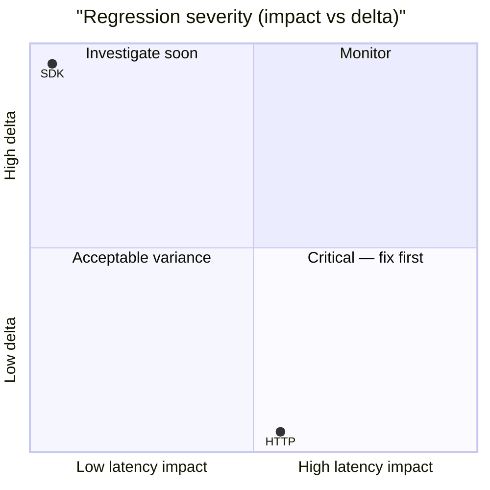

# 🚀 MariaDB Performance Ledger

> [!NOTE] Competitive comparisons based on publicly available documentation as of June 2026. All SveltyCMS metrics self-measured via `bun test tests/benchmarks/`.

> [!IMPORTANT]
> **Console-only by default.** Use `BENCHMARK_RECORD=1` to write results to this report.
>
> ```bash
> BENCHMARK_RECORD=1 bun test tests/benchmarks/auth-performance.test.ts
> ```
>
> The full matrix runner (`bun run scripts/benchmark-matrix/index.ts --sql`) always records.

<!-- BENCHMARK_START -->

<!-- EXECUTIVE_START -->
<!-- LATEST_AUDIT_HEADER -->

## 📊 Latest Performance Audit

<!-- EXECUTIVE_FIX_NOTES_START -->

### 📝 Fix Overlays

> [!NOTE]
> Phase notes and remediation entries appear here after matrix or surgical runs.

<!-- EXECUTIVE_FIX_NOTES_END -->

> [!NOTE]
> **Partial update** — dimension rollups and issues reflect only tests invoked in this run.

**✅ PASS** _(partial invocation)_ · 1/45 tests · 44 skipped · **mariadb** · standalone run

### Dimension health

| Dimension      | Tests | Status | Worst Δ | Issues |
| -------------- | ----: | ------ | ------- | ------ |
| **Core**       |     3 | 🟢     | +256%   | 0      |
| **API**        |     0 | ⚪     | —       | 0      |
| **Scale**      |     0 | ⚪     | —       | 0      |
| **Resilience** |     0 | ⚪     | —       | 0      |

### Issues (action required)

> ✅ **All clear** — no regressions or budget violations detected.

### Executive latency matrix

| Scenario  | Latency    | Trend                                    | Budget | Result |
| --------- | ---------- | ---------------------------------------- | ------ | ------ |
| **Logic** | ⏳ pending | ⚪ stable at 0ms (4 runs)                | < 5ms  | 🟢     |
| **SDK**   | 0.016ms    | ⚪ stable at 0.005ms (±0.003ms) (4 runs) | < 5ms  | 🟢     |
| **HTTP**  | 0.559ms    | ⚪ stable at 0.498ms (±0.099ms) (4 runs) | < 5ms  | 🟢     |

### Historical pulse

> **Scope:** Sparklines only — full run tables: [`tests/benchmarks/results/history.sqlite`](../../../tests/benchmarks/results/history.sqlite)

| Metric                                               | Trend | Sparkline      | Latest     |
| ---------------------------------------------------- | ----- | -------------- | ---------- |
| cold start phased (Cold Start (IDLE → READY)) (cold) | 🟢    | `▄▂▁█▆`        | 1817.734ms |
| database performance (FIND MANY (limit 50)) (warm)   | 🟢    | `▆█▆▅▂▂▂▄▁▂▁▂` | 0.727ms    |

<details>
<summary>📈 Latency trend chart (last 10 runs)</summary>

```mermaid
xychart-beta
  title "mariadb REST p95 (last 10 runs)"
  x-axis ["R1", "R2", "R3", "R4", "R5", "R6", "R7", "R8", "R9", "R10"]
  y-axis "Latency (ms)"
  line "p95" : [0.000, 0.000, 0.000, 0.000, 0.000, 0.000, 0.000, 0.000, 0.000, 0.000]
```

</details>
<details>
<summary>📊 Regression severity matrix (quadrant)</summary>


```mermaid
quadrantChart
  title "Regression severity (impact vs delta)"
  x-axis Low latency impact --> High latency impact
  y-axis Low delta --> High delta
  quadrant-1 Monitor
  quadrant-2 Investigate soon
  quadrant-3 Acceptable variance
  quadrant-4 Critical — fix first
    SDK: [0.05, 0.95]
    HTTP: [0.56, 0.05]
```

</details>

<!-- EXECUTIVE_PARTIAL_WATERMARK -->

<!-- EXECUTIVE_ALERTS_START -->
<!-- EXECUTIVE_ALERTS_END -->

<!-- EXECUTIVE_END -->

<!-- SUMMARY_START -->

<!-- SUMMARY_RUN_OVERLAY_START -->

### Current Run Summary (2026-08-20)

> **Scope:** Only tests that ran in THIS invocation.

> ⚠️ Executive PASS/FAIL reflects the last full matrix run.

**Run ID:** `f079a603-1ebf-4f53-a96c-0d6a735b6152` · **Tests invoked:** 1 · **Metrics:** 3 · **DB:** mariadb

| Test          | Metric           | Avg (ms) | p95 (ms) | RPS     | Trend | Detail                                   |
| ------------- | ---------------- | -------- | -------- | ------- | ----- | ---------------------------------------- |
| Truth Latency | Logic Baseline   | 0.000    | 0.001    | 5217391 | 🟢    | ⚪ stable at 0ms (4 runs)                |
| Truth Latency | HTTP End-to-End  | 0.559    | 0.975    | 1789    | 🟢    | ⚪ stable at 0.498ms (±0.099ms) (4 runs) |
| Truth Latency | Local SDK (Full) | 0.016    | 0.011    | 62225   | ⚪    | ⚪ stable at 0.005ms (±0.003ms) (4 runs) |

<!-- SUMMARY_RUN_OVERLAY_END -->

<!-- SUMMARY_HISTORY_START -->

### Historical Trends (2026-08-20)

> **Scope:** Sparklines only — full run tables live in `history.sqlite` (link below). Runs = sparkline bar count.

**Detail:** [`tests/benchmarks/results/history.sqlite`](../../../tests/benchmarks/results/history.sqlite) · `SELECT test_id, phase, avg_ms, p95_ms, rps, timestamp FROM runs WHERE db_type='mariadb' AND redis=0 ORDER BY timestamp DESC`

**Series:** 8 · **DB:** mariadb

| Metric                              | Trend | Sparkline (last 7) | Latest     |
| ----------------------------------- | ----- | ------------------ | ---------- |
| CACHE PERFORMANCE (warm)            | 🟢    | `█▁▃▃`             | 0.368ms    |
| COLD START PHASED (cold)            | 🟢    | `▄▂▁█▆`            | 1817.734ms |
| DATABASE PERFORMANCE (warm)         | 🟢    | `▃▄▄█▁▇▂`          | 0.522ms    |
| HOOKS PERFORMANCE (warm)            | 🟢    | `▇▂▂█▁▂▁`          | 0.707ms    |
| REST API PERFORMANCE (warm)         | 🟢    | `▆▅▁█▇▃▆`          | 0.798ms    |
| TRANSACTION ACID (warm)             | 🟢    | `█▁▃▃▃▄▅`          | 2.446ms    |
| TRUTH LATENCY (warm)                | 🟢    | `▁█▁▁█▁▁`          | 0.000ms    |
| COMPETITIVE WORKLOAD REPLICA (warm) | ⚪    | `▃▁▁▁▁▄█`          | 14.945ms   |

<!-- SUMMARY_HISTORY_END --><!-- SUMMARY_END -->

<!-- LEDGER_START -->

## 🔬 Full benchmark ledger (41 modules)

Expand dimension groups, then any row, for ASCII truth tables. Executive summary above shows pass/fail and issues only.

<!-- LEDGER_DIMENSION:CORE:START -->

<details id="ledger-dimension-core">
<summary><strong>Core</strong> · 18 tests</summary>

<!-- SECTION:API_LATENCY:START -->

<details id="section-api_latency">
<summary><strong>🏷️ API LAYER LATENCY</strong> · 🟢 3.616ms · ➡️ recorded (awaiting trend) · <a href="../../../tests/benchmarks/api-latency.test.ts">source</a></summary>

<!-- LEDGER_TRUTH_START -->

```text
╔═════════════════════════════════════════════════════════════════════════════════════════╗
║                             SVELTYCMS  —  API LAYER LATENCY                             ║
║                       File: tests/benchmarks/api-latency.test.ts                        ║
║                                Ran: 2026-08-19 17:50:44                                 ║
║       Cold full-pipeline findById + warm TURBO-HIT path after responseCache fill.       ║
╠═════════════════════════════════════════════════════════════════════════════════════════╣
║ HTTP: findById @ 8c            │        3.616 ms │ p95:        4.464 ms │ RPS:      1,955 ║
║ HTTP: findById TURBO-HIT @ 8c  │        1.147 ms │ p95:        2.033 ms │ RPS:      3,943 ║
╚═════════════════════════════════════════════════════════════════════════════════════════╝
```

<!-- LEDGER_TRUTH_END -->

</details>
<!-- SECTION:API_LATENCY:END -->

<!-- SECTION:COLD_START:START -->
<details id="section-cold_start">
<summary><strong>🏷️ cold start phased</strong> · 🟢 1817.734ms · ↗️ ⚪ stable at 1692.77ms (±254.23ms) (4 runs) (2026-08-20 20:46:45) · <a href="../../../tests/benchmarks/cold-start-phased.test.ts">source</a></summary>
<!-- LEDGER_INSIGHT_START -->
> [!NOTE]
> **Specific to this test**: Avg degraded but p95 stable — possible cold-start effect, GC pause, or warmup variance.
<!-- LEDGER_INSIGHT_END -->

<!-- LEDGER_TRUTH_START -->

```text
╔═════════════════════════════════════════════════════════════════════════════════════════╗
║                           SVELTYCMS — PHASED COLD START AUDIT                           ║
║                    File: tests/benchmarks/cold-start-phased.test.ts                     ║
║                                Ran: 2026-08-20 20:46:45                                 ║
║       Measures server cold-start latency to READY state, using the built server.        ║
╠═════════════════════════════════════════════════════════════════════════════════════════╣
║ Cold Start (IDLE → READY)      │     1817.734 ms │ p95:     2497.369 ms │ RPS:          0 ║
╚═════════════════════════════════════════════════════════════════════════════════════════╝
```

<!-- LEDGER_TRUTH_END -->

</details>
<!-- SECTION:COLD_START:END -->

<!-- SECTION:TRUTH_AUDIT:START -->

<details id="section-truth_audit">
<summary><strong>🏷️ SRE TRUTH AUDIT</strong> · ⚪ ⏳ pending · ➡️ pending · <a href="../../../tests/benchmarks/truth-latency.test.ts">source</a></summary>

<!-- LEDGER_TRUTH_START -->

```text
╔═════════════════════════════════════════════════════════════════════════════════════════╗
║                               SVELTYCMS — SRE TRUTH AUDIT                               ║
║                      File: tests/benchmarks/truth-latency.test.ts                       ║
║                                Ran: 2026-08-20 20:46:52                                 ║
║     Validates performance claims by comparing SDK, Middleware, and Real HTTP Stack      ║
╠═════════════════════════════════════════════════════════════════════════════════════════╣
║ Logic Baseline                 │        0.000 ms │ p95:        0.001 ms │ RPS:  5,217,391 ║
║ Local SDK (Full)               │        0.016 ms │ p95:        0.011 ms │ RPS:     62,225 ║
║ HTTP End-to-End                │        0.559 ms │ p95:        0.975 ms │ RPS:      1,789 ║
╚═════════════════════════════════════════════════════════════════════════════════════════╝
```

<!-- LEDGER_TRUTH_END -->

</details>
<!-- SECTION:TRUTH_AUDIT:END -->

<!-- SECTION:INCREMENTAL:START -->

<details id="section-incremental">
<summary><strong>🏷️ Incremental Content Reload</strong> · 🟢 0.361ms · ➡️ recorded (awaiting trend) · <a href="../../../tests/benchmarks/content-incremental-reload.test.ts">source</a></summary>

<!-- LEDGER_TRUTH_START -->

```text
╔═════════════════════════════════════════════════════════════════════════════════════════╗
║                      SVELTYCMS — INCREMENTAL CONTENT RELOAD AUDIT                       ║
║                File: tests/benchmarks/content-incremental-reload.test.ts                ║
║                                Ran: 2026-08-19 17:54:55                                 ║
║          Measures surgical single-file fullReload vs full reconciliation path           ║
╠═════════════════════════════════════════════════════════════════════════════════════════╣
║ Incremental fullReload (1 file) │        0.361 ms │ p95:        0.913 ms │ RPS:      2,771 ║
║ Full Reconciliation Reload     │        0.428 ms │ p95:        1.228 ms │ RPS:      2,334 ║
╚═════════════════════════════════════════════════════════════════════════════════════════╝
```

<!-- LEDGER_TRUTH_END -->

</details>
<!-- SECTION:INCREMENTAL:END -->

<!-- SECTION:HOOKS_TRACE:START -->

<details id="section-hooks_trace">
<summary><strong>🏷️ Middleware & Hooks Performance</strong> · 🟢 0.938ms · ➡️ recorded (awaiting trend) · <a href="../../../tests/benchmarks/hooks-performance.test.ts">source</a></summary>

<!-- LEDGER_TRUTH_START -->

```text
╔═════════════════════════════════════════════════════════════════════════════════════════╗
║                          SVELTYCMS — MIDDLEWARE & HOOKS AUDIT                           ║
║                    File: tests/benchmarks/hooks-performance.test.ts                     ║
║                                Ran: 2026-08-20 20:01:32                                 ║
║Measures the cost of the full middleware chain including Turbo, Security, Auth, and Audit via HTTP E2E.║
╠═════════════════════════════════════════════════════════════════════════════════════════╣
║ Static Asset (No Middleware)   │        0.938 ms │ p95:        1.388 ms │ RPS:      2,861 ║
║ Turbo Pipeline (Light)         │        0.707 ms │ p95:        1.331 ms │ RPS:      2,794 ║
║ Full Security + Auth Pipeline  │        1.076 ms │ p95:        1.914 ms │ RPS:      2,314 ║
║ REST with API Caching          │        0.872 ms │ p95:        1.392 ms │ RPS:      2,819 ║
║ Mutation (audit logging disabled) │        3.563 ms │ p95:        4.943 ms │ RPS:        281 ║
╚═════════════════════════════════════════════════════════════════════════════════════════╝
```

<!-- LEDGER_TRUTH_END -->

</details>
<!-- SECTION:HOOKS_TRACE:END -->

<!-- SECTION:STATE_MACHINE:START -->

<details id="section-state_machine">
<summary><strong>🏷️ State Machine Transitions</strong> · 🟢 121.543ms · ➡️ recorded (awaiting trend) · <a href="../../../tests/benchmarks/state-machine-transition.test.ts">source</a></summary>

<!-- LEDGER_TRUTH_START -->

```text
╔═════════════════════════════════════════════════════════════════════════════════════════╗
║                           SVELTYCMS — STATE MACHINE INTEGRITY                           ║
║                 File: tests/benchmarks/state-machine-transition.test.ts                 ║
║                                Ran: 2026-08-19 17:55:03                                 ║
║Simulates rapid system re-initializations and verifies valid self-healing state transitions under stress.║
╠═════════════════════════════════════════════════════════════════════════════════════════╣
║ State Transition (READY -> IDLE -> READY) │      121.543 ms │ p95:      147.081 ms │ RPS:          8 ║
╚═════════════════════════════════════════════════════════════════════════════════════════╝
```

<!-- LEDGER_TRUTH_END -->

</details>
<!-- SECTION:STATE_MACHINE:END -->

<!-- SECTION:DB_RAW_P95:START -->
<details id="section-db_raw_p95">
<summary><strong>🏷️ database performance</strong> · 🟢 9.758ms · ➡️ ⚪ stable at 9.68ms (±1.08ms) (7 runs) (2026-08-20 20:01:00) · <a href="../../../tests/benchmarks/database-performance.test.ts">source</a></summary>
<!-- LEDGER_TRUTH_START -->
```text
╔═════════════════════════════════════════════════════════════════════════════════════════╗
║                   SVELTYCMS — DATABASE ADAPTER PERFORMANCE (MARIADB)                    ║
║                   File: tests/benchmarks/database-performance.test.ts                   ║
║                                Ran: 2026-08-20 20:01:00                                 ║
║   Measures raw CRUD performance, indexing efficiency, and connection pool resilience    ║
╠═════════════════════════════════════════════════════════════════════════════════════════╣
║ INSERT                         │        2.390 ms │ p95:        4.019 ms │ RPS:        373 ║
║ FIND ONE                       │        0.493 ms │ p95:        0.642 ms │ RPS:      1,630 ║
║ FIND MANY (limit 50)           │        0.727 ms │ p95:        0.957 ms │ RPS:      1,093 ║
║ FIND PAGE (50 hasMore)         │        0.720 ms │ p95:        0.940 ms │ RPS:      1,126 ║
║ FIND PAGE keyset               │        0.757 ms │ p95:        0.922 ms │ RPS:      1,130 ║
║ FIND MANY offset 50            │        0.622 ms │ p95:        0.829 ms │ RPS:      1,304 ║
║ LIST+COUNT (legacy)            │        1.120 ms │ p95:        1.390 ms │ RPS:        751 ║
║ UPDATE                         │        1.018 ms │ p95:        1.378 ms │ RPS:        811 ║
║ UPDATE (no-returning)          │        0.522 ms │ p95:        0.689 ms │ RPS:      1,549 ║
║ NATIVE UPSERT                  │        0.432 ms │ p95:        0.537 ms │ RPS:      1,961 ║
║ COUNT                          │        0.820 ms │ p95:        0.957 ms │ RPS:      1,073 ║
║ COUNT ESTIMATE                 │        0.385 ms │ p95:        0.503 ms │ RPS:      2,205 ║
║ COUNT CACHED                   │        0.001 ms │ p95:        0.002 ms │ RPS:    648,847 ║
║ DELETE                         │        1.726 ms │ p95:        2.299 ms │ RPS:        562 ║
║ BULK INSERT (100)              │        9.758 ms │ p95:       23.405 ms │ RPS:         79 ║
╚═════════════════════════════════════════════════════════════════════════════════════════╝
```
<!-- LEDGER_TRUTH_END -->

</details>
<!-- SECTION:DB_RAW_P95:END -->

<!-- SECTION:ACID:START -->
<details id="section-acid">
<summary><strong>🏷️ transaction acid</strong> · 🟢 2.446ms · ↘️ ⚪ stable at 4.93ms (±3.56ms) (7 runs) (2026-08-20 20:01:11) · <a href="../../../tests/benchmarks/transaction-acid.test.ts">source</a></summary>
<!-- LEDGER_INSIGHT_START -->
> [!NOTE]
> **Specific to this test**: Performance improved — recent optimizations or cache warming likely effective.
<!-- LEDGER_INSIGHT_END -->

<!-- LEDGER_TRUTH_START -->

```text
╔═════════════════════════════════════════════════════════════════════════════════════════╗
║                            SVELTYCMS — ACID INTEGRITY AUDIT                             ║
║                     File: tests/benchmarks/transaction-acid.test.ts                     ║
║                                Ran: 2026-08-20 20:01:11                                 ║
║  Measures transaction commit latencies and rollback overhead across database adapters   ║
╠═════════════════════════════════════════════════════════════════════════════════════════╣
║ TX Commit                      │        2.431 ms │ p95:        5.385 ms │ RPS:      1,490 ║
║ TX Rollback Integrity          │        2.446 ms │ p95:        4.326 ms │ RPS:        409 ║
╚═════════════════════════════════════════════════════════════════════════════════════════╝
```

<!-- LEDGER_TRUTH_END -->

</details>
<!-- SECTION:ACID:END -->

<!-- SECTION:CACHE:START -->
<details id="section-cache">
<summary><strong>🏷️ Cache</strong> · 🟢 0.368ms · ➡️ ⚪ stable at 0.368ms (±0.012ms) (3 runs) (2026-08-20 20:01:20) · <a href="../../../tests/benchmarks/cache-performance.test.ts">source</a></summary>
<!-- LEDGER_TRUTH_START -->
```text
╔═════════════════════════════════════════════════════════════════════════════════════════╗
║                           SVELTYCMS — CACHE EFFICIENCY AUDIT                            ║
║                    File: tests/benchmarks/cache-performance.test.ts                     ║
║                                Ran: 2026-08-20 20:01:20                                 ║
║  Measures cache hit vs miss latency and efficiency via real HTTP end-to-end requests.   ║
╠═════════════════════════════════════════════════════════════════════════════════════════╣
║ Cache Miss (Bypass)            │        0.368 ms │ p95:        0.485 ms │ RPS:      2,393 ║
╚═════════════════════════════════════════════════════════════════════════════════════════╝
```
<!-- LEDGER_TRUTH_END -->

</details>
<!-- SECTION:CACHE:END -->

<!-- SECTION:CACHE_EFFICIENCY:START -->

<details id="section-cache_efficiency">
<summary><strong>🏷️ Cache Hit/Miss Ratio & Efficiency</strong> · ⏳ pending · ➡️ baseline · <a href="../../../tests/benchmarks/cache-hit-ratio.test.ts">source</a></summary>

<!-- LEDGER_TRUTH_START -->

> ⏳ Pending — Measures Redis cache hit/miss ratio, cold vs warm read speedup, and invalidation performance.

<!-- LEDGER_TRUTH_END -->

</details>
<!-- SECTION:CACHE_EFFICIENCY:END -->

<!-- SECTION:UNKNOWN:START -->
<details id="section-unknown">
<summary><strong>🏷️ unknown</strong> · 🟢 0.004ms · ➡️ recorded (awaiting trend) · <a href="../../../tests/benchmarks/transaction-acid.test.ts">source</a></summary>
<!-- LEDGER_TRUTH_START -->
```text
╔═════════════════════════════════════════════════════════════════════════════════════════╗
║                      SVELTYCMS — CACHE EVICTION BOUNDARY HARDENING                      ║
║                                      File: unknown                                      ║
║                                Ran: 2026-08-19 17:54:48                                 ║
╠═════════════════════════════════════════════════════════════════════════════════════════╣
║ Cache Flooding & Eviction      │        0.004 ms │ p95:        0.005 ms │ RPS:    259,515 ║
╚═════════════════════════════════════════════════════════════════════════════════════════╝
```
<!-- LEDGER_TRUTH_END -->

</details>
<!-- SECTION:UNKNOWN:END -->

<!-- SECTION:LOGIC:START -->
<details id="section-logic">
<summary><strong>🏷️ Logic</strong> · 🟢 ⏳ pending · ➡️ ⚪ stable at 0ms (4 runs) (2026-08-20 20:46:59) · <a href="../../../tests/benchmarks/truth-latency.test.ts">source</a></summary>
<!-- LEDGER_TRUTH_START -->
> ⏳ Pending
<!-- LEDGER_TRUTH_END -->

</details>
<!-- SECTION:LOGIC:END -->

<!-- SECTION:SDK:START -->
<details id="section-sdk">
<summary><strong>🏷️ SDK</strong> · ⚪ 0.016ms · ↗️ ⚪ stable at 0.005ms (±0.003ms) (4 runs) (2026-08-20 20:46:59) · <a href="../../../tests/benchmarks/truth-latency.test.ts">source</a></summary>
<!-- LEDGER_INSIGHT_START -->
> [!NOTE]
> **Specific to this test**: Both avg and p95 degraded — likely adapter or infrastructure bottleneck. Check DB connection pool, indexes, or recent commits.  
Throughput dropped 72% — check connection pool saturation or lock contention.  
**Severe degradation** (+256%) — review recent commits immediately.
<!-- LEDGER_INSIGHT_END -->

<!-- LEDGER_TRUTH_START -->

```text
╔═════════════════════════════════════════════════════════════════════════════════════════╗
║                           SVELTYCMS — SDK OVERHEAD TELEMETRY                            ║
║                  File: tests/benchmarks/local-api-performance.test.ts                   ║
║                                Ran: 2026-08-19 17:51:44                                 ║
║  Measures LocalCMS SDK overhead vs direct adapter calls to verify zero-tax dispatching  ║
╠═════════════════════════════════════════════════════════════════════════════════════════╣
║ Direct Adapter Call            │        0.491 ms │ p95:        1.022 ms │ RPS:      2,037 ║
║ LocalCMS SDK Call              │        0.524 ms │ p95:        1.256 ms │ RPS:      1,909 ║
╚═════════════════════════════════════════════════════════════════════════════════════════╝
```

<!-- LEDGER_TRUTH_END -->

</details>
<!-- SECTION:SDK:END -->

<!-- SECTION:HTTP:START -->
<details id="section-http">
<summary><strong>🏷️ HTTP</strong> · 🟢 0.559ms · ↗️ ⚪ stable at 0.498ms (±0.099ms) (4 runs) (2026-08-20 20:46:59) · <a href="../../../tests/benchmarks/truth-latency.test.ts">source</a></summary>
<!-- LEDGER_INSIGHT_START -->
> [!NOTE]
> **Specific to this test**: Both avg and p95 degraded — likely adapter or infrastructure bottleneck. Check DB connection pool, indexes, or recent commits.  
Throughput dropped 11% — check connection pool saturation or lock contention.
<!-- LEDGER_INSIGHT_END -->

<!-- LEDGER_TRUTH_START -->

> ⏳ Pending

<!-- LEDGER_TRUTH_END -->

</details>
<!-- SECTION:HTTP:END -->

<!-- SECTION:MIDDLEWARE:START -->
<details id="section-middleware">
<summary><strong>🏷️ Middleware</strong> · 🟢 3.563ms · ↗️ ⚪ stable at 3.33ms (±0.547ms) (3 runs) (2026-08-20 20:01:32) · <a href="../../../tests/benchmarks/hooks-performance.test.ts">source</a></summary>
<!-- LEDGER_INSIGHT_START -->
> [!NOTE]
> **Specific to this test**: Both avg and p95 degraded — likely adapter or infrastructure bottleneck. Check DB connection pool, indexes, or recent commits.
<!-- LEDGER_INSIGHT_END -->

<!-- LEDGER_TRUTH_START -->

> ⏳ Pending

<!-- LEDGER_TRUTH_END -->

</details>
<!-- SECTION:MIDDLEWARE:END -->

<!-- SECTION:SYSTEM:START -->
<details id="section-system">
<summary><strong>🏷️ System</strong> · 🟢 0.618ms · ↗️ ⚪ stable at 0.514ms (±0.117ms) (3 runs) (2026-08-20 20:01:41) · <a href="../../../tests/benchmarks/rest-api-performance.test.ts">source</a></summary>
<!-- LEDGER_INSIGHT_START -->
> [!NOTE]
> **Specific to this test**: Both avg and p95 degraded — likely adapter or infrastructure bottleneck. Check DB connection pool, indexes, or recent commits.  
**Severe degradation** (+20%) — review recent commits immediately.
<!-- LEDGER_INSIGHT_END -->

<!-- LEDGER_TRUTH_START -->

> ⏳ Pending

<!-- LEDGER_TRUTH_END -->

</details>
<!-- SECTION:SYSTEM:END -->

<!-- SECTION:METADATA:START -->
<details id="section-metadata">
<summary><strong>🏷️ Metadata</strong> · 🟢 0.850ms · ↗️ ⚪ stable at 0.757ms (±0.204ms) (3 runs) (2026-08-20 20:01:41) · <a href="../../../tests/benchmarks/rest-api-performance.test.ts">source</a></summary>
<!-- LEDGER_INSIGHT_START -->
> [!NOTE]
> **Specific to this test**: Both avg and p95 degraded — likely adapter or infrastructure bottleneck. Check DB connection pool, indexes, or recent commits.
<!-- LEDGER_INSIGHT_END -->

<!-- LEDGER_TRUTH_START -->

> ⏳ Pending

<!-- LEDGER_TRUTH_END -->

</details>
<!-- SECTION:METADATA:END -->

<!-- SECTION:CRUD:START -->
<details id="section-crud">
<summary><strong>🏷️ CRUD</strong> · 🟢 0.798ms · ↗️ ⚪ stable at 0.726ms (±0.126ms) (3 runs) (2026-08-20 20:01:41) · <a href="../../../tests/benchmarks/rest-api-performance.test.ts">source</a></summary>
<!-- LEDGER_INSIGHT_START -->
> [!NOTE]
> **Specific to this test**: Both avg and p95 degraded — likely adapter or infrastructure bottleneck. Check DB connection pool, indexes, or recent commits.
<!-- LEDGER_INSIGHT_END -->

<!-- LEDGER_TRUTH_START -->

> ⏳ Pending

<!-- LEDGER_TRUTH_END -->

</details>
<!-- SECTION:CRUD:END -->

</details>

<!-- LEDGER_DIMENSION:CORE:END -->

<!-- LEDGER_DIMENSION:API:START -->

<details id="ledger-dimension-api">
<summary><strong>API</strong> · 8 tests</summary>

<!-- SECTION:TEMPORAL:START -->

<details id="section-temporal">
<summary><strong>🏷️ Temporal Integrity Audit</strong> · 🟢 4.167ms · ➡️ recorded (awaiting trend) · <a href="../../../tests/benchmarks/temporal-integrity.test.ts">source</a></summary>

<!-- LEDGER_TRUTH_START -->

```text
╔═════════════════════════════════════════════════════════════════════════════════════════╗
║                             SVELTYCMS — TEMPORAL INTEGRITY                              ║
║                    File: tests/benchmarks/temporal-integrity.test.ts                    ║
║                                Ran: 2026-08-19 17:52:19                                 ║
║Validates deterministic UTC normalization of ISO date strings across timezone offsets for consistent persistence.║
╠═════════════════════════════════════════════════════════════════════════════════════════╣
║ Timezone Ingestion             │        4.167 ms │ p95:        4.167 ms │ RPS:        240 ║
╚═════════════════════════════════════════════════════════════════════════════════════════╝
```

<!-- LEDGER_TRUTH_END -->

</details>
<!-- SECTION:TEMPORAL:END -->

<!-- SECTION:RELATIONAL:START -->

<details id="section-relational">
<summary><strong>🏷️ Relational & Nested Queries</strong> · 🟢 2.899ms · ➡️ recorded (awaiting trend) · <a href="../../../tests/benchmarks/relational-performance.test.ts">source</a></summary>

<!-- LEDGER_TRUTH_START -->

```text
╔═════════════════════════════════════════════════════════════════════════════════════════╗
║                          SVELTYCMS — RELATIONAL RESOLVER AUDIT                          ║
║                  File: tests/benchmarks/relational-performance.test.ts                  ║
║                                Ran: 2026-08-19 17:51:23                                 ║
║Measures GraphQL resolver performance for shallow and deep relational queries including joins and nested population.║
╠═════════════════════════════════════════════════════════════════════════════════════════╣
║ Shallow Relational Query       │        2.899 ms │ p95:        3.643 ms │ RPS:      1,819 ║
║ Deep Relational Query          │        1.620 ms │ p95:        2.625 ms │ RPS:      1,506 ║
╚═════════════════════════════════════════════════════════════════════════════════════════╝
```

<!-- LEDGER_TRUTH_END -->

</details>
<!-- SECTION:RELATIONAL:END -->

<!-- SECTION:AUTH_TRACE:START -->

<details id="section-auth_trace">
<summary><strong>🏷️ Auth & RBAC Performance</strong> · 🟢 0.312ms · ➡️ recorded (awaiting trend) · <a href="../../../tests/benchmarks/auth-performance.test.ts">source</a></summary>

<!-- LEDGER_TRUTH_START -->

```text
╔═════════════════════════════════════════════════════════════════════════════════════════╗
║                          SVELTYCMS — AUTHENTICATION TELEMETRY                           ║
║                     File: tests/benchmarks/auth-performance.test.ts                     ║
║                                Ran: 2026-08-19 17:50:47                                 ║
║             Authentication & RBAC Pipeline Benchmark (Production Optimized)             ║
╠═════════════════════════════════════════════════════════════════════════════════════════╣
║ Auth Validation @ 1c           │        0.312 ms │ p95:        0.387 ms │ RPS:      2,948 ║
║ HTTP Auth Pipeline @ 8c        │        1.069 ms │ p95:        1.821 ms │ RPS:      4,425 ║
╚═════════════════════════════════════════════════════════════════════════════════════════╝
```

<!-- LEDGER_TRUTH_END -->

</details>
<!-- SECTION:AUTH_TRACE:END -->

<!-- SECTION:REST:START -->

<details id="section-rest">
<summary><strong>🏷️ REST API Performance</strong> · 🟢 0.618ms · ➡️ recorded (awaiting trend) · <a href="../../../tests/benchmarks/rest-api-performance.test.ts">source</a></summary>

<!-- LEDGER_TRUTH_START -->

```text
╔═════════════════════════════════════════════════════════════════════════════════════════╗
║                          SVELTYCMS — ENTERPRISE REST API AUDIT                          ║
║                   File: tests/benchmarks/rest-api-performance.test.ts                   ║
║                                Ran: 2026-08-20 20:01:41                                 ║
║Measures latency, throughput, and correctness of core REST endpoints: health check, schema, CRUD list, and search.║
╠═════════════════════════════════════════════════════════════════════════════════════════╣
║ Health Check                   │        0.618 ms │ p95:        1.613 ms │ RPS:      4,432 ║
║ Collection Schema              │        0.850 ms │ p95:        1.789 ms │ RPS:      3,122 ║
║ Collection Find (List)         │        0.877 ms │ p95:        1.825 ms │ RPS:      3,023 ║
║ Collection Search              │        0.798 ms │ p95:        1.365 ms │ RPS:      3,277 ║
╚═════════════════════════════════════════════════════════════════════════════════════════╝
```

<!-- LEDGER_TRUTH_END -->

</details>
<!-- SECTION:REST:END -->

<!-- SECTION:GRAPHQL:START -->

<details id="section-graphql">
<summary><strong>🏷️ GraphQL API Performance</strong> · 🟢 0.931ms · ➡️ recorded (awaiting trend) · <a href="../../../tests/benchmarks/graphql-api-performance.test.ts">source</a></summary>

<!-- LEDGER_TRUTH_START -->

```text
╔═════════════════════════════════════════════════════════════════════════════════════════╗
║                          SVELTYCMS — GRAPHQL PERFORMANCE AUDIT                          ║
║                 File: tests/benchmarks/graphql-api-performance.test.ts                  ║
║                                Ran: 2026-08-19 17:50:55                                 ║
║              Measures GraphQL resolver performance across query scenarios,              ║
╠═════════════════════════════════════════════════════════════════════════════════════════╣
║ GQL: System Health [cold]      │        0.931 ms │ p95:        1.726 ms │ RPS:      1,074 ║
║ GQL: System Health [hot]       │        1.000 ms │ p95:        1.794 ms │ RPS:      1,000 ║
║ GQL: Collection List [cold]    │        2.244 ms │ p95:        4.190 ms │ RPS:      1,611 ║
║ GQL: Collection List [hot]     │        2.965 ms │ p95:        4.190 ms │ RPS:      1,833 ║
║ GQL: Concurrent Load [cold]    │        2.470 ms │ p95:        3.737 ms │ RPS:      1,852 ║
║ GQL: Concurrent Load [hot]     │        2.478 ms │ p95:        3.764 ms │ RPS:      1,842 ║
╚═════════════════════════════════════════════════════════════════════════════════════════╝
```

<!-- LEDGER_TRUTH_END -->

</details>
<!-- SECTION:GRAPHQL:END -->

<!-- SECTION:SEO:START -->

<details id="section-seo">
<summary><strong>🏷️ Enterprise SEO Suite Audit</strong> · ⏳ pending · ➡️ baseline · <a href="../../../tests/benchmarks/seo-performance.test.ts">source</a></summary>

<!-- LEDGER_TRUTH_START -->

> ⏳ Pending — E2E audit of Redirect Middleware, 404 Logging, and Sitemap Caching performance.

<!-- LEDGER_TRUTH_END -->

</details>
<!-- SECTION:SEO:END -->

<!-- SECTION:BROADCAST:START -->

<details id="section-broadcast">
<summary><strong>🏷️ REAL-TIME BROADCAST AUDIT</strong> · 🟢 0.186ms · ➡️ recorded (awaiting trend) · <a href="../../../tests/benchmarks/websocket-broadcast.test.ts">source</a></summary>

<!-- LEDGER_TRUTH_START -->

```text
╔═════════════════════════════════════════════════════════════════════════════════════════╗
║                        SVELTYCMS — YJS COLLABORATION SYNC AUDIT                         ║
║                   File: tests/benchmarks/websocket-broadcast.test.ts                    ║
║                                Ran: 2026-08-19 17:56:17                                 ║
║   Measures end-to-end Yjs update propagation latency and connection handshake timing.   ║
╠═════════════════════════════════════════════════════════════════════════════════════════╣
║ Yjs CRDT Update Sync           │        0.186 ms │ p95:        0.307 ms │ RPS:      5,382 ║
╚═════════════════════════════════════════════════════════════════════════════════════════╝
```

<!-- LEDGER_TRUTH_END -->

</details>
<!-- SECTION:BROADCAST:END -->

<!-- SECTION:REAL_TIME:START -->

<details id="section-real_time">
<summary><strong>🏷️ WebSocket & Realtime Latency</strong> · ⏳ pending · ➡️ baseline · <a href="../../../tests/benchmarks/realtime-performance.test.ts">source</a></summary>

<!-- LEDGER_TRUTH_START -->

> ⏳ Pending — Benchmarks WebSocket connection/broadcast latency.

<!-- LEDGER_TRUTH_END -->

</details>
<!-- SECTION:REAL_TIME:END -->

</details>

<!-- LEDGER_DIMENSION:API:END -->

<!-- LEDGER_DIMENSION:SCALE:START -->

<details id="ledger-dimension-scale">
<summary><strong>Scale</strong> · 18 tests</summary>

<!-- SECTION:NEGATIVE_CACHE:START -->

<details id="section-negative_cache">
<summary><strong>🏷️ Negative Cache Performance</strong> · ⏳ pending · ➡️ baseline · <a href="../../../tests/benchmarks/negative-cache.test.ts">source</a></summary>

<!-- LEDGER_TRUTH_START -->

> ⏳ Pending — Benchmarks 404-miss response times and cache lookup speedup.

<!-- LEDGER_TRUTH_END -->

</details>
<!-- SECTION:NEGATIVE_CACHE:END -->

<!-- SECTION:REVISION_STRESS:START -->

<details id="section-revision_stress">
<summary><strong>🏷️ Revision & History Growth</strong> · 🟢 0.835ms · ➡️ recorded (awaiting trend) · <a href="../../../tests/benchmarks/revision-stress.test.ts">source</a></summary>

<!-- LEDGER_TRUTH_START -->

```text
╔═════════════════════════════════════════════════════════════════════════════════════════╗
║                            SVELTYCMS — REVISION STRESS AUDIT                            ║
║                     File: tests/benchmarks/revision-stress.test.ts                      ║
║                                Ran: 2026-08-19 17:52:42                                 ║
║Measures read and history list latency degradation under heavy revision history growth (100 revisions per entry).║
╠═════════════════════════════════════════════════════════════════════════════════════════╣
║ Latest Read (High Revision Count) │        0.835 ms │ p95:        1.617 ms │ RPS:      3,143 ║
║ History List Retrieval         │        0.516 ms │ p95:        0.687 ms │ RPS:      2,972 ║
╚═════════════════════════════════════════════════════════════════════════════════════════╝
```

<!-- LEDGER_TRUTH_END -->

</details>
<!-- SECTION:REVISION_STRESS:END -->

<!-- SECTION:MEMORY:START -->

<details id="section-memory">
<summary><strong>🏷️ Memory Stability & GC Behavior</strong> · ⏳ pending · ➡️ baseline · <a href="../../../tests/benchmarks/memory-stability.test.ts">source</a></summary>

<!-- LEDGER_TRUTH_START -->

> ⏳ Pending — Long-running soak test to identify memory leaks and GC pressure.

<!-- LEDGER_TRUTH_END -->

</details>
<!-- SECTION:MEMORY:END -->

<!-- SECTION:TENANCY:START -->

<details id="section-tenancy">
<summary><strong>🏷️ Multi-Tenant Performance & Isolation</strong> · ⏳ pending · ➡️ baseline · <a href="../../../tests/benchmarks/multi-tenant-performance.test.ts">source</a></summary>

<!-- LEDGER_TRUTH_START -->

> ⏳ Pending — Stress-tests cross-tenant isolation and security boundary latency.

<!-- LEDGER_TRUTH_END -->

</details>
<!-- SECTION:TENANCY:END -->

<!-- SECTION:MIXED:START -->

<details id="section-mixed">
<summary><strong>🏷️ Realistic Mixed Workload</strong> · 🟢 1.677ms · ➡️ recorded (awaiting trend) · <a href="../../../tests/benchmarks/mixed-workload.test.ts">source</a></summary>

<!-- LEDGER_TRUTH_START -->

```text
╔═════════════════════════════════════════════════════════════════════════════════════════╗
║                            SVELTYCMS — MIXED WORKLOAD AUDIT                             ║
║                      File: tests/benchmarks/mixed-workload.test.ts                      ║
║                                Ran: 2026-08-19 17:51:36                                 ║
║Simulates real-world traffic with a weighted mix of reads, searches, GraphQL queries, and metadata requests.║
╠═════════════════════════════════════════════════════════════════════════════════════════╣
║ Mixed Workload                 │        1.677 ms │ p95:        3.329 ms │ RPS:      2,717 ║
╚═════════════════════════════════════════════════════════════════════════════════════════╝
```

<!-- LEDGER_TRUTH_END -->

</details>
<!-- SECTION:MIXED:END -->

<!-- SECTION:GQL_STRESS:START -->

<details id="section-gql_stress">
<summary><strong>🏷️ GraphQL Load Stress</strong> · 🟢 2.996ms · ➡️ recorded (awaiting trend) · <a href="../../../tests/benchmarks/graphql-stress.test.ts">source</a></summary>

<!-- LEDGER_TRUTH_START -->

```text
╔═════════════════════════════════════════════════════════════════════════════════════════╗
║                         SVELTYCMS — GRAPHQL CAPACITY DISCOVERY                          ║
║                      File: tests/benchmarks/graphql-stress.test.ts                      ║
║                                Ran: 2026-08-19 17:51:03                                 ║
║  Discovers the server's maximum sustainable GraphQL throughput by ramping concurrency   ║
╠═════════════════════════════════════════════════════════════════════════════════════════╣
║ GQL: 5c Warmup                 │        2.996 ms │ p95:        4.246 ms │ RPS:      1,488 ║
║ GQL: 10c Light                 │        5.045 ms │ p95:        5.634 ms │ RPS:      1,694 ║
║ GQL: 20c Moderate              │       10.456 ms │ p95:       12.365 ms │ RPS:      1,677 ║
║ GQL: 40c Heavy                 │       29.749 ms │ p95:       36.801 ms │ RPS:      1,232 ║
║ GQL: 60c Stress                │       36.208 ms │ p95:       41.372 ms │ RPS:      1,429 ║
║ GQL: 80c Extreme               │       47.919 ms │ p95:       56.385 ms │ RPS:      1,431 ║
║ GQL: 100c Max                  │       62.760 ms │ p95:       79.055 ms │ RPS:      1,338 ║
╚═════════════════════════════════════════════════════════════════════════════════════════╝
```

<!-- LEDGER_TRUTH_END -->

</details>
<!-- SECTION:GQL_STRESS:END -->

<!-- SECTION:MIGRATION:START -->

<details id="section-migration">
<summary><strong>🏷️ Bulk Migration & Scale</strong> · 🟢 46.165ms · ➡️ recorded (awaiting trend) · <a href="../../../tests/benchmarks/migration-scale.test.ts">source</a></summary>

<!-- LEDGER_TRUTH_START -->

```text
╔═════════════════════════════════════════════════════════════════════════════════════════╗
║                           SVELTYCMS — MIGRATION & SCALE AUDIT                           ║
║                     File: tests/benchmarks/migration-scale.test.ts                      ║
║                                Ran: 2026-08-19 17:55:55                                 ║
║Measures bulk ingestion throughput for 10,000 entries and post-migration random lookup performance.║
╠═════════════════════════════════════════════════════════════════════════════════════════╣
║ Bulk Migration (10k)           │       46.165 ms │ p95:       96.455 ms │ RPS:         22 ║
║ Post-Migration Read            │        1.305 ms │ p95:        2.539 ms │ RPS:      2,836 ║
╚═════════════════════════════════════════════════════════════════════════════════════════╝
```

<!-- LEDGER_TRUTH_END -->

</details>
<!-- SECTION:MIGRATION:END -->

<!-- SECTION:INDEX_PRESSURE:START -->

<details id="section-index_pressure">
<summary><strong>🏷️ Million-Row Index Pressure</strong> · 🟢 1.050ms · ➡️ recorded (awaiting trend) · <a href="../../../tests/benchmarks/index-pressure.test.ts">source</a></summary>

<!-- LEDGER_TRUTH_START -->

```text
╔═════════════════════════════════════════════════════════════════════════════════════════╗
║                           SVELTYCMS  —  INDEX PRESSURE AUDIT                            ║
║                      File: tests/benchmarks/index-pressure.test.ts                      ║
║                                Ran: 2026-08-19 17:52:36                                 ║
║    Measures read performance with sorting and filtering on a large entry collection.    ║
╠═════════════════════════════════════════════════════════════════════════════════════════╣
║ Sorted List (25k rows)         │        1.050 ms │ p95:        1.714 ms │ RPS:      2,526 ║
║ Filtered Query (25k rows)      │        1.034 ms │ p95:        1.699 ms │ RPS:      2,617 ║
╚═════════════════════════════════════════════════════════════════════════════════════════╝
```

<!-- LEDGER_TRUTH_END -->

</details>
<!-- SECTION:INDEX_PRESSURE:END -->

<!-- SECTION:CONTENT_STRESS:START -->

<details id="section-content_stress">
<summary><strong>🏷️ Content Scale Stress</strong> · 🟢 1.016ms · ➡️ recorded (awaiting trend) · <a href="../../../tests/benchmarks/content-scale-stress.test.ts">source</a></summary>

<!-- LEDGER_TRUTH_START -->

```text
╔═════════════════════════════════════════════════════════════════════════════════════════╗
║                        SVELTYCMS  —  CONTENT SCALE STRESS AUDIT                         ║
║                   File: tests/benchmarks/content-scale-stress.test.ts                   ║
║                                Ran: 2026-08-19 17:54:56                                 ║
║Measures file-scanning and content discovery performance at extreme scale (1,000+ collections)║
╠═════════════════════════════════════════════════════════════════════════════════════════╣
║ Cold Stress Scan (1k)          │        1.016 ms │ p95:        1.218 ms │ RPS:        984 ║
║ Warm Stress Scan (1k)          │        0.277 ms │ p95:        0.450 ms │ RPS:      3,616 ║
╚═════════════════════════════════════════════════════════════════════════════════════════╝
```

<!-- LEDGER_TRUTH_END -->

</details>
<!-- SECTION:CONTENT_STRESS:END -->

<!-- SECTION:MEDIA_UPLOAD:START -->

<details id="section-media_upload">
<summary><strong>🏷️ Media Upload Stress & Throughput</strong> · 🟢 1.820ms · ➡️ recorded (awaiting trend) · <a href="../../../tests/benchmarks/media-upload-stress.test.ts">source</a></summary>

<!-- LEDGER_TRUTH_START -->

```text
╔═════════════════════════════════════════════════════════════════════════════════════════╗
║                          SVELTYCMS — MEDIA UPLOAD STRESS AUDIT                          ║
║                   File: tests/benchmarks/media-upload-stress.test.ts                    ║
║                                Ran: 2026-08-19 17:55:40                                 ║
║Measures throughput for large file uploads, concurrent transfers, and streaming efficiency.║
╠═════════════════════════════════════════════════════════════════════════════════════════╣
║ Single Upload (0.1MB)          │        1.820 ms │ p95:        3.438 ms │ RPS:        549 ║
║ Small Upload (20KB)            │        2.964 ms │ p95:        3.677 ms │ RPS:      1,216 ║
╚═════════════════════════════════════════════════════════════════════════════════════════╝
```

<!-- LEDGER_TRUTH_END -->

</details>
<!-- SECTION:MEDIA_UPLOAD:END -->

<!-- SECTION:JOURNEY:START -->

<details id="section-journey">
<summary><strong>🏷️ Full Client Journey Simulation</strong> · 🟢 17.436ms · ➡️ recorded (awaiting trend) · <a href="../../../tests/benchmarks/client-journey.test.ts">source</a></summary>

<!-- LEDGER_TRUTH_START -->

```text
╔═════════════════════════════════════════════════════════════════════════════════════════╗
║                              SVELTYCMS  —  WORLD LIFE DATA                              ║
║                      File: tests/benchmarks/client-journey.test.ts                      ║
║                                Ran: 2026-08-19 17:52:23                                 ║
║Measures cumulative latency of a realistic editorial user workflow: Auth → List → View → Edit → Save.║
╠═════════════════════════════════════════════════════════════════════════════════════════╣
║ Full Journey @ 1c              │       17.436 ms │ p95:       50.752 ms │ RPS:         57 ║
╚═════════════════════════════════════════════════════════════════════════════════════════╝
```

<!-- LEDGER_TRUTH_END -->

</details>
<!-- SECTION:JOURNEY:END -->

<!-- SECTION:CONCURRENCY:START -->

<details id="section-concurrency">
<summary><strong>🏷️ Concurrency & Race Condition</strong> · ⚪ ⏳ pending · ➡️ pending · <a href="../../../tests/benchmarks/concurrency-race.test.ts">source</a></summary>

<!-- LEDGER_TRUTH_START -->

```text
╔═════════════════════════════════════════════════════════════════════════════════════════╗
║                        SVELTYCMS — THROUGHPUT SCALING (MARIADB)                         ║
║                  File: tests/benchmarks/concurrency-throughput.test.ts                  ║
║                                Ran: 2026-08-19 17:56:07                                 ║
║             Phased wave writes across 10 / 100 / 1000 documents. Loads are              ║
╠═════════════════════════════════════════════════════════════════════════════════════════╣
║ 10 docs × 10 (100 writes)      │        0.000 ms │ p95:        0.000 ms │ RPS:      1,084 ║
║ 100 docs × 1 (100 writes)      │        0.000 ms │ p95:        0.000 ms │ RPS:        882 ║
║ 1000 docs × 1 (1000 writes)    │        0.000 ms │ p95:        0.000 ms │ RPS:        899 ║
╚═════════════════════════════════════════════════════════════════════════════════════════╝
```

<!-- LEDGER_TRUTH_END -->

</details>
<!-- SECTION:CONCURRENCY:END -->

<!-- SECTION:THROUGHPUT:START -->

<details id="section-throughput">
<summary><strong>🏷️ Multi-Doc Concurrency Throughput</strong> · 🟢 0.330ms · ➡️ recorded (awaiting trend) · <a href="../../../tests/benchmarks/concurrency-throughput.test.ts">source</a></summary>

<!-- LEDGER_TRUTH_START -->

```text
╔═════════════════════════════════════════════════════════════════════════════════════════╗
║                        SVELTYCMS — LOCAL SDK BENCHMARK (MARIADB)                        ║
║                   File: tests/benchmarks/local-api-throughput.test.ts                   ║
║                                Ran: 2026-08-19 17:52:45                                 ║
║        Measures write throughput, read throughput, and SDK overhead in one pass.        ║
╠═════════════════════════════════════════════════════════════════════════════════════════╣
║ Writes (1000)                  │        0.330 ms │ p95:        0.000 ms │ RPS:      3,035 ║
║ Reads (1000)                   │        0.117 ms │ p95:        0.000 ms │ RPS:      8,554 ║
╚═════════════════════════════════════════════════════════════════════════════════════════╝
```

<!-- LEDGER_TRUTH_END -->

</details>
<!-- SECTION:THROUGHPUT:END -->

<!-- SECTION:MAXRPS:START -->

<details id="section-maxrps">
<summary><strong>🏷️ Max Throughput — No Throttle</strong> · ⏳ pending · ➡️ baseline · <a href="../../../tests/benchmarks/concurrency-max.test.ts">source</a></summary>

<!-- LEDGER_TRUTH_START -->

> ⏳ Pending — 1000 concurrent writes across 100 docs — no semaphore.

<!-- LEDGER_TRUTH_END -->

</details>
<!-- SECTION:MAXRPS:END -->

<!-- SECTION:LOCALSDK:START -->

<details id="section-localsdk">
<summary><strong>🏷️ Local SDK Throughput</strong> · ⏳ pending · ➡️ baseline · <a href="../../../tests/benchmarks/local-api-throughput.test.ts">source</a></summary>

<!-- LEDGER_TRUTH_START -->

> ⏳ Pending — 1000 direct adapter calls — no HTTP, no middleware.

<!-- LEDGER_TRUTH_END -->

</details>
<!-- SECTION:LOCALSDK:END -->

<!-- SECTION:FAST_FAIL:START -->

<details id="section-fast_fail">
<summary><strong>🏷️ Failure Propagation & Fast-Fail Audit</strong> · ⚪ ⏳ pending · ➡️ pending · <a href="../../../tests/benchmarks/failure-propagation.test.ts">source</a></summary>

<!-- LEDGER_TRUTH_START -->

```text
╔═════════════════════════════════════════════════════════════════════════════════════════╗
║                           SVELTYCMS — AI INFRASTRUCTURE AUDIT                           ║
║                      File: tests/benchmarks/ai-performance.test.ts                      ║
║                                Ran: 2026-08-19 17:51:58                                 ║
║ Measures the latency tax of internal CMS logic for AI enrichment and layout generation. ║
╠═════════════════════════════════════════════════════════════════════════════════════════╣
║ AI Text Enrichment             │        0.000 ms │ p95:        0.000 ms │ RPS:  1,987,413 ║
║ AI Layout Spec Generation      │        0.000 ms │ p95:        0.000 ms │ RPS:  2,793,296 ║
╚═════════════════════════════════════════════════════════════════════════════════════════╝
```

<!-- LEDGER_TRUTH_END -->

</details>
<!-- SECTION:FAST_FAIL:END -->

<!-- SECTION:RESILIENCE:START -->

<details id="section-resilience">
<summary><strong>🏷️ Chaos & Infrastructure Resilience</strong> · 🟢 197.326ms · ➡️ recorded (awaiting trend) · <a href="../../../tests/benchmarks/chaos-resilience.test.ts">source</a></summary>

<!-- LEDGER_TRUTH_START -->

```text
╔═════════════════════════════════════════════════════════════════════════════════════════╗
║                           SVELTYCMS — CHAOS RESILIENCE AUDIT                            ║
║                     File: tests/benchmarks/chaos-resilience.test.ts                     ║
║                                Ran: 2026-07-26 10:34:44                                 ║
║Simulates infrastructure brownouts and measures system stability and graceful degradation under stress.║
╠═════════════════════════════════════════════════════════════════════════════════════════╣
║ Chaos Resilience (Brownout)    │      197.326 ms │ p95:      734.025 ms │ RPS:          5 ║
╚═════════════════════════════════════════════════════════════════════════════════════════╝
```

<!-- LEDGER_TRUTH_END -->

</details>
<!-- SECTION:RESILIENCE:END -->

<!-- SECTION:PROD_DAY:START -->

<details id="section-prod_day">
<summary><strong>🏷️ Production Day Simulation</strong> · ⏳ pending · ➡️ baseline · <a href="../../../tests/benchmarks/production-day.test.ts">source</a></summary>

<!-- LEDGER_TRUTH_START -->

> ⏳ Pending — Full production day with mixed workload, 100% reliability.

<!-- LEDGER_TRUTH_END -->

</details>
<!-- SECTION:PROD_DAY:END -->

</details>

<!-- LEDGER_DIMENSION:SCALE:END -->

<!-- LEDGER_DIMENSION:RESILIENCE:START -->

<details id="ledger-dimension-resilience">
<summary><strong>Resilience</strong> · 5 tests</summary>

<!-- SECTION:CIRCUIT_BREAKER:START -->

<details id="section-circuit_breaker">
<summary><strong>🏷️ Circuit Breaker Failover</strong> · ⏳ pending · ➡️ baseline · <a href="../../../tests/benchmarks/circuit-breaker-failover.test.ts">source</a></summary>

<!-- LEDGER_TRUTH_START -->

> ⏳ Pending — Measures system graceful degradation when external services fail.

<!-- LEDGER_TRUTH_END -->

</details>
<!-- SECTION:CIRCUIT_BREAKER:END -->

<!-- SECTION:THROTTLING:START -->

<details id="section-throttling">
<summary><strong>🏷️ Throttling & Backoff Stress</strong> · 🟢 2.555ms · ➡️ recorded (awaiting trend) · <a href="../../../tests/benchmarks/throttling-backoff-stress.test.ts">source</a></summary>

<!-- LEDGER_TRUTH_START -->

```text
╔═════════════════════════════════════════════════════════════════════════════════════════╗
║                              SVELTYCMS — THROTTLING AUDIT                               ║
║                File: tests/benchmarks/throttling-backoff-stress.test.ts                 ║
║                                Ran: 2026-07-21 16:13:32                                 ║
║Simulates high-velocity traffic from a single client IP to verify rate-limiting enforcement and backoff consistency.║
╠═════════════════════════════════════════════════════════════════════════════════════════╣
║ Throttling Enforcement         │        2.555 ms │ p95:        5.292 ms │ RPS:        391 ║
╚═════════════════════════════════════════════════════════════════════════════════════════╝
```

<!-- LEDGER_TRUTH_END -->

</details>
<!-- SECTION:THROTTLING:END -->

<!-- SECTION:GDPR:START -->

<details id="section-gdpr">
<summary><strong>🏷️ GDPR Compliance Speed</strong> · ⏳ pending · ➡️ baseline · <a href="../../../tests/benchmarks/right-to-be-forgotten-audit.test.ts">source</a></summary>

<!-- LEDGER_TRUTH_START -->

> ⏳ Pending — Measures performance of deep-deletion across all linked tables.

<!-- LEDGER_TRUTH_END -->

</details>
<!-- SECTION:GDPR:END -->

<!-- SECTION:SOVEREIGNTY:START -->

<details id="section-sovereignty">
<summary><strong>🏷️ Data Residency & Sovereignty</strong> · ⏳ pending · ➡️ baseline · <a href="../../../tests/benchmarks/data-residency-failover.test.ts">source</a></summary>

<!-- LEDGER_TRUTH_START -->

> ⏳ Pending — PII blocking and data sovereignty enforcement with cross-region failover.

<!-- LEDGER_TRUTH_END -->

</details>
<!-- SECTION:SOVEREIGNTY:END -->

<!-- SECTION:FAILOVER:START -->

<details id="section-failover">
<summary><strong>🏷️ Database Failover & Reconnection</strong> · 🟢 18.143ms · ➡️ recorded (awaiting trend) · <a href="../../../tests/benchmarks/database-failover.test.ts">source</a></summary>

<!-- LEDGER_TRUTH_START -->

```text
╔═════════════════════════════════════════════════════════════════════════════════════════╗
║                            SVELTYCMS — DATA RESIDENCY AUDIT                             ║
║                 File: tests/benchmarks/data-residency-failover.test.ts                  ║
║                                Ran: 2026-07-26 10:36:42                                 ║
║Simulates geopolitical boundary crossing and verifies PII field blocking for residency law compliance.║
╠═════════════════════════════════════════════════════════════════════════════════════════╣
║ PII Field Blocking             │       18.143 ms │ p95:       22.896 ms │ RPS:         55 ║
╚═════════════════════════════════════════════════════════════════════════════════════════╝
```

<!-- LEDGER_TRUTH_END -->

</details>
<!-- SECTION:FAILOVER:END -->

</details>

<!-- LEDGER_DIMENSION:RESILIENCE:END -->
<!-- LEDGER_END -->

<!-- METADATA_START -->

> ⏳ Host environment populates after matrix run.

<!-- METADATA_END -->

<!-- BENCHMARK_END -->
