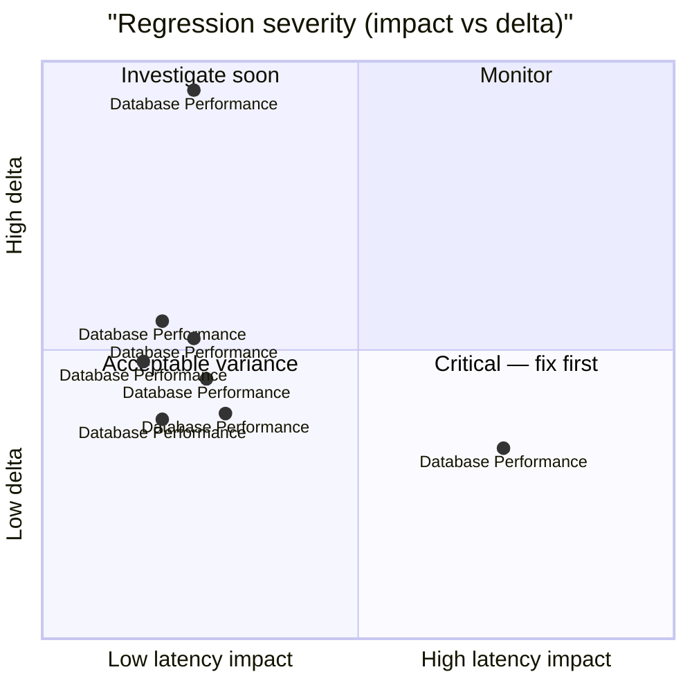

# 🚀 MariaDB Performance Ledger

> [!NOTE] Competitive comparisons based on publicly available documentation as of June 2026. All SveltyCMS metrics self-measured via `bun test tests/benchmarks/`.

> [!IMPORTANT]
> **Console-only by default.** Use `BENCHMARK_RECORD=1` to write results to this report.
>
> ```bash
> BENCHMARK_RECORD=1 bun test tests/benchmarks/auth-performance.test.ts
> ```
>
> The full matrix runner (`bun run scripts/benchmark-matrix/index.ts --sql`) always records.

<!-- BENCHMARK_START -->

<!-- EXECUTIVE_START -->
<!-- LATEST_AUDIT_HEADER -->

## 📊 Latest Performance Audit

<!-- EXECUTIVE_FIX_NOTES_START -->

### 📝 Fix Overlays

> [!NOTE]
> Phase notes and remediation entries appear here after matrix or surgical runs.

<!-- EXECUTIVE_FIX_NOTES_END -->

> [!NOTE]
> **Partial update** — dimension rollups and issues reflect only tests invoked in this run.

**✅ PASS** _(partial invocation)_ · 1/45 tests · 44 skipped · **mariadb** · standalone run

### Dimension health

| Dimension      | Tests | Status | Worst Δ | Issues |
| -------------- | ----: | ------ | ------- | ------ |
| **Core**       |    19 | 🟢     | -89%    | 0      |
| **API**        |     0 | ⚪     | —       | 0      |
| **Scale**      |     0 | ⚪     | —       | 0      |
| **Resilience** |     0 | ⚪     | —       | 0      |

### Issues (action required)

> ✅ **All clear** — no regressions or budget violations detected.

### Executive latency matrix

| Scenario                 | Latency | Trend                                        | Budget | Result |
| ------------------------ | ------- | -------------------------------------------- | ------ | ------ |
| **Database Performance** | 0.443ms | ⚪ stable at 0.670ms (±0.179ms) (7 runs)     | < 5ms  | 🟢     |
| **Database Performance** | 0.376ms | ⚪ stable at 0.654ms (±0.278ms) (7 runs)     | < 5ms  | 🟢     |
| **Database Performance** | 0.558ms | 🟢 faster: 1.03ms → 0.558ms (-46%) (7 runs)  | < 5ms  | 🟢     |
| **Database Performance** | 1.671ms | ⚪ stable at 2.35ms (±0.709ms) (7 runs)      | < 5ms  | 🟢     |
| **Database Performance** | 0.545ms | 🟢 faster: 4.76ms → 0.545ms (-89%) (7 runs)  | < 5ms  | 🟢     |
| **Database Performance** | 0.587ms | ⚪ stable at 0.976ms (±0.344ms) (7 runs)     | < 5ms  | 🟢     |
| **Database Performance** | 0.661ms | ⚪ stable at 1.01ms (±0.365ms) (7 runs)      | < 5ms  | 🟢     |
| **Database Performance** | 0.437ms | ⚪ stable at 0.846ms (±0.298ms) (7 runs)     | < 5ms  | 🟢     |
| **Database Performance** | 0.574ms | ⚪ stable at 1.21ms (±0.439ms) (7 runs)      | < 5ms  | 🟢     |
| **Database Performance** | 0.711ms | ⚪ stable at 1.22ms (±0.391ms) (7 runs)      | < 5ms  | 🟢     |
| **Database Performance** | 0.396ms | ⚪ stable at 0.652ms (±0.206ms) (7 runs)     | < 5ms  | 🟢     |
| **Database Performance** | 0.326ms | 🟢 faster: 0.600ms → 0.326ms (-46%) (7 runs) | < 5ms  | 🟢     |
| **Database Performance** | 0.487ms | ⚪ stable at 0.910ms (±0.298ms) (7 runs)     | < 5ms  | 🟢     |
| **Database Performance** | 0.310ms | ⚪ stable at 0.540ms (±0.156ms) (7 runs)     | < 5ms  | 🟢     |
| **Database Performance** | 0.001ms | ⚪ stable at 0.001ms (7 runs)                | < 5ms  | 🟢     |
| **Database Performance** | 0.397ms | ⚪ stable at 0.620ms (±0.199ms) (7 runs)     | < 5ms  | 🟢     |
| **Database Performance** | 2.073ms | ⚪ stable at 2.73ms (±0.873ms) (7 runs)      | < 5ms  | 🟢     |
| **Database Performance** | 2.294ms | ⚪ stable at 3.62ms (±1.13ms) (7 runs)       | < 5ms  | 🟢     |
| **Database Performance** | 1.293ms | ⚪ stable at 1.83ms (±0.565ms) (7 runs)      | < 5ms  | 🟢     |

### Historical pulse

> **Scope:** Sparklines only — full run tables: [`tests/benchmarks/results/history.sqlite`](../../../tests/benchmarks/results/history.sqlite)

| Metric                                           | Trend | Sparkline     | Latest  |
| ------------------------------------------------ | ----- | ------------- | ------- |
| api latency (HTTP: findById @ 8c (Cold)) (warm)  | 🟢    | `▁█`          | 3.159ms |
| auth performance (Auth (full chain) @ 1c) (warm) | 🟢    | `▁`           | 0.368ms |
| database performance (BULK INSERT (100)) (warm)  | 🟢    | `▆█▇▅▅▄▆▅▁▁▂` | 2.073ms |

<details>
<summary>📈 Latency trend chart (last 10 runs)</summary>

```mermaid
xychart-beta
  title "mariadb REST p95 (last 10 runs)"
  x-axis ["R1", "R2", "R3", "R4", "R5", "R6", "R7", "R8", "R9", "R10"]
  y-axis "Latency (ms)"
  line "p95" : [0.000, 0.000, 0.000, 0.000, 0.000, 0.000, 0.000, 0.000, 0.000, 0.000]
```

</details>
<details>
<summary>📊 Regression severity matrix (quadrant)</summary>


```mermaid
quadrantChart
  title "Regression severity (impact vs delta)"
  x-axis Low latency impact --> High latency impact
  y-axis Low delta --> High delta
  quadrant-1 Monitor
  quadrant-2 Investigate soon
  quadrant-3 Acceptable variance
  quadrant-4 Critical — fix first
    Database Performance: [0.19, 0.38]
    Database Performance: [0.16, 0.48]
    Database Performance: [0.24, 0.52]
    Database Performance: [0.73, 0.33]
    Database Performance: [0.24, 0.95]
    Database Performance: [0.26, 0.45]
    Database Performance: [0.29, 0.39]
    Database Performance: [0.19, 0.55]
```

</details>

<!-- EXECUTIVE_PARTIAL_WATERMARK -->

<!-- EXECUTIVE_ALERTS_START -->
<!-- EXECUTIVE_ALERTS_END -->

<!-- EXECUTIVE_END -->

<!-- SUMMARY_START -->
<!-- SUMMARY_RUN_OVERLAY_START -->

### Current Run Summary (2026-10-06)

> **Scope:** Only tests that ran in THIS invocation.

> ⚠️ Executive PASS/FAIL reflects the last full matrix run.

**Run ID:** `01a11207-19ad-7364-8c8c-e9f102d52454` · **Tests invoked:** 1 · **Metrics:** 19 · **DB:** mariadb

| Test                 | Metric                          | Avg (ms) | p95 (ms) | RPS    | Trend | Detail                                       |
| -------------------- | ------------------------------- | -------- | -------- | ------ | ----- | -------------------------------------------- |
| Database Performance | FIND ONE                        | 0.376    | 0.544    | 2521   | 🟢    | ⚪ stable at 0.398ms (±0.055ms) (3 runs)     |
| Database Performance | FIND MANY (limit 50)            | 0.558    | 0.764    | 1694   | 🟢    | ⚪ stable at 0.649ms (±0.076ms) (3 runs)     |
| Database Performance | FILTER (blob field, 1 match)    | 1.671    | 1.990    | 587    | 🟢    | ⚪ stable at 1.74ms (±0.079ms) (3 runs)      |
| Database Performance | FIND PAGE (50 hasMore)          | 0.587    | 0.729    | 1684   | 🟢    | ⚪ stable at 0.679ms (±0.082ms) (3 runs)     |
| Database Performance | UPDATE (no-returning)           | 0.396    | 0.519    | 2474   | 🟢    | ⚪ stable at 0.412ms (±0.118ms) (3 runs)     |
| Database Performance | COUNT CACHED                    | 0.001    | 0.002    | 723903 | 🟢    | ⚪ stable at 0.001ms (3 runs)                |
| Database Performance | BULK UPDATE (100 homogeneous)   | 1.293    | 1.542    | 758    | 🟢    | ⚪ stable at 1.38ms (±0.114ms) (3 runs)      |
| Database Performance | INSERT                          | 0.443    | 0.752    | 2085   | ⚪    | 🟢 faster: 1.65ms → 0.443ms (-73%) (3 runs)  |
| Database Performance | QUERY BUILDER LIST (50)         | 0.545    | 0.690    | 1753   | ⚪    | 🟢 faster: 3.54ms → 0.545ms (-85%) (3 runs)  |
| Database Performance | FIND PAGE keyset                | 0.661    | 0.870    | 1442   | ⚪    | ⚪ stable at 0.681ms (±0.011ms) (3 runs)     |
| Database Performance | FIND MANY offset 50             | 0.437    | 0.573    | 2182   | ⚪    | 🟢 faster: 0.559ms → 0.437ms (-22%) (3 runs) |
| Database Performance | LIST+COUNT (legacy)             | 0.574    | 0.670    | 1678   | ⚪    | 🟢 faster: 0.799ms → 0.574ms (-28%) (3 runs) |
| Database Performance | UPDATE                          | 0.711    | 0.955    | 1364   | ⚪    | 🟢 faster: 0.794ms → 0.711ms (-10%) (3 runs) |
| Database Performance | NATIVE UPSERT                   | 0.326    | 0.441    | 2927   | ⚪    | ⚪ stable at 0.376ms (±0.031ms) (3 runs)     |
| Database Performance | COUNT                           | 0.487    | 0.602    | 2020   | ⚪    | 🟢 faster: 0.607ms → 0.487ms (-20%) (3 runs) |
| Database Performance | COUNT ESTIMATE                  | 0.310    | 0.427    | 3138   | ⚪    | ⚪ stable at 0.331ms (±0.009ms) (3 runs)     |
| Database Performance | DELETE (Active Rows)            | 0.397    | 0.567    | 2282   | ⚪    | 🟢 faster: 1.65ms → 0.397ms (-76%) (3 runs)  |
| Database Performance | BULK INSERT (100)               | 2.073    | 2.454    | 470    | ⚪    | 🟢 faster: 3.30ms → 2.07ms (-37%) (3 runs)   |
| Database Performance | BULK UPDATE (100 heterogeneous) | 2.294    | 2.895    | 420    | ⚪    | 🟢 faster: 3.93ms → 2.29ms (-42%) (3 runs)   |

<!-- SUMMARY_RUN_OVERLAY_END -->

<!-- SUMMARY_HISTORY_START -->

### Historical Trends (2026-10-06)

> **Mode:** production-parity matrix runs only (`run_mode='matrix'` + `server_mode='production'` — `NODE_ENV=production`, no `TEST_MODE`). Standalone/mode-variant samples are recorded but never trended here.

> **Scope:** Sparklines only — full run tables live in `history.sqlite` (link below). Runs = sparkline bar count.

**Detail:** [`tests/benchmarks/results/history.sqlite`](../../../tests/benchmarks/results/history.sqlite) · `SELECT test_id, phase, server_mode, avg_ms, p95_ms, rps, timestamp FROM runs WHERE db_type='mariadb' AND redis=0 ORDER BY timestamp DESC`

**Series:** 54 · **DB:** mariadb

| Metric                              | Trend | Sparkline (last 7) | Latest   |
| ----------------------------------- | ----- | ------------------ | -------- |
| ADMIN UX VITALITY (warm)            | 🟢    | `█▂▆▁`             | 0.249ms  |
| AI PERFORMANCE (warm)               | 🟢    | `▁▁▁▁`             | 0.000ms  |
| API LATENCY (warm)                  | 🟢    | `▁▇▆▂▁▁█`          | 4.387ms  |
| AUTH PERFORMANCE (warm)             | 🟢    | `▁▃█▄▄▄`           | 1.121ms  |
| AUTH SESSION AMR (warm)             | 🟢    | `▃▂▁▇█▅▄`          | 0.743ms  |
| BUILD ANALYSIS (warm)               | 🟢    | `▁▁`               | 0.000ms  |
| CACHE HIT RATIO (warm)              | 🟢    | `▅▁█▃▃▁▆`          | 1.805ms  |
| CACHE PERFORMANCE (warm)            | 🟢    | `▂█▁▇`             | 0.949ms  |
| CACHE SERVICE (warm)                | 🟢    | `▁▆█▁▄▆`           | 0.762ms  |
| CLIENT JOURNEY (warm)               | 🟢    | `█▁`               | 5.501ms  |
| COMPETITIVE WORKLOAD REPLICA (warm) | 🟢    | `▁▂▁▄▂█▃`          | 1.749ms  |
| CONCURRENCY MAX (warm)              | 🟢    | `▁█`               | 32.280ms |
| CONFIG PROMOTION (warm)             | 🟢    | `▁▆█▅▆▆▆`          | 11.951ms |
| CONTENT GUI SAVE (warm)             | 🟢    | `▁█`               | 2.437ms  |
| CONTENT SCALE STRESS (warm)         | 🟢    | `▇▂█▁`             | 0.154ms  |
| CONTENT SCAN (warm)                 | 🟢    | `█▂▇▁`             | 0.662ms  |
| DATABASE PERFORMANCE (warm)         | 🟢    | `▂▁▂▁█▂▁`          | 0.455ms  |
| ENTRY EDIT HYDRATION (warm)         | 🟢    | `▁▁▅█▁▁▆`          | 0.016ms  |
| GRAPHQL API PERFORMANCE (warm)      | 🟢    | `▁▅▄█▆▁▁`          | 0.860ms  |
| GRAPHQL CACHE HIT (warm)            | 🟢    | `▂▃▁█▁▃▁`          | 1.317ms  |
| GRAPHQL LOCAL SDK (warm)            | 🟢    | `▇▁█▁`             | 0.000ms  |
| GRAPHQL STRESS (warm)               | 🟢    | `█▁▂▃▁▅▆`          | 13.698ms |
| HOOKS PERFORMANCE (warm)            | 🟢    | `▃▂▁█▁▄▄`          | 0.844ms  |
| INDEX PRESSURE (warm)               | 🟢    | `▂█▁▇`             | 0.892ms  |
| LOCAL API PERFORMANCE (warm)        | 🟢    | `█▄▁▆▁▄`           | 0.358ms  |
| LOCAL API THROUGHPUT (warm)         | 🟢    | `█▁▄▂`             | 1.099ms  |
| LOCAL CMS CRUD (warm)               | 🟢    | `▃▃▃▂▁█▅`          | 1.240ms  |
| MEDIA UPLOAD STRESS (warm)          | 🟢    | `▁█▂▂`             | 8.640ms  |
| MEMORY COUNTERS (warm)              | 🟢    | `▁▁`               | 0.000ms  |
| MIDDLEWARE FLAMEGRAPH (warm)        | 🟢    | `▃▂▂█▁▁▇`          | 1.690ms  |
| MIGRATION SCALE (warm)              | 🟢    | `▄▁▁█▁▁`           | 0.895ms  |
| MIXED WORKLOAD (warm)               | 🟢    | `█▁`               | 1.019ms  |
| MULTI TENANT PERFORMANCE (warm)     | 🟢    | `█▁`               | 0.615ms  |
| OPENAPI PERFORMANCE (warm)          | 🟢    | `▆▁▆▆▁█`           | 1.980ms  |
| PRODUCTION DAY (warm)               | 🟢    | `▁█`               | 2.195ms  |
| REALTIME PERFORMANCE (warm)         | 🟢    | `▁▁▁▁▁▁`           | 0.000ms  |
| REST API PERFORMANCE (warm)         | 🟢    | `▁█▆▂▄▂▅`          | 0.707ms  |
| REVISION STRESS (warm)              | 🟢    | `▂█▂▁▆▁`           | 0.291ms  |
| RIGHT TO BE FORGOTTEN AUDIT (warm)  | 🟢    | `█▁`               | 8.955ms  |
| SCALE SPECTRUM (warm)               | 🟢    | `█▄▄▆▁▁▁`          | 1.376ms  |
| SECURITY AUDIT (warm)               | 🟢    | `█▁▁▁▁▁▁`          | 0.001ms  |
| SEO PERFORMANCE (warm)              | 🟢    | `▂▁▁▁█▁▁`          | 1.823ms  |
| STATE MACHINE TRANSITION (warm)     | 🟢    | `▁▁▇█`             | 49.378ms |
| TELEMETRY PERFORMANCE (warm)        | 🟢    | `█▁█▁`             | 0.000ms  |
| TEMPORAL INTEGRITY (warm)           | 🟢    | `█▁`               | 3.579ms  |
| TRANSACTION ACID (warm)             | 🟢    | `▁█▁▆`             | 1.724ms  |
| TRUTH LATENCY (warm)                | 🟢    | `▄▁▁█▃▁▁`          | 0.000ms  |
| WEBSOCKET BROADCAST (warm)          | 🟢    | `▁█`               | 0.211ms  |
| WIDGET PERFORMANCE (warm)           | 🟢    | `▇▁▇█▁▇`           | 0.596ms  |
| CONTENT INCREMENTAL RELOAD (warm)   | ⚪    | `▃▁█▃▂▁█`          | 0.801ms  |
| LARGE PAYLOAD STREAMING (warm)      | ⚪    | `▃▃▄▁▃▃█`          | 16.574ms |
| LOCAL SDK VS DIRECT (warm)          | ⚪    | `▁▄▁▂▅██`          | 1.846ms  |
| NEGATIVE CACHE (warm)               | ⚪    | `▇█▁▆▆▁`           | 0.001ms  |
| SHARP VS BUN IMAGE (warm)           | ⚪    | `▅▄▁▁▂█▇`          | 72.606ms |

<!-- SUMMARY_HISTORY_END --><!-- SUMMARY_END -->

<details>
<summary>📊 Infrastructure drill-down (expand for adapter, hooks, memory trends)</summary>

## 📊 Infrastructure drill-down

### 🏷️ Mixed Workload Performance {#mixedAvg}

**Mixed p95:** — (not measured in this run) | **Trend:** ⚪ (—)

> Production request mix: 60% Reads, 20% Writes, 15% GraphQL, 5% Media.

### 🏷️ Database Adapter Performance {#dbRaw}

**Raw Adapter p95:** — (not measured in this run) | **Target:** < 50ms | **Trend:** ⚪ (—)

> Direct database access latency (bypass CMS logic).

### 🏷️ Middleware & Hooks Audit {#hooks}

**Middleware p95:** — (not measured in this run) | **Target:** < 2ms | **Trend:** ⚪ (—)

> Total overhead of security, logging, and auth hooks.

### 🏷️ Memory Stability Audit {#memGrowth}

**Memory RSS Δ:** — (not measured in this run) | **Target:** < 60MB | **Trend:** ⚪ (—)

> Peak memory growth during stress workload.

### Enterprise scale audit

### 🏷️ Multi-Tenancy Performance {#tenancyAvg}

**Tenancy p95:** — (not measured in this run) | **Trend:** ⚪ (—)

> Measures latency across tenant isolation boundaries.

### 🏷️ Relational Resolver Latency {#relationalAvg}

**Relational p95:** — (not measured in this run) | **Trend:** ⚪ (—)

> Tests performance of complex JOINs and nested relationship population.

### 🏷️ Telemetry & Update Performance {#telemetryAvg}

**Telemetry p95:** — (not measured in this run) | **Trend:** ⚪ (—)

> Measures overhead of telemetry collection and cryptographic signing.

</details>

<!-- LEDGER_START -->

## 🔬 Full benchmark ledger (41 modules)

Expand dimension groups, then any row, for ASCII truth tables. Executive summary above shows pass/fail and issues only.

<!-- LEDGER_DIMENSION:CORE:START -->

<details id="ledger-dimension-core">
<summary><strong>Core</strong> · 28 tests</summary>

<!-- SECTION:API_LATENCY:START -->
<details id="section-api_latency">
<summary><strong>🏷️ API LAYER LATENCY</strong> · 🟢 0.203ms · ➡️ recorded (awaiting trend) · <a href="../../../tests/benchmarks/api-latency.test.ts">source</a></summary>
<!-- LEDGER_INSIGHT_START -->
> [!NOTE]
> **Specific to this test**: Both avg and p95 degraded — likely adapter or infrastructure bottleneck. Check DB connection pool, indexes, or recent commits.  
Throughput dropped 87% — check connection pool saturation or lock contention.  
**Severe degradation** (+827%) — review recent commits immediately.
> **Check**: `src/routes/api/[...path]/+server.ts` · `src/hooks.server.ts`
<!-- LEDGER_INSIGHT_END -->

<!-- LEDGER_TRUTH_START -->

```text
╔═══════════════════════════════════════════════════════════════════════════════════════════════════════╗
║                                     SVELTYCMS — API LAYER LATENCY                                     ║
║                              File: tests/benchmarks/api-latency.test.ts                               ║
║                                       Ran: 2026-10-06 10:46:41                                        ║
║              Cold full-pipeline findById + warm TURBO-HIT path after responseCache fill.              ║
╠═══════════════════════════════════════════════════════════════════════════════════════════════════════╣
║ HTTP: findById @ 8c (Cold)   │ Cold:     2.53 ms │ Warm:     2.601 ms │ p95:     3.252 ms │   2,997 RPS ║
║ HTTP: findById TURBO-HIT @ 8c (Warm) │ Cold:     0.45 ms │ Warm:     0.896 ms │ p95:     1.318 ms │   8,538 RPS ║
║ HTTP: zstd large GET (>64KiB, drained) │ Cold:     2.43 ms │ Warm:     3.604 ms │ p95:     5.131 ms │     503 RPS ║
║ HTTP: findById TURBO-HIT idle (Warm) │        0.203 ms │ p95:        0.269 ms │ RPS:      4,880 ║
║ HTTP: findById TURBO-HIT during zstd (Warm) │        0.277 ms │ p95:        0.478 ms │ RPS:      3,321 ║
╚═══════════════════════════════════════════════════════════════════════════════════════════════════════╝
```

<!-- LEDGER_TRUTH_END -->

</details>
<!-- SECTION:API_LATENCY:END -->

<!-- SECTION:COLD_START:START -->
<details id="section-cold_start">
<summary><strong>🏷️ PHASED COLD START</strong> · ⚪ ⏳ pending · ➡️ — · <a href="../../../tests/benchmarks/cold-start-phased.test.ts">source</a></summary>
<!-- LEDGER_TRUTH_START -->
```text
╔═══════════════════════════════════════════════════════════════════════════════════════════════════════╗
║                                  SVELTYCMS — PHASED COLD START AUDIT                                  ║
║                           File: tests/benchmarks/cold-start-phased.test.ts                            ║
║                                       Ran: 2026-09-18 18:18:21                                        ║
║            Measures process spawn, dependency hydration, and first-request TTFB readiness.            ║
╠═══════════════════════════════════════════════════════════════════════════════════════════════════════╣
║ Initial Cold Boot (Fresh Process) │     2328.690 ms │ p95:     2328.690 ms │ RPS:          0 ║
║ Steady-State Respawn (Average) │     1573.369 ms │ p95:     2328.690 ms │ RPS:          0 ║
╚═══════════════════════════════════════════════════════════════════════════════════════════════════════╝
```
<!-- LEDGER_TRUTH_END -->

</details>
<!-- SECTION:COLD_START:END -->

<!-- SECTION:TRUTH_AUDIT:START -->
<details id="section-truth_audit">
<summary><strong>🏷️ SRE TRUTH AUDIT</strong> · 🟢 0.030ms · ➡️ recorded (awaiting trend) · <a href="../../../tests/benchmarks/truth-latency.test.ts">source</a></summary>
<!-- LEDGER_INSIGHT_START -->
> [!NOTE]
> **Specific to this test**: Performance improved — recent optimizations or cache warming likely effective.
<!-- LEDGER_INSIGHT_END -->

<!-- LEDGER_TRUTH_START -->

```text
╔═══════════════════════════════════════════════════════════════════════════════════════════════════════╗
║                                      SVELTYCMS — SRE TRUTH AUDIT                                      ║
║                             File: tests/benchmarks/truth-latency.test.ts                              ║
║                                       Ran: 2026-10-06 10:46:25                                        ║
║            Validates performance claims by comparing SDK, Middleware, and Real HTTP Stack             ║
╠═══════════════════════════════════════════════════════════════════════════════════════════════════════╣
║ Logic Baseline               │ Cold:     0.03 ms │ Warm:     0.000 ms │ p95:     0.000 ms │ 555,453 RPS ║
║ Local SDK (Full)             │ Cold:    16.04 ms │ Warm:     0.006 ms │ p95:     0.010 ms │ 154,115 RPS ║
║ HTTP End-to-End              │ Cold:    11.84 ms │ Warm:     0.271 ms │ p95:     0.347 ms │   3,655 RPS ║
║ HTTP Cold (Cache-Busted)     │ Cold:     2.26 ms │ Warm:     0.993 ms │ p95:     1.410 ms │   1,005 RPS ║
╚═══════════════════════════════════════════════════════════════════════════════════════════════════════╝
```

<!-- LEDGER_TRUTH_END -->

</details>
<!-- SECTION:TRUTH_AUDIT:END -->

<!-- SECTION:INCREMENTAL:START -->
<details id="section-incremental">
<summary><strong>🏷️ Incremental Content Reload</strong> · 🟢 4.430ms · ➡️ recorded (awaiting trend) · <a href="../../../tests/benchmarks/content-incremental-reload.test.ts">source</a></summary>
<!-- LEDGER_INSIGHT_START -->
> [!NOTE]
> **Specific to this test**: Both avg and p95 degraded — likely adapter or infrastructure bottleneck. Check DB connection pool, indexes, or recent commits.  
Throughput dropped 79% — check connection pool saturation or lock contention.  
**Severe degradation** (+247%) — review recent commits immediately.
> **Check**: `src/content/engine.server.ts` · `src/routes/api/[...path]/handlers/content.ts`
<!-- LEDGER_INSIGHT_END -->

<!-- LEDGER_TRUTH_START -->

```text
╔═══════════════════════════════════════════════════════════════════════════════════════════════════════╗
║                             SVELTYCMS — INCREMENTAL CONTENT RELOAD AUDIT                              ║
║                       File: tests/benchmarks/content-incremental-reload.test.ts                       ║
║                                       Ran: 2026-10-06 10:50:28                                        ║
║      Measures surgical single-file fullReload vs full reconciliation path and batch processing.       ║
╠═══════════════════════════════════════════════════════════════════════════════════════════════════════╣
║ Incremental fullReload (1 file) │ Cold:     4.43 ms │ Warm:     0.065 ms │ p95:     0.184 ms │  12,828 RPS ║
║ Full Reconciliation Reload   │ Cold:     2.67 ms │ Warm:     0.209 ms │ p95:     0.273 ms │   4,593 RPS ║
║ Sequential 10-File Reload    │ Cold:     4.38 ms │ Warm:     0.690 ms │ p95:     1.096 ms │   1,442 RPS ║
║ Batched 10-File Reload       │ Cold:     0.89 ms │ Warm:     0.238 ms │ p95:     0.366 ms │   3,722 RPS ║
╚═══════════════════════════════════════════════════════════════════════════════════════════════════════╝
```

<!-- LEDGER_TRUTH_END -->

</details>
<!-- SECTION:INCREMENTAL:END -->

<!-- SECTION:HOOKS_TRACE:START -->
<details id="section-hooks_trace">
<summary><strong>🏷️ Middleware & Hooks Performance</strong> · 🟢 1.590ms · ➡️ recorded (awaiting trend) · <a href="../../../tests/benchmarks/hooks-performance.test.ts">source</a></summary>
<!-- LEDGER_INSIGHT_START -->
> [!NOTE]
> **Specific to this test**: Both avg and p95 degraded — likely adapter or infrastructure bottleneck. Check DB connection pool, indexes, or recent commits.  
Throughput dropped 16% — check connection pool saturation or lock contention.  
**Severe degradation** (+33%) — review recent commits immediately.
<!-- LEDGER_INSIGHT_END -->

<!-- LEDGER_TRUTH_START -->

```text
╔═══════════════════════════════════════════════════════════════════════════════════════════════════════╗
║                                 SVELTYCMS — MIDDLEWARE & HOOKS AUDIT                                  ║
║                           File: tests/benchmarks/hooks-performance.test.ts                            ║
║                                       Ran: 2026-10-06 10:48:35                                        ║
║Measures the cost of the full middleware chain including Turbo, Security, Auth, and Audit via HTTP E2E.║
╠═══════════════════════════════════════════════════════════════════════════════════════════════════════╣
║ Static Asset (No Middleware) │ Cold:     1.59 ms │ Warm:     0.770 ms │ p95:     1.369 ms │   4,441 RPS ║
║ Turbo Pipeline (Light)       │ Cold:     0.44 ms │ Warm:     0.748 ms │ p95:     1.713 ms │   4,472 RPS ║
║ Full Security + Auth Pipeline │ Cold:     3.46 ms │ Warm:     0.528 ms │ p95:     0.782 ms │   7,209 RPS ║
║ REST with API Caching        │ Cold:     3.67 ms │ Warm:     0.542 ms │ p95:     0.821 ms │   6,907 RPS ║
║ Mutation (audit logging disabled) │ Cold:     6.46 ms │ Warm:     1.494 ms │ p95:     2.139 ms │     638 RPS ║
╚═══════════════════════════════════════════════════════════════════════════════════════════════════════╝
```

<!-- LEDGER_TRUTH_END -->

</details>
<!-- SECTION:HOOKS_TRACE:END -->

<!-- SECTION:STATE_MACHINE:START -->
<details id="section-state_machine">
<summary><strong>🏷️ State Machine Transitions</strong> · 🟢 84.010ms · ➡️ recorded (awaiting trend) · <a href="../../../tests/benchmarks/state-machine-transition.test.ts">source</a></summary>
<!-- LEDGER_INSIGHT_START -->
> [!NOTE]
> **Specific to this test**: Both avg and p95 degraded — likely adapter or infrastructure bottleneck. Check DB connection pool, indexes, or recent commits.
<!-- LEDGER_INSIGHT_END -->

<!-- LEDGER_TRUTH_START -->

```text
╔═══════════════════════════════════════════════════════════════════════════════════════════════════════╗
║                                  SVELTYCMS — STATE MACHINE INTEGRITY                                  ║
║                        File: tests/benchmarks/state-machine-transition.test.ts                        ║
║                                       Ran: 2026-10-06 10:50:36                                        ║
║Measures state machine self-healing transition latencies, convergence settling time, and health probe consistency under stress.║
╠═══════════════════════════════════════════════════════════════════════════════════════════════════════╣
║ State Transition (Transient) │ Cold:    84.01 ms │ Warm:    52.614 ms │ p95:    65.705 ms │      19 RPS ║
║ Self-Healing Full Convergence │ Cold:    51.36 ms │ Warm:    49.148 ms │ p95:    57.796 ms │      20 RPS ║
╚═══════════════════════════════════════════════════════════════════════════════════════════════════════╝
```

<!-- LEDGER_TRUTH_END -->

</details>
<!-- SECTION:STATE_MACHINE:END -->

<!-- SECTION:DB_RAW_P95:START -->
<details id="section-db_raw_p95">
<summary><strong>🏷️ database performance</strong> · 🟢 1.293ms · ↘️ ⚪ stable at 1.38ms (±0.114ms) (3 runs) (2026-10-06 16:24:21) · <a href="../../../tests/benchmarks/database-performance.test.ts">source</a></summary>
<!-- LEDGER_INSIGHT_START -->
> [!NOTE]
> **Specific to this test**: Performance improved — recent optimizations or cache warming likely effective.
<!-- LEDGER_INSIGHT_END -->

<!-- LEDGER_TRUTH_START -->

```text
╔═══════════════════════════════════════════════════════════════════════════════════════════════════════╗
║                          SVELTYCMS — DATABASE ADAPTER PERFORMANCE (MARIADB)                           ║
║                          File: tests/benchmarks/database-performance.test.ts                          ║
║                                       Ran: 2026-10-06 16:24:21                                        ║
║          Measures raw CRUD performance, indexing efficiency, and connection pool resilience.          ║
╠═══════════════════════════════════════════════════════════════════════════════════════════════════════╣
║ INSERT                       │ Cold:     2.12 ms │ Warm:     0.443 ms │ p95:     0.752 ms │   2,085 RPS ║
║ FIND ONE                     │ Cold:     1.75 ms │ Warm:     0.376 ms │ p95:     0.544 ms │   2,521 RPS ║
║ FIND MANY (limit 50)         │ Cold:    49.91 ms │ Warm:     0.558 ms │ p95:     0.764 ms │   1,694 RPS ║
║ FILTER (blob field, 1 match) │ Cold:     9.03 ms │ Warm:     1.671 ms │ p95:     1.990 ms │     587 RPS ║
║ QUERY BUILDER LIST (50)      │ Cold:     6.79 ms │ Warm:     0.545 ms │ p95:     0.690 ms │   1,753 RPS ║
║ FIND PAGE (50 hasMore)       │ Cold:     3.40 ms │ Warm:     0.587 ms │ p95:     0.729 ms │   1,684 RPS ║
║ FIND PAGE keyset             │ Cold:     6.27 ms │ Warm:     0.661 ms │ p95:     0.870 ms │   1,442 RPS ║
║ FIND MANY offset 50          │ Cold:     3.47 ms │ Warm:     0.437 ms │ p95:     0.573 ms │   2,182 RPS ║
║ LIST+COUNT (legacy)          │ Cold:     3.23 ms │ Warm:     0.574 ms │ p95:     0.670 ms │   1,678 RPS ║
║ UPDATE                       │ Cold:     4.78 ms │ Warm:     0.711 ms │ p95:     0.955 ms │   1,364 RPS ║
║ UPDATE (no-returning)        │ Cold:     2.21 ms │ Warm:     0.396 ms │ p95:     0.519 ms │   2,474 RPS ║
║ NATIVE UPSERT                │ Cold:     2.38 ms │ Warm:     0.326 ms │ p95:     0.441 ms │   2,927 RPS ║
║ COUNT                        │ Cold:     2.28 ms │ Warm:     0.487 ms │ p95:     0.602 ms │   2,020 RPS ║
║ COUNT ESTIMATE               │ Cold:     2.86 ms │ Warm:     0.310 ms │ p95:     0.427 ms │   3,138 RPS ║
║ COUNT CACHED                 │ Cold:     3.72 ms │ Warm:     0.001 ms │ p95:     0.002 ms │ 723,903 RPS ║
║ DELETE (Active Rows)         │ Cold:    11.38 ms │ Warm:     0.397 ms │ p95:     0.567 ms │   2,282 RPS ║
║ BULK INSERT (100)            │ Cold:     6.07 ms │ Warm:     2.073 ms │ p95:     2.454 ms │     470 RPS ║
║ BULK UPDATE (100 heterogeneous) │ Cold:    22.97 ms │ Warm:     2.294 ms │ p95:     2.895 ms │     420 RPS ║
║ BULK UPDATE (100 homogeneous) │ Cold:    10.03 ms │ Warm:     1.293 ms │ p95:     1.542 ms │     758 RPS ║
╚═══════════════════════════════════════════════════════════════════════════════════════════════════════╝
```

<!-- LEDGER_TRUTH_END -->

</details>
<!-- SECTION:DB_RAW_P95:END -->

<!-- SECTION:ACID:START -->
<details id="section-acid">
<summary><strong>🏷️ ACID Transaction Overhead</strong> · 🟢 2.520ms · ➡️ recorded (awaiting trend) · <a href="../../../tests/benchmarks/transaction-acid.test.ts">source</a></summary>
<!-- LEDGER_INSIGHT_START -->
> [!NOTE]
> **Specific to this test**: Both avg and p95 degraded — likely adapter or infrastructure bottleneck. Check DB connection pool, indexes, or recent commits.  
Throughput dropped 81% — check connection pool saturation or lock contention.  
**Severe degradation** (+93%) — review recent commits immediately.
<!-- LEDGER_INSIGHT_END -->

<!-- LEDGER_TRUTH_START -->

```text
╔═══════════════════════════════════════════════════════════════════════════════════════════════════════╗
║                                   SVELTYCMS — ACID INTEGRITY AUDIT                                    ║
║                            File: tests/benchmarks/transaction-acid.test.ts                            ║
║                                       Ran: 2026-10-06 10:50:11                                        ║
║         Measures transaction commit latencies and rollback overhead across database adapters          ║
╠═══════════════════════════════════════════════════════════════════════════════════════════════════════╣
║ TX Commit                    │ Cold:     2.52 ms │ Warm:     0.745 ms │ p95:     1.371 ms │   4,968 RPS ║
║ TX Rollback Integrity        │ Cold:     4.65 ms │ Warm:     1.846 ms │ p95:     2.373 ms │     541 RPS ║
╚═══════════════════════════════════════════════════════════════════════════════════════════════════════╝
```

<!-- LEDGER_TRUTH_END -->

</details>
<!-- SECTION:ACID:END -->

<!-- SECTION:CACHE:START -->
<details id="section-cache">
<summary><strong>🏷️ System Cache Efficiency</strong> · 🟢 0.520ms · ➡️ recorded (awaiting trend) · <a href="../../../tests/benchmarks/cache-performance.test.ts">source</a></summary>
<!-- LEDGER_INSIGHT_START -->
> [!NOTE]
> **Specific to this test**: Both avg and p95 degraded — likely adapter or infrastructure bottleneck. Check DB connection pool, indexes, or recent commits.  
Throughput dropped 69% — check connection pool saturation or lock contention.  
**Severe degradation** (+261%) — review recent commits immediately.
<!-- LEDGER_INSIGHT_END -->

<!-- LEDGER_TRUTH_START -->

```text
╔═══════════════════════════════════════════════════════════════════════════════════════════════════════╗
║                                  SVELTYCMS — CACHE SERVICE TELEMETRY                                  ║
║                             File: tests/benchmarks/cache-service.test.ts                              ║
║                                       Ran: 2026-10-06 10:50:24                                        ║
║               Measures L1 cache hit latency and pattern invalidation overhead at scale.               ║
╠═══════════════════════════════════════════════════════════════════════════════════════════════════════╣
║ Cache L1 Hit                 │ Cold:     0.38 ms │ Warm:     0.000 ms │ p95:     0.000 ms │ 1,492,103 RPS ║
║ Pattern Invalidation (1k items @ 25k noise) │        0.520 ms │ p95:        1.272 ms │ RPS:      1,921 ║
║ Pattern Invalidation (Namespaced 1k @ 50k noise) │        0.596 ms │ p95:        1.072 ms │ RPS:      1,677 ║
╚═══════════════════════════════════════════════════════════════════════════════════════════════════════╝
```

<!-- LEDGER_TRUTH_END -->

</details>
<!-- SECTION:CACHE:END -->

<!-- SECTION:CACHE_EFFICIENCY:START -->
<details id="section-cache_efficiency">
<summary><strong>🏷️ Cache Hit/Miss Ratio & Efficiency</strong> · 🟢 0.937ms · ➡️ recorded (awaiting trend) · <a href="../../../tests/benchmarks/cache-hit-ratio.test.ts">source</a></summary>
<!-- LEDGER_INSIGHT_START -->
> [!NOTE]
> **Specific to this test**: Both avg and p95 degraded — likely adapter or infrastructure bottleneck. Check DB connection pool, indexes, or recent commits.  
Throughput dropped 73% — check connection pool saturation or lock contention.  
**Severe degradation** (+87%) — review recent commits immediately.
> **Check**: `src/databases/cache/redis-adapter.ts` · `src/databases/cache/cache-service.ts`
<!-- LEDGER_INSIGHT_END -->

<!-- LEDGER_TRUTH_START -->

```text
╔═══════════════════════════════════════════════════════════════════════════════════════════════════════╗
║                                  SVELTYCMS — CACHE EFFICIENCY AUDIT                                   ║
║                            File: tests/benchmarks/cache-hit-ratio.test.ts                             ║
║                                       Ran: 2026-10-06 10:47:09                                        ║
║           Measures true cold-fill, warm hit ratio, miss penalty, and invalidation latency.            ║
╠═══════════════════════════════════════════════════════════════════════════════════════════════════════╣
║ Cache Cold Fill (Miss + Repopulate) │        0.937 ms │ p95:        1.138 ms │ RPS:      1,067 ║
║ Cache Hit (Warm)             │ Cold:     0.27 ms │ Warm:     0.159 ms │ p95:     0.245 ms │   6,092 RPS ║
║ Bypass Cache (Direct DB)     │ Cold:     1.03 ms │ Warm:     0.796 ms │ p95:     1.100 ms │   1,252 RPS ║
║ Cache Invalidation           │ Cold:     3.15 ms │ Warm:     1.781 ms │ p95:     2.089 ms │     555 RPS ║
╚═══════════════════════════════════════════════════════════════════════════════════════════════════════╝
```

<!-- LEDGER_TRUTH_END -->

</details>
<!-- SECTION:CACHE_EFFICIENCY:END -->

<!-- SECTION:UNKNOWN:START -->
<details id="section-unknown">
<summary><strong>🏷️ unknown</strong> · 🟢 0.002ms · ➡️ recorded (awaiting trend) · <a href="../../../tests/benchmarks/transaction-acid.test.ts">source</a></summary>
<!-- LEDGER_TRUTH_START -->
```text
╔═════════════════════════════════════════════════════════════════════════════════════════╗
║                      SVELTYCMS — CACHE EVICTION BOUNDARY HARDENING                      ║
║                                      File: unknown                                      ║
║                                Ran: 2026-08-23 22:39:30                                 ║
╠═════════════════════════════════════════════════════════════════════════════════════════╣
║ Cache Flooding & Eviction      │        0.002 ms │ p95:        0.002 ms │ RPS:    460,599 ║
╚═════════════════════════════════════════════════════════════════════════════════════════╝
```
<!-- LEDGER_TRUTH_END -->

</details>
<!-- SECTION:UNKNOWN:END -->

<!-- SECTION:LOGIC:START -->
<details id="section-logic">
<summary><strong>🏷️ Logic</strong> · 🟢 ⏳ pending · ➡️ ⚪ stable at 0ms (7 runs) (2026-09-18 18:18:35) · <a href="../../../tests/benchmarks/truth-latency.test.ts">source</a></summary>
<!-- LEDGER_TRUTH_START -->
> ⏳ Pending
<!-- LEDGER_TRUTH_END -->

</details>
<!-- SECTION:LOGIC:END -->

<!-- SECTION:SDK:START -->
<details id="section-sdk">
<summary><strong>🏷️ SDK</strong> · 🟢 0.445ms · ➡️ recorded (awaiting trend) · <a href="../../../tests/benchmarks/truth-latency.test.ts">source</a></summary>
<!-- LEDGER_TRUTH_START -->
```text
╔═══════════════════════════════════════════════════════════════════════════════════════════════════════╗
║                              SVELTYCMS — SDK VS DIRECT ADAPTER (MARIADB)                              ║
║                          File: tests/benchmarks/local-sdk-vs-direct.test.ts                           ║
║                                       Ran: 2026-10-06 10:53:47                                        ║
║Measures the exact SDK tax across Create, Find, and Update pathways with isolated GC sweeps and zero-allocation key pools.║
╠═══════════════════════════════════════════════════════════════════════════════════════════════════════╣
║ Direct insert                  │        0.445 ms │ p95:        0.445 ms │ RPS:      2,246 ║
║ SDK create (full)              │        0.539 ms │ p95:        0.539 ms │ RPS:      1,856 ║
║ Direct findOne                 │        0.383 ms │ p95:        0.383 ms │ RPS:      2,610 ║
║ SDK find (bypassCache)         │        0.888 ms │ p95:        0.888 ms │ RPS:      1,126 ║
║ Direct update                  │        0.836 ms │ p95:        0.836 ms │ RPS:      1,196 ║
║ SDK update (full)              │        1.308 ms │ p95:        1.308 ms │ RPS:          0 ║
║ SDK create (detached)          │        0.377 ms │ p95:        0.377 ms │ RPS:      2,652 ║
║ SDK update (detached)          │        1.270 ms │ p95:        1.270 ms │ RPS:          0 ║
╚═══════════════════════════════════════════════════════════════════════════════════════════════════════╝
```
<!-- LEDGER_TRUTH_END -->

</details>
<!-- SECTION:SDK:END -->

<!-- SECTION:HTTP:START -->
<details id="section-http">
<summary><strong>🏷️ HTTP</strong> · 🟢 0.431ms · ↘️ ⚪ stable at 0.465ms (±0.127ms) (7 runs) (2026-09-18 18:18:35) · <a href="../../../tests/benchmarks/truth-latency.test.ts">source</a></summary>
<!-- LEDGER_INSIGHT_START -->
> [!NOTE]
> **Specific to this test**: Performance improved — recent optimizations or cache warming likely effective.
<!-- LEDGER_INSIGHT_END -->

<!-- LEDGER_TRUTH_START -->

> ⏳ Pending

<!-- LEDGER_TRUTH_END -->

</details>
<!-- SECTION:HTTP:END -->

<!-- SECTION:MIDDLEWARE:START -->
<details id="section-middleware">
<summary><strong>🏷️ Middleware</strong> · 🟢 2.589ms · ➡️ ⚪ established at 2.59ms (1 run) (2026-09-30 15:24:57) · <a href="../../../tests/benchmarks/hooks-performance.test.ts">source</a></summary>
<!-- LEDGER_TRUTH_START -->
> ⏳ Pending
<!-- LEDGER_TRUTH_END -->

</details>
<!-- SECTION:MIDDLEWARE:END -->

<!-- SECTION:SYSTEM:START -->
<details id="section-system">
<summary><strong>🏷️ System</strong> · 🟢 0.421ms · ↘️ ⚪ stable at 0.483ms (±0.059ms) (2 runs) (2026-09-18 18:20:41) · <a href="../../../tests/benchmarks/rest-api-performance.test.ts">source</a></summary>
<!-- LEDGER_INSIGHT_START -->
> [!NOTE]
> **Specific to this test**: Performance improved — recent optimizations or cache warming likely effective.
<!-- LEDGER_INSIGHT_END -->

<!-- LEDGER_TRUTH_START -->

> ⏳ Pending

<!-- LEDGER_TRUTH_END -->

</details>
<!-- SECTION:SYSTEM:END -->

<!-- SECTION:METADATA:START -->
<details id="section-metadata">
<summary><strong>🏷️ Metadata</strong> · 🟢 0.765ms · ➡️ ⚪ stable at 0.774ms (±0.100ms) (2 runs) (2026-09-18 18:20:41) · <a href="../../../tests/benchmarks/rest-api-performance.test.ts">source</a></summary>
<!-- LEDGER_TRUTH_START -->
> ⏳ Pending
<!-- LEDGER_TRUTH_END -->

</details>
<!-- SECTION:METADATA:END -->

<!-- SECTION:CRUD:START -->
<details id="section-crud">
<summary><strong>🏷️ CRUD</strong> · 🟢 0.535ms · ➡️ ⚪ established at 0.535ms (1 run) (2026-08-25 11:31:30) · <a href="../../../tests/benchmarks/rest-api-performance.test.ts">source</a></summary>
<!-- LEDGER_TRUTH_START -->
> ⏳ Pending
<!-- LEDGER_TRUTH_END -->

</details>
<!-- SECTION:CRUD:END -->

<!-- SECTION:CONTENT:START -->
<details id="section-content">
<summary><strong>🏷️ Content</strong> · 🟢 146.190ms · ➡️ recorded (awaiting trend) · <a href="../../../tests/benchmarks/seo-performance.test.ts">source</a></summary>
<!-- LEDGER_TRUTH_START -->
```text
╔═══════════════════════════════════════════════════════════════════════════════════════════════════════╗
║                                    CONTENT PACKAGE AUDIT (MARIADB)                                    ║
║                            File: tests/benchmarks/content-package.test.ts                             ║
║                                       Ran: 2026-10-06 10:53:10                                        ║
║                 Measures export/import throughput via ContentPackageService directly,                 ║
╠═══════════════════════════════════════════════════════════════════════════════════════════════════════╣
║ Content Export (100 entries) │ Cold:   146.19 ms │ Warm:   101.018 ms │ p95:   116.549 ms │      10 RPS ║
║ Content Import Plan (100 entries) │ Cold:   350.37 ms │ Warm:   379.522 ms │ p95:   388.914 ms │       3 RPS ║
╚═══════════════════════════════════════════════════════════════════════════════════════════════════════╝
```
<!-- LEDGER_TRUTH_END -->

</details>
<!-- SECTION:CONTENT:END -->

<!-- SECTION:ANALYTICS:START -->
<details id="section-analytics">
<summary><strong>🏷️ Analytics</strong> · 🟢 3.823ms · ➡️ ⚪ established at 3.82ms (1 run) (2026-08-23 19:46:55) · <a href="../../../tests/benchmarks/seo-performance.test.ts">source</a></summary>
<!-- LEDGER_TRUTH_START -->
> ⏳ Pending
<!-- LEDGER_TRUTH_END -->

</details>
<!-- SECTION:ANALYTICS:END -->

<!-- SECTION:HTTP_COLD:START -->
<details id="section-http_cold">
<summary><strong>🏷️ HTTP-Cold</strong> · 🟢 0.562ms · ↗️ ⚪ stable at 0.528ms (±0.034ms) (2 runs) (2026-09-18 18:18:35) · <a href="../../../tests/benchmarks/truth-latency.test.ts">source</a></summary>
<!-- LEDGER_INSIGHT_START -->
> [!NOTE]
> **Specific to this test**: Both avg and p95 degraded — likely adapter or infrastructure bottleneck. Check DB connection pool, indexes, or recent commits.
<!-- LEDGER_INSIGHT_END -->

<!-- LEDGER_TRUTH_START -->

> ⏳ Pending

<!-- LEDGER_TRUTH_END -->

</details>
<!-- SECTION:HTTP_COLD:END -->

<!-- SECTION:CRUD__GET_:START -->
<details id="section-crud__get_">
<summary><strong>🏷️ CRUD (Get)</strong> · 🟢 0.758ms · ➡️ ⚪ stable at 0.757ms (±0.086ms) (2 runs) (2026-09-18 18:20:42) · <a href="../../../tests/benchmarks/rest-api-performance.test.ts">source</a></summary>
<!-- LEDGER_TRUTH_START -->
> ⏳ Pending
<!-- LEDGER_TRUTH_END -->

</details>
<!-- SECTION:CRUD__GET_:END -->

<!-- SECTION:CRUD__LIST_:START -->
<details id="section-crud__list_">
<summary><strong>🏷️ CRUD (List)</strong> · ⚪ 0.801ms · ↘️ 🟢 faster: 0.889ms → 0.801ms (-10%) (2 runs) (2026-09-18 18:20:42) · <a href="../../../tests/benchmarks/rest-api-performance.test.ts">source</a></summary>
<!-- LEDGER_INSIGHT_START -->
> [!NOTE]
> **Specific to this test**: Performance improved — recent optimizations or cache warming likely effective.
<!-- LEDGER_INSIGHT_END -->

<!-- LEDGER_TRUTH_START -->

> ⏳ Pending

<!-- LEDGER_TRUTH_END -->

</details>
<!-- SECTION:CRUD__LIST_:END -->

<!-- SECTION:CRUD__SEARCH_:START -->
<details id="section-crud__search_">
<summary><strong>🏷️ CRUD (Search)</strong> · 🟢 0.804ms · ➡️ ⚪ stable at 0.845ms (±0.269ms) (2 runs) (2026-09-18 18:20:43) · <a href="../../../tests/benchmarks/rest-api-performance.test.ts">source</a></summary>
<!-- LEDGER_TRUTH_START -->
> ⏳ Pending
<!-- LEDGER_TRUTH_END -->

</details>
<!-- SECTION:CRUD__SEARCH_:END -->

<!-- SECTION:COMPETITIVE:START -->
<details id="section-competitive">
<summary><strong>🏷️ COMPETITIVE 9-WORKLOAD REPLICA</strong> · 🟢 0.078ms · ➡️ recorded (awaiting trend) · <a href="../../../tests/benchmarks/competitive-workload-replica.test.ts">source</a></summary>
<!-- LEDGER_INSIGHT_START -->
> [!NOTE]
> **Specific to this test**: Avg degraded but p95 stable — possible cold-start effect, GC pause, or warmup variance.  
Throughput dropped 81% — check connection pool saturation or lock contention.  
**Severe degradation** (+57%) — review recent commits immediately.
<!-- LEDGER_INSIGHT_END -->

<!-- LEDGER_TRUTH_START -->

```text
╔═══════════════════════════════════════════════════════════════════════════════════════════════════════╗
║                                SVELTYCMS — SEED BURST (DATASET SETUP)                                 ║
║                      File: tests/benchmarks/competitive-workload-replica.test.ts                      ║
║                                       Ran: 2026-10-06 10:53:01                                        ║
║              Seq + concurrent (8 workers), harness iteration counts, median of N rounds.              ║
╠═══════════════════════════════════════════════════════════════════════════════════════════════════════╣
║ Seed Burst (500 docs, HTTP)    │        0.078 ms │ p95:        0.078 ms │ RPS:     12,889 ║
╚═══════════════════════════════════════════════════════════════════════════════════════════════════════╝
```

<!-- LEDGER_TRUTH_END -->

</details>
<!-- SECTION:COMPETITIVE:END -->

<!-- SECTION:FLAMEGRAPH:START -->
<details id="section-flamegraph">
<summary><strong>🏷️ MIDDLEWARE FLAMEGRAPH PROFILER</strong> · 🟢 3.410ms · ➡️ recorded (awaiting trend) · <a href="../../../tests/benchmarks/middleware-flamegraph.test.ts">source</a></summary>
<!-- LEDGER_INSIGHT_START -->
> [!NOTE]
> **Specific to this test**: Both avg and p95 degraded — likely adapter or infrastructure bottleneck. Check DB connection pool, indexes, or recent commits.  
Throughput dropped 54% — check connection pool saturation or lock contention.  
**Severe degradation** (+125%) — review recent commits immediately.
<!-- LEDGER_INSIGHT_END -->

<!-- LEDGER_TRUTH_START -->

```text
╔═══════════════════════════════════════════════════════════════════════════════════════════════════════╗
║                               MIDDLEWARE FLAMEGRAPH PROFILER (MARIADB)                                ║
║                         File: tests/benchmarks/middleware-flamegraph.test.ts                          ║
║                                       Ran: 2026-10-06 10:53:52                                        ║
║Measures isolated microsecond cost and incremental deltas of each middleware stage from edge to database.║
╠═══════════════════════════════════════════════════════════════════════════════════════════════════════╣
║ Stage 0: Raw Socket Baseline (Static Asset) │ Cold:     3.41 ms │ Warm:     0.839 ms │ p95:     1.781 ms │   3,897 RPS ║
║ Stage 1: System State + Turbo Pipeline │ Cold:     1.60 ms │ Warm:     0.628 ms │ p95:     1.030 ms │   5,962 RPS ║
║ Stage 2: WAF Security Inspection │ Cold:     1.17 ms │ Warm:     0.634 ms │ p95:     0.826 ms │   6,094 RPS ║
║ Stage 3: Token Auth Gating   │ Cold:     3.35 ms │ Warm:     1.491 ms │ p95:     1.876 ms │   2,620 RPS ║
║ Stage 4: Collection Schema Resolution │ Cold:     5.63 ms │ Warm:     0.350 ms │ p95:     0.498 ms │  10,908 RPS ║
║ Stage 5: Full REST Single Document │ Cold:     2.34 ms │ Warm:     0.359 ms │ p95:     1.116 ms │   8,915 RPS ║
║ Stage 6: GraphQL Single Query (JIT) │ Cold:     3.07 ms │ Warm:     1.355 ms │ p95:     1.673 ms │   2,935 RPS ║
╚═══════════════════════════════════════════════════════════════════════════════════════════════════════╝
```

<!-- LEDGER_TRUTH_END -->

</details>
<!-- SECTION:FLAMEGRAPH:END -->

<!-- SECTION:EVENTLOOP:START -->
<details id="section-eventloop">
<summary><strong>🏷️ EVENT LOOP LAG & SATURATION</strong> · ⚪ ⏳ pending · ➡️ pending · <a href="../../../tests/benchmarks/event-loop-lag.test.ts">source</a></summary>
<!-- LEDGER_TRUTH_START -->
```text
╔═══════════════════════════════════════════════════════════════════════════════════════════════════════╗
║                                 EVENT LOOP LAG & SATURATION (MARIADB)                                 ║
║                             File: tests/benchmarks/event-loop-lag.test.ts                             ║
║                                       Ran: 2026-10-06 10:53:12                                        ║
║Measures event loop delay (p50, p95, p99, max) and microtask drain speed under concurrent write bursts.║
╠═══════════════════════════════════════════════════════════════════════════════════════════════════════╣
║ Idle Baseline Lag              │        0.000 ms │ p95:        0.000 ms │ RPS:      1,454 ║
║ Write Burst Lag (200 writes @ 16c) │        0.000 ms │ p95:        0.000 ms │ RPS:      1,218 ║
╚═══════════════════════════════════════════════════════════════════════════════════════════════════════╝
```
<!-- LEDGER_TRUTH_END -->

</details>
<!-- SECTION:EVENTLOOP:END -->

<!-- SECTION:INGESTION:START -->
<details id="section-ingestion">
<summary><strong>🏷️ Ingestion</strong> · 🟢 0.130ms · ↘️ ⚪ stable at 0.159ms (±0.062ms) (4 runs) (2026-10-04 18:01:00) · <a href="../../../tests/benchmarks/competitive-workload-replica.test.ts">source</a></summary>
<!-- LEDGER_INSIGHT_START -->
> [!NOTE]
> **Specific to this test**: Performance improved — recent optimizations or cache warming likely effective.
<!-- LEDGER_INSIGHT_END -->

<!-- LEDGER_TRUTH_START -->

> ⏳ Pending

<!-- LEDGER_TRUTH_END -->

</details>
<!-- SECTION:INGESTION:END -->

</details>

<!-- LEDGER_DIMENSION:CORE:END -->

<!-- LEDGER_DIMENSION:API:START -->

<details id="ledger-dimension-api">
<summary><strong>API</strong> · 9 tests</summary>

<!-- SECTION:TEMPORAL:START -->
<details id="section-temporal">
<summary><strong>🏷️ Temporal Integrity Audit</strong> · 🟢 4.770ms · ➡️ recorded (awaiting trend) · <a href="../../../tests/benchmarks/temporal-integrity.test.ts">source</a></summary>
<!-- LEDGER_TRUTH_START -->
```text
╔═══════════════════════════════════════════════════════════════════════════════════════════════════════╗
║                                 SVELTYCMS — TEMPORAL INTEGRITY AUDIT                                  ║
║                           File: tests/benchmarks/temporal-integrity.test.ts                           ║
║                                       Ran: 2026-10-06 10:48:49                                        ║
║Validates strict backend UTC normalization (ISO 8601 with trailing 'Z') across global timezone offsets, fractional timezones, and midnight transitions.║
╠═══════════════════════════════════════════════════════════════════════════════════════════════════════╣
║ Temporal Ingestion & Normalization │ Cold:     4.77 ms │ Warm:     3.683 ms │ p95:     6.963 ms │     950 RPS ║
╚═══════════════════════════════════════════════════════════════════════════════════════════════════════╝
```
<!-- LEDGER_TRUTH_END -->

</details>
<!-- SECTION:TEMPORAL:END -->

<!-- SECTION:RELATIONAL:START -->
<details id="section-relational">
<summary><strong>🏷️ Relational & Nested Queries</strong> · ⚪ ⏳ pending · ➡️ — · <a href="../../../tests/benchmarks/relational-performance.test.ts">source</a></summary>
<!-- LEDGER_TRUTH_START -->
```text
╔═══════════════════════════════════════════════════════════════════════════════════════════════════════╗
║                                 SVELTYCMS — RELATIONAL RESOLVER AUDIT                                 ║
║                         File: tests/benchmarks/relational-performance.test.ts                         ║
║                                       Ran: 2026-08-29 20:51:37                                        ║
║Measures GraphQL resolver performance for shallow listings, deep relational joins, and nested author population across cold/hot execution paths.║
╠═══════════════════════════════════════════════════════════════════════════════════════════════════════╣
║ Shallow Query (Collections)  │ Cold:     2.77 ms │ Warm:     2.937 ms │ p95:     4.628 ms │   1,945 RPS ║
║ Deep Join (Cold DB)          │ Cold:     2.95 ms │ Warm:     2.350 ms │ p95:     3.543 ms │   1,568 RPS ║
║ Deep Join (Warm Cached)      │ Cold:     2.93 ms │ Warm:     1.870 ms │ p95:     3.362 ms │   1,946 RPS ║
╚═══════════════════════════════════════════════════════════════════════════════════════════════════════╝
```
<!-- LEDGER_TRUTH_END -->

</details>
<!-- SECTION:RELATIONAL:END -->

<!-- SECTION:AUTH_TRACE:START -->
<details id="section-auth_trace">
<summary><strong>🏷️ Auth & RBAC Performance</strong> · 🟢 2.000ms · ➡️ recorded (awaiting trend) · <a href="../../../tests/benchmarks/auth-performance.test.ts">source</a></summary>
<!-- LEDGER_TRUTH_START -->
```text
╔═══════════════════════════════════════════════════════════════════════════════════════════════════════╗
║                                 SVELTYCMS — AUTHENTICATION TELEMETRY                                  ║
║                            File: tests/benchmarks/auth-performance.test.ts                            ║
║                                       Ran: 2026-10-06 10:46:48                                        ║
║           Evaluates authenticated session resolution, RBAC evaluation, and rejection paths.           ║
╠═══════════════════════════════════════════════════════════════════════════════════════════════════════╣
║ Unauthenticated (401 reject) │ Cold:     2.00 ms │ Warm:     0.874 ms │ p95:     1.212 ms │   1,089 RPS ║
║ Reject: unknown session cookie │ Cold:     1.14 ms │ Warm:     0.889 ms │ p95:     1.264 ms │   1,069 RPS ║
║ Reject: unknown API key (Bearer sck_) │ Cold:     0.99 ms │ Warm:     0.829 ms │ p95:     1.197 ms │   1,146 RPS ║
║ Auth Validation @ 1c         │ Cold:     2.34 ms │ Warm:     0.831 ms │ p95:     1.236 ms │   1,117 RPS ║
║ HTTP Auth Pipeline @ 8c      │ Cold:     2.55 ms │ Warm:     1.862 ms │ p95:     2.797 ms │   4,118 RPS ║
║ Auth (full chain) @ 1c       │ Cold:     1.84 ms │ Warm:     0.359 ms │ p95:     0.468 ms │   2,627 RPS ║
╚═══════════════════════════════════════════════════════════════════════════════════════════════════════╝
```
<!-- LEDGER_TRUTH_END -->

</details>
<!-- SECTION:AUTH_TRACE:END -->

<!-- SECTION:REST:START -->
<details id="section-rest">
<summary><strong>🏷️ REST API Performance</strong> · 🟢 1.040ms · ➡️ recorded (awaiting trend) · <a href="../../../tests/benchmarks/rest-api-performance.test.ts">source</a></summary>
<!-- LEDGER_INSIGHT_START -->
> [!NOTE]
> **Specific to this test**: Both avg and p95 degraded — likely adapter or infrastructure bottleneck. Check DB connection pool, indexes, or recent commits.  
Throughput dropped 26% — check connection pool saturation or lock contention.  
**Severe degradation** (+36%) — review recent commits immediately.
<!-- LEDGER_INSIGHT_END -->

<!-- LEDGER_TRUTH_START -->

```text
╔═══════════════════════════════════════════════════════════════════════════════════════════════════════╗
║                                 SVELTYCMS — ENTERPRISE REST API AUDIT                                 ║
║                          File: tests/benchmarks/rest-api-performance.test.ts                          ║
║                                       Ran: 2026-10-06 10:46:37                                        ║
║Measures latency, throughput, and correctness of core REST endpoints: health check, schema, single read, list, and search.║
╠═══════════════════════════════════════════════════════════════════════════════════════════════════════╣
║ System Health Check          │ Cold:     1.04 ms │ Warm:     0.728 ms │ p95:     1.139 ms │   5,335 RPS ║
║ Collection Schema Metadata   │ Cold:     6.70 ms │ Warm:     0.518 ms │ p95:     0.807 ms │   7,291 RPS ║
║ Single Document Read         │ Cold:     2.81 ms │ Warm:     0.414 ms │ p95:     0.620 ms │   9,075 RPS ║
║ Collection Find (List Limit 20) │ Cold:     5.60 ms │ Warm:     0.569 ms │ p95:     0.839 ms │   6,799 RPS ║
║ Collection Search Query      │ Cold:     1.99 ms │ Warm:     0.626 ms │ p95:     0.944 ms │   6,122 RPS ║
╚═══════════════════════════════════════════════════════════════════════════════════════════════════════╝
```

<!-- LEDGER_TRUTH_END -->

</details>
<!-- SECTION:REST:END -->

<!-- SECTION:GRAPHQL:START -->
<details id="section-graphql">
<summary><strong>🏷️ GraphQL API Performance</strong> · 🟢 2.680ms · ➡️ recorded (awaiting trend) · <a href="../../../tests/benchmarks/graphql-api-performance.test.ts">source</a></summary>
<!-- LEDGER_INSIGHT_START -->
> [!NOTE]
> **Specific to this test**: Performance improved — recent optimizations or cache warming likely effective.  
Throughput dropped 53% — check connection pool saturation or lock contention.
<!-- LEDGER_INSIGHT_END -->

<!-- LEDGER_TRUTH_START -->

```text
╔═══════════════════════════════════════════════════════════════════════════════════════════════════════╗
║                                 SVELTYCMS — GRAPHQL PERFORMANCE AUDIT                                 ║
║                        File: tests/benchmarks/graphql-api-performance.test.ts                         ║
║                                       Ran: 2026-10-06 10:46:55                                        ║
║Measures GraphQL resolver performance across cold (cache-bypassed) and hot (response-cache hit) execution paths.║
╠═══════════════════════════════════════════════════════════════════════════════════════════════════════╣
║ GQL: System Health [cold]    │ Cold:     2.68 ms │ Warm:     1.029 ms │ p95:     1.626 ms │     911 RPS ║
║ GQL: System Health [hot]     │ Cold:     1.12 ms │ Warm:     0.933 ms │ p95:     1.334 ms │   1,036 RPS ║
║ GQL: Collection List [cold]  │ Cold:     2.23 ms │ Warm:     1.807 ms │ p95:     2.300 ms │   3,178 RPS ║
║ GQL: Collection List [hot]   │ Cold:     1.01 ms │ Warm:     1.641 ms │ p95:     2.437 ms │   3,427 RPS ║
║ GQL: Parameterized Query [cold] │ Cold:     2.47 ms │ Warm:     2.598 ms │ p95:     4.154 ms │   2,897 RPS ║
║ GQL: Parameterized Query [hot] │ Cold:     0.98 ms │ Warm:     1.813 ms │ p95:     3.213 ms │   3,990 RPS ║
╚═══════════════════════════════════════════════════════════════════════════════════════════════════════╝
```

<!-- LEDGER_TRUTH_END -->

</details>
<!-- SECTION:GRAPHQL:END -->

<!-- SECTION:SEO:START -->
<details id="section-seo">
<summary><strong>🏷️ Enterprise SEO Suite Audit</strong> · 🟢 2.040ms · ➡️ recorded (awaiting trend) · <a href="../../../tests/benchmarks/seo-performance.test.ts">source</a></summary>
<!-- LEDGER_INSIGHT_START -->
> [!NOTE]
> **Specific to this test**: Avg degraded but p95 stable — possible cold-start effect, GC pause, or warmup variance.
<!-- LEDGER_INSIGHT_END -->

<!-- LEDGER_TRUTH_START -->

```text
╔═══════════════════════════════════════════════════════════════════════════════════════════════════════╗
║                                   SVELTYCMS — ENTERPRISE SEO AUDIT                                    ║
║                            File: tests/benchmarks/seo-performance.test.ts                             ║
║                                       Ran: 2026-10-06 10:47:56                                        ║
║Measures redirect lookup latency, dynamic sitemap.xml generation, robots.txt serving, and 404 logging performance.║
╠═══════════════════════════════════════════════════════════════════════════════════════════════════════╣
║ Redirect Lookup (301)        │ Cold:     2.04 ms │ Warm:     1.653 ms │ p95:     2.827 ms │   4,795 RPS ║
║ Dynamic Sitemap XML          │ Cold:  1885.73 ms │ Warm:     1.465 ms │ p95:     1.763 ms │   5,410 RPS ║
║ Robots.txt Generation        │ Cold:     2.56 ms │ Warm:     1.568 ms │ p95:     2.507 ms │   5,063 RPS ║
║ Missing Path (404 Log)       │ Cold:   157.58 ms │ Warm:   224.283 ms │ p95:   277.537 ms │      36 RPS ║
╚═══════════════════════════════════════════════════════════════════════════════════════════════════════╝
```

<!-- LEDGER_TRUTH_END -->

</details>
<!-- SECTION:SEO:END -->

<!-- SECTION:BROADCAST:START -->
<details id="section-broadcast">
<summary><strong>🏷️ REAL-TIME BROADCAST AUDIT</strong> · 🟢 9.630ms · ➡️ recorded (awaiting trend) · <a href="../../../tests/benchmarks/websocket-broadcast.test.ts">source</a></summary>
<!-- LEDGER_TRUTH_START -->
```text
╔═══════════════════════════════════════════════════════════════════════════════════════════════════════╗
║                               SVELTYCMS — YJS COLLABORATION SYNC AUDIT                                ║
║                          File: tests/benchmarks/websocket-broadcast.test.ts                           ║
║                                       Ran: 2026-10-06 10:52:14                                        ║
║Measures WebSocket handshake latency, bidirectional Yjs CRDT update propagation, and synchronization throughput.║
╠═══════════════════════════════════════════════════════════════════════════════════════════════════════╣
║ WS Handshake + SyncStep        │        9.630 ms │ p95:        0.000 ms │ RPS:          0 ║
║ Yjs CRDT Propagation         │ Cold:     3.73 ms │ Warm:     0.108 ms │ p95:     0.195 ms │   8,576 RPS ║
╚═══════════════════════════════════════════════════════════════════════════════════════════════════════╝
```
<!-- LEDGER_TRUTH_END -->

</details>
<!-- SECTION:BROADCAST:END -->

<!-- SECTION:REAL_TIME:START -->
<details id="section-real_time">
<summary><strong>🏷️ WebSocket & Realtime Latency</strong> · ⚪ ⏳ pending · ➡️ — · <a href="../../../tests/benchmarks/realtime-performance.test.ts">source</a></summary>
<!-- LEDGER_TRUTH_START -->
> ⏳ **WebSocket & Realtime Latency**: Pending execution.
> 🎯 Benchmarks WebSocket connection/broadcast latency.
<!-- LEDGER_TRUTH_END -->

</details>
<!-- SECTION:REAL_TIME:END -->

<!-- SECTION:GQL_CACHE:START -->
<details id="section-gql_cache">
<summary><strong>🏷️ GraphQL Response Cache Hit</strong> · 🟢 3.140ms · ➡️ recorded (awaiting trend) · <a href="../../../tests/benchmarks/graphql-cache-hit.test.ts">source</a></summary>
<!-- LEDGER_INSIGHT_START -->
> [!NOTE]
> **Specific to this test**: Performance improved — recent optimizations or cache warming likely effective.
<!-- LEDGER_INSIGHT_END -->

<!-- LEDGER_TRUTH_START -->

```text
╔═══════════════════════════════════════════════════════════════════════════════════════════════════════╗
║                                  SVELTYCMS — GRAPHQL CACHE HIT AUDIT                                  ║
║                           File: tests/benchmarks/graphql-cache-hit.test.ts                            ║
║                                       Ran: 2026-10-06 10:53:14                                        ║
║        Validates sub-millisecond L1 response cache hits, cache key isolation, and hit headers.        ║
╠═══════════════════════════════════════════════════════════════════════════════════════════════════════╣
║ Q1: Health (Cold Miss)         │        3.140 ms │ p95:        3.140 ms │ RPS:        318 ║
║ Q1: Health (L1 Hit)            │        1.047 ms │ p95:        1.260 ms │ RPS:        955 ║
║ Q2: Collections (Cold Miss)    │        2.670 ms │ p95:        2.670 ms │ RPS:        375 ║
║ Q2: Collections (L1 Hit)       │        1.073 ms │ p95:        1.562 ms │ RPS:        932 ║
╚═══════════════════════════════════════════════════════════════════════════════════════════════════════╝
```

<!-- LEDGER_TRUTH_END -->

</details>
<!-- SECTION:GQL_CACHE:END -->

</details>

<!-- LEDGER_DIMENSION:API:END -->

<!-- LEDGER_DIMENSION:SCALE:START -->

<details id="ledger-dimension-scale">
<summary><strong>Scale</strong> · 18 tests</summary>

<!-- SECTION:NEGATIVE_CACHE:START -->
<details id="section-negative_cache">
<summary><strong>🏷️ Negative Cache Performance</strong> · ⚪ 0.001ms · ↘️ — · <a href="../../../tests/benchmarks/negative-cache.test.ts">source</a></summary>
<!-- LEDGER_INSIGHT_START -->
> [!NOTE]
> **Specific to this test**: Performance improved — recent optimizations or cache warming likely effective.
<!-- LEDGER_INSIGHT_END -->

<!-- LEDGER_TRUTH_START -->

```text
╔═════════════════════════════════════════════════════════════════════════════════════════╗
║                            NEGATIVE CACHE PERFORMANCE AUDIT                             ║
║                      File: tests/benchmarks/negative-cache.test.ts                      ║
║                                Ran: 2026-08-23 22:35:48                                 ║
║        Measures Bloom-filter style missing-key cache speedup for repeated misses        ║
╠═════════════════════════════════════════════════════════════════════════════════════════╣
║ First Miss (DB)                │        1.621 ms │ p95:        3.249 ms │ RPS:        612 ║
║ Cached Miss (Negative Cache)   │        0.001 ms │ p95:        0.002 ms │ RPS:    792,591 ║
╚═════════════════════════════════════════════════════════════════════════════════════════╝
```

<!-- LEDGER_TRUTH_END -->

</details>
<!-- SECTION:NEGATIVE_CACHE:END -->

<!-- SECTION:REVISION_STRESS:START -->
<details id="section-revision_stress">
<summary><strong>🏷️ Revision & History Growth</strong> · 🟢 4.420ms · ➡️ recorded (awaiting trend) · <a href="../../../tests/benchmarks/revision-stress.test.ts">source</a></summary>
<!-- LEDGER_INSIGHT_START -->
> [!NOTE]
> **Specific to this test**: Performance improved — recent optimizations or cache warming likely effective.
<!-- LEDGER_INSIGHT_END -->

<!-- LEDGER_TRUTH_START -->

```text
╔═══════════════════════════════════════════════════════════════════════════════════════════════════════╗
║                                   SVELTYCMS — REVISION STRESS AUDIT                                   ║
║                            File: tests/benchmarks/revision-stress.test.ts                             ║
║                                       Ran: 2026-10-06 10:49:16                                        ║
║Measures latest read degradation, history retrieval speed, and storage footprint under heavy revision growth (100 revisions).║
╠═══════════════════════════════════════════════════════════════════════════════════════════════════════╣
║ Clean Document Read (Baseline) │ Cold:     4.42 ms │ Warm:     0.407 ms │ p95:     0.579 ms │   9,563 RPS ║
║ Latest Read (100 Revisions)  │ Cold:     2.50 ms │ Warm:     0.349 ms │ p95:     0.571 ms │   9,990 RPS ║
║ History List Retrieval       │ Cold:     9.14 ms │ Warm:     1.959 ms │ p95:     2.980 ms │     994 RPS ║
╚═══════════════════════════════════════════════════════════════════════════════════════════════════════╝
```

<!-- LEDGER_TRUTH_END -->

</details>
<!-- SECTION:REVISION_STRESS:END -->

<!-- SECTION:MEMORY:START -->
<details id="section-memory">
<summary><strong>🏷️ Memory Stability & GC Behavior</strong> · ⚪ ⏳ pending · ➡️ — · <a href="../../../tests/benchmarks/memory-stability.test.ts">source</a></summary>
<!-- LEDGER_TRUTH_START -->
> ⏳ **Memory Stability & GC Behavior**: Pending execution.
> 🎯 Long-running soak test to identify memory leaks and GC pressure.
<!-- LEDGER_TRUTH_END -->

</details>
<!-- SECTION:MEMORY:END -->

<!-- SECTION:TENANCY:START -->
<details id="section-tenancy">
<summary><strong>🏷️ Multi-Tenant Performance & Isolation</strong> · ⚪ 0.615ms · ➡️ — · <a href="../../../tests/benchmarks/multi-tenant-performance.test.ts">source</a></summary>
<!-- LEDGER_TRUTH_START -->
```text
╔═══════════════════════════════════════════════════════════════════════════════════════════════════════╗
║                              SVELTYCMS — MULTI-TENANCY PERFORMANCE AUDIT                              ║
║                        File: tests/benchmarks/multi-tenant-performance.test.ts                        ║
║                                       Ran: 2026-10-06 09:27:36                                        ║
║Measures the overhead of tenant isolation, context switching, and data partitioning across many tenants.║
╠═══════════════════════════════════════════════════════════════════════════════════════════════════════╣
║ Single Tenant Baseline       │ Cold:     2.53 ms │ Warm:     0.639 ms │ p95:     0.885 ms │  12,061 RPS ║
║ Multi-Tenant Context Switching │ Cold:     0.78 ms │ Warm:     0.615 ms │ p95:     0.855 ms │  12,340 RPS ║
╚═══════════════════════════════════════════════════════════════════════════════════════════════════════╝
```
<!-- LEDGER_TRUTH_END -->

</details>
<!-- SECTION:TENANCY:END -->

<!-- SECTION:MIXED:START -->
<details id="section-mixed">
<summary><strong>🏷️ Realistic Mixed Workload</strong> · 🟢 0.887ms · ➡️ recorded (awaiting trend) · <a href="../../../tests/benchmarks/mixed-workload.test.ts">source</a></summary>
<!-- LEDGER_TRUTH_START -->
```text
╔═══════════════════════════════════════════════════════════════════════════════════════════════════════╗
║                                   SVELTYCMS — MIXED WORKLOAD AUDIT                                    ║
║                             File: tests/benchmarks/mixed-workload.test.ts                             ║
║                                       Ran: 2026-10-06 10:47:59                                        ║
║Simulates real-world traffic with a weighted mix of reads, searches, GraphQL queries, and metadata requests with per-operation telemetry.║
╠═══════════════════════════════════════════════════════════════════════════════════════════════════════╣
║ Mixed Workload               │ Cold:     7.39 ms │ Warm:     0.765 ms │ p95:     2.397 ms │   7,687 RPS ║
║ Mix: REST Read                 │        0.887 ms │ p95:        1.302 ms │ RPS:      2,006 ║
║ Mix: REST Search               │        0.885 ms │ p95:        1.392 ms │ RPS:        679 ║
║ Mix: GraphQL                   │        2.425 ms │ p95:        4.210 ms │ RPS:        543 ║
║ Mix: Metadata                  │        0.968 ms │ p95:        2.322 ms │ RPS:        168 ║
╚═══════════════════════════════════════════════════════════════════════════════════════════════════════╝
```
<!-- LEDGER_TRUTH_END -->

</details>
<!-- SECTION:MIXED:END -->

<!-- SECTION:GQL_STRESS:START -->
<details id="section-gql_stress">
<summary><strong>🏷️ GraphQL Load Stress</strong> · 🟢 2.270ms · ➡️ recorded (awaiting trend) · <a href="../../../tests/benchmarks/graphql-stress.test.ts">source</a></summary>
<!-- LEDGER_INSIGHT_START -->
> [!NOTE]
> **Specific to this test**: Both avg and p95 degraded — likely adapter or infrastructure bottleneck. Check DB connection pool, indexes, or recent commits.  
**Severe degradation** (+118%) — review recent commits immediately.
<!-- LEDGER_INSIGHT_END -->

<!-- LEDGER_TRUTH_START -->

```text
╔═══════════════════════════════════════════════════════════════════════════════════════════════════════╗
║                                SVELTYCMS — GRAPHQL CAPACITY DISCOVERY                                 ║
║                             File: tests/benchmarks/graphql-stress.test.ts                             ║
║                                       Ran: 2026-10-06 10:47:00                                        ║
║                Discovers maximum sustainable GraphQL throughput by ramping concurrency                ║
╠═══════════════════════════════════════════════════════════════════════════════════════════════════════╣
║ GQL: 5c Warmup               │ Cold:     2.27 ms │ Warm:     1.340 ms │ p95:     1.805 ms │   3,691 RPS ║
║ GQL: 10c Light               │ Cold:     2.46 ms │ Warm:     1.767 ms │ p95:     2.701 ms │   5,169 RPS ║
║ GQL: 20c Moderate            │ Cold:     2.04 ms │ Warm:     4.658 ms │ p95:     7.774 ms │   4,053 RPS ║
║ GQL: 40c Heavy               │ Cold:     2.09 ms │ Warm:     7.249 ms │ p95:    16.856 ms │   4,713 RPS ║
║ GQL: 60c Stress              │ Cold:     2.38 ms │ Warm:    12.050 ms │ p95:    22.640 ms │   4,827 RPS ║
║ GQL: 80c Extreme             │ Cold:     2.05 ms │ Warm:    15.753 ms │ p95:    23.495 ms │   4,993 RPS ║
║ GQL: 100c Max                │ Cold:     2.08 ms │ Warm:    18.042 ms │ p95:    35.112 ms │   5,074 RPS ║
╚═══════════════════════════════════════════════════════════════════════════════════════════════════════╝
```

<!-- LEDGER_TRUTH_END -->

</details>
<!-- SECTION:GQL_STRESS:END -->

<!-- SECTION:MIGRATION:START -->
<details id="section-migration">
<summary><strong>🏷️ Bulk Migration & Scale</strong> · 🟢 37.330ms · ➡️ recorded (awaiting trend) · <a href="../../../tests/benchmarks/migration-scale.test.ts">source</a></summary>
<!-- LEDGER_INSIGHT_START -->
> [!NOTE]
> **Specific to this test**: Performance improved — recent optimizations or cache warming likely effective.  
Throughput dropped 39% — check connection pool saturation or lock contention.
<!-- LEDGER_INSIGHT_END -->

<!-- LEDGER_TRUTH_START -->

```text
╔═══════════════════════════════════════════════════════════════════════════════════════════════════════╗
║                                  SVELTYCMS — MIGRATION & SCALE AUDIT                                  ║
║                            File: tests/benchmarks/migration-scale.test.ts                             ║
║                                       Ran: 2026-10-06 10:51:23                                        ║
║Measures bulk ingestion throughput for 10,000 entries, random point-lookups, and indexed range scans across large datasets.║
╠═══════════════════════════════════════════════════════════════════════════════════════════════════════╣
║ Bulk Migration (10k docs)    │ Cold:    37.33 ms │ Warm:    13.101 ms │ p95:    38.513 ms │  28,965 RPS ║
║ Random Point Lookup          │ Cold:     6.26 ms │ Warm:     1.983 ms │ p95:     3.469 ms │   2,869 RPS ║
║ Range Scan & Pagination      │ Cold:   152.25 ms │ Warm:     0.501 ms │ p95:     1.062 ms │  10,155 RPS ║
╚═══════════════════════════════════════════════════════════════════════════════════════════════════════╝
```

<!-- LEDGER_TRUTH_END -->

</details>
<!-- SECTION:MIGRATION:END -->

<!-- SECTION:INDEX_PRESSURE:START -->
<details id="section-index_pressure">
<summary><strong>🏷️ Million-Row Index Pressure</strong> · 🟢 23.420ms · ➡️ recorded (awaiting trend) · <a href="../../../tests/benchmarks/index-pressure.test.ts">source</a></summary>
<!-- LEDGER_INSIGHT_START -->
> [!NOTE]
> **Specific to this test**: Both avg and p95 degraded — likely adapter or infrastructure bottleneck. Check DB connection pool, indexes, or recent commits.  
Throughput dropped 21% — check connection pool saturation or lock contention.  
**Severe degradation** (+35%) — review recent commits immediately.
<!-- LEDGER_INSIGHT_END -->

<!-- LEDGER_TRUTH_START -->

```text
╔═══════════════════════════════════════════════════════════════════════════════════════════════════════╗
║                                  SVELTYCMS  —  INDEX PRESSURE AUDIT                                   ║
║                             File: tests/benchmarks/index-pressure.test.ts                             ║
║                                       Ran: 2026-10-06 10:49:06                                        ║
║           Measures read performance with sorting and filtering on a large entry collection.           ║
╠═══════════════════════════════════════════════════════════════════════════════════════════════════════╣
║ Sorted List (25k rows)       │ Cold:    23.42 ms │ Warm:     0.704 ms │ p95:     0.980 ms │   5,643 RPS ║
║ Filtered Query (25k rows)    │ Cold:     6.72 ms │ Warm:     0.581 ms │ p95:     0.874 ms │   6,834 RPS ║
╚═══════════════════════════════════════════════════════════════════════════════════════════════════════╝
```

<!-- LEDGER_TRUTH_END -->

</details>
<!-- SECTION:INDEX_PRESSURE:END -->

<!-- SECTION:CONTENT_STRESS:START -->
<details id="section-content_stress">
<summary><strong>🏷️ Content Scale Stress</strong> · 🟢 0.715ms · ➡️ recorded (awaiting trend) · <a href="../../../tests/benchmarks/content-scale-stress.test.ts">source</a></summary>
<!-- LEDGER_INSIGHT_START -->
> [!NOTE]
> **Specific to this test**: Performance improved — recent optimizations or cache warming likely effective.
<!-- LEDGER_INSIGHT_END -->

<!-- LEDGER_TRUTH_START -->

```text
╔═══════════════════════════════════════════════════════════════════════════════════════════════════════╗
║                                SVELTYCMS — CONTENT SCALE STRESS AUDIT                                 ║
║                          File: tests/benchmarks/content-scale-stress.test.ts                          ║
║                                       Ran: 2026-10-06 10:50:29                                        ║
║        Measures file-scanning and content discovery performance at scale (1,000+ collections).        ║
╠═══════════════════════════════════════════════════════════════════════════════════════════════════════╣
║ Cold Stress Scan (1000 files)  │        0.715 ms │ p95:        0.784 ms │ RPS:      1,399 ║
║ Warm Stress Scan (1000 files) │ Cold:     0.50 ms │ Warm:     0.135 ms │ p95:     0.166 ms │   7,188 RPS ║
╚═══════════════════════════════════════════════════════════════════════════════════════════════════════╝
```

<!-- LEDGER_TRUTH_END -->

</details>
<!-- SECTION:CONTENT_STRESS:END -->

<!-- SECTION:MEDIA_UPLOAD:START -->
<details id="section-media_upload">
<summary><strong>🏷️ Media Upload Stress & Throughput</strong> · 🟢 27.900ms · ➡️ recorded (awaiting trend) · <a href="../../../tests/benchmarks/media-upload-stress.test.ts">source</a></summary>
<!-- LEDGER_TRUTH_START -->
```text
╔═══════════════════════════════════════════════════════════════════════════════════════════════════════╗
║                                 SVELTYCMS — MEDIA UPLOAD STRESS AUDIT                                 ║
║                          File: tests/benchmarks/media-upload-stress.test.ts                           ║
║                                       Ran: 2026-10-06 10:51:11                                        ║
║Measures throughput for large file uploads, concurrent transfers, and streaming efficiency with valid media fixtures.║
╠═══════════════════════════════════════════════════════════════════════════════════════════════════════╣
║ Single Upload (0.01MB)       │ Cold:    27.90 ms │ Warm:     8.688 ms │ p95:     9.250 ms │     115 RPS ║
║ Small Upload (0MB @ 4c)      │ Cold:     8.09 ms │ Warm:     9.393 ms │ p95:    10.556 ms │     424 RPS ║
╚═══════════════════════════════════════════════════════════════════════════════════════════════════════╝
```
<!-- LEDGER_TRUTH_END -->

</details>
<!-- SECTION:MEDIA_UPLOAD:END -->

<!-- SECTION:JOURNEY:START -->
<details id="section-journey">
<summary><strong>🏷️ Full Client Journey Simulation</strong> · 🟢 31.550ms · ➡️ recorded (awaiting trend) · <a href="../../../tests/benchmarks/client-journey.test.ts">source</a></summary>
<!-- LEDGER_TRUTH_START -->
```text
╔═══════════════════════════════════════════════════════════════════════════════════════════════════════╗
║                                     SVELTYCMS  —  WORLD LIFE DATA                                     ║
║                             File: tests/benchmarks/client-journey.test.ts                             ║
║                                       Ran: 2026-10-06 10:48:54                                        ║
║ Measures cumulative latency of a realistic editorial user workflow: Auth → List → View → Edit → Save. ║
╠═══════════════════════════════════════════════════════════════════════════════════════════════════════╣
║ Full Journey @ 1c            │ Cold:    31.55 ms │ Warm:     5.861 ms │ p95:     8.397 ms │     170 RPS ║
╚═══════════════════════════════════════════════════════════════════════════════════════════════════════╝
```
<!-- LEDGER_TRUTH_END -->

</details>
<!-- SECTION:JOURNEY:END -->

<!-- SECTION:CONCURRENCY:START -->
<details id="section-concurrency">
<summary><strong>🏷️ Concurrency & Race Condition</strong> · 🟢 23.267ms · ➡️ recorded (awaiting trend) · <a href="../../../tests/benchmarks/concurrency-race.test.ts">source</a></summary>
<!-- LEDGER_TRUTH_START -->
```text
╔═══════════════════════════════════════════════════════════════════════════════════════════════════════╗
║                               SVELTYCMS — THROUGHPUT SCALING (MARIADB)                                ║
║                         File: tests/benchmarks/concurrency-throughput.test.ts                         ║
║                                       Ran: 2026-10-06 10:51:32                                        ║
║          Phased wave writes across 10 / 100 / 1000 documents with inline stream consumption.          ║
╠═══════════════════════════════════════════════════════════════════════════════════════════════════════╣
║ 10 docs × 10 (100 writes)      │       23.267 ms │ p95:       29.580 ms │ RPS:      1,803 ║
║ 100 docs × 1 (100 writes)      │       20.329 ms │ p95:       23.629 ms │ RPS:      2,078 ║
║ 1000 docs × 1 (1000 writes)    │       22.890 ms │ p95:       38.126 ms │ RPS:      1,854 ║
╚═══════════════════════════════════════════════════════════════════════════════════════════════════════╝
```
<!-- LEDGER_TRUTH_END -->

</details>
<!-- SECTION:CONCURRENCY:END -->

<!-- SECTION:THROUGHPUT:START -->
<details id="section-throughput">
<summary><strong>🏷️ Multi-Doc Concurrency Throughput</strong> · 🟢 1.093ms · ➡️ recorded (awaiting trend) · <a href="../../../tests/benchmarks/concurrency-throughput.test.ts">source</a></summary>
<!-- LEDGER_TRUTH_START -->
```text
╔═══════════════════════════════════════════════════════════════════════════════════════════════════════╗
║                            SVELTYCMS — DIRECT ADAPTER THROUGHPUT (MARIADB)                            ║
║                          File: tests/benchmarks/local-api-throughput.test.ts                          ║
║                                       Ran: 2026-10-06 10:49:18                                        ║
║Measures direct adapter write throughput, read throughput, and percentile latencies with zero HTTP overhead.║
╠═══════════════════════════════════════════════════════════════════════════════════════════════════════╣
║ Writes (1000 atomic increments) │        1.093 ms │ p95:        2.963 ms │ RPS:      6,794 ║
║ Reads (1000 point lookups)     │        1.291 ms │ p95:        2.756 ms │ RPS:      9,765 ║
╚═══════════════════════════════════════════════════════════════════════════════════════════════════════╝
```
<!-- LEDGER_TRUTH_END -->

</details>
<!-- SECTION:THROUGHPUT:END -->

<!-- SECTION:MAXRPS:START -->
<details id="section-maxrps">
<summary><strong>🏷️ Max Throughput — No Throttle</strong> · ⚪ 32.280ms · ➡️ — · <a href="../../../tests/benchmarks/concurrency-max.test.ts">source</a></summary>
<!-- LEDGER_TRUTH_START -->
> ⏳ **Max Throughput — No Throttle**: Pending execution.
> 🎯 1000 concurrent writes across 100 docs — no semaphore.
<!-- LEDGER_TRUTH_END -->

</details>
<!-- SECTION:MAXRPS:END -->

<!-- SECTION:LOCALSDK:START -->
<details id="section-localsdk">
<summary><strong>🏷️ Local SDK Throughput</strong> · ⚪ 1.099ms · ↘️ — · <a href="../../../tests/benchmarks/local-api-throughput.test.ts">source</a></summary>
<!-- LEDGER_INSIGHT_START -->
> [!NOTE]
> **Specific to this test**: Performance improved — recent optimizations or cache warming likely effective.  
Throughput dropped 25% — check connection pool saturation or lock contention.
<!-- LEDGER_INSIGHT_END -->

<!-- LEDGER_TRUTH_START -->

> ⏳ **Local SDK Throughput**: Pending execution.
> 🎯 1000 direct adapter calls — no HTTP, no middleware.

<!-- LEDGER_TRUTH_END -->

</details>
<!-- SECTION:LOCALSDK:END -->

<!-- SECTION:FAST_FAIL:START -->
<details id="section-fast_fail">
<summary><strong>🏷️ Failure Propagation & Fast-Fail Audit</strong> · 🟢 0.060ms · ➡️ recorded (awaiting trend) · <a href="../../../tests/benchmarks/failure-propagation.test.ts">source</a></summary>
<!-- LEDGER_TRUTH_START -->
```text
╔═══════════════════════════════════════════════════════════════════════════════════════════════════════╗
║                                  SVELTYCMS — AI INFRASTRUCTURE AUDIT                                  ║
║                             File: tests/benchmarks/ai-performance.test.ts                             ║
║                                       Ran: 2026-10-06 10:48:29                                        ║
║        Measures the latency tax of internal CMS logic for AI enrichment and layout generation.        ║
╠═══════════════════════════════════════════════════════════════════════════════════════════════════════╣
║ AI Text Enrichment           │ Cold:     0.06 ms │ Warm:     0.000 ms │ p95:     0.001 ms │ 1,217,039 RPS ║
║ AI Layout Spec Generation    │ Cold:     0.04 ms │ Warm:     0.000 ms │ p95:     0.001 ms │ 1,116,071 RPS ║
╚═══════════════════════════════════════════════════════════════════════════════════════════════════════╝
```
<!-- LEDGER_TRUTH_END -->

</details>
<!-- SECTION:FAST_FAIL:END -->

<!-- SECTION:RESILIENCE:START -->
<details id="section-resilience">
<summary><strong>🏷️ Chaos & Infrastructure Resilience</strong> · ⚪ ⏳ pending · ➡️ — · <a href="../../../tests/benchmarks/chaos-resilience.test.ts">source</a></summary>
<!-- LEDGER_TRUTH_START -->
```text
╔═════════════════════════════════════════════════════════════════════════════════════════╗
║                           SVELTYCMS — CHAOS RESILIENCE AUDIT                            ║
║                     File: tests/benchmarks/chaos-resilience.test.ts                     ║
║                                Ran: 2026-07-26 10:34:44                                 ║
║Simulates infrastructure brownouts and measures system stability and graceful degradation under stress.║
╠═════════════════════════════════════════════════════════════════════════════════════════╣
║ Chaos Resilience (Brownout)    │      197.326 ms │ p95:      734.025 ms │ RPS:          5 ║
╚═════════════════════════════════════════════════════════════════════════════════════════╝
```
<!-- LEDGER_TRUTH_END -->

</details>
<!-- SECTION:RESILIENCE:END -->

<!-- SECTION:PROD_DAY:START -->
<details id="section-prod_day">
<summary><strong>🏷️ Production Day Simulation</strong> · ⚪ 2.195ms · ➡️ — · <a href="../../../tests/benchmarks/production-day.test.ts">source</a></summary>
<!-- LEDGER_TRUTH_START -->
> ⏳ **Production Day Simulation**: Pending execution.
> 🎯 Full production day with mixed workload, 100% reliability.
<!-- LEDGER_TRUTH_END -->

</details>
<!-- SECTION:PROD_DAY:END -->

</details>

<!-- LEDGER_DIMENSION:SCALE:END -->

<!-- LEDGER_DIMENSION:RESILIENCE:START -->

<details id="ledger-dimension-resilience">
<summary><strong>Resilience</strong> · 5 tests</summary>

<!-- SECTION:CIRCUIT_BREAKER:START -->
<details id="section-circuit_breaker">
<summary><strong>🏷️ Circuit Breaker Failover</strong> · ⚪ ⏳ pending · ➡️ — · <a href="../../../tests/benchmarks/circuit-breaker-failover.test.ts">source</a></summary>
<!-- LEDGER_TRUTH_START -->
> ⏳ **Circuit Breaker Failover**: Pending execution.
> 🎯 Measures system graceful degradation when external services fail.
<!-- LEDGER_TRUTH_END -->

</details>
<!-- SECTION:CIRCUIT_BREAKER:END -->

<!-- SECTION:THROTTLING:START -->
<details id="section-throttling">
<summary><strong>🏷️ Throttling & Backoff Stress</strong> · ⚪ ⏳ pending · ➡️ — · <a href="../../../tests/benchmarks/throttling-backoff-stress.test.ts">source</a></summary>
<!-- LEDGER_TRUTH_START -->
```text
╔═════════════════════════════════════════════════════════════════════════════════════════╗
║                              SVELTYCMS — THROTTLING AUDIT                               ║
║                File: tests/benchmarks/throttling-backoff-stress.test.ts                 ║
║                                Ran: 2026-07-21 16:13:32                                 ║
║Simulates high-velocity traffic from a single client IP to verify rate-limiting enforcement and backoff consistency.║
╠═════════════════════════════════════════════════════════════════════════════════════════╣
║ Throttling Enforcement         │        2.555 ms │ p95:        5.292 ms │ RPS:        391 ║
╚═════════════════════════════════════════════════════════════════════════════════════════╝
```
<!-- LEDGER_TRUTH_END -->

</details>
<!-- SECTION:THROTTLING:END -->

<!-- SECTION:GDPR:START -->
<details id="section-gdpr">
<summary><strong>🏷️ GDPR Compliance Speed</strong> · ⚪ 8.955ms · ➡️ — · <a href="../../../tests/benchmarks/right-to-be-forgotten-audit.test.ts">source</a></summary>
<!-- LEDGER_TRUTH_START -->
```text
╔═══════════════════════════════════════════════════════════════════════════════════════════════════════╗
║                                   SVELTYCMS — GDPR COMPLIANCE AUDIT                                   ║
║                      File: tests/benchmarks/right-to-be-forgotten-audit.test.ts                       ║
║                                       Ran: 2026-10-06 09:29:18                                        ║
║Measures the latency, cascading relational integrity, and throughput of deep user erasure across all linked repositories.║
╠═══════════════════════════════════════════════════════════════════════════════════════════════════════╣
║ Deep Deletion Speed          │ Cold:    23.25 ms │ Warm:     8.955 ms │ p95:    10.908 ms │     104 RPS ║
╚═══════════════════════════════════════════════════════════════════════════════════════════════════════╝
```
<!-- LEDGER_TRUTH_END -->

</details>
<!-- SECTION:GDPR:END -->

<!-- SECTION:SOVEREIGNTY:START -->
<details id="section-sovereignty">
<summary><strong>🏷️ Data Residency & Sovereignty</strong> · ⚪ ⏳ pending · ➡️ — · <a href="../../../tests/benchmarks/data-residency-failover.test.ts">source</a></summary>
<!-- LEDGER_TRUTH_START -->
> ⏳ **Data Residency & Sovereignty**: Pending execution.
> 🎯 PII blocking and data sovereignty enforcement with cross-region failover.
<!-- LEDGER_TRUTH_END -->

</details>
<!-- SECTION:SOVEREIGNTY:END -->

<!-- SECTION:FAILOVER:START -->
<details id="section-failover">
<summary><strong>🏷️ Database Failover & Reconnection</strong> · ⚪ ⏳ pending · ➡️ — · <a href="../../../tests/benchmarks/database-failover.test.ts">source</a></summary>
<!-- LEDGER_TRUTH_START -->
```text
╔═════════════════════════════════════════════════════════════════════════════════════════╗
║                            SVELTYCMS — DATA RESIDENCY AUDIT                             ║
║                 File: tests/benchmarks/data-residency-failover.test.ts                  ║
║                                Ran: 2026-07-26 10:36:42                                 ║
║Simulates geopolitical boundary crossing and verifies PII field blocking for residency law compliance.║
╠═════════════════════════════════════════════════════════════════════════════════════════╣
║ PII Field Blocking             │       18.143 ms │ p95:       22.896 ms │ RPS:         55 ║
╚═════════════════════════════════════════════════════════════════════════════════════════╝
```
<!-- LEDGER_TRUTH_END -->

</details>
<!-- SECTION:FAILOVER:END -->

</details>

<!-- LEDGER_DIMENSION:RESILIENCE:END -->
<!-- LEDGER_END -->

<!-- METADATA_START -->

## 🔬 Host environment

| Host     | Platform | Arch | Cores | RAM  | Runtime   |
| -------- | -------- | ---- | ----: | ---- | --------- |
| RKroells | win32    | x64  |    24 | 63GB | Bun 1.4.2 |

<!-- METADATA_END -->

<!-- BENCHMARK_END -->
