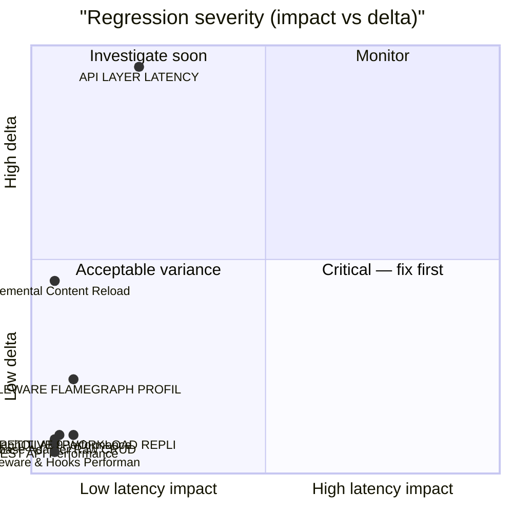

# 🚀 MariaDB+Redis Performance Ledger

> [!NOTE] Competitive comparisons based on publicly available documentation as of June 2026. All SveltyCMS metrics self-measured via `bun test tests/benchmarks/`.

> [!IMPORTANT]
> **Console-only by default.** Use `BENCHMARK_RECORD=1` to write results to this report.
>
> ```bash
> BENCHMARK_RECORD=1 bun test tests/benchmarks/auth-performance.test.ts
> ```
>
> The full matrix runner (`bun run scripts/benchmark-matrix/index.ts --sql`) always records.

<!-- BENCHMARK_START -->

<!-- EXECUTIVE_START -->
<!-- LATEST_AUDIT_HEADER -->

## 📊 Latest Performance Audit

<!-- EXECUTIVE_FIX_NOTES_START -->

### 📝 Fix Overlays

> [!NOTE]
> Phase notes and remediation entries appear here after matrix or surgical runs.

<!-- EXECUTIVE_FIX_NOTES_END -->

(06/10/2026, 12:54:58)

**✅ PASS** · 23/45 tests · 22 skipped · **MARIADB+REDIS** · Bun 1.4.2

### Dimension health

| Dimension      | Tests | Status | Worst Δ | Issues |
| -------------- | ----: | ------ | ------- | ------ |
| **Core**       |    13 | 🟢     | +514%   | 0      |
| **API**        |     9 | 🟢     | -60%    | 0      |
| **Scale**      |    18 | 🟢     | +165%   | 0      |
| **Resilience** |     5 | 🟢     | —       | 0      |

### Issues (action required)

> ✅ **All clear** — no regressions or budget violations detected.

### Executive latency matrix

| Scenario               | Latency | Trend  | Budget   | Result |
| ---------------------- | ------- | ------ | -------- | ------ |
| **Cold Start**         | N/A     | ⚪ (—) | < 5000ms | ⚪ N/A |
| **REST (Collections)** | N/A     | ⚪ (—) | < 5ms    | ⚪ N/A |
| **Middleware Hooks**   | N/A     | ⚪     | < 2ms    | ⚪ N/A |
| **GraphQL (Avg)**      | N/A     | ⚪ (—) | < 5ms    | ⚪ N/A |
| **Million-Row Index**  | N/A     | ⚪     | < 250ms  | ⚪ N/A |
| **DB Raw (p95)**       | N/A     | ⚪     | < 50ms   | ⚪ N/A |

### Historical pulse

> **Scope:** Sparklines only — full run tables: [`tests/benchmarks/results/history.sqlite`](../../../tests/benchmarks/results/history.sqlite)

| Metric | Trend | Sparkline | Latest |
| ------ | ----- | --------- | ------ |

<details>
<summary>📈 Latency trend chart (last 10 runs)</summary>

```mermaid
xychart-beta
  title "MARIADB+REDIS REST p95 (last 10 runs)"
  x-axis ["R1", "R2", "R3", "R4", "R5", "R6", "R7", "R8", "R9", "R10"]
  y-axis "Latency (ms)"
  line "p95" : [0.000, 0.000, 0.000, 0.000, 0.000, 0.000, 0.000, 0.000, 0.000, 0.000]
```

</details>
<details>
<summary>📊 Regression severity matrix (quadrant)</summary>



</details>

<!-- EXECUTIVE_PARTIAL_WATERMARK -->

<!-- EXECUTIVE_ALERTS_START -->
<!-- EXECUTIVE_ALERTS_END -->
<!-- EXECUTIVE_END -->

<!-- SUMMARY_START -->
<!-- SUMMARY_RUN_OVERLAY_START -->

### Current Run Summary

> Only tests that ran in THIS invocation. Populated after `BENCHMARK_RECORD=1` or matrix run.

<!-- SUMMARY_RUN_OVERLAY_END -->

<!-- SUMMARY_HISTORY_START -->

### Historical Trends (2026-10-06)

> **Mode:** production-parity matrix runs only (`run_mode='matrix'` + `server_mode='production'` — `NODE_ENV=production`, no `TEST_MODE`). Standalone/mode-variant samples are recorded but never trended here.

> **Scope:** Sparklines only — full run tables live in `history.sqlite` (link below). Runs = sparkline bar count.

**Detail:** [`tests/benchmarks/results/history.sqlite`](../../../tests/benchmarks/results/history.sqlite) · `SELECT test_id, phase, server_mode, avg_ms, p95_ms, rps, timestamp FROM runs WHERE db_type='mariadb' AND redis=1 ORDER BY timestamp DESC`

**Series:** 55 · **DB:** mariadb-redis

| Metric                              | Trend | Sparkline (last 7) | Latest   |
| ----------------------------------- | ----- | ------------------ | -------- |
| ADMIN UX VITALITY (warm)            | 🟢    | `█▁`               | 0.524ms  |
| AI PERFORMANCE (warm)               | 🟢    | `▁▁`               | 0.000ms  |
| API LATENCY (warm)                  | 🟢    | `▆▂▁▁█`            | 3.604ms  |
| AUTH PERFORMANCE (warm)             | 🟢    | `▁▃█▃▃▃`           | 0.874ms  |
| AUTH SESSION AMR (warm)             | 🟢    | `▄▇█▁`             | 0.431ms  |
| BUILD ANALYSIS (warm)               | 🟢    | `▁`                | 0.000ms  |
| CACHE HIT RATIO (warm)              | 🟢    | `▄▄▁█`             | 1.781ms  |
| CACHE PERFORMANCE (warm)            | 🟢    | `▁█`               | 0.803ms  |
| CACHE SERVICE (warm)                | 🟢    | `▁▇█`              | 0.596ms  |
| CLIENT JOURNEY (warm)               | 🟢    | `▁`                | 5.861ms  |
| COMPETITIVE WORKLOAD REPLICA (warm) | 🟢    | `▁▂▁▅▂█▃`          | 1.435ms  |
| CONCURRENCY MAX (warm)              | 🟢    | `▁`                | 28.764ms |
| CONTENT GUI SAVE (warm)             | 🟢    | `▁`                | 1.561ms  |
| CONTENT SCALE STRESS (warm)         | 🟢    | `█▁`               | 0.135ms  |
| CONTENT SCAN (warm)                 | 🟢    | `█▁`               | 0.660ms  |
| DATABASE PERFORMANCE (warm)         | 🟢    | `▂▁▂▁█▂▁`          | 0.396ms  |
| EDGE SYNC (warm)                    | 🟢    | `▁`                | 2.674ms  |
| ENTRY EDIT HYDRATION (warm)         | 🟢    | `█▁▁▅`             | 0.015ms  |
| GRAPHQL CACHE HIT (warm)            | 🟢    | `█▁▆▁`             | 1.073ms  |
| GRAPHQL LOCAL SDK (warm)            | 🟢    | `█▁`               | 0.000ms  |
| GRAPHQL STRESS (warm)               | 🟢    | `█▁▂▃▁▅▇`          | 15.753ms |
| HOOKS PERFORMANCE (warm)            | 🟢    | `▁█▁▃▃`            | 0.748ms  |
| INDEX PRESSURE (warm)               | 🟢    | `▁█`               | 0.704ms  |
| LARGE PAYLOAD STREAMING (warm)      | 🟢    | `▁█▁▇`             | 9.938ms  |
| LOCAL API THROUGHPUT (warm)         | 🟢    | `█▁`               | 1.093ms  |
| MEDIA UPLOAD STRESS (warm)          | 🟢    | `▁█`               | 9.393ms  |
| MEMORY COUNTERS (warm)              | 🟢    | `▁`                | 0.000ms  |
| MIGRATION SCALE (warm)              | 🟢    | `█▂▁`              | 0.501ms  |
| MIXED WORKLOAD (warm)               | 🟢    | `▁`                | 0.765ms  |
| MULTI TENANT PERFORMANCE (warm)     | 🟢    | `▁`                | 1.069ms  |
| OPENAPI PERFORMANCE (warm)          | 🟢    | `▇▁█`              | 2.110ms  |
| PRODUCTION DAY (warm)               | 🟢    | `▁`                | 2.373ms  |
| REALTIME PERFORMANCE (warm)         | 🟢    | `▁▁▁`              | 0.000ms  |
| REVISION STRESS (warm)              | 🟢    | `▁█▁`              | 0.349ms  |
| RIGHT TO BE FORGOTTEN AUDIT (warm)  | 🟢    | `▁`                | 8.030ms  |
| SCALE SPECTRUM (warm)               | 🟢    | `▃▇▇▇█▁█`          | 1.004ms  |
| SECURITY AUDIT (warm)               | 🟢    | `▁█▁█▁██`          | 0.001ms  |
| SEO PERFORMANCE (warm)              | 🟢    | `▁█▁▁`             | 1.568ms  |
| SHARP VS BUN IMAGE (warm)           | 🟢    | `▇▄▁▂▁██`          | 60.996ms |
| STATE MACHINE TRANSITION (warm)     | 🟢    | `▁█`               | 52.614ms |
| TELEMETRY PERFORMANCE (warm)        | 🟢    | `█▁`               | 0.000ms  |
| TEMPORAL INTEGRITY (warm)           | 🟢    | `▁`                | 3.683ms  |
| TRANSACTION ACID (warm)             | 🟢    | `▁█`               | 1.846ms  |
| TRUTH LATENCY (warm)                | 🟢    | `█▃▁▁`             | 0.000ms  |
| WEBSOCKET BROADCAST (warm)          | 🟢    | `▁`                | 0.108ms  |
| WIDGET PERFORMANCE (warm)           | 🟢    | `█▁▇`              | 0.555ms  |
| CONFIG PROMOTION (warm)             | ⚪    | `▅▅█▅▁▂`           | 9.038ms  |
| CONTENT INCREMENTAL RELOAD (warm)   | ⚪    | `▃▃▁█`             | 0.690ms  |
| GRAPHQL API PERFORMANCE (warm)      | ⚪    | `▅▄█▅▁▁`           | 0.933ms  |
| LOCAL API PERFORMANCE (warm)        | ⚪    | `▆█▁`              | 0.337ms  |
| LOCAL CMS CRUD (warm)               | ⚪    | `▃▃▃▂▁█▄`          | 0.944ms  |
| LOCAL SDK VS DIRECT (warm)          | ⚪    | `▂▄▁▂▅██`          | 1.308ms  |
| MIDDLEWARE FLAMEGRAPH (warm)        | ⚪    | `▄▃▃█▁▁▇`          | 1.355ms  |
| NEGATIVE CACHE (warm)               | ⚪    | `██▁`              | 0.001ms  |
| REST API PERFORMANCE (warm)         | ⚪    | `▄▃▆▁█`            | 0.728ms  |

<!-- SUMMARY_HISTORY_END --><!-- SUMMARY_END -->

<details>
<summary>📊 Infrastructure drill-down (expand for adapter, hooks, memory trends)</summary>

## 📊 Infrastructure drill-down

### 🏷️ Mixed Workload Performance {#mixedAvg}

**Mixed p95:** — (not measured in this run) | **Trend:** ⚪ (—)

> Production request mix: 60% Reads, 20% Writes, 15% GraphQL, 5% Media.

### 🏷️ Database Adapter Performance {#dbRaw}

**Raw Adapter p95:** — (not measured in this run) | **Target:** < 50ms | **Trend:** ⚪ (—)

> Direct database access latency (bypass CMS logic).

### 🏷️ Middleware & Hooks Audit {#hooks}

**Middleware p95:** — (not measured in this run) | **Target:** < 2ms | **Trend:** ⚪ (—)

> Total overhead of security, logging, and auth hooks.

### 🏷️ Memory Stability Audit {#memGrowth}

**Memory RSS Δ:** — (not measured in this run) | **Target:** < 60MB | **Trend:** ⚪ (—)

> Peak memory growth during stress workload.

### Enterprise scale audit

### 🏷️ Multi-Tenancy Performance {#tenancyAvg}

**Tenancy p95:** — (not measured in this run) | **Trend:** ⚪ (—)

> Measures latency across tenant isolation boundaries.

### 🏷️ Relational Resolver Latency {#relationalAvg}

**Relational p95:** — (not measured in this run) | **Trend:** ⚪ (—)

> Tests performance of complex JOINs and nested relationship population.

### 🏷️ Telemetry & Update Performance {#telemetryAvg}

**Telemetry p95:** — (not measured in this run) | **Trend:** ⚪ (—)

> Measures overhead of telemetry collection and cryptographic signing.

</details>

<!-- LEDGER_START -->

## 🔬 Full benchmark ledger (41 modules)

Expand dimension groups, then any row, for ASCII truth tables. Executive summary above shows pass/fail and issues only.

<!-- LEDGER_DIMENSION:CORE:START -->

<details id="ledger-dimension-core">
<summary><strong>Core</strong> · 13 tests</summary>

<!-- SECTION:API_LATENCY:START -->
<details id="section-api_latency">
<summary><strong>🏷️ API LAYER LATENCY</strong> · ⚪ 3.604ms · ↗️ — · <a href="../../../tests/benchmarks/api-latency.test.ts">source</a></summary>
<!-- LEDGER_INSIGHT_START -->
> [!NOTE]
> **Specific to this test**: Both avg and p95 degraded — likely adapter or infrastructure bottleneck. Check DB connection pool, indexes, or recent commits.  
Throughput dropped 90% — check connection pool saturation or lock contention.  
**Severe degradation** (+514%) — review recent commits immediately.
> **Check**: `src/routes/api/[...path]/+server.ts` · `src/hooks.server.ts`
<!-- LEDGER_INSIGHT_END -->

<!-- LEDGER_TRUTH_START -->

> ⏳ **API LAYER LATENCY**: Pending execution.
> 🎯 Measures the base network and HTTP overhead for the simplest possible API calls.

<!-- LEDGER_TRUTH_END -->

</details>
<!-- SECTION:API_LATENCY:END -->

<!-- SECTION:COLD_START:START -->
<details id="section-cold_start">
<summary><strong>🏷️ PHASED COLD START</strong> · ⚪ ⏳ pending · ➡️ — · <a href="../../../tests/benchmarks/cold-start-phased.test.ts">source</a></summary>
<!-- LEDGER_TRUTH_START -->
> ⏳ **PHASED COLD START**: Pending execution.
> 🎯 Measures the time to READY state (serving traffic) vs WARMED state (background tasks).
<!-- LEDGER_TRUTH_END -->

</details>
<!-- SECTION:COLD_START:END -->

<!-- SECTION:TRUTH_AUDIT:START -->
<details id="section-truth_audit">
<summary><strong>🏷️ SRE TRUTH AUDIT</strong> · ⚪ ⏳ pending · ↘️ — · <a href="../../../tests/benchmarks/truth-latency.test.ts">source</a></summary>
<!-- LEDGER_INSIGHT_START -->
> [!NOTE]
> **Specific to this test**: Performance improved — recent optimizations or cache warming likely effective.
<!-- LEDGER_INSIGHT_END -->

<!-- LEDGER_TRUTH_START -->

```text
╔═══════════════════════════════════════════════════════════════════════════════════════════════════════╗
║                                      SVELTYCMS — SRE TRUTH AUDIT                                      ║
║                             File: tests/benchmarks/truth-latency.test.ts                              ║
║                                       Ran: 2026-10-06 10:46:25                                        ║
║            Validates performance claims by comparing SDK, Middleware, and Real HTTP Stack             ║
╠═══════════════════════════════════════════════════════════════════════════════════════════════════════╣
║ Logic Baseline               │ Cold:     0.03 ms │ Warm:     0.000 ms │ p95:     0.000 ms │ 555,453 RPS ║
║ Local SDK (Full)             │ Cold:    16.04 ms │ Warm:     0.006 ms │ p95:     0.010 ms │ 154,115 RPS ║
║ HTTP End-to-End              │ Cold:    11.84 ms │ Warm:     0.271 ms │ p95:     0.347 ms │   3,655 RPS ║
║ HTTP Cold (Cache-Busted)     │ Cold:     2.26 ms │ Warm:     0.993 ms │ p95:     1.410 ms │   1,005 RPS ║
╚═══════════════════════════════════════════════════════════════════════════════════════════════════════╝
```

<!-- LEDGER_TRUTH_END -->

</details>
<!-- SECTION:TRUTH_AUDIT:END -->

<!-- SECTION:INCREMENTAL:START -->
<details id="section-incremental">
<summary><strong>🏷️ Incremental Content Reload</strong> · ⚪ 0.690ms · ↗️ — · <a href="../../../tests/benchmarks/content-incremental-reload.test.ts">source</a></summary>
<!-- LEDGER_INSIGHT_START -->
> [!NOTE]
> **Specific to this test**: Both avg and p95 degraded — likely adapter or infrastructure bottleneck. Check DB connection pool, indexes, or recent commits.  
Throughput dropped 80% — check connection pool saturation or lock contention.  
**Severe degradation** (+230%) — review recent commits immediately.
> **Check**: `src/content/engine.server.ts` · `src/routes/api/[...path]/handlers/content.ts`
<!-- LEDGER_INSIGHT_END -->

<!-- LEDGER_TRUTH_START -->

```text
╔═══════════════════════════════════════════════════════════════════════════════════════════════════════╗
║                             SVELTYCMS — INCREMENTAL CONTENT RELOAD AUDIT                              ║
║                       File: tests/benchmarks/content-incremental-reload.test.ts                       ║
║                                       Ran: 2026-10-06 10:50:28                                        ║
║      Measures surgical single-file fullReload vs full reconciliation path and batch processing.       ║
╠═══════════════════════════════════════════════════════════════════════════════════════════════════════╣
║ Incremental fullReload (1 file) │ Cold:     4.43 ms │ Warm:     0.065 ms │ p95:     0.184 ms │  12,828 RPS ║
║ Full Reconciliation Reload   │ Cold:     2.67 ms │ Warm:     0.209 ms │ p95:     0.273 ms │   4,593 RPS ║
║ Sequential 10-File Reload    │ Cold:     4.38 ms │ Warm:     0.690 ms │ p95:     1.096 ms │   1,442 RPS ║
║ Batched 10-File Reload       │ Cold:     0.89 ms │ Warm:     0.238 ms │ p95:     0.366 ms │   3,722 RPS ║
╚═══════════════════════════════════════════════════════════════════════════════════════════════════════╝
```

<!-- LEDGER_TRUTH_END -->

</details>
<!-- SECTION:INCREMENTAL:END -->

<!-- SECTION:HOOKS_TRACE:START -->
<details id="section-hooks_trace">
<summary><strong>🏷️ Middleware & Hooks Performance</strong> · ⚪ 0.748ms · ↗️ — · <a href="../../../tests/benchmarks/hooks-performance.test.ts">source</a></summary>
<!-- LEDGER_INSIGHT_START -->
> [!NOTE]
> **Specific to this test**: Both avg and p95 degraded — likely adapter or infrastructure bottleneck. Check DB connection pool, indexes, or recent commits.
<!-- LEDGER_INSIGHT_END -->

<!-- LEDGER_TRUTH_START -->

> ⏳ **Middleware & Hooks Performance**: Pending execution.
> 🎯 High-resolution micro-benchmarks (µs) for individual middleware layers.

<!-- LEDGER_TRUTH_END -->

</details>
<!-- SECTION:HOOKS_TRACE:END -->

<!-- SECTION:STATE_MACHINE:START -->
<details id="section-state_machine">
<summary><strong>🏷️ State Machine Transitions</strong> · ⚪ 52.614ms · ➡️ — · <a href="../../../tests/benchmarks/state-machine-transition.test.ts">source</a></summary>
<!-- LEDGER_TRUTH_START -->
```text
╔═══════════════════════════════════════════════════════════════════════════════════════════════════════╗
║                                  SVELTYCMS — STATE MACHINE INTEGRITY                                  ║
║                        File: tests/benchmarks/state-machine-transition.test.ts                        ║
║                                       Ran: 2026-10-06 10:50:36                                        ║
║Measures state machine self-healing transition latencies, convergence settling time, and health probe consistency under stress.║
╠═══════════════════════════════════════════════════════════════════════════════════════════════════════╣
║ State Transition (Transient) │ Cold:    84.01 ms │ Warm:    52.614 ms │ p95:    65.705 ms │      19 RPS ║
║ Self-Healing Full Convergence │ Cold:    51.36 ms │ Warm:    49.148 ms │ p95:    57.796 ms │      20 RPS ║
╚═══════════════════════════════════════════════════════════════════════════════════════════════════════╝
```
<!-- LEDGER_TRUTH_END -->

</details>
<!-- SECTION:STATE_MACHINE:END -->

<!-- SECTION:DB_RAW_P95:START -->
<details id="section-db_raw_p95">
<summary><strong>🏷️ Database Adapter Raw CRUD</strong> · ⚪ 0.396ms · ↘️ — · <a href="../../../tests/benchmarks/database-performance.test.ts">source</a></summary>
<!-- LEDGER_INSIGHT_START -->
> [!NOTE]
> **Specific to this test**: Performance improved — recent optimizations or cache warming likely effective.
<!-- LEDGER_INSIGHT_END -->

<!-- LEDGER_TRUTH_START -->

> ⏳ **Database Adapter Raw CRUD**: Pending execution.
> 🎯 Direct low-level benchmarks of Create, Read, Update, Delete on the current database adapter.

<!-- LEDGER_TRUTH_END -->

</details>
<!-- SECTION:DB_RAW_P95:END -->

<!-- SECTION:ACID:START -->
<details id="section-acid">
<summary><strong>🏷️ ACID Transaction Overhead</strong> · ⚪ 1.846ms · ➡️ — · <a href="../../../tests/benchmarks/transaction-acid.test.ts">source</a></summary>
<!-- LEDGER_TRUTH_START -->
```text
╔═══════════════════════════════════════════════════════════════════════════════════════════════════════╗
║                                   SVELTYCMS — ACID INTEGRITY AUDIT                                    ║
║                            File: tests/benchmarks/transaction-acid.test.ts                            ║
║                                       Ran: 2026-10-06 10:50:11                                        ║
║         Measures transaction commit latencies and rollback overhead across database adapters          ║
╠═══════════════════════════════════════════════════════════════════════════════════════════════════════╣
║ TX Commit                    │ Cold:     2.52 ms │ Warm:     0.745 ms │ p95:     1.371 ms │   4,968 RPS ║
║ TX Rollback Integrity        │ Cold:     4.65 ms │ Warm:     1.846 ms │ p95:     2.373 ms │     541 RPS ║
╚═══════════════════════════════════════════════════════════════════════════════════════════════════════╝
```
<!-- LEDGER_TRUTH_END -->

</details>
<!-- SECTION:ACID:END -->

<!-- SECTION:CACHE:START -->
<details id="section-cache">
<summary><strong>🏷️ System Cache Efficiency</strong> · ⚪ 0.803ms · ➡️ — · <a href="../../../tests/benchmarks/cache-performance.test.ts">source</a></summary>
<!-- LEDGER_TRUTH_START -->
```text
╔═══════════════════════════════════════════════════════════════════════════════════════════════════════╗
║                                  SVELTYCMS — CACHE EFFICIENCY AUDIT                                   ║
║                            File: tests/benchmarks/cache-hit-ratio.test.ts                             ║
║                                       Ran: 2026-10-06 10:47:09                                        ║
║           Measures true cold-fill, warm hit ratio, miss penalty, and invalidation latency.            ║
╠═══════════════════════════════════════════════════════════════════════════════════════════════════════╣
║ Cache Cold Fill (Miss + Repopulate) │        0.937 ms │ p95:        1.138 ms │ RPS:      1,067 ║
║ Cache Hit (Warm)             │ Cold:     0.27 ms │ Warm:     0.159 ms │ p95:     0.245 ms │   6,092 RPS ║
║ Bypass Cache (Direct DB)     │ Cold:     1.03 ms │ Warm:     0.796 ms │ p95:     1.100 ms │   1,252 RPS ║
║ Cache Invalidation           │ Cold:     3.15 ms │ Warm:     1.781 ms │ p95:     2.089 ms │     555 RPS ║
╚═══════════════════════════════════════════════════════════════════════════════════════════════════════╝
```
<!-- LEDGER_TRUTH_END -->

</details>
<!-- SECTION:CACHE:END -->

<!-- SECTION:CACHE_EFFICIENCY:START -->
<details id="section-cache_efficiency">
<summary><strong>🏷️ Cache Hit/Miss Ratio & Efficiency</strong> · ⚪ 1.781ms · ↗️ — · <a href="../../../tests/benchmarks/cache-hit-ratio.test.ts">source</a></summary>
<!-- LEDGER_INSIGHT_START -->
> [!NOTE]
> **Specific to this test**: Both avg and p95 degraded — likely adapter or infrastructure bottleneck. Check DB connection pool, indexes, or recent commits.  
Throughput dropped 80% — check connection pool saturation or lock contention.  
**Severe degradation** (+124%) — review recent commits immediately.
> **Check**: `src/databases/cache/redis-adapter.ts` · `src/databases/cache/cache-service.ts`
<!-- LEDGER_INSIGHT_END -->

<!-- LEDGER_TRUTH_START -->

```text
╔═══════════════════════════════════════════════════════════════════════════════════════════════════════╗
║                                  SVELTYCMS — CACHE EFFICIENCY AUDIT                                   ║
║                            File: tests/benchmarks/cache-hit-ratio.test.ts                             ║
║                                       Ran: 2026-10-06 10:47:09                                        ║
║           Measures true cold-fill, warm hit ratio, miss penalty, and invalidation latency.            ║
╠═══════════════════════════════════════════════════════════════════════════════════════════════════════╣
║ Cache Cold Fill (Miss + Repopulate) │        0.937 ms │ p95:        1.138 ms │ RPS:      1,067 ║
║ Cache Hit (Warm)             │ Cold:     0.27 ms │ Warm:     0.159 ms │ p95:     0.245 ms │   6,092 RPS ║
║ Bypass Cache (Direct DB)     │ Cold:     1.03 ms │ Warm:     0.796 ms │ p95:     1.100 ms │   1,252 RPS ║
║ Cache Invalidation           │ Cold:     3.15 ms │ Warm:     1.781 ms │ p95:     2.089 ms │     555 RPS ║
╚═══════════════════════════════════════════════════════════════════════════════════════════════════════╝
```

<!-- LEDGER_TRUTH_END -->

</details>
<!-- SECTION:CACHE_EFFICIENCY:END -->

<!-- SECTION:COMPETITIVE:START -->
<details id="section-competitive">
<summary><strong>🏷️ COMPETITIVE 9-WORKLOAD REPLICA</strong> · ⚪ 1.435ms · ↗️ — · <a href="../../../tests/benchmarks/competitive-workload-replica.test.ts">source</a></summary>
<!-- LEDGER_INSIGHT_START -->
> [!NOTE]
> **Specific to this test**: Avg degraded but p95 stable — possible cold-start effect, GC pause, or warmup variance.  
Throughput dropped 83% — check connection pool saturation or lock contention.  
**Severe degradation** (+46%) — review recent commits immediately.
<!-- LEDGER_INSIGHT_END -->

<!-- LEDGER_TRUTH_START -->

```text
╔═══════════════════════════════════════════════════════════════════════════════════════════════════════╗
║                    COMPETITIVE HARNESS REPLICA (MARIADB — 500 Docs, COLD vs WARM)                     ║
║                      File: tests/benchmarks/competitive-workload-replica.test.ts                      ║
║                                       Ran: 2026-10-06 10:53:01                                        ║
║              Seq + concurrent (8 workers), harness iteration counts, median of N rounds.              ║
╠═══════════════════════════════════════════════════════════════════════════════════════════════════════╣
║ findById (Cold Sequential)   │ Cold:     4.62 ms │ Warm:     0.587 ms │ p95:     1.144 ms │   1,678 RPS ║
║ findById (Cold Concurrent 8c) │ Cold:     0.99 ms │ Warm:     2.132 ms │ p95:     3.068 ms │   3,634 RPS ║
║ findByIdRandom (Cold Sequential) │ Cold:     4.58 ms │ Warm:     1.059 ms │ p95:     1.593 ms │     942 RPS ║
║ findByIdRandom (Cold Concurrent 8c) │ Cold:     2.99 ms │ Warm:     3.106 ms │ p95:     4.237 ms │   2,512 RPS ║
║ listFilterSort (Cold Sequential) │ Cold:     4.60 ms │ Warm:     0.400 ms │ p95:     0.508 ms │   2,488 RPS ║
║ listFilterSort (Cold Concurrent 8c) │ Cold:     0.45 ms │ Warm:     2.168 ms │ p95:     3.805 ms │   3,510 RPS ║
║ listLarge (Cold Sequential)  │ Cold:     5.13 ms │ Warm:     0.489 ms │ p95:     0.690 ms │   2,034 RPS ║
║ listLarge (Cold Concurrent 8c) │ Cold:     0.38 ms │ Warm:     1.467 ms │ p95:     2.417 ms │   5,284 RPS ║
║ listPlain (Cold Sequential)  │ Cold:     2.64 ms │ Warm:     0.278 ms │ p95:     0.347 ms │   3,578 RPS ║
║ listPlain (Cold Concurrent 8c) │ Cold:     0.32 ms │ Warm:     1.109 ms │ p95:     1.535 ms │   6,981 RPS ║
║ findMissing (Cold Sequential) │ Cold:     4.84 ms │ Warm:     0.281 ms │ p95:     0.292 ms │   3,550 RPS ║
║ findMissing (Cold Concurrent 8c) │ Cold:     0.24 ms │ Warm:     0.875 ms │ p95:     1.035 ms │   8,799 RPS ║
║ create (Cold Sequential)     │ Cold:     5.07 ms │ Warm:     1.449 ms │ p95:     1.979 ms │     689 RPS ║
║ create (Cold Concurrent 8c)  │ Cold:     4.81 ms │ Warm:     7.036 ms │ p95:     9.594 ms │   1,118 RPS ║
║ update (Cold Sequential)     │ Cold:     3.25 ms │ Warm:     1.459 ms │ p95:     1.885 ms │     685 RPS ║
║ update (Cold Concurrent 8c)  │ Cold:     4.37 ms │ Warm:     6.261 ms │ p95:     9.034 ms │   1,251 RPS ║
║ graphql (Cold Sequential)    │ Cold:     4.92 ms │ Warm:     1.021 ms │ p95:     1.530 ms │     978 RPS ║
║ graphql (Cold Concurrent 8c) │ Cold:     2.45 ms │ Warm:     2.499 ms │ p95:     3.773 ms │   3,110 RPS ║
║ mixed (Cold Sequential)      │ Cold:     1.59 ms │ Warm:     1.028 ms │ p95:     1.679 ms │     971 RPS ║
║ mixed (Cold Concurrent 8c)   │ Cold:     0.40 ms │ Warm:     3.160 ms │ p95:     4.580 ms │   2,462 RPS ║
║ findById (Warm Sequential)   │ Cold:     0.65 ms │ Warm:     0.184 ms │ p95:     0.278 ms │   5,395 RPS ║
║ findById (Warm Concurrent 8c) │ Cold:     0.24 ms │ Warm:     0.931 ms │ p95:     1.324 ms │   8,498 RPS ║
║ findByIdRandom (Warm Sequential) │ Cold:     1.17 ms │ Warm:     0.285 ms │ p95:     0.451 ms │   3,494 RPS ║
║ findByIdRandom (Warm Concurrent 8c) │ Cold:     0.20 ms │ Warm:     0.999 ms │ p95:     1.575 ms │   7,946 RPS ║
║ listFilterSort (Warm Sequential) │ Cold:     0.91 ms │ Warm:     0.316 ms │ p95:     0.418 ms │   3,148 RPS ║
║ listFilterSort (Warm Concurrent 8c) │ Cold:     0.33 ms │ Warm:     1.006 ms │ p95:     1.304 ms │   7,744 RPS ║
║ listLarge (Warm Sequential)  │ Cold:     0.92 ms │ Warm:     0.454 ms │ p95:     0.767 ms │   2,191 RPS ║
║ listLarge (Warm Concurrent 8c) │ Cold:     0.39 ms │ Warm:     1.241 ms │ p95:     1.797 ms │   6,304 RPS ║
║ listPlain (Warm Sequential)  │ Cold:     0.94 ms │ Warm:     0.201 ms │ p95:     0.321 ms │   4,959 RPS ║
║ listPlain (Warm Concurrent 8c) │ Cold:     0.26 ms │ Warm:     0.775 ms │ p95:     1.005 ms │  10,122 RPS ║
║ findMissing (Warm Sequential) │ Cold:     0.70 ms │ Warm:     0.244 ms │ p95:     0.374 ms │   4,070 RPS ║
║ findMissing (Warm Concurrent 8c) │ Cold:     0.25 ms │ Warm:     0.666 ms │ p95:     1.915 ms │  11,830 RPS ║
║ create (Warm Sequential)     │ Cold:     2.50 ms │ Warm:     1.292 ms │ p95:     2.024 ms │     773 RPS ║
║ create (Warm Concurrent 8c)  │ Cold:     3.96 ms │ Warm:     5.223 ms │ p95:    10.072 ms │   1,522 RPS ║
║ update (Warm Sequential)     │ Cold:     2.77 ms │ Warm:     1.435 ms │ p95:     2.205 ms │     696 RPS ║
║ update (Warm Concurrent 8c)  │ Cold:     4.37 ms │ Warm:     5.388 ms │ p95:     7.942 ms │   1,469 RPS ║
║ graphql (Warm Sequential)    │ Cold:     2.08 ms │ Warm:     0.991 ms │ p95:     1.479 ms │   1,007 RPS ║
║ graphql (Warm Concurrent 8c) │ Cold:     1.01 ms │ Warm:     1.872 ms │ p95:     2.423 ms │   4,196 RPS ║
║ mixed (Warm Sequential)      │ Cold:     0.90 ms │ Warm:     0.980 ms │ p95:     1.715 ms │   1,019 RPS ║
║ mixed (Warm Concurrent 8c)   │ Cold:     0.57 ms │ Warm:     3.359 ms │ p95:     5.780 ms │   2,344 RPS ║
╚═══════════════════════════════════════════════════════════════════════════════════════════════════════╝
```

<!-- LEDGER_TRUTH_END -->

</details>
<!-- SECTION:COMPETITIVE:END -->

<!-- SECTION:FLAMEGRAPH:START -->
<details id="section-flamegraph">
<summary><strong>🏷️ MIDDLEWARE FLAMEGRAPH PROFILER</strong> · ⚪ 1.355ms · ↗️ — · <a href="../../../tests/benchmarks/middleware-flamegraph.test.ts">source</a></summary>
<!-- LEDGER_INSIGHT_START -->
> [!NOTE]
> **Specific to this test**: Both avg and p95 degraded — likely adapter or infrastructure bottleneck. Check DB connection pool, indexes, or recent commits.  
Throughput dropped 54% — check connection pool saturation or lock contention.  
**Severe degradation** (+115%) — review recent commits immediately.
<!-- LEDGER_INSIGHT_END -->

<!-- LEDGER_TRUTH_START -->

```text
╔═══════════════════════════════════════════════════════════════════════════════════════════════════════╗
║                               MIDDLEWARE FLAMEGRAPH PROFILER (MARIADB)                                ║
║                         File: tests/benchmarks/middleware-flamegraph.test.ts                          ║
║                                       Ran: 2026-10-06 10:53:52                                        ║
║Measures isolated microsecond cost and incremental deltas of each middleware stage from edge to database.║
╠═══════════════════════════════════════════════════════════════════════════════════════════════════════╣
║ Stage 0: Raw Socket Baseline (Static Asset) │ Cold:     3.41 ms │ Warm:     0.839 ms │ p95:     1.781 ms │   3,897 RPS ║
║ Stage 1: System State + Turbo Pipeline │ Cold:     1.60 ms │ Warm:     0.628 ms │ p95:     1.030 ms │   5,962 RPS ║
║ Stage 2: WAF Security Inspection │ Cold:     1.17 ms │ Warm:     0.634 ms │ p95:     0.826 ms │   6,094 RPS ║
║ Stage 3: Token Auth Gating   │ Cold:     3.35 ms │ Warm:     1.491 ms │ p95:     1.876 ms │   2,620 RPS ║
║ Stage 4: Collection Schema Resolution │ Cold:     5.63 ms │ Warm:     0.350 ms │ p95:     0.498 ms │  10,908 RPS ║
║ Stage 5: Full REST Single Document │ Cold:     2.34 ms │ Warm:     0.359 ms │ p95:     1.116 ms │   8,915 RPS ║
║ Stage 6: GraphQL Single Query (JIT) │ Cold:     3.07 ms │ Warm:     1.355 ms │ p95:     1.673 ms │   2,935 RPS ║
╚═══════════════════════════════════════════════════════════════════════════════════════════════════════╝
```

<!-- LEDGER_TRUTH_END -->

</details>
<!-- SECTION:FLAMEGRAPH:END -->

<!-- SECTION:EVENTLOOP:START -->
<details id="section-eventloop">
<summary><strong>🏷️ EVENT LOOP LAG & SATURATION</strong> · ⚪ ⏳ pending · ➡️ — · <a href="../../../tests/benchmarks/event-loop-lag.test.ts">source</a></summary>
<!-- LEDGER_TRUTH_START -->
> ⏳ **EVENT LOOP LAG & SATURATION**: Pending execution.
> 🎯 Measures event loop delay and microtask drain during continuous write bursts.
<!-- LEDGER_TRUTH_END -->

</details>
<!-- SECTION:EVENTLOOP:END -->

</details>

<!-- LEDGER_DIMENSION:CORE:END -->

<!-- LEDGER_DIMENSION:API:START -->

<details id="ledger-dimension-api">
<summary><strong>API</strong> · 9 tests</summary>

<!-- SECTION:TEMPORAL:START -->
<details id="section-temporal">
<summary><strong>🏷️ Temporal Integrity Audit</strong> · ⚪ 3.683ms · ➡️ — · <a href="../../../tests/benchmarks/temporal-integrity.test.ts">source</a></summary>
<!-- LEDGER_TRUTH_START -->
```text
╔═══════════════════════════════════════════════════════════════════════════════════════════════════════╗
║                                 SVELTYCMS — TEMPORAL INTEGRITY AUDIT                                  ║
║                           File: tests/benchmarks/temporal-integrity.test.ts                           ║
║                                       Ran: 2026-10-06 10:48:49                                        ║
║Validates strict backend UTC normalization (ISO 8601 with trailing 'Z') across global timezone offsets, fractional timezones, and midnight transitions.║
╠═══════════════════════════════════════════════════════════════════════════════════════════════════════╣
║ Temporal Ingestion & Normalization │ Cold:     4.77 ms │ Warm:     3.683 ms │ p95:     6.963 ms │     950 RPS ║
╚═══════════════════════════════════════════════════════════════════════════════════════════════════════╝
```
<!-- LEDGER_TRUTH_END -->

</details>
<!-- SECTION:TEMPORAL:END -->

<!-- SECTION:RELATIONAL:START -->
<details id="section-relational">
<summary><strong>🏷️ Relational & Nested Queries</strong> · ⚪ ⏳ pending · ➡️ — · <a href="../../../tests/benchmarks/relational-performance.test.ts">source</a></summary>
<!-- LEDGER_TRUTH_START -->
```text
╔═══════════════════════════════════════════════════════════════════════════════════════════════════════╗
║                                 SVELTYCMS — RELATIONAL RESOLVER AUDIT                                 ║
║                         File: tests/benchmarks/relational-performance.test.ts                         ║
║                                       Ran: 2026-08-29 21:36:30                                        ║
║Measures GraphQL resolver performance for shallow listings, deep relational joins, and nested author population across cold/hot execution paths.║
╠═══════════════════════════════════════════════════════════════════════════════════════════════════════╣
║ Shallow Query (Collections)  │ Cold:     3.00 ms │ Warm:     2.916 ms │ p95:     4.389 ms │   1,949 RPS ║
║ Deep Join (Cold DB)          │ Cold:     2.68 ms │ Warm:     2.387 ms │ p95:     3.222 ms │   1,595 RPS ║
║ Deep Join (Warm Cached)      │ Cold:     1.87 ms │ Warm:     1.872 ms │ p95:     2.880 ms │   1,996 RPS ║
╚═══════════════════════════════════════════════════════════════════════════════════════════════════════╝
```
<!-- LEDGER_TRUTH_END -->

</details>
<!-- SECTION:RELATIONAL:END -->

<!-- SECTION:AUTH_TRACE:START -->
<details id="section-auth_trace">
<summary><strong>🏷️ Auth & RBAC Performance</strong> · ⚪ 0.874ms · ↗️ — · <a href="../../../tests/benchmarks/auth-performance.test.ts">source</a></summary>
<!-- LEDGER_INSIGHT_START -->
> [!NOTE]
> **Specific to this test**: Avg degraded but p95 stable — possible cold-start effect, GC pause, or warmup variance.  
Throughput dropped 46% — check connection pool saturation or lock contention.
<!-- LEDGER_INSIGHT_END -->

<!-- LEDGER_TRUTH_START -->

> ⏳ **Auth & RBAC Performance**: Pending execution.
> 🎯 Measures JWT verification, session retrieval, and permission matrix resolution overhead.

<!-- LEDGER_TRUTH_END -->

</details>
<!-- SECTION:AUTH_TRACE:END -->

<!-- SECTION:REST:START -->
<details id="section-rest">
<summary><strong>🏷️ REST API Performance</strong> · ⚪ 0.728ms · ↗️ — · <a href="../../../tests/benchmarks/rest-api-performance.test.ts">source</a></summary>
<!-- LEDGER_INSIGHT_START -->
> [!NOTE]
> **Specific to this test**: Both avg and p95 degraded — likely adapter or infrastructure bottleneck. Check DB connection pool, indexes, or recent commits.  
Throughput dropped 27% — check connection pool saturation or lock contention.  
**Severe degradation** (+34%) — review recent commits immediately.
<!-- LEDGER_INSIGHT_END -->

<!-- LEDGER_TRUTH_START -->

```text
╔═══════════════════════════════════════════════════════════════════════════════════════════════════════╗
║                                 SVELTYCMS — ENTERPRISE REST API AUDIT                                 ║
║                          File: tests/benchmarks/rest-api-performance.test.ts                          ║
║                                       Ran: 2026-10-06 10:46:37                                        ║
║Measures latency, throughput, and correctness of core REST endpoints: health check, schema, single read, list, and search.║
╠═══════════════════════════════════════════════════════════════════════════════════════════════════════╣
║ System Health Check          │ Cold:     1.04 ms │ Warm:     0.728 ms │ p95:     1.139 ms │   5,335 RPS ║
║ Collection Schema Metadata   │ Cold:     6.70 ms │ Warm:     0.518 ms │ p95:     0.807 ms │   7,291 RPS ║
║ Single Document Read         │ Cold:     2.81 ms │ Warm:     0.414 ms │ p95:     0.620 ms │   9,075 RPS ║
║ Collection Find (List Limit 20) │ Cold:     5.60 ms │ Warm:     0.569 ms │ p95:     0.839 ms │   6,799 RPS ║
║ Collection Search Query      │ Cold:     1.99 ms │ Warm:     0.626 ms │ p95:     0.944 ms │   6,122 RPS ║
╚═══════════════════════════════════════════════════════════════════════════════════════════════════════╝
```

<!-- LEDGER_TRUTH_END -->

</details>
<!-- SECTION:REST:END -->

<!-- SECTION:GRAPHQL:START -->
<details id="section-graphql">
<summary><strong>🏷️ GraphQL API Performance</strong> · ⚪ 0.933ms · ↘️ — · <a href="../../../tests/benchmarks/graphql-api-performance.test.ts">source</a></summary>
<!-- LEDGER_INSIGHT_START -->
> [!NOTE]
> **Specific to this test**: Performance improved — recent optimizations or cache warming likely effective.  
Throughput dropped 64% — check connection pool saturation or lock contention.
<!-- LEDGER_INSIGHT_END -->

<!-- LEDGER_TRUTH_START -->

```text
╔═══════════════════════════════════════════════════════════════════════════════════════════════════════╗
║                                  SVELTYCMS — GRAPHQL CACHE HIT AUDIT                                  ║
║                           File: tests/benchmarks/graphql-cache-hit.test.ts                            ║
║                                       Ran: 2026-10-06 10:53:14                                        ║
║        Validates sub-millisecond L1 response cache hits, cache key isolation, and hit headers.        ║
╠═══════════════════════════════════════════════════════════════════════════════════════════════════════╣
║ Q1: Health (Cold Miss)         │        3.140 ms │ p95:        3.140 ms │ RPS:        318 ║
║ Q1: Health (L1 Hit)            │        1.047 ms │ p95:        1.260 ms │ RPS:        955 ║
║ Q2: Collections (Cold Miss)    │        2.670 ms │ p95:        2.670 ms │ RPS:        375 ║
║ Q2: Collections (L1 Hit)       │        1.073 ms │ p95:        1.562 ms │ RPS:        932 ║
╚═══════════════════════════════════════════════════════════════════════════════════════════════════════╝
```

<!-- LEDGER_TRUTH_END -->

</details>
<!-- SECTION:GRAPHQL:END -->

<!-- SECTION:SEO:START -->
<details id="section-seo">
<summary><strong>🏷️ Enterprise SEO Suite Audit</strong> · ⚪ 1.568ms · ↘️ — · <a href="../../../tests/benchmarks/seo-performance.test.ts">source</a></summary>
<!-- LEDGER_INSIGHT_START -->
> [!NOTE]
> **Specific to this test**: Performance improved — recent optimizations or cache warming likely effective.
<!-- LEDGER_INSIGHT_END -->

<!-- LEDGER_TRUTH_START -->

```text
╔═══════════════════════════════════════════════════════════════════════════════════════════════════════╗
║                                   SVELTYCMS — ENTERPRISE SEO AUDIT                                    ║
║                            File: tests/benchmarks/seo-performance.test.ts                             ║
║                                       Ran: 2026-10-06 10:47:56                                        ║
║Measures redirect lookup latency, dynamic sitemap.xml generation, robots.txt serving, and 404 logging performance.║
╠═══════════════════════════════════════════════════════════════════════════════════════════════════════╣
║ Redirect Lookup (301)        │ Cold:     2.04 ms │ Warm:     1.653 ms │ p95:     2.827 ms │   4,795 RPS ║
║ Dynamic Sitemap XML          │ Cold:  1885.73 ms │ Warm:     1.465 ms │ p95:     1.763 ms │   5,410 RPS ║
║ Robots.txt Generation        │ Cold:     2.56 ms │ Warm:     1.568 ms │ p95:     2.507 ms │   5,063 RPS ║
║ Missing Path (404 Log)       │ Cold:   157.58 ms │ Warm:   224.283 ms │ p95:   277.537 ms │      36 RPS ║
╚═══════════════════════════════════════════════════════════════════════════════════════════════════════╝
```

<!-- LEDGER_TRUTH_END -->

</details>
<!-- SECTION:SEO:END -->

<!-- SECTION:BROADCAST:START -->
<details id="section-broadcast">
<summary><strong>🏷️ REAL-TIME BROADCAST AUDIT</strong> · ⚪ 0.108ms · ➡️ — · <a href="../../../tests/benchmarks/websocket-broadcast.test.ts">source</a></summary>
<!-- LEDGER_TRUTH_START -->
> ⏳ **REAL-TIME BROADCAST AUDIT**: Pending execution.
> 🎯 Benchmarks network-layer broadcast latency (SSE vs WebSocket).
<!-- LEDGER_TRUTH_END -->

</details>
<!-- SECTION:BROADCAST:END -->

<!-- SECTION:REAL_TIME:START -->
<details id="section-real_time">
<summary><strong>🏷️ WebSocket & Realtime Latency</strong> · ⚪ ⏳ pending · ➡️ — · <a href="../../../tests/benchmarks/realtime-performance.test.ts">source</a></summary>
<!-- LEDGER_TRUTH_START -->
> ⏳ **WebSocket & Realtime Latency**: Pending execution.
> 🎯 Benchmarks WebSocket connection/broadcast latency.
<!-- LEDGER_TRUTH_END -->

</details>
<!-- SECTION:REAL_TIME:END -->

<!-- SECTION:GQL_CACHE:START -->
<details id="section-gql_cache">
<summary><strong>🏷️ GraphQL Response Cache Hit</strong> · ⚪ 1.073ms · ↘️ — · <a href="../../../tests/benchmarks/graphql-cache-hit.test.ts">source</a></summary>
<!-- LEDGER_INSIGHT_START -->
> [!NOTE]
> **Specific to this test**: Performance improved — recent optimizations or cache warming likely effective.
<!-- LEDGER_INSIGHT_END -->

<!-- LEDGER_TRUTH_START -->

> ⏳ **GraphQL Response Cache Hit**: Pending execution.
> 🎯 L1 response cache: cold-query vs cache-hit latency verification.

<!-- LEDGER_TRUTH_END -->

</details>
<!-- SECTION:GQL_CACHE:END -->

</details>

<!-- LEDGER_DIMENSION:API:END -->

<!-- LEDGER_DIMENSION:SCALE:START -->

<details id="ledger-dimension-scale">
<summary><strong>Scale</strong> · 18 tests</summary>

<!-- SECTION:NEGATIVE_CACHE:START -->
<details id="section-negative_cache">
<summary><strong>🏷️ Negative Cache Performance</strong> · ⚪ 0.001ms · ↘️ — · <a href="../../../tests/benchmarks/negative-cache.test.ts">source</a></summary>
<!-- LEDGER_INSIGHT_START -->
> [!NOTE]
> **Specific to this test**: Performance improved — recent optimizations or cache warming likely effective.
<!-- LEDGER_INSIGHT_END -->

<!-- LEDGER_TRUTH_START -->

```text
╔═══════════════════════════════════════════════════════════════════════════════════════════════════════╗
║                             SVELTYCMS — NEGATIVE CACHE PERFORMANCE AUDIT                              ║
║                             File: tests/benchmarks/negative-cache.test.ts                             ║
║                                       Ran: 2026-10-06 10:47:12                                        ║
║Measures Bloom-filter style missing-key cache speedup for repeated misses against direct database miss baselines.║
╠═══════════════════════════════════════════════════════════════════════════════════════════════════════╣
║ Direct DB Miss Baseline      │ Cold:     5.13 ms │ Warm:     0.865 ms │ p95:     1.240 ms │   1,098 RPS ║
║ Cold Miss (Bypass Cache)     │ Cold:     8.52 ms │ Warm:     0.874 ms │ p95:     1.181 ms │   1,099 RPS ║
║ Hot Miss (Negative Cache)    │ Cold:     0.29 ms │ Warm:     0.001 ms │ p95:     0.002 ms │ 766,056 RPS ║
╚═══════════════════════════════════════════════════════════════════════════════════════════════════════╝
```

<!-- LEDGER_TRUTH_END -->

</details>
<!-- SECTION:NEGATIVE_CACHE:END -->

<!-- SECTION:REVISION_STRESS:START -->
<details id="section-revision_stress">
<summary><strong>🏷️ Revision & History Growth</strong> · ⚪ 0.349ms · ↘️ — · <a href="../../../tests/benchmarks/revision-stress.test.ts">source</a></summary>
<!-- LEDGER_INSIGHT_START -->
> [!NOTE]
> **Specific to this test**: Performance improved — recent optimizations or cache warming likely effective.
<!-- LEDGER_INSIGHT_END -->

<!-- LEDGER_TRUTH_START -->

```text
╔═══════════════════════════════════════════════════════════════════════════════════════════════════════╗
║                                   SVELTYCMS — REVISION STRESS AUDIT                                   ║
║                            File: tests/benchmarks/revision-stress.test.ts                             ║
║                                       Ran: 2026-10-06 10:49:16                                        ║
║Measures latest read degradation, history retrieval speed, and storage footprint under heavy revision growth (100 revisions).║
╠═══════════════════════════════════════════════════════════════════════════════════════════════════════╣
║ Clean Document Read (Baseline) │ Cold:     4.42 ms │ Warm:     0.407 ms │ p95:     0.579 ms │   9,563 RPS ║
║ Latest Read (100 Revisions)  │ Cold:     2.50 ms │ Warm:     0.349 ms │ p95:     0.571 ms │   9,990 RPS ║
║ History List Retrieval       │ Cold:     9.14 ms │ Warm:     1.959 ms │ p95:     2.980 ms │     994 RPS ║
╚═══════════════════════════════════════════════════════════════════════════════════════════════════════╝
```

<!-- LEDGER_TRUTH_END -->

</details>
<!-- SECTION:REVISION_STRESS:END -->

<!-- SECTION:MEMORY:START -->
<details id="section-memory">
<summary><strong>🏷️ Memory Stability & GC Behavior</strong> · ⚪ ⏳ pending · ➡️ — · <a href="../../../tests/benchmarks/memory-stability.test.ts">source</a></summary>
<!-- LEDGER_TRUTH_START -->
> ⏳ **Memory Stability & GC Behavior**: Pending execution.
> 🎯 Long-running soak test to identify memory leaks and GC pressure.
<!-- LEDGER_TRUTH_END -->

</details>
<!-- SECTION:MEMORY:END -->

<!-- SECTION:TENANCY:START -->
<details id="section-tenancy">
<summary><strong>🏷️ Multi-Tenant Performance & Isolation</strong> · ⚪ 1.069ms · ➡️ — · <a href="../../../tests/benchmarks/multi-tenant-performance.test.ts">source</a></summary>
<!-- LEDGER_TRUTH_START -->
```text
╔═══════════════════════════════════════════════════════════════════════════════════════════════════════╗
║                              SVELTYCMS — MULTI-TENANCY PERFORMANCE AUDIT                              ║
║                        File: tests/benchmarks/multi-tenant-performance.test.ts                        ║
║                                       Ran: 2026-10-06 10:47:18                                        ║
║Measures the overhead of tenant isolation, context switching, and data partitioning across many tenants.║
╠═══════════════════════════════════════════════════════════════════════════════════════════════════════╣
║ Single Tenant Baseline       │ Cold:     5.41 ms │ Warm:     1.484 ms │ p95:     3.430 ms │   4,714 RPS ║
║ Multi-Tenant Context Switching │ Cold:     0.83 ms │ Warm:     1.069 ms │ p95:     1.591 ms │   7,091 RPS ║
╚═══════════════════════════════════════════════════════════════════════════════════════════════════════╝
```
<!-- LEDGER_TRUTH_END -->

</details>
<!-- SECTION:TENANCY:END -->

<!-- SECTION:MIXED:START -->
<details id="section-mixed">
<summary><strong>🏷️ Realistic Mixed Workload</strong> · ⚪ 0.765ms · ➡️ — · <a href="../../../tests/benchmarks/mixed-workload.test.ts">source</a></summary>
<!-- LEDGER_TRUTH_START -->
```text
╔═══════════════════════════════════════════════════════════════════════════════════════════════════════╗
║                                   SVELTYCMS — MIXED WORKLOAD AUDIT                                    ║
║                             File: tests/benchmarks/mixed-workload.test.ts                             ║
║                                       Ran: 2026-10-06 10:47:59                                        ║
║Simulates real-world traffic with a weighted mix of reads, searches, GraphQL queries, and metadata requests with per-operation telemetry.║
╠═══════════════════════════════════════════════════════════════════════════════════════════════════════╣
║ Mixed Workload               │ Cold:     7.39 ms │ Warm:     0.765 ms │ p95:     2.397 ms │   7,687 RPS ║
║ Mix: REST Read                 │        0.887 ms │ p95:        1.302 ms │ RPS:      2,006 ║
║ Mix: REST Search               │        0.885 ms │ p95:        1.392 ms │ RPS:        679 ║
║ Mix: GraphQL                   │        2.425 ms │ p95:        4.210 ms │ RPS:        543 ║
║ Mix: Metadata                  │        0.968 ms │ p95:        2.322 ms │ RPS:        168 ║
╚═══════════════════════════════════════════════════════════════════════════════════════════════════════╝
```
<!-- LEDGER_TRUTH_END -->

</details>
<!-- SECTION:MIXED:END -->

<!-- SECTION:GQL_STRESS:START -->
<details id="section-gql_stress">
<summary><strong>🏷️ GraphQL Load Stress</strong> · ⚪ 15.753ms · ↗️ — · <a href="../../../tests/benchmarks/graphql-stress.test.ts">source</a></summary>
<!-- LEDGER_INSIGHT_START -->
> [!NOTE]
> **Specific to this test**: Both avg and p95 degraded — likely adapter or infrastructure bottleneck. Check DB connection pool, indexes, or recent commits.  
**Severe degradation** (+165%) — review recent commits immediately.
<!-- LEDGER_INSIGHT_END -->

<!-- LEDGER_TRUTH_START -->

> ⏳ **GraphQL Load Stress**: Pending execution.
> 🎯 High-concurrency GraphQL query stress test for resolver efficiency.

<!-- LEDGER_TRUTH_END -->

</details>
<!-- SECTION:GQL_STRESS:END -->

<!-- SECTION:MIGRATION:START -->
<details id="section-migration">
<summary><strong>🏷️ Bulk Migration & Scale</strong> · ⚪ 0.501ms · ↘️ — · <a href="../../../tests/benchmarks/migration-scale.test.ts">source</a></summary>
<!-- LEDGER_INSIGHT_START -->
> [!NOTE]
> **Specific to this test**: Performance improved — recent optimizations or cache warming likely effective.  
Throughput dropped 36% — check connection pool saturation or lock contention.
<!-- LEDGER_INSIGHT_END -->

<!-- LEDGER_TRUTH_START -->

```text
╔═══════════════════════════════════════════════════════════════════════════════════════════════════════╗
║                                  SVELTYCMS — MIGRATION & SCALE AUDIT                                  ║
║                            File: tests/benchmarks/migration-scale.test.ts                             ║
║                                       Ran: 2026-10-06 10:51:23                                        ║
║Measures bulk ingestion throughput for 10,000 entries, random point-lookups, and indexed range scans across large datasets.║
╠═══════════════════════════════════════════════════════════════════════════════════════════════════════╣
║ Bulk Migration (10k docs)    │ Cold:    37.33 ms │ Warm:    13.101 ms │ p95:    38.513 ms │  28,965 RPS ║
║ Random Point Lookup          │ Cold:     6.26 ms │ Warm:     1.983 ms │ p95:     3.469 ms │   2,869 RPS ║
║ Range Scan & Pagination      │ Cold:   152.25 ms │ Warm:     0.501 ms │ p95:     1.062 ms │  10,155 RPS ║
╚═══════════════════════════════════════════════════════════════════════════════════════════════════════╝
```

<!-- LEDGER_TRUTH_END -->

</details>
<!-- SECTION:MIGRATION:END -->

<!-- SECTION:INDEX_PRESSURE:START -->
<details id="section-index_pressure">
<summary><strong>🏷️ Million-Row Index Pressure</strong> · ⚪ 0.704ms · ➡️ — · <a href="../../../tests/benchmarks/index-pressure.test.ts">source</a></summary>
<!-- LEDGER_TRUTH_START -->
```text
╔═══════════════════════════════════════════════════════════════════════════════════════════════════════╗
║                                  SVELTYCMS  —  INDEX PRESSURE AUDIT                                   ║
║                             File: tests/benchmarks/index-pressure.test.ts                             ║
║                                       Ran: 2026-10-06 10:49:06                                        ║
║           Measures read performance with sorting and filtering on a large entry collection.           ║
╠═══════════════════════════════════════════════════════════════════════════════════════════════════════╣
║ Sorted List (25k rows)       │ Cold:    23.42 ms │ Warm:     0.704 ms │ p95:     0.980 ms │   5,643 RPS ║
║ Filtered Query (25k rows)    │ Cold:     6.72 ms │ Warm:     0.581 ms │ p95:     0.874 ms │   6,834 RPS ║
╚═══════════════════════════════════════════════════════════════════════════════════════════════════════╝
```
<!-- LEDGER_TRUTH_END -->

</details>
<!-- SECTION:INDEX_PRESSURE:END -->

<!-- SECTION:CONTENT_STRESS:START -->
<details id="section-content_stress">
<summary><strong>🏷️ Content Scale Stress</strong> · ⚪ 0.135ms · ➡️ — · <a href="../../../tests/benchmarks/content-scale-stress.test.ts">source</a></summary>
<!-- LEDGER_TRUTH_START -->
> ⏳ **Content Scale Stress**: Pending execution.
> 🎯 Measures content scan performance on 1,000+ collections under .compiledCollections/test/stress (isolated).
<!-- LEDGER_TRUTH_END -->

</details>
<!-- SECTION:CONTENT_STRESS:END -->

<!-- SECTION:MEDIA_UPLOAD:START -->
<details id="section-media_upload">
<summary><strong>🏷️ Media Upload Stress & Throughput</strong> · ⚪ 9.393ms · ➡️ — · <a href="../../../tests/benchmarks/media-upload-stress.test.ts">source</a></summary>
<!-- LEDGER_TRUTH_START -->
```text
╔═══════════════════════════════════════════════════════════════════════════════════════════════════════╗
║                                 SVELTYCMS — MEDIA UPLOAD STRESS AUDIT                                 ║
║                          File: tests/benchmarks/media-upload-stress.test.ts                           ║
║                                       Ran: 2026-10-06 10:51:11                                        ║
║Measures throughput for large file uploads, concurrent transfers, and streaming efficiency with valid media fixtures.║
╠═══════════════════════════════════════════════════════════════════════════════════════════════════════╣
║ Single Upload (0.01MB)       │ Cold:    27.90 ms │ Warm:     8.688 ms │ p95:     9.250 ms │     115 RPS ║
║ Small Upload (0MB @ 4c)      │ Cold:     8.09 ms │ Warm:     9.393 ms │ p95:    10.556 ms │     424 RPS ║
╚═══════════════════════════════════════════════════════════════════════════════════════════════════════╝
```
<!-- LEDGER_TRUTH_END -->

</details>
<!-- SECTION:MEDIA_UPLOAD:END -->

<!-- SECTION:JOURNEY:START -->
<details id="section-journey">
<summary><strong>🏷️ Full Client Journey Simulation</strong> · ⚪ 5.861ms · ➡️ — · <a href="../../../tests/benchmarks/client-journey.test.ts">source</a></summary>
<!-- LEDGER_TRUTH_START -->
> ⏳ **Full Client Journey Simulation**: Pending execution.
> 🎯 E2E journey: Login -> List -> View -> Edit -> Save -> Realtime. Measures cumulative latency.
<!-- LEDGER_TRUTH_END -->

</details>
<!-- SECTION:JOURNEY:END -->

<!-- SECTION:CONCURRENCY:START -->
<details id="section-concurrency">
<summary><strong>🏷️ Concurrency & Race Condition</strong> · ⚪ ⏳ pending · ➡️ — · <a href="../../../tests/benchmarks/concurrency-race.test.ts">source</a></summary>
<!-- LEDGER_TRUTH_START -->
```text
╔═══════════════════════════════════════════════════════════════════════════════════════════════════════╗
║                                     SVELTYCMS — CONCURRENCY AUDIT                                     ║
║                            File: tests/benchmarks/concurrency-race.test.ts                            ║
║                                       Ran: 2026-10-06 10:51:30                                        ║
║          Simulates high-concurrency writes to a single document to prove atomic consistency.          ║
╠═══════════════════════════════════════════════════════════════════════════════════════════════════════╣
║ Concurrent PATCH Bomb          │       18.112 ms │ p95:       39.146 ms │ RPS:      1,320 ║
╚═══════════════════════════════════════════════════════════════════════════════════════════════════════╝
```
<!-- LEDGER_TRUTH_END -->

</details>
<!-- SECTION:CONCURRENCY:END -->

<!-- SECTION:THROUGHPUT:START -->
<details id="section-throughput">
<summary><strong>🏷️ Multi-Doc Concurrency Throughput</strong> · ⚪ ⏳ pending · ➡️ — · <a href="../../../tests/benchmarks/concurrency-throughput.test.ts">source</a></summary>
<!-- LEDGER_TRUTH_START -->
```text
╔═══════════════════════════════════════════════════════════════════════════════════════════════════════╗
║                            SVELTYCMS — DIRECT ADAPTER THROUGHPUT (MARIADB)                            ║
║                          File: tests/benchmarks/local-api-throughput.test.ts                          ║
║                                       Ran: 2026-10-06 10:49:18                                        ║
║Measures direct adapter write throughput, read throughput, and percentile latencies with zero HTTP overhead.║
╠═══════════════════════════════════════════════════════════════════════════════════════════════════════╣
║ Writes (1000 atomic increments) │        1.093 ms │ p95:        2.963 ms │ RPS:      6,794 ║
║ Reads (1000 point lookups)     │        1.291 ms │ p95:        2.756 ms │ RPS:      9,765 ║
╚═══════════════════════════════════════════════════════════════════════════════════════════════════════╝
```
<!-- LEDGER_TRUTH_END -->

</details>
<!-- SECTION:THROUGHPUT:END -->

<!-- SECTION:MAXRPS:START -->
<details id="section-maxrps">
<summary><strong>🏷️ Max Throughput — No Throttle</strong> · ⚪ 28.764ms · ➡️ — · <a href="../../../tests/benchmarks/concurrency-max.test.ts">source</a></summary>
<!-- LEDGER_TRUTH_START -->
> ⏳ **Max Throughput — No Throttle**: Pending execution.
> 🎯 1000 concurrent writes across 100 docs — no semaphore.
<!-- LEDGER_TRUTH_END -->

</details>
<!-- SECTION:MAXRPS:END -->

<!-- SECTION:LOCALSDK:START -->
<details id="section-localsdk">
<summary><strong>🏷️ Local SDK Throughput</strong> · ⚪ 1.093ms · ➡️ — · <a href="../../../tests/benchmarks/local-api-throughput.test.ts">source</a></summary>
<!-- LEDGER_TRUTH_START -->
> ⏳ **Local SDK Throughput**: Pending execution.
> 🎯 1000 direct adapter calls — no HTTP, no middleware.
<!-- LEDGER_TRUTH_END -->

</details>
<!-- SECTION:LOCALSDK:END -->

<!-- SECTION:FAST_FAIL:START -->
<details id="section-fast_fail">
<summary><strong>🏷️ Failure Propagation & Fast-Fail Audit</strong> · ⚪ ⏳ pending · ➡️ — · <a href="../../../tests/benchmarks/failure-propagation.test.ts">source</a></summary>
<!-- LEDGER_TRUTH_START -->
> ⏳ **Failure Propagation & Fast-Fail Audit**: Pending execution.
> 🎯 Measures system overhead when downstream dependencies (DB/Redis) fail or timeout.
<!-- LEDGER_TRUTH_END -->

</details>
<!-- SECTION:FAST_FAIL:END -->

<!-- SECTION:RESILIENCE:START -->
<details id="section-resilience">
<summary><strong>🏷️ Chaos & Infrastructure Resilience</strong> · ⚪ ⏳ pending · ➡️ — · <a href="../../../tests/benchmarks/chaos-resilience.test.ts">source</a></summary>
<!-- LEDGER_TRUTH_START -->
> ⏳ **Chaos & Infrastructure Resilience**: Pending execution.
> 🎯 Simulates 500ms database brownouts and measures CMS availability and stability.
<!-- LEDGER_TRUTH_END -->

</details>
<!-- SECTION:RESILIENCE:END -->

<!-- SECTION:PROD_DAY:START -->
<details id="section-prod_day">
<summary><strong>🏷️ Production Day Simulation</strong> · ⚪ 2.373ms · ➡️ — · <a href="../../../tests/benchmarks/production-day.test.ts">source</a></summary>
<!-- LEDGER_TRUTH_START -->
> ⏳ **Production Day Simulation**: Pending execution.
> 🎯 Full production day with mixed workload, 100% reliability.
<!-- LEDGER_TRUTH_END -->

</details>
<!-- SECTION:PROD_DAY:END -->

</details>

<!-- LEDGER_DIMENSION:SCALE:END -->

<!-- LEDGER_DIMENSION:RESILIENCE:START -->

<details id="ledger-dimension-resilience">
<summary><strong>Resilience</strong> · 5 tests</summary>

<!-- SECTION:CIRCUIT_BREAKER:START -->
<details id="section-circuit_breaker">
<summary><strong>🏷️ Circuit Breaker Failover</strong> · ⚪ ⏳ pending · ➡️ — · <a href="../../../tests/benchmarks/circuit-breaker-failover.test.ts">source</a></summary>
<!-- LEDGER_TRUTH_START -->
> ⏳ **Circuit Breaker Failover**: Pending execution.
> 🎯 Measures system graceful degradation when external services fail.
<!-- LEDGER_TRUTH_END -->

</details>
<!-- SECTION:CIRCUIT_BREAKER:END -->

<!-- SECTION:THROTTLING:START -->
<details id="section-throttling">
<summary><strong>🏷️ Throttling & Backoff Stress</strong> · ⚪ ⏳ pending · ➡️ — · <a href="../../../tests/benchmarks/throttling-backoff-stress.test.ts">source</a></summary>
<!-- LEDGER_TRUTH_START -->
> ⏳ **Throttling & Backoff Stress**: Pending execution.
> 🎯 Measures rate-limiting consistency under 10x design load.
<!-- LEDGER_TRUTH_END -->

</details>
<!-- SECTION:THROTTLING:END -->

<!-- SECTION:GDPR:START -->
<details id="section-gdpr">
<summary><strong>🏷️ GDPR Compliance Speed</strong> · ⚪ 8.030ms · ➡️ — · <a href="../../../tests/benchmarks/right-to-be-forgotten-audit.test.ts">source</a></summary>
<!-- LEDGER_TRUTH_START -->
```text
╔═══════════════════════════════════════════════════════════════════════════════════════════════════════╗
║                                   SVELTYCMS — GDPR COMPLIANCE AUDIT                                   ║
║                      File: tests/benchmarks/right-to-be-forgotten-audit.test.ts                       ║
║                                       Ran: 2026-10-06 10:49:10                                        ║
║Measures the latency, cascading relational integrity, and throughput of deep user erasure across all linked repositories.║
╠═══════════════════════════════════════════════════════════════════════════════════════════════════════╣
║ Deep Deletion Speed          │ Cold:    18.64 ms │ Warm:     8.030 ms │ p95:     9.227 ms │     122 RPS ║
╚═══════════════════════════════════════════════════════════════════════════════════════════════════════╝
```
<!-- LEDGER_TRUTH_END -->

</details>
<!-- SECTION:GDPR:END -->

<!-- SECTION:SOVEREIGNTY:START -->
<details id="section-sovereignty">
<summary><strong>🏷️ Data Residency & Sovereignty</strong> · ⚪ ⏳ pending · ➡️ — · <a href="../../../tests/benchmarks/data-residency-failover.test.ts">source</a></summary>
<!-- LEDGER_TRUTH_START -->
> ⏳ **Data Residency & Sovereignty**: Pending execution.
> 🎯 PII blocking and data sovereignty enforcement with cross-region failover.
<!-- LEDGER_TRUTH_END -->

</details>
<!-- SECTION:SOVEREIGNTY:END -->

<!-- SECTION:FAILOVER:START -->
<details id="section-failover">
<summary><strong>🏷️ Database Failover & Reconnection</strong> · ⚪ ⏳ pending · ➡️ — · <a href="../../../tests/benchmarks/database-failover.test.ts">source</a></summary>
<!-- LEDGER_TRUTH_START -->
> ⏳ **Database Failover & Reconnection**: Pending execution.
> 🎯 Simulates DB disconnect mid-request — measures circuit breaker activation and reconnection timing.
<!-- LEDGER_TRUTH_END -->

</details>
<!-- SECTION:FAILOVER:END -->

</details>

<!-- LEDGER_DIMENSION:RESILIENCE:END -->
<!-- LEDGER_END -->

<!-- METADATA_START -->

## 🔬 Host environment

| Host     | Platform | Arch | Cores | RAM  | Runtime   |
| -------- | -------- | ---- | ----: | ---- | --------- |
| RKroells | win32    | x64  |    24 | 63GB | Bun 1.4.2 |

<!-- METADATA_END -->

<!-- BENCHMARK_END -->
