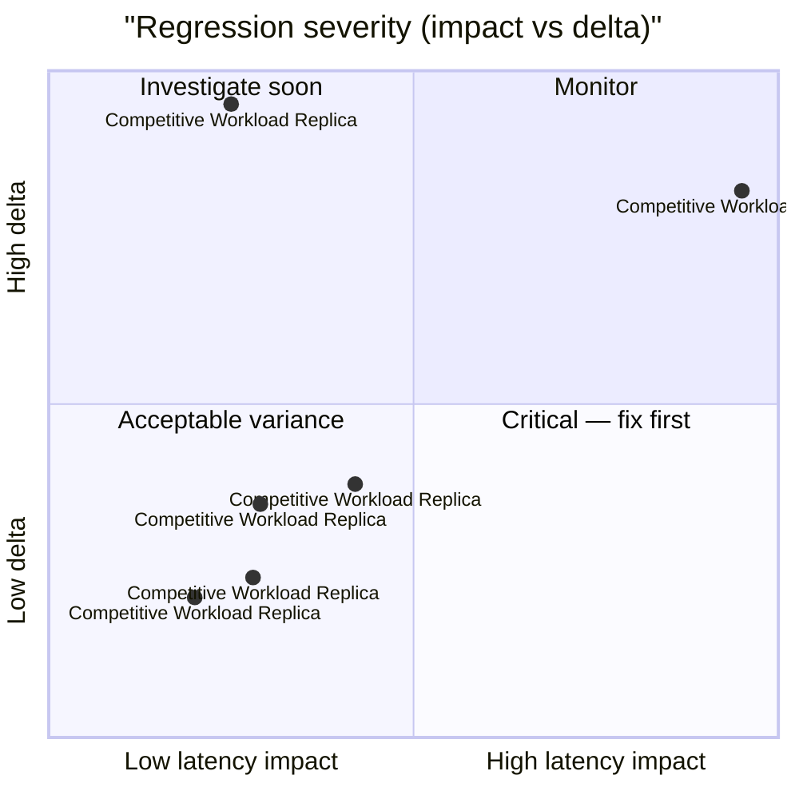

# 🚀 MongoDB Performance Ledger

> [!NOTE] Competitive comparisons based on publicly available documentation as of June 2026. All SveltyCMS metrics self-measured via `bun test tests/benchmarks/`.

> [!IMPORTANT]
> **Console-only by default.** Use `BENCHMARK_RECORD=1` to write results to this report.
>
> ```bash
> BENCHMARK_RECORD=1 bun test tests/benchmarks/auth-performance.test.ts
> ```
>
> The full matrix runner (`bun run scripts/benchmark-matrix/index.ts --sql`) always records.

<!-- BENCHMARK_START -->

<!-- EXECUTIVE_START -->
<!-- LATEST_AUDIT_HEADER -->

## 📊 Latest Performance Audit

<!-- EXECUTIVE_FIX_NOTES_START -->

### 📝 Fix Overlays

> [!NOTE]
> Phase notes and remediation entries appear here after matrix or surgical runs.

<!-- EXECUTIVE_FIX_NOTES_END -->

> [!NOTE]
> **Partial update** — dimension rollups and issues reflect only tests invoked in this run.

**✅ PASS** _(partial invocation)_ · 1/39 tests · 38 skipped · **mongodb** · standalone run

### Dimension health

| Dimension      | Tests | Status | Worst Δ | Issues |
| -------------- | ----: | ------ | ------- | ------ |
| **Core**       |    10 | 🟢     | -46%    | 0      |
| **API**        |     0 | ⚪     | —       | 0      |
| **Scale**      |     0 | ⚪     | —       | 0      |
| **Resilience** |     0 | ⚪     | —       | 0      |

### Issues (action required)

> ✅ **All clear** — no regressions or budget violations detected.

### Executive latency matrix

| Scenario                         | Latency  | Trend                                      | Budget | Result |
| -------------------------------- | -------- | ------------------------------------------ | ------ | ------ |
| **Competitive Workload Replica** | 1.502ms  | ⚪ stable at 1.79ms (±0.864ms) (2 runs)    | < 5ms  | 🟢     |
| **Competitive Workload Replica** | 5.198ms  | 🟢 faster: 8.37ms → 5.20ms (-38%) (2 runs) | < 5ms  | 🟢     |
| **Competitive Workload Replica** | 2.204ms  | ⚪ stable at 2.68ms (±2.35ms) (2 runs)     | < 5ms  | 🟢     |
| **Competitive Workload Replica** | 1.304ms  | ⚪ stable at 2.44ms (±2.06ms) (2 runs)     | < 5ms  | 🟢     |
| **Competitive Workload Replica** | 1.476ms  | ⚪ stable at 1.67ms (±0.379ms) (2 runs)    | < 5ms  | 🟢     |
| **Competitive Workload Replica** | 1.028ms  | ⚪ stable at 1.14ms (±0.369ms) (2 runs)    | < 5ms  | 🟢     |
| **Competitive Workload Replica** | 3.792ms  | ⚪ established at 3.79ms (1 run)           | < 5ms  | 🟢     |
| **Competitive Workload Replica** | 7.222ms  | ⚪ established at 7.22ms (1 run)           | < 5ms  | 🟢     |
| **Competitive Workload Replica** | 8.489ms  | ⚪ established at 8.49ms (1 run)           | < 5ms  | 🟢     |
| **Competitive Workload Replica** | 10.562ms | ⚪ established at 10.56ms (1 run)          | < 5ms  | 🟢     |

### Historical pulse

> **Scope:** Sparklines only — full run tables: [`tests/benchmarks/results/history.sqlite`](../../../tests/benchmarks/results/history.sqlite)

| Metric                                               | Trend | Sparkline | Latest    |
| ---------------------------------------------------- | ----- | --------- | --------- |
| cold start phased (Cold Start (IDLE → READY)) (cold) | 🟢    | `▁`       | 997.648ms |
| database performance (BULK INSERT (100)) (warm)      | 🟢    | `▁`       | 2.891ms   |

<details>
<summary>📈 Latency trend chart (last 10 runs)</summary>

```mermaid
xychart-beta
  title "mongodb REST p95 (last 10 runs)"
  x-axis ["R1", "R2", "R3", "R4", "R5", "R6", "R7", "R8", "R9", "R10"]
  y-axis "Latency (ms)"
  line "p95" : [0.000, 0.000, 0.000, 0.000, 0.000, 0.000, 0.000, 0.000, 0.000, 0.000]
```

</details>
<details>
<summary>📊 Regression severity matrix (quadrant)</summary>



</details>

<!-- EXECUTIVE_PARTIAL_WATERMARK -->

<!-- EXECUTIVE_ALERTS_START -->
<!-- EXECUTIVE_ALERTS_END -->

<!-- EXECUTIVE_END -->

<!-- SUMMARY_START -->

<!-- SUMMARY_RUN_OVERLAY_START -->

### Current Run Summary (2026-08-25)

> **Scope:** Only tests that ran in THIS invocation.

> ⚠️ Executive PASS/FAIL reflects the last full matrix run.

**Run ID:** `4204918e-153d-4ca1-aa50-ab54720d19d9` · **Tests invoked:** 1 · **Metrics:** 10 · **DB:** mongodb

| Test                         | Metric                                   | Avg (ms) | p95 (ms) | RPS  | Trend | Detail                                     |
| ---------------------------- | ---------------------------------------- | -------- | -------- | ---- | ----- | ------------------------------------------ |
| Competitive Workload Replica | findById (Concurrent 8c)                 | 1.502    | 2.600    | 3047 | 🟢    | ⚪ stable at 1.79ms (±0.864ms) (2 runs)    |
| Competitive Workload Replica | listPlain (Concurrent 8c)                | 2.204    | 4.002    | 2034 | 🟢    | ⚪ stable at 2.68ms (±2.35ms) (2 runs)     |
| Competitive Workload Replica | listFilterSort (Concurrent 8c)           | 1.304    | 2.472    | 3523 | 🟢    | ⚪ stable at 2.44ms (±2.06ms) (2 runs)     |
| Competitive Workload Replica | listLarge (Concurrent 8c)                | 1.476    | 3.685    | 3247 | 🟢    | ⚪ stable at 1.67ms (±0.379ms) (2 runs)    |
| Competitive Workload Replica | findMissing (Concurrent 8c)              | 1.028    | 1.833    | 4448 | 🟢    | ⚪ stable at 1.14ms (±0.369ms) (2 runs)    |
| Competitive Workload Replica | GraphQL Collection Query (Concurrent 8c) | 3.792    | 5.822    | 2054 | 🟢    | ⚪ established at 3.79ms (1 run)           |
| Competitive Workload Replica | create (Concurrent 8c)                   | 7.222    | 10.315   | 1071 | 🟢    | ⚪ established at 7.22ms (1 run)           |
| Competitive Workload Replica | update (Concurrent 8c)                   | 8.489    | 12.031   | 930  | 🟢    | ⚪ established at 8.49ms (1 run)           |
| Competitive Workload Replica | mixed (Concurrent 8c 50/50)              | 10.562   | 16.254   | 703  | 🟢    | ⚪ established at 10.56ms (1 run)          |
| Competitive Workload Replica | findByIdRandom (Concurrent 8c)           | 5.198    | 7.867    | 1364 | ⚪    | 🟢 faster: 8.37ms → 5.20ms (-38%) (2 runs) |

<!-- SUMMARY_RUN_OVERLAY_END -->

<!-- SUMMARY_HISTORY_START -->

### Historical Trends (2026-08-25)

> **Scope:** Sparklines only — full run tables live in `history.sqlite` (link below). Runs = sparkline bar count.

**Detail:** [`tests/benchmarks/results/history.sqlite`](../../../tests/benchmarks/results/history.sqlite) · `SELECT test_id, phase, avg_ms, p95_ms, rps, timestamp FROM runs WHERE db_type='mongodb' AND redis=0 ORDER BY timestamp DESC`

**Series:** 8 · **DB:** mongodb

| Metric                              | Trend | Sparkline (last 7) | Latest    |
| ----------------------------------- | ----- | ------------------ | --------- |
| CACHE PERFORMANCE (warm)            | 🟢    | `▁`                | 0.250ms   |
| COLD START PHASED (cold)            | 🟢    | `▁`                | 997.648ms |
| DATABASE PERFORMANCE (warm)         | 🟢    | `▁▁█▁▁▁▁`          | 0.136ms   |
| HOOKS PERFORMANCE (warm)            | 🟢    | `▄█▃▁▁`            | 0.230ms   |
| TRANSACTION ACID (warm)             | 🟢    | `▁█`               | 0.339ms   |
| TRUTH LATENCY (warm)                | 🟢    | `█▁▁`              | 0.000ms   |
| COMPETITIVE WORKLOAD REPLICA (warm) | ⚪    | `▄▁▁▁▂█▆`          | 8.489ms   |
| REST API PERFORMANCE (warm)         | ⚪    | `▆█▇▁`             | 0.857ms   |

<!-- SUMMARY_HISTORY_END --><!-- SUMMARY_END -->

<!-- LEDGER_START -->

## 🔬 Full benchmark ledger (35 modules)

Expand dimension groups, then any row, for ASCII truth tables. Executive summary above shows pass/fail and issues only.

<!-- LEDGER_DIMENSION:CORE:START -->

<details id="ledger-dimension-core">
<summary><strong>Core</strong> · 16 tests</summary>

<!-- SECTION:API_LATENCY:START -->

<details id="section-api_latency">
<summary><strong>🏷️ API LAYER LATENCY</strong> · 🟢 3.639ms · ➡️ recorded (awaiting trend) · <a href="../../../tests/benchmarks/api-latency.test.ts">source</a></summary>

<!-- LEDGER_TRUTH_START -->

```text
╔═════════════════════════════════════════════════════════════════════════════════════════╗
║                             SVELTYCMS  —  API LAYER LATENCY                             ║
║                       File: tests/benchmarks/api-latency.test.ts                        ║
║                                Ran: 2026-08-23 22:13:14                                 ║
║       Cold full-pipeline findById + warm TURBO-HIT path after responseCache fill.       ║
╠═════════════════════════════════════════════════════════════════════════════════════════╣
║ HTTP: findById @ 8c            │        3.639 ms │ p95:        4.867 ms │ RPS:      1,949 ║
║ HTTP: findById TURBO-HIT @ 8c  │        1.106 ms │ p95:        1.920 ms │ RPS:      4,184 ║
╚═════════════════════════════════════════════════════════════════════════════════════════╝
```

<!-- LEDGER_TRUTH_END -->

</details>
<!-- SECTION:API_LATENCY:END -->

<!-- SECTION:COLD_START:START -->
<details id="section-cold_start">
<summary><strong>🏷️ cold start phased</strong> · 🟢 997.648ms · ➡️ ⚪ established at 997.65ms (1 run) (2026-08-25 11:26:59) · <a href="../../../tests/benchmarks/cold-start-phased.test.ts">source</a></summary>
<!-- LEDGER_TRUTH_START -->
```text
╔═════════════════════════════════════════════════════════════════════════════════════════╗
║                           SVELTYCMS — PHASED COLD START AUDIT                           ║
║                    File: tests/benchmarks/cold-start-phased.test.ts                     ║
║                                Ran: 2026-08-25 11:26:59                                 ║
║       Measures server cold-start latency to READY state, using the built server.        ║
╠═════════════════════════════════════════════════════════════════════════════════════════╣
║ Cold Start (IDLE → READY)      │      997.648 ms │ p95:     1878.153 ms │ RPS:          0 ║
╚═════════════════════════════════════════════════════════════════════════════════════════╝
```
<!-- LEDGER_TRUTH_END -->

</details>
<!-- SECTION:COLD_START:END -->

<!-- SECTION:TRUTH_AUDIT:START -->

<details id="section-truth_audit">
<summary><strong>🏷️ SRE TRUTH AUDIT</strong> · ⚪ ⏳ pending · ➡️ pending · <a href="../../../tests/benchmarks/truth-latency.test.ts">source</a></summary>

<!-- LEDGER_TRUTH_START -->

```text
╔═════════════════════════════════════════════════════════════════════════════════════════╗
║                               SVELTYCMS — SRE TRUTH AUDIT                               ║
║                      File: tests/benchmarks/truth-latency.test.ts                       ║
║                                Ran: 2026-08-25 11:27:04                                 ║
║     Validates performance claims by comparing SDK, Middleware, and Real HTTP Stack      ║
╠═════════════════════════════════════════════════════════════════════════════════════════╣
║ Logic Baseline                 │        0.000 ms │ p95:        0.000 ms │ RPS:    992,369 ║
║ Local SDK (Full)               │        0.003 ms │ p95:        0.005 ms │ RPS:    263,452 ║
║ HTTP End-to-End                │        0.296 ms │ p95:        0.352 ms │ RPS:      3,367 ║
╚═════════════════════════════════════════════════════════════════════════════════════════╝
```

<!-- LEDGER_TRUTH_END -->

</details>
<!-- SECTION:TRUTH_AUDIT:END -->

<!-- SECTION:INCREMENTAL:START -->

<details id="section-incremental">
<summary><strong>🏷️ Incremental Content Reload</strong> · 🟢 0.327ms · ➡️ recorded (awaiting trend) · <a href="../../../tests/benchmarks/content-incremental-reload.test.ts">source</a></summary>

<!-- LEDGER_TRUTH_START -->

```text
╔═════════════════════════════════════════════════════════════════════════════════════════╗
║                      SVELTYCMS — INCREMENTAL CONTENT RELOAD AUDIT                       ║
║                File: tests/benchmarks/content-incremental-reload.test.ts                ║
║                                Ran: 2026-08-23 22:17:54                                 ║
║          Measures surgical single-file fullReload vs full reconciliation path           ║
╠═════════════════════════════════════════════════════════════════════════════════════════╣
║ Incremental fullReload (1 file) │        0.327 ms │ p95:        0.639 ms │ RPS:      3,021 ║
║ Full Reconciliation Reload     │        0.322 ms │ p95:        0.431 ms │ RPS:      3,083 ║
╚═════════════════════════════════════════════════════════════════════════════════════════╝
```

<!-- LEDGER_TRUTH_END -->

</details>
<!-- SECTION:INCREMENTAL:END -->

<!-- SECTION:STATE_MACHINE:START -->

<details id="section-state_machine">
<summary><strong>🏷️ State Machine Transitions</strong> · 🟢 32.378ms · ➡️ recorded (awaiting trend) · <a href="../../../tests/benchmarks/state-machine-transition.test.ts">source</a></summary>

<!-- LEDGER_TRUTH_START -->

```text
╔═════════════════════════════════════════════════════════════════════════════════════════╗
║                           SVELTYCMS — STATE MACHINE INTEGRITY                           ║
║                 File: tests/benchmarks/state-machine-transition.test.ts                 ║
║                                Ran: 2026-08-23 22:17:58                                 ║
║Simulates rapid system re-initializations and verifies valid self-healing state transitions under stress.║
╠═════════════════════════════════════════════════════════════════════════════════════════╣
║ State Transition (READY -> IDLE -> READY) │       32.378 ms │ p95:       43.207 ms │ RPS:         31 ║
╚═════════════════════════════════════════════════════════════════════════════════════════╝
```

<!-- LEDGER_TRUTH_END -->

</details>
<!-- SECTION:STATE_MACHINE:END -->

<!-- SECTION:DB_RAW_P95:START -->
<details id="section-db_raw_p95">
<summary><strong>🏷️ database performance</strong> · 🟢 9.767ms · ➡️ ⚪ established at 9.77ms (1 run) (2026-08-25 11:29:25) · <a href="../../../tests/benchmarks/database-performance.test.ts">source</a></summary>
<!-- LEDGER_TRUTH_START -->
```text
╔═════════════════════════════════════════════════════════════════════════════════════════╗
║                   SVELTYCMS — DATABASE ADAPTER PERFORMANCE (MONGODB)                    ║
║                   File: tests/benchmarks/database-performance.test.ts                   ║
║                                Ran: 2026-08-25 11:29:25                                 ║
║   Measures raw CRUD performance, indexing efficiency, and connection pool resilience    ║
╠═════════════════════════════════════════════════════════════════════════════════════════╣
║ INSERT                         │        0.090 ms │ p95:        0.213 ms │ RPS:      8,432 ║
║ FIND ONE                       │        0.110 ms │ p95:        0.211 ms │ RPS:      7,853 ║
║ FIND MANY (limit 50)           │        0.279 ms │ p95:        0.459 ms │ RPS:      3,109 ║
║ QUERY BUILDER LIST (50)        │        0.067 ms │ p95:        0.098 ms │ RPS:     12,988 ║
║ FIND PAGE (50 hasMore)         │        0.289 ms │ p95:        0.442 ms │ RPS:      3,106 ║
║ FIND PAGE keyset               │        0.248 ms │ p95:        0.395 ms │ RPS:      3,642 ║
║ FIND MANY offset 50            │        0.197 ms │ p95:        0.281 ms │ RPS:      4,575 ║
║ LIST+COUNT (legacy)            │        3.858 ms │ p95:        5.577 ms │ RPS:        248 ║
║ UPDATE                         │        0.197 ms │ p95:        0.303 ms │ RPS:      4,691 ║
║ UPDATE (no-returning)          │        0.136 ms │ p95:        0.228 ms │ RPS:      6,586 ║
║ NATIVE UPSERT                  │        0.163 ms │ p95:        0.261 ms │ RPS:      5,607 ║
║ COUNT                          │        2.731 ms │ p95:        5.365 ms │ RPS:        320 ║
║ COUNT ESTIMATE                 │        0.043 ms │ p95:        0.073 ms │ RPS:     20,441 ║
║ COUNT CACHED                   │        0.001 ms │ p95:        0.002 ms │ RPS:    853,426 ║
║ DELETE                         │        0.173 ms │ p95:        0.441 ms │ RPS:      5,531 ║
║ BULK INSERT (100)              │        2.891 ms │ p95:        4.627 ms │ RPS:        296 ║
║ BULK UPDATE (100 heterogeneous) │        9.785 ms │ p95:       14.681 ms │ RPS:         94 ║
║ BULK UPDATE (100 homogeneous)  │        9.767 ms │ p95:       16.223 ms │ RPS:         94 ║
╚═════════════════════════════════════════════════════════════════════════════════════════╝
```
<!-- LEDGER_TRUTH_END -->

</details>
<!-- SECTION:DB_RAW_P95:END -->

<!-- SECTION:ACID:START -->
<details id="section-acid">
<summary><strong>🏷️ transaction acid</strong> · 🟢 0.339ms · ➡️ ⚪ established at 0.339ms (1 run) (2026-08-25 11:29:31) · <a href="../../../tests/benchmarks/transaction-acid.test.ts">source</a></summary>
<!-- LEDGER_TRUTH_START -->
```text
╔═════════════════════════════════════════════════════════════════════════════════════════╗
║                            SVELTYCMS — ACID INTEGRITY AUDIT                             ║
║                     File: tests/benchmarks/transaction-acid.test.ts                     ║
║                                Ran: 2026-08-25 11:29:31                                 ║
║  Measures transaction commit latencies and rollback overhead across database adapters   ║
╠═════════════════════════════════════════════════════════════════════════════════════════╣
║ TX Commit                      │        0.001 ms │ p95:        0.003 ms │ RPS:  1,075,186 ║
║ TX Rollback Integrity          │        0.339 ms │ p95:        0.727 ms │ RPS:      2,931 ║
╚═════════════════════════════════════════════════════════════════════════════════════════╝
```
<!-- LEDGER_TRUTH_END -->

</details>
<!-- SECTION:ACID:END -->

<!-- SECTION:LOGIC:START -->
<details id="section-logic">
<summary><strong>🏷️ Logic</strong> · 🟢 ⏳ pending · ➡️ ⚪ established at 0ms (1 run) (2026-08-25 11:27:11) · <a href="../../../tests/benchmarks/truth-latency.test.ts">source</a></summary>
<!-- LEDGER_TRUTH_START -->
> ⏳ Pending
<!-- LEDGER_TRUTH_END -->

</details>
<!-- SECTION:LOGIC:END -->

<!-- SECTION:SDK:START -->
<details id="section-sdk">
<summary><strong>🏷️ SDK</strong> · 🟢 0.003ms · ➡️ ⚪ established at 0.003ms (1 run) (2026-08-25 11:27:11) · <a href="../../../tests/benchmarks/truth-latency.test.ts">source</a></summary>
<!-- LEDGER_TRUTH_START -->
```text
╔═════════════════════════════════════════════════════════════════════════════════════════╗
║                           SVELTYCMS — SDK OVERHEAD TELEMETRY                            ║
║                  File: tests/benchmarks/local-api-performance.test.ts                   ║
║                                Ran: 2026-08-23 22:14:17                                 ║
║  Measures LocalCMS SDK overhead vs direct adapter calls to verify zero-tax dispatching  ║
╠═════════════════════════════════════════════════════════════════════════════════════════╣
║ Direct Adapter Call            │        0.829 ms │ p95:        2.268 ms │ RPS:      1,204 ║
║ LocalCMS SDK Call              │        0.798 ms │ p95:        2.119 ms │ RPS:      1,251 ║
╚═════════════════════════════════════════════════════════════════════════════════════════╝
```
<!-- LEDGER_TRUTH_END -->

</details>
<!-- SECTION:SDK:END -->

<!-- SECTION:HTTP:START -->
<details id="section-http">
<summary><strong>🏷️ HTTP</strong> · 🟢 0.296ms · ➡️ ⚪ established at 0.296ms (1 run) (2026-08-25 11:27:11) · <a href="../../../tests/benchmarks/truth-latency.test.ts">source</a></summary>
<!-- LEDGER_TRUTH_START -->
> ⏳ Pending
<!-- LEDGER_TRUTH_END -->

</details>
<!-- SECTION:HTTP:END -->

<!-- SECTION:UNKNOWN:START -->
<details id="section-unknown">
<summary><strong>🏷️ unknown</strong> · 🟢 0.002ms · ➡️ recorded (awaiting trend) · <a href="../../../tests/benchmarks/transaction-acid.test.ts">source</a></summary>
<!-- LEDGER_TRUTH_START -->
```text
╔═════════════════════════════════════════════════════════════════════════════════════════╗
║                      SVELTYCMS — CACHE EVICTION BOUNDARY HARDENING                      ║
║                                      File: unknown                                      ║
║                                Ran: 2026-08-23 22:17:47                                 ║
╠═════════════════════════════════════════════════════════════════════════════════════════╣
║ Cache Flooding & Eviction      │        0.002 ms │ p95:        0.002 ms │ RPS:    473,175 ║
╚═════════════════════════════════════════════════════════════════════════════════════════╝
```
<!-- LEDGER_TRUTH_END -->

</details>
<!-- SECTION:UNKNOWN:END -->

<!-- SECTION:CACHE:START -->
<details id="section-cache">
<summary><strong>🏷️ Cache</strong> · 🟢 0.250ms · ➡️ ⚪ established at 0.250ms (1 run) (2026-08-25 11:29:37) · <a href="../../../tests/benchmarks/cache-performance.test.ts">source</a></summary>
<!-- LEDGER_TRUTH_START -->
```text
╔═════════════════════════════════════════════════════════════════════════════════════════╗
║                           SVELTYCMS — CACHE EFFICIENCY AUDIT                            ║
║                    File: tests/benchmarks/cache-performance.test.ts                     ║
║                                Ran: 2026-08-25 11:29:37                                 ║
║  Measures cache hit vs miss latency and efficiency via real HTTP end-to-end requests.   ║
╠═════════════════════════════════════════════════════════════════════════════════════════╣
║ Cache Miss (Bypass)            │        0.250 ms │ p95:        0.511 ms │ RPS:      3,478 ║
╚═════════════════════════════════════════════════════════════════════════════════════════╝
```
<!-- LEDGER_TRUTH_END -->

</details>
<!-- SECTION:CACHE:END -->

<!-- SECTION:MIDDLEWARE:START -->
<details id="section-middleware">
<summary><strong>🏷️ Middleware</strong> · 🟢 0.884ms · ➡️ ⚪ established at 0.884ms (1 run) (2026-08-25 11:29:47) · <a href="../../../tests/benchmarks/hooks-performance.test.ts">source</a></summary>
<!-- LEDGER_TRUTH_START -->
> ⏳ Pending
<!-- LEDGER_TRUTH_END -->

</details>
<!-- SECTION:MIDDLEWARE:END -->

<!-- SECTION:SYSTEM:START -->
<details id="section-system">
<summary><strong>🏷️ System</strong> · 🟢 0.857ms · ➡️ ⚪ established at 0.857ms (1 run) (2026-08-25 11:29:52) · <a href="../../../tests/benchmarks/rest-api-performance.test.ts">source</a></summary>
<!-- LEDGER_TRUTH_START -->
> ⏳ Pending
<!-- LEDGER_TRUTH_END -->

</details>
<!-- SECTION:SYSTEM:END -->

<!-- SECTION:METADATA:START -->
<details id="section-metadata">
<summary><strong>🏷️ Metadata</strong> · 🟢 1.307ms · ➡️ ⚪ established at 1.31ms (1 run) (2026-08-25 11:29:52) · <a href="../../../tests/benchmarks/rest-api-performance.test.ts">source</a></summary>
<!-- LEDGER_TRUTH_START -->
> ⏳ Pending
<!-- LEDGER_TRUTH_END -->

</details>
<!-- SECTION:METADATA:END -->

<!-- SECTION:CRUD:START -->
<details id="section-crud">
<summary><strong>🏷️ CRUD</strong> · 🟢 1.273ms · ➡️ ⚪ established at 1.27ms (1 run) (2026-08-25 11:29:52) · <a href="../../../tests/benchmarks/rest-api-performance.test.ts">source</a></summary>
<!-- LEDGER_TRUTH_START -->
> ⏳ Pending
<!-- LEDGER_TRUTH_END -->

</details>
<!-- SECTION:CRUD:END -->

</details>

<!-- LEDGER_DIMENSION:CORE:END -->

<!-- LEDGER_DIMENSION:API:START -->

<details id="ledger-dimension-api">
<summary><strong>API</strong> · 8 tests</summary>

<!-- SECTION:TEMPORAL:START -->

<details id="section-temporal">
<summary><strong>🏷️ Temporal Integrity Audit</strong> · 🟢 4.618ms · ➡️ recorded (awaiting trend) · <a href="../../../tests/benchmarks/temporal-integrity.test.ts">source</a></summary>

<!-- LEDGER_TRUTH_START -->

```text
╔═════════════════════════════════════════════════════════════════════════════════════════╗
║                             SVELTYCMS — TEMPORAL INTEGRITY                              ║
║                    File: tests/benchmarks/temporal-integrity.test.ts                    ║
║                                Ran: 2026-08-23 22:14:58                                 ║
║Validates deterministic UTC normalization of ISO date strings across timezone offsets for consistent persistence.║
╠═════════════════════════════════════════════════════════════════════════════════════════╣
║ Timezone Ingestion             │        4.618 ms │ p95:        4.618 ms │ RPS:        217 ║
╚═════════════════════════════════════════════════════════════════════════════════════════╝
```

<!-- LEDGER_TRUTH_END -->

</details>
<!-- SECTION:TEMPORAL:END -->

<!-- SECTION:RELATIONAL:START -->

<details id="section-relational">
<summary><strong>🏷️ Relational & Nested Queries</strong> · 🟢 2.718ms · ➡️ recorded (awaiting trend) · <a href="../../../tests/benchmarks/relational-performance.test.ts">source</a></summary>

<!-- LEDGER_TRUTH_START -->

```text
╔═════════════════════════════════════════════════════════════════════════════════════════╗
║                          SVELTYCMS — RELATIONAL RESOLVER AUDIT                          ║
║                  File: tests/benchmarks/relational-performance.test.ts                  ║
║                                Ran: 2026-08-23 22:13:56                                 ║
║Measures GraphQL resolver performance for shallow and deep relational queries including joins and nested population.║
╠═════════════════════════════════════════════════════════════════════════════════════════╣
║ Shallow Relational Query       │        2.718 ms │ p95:        3.953 ms │ RPS:      1,890 ║
║ Deep Relational Query          │        1.551 ms │ p95:        2.603 ms │ RPS:      1,590 ║
╚═════════════════════════════════════════════════════════════════════════════════════════╝
```

<!-- LEDGER_TRUTH_END -->

</details>
<!-- SECTION:RELATIONAL:END -->

<!-- SECTION:AUTH_TRACE:START -->

<details id="section-auth_trace">
<summary><strong>🏷️ Auth & RBAC Performance</strong> · 🟢 0.299ms · ➡️ recorded (awaiting trend) · <a href="../../../tests/benchmarks/auth-performance.test.ts">source</a></summary>

<!-- LEDGER_TRUTH_START -->

```text
╔═════════════════════════════════════════════════════════════════════════════════════════╗
║                          SVELTYCMS — AUTHENTICATION TELEMETRY                           ║
║                     File: tests/benchmarks/auth-performance.test.ts                     ║
║                                Ran: 2026-08-23 22:13:17                                 ║
║             Authentication & RBAC Pipeline Benchmark (Production Optimized)             ║
╠═════════════════════════════════════════════════════════════════════════════════════════╣
║ Auth Validation @ 1c           │        0.299 ms │ p95:        0.409 ms │ RPS:      3,038 ║
║ HTTP Auth Pipeline @ 8c        │        1.042 ms │ p95:        1.759 ms │ RPS:      4,529 ║
╚═════════════════════════════════════════════════════════════════════════════════════════╝
```

<!-- LEDGER_TRUTH_END -->

</details>
<!-- SECTION:AUTH_TRACE:END -->

<!-- SECTION:REST:START -->

<details id="section-rest">
<summary><strong>🏷️ REST API Performance</strong> · 🟢 0.857ms · ➡️ recorded (awaiting trend) · <a href="../../../tests/benchmarks/rest-api-performance.test.ts">source</a></summary>

<!-- LEDGER_TRUTH_START -->

```text
╔═════════════════════════════════════════════════════════════════════════════════════════╗
║                          SVELTYCMS — ENTERPRISE REST API AUDIT                          ║
║                   File: tests/benchmarks/rest-api-performance.test.ts                   ║
║                                Ran: 2026-08-25 11:29:52                                 ║
║Measures latency, throughput, and correctness of core REST endpoints: health check, schema, CRUD list, and search.║
╠═════════════════════════════════════════════════════════════════════════════════════════╣
║ Health Check                   │        0.857 ms │ p95:        2.267 ms │ RPS:      7,886 ║
║ Collection Schema              │        1.307 ms │ p95:        2.506 ms │ RPS:      5,151 ║
║ Collection Find (List)         │        1.167 ms │ p95:        2.118 ms │ RPS:      5,755 ║
║ Collection Search              │        1.273 ms │ p95:        2.340 ms │ RPS:      5,233 ║
╚═════════════════════════════════════════════════════════════════════════════════════════╝
```

<!-- LEDGER_TRUTH_END -->

</details>
<!-- SECTION:REST:END -->

<!-- SECTION:GRAPHQL:START -->

<details id="section-graphql">
<summary><strong>🏷️ GraphQL API Performance</strong> · 🟢 0.991ms · ➡️ recorded (awaiting trend) · <a href="../../../tests/benchmarks/graphql-api-performance.test.ts">source</a></summary>

<!-- LEDGER_TRUTH_START -->

```text
╔═════════════════════════════════════════════════════════════════════════════════════════╗
║                          SVELTYCMS — GRAPHQL PERFORMANCE AUDIT                          ║
║                 File: tests/benchmarks/graphql-api-performance.test.ts                  ║
║                                Ran: 2026-08-23 22:13:25                                 ║
║              Measures GraphQL resolver performance across query scenarios,              ║
╠═════════════════════════════════════════════════════════════════════════════════════════╣
║ GQL: System Health [cold]      │        0.991 ms │ p95:        1.705 ms │ RPS:      1,005 ║
║ GQL: System Health [hot]       │        0.903 ms │ p95:        1.567 ms │ RPS:      1,105 ║
║ GQL: Collection List [cold]    │        2.861 ms │ p95:        3.795 ms │ RPS:      1,869 ║
║ GQL: Collection List [hot]     │        2.748 ms │ p95:        3.711 ms │ RPS:      1,955 ║
║ GQL: Concurrent Load [cold]    │        2.310 ms │ p95:        3.219 ms │ RPS:      1,970 ║
║ GQL: Concurrent Load [hot]     │        2.233 ms │ p95:        3.089 ms │ RPS:      2,018 ║
╚═════════════════════════════════════════════════════════════════════════════════════════╝
```

<!-- LEDGER_TRUTH_END -->

</details>
<!-- SECTION:GRAPHQL:END -->

<!-- SECTION:SEO:START -->

<details id="section-seo">
<summary><strong>🏷️ Enterprise SEO Suite Audit</strong> · 🟢 0.950ms · ➡️ recorded (awaiting trend) · <a href="../../../tests/benchmarks/seo-performance.test.ts">source</a></summary>

<!-- LEDGER_TRUTH_START -->

```text
╔═════════════════════════════════════════════════════════════════════════════════════════╗
║                            SVELTYCMS — ENTERPRISE SEO AUDIT                             ║
║                     File: tests/benchmarks/seo-performance.test.ts                      ║
║                                Ran: 2026-08-23 22:14:00                                 ║
║Measures redirect lookup latency, dynamic sitemap.xml generation, robots.txt serving, and 404 logging performance.║
╠═════════════════════════════════════════════════════════════════════════════════════════╣
║ Redirect Lookup (301)          │        0.950 ms │ p95:        2.296 ms │ RPS:      5,365 ║
║ Dynamic Sitemap XML            │        0.626 ms │ p95:        1.393 ms │ RPS:      7,979 ║
║ Robots.txt Generation          │        1.842 ms │ p95:        3.268 ms │ RPS:      3,357 ║
║ Missing Path (404 Log)         │        3.757 ms │ p95:        5.261 ms │ RPS:      1,838 ║
╚═════════════════════════════════════════════════════════════════════════════════════════╝
```

<!-- LEDGER_TRUTH_END -->

</details>
<!-- SECTION:SEO:END -->

<!-- SECTION:BROADCAST:START -->

<details id="section-broadcast">
<summary><strong>🏷️ REAL-TIME BROADCAST AUDIT</strong> · 🟢 0.243ms · ➡️ recorded (awaiting trend) · <a href="../../../tests/benchmarks/websocket-broadcast.test.ts">source</a></summary>

<!-- LEDGER_TRUTH_START -->

```text
╔═════════════════════════════════════════════════════════════════════════════════════════╗
║                        SVELTYCMS — YJS COLLABORATION SYNC AUDIT                         ║
║                   File: tests/benchmarks/websocket-broadcast.test.ts                    ║
║                                Ran: 2026-08-23 22:19:11                                 ║
║   Measures end-to-end Yjs update propagation latency and connection handshake timing.   ║
╠═════════════════════════════════════════════════════════════════════════════════════════╣
║ Yjs CRDT Update Sync           │        0.243 ms │ p95:        0.387 ms │ RPS:      4,023 ║
╚═════════════════════════════════════════════════════════════════════════════════════════╝
```

<!-- LEDGER_TRUTH_END -->

</details>
<!-- SECTION:BROADCAST:END -->

<!-- SECTION:REAL_TIME:START -->

<details id="section-real_time">
<summary><strong>🏷️ WebSocket & Realtime Latency</strong> · ⏳ pending · ➡️ baseline · <a href="../../../tests/benchmarks/realtime-performance.test.ts">source</a></summary>

<!-- LEDGER_TRUTH_START -->

> ⏳ Pending — Benchmarks WebSocket connection/broadcast latency.

<!-- LEDGER_TRUTH_END -->

</details>
<!-- SECTION:REAL_TIME:END -->

</details>

<!-- LEDGER_DIMENSION:API:END -->

<!-- LEDGER_DIMENSION:SCALE:START -->

<details id="ledger-dimension-scale">
<summary><strong>Scale</strong> · 15 tests</summary>

<!-- SECTION:NEGATIVE_CACHE:START -->

<details id="section-negative_cache">
<summary><strong>🏷️ Negative Cache Performance</strong> · 🟢 0.853ms · ➡️ recorded (awaiting trend) · <a href="../../../tests/benchmarks/negative-cache.test.ts">source</a></summary>

<!-- LEDGER_TRUTH_START -->

```text
╔═════════════════════════════════════════════════════════════════════════════════════════╗
║                           SVELTYCMS — CACHE EFFICIENCY AUDIT                            ║
║                    File: tests/benchmarks/cache-performance.test.ts                     ║
║                                Ran: 2026-07-04 08:18:53                                 ║
║  Measures cache hit vs miss latency and efficiency via real HTTP end-to-end requests.   ║
╠═════════════════════════════════════════════════════════════════════════════════════════╣
║ Cache Miss (Bypass)            │        0.853 ms │ p95:        1.168 ms │ RPS:      1,035 ║
╚═════════════════════════════════════════════════════════════════════════════════════════╝
```

<!-- LEDGER_TRUTH_END -->

</details>
<!-- SECTION:NEGATIVE_CACHE:END -->

<!-- SECTION:MEMORY:START -->

<details id="section-memory">
<summary><strong>🏷️ Memory Stability & GC Behavior</strong> · ⏳ pending · ➡️ baseline · <a href="../../../tests/benchmarks/memory-stability.test.ts">source</a></summary>

<!-- LEDGER_TRUTH_START -->

> ⏳ Pending — Long-running soak test to identify memory leaks and GC pressure.

<!-- LEDGER_TRUTH_END -->

</details>
<!-- SECTION:MEMORY:END -->

<!-- SECTION:TENANCY:START -->

<details id="section-tenancy">
<summary><strong>🏷️ Multi-Tenant Performance & Isolation</strong> · ⏳ pending · ➡️ baseline · <a href="../../../tests/benchmarks/multi-tenant-performance.test.ts">source</a></summary>

<!-- LEDGER_TRUTH_START -->

> ⏳ Pending — Stress-tests cross-tenant isolation and security boundary latency.

<!-- LEDGER_TRUTH_END -->

</details>
<!-- SECTION:TENANCY:END -->

<!-- SECTION:MIXED:START -->

<details id="section-mixed">
<summary><strong>🏷️ Realistic Mixed Workload</strong> · 🟢 1.371ms · ➡️ recorded (awaiting trend) · <a href="../../../tests/benchmarks/mixed-workload.test.ts">source</a></summary>

<!-- LEDGER_TRUTH_START -->

```text
╔═════════════════════════════════════════════════════════════════════════════════════════╗
║                            SVELTYCMS — MIXED WORKLOAD AUDIT                             ║
║                      File: tests/benchmarks/mixed-workload.test.ts                      ║
║                                Ran: 2026-08-23 22:14:04                                 ║
║Simulates real-world traffic with a weighted mix of reads, searches, GraphQL queries, and metadata requests.║
╠═════════════════════════════════════════════════════════════════════════════════════════╣
║ Mixed Workload                 │        1.371 ms │ p95:        2.629 ms │ RPS:      3,367 ║
╚═════════════════════════════════════════════════════════════════════════════════════════╝
```

<!-- LEDGER_TRUTH_END -->

</details>
<!-- SECTION:MIXED:END -->

<!-- SECTION:GQL_STRESS:START -->

<details id="section-gql_stress">
<summary><strong>🏷️ GraphQL Load Stress</strong> · 🟢 2.714ms · ➡️ recorded (awaiting trend) · <a href="../../../tests/benchmarks/graphql-stress.test.ts">source</a></summary>

<!-- LEDGER_TRUTH_START -->

```text
╔═════════════════════════════════════════════════════════════════════════════════════════╗
║                         SVELTYCMS — GRAPHQL CAPACITY DISCOVERY                          ║
║                      File: tests/benchmarks/graphql-stress.test.ts                      ║
║                                Ran: 2026-08-23 22:13:33                                 ║
║  Discovers the server's maximum sustainable GraphQL throughput by ramping concurrency   ║
╠═════════════════════════════════════════════════════════════════════════════════════════╣
║ GQL: 5c Warmup                 │        2.714 ms │ p95:        3.842 ms │ RPS:      1,483 ║
║ GQL: 10c Light                 │        4.585 ms │ p95:        5.977 ms │ RPS:      1,813 ║
║ GQL: 20c Moderate              │        8.486 ms │ p95:       12.019 ms │ RPS:      1,987 ║
║ GQL: 40c Heavy                 │       22.414 ms │ p95:       36.258 ms │ RPS:      1,380 ║
║ GQL: 60c Stress                │       30.270 ms │ p95:       46.933 ms │ RPS:      1,481 ║
║ GQL: 80c Extreme               │       35.992 ms │ p95:       50.398 ms │ RPS:      1,573 ║
║ GQL: 100c Max                  │       42.818 ms │ p95:       60.642 ms │ RPS:      1,625 ║
╚═════════════════════════════════════════════════════════════════════════════════════════╝
```

<!-- LEDGER_TRUTH_END -->

</details>
<!-- SECTION:GQL_STRESS:END -->

<!-- SECTION:MIGRATION:START -->

<details id="section-migration">
<summary><strong>🏷️ Bulk Migration & Scale</strong> · 🟢 25.420ms · ➡️ recorded (awaiting trend) · <a href="../../../tests/benchmarks/migration-scale.test.ts">source</a></summary>

<!-- LEDGER_TRUTH_START -->

```text
╔═════════════════════════════════════════════════════════════════════════════════════════╗
║                           SVELTYCMS — MIGRATION & SCALE AUDIT                           ║
║                     File: tests/benchmarks/migration-scale.test.ts                      ║
║                                Ran: 2026-08-23 22:18:43                                 ║
║Measures bulk ingestion throughput for 10,000 entries and post-migration random lookup performance.║
╠═════════════════════════════════════════════════════════════════════════════════════════╣
║ Bulk Migration (10k)           │       25.420 ms │ p95:       30.773 ms │ RPS:         39 ║
║ Post-Migration Read            │        1.230 ms │ p95:        2.451 ms │ RPS:      2,993 ║
╚═════════════════════════════════════════════════════════════════════════════════════════╝
```

<!-- LEDGER_TRUTH_END -->

</details>
<!-- SECTION:MIGRATION:END -->

<!-- SECTION:INDEX_PRESSURE:START -->

<details id="section-index_pressure">
<summary><strong>🏷️ Million-Row Index Pressure</strong> · 🟢 0.910ms · ➡️ recorded (awaiting trend) · <a href="../../../tests/benchmarks/index-pressure.test.ts">source</a></summary>

<!-- LEDGER_TRUTH_START -->

```text
╔═════════════════════════════════════════════════════════════════════════════════════════╗
║                           SVELTYCMS  —  INDEX PRESSURE AUDIT                            ║
║                      File: tests/benchmarks/index-pressure.test.ts                      ║
║                                Ran: 2026-08-23 22:15:12                                 ║
║    Measures read performance with sorting and filtering on a large entry collection.    ║
╠═════════════════════════════════════════════════════════════════════════════════════════╣
║ Sorted List (25k rows)         │        0.910 ms │ p95:        1.450 ms │ RPS:      2,939 ║
║ Filtered Query (25k rows)      │        0.892 ms │ p95:        1.400 ms │ RPS:      2,954 ║
╚═════════════════════════════════════════════════════════════════════════════════════════╝
```

<!-- LEDGER_TRUTH_END -->

</details>
<!-- SECTION:INDEX_PRESSURE:END -->

<!-- SECTION:CONTENT_STRESS:START -->

<details id="section-content_stress">
<summary><strong>🏷️ Content Scale Stress</strong> · 🟢 0.806ms · ➡️ recorded (awaiting trend) · <a href="../../../tests/benchmarks/content-scale-stress.test.ts">source</a></summary>

<!-- LEDGER_TRUTH_START -->

```text
╔═════════════════════════════════════════════════════════════════════════════════════════╗
║                        SVELTYCMS  —  CONTENT SCALE STRESS AUDIT                         ║
║                   File: tests/benchmarks/content-scale-stress.test.ts                   ║
║                                Ran: 2026-08-23 22:17:55                                 ║
║Measures file-scanning and content discovery performance at extreme scale (1,000+ collections)║
╠═════════════════════════════════════════════════════════════════════════════════════════╣
║ Cold Stress Scan (1k)          │        0.806 ms │ p95:        2.927 ms │ RPS:      1,241 ║
║ Warm Stress Scan (1k)          │        0.134 ms │ p95:        0.176 ms │ RPS:      7,199 ║
╚═════════════════════════════════════════════════════════════════════════════════════════╝
```

<!-- LEDGER_TRUTH_END -->

</details>
<!-- SECTION:CONTENT_STRESS:END -->

<!-- SECTION:MEDIA_UPLOAD:START -->

<details id="section-media_upload">
<summary><strong>🏷️ Media Upload Stress & Throughput</strong> · 🟢 2.523ms · ➡️ recorded (awaiting trend) · <a href="../../../tests/benchmarks/media-upload-stress.test.ts">source</a></summary>

<!-- LEDGER_TRUTH_START -->

```text
╔═════════════════════════════════════════════════════════════════════════════════════════╗
║                          SVELTYCMS — MEDIA UPLOAD STRESS AUDIT                          ║
║                   File: tests/benchmarks/media-upload-stress.test.ts                    ║
║                                Ran: 2026-08-23 22:18:26                                 ║
║Measures throughput for large file uploads, concurrent transfers, and streaming efficiency.║
╠═════════════════════════════════════════════════════════════════════════════════════════╣
║ Single Upload (0.1MB)          │        2.523 ms │ p95:        7.088 ms │ RPS:        394 ║
║ Small Upload (20KB)            │        3.101 ms │ p95:        4.136 ms │ RPS:      1,172 ║
╚═════════════════════════════════════════════════════════════════════════════════════════╝
```

<!-- LEDGER_TRUTH_END -->

</details>
<!-- SECTION:MEDIA_UPLOAD:END -->

<!-- SECTION:JOURNEY:START -->

<details id="section-journey">
<summary><strong>🏷️ Full Client Journey Simulation</strong> · 🟢 4.984ms · ➡️ recorded (awaiting trend) · <a href="../../../tests/benchmarks/client-journey.test.ts">source</a></summary>

<!-- LEDGER_TRUTH_START -->

```text
╔═════════════════════════════════════════════════════════════════════════════════════════╗
║                              SVELTYCMS  —  WORLD LIFE DATA                              ║
║                      File: tests/benchmarks/client-journey.test.ts                      ║
║                                Ran: 2026-08-23 22:15:00                                 ║
║Measures cumulative latency of a realistic editorial user workflow: Auth → List → View → Edit → Save.║
╠═════════════════════════════════════════════════════════════════════════════════════════╣
║ Full Journey @ 1c              │        4.984 ms │ p95:        6.788 ms │ RPS:        200 ║
╚═════════════════════════════════════════════════════════════════════════════════════════╝
```

<!-- LEDGER_TRUTH_END -->

</details>
<!-- SECTION:JOURNEY:END -->

<!-- SECTION:CONCURRENCY:START -->

<details id="section-concurrency">
<summary><strong>🏷️ Concurrency & Race Condition</strong> · ⚪ ⏳ pending · ➡️ pending · <a href="../../../tests/benchmarks/concurrency-race.test.ts">source</a></summary>

<!-- LEDGER_TRUTH_START -->

```text
╔═════════════════════════════════════════════════════════════════════════════════════════╗
║                        SVELTYCMS — THROUGHPUT SCALING (MONGODB)                         ║
║                  File: tests/benchmarks/concurrency-throughput.test.ts                  ║
║                                Ran: 2026-08-23 22:18:59                                 ║
║             Phased wave writes across 10 / 100 / 1000 documents. Loads are              ║
╠═════════════════════════════════════════════════════════════════════════════════════════╣
║ 10 docs × 10 (100 writes)      │        0.000 ms │ p95:        0.000 ms │ RPS:        855 ║
║ 100 docs × 1 (100 writes)      │        0.000 ms │ p95:        0.000 ms │ RPS:        865 ║
║ 1000 docs × 1 (1000 writes)    │        0.000 ms │ p95:        0.000 ms │ RPS:        870 ║
╚═════════════════════════════════════════════════════════════════════════════════════════╝
```

<!-- LEDGER_TRUTH_END -->

</details>
<!-- SECTION:CONCURRENCY:END -->

<!-- SECTION:THROUGHPUT:START -->

<details id="section-throughput">
<summary><strong>🏷️ Multi-Doc Concurrency Throughput</strong> · 🟢 0.369ms · ➡️ recorded (awaiting trend) · <a href="../../../tests/benchmarks/concurrency-throughput.test.ts">source</a></summary>

<!-- LEDGER_TRUTH_START -->

```text
╔═════════════════════════════════════════════════════════════════════════════════════════╗
║                        SVELTYCMS — LOCAL SDK BENCHMARK (MONGODB)                        ║
║                   File: tests/benchmarks/local-api-throughput.test.ts                   ║
║                                Ran: 2026-08-23 22:15:20                                 ║
║        Measures write throughput, read throughput, and SDK overhead in one pass.        ║
╠═════════════════════════════════════════════════════════════════════════════════════════╣
║ Writes (1000)                  │        0.369 ms │ p95:        0.000 ms │ RPS:      2,712 ║
║ Reads (1000)                   │        0.162 ms │ p95:        0.000 ms │ RPS:      6,192 ║
╚═════════════════════════════════════════════════════════════════════════════════════════╝
```

<!-- LEDGER_TRUTH_END -->

</details>
<!-- SECTION:THROUGHPUT:END -->

<!-- SECTION:MAXRPS:START -->

<details id="section-maxrps">
<summary><strong>🏷️ Max Throughput — No Throttle</strong> · ⏳ pending · ➡️ baseline · <a href="../../../tests/benchmarks/concurrency-max.test.ts">source</a></summary>

<!-- LEDGER_TRUTH_START -->

> ⏳ Pending — 1000 concurrent writes across 100 docs — no semaphore.

<!-- LEDGER_TRUTH_END -->

</details>
<!-- SECTION:MAXRPS:END -->

<!-- SECTION:LOCALSDK:START -->

<details id="section-localsdk">
<summary><strong>🏷️ Local SDK Throughput</strong> · ⏳ pending · ➡️ baseline · <a href="../../../tests/benchmarks/local-api-throughput.test.ts">source</a></summary>

<!-- LEDGER_TRUTH_START -->

> ⏳ Pending — 1000 direct adapter calls — no HTTP, no middleware.

<!-- LEDGER_TRUTH_END -->

</details>
<!-- SECTION:LOCALSDK:END -->

<!-- SECTION:PROD_DAY:START -->

<details id="section-prod_day">
<summary><strong>🏷️ Production Day Simulation</strong> · ⏳ pending · ➡️ baseline · <a href="../../../tests/benchmarks/production-day.test.ts">source</a></summary>

<!-- LEDGER_TRUTH_START -->

> ⏳ Pending — Full production day with mixed workload, 100% reliability.

<!-- LEDGER_TRUTH_END -->

</details>
<!-- SECTION:PROD_DAY:END -->

</details>

<!-- LEDGER_DIMENSION:SCALE:END -->

<!-- LEDGER_DIMENSION:RESILIENCE:START -->

<details id="ledger-dimension-resilience">
<summary><strong>Resilience</strong> · 5 tests</summary>

<!-- SECTION:CIRCUIT_BREAKER:START -->

<details id="section-circuit_breaker">
<summary><strong>🏷️ Circuit Breaker Failover</strong> · 🟢 1.395ms · ➡️ recorded (awaiting trend) · <a href="../../../tests/benchmarks/circuit-breaker-failover.test.ts">source</a></summary>

<!-- LEDGER_TRUTH_START -->

```text
╔═════════════════════════════════════════════════════════════════════════════════════════╗
║                            SVELTYCMS — CIRCUIT BREAKER AUDIT                            ║
║                 File: tests/benchmarks/circuit-breaker-failover.test.ts                 ║
║                                Ran: 2026-07-26 10:44:03                                 ║
║Simulates external service failures and measures system graceful degradation via circuit breaker patterns.║
╠═════════════════════════════════════════════════════════════════════════════════════════╣
║ Circuit Breaker Fallback       │        1.395 ms │ p95:        5.716 ms │ RPS:        717 ║
╚═════════════════════════════════════════════════════════════════════════════════════════╝
```

<!-- LEDGER_TRUTH_END -->

</details>
<!-- SECTION:CIRCUIT_BREAKER:END -->

<!-- SECTION:THROTTLING:START -->

<details id="section-throttling">
<summary><strong>🏷️ Throttling & Backoff Stress</strong> · 🟢 6.395ms · ➡️ recorded (awaiting trend) · <a href="../../../tests/benchmarks/throttling-backoff-stress.test.ts">source</a></summary>

<!-- LEDGER_TRUTH_START -->

```text
╔═════════════════════════════════════════════════════════════════════════════════════════╗
║                              SVELTYCMS — THROTTLING AUDIT                               ║
║                File: tests/benchmarks/throttling-backoff-stress.test.ts                 ║
║                                Ran: 2026-07-26 10:51:08                                 ║
║Simulates high-velocity traffic from a single client IP to verify rate-limiting enforcement and backoff consistency.║
╠═════════════════════════════════════════════════════════════════════════════════════════╣
║ Throttling Enforcement         │        6.395 ms │ p95:       11.274 ms │ RPS:        156 ║
╚═════════════════════════════════════════════════════════════════════════════════════════╝
```

<!-- LEDGER_TRUTH_END -->

</details>
<!-- SECTION:THROTTLING:END -->

<!-- SECTION:GDPR:START -->

<details id="section-gdpr">
<summary><strong>🏷️ GDPR Compliance Speed</strong> · ⏳ pending · ➡️ baseline · <a href="../../../tests/benchmarks/right-to-be-forgotten-audit.test.ts">source</a></summary>

<!-- LEDGER_TRUTH_START -->

> ⏳ Pending — Measures performance of deep-deletion across all linked tables.

<!-- LEDGER_TRUTH_END -->

</details>
<!-- SECTION:GDPR:END -->

<!-- SECTION:SOVEREIGNTY:START -->

<details id="section-sovereignty">
<summary><strong>🏷️ Data Residency & Sovereignty</strong> · ⏳ pending · ➡️ baseline · <a href="../../../tests/benchmarks/data-residency-failover.test.ts">source</a></summary>

<!-- LEDGER_TRUTH_START -->

> ⏳ Pending — PII blocking and data sovereignty enforcement with cross-region failover.

<!-- LEDGER_TRUTH_END -->

</details>
<!-- SECTION:SOVEREIGNTY:END -->

<!-- SECTION:FAILOVER:START -->

<details id="section-failover">
<summary><strong>🏷️ Database Failover & Reconnection</strong> · ⚪ ⏳ pending · ➡️ pending · <a href="../../../tests/benchmarks/database-failover.test.ts">source</a></summary>

<!-- LEDGER_TRUTH_START -->

```text
╔═════════════════════════════════════════════════════════════════════════════════════════╗
║                           SVELTYCMS — AI INFRASTRUCTURE AUDIT                           ║
║                      File: tests/benchmarks/ai-performance.test.ts                      ║
║                                Ran: 2026-08-23 22:14:32                                 ║
║ Measures the latency tax of internal CMS logic for AI enrichment and layout generation. ║
╠═════════════════════════════════════════════════════════════════════════════════════════╣
║ AI Text Enrichment             │        0.000 ms │ p95:        0.001 ms │ RPS:    734,035 ║
║ AI Layout Spec Generation      │        0.000 ms │ p95:        0.001 ms │ RPS:  1,123,596 ║
╚═════════════════════════════════════════════════════════════════════════════════════════╝
```

<!-- LEDGER_TRUTH_END -->

</details>
<!-- SECTION:FAILOVER:END -->

</details>

<!-- LEDGER_DIMENSION:RESILIENCE:END -->
<!-- LEDGER_END -->

<!-- METADATA_START -->

> ⏳ Host environment populates after matrix run.

<!-- METADATA_END -->

<!-- BENCHMARK_END -->
