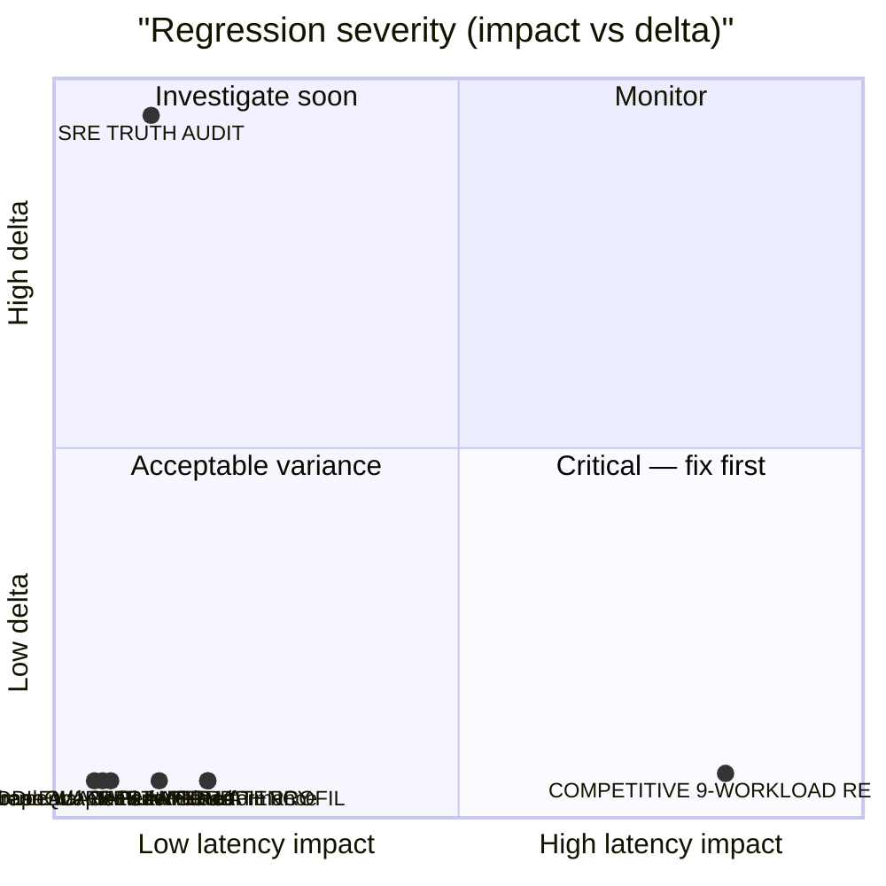

# 🚀 MongoDB Performance Ledger

> [!NOTE] Competitive comparisons based on publicly available documentation as of June 2026. All SveltyCMS metrics self-measured via `bun test tests/benchmarks/`.

> [!IMPORTANT]
> **Console-only by default.** Use `BENCHMARK_RECORD=1` to write results to this report.
>
> ```bash
> BENCHMARK_RECORD=1 bun test tests/benchmarks/auth-performance.test.ts
> ```
>
> The full matrix runner (`bun run scripts/benchmark-matrix/index.ts --sql`) always records.

<!-- BENCHMARK_START -->

<!-- EXECUTIVE_START -->
<!-- LATEST_AUDIT_HEADER -->

## 📊 Latest Performance Audit

<!-- EXECUTIVE_FIX_NOTES_START -->

### 📝 Fix Overlays

> [!NOTE]
> Phase notes and remediation entries appear here after matrix or surgical runs.

<!-- EXECUTIVE_FIX_NOTES_END -->

(06/10/2026, 11:52:14)

**✅ PASS** · 33/39 tests · 6 skipped · **MONGODB** · Bun 1.4.2

### Dimension health

| Dimension      | Tests | Status | Worst Δ | Issues |
| -------------- | ----: | ------ | ------- | ------ |
| **Core**       |    10 | 🟢     | +21550% | 0      |
| **API**        |     9 | 🟢     | +42%    | 0      |
| **Scale**      |    15 | 🟢     | -100%   | 0      |
| **Resilience** |     5 | 🟢     | —       | 0      |

### Issues (action required)

> ✅ **All clear** — no regressions or budget violations detected.

### Executive latency matrix

| Scenario               | Latency | Trend  | Budget   | Result |
| ---------------------- | ------- | ------ | -------- | ------ |
| **Cold Start**         | N/A     | ⚪ (—) | < 5000ms | ⚪ N/A |
| **REST (Collections)** | N/A     | ⚪ (—) | < 5ms    | ⚪ N/A |
| **Middleware Hooks**   | N/A     | ⚪     | < 2ms    | ⚪ N/A |
| **GraphQL (Avg)**      | N/A     | ⚪ (—) | < 5ms    | ⚪ N/A |
| **Million-Row Index**  | N/A     | ⚪     | < 250ms  | ⚪ N/A |
| **DB Raw (p95)**       | N/A     | ⚪     | < 50ms   | ⚪ N/A |

### Historical pulse

> **Scope:** Sparklines only — full run tables: [`tests/benchmarks/results/history.sqlite`](../../../tests/benchmarks/results/history.sqlite)

| Metric | Trend | Sparkline | Latest |
| ------ | ----- | --------- | ------ |

<details>
<summary>📈 Latency trend chart (last 10 runs)</summary>

```mermaid
xychart-beta
  title "MONGODB REST p95 (last 10 runs)"
  x-axis ["R1", "R2", "R3", "R4", "R5", "R6", "R7", "R8", "R9", "R10"]
  y-axis "Latency (ms)"
  line "p95" : [0.000, 0.000, 0.000, 0.000, 0.000, 0.000, 0.000, 0.000, 0.000, 0.000]
```

</details>
<details>
<summary>📊 Regression severity matrix (quadrant)</summary>


```mermaid
quadrantChart
  title "Regression severity (impact vs delta)"
  x-axis Low latency impact --> High latency impact
  y-axis Low delta --> High delta
  quadrant-1 Monitor
  quadrant-2 Investigate soon
  quadrant-3 Acceptable variance
  quadrant-4 Critical — fix first
    API LAYER LATENCY: [0.19, 0.05]
    SRE TRUTH AUDIT: [0.12, 0.95]
    COMPETITIVE 9-WORKLOAD REPLI: [0.83, 0.06]
    MIDDLEWARE FLAMEGRAPH PROFIL: [0.13, 0.05]
    Incremental Content Reload: [0.06, 0.05]
    Database Adapter Raw CRUD: [0.05, 0.05]
    REST API Performance: [0.19, 0.05]
    GraphQL API Performance: [0.07, 0.05]
```

</details>

<!-- EXECUTIVE_PARTIAL_WATERMARK -->

> 📋 **Partial report** — run full matrix for complete cross-DB analysis.

<!-- EXECUTIVE_ALERTS_START -->

> 📋 **Partial report** — run full matrix for complete cross-DB analysis.

### 🔴 Top Regressions

> **🔴 competitive-workload-replica [update (Warm Sequential)]** (mongodb): +263% | 9.14ms vs 2.52ms baseline
> **🔴 graphql-cache-hit [Q2: Collections (L1 Hit)]** (mongodb): +97% | 2.10ms vs 1.07ms baseline
> **🔴 graphql-cache-hit [Q1: Health (L1 Hit)]** (mongodb): +57% | 2.24ms vs 1.43ms baseline
> **🔴 graphql-cache-hit [Q2: Collections (Cold Miss)]** (mongodb): +56% | 3.11ms vs 2.00ms baseline
> **🔴 websocket-broadcast [Yjs CRDT Propagation]** (mongodb): +29% | 0.16ms vs 0.13ms baseline

### 🟢 Top Improvements

> **competitive-workload-replica [listLarge (Warm Concurrent 8c)]** (mongodb): -74% | 0.89ms vs 3.39ms baseline
> **competitive-workload-replica [graphql (Warm Concurrent 8c)]** (mongodb): -62% | 1.44ms vs 3.81ms baseline
> **sharp-vs-bun-image [Bun.Image Metadata (header-only)]** (mongodb): -59% | 0.00ms vs 0.01ms baseline
> **entry-edit-hydration [Widget Prefetch (5 types)]** (mongodb): -57% | 0.02ms vs 0.04ms baseline
> **competitive-workload-replica [graphql (Warm Sequential)]** (mongodb): -54% | 0.83ms vs 1.78ms baseline

<!-- EXECUTIVE_ALERTS_END --><!-- EXECUTIVE_END -->

<!-- SUMMARY_START -->
<!-- SUMMARY_RUN_OVERLAY_START -->

### Current Run Summary (2026-09-30)

> **Scope:** Only tests that ran in THIS invocation.

> ⚠️ Executive PASS/FAIL reflects the last full matrix run.

**Run ID:** `01a0f2eb-3fc5-7070-b340-71437b5a6870` · **Tests invoked:** 1 · **Metrics:** 5 · **DB:** mongodb

| Test              | Metric                        | Avg (ms) | p95 (ms) | RPS   | Trend | Detail                            |
| ----------------- | ----------------------------- | -------- | -------- | ----- | ----- | --------------------------------- |
| Hooks Performance | Static Asset (No Middleware)  | 0.838    | 1.802    | 4207  | 🟢    | ⚪ established at 0.838ms (1 run) |
| Hooks Performance | Turbo Pipeline (Light)        | 0.448    | 0.788    | 7856  | 🟢    | ⚪ established at 0.448ms (1 run) |
| Hooks Performance | Full Security + Auth Pipeline | 0.285    | 0.518    | 11771 | 🟢    | ⚪ established at 0.285ms (1 run) |
| Hooks Performance | REST with API Caching         | 0.295    | 0.467    | 12266 | 🟢    | ⚪ established at 0.295ms (1 run) |
| Hooks Performance | Mutation + Audit Logging      | 1.315    | 1.978    | 705   | 🟢    | ⚪ established at 1.31ms (1 run)  |

<!-- SUMMARY_RUN_OVERLAY_END -->

<!-- SUMMARY_HISTORY_START -->

### Historical Trends (2026-10-06)

> **Mode:** production-parity matrix runs only (`run_mode='matrix'` + `server_mode='production'` — `NODE_ENV=production`, no `TEST_MODE`). Standalone/mode-variant samples are recorded but never trended here.

> **Scope:** Sparklines only — full run tables live in `history.sqlite` (link below). Runs = sparkline bar count.

**Detail:** [`tests/benchmarks/results/history.sqlite`](../../../tests/benchmarks/results/history.sqlite) · `SELECT test_id, phase, server_mode, avg_ms, p95_ms, rps, timestamp FROM runs WHERE db_type='mongodb' AND redis=0 ORDER BY timestamp DESC`

**Series:** 55 · **DB:** mongodb

| Metric                              | Trend | Sparkline (last 7) | Latest    |
| ----------------------------------- | ----- | ------------------ | --------- |
| ADMIN UX VITALITY (warm)            | 🟢    | `█▁▅▁`             | 0.371ms   |
| AI PERFORMANCE (warm)               | 🟢    | `▁▁▁▁`             | 0.000ms   |
| API LATENCY (warm)                  | 🟢    | `█▂█▃▁▁▅`          | 2.155ms   |
| AUTH PERFORMANCE (warm)             | 🟢    | `▁▃█▃▃▄`           | 0.835ms   |
| AUTH SESSION AMR (warm)             | 🟢    | `█▅▇▃▅▁▅`          | 0.703ms   |
| BUILD ANALYSIS (warm)               | 🟢    | `▁▁`               | 0.000ms   |
| CACHE HIT RATIO (warm)              | 🟢    | `▂▁█▅▁▁▇`          | 1.484ms   |
| CACHE PERFORMANCE (warm)            | 🟢    | `▁█▁█`             | 0.913ms   |
| CACHE SERVICE (warm)                | 🟢    | `▁▆█▁▅▅`           | 0.605ms   |
| CLIENT JOURNEY (warm)               | 🟢    | `█▁`               | 3.859ms   |
| CONCURRENCY MAX (warm)              | 🟢    | `█▁`               | 73.933ms  |
| CONFIG PROMOTION (warm)             | 🟢    | `▁▁▄▆▅█▁`          | 5.778ms   |
| CONTENT GUI SAVE (warm)             | 🟢    | `█▁`               | 1.563ms   |
| CONTENT SCALE STRESS (warm)         | 🟢    | `█▂▇▁`             | 0.134ms   |
| CONTENT SCAN (warm)                 | 🟢    | `█▂▆▁`             | 0.636ms   |
| DATABASE PERFORMANCE (warm)         | 🟢    | `▁▁▃▁█▁▁`          | 0.601ms   |
| ENTRY EDIT HYDRATION (warm)         | 🟢    | `▁▁█▅▁▁▄`          | 0.016ms   |
| GRAPHQL API PERFORMANCE (warm)      | 🟢    | `▂▅▄█▅▂▁`          | 0.754ms   |
| GRAPHQL CACHE HIT (warm)            | 🟢    | `▁▂▁█▂▄▂`          | 2.103ms   |
| GRAPHQL LOCAL SDK (warm)            | 🟢    | `█▃█▁`             | 0.000ms   |
| GRAPHQL STRESS (warm)               | 🟢    | `█▁▂▄▁▅█`          | 11.075ms  |
| HOOKS PERFORMANCE (warm)            | 🟢    | `▅▃▁█▁▄▂`          | 0.582ms   |
| INDEX PRESSURE (warm)               | 🟢    | `▇█▁▇`             | 0.486ms   |
| LARGE PAYLOAD STREAMING (warm)      | 🟢    | `▃▇█▁▃▆█`          | 12.482ms  |
| LOCAL API PERFORMANCE (warm)        | 🟢    | `█▆█▃▁▂`           | 0.593ms   |
| LOCAL API THROUGHPUT (warm)         | 🟢    | `█▁▇▁`             | 2.621ms   |
| LOCAL CMS CRUD (warm)               | 🟢    | `▃▃▃▃▁█▄`          | 0.849ms   |
| LOCAL SDK VS DIRECT (warm)          | 🟢    | `▂▆▁▅▁▆█`          | 0.807ms   |
| MEDIA PERFORMANCE (warm)            | 🟢    | `▁▆▁▄▂▁█`          | 103.934ms |
| MEDIA UPLOAD STRESS (warm)          | 🟢    | `▂█▁▂`             | 7.250ms   |
| MEMORY COUNTERS (warm)              | 🟢    | `▁▁`               | 0.000ms   |
| MIDDLEWARE FLAMEGRAPH (warm)        | 🟢    | `▅▃▂█▁▁█`          | 1.425ms   |
| MIGRATION SCALE (warm)              | 🟢    | `█▂▁▇▁▁`           | 0.474ms   |
| MIXED WORKLOAD (warm)               | 🟢    | `█▁`               | 0.949ms   |
| MULTI TENANT PERFORMANCE (warm)     | 🟢    | `█▁`               | 0.550ms   |
| OPENAPI PERFORMANCE (warm)          | 🟢    | `█▁▇▅▁▅`           | 1.147ms   |
| PRODUCTION DAY (warm)               | 🟢    | `█▁`               | 1.759ms   |
| REALTIME PERFORMANCE (warm)         | 🟢    | `▁▁▁▁▁▁`           | 0.000ms   |
| REVISION STRESS (warm)              | 🟢    | `▁█▁▁▇▁`           | 0.288ms   |
| RIGHT TO BE FORGOTTEN AUDIT (warm)  | 🟢    | `▁█`               | 6.540ms   |
| SCALE SPECTRUM (warm)               | 🟢    | `▇▃▁▁█▃▅`          | 0.875ms   |
| SECURITY AUDIT (warm)               | 🟢    | `█▁▁▁▁▁▁`          | 0.001ms   |
| SEO PERFORMANCE (warm)              | 🟢    | `▁█▁▁`             | 1.744ms   |
| SHARP VS BUN IMAGE (warm)           | 🟢    | `▄▁▁█▄▃▂`          | 37.205ms  |
| STATE MACHINE TRANSITION (warm)     | 🟢    | `▂█▁▄`             | 29.671ms  |
| TELEMETRY PERFORMANCE (warm)        | 🟢    | `▁██▁`             | 0.000ms   |
| TEMPORAL INTEGRITY (warm)           | 🟢    | `█▁`               | 3.155ms   |
| TRANSACTION ACID (warm)             | 🟢    | `▁█▁▇`             | 0.643ms   |
| WEBSOCKET BROADCAST (warm)          | 🟢    | `▁█`               | 0.163ms   |
| WIDGET PERFORMANCE (warm)           | 🟢    | `█▁▇█▁▆`           | 0.522ms   |
| COMPETITIVE WORKLOAD REPLICA (warm) | ⚪    | `▁▁▁▂▁▆█`          | 9.140ms   |
| CONTENT INCREMENTAL RELOAD (warm)   | ⚪    | `▂▁█▂▂▁▆`          | 0.642ms   |
| NEGATIVE CACHE (warm)               | ⚪    | `██▁▇▇▁`           | 0.001ms   |
| REST API PERFORMANCE (warm)         | ⚪    | `▂█▄▃▃▁▆`          | 2.071ms   |
| TRUTH LATENCY (warm)                | ⚪    | `▃▁▁▂▁▁█`          | 1.299ms   |

<!-- SUMMARY_HISTORY_END --><!-- SUMMARY_END -->

<details>
<summary>📊 Infrastructure drill-down (expand for adapter, hooks, memory trends)</summary>

## 📊 Infrastructure drill-down

### 🏷️ Mixed Workload Performance {#mixedAvg}

**Mixed p95:** — (not measured in this run) | **Trend:** ⚪ (—)

> Production request mix: 60% Reads, 20% Writes, 15% GraphQL, 5% Media.

### 🏷️ Database Adapter Performance {#dbRaw}

**Raw Adapter p95:** — (not measured in this run) | **Target:** < 50ms | **Trend:** ⚪ (—)

> Direct database access latency (bypass CMS logic).

### 🏷️ Middleware & Hooks Audit {#hooks}

**Middleware p95:** — (not measured in this run) | **Target:** < 2ms | **Trend:** ⚪ (—)

> Total overhead of security, logging, and auth hooks.

### 🏷️ Memory Stability Audit {#memGrowth}

**Memory RSS Δ:** — (not measured in this run) | **Target:** < 60MB | **Trend:** ⚪ (—)

> Peak memory growth during stress workload.

### Enterprise scale audit

### 🏷️ Multi-Tenancy Performance {#tenancyAvg}

**Tenancy p95:** — (not measured in this run) | **Trend:** ⚪ (—)

> Measures latency across tenant isolation boundaries.

### 🏷️ Relational Resolver Latency {#relationalAvg}

**Relational p95:** — (not measured in this run) | **Trend:** ⚪ (—)

> Tests performance of complex JOINs and nested relationship population.

### 🏷️ Telemetry & Update Performance {#telemetryAvg}

**Telemetry p95:** — (not measured in this run) | **Trend:** ⚪ (—)

> Measures overhead of telemetry collection and cryptographic signing.

</details>

<!-- LEDGER_START -->

## 🔬 Full benchmark ledger (35 modules)

Expand dimension groups, then any row, for ASCII truth tables. Executive summary above shows pass/fail and issues only.

<!-- LEDGER_DIMENSION:CORE:START -->

<details id="ledger-dimension-core">
<summary><strong>Core</strong> · 27 tests</summary>

<!-- SECTION:API_LATENCY:START -->
<details id="section-api_latency">
<summary><strong>🏷️ API LAYER LATENCY</strong> · 🟢 0.215ms · ➡️ recorded (awaiting trend) · <a href="../../../tests/benchmarks/api-latency.test.ts">source</a></summary>
<!-- LEDGER_INSIGHT_START -->
> [!NOTE]
> **Specific to this test**: Both avg and p95 degraded — likely adapter or infrastructure bottleneck. Check DB connection pool, indexes, or recent commits.  
Throughput dropped 83% — check connection pool saturation or lock contention.  
**Severe degradation** (+144%) — review recent commits immediately.
> **Check**: `src/routes/api/[...path]/+server.ts` · `src/hooks.server.ts`
<!-- LEDGER_INSIGHT_END -->

<!-- LEDGER_TRUTH_START -->

```text
╔═══════════════════════════════════════════════════════════════════════════════════════════════════════╗
║                                     SVELTYCMS — API LAYER LATENCY                                     ║
║                              File: tests/benchmarks/api-latency.test.ts                               ║
║                                       Ran: 2026-10-06 12:40:21                                        ║
║              Cold full-pipeline findById + warm TURBO-HIT path after responseCache fill.              ║
╠═══════════════════════════════════════════════════════════════════════════════════════════════════════╣
║ HTTP: findById @ 8c (Cold)   │ Cold:     2.81 ms │ Warm:     2.604 ms │ p95:     3.382 ms │   2,984 RPS ║
║ HTTP: findById TURBO-HIT @ 8c (Warm) │ Cold:     0.27 ms │ Warm:     0.468 ms │ p95:     0.640 ms │  15,938 RPS ║
║ HTTP: zstd large GET (>64KiB, drained) │ Cold:     1.66 ms │ Warm:     1.816 ms │ p95:     2.389 ms │   1,056 RPS ║
║ HTTP: findById TURBO-HIT idle (Warm) │        0.215 ms │ p95:        0.284 ms │ RPS:      4,317 ║
║ HTTP: findById TURBO-HIT during zstd (Warm) │        0.274 ms │ p95:        0.326 ms │ RPS:      3,583 ║
╚═══════════════════════════════════════════════════════════════════════════════════════════════════════╝
```

<!-- LEDGER_TRUTH_END -->

</details>
<!-- SECTION:API_LATENCY:END -->

<!-- SECTION:COLD_START:START -->
<details id="section-cold_start">
<summary><strong>🏷️ PHASED COLD START</strong> · ⚪ ⏳ pending · ➡️ — · <a href="../../../tests/benchmarks/cold-start-phased.test.ts">source</a></summary>
<!-- LEDGER_TRUTH_START -->
```text
╔═══════════════════════════════════════════════════════════════════════════════════════════════════════╗
║                                  SVELTYCMS — PHASED COLD START AUDIT                                  ║
║                           File: tests/benchmarks/cold-start-phased.test.ts                            ║
║                                       Ran: 2026-09-18 18:14:41                                        ║
║            Measures process spawn, dependency hydration, and first-request TTFB readiness.            ║
╠═══════════════════════════════════════════════════════════════════════════════════════════════════════╣
║ Initial Cold Boot (Fresh Process) │     2366.569 ms │ p95:     2366.569 ms │ RPS:          0 ║
║ Steady-State Respawn (Average) │     1567.161 ms │ p95:     2366.569 ms │ RPS:          0 ║
╚═══════════════════════════════════════════════════════════════════════════════════════════════════════╝
```
<!-- LEDGER_TRUTH_END -->

</details>
<!-- SECTION:COLD_START:END -->

<!-- SECTION:TRUTH_AUDIT:START -->
<details id="section-truth_audit">
<summary><strong>🏷️ SRE TRUTH AUDIT</strong> · 🟢 0.010ms · ➡️ recorded (awaiting trend) · <a href="../../../tests/benchmarks/truth-latency.test.ts">source</a></summary>
<!-- LEDGER_INSIGHT_START -->
> [!NOTE]
> **Specific to this test**: Both avg and p95 degraded — likely adapter or infrastructure bottleneck. Check DB connection pool, indexes, or recent commits.  
Throughput dropped 100% — check connection pool saturation or lock contention.  
**Severe degradation** (+21550%) — review recent commits immediately.
<!-- LEDGER_INSIGHT_END -->

<!-- LEDGER_TRUTH_START -->

```text
╔═══════════════════════════════════════════════════════════════════════════════════════════════════════╗
║                                      SVELTYCMS — SRE TRUTH AUDIT                                      ║
║                             File: tests/benchmarks/truth-latency.test.ts                              ║
║                                       Ran: 2026-10-06 12:40:05                                        ║
║            Validates performance claims by comparing SDK, Middleware, and Real HTTP Stack             ║
╠═══════════════════════════════════════════════════════════════════════════════════════════════════════╣
║ Logic Baseline               │ Cold:     0.01 ms │ Warm:     0.000 ms │ p95:     0.000 ms │ 582,751 RPS ║
║ Local SDK (Full)             │ Cold:    14.49 ms │ Warm:     0.006 ms │ p95:     0.012 ms │ 135,974 RPS ║
║ HTTP End-to-End              │ Cold:     4.34 ms │ Warm:     0.252 ms │ p95:     0.322 ms │   3,940 RPS ║
║ HTTP Cold (Cache-Busted)     │ Cold:     2.26 ms │ Warm:     1.102 ms │ p95:     1.428 ms │     906 RPS ║
╚═══════════════════════════════════════════════════════════════════════════════════════════════════════╝
```

<!-- LEDGER_TRUTH_END -->

</details>
<!-- SECTION:TRUTH_AUDIT:END -->

<!-- SECTION:INCREMENTAL:START -->
<details id="section-incremental">
<summary><strong>🏷️ Incremental Content Reload</strong> · 🟢 4.740ms · ➡️ recorded (awaiting trend) · <a href="../../../tests/benchmarks/content-incremental-reload.test.ts">source</a></summary>
<!-- LEDGER_INSIGHT_START -->
> [!NOTE]
> **Specific to this test**: Both avg and p95 degraded — likely adapter or infrastructure bottleneck. Check DB connection pool, indexes, or recent commits.  
Throughput dropped 74% — check connection pool saturation or lock contention.  
**Severe degradation** (+183%) — review recent commits immediately.
> **Check**: `src/content/engine.server.ts` · `src/routes/api/[...path]/handlers/content.ts`
<!-- LEDGER_INSIGHT_END -->

<!-- LEDGER_TRUTH_START -->

```text
╔═══════════════════════════════════════════════════════════════════════════════════════════════════════╗
║                             SVELTYCMS — INCREMENTAL CONTENT RELOAD AUDIT                              ║
║                       File: tests/benchmarks/content-incremental-reload.test.ts                       ║
║                                       Ran: 2026-10-06 12:44:32                                        ║
║      Measures surgical single-file fullReload vs full reconciliation path and batch processing.       ║
╠═══════════════════════════════════════════════════════════════════════════════════════════════════════╣
║ Incremental fullReload (1 file) │ Cold:     4.74 ms │ Warm:     0.066 ms │ p95:     0.124 ms │  13,661 RPS ║
║ Full Reconciliation Reload   │ Cold:     2.41 ms │ Warm:     0.171 ms │ p95:     0.250 ms │   5,627 RPS ║
║ Sequential 10-File Reload    │ Cold:     4.12 ms │ Warm:     0.550 ms │ p95:     0.791 ms │   1,700 RPS ║
║ Batched 10-File Reload       │ Cold:     0.88 ms │ Warm:     0.248 ms │ p95:     0.444 ms │   3,485 RPS ║
╚═══════════════════════════════════════════════════════════════════════════════════════════════════════╝
```

<!-- LEDGER_TRUTH_END -->

</details>
<!-- SECTION:INCREMENTAL:END -->

<!-- SECTION:STATE_MACHINE:START -->
<details id="section-state_machine">
<summary><strong>🏷️ State Machine Transitions</strong> · 🟢 38.720ms · ➡️ recorded (awaiting trend) · <a href="../../../tests/benchmarks/state-machine-transition.test.ts">source</a></summary>
<!-- LEDGER_INSIGHT_START -->
> [!NOTE]
> **Specific to this test**: Avg degraded but p95 stable — possible cold-start effect, GC pause, or warmup variance.
<!-- LEDGER_INSIGHT_END -->

<!-- LEDGER_TRUTH_START -->

```text
╔═══════════════════════════════════════════════════════════════════════════════════════════════════════╗
║                                  SVELTYCMS — STATE MACHINE INTEGRITY                                  ║
║                        File: tests/benchmarks/state-machine-transition.test.ts                        ║
║                                       Ran: 2026-10-06 12:44:44                                        ║
║Measures state machine self-healing transition latencies, convergence settling time, and health probe consistency under stress.║
╠═══════════════════════════════════════════════════════════════════════════════════════════════════════╣
║ State Transition (Transient) │ Cold:    38.72 ms │ Warm:    28.154 ms │ p95:    35.104 ms │      36 RPS ║
║ Self-Healing Full Convergence │ Cold:    31.24 ms │ Warm:    31.280 ms │ p95:    35.127 ms │      33 RPS ║
╚═══════════════════════════════════════════════════════════════════════════════════════════════════════╝
```

<!-- LEDGER_TRUTH_END -->

</details>
<!-- SECTION:STATE_MACHINE:END -->

<!-- SECTION:DB_RAW_P95:START -->
<details id="section-db_raw_p95">
<summary><strong>🏷️ Database Adapter Raw CRUD</strong> · 🟢 2.400ms · ➡️ recorded (awaiting trend) · <a href="../../../tests/benchmarks/database-performance.test.ts">source</a></summary>
<!-- LEDGER_INSIGHT_START -->
> [!NOTE]
> **Specific to this test**: Performance improved — recent optimizations or cache warming likely effective.
<!-- LEDGER_INSIGHT_END -->

<!-- LEDGER_TRUTH_START -->

```text
╔═══════════════════════════════════════════════════════════════════════════════════════════════════════╗
║                          SVELTYCMS — DATABASE ADAPTER PERFORMANCE (MONGODB)                           ║
║                          File: tests/benchmarks/database-performance.test.ts                          ║
║                                       Ran: 2026-10-06 12:44:13                                        ║
║          Measures raw CRUD performance, indexing efficiency, and connection pool resilience.          ║
╠═══════════════════════════════════════════════════════════════════════════════════════════════════════╣
║ INSERT                       │ Cold:     2.40 ms │ Warm:     0.530 ms │ p95:     0.682 ms │   1,793 RPS ║
║ FIND ONE                     │ Cold:     2.08 ms │ Warm:     0.543 ms │ p95:     0.660 ms │   1,778 RPS ║
║ FIND MANY (limit 50)         │ Cold:     5.83 ms │ Warm:     0.799 ms │ p95:     0.984 ms │   1,194 RPS ║
║ FILTER (blob field, 1 match) │ Cold:     4.19 ms │ Warm:     2.467 ms │ p95:     2.683 ms │     402 RPS ║
║ QUERY BUILDER LIST (50)      │ Cold:     6.74 ms │ Warm:     4.047 ms │ p95:     4.479 ms │     244 RPS ║
║ FIND PAGE (50 hasMore)       │ Cold:     4.34 ms │ Warm:     0.858 ms │ p95:     1.068 ms │   1,097 RPS ║
║ FIND PAGE keyset             │ Cold:     4.35 ms │ Warm:     0.754 ms │ p95:     0.960 ms │   1,267 RPS ║
║ FIND MANY offset 50          │ Cold:     2.13 ms │ Warm:     0.732 ms │ p95:     0.903 ms │   1,319 RPS ║
║ LIST+COUNT (legacy)          │ Cold:     4.96 ms │ Warm:     1.842 ms │ p95:     2.078 ms │     529 RPS ║
║ UPDATE                       │ Cold:     4.73 ms │ Warm:     0.681 ms │ p95:     0.914 ms │   1,398 RPS ║
║ UPDATE (no-returning)        │ Cold:     3.56 ms │ Warm:     0.666 ms │ p95:     0.802 ms │   1,468 RPS ║
║ NATIVE UPSERT                │ Cold:     3.54 ms │ Warm:     0.667 ms │ p95:     0.798 ms │   1,435 RPS ║
║ COUNT                        │ Cold:     4.24 ms │ Warm:     1.704 ms │ p95:     1.872 ms │     582 RPS ║
║ COUNT ESTIMATE               │ Cold:     2.01 ms │ Warm:     0.404 ms │ p95:     0.493 ms │   2,453 RPS ║
║ COUNT CACHED                 │ Cold:     4.34 ms │ Warm:     0.001 ms │ p95:     0.002 ms │ 673,945 RPS ║
║ DELETE (Active Rows)         │ Cold:    18.33 ms │ Warm:     1.302 ms │ p95:     1.530 ms │     723 RPS ║
║ BULK INSERT (100)            │ Cold:     5.93 ms │ Warm:     3.106 ms │ p95:     4.761 ms │     273 RPS ║
║ BULK UPDATE (100 heterogeneous) │ Cold:    26.34 ms │ Warm:    10.289 ms │ p95:    15.835 ms │      88 RPS ║
║ BULK UPDATE (100 homogeneous) │ Cold:    17.23 ms │ Warm:    10.211 ms │ p95:    16.354 ms │      89 RPS ║
╚═══════════════════════════════════════════════════════════════════════════════════════════════════════╝
```

<!-- LEDGER_TRUTH_END -->

</details>
<!-- SECTION:DB_RAW_P95:END -->

<!-- SECTION:ACID:START -->
<details id="section-acid">
<summary><strong>🏷️ ACID Transaction Overhead</strong> · 🟢 0.050ms · ➡️ recorded (awaiting trend) · <a href="../../../tests/benchmarks/transaction-acid.test.ts">source</a></summary>
<!-- LEDGER_TRUTH_START -->
```text
╔═══════════════════════════════════════════════════════════════════════════════════════════════════════╗
║                                   SVELTYCMS — ACID INTEGRITY AUDIT                                    ║
║                            File: tests/benchmarks/transaction-acid.test.ts                            ║
║                                       Ran: 2026-10-06 12:44:16                                        ║
║         Measures transaction commit latencies and rollback overhead across database adapters          ║
╠═══════════════════════════════════════════════════════════════════════════════════════════════════════╣
║ TX Commit                    │ Cold:     0.05 ms │ Warm:     0.000 ms │ p95:     0.002 ms │ 848,536 RPS ║
║ TX Rollback Integrity        │ Cold:     1.73 ms │ Warm:     0.648 ms │ p95:     0.796 ms │   1,538 RPS ║
╚═══════════════════════════════════════════════════════════════════════════════════════════════════════╝
```
<!-- LEDGER_TRUTH_END -->

</details>
<!-- SECTION:ACID:END -->

<!-- SECTION:LOGIC:START -->
<details id="section-logic">
<summary><strong>🏷️ Logic</strong> · 🟢 ⏳ pending · ➡️ ⚪ stable at 0ms (7 runs) (2026-09-18 18:14:56) · <a href="../../../tests/benchmarks/truth-latency.test.ts">source</a></summary>
<!-- LEDGER_TRUTH_START -->
> ⏳ Pending
<!-- LEDGER_TRUTH_END -->

</details>
<!-- SECTION:LOGIC:END -->

<!-- SECTION:SDK:START -->
<details id="section-sdk">
<summary><strong>🏷️ SDK</strong> · 🟢 0.541ms · ➡️ recorded (awaiting trend) · <a href="../../../tests/benchmarks/truth-latency.test.ts">source</a></summary>
<!-- LEDGER_TRUTH_START -->
```text
╔═══════════════════════════════════════════════════════════════════════════════════════════════════════╗
║                              SVELTYCMS — SDK VS DIRECT ADAPTER (MONGODB)                              ║
║                          File: tests/benchmarks/local-sdk-vs-direct.test.ts                           ║
║                                       Ran: 2026-10-06 12:47:27                                        ║
║Measures the exact SDK tax across Create, Find, and Update pathways with isolated GC sweeps and zero-allocation key pools.║
╠═══════════════════════════════════════════════════════════════════════════════════════════════════════╣
║ Direct insert                  │        0.541 ms │ p95:        0.541 ms │ RPS:      1,847 ║
║ SDK create (full)              │        0.676 ms │ p95:        0.676 ms │ RPS:      1,479 ║
║ Direct findOne                 │        0.569 ms │ p95:        0.569 ms │ RPS:      1,759 ║
║ SDK find (bypassCache)         │        0.577 ms │ p95:        0.577 ms │ RPS:      1,735 ║
║ Direct update                  │        0.717 ms │ p95:        0.717 ms │ RPS:      1,395 ║
║ SDK update (full)              │        0.771 ms │ p95:        0.771 ms │ RPS:      1,297 ║
║ SDK create (detached)          │        0.526 ms │ p95:        0.526 ms │ RPS:      1,900 ║
║ SDK update (detached)          │        0.726 ms │ p95:        0.726 ms │ RPS:      1,378 ║
╚═══════════════════════════════════════════════════════════════════════════════════════════════════════╝
```
<!-- LEDGER_TRUTH_END -->

</details>
<!-- SECTION:SDK:END -->

<!-- SECTION:HTTP:START -->
<details id="section-http">
<summary><strong>🏷️ HTTP</strong> · 🟢 0.482ms · ➡️ ⚪ stable at 0.499ms (±0.017ms) (7 runs) (2026-09-18 18:14:56) · <a href="../../../tests/benchmarks/truth-latency.test.ts">source</a></summary>
<!-- LEDGER_TRUTH_START -->
> ⏳ Pending
<!-- LEDGER_TRUTH_END -->

</details>
<!-- SECTION:HTTP:END -->

<!-- SECTION:UNKNOWN:START -->
<details id="section-unknown">
<summary><strong>🏷️ unknown</strong> · 🟢 0.002ms · ➡️ recorded (awaiting trend) · <a href="../../../tests/benchmarks/transaction-acid.test.ts">source</a></summary>
<!-- LEDGER_TRUTH_START -->
```text
╔═════════════════════════════════════════════════════════════════════════════════════════╗
║                      SVELTYCMS — CACHE EVICTION BOUNDARY HARDENING                      ║
║                                      File: unknown                                      ║
║                                Ran: 2026-08-23 22:17:47                                 ║
╠═════════════════════════════════════════════════════════════════════════════════════════╣
║ Cache Flooding & Eviction      │        0.002 ms │ p95:        0.002 ms │ RPS:    473,175 ║
╚═════════════════════════════════════════════════════════════════════════════════════════╝
```
<!-- LEDGER_TRUTH_END -->

</details>
<!-- SECTION:UNKNOWN:END -->

<!-- SECTION:CACHE:START -->
<details id="section-cache">
<summary><strong>🏷️ Cache</strong> · 🟢 0.478ms · ➡️ recorded (awaiting trend) · <a href="../../../tests/benchmarks/cache-performance.test.ts">source</a></summary>
<!-- LEDGER_TRUTH_START -->
```text
╔═══════════════════════════════════════════════════════════════════════════════════════════════════════╗
║                                  SVELTYCMS — CACHE SERVICE TELEMETRY                                  ║
║                             File: tests/benchmarks/cache-service.test.ts                              ║
║                                       Ran: 2026-10-06 12:44:28                                        ║
║               Measures L1 cache hit latency and pattern invalidation overhead at scale.               ║
╠═══════════════════════════════════════════════════════════════════════════════════════════════════════╣
║ Cache L1 Hit                 │ Cold:     0.25 ms │ Warm:     0.000 ms │ p95:     0.000 ms │ 1,533,307 RPS ║
║ Pattern Invalidation (1k items @ 25k noise) │        0.478 ms │ p95:        1.127 ms │ RPS:      2,090 ║
║ Pattern Invalidation (Namespaced 1k @ 50k noise) │        0.717 ms │ p95:        1.161 ms │ RPS:      1,394 ║
╚═══════════════════════════════════════════════════════════════════════════════════════════════════════╝
```
<!-- LEDGER_TRUTH_END -->

</details>
<!-- SECTION:CACHE:END -->

<!-- SECTION:MIDDLEWARE:START -->
<details id="section-middleware">
<summary><strong>🏷️ Middleware</strong> · 🟢 1.315ms · ➡️ ⚪ established at 1.31ms (1 run) (2026-09-30 15:25:06) · <a href="../../../tests/benchmarks/hooks-performance.test.ts">source</a></summary>
<!-- LEDGER_TRUTH_START -->
> ⏳ Pending
<!-- LEDGER_TRUTH_END -->

</details>
<!-- SECTION:MIDDLEWARE:END -->

<!-- SECTION:SYSTEM:START -->
<details id="section-system">
<summary><strong>🏷️ System</strong> · ⚪ 1.152ms · ↘️ 🟢 faster: 1.69ms → 1.15ms (-32%) (2 runs) (2026-09-18 18:17:56) · <a href="../../../tests/benchmarks/rest-api-performance.test.ts">source</a></summary>
<!-- LEDGER_INSIGHT_START -->
> [!NOTE]
> **Specific to this test**: Performance improved — recent optimizations or cache warming likely effective.
<!-- LEDGER_INSIGHT_END -->

<!-- LEDGER_TRUTH_START -->

> ⏳ Pending

<!-- LEDGER_TRUTH_END -->

</details>
<!-- SECTION:SYSTEM:END -->

<!-- SECTION:METADATA:START -->
<details id="section-metadata">
<summary><strong>🏷️ Metadata</strong> · 🟢 2.094ms · ↘️ ⚪ stable at 2.53ms (±0.696ms) (2 runs) (2026-09-18 18:17:57) · <a href="../../../tests/benchmarks/rest-api-performance.test.ts">source</a></summary>
<!-- LEDGER_INSIGHT_START -->
> [!NOTE]
> **Specific to this test**: Performance improved — recent optimizations or cache warming likely effective.
<!-- LEDGER_INSIGHT_END -->

<!-- LEDGER_TRUTH_START -->

> ⏳ Pending

<!-- LEDGER_TRUTH_END -->

</details>
<!-- SECTION:METADATA:END -->

<!-- SECTION:CRUD:START -->
<details id="section-crud">
<summary><strong>🏷️ CRUD</strong> · 🟢 1.273ms · ➡️ ⚪ established at 1.27ms (1 run) (2026-08-25 11:29:52) · <a href="../../../tests/benchmarks/rest-api-performance.test.ts">source</a></summary>
<!-- LEDGER_TRUTH_START -->
> ⏳ Pending
<!-- LEDGER_TRUTH_END -->

</details>
<!-- SECTION:CRUD:END -->

<!-- SECTION:BASELINE:START -->
<details id="section-baseline">
<summary><strong>🏷️ Baseline</strong> · 🟢 0.953ms · ➡️ ⚪ established at 0.953ms (1 run) (2026-08-29 17:15:48) · <a href="../../../tests/benchmarks/revision-stress.test.ts">source</a></summary>
<!-- LEDGER_TRUTH_START -->
> ⏳ Pending
<!-- LEDGER_TRUTH_END -->

</details>
<!-- SECTION:BASELINE:END -->

<!-- SECTION:READ_PATH:START -->
<details id="section-read_path">
<summary><strong>🏷️ Read Path</strong> · 🟢 0.717ms · ➡️ ⚪ established at 0.717ms (1 run) (2026-08-29 17:15:48) · <a href="../../../tests/benchmarks/revision-stress.test.ts">source</a></summary>
<!-- LEDGER_TRUTH_START -->
> ⏳ Pending
<!-- LEDGER_TRUTH_END -->

</details>
<!-- SECTION:READ_PATH:END -->

<!-- SECTION:HISTORY:START -->
<details id="section-history">
<summary><strong>🏷️ History</strong> · 🟢 0.435ms · ➡️ ⚪ established at 0.435ms (1 run) (2026-08-29 17:15:48) · <a href="../../../tests/benchmarks/revision-stress.test.ts">source</a></summary>
<!-- LEDGER_TRUTH_START -->
> ⏳ Pending
<!-- LEDGER_TRUTH_END -->

</details>
<!-- SECTION:HISTORY:END -->

<!-- SECTION:HTTP_COLD:START -->
<details id="section-http_cold">
<summary><strong>🏷️ HTTP-Cold</strong> · 🟢 1.571ms · ➡️ ⚪ stable at 1.60ms (±0.161ms) (2 runs) (2026-09-18 18:14:56) · <a href="../../../tests/benchmarks/truth-latency.test.ts">source</a></summary>
<!-- LEDGER_TRUTH_START -->
> ⏳ Pending
<!-- LEDGER_TRUTH_END -->

</details>
<!-- SECTION:HTTP_COLD:END -->

<!-- SECTION:CRUD__GET_:START -->
<details id="section-crud__get_">
<summary><strong>🏷️ CRUD (Get)</strong> · 🟢 2.130ms · ➡️ ⚪ stable at 2.19ms (±0.177ms) (2 runs) (2026-09-18 18:17:57) · <a href="../../../tests/benchmarks/rest-api-performance.test.ts">source</a></summary>
<!-- LEDGER_TRUTH_START -->
> ⏳ Pending
<!-- LEDGER_TRUTH_END -->

</details>
<!-- SECTION:CRUD__GET_:END -->

<!-- SECTION:CRUD__LIST_:START -->
<details id="section-crud__list_">
<summary><strong>🏷️ CRUD (List)</strong> · 🟢 2.190ms · ↘️ ⚪ stable at 2.47ms (±0.416ms) (2 runs) (2026-09-18 18:17:58) · <a href="../../../tests/benchmarks/rest-api-performance.test.ts">source</a></summary>
<!-- LEDGER_INSIGHT_START -->
> [!NOTE]
> **Specific to this test**: Performance improved — recent optimizations or cache warming likely effective.
<!-- LEDGER_INSIGHT_END -->

<!-- LEDGER_TRUTH_START -->

> ⏳ Pending

<!-- LEDGER_TRUTH_END -->

</details>
<!-- SECTION:CRUD__LIST_:END -->

<!-- SECTION:CRUD__SEARCH_:START -->
<details id="section-crud__search_">
<summary><strong>🏷️ CRUD (Search)</strong> · 🟢 2.290ms · ➡️ ⚪ stable at 2.32ms (±0.089ms) (2 runs) (2026-09-18 18:17:58) · <a href="../../../tests/benchmarks/rest-api-performance.test.ts">source</a></summary>
<!-- LEDGER_TRUTH_START -->
> ⏳ Pending
<!-- LEDGER_TRUTH_END -->

</details>
<!-- SECTION:CRUD__SEARCH_:END -->

<!-- SECTION:COMPETITIVE:START -->
<details id="section-competitive">
<summary><strong>🏷️ COMPETITIVE 9-WORKLOAD REPLICA</strong> · 🟢 0.125ms · ➡️ recorded (awaiting trend) · <a href="../../../tests/benchmarks/competitive-workload-replica.test.ts">source</a></summary>
<!-- LEDGER_INSIGHT_START -->
> [!NOTE]
> **Specific to this test**: Both avg and p95 degraded — likely adapter or infrastructure bottleneck. Check DB connection pool, indexes, or recent commits.  
Throughput dropped 98% — check connection pool saturation or lock contention.  
**Severe degradation** (+1206%) — review recent commits immediately.
<!-- LEDGER_INSIGHT_END -->

<!-- LEDGER_TRUTH_START -->

```text
╔═══════════════════════════════════════════════════════════════════════════════════════════════════════╗
║                                SVELTYCMS — SEED BURST (DATASET SETUP)                                 ║
║                      File: tests/benchmarks/competitive-workload-replica.test.ts                      ║
║                                       Ran: 2026-10-06 12:46:50                                        ║
║              Seq + concurrent (8 workers), harness iteration counts, median of N rounds.              ║
╠═══════════════════════════════════════════════════════════════════════════════════════════════════════╣
║ Seed Burst (500 docs, HTTP)    │        0.125 ms │ p95:        0.125 ms │ RPS:      7,977 ║
╚═══════════════════════════════════════════════════════════════════════════════════════════════════════╝
```

<!-- LEDGER_TRUTH_END -->

</details>
<!-- SECTION:COMPETITIVE:END -->

<!-- SECTION:FLAMEGRAPH:START -->
<details id="section-flamegraph">
<summary><strong>🏷️ MIDDLEWARE FLAMEGRAPH PROFILER</strong> · 🟢 2.600ms · ➡️ recorded (awaiting trend) · <a href="../../../tests/benchmarks/middleware-flamegraph.test.ts">source</a></summary>
<!-- LEDGER_INSIGHT_START -->
> [!NOTE]
> **Specific to this test**: Both avg and p95 degraded — likely adapter or infrastructure bottleneck. Check DB connection pool, indexes, or recent commits.  
Throughput dropped 48% — check connection pool saturation or lock contention.  
**Severe degradation** (+80%) — review recent commits immediately.
<!-- LEDGER_INSIGHT_END -->

<!-- LEDGER_TRUTH_START -->

```text
╔═══════════════════════════════════════════════════════════════════════════════════════════════════════╗
║                               MIDDLEWARE FLAMEGRAPH PROFILER (MONGODB)                                ║
║                         File: tests/benchmarks/middleware-flamegraph.test.ts                          ║
║                                       Ran: 2026-10-06 12:47:33                                        ║
║Measures isolated microsecond cost and incremental deltas of each middleware stage from edge to database.║
╠═══════════════════════════════════════════════════════════════════════════════════════════════════════╣
║ Stage 0: Raw Socket Baseline (Static Asset) │ Cold:     2.60 ms │ Warm:     0.779 ms │ p95:     1.193 ms │   4,933 RPS ║
║ Stage 1: System State + Turbo Pipeline │ Cold:     1.07 ms │ Warm:     0.859 ms │ p95:     1.442 ms │   4,387 RPS ║
║ Stage 2: WAF Security Inspection │ Cold:     1.02 ms │ Warm:     0.572 ms │ p95:     0.826 ms │   6,568 RPS ║
║ Stage 3: Token Auth Gating   │ Cold:     6.43 ms │ Warm:     1.363 ms │ p95:     2.030 ms │   2,835 RPS ║
║ Stage 4: Collection Schema Resolution │ Cold:     2.23 ms │ Warm:     0.341 ms │ p95:     0.429 ms │  10,993 RPS ║
║ Stage 5: Full REST Single Document │ Cold:     4.68 ms │ Warm:     0.291 ms │ p95:     0.368 ms │  12,861 RPS ║
║ Stage 6: GraphQL Single Query (JIT) │ Cold:     4.82 ms │ Warm:     1.311 ms │ p95:     1.539 ms │   3,037 RPS ║
╚═══════════════════════════════════════════════════════════════════════════════════════════════════════╝
```

<!-- LEDGER_TRUTH_END -->

</details>
<!-- SECTION:FLAMEGRAPH:END -->

<!-- SECTION:EVENTLOOP:START -->
<details id="section-eventloop">
<summary><strong>🏷️ EVENT LOOP LAG & SATURATION</strong> · ⚪ ⏳ pending · ➡️ pending · <a href="../../../tests/benchmarks/event-loop-lag.test.ts">source</a></summary>
<!-- LEDGER_TRUTH_START -->
```text
╔═══════════════════════════════════════════════════════════════════════════════════════════════════════╗
║                                 EVENT LOOP LAG & SATURATION (MONGODB)                                 ║
║                             File: tests/benchmarks/event-loop-lag.test.ts                             ║
║                                       Ran: 2026-10-06 12:47:01                                        ║
║Measures event loop delay (p50, p95, p99, max) and microtask drain speed under concurrent write bursts.║
╠═══════════════════════════════════════════════════════════════════════════════════════════════════════╣
║ Idle Baseline Lag              │        0.000 ms │ p95:        0.000 ms │ RPS:      1,428 ║
║ Write Burst Lag (200 writes @ 16c) │        0.000 ms │ p95:        0.000 ms │ RPS:        963 ║
╚═══════════════════════════════════════════════════════════════════════════════════════════════════════╝
```
<!-- LEDGER_TRUTH_END -->

</details>
<!-- SECTION:EVENTLOOP:END -->

<!-- SECTION:INGESTION:START -->
<details id="section-ingestion">
<summary><strong>🏷️ Ingestion</strong> · 🟢 0.054ms · ➡️ ⚪ established at 0.054ms (1 run) (2026-09-30 14:27:11) · <a href="../../../tests/benchmarks/competitive-workload-replica.test.ts">source</a></summary>
<!-- LEDGER_TRUTH_START -->
> ⏳ Pending
<!-- LEDGER_TRUTH_END -->

</details>
<!-- SECTION:INGESTION:END -->

</details>

<!-- LEDGER_DIMENSION:CORE:END -->

<!-- LEDGER_DIMENSION:API:START -->

<details id="ledger-dimension-api">
<summary><strong>API</strong> · 9 tests</summary>

<!-- SECTION:TEMPORAL:START -->
<details id="section-temporal">
<summary><strong>🏷️ Temporal Integrity Audit</strong> · 🟢 2.380ms · ➡️ recorded (awaiting trend) · <a href="../../../tests/benchmarks/temporal-integrity.test.ts">source</a></summary>
<!-- LEDGER_TRUTH_START -->
```text
╔═══════════════════════════════════════════════════════════════════════════════════════════════════════╗
║                                 SVELTYCMS — TEMPORAL INTEGRITY AUDIT                                  ║
║                           File: tests/benchmarks/temporal-integrity.test.ts                           ║
║                                       Ran: 2026-10-06 12:42:05                                        ║
║Validates strict backend UTC normalization (ISO 8601 with trailing 'Z') across global timezone offsets, fractional timezones, and midnight transitions.║
╠═══════════════════════════════════════════════════════════════════════════════════════════════════════╣
║ Temporal Ingestion & Normalization │ Cold:     2.38 ms │ Warm:     2.951 ms │ p95:     5.546 ms │   1,225 RPS ║
╚═══════════════════════════════════════════════════════════════════════════════════════════════════════╝
```
<!-- LEDGER_TRUTH_END -->

</details>
<!-- SECTION:TEMPORAL:END -->

<!-- SECTION:RELATIONAL:START -->
<details id="section-relational">
<summary><strong>🏷️ Relational & Nested Queries</strong> · ⚪ ⏳ pending · ➡️ — · <a href="../../../tests/benchmarks/relational-performance.test.ts">source</a></summary>
<!-- LEDGER_TRUTH_START -->
```text
╔═══════════════════════════════════════════════════════════════════════════════════════════════════════╗
║                                 SVELTYCMS — RELATIONAL RESOLVER AUDIT                                 ║
║                         File: tests/benchmarks/relational-performance.test.ts                         ║
║                                       Ran: 2026-08-29 16:55:08                                        ║
║Measures GraphQL resolver performance for shallow listings, deep relational joins, and nested author population across cold/hot execution paths.║
╠═══════════════════════════════════════════════════════════════════════════════════════════════════════╣
║ Shallow Query (Collections)  │ Cold:     2.75 ms │ Warm:     3.095 ms │ p95:     5.591 ms │   1,817 RPS ║
║ Deep Join (Cold DB)          │ Cold:     2.61 ms │ Warm:     2.327 ms │ p95:     3.415 ms │   1,632 RPS ║
║ Deep Join (Warm Cached)      │ Cold:     1.90 ms │ Warm:     1.797 ms │ p95:     2.571 ms │   2,078 RPS ║
╚═══════════════════════════════════════════════════════════════════════════════════════════════════════╝
```
<!-- LEDGER_TRUTH_END -->

</details>
<!-- SECTION:RELATIONAL:END -->

<!-- SECTION:AUTH_TRACE:START -->
<details id="section-auth_trace">
<summary><strong>🏷️ Auth & RBAC Performance</strong> · 🟢 1.650ms · ➡️ recorded (awaiting trend) · <a href="../../../tests/benchmarks/auth-performance.test.ts">source</a></summary>
<!-- LEDGER_INSIGHT_START -->
> [!NOTE]
> **Specific to this test**: Avg degraded but p95 stable — possible cold-start effect, GC pause, or warmup variance.  
Throughput dropped 47% — check connection pool saturation or lock contention.
<!-- LEDGER_INSIGHT_END -->

<!-- LEDGER_TRUTH_START -->

```text
╔═══════════════════════════════════════════════════════════════════════════════════════════════════════╗
║                                 SVELTYCMS — AUTHENTICATION TELEMETRY                                  ║
║                            File: tests/benchmarks/auth-performance.test.ts                            ║
║                                       Ran: 2026-10-06 12:40:28                                        ║
║           Evaluates authenticated session resolution, RBAC evaluation, and rejection paths.           ║
╠═══════════════════════════════════════════════════════════════════════════════════════════════════════╣
║ Unauthenticated (401 reject) │ Cold:     1.65 ms │ Warm:     0.810 ms │ p95:     0.928 ms │   1,204 RPS ║
║ Reject: unknown session cookie │ Cold:     0.99 ms │ Warm:     0.797 ms │ p95:     0.911 ms │   1,244 RPS ║
║ Reject: unknown API key (Bearer sck_) │ Cold:     0.90 ms │ Warm:     0.767 ms │ p95:     0.905 ms │   1,241 RPS ║
║ Auth Validation @ 1c         │ Cold:     2.12 ms │ Warm:     0.755 ms │ p95:     0.886 ms │   1,302 RPS ║
║ HTTP Auth Pipeline @ 8c      │ Cold:     2.43 ms │ Warm:     1.513 ms │ p95:     1.889 ms │   5,060 RPS ║
║ Auth (full chain) @ 1c       │ Cold:     1.52 ms │ Warm:     0.317 ms │ p95:     0.407 ms │   3,018 RPS ║
╚═══════════════════════════════════════════════════════════════════════════════════════════════════════╝
```

<!-- LEDGER_TRUTH_END -->

</details>
<!-- SECTION:AUTH_TRACE:END -->

<!-- SECTION:REST:START -->
<details id="section-rest">
<summary><strong>🏷️ REST API Performance</strong> · 🟢 1.140ms · ➡️ recorded (awaiting trend) · <a href="../../../tests/benchmarks/rest-api-performance.test.ts">source</a></summary>
<!-- LEDGER_INSIGHT_START -->
> [!NOTE]
> **Specific to this test**: Both avg and p95 degraded — likely adapter or infrastructure bottleneck. Check DB connection pool, indexes, or recent commits.  
Throughput dropped 31% — check connection pool saturation or lock contention.  
**Severe degradation** (+42%) — review recent commits immediately.
<!-- LEDGER_INSIGHT_END -->

<!-- LEDGER_TRUTH_START -->

```text
╔═══════════════════════════════════════════════════════════════════════════════════════════════════════╗
║                                 SVELTYCMS — ENTERPRISE REST API AUDIT                                 ║
║                          File: tests/benchmarks/rest-api-performance.test.ts                          ║
║                                       Ran: 2026-10-06 12:40:17                                        ║
║Measures latency, throughput, and correctness of core REST endpoints: health check, schema, single read, list, and search.║
╠═══════════════════════════════════════════════════════════════════════════════════════════════════════╣
║ System Health Check          │ Cold:     1.14 ms │ Warm:     1.989 ms │ p95:     2.921 ms │   5,807 RPS ║
║ Collection Schema Metadata   │ Cold:     3.09 ms │ Warm:     0.749 ms │ p95:     0.918 ms │  15,400 RPS ║
║ Single Document Read         │ Cold:     0.64 ms │ Warm:     0.742 ms │ p95:     0.875 ms │  15,449 RPS ║
║ Collection Find (List Limit 20) │ Cold:     5.33 ms │ Warm:     0.969 ms │ p95:     1.195 ms │  12,027 RPS ║
║ Collection Search Query      │ Cold:     3.09 ms │ Warm:     1.038 ms │ p95:     1.639 ms │  10,930 RPS ║
╚═══════════════════════════════════════════════════════════════════════════════════════════════════════╝
```

<!-- LEDGER_TRUTH_END -->

</details>
<!-- SECTION:REST:END -->

<!-- SECTION:GRAPHQL:START -->
<details id="section-graphql">
<summary><strong>🏷️ GraphQL API Performance</strong> · 🟢 2.880ms · ➡️ recorded (awaiting trend) · <a href="../../../tests/benchmarks/graphql-api-performance.test.ts">source</a></summary>
<!-- LEDGER_INSIGHT_START -->
> [!NOTE]
> **Specific to this test**: Performance improved — recent optimizations or cache warming likely effective.  
Throughput dropped 58% — check connection pool saturation or lock contention.
<!-- LEDGER_INSIGHT_END -->

<!-- LEDGER_TRUTH_START -->

```text
╔═══════════════════════════════════════════════════════════════════════════════════════════════════════╗
║                                 SVELTYCMS — GRAPHQL PERFORMANCE AUDIT                                 ║
║                        File: tests/benchmarks/graphql-api-performance.test.ts                         ║
║                                       Ran: 2026-10-06 12:40:34                                        ║
║Measures GraphQL resolver performance across cold (cache-bypassed) and hot (response-cache hit) execution paths.║
╠═══════════════════════════════════════════════════════════════════════════════════════════════════════╣
║ GQL: System Health [cold]    │ Cold:     2.88 ms │ Warm:     0.809 ms │ p95:     0.919 ms │   1,217 RPS ║
║ GQL: System Health [hot]     │ Cold:     1.42 ms │ Warm:     0.740 ms │ p95:     0.869 ms │   1,318 RPS ║
║ GQL: Collection List [cold]  │ Cold:     2.33 ms │ Warm:     1.308 ms │ p95:     1.618 ms │   4,488 RPS ║
║ GQL: Collection List [hot]   │ Cold:     1.47 ms │ Warm:     1.160 ms │ p95:     1.542 ms │   5,057 RPS ║
║ GQL: Parameterized Query [cold] │ Cold:     3.49 ms │ Warm:     1.717 ms │ p95:     2.113 ms │   4,703 RPS ║
║ GQL: Parameterized Query [hot] │ Cold:     1.46 ms │ Warm:     1.384 ms │ p95:     1.802 ms │   5,452 RPS ║
╚═══════════════════════════════════════════════════════════════════════════════════════════════════════╝
```

<!-- LEDGER_TRUTH_END -->

</details>
<!-- SECTION:GRAPHQL:END -->

<!-- SECTION:SEO:START -->
<details id="section-seo">
<summary><strong>🏷️ Enterprise SEO Suite Audit</strong> · 🟢 1.620ms · ➡️ recorded (awaiting trend) · <a href="../../../tests/benchmarks/seo-performance.test.ts">source</a></summary>
<!-- LEDGER_INSIGHT_START -->
> [!NOTE]
> **Specific to this test**: Avg degraded but p95 stable — possible cold-start effect, GC pause, or warmup variance.
<!-- LEDGER_INSIGHT_END -->

<!-- LEDGER_TRUTH_START -->

```text
╔═══════════════════════════════════════════════════════════════════════════════════════════════════════╗
║                                   SVELTYCMS — ENTERPRISE SEO AUDIT                                    ║
║                            File: tests/benchmarks/seo-performance.test.ts                             ║
║                                       Ran: 2026-10-06 12:41:10                                        ║
║Measures redirect lookup latency, dynamic sitemap.xml generation, robots.txt serving, and 404 logging performance.║
╠═══════════════════════════════════════════════════════════════════════════════════════════════════════╣
║ Redirect Lookup (301)        │ Cold:     1.62 ms │ Warm:     1.555 ms │ p95:     2.206 ms │   5,094 RPS ║
║ Dynamic Sitemap XML          │ Cold:     5.13 ms │ Warm:     0.845 ms │ p95:     1.139 ms │   9,368 RPS ║
║ Robots.txt Generation        │ Cold:     1.47 ms │ Warm:     1.614 ms │ p95:     2.653 ms │   4,923 RPS ║
║ Missing Path (404 Log)       │ Cold:    55.60 ms │ Warm:    15.758 ms │ p95:    22.088 ms │     505 RPS ║
╚═══════════════════════════════════════════════════════════════════════════════════════════════════════╝
```

<!-- LEDGER_TRUTH_END -->

</details>
<!-- SECTION:SEO:END -->

<!-- SECTION:BROADCAST:START -->
<details id="section-broadcast">
<summary><strong>🏷️ REAL-TIME BROADCAST AUDIT</strong> · 🟢 5.950ms · ➡️ recorded (awaiting trend) · <a href="../../../tests/benchmarks/websocket-broadcast.test.ts">source</a></summary>
<!-- LEDGER_TRUTH_START -->
```text
╔═══════════════════════════════════════════════════════════════════════════════════════════════════════╗
║                               SVELTYCMS — YJS COLLABORATION SYNC AUDIT                                ║
║                          File: tests/benchmarks/websocket-broadcast.test.ts                           ║
║                                       Ran: 2026-10-06 12:46:09                                        ║
║Measures WebSocket handshake latency, bidirectional Yjs CRDT update propagation, and synchronization throughput.║
╠═══════════════════════════════════════════════════════════════════════════════════════════════════════╣
║ WS Handshake + SyncStep        │        5.950 ms │ p95:        0.000 ms │ RPS:          0 ║
║ Yjs CRDT Propagation         │ Cold:     2.50 ms │ Warm:     0.138 ms │ p95:     0.224 ms │   6,947 RPS ║
╚═══════════════════════════════════════════════════════════════════════════════════════════════════════╝
```
<!-- LEDGER_TRUTH_END -->

</details>
<!-- SECTION:BROADCAST:END -->

<!-- SECTION:REAL_TIME:START -->
<details id="section-real_time">
<summary><strong>🏷️ WebSocket & Realtime Latency</strong> · ⚪ ⏳ pending · ➡️ — · <a href="../../../tests/benchmarks/realtime-performance.test.ts">source</a></summary>
<!-- LEDGER_TRUTH_START -->
> ⏳ **WebSocket & Realtime Latency**: Pending execution.
> 🎯 Benchmarks WebSocket connection/broadcast latency.
<!-- LEDGER_TRUTH_END -->

</details>
<!-- SECTION:REAL_TIME:END -->

<!-- SECTION:GQL_CACHE:START -->
<details id="section-gql_cache">
<summary><strong>🏷️ GraphQL Response Cache Hit</strong> · 🟢 4.149ms · ➡️ recorded (awaiting trend) · <a href="../../../tests/benchmarks/graphql-cache-hit.test.ts">source</a></summary>
<!-- LEDGER_INSIGHT_START -->
> [!NOTE]
> **Specific to this test**: Performance improved — recent optimizations or cache warming likely effective.
<!-- LEDGER_INSIGHT_END -->

<!-- LEDGER_TRUTH_START -->

```text
╔═══════════════════════════════════════════════════════════════════════════════════════════════════════╗
║                                  SVELTYCMS — GRAPHQL CACHE HIT AUDIT                                  ║
║                           File: tests/benchmarks/graphql-cache-hit.test.ts                            ║
║                                       Ran: 2026-10-06 12:47:03                                        ║
║        Validates sub-millisecond L1 response cache hits, cache key isolation, and hit headers.        ║
╠═══════════════════════════════════════════════════════════════════════════════════════════════════════╣
║ Q1: Health (Cold Miss)         │        4.149 ms │ p95:        4.149 ms │ RPS:        241 ║
║ Q1: Health (L1 Hit)            │        1.101 ms │ p95:        1.966 ms │ RPS:        908 ║
║ Q2: Collections (Cold Miss)    │        2.190 ms │ p95:        2.190 ms │ RPS:        457 ║
║ Q2: Collections (L1 Hit)       │        1.082 ms │ p95:        1.257 ms │ RPS:        924 ║
╚═══════════════════════════════════════════════════════════════════════════════════════════════════════╝
```

<!-- LEDGER_TRUTH_END -->

</details>
<!-- SECTION:GQL_CACHE:END -->

</details>

<!-- LEDGER_DIMENSION:API:END -->

<!-- LEDGER_DIMENSION:SCALE:START -->

<details id="ledger-dimension-scale">
<summary><strong>Scale</strong> · 15 tests</summary>

<!-- SECTION:NEGATIVE_CACHE:START -->
<details id="section-negative_cache">
<summary><strong>🏷️ Negative Cache Performance</strong> · ⚪ 0.001ms · ↘️ — · <a href="../../../tests/benchmarks/negative-cache.test.ts">source</a></summary>
<!-- LEDGER_INSIGHT_START -->
> [!NOTE]
> **Specific to this test**: Performance improved — recent optimizations or cache warming likely effective.
<!-- LEDGER_INSIGHT_END -->

<!-- LEDGER_TRUTH_START -->

```text
╔═════════════════════════════════════════════════════════════════════════════════════════╗
║                            NEGATIVE CACHE PERFORMANCE AUDIT                             ║
║                      File: tests/benchmarks/negative-cache.test.ts                      ║
║                                Ran: 2026-08-23 22:13:41                                 ║
║        Measures Bloom-filter style missing-key cache speedup for repeated misses        ║
╠═════════════════════════════════════════════════════════════════════════════════════════╣
║ First Miss (DB)                │        1.487 ms │ p95:        3.850 ms │ RPS:        667 ║
║ Cached Miss (Negative Cache)   │        0.001 ms │ p95:        0.002 ms │ RPS:    777,871 ║
╚═════════════════════════════════════════════════════════════════════════════════════════╝
```

<!-- LEDGER_TRUTH_END -->

</details>
<!-- SECTION:NEGATIVE_CACHE:END -->

<!-- SECTION:MEMORY:START -->
<details id="section-memory">
<summary><strong>🏷️ Memory Stability & GC Behavior</strong> · ⚪ ⏳ pending · ➡️ — · <a href="../../../tests/benchmarks/memory-stability.test.ts">source</a></summary>
<!-- LEDGER_TRUTH_START -->
> ⏳ **Memory Stability & GC Behavior**: Pending execution.
> 🎯 Long-running soak test to identify memory leaks and GC pressure.
<!-- LEDGER_TRUTH_END -->

</details>
<!-- SECTION:MEMORY:END -->

<!-- SECTION:TENANCY:START -->
<details id="section-tenancy">
<summary><strong>🏷️ Multi-Tenant Performance & Isolation</strong> · ⚪ 0.550ms · ➡️ — · <a href="../../../tests/benchmarks/multi-tenant-performance.test.ts">source</a></summary>
<!-- LEDGER_TRUTH_START -->
```text
╔═══════════════════════════════════════════════════════════════════════════════════════════════════════╗
║                              SVELTYCMS — MULTI-TENANCY PERFORMANCE AUDIT                              ║
║                        File: tests/benchmarks/multi-tenant-performance.test.ts                        ║
║                                       Ran: 2026-10-06 09:44:30                                        ║
║Measures the overhead of tenant isolation, context switching, and data partitioning across many tenants.║
╠═══════════════════════════════════════════════════════════════════════════════════════════════════════╣
║ Single Tenant Baseline       │ Cold:     4.77 ms │ Warm:     0.703 ms │ p95:     1.113 ms │  10,505 RPS ║
║ Multi-Tenant Context Switching │ Cold:     0.72 ms │ Warm:     0.550 ms │ p95:     0.953 ms │  13,232 RPS ║
╚═══════════════════════════════════════════════════════════════════════════════════════════════════════╝
```
<!-- LEDGER_TRUTH_END -->

</details>
<!-- SECTION:TENANCY:END -->

<!-- SECTION:MIXED:START -->
<details id="section-mixed">
<summary><strong>🏷️ Realistic Mixed Workload</strong> · 🟢 0.835ms · ➡️ recorded (awaiting trend) · <a href="../../../tests/benchmarks/mixed-workload.test.ts">source</a></summary>
<!-- LEDGER_TRUTH_START -->
```text
╔═══════════════════════════════════════════════════════════════════════════════════════════════════════╗
║                                   SVELTYCMS — MIXED WORKLOAD AUDIT                                    ║
║                             File: tests/benchmarks/mixed-workload.test.ts                             ║
║                                       Ran: 2026-10-06 12:41:13                                        ║
║Simulates real-world traffic with a weighted mix of reads, searches, GraphQL queries, and metadata requests with per-operation telemetry.║
╠═══════════════════════════════════════════════════════════════════════════════════════════════════════╣
║ Mixed Workload               │ Cold:     6.47 ms │ Warm:     0.752 ms │ p95:     2.312 ms │   8,234 RPS ║
║ Mix: REST Read                 │        0.835 ms │ p95:        1.224 ms │ RPS:      2,015 ║
║ Mix: REST Search               │        0.869 ms │ p95:        1.329 ms │ RPS:        669 ║
║ Mix: GraphQL                   │        2.333 ms │ p95:        3.392 ms │ RPS:        478 ║
║ Mix: Metadata                  │        0.866 ms │ p95:        1.317 ms │ RPS:        170 ║
╚═══════════════════════════════════════════════════════════════════════════════════════════════════════╝
```
<!-- LEDGER_TRUTH_END -->

</details>
<!-- SECTION:MIXED:END -->

<!-- SECTION:GQL_STRESS:START -->
<details id="section-gql_stress">
<summary><strong>🏷️ GraphQL Load Stress</strong> · 🟢 2.560ms · ➡️ recorded (awaiting trend) · <a href="../../../tests/benchmarks/graphql-stress.test.ts">source</a></summary>
<!-- LEDGER_INSIGHT_START -->
> [!NOTE]
> **Specific to this test**: Both avg and p95 degraded — likely adapter or infrastructure bottleneck. Check DB connection pool, indexes, or recent commits.  
**Severe degradation** (+79%) — review recent commits immediately.
<!-- LEDGER_INSIGHT_END -->

<!-- LEDGER_TRUTH_START -->

```text
╔═══════════════════════════════════════════════════════════════════════════════════════════════════════╗
║                                SVELTYCMS — GRAPHQL CAPACITY DISCOVERY                                 ║
║                             File: tests/benchmarks/graphql-stress.test.ts                             ║
║                                       Ran: 2026-10-06 12:40:39                                        ║
║                Discovers maximum sustainable GraphQL throughput by ramping concurrency                ║
╠═══════════════════════════════════════════════════════════════════════════════════════════════════════╣
║ GQL: 5c Warmup               │ Cold:     2.56 ms │ Warm:     1.084 ms │ p95:     1.701 ms │   4,337 RPS ║
║ GQL: 10c Light               │ Cold:     2.39 ms │ Warm:     1.642 ms │ p95:     3.080 ms │   4,440 RPS ║
║ GQL: 20c Moderate            │ Cold:     2.29 ms │ Warm:     2.692 ms │ p95:     3.252 ms │   7,143 RPS ║
║ GQL: 40c Heavy               │ Cold:     1.93 ms │ Warm:     4.367 ms │ p95:     9.339 ms │   8,308 RPS ║
║ GQL: 60c Stress              │ Cold:     1.92 ms │ Warm:     6.208 ms │ p95:    10.521 ms │   8,821 RPS ║
║ GQL: 80c Extreme             │ Cold:     2.14 ms │ Warm:     9.302 ms │ p95:    12.457 ms │   8,508 RPS ║
║ GQL: 100c Max                │ Cold:     2.23 ms │ Warm:    10.391 ms │ p95:    13.339 ms │   9,373 RPS ║
╚═══════════════════════════════════════════════════════════════════════════════════════════════════════╝
```

<!-- LEDGER_TRUTH_END -->

</details>
<!-- SECTION:GQL_STRESS:END -->

<!-- SECTION:MIGRATION:START -->
<details id="section-migration">
<summary><strong>🏷️ Bulk Migration & Scale</strong> · 🟢 40.530ms · ➡️ recorded (awaiting trend) · <a href="../../../tests/benchmarks/migration-scale.test.ts">source</a></summary>
<!-- LEDGER_INSIGHT_START -->
> [!NOTE]
> **Specific to this test**: Performance improved — recent optimizations or cache warming likely effective.
<!-- LEDGER_INSIGHT_END -->

<!-- LEDGER_TRUTH_START -->

```text
╔═══════════════════════════════════════════════════════════════════════════════════════════════════════╗
║                                  SVELTYCMS — MIGRATION & SCALE AUDIT                                  ║
║                            File: tests/benchmarks/migration-scale.test.ts                             ║
║                                       Ran: 2026-10-06 12:45:26                                        ║
║Measures bulk ingestion throughput for 10,000 entries, random point-lookups, and indexed range scans across large datasets.║
╠═══════════════════════════════════════════════════════════════════════════════════════════════════════╣
║ Bulk Migration (10k docs)    │ Cold:    40.53 ms │ Warm:    19.405 ms │ p95:    26.135 ms │  23,995 RPS ║
║ Random Point Lookup          │ Cold:     3.25 ms │ Warm:     1.865 ms │ p95:     2.146 ms │   3,159 RPS ║
║ Range Scan & Pagination      │ Cold:    35.73 ms │ Warm:     0.512 ms │ p95:     0.916 ms │  10,650 RPS ║
╚═══════════════════════════════════════════════════════════════════════════════════════════════════════╝
```

<!-- LEDGER_TRUTH_END -->

</details>
<!-- SECTION:MIGRATION:END -->

<!-- SECTION:INDEX_PRESSURE:START -->
<details id="section-index_pressure">
<summary><strong>🏷️ Million-Row Index Pressure</strong> · 🟢 2.630ms · ➡️ recorded (awaiting trend) · <a href="../../../tests/benchmarks/index-pressure.test.ts">source</a></summary>
<!-- LEDGER_TRUTH_START -->
```text
╔═══════════════════════════════════════════════════════════════════════════════════════════════════════╗
║                                  SVELTYCMS  —  INDEX PRESSURE AUDIT                                   ║
║                             File: tests/benchmarks/index-pressure.test.ts                             ║
║                                       Ran: 2026-10-06 12:42:17                                        ║
║           Measures read performance with sorting and filtering on a large entry collection.           ║
╠═══════════════════════════════════════════════════════════════════════════════════════════════════════╣
║ Sorted List (25k rows)       │ Cold:     2.63 ms │ Warm:     0.387 ms │ p95:     0.513 ms │  10,243 RPS ║
║ Filtered Query (25k rows)    │ Cold:     2.94 ms │ Warm:     0.339 ms │ p95:     0.385 ms │  11,730 RPS ║
╚═══════════════════════════════════════════════════════════════════════════════════════════════════════╝
```
<!-- LEDGER_TRUTH_END -->

</details>
<!-- SECTION:INDEX_PRESSURE:END -->

<!-- SECTION:CONTENT_STRESS:START -->
<details id="section-content_stress">
<summary><strong>🏷️ Content Scale Stress</strong> · 🟢 0.706ms · ➡️ recorded (awaiting trend) · <a href="../../../tests/benchmarks/content-scale-stress.test.ts">source</a></summary>
<!-- LEDGER_INSIGHT_START -->
> [!NOTE]
> **Specific to this test**: Performance improved — recent optimizations or cache warming likely effective.
<!-- LEDGER_INSIGHT_END -->

<!-- LEDGER_TRUTH_START -->

```text
╔═══════════════════════════════════════════════════════════════════════════════════════════════════════╗
║                                SVELTYCMS — CONTENT SCALE STRESS AUDIT                                 ║
║                          File: tests/benchmarks/content-scale-stress.test.ts                          ║
║                                       Ran: 2026-10-06 12:44:33                                        ║
║        Measures file-scanning and content discovery performance at scale (1,000+ collections).        ║
╠═══════════════════════════════════════════════════════════════════════════════════════════════════════╣
║ Cold Stress Scan (1000 files)  │        0.706 ms │ p95:        0.757 ms │ RPS:      1,417 ║
║ Warm Stress Scan (1000 files) │ Cold:     0.63 ms │ Warm:     0.146 ms │ p95:     0.218 ms │   6,441 RPS ║
╚═══════════════════════════════════════════════════════════════════════════════════════════════════════╝
```

<!-- LEDGER_TRUTH_END -->

</details>
<!-- SECTION:CONTENT_STRESS:END -->

<!-- SECTION:MEDIA_UPLOAD:START -->
<details id="section-media_upload">
<summary><strong>🏷️ Media Upload Stress & Throughput</strong> · 🟢 11.510ms · ➡️ recorded (awaiting trend) · <a href="../../../tests/benchmarks/media-upload-stress.test.ts">source</a></summary>
<!-- LEDGER_TRUTH_START -->
```text
╔═══════════════════════════════════════════════════════════════════════════════════════════════════════╗
║                                 SVELTYCMS — MEDIA UPLOAD STRESS AUDIT                                 ║
║                          File: tests/benchmarks/media-upload-stress.test.ts                           ║
║                                       Ran: 2026-10-06 12:45:13                                        ║
║Measures throughput for large file uploads, concurrent transfers, and streaming efficiency with valid media fixtures.║
╠═══════════════════════════════════════════════════════════════════════════════════════════════════════╣
║ Single Upload (0.01MB)       │ Cold:    11.51 ms │ Warm:     6.242 ms │ p95:     6.761 ms │     160 RPS ║
║ Small Upload (0MB @ 4c)      │ Cold:     8.30 ms │ Warm:     7.117 ms │ p95:     9.450 ms │     539 RPS ║
╚═══════════════════════════════════════════════════════════════════════════════════════════════════════╝
```
<!-- LEDGER_TRUTH_END -->

</details>
<!-- SECTION:MEDIA_UPLOAD:END -->

<!-- SECTION:JOURNEY:START -->
<details id="section-journey">
<summary><strong>🏷️ Full Client Journey Simulation</strong> · 🟢 10.790ms · ➡️ recorded (awaiting trend) · <a href="../../../tests/benchmarks/client-journey.test.ts">source</a></summary>
<!-- LEDGER_TRUTH_START -->
```text
╔═══════════════════════════════════════════════════════════════════════════════════════════════════════╗
║                                     SVELTYCMS  —  WORLD LIFE DATA                                     ║
║                             File: tests/benchmarks/client-journey.test.ts                             ║
║                                       Ran: 2026-10-06 12:42:07                                        ║
║ Measures cumulative latency of a realistic editorial user workflow: Auth → List → View → Edit → Save. ║
╠═══════════════════════════════════════════════════════════════════════════════════════════════════════╣
║ Full Journey @ 1c            │ Cold:    10.79 ms │ Warm:     3.470 ms │ p95:     4.132 ms │     287 RPS ║
╚═══════════════════════════════════════════════════════════════════════════════════════════════════════╝
```
<!-- LEDGER_TRUTH_END -->

</details>
<!-- SECTION:JOURNEY:END -->

<!-- SECTION:CONCURRENCY:START -->
<details id="section-concurrency">
<summary><strong>🏷️ Concurrency & Race Condition</strong> · 🟢 38.498ms · ➡️ recorded (awaiting trend) · <a href="../../../tests/benchmarks/concurrency-race.test.ts">source</a></summary>
<!-- LEDGER_TRUTH_START -->
```text
╔═══════════════════════════════════════════════════════════════════════════════════════════════════════╗
║                               SVELTYCMS — THROUGHPUT SCALING (MONGODB)                                ║
║                         File: tests/benchmarks/concurrency-throughput.test.ts                         ║
║                                       Ran: 2026-10-06 12:45:35                                        ║
║          Phased wave writes across 10 / 100 / 1000 documents with inline stream consumption.          ║
╠═══════════════════════════════════════════════════════════════════════════════════════════════════════╣
║ 10 docs × 10 (100 writes)      │       38.498 ms │ p95:       57.053 ms │ RPS:      1,696 ║
║ 100 docs × 1 (100 writes)      │       40.845 ms │ p95:       54.379 ms │ RPS:      1,786 ║
║ 1000 docs × 1 (1000 writes)    │       39.739 ms │ p95:       57.060 ms │ RPS:      1,773 ║
╚═══════════════════════════════════════════════════════════════════════════════════════════════════════╝
```
<!-- LEDGER_TRUTH_END -->

</details>
<!-- SECTION:CONCURRENCY:END -->

<!-- SECTION:THROUGHPUT:START -->
<details id="section-throughput">
<summary><strong>🏷️ Multi-Doc Concurrency Throughput</strong> · 🟢 2.395ms · ➡️ recorded (awaiting trend) · <a href="../../../tests/benchmarks/concurrency-throughput.test.ts">source</a></summary>
<!-- LEDGER_TRUTH_START -->
```text
╔═══════════════════════════════════════════════════════════════════════════════════════════════════════╗
║                            SVELTYCMS — DIRECT ADAPTER THROUGHPUT (MONGODB)                            ║
║                          File: tests/benchmarks/local-api-throughput.test.ts                          ║
║                                       Ran: 2026-10-06 12:42:28                                        ║
║Measures direct adapter write throughput, read throughput, and percentile latencies with zero HTTP overhead.║
╠═══════════════════════════════════════════════════════════════════════════════════════════════════════╣
║ Writes (1000 atomic increments) │        2.395 ms │ p95:        4.324 ms │ RPS:      2,373 ║
║ Reads (1000 point lookups)     │        4.280 ms │ p95:        6.851 ms │ RPS:      8,394 ║
╚═══════════════════════════════════════════════════════════════════════════════════════════════════════╝
```
<!-- LEDGER_TRUTH_END -->

</details>
<!-- SECTION:THROUGHPUT:END -->

<!-- SECTION:MAXRPS:START -->
<details id="section-maxrps">
<summary><strong>🏷️ Max Throughput — No Throttle</strong> · ⚪ 73.933ms · ➡️ — · <a href="../../../tests/benchmarks/concurrency-max.test.ts">source</a></summary>
<!-- LEDGER_TRUTH_START -->
> ⏳ **Max Throughput — No Throttle**: Pending execution.
> 🎯 1000 concurrent writes across 100 docs — no semaphore.
<!-- LEDGER_TRUTH_END -->

</details>
<!-- SECTION:MAXRPS:END -->

<!-- SECTION:LOCALSDK:START -->
<details id="section-localsdk">
<summary><strong>🏷️ Local SDK Throughput</strong> · ⚪ 2.621ms · ↘️ — · <a href="../../../tests/benchmarks/local-api-throughput.test.ts">source</a></summary>
<!-- LEDGER_INSIGHT_START -->
> [!NOTE]
> **Specific to this test**: Performance improved — recent optimizations or cache warming likely effective.  
Throughput dropped 64% — check connection pool saturation or lock contention.
<!-- LEDGER_INSIGHT_END -->

<!-- LEDGER_TRUTH_START -->

> ⏳ **Local SDK Throughput**: Pending execution.
> 🎯 1000 direct adapter calls — no HTTP, no middleware.

<!-- LEDGER_TRUTH_END -->

</details>
<!-- SECTION:LOCALSDK:END -->

<!-- SECTION:PROD_DAY:START -->
<details id="section-prod_day">
<summary><strong>🏷️ Production Day Simulation</strong> · ⚪ 1.759ms · ➡️ — · <a href="../../../tests/benchmarks/production-day.test.ts">source</a></summary>
<!-- LEDGER_TRUTH_START -->
> ⏳ **Production Day Simulation**: Pending execution.
> 🎯 Full production day with mixed workload, 100% reliability.
<!-- LEDGER_TRUTH_END -->

</details>
<!-- SECTION:PROD_DAY:END -->

</details>

<!-- LEDGER_DIMENSION:SCALE:END -->

<!-- LEDGER_DIMENSION:RESILIENCE:START -->

<details id="ledger-dimension-resilience">
<summary><strong>Resilience</strong> · 5 tests</summary>

<!-- SECTION:CIRCUIT_BREAKER:START -->
<details id="section-circuit_breaker">
<summary><strong>🏷️ Circuit Breaker Failover</strong> · ⚪ ⏳ pending · ➡️ — · <a href="../../../tests/benchmarks/circuit-breaker-failover.test.ts">source</a></summary>
<!-- LEDGER_TRUTH_START -->
```text
╔═════════════════════════════════════════════════════════════════════════════════════════╗
║                            SVELTYCMS — CIRCUIT BREAKER AUDIT                            ║
║                 File: tests/benchmarks/circuit-breaker-failover.test.ts                 ║
║                                Ran: 2026-07-26 10:44:03                                 ║
║Simulates external service failures and measures system graceful degradation via circuit breaker patterns.║
╠═════════════════════════════════════════════════════════════════════════════════════════╣
║ Circuit Breaker Fallback       │        1.395 ms │ p95:        5.716 ms │ RPS:        717 ║
╚═════════════════════════════════════════════════════════════════════════════════════════╝
```
<!-- LEDGER_TRUTH_END -->

</details>
<!-- SECTION:CIRCUIT_BREAKER:END -->

<!-- SECTION:THROTTLING:START -->
<details id="section-throttling">
<summary><strong>🏷️ Throttling & Backoff Stress</strong> · ⚪ ⏳ pending · ➡️ — · <a href="../../../tests/benchmarks/throttling-backoff-stress.test.ts">source</a></summary>
<!-- LEDGER_TRUTH_START -->
```text
╔═════════════════════════════════════════════════════════════════════════════════════════╗
║                              SVELTYCMS — THROTTLING AUDIT                               ║
║                File: tests/benchmarks/throttling-backoff-stress.test.ts                 ║
║                                Ran: 2026-07-26 10:51:08                                 ║
║Simulates high-velocity traffic from a single client IP to verify rate-limiting enforcement and backoff consistency.║
╠═════════════════════════════════════════════════════════════════════════════════════════╣
║ Throttling Enforcement         │        6.395 ms │ p95:       11.274 ms │ RPS:        156 ║
╚═════════════════════════════════════════════════════════════════════════════════════════╝
```
<!-- LEDGER_TRUTH_END -->

</details>
<!-- SECTION:THROTTLING:END -->

<!-- SECTION:GDPR:START -->
<details id="section-gdpr">
<summary><strong>🏷️ GDPR Compliance Speed</strong> · ⚪ 6.540ms · ➡️ — · <a href="../../../tests/benchmarks/right-to-be-forgotten-audit.test.ts">source</a></summary>
<!-- LEDGER_TRUTH_START -->
```text
╔═══════════════════════════════════════════════════════════════════════════════════════════════════════╗
║                                   SVELTYCMS — GDPR COMPLIANCE AUDIT                                   ║
║                      File: tests/benchmarks/right-to-be-forgotten-audit.test.ts                       ║
║                                       Ran: 2026-10-06 09:45:53                                        ║
║Measures the latency, cascading relational integrity, and throughput of deep user erasure across all linked repositories.║
╠═══════════════════════════════════════════════════════════════════════════════════════════════════════╣
║ Deep Deletion Speed          │ Cold:    13.37 ms │ Warm:     6.540 ms │ p95:     7.416 ms │     151 RPS ║
╚═══════════════════════════════════════════════════════════════════════════════════════════════════════╝
```
<!-- LEDGER_TRUTH_END -->

</details>
<!-- SECTION:GDPR:END -->

<!-- SECTION:SOVEREIGNTY:START -->
<details id="section-sovereignty">
<summary><strong>🏷️ Data Residency & Sovereignty</strong> · ⚪ ⏳ pending · ➡️ — · <a href="../../../tests/benchmarks/data-residency-failover.test.ts">source</a></summary>
<!-- LEDGER_TRUTH_START -->
> ⏳ **Data Residency & Sovereignty**: Pending execution.
> 🎯 PII blocking and data sovereignty enforcement with cross-region failover.
<!-- LEDGER_TRUTH_END -->

</details>
<!-- SECTION:SOVEREIGNTY:END -->

<!-- SECTION:FAILOVER:START -->
<details id="section-failover">
<summary><strong>🏷️ Database Failover & Reconnection</strong> · 🟢 0.050ms · ➡️ recorded (awaiting trend) · <a href="../../../tests/benchmarks/database-failover.test.ts">source</a></summary>
<!-- LEDGER_TRUTH_START -->
```text
╔═══════════════════════════════════════════════════════════════════════════════════════════════════════╗
║                                  SVELTYCMS — AI INFRASTRUCTURE AUDIT                                  ║
║                             File: tests/benchmarks/ai-performance.test.ts                             ║
║                                       Ran: 2026-10-06 12:41:44                                        ║
║        Measures the latency tax of internal CMS logic for AI enrichment and layout generation.        ║
╠═══════════════════════════════════════════════════════════════════════════════════════════════════════╣
║ AI Text Enrichment           │ Cold:     0.05 ms │ Warm:     0.000 ms │ p95:     0.001 ms │ 1,330,377 RPS ║
║ AI Layout Spec Generation    │ Cold:     0.04 ms │ Warm:     0.000 ms │ p95:     0.001 ms │ 1,304,348 RPS ║
╚═══════════════════════════════════════════════════════════════════════════════════════════════════════╝
```
<!-- LEDGER_TRUTH_END -->

</details>
<!-- SECTION:FAILOVER:END -->

</details>

<!-- LEDGER_DIMENSION:RESILIENCE:END -->
<!-- LEDGER_END -->

<!-- METADATA_START -->

## 🔬 Host environment

| Host     | Platform | Arch | Cores | RAM  | Runtime   |
| -------- | -------- | ---- | ----: | ---- | --------- |
| RKroells | win32    | x64  |    24 | 63GB | Bun 1.4.2 |

<!-- METADATA_END -->

<!-- BENCHMARK_END -->
