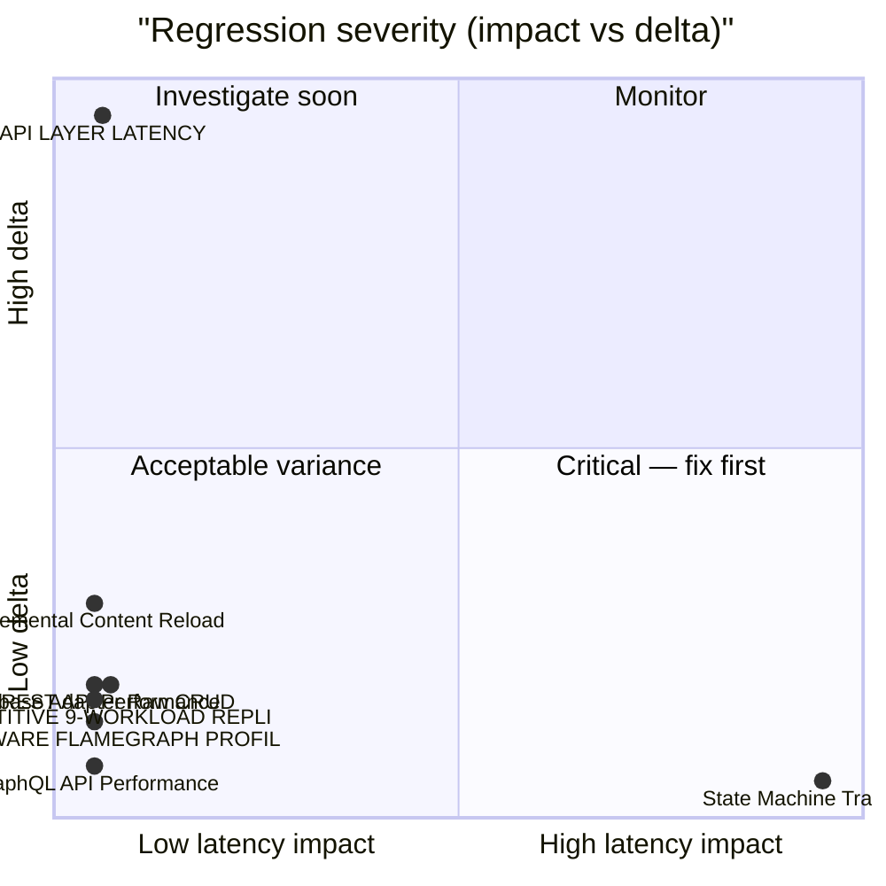

# 🚀 MongoDB+Redis Performance Ledger

> [!NOTE] Competitive comparisons based on publicly available documentation as of June 2026. All SveltyCMS metrics self-measured via `bun test tests/benchmarks/`.

> [!IMPORTANT]
> **Console-only by default.** Use `BENCHMARK_RECORD=1` to write results to this report.
>
> ```bash
> BENCHMARK_RECORD=1 bun test tests/benchmarks/auth-performance.test.ts
> ```
>
> The full matrix runner (`bun run scripts/benchmark-matrix/index.ts --sql`) always records.

<!-- BENCHMARK_START -->

<!-- EXECUTIVE_START -->
<!-- LATEST_AUDIT_HEADER -->

## 📊 Latest Performance Audit

<!-- EXECUTIVE_FIX_NOTES_START -->

### 📝 Fix Overlays

> [!NOTE]
> Phase notes and remediation entries appear here after matrix or surgical runs.

<!-- EXECUTIVE_FIX_NOTES_END -->

(06/10/2026, 14:48:32)

**✅ PASS** · 19/39 tests · 20 skipped · **MONGODB+REDIS** · Bun 1.4.2

### Dimension health

| Dimension      | Tests | Status | Worst Δ | Issues |
| -------------- | ----: | ------ | ------- | ------ |
| **Core**       |    10 | 🟢     | +511%   | 0      |
| **API**        |     9 | 🟢     | +92%    | 0      |
| **Scale**      |    15 | 🟢     | +113%   | 0      |
| **Resilience** |     5 | 🟢     | —       | 0      |

### Issues (action required)

> ✅ **All clear** — no regressions or budget violations detected.

### Executive latency matrix

| Scenario               | Latency | Trend  | Budget   | Result |
| ---------------------- | ------- | ------ | -------- | ------ |
| **Cold Start**         | N/A     | ⚪ (—) | < 5000ms | ⚪ N/A |
| **REST (Collections)** | N/A     | ⚪ (—) | < 5ms    | ⚪ N/A |
| **Middleware Hooks**   | N/A     | ⚪     | < 2ms    | ⚪ N/A |
| **GraphQL (Avg)**      | N/A     | ⚪ (—) | < 5ms    | ⚪ N/A |
| **Million-Row Index**  | N/A     | ⚪     | < 250ms  | ⚪ N/A |
| **DB Raw (p95)**       | N/A     | ⚪     | < 50ms   | ⚪ N/A |

### Historical pulse

> **Scope:** Sparklines only — full run tables: [`tests/benchmarks/results/history.sqlite`](../../../tests/benchmarks/results/history.sqlite)

| Metric | Trend | Sparkline | Latest |
| ------ | ----- | --------- | ------ |

<details>
<summary>📈 Latency trend chart (last 10 runs)</summary>

```mermaid
xychart-beta
  title "MONGODB+REDIS REST p95 (last 10 runs)"
  x-axis ["R1", "R2", "R3", "R4", "R5", "R6", "R7", "R8", "R9", "R10"]
  y-axis "Latency (ms)"
  line "p95" : [0.000, 0.000, 0.000, 0.000, 0.000, 0.000, 0.000, 0.000, 0.000, 0.000]
```

</details>
<details>
<summary>📊 Regression severity matrix (quadrant)</summary>



</details>

<!-- EXECUTIVE_PARTIAL_WATERMARK -->

> 📋 **Partial report** — run full matrix for complete cross-DB analysis.

<!-- EXECUTIVE_ALERTS_START -->

> 📋 **Partial report** — run full matrix for complete cross-DB analysis.

### 🔴 Top Regressions

> **🔴 sharp-vs-bun-image [Bun.Image Metadata (header-only)]** (mongodb-redis): +127% | 0.01ms vs 0.00ms baseline
> **🔴 seo-performance [Robots.txt Generation]** (mongodb-redis): +32% | 1.61ms vs 1.22ms baseline
> **🟠 truth-latency [Local SDK (Full)]** (mongodb-redis): +20% | 0.01ms vs 0.01ms baseline
> **🟠 media-performance [Media: Duplicate Upload (identical bytes)]** (mongodb-redis): +15% | 7.78ms vs 6.76ms baseline
> **🟠 api-latency [HTTP: findById TURBO-HIT idle (Warm)]** (mongodb-redis): +15% | 0.21ms vs 0.19ms baseline

### 🟢 Top Improvements

> **local-cms-crud [LocalCMS findById (Warm)]** (mongodb-redis): -50% | 0.00ms vs 0.00ms baseline
> **admin-ux-vitality [Schema Resolution (8f)]** (mongodb-redis): -46% | 0.24ms vs 0.46ms baseline
> **scale-spectrum [create @ 100000]** (mongodb-redis): -45% | 2.05ms vs 3.75ms baseline
> **index-pressure [Sorted List (25k rows)]** (mongodb-redis): -45% | 0.39ms vs 0.70ms baseline
> **scale-spectrum [listFilterSort @ 50000]** (mongodb-redis): -43% | 0.63ms vs 1.10ms baseline

<!-- EXECUTIVE_ALERTS_END --><!-- EXECUTIVE_END -->

<!-- SUMMARY_START -->
<!-- SUMMARY_RUN_OVERLAY_START -->

### Current Run Summary

> Only tests that ran in THIS invocation. Populated after `BENCHMARK_RECORD=1` or matrix run.

<!-- SUMMARY_RUN_OVERLAY_END -->

<!-- SUMMARY_HISTORY_START -->

### Historical Trends (2026-10-06)

> **Mode:** production-parity matrix runs only (`run_mode='matrix'` + `server_mode='production'` — `NODE_ENV=production`, no `TEST_MODE`). Standalone/mode-variant samples are recorded but never trended here.

> **Scope:** Sparklines only — full run tables live in `history.sqlite` (link below). Runs = sparkline bar count.

**Detail:** [`tests/benchmarks/results/history.sqlite`](../../../tests/benchmarks/results/history.sqlite) · `SELECT test_id, phase, server_mode, avg_ms, p95_ms, rps, timestamp FROM runs WHERE db_type='mongodb' AND redis=1 ORDER BY timestamp DESC`

**Series:** 56 · **DB:** mongodb-redis

| Metric                              | Trend | Sparkline (last 7) | Latest   |
| ----------------------------------- | ----- | ------------------ | -------- |
| ADMIN UX VITALITY (warm)            | 🟢    | `█▂▇▁`             | 0.244ms  |
| AI PERFORMANCE (warm)               | 🟢    | `▁▁▁▁`             | 0.000ms  |
| API LATENCY (warm)                  | 🟢    | `▁▆█▂▁▁▆`          | 1.816ms  |
| AUTH PERFORMANCE (warm)             | 🟢    | `▄▄▁▄█▄▄`          | 0.797ms  |
| AUTH SESSION AMR (warm)             | 🟢    | `█▅▆▂▃▁▃`          | 0.696ms  |
| BUILD ANALYSIS (warm)               | 🟢    | `▁▁`               | 0.000ms  |
| CACHE HIT RATIO (warm)              | 🟢    | `▂▁█▅▁▁▇`          | 1.405ms  |
| CACHE PERFORMANCE (warm)            | 🟢    | `▂█▁▇`             | 0.857ms  |
| CACHE SERVICE (warm)                | 🟢    | `▁▄█▁▄▆`           | 0.717ms  |
| CLIENT JOURNEY (warm)               | 🟢    | `█▁`               | 3.470ms  |
| COMPETITIVE WORKLOAD REPLICA (warm) | 🟢    | `▁▁▁▃▂█▃`          | 1.271ms  |
| CONCURRENCY MAX (warm)              | 🟢    | `█▁`               | 69.379ms |
| CONTENT GUI SAVE (warm)             | 🟢    | `█▁`               | 1.366ms  |
| CONTENT SCALE STRESS (warm)         | 🟢    | `█▁▇▁`             | 0.146ms  |
| CONTENT SCAN (warm)                 | 🟢    | `█▂▇▁`             | 0.671ms  |
| DATABASE PERFORMANCE (warm)         | 🟢    | `▁▃██▁▁▂`          | 1.302ms  |
| EDGE SYNC (warm)                    | 🟢    | `█▁`               | 2.680ms  |
| ENTRY EDIT HYDRATION (warm)         | 🟢    | `▁▁▆█▁▁▆`          | 0.017ms  |
| GRAPHQL API PERFORMANCE (warm)      | 🟢    | `▁▅▄█▆▁▁`          | 0.740ms  |
| GRAPHQL CACHE HIT (warm)            | 🟢    | `▂▅▁█▁▄▁`          | 1.082ms  |
| GRAPHQL LOCAL SDK (warm)            | 🟢    | `█▁█▁`             | 0.000ms  |
| GRAPHQL STRESS (warm)               | 🟢    | `█▁▂▃▁▅▇`          | 9.302ms  |
| HOOKS PERFORMANCE (warm)            | 🟢    | `▄▄▁█▁▅▃`          | 0.619ms  |
| INDEX PRESSURE (warm)               | 🟢    | `▄█▁▂`             | 0.387ms  |
| LARGE PAYLOAD STREAMING (warm)      | 🟢    | `▂▆█▁▂▆█`          | 14.188ms |
| LOCAL API PERFORMANCE (warm)        | 🟢    | `█▆▁▇██`           | 0.633ms  |
| LOCAL API THROUGHPUT (warm)         | 🟢    | `█▂▆▁`             | 2.395ms  |
| LOCAL CMS CRUD (warm)               | 🟢    | `▃▃▃▃▁█▄`          | 0.819ms  |
| LOCAL SDK VS DIRECT (warm)          | 🟢    | `▁▆▁▅▂▇█`          | 0.771ms  |
| MEDIA PERFORMANCE (warm)            | 🟢    | `▁▆▁▄▂▂█`          | 99.812ms |
| MEDIA UPLOAD STRESS (warm)          | 🟢    | `▁█▁▂`             | 7.117ms  |
| MEMORY COUNTERS (warm)              | 🟢    | `▁▁`               | 0.000ms  |
| MIDDLEWARE FLAMEGRAPH (warm)        | 🟢    | `▄▅▃█▁▁█`          | 1.311ms  |
| MIGRATION SCALE (warm)              | 🟢    | `█▂▁▇▁▁`           | 0.512ms  |
| MIXED WORKLOAD (warm)               | 🟢    | `█▁`               | 0.752ms  |
| MULTI TENANT PERFORMANCE (warm)     | 🟢    | `█▁`               | 0.545ms  |
| OPENAPI PERFORMANCE (warm)          | 🟢    | `▆▁█▆▁▇`           | 1.278ms  |
| PRODUCTION DAY (warm)               | 🟢    | `█▁`               | 1.528ms  |
| REALTIME PERFORMANCE (warm)         | 🟢    | `▁▁▁▁▁▁`           | 0.000ms  |
| REST API PERFORMANCE (warm)         | 🟢    | `▃▇▂▁▃▁█`          | 1.989ms  |
| REVISION STRESS (warm)              | 🟢    | `▂█▂▁▇▁`           | 0.291ms  |
| RIGHT TO BE FORGOTTEN AUDIT (warm)  | 🟢    | `█▁`               | 6.501ms  |
| SCALE SPECTRUM (warm)               | 🟢    | `█▅▂▅▃▁▁`          | 0.629ms  |
| SECURITY AUDIT (warm)               | 🟢    | `█▁▁▁▁▁▁`          | 0.001ms  |
| SEO PERFORMANCE (warm)              | 🟢    | `█▁▁▁▇▁▁`          | 1.614ms  |
| SHARP VS BUN IMAGE (warm)           | 🟢    | `▅▅▁▁▂██`          | 49.504ms |
| STATE MACHINE TRANSITION (warm)     | 🟢    | `▅█▅▁`             | 28.154ms |
| TELEMETRY PERFORMANCE (warm)        | 🟢    | `█▁█▁`             | 0.000ms  |
| TEMPORAL INTEGRITY (warm)           | 🟢    | `█▁`               | 2.951ms  |
| TRANSACTION ACID (warm)             | 🟢    | `▁█▁█`             | 0.648ms  |
| TRUTH LATENCY (warm)                | 🟢    | `▃▁▁█▃▁▁`          | 0.000ms  |
| WEBSOCKET BROADCAST (warm)          | 🟢    | `█▁`               | 0.138ms  |
| WIDGET PERFORMANCE (warm)           | 🟢    | `█▁▆█▁▆`           | 0.544ms  |
| CONFIG PROMOTION (warm)             | ⚪    | `▃▅▆▅█▁▁`          | 6.115ms  |
| CONTENT INCREMENTAL RELOAD (warm)   | ⚪    | `▃▁█▃▂▁▆`          | 0.550ms  |
| NEGATIVE CACHE (warm)               | ⚪    | `▇▇▁▇█▁`           | 0.001ms  |

<!-- SUMMARY_HISTORY_END --><!-- SUMMARY_END -->

<details>
<summary>📊 Infrastructure drill-down (expand for adapter, hooks, memory trends)</summary>

## 📊 Infrastructure drill-down

### 🏷️ Mixed Workload Performance {#mixedAvg}

**Mixed p95:** — (not measured in this run) | **Trend:** ⚪ (—)

> Production request mix: 60% Reads, 20% Writes, 15% GraphQL, 5% Media.

### 🏷️ Database Adapter Performance {#dbRaw}

**Raw Adapter p95:** — (not measured in this run) | **Target:** < 50ms | **Trend:** ⚪ (—)

> Direct database access latency (bypass CMS logic).

### 🏷️ Middleware & Hooks Audit {#hooks}

**Middleware p95:** — (not measured in this run) | **Target:** < 2ms | **Trend:** ⚪ (—)

> Total overhead of security, logging, and auth hooks.

### 🏷️ Memory Stability Audit {#memGrowth}

**Memory RSS Δ:** — (not measured in this run) | **Target:** < 60MB | **Trend:** ⚪ (—)

> Peak memory growth during stress workload.

### Enterprise scale audit

### 🏷️ Multi-Tenancy Performance {#tenancyAvg}

**Tenancy p95:** — (not measured in this run) | **Trend:** ⚪ (—)

> Measures latency across tenant isolation boundaries.

### 🏷️ Relational Resolver Latency {#relationalAvg}

**Relational p95:** — (not measured in this run) | **Trend:** ⚪ (—)

> Tests performance of complex JOINs and nested relationship population.

### 🏷️ Telemetry & Update Performance {#telemetryAvg}

**Telemetry p95:** — (not measured in this run) | **Trend:** ⚪ (—)

> Measures overhead of telemetry collection and cryptographic signing.

</details>

<!-- LEDGER_START -->

## 🔬 Full benchmark ledger (35 modules)

Expand dimension groups, then any row, for ASCII truth tables. Executive summary above shows pass/fail and issues only.

<!-- LEDGER_DIMENSION:CORE:START -->

<details id="ledger-dimension-core">
<summary><strong>Core</strong> · 10 tests</summary>

<!-- SECTION:API_LATENCY:START -->
<details id="section-api_latency">
<summary><strong>🏷️ API LAYER LATENCY</strong> · ⚪ 1.816ms · ↗️ — · <a href="../../../tests/benchmarks/api-latency.test.ts">source</a></summary>
<!-- LEDGER_INSIGHT_START -->
> [!NOTE]
> **Specific to this test**: Both avg and p95 degraded — likely adapter or infrastructure bottleneck. Check DB connection pool, indexes, or recent commits.  
Throughput dropped 80% — check connection pool saturation or lock contention.  
**Severe degradation** (+511%) — review recent commits immediately.
> **Check**: `src/routes/api/[...path]/+server.ts` · `src/hooks.server.ts`
<!-- LEDGER_INSIGHT_END -->

<!-- LEDGER_TRUTH_START -->

> ⏳ **API LAYER LATENCY**: Pending execution.
> 🎯 Measures the base network and HTTP overhead for the simplest possible API calls.

<!-- LEDGER_TRUTH_END -->

</details>
<!-- SECTION:API_LATENCY:END -->

<!-- SECTION:COLD_START:START -->
<details id="section-cold_start">
<summary><strong>🏷️ PHASED COLD START</strong> · ⚪ ⏳ pending · ➡️ — · <a href="../../../tests/benchmarks/cold-start-phased.test.ts">source</a></summary>
<!-- LEDGER_TRUTH_START -->
> ⏳ **PHASED COLD START**: Pending execution.
> 🎯 Measures the time to READY state (serving traffic) vs WARMED state (background tasks).
<!-- LEDGER_TRUTH_END -->

</details>
<!-- SECTION:COLD_START:END -->

<!-- SECTION:TRUTH_AUDIT:START -->
<details id="section-truth_audit">
<summary><strong>🏷️ SRE TRUTH AUDIT</strong> · ⚪ ⏳ pending · ↘️ — · <a href="../../../tests/benchmarks/truth-latency.test.ts">source</a></summary>
<!-- LEDGER_INSIGHT_START -->
> [!NOTE]
> **Specific to this test**: Performance improved — recent optimizations or cache warming likely effective.
<!-- LEDGER_INSIGHT_END -->

<!-- LEDGER_TRUTH_START -->

```text
╔═══════════════════════════════════════════════════════════════════════════════════════════════════════╗
║                                      SVELTYCMS — SRE TRUTH AUDIT                                      ║
║                             File: tests/benchmarks/truth-latency.test.ts                              ║
║                                       Ran: 2026-10-06 12:40:05                                        ║
║            Validates performance claims by comparing SDK, Middleware, and Real HTTP Stack             ║
╠═══════════════════════════════════════════════════════════════════════════════════════════════════════╣
║ Logic Baseline               │ Cold:     0.01 ms │ Warm:     0.000 ms │ p95:     0.000 ms │ 582,751 RPS ║
║ Local SDK (Full)             │ Cold:    14.49 ms │ Warm:     0.006 ms │ p95:     0.012 ms │ 135,974 RPS ║
║ HTTP End-to-End              │ Cold:     4.34 ms │ Warm:     0.252 ms │ p95:     0.322 ms │   3,940 RPS ║
║ HTTP Cold (Cache-Busted)     │ Cold:     2.26 ms │ Warm:     1.102 ms │ p95:     1.428 ms │     906 RPS ║
╚═══════════════════════════════════════════════════════════════════════════════════════════════════════╝
```

<!-- LEDGER_TRUTH_END -->

</details>
<!-- SECTION:TRUTH_AUDIT:END -->

<!-- SECTION:INCREMENTAL:START -->
<details id="section-incremental">
<summary><strong>🏷️ Incremental Content Reload</strong> · ⚪ 0.550ms · ↗️ — · <a href="../../../tests/benchmarks/content-incremental-reload.test.ts">source</a></summary>
<!-- LEDGER_INSIGHT_START -->
> [!NOTE]
> **Specific to this test**: Both avg and p95 degraded — likely adapter or infrastructure bottleneck. Check DB connection pool, indexes, or recent commits.  
Throughput dropped 72% — check connection pool saturation or lock contention.  
**Severe degradation** (+150%) — review recent commits immediately.
> **Check**: `src/content/engine.server.ts` · `src/routes/api/[...path]/handlers/content.ts`
<!-- LEDGER_INSIGHT_END -->

<!-- LEDGER_TRUTH_START -->

```text
╔═══════════════════════════════════════════════════════════════════════════════════════════════════════╗
║                             SVELTYCMS — INCREMENTAL CONTENT RELOAD AUDIT                              ║
║                       File: tests/benchmarks/content-incremental-reload.test.ts                       ║
║                                       Ran: 2026-10-06 12:44:32                                        ║
║      Measures surgical single-file fullReload vs full reconciliation path and batch processing.       ║
╠═══════════════════════════════════════════════════════════════════════════════════════════════════════╣
║ Incremental fullReload (1 file) │ Cold:     4.74 ms │ Warm:     0.066 ms │ p95:     0.124 ms │  13,661 RPS ║
║ Full Reconciliation Reload   │ Cold:     2.41 ms │ Warm:     0.171 ms │ p95:     0.250 ms │   5,627 RPS ║
║ Sequential 10-File Reload    │ Cold:     4.12 ms │ Warm:     0.550 ms │ p95:     0.791 ms │   1,700 RPS ║
║ Batched 10-File Reload       │ Cold:     0.88 ms │ Warm:     0.248 ms │ p95:     0.444 ms │   3,485 RPS ║
╚═══════════════════════════════════════════════════════════════════════════════════════════════════════╝
```

<!-- LEDGER_TRUTH_END -->

</details>
<!-- SECTION:INCREMENTAL:END -->

<!-- SECTION:STATE_MACHINE:START -->
<details id="section-state_machine">
<summary><strong>🏷️ State Machine Transitions</strong> · ⚪ 28.154ms · ↘️ — · <a href="../../../tests/benchmarks/state-machine-transition.test.ts">source</a></summary>
<!-- LEDGER_INSIGHT_START -->
> [!NOTE]
> **Specific to this test**: Performance improved — recent optimizations or cache warming likely effective.
<!-- LEDGER_INSIGHT_END -->

<!-- LEDGER_TRUTH_START -->

```text
╔═══════════════════════════════════════════════════════════════════════════════════════════════════════╗
║                                  SVELTYCMS — STATE MACHINE INTEGRITY                                  ║
║                        File: tests/benchmarks/state-machine-transition.test.ts                        ║
║                                       Ran: 2026-10-06 12:44:44                                        ║
║Measures state machine self-healing transition latencies, convergence settling time, and health probe consistency under stress.║
╠═══════════════════════════════════════════════════════════════════════════════════════════════════════╣
║ State Transition (Transient) │ Cold:    38.72 ms │ Warm:    28.154 ms │ p95:    35.104 ms │      36 RPS ║
║ Self-Healing Full Convergence │ Cold:    31.24 ms │ Warm:    31.280 ms │ p95:    35.127 ms │      33 RPS ║
╚═══════════════════════════════════════════════════════════════════════════════════════════════════════╝
```

<!-- LEDGER_TRUTH_END -->

</details>
<!-- SECTION:STATE_MACHINE:END -->

<!-- SECTION:DB_RAW_P95:START -->
<details id="section-db_raw_p95">
<summary><strong>🏷️ Database Adapter Raw CRUD</strong> · ⚪ 1.302ms · ↗️ — · <a href="../../../tests/benchmarks/database-performance.test.ts">source</a></summary>
<!-- LEDGER_INSIGHT_START -->
> [!NOTE]
> **Specific to this test**: Avg degraded but p95 stable — possible cold-start effect, GC pause, or warmup variance.  
Throughput dropped 99% — check connection pool saturation or lock contention.  
**Severe degradation** (+91%) — review recent commits immediately.
<!-- LEDGER_INSIGHT_END -->

<!-- LEDGER_TRUTH_START -->

> ⏳ **Database Adapter Raw CRUD**: Pending execution.
> 🎯 Direct low-level benchmarks of Create, Read, Update, Delete on the current database adapter.

<!-- LEDGER_TRUTH_END -->

</details>
<!-- SECTION:DB_RAW_P95:END -->

<!-- SECTION:ACID:START -->
<details id="section-acid">
<summary><strong>🏷️ ACID Transaction Overhead</strong> · ⚪ 0.648ms · ➡️ — · <a href="../../../tests/benchmarks/transaction-acid.test.ts">source</a></summary>
<!-- LEDGER_TRUTH_START -->
```text
╔═══════════════════════════════════════════════════════════════════════════════════════════════════════╗
║                                   SVELTYCMS — ACID INTEGRITY AUDIT                                    ║
║                            File: tests/benchmarks/transaction-acid.test.ts                            ║
║                                       Ran: 2026-10-06 12:44:16                                        ║
║         Measures transaction commit latencies and rollback overhead across database adapters          ║
╠═══════════════════════════════════════════════════════════════════════════════════════════════════════╣
║ TX Commit                    │ Cold:     0.05 ms │ Warm:     0.000 ms │ p95:     0.002 ms │ 848,536 RPS ║
║ TX Rollback Integrity        │ Cold:     1.73 ms │ Warm:     0.648 ms │ p95:     0.796 ms │   1,538 RPS ║
╚═══════════════════════════════════════════════════════════════════════════════════════════════════════╝
```
<!-- LEDGER_TRUTH_END -->

</details>
<!-- SECTION:ACID:END -->

<!-- SECTION:COMPETITIVE:START -->
<details id="section-competitive">
<summary><strong>🏷️ COMPETITIVE 9-WORKLOAD REPLICA</strong> · ⚪ 1.271ms · ↗️ — · <a href="../../../tests/benchmarks/competitive-workload-replica.test.ts">source</a></summary>
<!-- LEDGER_INSIGHT_START -->
> [!NOTE]
> **Specific to this test**: Avg degraded but p95 stable — possible cold-start effect, GC pause, or warmup variance.  
Throughput dropped 87% — check connection pool saturation or lock contention.  
**Severe degradation** (+82%) — review recent commits immediately.
<!-- LEDGER_INSIGHT_END -->

<!-- LEDGER_TRUTH_START -->

```text
╔═══════════════════════════════════════════════════════════════════════════════════════════════════════╗
║                    COMPETITIVE HARNESS REPLICA (MONGODB — 500 Docs, COLD vs WARM)                     ║
║                      File: tests/benchmarks/competitive-workload-replica.test.ts                      ║
║                                       Ran: 2026-10-06 12:46:50                                        ║
║              Seq + concurrent (8 workers), harness iteration counts, median of N rounds.              ║
╠═══════════════════════════════════════════════════════════════════════════════════════════════════════╣
║ findById (Cold Sequential)   │ Cold:     3.83 ms │ Warm:     0.404 ms │ p95:     0.562 ms │   2,425 RPS ║
║ findById (Cold Concurrent 8c) │ Cold:     1.49 ms │ Warm:     1.732 ms │ p95:     2.081 ms │   4,470 RPS ║
║ findByIdRandom (Cold Sequential) │ Cold:     2.27 ms │ Warm:     1.176 ms │ p95:     1.556 ms │     848 RPS ║
║ findByIdRandom (Cold Concurrent 8c) │ Cold:     2.27 ms │ Warm:     3.616 ms │ p95:     4.069 ms │   2,146 RPS ║
║ listFilterSort (Cold Sequential) │ Cold:     4.46 ms │ Warm:     0.411 ms │ p95:     0.477 ms │   2,418 RPS ║
║ listFilterSort (Cold Concurrent 8c) │ Cold:     0.46 ms │ Warm:     1.604 ms │ p95:     2.815 ms │   4,847 RPS ║
║ listLarge (Cold Sequential)  │ Cold:     6.25 ms │ Warm:     0.441 ms │ p95:     0.513 ms │   2,257 RPS ║
║ listLarge (Cold Concurrent 8c) │ Cold:     0.40 ms │ Warm:     0.966 ms │ p95:     1.255 ms │   7,960 RPS ║
║ listPlain (Cold Sequential)  │ Cold:     3.43 ms │ Warm:     0.273 ms │ p95:     0.317 ms │   3,648 RPS ║
║ listPlain (Cold Concurrent 8c) │ Cold:     0.31 ms │ Warm:     0.857 ms │ p95:     1.228 ms │   8,976 RPS ║
║ findMissing (Cold Sequential) │ Cold:     2.32 ms │ Warm:     0.216 ms │ p95:     0.253 ms │   4,613 RPS ║
║ findMissing (Cold Concurrent 8c) │ Cold:     0.19 ms │ Warm:     0.620 ms │ p95:     0.804 ms │  12,445 RPS ║
║ create (Cold Sequential)     │ Cold:     4.25 ms │ Warm:     1.629 ms │ p95:     2.844 ms │     613 RPS ║
║ create (Cold Concurrent 8c)  │ Cold:     4.16 ms │ Warm:     6.295 ms │ p95:     7.202 ms │   1,233 RPS ║
║ update (Cold Sequential)     │ Cold:     3.50 ms │ Warm:     1.744 ms │ p95:     2.742 ms │     573 RPS ║
║ update (Cold Concurrent 8c)  │ Cold:     4.41 ms │ Warm:     6.071 ms │ p95:     6.707 ms │   1,283 RPS ║
║ graphql (Cold Sequential)    │ Cold:     4.51 ms │ Warm:     1.219 ms │ p95:     4.016 ms │     819 RPS ║
║ graphql (Cold Concurrent 8c) │ Cold:     2.13 ms │ Warm:     1.977 ms │ p95:     3.806 ms │   3,933 RPS ║
║ mixed (Cold Sequential)      │ Cold:     1.56 ms │ Warm:     0.905 ms │ p95:     1.519 ms │   1,103 RPS ║
║ mixed (Cold Concurrent 8c)   │ Cold:     0.36 ms │ Warm:     3.331 ms │ p95:     5.831 ms │   2,356 RPS ║
║ findById (Warm Sequential)   │ Cold:     0.66 ms │ Warm:     0.208 ms │ p95:     0.277 ms │   4,778 RPS ║
║ findById (Warm Concurrent 8c) │ Cold:     0.13 ms │ Warm:     0.576 ms │ p95:     0.703 ms │  13,757 RPS ║
║ findByIdRandom (Warm Sequential) │ Cold:     0.66 ms │ Warm:     0.237 ms │ p95:     0.319 ms │   4,206 RPS ║
║ findByIdRandom (Warm Concurrent 8c) │ Cold:     0.28 ms │ Warm:     0.617 ms │ p95:     0.812 ms │  12,875 RPS ║
║ listFilterSort (Warm Sequential) │ Cold:     0.74 ms │ Warm:     0.217 ms │ p95:     0.302 ms │   4,572 RPS ║
║ listFilterSort (Warm Concurrent 8c) │ Cold:     0.26 ms │ Warm:     0.709 ms │ p95:     0.935 ms │  11,079 RPS ║
║ listLarge (Warm Sequential)  │ Cold:     0.76 ms │ Warm:     0.309 ms │ p95:     0.433 ms │   3,222 RPS ║
║ listLarge (Warm Concurrent 8c) │ Cold:     0.37 ms │ Warm:     0.840 ms │ p95:     1.345 ms │   9,367 RPS ║
║ listPlain (Warm Sequential)  │ Cold:     0.77 ms │ Warm:     0.169 ms │ p95:     0.238 ms │   5,895 RPS ║
║ listPlain (Warm Concurrent 8c) │ Cold:     0.24 ms │ Warm:     0.502 ms │ p95:     0.659 ms │  15,624 RPS ║
║ findMissing (Warm Sequential) │ Cold:     2.28 ms │ Warm:     0.128 ms │ p95:     0.188 ms │   7,746 RPS ║
║ findMissing (Warm Concurrent 8c) │ Cold:     0.15 ms │ Warm:     0.403 ms │ p95:     0.563 ms │  19,245 RPS ║
║ create (Warm Sequential)     │ Cold:     2.82 ms │ Warm:     1.077 ms │ p95:     1.223 ms │     927 RPS ║
║ create (Warm Concurrent 8c)  │ Cold:     2.47 ms │ Warm:     4.610 ms │ p95:     7.314 ms │   1,720 RPS ║
║ update (Warm Sequential)     │ Cold:     3.39 ms │ Warm:     1.271 ms │ p95:     1.472 ms │     786 RPS ║
║ update (Warm Concurrent 8c)  │ Cold:     2.94 ms │ Warm:     5.011 ms │ p95:     7.819 ms │   1,579 RPS ║
║ graphql (Warm Sequential)    │ Cold:     1.66 ms │ Warm:     0.849 ms │ p95:     0.983 ms │   1,177 RPS ║
║ graphql (Warm Concurrent 8c) │ Cold:     0.99 ms │ Warm:     1.487 ms │ p95:     1.878 ms │   5,285 RPS ║
║ mixed (Warm Sequential)      │ Cold:     2.66 ms │ Warm:     0.700 ms │ p95:     1.562 ms │   1,427 RPS ║
║ mixed (Warm Concurrent 8c)   │ Cold:     1.06 ms │ Warm:     1.796 ms │ p95:     3.150 ms │   4,330 RPS ║
╚═══════════════════════════════════════════════════════════════════════════════════════════════════════╝
```

<!-- LEDGER_TRUTH_END -->

</details>
<!-- SECTION:COMPETITIVE:END -->

<!-- SECTION:FLAMEGRAPH:START -->
<details id="section-flamegraph">
<summary><strong>🏷️ MIDDLEWARE FLAMEGRAPH PROFILER</strong> · ⚪ 1.311ms · ↗️ — · <a href="../../../tests/benchmarks/middleware-flamegraph.test.ts">source</a></summary>
<!-- LEDGER_INSIGHT_START -->
> [!NOTE]
> **Specific to this test**: Both avg and p95 degraded — likely adapter or infrastructure bottleneck. Check DB connection pool, indexes, or recent commits.  
Throughput dropped 53% — check connection pool saturation or lock contention.  
**Severe degradation** (+68%) — review recent commits immediately.
<!-- LEDGER_INSIGHT_END -->

<!-- LEDGER_TRUTH_START -->

```text
╔═══════════════════════════════════════════════════════════════════════════════════════════════════════╗
║                               MIDDLEWARE FLAMEGRAPH PROFILER (MONGODB)                                ║
║                         File: tests/benchmarks/middleware-flamegraph.test.ts                          ║
║                                       Ran: 2026-10-06 12:47:33                                        ║
║Measures isolated microsecond cost and incremental deltas of each middleware stage from edge to database.║
╠═══════════════════════════════════════════════════════════════════════════════════════════════════════╣
║ Stage 0: Raw Socket Baseline (Static Asset) │ Cold:     2.60 ms │ Warm:     0.779 ms │ p95:     1.193 ms │   4,933 RPS ║
║ Stage 1: System State + Turbo Pipeline │ Cold:     1.07 ms │ Warm:     0.859 ms │ p95:     1.442 ms │   4,387 RPS ║
║ Stage 2: WAF Security Inspection │ Cold:     1.02 ms │ Warm:     0.572 ms │ p95:     0.826 ms │   6,568 RPS ║
║ Stage 3: Token Auth Gating   │ Cold:     6.43 ms │ Warm:     1.363 ms │ p95:     2.030 ms │   2,835 RPS ║
║ Stage 4: Collection Schema Resolution │ Cold:     2.23 ms │ Warm:     0.341 ms │ p95:     0.429 ms │  10,993 RPS ║
║ Stage 5: Full REST Single Document │ Cold:     4.68 ms │ Warm:     0.291 ms │ p95:     0.368 ms │  12,861 RPS ║
║ Stage 6: GraphQL Single Query (JIT) │ Cold:     4.82 ms │ Warm:     1.311 ms │ p95:     1.539 ms │   3,037 RPS ║
╚═══════════════════════════════════════════════════════════════════════════════════════════════════════╝
```

<!-- LEDGER_TRUTH_END -->

</details>
<!-- SECTION:FLAMEGRAPH:END -->

<!-- SECTION:EVENTLOOP:START -->
<details id="section-eventloop">
<summary><strong>🏷️ EVENT LOOP LAG & SATURATION</strong> · ⚪ ⏳ pending · ➡️ — · <a href="../../../tests/benchmarks/event-loop-lag.test.ts">source</a></summary>
<!-- LEDGER_TRUTH_START -->
> ⏳ **EVENT LOOP LAG & SATURATION**: Pending execution.
> 🎯 Measures event loop delay and microtask drain during continuous write bursts.
<!-- LEDGER_TRUTH_END -->

</details>
<!-- SECTION:EVENTLOOP:END -->

</details>

<!-- LEDGER_DIMENSION:CORE:END -->

<!-- LEDGER_DIMENSION:API:START -->

<details id="ledger-dimension-api">
<summary><strong>API</strong> · 9 tests</summary>

<!-- SECTION:TEMPORAL:START -->
<details id="section-temporal">
<summary><strong>🏷️ Temporal Integrity Audit</strong> · ⚪ 2.951ms · ➡️ — · <a href="../../../tests/benchmarks/temporal-integrity.test.ts">source</a></summary>
<!-- LEDGER_TRUTH_START -->
```text
╔═══════════════════════════════════════════════════════════════════════════════════════════════════════╗
║                                 SVELTYCMS — TEMPORAL INTEGRITY AUDIT                                  ║
║                           File: tests/benchmarks/temporal-integrity.test.ts                           ║
║                                       Ran: 2026-10-06 12:42:05                                        ║
║Validates strict backend UTC normalization (ISO 8601 with trailing 'Z') across global timezone offsets, fractional timezones, and midnight transitions.║
╠═══════════════════════════════════════════════════════════════════════════════════════════════════════╣
║ Temporal Ingestion & Normalization │ Cold:     2.38 ms │ Warm:     2.951 ms │ p95:     5.546 ms │   1,225 RPS ║
╚═══════════════════════════════════════════════════════════════════════════════════════════════════════╝
```
<!-- LEDGER_TRUTH_END -->

</details>
<!-- SECTION:TEMPORAL:END -->

<!-- SECTION:RELATIONAL:START -->
<details id="section-relational">
<summary><strong>🏷️ Relational & Nested Queries</strong> · ⚪ ⏳ pending · ➡️ — · <a href="../../../tests/benchmarks/relational-performance.test.ts">source</a></summary>
<!-- LEDGER_TRUTH_START -->
> ⏳ **Relational & Nested Queries**: Pending execution.
> 🎯 Stress-tests JOINs, population strategies, and deeply nested relationships (depth 2–3).
<!-- LEDGER_TRUTH_END -->

</details>
<!-- SECTION:RELATIONAL:END -->

<!-- SECTION:AUTH_TRACE:START -->
<details id="section-auth_trace">
<summary><strong>🏷️ Auth & RBAC Performance</strong> · ⚪ 0.797ms · ➡️ — · <a href="../../../tests/benchmarks/auth-performance.test.ts">source</a></summary>
<!-- LEDGER_TRUTH_START -->
> ⏳ **Auth & RBAC Performance**: Pending execution.
> 🎯 Measures JWT verification, session retrieval, and permission matrix resolution overhead.
<!-- LEDGER_TRUTH_END -->

</details>
<!-- SECTION:AUTH_TRACE:END -->

<!-- SECTION:REST:START -->
<details id="section-rest">
<summary><strong>🏷️ REST API Performance</strong> · ⚪ 1.989ms · ↗️ — · <a href="../../../tests/benchmarks/rest-api-performance.test.ts">source</a></summary>
<!-- LEDGER_INSIGHT_START -->
> [!NOTE]
> **Specific to this test**: Both avg and p95 degraded — likely adapter or infrastructure bottleneck. Check DB connection pool, indexes, or recent commits.  
Throughput dropped 48% — check connection pool saturation or lock contention.  
**Severe degradation** (+92%) — review recent commits immediately.
<!-- LEDGER_INSIGHT_END -->

<!-- LEDGER_TRUTH_START -->

```text
╔═══════════════════════════════════════════════════════════════════════════════════════════════════════╗
║                                 SVELTYCMS — ENTERPRISE REST API AUDIT                                 ║
║                          File: tests/benchmarks/rest-api-performance.test.ts                          ║
║                                       Ran: 2026-10-06 12:40:17                                        ║
║Measures latency, throughput, and correctness of core REST endpoints: health check, schema, single read, list, and search.║
╠═══════════════════════════════════════════════════════════════════════════════════════════════════════╣
║ System Health Check          │ Cold:     1.14 ms │ Warm:     1.989 ms │ p95:     2.921 ms │   5,807 RPS ║
║ Collection Schema Metadata   │ Cold:     3.09 ms │ Warm:     0.749 ms │ p95:     0.918 ms │  15,400 RPS ║
║ Single Document Read         │ Cold:     0.64 ms │ Warm:     0.742 ms │ p95:     0.875 ms │  15,449 RPS ║
║ Collection Find (List Limit 20) │ Cold:     5.33 ms │ Warm:     0.969 ms │ p95:     1.195 ms │  12,027 RPS ║
║ Collection Search Query      │ Cold:     3.09 ms │ Warm:     1.038 ms │ p95:     1.639 ms │  10,930 RPS ║
╚═══════════════════════════════════════════════════════════════════════════════════════════════════════╝
```

<!-- LEDGER_TRUTH_END -->

</details>
<!-- SECTION:REST:END -->

<!-- SECTION:GRAPHQL:START -->
<details id="section-graphql">
<summary><strong>🏷️ GraphQL API Performance</strong> · ⚪ 0.740ms · ↘️ — · <a href="../../../tests/benchmarks/graphql-api-performance.test.ts">source</a></summary>
<!-- LEDGER_INSIGHT_START -->
> [!NOTE]
> **Specific to this test**: Performance improved — recent optimizations or cache warming likely effective.  
Throughput dropped 60% — check connection pool saturation or lock contention.
<!-- LEDGER_INSIGHT_END -->

<!-- LEDGER_TRUTH_START -->

```text
╔═══════════════════════════════════════════════════════════════════════════════════════════════════════╗
║                                  SVELTYCMS — GRAPHQL CACHE HIT AUDIT                                  ║
║                           File: tests/benchmarks/graphql-cache-hit.test.ts                            ║
║                                       Ran: 2026-10-06 12:47:03                                        ║
║        Validates sub-millisecond L1 response cache hits, cache key isolation, and hit headers.        ║
╠═══════════════════════════════════════════════════════════════════════════════════════════════════════╣
║ Q1: Health (Cold Miss)         │        4.149 ms │ p95:        4.149 ms │ RPS:        241 ║
║ Q1: Health (L1 Hit)            │        1.101 ms │ p95:        1.966 ms │ RPS:        908 ║
║ Q2: Collections (Cold Miss)    │        2.190 ms │ p95:        2.190 ms │ RPS:        457 ║
║ Q2: Collections (L1 Hit)       │        1.082 ms │ p95:        1.257 ms │ RPS:        924 ║
╚═══════════════════════════════════════════════════════════════════════════════════════════════════════╝
```

<!-- LEDGER_TRUTH_END -->

</details>
<!-- SECTION:GRAPHQL:END -->

<!-- SECTION:SEO:START -->
<details id="section-seo">
<summary><strong>🏷️ Enterprise SEO Suite Audit</strong> · ⚪ 1.614ms · ➡️ — · <a href="../../../tests/benchmarks/seo-performance.test.ts">source</a></summary>
<!-- LEDGER_TRUTH_START -->
```text
╔═══════════════════════════════════════════════════════════════════════════════════════════════════════╗
║                                   SVELTYCMS — ENTERPRISE SEO AUDIT                                    ║
║                            File: tests/benchmarks/seo-performance.test.ts                             ║
║                                       Ran: 2026-10-06 12:41:10                                        ║
║Measures redirect lookup latency, dynamic sitemap.xml generation, robots.txt serving, and 404 logging performance.║
╠═══════════════════════════════════════════════════════════════════════════════════════════════════════╣
║ Redirect Lookup (301)        │ Cold:     1.62 ms │ Warm:     1.555 ms │ p95:     2.206 ms │   5,094 RPS ║
║ Dynamic Sitemap XML          │ Cold:     5.13 ms │ Warm:     0.845 ms │ p95:     1.139 ms │   9,368 RPS ║
║ Robots.txt Generation        │ Cold:     1.47 ms │ Warm:     1.614 ms │ p95:     2.653 ms │   4,923 RPS ║
║ Missing Path (404 Log)       │ Cold:    55.60 ms │ Warm:    15.758 ms │ p95:    22.088 ms │     505 RPS ║
╚═══════════════════════════════════════════════════════════════════════════════════════════════════════╝
```
<!-- LEDGER_TRUTH_END -->

</details>
<!-- SECTION:SEO:END -->

<!-- SECTION:BROADCAST:START -->
<details id="section-broadcast">
<summary><strong>🏷️ REAL-TIME BROADCAST AUDIT</strong> · ⚪ 0.138ms · ➡️ — · <a href="../../../tests/benchmarks/websocket-broadcast.test.ts">source</a></summary>
<!-- LEDGER_TRUTH_START -->
> ⏳ **REAL-TIME BROADCAST AUDIT**: Pending execution.
> 🎯 Benchmarks network-layer broadcast latency (SSE vs WebSocket).
<!-- LEDGER_TRUTH_END -->

</details>
<!-- SECTION:BROADCAST:END -->

<!-- SECTION:REAL_TIME:START -->
<details id="section-real_time">
<summary><strong>🏷️ WebSocket & Realtime Latency</strong> · ⚪ ⏳ pending · ➡️ — · <a href="../../../tests/benchmarks/realtime-performance.test.ts">source</a></summary>
<!-- LEDGER_TRUTH_START -->
> ⏳ **WebSocket & Realtime Latency**: Pending execution.
> 🎯 Benchmarks WebSocket connection/broadcast latency.
<!-- LEDGER_TRUTH_END -->

</details>
<!-- SECTION:REAL_TIME:END -->

<!-- SECTION:GQL_CACHE:START -->
<details id="section-gql_cache">
<summary><strong>🏷️ GraphQL Response Cache Hit</strong> · ⚪ 1.082ms · ↘️ — · <a href="../../../tests/benchmarks/graphql-cache-hit.test.ts">source</a></summary>
<!-- LEDGER_INSIGHT_START -->
> [!NOTE]
> **Specific to this test**: Performance improved — recent optimizations or cache warming likely effective.
<!-- LEDGER_INSIGHT_END -->

<!-- LEDGER_TRUTH_START -->

> ⏳ **GraphQL Response Cache Hit**: Pending execution.
> 🎯 L1 response cache: cold-query vs cache-hit latency verification.

<!-- LEDGER_TRUTH_END -->

</details>
<!-- SECTION:GQL_CACHE:END -->

</details>

<!-- LEDGER_DIMENSION:API:END -->

<!-- LEDGER_DIMENSION:SCALE:START -->

<details id="ledger-dimension-scale">
<summary><strong>Scale</strong> · 15 tests</summary>

<!-- SECTION:NEGATIVE_CACHE:START -->
<details id="section-negative_cache">
<summary><strong>🏷️ Negative Cache Performance</strong> · ⚪ 0.001ms · ↘️ — · <a href="../../../tests/benchmarks/negative-cache.test.ts">source</a></summary>
<!-- LEDGER_INSIGHT_START -->
> [!NOTE]
> **Specific to this test**: Performance improved — recent optimizations or cache warming likely effective.
<!-- LEDGER_INSIGHT_END -->

<!-- LEDGER_TRUTH_START -->

```text
╔═══════════════════════════════════════════════════════════════════════════════════════════════════════╗
║                             SVELTYCMS — NEGATIVE CACHE PERFORMANCE AUDIT                              ║
║                             File: tests/benchmarks/negative-cache.test.ts                             ║
║                                       Ran: 2026-10-06 12:40:51                                        ║
║Measures Bloom-filter style missing-key cache speedup for repeated misses against direct database miss baselines.║
╠═══════════════════════════════════════════════════════════════════════════════════════════════════════╣
║ Direct DB Miss Baseline      │ Cold:     2.69 ms │ Warm:     0.665 ms │ p95:     0.849 ms │   1,457 RPS ║
║ Cold Miss (Bypass Cache)     │ Cold:     8.11 ms │ Warm:     0.536 ms │ p95:     0.624 ms │   1,851 RPS ║
║ Hot Miss (Negative Cache)    │ Cold:     0.24 ms │ Warm:     0.001 ms │ p95:     0.003 ms │ 728,856 RPS ║
╚═══════════════════════════════════════════════════════════════════════════════════════════════════════╝
```

<!-- LEDGER_TRUTH_END -->

</details>
<!-- SECTION:NEGATIVE_CACHE:END -->

<!-- SECTION:MEMORY:START -->
<details id="section-memory">
<summary><strong>🏷️ Memory Stability & GC Behavior</strong> · ⚪ ⏳ pending · ➡️ — · <a href="../../../tests/benchmarks/memory-stability.test.ts">source</a></summary>
<!-- LEDGER_TRUTH_START -->
> ⏳ **Memory Stability & GC Behavior**: Pending execution.
> 🎯 Long-running soak test to identify memory leaks and GC pressure.
<!-- LEDGER_TRUTH_END -->

</details>
<!-- SECTION:MEMORY:END -->

<!-- SECTION:TENANCY:START -->
<details id="section-tenancy">
<summary><strong>🏷️ Multi-Tenant Performance & Isolation</strong> · ⚪ 0.545ms · ➡️ — · <a href="../../../tests/benchmarks/multi-tenant-performance.test.ts">source</a></summary>
<!-- LEDGER_TRUTH_START -->
```text
╔═══════════════════════════════════════════════════════════════════════════════════════════════════════╗
║                              SVELTYCMS — MULTI-TENANCY PERFORMANCE AUDIT                              ║
║                        File: tests/benchmarks/multi-tenant-performance.test.ts                        ║
║                                       Ran: 2026-10-06 12:40:56                                        ║
║Measures the overhead of tenant isolation, context switching, and data partitioning across many tenants.║
╠═══════════════════════════════════════════════════════════════════════════════════════════════════════╣
║ Single Tenant Baseline       │ Cold:     4.21 ms │ Warm:     0.658 ms │ p95:     0.937 ms │  11,310 RPS ║
║ Multi-Tenant Context Switching │ Cold:     0.83 ms │ Warm:     0.545 ms │ p95:     0.707 ms │  14,078 RPS ║
╚═══════════════════════════════════════════════════════════════════════════════════════════════════════╝
```
<!-- LEDGER_TRUTH_END -->

</details>
<!-- SECTION:TENANCY:END -->

<!-- SECTION:MIXED:START -->
<details id="section-mixed">
<summary><strong>🏷️ Realistic Mixed Workload</strong> · ⚪ 0.752ms · ➡️ — · <a href="../../../tests/benchmarks/mixed-workload.test.ts">source</a></summary>
<!-- LEDGER_TRUTH_START -->
```text
╔═══════════════════════════════════════════════════════════════════════════════════════════════════════╗
║                                   SVELTYCMS — MIXED WORKLOAD AUDIT                                    ║
║                             File: tests/benchmarks/mixed-workload.test.ts                             ║
║                                       Ran: 2026-10-06 12:41:13                                        ║
║Simulates real-world traffic with a weighted mix of reads, searches, GraphQL queries, and metadata requests with per-operation telemetry.║
╠═══════════════════════════════════════════════════════════════════════════════════════════════════════╣
║ Mixed Workload               │ Cold:     6.47 ms │ Warm:     0.752 ms │ p95:     2.312 ms │   8,234 RPS ║
║ Mix: REST Read                 │        0.835 ms │ p95:        1.224 ms │ RPS:      2,015 ║
║ Mix: REST Search               │        0.869 ms │ p95:        1.329 ms │ RPS:        669 ║
║ Mix: GraphQL                   │        2.333 ms │ p95:        3.392 ms │ RPS:        478 ║
║ Mix: Metadata                  │        0.866 ms │ p95:        1.317 ms │ RPS:        170 ║
╚═══════════════════════════════════════════════════════════════════════════════════════════════════════╝
```
<!-- LEDGER_TRUTH_END -->

</details>
<!-- SECTION:MIXED:END -->

<!-- SECTION:GQL_STRESS:START -->
<details id="section-gql_stress">
<summary><strong>🏷️ GraphQL Load Stress</strong> · ⚪ 9.302ms · ↗️ — · <a href="../../../tests/benchmarks/graphql-stress.test.ts">source</a></summary>
<!-- LEDGER_INSIGHT_START -->
> [!NOTE]
> **Specific to this test**: Both avg and p95 degraded — likely adapter or infrastructure bottleneck. Check DB connection pool, indexes, or recent commits.  
**Severe degradation** (+113%) — review recent commits immediately.
<!-- LEDGER_INSIGHT_END -->

<!-- LEDGER_TRUTH_START -->

> ⏳ **GraphQL Load Stress**: Pending execution.
> 🎯 High-concurrency GraphQL query stress test for resolver efficiency.

<!-- LEDGER_TRUTH_END -->

</details>
<!-- SECTION:GQL_STRESS:END -->

<!-- SECTION:MIGRATION:START -->
<details id="section-migration">
<summary><strong>🏷️ Bulk Migration & Scale</strong> · ⚪ 0.512ms · ↘️ — · <a href="../../../tests/benchmarks/migration-scale.test.ts">source</a></summary>
<!-- LEDGER_INSIGHT_START -->
> [!NOTE]
> **Specific to this test**: Performance improved — recent optimizations or cache warming likely effective.
<!-- LEDGER_INSIGHT_END -->

<!-- LEDGER_TRUTH_START -->

```text
╔═══════════════════════════════════════════════════════════════════════════════════════════════════════╗
║                                  SVELTYCMS — MIGRATION & SCALE AUDIT                                  ║
║                            File: tests/benchmarks/migration-scale.test.ts                             ║
║                                       Ran: 2026-10-06 12:45:26                                        ║
║Measures bulk ingestion throughput for 10,000 entries, random point-lookups, and indexed range scans across large datasets.║
╠═══════════════════════════════════════════════════════════════════════════════════════════════════════╣
║ Bulk Migration (10k docs)    │ Cold:    40.53 ms │ Warm:    19.405 ms │ p95:    26.135 ms │  23,995 RPS ║
║ Random Point Lookup          │ Cold:     3.25 ms │ Warm:     1.865 ms │ p95:     2.146 ms │   3,159 RPS ║
║ Range Scan & Pagination      │ Cold:    35.73 ms │ Warm:     0.512 ms │ p95:     0.916 ms │  10,650 RPS ║
╚═══════════════════════════════════════════════════════════════════════════════════════════════════════╝
```

<!-- LEDGER_TRUTH_END -->

</details>
<!-- SECTION:MIGRATION:END -->

<!-- SECTION:INDEX_PRESSURE:START -->
<details id="section-index_pressure">
<summary><strong>🏷️ Million-Row Index Pressure</strong> · ⚪ 0.387ms · ↘️ — · <a href="../../../tests/benchmarks/index-pressure.test.ts">source</a></summary>
<!-- LEDGER_INSIGHT_START -->
> [!NOTE]
> **Specific to this test**: Performance improved — recent optimizations or cache warming likely effective.
<!-- LEDGER_INSIGHT_END -->

<!-- LEDGER_TRUTH_START -->

```text
╔═══════════════════════════════════════════════════════════════════════════════════════════════════════╗
║                                  SVELTYCMS  —  INDEX PRESSURE AUDIT                                   ║
║                             File: tests/benchmarks/index-pressure.test.ts                             ║
║                                       Ran: 2026-10-06 12:42:17                                        ║
║           Measures read performance with sorting and filtering on a large entry collection.           ║
╠═══════════════════════════════════════════════════════════════════════════════════════════════════════╣
║ Sorted List (25k rows)       │ Cold:     2.63 ms │ Warm:     0.387 ms │ p95:     0.513 ms │  10,243 RPS ║
║ Filtered Query (25k rows)    │ Cold:     2.94 ms │ Warm:     0.339 ms │ p95:     0.385 ms │  11,730 RPS ║
╚═══════════════════════════════════════════════════════════════════════════════════════════════════════╝
```

<!-- LEDGER_TRUTH_END -->

</details>
<!-- SECTION:INDEX_PRESSURE:END -->

<!-- SECTION:CONTENT_STRESS:START -->
<details id="section-content_stress">
<summary><strong>🏷️ Content Scale Stress</strong> · ⚪ 0.146ms · ↘️ — · <a href="../../../tests/benchmarks/content-scale-stress.test.ts">source</a></summary>
<!-- LEDGER_INSIGHT_START -->
> [!NOTE]
> **Specific to this test**: Performance improved — recent optimizations or cache warming likely effective.
<!-- LEDGER_INSIGHT_END -->

<!-- LEDGER_TRUTH_START -->

> ⏳ **Content Scale Stress**: Pending execution.
> 🎯 Measures content scan performance on 1,000+ collections under .compiledCollections/test/stress (isolated).

<!-- LEDGER_TRUTH_END -->

</details>
<!-- SECTION:CONTENT_STRESS:END -->

<!-- SECTION:MEDIA_UPLOAD:START -->
<details id="section-media_upload">
<summary><strong>🏷️ Media Upload Stress & Throughput</strong> · ⚪ 7.117ms · ↗️ — · <a href="../../../tests/benchmarks/media-upload-stress.test.ts">source</a></summary>
<!-- LEDGER_INSIGHT_START -->
> [!NOTE]
> **Specific to this test**: Avg degraded but p95 stable — possible cold-start effect, GC pause, or warmup variance.
> **Check**: `src/services/MediaService.ts` · `src/databases/media/`
<!-- LEDGER_INSIGHT_END -->

<!-- LEDGER_TRUTH_START -->

```text
╔═══════════════════════════════════════════════════════════════════════════════════════════════════════╗
║                                 SVELTYCMS — MEDIA UPLOAD STRESS AUDIT                                 ║
║                          File: tests/benchmarks/media-upload-stress.test.ts                           ║
║                                       Ran: 2026-10-06 12:45:13                                        ║
║Measures throughput for large file uploads, concurrent transfers, and streaming efficiency with valid media fixtures.║
╠═══════════════════════════════════════════════════════════════════════════════════════════════════════╣
║ Single Upload (0.01MB)       │ Cold:    11.51 ms │ Warm:     6.242 ms │ p95:     6.761 ms │     160 RPS ║
║ Small Upload (0MB @ 4c)      │ Cold:     8.30 ms │ Warm:     7.117 ms │ p95:     9.450 ms │     539 RPS ║
╚═══════════════════════════════════════════════════════════════════════════════════════════════════════╝
```

<!-- LEDGER_TRUTH_END -->

</details>
<!-- SECTION:MEDIA_UPLOAD:END -->

<!-- SECTION:JOURNEY:START -->
<details id="section-journey">
<summary><strong>🏷️ Full Client Journey Simulation</strong> · ⚪ 3.470ms · ➡️ — · <a href="../../../tests/benchmarks/client-journey.test.ts">source</a></summary>
<!-- LEDGER_TRUTH_START -->
> ⏳ **Full Client Journey Simulation**: Pending execution.
> 🎯 E2E journey: Login -> List -> View -> Edit -> Save -> Realtime. Measures cumulative latency.
<!-- LEDGER_TRUTH_END -->

</details>
<!-- SECTION:JOURNEY:END -->

<!-- SECTION:CONCURRENCY:START -->
<details id="section-concurrency">
<summary><strong>🏷️ Concurrency & Race Condition</strong> · ⚪ ⏳ pending · ➡️ — · <a href="../../../tests/benchmarks/concurrency-race.test.ts">source</a></summary>
<!-- LEDGER_TRUTH_START -->
```text
╔═══════════════════════════════════════════════════════════════════════════════════════════════════════╗
║                                     SVELTYCMS — CONCURRENCY AUDIT                                     ║
║                            File: tests/benchmarks/concurrency-race.test.ts                            ║
║                                       Ran: 2026-10-06 12:45:32                                        ║
║          Simulates high-concurrency writes to a single document to prove atomic consistency.          ║
╠═══════════════════════════════════════════════════════════════════════════════════════════════════════╣
║ Concurrent PATCH Bomb          │       49.352 ms │ p95:       61.297 ms │ RPS:      1,584 ║
╚═══════════════════════════════════════════════════════════════════════════════════════════════════════╝
```
<!-- LEDGER_TRUTH_END -->

</details>
<!-- SECTION:CONCURRENCY:END -->

<!-- SECTION:THROUGHPUT:START -->
<details id="section-throughput">
<summary><strong>🏷️ Multi-Doc Concurrency Throughput</strong> · ⚪ ⏳ pending · ➡️ — · <a href="../../../tests/benchmarks/concurrency-throughput.test.ts">source</a></summary>
<!-- LEDGER_TRUTH_START -->
```text
╔═══════════════════════════════════════════════════════════════════════════════════════════════════════╗
║                            SVELTYCMS — DIRECT ADAPTER THROUGHPUT (MONGODB)                            ║
║                          File: tests/benchmarks/local-api-throughput.test.ts                          ║
║                                       Ran: 2026-10-06 12:42:28                                        ║
║Measures direct adapter write throughput, read throughput, and percentile latencies with zero HTTP overhead.║
╠═══════════════════════════════════════════════════════════════════════════════════════════════════════╣
║ Writes (1000 atomic increments) │        2.395 ms │ p95:        4.324 ms │ RPS:      2,373 ║
║ Reads (1000 point lookups)     │        4.280 ms │ p95:        6.851 ms │ RPS:      8,394 ║
╚═══════════════════════════════════════════════════════════════════════════════════════════════════════╝
```
<!-- LEDGER_TRUTH_END -->

</details>
<!-- SECTION:THROUGHPUT:END -->

<!-- SECTION:MAXRPS:START -->
<details id="section-maxrps">
<summary><strong>🏷️ Max Throughput — No Throttle</strong> · ⚪ 69.379ms · ➡️ — · <a href="../../../tests/benchmarks/concurrency-max.test.ts">source</a></summary>
<!-- LEDGER_TRUTH_START -->
> ⏳ **Max Throughput — No Throttle**: Pending execution.
> 🎯 1000 concurrent writes across 100 docs — no semaphore.
<!-- LEDGER_TRUTH_END -->

</details>
<!-- SECTION:MAXRPS:END -->

<!-- SECTION:LOCALSDK:START -->
<details id="section-localsdk">
<summary><strong>🏷️ Local SDK Throughput</strong> · ⚪ 2.395ms · ↘️ — · <a href="../../../tests/benchmarks/local-api-throughput.test.ts">source</a></summary>
<!-- LEDGER_INSIGHT_START -->
> [!NOTE]
> **Specific to this test**: Performance improved — recent optimizations or cache warming likely effective.  
Throughput dropped 60% — check connection pool saturation or lock contention.
<!-- LEDGER_INSIGHT_END -->

<!-- LEDGER_TRUTH_START -->

> ⏳ **Local SDK Throughput**: Pending execution.
> 🎯 1000 direct adapter calls — no HTTP, no middleware.

<!-- LEDGER_TRUTH_END -->

</details>
<!-- SECTION:LOCALSDK:END -->

<!-- SECTION:PROD_DAY:START -->
<details id="section-prod_day">
<summary><strong>🏷️ Production Day Simulation</strong> · ⚪ 1.528ms · ➡️ — · <a href="../../../tests/benchmarks/production-day.test.ts">source</a></summary>
<!-- LEDGER_TRUTH_START -->
> ⏳ **Production Day Simulation**: Pending execution.
> 🎯 Full production day with mixed workload, 100% reliability.
<!-- LEDGER_TRUTH_END -->

</details>
<!-- SECTION:PROD_DAY:END -->

</details>

<!-- LEDGER_DIMENSION:SCALE:END -->

<!-- LEDGER_DIMENSION:RESILIENCE:START -->

<details id="ledger-dimension-resilience">
<summary><strong>Resilience</strong> · 5 tests</summary>

<!-- SECTION:CIRCUIT_BREAKER:START -->
<details id="section-circuit_breaker">
<summary><strong>🏷️ Circuit Breaker Failover</strong> · ⚪ ⏳ pending · ➡️ — · <a href="../../../tests/benchmarks/circuit-breaker-failover.test.ts">source</a></summary>
<!-- LEDGER_TRUTH_START -->
> ⏳ **Circuit Breaker Failover**: Pending execution.
> 🎯 Measures system graceful degradation when external services fail.
<!-- LEDGER_TRUTH_END -->

</details>
<!-- SECTION:CIRCUIT_BREAKER:END -->

<!-- SECTION:THROTTLING:START -->
<details id="section-throttling">
<summary><strong>🏷️ Throttling & Backoff Stress</strong> · ⚪ ⏳ pending · ➡️ — · <a href="../../../tests/benchmarks/throttling-backoff-stress.test.ts">source</a></summary>
<!-- LEDGER_TRUTH_START -->
> ⏳ **Throttling & Backoff Stress**: Pending execution.
> 🎯 Measures rate-limiting consistency under 10x design load.
<!-- LEDGER_TRUTH_END -->

</details>
<!-- SECTION:THROTTLING:END -->

<!-- SECTION:GDPR:START -->
<details id="section-gdpr">
<summary><strong>🏷️ GDPR Compliance Speed</strong> · ⚪ 6.501ms · ➡️ — · <a href="../../../tests/benchmarks/right-to-be-forgotten-audit.test.ts">source</a></summary>
<!-- LEDGER_TRUTH_START -->
```text
╔═══════════════════════════════════════════════════════════════════════════════════════════════════════╗
║                                   SVELTYCMS — GDPR COMPLIANCE AUDIT                                   ║
║                      File: tests/benchmarks/right-to-be-forgotten-audit.test.ts                       ║
║                                       Ran: 2026-10-06 12:42:21                                        ║
║Measures the latency, cascading relational integrity, and throughput of deep user erasure across all linked repositories.║
╠═══════════════════════════════════════════════════════════════════════════════════════════════════════╣
║ Deep Deletion Speed          │ Cold:    15.29 ms │ Warm:     6.501 ms │ p95:     7.187 ms │     154 RPS ║
╚═══════════════════════════════════════════════════════════════════════════════════════════════════════╝
```
<!-- LEDGER_TRUTH_END -->

</details>
<!-- SECTION:GDPR:END -->

<!-- SECTION:SOVEREIGNTY:START -->
<details id="section-sovereignty">
<summary><strong>🏷️ Data Residency & Sovereignty</strong> · ⚪ ⏳ pending · ➡️ — · <a href="../../../tests/benchmarks/data-residency-failover.test.ts">source</a></summary>
<!-- LEDGER_TRUTH_START -->
> ⏳ **Data Residency & Sovereignty**: Pending execution.
> 🎯 PII blocking and data sovereignty enforcement with cross-region failover.
<!-- LEDGER_TRUTH_END -->

</details>
<!-- SECTION:SOVEREIGNTY:END -->

<!-- SECTION:FAILOVER:START -->
<details id="section-failover">
<summary><strong>🏷️ Database Failover & Reconnection</strong> · ⚪ ⏳ pending · ➡️ — · <a href="../../../tests/benchmarks/database-failover.test.ts">source</a></summary>
<!-- LEDGER_TRUTH_START -->
> ⏳ **Database Failover & Reconnection**: Pending execution.
> 🎯 Simulates DB disconnect mid-request — measures circuit breaker activation and reconnection timing.
<!-- LEDGER_TRUTH_END -->

</details>
<!-- SECTION:FAILOVER:END -->

</details>

<!-- LEDGER_DIMENSION:RESILIENCE:END -->
<!-- LEDGER_END -->

<!-- METADATA_START -->

## 🔬 Host environment

| Host     | Platform | Arch | Cores | RAM  | Runtime   |
| -------- | -------- | ---- | ----: | ---- | --------- |
| RKroells | win32    | x64  |    24 | 63GB | Bun 1.4.2 |

<!-- METADATA_END -->

<!-- BENCHMARK_END -->
