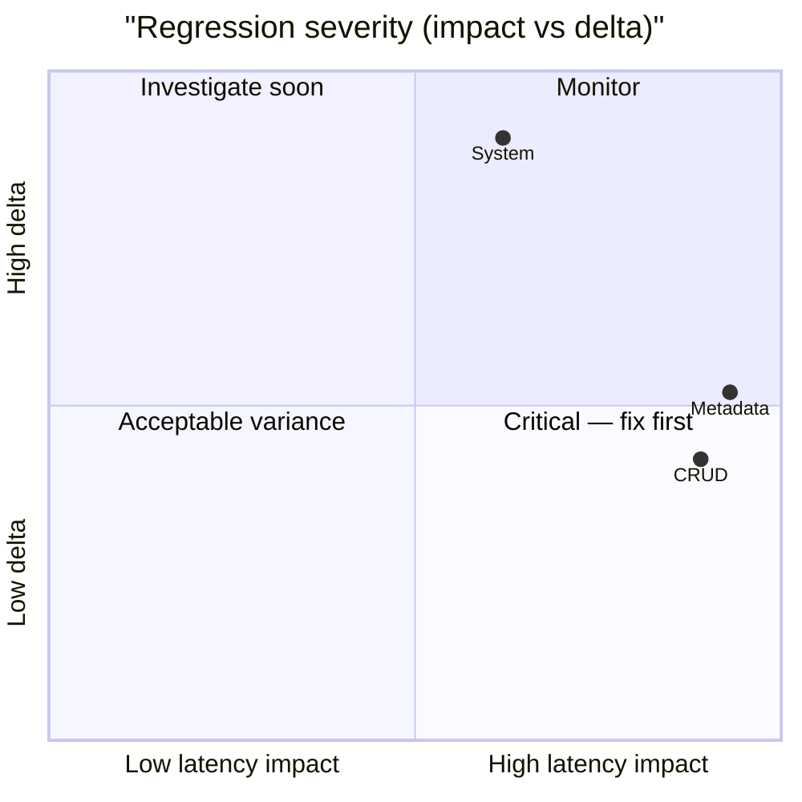

# 🚀 PostgreSQL Performance Ledger

> [!NOTE] Competitive comparisons based on publicly available documentation as of June 2026. All SveltyCMS metrics self-measured via `bun test tests/benchmarks/`.

> [!IMPORTANT]
> **Console-only by default.** Use `BENCHMARK_RECORD=1` to write results to this report.
>
> ```bash
> BENCHMARK_RECORD=1 bun test tests/benchmarks/auth-performance.test.ts
> ```
>
> The full matrix runner (`bun run scripts/benchmark-matrix/index.ts --sql`) always records.

<!-- BENCHMARK_START -->

<!-- EXECUTIVE_START -->
<!-- LATEST_AUDIT_HEADER -->

## 📊 Latest Performance Audit

<!-- EXECUTIVE_FIX_NOTES_START -->

### 📝 Fix Overlays

> [!NOTE]
> Phase notes and remediation entries appear here after matrix or surgical runs.

<!-- EXECUTIVE_FIX_NOTES_END -->

> [!NOTE]
> **Partial update** — dimension rollups and issues reflect only tests invoked in this run.

**✅ PASS** _(partial invocation)_ · 1/45 tests · 44 skipped · **postgresql** · standalone run

### Dimension health

| Dimension      | Tests | Status | Worst Δ | Issues |
| -------------- | ----: | ------ | ------- | ------ |
| **Core**       |     4 | 🟢     | +18%    | 0      |
| **API**        |     0 | ⚪     | —       | 0      |
| **Scale**      |     0 | ⚪     | —       | 0      |
| **Resilience** |     0 | ⚪     | —       | 0      |

### Issues (action required)

> ✅ **All clear** — no regressions or budget violations detected.

### Executive latency matrix

| Scenario     | Latency | Trend                                    | Budget | Result |
| ------------ | ------- | ---------------------------------------- | ------ | ------ |
| **System**   | 0.621ms | ⚪ stable at 0.526ms (±0.085ms) (5 runs) | < 5ms  | 🟢     |
| **Metadata** | 0.927ms | ⚪ stable at 0.839ms (±0.180ms) (5 runs) | < 5ms  | 🟢     |
| **CRUD**     | 0.886ms | ⚪ stable at 0.817ms (±0.235ms) (5 runs) | < 5ms  | 🟢     |
| **CRUD**     | 0.901ms | ⚪ stable at 0.861ms (±0.333ms) (5 runs) | < 5ms  | 🟢     |

### Historical pulse

> **Scope:** Sparklines only — full run tables: [`tests/benchmarks/results/history.sqlite`](../../../tests/benchmarks/results/history.sqlite)

| Metric                                               | Trend | Sparkline      | Latest     |
| ---------------------------------------------------- | ----- | -------------- | ---------- |
| cold start phased (Cold Start (IDLE → READY)) (cold) | 🟢    | `▆▅▄▃▁█`       | 1995.075ms |
| database performance (BULK INSERT (100)) (warm)      | 🟢    | `█▄▃▃▂▄▆▄▂▂▁▇` | 4.793ms    |

<details>
<summary>📈 Latency trend chart (last 10 runs)</summary>

```mermaid
xychart-beta
  title "postgresql REST p95 (last 10 runs)"
  x-axis ["R1", "R2", "R3", "R4", "R5", "R6", "R7", "R8", "R9", "R10"]
  y-axis "Latency (ms)"
  line "p95" : [0.000, 0.000, 0.000, 0.000, 0.000, 0.000, 0.000, 0.000, 0.000, 0.000]
```

</details>
<details>
<summary>📊 Regression severity matrix (quadrant)</summary>



</details>

<!-- EXECUTIVE_PARTIAL_WATERMARK -->

<!-- EXECUTIVE_ALERTS_START -->
<!-- EXECUTIVE_ALERTS_END -->

<!-- EXECUTIVE_END -->

<!-- SUMMARY_START -->

<!-- SUMMARY_RUN_OVERLAY_START -->

### Current Run Summary (2026-08-20)

> **Scope:** Only tests that ran in THIS invocation.

> ⚠️ Executive PASS/FAIL reflects the last full matrix run.

**Run ID:** `62d48cff-8fcb-44e3-98a8-64e84dcc0880` · **Tests invoked:** 1 · **Metrics:** 4 · **DB:** postgresql

| Test                 | Metric                 | Avg (ms) | p95 (ms) | RPS  | Trend | Detail                                   |
| -------------------- | ---------------------- | -------- | -------- | ---- | ----- | ---------------------------------------- |
| Rest Api Performance | Health Check           | 0.621    | 1.206    | 4214 | 🟢    | ⚪ stable at 0.526ms (±0.085ms) (5 runs) |
| Rest Api Performance | Collection Schema      | 0.927    | 1.909    | 2890 | 🟢    | ⚪ stable at 0.839ms (±0.180ms) (5 runs) |
| Rest Api Performance | Collection Find (List) | 0.886    | 1.751    | 3020 | 🟢    | ⚪ stable at 0.817ms (±0.235ms) (5 runs) |
| Rest Api Performance | Collection Search      | 0.901    | 1.787    | 2970 | 🟢    | ⚪ stable at 0.861ms (±0.333ms) (5 runs) |

<!-- SUMMARY_RUN_OVERLAY_END -->

<!-- SUMMARY_HISTORY_START -->

### Historical Trends (2026-08-20)

> **Scope:** Sparklines only — full run tables live in `history.sqlite` (link below). Runs = sparkline bar count.

**Detail:** [`tests/benchmarks/results/history.sqlite`](../../../tests/benchmarks/results/history.sqlite) · `SELECT test_id, phase, avg_ms, p95_ms, rps, timestamp FROM runs WHERE db_type='postgresql' AND redis=0 ORDER BY timestamp DESC`

**Series:** 8 · **DB:** postgresql

| Metric                              | Trend | Sparkline (last 7) | Latest     |
| ----------------------------------- | ----- | ------------------ | ---------- |
| CACHE PERFORMANCE (warm)            | 🟢    | `▅█▂▂▁▃`           | 0.384ms    |
| DATABASE PERFORMANCE (warm)         | 🟢    | `▄▁▃██▅▆`          | 2.054ms    |
| HOOKS PERFORMANCE (warm)            | 🟢    | `▂▁▂█▂▂▁`          | 0.710ms    |
| REST API PERFORMANCE (warm)         | 🟢    | `▅▄▁▇██▃`          | 0.621ms    |
| TRANSACTION ACID (warm)             | 🟢    | `▄▄▂▃▁▇█`          | 4.480ms    |
| TRUTH LATENCY (warm)                | 🟢    | `▇▇▁▁█▁▁`          | 0.000ms    |
| COLD START PHASED (cold)            | ⚪    | `▆▅▄▃▁█`           | 1995.075ms |
| COMPETITIVE WORKLOAD REPLICA (warm) | ⚪    | `▄▁▁▁▁▄█`          | 12.218ms   |

<!-- SUMMARY_HISTORY_END --><!-- SUMMARY_END -->

<!-- LEDGER_START -->

## 🔬 Full benchmark ledger (41 modules)

Expand dimension groups, then any row, for ASCII truth tables. Executive summary above shows pass/fail and issues only.

<!-- LEDGER_DIMENSION:CORE:START -->

<details id="ledger-dimension-core">
<summary><strong>Core</strong> · 18 tests</summary>

<!-- SECTION:API_LATENCY:START -->

<details id="section-api_latency">
<summary><strong>🏷️ API LAYER LATENCY</strong> · 🟢 3.835ms · ➡️ recorded (awaiting trend) · <a href="../../../tests/benchmarks/api-latency.test.ts">source</a></summary>

<!-- LEDGER_TRUTH_START -->

```text
╔═════════════════════════════════════════════════════════════════════════════════════════╗
║                             SVELTYCMS  —  API LAYER LATENCY                             ║
║                       File: tests/benchmarks/api-latency.test.ts                        ║
║                                Ran: 2026-08-23 22:40:56                                 ║
║       Cold full-pipeline findById + warm TURBO-HIT path after responseCache fill.       ║
╠═════════════════════════════════════════════════════════════════════════════════════════╣
║ HTTP: findById @ 8c            │        3.835 ms │ p95:        5.817 ms │ RPS:      1,841 ║
║ HTTP: findById TURBO-HIT @ 8c  │        1.244 ms │ p95:        2.307 ms │ RPS:      3,555 ║
╚═════════════════════════════════════════════════════════════════════════════════════════╝
```

<!-- LEDGER_TRUTH_END -->

</details>
<!-- SECTION:API_LATENCY:END -->

<!-- SECTION:COLD_START:START -->
<details id="section-cold_start">
<summary><strong>🏷️ cold start phased</strong> · ⚪ 1995.075ms · ↗️ 🔴 slower: 1896.02ms → 1995.08ms (+5%) (5 runs) (2026-08-20 20:02:06) · <a href="../../../tests/benchmarks/cold-start-phased.test.ts">source</a></summary>
<!-- LEDGER_INSIGHT_START -->
> [!NOTE]
> **Specific to this test**: Both avg and p95 degraded — likely adapter or infrastructure bottleneck. Check DB connection pool, indexes, or recent commits.
<!-- LEDGER_INSIGHT_END -->

<!-- LEDGER_TRUTH_START -->

```text
╔═════════════════════════════════════════════════════════════════════════════════════════╗
║                           SVELTYCMS — PHASED COLD START AUDIT                           ║
║                    File: tests/benchmarks/cold-start-phased.test.ts                     ║
║                                Ran: 2026-08-20 20:02:06                                 ║
║       Measures server cold-start latency to READY state, using the built server.        ║
╠═════════════════════════════════════════════════════════════════════════════════════════╣
║ Cold Start (IDLE → READY)      │     1995.075 ms │ p95:     2893.944 ms │ RPS:          0 ║
╚═════════════════════════════════════════════════════════════════════════════════════════╝
```

<!-- LEDGER_TRUTH_END -->

</details>
<!-- SECTION:COLD_START:END -->

<!-- SECTION:TRUTH_AUDIT:START -->

<details id="section-truth_audit">
<summary><strong>🏷️ SRE TRUTH AUDIT</strong> · ⚪ ⏳ pending · ➡️ pending · <a href="../../../tests/benchmarks/truth-latency.test.ts">source</a></summary>

<!-- LEDGER_TRUTH_START -->

```text
╔═════════════════════════════════════════════════════════════════════════════════════════╗
║                               SVELTYCMS — SRE TRUTH AUDIT                               ║
║                      File: tests/benchmarks/truth-latency.test.ts                       ║
║                                Ran: 2026-08-23 22:40:44                                 ║
║     Validates performance claims by comparing SDK, Middleware, and Real HTTP Stack      ║
╠═════════════════════════════════════════════════════════════════════════════════════════╣
║ Logic Baseline                 │        0.000 ms │ p95:        0.001 ms │ RPS:    104,004 ║
║ Local SDK (Full)               │        0.023 ms │ p95:        0.012 ms │ RPS:     35,605 ║
║ HTTP End-to-End                │        0.482 ms │ p95:        0.638 ms │ RPS:      2,069 ║
╚═════════════════════════════════════════════════════════════════════════════════════════╝
```

<!-- LEDGER_TRUTH_END -->

</details>
<!-- SECTION:TRUTH_AUDIT:END -->

<!-- SECTION:INCREMENTAL:START -->

<details id="section-incremental">
<summary><strong>🏷️ Incremental Content Reload</strong> · 🟢 0.343ms · ➡️ recorded (awaiting trend) · <a href="../../../tests/benchmarks/content-incremental-reload.test.ts">source</a></summary>

<!-- LEDGER_TRUTH_START -->

```text
╔═════════════════════════════════════════════════════════════════════════════════════════╗
║                      SVELTYCMS — INCREMENTAL CONTENT RELOAD AUDIT                       ║
║                File: tests/benchmarks/content-incremental-reload.test.ts                ║
║                                Ran: 2026-08-23 22:11:32                                 ║
║          Measures surgical single-file fullReload vs full reconciliation path           ║
╠═════════════════════════════════════════════════════════════════════════════════════════╣
║ Incremental fullReload (1 file) │        0.343 ms │ p95:        0.616 ms │ RPS:      2,882 ║
║ Full Reconciliation Reload     │        0.314 ms │ p95:        0.415 ms │ RPS:      3,157 ║
╚═════════════════════════════════════════════════════════════════════════════════════════╝
```

<!-- LEDGER_TRUTH_END -->

</details>
<!-- SECTION:INCREMENTAL:END -->

<!-- SECTION:HOOKS_TRACE:START -->

<details id="section-hooks_trace">
<summary><strong>🏷️ Middleware & Hooks Performance</strong> · 🟢 0.896ms · ➡️ recorded (awaiting trend) · <a href="../../../tests/benchmarks/hooks-performance.test.ts">source</a></summary>

<!-- LEDGER_TRUTH_START -->

```text
╔═════════════════════════════════════════════════════════════════════════════════════════╗
║                          SVELTYCMS — MIDDLEWARE & HOOKS AUDIT                           ║
║                    File: tests/benchmarks/hooks-performance.test.ts                     ║
║                                Ran: 2026-08-23 22:08:34                                 ║
║Measures the cost of the full middleware chain including Turbo, Security, Auth, and Audit via HTTP E2E.║
╠═════════════════════════════════════════════════════════════════════════════════════════╣
║ Static Asset (No Middleware)   │        0.896 ms │ p95:        1.487 ms │ RPS:      3,118 ║
║ Turbo Pipeline (Light)         │        0.598 ms │ p95:        1.041 ms │ RPS:      4,502 ║
║ Full Security + Auth Pipeline  │        1.030 ms │ p95:        1.856 ms │ RPS:      2,556 ║
║ REST with API Caching          │        0.927 ms │ p95:        1.544 ms │ RPS:      2,866 ║
║ Mutation (audit logging disabled) │        3.992 ms │ p95:        4.897 ms │ RPS:        243 ║
╚═════════════════════════════════════════════════════════════════════════════════════════╝
```

<!-- LEDGER_TRUTH_END -->

</details>
<!-- SECTION:HOOKS_TRACE:END -->

<!-- SECTION:STATE_MACHINE:START -->

<details id="section-state_machine">
<summary><strong>🏷️ State Machine Transitions</strong> · 🟢 177.594ms · ➡️ recorded (awaiting trend) · <a href="../../../tests/benchmarks/state-machine-transition.test.ts">source</a></summary>

<!-- LEDGER_TRUTH_START -->

```text
╔═════════════════════════════════════════════════════════════════════════════════════════╗
║                           SVELTYCMS — STATE MACHINE INTEGRITY                           ║
║                 File: tests/benchmarks/state-machine-transition.test.ts                 ║
║                                Ran: 2026-08-23 22:11:43                                 ║
║Simulates rapid system re-initializations and verifies valid self-healing state transitions under stress.║
╠═════════════════════════════════════════════════════════════════════════════════════════╣
║ State Transition (READY -> IDLE -> READY) │      177.594 ms │ p95:      192.360 ms │ RPS:          6 ║
╚═════════════════════════════════════════════════════════════════════════════════════════╝
```

<!-- LEDGER_TRUTH_END -->

</details>
<!-- SECTION:STATE_MACHINE:END -->

<!-- SECTION:DB_RAW_P95:START -->
<details id="section-db_raw_p95">
<summary><strong>🏷️ database performance</strong> · 🟢 1.872ms · ➡️ recorded (awaiting trend) · <a href="../../../tests/benchmarks/database-performance.test.ts">source</a></summary>
<!-- LEDGER_INSIGHT_START -->
> [!NOTE]
> **Specific to this test**: Both avg and p95 degraded — likely adapter or infrastructure bottleneck. Check DB connection pool, indexes, or recent commits.  
Throughput dropped 29% — check connection pool saturation or lock contention.  
**Severe degradation** (+27%) — review recent commits immediately.
<!-- LEDGER_INSIGHT_END -->

<!-- LEDGER_TRUTH_START -->

```text
╔═════════════════════════════════════════════════════════════════════════════════════════╗
║                  SVELTYCMS — DATABASE ADAPTER PERFORMANCE (POSTGRESQL)                  ║
║                   File: tests/benchmarks/database-performance.test.ts                   ║
║                                Ran: 2026-08-23 22:11:10                                 ║
║   Measures raw CRUD performance, indexing efficiency, and connection pool resilience    ║
╠═════════════════════════════════════════════════════════════════════════════════════════╣
║ INSERT                         │        1.872 ms │ p95:        3.502 ms │ RPS:        476 ║
║ FIND ONE                       │        0.432 ms │ p95:        0.925 ms │ RPS:      1,912 ║
║ FIND MANY (limit 50)           │        1.152 ms │ p95:        2.738 ms │ RPS:        754 ║
║ QUERY BUILDER LIST (50)        │        1.145 ms │ p95:        2.636 ms │ RPS:        760 ║
║ FIND PAGE (50 hasMore)         │        1.148 ms │ p95:        2.613 ms │ RPS:        756 ║
║ FIND PAGE keyset               │        1.132 ms │ p95:        2.577 ms │ RPS:        773 ║
║ FIND MANY offset 50            │        0.965 ms │ p95:        2.338 ms │ RPS:        896 ║
║ LIST+COUNT (legacy)            │        6.086 ms │ p95:        7.986 ms │ RPS:        160 ║
║ UPDATE                         │        1.843 ms │ p95:        3.455 ms │ RPS:        484 ║
║ UPDATE (no-returning)          │        1.805 ms │ p95:        3.461 ms │ RPS:        491 ║
║ NATIVE UPSERT                  │        2.229 ms │ p95:        4.502 ms │ RPS:        385 ║
║ COUNT                          │        1.034 ms │ p95:        2.594 ms │ RPS:        851 ║
║ COUNT ESTIMATE                 │        0.723 ms │ p95:        2.055 ms │ RPS:      1,195 ║
║ COUNT CACHED                   │        0.001 ms │ p95:        0.002 ms │ RPS:    449,163 ║
║ DELETE                         │        2.290 ms │ p95:        4.313 ms │ RPS:        428 ║
║ BULK INSERT (100)              │        3.919 ms │ p95:        5.415 ms │ RPS:        245 ║
╚═════════════════════════════════════════════════════════════════════════════════════════╝
```

<!-- LEDGER_TRUTH_END -->

</details>
<!-- SECTION:DB_RAW_P95:END -->

<!-- SECTION:ACID:START -->
<details id="section-acid">
<summary><strong>🏷️ transaction acid</strong> · 🟢 3.988ms · ➡️ recorded (awaiting trend) · <a href="../../../tests/benchmarks/transaction-acid.test.ts">source</a></summary>
<!-- LEDGER_INSIGHT_START -->
> [!NOTE]
> **Specific to this test**: Both avg and p95 degraded — likely adapter or infrastructure bottleneck. Check DB connection pool, indexes, or recent commits.  
Throughput dropped 16% — check connection pool saturation or lock contention.  
**Severe degradation** (+28%) — review recent commits immediately.
<!-- LEDGER_INSIGHT_END -->

<!-- LEDGER_TRUTH_START -->

```text
╔═════════════════════════════════════════════════════════════════════════════════════════╗
║                            SVELTYCMS — ACID INTEGRITY AUDIT                             ║
║                     File: tests/benchmarks/transaction-acid.test.ts                     ║
║                                Ran: 2026-08-23 22:11:16                                 ║
║  Measures transaction commit latencies and rollback overhead across database adapters   ║
╠═════════════════════════════════════════════════════════════════════════════════════════╣
║ TX Commit                      │        3.988 ms │ p95:        5.947 ms │ RPS:        923 ║
║ TX Rollback Integrity          │        3.749 ms │ p95:        5.748 ms │ RPS:        266 ║
╚═════════════════════════════════════════════════════════════════════════════════════════╝
```

<!-- LEDGER_TRUTH_END -->

</details>
<!-- SECTION:ACID:END -->

<!-- SECTION:CACHE:START -->
<details id="section-cache">
<summary><strong>🏷️ Cache</strong> · 🟢 2.487ms · ➡️ recorded (awaiting trend) · <a href="../../../tests/benchmarks/cache-performance.test.ts">source</a></summary>
<!-- LEDGER_TRUTH_START -->
```text
╔═════════════════════════════════════════════════════════════════════════════════════════╗
║                            NEGATIVE CACHE PERFORMANCE AUDIT                             ║
║                      File: tests/benchmarks/negative-cache.test.ts                      ║
║                                Ran: 2026-08-23 22:41:20                                 ║
║        Measures Bloom-filter style missing-key cache speedup for repeated misses        ║
╠═════════════════════════════════════════════════════════════════════════════════════════╣
║ First Miss (DB)                │        2.487 ms │ p95:        4.448 ms │ RPS:        400 ║
║ Cached Miss (Negative Cache)   │        0.001 ms │ p95:        0.002 ms │ RPS:    828,497 ║
╚═════════════════════════════════════════════════════════════════════════════════════════╝
```
<!-- LEDGER_TRUTH_END -->

</details>
<!-- SECTION:CACHE:END -->

<!-- SECTION:CACHE_EFFICIENCY:START -->

<details id="section-cache_efficiency">
<summary><strong>🏷️ Cache Hit/Miss Ratio & Efficiency</strong> · ⏳ pending · ➡️ baseline · <a href="../../../tests/benchmarks/cache-hit-ratio.test.ts">source</a></summary>

<!-- LEDGER_TRUTH_START -->

> ⏳ Pending — Measures Redis cache hit/miss ratio, cold vs warm read speedup, and invalidation performance.

<!-- LEDGER_TRUTH_END -->

</details>
<!-- SECTION:CACHE_EFFICIENCY:END -->

<!-- SECTION:UNKNOWN:START -->
<details id="section-unknown">
<summary><strong>🏷️ unknown</strong> · 🟢 0.002ms · ➡️ recorded (awaiting trend) · <a href="../../../tests/benchmarks/transaction-acid.test.ts">source</a></summary>
<!-- LEDGER_TRUTH_START -->
```text
╔═════════════════════════════════════════════════════════════════════════════════════════╗
║                      SVELTYCMS — CACHE EVICTION BOUNDARY HARDENING                      ║
║                                      File: unknown                                      ║
║                                Ran: 2026-08-23 22:11:25                                 ║
╠═════════════════════════════════════════════════════════════════════════════════════════╣
║ Cache Flooding & Eviction      │        0.002 ms │ p95:        0.002 ms │ RPS:    491,074 ║
╚═════════════════════════════════════════════════════════════════════════════════════════╝
```
<!-- LEDGER_TRUTH_END -->

</details>
<!-- SECTION:UNKNOWN:END -->

<!-- SECTION:MIDDLEWARE:START -->
<details id="section-middleware">
<summary><strong>🏷️ Middleware</strong> · 🟢 4.586ms · ↗️ ⚪ stable at 3.73ms (±1.23ms) (5 runs) (2026-08-20 20:05:18) · <a href="../../../tests/benchmarks/hooks-performance.test.ts">source</a></summary>
<!-- LEDGER_INSIGHT_START -->
> [!NOTE]
> **Specific to this test**: Both avg and p95 degraded — likely adapter or infrastructure bottleneck. Check DB connection pool, indexes, or recent commits.  
Throughput dropped 14% — check connection pool saturation or lock contention.  
**Severe degradation** (+23%) — review recent commits immediately.
<!-- LEDGER_INSIGHT_END -->

<!-- LEDGER_TRUTH_START -->

> ⏳ Pending

<!-- LEDGER_TRUTH_END -->

</details>
<!-- SECTION:MIDDLEWARE:END -->

<!-- SECTION:SYSTEM:START -->
<details id="section-system">
<summary><strong>🏷️ System</strong> · 🟢 0.621ms · ↗️ ⚪ stable at 0.526ms (±0.085ms) (5 runs) (2026-08-20 20:05:27) · <a href="../../../tests/benchmarks/rest-api-performance.test.ts">source</a></summary>
<!-- LEDGER_INSIGHT_START -->
> [!NOTE]
> **Specific to this test**: Avg degraded but p95 stable — possible cold-start effect, GC pause, or warmup variance.  
Throughput dropped 12% — check connection pool saturation or lock contention.
<!-- LEDGER_INSIGHT_END -->

<!-- LEDGER_TRUTH_START -->

> ⏳ Pending

<!-- LEDGER_TRUTH_END -->

</details>
<!-- SECTION:SYSTEM:END -->

<!-- SECTION:METADATA:START -->
<details id="section-metadata">
<summary><strong>🏷️ Metadata</strong> · 🟢 0.927ms · ↗️ ⚪ stable at 0.839ms (±0.180ms) (5 runs) (2026-08-20 20:05:27) · <a href="../../../tests/benchmarks/rest-api-performance.test.ts">source</a></summary>
<!-- LEDGER_INSIGHT_START -->
> [!NOTE]
> **Specific to this test**: Both avg and p95 degraded — likely adapter or infrastructure bottleneck. Check DB connection pool, indexes, or recent commits.
<!-- LEDGER_INSIGHT_END -->

<!-- LEDGER_TRUTH_START -->

> ⏳ Pending

<!-- LEDGER_TRUTH_END -->

</details>
<!-- SECTION:METADATA:END -->

<!-- SECTION:CRUD:START -->
<details id="section-crud">
<summary><strong>🏷️ CRUD</strong> · 🟢 0.901ms · ➡️ ⚪ stable at 0.861ms (±0.333ms) (5 runs) (2026-08-20 20:05:27) · <a href="../../../tests/benchmarks/rest-api-performance.test.ts">source</a></summary>
<!-- LEDGER_TRUTH_START -->
> ⏳ Pending
<!-- LEDGER_TRUTH_END -->

</details>
<!-- SECTION:CRUD:END -->

<!-- SECTION:LOGIC:START -->
<details id="section-logic">
<summary><strong>🏷️ Logic</strong> · 🟢 ⏳ pending · ➡️ ⚪ stable at 0ms (5 runs) (2026-08-20 20:02:21) · <a href="../../../tests/benchmarks/truth-latency.test.ts">source</a></summary>
<!-- LEDGER_TRUTH_START -->
> ⏳ Pending
<!-- LEDGER_TRUTH_END -->

</details>
<!-- SECTION:LOGIC:END -->

<!-- SECTION:SDK:START -->
<details id="section-sdk">
<summary><strong>🏷️ SDK</strong> · 🟢 0.500ms · ➡️ recorded (awaiting trend) · <a href="../../../tests/benchmarks/truth-latency.test.ts">source</a></summary>
<!-- LEDGER_INSIGHT_START -->
> [!NOTE]
> **Specific to this test**: Both avg and p95 degraded — likely adapter or infrastructure bottleneck. Check DB connection pool, indexes, or recent commits.  
Throughput dropped 78% — check connection pool saturation or lock contention.  
**Severe degradation** (+425%) — review recent commits immediately.
<!-- LEDGER_INSIGHT_END -->

<!-- LEDGER_TRUTH_START -->

```text
╔═════════════════════════════════════════════════════════════════════════════════════════╗
║                           SVELTYCMS — SDK OVERHEAD TELEMETRY                            ║
║                  File: tests/benchmarks/local-api-performance.test.ts                   ║
║                                Ran: 2026-08-23 22:08:09                                 ║
║  Measures LocalCMS SDK overhead vs direct adapter calls to verify zero-tax dispatching  ║
╠═════════════════════════════════════════════════════════════════════════════════════════╣
║ Direct Adapter Call            │        0.500 ms │ p95:        0.990 ms │ RPS:      1,992 ║
║ LocalCMS SDK Call              │        0.558 ms │ p95:        1.220 ms │ RPS:      1,781 ║
╚═════════════════════════════════════════════════════════════════════════════════════════╝
```

<!-- LEDGER_TRUTH_END -->

</details>
<!-- SECTION:SDK:END -->

<!-- SECTION:HTTP:START -->
<details id="section-http">
<summary><strong>🏷️ HTTP</strong> · 🟢 0.539ms · ↗️ ⚪ stable at 0.491ms (±0.101ms) (5 runs) (2026-08-20 20:02:21) · <a href="../../../tests/benchmarks/truth-latency.test.ts">source</a></summary>
<!-- LEDGER_INSIGHT_START -->
> [!NOTE]
> **Specific to this test**: Avg degraded but p95 stable — possible cold-start effect, GC pause, or warmup variance.
<!-- LEDGER_INSIGHT_END -->

<!-- LEDGER_TRUTH_START -->

> ⏳ Pending

<!-- LEDGER_TRUTH_END -->

</details>
<!-- SECTION:HTTP:END -->

</details>

<!-- LEDGER_DIMENSION:CORE:END -->

<!-- LEDGER_DIMENSION:API:START -->

<details id="ledger-dimension-api">
<summary><strong>API</strong> · 8 tests</summary>

<!-- SECTION:TEMPORAL:START -->

<details id="section-temporal">
<summary><strong>🏷️ Temporal Integrity Audit</strong> · 🟢 4.762ms · ➡️ recorded (awaiting trend) · <a href="../../../tests/benchmarks/temporal-integrity.test.ts">source</a></summary>

<!-- LEDGER_TRUTH_START -->

```text
╔═════════════════════════════════════════════════════════════════════════════════════════╗
║                             SVELTYCMS — TEMPORAL INTEGRITY                              ║
║                    File: tests/benchmarks/temporal-integrity.test.ts                    ║
║                                Ran: 2026-08-23 22:08:48                                 ║
║Validates deterministic UTC normalization of ISO date strings across timezone offsets for consistent persistence.║
╠═════════════════════════════════════════════════════════════════════════════════════════╣
║ Timezone Ingestion             │        4.762 ms │ p95:        4.762 ms │ RPS:        210 ║
╚═════════════════════════════════════════════════════════════════════════════════════════╝
```

<!-- LEDGER_TRUTH_END -->

</details>
<!-- SECTION:TEMPORAL:END -->

<!-- SECTION:RELATIONAL:START -->

<details id="section-relational">
<summary><strong>🏷️ Relational & Nested Queries</strong> · 🟢 2.904ms · ➡️ recorded (awaiting trend) · <a href="../../../tests/benchmarks/relational-performance.test.ts">source</a></summary>

<!-- LEDGER_TRUTH_START -->

```text
╔═════════════════════════════════════════════════════════════════════════════════════════╗
║                          SVELTYCMS — RELATIONAL RESOLVER AUDIT                          ║
║                  File: tests/benchmarks/relational-performance.test.ts                  ║
║                                Ran: 2026-08-23 22:07:51                                 ║
║Measures GraphQL resolver performance for shallow and deep relational queries including joins and nested population.║
╠═════════════════════════════════════════════════════════════════════════════════════════╣
║ Shallow Relational Query       │        2.904 ms │ p95:        4.280 ms │ RPS:      1,788 ║
║ Deep Relational Query          │        1.617 ms │ p95:        3.263 ms │ RPS:      1,513 ║
╚═════════════════════════════════════════════════════════════════════════════════════════╝
```

<!-- LEDGER_TRUTH_END -->

</details>
<!-- SECTION:RELATIONAL:END -->

<!-- SECTION:AUTH_TRACE:START -->

<details id="section-auth_trace">
<summary><strong>🏷️ Auth & RBAC Performance</strong> · 🟢 0.319ms · ➡️ recorded (awaiting trend) · <a href="../../../tests/benchmarks/auth-performance.test.ts">source</a></summary>

<!-- LEDGER_TRUTH_START -->

```text
╔═════════════════════════════════════════════════════════════════════════════════════════╗
║                          SVELTYCMS — AUTHENTICATION TELEMETRY                           ║
║                     File: tests/benchmarks/auth-performance.test.ts                     ║
║                                Ran: 2026-08-23 22:40:59                                 ║
║             Authentication & RBAC Pipeline Benchmark (Production Optimized)             ║
╠═════════════════════════════════════════════════════════════════════════════════════════╣
║ Auth Validation @ 1c           │        0.319 ms │ p95:        0.428 ms │ RPS:      2,905 ║
║ HTTP Auth Pipeline @ 8c        │        1.138 ms │ p95:        1.990 ms │ RPS:      4,072 ║
╚═════════════════════════════════════════════════════════════════════════════════════════╝
```

<!-- LEDGER_TRUTH_END -->

</details>
<!-- SECTION:AUTH_TRACE:END -->

<!-- SECTION:REST:START -->

<details id="section-rest">
<summary><strong>🏷️ REST API Performance</strong> · 🟢 0.572ms · ➡️ recorded (awaiting trend) · <a href="../../../tests/benchmarks/rest-api-performance.test.ts">source</a></summary>

<!-- LEDGER_TRUTH_START -->

```text
╔═════════════════════════════════════════════════════════════════════════════════════════╗
║                          SVELTYCMS — ENTERPRISE REST API AUDIT                          ║
║                   File: tests/benchmarks/rest-api-performance.test.ts                   ║
║                                Ran: 2026-08-23 22:40:53                                 ║
║Measures latency, throughput, and correctness of core REST endpoints: health check, schema, CRUD list, and search.║
╠═════════════════════════════════════════════════════════════════════════════════════════╣
║ Health Check                   │        0.572 ms │ p95:        1.058 ms │ RPS:      4,649 ║
║ Collection Schema              │        0.848 ms │ p95:        1.382 ms │ RPS:      3,116 ║
║ Collection Find (List)         │        0.853 ms │ p95:        1.392 ms │ RPS:      3,141 ║
║ Collection Search              │        0.920 ms │ p95:        1.487 ms │ RPS:      2,859 ║
╚═════════════════════════════════════════════════════════════════════════════════════════╝
```

<!-- LEDGER_TRUTH_END -->

</details>
<!-- SECTION:REST:END -->

<!-- SECTION:GRAPHQL:START -->

<details id="section-graphql">
<summary><strong>🏷️ GraphQL API Performance</strong> · 🟢 0.995ms · ➡️ recorded (awaiting trend) · <a href="../../../tests/benchmarks/graphql-api-performance.test.ts">source</a></summary>

<!-- LEDGER_TRUTH_START -->

```text
╔═════════════════════════════════════════════════════════════════════════════════════════╗
║                          SVELTYCMS — GRAPHQL PERFORMANCE AUDIT                          ║
║                 File: tests/benchmarks/graphql-api-performance.test.ts                  ║
║                                Ran: 2026-08-23 22:41:07                                 ║
║              Measures GraphQL resolver performance across query scenarios,              ║
╠═════════════════════════════════════════════════════════════════════════════════════════╣
║ GQL: System Health [cold]      │        0.995 ms │ p95:        1.660 ms │ RPS:      1,001 ║
║ GQL: System Health [hot]       │        0.912 ms │ p95:        1.591 ms │ RPS:      1,095 ║
║ GQL: Collection List [cold]    │        2.942 ms │ p95:        3.966 ms │ RPS:      1,818 ║
║ GQL: Collection List [hot]     │        2.736 ms │ p95:        3.618 ms │ RPS:      1,981 ║
║ GQL: Concurrent Load [cold]    │        2.328 ms │ p95:        3.076 ms │ RPS:      1,950 ║
║ GQL: Concurrent Load [hot]     │        2.276 ms │ p95:        3.179 ms │ RPS:      2,006 ║
╚═════════════════════════════════════════════════════════════════════════════════════════╝
```

<!-- LEDGER_TRUTH_END -->

</details>
<!-- SECTION:GRAPHQL:END -->

<!-- SECTION:SEO:START -->

<details id="section-seo">
<summary><strong>🏷️ Enterprise SEO Suite Audit</strong> · 🟢 1.218ms · ➡️ recorded (awaiting trend) · <a href="../../../tests/benchmarks/seo-performance.test.ts">source</a></summary>

<!-- LEDGER_TRUTH_START -->

```text
╔═════════════════════════════════════════════════════════════════════════════════════════╗
║                            SVELTYCMS — ENTERPRISE SEO AUDIT                             ║
║                     File: tests/benchmarks/seo-performance.test.ts                      ║
║                                Ran: 2026-08-23 22:41:42                                 ║
║Measures redirect lookup latency, dynamic sitemap.xml generation, robots.txt serving, and 404 logging performance.║
╠═════════════════════════════════════════════════════════════════════════════════════════╣
║ Redirect Lookup (301)          │        1.218 ms │ p95:        2.521 ms │ RPS:      3,759 ║
║ Dynamic Sitemap XML            │        0.815 ms │ p95:        1.844 ms │ RPS:      6,072 ║
║ Robots.txt Generation          │        1.739 ms │ p95:        2.827 ms │ RPS:      3,558 ║
║ Missing Path (404 Log)         │        4.452 ms │ p95:        6.049 ms │ RPS:      1,593 ║
╚═════════════════════════════════════════════════════════════════════════════════════════╝
```

<!-- LEDGER_TRUTH_END -->

</details>
<!-- SECTION:SEO:END -->

<!-- SECTION:BROADCAST:START -->

<details id="section-broadcast">
<summary><strong>🏷️ REAL-TIME BROADCAST AUDIT</strong> · 🟢 0.188ms · ➡️ recorded (awaiting trend) · <a href="../../../tests/benchmarks/websocket-broadcast.test.ts">source</a></summary>

<!-- LEDGER_TRUTH_START -->

```text
╔═════════════════════════════════════════════════════════════════════════════════════════╗
║                        SVELTYCMS — YJS COLLABORATION SYNC AUDIT                         ║
║                   File: tests/benchmarks/websocket-broadcast.test.ts                    ║
║                                Ran: 2026-08-23 22:12:54                                 ║
║   Measures end-to-end Yjs update propagation latency and connection handshake timing.   ║
╠═════════════════════════════════════════════════════════════════════════════════════════╣
║ Yjs CRDT Update Sync           │        0.188 ms │ p95:        0.337 ms │ RPS:      5,175 ║
╚═════════════════════════════════════════════════════════════════════════════════════════╝
```

<!-- LEDGER_TRUTH_END -->

</details>
<!-- SECTION:BROADCAST:END -->

<!-- SECTION:REAL_TIME:START -->

<details id="section-real_time">
<summary><strong>🏷️ WebSocket & Realtime Latency</strong> · ⏳ pending · ➡️ baseline · <a href="../../../tests/benchmarks/realtime-performance.test.ts">source</a></summary>

<!-- LEDGER_TRUTH_START -->

> ⏳ Pending — Benchmarks WebSocket connection/broadcast latency.

<!-- LEDGER_TRUTH_END -->

</details>
<!-- SECTION:REAL_TIME:END -->

</details>

<!-- LEDGER_DIMENSION:API:END -->

<!-- LEDGER_DIMENSION:SCALE:START -->

<details id="ledger-dimension-scale">
<summary><strong>Scale</strong> · 18 tests</summary>

<!-- SECTION:NEGATIVE_CACHE:START -->

<details id="section-negative_cache">
<summary><strong>🏷️ Negative Cache Performance</strong> · ⏳ pending · ➡️ baseline · <a href="../../../tests/benchmarks/negative-cache.test.ts">source</a></summary>

<!-- LEDGER_TRUTH_START -->

> ⏳ Pending — Benchmarks 404-miss response times and cache lookup speedup.

<!-- LEDGER_TRUTH_END -->

</details>
<!-- SECTION:NEGATIVE_CACHE:END -->

<!-- SECTION:REVISION_STRESS:START -->

<details id="section-revision_stress">
<summary><strong>🏷️ Revision & History Growth</strong> · 🟢 0.768ms · ➡️ recorded (awaiting trend) · <a href="../../../tests/benchmarks/revision-stress.test.ts">source</a></summary>

<!-- LEDGER_TRUTH_START -->

```text
╔═════════════════════════════════════════════════════════════════════════════════════════╗
║                            SVELTYCMS — REVISION STRESS AUDIT                            ║
║                     File: tests/benchmarks/revision-stress.test.ts                      ║
║                                Ran: 2026-08-23 22:09:10                                 ║
║Measures read and history list latency degradation under heavy revision history growth (100 revisions per entry).║
╠═════════════════════════════════════════════════════════════════════════════════════════╣
║ Latest Read (High Revision Count) │        0.768 ms │ p95:        1.482 ms │ RPS:      3,505 ║
║ History List Retrieval         │        0.512 ms │ p95:        0.708 ms │ RPS:      3,044 ║
╚═════════════════════════════════════════════════════════════════════════════════════════╝
```

<!-- LEDGER_TRUTH_END -->

</details>
<!-- SECTION:REVISION_STRESS:END -->

<!-- SECTION:MEMORY:START -->

<details id="section-memory">
<summary><strong>🏷️ Memory Stability & GC Behavior</strong> · ⏳ pending · ➡️ baseline · <a href="../../../tests/benchmarks/memory-stability.test.ts">source</a></summary>

<!-- LEDGER_TRUTH_START -->

> ⏳ Pending — Long-running soak test to identify memory leaks and GC pressure.

<!-- LEDGER_TRUTH_END -->

</details>
<!-- SECTION:MEMORY:END -->

<!-- SECTION:TENANCY:START -->

<details id="section-tenancy">
<summary><strong>🏷️ Multi-Tenant Performance & Isolation</strong> · ⏳ pending · ➡️ baseline · <a href="../../../tests/benchmarks/multi-tenant-performance.test.ts">source</a></summary>

<!-- LEDGER_TRUTH_START -->

> ⏳ Pending — Stress-tests cross-tenant isolation and security boundary latency.

<!-- LEDGER_TRUTH_END -->

</details>
<!-- SECTION:TENANCY:END -->

<!-- SECTION:MIXED:START -->

<details id="section-mixed">
<summary><strong>🏷️ Realistic Mixed Workload</strong> · 🟢 1.428ms · ➡️ recorded (awaiting trend) · <a href="../../../tests/benchmarks/mixed-workload.test.ts">source</a></summary>

<!-- LEDGER_TRUTH_START -->

```text
╔═════════════════════════════════════════════════════════════════════════════════════════╗
║                            SVELTYCMS — MIXED WORKLOAD AUDIT                             ║
║                      File: tests/benchmarks/mixed-workload.test.ts                      ║
║                                Ran: 2026-08-23 22:08:00                                 ║
║Simulates real-world traffic with a weighted mix of reads, searches, GraphQL queries, and metadata requests.║
╠═════════════════════════════════════════════════════════════════════════════════════════╣
║ Mixed Workload                 │        1.428 ms │ p95:        2.756 ms │ RPS:      3,295 ║
╚═════════════════════════════════════════════════════════════════════════════════════════╝
```

<!-- LEDGER_TRUTH_END -->

</details>
<!-- SECTION:MIXED:END -->

<!-- SECTION:GQL_STRESS:START -->

<details id="section-gql_stress">
<summary><strong>🏷️ GraphQL Load Stress</strong> · 🟢 2.657ms · ➡️ recorded (awaiting trend) · <a href="../../../tests/benchmarks/graphql-stress.test.ts">source</a></summary>

<!-- LEDGER_TRUTH_START -->

```text
╔═════════════════════════════════════════════════════════════════════════════════════════╗
║                         SVELTYCMS — GRAPHQL CAPACITY DISCOVERY                          ║
║                      File: tests/benchmarks/graphql-stress.test.ts                      ║
║                                Ran: 2026-08-23 22:41:15                                 ║
║  Discovers the server's maximum sustainable GraphQL throughput by ramping concurrency   ║
╠═════════════════════════════════════════════════════════════════════════════════════════╣
║ GQL: 5c Warmup                 │        2.657 ms │ p95:        5.971 ms │ RPS:      1,522 ║
║ GQL: 10c Light                 │        4.341 ms │ p95:        5.798 ms │ RPS:      1,997 ║
║ GQL: 20c Moderate              │       12.535 ms │ p95:       17.390 ms │ RPS:      1,481 ║
║ GQL: 40c Heavy                 │       24.205 ms │ p95:       32.510 ms │ RPS:      1,525 ║
║ GQL: 60c Stress                │       33.690 ms │ p95:       45.175 ms │ RPS:      1,602 ║
║ GQL: 80c Extreme               │       39.485 ms │ p95:       47.024 ms │ RPS:      1,706 ║
║ GQL: 100c Max                  │       46.886 ms │ p95:       56.555 ms │ RPS:      1,749 ║
╚═════════════════════════════════════════════════════════════════════════════════════════╝
```

<!-- LEDGER_TRUTH_END -->

</details>
<!-- SECTION:GQL_STRESS:END -->

<!-- SECTION:MIGRATION:START -->

<details id="section-migration">
<summary><strong>🏷️ Bulk Migration & Scale</strong> · 🟢 25.175ms · ➡️ recorded (awaiting trend) · <a href="../../../tests/benchmarks/migration-scale.test.ts">source</a></summary>

<!-- LEDGER_TRUTH_START -->

```text
╔═════════════════════════════════════════════════════════════════════════════════════════╗
║                           SVELTYCMS — MIGRATION & SCALE AUDIT                           ║
║                     File: tests/benchmarks/migration-scale.test.ts                      ║
║                                Ran: 2026-08-23 22:12:27                                 ║
║Measures bulk ingestion throughput for 10,000 entries and post-migration random lookup performance.║
╠═════════════════════════════════════════════════════════════════════════════════════════╣
║ Bulk Migration (10k)           │       25.175 ms │ p95:       36.111 ms │ RPS:         40 ║
║ Post-Migration Read            │        1.269 ms │ p95:        2.477 ms │ RPS:      2,902 ║
╚═════════════════════════════════════════════════════════════════════════════════════════╝
```

<!-- LEDGER_TRUTH_END -->

</details>
<!-- SECTION:MIGRATION:END -->

<!-- SECTION:INDEX_PRESSURE:START -->

<details id="section-index_pressure">
<summary><strong>🏷️ Million-Row Index Pressure</strong> · 🟢 0.919ms · ➡️ recorded (awaiting trend) · <a href="../../../tests/benchmarks/index-pressure.test.ts">source</a></summary>

<!-- LEDGER_TRUTH_START -->

```text
╔═════════════════════════════════════════════════════════════════════════════════════════╗
║                           SVELTYCMS  —  INDEX PRESSURE AUDIT                            ║
║                      File: tests/benchmarks/index-pressure.test.ts                      ║
║                                Ran: 2026-08-23 22:09:03                                 ║
║    Measures read performance with sorting and filtering on a large entry collection.    ║
╠═════════════════════════════════════════════════════════════════════════════════════════╣
║ Sorted List (25k rows)         │        0.919 ms │ p95:        1.453 ms │ RPS:      2,907 ║
║ Filtered Query (25k rows)      │        0.971 ms │ p95:        1.623 ms │ RPS:      2,777 ║
╚═════════════════════════════════════════════════════════════════════════════════════════╝
```

<!-- LEDGER_TRUTH_END -->

</details>
<!-- SECTION:INDEX_PRESSURE:END -->

<!-- SECTION:CONTENT_STRESS:START -->

<details id="section-content_stress">
<summary><strong>🏷️ Content Scale Stress</strong> · 🟢 0.791ms · ➡️ recorded (awaiting trend) · <a href="../../../tests/benchmarks/content-scale-stress.test.ts">source</a></summary>

<!-- LEDGER_TRUTH_START -->

```text
╔═════════════════════════════════════════════════════════════════════════════════════════╗
║                        SVELTYCMS  —  CONTENT SCALE STRESS AUDIT                         ║
║                   File: tests/benchmarks/content-scale-stress.test.ts                   ║
║                                Ran: 2026-08-23 22:11:34                                 ║
║Measures file-scanning and content discovery performance at extreme scale (1,000+ collections)║
╠═════════════════════════════════════════════════════════════════════════════════════════╣
║ Cold Stress Scan (1k)          │        0.791 ms │ p95:        2.642 ms │ RPS:      1,264 ║
║ Warm Stress Scan (1k)          │        0.142 ms │ p95:        0.201 ms │ RPS:      6,774 ║
╚═════════════════════════════════════════════════════════════════════════════════════════╝
```

<!-- LEDGER_TRUTH_END -->

</details>
<!-- SECTION:CONTENT_STRESS:END -->

<!-- SECTION:MEDIA_UPLOAD:START -->

<details id="section-media_upload">
<summary><strong>🏷️ Media Upload Stress & Throughput</strong> · 🟢 1.476ms · ➡️ recorded (awaiting trend) · <a href="../../../tests/benchmarks/media-upload-stress.test.ts">source</a></summary>

<!-- LEDGER_TRUTH_START -->

```text
╔═════════════════════════════════════════════════════════════════════════════════════════╗
║                          SVELTYCMS — MEDIA UPLOAD STRESS AUDIT                          ║
║                   File: tests/benchmarks/media-upload-stress.test.ts                    ║
║                                Ran: 2026-08-23 22:12:12                                 ║
║Measures throughput for large file uploads, concurrent transfers, and streaming efficiency.║
╠═════════════════════════════════════════════════════════════════════════════════════════╣
║ Single Upload (0.1MB)          │        1.476 ms │ p95:        2.747 ms │ RPS:        670 ║
║ Small Upload (20KB)            │        3.585 ms │ p95:        6.931 ms │ RPS:      1,015 ║
╚═════════════════════════════════════════════════════════════════════════════════════════╝
```

<!-- LEDGER_TRUTH_END -->

</details>
<!-- SECTION:MEDIA_UPLOAD:END -->

<!-- SECTION:JOURNEY:START -->

<details id="section-journey">
<summary><strong>🏷️ Full Client Journey Simulation</strong> · 🟢 5.960ms · ➡️ recorded (awaiting trend) · <a href="../../../tests/benchmarks/client-journey.test.ts">source</a></summary>

<!-- LEDGER_TRUTH_START -->

```text
╔═════════════════════════════════════════════════════════════════════════════════════════╗
║                              SVELTYCMS  —  WORLD LIFE DATA                              ║
║                      File: tests/benchmarks/client-journey.test.ts                      ║
║                                Ran: 2026-08-23 22:08:50                                 ║
║Measures cumulative latency of a realistic editorial user workflow: Auth → List → View → Edit → Save.║
╠═════════════════════════════════════════════════════════════════════════════════════════╣
║ Full Journey @ 1c              │        5.960 ms │ p95:        7.200 ms │ RPS:        167 ║
╚═════════════════════════════════════════════════════════════════════════════════════════╝
```

<!-- LEDGER_TRUTH_END -->

</details>
<!-- SECTION:JOURNEY:END -->

<!-- SECTION:CONCURRENCY:START -->

<details id="section-concurrency">
<summary><strong>🏷️ Concurrency & Race Condition</strong> · ⚪ ⏳ pending · ➡️ pending · <a href="../../../tests/benchmarks/concurrency-race.test.ts">source</a></summary>

<!-- LEDGER_TRUTH_START -->

```text
╔═════════════════════════════════════════════════════════════════════════════════════════╗
║                       SVELTYCMS — THROUGHPUT SCALING (POSTGRESQL)                       ║
║                  File: tests/benchmarks/concurrency-throughput.test.ts                  ║
║                                Ran: 2026-08-23 22:12:42                                 ║
║             Phased wave writes across 10 / 100 / 1000 documents. Loads are              ║
╠═════════════════════════════════════════════════════════════════════════════════════════╣
║ 10 docs × 10 (100 writes)      │        0.000 ms │ p95:        0.000 ms │ RPS:      1,008 ║
║ 100 docs × 1 (100 writes)      │        0.000 ms │ p95:        0.000 ms │ RPS:      1,051 ║
║ 1000 docs × 1 (1000 writes)    │        0.000 ms │ p95:        0.000 ms │ RPS:      1,060 ║
╚═════════════════════════════════════════════════════════════════════════════════════════╝
```

<!-- LEDGER_TRUTH_END -->

</details>
<!-- SECTION:CONCURRENCY:END -->

<!-- SECTION:THROUGHPUT:START -->

<details id="section-throughput">
<summary><strong>🏷️ Multi-Doc Concurrency Throughput</strong> · 🟢 1.373ms · ➡️ recorded (awaiting trend) · <a href="../../../tests/benchmarks/concurrency-throughput.test.ts">source</a></summary>

<!-- LEDGER_TRUTH_START -->

```text
╔═════════════════════════════════════════════════════════════════════════════════════════╗
║                      SVELTYCMS — LOCAL SDK BENCHMARK (POSTGRESQL)                       ║
║                   File: tests/benchmarks/local-api-throughput.test.ts                   ║
║                                Ran: 2026-08-23 22:09:13                                 ║
║        Measures write throughput, read throughput, and SDK overhead in one pass.        ║
╠═════════════════════════════════════════════════════════════════════════════════════════╣
║ Writes (1000)                  │        1.373 ms │ p95:        0.000 ms │ RPS:        728 ║
║ Reads (1000)                   │        0.171 ms │ p95:        0.000 ms │ RPS:      5,861 ║
╚═════════════════════════════════════════════════════════════════════════════════════════╝
```

<!-- LEDGER_TRUTH_END -->

</details>
<!-- SECTION:THROUGHPUT:END -->

<!-- SECTION:MAXRPS:START -->

<details id="section-maxrps">
<summary><strong>🏷️ Max Throughput — No Throttle</strong> · ⏳ pending · ➡️ baseline · <a href="../../../tests/benchmarks/concurrency-max.test.ts">source</a></summary>

<!-- LEDGER_TRUTH_START -->

> ⏳ Pending — 1000 concurrent writes across 100 docs — no semaphore.

<!-- LEDGER_TRUTH_END -->

</details>
<!-- SECTION:MAXRPS:END -->

<!-- SECTION:LOCALSDK:START -->

<details id="section-localsdk">
<summary><strong>🏷️ Local SDK Throughput</strong> · ⏳ pending · ➡️ baseline · <a href="../../../tests/benchmarks/local-api-throughput.test.ts">source</a></summary>

<!-- LEDGER_TRUTH_START -->

> ⏳ Pending — 1000 direct adapter calls — no HTTP, no middleware.

<!-- LEDGER_TRUTH_END -->

</details>
<!-- SECTION:LOCALSDK:END -->

<!-- SECTION:FAST_FAIL:START -->

<details id="section-fast_fail">
<summary><strong>🏷️ Failure Propagation & Fast-Fail Audit</strong> · ⚪ ⏳ pending · ➡️ pending · <a href="../../../tests/benchmarks/failure-propagation.test.ts">source</a></summary>

<!-- LEDGER_TRUTH_START -->

```text
╔═════════════════════════════════════════════════════════════════════════════════════════╗
║                           SVELTYCMS — AI INFRASTRUCTURE AUDIT                           ║
║                      File: tests/benchmarks/ai-performance.test.ts                      ║
║                                Ran: 2026-08-23 22:08:25                                 ║
║ Measures the latency tax of internal CMS logic for AI enrichment and layout generation. ║
╠═════════════════════════════════════════════════════════════════════════════════════════╣
║ AI Text Enrichment             │        0.000 ms │ p95:        0.001 ms │ RPS:    701,426 ║
║ AI Layout Spec Generation      │        0.000 ms │ p95:        0.001 ms │ RPS:  1,274,427 ║
╚═════════════════════════════════════════════════════════════════════════════════════════╝
```

<!-- LEDGER_TRUTH_END -->

</details>
<!-- SECTION:FAST_FAIL:END -->

<!-- SECTION:RESILIENCE:START -->

<details id="section-resilience">
<summary><strong>🏷️ Chaos & Infrastructure Resilience</strong> · 🟢 170.556ms · ➡️ recorded (awaiting trend) · <a href="../../../tests/benchmarks/chaos-resilience.test.ts">source</a></summary>

<!-- LEDGER_TRUTH_START -->

```text
╔═════════════════════════════════════════════════════════════════════════════════════════╗
║                           SVELTYCMS — CHAOS RESILIENCE AUDIT                            ║
║                     File: tests/benchmarks/chaos-resilience.test.ts                     ║
║                                Ran: 2026-07-21 16:16:17                                 ║
║Simulates infrastructure brownouts and measures system stability and graceful degradation under stress.║
╠═════════════════════════════════════════════════════════════════════════════════════════╣
║ Chaos Resilience (Brownout)    │      170.556 ms │ p95:      686.820 ms │ RPS:          6 ║
╚═════════════════════════════════════════════════════════════════════════════════════════╝
```

<!-- LEDGER_TRUTH_END -->

</details>
<!-- SECTION:RESILIENCE:END -->

<!-- SECTION:PROD_DAY:START -->

<details id="section-prod_day">
<summary><strong>🏷️ Production Day Simulation</strong> · ⏳ pending · ➡️ baseline · <a href="../../../tests/benchmarks/production-day.test.ts">source</a></summary>

<!-- LEDGER_TRUTH_START -->

> ⏳ Pending — Full production day with mixed workload, 100% reliability.

<!-- LEDGER_TRUTH_END -->

</details>
<!-- SECTION:PROD_DAY:END -->

</details>

<!-- LEDGER_DIMENSION:SCALE:END -->

<!-- LEDGER_DIMENSION:RESILIENCE:START -->

<details id="ledger-dimension-resilience">
<summary><strong>Resilience</strong> · 5 tests</summary>

<!-- SECTION:CIRCUIT_BREAKER:START -->

<details id="section-circuit_breaker">
<summary><strong>🏷️ Circuit Breaker Failover</strong> · ⏳ pending · ➡️ baseline · <a href="../../../tests/benchmarks/circuit-breaker-failover.test.ts">source</a></summary>

<!-- LEDGER_TRUTH_START -->

> ⏳ Pending — Measures system graceful degradation when external services fail.

<!-- LEDGER_TRUTH_END -->

</details>
<!-- SECTION:CIRCUIT_BREAKER:END -->

<!-- SECTION:THROTTLING:START -->

<details id="section-throttling">
<summary><strong>🏷️ Throttling & Backoff Stress</strong> · 🟢 2.568ms · ➡️ recorded (awaiting trend) · <a href="../../../tests/benchmarks/throttling-backoff-stress.test.ts">source</a></summary>

<!-- LEDGER_TRUTH_START -->

```text
╔═════════════════════════════════════════════════════════════════════════════════════════╗
║                              SVELTYCMS — THROTTLING AUDIT                               ║
║                File: tests/benchmarks/throttling-backoff-stress.test.ts                 ║
║                                Ran: 2026-07-21 16:20:21                                 ║
║Simulates high-velocity traffic from a single client IP to verify rate-limiting enforcement and backoff consistency.║
╠═════════════════════════════════════════════════════════════════════════════════════════╣
║ Throttling Enforcement         │        2.568 ms │ p95:        5.015 ms │ RPS:        389 ║
╚═════════════════════════════════════════════════════════════════════════════════════════╝
```

<!-- LEDGER_TRUTH_END -->

</details>
<!-- SECTION:THROTTLING:END -->

<!-- SECTION:GDPR:START -->

<details id="section-gdpr">
<summary><strong>🏷️ GDPR Compliance Speed</strong> · ⏳ pending · ➡️ baseline · <a href="../../../tests/benchmarks/right-to-be-forgotten-audit.test.ts">source</a></summary>

<!-- LEDGER_TRUTH_START -->

> ⏳ Pending — Measures performance of deep-deletion across all linked tables.

<!-- LEDGER_TRUTH_END -->

</details>
<!-- SECTION:GDPR:END -->

<!-- SECTION:SOVEREIGNTY:START -->

<details id="section-sovereignty">
<summary><strong>🏷️ Data Residency & Sovereignty</strong> · ⏳ pending · ➡️ baseline · <a href="../../../tests/benchmarks/data-residency-failover.test.ts">source</a></summary>

<!-- LEDGER_TRUTH_START -->

> ⏳ Pending — PII blocking and data sovereignty enforcement with cross-region failover.

<!-- LEDGER_TRUTH_END -->

</details>
<!-- SECTION:SOVEREIGNTY:END -->

<!-- SECTION:FAILOVER:START -->

<details id="section-failover">
<summary><strong>🏷️ Database Failover & Reconnection</strong> · 🟢 0.247ms · ➡️ recorded (awaiting trend) · <a href="../../../tests/benchmarks/database-failover.test.ts">source</a></summary>

<!-- LEDGER_TRUTH_START -->

```text
╔═════════════════════════════════════════════════════════════════════════════════════════╗
║                           SVELTYCMS — DATABASE FAILOVER AUDIT                           ║
║                    File: tests/benchmarks/database-failover.test.ts                     ║
║                                Ran: 2026-07-21 16:20:14                                 ║
║ Simulates database connection loss mid-request and measures circuit breaker activation, ║
╠═════════════════════════════════════════════════════════════════════════════════════════╣
║ Baseline Health Check          │        0.247 ms │ p95:        0.342 ms │ RPS:      4,054 ║
║ Degraded Dependency            │        0.595 ms │ p95:        0.951 ms │ RPS:      1,680 ║
║ Post-Recovery Health           │        2.168 ms │ p95:        3.147 ms │ RPS:        461 ║
║ Reconnect Time                 │        0.424 ms │ p95:        0.424 ms │ RPS:          0 ║
╚═════════════════════════════════════════════════════════════════════════════════════════╝
```

<!-- LEDGER_TRUTH_END -->

</details>
<!-- SECTION:FAILOVER:END -->

</details>

<!-- LEDGER_DIMENSION:RESILIENCE:END -->
<!-- LEDGER_END -->

<!-- METADATA_START -->

> ⏳ Host environment populates after matrix run.

<!-- METADATA_END -->

<!-- BENCHMARK_END -->
