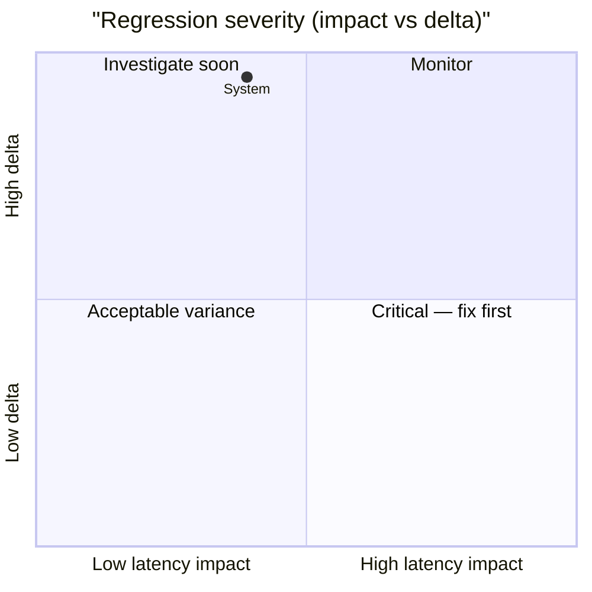

# 🚀 PostgreSQL Performance Ledger

> [!NOTE] Competitive comparisons based on publicly available documentation as of June 2026. All SveltyCMS metrics self-measured via `bun test tests/benchmarks/`.

> [!IMPORTANT]
> **Console-only by default.** Use `BENCHMARK_RECORD=1` to write results to this report.
>
> ```bash
> BENCHMARK_RECORD=1 bun test tests/benchmarks/auth-performance.test.ts
> ```
>
> The full matrix runner (`bun run scripts/benchmark-matrix/index.ts --sql`) always records.

<!-- BENCHMARK_START -->

<!-- EXECUTIVE_START -->
<!-- LATEST_AUDIT_HEADER -->

## 📊 Latest Performance Audit

<!-- EXECUTIVE_FIX_NOTES_START -->

### 📝 Fix Overlays

> [!NOTE]
> Phase notes and remediation entries appear here after matrix or surgical runs.

<!-- EXECUTIVE_FIX_NOTES_END -->

> [!NOTE]
> **Partial update** — dimension rollups and issues reflect only tests invoked in this run.

**✅ PASS** _(partial invocation)_ · 1/45 tests · 44 skipped · **postgresql** · standalone run

### Dimension health

| Dimension      | Tests | Status | Worst Δ | Issues |
| -------------- | ----: | ------ | ------- | ------ |
| **Core**       |     5 | 🟢     | -21%    | 0      |
| **API**        |     0 | ⚪     | —       | 0      |
| **Scale**      |     0 | ⚪     | —       | 0      |
| **Resilience** |     0 | ⚪     | —       | 0      |

### Issues (action required)

> ✅ **All clear** — no regressions or budget violations detected.

### Executive latency matrix

| Scenario          | Latency | Trend                                    | Budget | Result |
| ----------------- | ------- | ---------------------------------------- | ------ | ------ |
| **System**        | 0.388ms | ⚪ stable at 0.494ms (±0.265ms) (3 runs) | < 5ms  | 🟢     |
| **Metadata**      | 0.707ms | ⚪ stable at 0.738ms (±0.092ms) (3 runs) | < 5ms  | 🟢     |
| **CRUD (Get)**    | 0.713ms | ⚪ stable at 0.731ms (±0.122ms) (3 runs) | < 5ms  | 🟢     |
| **CRUD (List)**   | 0.768ms | ⚪ stable at 0.779ms (±0.186ms) (3 runs) | < 5ms  | 🟢     |
| **CRUD (Search)** | 0.745ms | ⚪ stable at 0.764ms (±0.137ms) (3 runs) | < 5ms  | 🟢     |

### Historical pulse

> **Scope:** Sparklines only — full run tables: [`tests/benchmarks/results/history.sqlite`](../../../tests/benchmarks/results/history.sqlite)

| Metric                                                    | Trend | Sparkline | Latest     |
| --------------------------------------------------------- | ----- | --------- | ---------- |
| cold start phased (Cold Start (IDLE → HTTP READY)) (cold) | 🟢    | `▁▁█▂`    | 1729.011ms |
| database performance (BULK INSERT (100)) (warm)           | 🟢    | `▆█▄▁`    | 4.932ms    |

<details>
<summary>📈 Latency trend chart (last 10 runs)</summary>

```mermaid
xychart-beta
  title "postgresql REST p95 (last 10 runs)"
  x-axis ["R1", "R2", "R3", "R4", "R5", "R6", "R7", "R8", "R9", "R10"]
  y-axis "Latency (ms)"
  line "p95" : [0.000, 0.000, 0.000, 0.000, 0.000, 0.000, 0.000, 0.000, 0.000, 0.000]
```

</details>
<details>
<summary>📊 Regression severity matrix (quadrant)</summary>



</details>

<!-- EXECUTIVE_PARTIAL_WATERMARK -->

<!-- EXECUTIVE_ALERTS_START -->
<!-- EXECUTIVE_ALERTS_END -->

<!-- EXECUTIVE_END -->

<!-- SUMMARY_START -->

<!-- SUMMARY_RUN_OVERLAY_START -->

### Current Run Summary (2026-09-18)

> **Scope:** Only tests that ran in THIS invocation.

> ⚠️ Executive PASS/FAIL reflects the last full matrix run.

**Run ID:** `ae98de92-913a-4e28-9db6-0584820224a7` · **Tests invoked:** 1 · **Metrics:** 5 · **DB:** postgresql

| Test                 | Metric                          | Avg (ms) | p95 (ms) | RPS  | Trend | Detail                                   |
| -------------------- | ------------------------------- | -------- | -------- | ---- | ----- | ---------------------------------------- |
| Rest Api Performance | System Health Check             | 0.388    | 0.827    | 8732 | 🟢    | ⚪ stable at 0.494ms (±0.265ms) (3 runs) |
| Rest Api Performance | Collection Schema Metadata      | 0.707    | 1.586    | 5118 | 🟢    | ⚪ stable at 0.738ms (±0.092ms) (3 runs) |
| Rest Api Performance | Single Document Read            | 0.713    | 1.593    | 5108 | 🟢    | ⚪ stable at 0.731ms (±0.122ms) (3 runs) |
| Rest Api Performance | Collection Find (List Limit 20) | 0.768    | 1.586    | 4698 | 🟢    | ⚪ stable at 0.779ms (±0.186ms) (3 runs) |
| Rest Api Performance | Collection Search Query         | 0.745    | 1.838    | 4689 | 🟢    | ⚪ stable at 0.764ms (±0.137ms) (3 runs) |

<!-- SUMMARY_RUN_OVERLAY_END -->

<!-- SUMMARY_HISTORY_START -->

### Historical Trends (2026-09-18)

> **Scope:** Sparklines only — full run tables live in `history.sqlite` (link below). Runs = sparkline bar count.

**Detail:** [`tests/benchmarks/results/history.sqlite`](../../../tests/benchmarks/results/history.sqlite) · `SELECT test_id, phase, avg_ms, p95_ms, rps, timestamp FROM runs WHERE db_type='postgresql' AND redis=0 ORDER BY timestamp DESC`

**Series:** 9 · **DB:** postgresql

| Metric                              | Trend | Sparkline (last 7) | Latest     |
| ----------------------------------- | ----- | ------------------ | ---------- |
| COLD START PHASED (cold)            | 🟢    | `▁▁█▂`             | 1729.011ms |
| COMPETITIVE WORKLOAD REPLICA (warm) | 🟢    | `▁▇▄▄▁█▃`          | 2.740ms    |
| DATABASE PERFORMANCE (warm)         | 🟢    | `▁▂▇▃█▂▂`          | 1.656ms    |
| SCALE SPECTRUM (warm)               | 🟢    | `▇▄▁▆▁█▆`          | 2.354ms    |
| TRANSACTION ACID (warm)             | 🟢    | `▆▂█▁▅▁▆`          | 2.749ms    |
| TRUTH LATENCY (warm)                | 🟢    | `▆▁▁█▇▁▁`          | 0.000ms    |
| CACHE PERFORMANCE (warm)            | ⚪    | `▇▁▃▃▄▅█`          | 0.339ms    |
| HOOKS PERFORMANCE (warm)            | ⚪    | `▂▁▂▂▂▁█`          | 2.605ms    |
| REST API PERFORMANCE (warm)         | ⚪    | `▇▃█▇█▇▁`          | 0.388ms    |

<!-- SUMMARY_HISTORY_END --><!-- SUMMARY_END -->

<!-- LEDGER_START -->

## 🔬 Full benchmark ledger (41 modules)

Expand dimension groups, then any row, for ASCII truth tables. Executive summary above shows pass/fail and issues only.

<!-- LEDGER_DIMENSION:CORE:START -->

<details id="ledger-dimension-core">
<summary><strong>Core</strong> · 22 tests</summary>

<!-- SECTION:API_LATENCY:START -->

<details id="section-api_latency">
<summary><strong>🏷️ API LAYER LATENCY</strong> · 🟢 1.480ms · ➡️ recorded (awaiting trend) · <a href="../../../tests/benchmarks/api-latency.test.ts">source</a></summary>

<!-- LEDGER_TRUTH_START -->

```text
╔═══════════════════════════════════════════════════════════════════════════════════════════════════════╗
║                                     SVELTYCMS — API LAYER LATENCY                                     ║
║                              File: tests/benchmarks/api-latency.test.ts                               ║
║                                       Ran: 2026-08-29 21:41:48                                        ║
║              Cold full-pipeline findById + warm TURBO-HIT path after responseCache fill.              ║
╠═══════════════════════════════════════════════════════════════════════════════════════════════════════╣
║ HTTP: findById @ 8c (Cold)   │ Cold:     1.48 ms │ Warm:     2.702 ms │ p95:     3.734 ms │   2,810 RPS ║
║ HTTP: findById TURBO-HIT @ 8c (Warm) │ Cold:     0.55 ms │ Warm:     1.569 ms │ p95:     2.070 ms │   5,015 RPS ║
╚═══════════════════════════════════════════════════════════════════════════════════════════════════════╝
```

<!-- LEDGER_TRUTH_END -->

</details>
<!-- SECTION:API_LATENCY:END -->

<!-- SECTION:COLD_START:START -->
<details id="section-cold_start">
<summary><strong>🏷️ cold start phased</strong> · 🟢 1729.011ms · ➡️ ⚪ stable at 1663.94ms (±699.64ms) (3 runs) (2026-09-18 18:21:07) · <a href="../../../tests/benchmarks/cold-start-phased.test.ts">source</a></summary>
<!-- LEDGER_TRUTH_START -->
```text
╔═══════════════════════════════════════════════════════════════════════════════════════════════════════╗
║                                  SVELTYCMS — PHASED COLD START AUDIT                                  ║
║                           File: tests/benchmarks/cold-start-phased.test.ts                            ║
║                                       Ran: 2026-09-18 18:21:07                                        ║
║            Measures process spawn, dependency hydration, and first-request TTFB readiness.            ║
╠═══════════════════════════════════════════════════════════════════════════════════════════════════════╣
║ Initial Cold Boot (Fresh Process) │     2604.577 ms │ p95:     2604.577 ms │ RPS:          0 ║
║ Steady-State Respawn (Average) │     1729.011 ms │ p95:     2604.577 ms │ RPS:          0 ║
╚═══════════════════════════════════════════════════════════════════════════════════════════════════════╝
```
<!-- LEDGER_TRUTH_END -->

</details>
<!-- SECTION:COLD_START:END -->

<!-- SECTION:TRUTH_AUDIT:START -->

<details id="section-truth_audit">
<summary><strong>🏷️ SRE TRUTH AUDIT</strong> · 🟢 0.020ms · ➡️ recorded (awaiting trend) · <a href="../../../tests/benchmarks/truth-latency.test.ts">source</a></summary>

<!-- LEDGER_TRUTH_START -->

```text
╔═══════════════════════════════════════════════════════════════════════════════════════════════════════╗
║                                      SVELTYCMS — SRE TRUTH AUDIT                                      ║
║                             File: tests/benchmarks/truth-latency.test.ts                              ║
║                                       Ran: 2026-09-18 18:21:14                                        ║
║            Validates performance claims by comparing SDK, Middleware, and Real HTTP Stack             ║
╠═══════════════════════════════════════════════════════════════════════════════════════════════════════╣
║ Logic Baseline               │ Cold:     0.02 ms │ Warm:     0.000 ms │ p95:     0.000 ms │ 472,069 RPS ║
║ Local SDK (Full)             │ Cold:     2.77 ms │ Warm:     0.005 ms │ p95:     0.009 ms │ 119,441 RPS ║
║ HTTP End-to-End              │ Cold:     9.32 ms │ Warm:     0.457 ms │ p95:     0.527 ms │   2,175 RPS ║
║ HTTP Cold (Cache-Busted)     │ Cold:     1.58 ms │ Warm:     0.563 ms │ p95:     1.096 ms │   1,769 RPS ║
╚═══════════════════════════════════════════════════════════════════════════════════════════════════════╝
```

<!-- LEDGER_TRUTH_END -->

</details>
<!-- SECTION:TRUTH_AUDIT:END -->

<!-- SECTION:INCREMENTAL:START -->

<details id="section-incremental">
<summary><strong>🏷️ Incremental Content Reload</strong> · 🟢 4.030ms · ➡️ recorded (awaiting trend) · <a href="../../../tests/benchmarks/content-incremental-reload.test.ts">source</a></summary>

<!-- LEDGER_TRUTH_START -->

```text
╔═══════════════════════════════════════════════════════════════════════════════════════════════════════╗
║                             SVELTYCMS — INCREMENTAL CONTENT RELOAD AUDIT                              ║
║                       File: tests/benchmarks/content-incremental-reload.test.ts                       ║
║                                       Ran: 2026-08-29 21:46:07                                        ║
║      Measures surgical single-file fullReload vs full reconciliation path and batch processing.       ║
╠═══════════════════════════════════════════════════════════════════════════════════════════════════════╣
║ Incremental fullReload (1 file) │ Cold:     4.03 ms │ Warm:     0.245 ms │ p95:     0.520 ms │   3,273 RPS ║
║ Full Reconciliation Reload   │ Cold:     3.04 ms │ Warm:     0.320 ms │ p95:     0.512 ms │   2,845 RPS ║
║ Sequential 10-File Reload    │ Cold:     5.89 ms │ Warm:     2.074 ms │ p95:     5.052 ms │     396 RPS ║
║ Batched 10-File Reload       │ Cold:     1.75 ms │ Warm:     1.138 ms │ p95:     2.162 ms │     725 RPS ║
╚═══════════════════════════════════════════════════════════════════════════════════════════════════════╝
```

<!-- LEDGER_TRUTH_END -->

</details>
<!-- SECTION:INCREMENTAL:END -->

<!-- SECTION:HOOKS_TRACE:START -->

<details id="section-hooks_trace">
<summary><strong>🏷️ Middleware & Hooks Performance</strong> · 🟢 2.250ms · ➡️ recorded (awaiting trend) · <a href="../../../tests/benchmarks/hooks-performance.test.ts">source</a></summary>

<!-- LEDGER_TRUTH_START -->

```text
╔═══════════════════════════════════════════════════════════════════════════════════════════════════════╗
║                                 SVELTYCMS — MIDDLEWARE & HOOKS AUDIT                                  ║
║                           File: tests/benchmarks/hooks-performance.test.ts                            ║
║                                       Ran: 2026-09-18 18:23:38                                        ║
║Measures the cost of the full middleware chain including Turbo, Security, Auth, and Audit via HTTP E2E.║
╠═══════════════════════════════════════════════════════════════════════════════════════════════════════╣
║ Static Asset (No Middleware) │ Cold:     2.25 ms │ Warm:     0.881 ms │ p95:     2.175 ms │   3,920 RPS ║
║ Turbo Pipeline (Light)       │ Cold:     1.36 ms │ Warm:     0.612 ms │ p95:     1.799 ms │   5,502 RPS ║
║ Full Security + Auth Pipeline │ Cold:     7.03 ms │ Warm:     0.900 ms │ p95:     1.929 ms │   4,063 RPS ║
║ REST with API Caching        │ Cold:     5.29 ms │ Warm:     0.916 ms │ p95:     1.905 ms │   3,988 RPS ║
║ Mutation (audit logging disabled) │ Cold:     7.72 ms │ Warm:     2.605 ms │ p95:     4.010 ms │     363 RPS ║
╚═══════════════════════════════════════════════════════════════════════════════════════════════════════╝
```

<!-- LEDGER_TRUTH_END -->

</details>
<!-- SECTION:HOOKS_TRACE:END -->

<!-- SECTION:STATE_MACHINE:START -->

<details id="section-state_machine">
<summary><strong>🏷️ State Machine Transitions</strong> · 🟢 223.160ms · ➡️ recorded (awaiting trend) · <a href="../../../tests/benchmarks/state-machine-transition.test.ts">source</a></summary>

<!-- LEDGER_TRUTH_START -->

```text
╔═══════════════════════════════════════════════════════════════════════════════════════════════════════╗
║                                  SVELTYCMS — STATE MACHINE INTEGRITY                                  ║
║                        File: tests/benchmarks/state-machine-transition.test.ts                        ║
║                                       Ran: 2026-08-29 21:01:00                                        ║
║Measures state machine self-healing transition latencies, convergence settling time, and health probe consistency under stress.║
╠═══════════════════════════════════════════════════════════════════════════════════════════════════════╣
║ State Transition (Transient) │ Cold:   223.16 ms │ Warm:   185.741 ms │ p95:   200.190 ms │       5 RPS ║
║ Self-Healing Full Convergence │ Cold:   184.77 ms │ Warm:   184.825 ms │ p95:   195.517 ms │       5 RPS ║
╚═══════════════════════════════════════════════════════════════════════════════════════════════════════╝
```

<!-- LEDGER_TRUTH_END -->

</details>
<!-- SECTION:STATE_MACHINE:END -->

<!-- SECTION:DB_RAW_P95:START -->
<details id="section-db_raw_p95">
<summary><strong>🏷️ database performance</strong> · 🟢 5.876ms · ➡️ ⚪ stable at 5.96ms (±1.04ms) (3 runs) (2026-09-18 18:23:08) · <a href="../../../tests/benchmarks/database-performance.test.ts">source</a></summary>
<!-- LEDGER_TRUTH_START -->
```text
╔═══════════════════════════════════════════════════════════════════════════════════════════════════════╗
║                         SVELTYCMS — DATABASE ADAPTER PERFORMANCE (POSTGRESQL)                         ║
║                          File: tests/benchmarks/database-performance.test.ts                          ║
║                                       Ran: 2026-09-18 18:23:08                                        ║
║          Measures raw CRUD performance, indexing efficiency, and connection pool resilience.          ║
╠═══════════════════════════════════════════════════════════════════════════════════════════════════════╣
║ INSERT                       │ Cold:     6.88 ms │ Warm:     1.708 ms │ p95:     3.493 ms │     522 RPS ║
║ FIND ONE                     │ Cold:     4.35 ms │ Warm:     0.391 ms │ p95:     0.584 ms │   2,256 RPS ║
║ FIND MANY (limit 50)         │ Cold:     4.18 ms │ Warm:     1.078 ms │ p95:     2.829 ms │     805 RPS ║
║ QUERY BUILDER LIST (50)      │ Cold:     9.05 ms │ Warm:     4.591 ms │ p95:     6.068 ms │     216 RPS ║
║ FIND PAGE (50 hasMore)       │ Cold:     4.05 ms │ Warm:     1.101 ms │ p95:     2.606 ms │     808 RPS ║
║ FIND PAGE keyset             │ Cold:     5.58 ms │ Warm:     1.118 ms │ p95:     2.730 ms │     790 RPS ║
║ FIND MANY offset 50          │ Cold:     3.12 ms │ Warm:     0.919 ms │ p95:     2.317 ms │     965 RPS ║
║ LIST+COUNT (legacy)          │ Cold:     6.93 ms │ Warm:     4.036 ms │ p95:     5.983 ms │     234 RPS ║
║ UPDATE                       │ Cold:     5.03 ms │ Warm:     1.677 ms │ p95:     3.278 ms │     533 RPS ║
║ UPDATE (no-returning)        │ Cold:     5.29 ms │ Warm:     1.656 ms │ p95:     3.253 ms │     544 RPS ║
║ NATIVE UPSERT                │ Cold:     5.31 ms │ Warm:     2.081 ms │ p95:     4.053 ms │     422 RPS ║
║ COUNT                        │ Cold:     2.89 ms │ Warm:     0.940 ms │ p95:     2.441 ms │     939 RPS ║
║ COUNT ESTIMATE               │ Cold:     3.30 ms │ Warm:     0.695 ms │ p95:     1.507 ms │   1,263 RPS ║
║ COUNT CACHED                 │ Cold:     4.78 ms │ Warm:     0.001 ms │ p95:     0.004 ms │ 548,727 RPS ║
║ DELETE (Active Rows)         │ Cold:    17.71 ms │ Warm:     2.074 ms │ p95:     4.068 ms │     415 RPS ║
║ BULK INSERT (100)            │ Cold:     8.30 ms │ Warm:     4.932 ms │ p95:     6.529 ms │     198 RPS ║
║ BULK UPDATE (100 heterogeneous) │ Cold:    20.16 ms │ Warm:     6.376 ms │ p95:     8.521 ms │     155 RPS ║
║ BULK UPDATE (100 homogeneous) │ Cold:    16.31 ms │ Warm:     5.876 ms │ p95:     7.844 ms │     168 RPS ║
╚═══════════════════════════════════════════════════════════════════════════════════════════════════════╝
```
<!-- LEDGER_TRUTH_END -->

</details>
<!-- SECTION:DB_RAW_P95:END -->

<!-- SECTION:ACID:START -->
<details id="section-acid">
<summary><strong>🏷️ transaction acid</strong> · 🟢 2.749ms · ↘️ ⚪ stable at 3.06ms (±0.914ms) (7 runs) (2026-09-18 18:23:18) · <a href="../../../tests/benchmarks/transaction-acid.test.ts">source</a></summary>
<!-- LEDGER_INSIGHT_START -->
> [!NOTE]
> **Specific to this test**: Performance improved — recent optimizations or cache warming likely effective.
<!-- LEDGER_INSIGHT_END -->

<!-- LEDGER_TRUTH_START -->

```text
╔═══════════════════════════════════════════════════════════════════════════════════════════════════════╗
║                                   SVELTYCMS — ACID INTEGRITY AUDIT                                    ║
║                            File: tests/benchmarks/transaction-acid.test.ts                            ║
║                                       Ran: 2026-09-18 18:23:18                                        ║
║         Measures transaction commit latencies and rollback overhead across database adapters          ║
╠═══════════════════════════════════════════════════════════════════════════════════════════════════════╣
║ TX Commit                    │ Cold:     3.93 ms │ Warm:     1.006 ms │ p95:     2.672 ms │   3,421 RPS ║
║ TX Rollback Integrity        │ Cold:     4.41 ms │ Warm:     2.749 ms │ p95:     4.689 ms │     363 RPS ║
╚═══════════════════════════════════════════════════════════════════════════════════════════════════════╝
```

<!-- LEDGER_TRUTH_END -->

</details>
<!-- SECTION:ACID:END -->

<!-- SECTION:CACHE:START -->
<details id="section-cache">
<summary><strong>🏷️ Cache</strong> · 🟢 0.291ms · ↗️ ⚪ stable at 0.263ms (±0.038ms) (3 runs) (2026-09-18 18:23:27) · <a href="../../../tests/benchmarks/cache-performance.test.ts">source</a></summary>
<!-- LEDGER_INSIGHT_START -->
> [!NOTE]
> **Specific to this test**: Avg degraded but p95 stable — possible cold-start effect, GC pause, or warmup variance.
<!-- LEDGER_INSIGHT_END -->

<!-- LEDGER_TRUTH_START -->

```text
╔═══════════════════════════════════════════════════════════════════════════════════════════════════════╗
║                                  SVELTYCMS — CACHE EFFICIENCY AUDIT                                   ║
║                           File: tests/benchmarks/cache-performance.test.ts                            ║
║                                       Ran: 2026-09-18 18:23:27                                        ║
║         Measures cache hit vs miss latency and efficiency via real HTTP end-to-end requests.          ║
╠═══════════════════════════════════════════════════════════════════════════════════════════════════════╣
║ Cache Miss (Bypass)          │ Cold:     2.98 ms │ Warm:     0.339 ms │ p95:     0.481 ms │   2,608 RPS ║
║ Cache Hit (L1 Warm)          │ Cold:     2.84 ms │ Warm:     0.291 ms │ p95:     0.367 ms │   3,085 RPS ║
╚═══════════════════════════════════════════════════════════════════════════════════════════════════════╝
```

<!-- LEDGER_TRUTH_END -->

</details>
<!-- SECTION:CACHE:END -->

<!-- SECTION:CACHE_EFFICIENCY:START -->

<details id="section-cache_efficiency">
<summary><strong>🏷️ Cache Hit/Miss Ratio & Efficiency</strong> · 🟢 0.456ms · ➡️ recorded (awaiting trend) · <a href="../../../tests/benchmarks/cache-hit-ratio.test.ts">source</a></summary>

<!-- LEDGER_TRUTH_START -->

```text
╔═══════════════════════════════════════════════════════════════════════════════════════════════════════╗
║                                  SVELTYCMS — CACHE EFFICIENCY AUDIT                                   ║
║                            File: tests/benchmarks/cache-hit-ratio.test.ts                             ║
║                                       Ran: 2026-08-29 21:42:13                                        ║
║           Measures true cold-fill, warm hit ratio, miss penalty, and invalidation latency.            ║
╠═══════════════════════════════════════════════════════════════════════════════════════════════════════╣
║ Cache Cold Fill (Miss + Repopulate) │        0.456 ms │ p95:        0.536 ms │ RPS:      2,193 ║
║ Cache Hit (Warm)             │ Cold:     0.47 ms │ Warm:     0.309 ms │ p95:     0.472 ms │   2,923 RPS ║
║ Bypass Cache (Direct DB)     │ Cold:     0.59 ms │ Warm:     0.334 ms │ p95:     0.545 ms │   2,971 RPS ║
║ Cache Invalidation           │ Cold:     4.42 ms │ Warm:     2.588 ms │ p95:     3.411 ms │     374 RPS ║
╚═══════════════════════════════════════════════════════════════════════════════════════════════════════╝
```

<!-- LEDGER_TRUTH_END -->

</details>
<!-- SECTION:CACHE_EFFICIENCY:END -->

<!-- SECTION:UNKNOWN:START -->
<details id="section-unknown">
<summary><strong>🏷️ unknown</strong> · 🟢 0.002ms · ➡️ recorded (awaiting trend) · <a href="../../../tests/benchmarks/transaction-acid.test.ts">source</a></summary>
<!-- LEDGER_TRUTH_START -->
```text
╔═════════════════════════════════════════════════════════════════════════════════════════╗
║                      SVELTYCMS — CACHE EVICTION BOUNDARY HARDENING                      ║
║                                      File: unknown                                      ║
║                                Ran: 2026-08-23 22:11:25                                 ║
╠═════════════════════════════════════════════════════════════════════════════════════════╣
║ Cache Flooding & Eviction      │        0.002 ms │ p95:        0.002 ms │ RPS:    491,074 ║
╚═════════════════════════════════════════════════════════════════════════════════════════╝
```
<!-- LEDGER_TRUTH_END -->

</details>
<!-- SECTION:UNKNOWN:END -->

<!-- SECTION:MIDDLEWARE:START -->
<details id="section-middleware">
<summary><strong>🏷️ Middleware</strong> · 🟢 2.605ms · ↘️ ⚪ stable at 3.43ms (±1.49ms) (7 runs) (2026-09-18 18:23:38) · <a href="../../../tests/benchmarks/hooks-performance.test.ts">source</a></summary>
<!-- LEDGER_INSIGHT_START -->
> [!NOTE]
> **Specific to this test**: Performance improved — recent optimizations or cache warming likely effective.
<!-- LEDGER_INSIGHT_END -->

<!-- LEDGER_TRUTH_START -->

> ⏳ Pending

<!-- LEDGER_TRUTH_END -->

</details>
<!-- SECTION:MIDDLEWARE:END -->

<!-- SECTION:SYSTEM:START -->
<details id="section-system">
<summary><strong>🏷️ System</strong> · 🟢 0.388ms · ↘️ ⚪ stable at 0.494ms (±0.265ms) (3 runs) (2026-09-18 18:23:47) · <a href="../../../tests/benchmarks/rest-api-performance.test.ts">source</a></summary>
<!-- LEDGER_INSIGHT_START -->
> [!NOTE]
> **Specific to this test**: Performance improved — recent optimizations or cache warming likely effective.
<!-- LEDGER_INSIGHT_END -->

<!-- LEDGER_TRUTH_START -->

> ⏳ Pending

<!-- LEDGER_TRUTH_END -->

</details>
<!-- SECTION:SYSTEM:END -->

<!-- SECTION:METADATA:START -->
<details id="section-metadata">
<summary><strong>🏷️ Metadata</strong> · 🟢 0.707ms · ➡️ ⚪ stable at 0.738ms (±0.092ms) (3 runs) (2026-09-18 18:23:48) · <a href="../../../tests/benchmarks/rest-api-performance.test.ts">source</a></summary>
<!-- LEDGER_TRUTH_START -->
> ⏳ Pending
<!-- LEDGER_TRUTH_END -->

</details>
<!-- SECTION:METADATA:END -->

<!-- SECTION:CRUD:START -->
<details id="section-crud">
<summary><strong>🏷️ CRUD</strong> · 🟢 0.608ms · ➡️ ⚪ established at 0.608ms (1 run) (2026-08-25 11:33:27) · <a href="../../../tests/benchmarks/rest-api-performance.test.ts">source</a></summary>
<!-- LEDGER_TRUTH_START -->
> ⏳ Pending
<!-- LEDGER_TRUTH_END -->

</details>
<!-- SECTION:CRUD:END -->

<!-- SECTION:LOGIC:START -->
<details id="section-logic">
<summary><strong>🏷️ Logic</strong> · 🟢 ⏳ pending · ➡️ ⚪ stable at 0ms (7 runs) (2026-09-18 18:21:21) · <a href="../../../tests/benchmarks/truth-latency.test.ts">source</a></summary>
<!-- LEDGER_TRUTH_START -->
> ⏳ Pending
<!-- LEDGER_TRUTH_END -->

</details>
<!-- SECTION:LOGIC:END -->

<!-- SECTION:SDK:START -->
<details id="section-sdk">
<summary><strong>🏷️ SDK</strong> · 🟢 0.005ms · ➡️ ⚪ stable at 0.005ms (±0.011ms) (7 runs) (2026-09-18 18:21:21) · <a href="../../../tests/benchmarks/truth-latency.test.ts">source</a></summary>
<!-- LEDGER_TRUTH_START -->
```text
╔═══════════════════════════════════════════════════════════════════════════════════════════════════════╗
║                                  SVELTYCMS — SDK OVERHEAD TELEMETRY                                   ║
║                         File: tests/benchmarks/local-api-performance.test.ts                          ║
║                                       Ran: 2026-08-29 21:42:48                                        ║
║Measures LocalCMS SDK dispatch overhead vs direct adapter calls to verify zero-tax in-process performance.║
╠═══════════════════════════════════════════════════════════════════════════════════════════════════════╣
║ Direct Adapter Call          │ Cold:     1.99 ms │ Warm:     0.448 ms │ p95:     0.953 ms │   1,843 RPS ║
║ LocalCMS Hoisted Call        │ Cold:     1.92 ms │ Warm:     0.423 ms │ p95:     0.720 ms │   2,021 RPS ║
║ LocalCMS Full Property Path  │ Cold:     1.82 ms │ Warm:     0.436 ms │ p95:     0.845 ms │   1,947 RPS ║
╚═══════════════════════════════════════════════════════════════════════════════════════════════════════╝
```
<!-- LEDGER_TRUTH_END -->

</details>
<!-- SECTION:SDK:END -->

<!-- SECTION:HTTP:START -->
<details id="section-http">
<summary><strong>🏷️ HTTP</strong> · 🟢 0.457ms · ➡️ ⚪ stable at 0.450ms (±0.112ms) (7 runs) (2026-09-18 18:21:21) · <a href="../../../tests/benchmarks/truth-latency.test.ts">source</a></summary>
<!-- LEDGER_TRUTH_START -->
> ⏳ Pending
<!-- LEDGER_TRUTH_END -->

</details>
<!-- SECTION:HTTP:END -->

<!-- SECTION:CRUD__GET_:START -->
<details id="section-crud__get_">
<summary><strong>🏷️ CRUD (Get)</strong> · 🟢 0.713ms · ➡️ ⚪ stable at 0.731ms (±0.122ms) (3 runs) (2026-09-18 18:23:48) · <a href="../../../tests/benchmarks/rest-api-performance.test.ts">source</a></summary>
<!-- LEDGER_TRUTH_START -->
> ⏳ Pending
<!-- LEDGER_TRUTH_END -->

</details>
<!-- SECTION:CRUD__GET_:END -->

<!-- SECTION:CRUD__LIST_:START -->
<details id="section-crud__list_">
<summary><strong>🏷️ CRUD (List)</strong> · 🟢 0.768ms · ➡️ ⚪ stable at 0.779ms (±0.186ms) (3 runs) (2026-09-18 18:23:49) · <a href="../../../tests/benchmarks/rest-api-performance.test.ts">source</a></summary>
<!-- LEDGER_TRUTH_START -->
> ⏳ Pending
<!-- LEDGER_TRUTH_END -->

</details>
<!-- SECTION:CRUD__LIST_:END -->

<!-- SECTION:CRUD__SEARCH_:START -->
<details id="section-crud__search_">
<summary><strong>🏷️ CRUD (Search)</strong> · 🟢 0.745ms · ➡️ ⚪ stable at 0.764ms (±0.137ms) (3 runs) (2026-09-18 18:23:49) · <a href="../../../tests/benchmarks/rest-api-performance.test.ts">source</a></summary>
<!-- LEDGER_TRUTH_START -->
> ⏳ Pending
<!-- LEDGER_TRUTH_END -->

</details>
<!-- SECTION:CRUD__SEARCH_:END -->

<!-- SECTION:HTTP_COLD:START -->
<details id="section-http_cold">
<summary><strong>🏷️ HTTP-Cold</strong> · 🟢 0.563ms · ➡️ ⚪ stable at 0.542ms (±0.033ms) (2 runs) (2026-09-18 18:21:21) · <a href="../../../tests/benchmarks/truth-latency.test.ts">source</a></summary>
<!-- LEDGER_TRUTH_START -->
> ⏳ Pending
<!-- LEDGER_TRUTH_END -->

</details>
<!-- SECTION:HTTP_COLD:END -->

</details>

<!-- LEDGER_DIMENSION:CORE:END -->

<!-- LEDGER_DIMENSION:API:START -->

<details id="ledger-dimension-api">
<summary><strong>API</strong> · 8 tests</summary>

<!-- SECTION:TEMPORAL:START -->

<details id="section-temporal">
<summary><strong>🏷️ Temporal Integrity Audit</strong> · 🟢 6.320ms · ➡️ recorded (awaiting trend) · <a href="../../../tests/benchmarks/temporal-integrity.test.ts">source</a></summary>

<!-- LEDGER_TRUTH_START -->

```text
╔═══════════════════════════════════════════════════════════════════════════════════════════════════════╗
║                                 SVELTYCMS — TEMPORAL INTEGRITY AUDIT                                  ║
║                           File: tests/benchmarks/temporal-integrity.test.ts                           ║
║                                       Ran: 2026-08-29 21:43:26                                        ║
║Validates strict backend UTC normalization (ISO 8601 with trailing 'Z') across global timezone offsets, fractional timezones, and midnight transitions.║
╠═══════════════════════════════════════════════════════════════════════════════════════════════════════╣
║ Temporal Ingestion & Normalization │ Cold:     6.32 ms │ Warm:     5.231 ms │ p95:     9.567 ms │     705 RPS ║
╚═══════════════════════════════════════════════════════════════════════════════════════════════════════╝
```

<!-- LEDGER_TRUTH_END -->

</details>
<!-- SECTION:TEMPORAL:END -->

<!-- SECTION:RELATIONAL:START -->

<details id="section-relational">
<summary><strong>🏷️ Relational & Nested Queries</strong> · 🟢 2.720ms · ➡️ recorded (awaiting trend) · <a href="../../../tests/benchmarks/relational-performance.test.ts">source</a></summary>

<!-- LEDGER_TRUTH_START -->

```text
╔═══════════════════════════════════════════════════════════════════════════════════════════════════════╗
║                                 SVELTYCMS — RELATIONAL RESOLVER AUDIT                                 ║
║                         File: tests/benchmarks/relational-performance.test.ts                         ║
║                                       Ran: 2026-08-29 21:42:31                                        ║
║Measures GraphQL resolver performance for shallow listings, deep relational joins, and nested author population across cold/hot execution paths.║
╠═══════════════════════════════════════════════════════════════════════════════════════════════════════╣
║ Shallow Query (Collections)  │ Cold:     2.72 ms │ Warm:     2.705 ms │ p95:     4.179 ms │   2,079 RPS ║
║ Deep Join (Cold DB)          │ Cold:     2.83 ms │ Warm:     2.283 ms │ p95:     3.149 ms │   1,661 RPS ║
║ Deep Join (Warm Cached)      │ Cold:     1.82 ms │ Warm:     1.746 ms │ p95:     2.546 ms │   2,127 RPS ║
╚═══════════════════════════════════════════════════════════════════════════════════════════════════════╝
```

<!-- LEDGER_TRUTH_END -->

</details>
<!-- SECTION:RELATIONAL:END -->

<!-- SECTION:AUTH_TRACE:START -->

<details id="section-auth_trace">
<summary><strong>🏷️ Auth & RBAC Performance</strong> · 🟢 1.000ms · ➡️ recorded (awaiting trend) · <a href="../../../tests/benchmarks/auth-performance.test.ts">source</a></summary>

<!-- LEDGER_TRUTH_START -->

```text
╔═══════════════════════════════════════════════════════════════════════════════════════════════════════╗
║                                 SVELTYCMS — AUTHENTICATION TELEMETRY                                  ║
║                            File: tests/benchmarks/auth-performance.test.ts                            ║
║                                       Ran: 2026-08-29 21:41:51                                        ║
║           Evaluates authenticated session resolution, RBAC evaluation, and rejection paths.           ║
╠═══════════════════════════════════════════════════════════════════════════════════════════════════════╣
║ Unauthenticated (401 Fast Path) │ Cold:     1.00 ms │ Warm:     0.313 ms │ p95:     0.404 ms │   2,983 RPS ║
║ Auth Validation @ 1c         │ Cold:     1.09 ms │ Warm:     0.286 ms │ p95:     0.380 ms │   3,293 RPS ║
║ HTTP Auth Pipeline @ 8c      │ Cold:     1.04 ms │ Warm:     1.386 ms │ p95:     1.893 ms │   5,663 RPS ║
╚═══════════════════════════════════════════════════════════════════════════════════════════════════════╝
```

<!-- LEDGER_TRUTH_END -->

</details>
<!-- SECTION:AUTH_TRACE:END -->

<!-- SECTION:REST:START -->

<details id="section-rest">
<summary><strong>🏷️ REST API Performance</strong> · 🟢 1.160ms · ➡️ recorded (awaiting trend) · <a href="../../../tests/benchmarks/rest-api-performance.test.ts">source</a></summary>

<!-- LEDGER_TRUTH_START -->

```text
╔═══════════════════════════════════════════════════════════════════════════════════════════════════════╗
║                                 SVELTYCMS — ENTERPRISE REST API AUDIT                                 ║
║                          File: tests/benchmarks/rest-api-performance.test.ts                          ║
║                                       Ran: 2026-09-18 18:23:49                                        ║
║Measures latency, throughput, and correctness of core REST endpoints: health check, schema, single read, list, and search.║
╠═══════════════════════════════════════════════════════════════════════════════════════════════════════╣
║ System Health Check          │ Cold:     1.16 ms │ Warm:     0.388 ms │ p95:     0.827 ms │   8,732 RPS ║
║ Collection Schema Metadata   │ Cold:     7.49 ms │ Warm:     0.707 ms │ p95:     1.586 ms │   5,118 RPS ║
║ Single Document Read         │ Cold:     4.35 ms │ Warm:     0.713 ms │ p95:     1.593 ms │   5,108 RPS ║
║ Collection Find (List Limit 20) │ Cold:     8.83 ms │ Warm:     0.768 ms │ p95:     1.586 ms │   4,698 RPS ║
║ Collection Search Query      │ Cold:     5.83 ms │ Warm:     0.745 ms │ p95:     1.838 ms │   4,689 RPS ║
╚═══════════════════════════════════════════════════════════════════════════════════════════════════════╝
```

<!-- LEDGER_TRUTH_END -->

</details>
<!-- SECTION:REST:END -->

<!-- SECTION:GRAPHQL:START -->

<details id="section-graphql">
<summary><strong>🏷️ GraphQL API Performance</strong> · 🟢 2.330ms · ➡️ recorded (awaiting trend) · <a href="../../../tests/benchmarks/graphql-api-performance.test.ts">source</a></summary>

<!-- LEDGER_TRUTH_START -->

```text
╔═══════════════════════════════════════════════════════════════════════════════════════════════════════╗
║                                 SVELTYCMS — GRAPHQL PERFORMANCE AUDIT                                 ║
║                        File: tests/benchmarks/graphql-api-performance.test.ts                         ║
║                                       Ran: 2026-08-29 21:41:58                                        ║
║Measures GraphQL resolver performance across cold (cache-bypassed) and hot (response-cache hit) execution paths.║
╠═══════════════════════════════════════════════════════════════════════════════════════════════════════╣
║ GQL: System Health [cold]    │ Cold:     2.33 ms │ Warm:     0.895 ms │ p95:     1.559 ms │   1,035 RPS ║
║ GQL: System Health [hot]     │ Cold:     0.95 ms │ Warm:     0.798 ms │ p95:     1.430 ms │   1,154 RPS ║
║ GQL: Collection List [cold]  │ Cold:     1.56 ms │ Warm:     2.752 ms │ p95:     4.902 ms │   1,960 RPS ║
║ GQL: Collection List [hot]   │ Cold:     0.80 ms │ Warm:     2.372 ms │ p95:     3.418 ms │   2,398 RPS ║
║ GQL: Parameterized Query [cold] │ Cold:     1.63 ms │ Warm:     3.678 ms │ p95:     5.478 ms │   2,064 RPS ║
║ GQL: Parameterized Query [hot] │ Cold:     0.83 ms │ Warm:     3.003 ms │ p95:     4.454 ms │   2,510 RPS ║
╚═══════════════════════════════════════════════════════════════════════════════════════════════════════╝
```

<!-- LEDGER_TRUTH_END -->

</details>
<!-- SECTION:GRAPHQL:END -->

<!-- SECTION:SEO:START -->

<details id="section-seo">
<summary><strong>🏷️ Enterprise SEO Suite Audit</strong> · 🟢 1.280ms · ➡️ recorded (awaiting trend) · <a href="../../../tests/benchmarks/seo-performance.test.ts">source</a></summary>

<!-- LEDGER_TRUTH_START -->

```text
╔═══════════════════════════════════════════════════════════════════════════════════════════════════════╗
║                                   SVELTYCMS — ENTERPRISE SEO AUDIT                                    ║
║                            File: tests/benchmarks/seo-performance.test.ts                             ║
║                                       Ran: 2026-08-29 21:42:36                                        ║
║Measures redirect lookup latency, dynamic sitemap.xml generation, robots.txt serving, and 404 logging performance.║
╠═══════════════════════════════════════════════════════════════════════════════════════════════════════╣
║ Redirect Lookup (301)        │ Cold:     1.28 ms │ Warm:     1.127 ms │ p95:     1.848 ms │   7,004 RPS ║
║ Dynamic Sitemap XML          │ Cold:    19.77 ms │ Warm:     0.706 ms │ p95:     1.144 ms │  11,214 RPS ║
║ Robots.txt Generation        │ Cold:     1.96 ms │ Warm:     1.797 ms │ p95:     3.115 ms │   4,419 RPS ║
║ Missing Path (404 Log)       │ Cold:    54.20 ms │ Warm:    18.245 ms │ p95:    25.709 ms │     435 RPS ║
╚═══════════════════════════════════════════════════════════════════════════════════════════════════════╝
```

<!-- LEDGER_TRUTH_END -->

</details>
<!-- SECTION:SEO:END -->

<!-- SECTION:BROADCAST:START -->

<details id="section-broadcast">
<summary><strong>🏷️ REAL-TIME BROADCAST AUDIT</strong> · 🟢 5.770ms · ➡️ recorded (awaiting trend) · <a href="../../../tests/benchmarks/websocket-broadcast.test.ts">source</a></summary>

<!-- LEDGER_TRUTH_START -->

```text
╔═══════════════════════════════════════════════════════════════════════════════════════════════════════╗
║                               SVELTYCMS — YJS COLLABORATION SYNC AUDIT                                ║
║                          File: tests/benchmarks/websocket-broadcast.test.ts                           ║
║                                       Ran: 2026-08-29 21:02:05                                        ║
║Measures WebSocket handshake latency, bidirectional Yjs CRDT update propagation, and synchronization throughput.║
╠═══════════════════════════════════════════════════════════════════════════════════════════════════════╣
║ WS Handshake + SyncStep        │        5.770 ms │ p95:        0.000 ms │ RPS:          0 ║
║ Yjs CRDT Propagation         │ Cold:     1.75 ms │ Warm:     0.132 ms │ p95:     0.277 ms │   6,405 RPS ║
╚═══════════════════════════════════════════════════════════════════════════════════════════════════════╝
```

<!-- LEDGER_TRUTH_END -->

</details>
<!-- SECTION:BROADCAST:END -->

<!-- SECTION:REAL_TIME:START -->

<details id="section-real_time">
<summary><strong>🏷️ WebSocket & Realtime Latency</strong> · ⏳ pending · ➡️ baseline · <a href="../../../tests/benchmarks/realtime-performance.test.ts">source</a></summary>

<!-- LEDGER_TRUTH_START -->

> ⏳ Pending — Benchmarks WebSocket connection/broadcast latency.

<!-- LEDGER_TRUTH_END -->

</details>
<!-- SECTION:REAL_TIME:END -->

</details>

<!-- LEDGER_DIMENSION:API:END -->

<!-- LEDGER_DIMENSION:SCALE:START -->

<details id="ledger-dimension-scale">
<summary><strong>Scale</strong> · 18 tests</summary>

<!-- SECTION:NEGATIVE_CACHE:START -->

<details id="section-negative_cache">
<summary><strong>🏷️ Negative Cache Performance</strong> · ⏳ pending · ➡️ baseline · <a href="../../../tests/benchmarks/negative-cache.test.ts">source</a></summary>

<!-- LEDGER_TRUTH_START -->

> ⏳ Pending — Benchmarks 404-miss response times and cache lookup speedup.

<!-- LEDGER_TRUTH_END -->

</details>
<!-- SECTION:NEGATIVE_CACHE:END -->

<!-- SECTION:REVISION_STRESS:START -->

<details id="section-revision_stress">
<summary><strong>🏷️ Revision & History Growth</strong> · 🟢 2.800ms · ➡️ recorded (awaiting trend) · <a href="../../../tests/benchmarks/revision-stress.test.ts">source</a></summary>

<!-- LEDGER_TRUTH_START -->

```text
╔═══════════════════════════════════════════════════════════════════════════════════════════════════════╗
║                                   SVELTYCMS — REVISION STRESS AUDIT                                   ║
║                            File: tests/benchmarks/revision-stress.test.ts                             ║
║                                       Ran: 2026-08-29 21:43:50                                        ║
║Measures latest read degradation, history retrieval speed, and storage footprint under heavy revision growth (100 revisions).║
╠═══════════════════════════════════════════════════════════════════════════════════════════════════════╣
║ Clean Document Read (Baseline) │ Cold:     2.80 ms │ Warm:     0.974 ms │ p95:     1.842 ms │   3,830 RPS ║
║ Latest Read (100 Revisions)  │ Cold:     3.07 ms │ Warm:     0.930 ms │ p95:     1.609 ms │   4,045 RPS ║
║ History List Retrieval       │ Cold:     7.14 ms │ Warm:     0.511 ms │ p95:     0.677 ms │   3,507 RPS ║
╚═══════════════════════════════════════════════════════════════════════════════════════════════════════╝
```

<!-- LEDGER_TRUTH_END -->

</details>
<!-- SECTION:REVISION_STRESS:END -->

<!-- SECTION:MEMORY:START -->

<details id="section-memory">
<summary><strong>🏷️ Memory Stability & GC Behavior</strong> · ⏳ pending · ➡️ baseline · <a href="../../../tests/benchmarks/memory-stability.test.ts">source</a></summary>

<!-- LEDGER_TRUTH_START -->

> ⏳ Pending — Long-running soak test to identify memory leaks and GC pressure.

<!-- LEDGER_TRUTH_END -->

</details>
<!-- SECTION:MEMORY:END -->

<!-- SECTION:TENANCY:START -->

<details id="section-tenancy">
<summary><strong>🏷️ Multi-Tenant Performance & Isolation</strong> · ⏳ pending · ➡️ baseline · <a href="../../../tests/benchmarks/multi-tenant-performance.test.ts">source</a></summary>

<!-- LEDGER_TRUTH_START -->

> ⏳ Pending — Stress-tests cross-tenant isolation and security boundary latency.

<!-- LEDGER_TRUTH_END -->

</details>
<!-- SECTION:TENANCY:END -->

<!-- SECTION:MIXED:START -->

<details id="section-mixed">
<summary><strong>🏷️ Realistic Mixed Workload</strong> · 🟢 1.536ms · ➡️ recorded (awaiting trend) · <a href="../../../tests/benchmarks/mixed-workload.test.ts">source</a></summary>

<!-- LEDGER_TRUTH_START -->

```text
╔═══════════════════════════════════════════════════════════════════════════════════════════════════════╗
║                                   SVELTYCMS — MIXED WORKLOAD AUDIT                                    ║
║                             File: tests/benchmarks/mixed-workload.test.ts                             ║
║                                       Ran: 2026-08-29 21:42:39                                        ║
║Simulates real-world traffic with a weighted mix of reads, searches, GraphQL queries, and metadata requests with per-operation telemetry.║
╠═══════════════════════════════════════════════════════════════════════════════════════════════════════╣
║ Mixed Workload               │ Cold:     6.22 ms │ Warm:     1.569 ms │ p95:     4.350 ms │   4,096 RPS ║
║ Mix: REST Read                 │        1.536 ms │ p95:        2.419 ms │ RPS:        475 ║
║ Mix: REST Search               │        1.552 ms │ p95:        2.302 ms │ RPS:        170 ║
║ Mix: GraphQL                   │        3.939 ms │ p95:        5.519 ms │ RPS:        108 ║
║ Mix: Metadata                  │        1.441 ms │ p95:        2.258 ms │ RPS:         47 ║
╚═══════════════════════════════════════════════════════════════════════════════════════════════════════╝
```

<!-- LEDGER_TRUTH_END -->

</details>
<!-- SECTION:MIXED:END -->

<!-- SECTION:GQL_STRESS:START -->

<details id="section-gql_stress">
<summary><strong>🏷️ GraphQL Load Stress</strong> · 🟢 2.040ms · ➡️ recorded (awaiting trend) · <a href="../../../tests/benchmarks/graphql-stress.test.ts">source</a></summary>

<!-- LEDGER_TRUTH_START -->

```text
╔═══════════════════════════════════════════════════════════════════════════════════════════════════════╗
║                                SVELTYCMS — GRAPHQL CAPACITY DISCOVERY                                 ║
║                             File: tests/benchmarks/graphql-stress.test.ts                             ║
║                                       Ran: 2026-08-29 21:42:05                                        ║
║                Discovers maximum sustainable GraphQL throughput by ramping concurrency                ║
╠═══════════════════════════════════════════════════════════════════════════════════════════════════════╣
║ GQL: 5c Warmup               │ Cold:     2.04 ms │ Warm:     2.301 ms │ p95:     6.015 ms │   1,880 RPS ║
║ GQL: 10c Light               │ Cold:     1.49 ms │ Warm:     3.865 ms │ p95:     6.374 ms │   2,415 RPS ║
║ GQL: 20c Moderate            │ Cold:     1.43 ms │ Warm:     7.884 ms │ p95:    11.325 ms │   2,446 RPS ║
║ GQL: 40c Heavy               │ Cold:     1.43 ms │ Warm:    22.630 ms │ p95:    28.080 ms │   1,725 RPS ║
║ GQL: 60c Stress              │ Cold:     1.64 ms │ Warm:    37.381 ms │ p95:    41.243 ms │   1,664 RPS ║
║ GQL: 80c Extreme             │ Cold:     2.06 ms │ Warm:    46.123 ms │ p95:    73.505 ms │   1,684 RPS ║
║ GQL: 100c Max                │ Cold:     1.61 ms │ Warm:    56.075 ms │ p95:    93.811 ms │   1,681 RPS ║
╚═══════════════════════════════════════════════════════════════════════════════════════════════════════╝
```

<!-- LEDGER_TRUTH_END -->

</details>
<!-- SECTION:GQL_STRESS:END -->

<!-- SECTION:MIGRATION:START -->

<details id="section-migration">
<summary><strong>🏷️ Bulk Migration & Scale</strong> · 🟢 123.650ms · ➡️ recorded (awaiting trend) · <a href="../../../tests/benchmarks/migration-scale.test.ts">source</a></summary>

<!-- LEDGER_TRUTH_START -->

```text
╔═══════════════════════════════════════════════════════════════════════════════════════════════════════╗
║                                  SVELTYCMS — MIGRATION & SCALE AUDIT                                  ║
║                            File: tests/benchmarks/migration-scale.test.ts                             ║
║                                       Ran: 2026-08-29 21:01:33                                        ║
║Measures bulk ingestion throughput for 10,000 entries, random point-lookups, and indexed range scans across large datasets.║
╠═══════════════════════════════════════════════════════════════════════════════════════════════════════╣
║ Bulk Migration (10k docs)    │ Cold:   123.65 ms │ Warm:    25.910 ms │ p95:    57.352 ms │  14,636 RPS ║
║ Random Point Lookup          │ Cold:     9.01 ms │ Warm:     4.645 ms │ p95:     8.035 ms │   1,226 RPS ║
║ Range Scan & Pagination      │ Cold:    26.17 ms │ Warm:     1.210 ms │ p95:     1.879 ms │   4,642 RPS ║
╚═══════════════════════════════════════════════════════════════════════════════════════════════════════╝
```

<!-- LEDGER_TRUTH_END -->

</details>
<!-- SECTION:MIGRATION:END -->

<!-- SECTION:INDEX_PRESSURE:START -->

<details id="section-index_pressure">
<summary><strong>🏷️ Million-Row Index Pressure</strong> · 🟢 54.420ms · ➡️ recorded (awaiting trend) · <a href="../../../tests/benchmarks/index-pressure.test.ts">source</a></summary>

<!-- LEDGER_TRUTH_START -->

```text
╔═══════════════════════════════════════════════════════════════════════════════════════════════════════╗
║                                  SVELTYCMS  —  INDEX PRESSURE AUDIT                                   ║
║                             File: tests/benchmarks/index-pressure.test.ts                             ║
║                                       Ran: 2026-08-29 21:43:44                                        ║
║           Measures read performance with sorting and filtering on a large entry collection.           ║
╠═══════════════════════════════════════════════════════════════════════════════════════════════════════╣
║ Sorted List (25k rows)       │ Cold:    54.42 ms │ Warm:     1.294 ms │ p95:     1.767 ms │   3,065 RPS ║
║ Filtered Query (25k rows)    │ Cold:    11.44 ms │ Warm:     1.183 ms │ p95:     1.748 ms │   3,356 RPS ║
╚═══════════════════════════════════════════════════════════════════════════════════════════════════════╝
```

<!-- LEDGER_TRUTH_END -->

</details>
<!-- SECTION:INDEX_PRESSURE:END -->

<!-- SECTION:CONTENT_STRESS:START -->

<details id="section-content_stress">
<summary><strong>🏷️ Content Scale Stress</strong> · 🟢 1.508ms · ➡️ recorded (awaiting trend) · <a href="../../../tests/benchmarks/content-scale-stress.test.ts">source</a></summary>

<!-- LEDGER_TRUTH_START -->

```text
╔═══════════════════════════════════════════════════════════════════════════════════════════════════════╗
║                                SVELTYCMS — CONTENT SCALE STRESS AUDIT                                 ║
║                          File: tests/benchmarks/content-scale-stress.test.ts                          ║
║                                       Ran: 2026-08-29 21:46:08                                        ║
║        Measures file-scanning and content discovery performance at scale (1,000+ collections).        ║
╠═══════════════════════════════════════════════════════════════════════════════════════════════════════╣
║ Cold Stress Scan (1000 files)  │        1.508 ms │ p95:        2.408 ms │ RPS:        663 ║
║ Warm Stress Scan (1000 files) │ Cold:     1.42 ms │ Warm:     0.191 ms │ p95:     0.296 ms │   4,184 RPS ║
╚═══════════════════════════════════════════════════════════════════════════════════════════════════════╝
```

<!-- LEDGER_TRUTH_END -->

</details>
<!-- SECTION:CONTENT_STRESS:END -->

<!-- SECTION:MEDIA_UPLOAD:START -->

<details id="section-media_upload">
<summary><strong>🏷️ Media Upload Stress & Throughput</strong> · 🟢 52.100ms · ➡️ recorded (awaiting trend) · <a href="../../../tests/benchmarks/media-upload-stress.test.ts">source</a></summary>

<!-- LEDGER_TRUTH_START -->

```text
╔═══════════════════════════════════════════════════════════════════════════════════════════════════════╗
║                                 SVELTYCMS — MEDIA UPLOAD STRESS AUDIT                                 ║
║                          File: tests/benchmarks/media-upload-stress.test.ts                           ║
║                                       Ran: 2026-08-29 21:01:20                                        ║
║Measures throughput for large file uploads, concurrent transfers, and streaming efficiency with valid media fixtures.║
╠═══════════════════════════════════════════════════════════════════════════════════════════════════════╣
║ Single Upload (0.01MB)       │ Cold:    52.10 ms │ Warm:    44.921 ms │ p95:    49.660 ms │      22 RPS ║
║ Small Upload (0MB @ 4c)      │ Cold:    62.66 ms │ Warm:   101.819 ms │ p95:   155.568 ms │      39 RPS ║
╚═══════════════════════════════════════════════════════════════════════════════════════════════════════╝
```

<!-- LEDGER_TRUTH_END -->

</details>
<!-- SECTION:MEDIA_UPLOAD:END -->

<!-- SECTION:JOURNEY:START -->

<details id="section-journey">
<summary><strong>🏷️ Full Client Journey Simulation</strong> · 🟢 23.470ms · ➡️ recorded (awaiting trend) · <a href="../../../tests/benchmarks/client-journey.test.ts">source</a></summary>

<!-- LEDGER_TRUTH_START -->

```text
╔═══════════════════════════════════════════════════════════════════════════════════════════════════════╗
║                                     SVELTYCMS  —  WORLD LIFE DATA                                     ║
║                             File: tests/benchmarks/client-journey.test.ts                             ║
║                                       Ran: 2026-08-29 21:43:31                                        ║
║ Measures cumulative latency of a realistic editorial user workflow: Auth → List → View → Edit → Save. ║
╠═══════════════════════════════════════════════════════════════════════════════════════════════════════╣
║ Full Journey @ 1c            │ Cold:    23.47 ms │ Warm:     4.635 ms │ p95:     6.092 ms │     215 RPS ║
╚═══════════════════════════════════════════════════════════════════════════════════════════════════════╝
```

<!-- LEDGER_TRUTH_END -->

</details>
<!-- SECTION:JOURNEY:END -->

<!-- SECTION:CONCURRENCY:START -->

<details id="section-concurrency">
<summary><strong>🏷️ Concurrency & Race Condition</strong> · 🟢 29.257ms · ➡️ recorded (awaiting trend) · <a href="../../../tests/benchmarks/concurrency-race.test.ts">source</a></summary>

<!-- LEDGER_TRUTH_START -->

```text
╔═══════════════════════════════════════════════════════════════════════════════════════════════════════╗
║                              SVELTYCMS — THROUGHPUT SCALING (POSTGRESQL)                              ║
║                         File: tests/benchmarks/concurrency-throughput.test.ts                         ║
║                                       Ran: 2026-08-29 21:01:39                                        ║
║          Phased wave writes across 10 / 100 / 1000 documents with inline stream consumption.          ║
╠═══════════════════════════════════════════════════════════════════════════════════════════════════════╣
║ 10 docs × 10 (100 writes)      │       29.257 ms │ p95:       39.642 ms │ RPS:      1,209 ║
║ 100 docs × 1 (100 writes)      │       24.765 ms │ p95:       34.042 ms │ RPS:      1,544 ║
║ 1000 docs × 1 (1000 writes)    │       23.981 ms │ p95:       32.724 ms │ RPS:      1,539 ║
╚═══════════════════════════════════════════════════════════════════════════════════════════════════════╝
```

<!-- LEDGER_TRUTH_END -->

</details>
<!-- SECTION:CONCURRENCY:END -->

<!-- SECTION:THROUGHPUT:START -->

<details id="section-throughput">
<summary><strong>🏷️ Multi-Doc Concurrency Throughput</strong> · 🟢 8.894ms · ➡️ recorded (awaiting trend) · <a href="../../../tests/benchmarks/concurrency-throughput.test.ts">source</a></summary>

<!-- LEDGER_TRUTH_START -->

```text
╔═══════════════════════════════════════════════════════════════════════════════════════════════════════╗
║                          SVELTYCMS — DIRECT ADAPTER THROUGHPUT (POSTGRESQL)                           ║
║                          File: tests/benchmarks/local-api-throughput.test.ts                          ║
║                                       Ran: 2026-08-29 21:43:54                                        ║
║Measures direct adapter write throughput, read throughput, and percentile latencies with zero HTTP overhead.║
╠═══════════════════════════════════════════════════════════════════════════════════════════════════════╣
║ Writes (1000 atomic increments) │        8.894 ms │ p95:       14.574 ms │ RPS:        668 ║
║ Reads (1000 point lookups)     │        1.362 ms │ p95:        3.399 ms │ RPS:      9,006 ║
╚═══════════════════════════════════════════════════════════════════════════════════════════════════════╝
```

<!-- LEDGER_TRUTH_END -->

</details>
<!-- SECTION:THROUGHPUT:END -->

<!-- SECTION:MAXRPS:START -->

<details id="section-maxrps">
<summary><strong>🏷️ Max Throughput — No Throttle</strong> · ⏳ pending · ➡️ baseline · <a href="../../../tests/benchmarks/concurrency-max.test.ts">source</a></summary>

<!-- LEDGER_TRUTH_START -->

> ⏳ Pending — 1000 concurrent writes across 100 docs — no semaphore.

<!-- LEDGER_TRUTH_END -->

</details>
<!-- SECTION:MAXRPS:END -->

<!-- SECTION:LOCALSDK:START -->

<details id="section-localsdk">
<summary><strong>🏷️ Local SDK Throughput</strong> · ⏳ pending · ➡️ baseline · <a href="../../../tests/benchmarks/local-api-throughput.test.ts">source</a></summary>

<!-- LEDGER_TRUTH_START -->

> ⏳ Pending — 1000 direct adapter calls — no HTTP, no middleware.

<!-- LEDGER_TRUTH_END -->

</details>
<!-- SECTION:LOCALSDK:END -->

<!-- SECTION:FAST_FAIL:START -->

<details id="section-fast_fail">
<summary><strong>🏷️ Failure Propagation & Fast-Fail Audit</strong> · 🟢 0.070ms · ➡️ recorded (awaiting trend) · <a href="../../../tests/benchmarks/failure-propagation.test.ts">source</a></summary>

<!-- LEDGER_TRUTH_START -->

```text
╔═══════════════════════════════════════════════════════════════════════════════════════════════════════╗
║                                  SVELTYCMS — AI INFRASTRUCTURE AUDIT                                  ║
║                             File: tests/benchmarks/ai-performance.test.ts                             ║
║                                       Ran: 2026-08-29 21:43:05                                        ║
║        Measures the latency tax of internal CMS logic for AI enrichment and layout generation.        ║
╠═══════════════════════════════════════════════════════════════════════════════════════════════════════╣
║ AI Text Enrichment           │ Cold:     0.07 ms │ Warm:     0.000 ms │ p95:     0.001 ms │ 641,505 RPS ║
║ AI Layout Spec Generation    │ Cold:     0.04 ms │ Warm:     0.000 ms │ p95:     0.001 ms │ 949,067 RPS ║
╚═══════════════════════════════════════════════════════════════════════════════════════════════════════╝
```

<!-- LEDGER_TRUTH_END -->

</details>
<!-- SECTION:FAST_FAIL:END -->

<!-- SECTION:RESILIENCE:START -->

<details id="section-resilience">
<summary><strong>🏷️ Chaos & Infrastructure Resilience</strong> · 🟢 170.556ms · ➡️ recorded (awaiting trend) · <a href="../../../tests/benchmarks/chaos-resilience.test.ts">source</a></summary>

<!-- LEDGER_TRUTH_START -->

```text
╔═════════════════════════════════════════════════════════════════════════════════════════╗
║                           SVELTYCMS — CHAOS RESILIENCE AUDIT                            ║
║                     File: tests/benchmarks/chaos-resilience.test.ts                     ║
║                                Ran: 2026-07-21 16:16:17                                 ║
║Simulates infrastructure brownouts and measures system stability and graceful degradation under stress.║
╠═════════════════════════════════════════════════════════════════════════════════════════╣
║ Chaos Resilience (Brownout)    │      170.556 ms │ p95:      686.820 ms │ RPS:          6 ║
╚═════════════════════════════════════════════════════════════════════════════════════════╝
```

<!-- LEDGER_TRUTH_END -->

</details>
<!-- SECTION:RESILIENCE:END -->

<!-- SECTION:PROD_DAY:START -->

<details id="section-prod_day">
<summary><strong>🏷️ Production Day Simulation</strong> · ⏳ pending · ➡️ baseline · <a href="../../../tests/benchmarks/production-day.test.ts">source</a></summary>

<!-- LEDGER_TRUTH_START -->

> ⏳ Pending — Full production day with mixed workload, 100% reliability.

<!-- LEDGER_TRUTH_END -->

</details>
<!-- SECTION:PROD_DAY:END -->

</details>

<!-- LEDGER_DIMENSION:SCALE:END -->

<!-- LEDGER_DIMENSION:RESILIENCE:START -->

<details id="ledger-dimension-resilience">
<summary><strong>Resilience</strong> · 5 tests</summary>

<!-- SECTION:CIRCUIT_BREAKER:START -->

<details id="section-circuit_breaker">
<summary><strong>🏷️ Circuit Breaker Failover</strong> · ⏳ pending · ➡️ baseline · <a href="../../../tests/benchmarks/circuit-breaker-failover.test.ts">source</a></summary>

<!-- LEDGER_TRUTH_START -->

> ⏳ Pending — Measures system graceful degradation when external services fail.

<!-- LEDGER_TRUTH_END -->

</details>
<!-- SECTION:CIRCUIT_BREAKER:END -->

<!-- SECTION:THROTTLING:START -->

<details id="section-throttling">
<summary><strong>🏷️ Throttling & Backoff Stress</strong> · 🟢 2.568ms · ➡️ recorded (awaiting trend) · <a href="../../../tests/benchmarks/throttling-backoff-stress.test.ts">source</a></summary>

<!-- LEDGER_TRUTH_START -->

```text
╔═════════════════════════════════════════════════════════════════════════════════════════╗
║                              SVELTYCMS — THROTTLING AUDIT                               ║
║                File: tests/benchmarks/throttling-backoff-stress.test.ts                 ║
║                                Ran: 2026-07-21 16:20:21                                 ║
║Simulates high-velocity traffic from a single client IP to verify rate-limiting enforcement and backoff consistency.║
╠═════════════════════════════════════════════════════════════════════════════════════════╣
║ Throttling Enforcement         │        2.568 ms │ p95:        5.015 ms │ RPS:        389 ║
╚═════════════════════════════════════════════════════════════════════════════════════════╝
```

<!-- LEDGER_TRUTH_END -->

</details>
<!-- SECTION:THROTTLING:END -->

<!-- SECTION:GDPR:START -->

<details id="section-gdpr">
<summary><strong>🏷️ GDPR Compliance Speed</strong> · ⏳ pending · ➡️ baseline · <a href="../../../tests/benchmarks/right-to-be-forgotten-audit.test.ts">source</a></summary>

<!-- LEDGER_TRUTH_START -->

> ⏳ Pending — Measures performance of deep-deletion across all linked tables.

<!-- LEDGER_TRUTH_END -->

</details>
<!-- SECTION:GDPR:END -->

<!-- SECTION:SOVEREIGNTY:START -->

<details id="section-sovereignty">
<summary><strong>🏷️ Data Residency & Sovereignty</strong> · ⏳ pending · ➡️ baseline · <a href="../../../tests/benchmarks/data-residency-failover.test.ts">source</a></summary>

<!-- LEDGER_TRUTH_START -->

> ⏳ Pending — PII blocking and data sovereignty enforcement with cross-region failover.

<!-- LEDGER_TRUTH_END -->

</details>
<!-- SECTION:SOVEREIGNTY:END -->

<!-- SECTION:FAILOVER:START -->

<details id="section-failover">
<summary><strong>🏷️ Database Failover & Reconnection</strong> · 🟢 0.247ms · ➡️ recorded (awaiting trend) · <a href="../../../tests/benchmarks/database-failover.test.ts">source</a></summary>

<!-- LEDGER_TRUTH_START -->

```text
╔═════════════════════════════════════════════════════════════════════════════════════════╗
║                           SVELTYCMS — DATABASE FAILOVER AUDIT                           ║
║                    File: tests/benchmarks/database-failover.test.ts                     ║
║                                Ran: 2026-07-21 16:20:14                                 ║
║ Simulates database connection loss mid-request and measures circuit breaker activation, ║
╠═════════════════════════════════════════════════════════════════════════════════════════╣
║ Baseline Health Check          │        0.247 ms │ p95:        0.342 ms │ RPS:      4,054 ║
║ Degraded Dependency            │        0.595 ms │ p95:        0.951 ms │ RPS:      1,680 ║
║ Post-Recovery Health           │        2.168 ms │ p95:        3.147 ms │ RPS:        461 ║
║ Reconnect Time                 │        0.424 ms │ p95:        0.424 ms │ RPS:          0 ║
╚═════════════════════════════════════════════════════════════════════════════════════════╝
```

<!-- LEDGER_TRUTH_END -->

</details>
<!-- SECTION:FAILOVER:END -->

</details>

<!-- LEDGER_DIMENSION:RESILIENCE:END -->
<!-- LEDGER_END -->

<!-- METADATA_START -->

> ⏳ Host environment populates after matrix run.

<!-- METADATA_END -->

<!-- BENCHMARK_END -->
