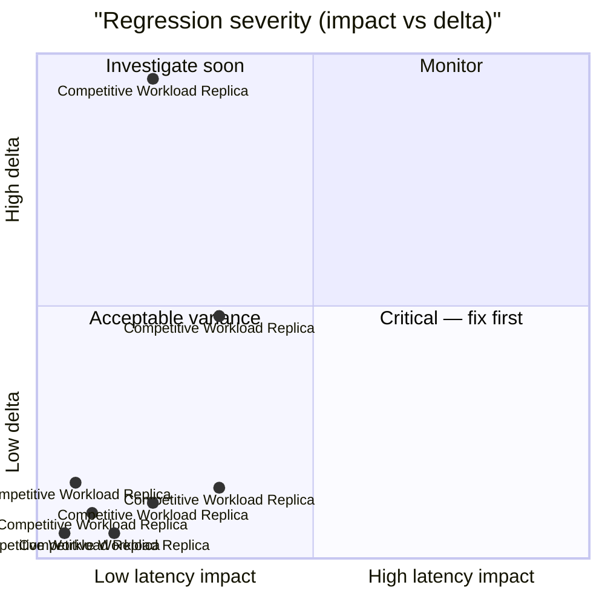

# 🚀 PostgreSQL Performance Ledger

> [!NOTE] Competitive comparisons based on publicly available documentation as of June 2026. All SveltyCMS metrics self-measured via `bun test tests/benchmarks/`.

> [!IMPORTANT]
> **Console-only by default.** Use `BENCHMARK_RECORD=1` to write results to this report.
>
> ```bash
> BENCHMARK_RECORD=1 bun test tests/benchmarks/auth-performance.test.ts
> ```
>
> The full matrix runner (`bun run scripts/benchmark-matrix/index.ts --sql`) always records.

<!-- BENCHMARK_START -->

<!-- EXECUTIVE_START -->
<!-- LATEST_AUDIT_HEADER -->

## 📊 Latest Performance Audit

<!-- EXECUTIVE_FIX_NOTES_START -->

### 📝 Fix Overlays

> [!NOTE]
> Phase notes and remediation entries appear here after matrix or surgical runs.

<!-- EXECUTIVE_FIX_NOTES_END -->

> [!NOTE]
> **Partial update** — dimension rollups and issues reflect only tests invoked in this run.

**✅ PASS** _(partial invocation)_ · 1/45 tests · 44 skipped · **postgresql** · standalone run

### Dimension health

| Dimension      | Tests | Status | Worst Δ | Issues |
| -------------- | ----: | ------ | ------- | ------ |
| **Core**       |    21 | 🟢     | +351%   | 0      |
| **API**        |     0 | ⚪     | —       | 0      |
| **Scale**      |     0 | ⚪     | —       | 0      |
| **Resilience** |     0 | ⚪     | —       | 0      |

### Issues (action required)

> ✅ **All clear** — no regressions or budget violations detected.

### Executive latency matrix

| Scenario                         | Latency | Trend                                        | Budget | Result |
| -------------------------------- | ------- | -------------------------------------------- | ------ | ------ |
| **Competitive Workload Replica** | 0.201ms | ⚪ stable at 0.180ms (±0.083ms) (7 runs)     | < 5ms  | 🟢     |
| **Competitive Workload Replica** | 0.661ms | ⚪ stable at 0.578ms (±0.125ms) (7 runs)     | < 5ms  | 🟢     |
| **Competitive Workload Replica** | 0.948ms | ⚪ stable at 0.210ms (±0.863ms) (7 runs)     | < 5ms  | 🟢     |
| **Competitive Workload Replica** | 1.504ms | ⚪ stable at 0.561ms (±0.971ms) (7 runs)     | < 5ms  | 🟢     |
| **Competitive Workload Replica** | 0.330ms | ⚪ stable at 0.216ms (±0.087ms) (7 runs)     | < 5ms  | 🟢     |
| **Competitive Workload Replica** | 0.960ms | ⚪ stable at 0.687ms (±0.208ms) (7 runs)     | < 5ms  | 🟢     |
| **Competitive Workload Replica** | 0.457ms | ⚪ stable at 0.347ms (±0.110ms) (7 runs)     | < 5ms  | 🟢     |
| **Competitive Workload Replica** | 1.518ms | ⚪ stable at 1.01ms (±0.379ms) (7 runs)      | < 5ms  | 🟢     |
| **Competitive Workload Replica** | 0.261ms | ⚪ stable at 0.200ms (±0.067ms) (7 runs)     | < 5ms  | 🟢     |
| **Competitive Workload Replica** | 0.709ms | ⚪ stable at 0.604ms (±0.169ms) (7 runs)     | < 5ms  | 🟢     |
| **Competitive Workload Replica** | 0.189ms | ⚪ stable at 0.146ms (±0.065ms) (7 runs)     | < 5ms  | 🟢     |
| **Competitive Workload Replica** | 0.562ms | ⚪ stable at 0.470ms (±0.165ms) (7 runs)     | < 5ms  | 🟢     |
| **Competitive Workload Replica** | 1.568ms | ⚪ stable at 1.16ms (±0.821ms) (7 runs)      | < 5ms  | 🟢     |
| **Competitive Workload Replica** | 4.622ms | 🔴 slower: 3.24ms → 4.62ms (+43%) (7 runs)   | < 5ms  | 🟢     |
| **Competitive Workload Replica** | 1.986ms | ⚪ stable at 1.09ms (±0.753ms) (7 runs)      | < 5ms  | 🟢     |
| **Competitive Workload Replica** | 3.175ms | ⚪ stable at 3.37ms (±0.160ms) (7 runs)      | < 5ms  | 🟢     |
| **Competitive Workload Replica** | 0.465ms | 🟢 faster: 0.824ms → 0.465ms (-44%) (7 runs) | < 5ms  | 🟢     |
| **Competitive Workload Replica** | 2.006ms | ⚪ stable at 1.55ms (±0.467ms) (7 runs)      | < 5ms  | 🟢     |
| **Competitive Workload Replica** | 1.266ms | 🔴 slower: 0.915ms → 1.27ms (+38%) (7 runs)  | < 5ms  | 🟢     |
| **Competitive Workload Replica** | 2.499ms | ⚪ stable at 2.00ms (±0.461ms) (7 runs)      | < 5ms  | 🟢     |
| **Ingestion**                    | 0.227ms | ⚪ stable at 0.115ms (±0.341ms) (7 runs)     | < 5ms  | 🟢     |

### Historical pulse

> **Scope:** Sparklines only — full run tables: [`tests/benchmarks/results/history.sqlite`](../../../tests/benchmarks/results/history.sqlite)

| Metric                                           | Trend | Sparkline | Latest  |
| ------------------------------------------------ | ----- | --------- | ------- |
| api latency (HTTP: findById @ 8c (Cold)) (warm)  | 🟢    | `█▁▇`     | 2.686ms |
| auth performance (Auth (full chain) @ 1c) (warm) | 🟢    | `▁`       | 0.326ms |
| database performance (BULK INSERT (100)) (warm)  | 🟢    | `█▁▁▂▂▂▃` | 3.771ms |

<details>
<summary>📈 Latency trend chart (last 10 runs)</summary>

```mermaid
xychart-beta
  title "postgresql REST p95 (last 10 runs)"
  x-axis ["R1", "R2", "R3", "R4", "R5", "R6", "R7", "R8", "R9", "R10"]
  y-axis "Latency (ms)"
  line "p95" : [0.000, 0.000, 0.000, 0.000, 0.000, 0.000, 0.000, 0.000, 0.000, 0.000]
```

</details>
<details>
<summary>📊 Regression severity matrix (quadrant)</summary>


```mermaid
quadrantChart
  title "Regression severity (impact vs delta)"
  x-axis Low latency impact --> High latency impact
  y-axis Low delta --> High delta
  quadrant-1 Monitor
  quadrant-2 Investigate soon
  quadrant-3 Acceptable variance
  quadrant-4 Critical — fix first
    Competitive Workload Replica: [0.05, 0.05]
    Competitive Workload Replica: [0.14, 0.05]
    Competitive Workload Replica: [0.21, 0.95]
    Competitive Workload Replica: [0.33, 0.48]
    Competitive Workload Replica: [0.07, 0.15]
    Competitive Workload Replica: [0.21, 0.11]
    Competitive Workload Replica: [0.10, 0.09]
    Competitive Workload Replica: [0.33, 0.14]
```

</details>

<!-- EXECUTIVE_PARTIAL_WATERMARK -->

<!-- EXECUTIVE_ALERTS_START -->
<!-- EXECUTIVE_ALERTS_END -->

<!-- EXECUTIVE_END -->

<!-- SUMMARY_START -->
<!-- SUMMARY_RUN_OVERLAY_START -->

### Current Run Summary (2026-10-10)

> **Scope:** Only tests that ran in THIS invocation.

> ⚠️ Executive PASS/FAIL reflects the last full matrix run.

**Run ID:** `01a12712-a6d7-7795-abc1-6814240cf0c7` · **Tests invoked:** 1 · **Metrics:** 21 · **DB:** postgresql

| Test                         | Metric                              | Avg (ms) | p95 (ms) | RPS   | Trend | Detail                                      |
| ---------------------------- | ----------------------------------- | -------- | -------- | ----- | ----- | ------------------------------------------- |
| Competitive Workload Replica | findById (Warm Sequential)          | 0.201    | 0.334    | 4940  | 🟢    | ⚪ stable at 0.242ms (±0.028ms) (2 runs)    |
| Competitive Workload Replica | findById (Warm Concurrent 8c)       | 0.661    | 0.760    | 12009 | 🟢    | ⚪ stable at 0.689ms (±0.063ms) (2 runs)    |
| Competitive Workload Replica | findByIdRandom (Warm Sequential)    | 0.948    | 1.643    | 1052  | 🟢    | ⚪ stable at 1.06ms (±0.081ms) (2 runs)     |
| Competitive Workload Replica | findByIdRandom (Warm Concurrent 8c) | 1.504    | 3.229    | 5269  | 🟢    | ⚪ stable at 1.58ms (±0.101ms) (2 runs)     |
| Competitive Workload Replica | listFilterSort (Warm Concurrent 8c) | 0.960    | 1.626    | 8165  | 🟢    | ⚪ stable at 0.960ms (±0.219ms) (2 runs)    |
| Competitive Workload Replica | listLarge (Warm Sequential)         | 0.457    | 0.675    | 2182  | 🟢    | ⚪ stable at 0.455ms (±0.009ms) (2 runs)    |
| Competitive Workload Replica | listLarge (Warm Concurrent 8c)      | 1.518    | 2.069    | 5150  | 🟢    | ⚪ stable at 1.54ms (±0.375ms) (2 runs)     |
| Competitive Workload Replica | listPlain (Warm Sequential)         | 0.261    | 0.427    | 3812  | 🟢    | ⚪ stable at 0.301ms (±0.081ms) (2 runs)    |
| Competitive Workload Replica | listPlain (Warm Concurrent 8c)      | 0.709    | 0.991    | 11071 | 🟢    | ⚪ stable at 0.773ms (±0.062ms) (2 runs)    |
| Competitive Workload Replica | findMissing (Warm Sequential)       | 0.189    | 0.304    | 5247  | 🟢    | ⚪ stable at 0.210ms (±0.018ms) (2 runs)    |
| Competitive Workload Replica | create (Warm Concurrent 8c)         | 4.622    | 7.176    | 1713  | 🟢    | ⚪ stable at 4.13ms (±0.450ms) (2 runs)     |
| Competitive Workload Replica | update (Warm Sequential)            | 1.986    | 2.904    | 503   | 🟢    | ⚪ stable at 1.95ms (±0.254ms) (2 runs)     |
| Competitive Workload Replica | update (Warm Concurrent 8c)         | 3.175    | 4.511    | 2472  | 🟢    | ⚪ stable at 3.10ms (±0.458ms) (2 runs)     |
| Competitive Workload Replica | graphql (Warm Sequential)           | 0.465    | 0.636    | 2140  | 🟢    | ⚪ stable at 0.542ms (±0.153ms) (2 runs)    |
| Competitive Workload Replica | graphql (Warm Concurrent 8c)        | 2.006    | 2.503    | 3917  | 🟢    | ⚪ stable at 2.11ms (±0.489ms) (2 runs)     |
| Competitive Workload Replica | mixed (Warm Concurrent 8c)          | 2.499    | 5.410    | 3125  | 🟢    | ⚪ stable at 2.64ms (±0.441ms) (2 runs)     |
| Competitive Workload Replica | Seed Burst (500 docs, HTTP)         | 0.227    | 0.227    | 4398  | 🟢    | ⚪ stable at 1.73ms (±1.52ms) (7 runs)      |
| Competitive Workload Replica | listFilterSort (Warm Sequential)    | 0.330    | 0.505    | 3016  | ⚪    | ⚪ stable at 0.304ms (±0.009ms) (2 runs)    |
| Competitive Workload Replica | findMissing (Warm Concurrent 8c)    | 0.562    | 0.693    | 13951 | ⚪    | 🟢 faster: 0.617ms → 0.562ms (-9%) (2 runs) |
| Competitive Workload Replica | create (Warm Sequential)            | 1.568    | 2.516    | 637   | ⚪    | 🟢 faster: 1.93ms → 1.57ms (-19%) (2 runs)  |
| Competitive Workload Replica | mixed (Warm Sequential)             | 1.266    | 3.063    | 789   | ⚪    | 🔴 slower: 0.916ms → 1.27ms (+38%) (2 runs) |

<!-- SUMMARY_RUN_OVERLAY_END -->

<!-- SUMMARY_HISTORY_START -->

### Historical Trends (2026-10-10)

> **Mode:** production-parity matrix runs only (`run_mode='matrix'` + `server_mode='production'` — `NODE_ENV=production`, no `TEST_MODE`). Standalone/mode-variant samples are recorded but never trended here.

> **Scope:** Sparklines only — full run tables live in `history.sqlite` (link below). Runs = sparkline bar count.

**Detail:** [`tests/benchmarks/results/history.sqlite`](../../../tests/benchmarks/results/history.sqlite) · `SELECT test_id, phase, server_mode, avg_ms, p95_ms, rps, timestamp FROM runs WHERE db_type='postgresql' AND redis=0 ORDER BY timestamp DESC`

**Series:** 53 · **DB:** postgresql

| Metric                              | Trend | Sparkline (last 7) | Latest    |
| ----------------------------------- | ----- | ------------------ | --------- |
| ADMIN UX VITALITY (warm)            | 🟢    | `▇▁█▂`             | 0.520ms   |
| AI PERFORMANCE (warm)               | 🟢    | `▁▁▁▁`             | 0.000ms   |
| AUTH PERFORMANCE (warm)             | 🟢    | `▁▄█▄▅▅`           | 1.122ms   |
| AUTH SESSION AMR (warm)             | 🟢    | `█▆▅▁▁▁▃`          | 0.880ms   |
| BUILD ANALYSIS (warm)               | 🟢    | `▁▁`               | 0.000ms   |
| CACHE HIT RATIO (warm)              | 🟢    | `▆▁█▄▅▁█`          | 1.321ms   |
| CACHE PERFORMANCE (warm)            | 🟢    | `▁█▁▇`             | 0.750ms   |
| CACHE SERVICE (warm)                | 🟢    | `▁▆█▁▅▆`           | 0.655ms   |
| CLIENT JOURNEY (warm)               | 🟢    | `█▁`               | 5.719ms   |
| COMPETITIVE WORKLOAD REPLICA (warm) | 🟢    | `▁▂▁▅▃█▃`          | 1.087ms   |
| CONCURRENCY MAX (warm)              | 🟢    | `█▁`               | 22.034ms  |
| CONFIG PROMOTION (warm)             | 🟢    | `▁▁▁▁█▁▁`          | 9.020ms   |
| CONTENT GUI SAVE (warm)             | 🟢    | `█▁`               | 1.413ms   |
| CONTENT INCREMENTAL RELOAD (warm)   | 🟢    | `▂▁█▃▂▁▅`          | 0.514ms   |
| CONTENT SCALE STRESS (warm)         | 🟢    | `█▁▇▁`             | 0.134ms   |
| CONTENT SCAN (warm)                 | 🟢    | `█▂▆▁`             | 0.643ms   |
| DATABASE PERFORMANCE (warm)         | 🟢    | `▂█▁▁▆█▆`          | 3.555ms   |
| ENTRY EDIT HYDRATION (warm)         | 🟢    | `▁▁▆█▁▁▅`          | 0.015ms   |
| GRAPHQL API PERFORMANCE (warm)      | 🟢    | `▂▆▄█▆▁▁`          | 0.724ms   |
| GRAPHQL CACHE HIT (warm)            | 🟢    | `▁▃▂█▁▃▁`          | 1.002ms   |
| GRAPHQL LOCAL SDK (warm)            | 🟢    | `█▁▆▁`             | 0.000ms   |
| GRAPHQL STRESS (warm)               | 🟢    | `█▁▂▃▁▄▆`          | 10.161ms  |
| HOOKS PERFORMANCE (warm)            | 🟢    | `▆▅▁█▁▄▄`          | 0.792ms   |
| LOCAL API THROUGHPUT (warm)         | 🟢    | `▂█▁▄`             | 1.620ms   |
| LOCAL CMS CRUD (warm)               | 🟢    | `▃▃▃▃▁█▄`          | 0.535ms   |
| LOCAL SDK VS DIRECT (warm)          | 🟢    | `▁▁█▇█▇█`          | 1.486ms   |
| MEDIA UPLOAD STRESS (warm)          | 🟢    | `▆█▁▃`             | 5.908ms   |
| MEMORY COUNTERS (warm)              | 🟢    | `▁▁`               | 0.000ms   |
| MIDDLEWARE FLAMEGRAPH (warm)        | 🟢    | `▄▃▃█▁▁█`          | 1.432ms   |
| MIXED WORKLOAD (warm)               | 🟢    | `█▁`               | 0.798ms   |
| MULTI TENANT PERFORMANCE (warm)     | 🟢    | `▁█`               | 0.826ms   |
| OPENAPI PERFORMANCE (warm)          | 🟢    | `▅▁▆▆▁█`           | 2.056ms   |
| PRODUCTION DAY (warm)               | 🟢    | `█▁`               | 1.799ms   |
| REALTIME PERFORMANCE (warm)         | 🟢    | `▁▁▁▁▁▁`           | 0.000ms   |
| REVISION STRESS (warm)              | 🟢    | `▂█▁▁█▁`           | 0.446ms   |
| RIGHT TO BE FORGOTTEN AUDIT (warm)  | 🟢    | `█▁`               | 12.657ms  |
| SCALE SPECTRUM (warm)               | 🟢    | `▆▃▂▅▄▁█`          | 0.849ms   |
| SECURITY AUDIT (warm)               | 🟢    | `█▁▁▁▁▁▁`          | 0.001ms   |
| STATE MACHINE TRANSITION (warm)     | 🟢    | `▁▁██`             | 111.017ms |
| TELEMETRY PERFORMANCE (warm)        | 🟢    | `█▁█▁`             | 0.000ms   |
| TEMPORAL INTEGRITY (warm)           | 🟢    | `█▁`               | 2.923ms   |
| TRANSACTION ACID (warm)             | 🟢    | `▁█▁▇`             | 1.935ms   |
| TRUTH LATENCY (warm)                | 🟢    | `▂▁▁█▃▁▁`          | 0.000ms   |
| WEBSOCKET BROADCAST (warm)          | 🟢    | `▁█`               | 0.142ms   |
| WIDGET PERFORMANCE (warm)           | 🟢    | `▇▁▄█▁▄`           | 0.945ms   |
| API LATENCY (warm)                  | ⚪    | `▁█▅▂▁▁█`          | 4.120ms   |
| INDEX PRESSURE (warm)               | ⚪    | `▂▁▁█`             | 0.837ms   |
| LARGE PAYLOAD STREAMING (warm)      | ⚪    | `▆▆█▁▄▄█`          | 11.287ms  |
| LOCAL API PERFORMANCE (warm)        | ⚪    | `█▇▇▄▁▂`           | 0.407ms   |
| MEDIA PERFORMANCE (warm)            | ⚪    | `▁▇▁▄▂▁█`          | 95.145ms  |
| NEGATIVE CACHE (warm)               | ⚪    | `██▁▇▇▁`           | 0.001ms   |
| REST API PERFORMANCE (warm)         | ⚪    | `▂█▄▁▃▁█`          | 0.859ms   |
| SHARP VS BUN IMAGE (warm)           | ⚪    | `▅▄▁▁▁██`          | 55.676ms  |

<!-- SUMMARY_HISTORY_END --><!-- SUMMARY_END -->

<details>
<summary>📊 Infrastructure drill-down (expand for adapter, hooks, memory trends)</summary>

## 📊 Infrastructure drill-down

### 🏷️ Mixed Workload Performance {#mixedAvg}

**Mixed p95:** — (not measured in this run) | **Trend:** ⚪ (—)

> Production request mix: 60% Reads, 20% Writes, 15% GraphQL, 5% Media.

### 🏷️ Database Adapter Performance {#dbRaw}

**Raw Adapter p95:** — (not measured in this run) | **Target:** < 50ms | **Trend:** ⚪ (—)

> Direct database access latency (bypass CMS logic).

### 🏷️ Middleware & Hooks Audit {#hooks}

**Middleware p95:** — (not measured in this run) | **Target:** < 2ms | **Trend:** ⚪ (—)

> Total overhead of security, logging, and auth hooks.

### 🏷️ Memory Stability Audit {#memGrowth}

**Memory RSS Δ:** — (not measured in this run) | **Target:** < 60MB | **Trend:** ⚪ (—)

> Peak memory growth during stress workload.

### Enterprise scale audit

### 🏷️ Multi-Tenancy Performance {#tenancyAvg}

**Tenancy p95:** — (not measured in this run) | **Trend:** ⚪ (—)

> Measures latency across tenant isolation boundaries.

### 🏷️ Relational Resolver Latency {#relationalAvg}

**Relational p95:** — (not measured in this run) | **Trend:** ⚪ (—)

> Tests performance of complex JOINs and nested relationship population.

### 🏷️ Telemetry & Update Performance {#telemetryAvg}

**Telemetry p95:** — (not measured in this run) | **Trend:** ⚪ (—)

> Measures overhead of telemetry collection and cryptographic signing.

</details>

<!-- LEDGER_START -->

## 🔬 Full benchmark ledger (41 modules)

Expand dimension groups, then any row, for ASCII truth tables. Executive summary above shows pass/fail and issues only.

<!-- LEDGER_DIMENSION:CORE:START -->

<details id="ledger-dimension-core">
<summary><strong>Core</strong> · 27 tests</summary>

<!-- SECTION:API_LATENCY:START -->
<details id="section-api_latency">
<summary><strong>🏷️ API LAYER LATENCY</strong> · ⚪ 4.120ms · ↗️ — · <a href="../../../tests/benchmarks/api-latency.test.ts">source</a></summary>
<!-- LEDGER_INSIGHT_START -->
> [!NOTE]
> **Specific to this test**: Both avg and p95 degraded — likely adapter or infrastructure bottleneck. Check DB connection pool, indexes, or recent commits.  
Throughput dropped 86% — check connection pool saturation or lock contention.  
**Severe degradation** (+1048%) — review recent commits immediately.
> **Check**: `src/routes/api/[...path]/+server.ts` · `src/hooks.server.ts`
<!-- LEDGER_INSIGHT_END -->

<!-- LEDGER_TRUTH_START -->

```text
╔═══════════════════════════════════════════════════════════════════════════════════════════════════════╗
║                                     SVELTYCMS — API LAYER LATENCY                                     ║
║                              File: tests/benchmarks/api-latency.test.ts                               ║
║                                       Ran: 2026-10-06 10:55:22                                        ║
║              Cold full-pipeline findById + warm TURBO-HIT path after responseCache fill.              ║
╠═══════════════════════════════════════════════════════════════════════════════════════════════════════╣
║ HTTP: findById @ 8c (Cold)   │ Cold:     2.36 ms │ Warm:     2.080 ms │ p95:     4.527 ms │   3,371 RPS ║
║ HTTP: findById TURBO-HIT @ 8c (Warm) │ Cold:     0.29 ms │ Warm:     0.753 ms │ p95:     0.881 ms │  10,973 RPS ║
║ HTTP: zstd large GET (>64KiB, drained) │ Cold:     2.84 ms │ Warm:     3.818 ms │ p95:     4.551 ms │     510 RPS ║
║ HTTP: findById TURBO-HIT idle (Warm) │        0.198 ms │ p95:        0.277 ms │ RPS:      4,946 ║
║ HTTP: findById TURBO-HIT during zstd (Warm) │        0.291 ms │ p95:        0.610 ms │ RPS:      2,463 ║
╚═══════════════════════════════════════════════════════════════════════════════════════════════════════╝
```

<!-- LEDGER_TRUTH_END -->

</details>
<!-- SECTION:API_LATENCY:END -->

<!-- SECTION:COLD_START:START -->
<details id="section-cold_start">
<summary><strong>🏷️ PHASED COLD START</strong> · ⚪ ⏳ pending · ➡️ — · <a href="../../../tests/benchmarks/cold-start-phased.test.ts">source</a></summary>
<!-- LEDGER_TRUTH_START -->
```text
╔═══════════════════════════════════════════════════════════════════════════════════════════════════════╗
║                                  SVELTYCMS — PHASED COLD START AUDIT                                  ║
║                           File: tests/benchmarks/cold-start-phased.test.ts                            ║
║                                       Ran: 2026-09-18 18:21:07                                        ║
║            Measures process spawn, dependency hydration, and first-request TTFB readiness.            ║
╠═══════════════════════════════════════════════════════════════════════════════════════════════════════╣
║ Initial Cold Boot (Fresh Process) │     2604.577 ms │ p95:     2604.577 ms │ RPS:          0 ║
║ Steady-State Respawn (Average) │     1729.011 ms │ p95:     2604.577 ms │ RPS:          0 ║
╚═══════════════════════════════════════════════════════════════════════════════════════════════════════╝
```
<!-- LEDGER_TRUTH_END -->

</details>
<!-- SECTION:COLD_START:END -->

<!-- SECTION:TRUTH_AUDIT:START -->
<details id="section-truth_audit">
<summary><strong>🏷️ SRE TRUTH AUDIT</strong> · ⚪ ⏳ pending · ↘️ — · <a href="../../../tests/benchmarks/truth-latency.test.ts">source</a></summary>
<!-- LEDGER_INSIGHT_START -->
> [!NOTE]
> **Specific to this test**: Performance improved — recent optimizations or cache warming likely effective.
<!-- LEDGER_INSIGHT_END -->

<!-- LEDGER_TRUTH_START -->

```text
╔═══════════════════════════════════════════════════════════════════════════════════════════════════════╗
║                                      SVELTYCMS — SRE TRUTH AUDIT                                      ║
║                             File: tests/benchmarks/truth-latency.test.ts                              ║
║                                       Ran: 2026-10-06 09:35:34                                        ║
║            Validates performance claims by comparing SDK, Middleware, and Real HTTP Stack             ║
╠═══════════════════════════════════════════════════════════════════════════════════════════════════════╣
║ Logic Baseline               │ Cold:     0.01 ms │ Warm:     0.000 ms │ p95:     0.000 ms │ 491,803 RPS ║
║ Local SDK (Full)             │ Cold:    18.44 ms │ Warm:     0.006 ms │ p95:     0.011 ms │ 144,634 RPS ║
║ HTTP End-to-End              │ Cold:     5.97 ms │ Warm:     0.369 ms │ p95:     0.492 ms │   2,684 RPS ║
║ HTTP Cold (Cache-Busted)     │ Cold:     3.78 ms │ Warm:     1.598 ms │ p95:     2.992 ms │     624 RPS ║
╚═══════════════════════════════════════════════════════════════════════════════════════════════════════╝
```

<!-- LEDGER_TRUTH_END -->

</details>
<!-- SECTION:TRUTH_AUDIT:END -->

<!-- SECTION:INCREMENTAL:START -->
<details id="section-incremental">
<summary><strong>🏷️ Incremental Content Reload</strong> · ⚪ 0.514ms · ↗️ — · <a href="../../../tests/benchmarks/content-incremental-reload.test.ts">source</a></summary>
<!-- LEDGER_INSIGHT_START -->
> [!NOTE]
> **Specific to this test**: Both avg and p95 degraded — likely adapter or infrastructure bottleneck. Check DB connection pool, indexes, or recent commits.  
Throughput dropped 69% — check connection pool saturation or lock contention.  
**Severe degradation** (+135%) — review recent commits immediately.
> **Check**: `src/content/engine.server.ts` · `src/routes/api/[...path]/handlers/content.ts`
<!-- LEDGER_INSIGHT_END -->

<!-- LEDGER_TRUTH_START -->

```text
╔═══════════════════════════════════════════════════════════════════════════════════════════════════════╗
║                             SVELTYCMS — INCREMENTAL CONTENT RELOAD AUDIT                              ║
║                       File: tests/benchmarks/content-incremental-reload.test.ts                       ║
║                                       Ran: 2026-10-06 09:39:27                                        ║
║      Measures surgical single-file fullReload vs full reconciliation path and batch processing.       ║
╠═══════════════════════════════════════════════════════════════════════════════════════════════════════╣
║ Incremental fullReload (1 file) │ Cold:     4.56 ms │ Warm:     0.060 ms │ p95:     0.129 ms │  14,319 RPS ║
║ Full Reconciliation Reload   │ Cold:     3.12 ms │ Warm:     0.178 ms │ p95:     0.212 ms │   5,543 RPS ║
║ Sequential 10-File Reload    │ Cold:     4.15 ms │ Warm:     0.514 ms │ p95:     0.653 ms │   1,905 RPS ║
║ Batched 10-File Reload       │ Cold:     0.98 ms │ Warm:     0.234 ms │ p95:     0.339 ms │   3,953 RPS ║
╚═══════════════════════════════════════════════════════════════════════════════════════════════════════╝
```

<!-- LEDGER_TRUTH_END -->

</details>
<!-- SECTION:INCREMENTAL:END -->

<!-- SECTION:HOOKS_TRACE:START -->
<details id="section-hooks_trace">
<summary><strong>🏷️ Middleware & Hooks Performance</strong> · ⚪ 0.792ms · ↘️ — · <a href="../../../tests/benchmarks/hooks-performance.test.ts">source</a></summary>
<!-- LEDGER_INSIGHT_START -->
> [!NOTE]
> **Specific to this test**: Performance improved — recent optimizations or cache warming likely effective.  
Throughput dropped 13% — check connection pool saturation or lock contention.
<!-- LEDGER_INSIGHT_END -->

<!-- LEDGER_TRUTH_START -->

```text
╔═══════════════════════════════════════════════════════════════════════════════════════════════════════╗
║                                 SVELTYCMS — MIDDLEWARE & HOOKS AUDIT                                  ║
║                           File: tests/benchmarks/hooks-performance.test.ts                            ║
║                                       Ran: 2026-10-06 10:56:56                                        ║
║Measures the cost of the full middleware chain including Turbo, Security, Auth, and Audit via HTTP E2E.║
╠═══════════════════════════════════════════════════════════════════════════════════════════════════════╣
║ Static Asset (No Middleware) │ Cold:     2.25 ms │ Warm:     1.057 ms │ p95:     1.939 ms │   3,630 RPS ║
║ Turbo Pipeline (Light)       │ Cold:     0.63 ms │ Warm:     0.785 ms │ p95:     1.182 ms │   4,939 RPS ║
║ Full Security + Auth Pipeline │ Cold:     3.42 ms │ Warm:     0.488 ms │ p95:     1.007 ms │   7,329 RPS ║
║ REST with API Caching        │ Cold:     4.89 ms │ Warm:     0.439 ms │ p95:     0.673 ms │   8,672 RPS ║
║ Mutation (audit logging disabled) │ Cold:     8.52 ms │ Warm:     1.456 ms │ p95:     2.590 ms │     623 RPS ║
╚═══════════════════════════════════════════════════════════════════════════════════════════════════════╝
```

<!-- LEDGER_TRUTH_END -->

</details>
<!-- SECTION:HOOKS_TRACE:END -->

<!-- SECTION:STATE_MACHINE:START -->
<details id="section-state_machine">
<summary><strong>🏷️ State Machine Transitions</strong> · ⚪ 111.017ms · ↗️ — · <a href="../../../tests/benchmarks/state-machine-transition.test.ts">source</a></summary>
<!-- LEDGER_INSIGHT_START -->
> [!NOTE]
> **Specific to this test**: Both avg and p95 degraded — likely adapter or infrastructure bottleneck. Check DB connection pool, indexes, or recent commits.  
Throughput dropped 31% — check connection pool saturation or lock contention.  
**Severe degradation** (+64%) — review recent commits immediately.
<!-- LEDGER_INSIGHT_END -->

<!-- LEDGER_TRUTH_START -->

```text
╔═══════════════════════════════════════════════════════════════════════════════════════════════════════╗
║                                  SVELTYCMS — STATE MACHINE INTEGRITY                                  ║
║                        File: tests/benchmarks/state-machine-transition.test.ts                        ║
║                                       Ran: 2026-10-06 09:39:41                                        ║
║Measures state machine self-healing transition latencies, convergence settling time, and health probe consistency under stress.║
╠═══════════════════════════════════════════════════════════════════════════════════════════════════════╣
║ State Transition (Transient) │ Cold:   157.07 ms │ Warm:   111.017 ms │ p95:   126.051 ms │       9 RPS ║
║ Self-Healing Full Convergence │ Cold:   116.23 ms │ Warm:   108.114 ms │ p95:   118.538 ms │       9 RPS ║
╚═══════════════════════════════════════════════════════════════════════════════════════════════════════╝
```

<!-- LEDGER_TRUTH_END -->

</details>
<!-- SECTION:STATE_MACHINE:END -->

<!-- SECTION:DB_RAW_P95:START -->
<details id="section-db_raw_p95">
<summary><strong>🏷️ Database Adapter Raw CRUD</strong> · ⚪ 3.555ms · ↗️ — · <a href="../../../tests/benchmarks/database-performance.test.ts">source</a></summary>
<!-- LEDGER_INSIGHT_START -->
> [!NOTE]
> **Specific to this test**: Both avg and p95 degraded — likely adapter or infrastructure bottleneck. Check DB connection pool, indexes, or recent commits.  
Throughput dropped 73% — check connection pool saturation or lock contention.  
**Severe degradation** (+132%) — review recent commits immediately.
<!-- LEDGER_INSIGHT_END -->

<!-- LEDGER_TRUTH_START -->

```text
╔═══════════════════════════════════════════════════════════════════════════════════════════════════════╗
║                         SVELTYCMS — DATABASE ADAPTER PERFORMANCE (POSTGRESQL)                         ║
║                          File: tests/benchmarks/database-performance.test.ts                          ║
║                                       Ran: 2026-10-06 16:16:27                                        ║
║          Measures raw CRUD performance, indexing efficiency, and connection pool resilience.          ║
╠═══════════════════════════════════════════════════════════════════════════════════════════════════════╣
║ INSERT                       │ Cold:     2.37 ms │ Warm:     0.504 ms │ p95:     0.893 ms │   1,832 RPS ║
║ FIND ONE                     │ Cold:     2.83 ms │ Warm:     0.382 ms │ p95:     0.731 ms │   2,369 RPS ║
║ FIND MANY (limit 50)         │ Cold:     4.20 ms │ Warm:     0.793 ms │ p95:     1.327 ms │   1,135 RPS ║
║ FILTER (blob field, 1 match) │ Cold:     6.22 ms │ Warm:     1.911 ms │ p95:     2.765 ms │     506 RPS ║
║ QUERY BUILDER LIST (50)      │ Cold:     5.76 ms │ Warm:     0.755 ms │ p95:     1.161 ms │   1,204 RPS ║
║ FIND PAGE (50 hasMore)       │ Cold:     3.90 ms │ Warm:     0.774 ms │ p95:     1.084 ms │   1,228 RPS ║
║ FIND PAGE keyset             │ Cold:    11.98 ms │ Warm:     1.110 ms │ p95:     1.523 ms │     851 RPS ║
║ FIND MANY offset 50          │ Cold:     3.70 ms │ Warm:     0.554 ms │ p95:     0.797 ms │   1,728 RPS ║
║ LIST+COUNT (legacy)          │ Cold:    13.04 ms │ Warm:     2.370 ms │ p95:     2.859 ms │     411 RPS ║
║ UPDATE                       │ Cold:     4.54 ms │ Warm:     0.446 ms │ p95:     0.650 ms │   2,100 RPS ║
║ UPDATE (no-returning)        │ Cold:     2.76 ms │ Warm:     0.393 ms │ p95:     0.574 ms │   2,403 RPS ║
║ NATIVE UPSERT                │ Cold:     4.24 ms │ Warm:     0.777 ms │ p95:     1.042 ms │   1,235 RPS ║
║ COUNT                        │ Cold:    13.14 ms │ Warm:     2.805 ms │ p95:     3.835 ms │     349 RPS ║
║ COUNT ESTIMATE               │ Cold:     4.17 ms │ Warm:     0.961 ms │ p95:     1.600 ms │     946 RPS ║
║ COUNT CACHED                 │ Cold:     7.94 ms │ Warm:     0.001 ms │ p95:     0.002 ms │ 643,087 RPS ║
║ DELETE (Active Rows)         │ Cold:    22.44 ms │ Warm:     1.120 ms │ p95:     2.018 ms │     790 RPS ║
║ BULK INSERT (100)            │ Cold:     8.30 ms │ Warm:     3.771 ms │ p95:     5.083 ms │     253 RPS ║
║ BULK UPDATE (100 heterogeneous) │ Cold:    21.05 ms │ Warm:     5.993 ms │ p95:     9.341 ms │     157 RPS ║
║ BULK UPDATE (100 homogeneous) │ Cold:     9.29 ms │ Warm:     4.071 ms │ p95:     5.079 ms │     240 RPS ║
╚═══════════════════════════════════════════════════════════════════════════════════════════════════════╝
```

<!-- LEDGER_TRUTH_END -->

</details>
<!-- SECTION:DB_RAW_P95:END -->

<!-- SECTION:ACID:START -->
<details id="section-acid">
<summary><strong>🏷️ ACID Transaction Overhead</strong> · ⚪ 1.935ms · ↗️ — · <a href="../../../tests/benchmarks/transaction-acid.test.ts">source</a></summary>
<!-- LEDGER_INSIGHT_START -->
> [!NOTE]
> **Specific to this test**: Both avg and p95 degraded — likely adapter or infrastructure bottleneck. Check DB connection pool, indexes, or recent commits.  
Throughput dropped 86% — check connection pool saturation or lock contention.  
**Severe degradation** (+154%) — review recent commits immediately.
<!-- LEDGER_INSIGHT_END -->

<!-- LEDGER_TRUTH_START -->

```text
╔═══════════════════════════════════════════════════════════════════════════════════════════════════════╗
║                                   SVELTYCMS — ACID INTEGRITY AUDIT                                    ║
║                            File: tests/benchmarks/transaction-acid.test.ts                            ║
║                                       Ran: 2026-10-06 09:39:13                                        ║
║         Measures transaction commit latencies and rollback overhead across database adapters          ║
╠═══════════════════════════════════════════════════════════════════════════════════════════════════════╣
║ TX Commit                    │ Cold:    10.38 ms │ Warm:     0.705 ms │ p95:     0.916 ms │   5,612 RPS ║
║ TX Rollback Integrity        │ Cold:     5.63 ms │ Warm:     1.935 ms │ p95:     2.166 ms │     516 RPS ║
╚═══════════════════════════════════════════════════════════════════════════════════════════════════════╝
```

<!-- LEDGER_TRUTH_END -->

</details>
<!-- SECTION:ACID:END -->

<!-- SECTION:CACHE:START -->
<details id="section-cache">
<summary><strong>🏷️ System Cache Efficiency</strong> · ⚪ 0.750ms · ↗️ — · <a href="../../../tests/benchmarks/cache-performance.test.ts">source</a></summary>
<!-- LEDGER_INSIGHT_START -->
> [!NOTE]
> **Specific to this test**: Both avg and p95 degraded — likely adapter or infrastructure bottleneck. Check DB connection pool, indexes, or recent commits.  
Throughput dropped 70% — check connection pool saturation or lock contention.  
**Severe degradation** (+324%) — review recent commits immediately.
<!-- LEDGER_INSIGHT_END -->

<!-- LEDGER_TRUTH_START -->

```text
╔═════════════════════════════════════════════════════════════════════════════════════════╗
║                            NEGATIVE CACHE PERFORMANCE AUDIT                             ║
║                      File: tests/benchmarks/negative-cache.test.ts                      ║
║                                Ran: 2026-08-23 22:41:20                                 ║
║        Measures Bloom-filter style missing-key cache speedup for repeated misses        ║
╠═════════════════════════════════════════════════════════════════════════════════════════╣
║ First Miss (DB)                │        2.487 ms │ p95:        4.448 ms │ RPS:        400 ║
║ Cached Miss (Negative Cache)   │        0.001 ms │ p95:        0.002 ms │ RPS:    828,497 ║
╚═════════════════════════════════════════════════════════════════════════════════════════╝
```

<!-- LEDGER_TRUTH_END -->

</details>
<!-- SECTION:CACHE:END -->

<!-- SECTION:CACHE_EFFICIENCY:START -->
<details id="section-cache_efficiency">
<summary><strong>🏷️ Cache Hit/Miss Ratio & Efficiency</strong> · ⚪ 1.321ms · ↗️ — · <a href="../../../tests/benchmarks/cache-hit-ratio.test.ts">source</a></summary>
<!-- LEDGER_INSIGHT_START -->
> [!NOTE]
> **Specific to this test**: Both avg and p95 degraded — likely adapter or infrastructure bottleneck. Check DB connection pool, indexes, or recent commits.  
Throughput dropped 71% — check connection pool saturation or lock contention.  
**Severe degradation** (+59%) — review recent commits immediately.
> **Check**: `src/databases/cache/redis-adapter.ts` · `src/databases/cache/cache-service.ts`
<!-- LEDGER_INSIGHT_END -->

<!-- LEDGER_TRUTH_START -->

```text
╔═══════════════════════════════════════════════════════════════════════════════════════════════════════╗
║                                  SVELTYCMS — CACHE EFFICIENCY AUDIT                                   ║
║                            File: tests/benchmarks/cache-hit-ratio.test.ts                             ║
║                                       Ran: 2026-10-06 09:36:17                                        ║
║           Measures true cold-fill, warm hit ratio, miss penalty, and invalidation latency.            ║
╠═══════════════════════════════════════════════════════════════════════════════════════════════════════╣
║ Cache Cold Fill (Miss + Repopulate) │        0.915 ms │ p95:        1.534 ms │ RPS:      1,092 ║
║ Cache Hit (Warm)             │ Cold:     0.33 ms │ Warm:     0.147 ms │ p95:     0.252 ms │   6,293 RPS ║
║ Bypass Cache (Direct DB)     │ Cold:     0.99 ms │ Warm:     0.718 ms │ p95:     0.865 ms │   1,390 RPS ║
║ Cache Invalidation           │ Cold:     3.06 ms │ Warm:     1.321 ms │ p95:     1.708 ms │     731 RPS ║
╚═══════════════════════════════════════════════════════════════════════════════════════════════════════╝
```

<!-- LEDGER_TRUTH_END -->

</details>
<!-- SECTION:CACHE_EFFICIENCY:END -->

<!-- SECTION:UNKNOWN:START -->
<details id="section-unknown">
<summary><strong>🏷️ unknown</strong> · 🟢 0.002ms · ➡️ recorded (awaiting trend) · <a href="../../../tests/benchmarks/transaction-acid.test.ts">source</a></summary>
<!-- LEDGER_TRUTH_START -->
```text
╔═════════════════════════════════════════════════════════════════════════════════════════╗
║                      SVELTYCMS — CACHE EVICTION BOUNDARY HARDENING                      ║
║                                      File: unknown                                      ║
║                                Ran: 2026-08-23 22:11:25                                 ║
╠═════════════════════════════════════════════════════════════════════════════════════════╣
║ Cache Flooding & Eviction      │        0.002 ms │ p95:        0.002 ms │ RPS:    491,074 ║
╚═════════════════════════════════════════════════════════════════════════════════════════╝
```
<!-- LEDGER_TRUTH_END -->

</details>
<!-- SECTION:UNKNOWN:END -->

<!-- SECTION:MIDDLEWARE:START -->
<details id="section-middleware">
<summary><strong>🏷️ Middleware</strong> · 🟢 3.063ms · ➡️ ⚪ established at 3.06ms (1 run) (2026-09-30 15:24:48) · <a href="../../../tests/benchmarks/hooks-performance.test.ts">source</a></summary>
<!-- LEDGER_TRUTH_START -->
> ⏳ Pending
<!-- LEDGER_TRUTH_END -->

</details>
<!-- SECTION:MIDDLEWARE:END -->

<!-- SECTION:SYSTEM:START -->
<details id="section-system">
<summary><strong>🏷️ System</strong> · 🟢 0.388ms · ↘️ ⚪ stable at 0.494ms (±0.265ms) (3 runs) (2026-09-18 18:23:47) · <a href="../../../tests/benchmarks/rest-api-performance.test.ts">source</a></summary>
<!-- LEDGER_INSIGHT_START -->
> [!NOTE]
> **Specific to this test**: Performance improved — recent optimizations or cache warming likely effective.
<!-- LEDGER_INSIGHT_END -->

<!-- LEDGER_TRUTH_START -->

> ⏳ Pending

<!-- LEDGER_TRUTH_END -->

</details>
<!-- SECTION:SYSTEM:END -->

<!-- SECTION:METADATA:START -->
<details id="section-metadata">
<summary><strong>🏷️ Metadata</strong> · 🟢 0.707ms · ➡️ ⚪ stable at 0.738ms (±0.092ms) (3 runs) (2026-09-18 18:23:48) · <a href="../../../tests/benchmarks/rest-api-performance.test.ts">source</a></summary>
<!-- LEDGER_TRUTH_START -->
> ⏳ Pending
<!-- LEDGER_TRUTH_END -->

</details>
<!-- SECTION:METADATA:END -->

<!-- SECTION:CRUD:START -->
<details id="section-crud">
<summary><strong>🏷️ CRUD</strong> · 🟢 4.330ms · ➡️ recorded (awaiting trend) · <a href="../../../tests/benchmarks/rest-api-performance.test.ts">source</a></summary>
<!-- LEDGER_TRUTH_START -->
```text
╔═══════════════════════════════════════════════════════════════════════════════════════════════════════╗
║                              SVELTYCMS — LOCALCMS CRUD TAX (POSTGRESQL)                               ║
║                             File: tests/benchmarks/local-cms-crud.test.ts                             ║
║                                       Ran: 2026-10-06 11:02:17                                        ║
║Measures full CollectionsNamespace tax vs direct adapter baseline with isolated garbage collection and deterministic ID generation.║
╠═══════════════════════════════════════════════════════════════════════════════════════════════════════╣
║ Adapter FIND ONE             │ Cold:     4.33 ms │ Warm:     0.495 ms │ p95:     0.751 ms │   1,877 RPS ║
║ Direct-to-Wire Point Stream  │ Cold:     3.01 ms │ Warm:     0.448 ms │ p95:     0.578 ms │   2,173 RPS ║
║ LocalCMS findById (Warm)     │ Cold:     0.21 ms │ Warm:     0.001 ms │ p95:     0.003 ms │ 540,760 RPS ║
║ LocalCMS findById (Cold)     │ Cold:     1.74 ms │ Warm:     0.416 ms │ p95:     0.678 ms │   2,248 RPS ║
║ LocalCMS create              │ Cold:     3.33 ms │ Warm:     0.516 ms │ p95:     0.672 ms │   1,914 RPS ║
║ LocalCMS update              │ Cold:     6.94 ms │ Warm:     0.560 ms │ p95:     0.716 ms │   1,743 RPS ║
║ LocalCMS mixed C/U/R         │ Cold:     4.61 ms │ Warm:     1.491 ms │ p95:     1.958 ms │     646 RPS ║
╚═══════════════════════════════════════════════════════════════════════════════════════════════════════╝
```
<!-- LEDGER_TRUTH_END -->

</details>
<!-- SECTION:CRUD:END -->

<!-- SECTION:LOGIC:START -->
<details id="section-logic">
<summary><strong>🏷️ Logic</strong> · 🟢 ⏳ pending · ➡️ ⚪ stable at 0ms (7 runs) (2026-09-18 18:21:21) · <a href="../../../tests/benchmarks/truth-latency.test.ts">source</a></summary>
<!-- LEDGER_TRUTH_START -->
> ⏳ Pending
<!-- LEDGER_TRUTH_END -->

</details>
<!-- SECTION:LOGIC:END -->

<!-- SECTION:SDK:START -->
<details id="section-sdk">
<summary><strong>🏷️ SDK</strong> · 🟢 0.483ms · ➡️ recorded (awaiting trend) · <a href="../../../tests/benchmarks/local-cms-crud.test.ts">source</a></summary>
<!-- LEDGER_TRUTH_START -->
```text
╔═══════════════════════════════════════════════════════════════════════════════════════════════════════╗
║                            SVELTYCMS — SDK VS DIRECT ADAPTER (POSTGRESQL)                             ║
║                          File: tests/benchmarks/local-sdk-vs-direct.test.ts                           ║
║                                       Ran: 2026-10-06 11:02:38                                        ║
║Measures the exact SDK tax across Create, Find, and Update pathways with isolated GC sweeps and zero-allocation key pools.║
╠═══════════════════════════════════════════════════════════════════════════════════════════════════════╣
║ Direct insert                  │        0.483 ms │ p95:        0.483 ms │ RPS:      2,072 ║
║ SDK create (full)              │        1.496 ms │ p95:        1.496 ms │ RPS:          0 ║
║ Direct findOne                 │        0.474 ms │ p95:        0.474 ms │ RPS:      2,111 ║
║ SDK find (bypassCache)         │        1.476 ms │ p95:        1.476 ms │ RPS:        677 ║
║ Direct update                  │        0.485 ms │ p95:        0.485 ms │ RPS:      2,061 ║
║ SDK update (full)              │        1.457 ms │ p95:        1.457 ms │ RPS:          0 ║
║ SDK create (detached)          │        1.572 ms │ p95:        1.572 ms │ RPS:          0 ║
║ SDK update (detached)          │        1.572 ms │ p95:        1.572 ms │ RPS:          0 ║
╚═══════════════════════════════════════════════════════════════════════════════════════════════════════╝
```
<!-- LEDGER_TRUTH_END -->

</details>
<!-- SECTION:SDK:END -->

<!-- SECTION:HTTP:START -->
<details id="section-http">
<summary><strong>🏷️ HTTP</strong> · 🟢 0.457ms · ➡️ ⚪ stable at 0.450ms (±0.112ms) (7 runs) (2026-09-18 18:21:21) · <a href="../../../tests/benchmarks/truth-latency.test.ts">source</a></summary>
<!-- LEDGER_TRUTH_START -->
> ⏳ Pending
<!-- LEDGER_TRUTH_END -->

</details>
<!-- SECTION:HTTP:END -->

<!-- SECTION:CRUD__GET_:START -->
<details id="section-crud__get_">
<summary><strong>🏷️ CRUD (Get)</strong> · 🟢 0.713ms · ➡️ ⚪ stable at 0.731ms (±0.122ms) (3 runs) (2026-09-18 18:23:48) · <a href="../../../tests/benchmarks/rest-api-performance.test.ts">source</a></summary>
<!-- LEDGER_TRUTH_START -->
> ⏳ Pending
<!-- LEDGER_TRUTH_END -->

</details>
<!-- SECTION:CRUD__GET_:END -->

<!-- SECTION:CRUD__LIST_:START -->
<details id="section-crud__list_">
<summary><strong>🏷️ CRUD (List)</strong> · 🟢 0.768ms · ➡️ ⚪ stable at 0.779ms (±0.186ms) (3 runs) (2026-09-18 18:23:49) · <a href="../../../tests/benchmarks/rest-api-performance.test.ts">source</a></summary>
<!-- LEDGER_TRUTH_START -->
> ⏳ Pending
<!-- LEDGER_TRUTH_END -->

</details>
<!-- SECTION:CRUD__LIST_:END -->

<!-- SECTION:CRUD__SEARCH_:START -->
<details id="section-crud__search_">
<summary><strong>🏷️ CRUD (Search)</strong> · 🟢 0.745ms · ➡️ ⚪ stable at 0.764ms (±0.137ms) (3 runs) (2026-09-18 18:23:49) · <a href="../../../tests/benchmarks/rest-api-performance.test.ts">source</a></summary>
<!-- LEDGER_TRUTH_START -->
> ⏳ Pending
<!-- LEDGER_TRUTH_END -->

</details>
<!-- SECTION:CRUD__SEARCH_:END -->

<!-- SECTION:HTTP_COLD:START -->
<details id="section-http_cold">
<summary><strong>🏷️ HTTP-Cold</strong> · 🟢 0.563ms · ➡️ ⚪ stable at 0.542ms (±0.033ms) (2 runs) (2026-09-18 18:21:21) · <a href="../../../tests/benchmarks/truth-latency.test.ts">source</a></summary>
<!-- LEDGER_TRUTH_START -->
> ⏳ Pending
<!-- LEDGER_TRUTH_END -->

</details>
<!-- SECTION:HTTP_COLD:END -->

<!-- SECTION:COMPETITIVE:START -->
<details id="section-competitive">
<summary><strong>🏷️ competitive workload replica</strong> · 🟢 2.499ms · ↘️ ⚪ stable at 3.44ms (±1.26ms) (7 runs) (2026-10-10 18:28:26) · <a href="../../../tests/benchmarks/competitive-workload-replica.test.ts">source</a></summary>
<!-- LEDGER_INSIGHT_START -->
> [!NOTE]
> **Specific to this test**: Performance improved — recent optimizations or cache warming likely effective.
<!-- LEDGER_INSIGHT_END -->

<!-- LEDGER_TRUTH_START -->

```text
╔═══════════════════════════════════════════════════════════════════════════════════════════════════════╗
║                                SVELTYCMS — SEED BURST (DATASET SETUP)                                 ║
║                      File: tests/benchmarks/competitive-workload-replica.test.ts                      ║
║                                       Ran: 2026-10-10 18:28:26                                        ║
║              Seq + concurrent (8 workers), harness iteration counts, median of N rounds.              ║
╠═══════════════════════════════════════════════════════════════════════════════════════════════════════╣
║ Seed Burst (500 docs, HTTP)    │        0.227 ms │ p95:        0.227 ms │ RPS:      4,398 ║
╚═══════════════════════════════════════════════════════════════════════════════════════════════════════╝
```

<!-- LEDGER_TRUTH_END -->

</details>
<!-- SECTION:COMPETITIVE:END -->

<!-- SECTION:FLAMEGRAPH:START -->
<details id="section-flamegraph">
<summary><strong>🏷️ MIDDLEWARE FLAMEGRAPH PROFILER</strong> · ⚪ 1.432ms · ↗️ — · <a href="../../../tests/benchmarks/middleware-flamegraph.test.ts">source</a></summary>
<!-- LEDGER_INSIGHT_START -->
> [!NOTE]
> **Specific to this test**: Both avg and p95 degraded — likely adapter or infrastructure bottleneck. Check DB connection pool, indexes, or recent commits.  
Throughput dropped 57% — check connection pool saturation or lock contention.  
**Severe degradation** (+110%) — review recent commits immediately.
<!-- LEDGER_INSIGHT_END -->

<!-- LEDGER_TRUTH_START -->

```text
╔═══════════════════════════════════════════════════════════════════════════════════════════════════════╗
║                              MIDDLEWARE FLAMEGRAPH PROFILER (POSTGRESQL)                              ║
║                         File: tests/benchmarks/middleware-flamegraph.test.ts                          ║
║                                       Ran: 2026-10-06 09:42:35                                        ║
║Measures isolated microsecond cost and incremental deltas of each middleware stage from edge to database.║
╠═══════════════════════════════════════════════════════════════════════════════════════════════════════╣
║ Stage 0: Raw Socket Baseline (Static Asset) │ Cold:     2.65 ms │ Warm:     0.794 ms │ p95:     1.320 ms │   4,757 RPS ║
║ Stage 1: System State + Turbo Pipeline │ Cold:     1.16 ms │ Warm:     0.681 ms │ p95:     1.044 ms │   5,566 RPS ║
║ Stage 2: WAF Security Inspection │ Cold:     0.90 ms │ Warm:     0.592 ms │ p95:     1.040 ms │   5,768 RPS ║
║ Stage 3: Token Auth Gating   │ Cold:     6.92 ms │ Warm:     1.501 ms │ p95:     2.048 ms │   2,616 RPS ║
║ Stage 4: Collection Schema Resolution │ Cold:     6.59 ms │ Warm:     0.341 ms │ p95:     0.669 ms │  10,702 RPS ║
║ Stage 5: Full REST Single Document │ Cold:     4.23 ms │ Warm:     0.293 ms │ p95:     0.528 ms │  12,425 RPS ║
║ Stage 6: GraphQL Single Query (JIT) │ Cold:     3.15 ms │ Warm:     1.432 ms │ p95:     1.871 ms │   2,706 RPS ║
╚═══════════════════════════════════════════════════════════════════════════════════════════════════════╝
```

<!-- LEDGER_TRUTH_END -->

</details>
<!-- SECTION:FLAMEGRAPH:END -->

<!-- SECTION:EVENTLOOP:START -->
<details id="section-eventloop">
<summary><strong>🏷️ EVENT LOOP LAG & SATURATION</strong> · ⚪ ⏳ pending · ➡️ — · <a href="../../../tests/benchmarks/event-loop-lag.test.ts">source</a></summary>
<!-- LEDGER_TRUTH_START -->
```text
╔═══════════════════════════════════════════════════════════════════════════════════════════════════════╗
║                               EVENT LOOP LAG & SATURATION (POSTGRESQL)                                ║
║                             File: tests/benchmarks/event-loop-lag.test.ts                             ║
║                                       Ran: 2026-10-06 11:01:59                                        ║
║Measures event loop delay (p50, p95, p99, max) and microtask drain speed under concurrent write bursts.║
╠═══════════════════════════════════════════════════════════════════════════════════════════════════════╣
║ Idle Baseline Lag              │        0.000 ms │ p95:        0.000 ms │ RPS:      1,182 ║
║ Write Burst Lag (200 writes @ 16c) │        0.000 ms │ p95:        0.000 ms │ RPS:        962 ║
╚═══════════════════════════════════════════════════════════════════════════════════════════════════════╝
```
<!-- LEDGER_TRUTH_END -->

</details>
<!-- SECTION:EVENTLOOP:END -->

<!-- SECTION:INGESTION:START -->
<details id="section-ingestion">
<summary><strong>🏷️ Ingestion</strong> · 🟢 0.227ms · ↘️ ⚪ stable at 1.73ms (±1.52ms) (7 runs) (2026-10-10 18:28:26) · <a href="../../../tests/benchmarks/competitive-workload-replica.test.ts">source</a></summary>
<!-- LEDGER_INSIGHT_START -->
> [!NOTE]
> **Specific to this test**: Performance improved — recent optimizations or cache warming likely effective.
<!-- LEDGER_INSIGHT_END -->

<!-- LEDGER_TRUTH_START -->

> ⏳ Pending

<!-- LEDGER_TRUTH_END -->

</details>
<!-- SECTION:INGESTION:END -->

<!-- SECTION:DB:START -->
<details id="section-db">
<summary><strong>🏷️ DB</strong> · 🟢 0.543ms · ➡️ ⚪ established at 0.543ms (1 run) (2026-09-26 23:02:36) · <a href="../../../tests/benchmarks/local-cms-crud.test.ts">source</a></summary>
<!-- LEDGER_TRUTH_START -->
> ⏳ Pending
<!-- LEDGER_TRUTH_END -->

</details>
<!-- SECTION:DB:END -->

</details>

<!-- LEDGER_DIMENSION:CORE:END -->

<!-- LEDGER_DIMENSION:API:START -->

<details id="ledger-dimension-api">
<summary><strong>API</strong> · 9 tests</summary>

<!-- SECTION:TEMPORAL:START -->
<details id="section-temporal">
<summary><strong>🏷️ Temporal Integrity Audit</strong> · ⚪ 2.923ms · ➡️ — · <a href="../../../tests/benchmarks/temporal-integrity.test.ts">source</a></summary>
<!-- LEDGER_TRUTH_START -->
```text
╔═════════════════════════════════════════════════════════════════════════════════════════╗
║                             SVELTYCMS — TEMPORAL INTEGRITY                              ║
║                    File: tests/benchmarks/temporal-integrity.test.ts                    ║
║                                Ran: 2026-08-23 22:08:48                                 ║
║Validates deterministic UTC normalization of ISO date strings across timezone offsets for consistent persistence.║
╠═════════════════════════════════════════════════════════════════════════════════════════╣
║ Timezone Ingestion             │        4.762 ms │ p95:        4.762 ms │ RPS:        210 ║
╚═════════════════════════════════════════════════════════════════════════════════════════╝
```
<!-- LEDGER_TRUTH_END -->

</details>
<!-- SECTION:TEMPORAL:END -->

<!-- SECTION:RELATIONAL:START -->
<details id="section-relational">
<summary><strong>🏷️ Relational & Nested Queries</strong> · ⚪ ⏳ pending · ➡️ — · <a href="../../../tests/benchmarks/relational-performance.test.ts">source</a></summary>
<!-- LEDGER_TRUTH_START -->
```text
╔═══════════════════════════════════════════════════════════════════════════════════════════════════════╗
║                                 SVELTYCMS — RELATIONAL RESOLVER AUDIT                                 ║
║                         File: tests/benchmarks/relational-performance.test.ts                         ║
║                                       Ran: 2026-08-29 20:57:20                                        ║
║Measures GraphQL resolver performance for shallow listings, deep relational joins, and nested author population across cold/hot execution paths.║
╠═══════════════════════════════════════════════════════════════════════════════════════════════════════╣
║ Shallow Query (Collections)  │ Cold:     2.87 ms │ Warm:     2.707 ms │ p95:     4.494 ms │   2,064 RPS ║
║ Deep Join (Cold DB)          │ Cold:     3.14 ms │ Warm:     2.225 ms │ p95:     3.868 ms │   1,645 RPS ║
║ Deep Join (Warm Cached)      │ Cold:     1.63 ms │ Warm:     1.765 ms │ p95:     2.902 ms │   2,049 RPS ║
╚═══════════════════════════════════════════════════════════════════════════════════════════════════════╝
```
<!-- LEDGER_TRUTH_END -->

</details>
<!-- SECTION:RELATIONAL:END -->

<!-- SECTION:AUTH_TRACE:START -->
<details id="section-auth_trace">
<summary><strong>🏷️ Auth & RBAC Performance</strong> · ⚪ 1.122ms · ↗️ — · <a href="../../../tests/benchmarks/auth-performance.test.ts">source</a></summary>
<!-- LEDGER_INSIGHT_START -->
> [!NOTE]
> **Specific to this test**: Both avg and p95 degraded — likely adapter or infrastructure bottleneck. Check DB connection pool, indexes, or recent commits.  
Throughput dropped 61% — check connection pool saturation or lock contention.
<!-- LEDGER_INSIGHT_END -->

<!-- LEDGER_TRUTH_START -->

```text
╔═══════════════════════════════════════════════════════════════════════════════════════════════════════╗
║                                 SVELTYCMS — AUTHENTICATION TELEMETRY                                  ║
║                            File: tests/benchmarks/auth-performance.test.ts                            ║
║                                       Ran: 2026-10-06 10:55:29                                        ║
║           Evaluates authenticated session resolution, RBAC evaluation, and rejection paths.           ║
╠═══════════════════════════════════════════════════════════════════════════════════════════════════════╣
║ Unauthenticated (401 reject) │ Cold:     2.49 ms │ Warm:     0.810 ms │ p95:     0.989 ms │   1,213 RPS ║
║ Reject: unknown session cookie │ Cold:     0.99 ms │ Warm:     0.893 ms │ p95:     1.067 ms │   1,095 RPS ║
║ Reject: unknown API key (Bearer sck_) │ Cold:     1.13 ms │ Warm:     0.832 ms │ p95:     1.032 ms │   1,176 RPS ║
║ Auth Validation @ 1c         │ Cold:     2.26 ms │ Warm:     0.734 ms │ p95:     1.066 ms │   1,286 RPS ║
║ HTTP Auth Pipeline @ 8c      │ Cold:     2.93 ms │ Warm:     1.929 ms │ p95:     2.379 ms │   4,034 RPS ║
║ Auth (full chain) @ 1c       │ Cold:     2.07 ms │ Warm:     0.358 ms │ p95:     0.553 ms │   2,596 RPS ║
╚═══════════════════════════════════════════════════════════════════════════════════════════════════════╝
```

<!-- LEDGER_TRUTH_END -->

</details>
<!-- SECTION:AUTH_TRACE:END -->

<!-- SECTION:REST:START -->
<details id="section-rest">
<summary><strong>🏷️ REST API Performance</strong> · ⚪ 0.859ms · ↗️ — · <a href="../../../tests/benchmarks/rest-api-performance.test.ts">source</a></summary>
<!-- LEDGER_INSIGHT_START -->
> [!NOTE]
> **Specific to this test**: Both avg and p95 degraded — likely adapter or infrastructure bottleneck. Check DB connection pool, indexes, or recent commits.  
Throughput dropped 35% — check connection pool saturation or lock contention.  
**Severe degradation** (+68%) — review recent commits immediately.
<!-- LEDGER_INSIGHT_END -->

<!-- LEDGER_TRUTH_START -->

```text
╔═══════════════════════════════════════════════════════════════════════════════════════════════════════╗
║                                 SVELTYCMS — ENTERPRISE REST API AUDIT                                 ║
║                          File: tests/benchmarks/rest-api-performance.test.ts                          ║
║                                       Ran: 2026-10-06 09:35:45                                        ║
║Measures latency, throughput, and correctness of core REST endpoints: health check, schema, single read, list, and search.║
╠═══════════════════════════════════════════════════════════════════════════════════════════════════════╣
║ System Health Check          │ Cold:     1.53 ms │ Warm:     0.859 ms │ p95:     1.391 ms │   4,454 RPS ║
║ Collection Schema Metadata   │ Cold:     6.07 ms │ Warm:     0.424 ms │ p95:     0.871 ms │   8,132 RPS ║
║ Single Document Read         │ Cold:     2.30 ms │ Warm:     0.425 ms │ p95:     0.817 ms │   8,249 RPS ║
║ Collection Find (List Limit 20) │ Cold:     8.54 ms │ Warm:     0.581 ms │ p95:     0.888 ms │   6,069 RPS ║
║ Collection Search Query      │ Cold:     3.05 ms │ Warm:     0.527 ms │ p95:     0.914 ms │   6,621 RPS ║
╚═══════════════════════════════════════════════════════════════════════════════════════════════════════╝
```

<!-- LEDGER_TRUTH_END -->

</details>
<!-- SECTION:REST:END -->

<!-- SECTION:GRAPHQL:START -->
<details id="section-graphql">
<summary><strong>🏷️ GraphQL API Performance</strong> · ⚪ 0.724ms · ↘️ — · <a href="../../../tests/benchmarks/graphql-api-performance.test.ts">source</a></summary>
<!-- LEDGER_INSIGHT_START -->
> [!NOTE]
> **Specific to this test**: Performance improved — recent optimizations or cache warming likely effective.  
Throughput dropped 51% — check connection pool saturation or lock contention.
<!-- LEDGER_INSIGHT_END -->

<!-- LEDGER_TRUTH_START -->

```text
╔═══════════════════════════════════════════════════════════════════════════════════════════════════════╗
║                                  SVELTYCMS — GRAPHQL CACHE HIT AUDIT                                  ║
║                           File: tests/benchmarks/graphql-cache-hit.test.ts                            ║
║                                       Ran: 2026-10-06 09:41:56                                        ║
║        Validates sub-millisecond L1 response cache hits, cache key isolation, and hit headers.        ║
╠═══════════════════════════════════════════════════════════════════════════════════════════════════════╣
║ Q1: Health (Cold Miss)         │        4.110 ms │ p95:        4.110 ms │ RPS:        243 ║
║ Q1: Health (L1 Hit)            │        0.995 ms │ p95:        1.225 ms │ RPS:      1,005 ║
║ Q2: Collections (Cold Miss)    │        1.729 ms │ p95:        1.729 ms │ RPS:        578 ║
║ Q2: Collections (L1 Hit)       │        1.002 ms │ p95:        1.518 ms │ RPS:        998 ║
╚═══════════════════════════════════════════════════════════════════════════════════════════════════════╝
```

<!-- LEDGER_TRUTH_END -->

</details>
<!-- SECTION:GRAPHQL:END -->

<!-- SECTION:SEO:START -->
<details id="section-seo">
<summary><strong>🏷️ Enterprise SEO Suite Audit</strong> · ⚪ ⏳ pending · ➡️ — · <a href="../../../tests/benchmarks/seo-performance.test.ts">source</a></summary>
<!-- LEDGER_TRUTH_START -->
```text
╔═══════════════════════════════════════════════════════════════════════════════════════════════════════╗
║                                   SVELTYCMS — ENTERPRISE SEO AUDIT                                    ║
║                            File: tests/benchmarks/seo-performance.test.ts                             ║
║                                       Ran: 2026-08-29 20:57:26                                        ║
║Measures redirect lookup latency, dynamic sitemap.xml generation, robots.txt serving, and 404 logging performance.║
╠═══════════════════════════════════════════════════════════════════════════════════════════════════════╣
║ Redirect Lookup (301)        │ Cold:     1.17 ms │ Warm:     1.525 ms │ p95:     2.626 ms │   5,187 RPS ║
║ Dynamic Sitemap XML          │ Cold:    18.70 ms │ Warm:     0.924 ms │ p95:     1.533 ms │   8,591 RPS ║
║ Robots.txt Generation        │ Cold:     2.15 ms │ Warm:     1.733 ms │ p95:     2.857 ms │   4,586 RPS ║
║ Missing Path (404 Log)       │ Cold:    59.89 ms │ Warm:    17.365 ms │ p95:    24.798 ms │     457 RPS ║
╚═══════════════════════════════════════════════════════════════════════════════════════════════════════╝
```
<!-- LEDGER_TRUTH_END -->

</details>
<!-- SECTION:SEO:END -->

<!-- SECTION:BROADCAST:START -->
<details id="section-broadcast">
<summary><strong>🏷️ REAL-TIME BROADCAST AUDIT</strong> · ⚪ 0.142ms · ➡️ — · <a href="../../../tests/benchmarks/websocket-broadcast.test.ts">source</a></summary>
<!-- LEDGER_TRUTH_START -->
```text
╔═══════════════════════════════════════════════════════════════════════════════════════════════════════╗
║                               SVELTYCMS — YJS COLLABORATION SYNC AUDIT                                ║
║                          File: tests/benchmarks/websocket-broadcast.test.ts                           ║
║                                       Ran: 2026-10-06 11:01:02                                        ║
║Measures WebSocket handshake latency, bidirectional Yjs CRDT update propagation, and synchronization throughput.║
╠═══════════════════════════════════════════════════════════════════════════════════════════════════════╣
║ WS Handshake + SyncStep        │        6.870 ms │ p95:        0.000 ms │ RPS:          0 ║
║ Yjs CRDT Propagation         │ Cold:     2.27 ms │ Warm:     0.213 ms │ p95:     0.517 ms │   3,899 RPS ║
╚═══════════════════════════════════════════════════════════════════════════════════════════════════════╝
```
<!-- LEDGER_TRUTH_END -->

</details>
<!-- SECTION:BROADCAST:END -->

<!-- SECTION:REAL_TIME:START -->
<details id="section-real_time">
<summary><strong>🏷️ WebSocket & Realtime Latency</strong> · ⚪ ⏳ pending · ➡️ — · <a href="../../../tests/benchmarks/realtime-performance.test.ts">source</a></summary>
<!-- LEDGER_TRUTH_START -->
> ⏳ **WebSocket & Realtime Latency**: Pending execution.
> 🎯 Benchmarks WebSocket connection/broadcast latency.
<!-- LEDGER_TRUTH_END -->

</details>
<!-- SECTION:REAL_TIME:END -->

<!-- SECTION:GQL_CACHE:START -->
<details id="section-gql_cache">
<summary><strong>🏷️ GraphQL Response Cache Hit</strong> · ⚪ 1.002ms · ↘️ — · <a href="../../../tests/benchmarks/graphql-cache-hit.test.ts">source</a></summary>
<!-- LEDGER_INSIGHT_START -->
> [!NOTE]
> **Specific to this test**: Performance improved — recent optimizations or cache warming likely effective.
<!-- LEDGER_INSIGHT_END -->

<!-- LEDGER_TRUTH_START -->

```text
╔═══════════════════════════════════════════════════════════════════════════════════════════════════════╗
║                                  SVELTYCMS — GRAPHQL CACHE HIT AUDIT                                  ║
║                           File: tests/benchmarks/graphql-cache-hit.test.ts                            ║
║                                       Ran: 2026-10-06 11:02:01                                        ║
║        Validates sub-millisecond L1 response cache hits, cache key isolation, and hit headers.        ║
╠═══════════════════════════════════════════════════════════════════════════════════════════════════════╣
║ Q1: Health (Cold Miss)         │        5.163 ms │ p95:        5.163 ms │ RPS:        194 ║
║ Q1: Health (L1 Hit)            │        1.080 ms │ p95:        1.590 ms │ RPS:        926 ║
║ Q2: Collections (Cold Miss)    │        2.062 ms │ p95:        2.062 ms │ RPS:        485 ║
║ Q2: Collections (L1 Hit)       │        0.985 ms │ p95:        1.288 ms │ RPS:      1,015 ║
╚═══════════════════════════════════════════════════════════════════════════════════════════════════════╝
```

<!-- LEDGER_TRUTH_END -->

</details>
<!-- SECTION:GQL_CACHE:END -->

</details>

<!-- LEDGER_DIMENSION:API:END -->

<!-- LEDGER_DIMENSION:SCALE:START -->

<details id="ledger-dimension-scale">
<summary><strong>Scale</strong> · 18 tests</summary>

<!-- SECTION:NEGATIVE_CACHE:START -->
<details id="section-negative_cache">
<summary><strong>🏷️ Negative Cache Performance</strong> · ⚪ 0.001ms · ↘️ — · <a href="../../../tests/benchmarks/negative-cache.test.ts">source</a></summary>
<!-- LEDGER_INSIGHT_START -->
> [!NOTE]
> **Specific to this test**: Performance improved — recent optimizations or cache warming likely effective.
<!-- LEDGER_INSIGHT_END -->

<!-- LEDGER_TRUTH_START -->

```text
╔═════════════════════════════════════════════════════════════════════════════════════════╗
║                            NEGATIVE CACHE PERFORMANCE AUDIT                             ║
║                      File: tests/benchmarks/negative-cache.test.ts                      ║
║                                Ran: 2026-08-23 22:41:20                                 ║
║        Measures Bloom-filter style missing-key cache speedup for repeated misses        ║
╠═════════════════════════════════════════════════════════════════════════════════════════╣
║ First Miss (DB)                │        2.487 ms │ p95:        4.448 ms │ RPS:        400 ║
║ Cached Miss (Negative Cache)   │        0.001 ms │ p95:        0.002 ms │ RPS:    828,497 ║
╚═════════════════════════════════════════════════════════════════════════════════════════╝
```

<!-- LEDGER_TRUTH_END -->

</details>
<!-- SECTION:NEGATIVE_CACHE:END -->

<!-- SECTION:REVISION_STRESS:START -->
<details id="section-revision_stress">
<summary><strong>🏷️ Revision & History Growth</strong> · ⚪ 0.446ms · ↘️ — · <a href="../../../tests/benchmarks/revision-stress.test.ts">source</a></summary>
<!-- LEDGER_INSIGHT_START -->
> [!NOTE]
> **Specific to this test**: Performance improved — recent optimizations or cache warming likely effective.
<!-- LEDGER_INSIGHT_END -->

<!-- LEDGER_TRUTH_START -->

```text
╔═══════════════════════════════════════════════════════════════════════════════════════════════════════╗
║                                   SVELTYCMS — REVISION STRESS AUDIT                                   ║
║                            File: tests/benchmarks/revision-stress.test.ts                             ║
║                                       Ran: 2026-10-06 09:37:59                                        ║
║Measures latest read degradation, history retrieval speed, and storage footprint under heavy revision growth (100 revisions).║
╠═══════════════════════════════════════════════════════════════════════════════════════════════════════╣
║ Clean Document Read (Baseline) │ Cold:     3.26 ms │ Warm:     0.525 ms │ p95:     0.772 ms │   7,275 RPS ║
║ Latest Read (100 Revisions)  │ Cold:     3.37 ms │ Warm:     0.446 ms │ p95:     0.768 ms │   8,386 RPS ║
║ History List Retrieval       │ Cold:     6.29 ms │ Warm:     1.498 ms │ p95:     1.953 ms │   1,280 RPS ║
╚═══════════════════════════════════════════════════════════════════════════════════════════════════════╝
```

<!-- LEDGER_TRUTH_END -->

</details>
<!-- SECTION:REVISION_STRESS:END -->

<!-- SECTION:MEMORY:START -->
<details id="section-memory">
<summary><strong>🏷️ Memory Stability & GC Behavior</strong> · ⚪ ⏳ pending · ➡️ — · <a href="../../../tests/benchmarks/memory-stability.test.ts">source</a></summary>
<!-- LEDGER_TRUTH_START -->
> ⏳ **Memory Stability & GC Behavior**: Pending execution.
> 🎯 Long-running soak test to identify memory leaks and GC pressure.
<!-- LEDGER_TRUTH_END -->

</details>
<!-- SECTION:MEMORY:END -->

<!-- SECTION:TENANCY:START -->
<details id="section-tenancy">
<summary><strong>🏷️ Multi-Tenant Performance & Isolation</strong> · ⚪ 0.826ms · ➡️ — · <a href="../../../tests/benchmarks/multi-tenant-performance.test.ts">source</a></summary>
<!-- LEDGER_TRUTH_START -->
```text
╔═══════════════════════════════════════════════════════════════════════════════════════════════════════╗
║                              SVELTYCMS — MULTI-TENANCY PERFORMANCE AUDIT                              ║
║                        File: tests/benchmarks/multi-tenant-performance.test.ts                        ║
║                                       Ran: 2026-10-06 09:36:27                                        ║
║Measures the overhead of tenant isolation, context switching, and data partitioning across many tenants.║
╠═══════════════════════════════════════════════════════════════════════════════════════════════════════╣
║ Single Tenant Baseline       │ Cold:     4.88 ms │ Warm:     0.918 ms │ p95:     1.259 ms │   8,376 RPS ║
║ Multi-Tenant Context Switching │ Cold:     0.87 ms │ Warm:     0.826 ms │ p95:     1.211 ms │   8,957 RPS ║
╚═══════════════════════════════════════════════════════════════════════════════════════════════════════╝
```
<!-- LEDGER_TRUTH_END -->

</details>
<!-- SECTION:TENANCY:END -->

<!-- SECTION:MIXED:START -->
<details id="section-mixed">
<summary><strong>🏷️ Realistic Mixed Workload</strong> · ⚪ 0.798ms · ➡️ — · <a href="../../../tests/benchmarks/mixed-workload.test.ts">source</a></summary>
<!-- LEDGER_TRUTH_START -->
```text
╔═══════════════════════════════════════════════════════════════════════════════════════════════════════╗
║                                   SVELTYCMS — MIXED WORKLOAD AUDIT                                    ║
║                             File: tests/benchmarks/mixed-workload.test.ts                             ║
║                                       Ran: 2026-10-06 09:36:45                                        ║
║Simulates real-world traffic with a weighted mix of reads, searches, GraphQL queries, and metadata requests with per-operation telemetry.║
╠═══════════════════════════════════════════════════════════════════════════════════════════════════════╣
║ Mixed Workload               │ Cold:     8.29 ms │ Warm:     0.798 ms │ p95:     2.513 ms │   7,418 RPS ║
║ Mix: REST Read                 │        0.955 ms │ p95:        1.810 ms │ RPS:      1,942 ║
║ Mix: REST Search               │        1.001 ms │ p95:        1.830 ms │ RPS:        636 ║
║ Mix: GraphQL                   │        2.695 ms │ p95:        4.807 ms │ RPS:        493 ║
║ Mix: Metadata                  │        0.992 ms │ p95:        1.740 ms │ RPS:        172 ║
╚═══════════════════════════════════════════════════════════════════════════════════════════════════════╝
```
<!-- LEDGER_TRUTH_END -->

</details>
<!-- SECTION:MIXED:END -->

<!-- SECTION:GQL_STRESS:START -->
<details id="section-gql_stress">
<summary><strong>🏷️ GraphQL Load Stress</strong> · ⚪ 10.161ms · ↗️ — · <a href="../../../tests/benchmarks/graphql-stress.test.ts">source</a></summary>
<!-- LEDGER_INSIGHT_START -->
> [!NOTE]
> **Specific to this test**: Both avg and p95 degraded — likely adapter or infrastructure bottleneck. Check DB connection pool, indexes, or recent commits.  
**Severe degradation** (+98%) — review recent commits immediately.
<!-- LEDGER_INSIGHT_END -->

<!-- LEDGER_TRUTH_START -->

```text
╔═══════════════════════════════════════════════════════════════════════════════════════════════════════╗
║                                SVELTYCMS — GRAPHQL CAPACITY DISCOVERY                                 ║
║                             File: tests/benchmarks/graphql-stress.test.ts                             ║
║                                       Ran: 2026-10-06 10:55:40                                        ║
║                Discovers maximum sustainable GraphQL throughput by ramping concurrency                ║
╠═══════════════════════════════════════════════════════════════════════════════════════════════════════╣
║ GQL: 5c Warmup               │ Cold:     2.53 ms │ Warm:     1.334 ms │ p95:     2.161 ms │   3,531 RPS ║
║ GQL: 10c Light               │ Cold:     2.24 ms │ Warm:     2.056 ms │ p95:     2.595 ms │   4,740 RPS ║
║ GQL: 20c Moderate            │ Cold:     2.91 ms │ Warm:     4.099 ms │ p95:     7.955 ms │   4,126 RPS ║
║ GQL: 40c Heavy               │ Cold:     2.43 ms │ Warm:     5.660 ms │ p95:     9.026 ms │   6,711 RPS ║
║ GQL: 60c Stress              │ Cold:     1.71 ms │ Warm:     6.906 ms │ p95:    10.754 ms │   8,111 RPS ║
║ GQL: 80c Extreme             │ Cold:     2.15 ms │ Warm:    12.039 ms │ p95:    24.008 ms │   6,059 RPS ║
║ GQL: 100c Max                │ Cold:     1.82 ms │ Warm:    15.209 ms │ p95:    22.688 ms │   6,434 RPS ║
╚═══════════════════════════════════════════════════════════════════════════════════════════════════════╝
```

<!-- LEDGER_TRUTH_END -->

</details>
<!-- SECTION:GQL_STRESS:END -->

<!-- SECTION:MIGRATION:START -->
<details id="section-migration">
<summary><strong>🏷️ Bulk Migration & Scale</strong> · ⚪ ⏳ pending · ➡️ — · <a href="../../../tests/benchmarks/migration-scale.test.ts">source</a></summary>
<!-- LEDGER_TRUTH_START -->
```text
╔═══════════════════════════════════════════════════════════════════════════════════════════════════════╗
║                                  SVELTYCMS — MIGRATION & SCALE AUDIT                                  ║
║                            File: tests/benchmarks/migration-scale.test.ts                             ║
║                                       Ran: 2026-08-29 21:01:33                                        ║
║Measures bulk ingestion throughput for 10,000 entries, random point-lookups, and indexed range scans across large datasets.║
╠═══════════════════════════════════════════════════════════════════════════════════════════════════════╣
║ Bulk Migration (10k docs)    │ Cold:   123.65 ms │ Warm:    25.910 ms │ p95:    57.352 ms │  14,636 RPS ║
║ Random Point Lookup          │ Cold:     9.01 ms │ Warm:     4.645 ms │ p95:     8.035 ms │   1,226 RPS ║
║ Range Scan & Pagination      │ Cold:    26.17 ms │ Warm:     1.210 ms │ p95:     1.879 ms │   4,642 RPS ║
╚═══════════════════════════════════════════════════════════════════════════════════════════════════════╝
```
<!-- LEDGER_TRUTH_END -->

</details>
<!-- SECTION:MIGRATION:END -->

<!-- SECTION:INDEX_PRESSURE:START -->
<details id="section-index_pressure">
<summary><strong>🏷️ Million-Row Index Pressure</strong> · ⚪ 0.837ms · ↗️ — · <a href="../../../tests/benchmarks/index-pressure.test.ts">source</a></summary>
<!-- LEDGER_INSIGHT_START -->
> [!NOTE]
> **Specific to this test**: Both avg and p95 degraded — likely adapter or infrastructure bottleneck. Check DB connection pool, indexes, or recent commits.
<!-- LEDGER_INSIGHT_END -->

<!-- LEDGER_TRUTH_START -->

```text
╔═══════════════════════════════════════════════════════════════════════════════════════════════════════╗
║                                  SVELTYCMS  —  INDEX PRESSURE AUDIT                                   ║
║                             File: tests/benchmarks/index-pressure.test.ts                             ║
║                                       Ran: 2026-10-06 09:37:49                                        ║
║           Measures read performance with sorting and filtering on a large entry collection.           ║
╠═══════════════════════════════════════════════════════════════════════════════════════════════════════╣
║ Sorted List (25k rows)       │ Cold:     6.28 ms │ Warm:     0.837 ms │ p95:     1.382 ms │   4,722 RPS ║
║ Filtered Query (25k rows)    │ Cold:     4.26 ms │ Warm:     0.796 ms │ p95:     1.513 ms │   4,988 RPS ║
╚═══════════════════════════════════════════════════════════════════════════════════════════════════════╝
```

<!-- LEDGER_TRUTH_END -->

</details>
<!-- SECTION:INDEX_PRESSURE:END -->

<!-- SECTION:CONTENT_STRESS:START -->
<details id="section-content_stress">
<summary><strong>🏷️ Content Scale Stress</strong> · ⚪ 0.134ms · ↘️ — · <a href="../../../tests/benchmarks/content-scale-stress.test.ts">source</a></summary>
<!-- LEDGER_INSIGHT_START -->
> [!NOTE]
> **Specific to this test**: Performance improved — recent optimizations or cache warming likely effective.
<!-- LEDGER_INSIGHT_END -->

<!-- LEDGER_TRUTH_START -->

```text
╔═══════════════════════════════════════════════════════════════════════════════════════════════════════╗
║                                SVELTYCMS — CONTENT SCALE STRESS AUDIT                                 ║
║                          File: tests/benchmarks/content-scale-stress.test.ts                          ║
║                                       Ran: 2026-10-06 10:59:15                                        ║
║        Measures file-scanning and content discovery performance at scale (1,000+ collections).        ║
╠═══════════════════════════════════════════════════════════════════════════════════════════════════════╣
║ Cold Stress Scan (1000 files)  │        0.752 ms │ p95:        0.856 ms │ RPS:      1,329 ║
║ Warm Stress Scan (1000 files) │ Cold:     0.46 ms │ Warm:     0.151 ms │ p95:     0.208 ms │   6,229 RPS ║
╚═══════════════════════════════════════════════════════════════════════════════════════════════════════╝
```

<!-- LEDGER_TRUTH_END -->

</details>
<!-- SECTION:CONTENT_STRESS:END -->

<!-- SECTION:MEDIA_UPLOAD:START -->
<details id="section-media_upload">
<summary><strong>🏷️ Media Upload Stress & Throughput</strong> · ⚪ 5.908ms · ↘️ — · <a href="../../../tests/benchmarks/media-upload-stress.test.ts">source</a></summary>
<!-- LEDGER_INSIGHT_START -->
> [!NOTE]
> **Specific to this test**: Performance improved — recent optimizations or cache warming likely effective.
> **Check**: `src/services/MediaService.ts` · `src/databases/media/`
<!-- LEDGER_INSIGHT_END -->

<!-- LEDGER_TRUTH_START -->

```text
╔═══════════════════════════════════════════════════════════════════════════════════════════════════════╗
║                                 SVELTYCMS — MEDIA UPLOAD STRESS AUDIT                                 ║
║                          File: tests/benchmarks/media-upload-stress.test.ts                           ║
║                                       Ran: 2026-10-06 09:40:09                                        ║
║Measures throughput for large file uploads, concurrent transfers, and streaming efficiency with valid media fixtures.║
╠═══════════════════════════════════════════════════════════════════════════════════════════════════════╣
║ Single Upload (0.01MB)       │ Cold:     8.75 ms │ Warm:     5.079 ms │ p95:     5.436 ms │     197 RPS ║
║ Small Upload (0MB @ 4c)      │ Cold:     8.76 ms │ Warm:     5.908 ms │ p95:     8.632 ms │     650 RPS ║
╚═══════════════════════════════════════════════════════════════════════════════════════════════════════╝
```

<!-- LEDGER_TRUTH_END -->

</details>
<!-- SECTION:MEDIA_UPLOAD:END -->

<!-- SECTION:JOURNEY:START -->
<details id="section-journey">
<summary><strong>🏷️ Full Client Journey Simulation</strong> · ⚪ 5.719ms · ➡️ — · <a href="../../../tests/benchmarks/client-journey.test.ts">source</a></summary>
<!-- LEDGER_TRUTH_START -->
```text
╔═══════════════════════════════════════════════════════════════════════════════════════════════════════╗
║                                     SVELTYCMS  —  WORLD LIFE DATA                                     ║
║                             File: tests/benchmarks/client-journey.test.ts                             ║
║                                       Ran: 2026-10-06 10:57:12                                        ║
║ Measures cumulative latency of a realistic editorial user workflow: Auth → List → View → Edit → Save. ║
╠═══════════════════════════════════════════════════════════════════════════════════════════════════════╣
║ Full Journey @ 1c            │ Cold:    19.89 ms │ Warm:     5.366 ms │ p95:     6.212 ms │     186 RPS ║
╚═══════════════════════════════════════════════════════════════════════════════════════════════════════╝
```
<!-- LEDGER_TRUTH_END -->

</details>
<!-- SECTION:JOURNEY:END -->

<!-- SECTION:CONCURRENCY:START -->
<details id="section-concurrency">
<summary><strong>🏷️ Concurrency & Race Condition</strong> · ⚪ ⏳ pending · ➡️ — · <a href="../../../tests/benchmarks/concurrency-race.test.ts">source</a></summary>
<!-- LEDGER_TRUTH_START -->
```text
╔═══════════════════════════════════════════════════════════════════════════════════════════════════════╗
║                                     SVELTYCMS — CONCURRENCY AUDIT                                     ║
║                            File: tests/benchmarks/concurrency-race.test.ts                            ║
║                                       Ran: 2026-10-06 09:40:27                                        ║
║          Simulates high-concurrency writes to a single document to prove atomic consistency.          ║
╠═══════════════════════════════════════════════════════════════════════════════════════════════════════╣
║ Concurrent PATCH Bomb          │       13.318 ms │ p95:       19.669 ms │ RPS:      1,807 ║
╚═══════════════════════════════════════════════════════════════════════════════════════════════════════╝
```
<!-- LEDGER_TRUTH_END -->

</details>
<!-- SECTION:CONCURRENCY:END -->

<!-- SECTION:THROUGHPUT:START -->
<details id="section-throughput">
<summary><strong>🏷️ Multi-Doc Concurrency Throughput</strong> · ⚪ ⏳ pending · ➡️ — · <a href="../../../tests/benchmarks/concurrency-throughput.test.ts">source</a></summary>
<!-- LEDGER_TRUTH_START -->
```text
╔═══════════════════════════════════════════════════════════════════════════════════════════════════════╗
║                          SVELTYCMS — DIRECT ADAPTER THROUGHPUT (POSTGRESQL)                           ║
║                          File: tests/benchmarks/local-api-throughput.test.ts                          ║
║                                       Ran: 2026-10-06 09:38:00                                        ║
║Measures direct adapter write throughput, read throughput, and percentile latencies with zero HTTP overhead.║
╠═══════════════════════════════════════════════════════════════════════════════════════════════════════╣
║ Writes (1000 atomic increments) │        1.620 ms │ p95:        2.280 ms │ RPS:      4,952 ║
║ Reads (1000 point lookups)     │        1.375 ms │ p95:        2.590 ms │ RPS:      9,273 ║
╚═══════════════════════════════════════════════════════════════════════════════════════════════════════╝
```
<!-- LEDGER_TRUTH_END -->

</details>
<!-- SECTION:THROUGHPUT:END -->

<!-- SECTION:MAXRPS:START -->
<details id="section-maxrps">
<summary><strong>🏷️ Max Throughput — No Throttle</strong> · ⚪ 22.034ms · ➡️ — · <a href="../../../tests/benchmarks/concurrency-max.test.ts">source</a></summary>
<!-- LEDGER_TRUTH_START -->
> ⏳ **Max Throughput — No Throttle**: Pending execution.
> 🎯 1000 concurrent writes across 100 docs — no semaphore.
<!-- LEDGER_TRUTH_END -->

</details>
<!-- SECTION:MAXRPS:END -->

<!-- SECTION:LOCALSDK:START -->
<details id="section-localsdk">
<summary><strong>🏷️ Local SDK Throughput</strong> · ⚪ 1.620ms · ↗️ — · <a href="../../../tests/benchmarks/local-api-throughput.test.ts">source</a></summary>
<!-- LEDGER_INSIGHT_START -->
> [!NOTE]
> **Specific to this test**: Avg degraded but p95 stable — possible cold-start effect, GC pause, or warmup variance.  
Throughput dropped 33% — check connection pool saturation or lock contention.
<!-- LEDGER_INSIGHT_END -->

<!-- LEDGER_TRUTH_START -->

> ⏳ **Local SDK Throughput**: Pending execution.
> 🎯 1000 direct adapter calls — no HTTP, no middleware.

<!-- LEDGER_TRUTH_END -->

</details>
<!-- SECTION:LOCALSDK:END -->

<!-- SECTION:FAST_FAIL:START -->
<details id="section-fast_fail">
<summary><strong>🏷️ Failure Propagation & Fast-Fail Audit</strong> · ⚪ ⏳ pending · ➡️ — · <a href="../../../tests/benchmarks/failure-propagation.test.ts">source</a></summary>
<!-- LEDGER_TRUTH_START -->
```text
╔═══════════════════════════════════════════════════════════════════════════════════════════════════════╗
║                                  SVELTYCMS — AI INFRASTRUCTURE AUDIT                                  ║
║                             File: tests/benchmarks/ai-performance.test.ts                             ║
║                                       Ran: 2026-10-06 10:56:49                                        ║
║        Measures the latency tax of internal CMS logic for AI enrichment and layout generation.        ║
╠═══════════════════════════════════════════════════════════════════════════════════════════════════════╣
║ AI Text Enrichment           │ Cold:     0.05 ms │ Warm:     0.000 ms │ p95:     0.001 ms │ 1,372,998 RPS ║
║ AI Layout Spec Generation    │ Cold:     0.03 ms │ Warm:     0.000 ms │ p95:     0.001 ms │ 1,312,336 RPS ║
╚═══════════════════════════════════════════════════════════════════════════════════════════════════════╝
```
<!-- LEDGER_TRUTH_END -->

</details>
<!-- SECTION:FAST_FAIL:END -->

<!-- SECTION:RESILIENCE:START -->
<details id="section-resilience">
<summary><strong>🏷️ Chaos & Infrastructure Resilience</strong> · ⚪ ⏳ pending · ➡️ — · <a href="../../../tests/benchmarks/chaos-resilience.test.ts">source</a></summary>
<!-- LEDGER_TRUTH_START -->
```text
╔═════════════════════════════════════════════════════════════════════════════════════════╗
║                           SVELTYCMS — CHAOS RESILIENCE AUDIT                            ║
║                     File: tests/benchmarks/chaos-resilience.test.ts                     ║
║                                Ran: 2026-07-21 16:16:17                                 ║
║Simulates infrastructure brownouts and measures system stability and graceful degradation under stress.║
╠═════════════════════════════════════════════════════════════════════════════════════════╣
║ Chaos Resilience (Brownout)    │      170.556 ms │ p95:      686.820 ms │ RPS:          6 ║
╚═════════════════════════════════════════════════════════════════════════════════════════╝
```
<!-- LEDGER_TRUTH_END -->

</details>
<!-- SECTION:RESILIENCE:END -->

<!-- SECTION:PROD_DAY:START -->
<details id="section-prod_day">
<summary><strong>🏷️ Production Day Simulation</strong> · ⚪ 1.799ms · ➡️ — · <a href="../../../tests/benchmarks/production-day.test.ts">source</a></summary>
<!-- LEDGER_TRUTH_START -->
> ⏳ **Production Day Simulation**: Pending execution.
> 🎯 Full production day with mixed workload, 100% reliability.
<!-- LEDGER_TRUTH_END -->

</details>
<!-- SECTION:PROD_DAY:END -->

</details>

<!-- LEDGER_DIMENSION:SCALE:END -->

<!-- LEDGER_DIMENSION:RESILIENCE:START -->

<details id="ledger-dimension-resilience">
<summary><strong>Resilience</strong> · 5 tests</summary>

<!-- SECTION:CIRCUIT_BREAKER:START -->
<details id="section-circuit_breaker">
<summary><strong>🏷️ Circuit Breaker Failover</strong> · ⚪ ⏳ pending · ➡️ — · <a href="../../../tests/benchmarks/circuit-breaker-failover.test.ts">source</a></summary>
<!-- LEDGER_TRUTH_START -->
> ⏳ **Circuit Breaker Failover**: Pending execution.
> 🎯 Measures system graceful degradation when external services fail.
<!-- LEDGER_TRUTH_END -->

</details>
<!-- SECTION:CIRCUIT_BREAKER:END -->

<!-- SECTION:THROTTLING:START -->
<details id="section-throttling">
<summary><strong>🏷️ Throttling & Backoff Stress</strong> · ⚪ ⏳ pending · ➡️ — · <a href="../../../tests/benchmarks/throttling-backoff-stress.test.ts">source</a></summary>
<!-- LEDGER_TRUTH_START -->
```text
╔═════════════════════════════════════════════════════════════════════════════════════════╗
║                              SVELTYCMS — THROTTLING AUDIT                               ║
║                File: tests/benchmarks/throttling-backoff-stress.test.ts                 ║
║                                Ran: 2026-07-21 16:20:21                                 ║
║Simulates high-velocity traffic from a single client IP to verify rate-limiting enforcement and backoff consistency.║
╠═════════════════════════════════════════════════════════════════════════════════════════╣
║ Throttling Enforcement         │        2.568 ms │ p95:        5.015 ms │ RPS:        389 ║
╚═════════════════════════════════════════════════════════════════════════════════════════╝
```
<!-- LEDGER_TRUTH_END -->

</details>
<!-- SECTION:THROTTLING:END -->

<!-- SECTION:GDPR:START -->
<details id="section-gdpr">
<summary><strong>🏷️ GDPR Compliance Speed</strong> · ⚪ 12.657ms · ➡️ — · <a href="../../../tests/benchmarks/right-to-be-forgotten-audit.test.ts">source</a></summary>
<!-- LEDGER_TRUTH_START -->
```text
╔═══════════════════════════════════════════════════════════════════════════════════════════════════════╗
║                                   SVELTYCMS — GDPR COMPLIANCE AUDIT                                   ║
║                      File: tests/benchmarks/right-to-be-forgotten-audit.test.ts                       ║
║                                       Ran: 2026-10-06 09:37:53                                        ║
║Measures the latency, cascading relational integrity, and throughput of deep user erasure across all linked repositories.║
╠═══════════════════════════════════════════════════════════════════════════════════════════════════════╣
║ Deep Deletion Speed          │ Cold:    33.06 ms │ Warm:    12.657 ms │ p95:    15.106 ms │      77 RPS ║
╚═══════════════════════════════════════════════════════════════════════════════════════════════════════╝
```
<!-- LEDGER_TRUTH_END -->

</details>
<!-- SECTION:GDPR:END -->

<!-- SECTION:SOVEREIGNTY:START -->
<details id="section-sovereignty">
<summary><strong>🏷️ Data Residency & Sovereignty</strong> · ⚪ ⏳ pending · ➡️ — · <a href="../../../tests/benchmarks/data-residency-failover.test.ts">source</a></summary>
<!-- LEDGER_TRUTH_START -->
> ⏳ **Data Residency & Sovereignty**: Pending execution.
> 🎯 PII blocking and data sovereignty enforcement with cross-region failover.
<!-- LEDGER_TRUTH_END -->

</details>
<!-- SECTION:SOVEREIGNTY:END -->

<!-- SECTION:FAILOVER:START -->
<details id="section-failover">
<summary><strong>🏷️ Database Failover & Reconnection</strong> · ⚪ ⏳ pending · ➡️ — · <a href="../../../tests/benchmarks/database-failover.test.ts">source</a></summary>
<!-- LEDGER_TRUTH_START -->
```text
╔═════════════════════════════════════════════════════════════════════════════════════════╗
║                           SVELTYCMS — DATABASE FAILOVER AUDIT                           ║
║                    File: tests/benchmarks/database-failover.test.ts                     ║
║                                Ran: 2026-07-21 16:20:14                                 ║
║ Simulates database connection loss mid-request and measures circuit breaker activation, ║
╠═════════════════════════════════════════════════════════════════════════════════════════╣
║ Baseline Health Check          │        0.247 ms │ p95:        0.342 ms │ RPS:      4,054 ║
║ Degraded Dependency            │        0.595 ms │ p95:        0.951 ms │ RPS:      1,680 ║
║ Post-Recovery Health           │        2.168 ms │ p95:        3.147 ms │ RPS:        461 ║
║ Reconnect Time                 │        0.424 ms │ p95:        0.424 ms │ RPS:          0 ║
╚═════════════════════════════════════════════════════════════════════════════════════════╝
```
<!-- LEDGER_TRUTH_END -->

</details>
<!-- SECTION:FAILOVER:END -->

</details>

<!-- LEDGER_DIMENSION:RESILIENCE:END -->
<!-- LEDGER_END -->

<!-- METADATA_START -->

## 🔬 Host environment

| Host     | Platform | Arch | Cores | RAM  | Runtime   |
| -------- | -------- | ---- | ----: | ---- | --------- |
| RKroells | win32    | x64  |    24 | 63GB | Bun 1.4.2 |

<!-- METADATA_END -->

<!-- BENCHMARK_END -->
