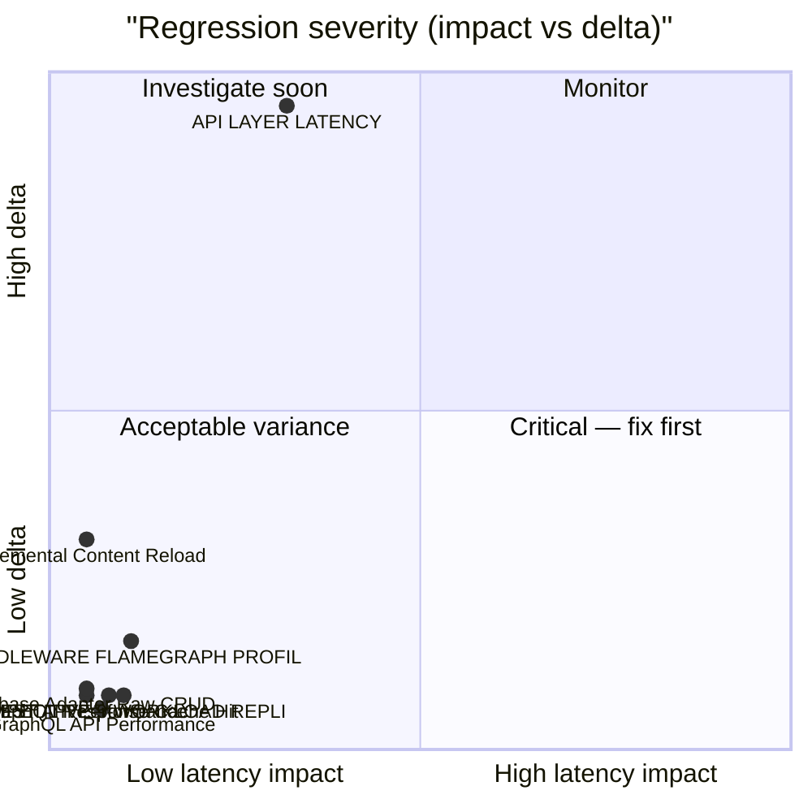

# 🚀 PostgreSQL+Redis Performance Ledger

> [!NOTE] Competitive comparisons based on publicly available documentation as of June 2026. All SveltyCMS metrics self-measured via `bun test tests/benchmarks/`.

> [!IMPORTANT]
> **Console-only by default.** Use `BENCHMARK_RECORD=1` to write results to this report.
>
> ```bash
> BENCHMARK_RECORD=1 bun test tests/benchmarks/auth-performance.test.ts
> ```
>
> The full matrix runner (`bun run scripts/benchmark-matrix/index.ts --sql`) always records.

<!-- BENCHMARK_START -->

<!-- EXECUTIVE_START -->
<!-- LATEST_AUDIT_HEADER -->

## 📊 Latest Performance Audit

<!-- EXECUTIVE_FIX_NOTES_START -->

### 📝 Fix Overlays

> [!NOTE]
> Phase notes and remediation entries appear here after matrix or surgical runs.

<!-- EXECUTIVE_FIX_NOTES_END -->

(06/10/2026, 13:03:51)

**✅ PASS** · 22/45 tests · 23 skipped · **POSTGRESQL+REDIS** · Bun 1.4.2

### Dimension health

| Dimension      | Tests | Status | Worst Δ | Issues |
| -------------- | ----: | ------ | ------- | ------ |
| **Core**       |    13 | 🟢     | +631%   | 0      |
| **API**        |     9 | 🟢     | -52%    | 0      |
| **Scale**      |    18 | 🟢     | +147%   | 0      |
| **Resilience** |     5 | 🟢     | —       | 0      |

### Issues (action required)

> ✅ **All clear** — no regressions or budget violations detected.

### Executive latency matrix

| Scenario               | Latency | Trend  | Budget   | Result |
| ---------------------- | ------- | ------ | -------- | ------ |
| **Cold Start**         | N/A     | ⚪ (—) | < 5000ms | ⚪ N/A |
| **REST (Collections)** | N/A     | ⚪ (—) | < 5ms    | ⚪ N/A |
| **Middleware Hooks**   | N/A     | ⚪     | < 2ms    | ⚪ N/A |
| **GraphQL (Avg)**      | N/A     | ⚪ (—) | < 5ms    | ⚪ N/A |
| **Million-Row Index**  | N/A     | ⚪     | < 250ms  | ⚪ N/A |
| **DB Raw (p95)**       | N/A     | ⚪     | < 50ms   | ⚪ N/A |

### Historical pulse

> **Scope:** Sparklines only — full run tables: [`tests/benchmarks/results/history.sqlite`](../../../tests/benchmarks/results/history.sqlite)

| Metric | Trend | Sparkline | Latest |
| ------ | ----- | --------- | ------ |

<details>
<summary>📈 Latency trend chart (last 10 runs)</summary>

```mermaid
xychart-beta
  title "POSTGRESQL+REDIS REST p95 (last 10 runs)"
  x-axis ["R1", "R2", "R3", "R4", "R5", "R6", "R7", "R8", "R9", "R10"]
  y-axis "Latency (ms)"
  line "p95" : [0.000, 0.000, 0.000, 0.000, 0.000, 0.000, 0.000, 0.000, 0.000, 0.000]
```

</details>
<details>
<summary>📊 Regression severity matrix (quadrant)</summary>



</details>

<!-- EXECUTIVE_PARTIAL_WATERMARK -->

<!-- EXECUTIVE_ALERTS_START -->
<!-- EXECUTIVE_ALERTS_END -->
<!-- EXECUTIVE_END -->

<!-- SUMMARY_START -->
<!-- SUMMARY_RUN_OVERLAY_START -->

### Current Run Summary

> Only tests that ran in THIS invocation. Populated after `BENCHMARK_RECORD=1` or matrix run.

<!-- SUMMARY_RUN_OVERLAY_END -->

<!-- SUMMARY_HISTORY_START -->

### Historical Trends (2026-10-06)

> **Mode:** production-parity matrix runs only (`run_mode='matrix'` + `server_mode='production'` — `NODE_ENV=production`, no `TEST_MODE`). Standalone/mode-variant samples are recorded but never trended here.

> **Scope:** Sparklines only — full run tables live in `history.sqlite` (link below). Runs = sparkline bar count.

**Detail:** [`tests/benchmarks/results/history.sqlite`](../../../tests/benchmarks/results/history.sqlite) · `SELECT test_id, phase, server_mode, avg_ms, p95_ms, rps, timestamp FROM runs WHERE db_type='postgresql' AND redis=1 ORDER BY timestamp DESC`

**Series:** 54 · **DB:** postgresql-redis

| Metric                              | Trend | Sparkline (last 7) | Latest    |
| ----------------------------------- | ----- | ------------------ | --------- |
| ADMIN UX VITALITY (warm)            | 🟢    | `█▁`               | 0.490ms   |
| AI PERFORMANCE (warm)               | 🟢    | `▁▁`               | 0.000ms   |
| AUTH PERFORMANCE (warm)             | 🟢    | `▁▃█▃▃▃`           | 0.810ms   |
| AUTH SESSION AMR (warm)             | 🟢    | `▁█▂█`             | 0.987ms   |
| BUILD ANALYSIS (warm)               | 🟢    | `▁`                | 0.000ms   |
| CACHE HIT RATIO (warm)              | 🟢    | `▅▆▁█`             | 1.324ms   |
| CACHE PERFORMANCE (warm)            | 🟢    | `▁█`               | 0.817ms   |
| CACHE SERVICE (warm)                | 🟢    | `▁▆█`              | 0.738ms   |
| CLIENT JOURNEY (warm)               | 🟢    | `▁`                | 5.366ms   |
| COMPETITIVE WORKLOAD REPLICA (warm) | 🟢    | `▁▂▁▅▂█▂`          | 1.185ms   |
| CONCURRENCY MAX (warm)              | 🟢    | `▁`                | 26.398ms  |
| CONTENT GUI SAVE (warm)             | 🟢    | `▁`                | 1.466ms   |
| CONTENT SCALE STRESS (warm)         | 🟢    | `█▁`               | 0.151ms   |
| CONTENT SCAN (warm)                 | 🟢    | `█▁`               | 0.658ms   |
| DATABASE PERFORMANCE (warm)         | 🟢    | `▂▁▇▂█▁▁`          | 0.473ms   |
| EDGE SYNC (warm)                    | 🟢    | `▁`                | 2.931ms   |
| ENTRY EDIT HYDRATION (warm)         | 🟢    | `█▁▁▆`             | 0.016ms   |
| GRAPHQL API PERFORMANCE (warm)      | 🟢    | `▄▃█▆▂▁`           | 0.797ms   |
| GRAPHQL CACHE HIT (warm)            | 🟢    | `█▁▃▁`             | 0.985ms   |
| GRAPHQL LOCAL SDK (warm)            | 🟢    | `█▁`               | 0.000ms   |
| GRAPHQL STRESS (warm)               | 🟢    | `█▁▂▃▁▄▆`          | 12.039ms  |
| HOOKS PERFORMANCE (warm)            | 🟢    | `▁█▁▅▃`            | 0.785ms   |
| INDEX PRESSURE (warm)               | 🟢    | `▁█`               | 0.705ms   |
| LARGE PAYLOAD STREAMING (warm)      | 🟢    | `▁▄▇█`             | 10.582ms  |
| LOCAL API PERFORMANCE (warm)        | 🟢    | `█▁▇`              | 0.383ms   |
| LOCAL API THROUGHPUT (warm)         | 🟢    | `▁█`               | 1.841ms   |
| LOCAL CMS CRUD (warm)               | 🟢    | `▃▃▃▃▁█▄`          | 0.560ms   |
| LOCAL SDK VS DIRECT (warm)          | 🟢    | `▁▁██▇█▇`          | 1.457ms   |
| MEDIA UPLOAD STRESS (warm)          | 🟢    | `▁█`               | 7.713ms   |
| MEMORY COUNTERS (warm)              | 🟢    | `▁`                | 0.000ms   |
| MIGRATION SCALE (warm)              | 🟢    | `█▁▁`              | 0.839ms   |
| MIXED WORKLOAD (warm)               | 🟢    | `▁`                | 1.001ms   |
| MULTI TENANT PERFORMANCE (warm)     | 🟢    | `▁`                | 0.999ms   |
| OPENAPI PERFORMANCE (warm)          | 🟢    | `▇▁█`              | 2.070ms   |
| PRODUCTION DAY (warm)               | 🟢    | `▁`                | 1.912ms   |
| REALTIME PERFORMANCE (warm)         | 🟢    | `▁▁▁`              | 0.000ms   |
| REVISION STRESS (warm)              | 🟢    | `▁█▁`              | 0.478ms   |
| RIGHT TO BE FORGOTTEN AUDIT (warm)  | 🟢    | `▁`                | 13.241ms  |
| SECURITY AUDIT (warm)               | 🟢    | `▁▁▁█▁▁▁`          | 0.001ms   |
| SHARP VS BUN IMAGE (warm)           | 🟢    | `▄▂▁█▄▃▂`          | 40.254ms  |
| TELEMETRY PERFORMANCE (warm)        | 🟢    | `█▁`               | 0.000ms   |
| TEMPORAL INTEGRITY (warm)           | 🟢    | `▁`                | 2.978ms   |
| TRANSACTION ACID (warm)             | 🟢    | `▁█`               | 2.150ms   |
| TRUTH LATENCY (warm)                | 🟢    | `█▃▁▁`             | 0.000ms   |
| WEBSOCKET BROADCAST (warm)          | 🟢    | `▁`                | 0.213ms   |
| WIDGET PERFORMANCE (warm)           | 🟢    | `█▁▄`              | 0.977ms   |
| API LATENCY (warm)                  | ⚪    | `▅▂▁▁█`            | 3.818ms   |
| CONFIG PROMOTION (warm)             | ⚪    | `▂▂▂█▁▁`           | 9.922ms   |
| CONTENT INCREMENTAL RELOAD (warm)   | ⚪    | `▄▃▁█`             | 0.551ms   |
| MEDIA PERFORMANCE (warm)            | ⚪    | `▁▆▁▄▂▁█`          | 108.651ms |
| MIDDLEWARE FLAMEGRAPH (warm)        | ⚪    | `▄▂▂█▂▁█`          | 1.382ms   |
| NEGATIVE CACHE (warm)               | ⚪    | `██▁`              | 0.001ms   |
| REST API PERFORMANCE (warm)         | ⚪    | `▆▄▄▁█`            | 0.591ms   |
| SCALE SPECTRUM (warm)               | ⚪    | `▁▂▄▁▂▁█`          | 2.001ms   |

<!-- SUMMARY_HISTORY_END --><!-- SUMMARY_END -->

<details>
<summary>📊 Infrastructure drill-down (expand for adapter, hooks, memory trends)</summary>

## 📊 Infrastructure drill-down

### 🏷️ Mixed Workload Performance {#mixedAvg}

**Mixed p95:** — (not measured in this run) | **Trend:** ⚪ (—)

> Production request mix: 60% Reads, 20% Writes, 15% GraphQL, 5% Media.

### 🏷️ Database Adapter Performance {#dbRaw}

**Raw Adapter p95:** — (not measured in this run) | **Target:** < 50ms | **Trend:** ⚪ (—)

> Direct database access latency (bypass CMS logic).

### 🏷️ Middleware & Hooks Audit {#hooks}

**Middleware p95:** — (not measured in this run) | **Target:** < 2ms | **Trend:** ⚪ (—)

> Total overhead of security, logging, and auth hooks.

### 🏷️ Memory Stability Audit {#memGrowth}

**Memory RSS Δ:** — (not measured in this run) | **Target:** < 60MB | **Trend:** ⚪ (—)

> Peak memory growth during stress workload.

### Enterprise scale audit

### 🏷️ Multi-Tenancy Performance {#tenancyAvg}

**Tenancy p95:** — (not measured in this run) | **Trend:** ⚪ (—)

> Measures latency across tenant isolation boundaries.

### 🏷️ Relational Resolver Latency {#relationalAvg}

**Relational p95:** — (not measured in this run) | **Trend:** ⚪ (—)

> Tests performance of complex JOINs and nested relationship population.

### 🏷️ Telemetry & Update Performance {#telemetryAvg}

**Telemetry p95:** — (not measured in this run) | **Trend:** ⚪ (—)

> Measures overhead of telemetry collection and cryptographic signing.

</details>

<!-- LEDGER_START -->

## 🔬 Full benchmark ledger (41 modules)

Expand dimension groups, then any row, for ASCII truth tables. Executive summary above shows pass/fail and issues only.

<!-- LEDGER_DIMENSION:CORE:START -->

<details id="ledger-dimension-core">
<summary><strong>Core</strong> · 13 tests</summary>

<!-- SECTION:API_LATENCY:START -->
<details id="section-api_latency">
<summary><strong>🏷️ API LAYER LATENCY</strong> · ⚪ 3.818ms · ↗️ — · <a href="../../../tests/benchmarks/api-latency.test.ts">source</a></summary>
<!-- LEDGER_INSIGHT_START -->
> [!NOTE]
> **Specific to this test**: Both avg and p95 degraded — likely adapter or infrastructure bottleneck. Check DB connection pool, indexes, or recent commits.  
Throughput dropped 91% — check connection pool saturation or lock contention.  
**Severe degradation** (+631%) — review recent commits immediately.
> **Check**: `src/routes/api/[...path]/+server.ts` · `src/hooks.server.ts`
<!-- LEDGER_INSIGHT_END -->

<!-- LEDGER_TRUTH_START -->

> ⏳ **API LAYER LATENCY**: Pending execution.
> 🎯 Measures the base network and HTTP overhead for the simplest possible API calls.

<!-- LEDGER_TRUTH_END -->

</details>
<!-- SECTION:API_LATENCY:END -->

<!-- SECTION:COLD_START:START -->
<details id="section-cold_start">
<summary><strong>🏷️ PHASED COLD START</strong> · ⚪ ⏳ pending · ➡️ — · <a href="../../../tests/benchmarks/cold-start-phased.test.ts">source</a></summary>
<!-- LEDGER_TRUTH_START -->
> ⏳ **PHASED COLD START**: Pending execution.
> 🎯 Measures the time to READY state (serving traffic) vs WARMED state (background tasks).
<!-- LEDGER_TRUTH_END -->

</details>
<!-- SECTION:COLD_START:END -->

<!-- SECTION:TRUTH_AUDIT:START -->
<details id="section-truth_audit">
<summary><strong>🏷️ SRE TRUTH AUDIT</strong> · ⚪ ⏳ pending · ↘️ — · <a href="../../../tests/benchmarks/truth-latency.test.ts">source</a></summary>
<!-- LEDGER_INSIGHT_START -->
> [!NOTE]
> **Specific to this test**: Performance improved — recent optimizations or cache warming likely effective.
<!-- LEDGER_INSIGHT_END -->

<!-- LEDGER_TRUTH_START -->

```text
╔═══════════════════════════════════════════════════════════════════════════════════════════════════════╗
║                                      SVELTYCMS — SRE TRUTH AUDIT                                      ║
║                             File: tests/benchmarks/truth-latency.test.ts                              ║
║                                       Ran: 2026-10-06 10:55:07                                        ║
║            Validates performance claims by comparing SDK, Middleware, and Real HTTP Stack             ║
╠═══════════════════════════════════════════════════════════════════════════════════════════════════════╣
║ Logic Baseline               │ Cold:     0.02 ms │ Warm:     0.000 ms │ p95:     0.000 ms │ 571,755 RPS ║
║ Local SDK (Full)             │ Cold:    14.33 ms │ Warm:     0.005 ms │ p95:     0.009 ms │ 172,692 RPS ║
║ HTTP End-to-End              │ Cold:     5.21 ms │ Warm:     0.247 ms │ p95:     0.318 ms │   4,024 RPS ║
║ HTTP Cold (Cache-Busted)     │ Cold:     3.37 ms │ Warm:     1.043 ms │ p95:     2.082 ms │     957 RPS ║
╚═══════════════════════════════════════════════════════════════════════════════════════════════════════╝
```

<!-- LEDGER_TRUTH_END -->

</details>
<!-- SECTION:TRUTH_AUDIT:END -->

<!-- SECTION:INCREMENTAL:START -->
<details id="section-incremental">
<summary><strong>🏷️ Incremental Content Reload</strong> · ⚪ 0.551ms · ↗️ — · <a href="../../../tests/benchmarks/content-incremental-reload.test.ts">source</a></summary>
<!-- LEDGER_INSIGHT_START -->
> [!NOTE]
> **Specific to this test**: Both avg and p95 degraded — likely adapter or infrastructure bottleneck. Check DB connection pool, indexes, or recent commits.  
Throughput dropped 78% — check connection pool saturation or lock contention.  
**Severe degradation** (+195%) — review recent commits immediately.
> **Check**: `src/content/engine.server.ts` · `src/routes/api/[...path]/handlers/content.ts`
<!-- LEDGER_INSIGHT_END -->

<!-- LEDGER_TRUTH_START -->

```text
╔═══════════════════════════════════════════════════════════════════════════════════════════════════════╗
║                             SVELTYCMS — INCREMENTAL CONTENT RELOAD AUDIT                              ║
║                       File: tests/benchmarks/content-incremental-reload.test.ts                       ║
║                                       Ran: 2026-10-06 10:59:14                                        ║
║      Measures surgical single-file fullReload vs full reconciliation path and batch processing.       ║
╠═══════════════════════════════════════════════════════════════════════════════════════════════════════╣
║ Incremental fullReload (1 file) │ Cold:     4.74 ms │ Warm:     0.060 ms │ p95:     0.116 ms │  14,816 RPS ║
║ Full Reconciliation Reload   │ Cold:     3.22 ms │ Warm:     0.187 ms │ p95:     0.234 ms │   5,218 RPS ║
║ Sequential 10-File Reload    │ Cold:     3.98 ms │ Warm:     0.551 ms │ p95:     0.653 ms │   1,805 RPS ║
║ Batched 10-File Reload       │ Cold:     0.96 ms │ Warm:     0.245 ms │ p95:     0.281 ms │   4,035 RPS ║
╚═══════════════════════════════════════════════════════════════════════════════════════════════════════╝
```

<!-- LEDGER_TRUTH_END -->

</details>
<!-- SECTION:INCREMENTAL:END -->

<!-- SECTION:HOOKS_TRACE:START -->
<details id="section-hooks_trace">
<summary><strong>🏷️ Middleware & Hooks Performance</strong> · ⚪ 0.785ms · ➡️ — · <a href="../../../tests/benchmarks/hooks-performance.test.ts">source</a></summary>
<!-- LEDGER_TRUTH_START -->
> ⏳ **Middleware & Hooks Performance**: Pending execution.
> 🎯 High-resolution micro-benchmarks (µs) for individual middleware layers.
<!-- LEDGER_TRUTH_END -->

</details>
<!-- SECTION:HOOKS_TRACE:END -->

<!-- SECTION:STATE_MACHINE:START -->
<details id="section-state_machine">
<summary><strong>🏷️ State Machine Transitions</strong> · ⚪ ⏳ pending · ➡️ — · <a href="../../../tests/benchmarks/state-machine-transition.test.ts">source</a></summary>
<!-- LEDGER_TRUTH_START -->
> ⏳ **State Machine Transitions**: Pending execution.
> 🎯 Validates rapid IDLE -> READY self-healing cycles.
<!-- LEDGER_TRUTH_END -->

</details>
<!-- SECTION:STATE_MACHINE:END -->

<!-- SECTION:DB_RAW_P95:START -->
<details id="section-db_raw_p95">
<summary><strong>🏷️ Database Adapter Raw CRUD</strong> · ⚪ 0.473ms · ↘️ — · <a href="../../../tests/benchmarks/database-performance.test.ts">source</a></summary>
<!-- LEDGER_INSIGHT_START -->
> [!NOTE]
> **Specific to this test**: Performance improved — recent optimizations or cache warming likely effective.
<!-- LEDGER_INSIGHT_END -->

<!-- LEDGER_TRUTH_START -->

> ⏳ **Database Adapter Raw CRUD**: Pending execution.
> 🎯 Direct low-level benchmarks of Create, Read, Update, Delete on the current database adapter.

<!-- LEDGER_TRUTH_END -->

</details>
<!-- SECTION:DB_RAW_P95:END -->

<!-- SECTION:ACID:START -->
<details id="section-acid">
<summary><strong>🏷️ ACID Transaction Overhead</strong> · ⚪ 2.150ms · ➡️ — · <a href="../../../tests/benchmarks/transaction-acid.test.ts">source</a></summary>
<!-- LEDGER_TRUTH_START -->
```text
╔═══════════════════════════════════════════════════════════════════════════════════════════════════════╗
║                                   SVELTYCMS — ACID INTEGRITY AUDIT                                    ║
║                            File: tests/benchmarks/transaction-acid.test.ts                            ║
║                                       Ran: 2026-10-06 10:58:58                                        ║
║         Measures transaction commit latencies and rollback overhead across database adapters          ║
╠═══════════════════════════════════════════════════════════════════════════════════════════════════════╣
║ TX Commit                    │ Cold:     2.77 ms │ Warm:     0.732 ms │ p95:     1.222 ms │   5,022 RPS ║
║ TX Rollback Integrity        │ Cold:     5.99 ms │ Warm:     2.150 ms │ p95:     2.717 ms │     464 RPS ║
╚═══════════════════════════════════════════════════════════════════════════════════════════════════════╝
```
<!-- LEDGER_TRUTH_END -->

</details>
<!-- SECTION:ACID:END -->

<!-- SECTION:CACHE:START -->
<details id="section-cache">
<summary><strong>🏷️ System Cache Efficiency</strong> · ⚪ 0.817ms · ➡️ — · <a href="../../../tests/benchmarks/cache-performance.test.ts">source</a></summary>
<!-- LEDGER_TRUTH_START -->
```text
╔═══════════════════════════════════════════════════════════════════════════════════════════════════════╗
║                                  SVELTYCMS — CACHE EFFICIENCY AUDIT                                   ║
║                            File: tests/benchmarks/cache-hit-ratio.test.ts                             ║
║                                       Ran: 2026-10-06 10:55:49                                        ║
║           Measures true cold-fill, warm hit ratio, miss penalty, and invalidation latency.            ║
╠═══════════════════════════════════════════════════════════════════════════════════════════════════════╣
║ Cache Cold Fill (Miss + Repopulate) │        0.976 ms │ p95:        1.159 ms │ RPS:      1,024 ║
║ Cache Hit (Warm)             │ Cold:     0.35 ms │ Warm:     0.162 ms │ p95:     0.254 ms │   5,977 RPS ║
║ Bypass Cache (Direct DB)     │ Cold:     1.04 ms │ Warm:     0.755 ms │ p95:     0.921 ms │   1,321 RPS ║
║ Cache Invalidation           │ Cold:     3.50 ms │ Warm:     1.324 ms │ p95:     1.544 ms │     740 RPS ║
╚═══════════════════════════════════════════════════════════════════════════════════════════════════════╝
```
<!-- LEDGER_TRUTH_END -->

</details>
<!-- SECTION:CACHE:END -->

<!-- SECTION:CACHE_EFFICIENCY:START -->
<details id="section-cache_efficiency">
<summary><strong>🏷️ Cache Hit/Miss Ratio & Efficiency</strong> · ⚪ 1.324ms · ↗️ — · <a href="../../../tests/benchmarks/cache-hit-ratio.test.ts">source</a></summary>
<!-- LEDGER_INSIGHT_START -->
> [!NOTE]
> **Specific to this test**: Both avg and p95 degraded — likely adapter or infrastructure bottleneck. Check DB connection pool, indexes, or recent commits.  
Throughput dropped 73% — check connection pool saturation or lock contention.  
**Severe degradation** (+75%) — review recent commits immediately.
> **Check**: `src/databases/cache/redis-adapter.ts` · `src/databases/cache/cache-service.ts`
<!-- LEDGER_INSIGHT_END -->

<!-- LEDGER_TRUTH_START -->

```text
╔═══════════════════════════════════════════════════════════════════════════════════════════════════════╗
║                                  SVELTYCMS — CACHE EFFICIENCY AUDIT                                   ║
║                            File: tests/benchmarks/cache-hit-ratio.test.ts                             ║
║                                       Ran: 2026-10-06 10:55:49                                        ║
║           Measures true cold-fill, warm hit ratio, miss penalty, and invalidation latency.            ║
╠═══════════════════════════════════════════════════════════════════════════════════════════════════════╣
║ Cache Cold Fill (Miss + Repopulate) │        0.976 ms │ p95:        1.159 ms │ RPS:      1,024 ║
║ Cache Hit (Warm)             │ Cold:     0.35 ms │ Warm:     0.162 ms │ p95:     0.254 ms │   5,977 RPS ║
║ Bypass Cache (Direct DB)     │ Cold:     1.04 ms │ Warm:     0.755 ms │ p95:     0.921 ms │   1,321 RPS ║
║ Cache Invalidation           │ Cold:     3.50 ms │ Warm:     1.324 ms │ p95:     1.544 ms │     740 RPS ║
╚═══════════════════════════════════════════════════════════════════════════════════════════════════════╝
```

<!-- LEDGER_TRUTH_END -->

</details>
<!-- SECTION:CACHE_EFFICIENCY:END -->

<!-- SECTION:COMPETITIVE:START -->
<details id="section-competitive">
<summary><strong>🏷️ COMPETITIVE 9-WORKLOAD REPLICA</strong> · ⚪ 1.185ms · ↗️ — · <a href="../../../tests/benchmarks/competitive-workload-replica.test.ts">source</a></summary>
<!-- LEDGER_INSIGHT_START -->
> [!NOTE]
> **Specific to this test**: Avg degraded but p95 stable — possible cold-start effect, GC pause, or warmup variance.  
Throughput dropped 80% — check connection pool saturation or lock contention.  
**Severe degradation** (+49%) — review recent commits immediately.
<!-- LEDGER_INSIGHT_END -->

<!-- LEDGER_TRUTH_START -->

```text
╔═══════════════════════════════════════════════════════════════════════════════════════════════════════╗
║                   COMPETITIVE HARNESS REPLICA (POSTGRESQL — 500 Docs, COLD vs WARM)                   ║
║                      File: tests/benchmarks/competitive-workload-replica.test.ts                      ║
║                                       Ran: 2026-10-06 11:01:47                                        ║
║              Seq + concurrent (8 workers), harness iteration counts, median of N rounds.              ║
╠═══════════════════════════════════════════════════════════════════════════════════════════════════════╣
║ findById (Cold Sequential)   │ Cold:     5.15 ms │ Warm:     0.456 ms │ p95:     1.003 ms │   2,160 RPS ║
║ findById (Cold Concurrent 8c) │ Cold:    13.73 ms │ Warm:     2.801 ms │ p95:    15.290 ms │   2,791 RPS ║
║ findByIdRandom (Cold Sequential) │ Cold:     3.19 ms │ Warm:     1.342 ms │ p95:     2.074 ms │     744 RPS ║
║ findByIdRandom (Cold Concurrent 8c) │ Cold:     1.32 ms │ Warm:     4.784 ms │ p95:     7.664 ms │   1,619 RPS ║
║ listFilterSort (Cold Sequential) │ Cold:     5.18 ms │ Warm:     0.382 ms │ p95:     0.475 ms │   2,605 RPS ║
║ listFilterSort (Cold Concurrent 8c) │ Cold:     0.47 ms │ Warm:     1.533 ms │ p95:     2.760 ms │   5,064 RPS ║
║ listLarge (Cold Sequential)  │ Cold:     6.59 ms │ Warm:     0.460 ms │ p95:     0.569 ms │   2,166 RPS ║
║ listLarge (Cold Concurrent 8c) │ Cold:     0.35 ms │ Warm:     1.413 ms │ p95:     2.337 ms │   5,495 RPS ║
║ listPlain (Cold Sequential)  │ Cold:     3.84 ms │ Warm:     0.288 ms │ p95:     0.405 ms │   3,462 RPS ║
║ listPlain (Cold Concurrent 8c) │ Cold:     0.23 ms │ Warm:     1.035 ms │ p95:     1.642 ms │   7,373 RPS ║
║ findMissing (Cold Sequential) │ Cold:     4.45 ms │ Warm:     0.297 ms │ p95:     0.460 ms │   3,354 RPS ║
║ findMissing (Cold Concurrent 8c) │ Cold:     0.32 ms │ Warm:     1.100 ms │ p95:     2.451 ms │   6,699 RPS ║
║ create (Cold Sequential)     │ Cold:     7.07 ms │ Warm:     2.002 ms │ p95:     3.187 ms │     499 RPS ║
║ create (Cold Concurrent 8c)  │ Cold:     4.05 ms │ Warm:     6.438 ms │ p95:    10.863 ms │   1,212 RPS ║
║ update (Cold Sequential)     │ Cold:     2.37 ms │ Warm:     1.646 ms │ p95:     2.170 ms │     607 RPS ║
║ update (Cold Concurrent 8c)  │ Cold:     3.27 ms │ Warm:     5.759 ms │ p95:     9.615 ms │   1,321 RPS ║
║ graphql (Cold Sequential)    │ Cold:     5.35 ms │ Warm:     1.008 ms │ p95:     1.360 ms │     990 RPS ║
║ graphql (Cold Concurrent 8c) │ Cold:     2.36 ms │ Warm:     2.313 ms │ p95:     4.370 ms │   3,348 RPS ║
║ mixed (Cold Sequential)      │ Cold:     1.23 ms │ Warm:     0.963 ms │ p95:     1.570 ms │   1,036 RPS ║
║ mixed (Cold Concurrent 8c)   │ Cold:     0.40 ms │ Warm:     3.183 ms │ p95:     6.805 ms │   2,445 RPS ║
║ findById (Warm Sequential)   │ Cold:     0.84 ms │ Warm:     0.215 ms │ p95:     0.331 ms │   4,612 RPS ║
║ findById (Warm Concurrent 8c) │ Cold:     0.17 ms │ Warm:     0.878 ms │ p95:     1.162 ms │   9,032 RPS ║
║ findByIdRandom (Warm Sequential) │ Cold:     0.63 ms │ Warm:     0.206 ms │ p95:     0.359 ms │   4,830 RPS ║
║ findByIdRandom (Warm Concurrent 8c) │ Cold:     0.24 ms │ Warm:     1.027 ms │ p95:     1.954 ms │   7,745 RPS ║
║ listFilterSort (Warm Sequential) │ Cold:     0.83 ms │ Warm:     0.277 ms │ p95:     0.400 ms │   3,599 RPS ║
║ listFilterSort (Warm Concurrent 8c) │ Cold:     0.33 ms │ Warm:     0.652 ms │ p95:     0.933 ms │  12,021 RPS ║
║ listLarge (Warm Sequential)  │ Cold:     1.18 ms │ Warm:     0.397 ms │ p95:     0.713 ms │   2,511 RPS ║
║ listLarge (Warm Concurrent 8c) │ Cold:     0.41 ms │ Warm:     1.257 ms │ p95:     1.884 ms │   6,294 RPS ║
║ listPlain (Warm Sequential)  │ Cold:     0.98 ms │ Warm:     0.260 ms │ p95:     0.417 ms │   3,832 RPS ║
║ listPlain (Warm Concurrent 8c) │ Cold:     0.29 ms │ Warm:     0.715 ms │ p95:     0.801 ms │  10,975 RPS ║
║ findMissing (Warm Sequential) │ Cold:     0.72 ms │ Warm:     0.184 ms │ p95:     0.464 ms │   5,403 RPS ║
║ findMissing (Warm Concurrent 8c) │ Cold:     0.21 ms │ Warm:     0.646 ms │ p95:     1.007 ms │  12,089 RPS ║
║ create (Warm Sequential)     │ Cold:     9.58 ms │ Warm:     1.294 ms │ p95:     1.726 ms │     772 RPS ║
║ create (Warm Concurrent 8c)  │ Cold:     3.44 ms │ Warm:     4.761 ms │ p95:     6.829 ms │   1,670 RPS ║
║ update (Warm Sequential)     │ Cold:     2.76 ms │ Warm:     1.185 ms │ p95:     1.625 ms │     843 RPS ║
║ update (Warm Concurrent 8c)  │ Cold:     2.32 ms │ Warm:     4.615 ms │ p95:     8.257 ms │   1,726 RPS ║
║ graphql (Warm Sequential)    │ Cold:     1.88 ms │ Warm:     0.817 ms │ p95:     0.989 ms │   1,221 RPS ║
║ graphql (Warm Concurrent 8c) │ Cold:     2.21 ms │ Warm:     1.932 ms │ p95:     2.516 ms │   4,118 RPS ║
║ mixed (Warm Sequential)      │ Cold:     2.66 ms │ Warm:     0.795 ms │ p95:     1.444 ms │   1,256 RPS ║
║ mixed (Warm Concurrent 8c)   │ Cold:     0.30 ms │ Warm:     2.900 ms │ p95:     6.051 ms │   2,735 RPS ║
╚═══════════════════════════════════════════════════════════════════════════════════════════════════════╝
```

<!-- LEDGER_TRUTH_END -->

</details>
<!-- SECTION:COMPETITIVE:END -->

<!-- SECTION:FLAMEGRAPH:START -->
<details id="section-flamegraph">
<summary><strong>🏷️ MIDDLEWARE FLAMEGRAPH PROFILER</strong> · ⚪ 1.382ms · ↗️ — · <a href="../../../tests/benchmarks/middleware-flamegraph.test.ts">source</a></summary>
<!-- LEDGER_INSIGHT_START -->
> [!NOTE]
> **Specific to this test**: Both avg and p95 degraded — likely adapter or infrastructure bottleneck. Check DB connection pool, indexes, or recent commits.  
Throughput dropped 45% — check connection pool saturation or lock contention.  
**Severe degradation** (+102%) — review recent commits immediately.
<!-- LEDGER_INSIGHT_END -->

<!-- LEDGER_TRUTH_START -->

```text
╔═══════════════════════════════════════════════════════════════════════════════════════════════════════╗
║                              MIDDLEWARE FLAMEGRAPH PROFILER (POSTGRESQL)                              ║
║                         File: tests/benchmarks/middleware-flamegraph.test.ts                          ║
║                                       Ran: 2026-10-06 11:02:44                                        ║
║Measures isolated microsecond cost and incremental deltas of each middleware stage from edge to database.║
╠═══════════════════════════════════════════════════════════════════════════════════════════════════════╣
║ Stage 0: Raw Socket Baseline (Static Asset) │ Cold:     4.29 ms │ Warm:     0.856 ms │ p95:     1.952 ms │   4,040 RPS ║
║ Stage 1: System State + Turbo Pipeline │ Cold:     1.58 ms │ Warm:     0.693 ms │ p95:     1.306 ms │   5,244 RPS ║
║ Stage 2: WAF Security Inspection │ Cold:     1.42 ms │ Warm:     0.675 ms │ p95:     1.055 ms │   5,537 RPS ║
║ Stage 3: Token Auth Gating   │ Cold:     8.76 ms │ Warm:     1.444 ms │ p95:     2.183 ms │   2,629 RPS ║
║ Stage 4: Collection Schema Resolution │ Cold:     5.21 ms │ Warm:     0.636 ms │ p95:     1.183 ms │   5,909 RPS ║
║ Stage 5: Full REST Single Document │ Cold:     4.36 ms │ Warm:     0.516 ms │ p95:     0.695 ms │   7,399 RPS ║
║ Stage 6: GraphQL Single Query (JIT) │ Cold:     3.34 ms │ Warm:     1.382 ms │ p95:     2.060 ms │   2,812 RPS ║
╚═══════════════════════════════════════════════════════════════════════════════════════════════════════╝
```

<!-- LEDGER_TRUTH_END -->

</details>
<!-- SECTION:FLAMEGRAPH:END -->

<!-- SECTION:EVENTLOOP:START -->
<details id="section-eventloop">
<summary><strong>🏷️ EVENT LOOP LAG & SATURATION</strong> · ⚪ ⏳ pending · ➡️ — · <a href="../../../tests/benchmarks/event-loop-lag.test.ts">source</a></summary>
<!-- LEDGER_TRUTH_START -->
> ⏳ **EVENT LOOP LAG & SATURATION**: Pending execution.
> 🎯 Measures event loop delay and microtask drain during continuous write bursts.
<!-- LEDGER_TRUTH_END -->

</details>
<!-- SECTION:EVENTLOOP:END -->

</details>

<!-- LEDGER_DIMENSION:CORE:END -->

<!-- LEDGER_DIMENSION:API:START -->

<details id="ledger-dimension-api">
<summary><strong>API</strong> · 9 tests</summary>

<!-- SECTION:TEMPORAL:START -->
<details id="section-temporal">
<summary><strong>🏷️ Temporal Integrity Audit</strong> · ⚪ 2.978ms · ➡️ — · <a href="../../../tests/benchmarks/temporal-integrity.test.ts">source</a></summary>
<!-- LEDGER_TRUTH_START -->
```text
╔═══════════════════════════════════════════════════════════════════════════════════════════════════════╗
║                                 SVELTYCMS — TEMPORAL INTEGRITY AUDIT                                  ║
║                           File: tests/benchmarks/temporal-integrity.test.ts                           ║
║                                       Ran: 2026-10-06 10:57:10                                        ║
║Validates strict backend UTC normalization (ISO 8601 with trailing 'Z') across global timezone offsets, fractional timezones, and midnight transitions.║
╠═══════════════════════════════════════════════════════════════════════════════════════════════════════╣
║ Temporal Ingestion & Normalization │ Cold:     4.48 ms │ Warm:     2.978 ms │ p95:     4.837 ms │   1,279 RPS ║
╚═══════════════════════════════════════════════════════════════════════════════════════════════════════╝
```
<!-- LEDGER_TRUTH_END -->

</details>
<!-- SECTION:TEMPORAL:END -->

<!-- SECTION:RELATIONAL:START -->
<details id="section-relational">
<summary><strong>🏷️ Relational & Nested Queries</strong> · ⚪ ⏳ pending · ➡️ — · <a href="../../../tests/benchmarks/relational-performance.test.ts">source</a></summary>
<!-- LEDGER_TRUTH_START -->
```text
╔═══════════════════════════════════════════════════════════════════════════════════════════════════════╗
║                                 SVELTYCMS — RELATIONAL RESOLVER AUDIT                                 ║
║                         File: tests/benchmarks/relational-performance.test.ts                         ║
║                                       Ran: 2026-08-29 21:42:31                                        ║
║Measures GraphQL resolver performance for shallow listings, deep relational joins, and nested author population across cold/hot execution paths.║
╠═══════════════════════════════════════════════════════════════════════════════════════════════════════╣
║ Shallow Query (Collections)  │ Cold:     2.72 ms │ Warm:     2.705 ms │ p95:     4.179 ms │   2,079 RPS ║
║ Deep Join (Cold DB)          │ Cold:     2.83 ms │ Warm:     2.283 ms │ p95:     3.149 ms │   1,661 RPS ║
║ Deep Join (Warm Cached)      │ Cold:     1.82 ms │ Warm:     1.746 ms │ p95:     2.546 ms │   2,127 RPS ║
╚═══════════════════════════════════════════════════════════════════════════════════════════════════════╝
```
<!-- LEDGER_TRUTH_END -->

</details>
<!-- SECTION:RELATIONAL:END -->

<!-- SECTION:AUTH_TRACE:START -->
<details id="section-auth_trace">
<summary><strong>🏷️ Auth & RBAC Performance</strong> · ⚪ 0.810ms · ➡️ — · <a href="../../../tests/benchmarks/auth-performance.test.ts">source</a></summary>
<!-- LEDGER_TRUTH_START -->
> ⏳ **Auth & RBAC Performance**: Pending execution.
> 🎯 Measures JWT verification, session retrieval, and permission matrix resolution overhead.
<!-- LEDGER_TRUTH_END -->

</details>
<!-- SECTION:AUTH_TRACE:END -->

<!-- SECTION:REST:START -->
<details id="section-rest">
<summary><strong>🏷️ REST API Performance</strong> · ⚪ 0.591ms · ↗️ — · <a href="../../../tests/benchmarks/rest-api-performance.test.ts">source</a></summary>
<!-- LEDGER_INSIGHT_START -->
> [!NOTE]
> **Specific to this test**: Both avg and p95 degraded — likely adapter or infrastructure bottleneck. Check DB connection pool, indexes, or recent commits.  
Throughput dropped 40% — check connection pool saturation or lock contention.  
**Severe degradation** (+51%) — review recent commits immediately.
<!-- LEDGER_INSIGHT_END -->

<!-- LEDGER_TRUTH_START -->

```text
╔═══════════════════════════════════════════════════════════════════════════════════════════════════════╗
║                                 SVELTYCMS — ENTERPRISE REST API AUDIT                                 ║
║                          File: tests/benchmarks/rest-api-performance.test.ts                          ║
║                                       Ran: 2026-10-06 10:55:18                                        ║
║Measures latency, throughput, and correctness of core REST endpoints: health check, schema, single read, list, and search.║
╠═══════════════════════════════════════════════════════════════════════════════════════════════════════╣
║ System Health Check          │ Cold:     1.23 ms │ Warm:     0.591 ms │ p95:     0.725 ms │   6,540 RPS ║
║ Collection Schema Metadata   │ Cold:     4.59 ms │ Warm:     0.383 ms │ p95:     0.445 ms │  10,316 RPS ║
║ Single Document Read         │ Cold:     2.43 ms │ Warm:     0.240 ms │ p95:     0.273 ms │  16,388 RPS ║
║ Collection Find (List Limit 20) │ Cold:     7.27 ms │ Warm:     0.466 ms │ p95:     0.747 ms │   7,239 RPS ║
║ Collection Search Query      │ Cold:     2.88 ms │ Warm:     0.402 ms │ p95:     0.561 ms │   9,632 RPS ║
╚═══════════════════════════════════════════════════════════════════════════════════════════════════════╝
```

<!-- LEDGER_TRUTH_END -->

</details>
<!-- SECTION:REST:END -->

<!-- SECTION:GRAPHQL:START -->
<details id="section-graphql">
<summary><strong>🏷️ GraphQL API Performance</strong> · ⚪ 0.797ms · ↘️ — · <a href="../../../tests/benchmarks/graphql-api-performance.test.ts">source</a></summary>
<!-- LEDGER_INSIGHT_START -->
> [!NOTE]
> **Specific to this test**: Performance improved — recent optimizations or cache warming likely effective.  
Throughput dropped 67% — check connection pool saturation or lock contention.
<!-- LEDGER_INSIGHT_END -->

<!-- LEDGER_TRUTH_START -->

```text
╔═══════════════════════════════════════════════════════════════════════════════════════════════════════╗
║                                  SVELTYCMS — GRAPHQL CACHE HIT AUDIT                                  ║
║                           File: tests/benchmarks/graphql-cache-hit.test.ts                            ║
║                                       Ran: 2026-10-06 11:02:01                                        ║
║        Validates sub-millisecond L1 response cache hits, cache key isolation, and hit headers.        ║
╠═══════════════════════════════════════════════════════════════════════════════════════════════════════╣
║ Q1: Health (Cold Miss)         │        5.163 ms │ p95:        5.163 ms │ RPS:        194 ║
║ Q1: Health (L1 Hit)            │        1.080 ms │ p95:        1.590 ms │ RPS:        926 ║
║ Q2: Collections (Cold Miss)    │        2.062 ms │ p95:        2.062 ms │ RPS:        485 ║
║ Q2: Collections (L1 Hit)       │        0.985 ms │ p95:        1.288 ms │ RPS:      1,015 ║
╚═══════════════════════════════════════════════════════════════════════════════════════════════════════╝
```

<!-- LEDGER_TRUTH_END -->

</details>
<!-- SECTION:GRAPHQL:END -->

<!-- SECTION:SEO:START -->
<details id="section-seo">
<summary><strong>🏷️ Enterprise SEO Suite Audit</strong> · ⚪ ⏳ pending · ➡️ — · <a href="../../../tests/benchmarks/seo-performance.test.ts">source</a></summary>
<!-- LEDGER_TRUTH_START -->
```text
╔═══════════════════════════════════════════════════════════════════════════════════════════════════════╗
║                                   SVELTYCMS — ENTERPRISE SEO AUDIT                                    ║
║                            File: tests/benchmarks/seo-performance.test.ts                             ║
║                                       Ran: 2026-08-29 21:42:36                                        ║
║Measures redirect lookup latency, dynamic sitemap.xml generation, robots.txt serving, and 404 logging performance.║
╠═══════════════════════════════════════════════════════════════════════════════════════════════════════╣
║ Redirect Lookup (301)        │ Cold:     1.28 ms │ Warm:     1.127 ms │ p95:     1.848 ms │   7,004 RPS ║
║ Dynamic Sitemap XML          │ Cold:    19.77 ms │ Warm:     0.706 ms │ p95:     1.144 ms │  11,214 RPS ║
║ Robots.txt Generation        │ Cold:     1.96 ms │ Warm:     1.797 ms │ p95:     3.115 ms │   4,419 RPS ║
║ Missing Path (404 Log)       │ Cold:    54.20 ms │ Warm:    18.245 ms │ p95:    25.709 ms │     435 RPS ║
╚═══════════════════════════════════════════════════════════════════════════════════════════════════════╝
```
<!-- LEDGER_TRUTH_END -->

</details>
<!-- SECTION:SEO:END -->

<!-- SECTION:BROADCAST:START -->
<details id="section-broadcast">
<summary><strong>🏷️ REAL-TIME BROADCAST AUDIT</strong> · ⚪ 0.213ms · ➡️ — · <a href="../../../tests/benchmarks/websocket-broadcast.test.ts">source</a></summary>
<!-- LEDGER_TRUTH_START -->
> ⏳ **REAL-TIME BROADCAST AUDIT**: Pending execution.
> 🎯 Benchmarks network-layer broadcast latency (SSE vs WebSocket).
<!-- LEDGER_TRUTH_END -->

</details>
<!-- SECTION:BROADCAST:END -->

<!-- SECTION:REAL_TIME:START -->
<details id="section-real_time">
<summary><strong>🏷️ WebSocket & Realtime Latency</strong> · ⚪ ⏳ pending · ➡️ — · <a href="../../../tests/benchmarks/realtime-performance.test.ts">source</a></summary>
<!-- LEDGER_TRUTH_START -->
> ⏳ **WebSocket & Realtime Latency**: Pending execution.
> 🎯 Benchmarks WebSocket connection/broadcast latency.
<!-- LEDGER_TRUTH_END -->

</details>
<!-- SECTION:REAL_TIME:END -->

<!-- SECTION:GQL_CACHE:START -->
<details id="section-gql_cache">
<summary><strong>🏷️ GraphQL Response Cache Hit</strong> · ⚪ 0.985ms · ↘️ — · <a href="../../../tests/benchmarks/graphql-cache-hit.test.ts">source</a></summary>
<!-- LEDGER_INSIGHT_START -->
> [!NOTE]
> **Specific to this test**: Performance improved — recent optimizations or cache warming likely effective.
<!-- LEDGER_INSIGHT_END -->

<!-- LEDGER_TRUTH_START -->

> ⏳ **GraphQL Response Cache Hit**: Pending execution.
> 🎯 L1 response cache: cold-query vs cache-hit latency verification.

<!-- LEDGER_TRUTH_END -->

</details>
<!-- SECTION:GQL_CACHE:END -->

</details>

<!-- LEDGER_DIMENSION:API:END -->

<!-- LEDGER_DIMENSION:SCALE:START -->

<details id="ledger-dimension-scale">
<summary><strong>Scale</strong> · 18 tests</summary>

<!-- SECTION:NEGATIVE_CACHE:START -->
<details id="section-negative_cache">
<summary><strong>🏷️ Negative Cache Performance</strong> · ⚪ 0.001ms · ↘️ — · <a href="../../../tests/benchmarks/negative-cache.test.ts">source</a></summary>
<!-- LEDGER_INSIGHT_START -->
> [!NOTE]
> **Specific to this test**: Performance improved — recent optimizations or cache warming likely effective.
<!-- LEDGER_INSIGHT_END -->

<!-- LEDGER_TRUTH_START -->

```text
╔═══════════════════════════════════════════════════════════════════════════════════════════════════════╗
║                             SVELTYCMS — NEGATIVE CACHE PERFORMANCE AUDIT                              ║
║                             File: tests/benchmarks/negative-cache.test.ts                             ║
║                                       Ran: 2026-10-06 10:55:54                                        ║
║Measures Bloom-filter style missing-key cache speedup for repeated misses against direct database miss baselines.║
╠═══════════════════════════════════════════════════════════════════════════════════════════════════════╣
║ Direct DB Miss Baseline      │ Cold:     7.53 ms │ Warm:     1.352 ms │ p95:     1.798 ms │     712 RPS ║
║ Cold Miss (Bypass Cache)     │ Cold:     8.38 ms │ Warm:     1.274 ms │ p95:     1.592 ms │     777 RPS ║
║ Hot Miss (Negative Cache)    │ Cold:     0.53 ms │ Warm:     0.001 ms │ p95:     0.003 ms │ 624,790 RPS ║
╚═══════════════════════════════════════════════════════════════════════════════════════════════════════╝
```

<!-- LEDGER_TRUTH_END -->

</details>
<!-- SECTION:NEGATIVE_CACHE:END -->

<!-- SECTION:REVISION_STRESS:START -->
<details id="section-revision_stress">
<summary><strong>🏷️ Revision & History Growth</strong> · ⚪ 0.478ms · ↘️ — · <a href="../../../tests/benchmarks/revision-stress.test.ts">source</a></summary>
<!-- LEDGER_INSIGHT_START -->
> [!NOTE]
> **Specific to this test**: Performance improved — recent optimizations or cache warming likely effective.
<!-- LEDGER_INSIGHT_END -->

<!-- LEDGER_TRUTH_START -->

```text
╔═══════════════════════════════════════════════════════════════════════════════════════════════════════╗
║                                   SVELTYCMS — REVISION STRESS AUDIT                                   ║
║                            File: tests/benchmarks/revision-stress.test.ts                             ║
║                                       Ran: 2026-10-06 10:57:35                                        ║
║Measures latest read degradation, history retrieval speed, and storage footprint under heavy revision growth (100 revisions).║
╠═══════════════════════════════════════════════════════════════════════════════════════════════════════╣
║ Clean Document Read (Baseline) │ Cold:     4.62 ms │ Warm:     0.531 ms │ p95:     0.754 ms │   7,298 RPS ║
║ Latest Read (100 Revisions)  │ Cold:     3.18 ms │ Warm:     0.478 ms │ p95:     0.710 ms │   7,938 RPS ║
║ History List Retrieval       │ Cold:     6.52 ms │ Warm:     1.646 ms │ p95:     2.652 ms │   1,094 RPS ║
╚═══════════════════════════════════════════════════════════════════════════════════════════════════════╝
```

<!-- LEDGER_TRUTH_END -->

</details>
<!-- SECTION:REVISION_STRESS:END -->

<!-- SECTION:MEMORY:START -->
<details id="section-memory">
<summary><strong>🏷️ Memory Stability & GC Behavior</strong> · ⚪ ⏳ pending · ➡️ — · <a href="../../../tests/benchmarks/memory-stability.test.ts">source</a></summary>
<!-- LEDGER_TRUTH_START -->
> ⏳ **Memory Stability & GC Behavior**: Pending execution.
> 🎯 Long-running soak test to identify memory leaks and GC pressure.
<!-- LEDGER_TRUTH_END -->

</details>
<!-- SECTION:MEMORY:END -->

<!-- SECTION:TENANCY:START -->
<details id="section-tenancy">
<summary><strong>🏷️ Multi-Tenant Performance & Isolation</strong> · ⚪ 0.999ms · ➡️ — · <a href="../../../tests/benchmarks/multi-tenant-performance.test.ts">source</a></summary>
<!-- LEDGER_TRUTH_START -->
```text
╔═══════════════════════════════════════════════════════════════════════════════════════════════════════╗
║                              SVELTYCMS — MULTI-TENANCY PERFORMANCE AUDIT                              ║
║                        File: tests/benchmarks/multi-tenant-performance.test.ts                        ║
║                                       Ran: 2026-10-06 10:56:00                                        ║
║Measures the overhead of tenant isolation, context switching, and data partitioning across many tenants.║
╠═══════════════════════════════════════════════════════════════════════════════════════════════════════╣
║ Single Tenant Baseline       │ Cold:     4.53 ms │ Warm:     1.089 ms │ p95:     2.189 ms │   6,415 RPS ║
║ Multi-Tenant Context Switching │ Cold:     0.99 ms │ Warm:     0.999 ms │ p95:     1.313 ms │   7,761 RPS ║
╚═══════════════════════════════════════════════════════════════════════════════════════════════════════╝
```
<!-- LEDGER_TRUTH_END -->

</details>
<!-- SECTION:TENANCY:END -->

<!-- SECTION:MIXED:START -->
<details id="section-mixed">
<summary><strong>🏷️ Realistic Mixed Workload</strong> · ⚪ 1.001ms · ➡️ — · <a href="../../../tests/benchmarks/mixed-workload.test.ts">source</a></summary>
<!-- LEDGER_TRUTH_START -->
```text
╔═══════════════════════════════════════════════════════════════════════════════════════════════════════╗
║                                   SVELTYCMS — MIXED WORKLOAD AUDIT                                    ║
║                             File: tests/benchmarks/mixed-workload.test.ts                             ║
║                                       Ran: 2026-10-06 10:56:18                                        ║
║Simulates real-world traffic with a weighted mix of reads, searches, GraphQL queries, and metadata requests with per-operation telemetry.║
╠═══════════════════════════════════════════════════════════════════════════════════════════════════════╣
║ Mixed Workload               │ Cold:     5.71 ms │ Warm:     1.001 ms │ p95:     3.026 ms │   6,071 RPS ║
║ Mix: REST Read                 │        1.225 ms │ p95:        2.790 ms │ RPS:      1,558 ║
║ Mix: REST Search               │        1.303 ms │ p95:        3.042 ms │ RPS:        506 ║
║ Mix: GraphQL                   │        3.682 ms │ p95:        7.777 ms │ RPS:        399 ║
║ Mix: Metadata                  │        1.232 ms │ p95:        2.449 ms │ RPS:        118 ║
╚═══════════════════════════════════════════════════════════════════════════════════════════════════════╝
```
<!-- LEDGER_TRUTH_END -->

</details>
<!-- SECTION:MIXED:END -->

<!-- SECTION:GQL_STRESS:START -->
<details id="section-gql_stress">
<summary><strong>🏷️ GraphQL Load Stress</strong> · ⚪ 12.039ms · ↗️ — · <a href="../../../tests/benchmarks/graphql-stress.test.ts">source</a></summary>
<!-- LEDGER_INSIGHT_START -->
> [!NOTE]
> **Specific to this test**: Both avg and p95 degraded — likely adapter or infrastructure bottleneck. Check DB connection pool, indexes, or recent commits.  
**Severe degradation** (+147%) — review recent commits immediately.
<!-- LEDGER_INSIGHT_END -->

<!-- LEDGER_TRUTH_START -->

> ⏳ **GraphQL Load Stress**: Pending execution.
> 🎯 High-concurrency GraphQL query stress test for resolver efficiency.

<!-- LEDGER_TRUTH_END -->

</details>
<!-- SECTION:GQL_STRESS:END -->

<!-- SECTION:MIGRATION:START -->
<details id="section-migration">
<summary><strong>🏷️ Bulk Migration & Scale</strong> · ⚪ 0.839ms · ↘️ — · <a href="../../../tests/benchmarks/migration-scale.test.ts">source</a></summary>
<!-- LEDGER_INSIGHT_START -->
> [!NOTE]
> **Specific to this test**: Performance improved — recent optimizations or cache warming likely effective.  
Throughput dropped 42% — check connection pool saturation or lock contention.
<!-- LEDGER_INSIGHT_END -->

<!-- LEDGER_TRUTH_START -->

```text
╔═══════════════════════════════════════════════════════════════════════════════════════════════════════╗
║                                  SVELTYCMS — MIGRATION & SCALE AUDIT                                  ║
║                            File: tests/benchmarks/migration-scale.test.ts                             ║
║                                       Ran: 2026-10-06 11:00:11                                        ║
║Measures bulk ingestion throughput for 10,000 entries, random point-lookups, and indexed range scans across large datasets.║
╠═══════════════════════════════════════════════════════════════════════════════════════════════════════╣
║ Bulk Migration (10k docs)    │ Cold:    53.48 ms │ Warm:    23.208 ms │ p95:    34.062 ms │  19,770 RPS ║
║ Random Point Lookup          │ Cold:     6.92 ms │ Warm:     1.776 ms │ p95:     2.682 ms │   3,243 RPS ║
║ Range Scan & Pagination      │ Cold:     8.59 ms │ Warm:     0.839 ms │ p95:     1.505 ms │   6,682 RPS ║
╚═══════════════════════════════════════════════════════════════════════════════════════════════════════╝
```

<!-- LEDGER_TRUTH_END -->

</details>
<!-- SECTION:MIGRATION:END -->

<!-- SECTION:INDEX_PRESSURE:START -->
<details id="section-index_pressure">
<summary><strong>🏷️ Million-Row Index Pressure</strong> · ⚪ 0.705ms · ➡️ — · <a href="../../../tests/benchmarks/index-pressure.test.ts">source</a></summary>
<!-- LEDGER_TRUTH_START -->
```text
╔═══════════════════════════════════════════════════════════════════════════════════════════════════════╗
║                                  SVELTYCMS  —  INDEX PRESSURE AUDIT                                   ║
║                             File: tests/benchmarks/index-pressure.test.ts                             ║
║                                       Ran: 2026-10-06 10:57:24                                        ║
║           Measures read performance with sorting and filtering on a large entry collection.           ║
╠═══════════════════════════════════════════════════════════════════════════════════════════════════════╣
║ Sorted List (25k rows)       │ Cold:     5.26 ms │ Warm:     0.705 ms │ p95:     1.224 ms │   5,628 RPS ║
║ Filtered Query (25k rows)    │ Cold:     5.17 ms │ Warm:     0.609 ms │ p95:     0.794 ms │   6,505 RPS ║
╚═══════════════════════════════════════════════════════════════════════════════════════════════════════╝
```
<!-- LEDGER_TRUTH_END -->

</details>
<!-- SECTION:INDEX_PRESSURE:END -->

<!-- SECTION:CONTENT_STRESS:START -->
<details id="section-content_stress">
<summary><strong>🏷️ Content Scale Stress</strong> · ⚪ 0.151ms · ➡️ — · <a href="../../../tests/benchmarks/content-scale-stress.test.ts">source</a></summary>
<!-- LEDGER_TRUTH_START -->
> ⏳ **Content Scale Stress**: Pending execution.
> 🎯 Measures content scan performance on 1,000+ collections under .compiledCollections/test/stress (isolated).
<!-- LEDGER_TRUTH_END -->

</details>
<!-- SECTION:CONTENT_STRESS:END -->

<!-- SECTION:MEDIA_UPLOAD:START -->
<details id="section-media_upload">
<summary><strong>🏷️ Media Upload Stress & Throughput</strong> · ⚪ 7.713ms · ➡️ — · <a href="../../../tests/benchmarks/media-upload-stress.test.ts">source</a></summary>
<!-- LEDGER_TRUTH_START -->
```text
╔═══════════════════════════════════════════════════════════════════════════════════════════════════════╗
║                                 SVELTYCMS — MEDIA UPLOAD STRESS AUDIT                                 ║
║                          File: tests/benchmarks/media-upload-stress.test.ts                           ║
║                                       Ran: 2026-10-06 10:59:58                                        ║
║Measures throughput for large file uploads, concurrent transfers, and streaming efficiency with valid media fixtures.║
╠═══════════════════════════════════════════════════════════════════════════════════════════════════════╣
║ Single Upload (0.01MB)       │ Cold:    10.47 ms │ Warm:     6.378 ms │ p95:     7.139 ms │     156 RPS ║
║ Small Upload (0MB @ 4c)      │ Cold:     7.79 ms │ Warm:     7.713 ms │ p95:    11.912 ms │     493 RPS ║
╚═══════════════════════════════════════════════════════════════════════════════════════════════════════╝
```
<!-- LEDGER_TRUTH_END -->

</details>
<!-- SECTION:MEDIA_UPLOAD:END -->

<!-- SECTION:JOURNEY:START -->
<details id="section-journey">
<summary><strong>🏷️ Full Client Journey Simulation</strong> · ⚪ 5.366ms · ➡️ — · <a href="../../../tests/benchmarks/client-journey.test.ts">source</a></summary>
<!-- LEDGER_TRUTH_START -->
> ⏳ **Full Client Journey Simulation**: Pending execution.
> 🎯 E2E journey: Login -> List -> View -> Edit -> Save -> Realtime. Measures cumulative latency.
<!-- LEDGER_TRUTH_END -->

</details>
<!-- SECTION:JOURNEY:END -->

<!-- SECTION:CONCURRENCY:START -->
<details id="section-concurrency">
<summary><strong>🏷️ Concurrency & Race Condition</strong> · ⚪ ⏳ pending · ➡️ — · <a href="../../../tests/benchmarks/concurrency-race.test.ts">source</a></summary>
<!-- LEDGER_TRUTH_START -->
```text
╔═══════════════════════════════════════════════════════════════════════════════════════════════════════╗
║                                     SVELTYCMS — CONCURRENCY AUDIT                                     ║
║                            File: tests/benchmarks/concurrency-race.test.ts                            ║
║                                       Ran: 2026-10-06 11:00:16                                        ║
║          Simulates high-concurrency writes to a single document to prove atomic consistency.          ║
╠═══════════════════════════════════════════════════════════════════════════════════════════════════════╣
║ Concurrent PATCH Bomb          │       13.484 ms │ p95:       21.636 ms │ RPS:      1,747 ║
╚═══════════════════════════════════════════════════════════════════════════════════════════════════════╝
```
<!-- LEDGER_TRUTH_END -->

</details>
<!-- SECTION:CONCURRENCY:END -->

<!-- SECTION:THROUGHPUT:START -->
<details id="section-throughput">
<summary><strong>🏷️ Multi-Doc Concurrency Throughput</strong> · ⚪ ⏳ pending · ➡️ — · <a href="../../../tests/benchmarks/concurrency-throughput.test.ts">source</a></summary>
<!-- LEDGER_TRUTH_START -->
```text
╔═══════════════════════════════════════════════════════════════════════════════════════════════════════╗
║                          SVELTYCMS — DIRECT ADAPTER THROUGHPUT (POSTGRESQL)                           ║
║                          File: tests/benchmarks/local-api-throughput.test.ts                          ║
║                                       Ran: 2026-10-06 10:57:37                                        ║
║Measures direct adapter write throughput, read throughput, and percentile latencies with zero HTTP overhead.║
╠═══════════════════════════════════════════════════════════════════════════════════════════════════════╣
║ Writes (1000 atomic increments) │        1.841 ms │ p95:        3.124 ms │ RPS:      4,232 ║
║ Reads (1000 point lookups)     │        1.440 ms │ p95:        3.382 ms │ RPS:      8,792 ║
╚═══════════════════════════════════════════════════════════════════════════════════════════════════════╝
```
<!-- LEDGER_TRUTH_END -->

</details>
<!-- SECTION:THROUGHPUT:END -->

<!-- SECTION:MAXRPS:START -->
<details id="section-maxrps">
<summary><strong>🏷️ Max Throughput — No Throttle</strong> · ⚪ 26.398ms · ➡️ — · <a href="../../../tests/benchmarks/concurrency-max.test.ts">source</a></summary>
<!-- LEDGER_TRUTH_START -->
> ⏳ **Max Throughput — No Throttle**: Pending execution.
> 🎯 1000 concurrent writes across 100 docs — no semaphore.
<!-- LEDGER_TRUTH_END -->

</details>
<!-- SECTION:MAXRPS:END -->

<!-- SECTION:LOCALSDK:START -->
<details id="section-localsdk">
<summary><strong>🏷️ Local SDK Throughput</strong> · ⚪ 1.841ms · ➡️ — · <a href="../../../tests/benchmarks/local-api-throughput.test.ts">source</a></summary>
<!-- LEDGER_TRUTH_START -->
> ⏳ **Local SDK Throughput**: Pending execution.
> 🎯 1000 direct adapter calls — no HTTP, no middleware.
<!-- LEDGER_TRUTH_END -->

</details>
<!-- SECTION:LOCALSDK:END -->

<!-- SECTION:FAST_FAIL:START -->
<details id="section-fast_fail">
<summary><strong>🏷️ Failure Propagation & Fast-Fail Audit</strong> · ⚪ ⏳ pending · ➡️ — · <a href="../../../tests/benchmarks/failure-propagation.test.ts">source</a></summary>
<!-- LEDGER_TRUTH_START -->
> ⏳ **Failure Propagation & Fast-Fail Audit**: Pending execution.
> 🎯 Measures system overhead when downstream dependencies (DB/Redis) fail or timeout.
<!-- LEDGER_TRUTH_END -->

</details>
<!-- SECTION:FAST_FAIL:END -->

<!-- SECTION:RESILIENCE:START -->
<details id="section-resilience">
<summary><strong>🏷️ Chaos & Infrastructure Resilience</strong> · ⚪ ⏳ pending · ➡️ — · <a href="../../../tests/benchmarks/chaos-resilience.test.ts">source</a></summary>
<!-- LEDGER_TRUTH_START -->
> ⏳ **Chaos & Infrastructure Resilience**: Pending execution.
> 🎯 Simulates 500ms database brownouts and measures CMS availability and stability.
<!-- LEDGER_TRUTH_END -->

</details>
<!-- SECTION:RESILIENCE:END -->

<!-- SECTION:PROD_DAY:START -->
<details id="section-prod_day">
<summary><strong>🏷️ Production Day Simulation</strong> · ⚪ 1.912ms · ➡️ — · <a href="../../../tests/benchmarks/production-day.test.ts">source</a></summary>
<!-- LEDGER_TRUTH_START -->
> ⏳ **Production Day Simulation**: Pending execution.
> 🎯 Full production day with mixed workload, 100% reliability.
<!-- LEDGER_TRUTH_END -->

</details>
<!-- SECTION:PROD_DAY:END -->

</details>

<!-- LEDGER_DIMENSION:SCALE:END -->

<!-- LEDGER_DIMENSION:RESILIENCE:START -->

<details id="ledger-dimension-resilience">
<summary><strong>Resilience</strong> · 5 tests</summary>

<!-- SECTION:CIRCUIT_BREAKER:START -->
<details id="section-circuit_breaker">
<summary><strong>🏷️ Circuit Breaker Failover</strong> · ⚪ ⏳ pending · ➡️ — · <a href="../../../tests/benchmarks/circuit-breaker-failover.test.ts">source</a></summary>
<!-- LEDGER_TRUTH_START -->
> ⏳ **Circuit Breaker Failover**: Pending execution.
> 🎯 Measures system graceful degradation when external services fail.
<!-- LEDGER_TRUTH_END -->

</details>
<!-- SECTION:CIRCUIT_BREAKER:END -->

<!-- SECTION:THROTTLING:START -->
<details id="section-throttling">
<summary><strong>🏷️ Throttling & Backoff Stress</strong> · ⚪ ⏳ pending · ➡️ — · <a href="../../../tests/benchmarks/throttling-backoff-stress.test.ts">source</a></summary>
<!-- LEDGER_TRUTH_START -->
> ⏳ **Throttling & Backoff Stress**: Pending execution.
> 🎯 Measures rate-limiting consistency under 10x design load.
<!-- LEDGER_TRUTH_END -->

</details>
<!-- SECTION:THROTTLING:END -->

<!-- SECTION:GDPR:START -->
<details id="section-gdpr">
<summary><strong>🏷️ GDPR Compliance Speed</strong> · ⚪ 13.241ms · ➡️ — · <a href="../../../tests/benchmarks/right-to-be-forgotten-audit.test.ts">source</a></summary>
<!-- LEDGER_TRUTH_START -->
```text
╔═══════════════════════════════════════════════════════════════════════════════════════════════════════╗
║                                   SVELTYCMS — GDPR COMPLIANCE AUDIT                                   ║
║                      File: tests/benchmarks/right-to-be-forgotten-audit.test.ts                       ║
║                                       Ran: 2026-10-06 10:57:29                                        ║
║Measures the latency, cascading relational integrity, and throughput of deep user erasure across all linked repositories.║
╠═══════════════════════════════════════════════════════════════════════════════════════════════════════╣
║ Deep Deletion Speed          │ Cold:    26.37 ms │ Warm:    13.241 ms │ p95:    14.720 ms │      75 RPS ║
╚═══════════════════════════════════════════════════════════════════════════════════════════════════════╝
```
<!-- LEDGER_TRUTH_END -->

</details>
<!-- SECTION:GDPR:END -->

<!-- SECTION:SOVEREIGNTY:START -->
<details id="section-sovereignty">
<summary><strong>🏷️ Data Residency & Sovereignty</strong> · ⚪ ⏳ pending · ➡️ — · <a href="../../../tests/benchmarks/data-residency-failover.test.ts">source</a></summary>
<!-- LEDGER_TRUTH_START -->
> ⏳ **Data Residency & Sovereignty**: Pending execution.
> 🎯 PII blocking and data sovereignty enforcement with cross-region failover.
<!-- LEDGER_TRUTH_END -->

</details>
<!-- SECTION:SOVEREIGNTY:END -->

<!-- SECTION:FAILOVER:START -->
<details id="section-failover">
<summary><strong>🏷️ Database Failover & Reconnection</strong> · ⚪ ⏳ pending · ➡️ — · <a href="../../../tests/benchmarks/database-failover.test.ts">source</a></summary>
<!-- LEDGER_TRUTH_START -->
> ⏳ **Database Failover & Reconnection**: Pending execution.
> 🎯 Simulates DB disconnect mid-request — measures circuit breaker activation and reconnection timing.
<!-- LEDGER_TRUTH_END -->

</details>
<!-- SECTION:FAILOVER:END -->

</details>

<!-- LEDGER_DIMENSION:RESILIENCE:END -->
<!-- LEDGER_END -->

<!-- METADATA_START -->

## 🔬 Host environment

| Host     | Platform | Arch | Cores | RAM  | Runtime   |
| -------- | -------- | ---- | ----: | ---- | --------- |
| RKroells | win32    | x64  |    24 | 63GB | Bun 1.4.2 |

<!-- METADATA_END -->

<!-- BENCHMARK_END -->
