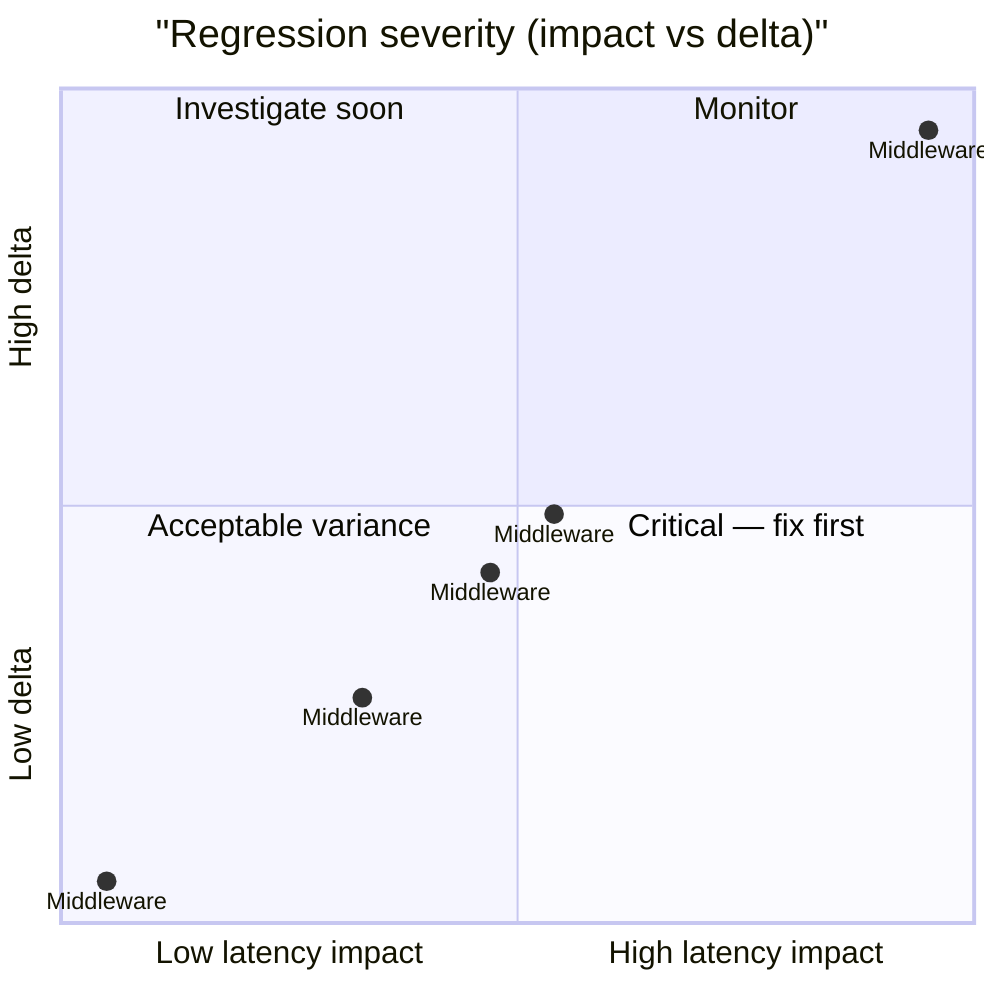

# 🚀 SQLite Performance Ledger

> [!NOTE] Competitive comparisons based on publicly available documentation as of June 2026. All SveltyCMS metrics self-measured via `bun test tests/benchmarks/`.

> [!IMPORTANT]
> **Console-only by default.** Use `BENCHMARK_RECORD=1` to write results to this report.
>
> ```bash
> BENCHMARK_RECORD=1 bun test tests/benchmarks/auth-performance.test.ts
> ```
>
> The full matrix runner (`bun run scripts/benchmark-matrix/index.ts --sql`) always records.

<!-- BENCHMARK_START -->

<!-- EXECUTIVE_START -->
<!-- LATEST_AUDIT_HEADER -->

## 📊 Latest Performance Audit

<!-- EXECUTIVE_FIX_NOTES_START -->

### 📝 Fix Overlays

> [!NOTE]
> Phase notes and remediation entries appear here after matrix or surgical runs.

<!-- EXECUTIVE_FIX_NOTES_END -->

> [!NOTE]
> **Partial update** — dimension rollups and issues reflect only tests invoked in this run.

**✅ PASS** _(partial invocation)_ · 1/58 tests · 57 skipped · **sqlite** · standalone run

### Dimension health

| Dimension      | Tests | Status | Worst Δ | Issues |
| -------------- | ----: | ------ | ------- | ------ |
| **Core**       |     5 | 🟢     | +1109%  | 0      |
| **API**        |     0 | ⚪     | —       | 0      |
| **Scale**      |     0 | ⚪     | —       | 0      |
| **Resilience** |     0 | ⚪     | —       | 0      |

### Issues (action required)

> ✅ **All clear** — no regressions or budget violations detected.

### Executive latency matrix

| Scenario       | Latency | Trend                                         | Budget | Result |
| -------------- | ------- | --------------------------------------------- | ------ | ------ |
| **Middleware** | 0.064ms | 🟢 faster: 0.148ms → 0.064ms (-57%) (5 runs)  | < 5ms  | 🟢     |
| **Middleware** | 0.592ms | 🔴 slower: 0.148ms → 0.592ms (+300%) (5 runs) | < 5ms  | 🟢     |
| **Middleware** | 0.960ms | 🔴 slower: 0.148ms → 0.960ms (+549%) (5 runs) | < 5ms  | 🟢     |
| **Middleware** | 0.833ms | 🔴 slower: 0.148ms → 0.833ms (+463%) (5 runs) | < 5ms  | 🟢     |
| **Middleware** | 1.790ms | 🔴 slower: 0.148ms → 1.79ms (+1109%) (5 runs) | < 5ms  | 🟢     |

### Historical pulse

> **Scope:** Sparklines only — full run tables: [`tests/benchmarks/results/history.sqlite`](../../../tests/benchmarks/results/history.sqlite)

| Metric                      | Trend | Sparkline | Latest  |
| --------------------------- | ----- | --------- | ------- |
| api latency (warm)          | 🟢    | `█▆▁`     | 2.131ms |
| auth performance (warm)     | 🟢    | `█▁█`     | 0.666ms |
| database performance (warm) | 🟢    | `█▂▁▃▄▄▁` | 0.096ms |

<details>
<summary>📈 Latency trend chart (last 10 runs)</summary>

```mermaid
xychart-beta
  title "sqlite REST p95 (last 10 runs)"
  x-axis ["R1", "R2", "R3", "R4", "R5", "R6", "R7", "R8", "R9", "R10"]
  y-axis "Latency (ms)"
  line "p95" : [0.000, 0.000, 0.000, 0.000, 0.000, 0.000, 0.000, 0.000, 0.000, 0.000]
```

</details>
<details>
<summary>📊 Regression severity matrix (quadrant)</summary>



</details>

<!-- EXECUTIVE_PARTIAL_WATERMARK -->

<!-- EXECUTIVE_ALERTS_START -->
<!-- EXECUTIVE_ALERTS_END -->

<!-- EXECUTIVE_END -->

<!-- SUMMARY_START -->

<!-- SUMMARY_RUN_OVERLAY_START -->

### Current Run Summary (2026-07-04)

> **Scope:** Only tests that ran in THIS invocation.

> ⚠️ Executive PASS/FAIL reflects the last full matrix run.

**Run ID:** `d5874eae-758f-4288-9b53-531eb10bc686` · **Tests invoked:** 1 · **Metrics:** 5 · **DB:** sqlite

| Test              | Metric                        | Avg (ms) | p95 (ms) | RPS   | Trend | Detail                                        |
| ----------------- | ----------------------------- | -------- | -------- | ----- | ----- | --------------------------------------------- |
| Hooks Performance | Static Asset (No Middleware)  | 0.064    | 0.094    | 14151 | ⚪    | 🟢 faster: 0.148ms → 0.064ms (-57%) (5 runs)  |
| Hooks Performance | Turbo Pipeline (Light)        | 0.592    | 0.808    | 1564  | ⚪    | 🔴 slower: 0.148ms → 0.592ms (+300%) (5 runs) |
| Hooks Performance | Full Security + Auth Pipeline | 0.960    | 1.232    | 945   | ⚪    | 🔴 slower: 0.148ms → 0.960ms (+549%) (5 runs) |
| Hooks Performance | REST with API Caching         | 0.833    | 1.074    | 1133  | ⚪    | 🔴 slower: 0.148ms → 0.833ms (+463%) (5 runs) |
| Hooks Performance | Mutation + Audit Logging      | 1.790    | 1.930    | 526   | ⚪    | 🔴 slower: 0.148ms → 1.79ms (+1109%) (5 runs) |

<!-- SUMMARY_RUN_OVERLAY_END -->

<!-- SUMMARY_HISTORY_START -->

### Historical Trends (2026-07-04)

> **Scope:** Sparklines only — full run tables live in `history.sqlite` (link below).

**Detail:** [`tests/benchmarks/results/history.sqlite`](../../../tests/benchmarks/results/history.sqlite) · `SELECT test_id, phase, avg_ms, p95_ms, rps, timestamp FROM runs WHERE db_type='sqlite' AND redis=0 ORDER BY timestamp DESC`

**Series:** 36 · **DB:** sqlite

| Metric                            | Trend | Sparkline (last 12) | Latest    | Runs |
| --------------------------------- | ----- | ------------------- | --------- | ---- |
| ADMIN UX VITALITY (warm)          | 🟢    | `▁`                 | 1.307ms   | 1    |
| AI PERFORMANCE (warm)             | 🟢    | `▁▁█`               | 0.001ms   | 3    |
| AUTH PERFORMANCE (warm)           | 🟢    | `█▁█`               | 0.666ms   | 3    |
| BUILD ANALYSIS (warm)             | 🟢    | `▁▁▁`               | 0.000ms   | 3    |
| CACHE PERFORMANCE (warm)          | 🟢    | `▁▁▄█▁`             | 0.651ms   | 5    |
| CLIENT JOURNEY (warm)             | 🟢    | `▁`                 | 8.005ms   | 1    |
| CONTENT INCREMENTAL RELOAD (warm) | 🟢    | `▂█▁`               | 0.314ms   | 3    |
| CONTENT SCALE STRESS (warm)       | 🟢    | `█▁▁`               | 0.042ms   | 3    |
| CONTENT SCAN (warm)               | 🟢    | `▁█▄`               | 0.013ms   | 3    |
| DATABASE PERFORMANCE (warm)       | 🟢    | `█▂▁▃▄▄▁`           | 0.096ms   | 7    |
| ENTRY EDIT HYDRATION (warm)       | 🟢    | `▁█▆`               | 0.053ms   | 3    |
| FAILURE PROPAGATION (warm)        | 🟢    | `█▁▆`               | 0.964ms   | 3    |
| GRAPHQL API PERFORMANCE (warm)    | 🟢    | `▂█▁`               | 0.910ms   | 3    |
| GRAPHQL STRESS (warm)             | 🟢    | `▂█▁`               | 1.823ms   | 3    |
| INDEX PRESSURE (warm)             | 🟢    | `▁`                 | 2.333ms   | 1    |
| LARGE PAYLOAD STREAMING (warm)    | 🟢    | `▁`                 | 1.092ms   | 1    |
| MEDIA PERFORMANCE (warm)          | 🟢    | `▁`                 | 3.325ms   | 1    |
| MEDIA UPLOAD STRESS (warm)        | 🟢    | `▁`                 | 1.204ms   | 1    |
| MIGRATION SCALE (warm)            | 🟢    | `▁█▁`               | 28.714ms  | 3    |
| MIXED WORKLOAD (warm)             | 🟢    | `▁`                 | 2.456ms   | 1    |
| REALTIME PERFORMANCE (warm)       | 🟢    | `█▁▁`               | 0.001ms   | 3    |
| RELATIONAL PERFORMANCE (warm)     | 🟢    | `█▃▁`               | 1.925ms   | 3    |
| REVISION STRESS (warm)            | 🟢    | `▁`                 | 1.314ms   | 1    |
| SECURITY AUDIT (warm)             | 🟢    | `▁▁▁`               | 0.003ms   | 3    |
| TELEMETRY PERFORMANCE (warm)      | 🟢    | `▁▁▁`               | 0.000ms   | 3    |
| TRANSACTION ACID (warm)           | 🟢    | `▂▂▂▁▃█▁`           | 0.316ms   | 7    |
| WIDGET PERFORMANCE (warm)         | 🟢    | `▃█▁`               | 0.047ms   | 3    |
| API LATENCY (warm)                | ⚪    | `█▆▁`               | 2.131ms   | 3    |
| CHAOS RESILIENCE (warm)           | ⚪    | `▇█▁`               | 168.187ms | 3    |
| CONCURRENCY MAX (warm)            | ⚪    | `▇█▁`               | 0.497ms   | 3    |
| HOOKS PERFORMANCE (warm)          | ⚪    | `█▆▄▄▇▁`            | 0.064ms   | 6    |
| MULTI TENANT PERFORMANCE (warm)   | ⚪    | `█▅▁`               | 1.785ms   | 3    |
| OPENAPI PERFORMANCE (warm)        | ⚪    | `█▅▁`               | 1.236ms   | 3    |
| REST API PERFORMANCE (warm)       | ⚪    | `▃▁█`               | 3.345ms   | 3    |
| SEO PERFORMANCE (warm)            | ⚪    | `█▇▁`               | 1.157ms   | 3    |
| TRUTH LATENCY (warm)              | ⚪    | `████▁`             | 0.000ms   | 5    |

<!-- SUMMARY_HISTORY_END --><!-- SUMMARY_END -->

<!-- LEDGER_START -->

## 🔬 Full benchmark ledger (58 modules)

Expand dimension groups, then any row, for ASCII truth tables. Executive summary above shows pass/fail and issues only.

<!-- LEDGER_DIMENSION:CORE:START -->

<details id="ledger-dimension-core">
<summary><strong>Core</strong> · 26 tests</summary>

<!-- SECTION:API_LATENCY:START -->

<details id="section-api_latency">
<summary><strong>🏷️ API LAYER LATENCY</strong> · 🟢 2.131ms · ➡️ recorded (awaiting trend) · <a href="../../../tests/benchmarks/api-latency.test.ts">source</a></summary>

<!-- LEDGER_TRUTH_START -->

```text
╔═════════════════════════════════════════════════════════════════════════════════════════╗
║                             SVELTYCMS  —  API LAYER LATENCY                             ║
║                       File: tests/benchmarks/api-latency.test.ts                        ║
║                                Ran: 2026-07-04 06:43:59                                 ║
║                      API Latency Benchmark (Production Optimized)                       ║
╠═════════════════════════════════════════════════════════════════════════════════════════╣
║ HTTP: findById @ 8c            │        2.131 ms │ p95:        3.201 ms │ RPS:        450 ║
╚═════════════════════════════════════════════════════════════════════════════════════════╝
```

<!-- LEDGER_TRUTH_END -->

</details>
<!-- SECTION:API_LATENCY:END -->

<!-- SECTION:COLD_START:START -->

<details id="section-cold_start">
<summary><strong>🏷️ PHASED COLD START</strong> · ⏳ pending · ➡️ baseline · <a href="../../../tests/benchmarks/cold-start-phased.test.ts">source</a></summary>

<!-- LEDGER_TRUTH_START -->

> ⏳ Pending — Measures the time to READY state (serving traffic) vs WARMED state (background tasks).

<!-- LEDGER_TRUTH_END -->

</details>
<!-- SECTION:COLD_START:END -->

<!-- SECTION:TRUTH_AUDIT:START -->

<details id="section-truth_audit">
<summary><strong>🏷️ SRE TRUTH AUDIT</strong> · ⚪ ⏳ pending · ➡️ pending · <a href="../../../tests/benchmarks/truth-latency.test.ts">source</a></summary>

<!-- LEDGER_TRUTH_START -->

```text
╔═════════════════════════════════════════════════════════════════════════════════════════╗
║                               SVELTYCMS — SRE TRUTH AUDIT                               ║
║                      File: tests/benchmarks/truth-latency.test.ts                       ║
║                                Ran: 2026-07-04 09:59:37                                 ║
║     Validates performance claims by comparing SDK, Middleware, and Real HTTP Stack      ║
╠═════════════════════════════════════════════════════════════════════════════════════════╣
║ Logic Baseline                 │        0.000 ms │ p95:        0.001 ms │ RPS:  2,027,027 ║
║ Local SDK (Full)               │        0.007 ms │ p95:        0.011 ms │ RPS:    142,606 ║
║ HTTP End-to-End                │        0.865 ms │ p95:        1.809 ms │ RPS:      1,155 ║
╚═════════════════════════════════════════════════════════════════════════════════════════╝
```

<!-- LEDGER_TRUTH_END -->

</details>
<!-- SECTION:TRUTH_AUDIT:END -->

<!-- SECTION:SCAN:START -->

<details id="section-scan">
<summary><strong>🏷️ Self-Healing Content Scan</strong> · 🟢 0.013ms · ➡️ recorded (awaiting trend) · <a href="../../../tests/benchmarks/content-scan.test.ts">source</a></summary>

<!-- LEDGER_TRUTH_START -->

```text
╔═════════════════════════════════════════════════════════════════════════════════════════╗
║                             SVELTYCMS — CONTENT SCAN AUDIT                              ║
║                       File: tests/benchmarks/content-scan.test.ts                       ║
║                                Ran: 2026-07-04 06:46:57                                 ║
║    Measures filesystem + metadata processing for self-healing collections discovery     ║
╠═════════════════════════════════════════════════════════════════════════════════════════╣
║ Content Scan (Self-Healing)    │        0.013 ms │ p95:        0.018 ms │ RPS:     72,515 ║
╚═════════════════════════════════════════════════════════════════════════════════════════╝
```

<!-- LEDGER_TRUTH_END -->

</details>
<!-- SECTION:SCAN:END -->

<!-- SECTION:INCREMENTAL:START -->

<details id="section-incremental">
<summary><strong>🏷️ Incremental Content Reload</strong> · 🟢 0.314ms · ➡️ recorded (awaiting trend) · <a href="../../../tests/benchmarks/content-incremental-reload.test.ts">source</a></summary>

<!-- LEDGER_TRUTH_START -->

```text
╔═════════════════════════════════════════════════════════════════════════════════════════╗
║                      SVELTYCMS — INCREMENTAL CONTENT RELOAD AUDIT                       ║
║                File: tests/benchmarks/content-incremental-reload.test.ts                ║
║                                Ran: 2026-07-04 06:47:03                                 ║
║          Measures surgical single-file fullReload vs full reconciliation path           ║
╠═════════════════════════════════════════════════════════════════════════════════════════╣
║ Incremental fullReload (1 file) │        0.314 ms │ p95:        0.654 ms │ RPS:      3,181 ║
║ Full Reconciliation Reload     │       21.102 ms │ p95:       24.297 ms │ RPS:         47 ║
╚═════════════════════════════════════════════════════════════════════════════════════════╝
```

<!-- LEDGER_TRUTH_END -->

</details>
<!-- SECTION:INCREMENTAL:END -->

<!-- SECTION:HOOKS_TRACE:START -->

<details id="section-hooks_trace">
<summary><strong>🏷️ Middleware & Hooks Performance</strong> · 🟢 0.064ms · ➡️ recorded (awaiting trend) · <a href="../../../tests/benchmarks/hooks-performance.test.ts">source</a></summary>

<!-- LEDGER_TRUTH_START -->

```text
╔═════════════════════════════════════════════════════════════════════════════════════════╗
║                          SVELTYCMS — MIDDLEWARE & HOOKS AUDIT                           ║
║                    File: tests/benchmarks/hooks-performance.test.ts                     ║
║                                Ran: 2026-07-04 10:02:22                                 ║
║Measures the cost of the full middleware chain including Turbo, Security, Auth, and Audit via HTTP E2E.║
╠═════════════════════════════════════════════════════════════════════════════════════════╣
║ Static Asset (No Middleware)   │        0.064 ms │ p95:        0.094 ms │ RPS:     14,151 ║
║ Turbo Pipeline (Light)         │        0.592 ms │ p95:        0.808 ms │ RPS:      1,564 ║
║ Full Security + Auth Pipeline  │        0.960 ms │ p95:        1.232 ms │ RPS:        945 ║
║ REST with API Caching          │        0.833 ms │ p95:        1.074 ms │ RPS:      1,133 ║
║ Mutation + Audit Logging       │        1.790 ms │ p95:        1.930 ms │ RPS:        526 ║
╚═════════════════════════════════════════════════════════════════════════════════════════╝
```

<!-- LEDGER_TRUTH_END -->

</details>
<!-- SECTION:HOOKS_TRACE:END -->

<!-- SECTION:EDGE_SYNC:START -->

<details id="section-edge_sync">
<summary><strong>🏷️ Edge Sync & Distributed Cache</strong> · ⏳ pending · ➡️ baseline · <a href="../../../tests/benchmarks/edge-sync.test.ts">source</a></summary>

<!-- LEDGER_TRUTH_START -->

> ⏳ Pending — Verifies distributed L1/L2 cache invalidation latency across simulated nodes.

<!-- LEDGER_TRUTH_END -->

</details>
<!-- SECTION:EDGE_SYNC:END -->

<!-- SECTION:TELEMETRY:START -->

<details id="section-telemetry">
<summary><strong>🏷️ Telemetry Collection & Signing</strong> · ⚪ ⏳ pending · ➡️ pending · <a href="../../../tests/benchmarks/telemetry-performance.test.ts">source</a></summary>

<!-- LEDGER_TRUTH_START -->

```text
╔═════════════════════════════════════════════════════════════════════════════════════════╗
║                       SVELTYCMS — TELEMETRY & UPDATE PERFORMANCE                        ║
║                  File: tests/benchmarks/telemetry-performance.test.ts                   ║
║                                Ran: 2026-07-04 06:45:51                                 ║
║Measures telemetry update check latency and memory impact on both happy-path and failure-path scenarios.║
╠═════════════════════════════════════════════════════════════════════════════════════════╣
║ Telemetry (Happy Path)         │        0.000 ms │ p95:        0.001 ms │ RPS:  1,351,960 ║
║ Telemetry (Failure Path)       │        0.001 ms │ p95:        0.003 ms │ RPS:  1,036,807 ║
╚═════════════════════════════════════════════════════════════════════════════════════════╝
```

<!-- LEDGER_TRUTH_END -->

</details>
<!-- SECTION:TELEMETRY:END -->

<!-- SECTION:STATE_MACHINE:START -->

<details id="section-state_machine">
<summary><strong>🏷️ State Machine Transitions</strong> · 🟢 33.048ms · ➡️ recorded (awaiting trend) · <a href="../../../tests/benchmarks/state-machine-transition.test.ts">source</a></summary>

<!-- LEDGER_TRUTH_START -->

```text
╔═════════════════════════════════════════════════════════════════════════════════════════╗
║                           SVELTYCMS — STATE MACHINE INTEGRITY                           ║
║                 File: tests/benchmarks/state-machine-transition.test.ts                 ║
║                                Ran: 2026-07-04 06:47:07                                 ║
║Simulates rapid system re-initializations and verifies valid self-healing state transitions under stress.║
╠═════════════════════════════════════════════════════════════════════════════════════════╣
║ State Transition (READY -> IDLE -> READY) │       33.048 ms │ p95:       46.266 ms │ RPS:         30 ║
╚═════════════════════════════════════════════════════════════════════════════════════════╝
```

<!-- LEDGER_TRUTH_END -->

</details>
<!-- SECTION:STATE_MACHINE:END -->

<!-- SECTION:DB_RAW_P95:START -->

<details id="section-db_raw_p95">
<summary><strong>🏷️ Database Adapter Raw CRUD</strong> · 🟢 0.096ms · ➡️ recorded (awaiting trend) · <a href="../../../tests/benchmarks/database-performance.test.ts">source</a></summary>

<!-- LEDGER_TRUTH_START -->

```text
╔═════════════════════════════════════════════════════════════════════════════════════════╗
║                    SVELTYCMS — DATABASE ADAPTER PERFORMANCE (SQLITE)                    ║
║                   File: tests/benchmarks/database-performance.test.ts                   ║
║                                Ran: 2026-07-04 10:00:43                                 ║
║   Measures raw CRUD performance, indexing efficiency, and connection pool resilience    ║
╠═════════════════════════════════════════════════════════════════════════════════════════╣
║ INSERT                         │        0.096 ms │ p95:        0.155 ms │ RPS:      6,680 ║
║ FIND ONE                       │        0.074 ms │ p95:        0.086 ms │ RPS:     12,386 ║
║ FIND MANY (limit 50)           │        0.100 ms │ p95:        0.117 ms │ RPS:      9,351 ║
║ UPDATE                         │        0.098 ms │ p95:        0.124 ms │ RPS:      8,566 ║
║ NATIVE UPSERT                  │        0.068 ms │ p95:        0.080 ms │ RPS:     11,268 ║
║ COUNT                          │        0.150 ms │ p95:        0.183 ms │ RPS:      6,495 ║
║ DELETE                         │        0.039 ms │ p95:        0.050 ms │ RPS:     19,828 ║
║ BULK INSERT (100)              │        1.402 ms │ p95:        2.273 ms │ RPS:        450 ║
╚═════════════════════════════════════════════════════════════════════════════════════════╝
```

<!-- LEDGER_TRUTH_END -->

</details>
<!-- SECTION:DB_RAW_P95:END -->

<!-- SECTION:ACID:START -->

<details id="section-acid">
<summary><strong>🏷️ ACID Transaction Overhead</strong> · 🟢 0.316ms · ➡️ recorded (awaiting trend) · <a href="../../../tests/benchmarks/transaction-acid.test.ts">source</a></summary>

<!-- LEDGER_TRUTH_START -->

```text
╔═════════════════════════════════════════════════════════════════════════════════════════╗
║                            SVELTYCMS — ACID INTEGRITY AUDIT                             ║
║                     File: tests/benchmarks/transaction-acid.test.ts                     ║
║                                Ran: 2026-07-04 10:01:28                                 ║
║  Measures transaction commit latencies and rollback overhead across database adapters   ║
╠═════════════════════════════════════════════════════════════════════════════════════════╣
║ TX Commit                      │        0.316 ms │ p95:        0.680 ms │ RPS:      2,061 ║
║ TX Rollback Integrity          │        0.296 ms │ p95:        0.311 ms │ RPS:      3,382 ║
╚═════════════════════════════════════════════════════════════════════════════════════════╝
```

<!-- LEDGER_TRUTH_END -->

</details>
<!-- SECTION:ACID:END -->

<!-- SECTION:CACHE:START -->
<details id="section-cache">
<summary><strong>🏷️ Cache</strong> · 🟢 0.651ms · ↘️ ⚪ stable at 0.715ms (±0.460ms) (4 runs) (2026-07-04 10:01:36) · <a href="../../../tests/benchmarks/cache-performance.test.ts">source</a></summary>
<!-- LEDGER_INSIGHT_START -->
> [!NOTE]
> **Specific to this test**: Performance improved — recent optimizations or cache warming likely effective.
<!-- LEDGER_INSIGHT_END -->

<!-- LEDGER_TRUTH_START -->

```text
╔═════════════════════════════════════════════════════════════════════════════════════════╗
║                           SVELTYCMS — CACHE EFFICIENCY AUDIT                            ║
║                    File: tests/benchmarks/cache-performance.test.ts                     ║
║                                Ran: 2026-07-04 10:01:36                                 ║
║  Measures cache hit vs miss latency and efficiency via real HTTP end-to-end requests.   ║
╠═════════════════════════════════════════════════════════════════════════════════════════╣
║ Cache Miss (Bypass)            │        0.651 ms │ p95:        0.874 ms │ RPS:      1,402 ║
╚═════════════════════════════════════════════════════════════════════════════════════════╝
```

<!-- LEDGER_TRUTH_END -->

</details>
<!-- SECTION:CACHE:END -->

<!-- SECTION:CACHE_EFFICIENCY:START -->

<details id="section-cache_efficiency">
<summary><strong>🏷️ Cache Hit/Miss Ratio & Efficiency</strong> · ⏳ pending · ➡️ baseline · <a href="../../../tests/benchmarks/cache-hit-ratio.test.ts">source</a></summary>

<!-- LEDGER_TRUTH_START -->

> ⏳ Pending — Measures Redis cache hit/miss ratio, cold vs warm read speedup, and invalidation performance.

<!-- LEDGER_TRUTH_END -->

</details>
<!-- SECTION:CACHE_EFFICIENCY:END -->

<!-- SECTION:BUILD:START -->

<details id="section-build">
<summary><strong>🏷️ Production Build Analysis</strong> · ⚪ ⏳ pending · ➡️ pending · <a href="../../../tests/benchmarks/build-analysis.test.ts">source</a></summary>

<!-- LEDGER_TRUTH_START -->

```text
╔═════════════════════════════════════════════════════════════════════════════════════════╗
║                          SVELTYCMS — PRODUCTION BUILD ANALYSIS                          ║
║                      File: tests/benchmarks/build-analysis.test.ts                      ║
║                                Ran: 2026-07-04 06:47:34                                 ║
║       Measures compilation speed, bundle size trends, and tree-shaking efficiency       ║
╠═════════════════════════════════════════════════════════════════════════════════════════╣
║ Production Build               │        0.000 ms │ p95:        0.000 ms │ RPS:          0 ║
╚═════════════════════════════════════════════════════════════════════════════════════════╝
```

<!-- LEDGER_TRUTH_END -->

</details>
<!-- SECTION:BUILD:END -->

<!-- SECTION:DX_TOOLING:START -->

<details id="section-dx_tooling">
<summary><strong>🏷️ DX Toolchain Performance</strong> · ⏳ pending · ➡️ baseline · <a href="../../../tests/benchmarks/dev-dependency-load.test.ts">source</a></summary>

<!-- LEDGER_TRUTH_START -->

> ⏳ Pending — Measures overhead of the build, sync, and lint toolchain.

<!-- LEDGER_TRUTH_END -->

</details>
<!-- SECTION:DX_TOOLING:END -->

<!-- SECTION:CACHE_SVC:START -->

<details id="section-cache_svc">
<summary><strong>🏷️ CacheService Micro-Benchmark</strong> · ⏳ pending · ➡️ baseline · <a href="../../../tests/benchmarks/cache-service.test.ts">source</a></summary>

<!-- LEDGER_TRUTH_START -->

> ⏳ Pending — CacheService L1 hit latency and pattern invalidation under noise.

<!-- LEDGER_TRUTH_END -->

</details>
<!-- SECTION:CACHE_SVC:END -->

<!-- SECTION:LOCAL_API:START -->

<details id="section-local_api">
<summary><strong>🏷️ LocalCMS SDK Overhead</strong> · 🟢 0.047ms · ➡️ recorded (awaiting trend) · <a href="../../../tests/benchmarks/local-api-performance.test.ts">source</a></summary>

<!-- LEDGER_TRUTH_START -->

```text
╔═════════════════════════════════════════════════════════════════════════════════════════╗
║                        SVELTYCMS — LOCAL SDK BENCHMARK (SQLITE)                         ║
║                   File: tests/benchmarks/local-api-throughput.test.ts                   ║
║                                Ran: 2026-07-04 06:46:23                                 ║
║        Measures write throughput, read throughput, and SDK overhead in one pass.        ║
╠═════════════════════════════════════════════════════════════════════════════════════════╣
║ Writes (1000)                  │        0.047 ms │ p95:        0.000 ms │ RPS:     21,415 ║
║ Reads (1000)                   │        0.112 ms │ p95:        0.000 ms │ RPS:      8,924 ║
╚═════════════════════════════════════════════════════════════════════════════════════════╝
```

<!-- LEDGER_TRUTH_END -->

</details>
<!-- SECTION:LOCAL_API:END -->

<!-- SECTION:SETUP_PROXY:START -->

<details id="section-setup_proxy">
<summary><strong>🏷️ Setup Proxy & Bootstrap Isolation</strong> · ⏳ pending · ➡️ baseline · <a href="../../../tests/benchmarks/setup-proxy.test.ts">source</a></summary>

<!-- LEDGER_TRUTH_START -->

> ⏳ Pending — Setup proxy isolation and bootstrap security gating.

<!-- LEDGER_TRUTH_END -->

</details>
<!-- SECTION:SETUP_PROXY:END -->

<!-- SECTION:HTTP:START -->
<details id="section-http">
<summary><strong>🏷️ HTTP</strong> · ⚪ 0.865ms · ↗️ 🔴 slower: 0.001ms → 0.865ms (+86400%) (4 runs) (2026-07-04 09:59:48) · <a href="../../../tests/benchmarks/truth-latency.test.ts">source</a></summary>
<!-- LEDGER_INSIGHT_START -->
> [!NOTE]
> **Specific to this test**: Both avg and p95 degraded — likely adapter or infrastructure bottleneck. Check DB connection pool, indexes, or recent commits.  
Throughput dropped 100% — check connection pool saturation or lock contention.  
**Severe degradation** (+86400%) — review recent commits immediately.
<!-- LEDGER_INSIGHT_END -->

<!-- LEDGER_TRUTH_START -->

> ⏳ Pending

<!-- LEDGER_TRUTH_END -->

</details>
<!-- SECTION:HTTP:END -->

<!-- SECTION:LOGIC:START -->
<details id="section-logic">
<summary><strong>🏷️ Logic</strong> · ⚪ ⏳ pending · ↘️ ⚪ stable at 0.001ms (4 runs) (2026-07-04 09:59:48) · <a href="../../../tests/benchmarks/truth-latency.test.ts">source</a></summary>
<!-- LEDGER_INSIGHT_START -->
> [!NOTE]
> **Specific to this test**: Performance improved — recent optimizations or cache warming likely effective.
<!-- LEDGER_INSIGHT_END -->

<!-- LEDGER_TRUTH_START -->

> ⏳ Pending

<!-- LEDGER_TRUTH_END -->

</details>
<!-- SECTION:LOGIC:END -->

<!-- SECTION:SDK:START -->
<details id="section-sdk">
<summary><strong>🏷️ SDK</strong> · ⚪ 0.007ms · ↗️ ⚪ stable at 0.001ms (4 runs) (2026-07-04 09:59:48) · <a href="../../../tests/benchmarks/truth-latency.test.ts">source</a></summary>
<!-- LEDGER_INSIGHT_START -->
> [!NOTE]
> **Specific to this test**: Both avg and p95 degraded — likely adapter or infrastructure bottleneck. Check DB connection pool, indexes, or recent commits.  
Throughput dropped 90% — check connection pool saturation or lock contention.  
**Severe degradation** (+600%) — review recent commits immediately.
<!-- LEDGER_INSIGHT_END -->

<!-- LEDGER_TRUTH_START -->

> ⏳ Pending

<!-- LEDGER_TRUTH_END -->

</details>
<!-- SECTION:SDK:END -->

<!-- SECTION:UNKNOWN:START -->
<details id="section-unknown">
<summary><strong>🏷️ unknown</strong> · 🟢 0.296ms · ↘️ ⚪ stable at 0.385ms (±0.081ms) (6 runs) (2026-07-04 10:01:28) · <a href="../../../tests/benchmarks/transaction-acid.test.ts">source</a></summary>
<!-- LEDGER_INSIGHT_START -->
> [!NOTE]
> **Specific to this test**: Performance improved — recent optimizations or cache warming likely effective.
<!-- LEDGER_INSIGHT_END -->

<!-- LEDGER_TRUTH_START -->

> ⏳ Pending

<!-- LEDGER_TRUTH_END -->

</details>
<!-- SECTION:UNKNOWN:END -->

<!-- SECTION:MIDDLEWARE:START -->
<details id="section-middleware">
<summary><strong>🏷️ Middleware</strong> · ⚪ 1.790ms · ↗️ 🔴 slower: 0.148ms → 1.79ms (+1109%) (5 runs) (2026-07-04 10:02:22) · <a href="../../../tests/benchmarks/hooks-performance.test.ts">source</a></summary>
<!-- LEDGER_INSIGHT_START -->
> [!NOTE]
> **Specific to this test**: Both avg and p95 degraded — likely adapter or infrastructure bottleneck. Check DB connection pool, indexes, or recent commits.  
Throughput dropped 93% — check connection pool saturation or lock contention.  
**Severe degradation** (+1109%) — review recent commits immediately.
<!-- LEDGER_INSIGHT_END -->

<!-- LEDGER_TRUTH_START -->

> ⏳ Pending

<!-- LEDGER_TRUTH_END -->

</details>
<!-- SECTION:MIDDLEWARE:END -->

<!-- SECTION:SYSTEM:START -->
<details id="section-system">
<summary><strong>🏷️ System</strong> · ⚪ 3.345ms · ↗️ 🔴 slower: 2.33ms → 3.35ms (+43%) (2 runs) (2026-07-04 08:06:59) · <a href="../../../tests/benchmarks/rest-api-performance.test.ts">source</a></summary>
<!-- LEDGER_INSIGHT_START -->
> [!NOTE]
> **Specific to this test**: Both avg and p95 degraded — likely adapter or infrastructure bottleneck. Check DB connection pool, indexes, or recent commits.  
Throughput dropped 31% — check connection pool saturation or lock contention.  
**Severe degradation** (+43%) — review recent commits immediately.
<!-- LEDGER_INSIGHT_END -->

<!-- LEDGER_TRUTH_START -->

> ⏳ Pending

<!-- LEDGER_TRUTH_END -->

</details>
<!-- SECTION:SYSTEM:END -->

<!-- SECTION:METADATA:START -->
<details id="section-metadata">
<summary><strong>🏷️ Metadata</strong> · ⚪ 4.152ms · ↗️ 🔴 slower: 2.33ms → 4.15ms (+78%) (2 runs) (2026-07-04 08:06:59) · <a href="../../../tests/benchmarks/rest-api-performance.test.ts">source</a></summary>
<!-- LEDGER_INSIGHT_START -->
> [!NOTE]
> **Specific to this test**: Both avg and p95 degraded — likely adapter or infrastructure bottleneck. Check DB connection pool, indexes, or recent commits.  
Throughput dropped 44% — check connection pool saturation or lock contention.  
**Severe degradation** (+78%) — review recent commits immediately.
<!-- LEDGER_INSIGHT_END -->

<!-- LEDGER_TRUTH_START -->

> ⏳ Pending

<!-- LEDGER_TRUTH_END -->

</details>
<!-- SECTION:METADATA:END -->

<!-- SECTION:CRUD:START -->
<details id="section-crud">
<summary><strong>🏷️ CRUD</strong> · ⚪ 6.229ms · ↗️ 🔴 slower: 2.33ms → 6.23ms (+167%) (2 runs) (2026-07-04 08:06:59) · <a href="../../../tests/benchmarks/rest-api-performance.test.ts">source</a></summary>
<!-- LEDGER_INSIGHT_START -->
> [!NOTE]
> **Specific to this test**: Both avg and p95 degraded — likely adapter or infrastructure bottleneck. Check DB connection pool, indexes, or recent commits.  
Throughput dropped 63% — check connection pool saturation or lock contention.  
**Severe degradation** (+167%) — review recent commits immediately.
<!-- LEDGER_INSIGHT_END -->

<!-- LEDGER_TRUTH_START -->

> ⏳ Pending

<!-- LEDGER_TRUTH_END -->

</details>
<!-- SECTION:CRUD:END -->

</details>

<!-- LEDGER_DIMENSION:CORE:END -->

<!-- LEDGER_DIMENSION:API:START -->

<details id="ledger-dimension-api">
<summary><strong>API</strong> · 15 tests</summary>

<!-- SECTION:AI_OVERHEAD:START -->

<details id="section-ai_overhead">
<summary><strong>🏷️ AI Bus & Inference Overhead</strong> · 🟢 0.001ms · ➡️ recorded (awaiting trend) · <a href="../../../tests/benchmarks/ai-performance.test.ts">source</a></summary>

<!-- LEDGER_TRUTH_START -->

```text
╔═════════════════════════════════════════════════════════════════════════════════════════╗
║                           SVELTYCMS — AI INFRASTRUCTURE AUDIT                           ║
║                      File: tests/benchmarks/ai-performance.test.ts                      ║
║                                Ran: 2026-07-04 06:45:49                                 ║
║ Measures the latency tax of internal CMS logic for AI enrichment and layout generation. ║
╠═════════════════════════════════════════════════════════════════════════════════════════╣
║ AI Text Enrichment             │        0.001 ms │ p95:        0.002 ms │ RPS:  1,095,890 ║
║ AI Layout Spec Generation      │        0.000 ms │ p95:        0.001 ms │ RPS:  1,805,054 ║
╚═════════════════════════════════════════════════════════════════════════════════════════╝
```

<!-- LEDGER_TRUTH_END -->

</details>
<!-- SECTION:AI_OVERHEAD:END -->

<!-- SECTION:TEMPORAL:START -->

<details id="section-temporal">
<summary><strong>🏷️ Temporal Integrity Audit</strong> · 🟢 3.095ms · ➡️ recorded (awaiting trend) · <a href="../../../tests/benchmarks/temporal-integrity.test.ts">source</a></summary>

<!-- LEDGER_TRUTH_START -->

```text
╔═════════════════════════════════════════════════════════════════════════════════════════╗
║                             SVELTYCMS — TEMPORAL INTEGRITY                              ║
║                    File: tests/benchmarks/temporal-integrity.test.ts                    ║
║                                Ran: 2026-07-04 06:45:58                                 ║
║Validates deterministic UTC normalization of ISO date strings across timezone offsets for consistent persistence.║
╠═════════════════════════════════════════════════════════════════════════════════════════╣
║ Timezone Ingestion             │        3.095 ms │ p95:        3.095 ms │ RPS:        323 ║
╚═════════════════════════════════════════════════════════════════════════════════════════╝
```

<!-- LEDGER_TRUTH_END -->

</details>
<!-- SECTION:TEMPORAL:END -->

<!-- SECTION:WIDGETS:START -->

<details id="section-widgets">
<summary><strong>🏷️ Core Widgets Overhead</strong> · ⏳ pending · ➡️ baseline · <a href="../../../tests/benchmarks/widget-performance.test.ts">source</a></summary>

<!-- LEDGER_TRUTH_START -->

> ⏳ Pending — Audits server-side processing cost of built-in widgets (Input, RichText, Relation).

<!-- LEDGER_TRUTH_END -->

</details>
<!-- SECTION:WIDGETS:END -->

<!-- SECTION:UX_VITALITY:START -->

<details id="section-ux_vitality">
<summary><strong>🏷️ Simulated Admin UX Vitality</strong> · 🟢 1.307ms · ➡️ recorded (awaiting trend) · <a href="../../../tests/benchmarks/admin-ux-vitality.test.ts">source</a></summary>

<!-- LEDGER_TRUTH_START -->

```text
╔═════════════════════════════════════════════════════════════════════════════════════════╗
║                          SVELTYCMS  —  ADMIN UX VITALITY AUDIT                          ║
║                    File: tests/benchmarks/admin-ux-vitality.test.ts                     ║
║                                Ran: 2026-07-04 06:45:12                                 ║
║             Forms and widget registry performance via real HTTP endpoints.              ║
╠═════════════════════════════════════════════════════════════════════════════════════════╣
║ Schema Resolution (8f)         │        1.307 ms │ p95:        2.176 ms │ RPS:        694 ║
║ Collection List (11 cols)      │        1.237 ms │ p95:        1.818 ms │ RPS:        774 ║
╚═════════════════════════════════════════════════════════════════════════════════════════╝
```

<!-- LEDGER_TRUTH_END -->

</details>
<!-- SECTION:UX_VITALITY:END -->

<!-- SECTION:EDIT_HYDRATE:START -->

<details id="section-edit_hydrate">
<summary><strong>🏷️ Entry Edit Hydration</strong> · 🟢 0.053ms · ➡️ recorded (awaiting trend) · <a href="../../../tests/benchmarks/entry-edit-hydration.test.ts">source</a></summary>

<!-- LEDGER_TRUTH_START -->

```text
╔═════════════════════════════════════════════════════════════════════════════════════════╗
║                        SVELTYCMS  —  ENTRY EDIT HYDRATION AUDIT                         ║
║                   File: tests/benchmarks/entry-edit-hydration.test.ts                   ║
║                                Ran: 2026-07-04 06:45:35                                 ║
║Measures 50-field form mount (widget loader resolve + prefetch) and first-input sync latency.║
╠═════════════════════════════════════════════════════════════════════════════════════════╣
║ 50-Field Loader Resolve        │        0.053 ms │ p95:        0.069 ms │ RPS:     18,333 ║
║ Widget Prefetch (5 types)      │        0.015 ms │ p95:        0.019 ms │ RPS:     62,953 ║
║ First Input (field patch)      │        0.000 ms │ p95:        0.000 ms │ RPS:  9,022,014 ║
║ First Input (JSON.stringify)   │        0.005 ms │ p95:        0.006 ms │ RPS:    179,227 ║
╚═════════════════════════════════════════════════════════════════════════════════════════╝
```

<!-- LEDGER_TRUTH_END -->

</details>
<!-- SECTION:EDIT_HYDRATE:END -->

<!-- SECTION:MEDIA:START -->

<details id="section-media">
<summary><strong>🏷️ Media Engine & DAM Overhead</strong> · 🟢 3.325ms · ➡️ recorded (awaiting trend) · <a href="../../../tests/benchmarks/media-performance.test.ts">source</a></summary>

<!-- LEDGER_TRUTH_START -->

```text
╔═════════════════════════════════════════════════════════════════════════════════════════╗
║                            SVELTYCMS — MEDIA PIPELINE AUDIT                             ║
║                    File: tests/benchmarks/media-performance.test.ts                     ║
║                                Ran: 2026-07-04 06:47:10                                 ║
║           Measures full upload, processing, and storage pipeline via HTTP E2E           ║
╠═════════════════════════════════════════════════════════════════════════════════════════╣
║ SDK: Media Processing          │        3.325 ms │ p95:        5.972 ms │ RPS:        276 ║
║ HTTP: Media Upload             │        4.277 ms │ p95:        6.380 ms │ RPS:        204 ║
╚═════════════════════════════════════════════════════════════════════════════════════════╝
```

<!-- LEDGER_TRUTH_END -->

</details>
<!-- SECTION:MEDIA:END -->

<!-- SECTION:RELATIONAL:START -->

<details id="section-relational">
<summary><strong>🏷️ Relational & Nested Queries</strong> · 🟢 1.925ms · ➡️ recorded (awaiting trend) · <a href="../../../tests/benchmarks/relational-performance.test.ts">source</a></summary>

<!-- LEDGER_TRUTH_START -->

```text
╔═════════════════════════════════════════════════════════════════════════════════════════╗
║                          SVELTYCMS — RELATIONAL RESOLVER AUDIT                          ║
║                  File: tests/benchmarks/relational-performance.test.ts                  ║
║                                Ran: 2026-07-04 06:45:24                                 ║
║Measures GraphQL resolver performance for shallow and deep relational queries including joins and nested population.║
╠═════════════════════════════════════════════════════════════════════════════════════════╣
║ Shallow Relational Query       │        1.925 ms │ p95:        2.939 ms │ RPS:        493 ║
║ Deep Relational Query          │        1.560 ms │ p95:        2.228 ms │ RPS:        614 ║
╚═════════════════════════════════════════════════════════════════════════════════════════╝
```

<!-- LEDGER_TRUTH_END -->

</details>
<!-- SECTION:RELATIONAL:END -->

<!-- SECTION:OPENAPI:START -->

<details id="section-openapi">
<summary><strong>🏷️ OpenAPI Specification Performance</strong> · 🟢 1.562ms · ➡️ recorded (awaiting trend) · <a href="../../../tests/benchmarks/openapi-performance.test.ts">source</a></summary>

<!-- LEDGER_TRUTH_START -->

```text
╔═════════════════════════════════════════════════════════════════════════════════════════╗
║                        SVELTYCMS — OPENAPI SPEC GENERATION AUDIT                        ║
║                   File: tests/benchmarks/openapi-performance.test.ts                    ║
║                                Ran: 2026-07-04 06:45:20                                 ║
║Measures dynamic OpenAPI spec generation speed and cached documentation endpoint performance.║
╠═════════════════════════════════════════════════════════════════════════════════════════╣
║ Cold OpenAPI Generation        │        1.562 ms │ p95:        2.337 ms │ RPS:        640 ║
║ Warm OpenAPI Hit (Cached)      │        1.236 ms │ p95:        1.458 ms │ RPS:        750 ║
╚═════════════════════════════════════════════════════════════════════════════════════════╝
```

<!-- LEDGER_TRUTH_END -->

</details>
<!-- SECTION:OPENAPI:END -->

<!-- SECTION:AUTH_TRACE:START -->

<details id="section-auth_trace">
<summary><strong>🏷️ Auth & RBAC Performance</strong> · 🟢 0.666ms · ➡️ recorded (awaiting trend) · <a href="../../../tests/benchmarks/auth-performance.test.ts">source</a></summary>

<!-- LEDGER_TRUTH_START -->

```text
╔═════════════════════════════════════════════════════════════════════════════════════════╗
║                          SVELTYCMS — AUTHENTICATION TELEMETRY                           ║
║                     File: tests/benchmarks/auth-performance.test.ts                     ║
║                                Ran: 2026-07-04 06:44:02                                 ║
║             Authentication & RBAC Pipeline Benchmark (Production Optimized)             ║
╠═════════════════════════════════════════════════════════════════════════════════════════╣
║ Auth Validation @ 1c           │        0.666 ms │ p95:        0.816 ms │ RPS:      1,370 ║
║ HTTP Auth Pipeline @ 8c        │        2.307 ms │ p95:        3.746 ms │ RPS:        406 ║
╚═════════════════════════════════════════════════════════════════════════════════════════╝
```

<!-- LEDGER_TRUTH_END -->

</details>
<!-- SECTION:AUTH_TRACE:END -->

<!-- SECTION:SECURITY:START -->

<details id="section-security">
<summary><strong>🏷️ Security Hardening & Audit</strong> · 🟢 0.003ms · ➡️ recorded (awaiting trend) · <a href="../../../tests/benchmarks/security-audit.test.ts">source</a></summary>

<!-- LEDGER_TRUTH_START -->

```text
╔═════════════════════════════════════════════════════════════════════════════════════════╗
║                        SVELTYCMS — SECURITY INFRASTRUCTURE AUDIT                        ║
║                      File: tests/benchmarks/security-audit.test.ts                      ║
║                                Ran: 2026-07-04 06:46:46                                 ║
║Measures overhead of WAF request analysis, audit log persistence, Argon2id password hashing, and RBAC permission checks.║
╠═════════════════════════════════════════════════════════════════════════════════════════╣
║ WAF Deep Analysis              │        0.003 ms │ p95:        0.005 ms │ RPS:    226,867 ║
║ Audit Log Persistence          │        0.165 ms │ p95:        0.158 ms │ RPS:      6,077 ║
║ Argon2id Password Hashing      │       33.977 ms │ p95:      132.115 ms │ RPS:         29 ║
║ Dispatcher-Only Permission Check │        0.000 ms │ p95:        0.000 ms │ RPS:  7,696,452 ║
║ Full Defense-in-Depth Check    │        0.000 ms │ p95:        0.000 ms │ RPS:  7,344,840 ║
║ Admin Verification + Permission Check │        0.000 ms │ p95:        0.000 ms │ RPS:  9,170,106 ║
╚═════════════════════════════════════════════════════════════════════════════════════════╝
```

<!-- LEDGER_TRUTH_END -->

</details>
<!-- SECTION:SECURITY:END -->

<!-- SECTION:REST:START -->

<details id="section-rest">
<summary><strong>🏷️ REST API Performance</strong> · 🟢 3.345ms · ➡️ recorded (awaiting trend) · <a href="../../../tests/benchmarks/rest-api-performance.test.ts">source</a></summary>

<!-- LEDGER_TRUTH_START -->

```text
╔═════════════════════════════════════════════════════════════════════════════════════════╗
║                          SVELTYCMS — ENTERPRISE REST API AUDIT                          ║
║                   File: tests/benchmarks/rest-api-performance.test.ts                   ║
║                                Ran: 2026-07-04 08:06:59                                 ║
║Measures latency, throughput, and correctness of core REST endpoints: health check, schema, CRUD list, and search.║
╠═════════════════════════════════════════════════════════════════════════════════════════╣
║ Health Check                   │        3.345 ms │ p95:        7.298 ms │ RPS:        299 ║
║ Collection Schema              │        4.152 ms │ p95:        6.958 ms │ RPS:        241 ║
║ Collection Find (List)         │        6.480 ms │ p95:       10.868 ms │ RPS:        154 ║
║ Collection Search              │        6.229 ms │ p95:       10.457 ms │ RPS:        161 ║
╚═════════════════════════════════════════════════════════════════════════════════════════╝
```

<!-- LEDGER_TRUTH_END -->

</details>
<!-- SECTION:REST:END -->

<!-- SECTION:GRAPHQL:START -->

<details id="section-graphql">
<summary><strong>🏷️ GraphQL API Performance</strong> · 🟢 0.910ms · ➡️ recorded (awaiting trend) · <a href="../../../tests/benchmarks/graphql-api-performance.test.ts">source</a></summary>

<!-- LEDGER_TRUTH_START -->

```text
╔═════════════════════════════════════════════════════════════════════════════════════════╗
║                          SVELTYCMS — GRAPHQL PERFORMANCE AUDIT                          ║
║                 File: tests/benchmarks/graphql-api-performance.test.ts                  ║
║                                Ran: 2026-07-04 06:44:59                                 ║
║   Measures GraphQL resolver performance and throughput across varied query scenarios.   ║
╠═════════════════════════════════════════════════════════════════════════════════════════╣
║ GQL: System Health             │        0.910 ms │ p95:        1.728 ms │ RPS:      1,099 ║
║ GQL: Collection List           │        2.125 ms │ p95:        3.374 ms │ RPS:        471 ║
║ GQL: Concurrent Load           │        2.185 ms │ p95:        3.423 ms │ RPS:        458 ║
╚═════════════════════════════════════════════════════════════════════════════════════════╝
```

<!-- LEDGER_TRUTH_END -->

</details>
<!-- SECTION:GRAPHQL:END -->

<!-- SECTION:SEO:START -->

<details id="section-seo">
<summary><strong>🏷️ Enterprise SEO Suite Audit</strong> · 🟢 1.157ms · ➡️ recorded (awaiting trend) · <a href="../../../tests/benchmarks/seo-performance.test.ts">source</a></summary>

<!-- LEDGER_TRUTH_START -->

```text
╔═════════════════════════════════════════════════════════════════════════════════════════╗
║                            SVELTYCMS — ENTERPRISE SEO AUDIT                             ║
║                     File: tests/benchmarks/seo-performance.test.ts                      ║
║                                Ran: 2026-07-04 06:45:27                                 ║
║Measures redirect lookup latency, dynamic sitemap.xml generation, robots.txt serving, and 404 logging performance.║
╠═════════════════════════════════════════════════════════════════════════════════════════╣
║ Redirect Lookup (301)          │        1.157 ms │ p95:        1.935 ms │ RPS:        865 ║
║ Dynamic Sitemap XML            │        1.012 ms │ p95:        1.722 ms │ RPS:        989 ║
║ Robots.txt Generation          │        0.177 ms │ p95:        0.249 ms │ RPS:      5,658 ║
║ Missing Path (404 Log)         │        2.075 ms │ p95:        3.067 ms │ RPS:        482 ║
╚═════════════════════════════════════════════════════════════════════════════════════════╝
```

<!-- LEDGER_TRUTH_END -->

</details>
<!-- SECTION:SEO:END -->

<!-- SECTION:BROADCAST:START -->

<details id="section-broadcast">
<summary><strong>🏷️ REAL-TIME BROADCAST AUDIT</strong> · ⏳ pending · ➡️ baseline · <a href="../../../tests/benchmarks/websocket-broadcast.test.ts">source</a></summary>

<!-- LEDGER_TRUTH_START -->

> ⏳ Pending — Benchmarks network-layer broadcast latency (SSE vs WebSocket).

<!-- LEDGER_TRUTH_END -->

</details>
<!-- SECTION:BROADCAST:END -->

<!-- SECTION:REAL_TIME:START -->

<details id="section-real_time">
<summary><strong>🏷️ WebSocket & Realtime Latency</strong> · ⏳ pending · ➡️ baseline · <a href="../../../tests/benchmarks/realtime-performance.test.ts">source</a></summary>

<!-- LEDGER_TRUTH_START -->

> ⏳ Pending — Benchmarks WebSocket connection/broadcast latency.

<!-- LEDGER_TRUTH_END -->

</details>
<!-- SECTION:REAL_TIME:END -->

</details>

<!-- LEDGER_DIMENSION:API:END -->

<!-- LEDGER_DIMENSION:SCALE:START -->

<details id="ledger-dimension-scale">
<summary><strong>Scale</strong> · 20 tests</summary>

<!-- SECTION:NEGATIVE_CACHE:START -->

<details id="section-negative_cache">
<summary><strong>🏷️ Negative Cache Performance</strong> · ⏳ pending · ➡️ baseline · <a href="../../../tests/benchmarks/negative-cache.test.ts">source</a></summary>

<!-- LEDGER_TRUTH_START -->

> ⏳ Pending — Benchmarks 404-miss response times and cache lookup speedup.

<!-- LEDGER_TRUTH_END -->

</details>
<!-- SECTION:NEGATIVE_CACHE:END -->

<!-- SECTION:REVISION_STRESS:START -->

<details id="section-revision_stress">
<summary><strong>🏷️ Revision & History Growth</strong> · 🟢 1.314ms · ➡️ recorded (awaiting trend) · <a href="../../../tests/benchmarks/revision-stress.test.ts">source</a></summary>

<!-- LEDGER_TRUTH_START -->

```text
╔═════════════════════════════════════════════════════════════════════════════════════════╗
║                            SVELTYCMS — REVISION STRESS AUDIT                            ║
║                     File: tests/benchmarks/revision-stress.test.ts                      ║
║                                Ran: 2026-07-04 06:46:22                                 ║
║Measures read and history list latency degradation under heavy revision history growth (100 revisions per entry).║
╠═════════════════════════════════════════════════════════════════════════════════════════╣
║ Latest Read (High Revision Count) │        1.314 ms │ p95:        2.100 ms │ RPS:        761 ║
║ History List Retrieval         │        0.846 ms │ p95:        1.388 ms │ RPS:      1,182 ║
╚═════════════════════════════════════════════════════════════════════════════════════════╝
```

<!-- LEDGER_TRUTH_END -->

</details>
<!-- SECTION:REVISION_STRESS:END -->

<!-- SECTION:MEMORY:START -->

<details id="section-memory">
<summary><strong>🏷️ Memory Stability & GC Behavior</strong> · ⏳ pending · ➡️ baseline · <a href="../../../tests/benchmarks/memory-stability.test.ts">source</a></summary>

<!-- LEDGER_TRUTH_START -->

> ⏳ Pending — Long-running soak test to identify memory leaks and GC pressure.

<!-- LEDGER_TRUTH_END -->

</details>
<!-- SECTION:MEMORY:END -->

<!-- SECTION:TENANCY:START -->

<details id="section-tenancy">
<summary><strong>🏷️ Multi-Tenant Performance & Isolation</strong> · ⏳ pending · ➡️ baseline · <a href="../../../tests/benchmarks/multi-tenant-performance.test.ts">source</a></summary>

<!-- LEDGER_TRUTH_START -->

> ⏳ Pending — Stress-tests cross-tenant isolation and security boundary latency.

<!-- LEDGER_TRUTH_END -->

</details>
<!-- SECTION:TENANCY:END -->

<!-- SECTION:MIXED:START -->

<details id="section-mixed">
<summary><strong>🏷️ Realistic Mixed Workload</strong> · 🟢 2.456ms · ➡️ recorded (awaiting trend) · <a href="../../../tests/benchmarks/mixed-workload.test.ts">source</a></summary>

<!-- LEDGER_TRUTH_START -->

```text
╔═════════════════════════════════════════════════════════════════════════════════════════╗
║                            SVELTYCMS — MIXED WORKLOAD AUDIT                             ║
║                      File: tests/benchmarks/mixed-workload.test.ts                      ║
║                                Ran: 2026-07-04 06:45:31                                 ║
║Simulates real-world traffic with a weighted mix of reads, searches, GraphQL queries, and metadata requests.║
╠═════════════════════════════════════════════════════════════════════════════════════════╣
║ Mixed Workload                 │        2.456 ms │ p95:        3.986 ms │ RPS:        400 ║
╚═════════════════════════════════════════════════════════════════════════════════════════╝
```

<!-- LEDGER_TRUTH_END -->

</details>
<!-- SECTION:MIXED:END -->

<!-- SECTION:GQL_STRESS:START -->

<details id="section-gql_stress">
<summary><strong>🏷️ GraphQL Load Stress</strong> · 🟢 1.823ms · ➡️ recorded (awaiting trend) · <a href="../../../tests/benchmarks/graphql-stress.test.ts">source</a></summary>

<!-- LEDGER_TRUTH_START -->

```text
╔═════════════════════════════════════════════════════════════════════════════════════════╗
║                         SVELTYCMS — GRAPHQL CAPACITY DISCOVERY                          ║
║                      File: tests/benchmarks/graphql-stress.test.ts                      ║
║                                Ran: 2026-07-04 06:45:05                                 ║
║  Discovers the server's maximum sustainable GraphQL throughput by ramping concurrency   ║
╠═════════════════════════════════════════════════════════════════════════════════════════╣
║ GQL: 5c Warmup                 │        1.823 ms │ p95:        2.859 ms │ RPS:        482 ║
║ GQL: 10c Light                 │        2.904 ms │ p95:        4.442 ms │ RPS:        334 ║
║ GQL: 20c Moderate              │        5.440 ms │ p95:        8.584 ms │ RPS:        183 ║
║ GQL: 40c Heavy                 │       10.162 ms │ p95:       16.211 ms │ RPS:         98 ║
║ GQL: 60c Stress                │       13.867 ms │ p95:       22.504 ms │ RPS:         72 ║
║ GQL: 80c Extreme               │       19.150 ms │ p95:       32.016 ms │ RPS:         52 ║
║ GQL: 100c Max                  │       25.574 ms │ p95:       38.979 ms │ RPS:         39 ║
╚═════════════════════════════════════════════════════════════════════════════════════════╝
```

<!-- LEDGER_TRUTH_END -->

</details>
<!-- SECTION:GQL_STRESS:END -->

<!-- SECTION:MIGRATION:START -->

<details id="section-migration">
<summary><strong>🏷️ Bulk Migration & Scale</strong> · 🟢 28.714ms · ➡️ recorded (awaiting trend) · <a href="../../../tests/benchmarks/migration-scale.test.ts">source</a></summary>

<!-- LEDGER_TRUTH_START -->

```text
╔═════════════════════════════════════════════════════════════════════════════════════════╗
║                           SVELTYCMS — MIGRATION & SCALE AUDIT                           ║
║                     File: tests/benchmarks/migration-scale.test.ts                      ║
║                                Ran: 2026-07-04 06:47:21                                 ║
║Measures bulk ingestion throughput for 10,000 entries and post-migration random lookup performance.║
╠═════════════════════════════════════════════════════════════════════════════════════════╣
║ Bulk Migration (10k)           │       28.714 ms │ p95:       41.620 ms │ RPS:         35 ║
║ Post-Migration Read            │        3.741 ms │ p95:        6.081 ms │ RPS:        267 ║
╚═════════════════════════════════════════════════════════════════════════════════════════╝
```

<!-- LEDGER_TRUTH_END -->

</details>
<!-- SECTION:MIGRATION:END -->

<!-- SECTION:INDEX_PRESSURE:START -->

<details id="section-index_pressure">
<summary><strong>🏷️ Million-Row Index Pressure</strong> · 🟢 2.333ms · ➡️ recorded (awaiting trend) · <a href="../../../tests/benchmarks/index-pressure.test.ts">source</a></summary>

<!-- LEDGER_TRUTH_START -->

```text
╔═════════════════════════════════════════════════════════════════════════════════════════╗
║                           SVELTYCMS  —  INDEX PRESSURE AUDIT                            ║
║                      File: tests/benchmarks/index-pressure.test.ts                      ║
║                                Ran: 2026-07-04 06:46:16                                 ║
║    Measures read performance with sorting and filtering on a large entry collection.    ║
╠═════════════════════════════════════════════════════════════════════════════════════════╣
║ Sorted List (25k rows)         │        2.333 ms │ p95:        3.295 ms │ RPS:        429 ║
║ Filtered Query (25k rows)      │        2.867 ms │ p95:        3.787 ms │ RPS:        349 ║
╚═════════════════════════════════════════════════════════════════════════════════════════╝
```

<!-- LEDGER_TRUTH_END -->

</details>
<!-- SECTION:INDEX_PRESSURE:END -->

<!-- SECTION:CONTENT_STRESS:START -->

<details id="section-content_stress">
<summary><strong>🏷️ Content Scale Stress</strong> · 🟢 12.688ms · ➡️ recorded (awaiting trend) · <a href="../../../tests/benchmarks/content-scale-stress.test.ts">source</a></summary>

<!-- LEDGER_TRUTH_START -->

```text
╔═════════════════════════════════════════════════════════════════════════════════════════╗
║                        SVELTYCMS  —  CONTENT SCALE STRESS AUDIT                         ║
║                   File: tests/benchmarks/content-scale-stress.test.ts                   ║
║                                Ran: 2026-07-04 06:47:04                                 ║
║Measures file-scanning and content discovery performance at extreme scale (1,000+ collections)║
╠═════════════════════════════════════════════════════════════════════════════════════════╣
║ Cold Stress Scan (1k)          │       12.688 ms │ p95:       15.120 ms │ RPS:         79 ║
║ Warm Stress Scan (1k)          │        0.042 ms │ p95:        0.068 ms │ RPS:     23,874 ║
╚═════════════════════════════════════════════════════════════════════════════════════════╝
```

<!-- LEDGER_TRUTH_END -->

</details>
<!-- SECTION:CONTENT_STRESS:END -->

<!-- SECTION:MEDIA_UPLOAD:START -->

<details id="section-media_upload">
<summary><strong>🏷️ Media Upload Stress & Throughput</strong> · 🟢 1.204ms · ➡️ recorded (awaiting trend) · <a href="../../../tests/benchmarks/media-upload-stress.test.ts">source</a></summary>

<!-- LEDGER_TRUTH_START -->

```text
╔═════════════════════════════════════════════════════════════════════════════════════════╗
║                          SVELTYCMS — MEDIA UPLOAD STRESS AUDIT                          ║
║                   File: tests/benchmarks/media-upload-stress.test.ts                    ║
║                                Ran: 2026-07-04 06:47:12                                 ║
║Measures throughput for large file uploads, concurrent transfers, and streaming efficiency.║
╠═════════════════════════════════════════════════════════════════════════════════════════╣
║ Single Upload (0.1MB)          │        1.204 ms │ p95:        1.580 ms │ RPS:        830 ║
║ Small Upload (20KB)            │        1.687 ms │ p95:        2.493 ms │ RPS:        593 ║
╚═════════════════════════════════════════════════════════════════════════════════════════╝
```

<!-- LEDGER_TRUTH_END -->

</details>
<!-- SECTION:MEDIA_UPLOAD:END -->

<!-- SECTION:JOURNEY:START -->

<details id="section-journey">
<summary><strong>🏷️ Full Client Journey Simulation</strong> · 🟢 8.005ms · ➡️ recorded (awaiting trend) · <a href="../../../tests/benchmarks/client-journey.test.ts">source</a></summary>

<!-- LEDGER_TRUTH_START -->

```text
╔═════════════════════════════════════════════════════════════════════════════════════════╗
║                              SVELTYCMS  —  WORLD LIFE DATA                              ║
║                      File: tests/benchmarks/client-journey.test.ts                      ║
║                                Ran: 2026-07-04 06:46:00                                 ║
║Measures cumulative latency of a realistic editorial user workflow: Auth → List → View → Edit → Save.║
╠═════════════════════════════════════════════════════════════════════════════════════════╣
║ Full Journey @ 4c              │        8.005 ms │ p95:       10.157 ms │ RPS:        125 ║
╚═════════════════════════════════════════════════════════════════════════════════════════╝
```

<!-- LEDGER_TRUTH_END -->

</details>
<!-- SECTION:JOURNEY:END -->

<!-- SECTION:CONCURRENCY:START -->

<details id="section-concurrency">
<summary><strong>🏷️ Concurrency & Race Condition</strong> · ⚪ ⏳ pending · ➡️ pending · <a href="../../../tests/benchmarks/concurrency-race.test.ts">source</a></summary>

<!-- LEDGER_TRUTH_START -->

```text
╔═════════════════════════════════════════════════════════════════════════════════════════╗
║                         SVELTYCMS — THROUGHPUT SCALING (SQLITE)                         ║
║                  File: tests/benchmarks/concurrency-throughput.test.ts                  ║
║                                Ran: 2026-07-04 06:47:27                                 ║
║         100 writes across 10, 100, 1000 docs. Same work, different parallelism.         ║
╠═════════════════════════════════════════════════════════════════════════════════════════╣
║ 10 docs × 10                   │        0.000 ms │ p95:        0.000 ms │ RPS:        520 ║
║ 100 docs × 1                   │        0.000 ms │ p95:        0.000 ms │ RPS:        488 ║
║ 1000 docs × 1                  │        0.000 ms │ p95:        0.000 ms │ RPS:        437 ║
╚═════════════════════════════════════════════════════════════════════════════════════════╝
```

<!-- LEDGER_TRUTH_END -->

</details>
<!-- SECTION:CONCURRENCY:END -->

<!-- SECTION:THROUGHPUT:START -->

<details id="section-throughput">
<summary><strong>🏷️ Multi-Doc Concurrency Throughput</strong> · ⏳ pending · ➡️ baseline · <a href="../../../tests/benchmarks/concurrency-throughput.test.ts">source</a></summary>

<!-- LEDGER_TRUTH_START -->

> ⏳ Pending — Measures throughput scaling across 10, 100, 1000 documents.

<!-- LEDGER_TRUTH_END -->

</details>
<!-- SECTION:THROUGHPUT:END -->

<!-- SECTION:MAXRPS:START -->

<details id="section-maxrps">
<summary><strong>🏷️ Max Throughput — No Throttle</strong> · ⏳ pending · ➡️ baseline · <a href="../../../tests/benchmarks/concurrency-max.test.ts">source</a></summary>

<!-- LEDGER_TRUTH_START -->

> ⏳ Pending — 1000 concurrent writes across 100 docs — no semaphore.

<!-- LEDGER_TRUTH_END -->

</details>
<!-- SECTION:MAXRPS:END -->

<!-- SECTION:LOCALSDK:START -->

<details id="section-localsdk">
<summary><strong>🏷️ Local SDK Throughput</strong> · ⏳ pending · ➡️ baseline · <a href="../../../tests/benchmarks/local-api-throughput.test.ts">source</a></summary>

<!-- LEDGER_TRUTH_START -->

> ⏳ Pending — 1000 direct adapter calls — no HTTP, no middleware.

<!-- LEDGER_TRUTH_END -->

</details>
<!-- SECTION:LOCALSDK:END -->

<!-- SECTION:FAST_FAIL:START -->

<details id="section-fast_fail">
<summary><strong>🏷️ Failure Propagation & Fast-Fail Audit</strong> · ⏳ pending · ➡️ baseline · <a href="../../../tests/benchmarks/failure-propagation.test.ts">source</a></summary>

<!-- LEDGER_TRUTH_START -->

> ⏳ Pending — Measures system overhead when downstream dependencies (DB/Redis) fail or timeout.

<!-- LEDGER_TRUTH_END -->

</details>
<!-- SECTION:FAST_FAIL:END -->

<!-- SECTION:RESILIENCE:START -->

<details id="section-resilience">
<summary><strong>🏷️ Chaos & Infrastructure Resilience</strong> · 🟢 168.187ms · ➡️ recorded (awaiting trend) · <a href="../../../tests/benchmarks/chaos-resilience.test.ts">source</a></summary>

<!-- LEDGER_TRUTH_START -->

```text
╔═════════════════════════════════════════════════════════════════════════════════════════╗
║                           SVELTYCMS — CHAOS RESILIENCE AUDIT                            ║
║                     File: tests/benchmarks/chaos-resilience.test.ts                     ║
║                                Ran: 2026-07-04 06:44:53                                 ║
║Simulates infrastructure brownouts and measures system stability and graceful degradation under stress.║
╠═════════════════════════════════════════════════════════════════════════════════════════╣
║ Chaos Resilience (Brownout)    │      168.187 ms │ p95:      705.774 ms │ RPS:          6 ║
╚═════════════════════════════════════════════════════════════════════════════════════════╝
```

<!-- LEDGER_TRUTH_END -->

</details>
<!-- SECTION:RESILIENCE:END -->

<!-- SECTION:PROD_DAY:START -->

<details id="section-prod_day">
<summary><strong>🏷️ Production Day Simulation</strong> · ⏳ pending · ➡️ baseline · <a href="../../../tests/benchmarks/production-day.test.ts">source</a></summary>

<!-- LEDGER_TRUTH_START -->

> ⏳ Pending — Full production day with mixed workload, 100% reliability.

<!-- LEDGER_TRUTH_END -->

</details>
<!-- SECTION:PROD_DAY:END -->

<!-- SECTION:SOAK:START -->

<details id="section-soak">
<summary><strong>🏷️ Longevity Soak (Memory Stability)</strong> · ⏳ pending · ➡️ baseline · <a href="../../../tests/benchmarks/longevity-soak.test.ts">source</a></summary>

<!-- LEDGER_TRUTH_START -->

> ⏳ Pending — Sustained mixed workload with periodic memory sampling — detects slow leaks over time.

<!-- LEDGER_TRUTH_END -->

</details>
<!-- SECTION:SOAK:END -->

<!-- SECTION:STREAMING:START -->

<details id="section-streaming">
<summary><strong>🏷️ Large Payload Streaming</strong> · 🟢 1.092ms · ➡️ recorded (awaiting trend) · <a href="../../../tests/benchmarks/large-payload-streaming.test.ts">source</a></summary>

<!-- LEDGER_TRUTH_START -->

```text
╔═════════════════════════════════════════════════════════════════════════════════════════╗
║                        SVELTYCMS — LARGE PAYLOAD STREAMING AUDIT                        ║
║                 File: tests/benchmarks/large-payload-streaming.test.ts                  ║
║                                Ran: 2026-07-04 06:47:16                                 ║
║  Measures download/upload throughput and memory efficiency for large files (5MB-10MB)   ║
╠═════════════════════════════════════════════════════════════════════════════════════════╣
║ Upload 0.1MB                   │        1.092 ms │ p95:        1.715 ms │ RPS:        916 ║
║ Download 0.1MB                 │        2.933 ms │ p95:        3.949 ms │ RPS:        341 ║
║ Upload 0.2MB                   │        1.264 ms │ p95:        1.650 ms │ RPS:        791 ║
║ Download 0.2MB                 │        3.315 ms │ p95:        5.455 ms │ RPS:        302 ║
╚═════════════════════════════════════════════════════════════════════════════════════════╝
```

<!-- LEDGER_TRUTH_END -->

</details>
<!-- SECTION:STREAMING:END -->

</details>

<!-- LEDGER_DIMENSION:SCALE:END -->

<!-- LEDGER_DIMENSION:RESILIENCE:START -->

<details id="ledger-dimension-resilience">
<summary><strong>Resilience</strong> · 5 tests</summary>

<!-- SECTION:CIRCUIT_BREAKER:START -->

<details id="section-circuit_breaker">
<summary><strong>🏷️ Circuit Breaker Failover</strong> · ⏳ pending · ➡️ baseline · <a href="../../../tests/benchmarks/circuit-breaker-failover.test.ts">source</a></summary>

<!-- LEDGER_TRUTH_START -->

> ⏳ Pending — Measures system graceful degradation when external services fail.

<!-- LEDGER_TRUTH_END -->

</details>
<!-- SECTION:CIRCUIT_BREAKER:END -->

<!-- SECTION:THROTTLING:START -->

<details id="section-throttling">
<summary><strong>🏷️ Throttling & Backoff Stress</strong> · 🟢 2.432ms · ➡️ recorded (awaiting trend) · <a href="../../../tests/benchmarks/throttling-backoff-stress.test.ts">source</a></summary>

<!-- LEDGER_TRUTH_START -->

```text
╔═════════════════════════════════════════════════════════════════════════════════════════╗
║                              SVELTYCMS — THROTTLING AUDIT                               ║
║                File: tests/benchmarks/throttling-backoff-stress.test.ts                 ║
║                                Ran: 2026-07-04 06:47:05                                 ║
║Simulates high-velocity traffic from a single client IP to verify rate-limiting enforcement and backoff consistency.║
╠═════════════════════════════════════════════════════════════════════════════════════════╣
║ Throttling Enforcement         │        2.432 ms │ p95:        5.344 ms │ RPS:        411 ║
╚═════════════════════════════════════════════════════════════════════════════════════════╝
```

<!-- LEDGER_TRUTH_END -->

</details>
<!-- SECTION:THROTTLING:END -->

<!-- SECTION:GDPR:START -->

<details id="section-gdpr">
<summary><strong>🏷️ GDPR Compliance Speed</strong> · ⏳ pending · ➡️ baseline · <a href="../../../tests/benchmarks/right-to-be-forgotten-audit.test.ts">source</a></summary>

<!-- LEDGER_TRUTH_START -->

> ⏳ Pending — Measures performance of deep-deletion across all linked tables.

<!-- LEDGER_TRUTH_END -->

</details>
<!-- SECTION:GDPR:END -->

<!-- SECTION:SOVEREIGNTY:START -->

<details id="section-sovereignty">
<summary><strong>🏷️ Data Residency & Sovereignty</strong> · ⏳ pending · ➡️ baseline · <a href="../../../tests/benchmarks/data-residency-failover.test.ts">source</a></summary>

<!-- LEDGER_TRUTH_START -->

> ⏳ Pending — PII blocking and data sovereignty enforcement with cross-region failover.

<!-- LEDGER_TRUTH_END -->

</details>
<!-- SECTION:SOVEREIGNTY:END -->

<!-- SECTION:FAILOVER:START -->

<details id="section-failover">
<summary><strong>🏷️ Database Failover & Reconnection</strong> · 🟢 46.208ms · ➡️ recorded (awaiting trend) · <a href="../../../tests/benchmarks/database-failover.test.ts">source</a></summary>

<!-- LEDGER_TRUTH_START -->

```text
╔═════════════════════════════════════════════════════════════════════════════════════════╗
║                      SVELTYCMS — REINITIALIZE RESILIENCE (SQLite)                       ║
║                    File: tests/benchmarks/database-failover.test.ts                     ║
║                                Ran: 2026-07-04 06:46:56                                 ║
║ Simulates database connection loss mid-request and measures circuit breaker activation, ║
╠═════════════════════════════════════════════════════════════════════════════════════════╣
║ Reinitialize Recovery          │       46.208 ms │ p95:       46.208 ms │ RPS:          0 ║
╚═════════════════════════════════════════════════════════════════════════════════════════╝
```

<!-- LEDGER_TRUTH_END -->

</details>
<!-- SECTION:FAILOVER:END -->

</details>

<!-- LEDGER_DIMENSION:RESILIENCE:END -->
<!-- LEDGER_END -->

<!-- METADATA_START -->

> ⏳ Host environment populates after matrix run.

<!-- METADATA_END -->

<!-- BENCHMARK_END -->
