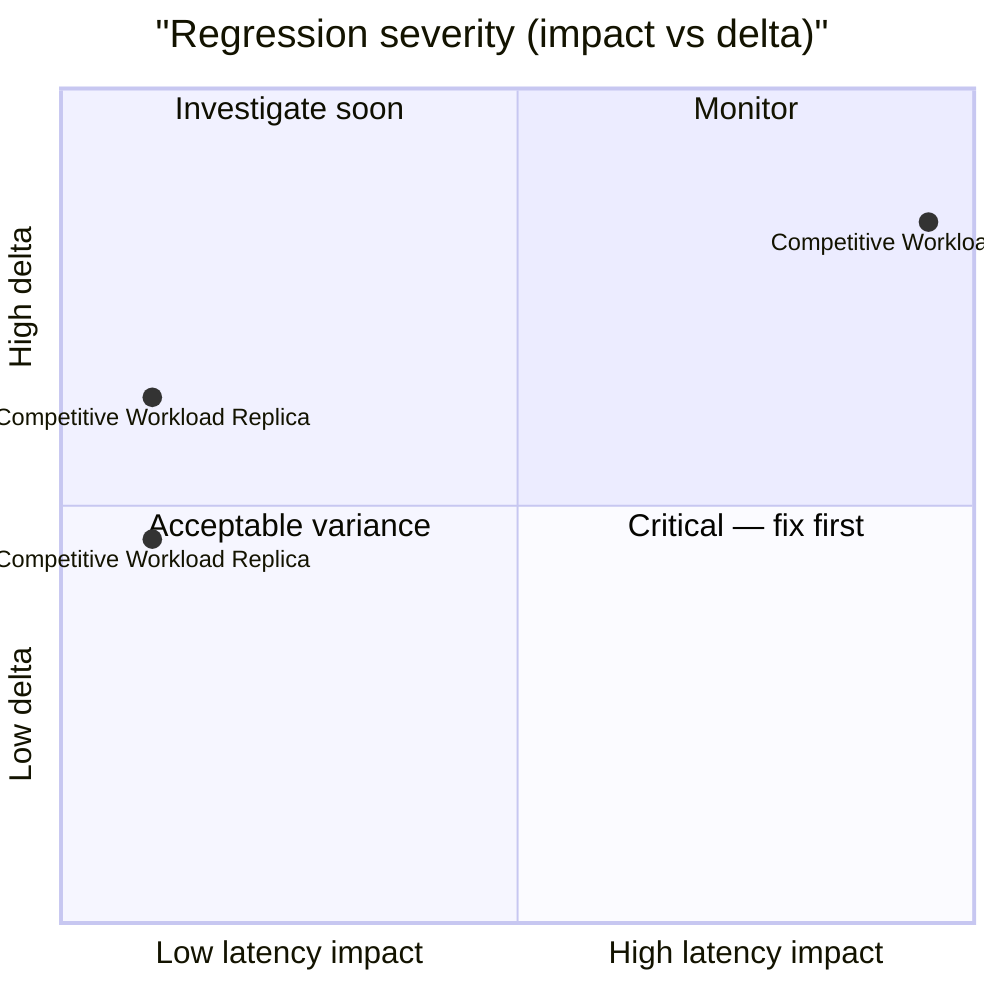

# 🚀 SQLite Performance Ledger

> [!NOTE] Competitive comparisons based on publicly available documentation as of June 2026. All SveltyCMS metrics self-measured via `bun test tests/benchmarks/`.

> [!IMPORTANT]
> **Console-only by default.** Use `BENCHMARK_RECORD=1` to write results to this report.
>
> ```bash
> BENCHMARK_RECORD=1 bun test tests/benchmarks/auth-performance.test.ts
> ```
>
> The full matrix runner (`bun run scripts/benchmark-matrix/index.ts --db=sqlite`) always records.

<!-- BENCHMARK_START -->

<!-- EXECUTIVE_START -->
<!-- LATEST_AUDIT_HEADER -->

## 📊 Latest Performance Audit

<!-- EXECUTIVE_FIX_NOTES_START -->

### 📝 Fix Overlays

> [!NOTE]
> Phase notes and remediation entries appear here after matrix or surgical runs.

<!-- EXECUTIVE_FIX_NOTES_END -->

> [!NOTE]
> **Partial update** — dimension rollups and issues reflect only tests invoked in this run.

**✅ PASS** _(partial invocation)_ · 1/62 tests · 61 skipped · **sqlite** · standalone run

### Dimension health

| Dimension      | Tests | Status | Worst Δ | Issues |
| -------------- | ----: | ------ | ------- | ------ |
| **Core**       |    10 | 🟢     | +17%    | 0      |
| **API**        |     0 | ⚪     | —       | 0      |
| **Scale**      |     0 | ⚪     | —       | 0      |
| **Resilience** |     0 | ⚪     | —       | 0      |

### Issues (action required)

> ✅ **All clear** — no regressions or budget violations detected.

### Executive latency matrix

| Scenario                         | Latency  | Trend                                   | Budget | Result |
| -------------------------------- | -------- | --------------------------------------- | ------ | ------ |
| **Competitive Workload Replica** | 1.708ms  | ⚪ stable at 1.69ms (±0.094ms) (7 runs) | < 5ms  | 🟢     |
| **Competitive Workload Replica** | 4.766ms  | ⚪ stable at 4.60ms (±0.757ms) (7 runs) | < 5ms  | 🟢     |
| **Competitive Workload Replica** | 1.687ms  | ⚪ stable at 1.67ms (±0.019ms) (7 runs) | < 5ms  | 🟢     |
| **Competitive Workload Replica** | 1.645ms  | ⚪ stable at 1.67ms (±0.078ms) (7 runs) | < 5ms  | 🟢     |
| **Competitive Workload Replica** | 1.636ms  | ⚪ stable at 1.87ms (±0.257ms) (7 runs) | < 5ms  | 🟢     |
| **Competitive Workload Replica** | 1.589ms  | ⚪ stable at 1.46ms (±0.231ms) (7 runs) | < 5ms  | 🟢     |
| **Competitive Workload Replica** | 4.903ms  | ⚪ stable at 4.86ms (±0.578ms) (7 runs) | < 5ms  | 🟢     |
| **Competitive Workload Replica** | 18.249ms | ⚪ stable at 17.54ms (±2.05ms) (7 runs) | < 5ms  | 🟢     |
| **Competitive Workload Replica** | 15.996ms | ⚪ stable at 13.71ms (±2.22ms) (7 runs) | < 5ms  | 🟢     |
| **Competitive Workload Replica** | 8.353ms  | ⚪ stable at 8.66ms (±3.07ms) (7 runs)  | < 5ms  | 🟢     |

### Historical pulse

> **Scope:** Sparklines only — full run tables: [`tests/benchmarks/results/history.sqlite`](../../../tests/benchmarks/results/history.sqlite)

| Metric                                               | Trend | Sparkline      | Latest     |
| ---------------------------------------------------- | ----- | -------------- | ---------- |
| api latency (HTTP: findById @ 8c) (warm)             | 🟢    | `▁▁▂▁▁▂▁▁▁▁▁█` | 4.160ms    |
| auth performance (Auth Validation @ 1c) (warm)       | 🟢    | `▁`            | 1.608ms    |
| cold start phased (Cold Start (IDLE → READY)) (cold) | 🟢    | `█▃▁▁▁▁`       | 1388.387ms |
| database performance (BULK INSERT (100)) (warm)      | 🟢    | `▃▁█▄▂▄▃▃▃▃▄▄` | 1.368ms    |

<details>
<summary>📈 Latency trend chart (last 10 runs)</summary>

```mermaid
xychart-beta
  title "sqlite REST p95 (last 10 runs)"
  x-axis ["R1", "R2", "R3", "R4", "R5", "R6", "R7", "R8", "R9", "R10"]
  y-axis "Latency (ms)"
  line "p95" : [0.000, 0.000, 0.000, 0.000, 0.000, 0.000, 0.000, 0.000, 0.000, 0.000]
```

</details>
<details>
<summary>📊 Regression severity matrix (quadrant)</summary>


```mermaid
quadrantChart
  title "Regression severity (impact vs delta)"
  x-axis Low latency impact --> High latency impact
  y-axis Low delta --> High delta
  quadrant-1 Monitor
  quadrant-2 Investigate soon
  quadrant-3 Acceptable variance
  quadrant-4 Critical — fix first
    Competitive Workload Replica: [0.10, 0.63]
    Competitive Workload Replica: [0.10, 0.46]
    Competitive Workload Replica: [0.95, 0.84]
```

</details>

<!-- EXECUTIVE_PARTIAL_WATERMARK -->

<!-- EXECUTIVE_ALERTS_START -->
<!-- EXECUTIVE_ALERTS_END -->

<!-- EXECUTIVE_END -->

<!-- SUMMARY_START -->

<!-- SUMMARY_RUN_OVERLAY_START -->

### Current Run Summary (2026-08-18)

> **Scope:** Only tests that ran in THIS invocation.

> ⚠️ Executive PASS/FAIL reflects the last full matrix run.

**Run ID:** `85bd888f-4b2d-41c4-afb4-b1d05805ef37` · **Tests invoked:** 1 · **Metrics:** 10 · **DB:** sqlite

| Test                         | Metric                         | Avg (ms) | p95 (ms) | RPS  | Trend | Detail                                  |
| ---------------------------- | ------------------------------ | -------- | -------- | ---- | ----- | --------------------------------------- |
| Competitive Workload Replica | findById (Concurrent 8c)       | 1.708    | 2.715    | 2835 | 🟢    | ⚪ stable at 1.69ms (±0.094ms) (7 runs) |
| Competitive Workload Replica | findByIdRandom (Concurrent 8c) | 4.766    | 7.432    | 1468 | 🟢    | ⚪ stable at 4.60ms (±0.757ms) (7 runs) |
| Competitive Workload Replica | listPlain (Concurrent 8c)      | 1.687    | 2.711    | 2892 | 🟢    | ⚪ stable at 1.67ms (±0.019ms) (7 runs) |
| Competitive Workload Replica | listFilterSort (Concurrent 8c) | 1.645    | 2.768    | 2829 | 🟢    | ⚪ stable at 1.67ms (±0.078ms) (7 runs) |
| Competitive Workload Replica | listLarge (Concurrent 8c)      | 1.636    | 2.829    | 2847 | 🟢    | ⚪ stable at 1.87ms (±0.257ms) (7 runs) |
| Competitive Workload Replica | findMissing (Concurrent 8c)    | 1.589    | 3.358    | 3110 | 🟢    | ⚪ stable at 1.46ms (±0.231ms) (7 runs) |
| Competitive Workload Replica | GraphQL Query (Concurrent 8c)  | 4.903    | 5.806    | 1517 | 🟢    | ⚪ stable at 4.86ms (±0.578ms) (7 runs) |
| Competitive Workload Replica | create (Concurrent 8c)         | 18.249   | 36.554   | 434  | 🟢    | ⚪ stable at 17.54ms (±2.05ms) (7 runs) |
| Competitive Workload Replica | update (Concurrent 8c)         | 15.996   | 37.254   | 495  | 🟢    | ⚪ stable at 13.71ms (±2.22ms) (7 runs) |
| Competitive Workload Replica | mixed (Concurrent 8c 50/50)    | 8.353    | 12.287   | 935  | 🟢    | ⚪ stable at 8.66ms (±3.07ms) (7 runs)  |

<!-- SUMMARY_RUN_OVERLAY_END -->

<!-- SUMMARY_HISTORY_START -->

### Historical Trends (2026-08-18)

> **Scope:** Sparklines only — full run tables live in `history.sqlite` (link below). Runs = sparkline bar count.

**Detail:** [`tests/benchmarks/results/history.sqlite`](../../../tests/benchmarks/results/history.sqlite) · `SELECT test_id, phase, avg_ms, p95_ms, rps, timestamp FROM runs WHERE db_type='sqlite' AND redis=0 ORDER BY timestamp DESC`

**Series:** 26 · **DB:** sqlite

| Metric                              | Trend | Sparkline (last 7) | Latest     |
| ----------------------------------- | ----- | ------------------ | ---------- |
| API LATENCY (warm)                  | 🟢    | `▁▃▁▃▁█▁`          | 1.223ms    |
| AUTH PERFORMANCE (warm)             | 🟢    | `▁█`               | 6.045ms    |
| BUILD ANALYSIS (warm)               | 🟢    | `▁`                | 0.000ms    |
| CACHE PERFORMANCE (warm)            | 🟢    | `▄▅█▁▁▁▁`          | 0.356ms    |
| CACHE SERVICE (warm)                | 🟢    | `▁█`               | 4.015ms    |
| CLIENT JOURNEY (warm)               | 🟢    | `▁█`               | 15.569ms   |
| COLD START PHASED (cold)            | 🟢    | `█▃▁▁▁▁`           | 1388.387ms |
| CONTENT SCALE STRESS (warm)         | 🟢    | `▁`                | 0.181ms    |
| DATABASE PERFORMANCE (warm)         | 🟢    | `▅▅▂█▃▁▁`          | 0.029ms    |
| GRAPHQL API PERFORMANCE (warm)      | 🟢    | `▁█▆▅▅▂▁`          | 1.238ms    |
| GRAPHQL STRESS (warm)               | 🟢    | `█▁▂▄▁▅▇`          | 54.597ms   |
| HOOKS PERFORMANCE (warm)            | 🟢    | `▂▁▂█▁▂▁`          | 0.297ms    |
| LARGE PAYLOAD STREAMING (warm)      | 🟢    | `▅▆▅▁▄█▆`          | 4.291ms    |
| LOCAL CMS CRUD (warm)               | 🟢    | `▄▁▄▁▁█▄`          | 0.072ms    |
| MIXED WORKLOAD (warm)               | 🟢    | `█▁`               | 1.604ms    |
| OPENAPI PERFORMANCE (warm)          | 🟢    | `▁`                | 0.418ms    |
| REALTIME PERFORMANCE (warm)         | 🟢    | `▁`                | 0.001ms    |
| REVISION STRESS (warm)              | 🟢    | `▁█`               | 1.084ms    |
| SECURITY AUDIT (warm)               | 🟢    | `▁▁█▁▁▁▁`          | 0.002ms    |
| TRANSACTION ACID (warm)             | 🟢    | `█▃▁▃▁▄▂`          | 0.170ms    |
| TRUTH LATENCY (warm)                | 🟢    | `▁█▁▁▁█▁`          | 0.007ms    |
| WIDGET PERFORMANCE (warm)           | 🟢    | `▆▁█▄▁▅`           | 0.037ms    |
| COMPETITIVE WORKLOAD REPLICA (warm) | ⚪    | `▃▁▁▁▁▄█`          | 15.996ms   |
| CONCURRENCY MAX (warm)              | ⚪    | `▂▁█`              | 1.058ms    |
| MIDDLEWARE FLAMEGRAPH (warm)        | ⚪    | `▂▁▁▃▂▂█`          | 2.757ms    |
| REST API PERFORMANCE (warm)         | ⚪    | `▇▆▁▇█▇▁`          | 0.560ms    |

<!-- SUMMARY_HISTORY_END --><!-- SUMMARY_END -->

<!-- LEDGER_START -->

## 🔬 Full benchmark ledger (58 modules)

Expand dimension groups, then any row, for ASCII truth tables. Executive summary above shows pass/fail and issues only.

<!-- LEDGER_DIMENSION:CORE:START -->

<details id="ledger-dimension-core">
<summary><strong>Core</strong> · 31 tests</summary>

<!-- SECTION:API_LATENCY:START -->

<details id="section-api_latency">
<summary><strong>🏷️ API LAYER LATENCY</strong> · 🟢 2.247ms · ➡️ recorded (awaiting trend) · <a href="../../../tests/benchmarks/api-latency.test.ts">source</a></summary>

<!-- LEDGER_TRUTH_START -->

```text
╔═════════════════════════════════════════════════════════════════════════════════════════╗
║                             SVELTYCMS  —  API LAYER LATENCY                             ║
║                       File: tests/benchmarks/api-latency.test.ts                        ║
║                                Ran: 2026-08-13 19:09:10                                 ║
║       Cold full-pipeline findById + warm TURBO-HIT path after responseCache fill.       ║
╠═════════════════════════════════════════════════════════════════════════════════════════╣
║ HTTP: findById @ 8c            │        2.247 ms │ p95:        4.565 ms │ RPS:        434 ║
║ HTTP: findById TURBO-HIT @ 8c  │        1.281 ms │ p95:        2.311 ms │ RPS:        757 ║
╚═════════════════════════════════════════════════════════════════════════════════════════╝
```

<!-- LEDGER_TRUTH_END -->

</details>
<!-- SECTION:API_LATENCY:END -->

<!-- SECTION:COLD_START:START -->
<details id="section-cold_start">
<summary><strong>🏷️ cold start phased</strong> · 🟢 1388.387ms · ➡️ ⚪ stable at 1413.81ms (±595.25ms) (5 runs) (2026-08-18 19:12:55) · <a href="../../../tests/benchmarks/cold-start-phased.test.ts">source</a></summary>
<!-- LEDGER_TRUTH_START -->
```text
╔═════════════════════════════════════════════════════════════════════════════════════════╗
║                           SVELTYCMS — PHASED COLD START AUDIT                           ║
║                    File: tests/benchmarks/cold-start-phased.test.ts                     ║
║                                Ran: 2026-08-18 19:12:55                                 ║
║       Measures server cold-start latency to READY state, using the built server.        ║
╠═════════════════════════════════════════════════════════════════════════════════════════╣
║ Cold Start (IDLE → READY)      │     1388.387 ms │ p95:     1796.194 ms │ RPS:          0 ║
╚═════════════════════════════════════════════════════════════════════════════════════════╝
```
<!-- LEDGER_TRUTH_END -->

</details>
<!-- SECTION:COLD_START:END -->

<!-- SECTION:TRUTH_AUDIT:START -->

<details id="section-truth_audit">
<summary><strong>🏷️ SRE TRUTH AUDIT</strong> · ⚪ ⏳ pending · ➡️ pending · <a href="../../../tests/benchmarks/truth-latency.test.ts">source</a></summary>

<!-- LEDGER_TRUTH_START -->

```text
╔═════════════════════════════════════════════════════════════════════════════════════════╗
║                               SVELTYCMS — SRE TRUTH AUDIT                               ║
║                      File: tests/benchmarks/truth-latency.test.ts                       ║
║                                Ran: 2026-08-18 19:13:02                                 ║
║     Validates performance claims by comparing SDK, Middleware, and Real HTTP Stack      ║
╠═════════════════════════════════════════════════════════════════════════════════════════╣
║ Logic Baseline                 │        0.000 ms │ p95:        0.001 ms │ RPS:  2,795,899 ║
║ Local SDK (Full)               │        0.007 ms │ p95:        0.015 ms │ RPS:    134,825 ║
║ HTTP End-to-End                │        0.459 ms │ p95:        0.525 ms │ RPS:      2,179 ║
╚═════════════════════════════════════════════════════════════════════════════════════════╝
```

<!-- LEDGER_TRUTH_END -->

</details>
<!-- SECTION:TRUTH_AUDIT:END -->

<!-- SECTION:SCAN:START -->

<details id="section-scan">
<summary><strong>🏷️ Self-Healing Content Scan</strong> · 🟢 1.771ms · ➡️ recorded (awaiting trend) · <a href="../../../tests/benchmarks/content-scan.test.ts">source</a></summary>

<!-- LEDGER_TRUTH_START -->

```text
╔═════════════════════════════════════════════════════════════════════════════════════════╗
║                             SVELTYCMS — CONTENT SCAN AUDIT                              ║
║                       File: tests/benchmarks/content-scan.test.ts                       ║
║                                Ran: 2026-08-11 22:08:36                                 ║
║    Measures filesystem + metadata processing for self-healing collections discovery     ║
╠═════════════════════════════════════════════════════════════════════════════════════════╣
║ Content Scan (Self-Healing)    │        1.771 ms │ p95:        1.970 ms │ RPS:        514 ║
╚═════════════════════════════════════════════════════════════════════════════════════════╝
```

<!-- LEDGER_TRUTH_END -->

</details>
<!-- SECTION:SCAN:END -->

<!-- SECTION:INCREMENTAL:START -->

<details id="section-incremental">
<summary><strong>🏷️ Incremental Content Reload</strong> · 🟢 0.295ms · ➡️ recorded (awaiting trend) · <a href="../../../tests/benchmarks/content-incremental-reload.test.ts">source</a></summary>

<!-- LEDGER_TRUTH_START -->

```text
╔═════════════════════════════════════════════════════════════════════════════════════════╗
║                      SVELTYCMS — INCREMENTAL CONTENT RELOAD AUDIT                       ║
║                File: tests/benchmarks/content-incremental-reload.test.ts                ║
║                                Ran: 2026-08-11 22:08:37                                 ║
║          Measures surgical single-file fullReload vs full reconciliation path           ║
╠═════════════════════════════════════════════════════════════════════════════════════════╣
║ Incremental fullReload (1 file) │        0.295 ms │ p95:        0.563 ms │ RPS:      3,387 ║
║ Full Reconciliation Reload     │        0.396 ms │ p95:        0.531 ms │ RPS:      2,528 ║
╚═════════════════════════════════════════════════════════════════════════════════════════╝
```

<!-- LEDGER_TRUTH_END -->

</details>
<!-- SECTION:INCREMENTAL:END -->

<!-- SECTION:HOOKS_TRACE:START -->

<details id="section-hooks_trace">
<summary><strong>🏷️ Middleware & Hooks Performance</strong> · 🟢 0.591ms · ➡️ recorded (awaiting trend) · <a href="../../../tests/benchmarks/hooks-performance.test.ts">source</a></summary>

<!-- LEDGER_TRUTH_START -->

```text
╔═════════════════════════════════════════════════════════════════════════════════════════╗
║                          SVELTYCMS — MIDDLEWARE & HOOKS AUDIT                           ║
║                    File: tests/benchmarks/hooks-performance.test.ts                     ║
║                                Ran: 2026-08-18 19:14:12                                 ║
║Measures the cost of the full middleware chain including Turbo, Security, Auth, and Audit via HTTP E2E.║
╠═════════════════════════════════════════════════════════════════════════════════════════╣
║ Static Asset (No Middleware)   │        0.591 ms │ p95:        0.706 ms │ RPS:      1,526 ║
║ Turbo Pipeline (Light)         │        0.289 ms │ p95:        0.367 ms │ RPS:      2,854 ║
║ Full Security + Auth Pipeline  │        0.451 ms │ p95:        0.531 ms │ RPS:      2,000 ║
║ REST with API Caching          │        0.394 ms │ p95:        0.456 ms │ RPS:      2,314 ║
║ Mutation (audit logging disabled) │        2.388 ms │ p95:        2.728 ms │ RPS:        367 ║
╚═════════════════════════════════════════════════════════════════════════════════════════╝
```

<!-- LEDGER_TRUTH_END -->

</details>
<!-- SECTION:HOOKS_TRACE:END -->

<!-- SECTION:EDGE_SYNC:START -->

<details id="section-edge_sync">
<summary><strong>🏷️ Edge Sync & Distributed Cache</strong> · ⏳ pending · ➡️ baseline · <a href="../../../tests/benchmarks/edge-sync.test.ts">source</a></summary>

<!-- LEDGER_TRUTH_START -->

> ⏳ Pending — Verifies distributed L1/L2 cache invalidation latency across simulated nodes.

<!-- LEDGER_TRUTH_END -->

</details>
<!-- SECTION:EDGE_SYNC:END -->

<!-- SECTION:TELEMETRY:START -->

<details id="section-telemetry">
<summary><strong>🏷️ Telemetry Collection & Signing</strong> · ⚪ ⏳ pending · ➡️ pending · <a href="../../../tests/benchmarks/telemetry-performance.test.ts">source</a></summary>

<!-- LEDGER_TRUTH_START -->

```text
╔═════════════════════════════════════════════════════════════════════════════════════════╗
║                       SVELTYCMS — TELEMETRY & UPDATE PERFORMANCE                        ║
║                  File: tests/benchmarks/telemetry-performance.test.ts                   ║
║                                Ran: 2026-08-11 22:07:12                                 ║
║Measures telemetry update check latency and memory impact on both happy-path and failure-path scenarios.║
╠═════════════════════════════════════════════════════════════════════════════════════════╣
║ Telemetry (Happy Path)         │        0.000 ms │ p95:        0.001 ms │ RPS:  1,789,709 ║
║ Telemetry (Failure Path)       │        0.000 ms │ p95:        0.002 ms │ RPS:  2,006,018 ║
╚═════════════════════════════════════════════════════════════════════════════════════════╝
```

<!-- LEDGER_TRUTH_END -->

</details>
<!-- SECTION:TELEMETRY:END -->

<!-- SECTION:STATE_MACHINE:START -->

<details id="section-state_machine">
<summary><strong>🏷️ State Machine Transitions</strong> · 🟢 60.314ms · ➡️ recorded (awaiting trend) · <a href="../../../tests/benchmarks/state-machine-transition.test.ts">source</a></summary>

<!-- LEDGER_TRUTH_START -->

```text
╔═════════════════════════════════════════════════════════════════════════════════════════╗
║                           SVELTYCMS — STATE MACHINE INTEGRITY                           ║
║                 File: tests/benchmarks/state-machine-transition.test.ts                 ║
║                                Ran: 2026-08-11 22:08:42                                 ║
║Simulates rapid system re-initializations and verifies valid self-healing state transitions under stress.║
╠═════════════════════════════════════════════════════════════════════════════════════════╣
║ State Transition (READY -> IDLE -> READY) │       60.314 ms │ p95:       63.470 ms │ RPS:         17 ║
╚═════════════════════════════════════════════════════════════════════════════════════════╝
```

<!-- LEDGER_TRUTH_END -->

</details>
<!-- SECTION:STATE_MACHINE:END -->

<!-- SECTION:DB_RAW_P95:START -->
<details id="section-db_raw_p95">
<summary><strong>🏷️ database performance</strong> · 🟢 1.306ms · ➡️ ⚪ stable at 1.29ms (±0.148ms) (7 runs) (2026-08-18 19:13:42) · <a href="../../../tests/benchmarks/database-performance.test.ts">source</a></summary>
<!-- LEDGER_TRUTH_START -->
```text
╔═════════════════════════════════════════════════════════════════════════════════════════╗
║                    SVELTYCMS — DATABASE ADAPTER PERFORMANCE (SQLITE)                    ║
║                   File: tests/benchmarks/database-performance.test.ts                   ║
║                                Ran: 2026-08-18 19:13:42                                 ║
║   Measures raw CRUD performance, indexing efficiency, and connection pool resilience    ║
╠═════════════════════════════════════════════════════════════════════════════════════════╣
║ INSERT                         │        0.056 ms │ p95:        0.079 ms │ RPS:      7,233 ║
║ FIND ONE                       │        0.006 ms │ p95:        0.009 ms │ RPS:    137,737 ║
║ FIND MANY (limit 50)           │        0.088 ms │ p95:        0.101 ms │ RPS:      9,176 ║
║ FIND PAGE (50 hasMore)         │        0.111 ms │ p95:        0.126 ms │ RPS:      7,371 ║
║ FIND PAGE keyset               │        0.100 ms │ p95:        0.114 ms │ RPS:      8,588 ║
║ FIND MANY offset 50            │        0.052 ms │ p95:        0.063 ms │ RPS:     15,854 ║
║ LIST+COUNT (legacy)            │        0.166 ms │ p95:        0.182 ms │ RPS:      5,135 ║
║ UPDATE                         │        0.033 ms │ p95:        0.038 ms │ RPS:     14,293 ║
║ UPDATE (no-returning)          │        0.029 ms │ p95:        0.034 ms │ RPS:     16,075 ║
║ NATIVE UPSERT                  │        0.065 ms │ p95:        0.075 ms │ RPS:     10,084 ║
║ COUNT                          │        0.109 ms │ p95:        0.120 ms │ RPS:      8,176 ║
║ COUNT ESTIMATE                 │        0.021 ms │ p95:        0.026 ms │ RPS:     39,154 ║
║ COUNT CACHED                   │        0.001 ms │ p95:        0.001 ms │ RPS:    457,922 ║
║ DELETE                         │        0.060 ms │ p95:        0.073 ms │ RPS:      9,212 ║
║ BULK INSERT (100)              │        1.306 ms │ p95:        1.474 ms │ RPS:        242 ║
╚═════════════════════════════════════════════════════════════════════════════════════════╝
```
<!-- LEDGER_TRUTH_END -->

</details>
<!-- SECTION:DB_RAW_P95:END -->

<!-- SECTION:ACID:START -->
<details id="section-acid">
<summary><strong>🏷️ transaction acid</strong> · 🟢 0.170ms · ↘️ ⚪ stable at 0.224ms (±0.443ms) (4 runs) (2026-08-18 19:13:51) · <a href="../../../tests/benchmarks/transaction-acid.test.ts">source</a></summary>
<!-- LEDGER_INSIGHT_START -->
> [!NOTE]
> **Specific to this test**: Performance improved — recent optimizations or cache warming likely effective.
<!-- LEDGER_INSIGHT_END -->

<!-- LEDGER_TRUTH_START -->

```text
╔═════════════════════════════════════════════════════════════════════════════════════════╗
║                            SVELTYCMS — ACID INTEGRITY AUDIT                             ║
║                     File: tests/benchmarks/transaction-acid.test.ts                     ║
║                                Ran: 2026-08-18 19:13:51                                 ║
║  Measures transaction commit latencies and rollback overhead across database adapters   ║
╠═════════════════════════════════════════════════════════════════════════════════════════╣
║ TX Commit                      │        0.202 ms │ p95:        0.386 ms │ RPS:      3,211 ║
║ TX Rollback Integrity          │        0.170 ms │ p95:        0.219 ms │ RPS:      5,880 ║
╚═════════════════════════════════════════════════════════════════════════════════════════╝
```

<!-- LEDGER_TRUTH_END -->

</details>
<!-- SECTION:ACID:END -->

<!-- SECTION:CACHE:START -->
<details id="section-cache">
<summary><strong>🏷️ Cache</strong> · 🟢 0.356ms · ↘️ ⚪ stable at 0.688ms (±0.504ms) (7 runs) (2026-08-18 19:14:00) · <a href="../../../tests/benchmarks/cache-performance.test.ts">source</a></summary>
<!-- LEDGER_INSIGHT_START -->
> [!NOTE]
> **Specific to this test**: Performance improved — recent optimizations or cache warming likely effective.
<!-- LEDGER_INSIGHT_END -->

<!-- LEDGER_TRUTH_START -->

```text
╔═════════════════════════════════════════════════════════════════════════════════════════╗
║                           SVELTYCMS — CACHE EFFICIENCY AUDIT                            ║
║                    File: tests/benchmarks/cache-performance.test.ts                     ║
║                                Ran: 2026-08-18 19:14:00                                 ║
║  Measures cache hit vs miss latency and efficiency via real HTTP end-to-end requests.   ║
╠═════════════════════════════════════════════════════════════════════════════════════════╣
║ Cache Miss (Bypass)            │        0.356 ms │ p95:        0.482 ms │ RPS:      2,478 ║
╚═════════════════════════════════════════════════════════════════════════════════════════╝
```

<!-- LEDGER_TRUTH_END -->

</details>
<!-- SECTION:CACHE:END -->

<!-- SECTION:CACHE_EFFICIENCY:START -->
<details id="section-cache_efficiency">
<summary><strong>🏷️ cache hit ratio</strong> · 🟢 0.784ms · ➡️ ⚪ established at 0.784ms (1 run) (2026-07-21 17:06:30) · <a href="../../../tests/benchmarks/cache-hit-ratio.test.ts">source</a></summary>
<!-- LEDGER_TRUTH_START -->
```text
╔═════════════════════════════════════════════════════════════════════════════════════════╗
║                           SVELTYCMS — CACHE EFFICIENCY AUDIT                            ║
║                     File: tests/benchmarks/cache-hit-ratio.test.ts                      ║
║                                Ran: 2026-07-21 17:06:30                                 ║
║Measures Redis cache efficiency including hit rate, miss penalty, invalidation speed, and cold/warm fill.║
╠═════════════════════════════════════════════════════════════════════════════════════════╣
║ Cache Miss (Cold)              │        2.041 ms │ p95:        3.295 ms │ RPS:        490 ║
║ Cache Hit (Warm)               │        2.146 ms │ p95:        3.313 ms │ RPS:        466 ║
║ Cache Invalidation             │        0.784 ms │ p95:        1.519 ms │ RPS:      1,275 ║
╚═════════════════════════════════════════════════════════════════════════════════════════╝
```
<!-- LEDGER_TRUTH_END -->

</details>
<!-- SECTION:CACHE_EFFICIENCY:END -->

<!-- SECTION:BUILD:START -->

<details id="section-build">
<summary><strong>🏷️ Production Build Analysis</strong> · ⚪ ⏳ pending · ➡️ pending · <a href="../../../tests/benchmarks/build-analysis.test.ts">source</a></summary>

<!-- LEDGER_TRUTH_START -->

```text
╔═════════════════════════════════════════════════════════════════════════════════════════╗
║                          SVELTYCMS — PRODUCTION BUILD ANALYSIS                          ║
║                      File: tests/benchmarks/build-analysis.test.ts                      ║
║                                Ran: 2026-08-11 22:09:56                                 ║
║       Measures compilation speed, bundle size trends, and tree-shaking efficiency       ║
╠═════════════════════════════════════════════════════════════════════════════════════════╣
║ Production Build               │        0.000 ms │ p95:        0.000 ms │ RPS:          0 ║
╚═════════════════════════════════════════════════════════════════════════════════════════╝
```

<!-- LEDGER_TRUTH_END -->

</details>
<!-- SECTION:BUILD:END -->

<!-- SECTION:DX_TOOLING:START -->

<details id="section-dx_tooling">
<summary><strong>🏷️ DX Toolchain Performance</strong> · ⏳ pending · ➡️ baseline · <a href="../../../tests/benchmarks/dev-dependency-load.test.ts">source</a></summary>

<!-- LEDGER_TRUTH_START -->

> ⏳ Pending — Measures overhead of the build, sync, and lint toolchain.

<!-- LEDGER_TRUTH_END -->

</details>
<!-- SECTION:DX_TOOLING:END -->

<!-- SECTION:CACHE_SVC:START -->

<details id="section-cache_svc">
<summary><strong>🏷️ CacheService Micro-Benchmark</strong> · ⚪ ⏳ pending · ➡️ pending · <a href="../../../tests/benchmarks/cache-service.test.ts">source</a></summary>

<!-- LEDGER_TRUTH_START -->

```text
╔═════════════════════════════════════════════════════════════════════════════════════════╗
║                           SVELTYCMS — CACHE SERVICE TELEMETRY                           ║
║                      File: tests/benchmarks/cache-service.test.ts                       ║
║                                Ran: 2026-08-11 23:02:18                                 ║
║        Measures L1 cache hit latency and pattern invalidation overhead at scale         ║
╠═════════════════════════════════════════════════════════════════════════════════════════╣
║ Cache L1 Hit                   │        0.000 ms │ p95:        0.001 ms │ RPS:  3,088,453 ║
║ Pattern Invalidation (1k items @ 200k noise) │        4.015 ms │ p95:        5.467 ms │ RPS:        249 ║
╚═════════════════════════════════════════════════════════════════════════════════════════╝
```

<!-- LEDGER_TRUTH_END -->

</details>
<!-- SECTION:CACHE_SVC:END -->

<!-- SECTION:LOCAL_API:START -->

<details id="section-local_api">
<summary><strong>🏷️ LocalCMS SDK Overhead</strong> · 🟢 0.044ms · ➡️ recorded (awaiting trend) · <a href="../../../tests/benchmarks/local-api-performance.test.ts">source</a></summary>

<!-- LEDGER_TRUTH_START -->

```text
╔═════════════════════════════════════════════════════════════════════════════════════════╗
║                        SVELTYCMS — LOCAL SDK BENCHMARK (SQLITE)                         ║
║                   File: tests/benchmarks/local-api-throughput.test.ts                   ║
║                                Ran: 2026-08-11 22:07:54                                 ║
║        Measures write throughput, read throughput, and SDK overhead in one pass.        ║
╠═════════════════════════════════════════════════════════════════════════════════════════╣
║ Writes (1000)                  │        0.044 ms │ p95:        0.000 ms │ RPS:     22,782 ║
║ Reads (1000)                   │        0.011 ms │ p95:        0.000 ms │ RPS:     92,323 ║
╚═════════════════════════════════════════════════════════════════════════════════════════╝
```

<!-- LEDGER_TRUTH_END -->

</details>
<!-- SECTION:LOCAL_API:END -->

<!-- SECTION:SETUP_PROXY:START -->

<details id="section-setup_proxy">
<summary><strong>🏷️ Setup Proxy & Bootstrap Isolation</strong> · ⏳ pending · ➡️ baseline · <a href="../../../tests/benchmarks/setup-proxy.test.ts">source</a></summary>

<!-- LEDGER_TRUTH_START -->

> ⏳ Pending — Setup proxy isolation and bootstrap security gating.

<!-- LEDGER_TRUTH_END -->

</details>
<!-- SECTION:SETUP_PROXY:END -->

<!-- SECTION:HTTP:START -->
<details id="section-http">
<summary><strong>🏷️ HTTP</strong> · 🟢 0.459ms · ↘️ ⚪ stable at 0.512ms (±1.32ms) (4 runs) (2026-08-18 19:13:13) · <a href="../../../tests/benchmarks/truth-latency.test.ts">source</a></summary>
<!-- LEDGER_INSIGHT_START -->
> [!NOTE]
> **Specific to this test**: Performance improved — recent optimizations or cache warming likely effective.
<!-- LEDGER_INSIGHT_END -->

<!-- LEDGER_TRUTH_START -->

> ⏳ Pending

<!-- LEDGER_TRUTH_END -->

</details>
<!-- SECTION:HTTP:END -->

<!-- SECTION:LOGIC:START -->
<details id="section-logic">
<summary><strong>🏷️ Logic</strong> · 🟢 ⏳ pending · ➡️ ⚪ stable at 0ms (±0.001ms) (4 runs) (2026-08-18 19:13:13) · <a href="../../../tests/benchmarks/truth-latency.test.ts">source</a></summary>
<!-- LEDGER_TRUTH_START -->
> ⏳ Pending
<!-- LEDGER_TRUTH_END -->

</details>
<!-- SECTION:LOGIC:END -->

<!-- SECTION:SDK:START -->
<details id="section-sdk">
<summary><strong>🏷️ SDK</strong> · 🟢 0.007ms · ↘️ ⚪ stable at 0.007ms (±0.002ms) (4 runs) (2026-08-18 19:13:13) · <a href="../../../tests/benchmarks/truth-latency.test.ts">source</a></summary>
<!-- LEDGER_INSIGHT_START -->
> [!NOTE]
> **Specific to this test**: Performance improved — recent optimizations or cache warming likely effective.
<!-- LEDGER_INSIGHT_END -->

<!-- LEDGER_TRUTH_START -->

```text
╔═════════════════════════════════════════════════════════════════════════════════════════╗
║                         SVELTYCMS — LOCALCMS CRUD TAX (SQLITE)                          ║
║                      File: tests/benchmarks/local-cms-crud.test.ts                      ║
║                                Ran: 2026-08-13 19:09:05                                 ║
║            Measures full CollectionsNamespace tax — not raw db.crud — so SDK            ║
╠═════════════════════════════════════════════════════════════════════════════════════════╣
║ Adapter FIND ONE               │        0.006 ms │ p95:        0.009 ms │ RPS:    134,696 ║
║ LocalCMS findById (warm)       │        0.001 ms │ p95:        0.002 ms │ RPS:    440,437 ║
║ LocalCMS findById (cold)       │        0.007 ms │ p95:        0.009 ms │ RPS:    112,779 ║
║ LocalCMS create                │        0.094 ms │ p95:        0.160 ms │ RPS:      5,433 ║
║ LocalCMS update                │        0.068 ms │ p95:        0.102 ms │ RPS:      6,998 ║
║ LocalCMS mixed C/U/R           │        0.213 ms │ p95:        0.357 ms │ RPS:      2,457 ║
╚═════════════════════════════════════════════════════════════════════════════════════════╝
```

<!-- LEDGER_TRUTH_END -->

</details>
<!-- SECTION:SDK:END -->

<!-- SECTION:UNKNOWN:START -->
<details id="section-unknown">
<summary><strong>🏷️ unknown</strong> · 🟢 0.003ms · ➡️ recorded (awaiting trend) · <a href="../../../tests/benchmarks/database-performance.test.ts">source</a></summary>
<!-- LEDGER_INSIGHT_START -->
> [!NOTE]
> **Specific to this test**: Both avg and p95 degraded — likely adapter or infrastructure bottleneck. Check DB connection pool, indexes, or recent commits.  
Throughput dropped 95% — check connection pool saturation or lock contention.  
**Severe degradation** (+2182%) — review recent commits immediately.
<!-- LEDGER_INSIGHT_END -->

<!-- LEDGER_TRUTH_START -->

```text
╔═════════════════════════════════════════════════════════════════════════════════════════╗
║                      SVELTYCMS — CACHE EVICTION BOUNDARY HARDENING                      ║
║                                      File: unknown                                      ║
║                                Ran: 2026-08-11 22:08:30                                 ║
╠═════════════════════════════════════════════════════════════════════════════════════════╣
║ Cache Flooding & Eviction      │        0.003 ms │ p95:        0.004 ms │ RPS:    366,478 ║
╚═════════════════════════════════════════════════════════════════════════════════════════╝
```

<!-- LEDGER_TRUTH_END -->

</details>
<!-- SECTION:UNKNOWN:END -->

<!-- SECTION:MIDDLEWARE:START -->
<details id="section-middleware">
<summary><strong>🏷️ Middleware</strong> · 🟢 2.388ms · ↗️ ⚪ stable at 2.04ms (±1.22ms) (7 runs) (2026-08-18 19:14:12) · <a href="../../../tests/benchmarks/hooks-performance.test.ts">source</a></summary>
<!-- LEDGER_INSIGHT_START -->
> [!NOTE]
> **Specific to this test**: Avg degraded but p95 stable — possible cold-start effect, GC pause, or warmup variance.  
Throughput dropped 12% — check connection pool saturation or lock contention.
<!-- LEDGER_INSIGHT_END -->

<!-- LEDGER_TRUTH_START -->

> ⏳ Pending

<!-- LEDGER_TRUTH_END -->

</details>
<!-- SECTION:MIDDLEWARE:END -->

<!-- SECTION:SYSTEM:START -->
<details id="section-system">
<summary><strong>🏷️ System</strong> · 🟢 0.557ms · ➡️ ⚪ stable at 0.560ms (±0.101ms) (7 runs) (2026-08-18 19:14:20) · <a href="../../../tests/benchmarks/rest-api-performance.test.ts">source</a></summary>
<!-- LEDGER_TRUTH_START -->
> ⏳ Pending
<!-- LEDGER_TRUTH_END -->

</details>
<!-- SECTION:SYSTEM:END -->

<!-- SECTION:METADATA:START -->
<details id="section-metadata">
<summary><strong>🏷️ Metadata</strong> · 🟢 0.798ms · ➡️ ⚪ stable at 0.824ms (±0.062ms) (7 runs) (2026-08-18 19:14:20) · <a href="../../../tests/benchmarks/rest-api-performance.test.ts">source</a></summary>
<!-- LEDGER_TRUTH_START -->
> ⏳ Pending
<!-- LEDGER_TRUTH_END -->

</details>
<!-- SECTION:METADATA:END -->

<!-- SECTION:CRUD:START -->
<details id="section-crud">
<summary><strong>🏷️ CRUD</strong> · 🟢 0.764ms · ↘️ ⚪ stable at 0.826ms (±0.187ms) (7 runs) (2026-08-18 19:14:20) · <a href="../../../tests/benchmarks/rest-api-performance.test.ts">source</a></summary>
<!-- LEDGER_INSIGHT_START -->
> [!NOTE]
> **Specific to this test**: Performance improved — recent optimizations or cache warming likely effective.
<!-- LEDGER_INSIGHT_END -->

<!-- LEDGER_TRUTH_START -->

> ⏳ Pending

<!-- LEDGER_TRUTH_END -->

</details>
<!-- SECTION:CRUD:END -->

<!-- SECTION:CRYPTO:START -->
<details id="section-crypto">
<summary><strong>🏷️ Crypto</strong> · 🟢 5.773ms · ➡️ ⚪ established at 5.77ms (1 run) (2026-08-04 19:59:55) · <a href="../../../tests/benchmarks/security-audit.test.ts">source</a></summary>
<!-- LEDGER_TRUTH_START -->
> ⏳ Pending
<!-- LEDGER_TRUTH_END -->

</details>
<!-- SECTION:CRYPTO:END -->

<!-- SECTION:DEFENSE:START -->
<details id="section-defense">
<summary><strong>🏷️ Defense</strong> · 🟢 ⏳ pending · ➡️ ⚪ established at 0ms (1 run) (2026-08-04 19:59:55) · <a href="../../../tests/benchmarks/security-audit.test.ts">source</a></summary>
<!-- LEDGER_TRUTH_START -->
> ⏳ Pending
<!-- LEDGER_TRUTH_END -->

</details>
<!-- SECTION:DEFENSE:END -->

<!-- SECTION:L1:START -->
<details id="section-l1">
<summary><strong>🏷️ L1</strong> · 🟢 4.015ms · ➡️ ⚪ established at 4.01ms (1 run) (2026-08-11 23:02:18) · <a href="../../../tests/benchmarks/cache-service.test.ts">source</a></summary>
<!-- LEDGER_TRUTH_START -->
> ⏳ Pending
<!-- LEDGER_TRUTH_END -->

</details>
<!-- SECTION:L1:END -->

<!-- SECTION:DB:START -->
<details id="section-db">
<summary><strong>🏷️ DB</strong> · 🟢 0.006ms · ↘️ ⚪ stable at 0.009ms (±0.004ms) (6 runs) (2026-08-13 19:09:05) · <a href="../../../tests/benchmarks/local-cms-crud.test.ts">source</a></summary>
<!-- LEDGER_INSIGHT_START -->
> [!NOTE]
> **Specific to this test**: Performance improved — recent optimizations or cache warming likely effective.
<!-- LEDGER_INSIGHT_END -->

<!-- LEDGER_TRUTH_START -->

> ⏳ Pending

<!-- LEDGER_TRUTH_END -->

</details>
<!-- SECTION:DB:END -->

<!-- SECTION:TURBO:START -->
<details id="section-turbo">
<summary><strong>🏷️ TURBO</strong> · 🟢 1.281ms · ↘️ ⚪ stable at 2.29ms (±0.787ms) (7 runs) (2026-08-13 19:09:10) · <a href="../../../tests/benchmarks/api-latency.test.ts">source</a></summary>
<!-- LEDGER_INSIGHT_START -->
> [!NOTE]
> **Specific to this test**: Performance improved — recent optimizations or cache warming likely effective.
<!-- LEDGER_INSIGHT_END -->

<!-- LEDGER_TRUTH_START -->

> ⏳ Pending

<!-- LEDGER_TRUTH_END -->

</details>
<!-- SECTION:TURBO:END -->

</details>

<!-- LEDGER_DIMENSION:CORE:END -->

<!-- LEDGER_DIMENSION:API:START -->

<details id="ledger-dimension-api">
<summary><strong>API</strong> · 15 tests</summary>

<!-- SECTION:AI_OVERHEAD:START -->

<details id="section-ai_overhead">
<summary><strong>🏷️ AI Bus & Inference Overhead</strong> · ⚪ ⏳ pending · ➡️ pending · <a href="../../../tests/benchmarks/ai-performance.test.ts">source</a></summary>

<!-- LEDGER_TRUTH_START -->

```text
╔═════════════════════════════════════════════════════════════════════════════════════════╗
║                           SVELTYCMS — AI INFRASTRUCTURE AUDIT                           ║
║                      File: tests/benchmarks/ai-performance.test.ts                      ║
║                                Ran: 2026-08-11 22:07:10                                 ║
║ Measures the latency tax of internal CMS logic for AI enrichment and layout generation. ║
╠═════════════════════════════════════════════════════════════════════════════════════════╣
║ AI Text Enrichment             │        0.000 ms │ p95:        0.000 ms │ RPS:  1,728,609 ║
║ AI Layout Spec Generation      │        0.000 ms │ p95:        0.000 ms │ RPS:  2,309,469 ║
╚═════════════════════════════════════════════════════════════════════════════════════════╝
```

<!-- LEDGER_TRUTH_END -->

</details>
<!-- SECTION:AI_OVERHEAD:END -->

<!-- SECTION:TEMPORAL:START -->

<details id="section-temporal">
<summary><strong>🏷️ Temporal Integrity Audit</strong> · 🟢 1.914ms · ➡️ recorded (awaiting trend) · <a href="../../../tests/benchmarks/temporal-integrity.test.ts">source</a></summary>

<!-- LEDGER_TRUTH_START -->

```text
╔═════════════════════════════════════════════════════════════════════════════════════════╗
║                             SVELTYCMS — TEMPORAL INTEGRITY                              ║
║                    File: tests/benchmarks/temporal-integrity.test.ts                    ║
║                                Ran: 2026-08-11 22:07:32                                 ║
║Validates deterministic UTC normalization of ISO date strings across timezone offsets for consistent persistence.║
╠═════════════════════════════════════════════════════════════════════════════════════════╣
║ Timezone Ingestion             │        1.914 ms │ p95:        1.914 ms │ RPS:        523 ║
╚═════════════════════════════════════════════════════════════════════════════════════════╝
```

<!-- LEDGER_TRUTH_END -->

</details>
<!-- SECTION:TEMPORAL:END -->

<!-- SECTION:WIDGETS:START -->

<details id="section-widgets">
<summary><strong>🏷️ Core Widgets Overhead</strong> · ⏳ pending · ➡️ baseline · <a href="../../../tests/benchmarks/widget-performance.test.ts">source</a></summary>

<!-- LEDGER_TRUTH_START -->

> ⏳ Pending — Audits server-side processing cost of built-in widgets (Input, RichText, Relation).

<!-- LEDGER_TRUTH_END -->

</details>
<!-- SECTION:WIDGETS:END -->

<!-- SECTION:UX_VITALITY:START -->

<details id="section-ux_vitality">
<summary><strong>🏷️ Simulated Admin UX Vitality</strong> · 🟢 0.865ms · ➡️ recorded (awaiting trend) · <a href="../../../tests/benchmarks/admin-ux-vitality.test.ts">source</a></summary>

<!-- LEDGER_TRUTH_START -->

```text
╔═════════════════════════════════════════════════════════════════════════════════════════╗
║                          SVELTYCMS  —  ADMIN UX VITALITY AUDIT                          ║
║                    File: tests/benchmarks/admin-ux-vitality.test.ts                     ║
║                                Ran: 2026-08-11 22:06:29                                 ║
║             Forms and widget registry performance via real HTTP endpoints.              ║
╠═════════════════════════════════════════════════════════════════════════════════════════╣
║ Schema Resolution (8f)         │        0.865 ms │ p95:        1.415 ms │ RPS:      1,142 ║
║ Collection List (11 cols)      │        0.818 ms │ p95:        1.391 ms │ RPS:      1,181 ║
╚═════════════════════════════════════════════════════════════════════════════════════════╝
```

<!-- LEDGER_TRUTH_END -->

</details>
<!-- SECTION:UX_VITALITY:END -->

<!-- SECTION:EDIT_HYDRATE:START -->

<details id="section-edit_hydrate">
<summary><strong>🏷️ Entry Edit Hydration</strong> · 🟢 0.057ms · ➡️ recorded (awaiting trend) · <a href="../../../tests/benchmarks/entry-edit-hydration.test.ts">source</a></summary>

<!-- LEDGER_TRUTH_START -->

```text
╔═════════════════════════════════════════════════════════════════════════════════════════╗
║                        SVELTYCMS  —  ENTRY EDIT HYDRATION AUDIT                         ║
║                   File: tests/benchmarks/entry-edit-hydration.test.ts                   ║
║                                Ran: 2026-08-11 22:06:57                                 ║
║Measures 50-field form mount (widget loader resolve + prefetch) and first-input sync latency.║
╠═════════════════════════════════════════════════════════════════════════════════════════╣
║ 50-Field Loader Resolve        │        0.057 ms │ p95:        0.071 ms │ RPS:     16,895 ║
║ Widget Prefetch (5 types)      │        0.015 ms │ p95:        0.020 ms │ RPS:     63,992 ║
║ First Input (field patch)      │        0.000 ms │ p95:        0.000 ms │ RPS: 13,912,076 ║
║ First Input (JSON.stringify)   │        0.004 ms │ p95:        0.004 ms │ RPS:    256,743 ║
╚═════════════════════════════════════════════════════════════════════════════════════════╝
```

<!-- LEDGER_TRUTH_END -->

</details>
<!-- SECTION:EDIT_HYDRATE:END -->

<!-- SECTION:MEDIA:START -->

<details id="section-media">
<summary><strong>🏷️ Media Engine & DAM Overhead</strong> · 🟢 197.536ms · ➡️ recorded (awaiting trend) · <a href="../../../tests/benchmarks/media-performance.test.ts">source</a></summary>

<!-- LEDGER_TRUTH_START -->

```text
╔═════════════════════════════════════════════════════════════════════════════════════════╗
║                            SVELTYCMS — MEDIA PIPELINE AUDIT                             ║
║                    File: tests/benchmarks/media-performance.test.ts                     ║
║                                Ran: 2026-08-11 22:09:16                                 ║
║           Measures full upload, processing, and storage pipeline via HTTP E2E           ║
╠═════════════════════════════════════════════════════════════════════════════════════════╣
║ SDK: Media Processing          │      197.536 ms │ p95:      217.007 ms │ RPS:          5 ║
║ HTTP: Media Upload             │      152.021 ms │ p95:      167.745 ms │ RPS:          7 ║
╚═════════════════════════════════════════════════════════════════════════════════════════╝
```

<!-- LEDGER_TRUTH_END -->

</details>
<!-- SECTION:MEDIA:END -->

<!-- SECTION:RELATIONAL:START -->

<details id="section-relational">
<summary><strong>🏷️ Relational & Nested Queries</strong> · 🟢 3.363ms · ➡️ recorded (awaiting trend) · <a href="../../../tests/benchmarks/relational-performance.test.ts">source</a></summary>

<!-- LEDGER_TRUTH_START -->

```text
╔═════════════════════════════════════════════════════════════════════════════════════════╗
║                          SVELTYCMS — RELATIONAL RESOLVER AUDIT                          ║
║                  File: tests/benchmarks/relational-performance.test.ts                  ║
║                                Ran: 2026-08-11 22:06:40                                 ║
║Measures GraphQL resolver performance for shallow and deep relational queries including joins and nested population.║
╠═════════════════════════════════════════════════════════════════════════════════════════╣
║ Shallow Relational Query       │        3.363 ms │ p95:        4.394 ms │ RPS:        282 ║
║ Deep Relational Query          │        2.082 ms │ p95:        2.950 ms │ RPS:        468 ║
╚═════════════════════════════════════════════════════════════════════════════════════════╝
```

<!-- LEDGER_TRUTH_END -->

</details>
<!-- SECTION:RELATIONAL:END -->

<!-- SECTION:OPENAPI:START -->

<details id="section-openapi">
<summary><strong>🏷️ OpenAPI Specification Performance</strong> · 🟢 0.633ms · ➡️ recorded (awaiting trend) · <a href="../../../tests/benchmarks/openapi-performance.test.ts">source</a></summary>

<!-- LEDGER_TRUTH_START -->

```text
╔═════════════════════════════════════════════════════════════════════════════════════════╗
║                        SVELTYCMS — OPENAPI SPEC GENERATION AUDIT                        ║
║                   File: tests/benchmarks/openapi-performance.test.ts                    ║
║                                Ran: 2026-08-11 22:06:35                                 ║
║Measures dynamic OpenAPI spec generation speed and cached documentation endpoint performance.║
╠═════════════════════════════════════════════════════════════════════════════════════════╣
║ Cold OpenAPI Generation        │        0.633 ms │ p95:        1.299 ms │ RPS:      1,579 ║
║ Warm OpenAPI Hit (Cached)      │        0.402 ms │ p95:        0.495 ms │ RPS:      2,234 ║
╚═════════════════════════════════════════════════════════════════════════════════════════╝
```

<!-- LEDGER_TRUTH_END -->

</details>
<!-- SECTION:OPENAPI:END -->

<!-- SECTION:AUTH_TRACE:START -->

<details id="section-auth_trace">
<summary><strong>🏷️ Auth & RBAC Performance</strong> · 🟢 0.462ms · ➡️ recorded (awaiting trend) · <a href="../../../tests/benchmarks/auth-performance.test.ts">source</a></summary>

<!-- LEDGER_TRUTH_START -->

```text
╔═════════════════════════════════════════════════════════════════════════════════════════╗
║                          SVELTYCMS — AUTHENTICATION TELEMETRY                           ║
║                     File: tests/benchmarks/auth-performance.test.ts                     ║
║                                Ran: 2026-08-11 22:06:00                                 ║
║             Authentication & RBAC Pipeline Benchmark (Production Optimized)             ║
╠═════════════════════════════════════════════════════════════════════════════════════════╣
║ Auth Validation @ 1c           │        0.462 ms │ p95:        0.534 ms │ RPS:      1,964 ║
║ HTTP Auth Pipeline @ 8c        │        1.880 ms │ p95:        3.243 ms │ RPS:        503 ║
╚═════════════════════════════════════════════════════════════════════════════════════════╝
```

<!-- LEDGER_TRUTH_END -->

</details>
<!-- SECTION:AUTH_TRACE:END -->

<!-- SECTION:SECURITY:START -->
<details id="section-security">
<summary><strong>🏷️ Security</strong> · 🟢 0.002ms · ➡️ recorded (awaiting trend) · <a href="../../../tests/benchmarks/security-audit.test.ts">source</a></summary>
<!-- LEDGER_TRUTH_START -->
```text
╔═════════════════════════════════════════════════════════════════════════════════════════╗
║                        SVELTYCMS — SECURITY INFRASTRUCTURE AUDIT                        ║
║                      File: tests/benchmarks/security-audit.test.ts                      ║
║                                Ran: 2026-08-11 22:08:24                                 ║
║Measures overhead of WAF request analysis, audit log persistence, Argon2id password hashing, and RBAC permission checks.║
╠═════════════════════════════════════════════════════════════════════════════════════════╣
║ WAF Deep Analysis              │        0.002 ms │ p95:        0.004 ms │ RPS:    400,952 ║
║ Audit Log Dispatch (disabled no-op) │        0.000 ms │ p95:        0.001 ms │ RPS:  2,066,116 ║
║ Argon2id Password Hashing      │        0.544 ms │ p95:        0.635 ms │ RPS:      1,840 ║
║ Dispatcher-Only Permission Check │        0.000 ms │ p95:        0.001 ms │ RPS:  2,107,526 ║
║ Full Defense-in-Depth Check    │        0.000 ms │ p95:        0.001 ms │ RPS:  2,255,911 ║
║ Admin Verification + Permission Check │        0.000 ms │ p95:        0.000 ms │ RPS: 12,135,922 ║
╚═════════════════════════════════════════════════════════════════════════════════════════╝
```
<!-- LEDGER_TRUTH_END -->

</details>
<!-- SECTION:SECURITY:END -->

<!-- SECTION:REST:START -->

<details id="section-rest">
<summary><strong>🏷️ REST API Performance</strong> · 🟢 0.557ms · ➡️ recorded (awaiting trend) · <a href="../../../tests/benchmarks/rest-api-performance.test.ts">source</a></summary>

<!-- LEDGER_TRUTH_START -->

```text
╔═════════════════════════════════════════════════════════════════════════════════════════╗
║                          SVELTYCMS — ENTERPRISE REST API AUDIT                          ║
║                   File: tests/benchmarks/rest-api-performance.test.ts                   ║
║                                Ran: 2026-08-18 19:14:20                                 ║
║Measures latency, throughput, and correctness of core REST endpoints: health check, schema, CRUD list, and search.║
╠═════════════════════════════════════════════════════════════════════════════════════════╣
║ Health Check                   │        0.557 ms │ p95:        1.056 ms │ RPS:      1,795 ║
║ Collection Schema              │        0.798 ms │ p95:        1.638 ms │ RPS:      1,254 ║
║ Collection Find (List)         │        0.833 ms │ p95:        1.647 ms │ RPS:      1,201 ║
║ Collection Search              │        0.764 ms │ p95:        1.418 ms │ RPS:      1,309 ║
╚═════════════════════════════════════════════════════════════════════════════════════════╝
```

<!-- LEDGER_TRUTH_END -->

</details>
<!-- SECTION:REST:END -->

<!-- SECTION:GRAPHQL:START -->

<details id="section-graphql">
<summary><strong>🏷️ GraphQL API Performance</strong> · 🟢 1.259ms · ➡️ recorded (awaiting trend) · <a href="../../../tests/benchmarks/graphql-api-performance.test.ts">source</a></summary>

<!-- LEDGER_TRUTH_START -->

```text
╔═════════════════════════════════════════════════════════════════════════════════════════╗
║                          SVELTYCMS — GRAPHQL PERFORMANCE AUDIT                          ║
║                 File: tests/benchmarks/graphql-api-performance.test.ts                  ║
║                                Ran: 2026-08-11 22:06:09                                 ║
║              Measures GraphQL resolver performance across query scenarios,              ║
╠═════════════════════════════════════════════════════════════════════════════════════════╣
║ GQL: System Health [cold]      │        1.259 ms │ p95:        1.989 ms │ RPS:        794 ║
║ GQL: System Health [hot]       │        1.135 ms │ p95:        1.752 ms │ RPS:        881 ║
║ GQL: Collection List [cold]    │        4.034 ms │ p95:        6.393 ms │ RPS:        248 ║
║ GQL: Collection List [hot]     │        3.553 ms │ p95:        4.543 ms │ RPS:        281 ║
║ GQL: Concurrent Load [cold]    │        3.048 ms │ p95:        3.953 ms │ RPS:        328 ║
║ GQL: Concurrent Load [hot]     │        3.076 ms │ p95:        3.969 ms │ RPS:        325 ║
╚═════════════════════════════════════════════════════════════════════════════════════════╝
```

<!-- LEDGER_TRUTH_END -->

</details>
<!-- SECTION:GRAPHQL:END -->

<!-- SECTION:SEO:START -->

<details id="section-seo">
<summary><strong>🏷️ Enterprise SEO Suite Audit</strong> · 🟢 2.309ms · ➡️ recorded (awaiting trend) · <a href="../../../tests/benchmarks/seo-performance.test.ts">source</a></summary>

<!-- LEDGER_TRUTH_START -->

```text
╔═════════════════════════════════════════════════════════════════════════════════════════╗
║                            SVELTYCMS — ENTERPRISE SEO AUDIT                             ║
║                     File: tests/benchmarks/seo-performance.test.ts                      ║
║                                Ran: 2026-08-09 22:11:12                                 ║
║Measures redirect lookup latency, dynamic sitemap.xml generation, robots.txt serving, and 404 logging performance.║
╠═════════════════════════════════════════════════════════════════════════════════════════╣
║ Redirect Lookup (301)          │        2.309 ms │ p95:        3.524 ms │ RPS:        433 ║
║ Dynamic Sitemap XML            │        0.835 ms │ p95:        1.584 ms │ RPS:      1,198 ║
║ Robots.txt Generation          │        2.628 ms │ p95:        3.820 ms │ RPS:        381 ║
║ Missing Path (404 Log)         │        3.176 ms │ p95:        4.409 ms │ RPS:        315 ║
╚═════════════════════════════════════════════════════════════════════════════════════════╝
```

<!-- LEDGER_TRUTH_END -->

</details>
<!-- SECTION:SEO:END -->

<!-- SECTION:BROADCAST:START -->

<details id="section-broadcast">
<summary><strong>🏷️ REAL-TIME BROADCAST AUDIT</strong> · 🟢 0.203ms · ➡️ recorded (awaiting trend) · <a href="../../../tests/benchmarks/websocket-broadcast.test.ts">source</a></summary>

<!-- LEDGER_TRUTH_START -->

```text
╔═════════════════════════════════════════════════════════════════════════════════════════╗
║                        SVELTYCMS — YJS COLLABORATION SYNC AUDIT                         ║
║                   File: tests/benchmarks/websocket-broadcast.test.ts                    ║
║                                Ran: 2026-08-11 22:09:53                                 ║
║   Measures end-to-end Yjs update propagation latency and connection handshake timing.   ║
╠═════════════════════════════════════════════════════════════════════════════════════════╣
║ Yjs CRDT Update Sync           │        0.203 ms │ p95:        0.337 ms │ RPS:      4,924 ║
╚═════════════════════════════════════════════════════════════════════════════════════════╝
```

<!-- LEDGER_TRUTH_END -->

</details>
<!-- SECTION:BROADCAST:END -->

<!-- SECTION:REAL_TIME:START -->

<details id="section-real_time">
<summary><strong>🏷️ WebSocket & Realtime Latency</strong> · ⏳ pending · ➡️ baseline · <a href="../../../tests/benchmarks/realtime-performance.test.ts">source</a></summary>

<!-- LEDGER_TRUTH_START -->

> ⏳ Pending — Benchmarks WebSocket connection/broadcast latency.

<!-- LEDGER_TRUTH_END -->

</details>
<!-- SECTION:REAL_TIME:END -->

</details>

<!-- LEDGER_DIMENSION:API:END -->

<!-- LEDGER_DIMENSION:SCALE:START -->

<details id="ledger-dimension-scale">
<summary><strong>Scale</strong> · 20 tests</summary>

<!-- SECTION:NEGATIVE_CACHE:START -->

<details id="section-negative_cache">
<summary><strong>🏷️ Negative Cache Performance</strong> · ⏳ pending · ➡️ baseline · <a href="../../../tests/benchmarks/negative-cache.test.ts">source</a></summary>

<!-- LEDGER_TRUTH_START -->

> ⏳ Pending — Benchmarks 404-miss response times and cache lookup speedup.

<!-- LEDGER_TRUTH_END -->

</details>
<!-- SECTION:NEGATIVE_CACHE:END -->

<!-- SECTION:REVISION_STRESS:START -->

<details id="section-revision_stress">
<summary><strong>🏷️ Revision & History Growth</strong> · 🟢 0.888ms · ➡️ recorded (awaiting trend) · <a href="../../../tests/benchmarks/revision-stress.test.ts">source</a></summary>

<!-- LEDGER_TRUTH_START -->

```text
╔═════════════════════════════════════════════════════════════════════════════════════════╗
║                            SVELTYCMS — REVISION STRESS AUDIT                            ║
║                     File: tests/benchmarks/revision-stress.test.ts                      ║
║                                Ran: 2026-08-11 22:07:53                                 ║
║Measures read and history list latency degradation under heavy revision history growth (100 revisions per entry).║
╠═════════════════════════════════════════════════════════════════════════════════════════╣
║ Latest Read (High Revision Count) │        0.888 ms │ p95:        1.917 ms │ RPS:      1,127 ║
║ History List Retrieval         │        0.543 ms │ p95:        0.866 ms │ RPS:      1,841 ║
╚═════════════════════════════════════════════════════════════════════════════════════════╝
```

<!-- LEDGER_TRUTH_END -->

</details>
<!-- SECTION:REVISION_STRESS:END -->

<!-- SECTION:MEMORY:START -->

<details id="section-memory">
<summary><strong>🏷️ Memory Stability & GC Behavior</strong> · ⏳ pending · ➡️ baseline · <a href="../../../tests/benchmarks/memory-stability.test.ts">source</a></summary>

<!-- LEDGER_TRUTH_START -->

> ⏳ Pending — Long-running soak test to identify memory leaks and GC pressure.

<!-- LEDGER_TRUTH_END -->

</details>
<!-- SECTION:MEMORY:END -->

<!-- SECTION:TENANCY:START -->

<details id="section-tenancy">
<summary><strong>🏷️ Multi-Tenant Performance & Isolation</strong> · ⏳ pending · ➡️ baseline · <a href="../../../tests/benchmarks/multi-tenant-performance.test.ts">source</a></summary>

<!-- LEDGER_TRUTH_START -->

> ⏳ Pending — Stress-tests cross-tenant isolation and security boundary latency.

<!-- LEDGER_TRUTH_END -->

</details>
<!-- SECTION:TENANCY:END -->

<!-- SECTION:MIXED:START -->

<details id="section-mixed">
<summary><strong>🏷️ Realistic Mixed Workload</strong> · 🟢 1.716ms · ➡️ recorded (awaiting trend) · <a href="../../../tests/benchmarks/mixed-workload.test.ts">source</a></summary>

<!-- LEDGER_TRUTH_START -->

```text
╔═════════════════════════════════════════════════════════════════════════════════════════╗
║                            SVELTYCMS — MIXED WORKLOAD AUDIT                             ║
║                      File: tests/benchmarks/mixed-workload.test.ts                      ║
║                                Ran: 2026-08-11 22:06:54                                 ║
║Simulates real-world traffic with a weighted mix of reads, searches, GraphQL queries, and metadata requests.║
╠═════════════════════════════════════════════════════════════════════════════════════════╣
║ Mixed Workload                 │        1.716 ms │ p95:        3.449 ms │ RPS:        562 ║
╚═════════════════════════════════════════════════════════════════════════════════════════╝
```

<!-- LEDGER_TRUTH_END -->

</details>
<!-- SECTION:MIXED:END -->

<!-- SECTION:GQL_STRESS:START -->

<details id="section-gql_stress">
<summary><strong>🏷️ GraphQL Load Stress</strong> · 🟢 3.047ms · ➡️ recorded (awaiting trend) · <a href="../../../tests/benchmarks/graphql-stress.test.ts">source</a></summary>

<!-- LEDGER_TRUTH_START -->

```text
╔═════════════════════════════════════════════════════════════════════════════════════════╗
║                         SVELTYCMS — GRAPHQL CAPACITY DISCOVERY                          ║
║                      File: tests/benchmarks/graphql-stress.test.ts                      ║
║                                Ran: 2026-08-11 22:06:18                                 ║
║  Discovers the server's maximum sustainable GraphQL throughput by ramping concurrency   ║
╠═════════════════════════════════════════════════════════════════════════════════════════╣
║ GQL: 5c Warmup                 │        3.047 ms │ p95:        3.948 ms │ RPS:        311 ║
║ GQL: 10c Light                 │        5.521 ms │ p95:        6.171 ms │ RPS:        175 ║
║ GQL: 20c Moderate              │       21.856 ms │ p95:       24.937 ms │ RPS:         47 ║
║ GQL: 40c Heavy                 │       33.097 ms │ p95:       40.015 ms │ RPS:         30 ║
║ GQL: 60c Stress                │       37.875 ms │ p95:       48.518 ms │ RPS:         26 ║
║ GQL: 80c Extreme               │       47.648 ms │ p95:       56.206 ms │ RPS:         21 ║
║ GQL: 100c Max                  │       59.837 ms │ p95:       71.431 ms │ RPS:         17 ║
╚═════════════════════════════════════════════════════════════════════════════════════════╝
```

<!-- LEDGER_TRUTH_END -->

</details>
<!-- SECTION:GQL_STRESS:END -->

<!-- SECTION:MIGRATION:START -->

<details id="section-migration">
<summary><strong>🏷️ Bulk Migration & Scale</strong> · 🟢 18.348ms · ➡️ recorded (awaiting trend) · <a href="../../../tests/benchmarks/migration-scale.test.ts">source</a></summary>

<!-- LEDGER_TRUTH_START -->

```text
╔═════════════════════════════════════════════════════════════════════════════════════════╗
║                           SVELTYCMS — MIGRATION & SCALE AUDIT                           ║
║                     File: tests/benchmarks/migration-scale.test.ts                      ║
║                                Ran: 2026-08-11 22:09:31                                 ║
║Measures bulk ingestion throughput for 10,000 entries and post-migration random lookup performance.║
╠═════════════════════════════════════════════════════════════════════════════════════════╣
║ Bulk Migration (10k)           │       18.348 ms │ p95:       34.583 ms │ RPS:         55 ║
║ Post-Migration Read            │        1.322 ms │ p95:        2.545 ms │ RPS:        756 ║
╚═════════════════════════════════════════════════════════════════════════════════════════╝
```

<!-- LEDGER_TRUTH_END -->

</details>
<!-- SECTION:MIGRATION:END -->

<!-- SECTION:INDEX_PRESSURE:START -->

<details id="section-index_pressure">
<summary><strong>🏷️ Million-Row Index Pressure</strong> · 🟢 0.510ms · ➡️ recorded (awaiting trend) · <a href="../../../tests/benchmarks/index-pressure.test.ts">source</a></summary>

<!-- LEDGER_TRUTH_START -->

```text
╔═════════════════════════════════════════════════════════════════════════════════════════╗
║                           SVELTYCMS  —  INDEX PRESSURE AUDIT                            ║
║                      File: tests/benchmarks/index-pressure.test.ts                      ║
║                                Ran: 2026-08-11 22:07:48                                 ║
║    Measures read performance with sorting and filtering on a large entry collection.    ║
╠═════════════════════════════════════════════════════════════════════════════════════════╣
║ Sorted List (25k rows)         │        0.510 ms │ p95:        0.663 ms │ RPS:      1,960 ║
║ Filtered Query (25k rows)      │        0.503 ms │ p95:        0.625 ms │ RPS:      1,988 ║
╚═════════════════════════════════════════════════════════════════════════════════════════╝
```

<!-- LEDGER_TRUTH_END -->

</details>
<!-- SECTION:INDEX_PRESSURE:END -->

<!-- SECTION:CONTENT_STRESS:START -->

<details id="section-content_stress">
<summary><strong>🏷️ Content Scale Stress</strong> · 🟢 1.185ms · ➡️ recorded (awaiting trend) · <a href="../../../tests/benchmarks/content-scale-stress.test.ts">source</a></summary>

<!-- LEDGER_TRUTH_START -->

```text
╔═════════════════════════════════════════════════════════════════════════════════════════╗
║                        SVELTYCMS  —  CONTENT SCALE STRESS AUDIT                         ║
║                   File: tests/benchmarks/content-scale-stress.test.ts                   ║
║                                Ran: 2026-08-11 22:08:38                                 ║
║Measures file-scanning and content discovery performance at extreme scale (1,000+ collections)║
╠═════════════════════════════════════════════════════════════════════════════════════════╣
║ Cold Stress Scan (1k)          │        1.185 ms │ p95:        2.859 ms │ RPS:        844 ║
║ Warm Stress Scan (1k)          │        0.211 ms │ p95:        0.272 ms │ RPS:      4,731 ║
╚═════════════════════════════════════════════════════════════════════════════════════════╝
```

<!-- LEDGER_TRUTH_END -->

</details>
<!-- SECTION:CONTENT_STRESS:END -->

<!-- SECTION:MEDIA_UPLOAD:START -->

<details id="section-media_upload">
<summary><strong>🏷️ Media Upload Stress & Throughput</strong> · 🟢 1.466ms · ➡️ recorded (awaiting trend) · <a href="../../../tests/benchmarks/media-upload-stress.test.ts">source</a></summary>

<!-- LEDGER_TRUTH_START -->

```text
╔═════════════════════════════════════════════════════════════════════════════════════════╗
║                          SVELTYCMS — MEDIA UPLOAD STRESS AUDIT                          ║
║                   File: tests/benchmarks/media-upload-stress.test.ts                    ║
║                                Ran: 2026-08-11 22:09:18                                 ║
║Measures throughput for large file uploads, concurrent transfers, and streaming efficiency.║
╠═════════════════════════════════════════════════════════════════════════════════════════╣
║ Single Upload (0.1MB)          │        1.466 ms │ p95:        2.281 ms │ RPS:        682 ║
║ Small Upload (20KB)            │        3.026 ms │ p95:        4.017 ms │ RPS:        331 ║
╚═════════════════════════════════════════════════════════════════════════════════════════╝
```

<!-- LEDGER_TRUTH_END -->

</details>
<!-- SECTION:MEDIA_UPLOAD:END -->

<!-- SECTION:JOURNEY:START -->

<details id="section-journey">
<summary><strong>🏷️ Full Client Journey Simulation</strong> · 🟢 15.228ms · ➡️ recorded (awaiting trend) · <a href="../../../tests/benchmarks/client-journey.test.ts">source</a></summary>

<!-- LEDGER_TRUTH_START -->

```text
╔═════════════════════════════════════════════════════════════════════════════════════════╗
║                              SVELTYCMS  —  WORLD LIFE DATA                              ║
║                      File: tests/benchmarks/client-journey.test.ts                      ║
║                                Ran: 2026-08-11 22:07:35                                 ║
║Measures cumulative latency of a realistic editorial user workflow: Auth → List → View → Edit → Save.║
╠═════════════════════════════════════════════════════════════════════════════════════════╣
║ Full Journey @ 1c              │       15.228 ms │ p95:       48.447 ms │ RPS:         66 ║
╚═════════════════════════════════════════════════════════════════════════════════════════╝
```

<!-- LEDGER_TRUTH_END -->

</details>
<!-- SECTION:JOURNEY:END -->

<!-- SECTION:CONCURRENCY:START -->

<details id="section-concurrency">
<summary><strong>🏷️ Concurrency & Race Condition</strong> · ⚪ ⏳ pending · ➡️ pending · <a href="../../../tests/benchmarks/concurrency-race.test.ts">source</a></summary>

<!-- LEDGER_TRUTH_START -->

```text
╔═════════════════════════════════════════════════════════════════════════════════════════╗
║                         SVELTYCMS — THROUGHPUT SCALING (SQLITE)                         ║
║                  File: tests/benchmarks/concurrency-throughput.test.ts                  ║
║                                Ran: 2026-08-11 22:09:45                                 ║
║             Phased wave writes across 10 / 100 / 1000 documents. Loads are              ║
╠═════════════════════════════════════════════════════════════════════════════════════════╣
║ 10 docs × 10 (100 writes)      │        0.000 ms │ p95:        0.000 ms │ RPS:        380 ║
║ 100 docs × 1 (100 writes)      │        0.000 ms │ p95:        0.000 ms │ RPS:        369 ║
║ 1000 docs × 1 (1000 writes)    │        0.000 ms │ p95:        0.000 ms │ RPS:        327 ║
╚═════════════════════════════════════════════════════════════════════════════════════════╝
```

<!-- LEDGER_TRUTH_END -->

</details>
<!-- SECTION:CONCURRENCY:END -->

<!-- SECTION:THROUGHPUT:START -->

<details id="section-throughput">
<summary><strong>🏷️ Multi-Doc Concurrency Throughput</strong> · ⏳ pending · ➡️ baseline · <a href="../../../tests/benchmarks/concurrency-throughput.test.ts">source</a></summary>

<!-- LEDGER_TRUTH_START -->

> ⏳ Pending — Measures throughput scaling across 10, 100, 1000 documents.

<!-- LEDGER_TRUTH_END -->

</details>
<!-- SECTION:THROUGHPUT:END -->

<!-- SECTION:MAXRPS:START -->

<details id="section-maxrps">
<summary><strong>🏷️ Max Throughput — No Throttle</strong> · ⏳ pending · ➡️ baseline · <a href="../../../tests/benchmarks/concurrency-max.test.ts">source</a></summary>

<!-- LEDGER_TRUTH_START -->

> ⏳ Pending — 1000 concurrent writes across 100 docs — no semaphore.

<!-- LEDGER_TRUTH_END -->

</details>
<!-- SECTION:MAXRPS:END -->

<!-- SECTION:LOCALSDK:START -->

<details id="section-localsdk">
<summary><strong>🏷️ Local SDK Throughput</strong> · ⏳ pending · ➡️ baseline · <a href="../../../tests/benchmarks/local-api-throughput.test.ts">source</a></summary>

<!-- LEDGER_TRUTH_START -->

> ⏳ Pending — 1000 direct adapter calls — no HTTP, no middleware.

<!-- LEDGER_TRUTH_END -->

</details>
<!-- SECTION:LOCALSDK:END -->

<!-- SECTION:FAST_FAIL:START -->

<details id="section-fast_fail">
<summary><strong>🏷️ Failure Propagation & Fast-Fail Audit</strong> · ⏳ pending · ➡️ baseline · <a href="../../../tests/benchmarks/failure-propagation.test.ts">source</a></summary>

<!-- LEDGER_TRUTH_START -->

> ⏳ Pending — Measures system overhead when downstream dependencies (DB/Redis) fail or timeout.

<!-- LEDGER_TRUTH_END -->

</details>
<!-- SECTION:FAST_FAIL:END -->

<!-- SECTION:RESILIENCE:START -->

<details id="section-resilience">
<summary><strong>🏷️ Chaos & Infrastructure Resilience</strong> · 🟢 0.750ms · ➡️ recorded (awaiting trend) · <a href="../../../tests/benchmarks/chaos-resilience.test.ts">source</a></summary>

<!-- LEDGER_TRUTH_START -->

```text
╔═════════════════════════════════════════════════════════════════════════════════════════╗
║                            SVELTYCMS — CIRCUIT BREAKER AUDIT                            ║
║                 File: tests/benchmarks/circuit-breaker-failover.test.ts                 ║
║                                Ran: 2026-08-11 13:34:09                                 ║
║Simulates external service failures and measures system graceful degradation via circuit breaker patterns.║
╠═════════════════════════════════════════════════════════════════════════════════════════╣
║ Circuit Breaker Fallback       │        0.750 ms │ p95:        1.504 ms │ RPS:      1,334 ║
╚═════════════════════════════════════════════════════════════════════════════════════════╝
```

<!-- LEDGER_TRUTH_END -->

</details>
<!-- SECTION:RESILIENCE:END -->

<!-- SECTION:PROD_DAY:START -->

<details id="section-prod_day">
<summary><strong>🏷️ Production Day Simulation</strong> · ⏳ pending · ➡️ baseline · <a href="../../../tests/benchmarks/production-day.test.ts">source</a></summary>

<!-- LEDGER_TRUTH_START -->

> ⏳ Pending — Full production day with mixed workload, 100% reliability.

<!-- LEDGER_TRUTH_END -->

</details>
<!-- SECTION:PROD_DAY:END -->

<!-- SECTION:SOAK:START -->

<details id="section-soak">
<summary><strong>🏷️ Longevity Soak (Memory Stability)</strong> · ⏳ pending · ➡️ baseline · <a href="../../../tests/benchmarks/longevity-soak.test.ts">source</a></summary>

<!-- LEDGER_TRUTH_START -->

> ⏳ Pending — Sustained mixed workload with periodic memory sampling — detects slow leaks over time.

<!-- LEDGER_TRUTH_END -->

</details>
<!-- SECTION:SOAK:END -->

<!-- SECTION:STREAMING:START -->

<details id="section-streaming">
<summary><strong>🏷️ Large Payload Streaming</strong> · 🟢 2.127ms · ➡️ recorded (awaiting trend) · <a href="../../../tests/benchmarks/large-payload-streaming.test.ts">source</a></summary>

<!-- LEDGER_TRUTH_START -->

```text
╔═════════════════════════════════════════════════════════════════════════════════════════╗
║                        SVELTYCMS — LARGE PAYLOAD STREAMING AUDIT                        ║
║                 File: tests/benchmarks/large-payload-streaming.test.ts                  ║
║                                Ran: 2026-08-11 20:02:09                                 ║
║  Measures download/upload throughput and memory efficiency for large files (5MB-10MB)   ║
╠═════════════════════════════════════════════════════════════════════════════════════════╣
║ Upload 0.1MB                   │        2.127 ms │ p95:        2.669 ms │ RPS:        470 ║
║ Download 0.1MB                 │        0.791 ms │ p95:        1.312 ms │ RPS:      1,264 ║
║ Upload 0.2MB                   │        2.072 ms │ p95:        2.956 ms │ RPS:        483 ║
║ Download 0.2MB                 │        0.659 ms │ p95:        1.015 ms │ RPS:      1,517 ║
╚═════════════════════════════════════════════════════════════════════════════════════════╝
```

<!-- LEDGER_TRUTH_END -->

</details>
<!-- SECTION:STREAMING:END -->

</details>

<!-- LEDGER_DIMENSION:SCALE:END -->

<!-- LEDGER_DIMENSION:RESILIENCE:START -->

<details id="ledger-dimension-resilience">
<summary><strong>Resilience</strong> · 5 tests</summary>

<!-- SECTION:CIRCUIT_BREAKER:START -->

<details id="section-circuit_breaker">
<summary><strong>🏷️ Circuit Breaker Failover</strong> · ⏳ pending · ➡️ baseline · <a href="../../../tests/benchmarks/circuit-breaker-failover.test.ts">source</a></summary>

<!-- LEDGER_TRUTH_START -->

> ⏳ Pending — Measures system graceful degradation when external services fail.

<!-- LEDGER_TRUTH_END -->

</details>
<!-- SECTION:CIRCUIT_BREAKER:END -->

<!-- SECTION:THROTTLING:START -->

<details id="section-throttling">
<summary><strong>🏷️ Throttling & Backoff Stress</strong> · 🟢 2.907ms · ➡️ recorded (awaiting trend) · <a href="../../../tests/benchmarks/throttling-backoff-stress.test.ts">source</a></summary>

<!-- LEDGER_TRUTH_START -->

```text
╔═════════════════════════════════════════════════════════════════════════════════════════╗
║                              SVELTYCMS — THROTTLING AUDIT                               ║
║                File: tests/benchmarks/throttling-backoff-stress.test.ts                 ║
║                                Ran: 2026-08-11 20:01:20                                 ║
║Simulates high-velocity traffic from a single client IP to verify rate-limiting enforcement and backoff consistency.║
╠═════════════════════════════════════════════════════════════════════════════════════════╣
║ Throttling Enforcement         │        2.907 ms │ p95:        6.843 ms │ RPS:        344 ║
╚═════════════════════════════════════════════════════════════════════════════════════════╝
```

<!-- LEDGER_TRUTH_END -->

</details>
<!-- SECTION:THROTTLING:END -->

<!-- SECTION:GDPR:START -->

<details id="section-gdpr">
<summary><strong>🏷️ GDPR Compliance Speed</strong> · ⏳ pending · ➡️ baseline · <a href="../../../tests/benchmarks/right-to-be-forgotten-audit.test.ts">source</a></summary>

<!-- LEDGER_TRUTH_START -->

> ⏳ Pending — Measures performance of deep-deletion across all linked tables.

<!-- LEDGER_TRUTH_END -->

</details>
<!-- SECTION:GDPR:END -->

<!-- SECTION:SOVEREIGNTY:START -->

<details id="section-sovereignty">
<summary><strong>🏷️ Data Residency & Sovereignty</strong> · ⏳ pending · ➡️ baseline · <a href="../../../tests/benchmarks/data-residency-failover.test.ts">source</a></summary>

<!-- LEDGER_TRUTH_START -->

> ⏳ Pending — PII blocking and data sovereignty enforcement with cross-region failover.

<!-- LEDGER_TRUTH_END -->

</details>
<!-- SECTION:SOVEREIGNTY:END -->

<!-- SECTION:FAILOVER:START -->

<details id="section-failover">
<summary><strong>🏷️ Database Failover & Reconnection</strong> · 🟢 46.935ms · ➡️ recorded (awaiting trend) · <a href="../../../tests/benchmarks/database-failover.test.ts">source</a></summary>

<!-- LEDGER_TRUTH_START -->

```text
╔═════════════════════════════════════════════════════════════════════════════════════════╗
║                      SVELTYCMS — REINITIALIZE RESILIENCE (SQLite)                       ║
║                    File: tests/benchmarks/database-failover.test.ts                     ║
║                                Ran: 2026-08-12 11:44:34                                 ║
║ Simulates database connection loss mid-request and measures circuit breaker activation, ║
╠═════════════════════════════════════════════════════════════════════════════════════════╣
║ Reinitialize Recovery          │       46.935 ms │ p95:       46.935 ms │ RPS:          0 ║
╚═════════════════════════════════════════════════════════════════════════════════════════╝
```

<!-- LEDGER_TRUTH_END -->

</details>
<!-- SECTION:FAILOVER:END -->

</details>

<!-- LEDGER_DIMENSION:RESILIENCE:END -->
<!-- LEDGER_END -->

<!-- METADATA_START -->

> ⏳ Host environment populates after matrix run.

<!-- METADATA_END -->

<!-- BENCHMARK_END -->
