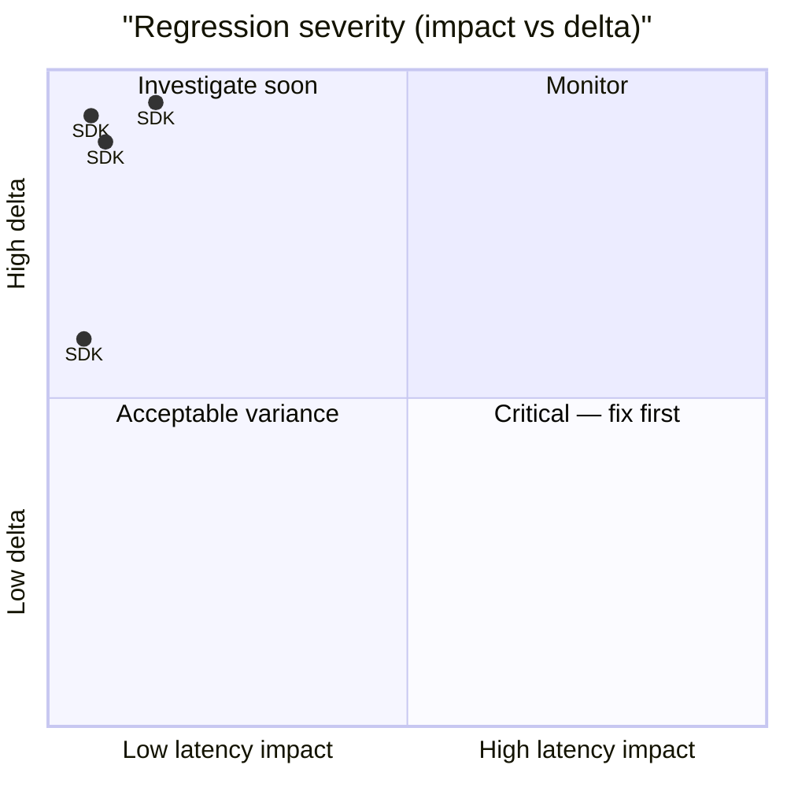

# 🚀 SQLite Performance Ledger

> [!NOTE] Competitive comparisons based on publicly available documentation as of June 2026. All SveltyCMS metrics self-measured via `bun test tests/benchmarks/`.

> [!IMPORTANT]
> **Console-only by default.** Use `BENCHMARK_RECORD=1` to write results to this report.
>
> ```bash
> BENCHMARK_RECORD=1 bun test tests/benchmarks/auth-performance.test.ts
> ```
>
> The full matrix runner (`bun run scripts/benchmark-matrix/index.ts --db=sqlite`) always records.

<!-- BENCHMARK_START -->

<!-- EXECUTIVE_START -->
<!-- LATEST_AUDIT_HEADER -->

## 📊 Latest Performance Audit

<!-- EXECUTIVE_FIX_NOTES_START -->

### 📝 Fix Overlays

> [!NOTE]
> Phase notes and remediation entries appear here after matrix or surgical runs.

<!-- EXECUTIVE_FIX_NOTES_END -->

> [!NOTE]
> **Partial update** — dimension rollups and issues reflect only tests invoked in this run.

**✅ PASS** _(partial invocation)_ · 1/62 tests · 61 skipped · **sqlite** · standalone run

### Dimension health

| Dimension      | Tests | Status | Worst Δ | Issues |
| -------------- | ----: | ------ | ------- | ------ |
| **Core**       |     6 | 🟢     | -48%    | 0      |
| **API**        |     0 | ⚪     | —       | 0      |
| **Scale**      |     0 | ⚪     | —       | 0      |
| **Resilience** |     0 | ⚪     | —       | 0      |

### Issues (action required)

> ✅ **All clear** — no regressions or budget violations detected.

### Executive latency matrix

| Scenario | Latency | Trend                                    | Budget | Result |
| -------- | ------- | ---------------------------------------- | ------ | ------ |
| **DB**   | 0.006ms | ⚪ stable at 0.006ms (±0.002ms) (3 runs) | < 5ms  | 🟢     |
| **SDK**  | 0.001ms | ⚪ stable at 0.001ms (3 runs)            | < 5ms  | 🟢     |
| **SDK**  | 0.005ms | ⚪ stable at 0.007ms (±0.002ms) (3 runs) | < 5ms  | 🟢     |
| **SDK**  | 0.083ms | ⚪ stable at 0.145ms (±0.067ms) (3 runs) | < 5ms  | 🟢     |
| **SDK**  | 0.057ms | ⚪ stable at 0.103ms (±0.040ms) (3 runs) | < 5ms  | 🟢     |
| **SDK**  | 0.155ms | ⚪ stable at 0.299ms (±0.128ms) (3 runs) | < 5ms  | 🟢     |

### Historical pulse

> **Scope:** Sparklines only — full run tables: [`tests/benchmarks/results/history.sqlite`](../../../tests/benchmarks/results/history.sqlite)

| Metric                                                    | Trend | Sparkline      | Latest     |
| --------------------------------------------------------- | ----- | -------------- | ---------- |
| api latency (HTTP: findById @ 8c (Cold)) (warm)           | 🟢    | `▁▅█▄`         | 8.690ms    |
| auth performance (Auth Validation @ 1c) (warm)            | 🟢    | `▁▁▅█`         | 1.220ms    |
| cold start phased (Cold Start (IDLE → HTTP READY)) (cold) | 🟢    | `▁`            | 2070.865ms |
| database performance (FIND MANY (limit 50)) (warm)        | 🟢    | `█▂▁▁▁▁▂▇▂▆█▆` | 0.292ms    |

<details>
<summary>📈 Latency trend chart (last 10 runs)</summary>

```mermaid
xychart-beta
  title "sqlite REST p95 (last 10 runs)"
  x-axis ["R1", "R2", "R3", "R4", "R5", "R6", "R7", "R8", "R9", "R10"]
  y-axis "Latency (ms)"
  line "p95" : [0.000, 0.000, 0.000, 0.000, 0.000, 0.000, 0.000, 0.000, 0.000, 0.000]
```

</details>
<details>
<summary>📊 Regression severity matrix (quadrant)</summary>


```mermaid
quadrantChart
  title "Regression severity (impact vs delta)"
  x-axis Low latency impact --> High latency impact
  y-axis Low delta --> High delta
  quadrant-1 Monitor
  quadrant-2 Investigate soon
  quadrant-3 Acceptable variance
  quadrant-4 Critical — fix first
    SDK: [0.05, 0.59]
    SDK: [0.08, 0.89]
    SDK: [0.06, 0.93]
    SDK: [0.15, 0.95]
```

</details>

<!-- EXECUTIVE_PARTIAL_WATERMARK -->

<!-- EXECUTIVE_ALERTS_START -->
<!-- EXECUTIVE_ALERTS_END -->

<!-- EXECUTIVE_END -->

<!-- SUMMARY_START -->

<!-- SUMMARY_RUN_OVERLAY_START -->

### Current Run Summary (2026-08-29)

> **Scope:** Only tests that ran in THIS invocation.

> ⚠️ Executive PASS/FAIL reflects the last full matrix run.

**Run ID:** `9fd1c866-b65f-4b33-88b0-5ae02e75c417` · **Tests invoked:** 1 · **Metrics:** 6 · **DB:** sqlite

| Test           | Metric                   | Avg (ms) | p95 (ms) | RPS    | Trend | Detail                                   |
| -------------- | ------------------------ | -------- | -------- | ------ | ----- | ---------------------------------------- |
| Local Cms Crud | Adapter FIND ONE         | 0.006    | 0.010    | 118758 | 🟢    | ⚪ stable at 0.006ms (±0.002ms) (3 runs) |
| Local Cms Crud | LocalCMS findById (Warm) | 0.001    | 0.002    | 774919 | 🟢    | ⚪ stable at 0.001ms (3 runs)            |
| Local Cms Crud | LocalCMS findById (Cold) | 0.005    | 0.007    | 153053 | 🟢    | ⚪ stable at 0.007ms (±0.002ms) (3 runs) |
| Local Cms Crud | LocalCMS create          | 0.083    | 0.156    | 4835   | 🟢    | ⚪ stable at 0.145ms (±0.067ms) (3 runs) |
| Local Cms Crud | LocalCMS update          | 0.057    | 0.088    | 9633   | 🟢    | ⚪ stable at 0.103ms (±0.040ms) (3 runs) |
| Local Cms Crud | LocalCMS mixed C/U/R     | 0.155    | 0.286    | 3091   | 🟢    | ⚪ stable at 0.299ms (±0.128ms) (3 runs) |

<!-- SUMMARY_RUN_OVERLAY_END -->

<!-- SUMMARY_HISTORY_START -->

### Historical Trends (2026-08-29)

> **Scope:** Sparklines only — full run tables live in `history.sqlite` (link below). Runs = sparkline bar count.

**Detail:** [`tests/benchmarks/results/history.sqlite`](../../../tests/benchmarks/results/history.sqlite) · `SELECT test_id, phase, avg_ms, p95_ms, rps, timestamp FROM runs WHERE db_type='sqlite' AND redis=0 ORDER BY timestamp DESC`

**Series:** 56 · **DB:** sqlite

| Metric                              | Trend | Sparkline (last 7) | Latest     |
| ----------------------------------- | ----- | ------------------ | ---------- |
| ADMIN UX VITALITY (warm)            | 🟢    | `▁█▄█`             | 4.044ms    |
| AI PERFORMANCE (warm)               | 🟢    | `▁▁█▁`             | 0.001ms    |
| API LATENCY (warm)                  | 🟢    | `▁▆▃█▄▆▃`          | 4.735ms    |
| AUTH PERFORMANCE (warm)             | 🟢    | `▁▁▂▂▂█▂`          | 1.381ms    |
| CACHE HIT RATIO (warm)              | 🟢    | `█▁▅▃▇▁▅`          | 2.233ms    |
| CACHE PERFORMANCE (warm)            | 🟢    | `▁▁▆█▆█`           | 1.228ms    |
| CACHE SERVICE (warm)                | 🟢    | `▃▁█▅▁▇▄`          | 4.510ms    |
| CLIENT JOURNEY (warm)               | 🟢    | `█▁`               | 9.324ms    |
| COLD START PHASED (cold)            | 🟢    | `▁`                | 2070.865ms |
| COMPETITIVE WORKLOAD REPLICA (warm) | 🟢    | `█▃▁▄▁▅▁`          | 0.781ms    |
| CONCURRENCY MAX (warm)              | 🟢    | `▁█▇`              | 835.712ms  |
| CONFIG PROMOTION (warm)             | 🟢    | `▁▄▅▄█▃▂`          | 4.627ms    |
| CONTENT SCALE STRESS (warm)         | 🟢    | `▇▁█▂▆▂`           | 0.706ms    |
| CONTENT SCAN (warm)                 | 🟢    | `▃▁▇█▂▂`           | 4.486ms    |
| DATA RESIDENCY FAILOVER (warm)      | 🟢    | `▁▂▅█▄▅`           | 2.825ms    |
| DATABASE PERFORMANCE (warm)         | 🟢    | `▂▂▂▁█▁▁`          | 0.156ms    |
| ENTRY EDIT HYDRATION (warm)         | 🟢    | `▂▁▅█▂▁█`          | 0.058ms    |
| FAILURE PROPAGATION (warm)          | 🟢    | `▁▆█▅▇█▅`          | 2.855ms    |
| GRAPHQL API PERFORMANCE (warm)      | 🟢    | `▁▅▅█▆▁▁`          | 1.359ms    |
| GRAPHQL CACHE HIT (warm)            | 🟢    | `█▁▄▁`             | 1.674ms    |
| GRAPHQL LOCAL SDK (warm)            | 🟢    | `█▁`               | 0.000ms    |
| GRAPHQL STRESS (warm)               | 🟢    | `█▁▂▃▁▅▆`          | 76.356ms   |
| HOOKS PERFORMANCE (warm)            | 🟢    | `▇▂▂█▂▆▁`          | 0.981ms    |
| INDEX PRESSURE (warm)               | 🟢    | `▄█▁▅`             | 1.770ms    |
| LARGE PAYLOAD STREAMING (warm)      | 🟢    | `█▅▆▃▁▇▄`          | 16.614ms   |
| LOCAL API PERFORMANCE (warm)        | 🟢    | `▁▅▇▇▆██`          | 0.037ms    |
| LOCAL API THROUGHPUT (warm)         | 🟢    | `▁▁▂▄▇█▇`          | 1.146ms    |
| LOCAL CMS CRUD (warm)               | 🟢    | `▆▁▅▁▁█▄`          | 0.057ms    |
| LOCAL SDK VS DIRECT (warm)          | 🟢    | `▇▄██▁▄▅`          | 0.135ms    |
| LONGEVITY SOAK (warm)               | 🟢    | `▁`                | 6.010ms    |
| MEDIA PERFORMANCE (warm)            | 🟢    | `█▁▅▄▁▄▄`          | 109.651ms  |
| MEDIA UPLOAD STRESS (warm)          | 🟢    | `▁▂▄█▄▄`           | 170.481ms  |
| MEMORY STABILITY (warm)             | 🟢    | `▁`                | 0.000ms    |
| MIGRATION SCALE (warm)              | 🟢    | `▁▄▁▁█▁▁`          | 4.044ms    |
| MIXED WORKLOAD (warm)               | 🟢    | `▂█▃▁`             | 2.094ms    |
| MULTI TENANT PERFORMANCE (warm)     | 🟢    | `▁██`              | 6.059ms    |
| NEGATIVE CACHE (warm)               | 🟢    | `▁██▁▇▇▁`          | 0.001ms    |
| OPENAPI PERFORMANCE (warm)          | 🟢    | `▁▄▆▂▇█▂`          | 0.656ms    |
| PRODUCTION DAY (warm)               | 🟢    | `▁▇█`              | 6.238ms    |
| REALTIME PERFORMANCE (warm)         | 🟢    | `▁▁█▁▁█▁`          | 0.000ms    |
| RELATIONAL PERFORMANCE (warm)       | 🟢    | `▁█▃▆█▃▆`          | 6.540ms    |
| REST API PERFORMANCE (warm)         | 🟢    | `▁▃██▇▇▄`          | 2.355ms    |
| REVISION STRESS (warm)              | 🟢    | `▄█▃▇▃▁▂`          | 0.740ms    |
| RIGHT TO BE FORGOTTEN AUDIT (warm)  | 🟢    | `▁▁▁█▆`            | 2.485ms    |
| SECURITY AUDIT (warm)               | 🟢    | `▁█▁▁▁▁▁`          | 0.002ms    |
| SEO PERFORMANCE (warm)              | 🟢    | `█▁▁▁█▁▁`          | 6.715ms    |
| STATE MACHINE TRANSITION (warm)     | 🟢    | `█▇▇▁▁▂▄`          | 30.898ms   |
| TELEMETRY PERFORMANCE (warm)        | 🟢    | `█▁▃▁`             | 0.001ms    |
| TRANSACTION ACID (warm)             | 🟢    | `▁█▁▆`             | 0.337ms    |
| TRUTH LATENCY (warm)                | 🟢    | `▁▄▁▁█▁▁`          | 0.001ms    |
| WEBSOCKET BROADCAST (warm)          | 🟢    | `▁▁▁█▆`            | 0.497ms    |
| WIDGET PERFORMANCE (warm)           | 🟢    | `▃▇▁█▇▁█`          | 0.123ms    |
| CONTENT INCREMENTAL RELOAD (warm)   | ⚪    | `▁▁█▄▂▁█`          | 8.829ms    |
| MIDDLEWARE FLAMEGRAPH (warm)        | ⚪    | `▃▂▁▃▂▂█`          | 3.376ms    |
| TEMPORAL INTEGRITY (warm)           | ⚪    | `▁▁▁▁▁█▆`          | 6.456ms    |
| THROTTLING BACKOFF STRESS (warm)    | ⚪    | `▃▁▃▂█▂▇`          | 31.860ms   |

<!-- SUMMARY_HISTORY_END --><!-- SUMMARY_END -->

<!-- LEDGER_START -->

## 🔬 Full benchmark ledger (58 modules)

Expand dimension groups, then any row, for ASCII truth tables. Executive summary above shows pass/fail and issues only.

<!-- LEDGER_DIMENSION:CORE:START -->

<details id="ledger-dimension-core">
<summary><strong>Core</strong> · 83 tests</summary>

<!-- SECTION:API_LATENCY:START -->

<details id="section-api_latency">
<summary><strong>🏷️ API LAYER LATENCY</strong> · 🟢 2.170ms · ➡️ recorded (awaiting trend) · <a href="../../../tests/benchmarks/api-latency.test.ts">source</a></summary>

<!-- LEDGER_TRUTH_START -->

```text
╔═══════════════════════════════════════════════════════════════════════════════════════════════════════╗
║                                     SVELTYCMS — API LAYER LATENCY                                     ║
║                              File: tests/benchmarks/api-latency.test.ts                               ║
║                                       Ran: 2026-08-29 16:37:56                                        ║
║              Cold full-pipeline findById + warm TURBO-HIT path after responseCache fill.              ║
╠═══════════════════════════════════════════════════════════════════════════════════════════════════════╣
║ HTTP: findById @ 8c (Cold)   │ Cold:     2.17 ms │ Warm:     3.056 ms │ p95:     5.025 ms │   2,449 RPS ║
║ HTTP: findById TURBO-HIT @ 8c (Warm) │ Cold:     0.55 ms │ Warm:     2.056 ms │ p95:     2.733 ms │   3,813 RPS ║
╚═══════════════════════════════════════════════════════════════════════════════════════════════════════╝
```

<!-- LEDGER_TRUTH_END -->

</details>
<!-- SECTION:API_LATENCY:END -->

<!-- SECTION:COLD_START:START -->
<details id="section-cold_start">
<summary><strong>🏷️ cold start phased</strong> · 🟢 2070.865ms · ➡️ ⚪ established at 2070.87ms (1 run) (2026-08-28 09:36:16) · <a href="../../../tests/benchmarks/cold-start-phased.test.ts">source</a></summary>
<!-- LEDGER_TRUTH_START -->
```text
╔═════════════════════════════════════════════════════════════════════════════════════════╗
║                           SVELTYCMS — PHASED COLD START AUDIT                           ║
║                    File: tests/benchmarks/cold-start-phased.test.ts                     ║
║                                Ran: 2026-08-28 09:36:16                                 ║
║     Measures process spawn, dependency hydration, and first-request TTFB readiness.     ║
╠═════════════════════════════════════════════════════════════════════════════════════════╣
║ Initial Cold Boot (Fresh Process) │     3043.197 ms │ p95:     3043.197 ms │ RPS:          0 ║
║ Steady-State Respawn (Average) │     2070.865 ms │ p95:     3043.197 ms │ RPS:          0 ║
╚═════════════════════════════════════════════════════════════════════════════════════════╝
```
<!-- LEDGER_TRUTH_END -->

</details>
<!-- SECTION:COLD_START:END -->

<!-- SECTION:TRUTH_AUDIT:START -->

<details id="section-truth_audit">
<summary><strong>🏷️ SRE TRUTH AUDIT</strong> · 🟢 0.080ms · ➡️ recorded (awaiting trend) · <a href="../../../tests/benchmarks/truth-latency.test.ts">source</a></summary>

<!-- LEDGER_TRUTH_START -->

```text
╔═══════════════════════════════════════════════════════════════════════════════════════════════════════╗
║                                      SVELTYCMS — SRE TRUTH AUDIT                                      ║
║                             File: tests/benchmarks/truth-latency.test.ts                              ║
║                                       Ran: 2026-08-29 16:37:37                                        ║
║            Validates performance claims by comparing SDK, Middleware, and Real HTTP Stack             ║
╠═══════════════════════════════════════════════════════════════════════════════════════════════════════╣
║ Logic Baseline               │ Cold:     0.08 ms │ Warm:     0.000 ms │ p95:     0.001 ms │ 434,594 RPS ║
║ Local SDK (Full)             │ Cold:    24.38 ms │ Warm:     0.015 ms │ p95:     0.014 ms │  26,220 RPS ║
║ HTTP End-to-End              │ Cold:     5.88 ms │ Warm:     0.482 ms │ p95:     0.770 ms │   2,065 RPS ║
╚═══════════════════════════════════════════════════════════════════════════════════════════════════════╝
```

<!-- LEDGER_TRUTH_END -->

</details>
<!-- SECTION:TRUTH_AUDIT:END -->

<!-- SECTION:SCAN:START -->

<details id="section-scan">
<summary><strong>🏷️ Self-Healing Content Scan</strong> · 🟢 3.404ms · ➡️ recorded (awaiting trend) · <a href="../../../tests/benchmarks/content-scan.test.ts">source</a></summary>

<!-- LEDGER_TRUTH_START -->

```text
╔═══════════════════════════════════════════════════════════════════════════════════════════════════════╗
║                                    SVELTYCMS — CONTENT SCAN AUDIT                                     ║
║                              File: tests/benchmarks/content-scan.test.ts                              ║
║                                       Ran: 2026-08-29 16:41:05                                        ║
║          Measures filesystem + metadata processing and persistent Mtime dirty-bit discovery.          ║
╠═══════════════════════════════════════════════════════════════════════════════════════════════════════╣
║ Cold Discovery (Filesystem I/O) │        3.404 ms │ p95:        4.006 ms │ RPS:        294 ║
║ Warm Discovery (Mtime Tree Hit) │ Cold:     2.83 ms │ Warm:     1.740 ms │ p95:     3.241 ms │     515 RPS ║
╚═══════════════════════════════════════════════════════════════════════════════════════════════════════╝
```

<!-- LEDGER_TRUTH_END -->

</details>
<!-- SECTION:SCAN:END -->

<!-- SECTION:INCREMENTAL:START -->

<details id="section-incremental">
<summary><strong>🏷️ Incremental Content Reload</strong> · 🟢 5.180ms · ➡️ recorded (awaiting trend) · <a href="../../../tests/benchmarks/content-incremental-reload.test.ts">source</a></summary>

<!-- LEDGER_TRUTH_START -->

```text
╔═══════════════════════════════════════════════════════════════════════════════════════════════════════╗
║                             SVELTYCMS — INCREMENTAL CONTENT RELOAD AUDIT                              ║
║                       File: tests/benchmarks/content-incremental-reload.test.ts                       ║
║                                       Ran: 2026-08-29 16:41:07                                        ║
║      Measures surgical single-file fullReload vs full reconciliation path and batch processing.       ║
╠═══════════════════════════════════════════════════════════════════════════════════════════════════════╣
║ Incremental fullReload (1 file) │ Cold:     5.18 ms │ Warm:     0.205 ms │ p95:     0.522 ms │   3,717 RPS ║
║ Full Reconciliation Reload   │ Cold:     3.88 ms │ Warm:     0.308 ms │ p95:     0.461 ms │   2,937 RPS ║
║ Sequential 10-File Reload    │ Cold:     5.15 ms │ Warm:     1.876 ms │ p95:     5.028 ms │     431 RPS ║
║ Batched 10-File Reload       │ Cold:     1.79 ms │ Warm:     1.126 ms │ p95:     1.422 ms │     853 RPS ║
╚═══════════════════════════════════════════════════════════════════════════════════════════════════════╝
```

<!-- LEDGER_TRUTH_END -->

</details>
<!-- SECTION:INCREMENTAL:END -->

<!-- SECTION:HOOKS_TRACE:START -->

<details id="section-hooks_trace">
<summary><strong>🏷️ Middleware & Hooks Performance</strong> · 🟢 1.920ms · ➡️ recorded (awaiting trend) · <a href="../../../tests/benchmarks/hooks-performance.test.ts">source</a></summary>

<!-- LEDGER_TRUTH_START -->

```text
╔═══════════════════════════════════════════════════════════════════════════════════════════════════════╗
║                                 SVELTYCMS — MIDDLEWARE & HOOKS AUDIT                                  ║
║                           File: tests/benchmarks/hooks-performance.test.ts                            ║
║                                       Ran: 2026-08-29 16:39:07                                        ║
║Measures the cost of the full middleware chain including Turbo, Security, Auth, and Audit via HTTP E2E.║
╠═══════════════════════════════════════════════════════════════════════════════════════════════════════╣
║ Static Asset (No Middleware) │ Cold:     1.92 ms │ Warm:     0.522 ms │ p95:     0.908 ms │   1,744 RPS ║
║ Turbo Pipeline (Light)       │ Cold:     1.37 ms │ Warm:     0.335 ms │ p95:     0.827 ms │   2,655 RPS ║
║ Full Security + Auth Pipeline │ Cold:     2.01 ms │ Warm:     0.627 ms │ p95:     1.292 ms │   1,474 RPS ║
║ REST with API Caching        │ Cold:     3.98 ms │ Warm:     0.491 ms │ p95:     1.047 ms │   1,815 RPS ║
║ Mutation (audit logging disabled) │ Cold:     4.95 ms │ Warm:     0.994 ms │ p95:     2.466 ms │     774 RPS ║
╚═══════════════════════════════════════════════════════════════════════════════════════════════════════╝
```

<!-- LEDGER_TRUTH_END -->

</details>
<!-- SECTION:HOOKS_TRACE:END -->

<!-- SECTION:EDGE_SYNC:START -->

<details id="section-edge_sync">
<summary><strong>🏷️ Edge Sync & Distributed Cache</strong> · ⏳ pending · ➡️ baseline · <a href="../../../tests/benchmarks/edge-sync.test.ts">source</a></summary>

<!-- LEDGER_TRUTH_START -->

> ⏳ Pending — Verifies distributed L1/L2 cache invalidation latency across simulated nodes.

<!-- LEDGER_TRUTH_END -->

</details>
<!-- SECTION:EDGE_SYNC:END -->

<!-- SECTION:TELEMETRY:START -->
<details id="section-telemetry">
<summary><strong>🏷️ Telemetry</strong> · 🟢 0.150ms · ➡️ recorded (awaiting trend) · <a href="../../../tests/benchmarks/telemetry-performance.test.ts">source</a></summary>
<!-- LEDGER_TRUTH_START -->
```text
╔═══════════════════════════════════════════════════════════════════════════════════════════════════════╗
║                              SVELTYCMS — TELEMETRY & UPDATE PERFORMANCE                               ║
║                         File: tests/benchmarks/telemetry-performance.test.ts                          ║
║                                       Ran: 2026-08-29 16:39:02                                        ║
║Measures telemetry update check latency and memory impact on both happy-path and failure-path scenarios.║
╠═══════════════════════════════════════════════════════════════════════════════════════════════════════╣
║ Telemetry (Happy Path)       │ Cold:     0.15 ms │ Warm:     0.000 ms │ p95:     0.001 ms │ 769,182 RPS ║
║ Telemetry (Failure Path)     │ Cold:     0.03 ms │ Warm:     0.001 ms │ p95:     0.002 ms │ 724,638 RPS ║
╚═══════════════════════════════════════════════════════════════════════════════════════════════════════╝
```
<!-- LEDGER_TRUTH_END -->

</details>
<!-- SECTION:TELEMETRY:END -->

<!-- SECTION:STATE_MACHINE:START -->

<details id="section-state_machine">
<summary><strong>🏷️ State Machine Transitions</strong> · 🟢 44.500ms · ➡️ recorded (awaiting trend) · <a href="../../../tests/benchmarks/state-machine-transition.test.ts">source</a></summary>

<!-- LEDGER_TRUTH_START -->

```text
╔═══════════════════════════════════════════════════════════════════════════════════════════════════════╗
║                                  SVELTYCMS — STATE MACHINE INTEGRITY                                  ║
║                        File: tests/benchmarks/state-machine-transition.test.ts                        ║
║                                       Ran: 2026-08-29 16:41:13                                        ║
║Measures state machine self-healing transition latencies, convergence settling time, and health probe consistency under stress.║
╠═══════════════════════════════════════════════════════════════════════════════════════════════════════╣
║ State Transition (Transient) │ Cold:    44.50 ms │ Warm:    24.937 ms │ p95:    28.873 ms │      38 RPS ║
║ Self-Healing Full Convergence │ Cold:    27.43 ms │ Warm:    26.601 ms │ p95:    30.610 ms │      38 RPS ║
╚═══════════════════════════════════════════════════════════════════════════════════════════════════════╝
```

<!-- LEDGER_TRUTH_END -->

</details>
<!-- SECTION:STATE_MACHINE:END -->

<!-- SECTION:DB_RAW_P95:START -->
<details id="section-db_raw_p95">
<summary><strong>🏷️ database performance</strong> · 🟢 0.450ms · ➡️ recorded (awaiting trend) · <a href="../../../tests/benchmarks/database-performance.test.ts">source</a></summary>
<!-- LEDGER_INSIGHT_START -->
> [!NOTE]
> **Specific to this test**: Both avg and p95 degraded — likely adapter or infrastructure bottleneck. Check DB connection pool, indexes, or recent commits.  
Throughput dropped 64% — check connection pool saturation or lock contention.  
**Severe degradation** (+72%) — review recent commits immediately.
<!-- LEDGER_INSIGHT_END -->

<!-- LEDGER_TRUTH_START -->

```text
╔═══════════════════════════════════════════════════════════════════════════════════════════════════════╗
║                           SVELTYCMS — DATABASE ADAPTER PERFORMANCE (SQLITE)                           ║
║                          File: tests/benchmarks/database-performance.test.ts                          ║
║                                       Ran: 2026-08-29 16:40:45                                        ║
║          Measures raw CRUD performance, indexing efficiency, and connection pool resilience.          ║
╠═══════════════════════════════════════════════════════════════════════════════════════════════════════╣
║ INSERT                       │ Cold:     0.45 ms │ Warm:     0.073 ms │ p95:     0.602 ms │   3,687 RPS ║
║ FIND ONE                     │ Cold:     0.49 ms │ Warm:     0.006 ms │ p95:     0.010 ms │ 121,566 RPS ║
║ FIND MANY (limit 50)         │ Cold:     1.26 ms │ Warm:     0.090 ms │ p95:     0.115 ms │   8,754 RPS ║
║ QUERY BUILDER LIST (50)      │ Cold:     2.50 ms │ Warm:     0.822 ms │ p95:     1.062 ms │   1,129 RPS ║
║ FIND PAGE (50 hasMore)       │ Cold:     1.40 ms │ Warm:     0.120 ms │ p95:     0.209 ms │   6,399 RPS ║
║ FIND PAGE keyset             │ Cold:     1.34 ms │ Warm:     0.116 ms │ p95:     0.165 ms │   7,045 RPS ║
║ FIND MANY offset 50          │ Cold:     0.71 ms │ Warm:     0.066 ms │ p95:     0.126 ms │  11,702 RPS ║
║ LIST+COUNT (legacy)          │ Cold:     1.34 ms │ Warm:     0.154 ms │ p95:     0.196 ms │   5,467 RPS ║
║ UPDATE                       │ Cold:     1.34 ms │ Warm:     0.052 ms │ p95:     0.175 ms │   7,943 RPS ║
║ UPDATE (no-returning)        │ Cold:     0.81 ms │ Warm:     0.075 ms │ p95:     0.174 ms │   6,600 RPS ║
║ NATIVE UPSERT                │ Cold:     3.51 ms │ Warm:     0.117 ms │ p95:     0.294 ms │   4,860 RPS ║
║ COUNT                        │ Cold:     0.91 ms │ Warm:     0.111 ms │ p95:     0.239 ms │   7,292 RPS ║
║ COUNT ESTIMATE               │ Cold:     0.83 ms │ Warm:     0.021 ms │ p95:     0.034 ms │  40,931 RPS ║
║ COUNT CACHED                 │ Cold:     3.19 ms │ Warm:     0.001 ms │ p95:     0.002 ms │ 617,151 RPS ║
║ DELETE (Active Rows)         │ Cold:    24.20 ms │ Warm:     0.061 ms │ p95:     0.110 ms │   5,379 RPS ║
║ BULK INSERT (100)            │ Cold:     2.47 ms │ Warm:    21.313 ms │ p95:    63.628 ms │      47 RPS ║
║ BULK UPDATE (100 heterogeneous) │ Cold:    13.47 ms │ Warm:     1.342 ms │ p95:    10.448 ms │     419 RPS ║
║ BULK UPDATE (100 homogeneous) │ Cold:    30.93 ms │ Warm:     0.814 ms │ p95:     1.630 ms │   1,024 RPS ║
╚═══════════════════════════════════════════════════════════════════════════════════════════════════════╝
```

<!-- LEDGER_TRUTH_END -->

</details>
<!-- SECTION:DB_RAW_P95:END -->

<!-- SECTION:ACID:START -->
<details id="section-acid">
<summary><strong>🏷️ transaction acid</strong> · 🟢 0.580ms · ➡️ recorded (awaiting trend) · <a href="../../../tests/benchmarks/transaction-acid.test.ts">source</a></summary>
<!-- LEDGER_INSIGHT_START -->
> [!NOTE]
> **Specific to this test**: Both avg and p95 degraded — likely adapter or infrastructure bottleneck. Check DB connection pool, indexes, or recent commits.  
Throughput dropped 43% — check connection pool saturation or lock contention.  
**Severe degradation** (+96%) — review recent commits immediately.
<!-- LEDGER_INSIGHT_END -->

<!-- LEDGER_TRUTH_START -->

```text
╔═══════════════════════════════════════════════════════════════════════════════════════════════════════╗
║                                   SVELTYCMS — ACID INTEGRITY AUDIT                                    ║
║                            File: tests/benchmarks/transaction-acid.test.ts                            ║
║                                       Ran: 2026-08-29 16:40:48                                        ║
║         Measures transaction commit latencies and rollback overhead across database adapters          ║
╠═══════════════════════════════════════════════════════════════════════════════════════════════════════╣
║ TX Commit                    │ Cold:     0.58 ms │ Warm:     0.005 ms │ p95:     0.022 ms │ 107,334 RPS ║
║ TX Rollback Integrity        │ Cold:     1.40 ms │ Warm:     0.107 ms │ p95:     0.156 ms │   8,711 RPS ║
╚═══════════════════════════════════════════════════════════════════════════════════════════════════════╝
```

<!-- LEDGER_TRUTH_END -->

</details>
<!-- SECTION:ACID:END -->

<!-- SECTION:CACHE:START -->
<details id="section-cache">
<summary><strong>🏷️ Cache</strong> · 🟢 0.570ms · ➡️ recorded (awaiting trend) · <a href="../../../tests/benchmarks/cache-performance.test.ts">source</a></summary>
<!-- LEDGER_INSIGHT_START -->
> [!NOTE]
> **Specific to this test**: Both avg and p95 degraded — likely adapter or infrastructure bottleneck. Check DB connection pool, indexes, or recent commits.  
Throughput dropped 32% — check connection pool saturation or lock contention.  
**Severe degradation** (+29%) — review recent commits immediately.
<!-- LEDGER_INSIGHT_END -->

<!-- LEDGER_TRUTH_START -->

```text
╔═══════════════════════════════════════════════════════════════════════════════════════════════════════╗
║                             SVELTYCMS — CACHE EVICTION BOUNDARY HARDENING                             ║
║                          File: tests/benchmarks/cache-eviction-leak.test.ts                           ║
║                                       Ran: 2026-08-29 16:40:59                                        ║
║       Validates strict LRU cache pruning rules and memory containment under heavy key flooding.       ║
╠═══════════════════════════════════════════════════════════════════════════════════════════════════════╣
║ Cache Flooding & Eviction    │ Cold:     0.57 ms │ Warm:     0.002 ms │ p95:     0.002 ms │ 446,304 RPS ║
╚═══════════════════════════════════════════════════════════════════════════════════════════════════════╝
```

<!-- LEDGER_TRUTH_END -->

</details>
<!-- SECTION:CACHE:END -->

<!-- SECTION:CACHE_EFFICIENCY:START -->
<details id="section-cache_efficiency">
<summary><strong>🏷️ cache hit ratio</strong> · 🟢 0.394ms · ➡️ recorded (awaiting trend) · <a href="../../../tests/benchmarks/cache-hit-ratio.test.ts">source</a></summary>
<!-- LEDGER_TRUTH_START -->
```text
╔═══════════════════════════════════════════════════════════════════════════════════════════════════════╗
║                                  SVELTYCMS — CACHE EFFICIENCY AUDIT                                   ║
║                            File: tests/benchmarks/cache-hit-ratio.test.ts                             ║
║                                       Ran: 2026-08-29 16:38:20                                        ║
║           Measures true cold-fill, warm hit ratio, miss penalty, and invalidation latency.            ║
╠═══════════════════════════════════════════════════════════════════════════════════════════════════════╣
║ Cache Cold Fill (Miss + Repopulate) │        0.394 ms │ p95:        0.551 ms │ RPS:      2,540 ║
║ Cache Hit (Warm)             │ Cold:     0.46 ms │ Warm:     0.302 ms │ p95:     0.401 ms │   3,099 RPS ║
║ Bypass Cache (Direct DB)     │ Cold:     0.59 ms │ Warm:     0.361 ms │ p95:     0.379 ms │   2,750 RPS ║
║ Cache Invalidation           │ Cold:     1.25 ms │ Warm:     0.578 ms │ p95:     0.776 ms │   1,406 RPS ║
╚═══════════════════════════════════════════════════════════════════════════════════════════════════════╝
```
<!-- LEDGER_TRUTH_END -->

</details>
<!-- SECTION:CACHE_EFFICIENCY:END -->

<!-- SECTION:BUILD:START -->

<details id="section-build">
<summary><strong>🏷️ Production Build Analysis</strong> · ⚪ ⏳ pending · ➡️ pending · <a href="../../../tests/benchmarks/build-analysis.test.ts">source</a></summary>

<!-- LEDGER_TRUTH_START -->

```text
╔═══════════════════════════════════════════════════════════════════════════════════════════════════════╗
║                                 SVELTYCMS — PRODUCTION BUILD ANALYSIS                                 ║
║                             File: tests/benchmarks/build-analysis.test.ts                             ║
║                                       Ran: 2026-08-29 16:42:30                                        ║
║              Measures compilation speed, bundle size trends, and tree-shaking efficiency              ║
╠═══════════════════════════════════════════════════════════════════════════════════════════════════════╣
║ Production Build               │        0.000 ms │ p95:        0.000 ms │ RPS:          0 ║
╚═══════════════════════════════════════════════════════════════════════════════════════════════════════╝
```

<!-- LEDGER_TRUTH_END -->

</details>
<!-- SECTION:BUILD:END -->

<!-- SECTION:DX_TOOLING:START -->

<details id="section-dx_tooling">
<summary><strong>🏷️ DX Toolchain Performance</strong> · ⏳ pending · ➡️ baseline · <a href="../../../tests/benchmarks/dev-dependency-load.test.ts">source</a></summary>

<!-- LEDGER_TRUTH_START -->

> ⏳ Pending — Measures overhead of the build, sync, and lint toolchain.

<!-- LEDGER_TRUTH_END -->

</details>
<!-- SECTION:DX_TOOLING:END -->

<!-- SECTION:CACHE_SVC:START -->

<details id="section-cache_svc">
<summary><strong>🏷️ CacheService Micro-Benchmark</strong> · 🟢 4.884ms · ➡️ recorded (awaiting trend) · <a href="../../../tests/benchmarks/cache-service.test.ts">source</a></summary>

<!-- LEDGER_TRUTH_START -->

```text
╔═══════════════════════════════════════════════════════════════════════════════════════════════════════╗
║                                  SVELTYCMS — CACHE SERVICE TELEMETRY                                  ║
║                             File: tests/benchmarks/cache-service.test.ts                              ║
║                                       Ran: 2026-08-29 16:41:00                                        ║
║               Measures L1 cache hit latency and pattern invalidation overhead at scale.               ║
╠═══════════════════════════════════════════════════════════════════════════════════════════════════════╣
║ Cache L1 Hit                 │ Cold:     0.45 ms │ Warm:     0.000 ms │ p95:     0.001 ms │ 1,181,249 RPS ║
║ Pattern Invalidation (1k items @ 200k noise) │        4.884 ms │ p95:        6.531 ms │ RPS:        205 ║
║ Pattern Invalidation (Namespaced 1k @ 100k noise) │        2.679 ms │ p95:        3.211 ms │ RPS:        373 ║
╚═══════════════════════════════════════════════════════════════════════════════════════════════════════╝
```

<!-- LEDGER_TRUTH_END -->

</details>
<!-- SECTION:CACHE_SVC:END -->

<!-- SECTION:LOCAL_API:START -->

<details id="section-local_api">
<summary><strong>🏷️ LocalCMS SDK Overhead</strong> · 🟢 0.598ms · ➡️ recorded (awaiting trend) · <a href="../../../tests/benchmarks/local-api-performance.test.ts">source</a></summary>

<!-- LEDGER_TRUTH_START -->

```text
╔═════════════════════════════════════════════════════════════════════════════════════════╗
║                     SVELTYCMS — DIRECT ADAPTER THROUGHPUT (SQLITE)                      ║
║                   File: tests/benchmarks/local-api-throughput.test.ts                   ║
║                                Ran: 2026-08-28 10:17:19                                 ║
║Measures direct adapter write throughput, read throughput, and percentile latencies with zero HTTP overhead.║
╠═════════════════════════════════════════════════════════════════════════════════════════╣
║ Writes (1000 atomic increments) │        0.598 ms │ p95:        0.588 ms │ RPS:      9,965 ║
║ Reads (1000 point lookups)     │        0.573 ms │ p95:        1.451 ms │ RPS:     76,610 ║
╚═════════════════════════════════════════════════════════════════════════════════════════╝
```

<!-- LEDGER_TRUTH_END -->

</details>
<!-- SECTION:LOCAL_API:END -->

<!-- SECTION:SETUP_PROXY:START -->

<details id="section-setup_proxy">
<summary><strong>🏷️ Setup Proxy & Bootstrap Isolation</strong> · ⏳ pending · ➡️ baseline · <a href="../../../tests/benchmarks/setup-proxy.test.ts">source</a></summary>

<!-- LEDGER_TRUTH_START -->

> ⏳ Pending — Setup proxy isolation and bootstrap security gating.

<!-- LEDGER_TRUTH_END -->

</details>
<!-- SECTION:SETUP_PROXY:END -->

<!-- SECTION:HTTP:START -->
<details id="section-http">
<summary><strong>🏷️ HTTP</strong> · 🟢 122.505ms · ↘️ ⚪ stable at 137.22ms (±36.48ms) (5 runs) (2026-08-29 18:01:49) · <a href="../../../tests/benchmarks/media-performance.test.ts">source</a></summary>
<!-- LEDGER_INSIGHT_START -->
> [!NOTE]
> **Specific to this test**: Performance improved — recent optimizations or cache warming likely effective.  
Throughput dropped 13% — check connection pool saturation or lock contention.
<!-- LEDGER_INSIGHT_END -->

<!-- LEDGER_TRUTH_START -->

> ⏳ Pending

<!-- LEDGER_TRUTH_END -->

</details>
<!-- SECTION:HTTP:END -->

<!-- SECTION:LOGIC:START -->
<details id="section-logic">
<summary><strong>🏷️ Logic</strong> · 🟢 0.001ms · ➡️ ⚪ stable at 0ms (±0.001ms) (7 runs) (2026-08-29 12:54:16) · <a href="../../../tests/benchmarks/truth-latency.test.ts">source</a></summary>
<!-- LEDGER_TRUTH_START -->
> ⏳ Pending
<!-- LEDGER_TRUTH_END -->

</details>
<!-- SECTION:LOGIC:END -->

<!-- SECTION:SDK:START -->
<details id="section-sdk">
<summary><strong>🏷️ SDK</strong> · 🟢 0.155ms · ↘️ ⚪ stable at 0.245ms (±0.076ms) (7 runs) (2026-08-29 18:41:05) · <a href="../../../tests/benchmarks/local-cms-crud.test.ts">source</a></summary>
<!-- LEDGER_INSIGHT_START -->
> [!NOTE]
> **Specific to this test**: Performance improved — recent optimizations or cache warming likely effective.
<!-- LEDGER_INSIGHT_END -->

<!-- LEDGER_TRUTH_START -->

```text
╔═══════════════════════════════════════════════════════════════════════════════════════════════════════╗
║                                SVELTYCMS — LOCALCMS CRUD TAX (SQLITE)                                 ║
║                             File: tests/benchmarks/local-cms-crud.test.ts                             ║
║                                       Ran: 2026-08-29 18:41:05                                        ║
║Measures full CollectionsNamespace tax vs direct adapter baseline with isolated garbage collection and deterministic ID generation.║
╠═══════════════════════════════════════════════════════════════════════════════════════════════════════╣
║ Adapter FIND ONE             │ Cold:     1.26 ms │ Warm:     0.006 ms │ p95:     0.010 ms │ 118,758 RPS ║
║ LocalCMS findById (Warm)     │ Cold:     0.21 ms │ Warm:     0.001 ms │ p95:     0.002 ms │ 774,919 RPS ║
║ LocalCMS findById (Cold)     │ Cold:     0.33 ms │ Warm:     0.005 ms │ p95:     0.007 ms │ 153,053 RPS ║
║ LocalCMS create              │ Cold:     0.65 ms │ Warm:     0.083 ms │ p95:     0.156 ms │   4,835 RPS ║
║ LocalCMS update              │ Cold:     1.20 ms │ Warm:     0.057 ms │ p95:     0.088 ms │   9,633 RPS ║
║ LocalCMS mixed C/U/R         │ Cold:     0.83 ms │ Warm:     0.155 ms │ p95:     0.286 ms │   3,091 RPS ║
╚═══════════════════════════════════════════════════════════════════════════════════════════════════════╝
```

<!-- LEDGER_TRUTH_END -->

</details>
<!-- SECTION:SDK:END -->

<!-- SECTION:UNKNOWN:START -->
<details id="section-unknown">
<summary><strong>🏷️ unknown</strong> · 🟢 0.002ms · ➡️ recorded (awaiting trend) · <a href="../../../tests/benchmarks/database-performance.test.ts">source</a></summary>
<!-- LEDGER_INSIGHT_START -->
> [!NOTE]
> **Specific to this test**: Both avg and p95 degraded — likely adapter or infrastructure bottleneck. Check DB connection pool, indexes, or recent commits.  
Throughput dropped 95% — check connection pool saturation or lock contention.  
**Severe degradation** (+2182%) — review recent commits immediately.
<!-- LEDGER_INSIGHT_END -->

<!-- LEDGER_TRUTH_START -->

```text
╔═════════════════════════════════════════════════════════════════════════════════════════╗
║                      SVELTYCMS — CACHE EVICTION BOUNDARY HARDENING                      ║
║                                      File: unknown                                      ║
║                                Ran: 2026-08-23 22:49:42                                 ║
╠═════════════════════════════════════════════════════════════════════════════════════════╣
║ Cache Flooding & Eviction      │        0.002 ms │ p95:        0.002 ms │ RPS:    491,908 ║
╚═════════════════════════════════════════════════════════════════════════════════════════╝
```

<!-- LEDGER_TRUTH_END -->

</details>
<!-- SECTION:UNKNOWN:END -->

<!-- SECTION:MIDDLEWARE:START -->
<details id="section-middleware">
<summary><strong>🏷️ Middleware</strong> · ⚪ 1.961ms · ↗️ 🔴 slower: 0.944ms → 1.96ms (+108%) (7 runs) (2026-08-29 12:59:31) · <a href="../../../tests/benchmarks/hooks-performance.test.ts">source</a></summary>
<!-- LEDGER_INSIGHT_START -->
> [!NOTE]
> **Specific to this test**: Both avg and p95 degraded — likely adapter or infrastructure bottleneck. Check DB connection pool, indexes, or recent commits.  
Throughput dropped 50% — check connection pool saturation or lock contention.  
**Severe degradation** (+108%) — review recent commits immediately.
<!-- LEDGER_INSIGHT_END -->

<!-- LEDGER_TRUTH_START -->

```text
╔═════════════════════════════════════════════════════════════════════════════════════════╗
║                         MIDDLEWARE FLAMEGRAPH PROFILER (SQLITE)                         ║
║                  File: tests/benchmarks/middleware-flamegraph.test.ts                   ║
║                                Ran: 2026-08-28 10:30:57                                 ║
║Measures isolated microsecond cost and incremental deltas of each middleware stage from edge to database.║
╠═════════════════════════════════════════════════════════════════════════════════════════╣
║ Stage 0: Raw Socket Baseline (Static Asset) │        1.227 ms │ p95:        2.512 ms │ RPS:      2,954 ║
║ Stage 1: System State + Turbo Pipeline │        0.991 ms │ p95:        2.425 ms │ RPS:      3,157 ║
║ Stage 2: WAF Security Inspection │        0.578 ms │ p95:        1.756 ms │ RPS:      5,732 ║
║ Stage 3: Token Auth Gating     │        1.196 ms │ p95:        2.409 ms │ RPS:      3,008 ║
║ Stage 4: Collection Schema Resolution │        1.134 ms │ p95:        2.318 ms │ RPS:      3,164 ║
║ Stage 5: Full REST Single Document │        1.014 ms │ p95:        2.179 ms │ RPS:      3,485 ║
║ Stage 6: GraphQL Single Query (JIT) │        3.376 ms │ p95:        5.097 ms │ RPS:      1,148 ║
╚═════════════════════════════════════════════════════════════════════════════════════════╝
```

<!-- LEDGER_TRUTH_END -->

</details>
<!-- SECTION:MIDDLEWARE:END -->

<!-- SECTION:SYSTEM:START -->
<details id="section-system">
<summary><strong>🏷️ System</strong> · 🟢 6.715ms · ↗️ ⚪ stable at 2.82ms (±3.29ms) (3 runs) (2026-08-29 12:58:02) · <a href="../../../tests/benchmarks/seo-performance.test.ts">source</a></summary>
<!-- LEDGER_INSIGHT_START -->
> [!NOTE]
> **Specific to this test**: Both avg and p95 degraded — likely adapter or infrastructure bottleneck. Check DB connection pool, indexes, or recent commits.  
Throughput dropped 38% — check connection pool saturation or lock contention.  
**Severe degradation** (+138%) — review recent commits immediately.
<!-- LEDGER_INSIGHT_END -->

<!-- LEDGER_TRUTH_START -->

> ⏳ Pending

<!-- LEDGER_TRUTH_END -->

</details>
<!-- SECTION:SYSTEM:END -->

<!-- SECTION:METADATA:START -->
<details id="section-metadata">
<summary><strong>🏷️ Metadata</strong> · ⚪ 3.543ms · ↗️ 🔴 slower: 1.47ms → 3.54ms (+141%) (2 runs) (2026-08-29 12:54:31) · <a href="../../../tests/benchmarks/rest-api-performance.test.ts">source</a></summary>
<!-- LEDGER_INSIGHT_START -->
> [!NOTE]
> **Specific to this test**: Both avg and p95 degraded — likely adapter or infrastructure bottleneck. Check DB connection pool, indexes, or recent commits.  
Throughput dropped 61% — check connection pool saturation or lock contention.  
**Severe degradation** (+141%) — review recent commits immediately.
<!-- LEDGER_INSIGHT_END -->

<!-- LEDGER_TRUTH_START -->

> ⏳ Pending

<!-- LEDGER_TRUTH_END -->

</details>
<!-- SECTION:METADATA:END -->

<!-- SECTION:CRUD:START -->
<details id="section-crud">
<summary><strong>🏷️ CRUD</strong> · 🟢 0.515ms · ➡️ ⚪ established at 0.515ms (1 run) (2026-08-25 11:26:43) · <a href="../../../tests/benchmarks/rest-api-performance.test.ts">source</a></summary>
<!-- LEDGER_TRUTH_START -->
> ⏳ Pending
<!-- LEDGER_TRUTH_END -->

</details>
<!-- SECTION:CRUD:END -->

<!-- SECTION:CRYPTO:START -->
<details id="section-crypto">
<summary><strong>🏷️ Crypto</strong> · ⚪ 4.983ms · ↗️ 🔴 slower: 0.749ms → 4.98ms (+565%) (7 runs) (2026-08-29 13:05:52) · <a href="../../../tests/benchmarks/security-audit.test.ts">source</a></summary>
<!-- LEDGER_INSIGHT_START -->
> [!NOTE]
> **Specific to this test**: Both avg and p95 degraded — likely adapter or infrastructure bottleneck. Check DB connection pool, indexes, or recent commits.  
Throughput dropped 85% — check connection pool saturation or lock contention.  
**Severe degradation** (+565%) — review recent commits immediately.
<!-- LEDGER_INSIGHT_END -->

<!-- LEDGER_TRUTH_START -->

> ⏳ Pending

<!-- LEDGER_TRUTH_END -->

</details>
<!-- SECTION:CRYPTO:END -->

<!-- SECTION:DEFENSE:START -->
<details id="section-defense">
<summary><strong>🏷️ Defense</strong> · 🟢 ⏳ pending · ➡️ ⚪ stable at 0ms (7 runs) (2026-08-23 16:33:40) · <a href="../../../tests/benchmarks/security-audit.test.ts">source</a></summary>
<!-- LEDGER_TRUTH_START -->
> ⏳ Pending
<!-- LEDGER_TRUTH_END -->

</details>
<!-- SECTION:DEFENSE:END -->

<!-- SECTION:L1:START -->
<details id="section-l1">
<summary><strong>🏷️ L1</strong> · 🟢 4.015ms · ➡️ ⚪ established at 4.01ms (1 run) (2026-08-11 23:02:18) · <a href="../../../tests/benchmarks/cache-service.test.ts">source</a></summary>
<!-- LEDGER_TRUTH_START -->
> ⏳ Pending
<!-- LEDGER_TRUTH_END -->

</details>
<!-- SECTION:L1:END -->

<!-- SECTION:DB:START -->
<details id="section-db">
<summary><strong>🏷️ DB</strong> · 🟢 0.006ms · ↘️ ⚪ stable at 0.009ms (±0.006ms) (7 runs) (2026-08-29 18:41:05) · <a href="../../../tests/benchmarks/local-cms-crud.test.ts">source</a></summary>
<!-- LEDGER_INSIGHT_START -->
> [!NOTE]
> **Specific to this test**: Performance improved — recent optimizations or cache warming likely effective.
<!-- LEDGER_INSIGHT_END -->

<!-- LEDGER_TRUTH_START -->

> ⏳ Pending

<!-- LEDGER_TRUTH_END -->

</details>
<!-- SECTION:DB:END -->

<!-- SECTION:TURBO:START -->
<details id="section-turbo">
<summary><strong>🏷️ TURBO</strong> · 🟢 4.735ms · ↘️ ⚪ stable at 5.08ms (±3.80ms) (3 runs) (2026-08-29 13:12:54) · <a href="../../../tests/benchmarks/api-latency.test.ts">source</a></summary>
<!-- LEDGER_INSIGHT_START -->
> [!NOTE]
> **Specific to this test**: Performance improved — recent optimizations or cache warming likely effective.  
Throughput dropped 12% — check connection pool saturation or lock contention.
<!-- LEDGER_INSIGHT_END -->

<!-- LEDGER_TRUTH_START -->

> ⏳ Pending

<!-- LEDGER_TRUTH_END -->

</details>
<!-- SECTION:TURBO:END -->

<!-- SECTION:STRESS:START -->
<details id="section-stress">
<summary><strong>🏷️ Stress</strong> · 🟢 2.090ms · ➡️ recorded (awaiting trend) · <a href="../../../tests/benchmarks/graphql-stress.test.ts">source</a></summary>
<!-- LEDGER_INSIGHT_START -->
> [!NOTE]
> **Specific to this test**: Both avg and p95 degraded — likely adapter or infrastructure bottleneck. Check DB connection pool, indexes, or recent commits.  
Throughput dropped 10% — check connection pool saturation or lock contention.  
**Severe degradation** (+51%) — review recent commits immediately.
<!-- LEDGER_INSIGHT_END -->

<!-- LEDGER_TRUTH_START -->

```text
╔═══════════════════════════════════════════════════════════════════════════════════════════════════════╗
║                                   SVELTYCMS — REVISION STRESS AUDIT                                   ║
║                            File: tests/benchmarks/revision-stress.test.ts                             ║
║                                       Ran: 2026-08-29 16:39:43                                        ║
║Measures latest read degradation, history retrieval speed, and storage footprint under heavy revision growth (100 revisions).║
╠═══════════════════════════════════════════════════════════════════════════════════════════════════════╣
║ Clean Document Read (Baseline) │ Cold:     2.09 ms │ Warm:     1.131 ms │ p95:     2.681 ms │   2,980 RPS ║
║ Latest Read (100 Revisions)  │ Cold:     3.33 ms │ Warm:     0.992 ms │ p95:     2.903 ms │   3,175 RPS ║
║ History List Retrieval       │ Cold:     2.66 ms │ Warm:     0.557 ms │ p95:     1.752 ms │   2,724 RPS ║
╚═══════════════════════════════════════════════════════════════════════════════════════════════════════╝
```

<!-- LEDGER_TRUTH_END -->

</details>
<!-- SECTION:STRESS:END -->

<!-- SECTION:CLIENT:START -->
<details id="section-client">
<summary><strong>🏷️ Client</strong> · 🟢 ⏳ pending · ➡️ ⚪ established at 0ms (1 run) (2026-08-23 15:48:15) · <a href="../../../tests/benchmarks/entry-edit-hydration.test.ts">source</a></summary>
<!-- LEDGER_TRUTH_START -->
> ⏳ Pending
<!-- LEDGER_TRUTH_END -->

</details>
<!-- SECTION:CLIENT:END -->

<!-- SECTION:GRAPHQL__COLD_:START -->
<details id="section-graphql__cold_">
<summary><strong>🏷️ GraphQL (cold)</strong> · 🟢 9.386ms · ↗️ ⚪ stable at 7.21ms (±4.89ms) (2 runs) (2026-08-29 12:55:54) · <a href="../../../tests/benchmarks/graphql-api-performance.test.ts">source</a></summary>
<!-- LEDGER_INSIGHT_START -->
> [!NOTE]
> **Specific to this test**: Both avg and p95 degraded — likely adapter or infrastructure bottleneck. Check DB connection pool, indexes, or recent commits.  
Throughput dropped 29% — check connection pool saturation or lock contention.  
**Severe degradation** (+30%) — review recent commits immediately.
<!-- LEDGER_INSIGHT_END -->

<!-- LEDGER_TRUTH_START -->

> ⏳ Pending

<!-- LEDGER_TRUTH_END -->

</details>
<!-- SECTION:GRAPHQL__COLD_:END -->

<!-- SECTION:GRAPHQL__HOT_:START -->
<details id="section-graphql__hot_">
<summary><strong>🏷️ GraphQL (hot)</strong> · 🟢 6.785ms · ↗️ ⚪ stable at 5.23ms (±3.03ms) (2 runs) (2026-08-29 12:55:56) · <a href="../../../tests/benchmarks/graphql-api-performance.test.ts">source</a></summary>
<!-- LEDGER_INSIGHT_START -->
> [!NOTE]
> **Specific to this test**: Both avg and p95 degraded — likely adapter or infrastructure bottleneck. Check DB connection pool, indexes, or recent commits.  
Throughput dropped 29% — check connection pool saturation or lock contention.  
**Severe degradation** (+30%) — review recent commits immediately.
<!-- LEDGER_INSIGHT_END -->

<!-- LEDGER_TRUTH_START -->

> ⏳ Pending

<!-- LEDGER_TRUTH_END -->

</details>
<!-- SECTION:GRAPHQL__HOT_:END -->

<!-- SECTION:CONTENT:START -->
<details id="section-content">
<summary><strong>🏷️ Content</strong> · 🟢 4.714ms · ↗️ ⚪ stable at 1.16ms (±2.98ms) (3 runs) (2026-08-29 12:58:02) · <a href="../../../tests/benchmarks/seo-performance.test.ts">source</a></summary>
<!-- LEDGER_INSIGHT_START -->
> [!NOTE]
> **Specific to this test**: Both avg and p95 degraded — likely adapter or infrastructure bottleneck. Check DB connection pool, indexes, or recent commits.  
Throughput dropped 53% — check connection pool saturation or lock contention.  
**Severe degradation** (+305%) — review recent commits immediately.
<!-- LEDGER_INSIGHT_END -->

<!-- LEDGER_TRUTH_START -->

> ⏳ Pending

<!-- LEDGER_TRUTH_END -->

</details>
<!-- SECTION:CONTENT:END -->

<!-- SECTION:ANALYTICS:START -->
<details id="section-analytics">
<summary><strong>🏷️ Analytics</strong> · 🟢 55.434ms · ↗️ ⚪ stable at 15.13ms (±53.44ms) (3 runs) (2026-08-29 12:58:02) · <a href="../../../tests/benchmarks/seo-performance.test.ts">source</a></summary>
<!-- LEDGER_INSIGHT_START -->
> [!NOTE]
> **Specific to this test**: Both avg and p95 degraded — likely adapter or infrastructure bottleneck. Check DB connection pool, indexes, or recent commits.  
Throughput dropped 82% — check connection pool saturation or lock contention.  
**Severe degradation** (+266%) — review recent commits immediately.
<!-- LEDGER_INSIGHT_END -->

<!-- LEDGER_TRUTH_START -->

> ⏳ Pending

<!-- LEDGER_TRUTH_END -->

</details>
<!-- SECTION:ANALYTICS:END -->

<!-- SECTION:STATUS:START -->
<details id="section-status">
<summary><strong>🏷️ Status</strong> · 🟢 4.627ms · ➡️ ⚪ established at 4.63ms (1 run) (2026-08-28 09:35:03) · <a href="../../../tests/benchmarks/config-promotion.test.ts">source</a></summary>
<!-- LEDGER_TRUTH_START -->
> ⏳ Pending
<!-- LEDGER_TRUTH_END -->

</details>
<!-- SECTION:STATUS:END -->

<!-- SECTION:10_COLLECTIONS:START -->
<details id="section-10_collections">
<summary><strong>🏷️ 10 collections</strong> · 🟢 8.165ms · ➡️ ⚪ established at 8.16ms (1 run) (2026-08-28 09:35:03) · <a href="../../../tests/benchmarks/config-promotion.test.ts">source</a></summary>
<!-- LEDGER_TRUTH_START -->
> ⏳ Pending
<!-- LEDGER_TRUTH_END -->

</details>
<!-- SECTION:10_COLLECTIONS:END -->

<!-- SECTION:50_COLLECTIONS:START -->
<details id="section-50_collections">
<summary><strong>🏷️ 50 collections</strong> · 🟢 8.746ms · ➡️ ⚪ established at 8.75ms (1 run) (2026-08-28 09:35:03) · <a href="../../../tests/benchmarks/config-promotion.test.ts">source</a></summary>
<!-- LEDGER_TRUTH_START -->
> ⏳ Pending
<!-- LEDGER_TRUTH_END -->

</details>
<!-- SECTION:50_COLLECTIONS:END -->

<!-- SECTION:100_COLLECTIONS:START -->
<details id="section-100_collections">
<summary><strong>🏷️ 100 collections</strong> · 🟢 11.605ms · ➡️ ⚪ established at 11.61ms (1 run) (2026-08-28 09:35:03) · <a href="../../../tests/benchmarks/config-promotion.test.ts">source</a></summary>
<!-- LEDGER_TRUTH_START -->
> ⏳ Pending
<!-- LEDGER_TRUTH_END -->

</details>
<!-- SECTION:100_COLLECTIONS:END -->

<!-- SECTION:PLANNING:START -->
<details id="section-planning">
<summary><strong>🏷️ Planning</strong> · 🟢 6.756ms · ➡️ ⚪ established at 6.76ms (1 run) (2026-08-28 09:35:03) · <a href="../../../tests/benchmarks/config-promotion.test.ts">source</a></summary>
<!-- LEDGER_TRUTH_START -->
> ⏳ Pending
<!-- LEDGER_TRUTH_END -->

</details>
<!-- SECTION:PLANNING:END -->

<!-- SECTION:APPLY:START -->
<details id="section-apply">
<summary><strong>🏷️ Apply</strong> · 🟢 17.580ms · ➡️ ⚪ established at 17.58ms (1 run) (2026-08-28 09:35:03) · <a href="../../../tests/benchmarks/config-promotion.test.ts">source</a></summary>
<!-- LEDGER_TRUTH_START -->
> ⏳ Pending
<!-- LEDGER_TRUTH_END -->

</details>
<!-- SECTION:APPLY:END -->

<!-- SECTION:CACHE__MISS_:START -->
<details id="section-cache__miss_">
<summary><strong>🏷️ Cache (Miss)</strong> · 🟢 2.555ms · ↗️ ⚪ stable at 2.16ms (±1.31ms) (2 runs) (2026-08-29 12:56:44) · <a href="../../../tests/benchmarks/cache-hit-ratio.test.ts">source</a></summary>
<!-- LEDGER_INSIGHT_START -->
> [!NOTE]
> **Specific to this test**: Both avg and p95 degraded — likely adapter or infrastructure bottleneck. Check DB connection pool, indexes, or recent commits.  
Throughput dropped 23% — check connection pool saturation or lock contention.
<!-- LEDGER_INSIGHT_END -->

<!-- LEDGER_TRUTH_START -->

> ⏳ Pending

<!-- LEDGER_TRUTH_END -->

</details>
<!-- SECTION:CACHE__MISS_:END -->

<!-- SECTION:CACHE__HIT_:START -->
<details id="section-cache__hit_">
<summary><strong>🏷️ Cache (Hit)</strong> · 🟢 1.246ms · ↗️ ⚪ stable at 1.01ms (±0.461ms) (2 runs) (2026-08-29 12:56:44) · <a href="../../../tests/benchmarks/cache-hit-ratio.test.ts">source</a></summary>
<!-- LEDGER_INSIGHT_START -->
> [!NOTE]
> **Specific to this test**: Both avg and p95 degraded — likely adapter or infrastructure bottleneck. Check DB connection pool, indexes, or recent commits.  
Throughput dropped 32% — check connection pool saturation or lock contention.  
**Severe degradation** (+23%) — review recent commits immediately.
<!-- LEDGER_INSIGHT_END -->

<!-- LEDGER_TRUTH_START -->

> ⏳ Pending

<!-- LEDGER_TRUTH_END -->

</details>
<!-- SECTION:CACHE__HIT_:END -->

<!-- SECTION:DATABASE:START -->
<details id="section-database">
<summary><strong>🏷️ Database</strong> · 🟢 1.715ms · ↗️ ⚪ stable at 1.23ms (±0.519ms) (2 runs) (2026-08-29 12:56:44) · <a href="../../../tests/benchmarks/cache-hit-ratio.test.ts">source</a></summary>
<!-- LEDGER_INSIGHT_START -->
> [!NOTE]
> **Specific to this test**: Both avg and p95 degraded — likely adapter or infrastructure bottleneck. Check DB connection pool, indexes, or recent commits.  
Throughput dropped 32% — check connection pool saturation or lock contention.  
**Severe degradation** (+40%) — review recent commits immediately.
<!-- LEDGER_INSIGHT_END -->

<!-- LEDGER_TRUTH_START -->

> ⏳ Pending

<!-- LEDGER_TRUTH_END -->

</details>
<!-- SECTION:DATABASE:END -->

<!-- SECTION:MUTATION:START -->
<details id="section-mutation">
<summary><strong>🏷️ Mutation</strong> · 🟢 2.233ms · ↗️ ⚪ stable at 1.77ms (±0.659ms) (2 runs) (2026-08-29 12:56:44) · <a href="../../../tests/benchmarks/cache-hit-ratio.test.ts">source</a></summary>
<!-- LEDGER_INSIGHT_START -->
> [!NOTE]
> **Specific to this test**: Both avg and p95 degraded — likely adapter or infrastructure bottleneck. Check DB connection pool, indexes, or recent commits.  
Throughput dropped 30% — check connection pool saturation or lock contention.  
**Severe degradation** (+26%) — review recent commits immediately.
<!-- LEDGER_INSIGHT_END -->

<!-- LEDGER_TRUTH_START -->

> ⏳ Pending

<!-- LEDGER_TRUTH_END -->

</details>
<!-- SECTION:MUTATION:END -->

<!-- SECTION:AUTH:START -->
<details id="section-auth">
<summary><strong>🏷️ Auth</strong> · 🟢 1.090ms · ➡️ recorded (awaiting trend) · <a href="../../../tests/benchmarks/auth-performance.test.ts">source</a></summary>
<!-- LEDGER_INSIGHT_START -->
> [!NOTE]
> **Specific to this test**: Both avg and p95 degraded — likely adapter or infrastructure bottleneck. Check DB connection pool, indexes, or recent commits.  
Throughput dropped 59% — check connection pool saturation or lock contention.  
**Severe degradation** (+198%) — review recent commits immediately.
<!-- LEDGER_INSIGHT_END -->

<!-- LEDGER_TRUTH_START -->

```text
╔═══════════════════════════════════════════════════════════════════════════════════════════════════════╗
║                                 SVELTYCMS — AUTHENTICATION TELEMETRY                                  ║
║                            File: tests/benchmarks/auth-performance.test.ts                            ║
║                                       Ran: 2026-08-29 16:37:59                                        ║
║           Evaluates authenticated session resolution, RBAC evaluation, and rejection paths.           ║
╠═══════════════════════════════════════════════════════════════════════════════════════════════════════╣
║ Unauthenticated (401 Fast Path) │ Cold:     1.09 ms │ Warm:     0.343 ms │ p95:     0.440 ms │   2,720 RPS ║
║ Auth Validation @ 1c         │ Cold:     1.05 ms │ Warm:     0.315 ms │ p95:     0.409 ms │   2,953 RPS ║
║ HTTP Auth Pipeline @ 8c      │ Cold:     1.51 ms │ Warm:     1.415 ms │ p95:     2.081 ms │   5,440 RPS ║
╚═══════════════════════════════════════════════════════════════════════════════════════════════════════╝
```

<!-- LEDGER_TRUTH_END -->

</details>
<!-- SECTION:AUTH:END -->

<!-- SECTION:BASELINE:START -->
<details id="section-baseline">
<summary><strong>🏷️ Baseline</strong> · 🟢 1.082ms · ↘️ ⚪ stable at 3.00ms (±2.71ms) (3 runs) (2026-08-29 16:18:26) · <a href="../../../tests/benchmarks/revision-stress.test.ts">source</a></summary>
<!-- LEDGER_INSIGHT_START -->
> [!NOTE]
> **Specific to this test**: Performance improved — recent optimizations or cache warming likely effective.
<!-- LEDGER_INSIGHT_END -->

<!-- LEDGER_TRUTH_START -->

> ⏳ Pending

<!-- LEDGER_TRUTH_END -->

</details>
<!-- SECTION:BASELINE:END -->

<!-- SECTION:FIREWALL:START -->
<details id="section-firewall">
<summary><strong>🏷️ Firewall</strong> · ⚪ 31.860ms · ↗️ 🔴 slower: 9.18ms → 31.86ms (+247%) (7 runs) (2026-08-29 13:06:50) · <a href="../../../tests/benchmarks/throttling-backoff-stress.test.ts">source</a></summary>
<!-- LEDGER_INSIGHT_START -->
> [!NOTE]
> **Specific to this test**: Both avg and p95 degraded — likely adapter or infrastructure bottleneck. Check DB connection pool, indexes, or recent commits.  
Throughput dropped 67% — check connection pool saturation or lock contention.  
**Severe degradation** (+247%) — review recent commits immediately.
<!-- LEDGER_INSIGHT_END -->

<!-- LEDGER_TRUTH_START -->

> ⏳ Pending

<!-- LEDGER_TRUTH_END -->

</details>
<!-- SECTION:FIREWALL:END -->

<!-- SECTION:GATEWAY:START -->
<details id="section-gateway">
<summary><strong>🏷️ Gateway</strong> · 🟢 4.649ms · ↗️ ⚪ stable at 3.03ms (±3.49ms) (2 runs) (2026-08-29 12:55:20) · <a href="../../../tests/benchmarks/failure-propagation.test.ts">source</a></summary>
<!-- LEDGER_INSIGHT_START -->
> [!NOTE]
> **Specific to this test**: Both avg and p95 degraded — likely adapter or infrastructure bottleneck. Check DB connection pool, indexes, or recent commits.  
Throughput dropped 55% — check connection pool saturation or lock contention.  
**Severe degradation** (+53%) — review recent commits immediately.
<!-- LEDGER_INSIGHT_END -->

<!-- LEDGER_TRUTH_START -->

> ⏳ Pending

<!-- LEDGER_TRUTH_END -->

</details>
<!-- SECTION:GATEWAY:END -->

<!-- SECTION:CORE:START -->
<details id="section-core">
<summary><strong>🏷️ Core</strong> · 🟢 4.288ms · ↗️ ⚪ stable at 2.88ms (±2.09ms) (2 runs) (2026-08-29 12:55:20) · <a href="../../../tests/benchmarks/failure-propagation.test.ts">source</a></summary>
<!-- LEDGER_INSIGHT_START -->
> [!NOTE]
> **Specific to this test**: Both avg and p95 degraded — likely adapter or infrastructure bottleneck. Check DB connection pool, indexes, or recent commits.  
Throughput dropped 41% — check connection pool saturation or lock contention.  
**Severe degradation** (+49%) — review recent commits immediately.
<!-- LEDGER_INSIGHT_END -->

<!-- LEDGER_TRUTH_START -->

> ⏳ Pending

<!-- LEDGER_TRUTH_END -->

</details>
<!-- SECTION:CORE:END -->

<!-- SECTION:COLD__DB_:START -->
<details id="section-cold__db_">
<summary><strong>🏷️ Cold (DB)</strong> · 🟢 4.539ms · ➡️ ⚪ established at 4.54ms (1 run) (2026-08-28 10:08:22) · <a href="../../../tests/benchmarks/graphql-cache-hit.test.ts">source</a></summary>
<!-- LEDGER_TRUTH_START -->
> ⏳ Pending
<!-- LEDGER_TRUTH_END -->

</details>
<!-- SECTION:COLD__DB_:END -->

<!-- SECTION:WARM__CACHE_:START -->
<details id="section-warm__cache_">
<summary><strong>🏷️ Warm (Cache)</strong> · 🟢 1.674ms · ➡️ ⚪ established at 1.67ms (1 run) (2026-08-28 10:08:22) · <a href="../../../tests/benchmarks/graphql-cache-hit.test.ts">source</a></summary>
<!-- LEDGER_TRUTH_START -->
> ⏳ Pending
<!-- LEDGER_TRUTH_END -->

</details>
<!-- SECTION:WARM__CACHE_:END -->

<!-- SECTION:UPLOAD:START -->
<details id="section-upload">
<summary><strong>🏷️ Upload</strong> · 🟢 16.614ms · ↗️ ⚪ stable at 13.09ms (±12.59ms) (2 runs) (2026-08-29 13:08:24) · <a href="../../../tests/benchmarks/large-payload-streaming.test.ts">source</a></summary>
<!-- LEDGER_INSIGHT_START -->
> [!NOTE]
> **Specific to this test**: Both avg and p95 degraded — likely adapter or infrastructure bottleneck. Check DB connection pool, indexes, or recent commits.  
Throughput dropped 35% — check connection pool saturation or lock contention.  
**Severe degradation** (+27%) — review recent commits immediately.
<!-- LEDGER_INSIGHT_END -->

<!-- LEDGER_TRUTH_START -->

> ⏳ Pending

<!-- LEDGER_TRUTH_END -->

</details>
<!-- SECTION:UPLOAD:END -->

<!-- SECTION:DOWNLOAD:START -->
<details id="section-download">
<summary><strong>🏷️ Download</strong> · 🟢 21.262ms · ↗️ ⚪ stable at 15.15ms (±14.60ms) (2 runs) (2026-08-29 13:08:24) · <a href="../../../tests/benchmarks/large-payload-streaming.test.ts">source</a></summary>
<!-- LEDGER_INSIGHT_START -->
> [!NOTE]
> **Specific to this test**: Both avg and p95 degraded — likely adapter or infrastructure bottleneck. Check DB connection pool, indexes, or recent commits.  
Throughput dropped 40% — check connection pool saturation or lock contention.  
**Severe degradation** (+40%) — review recent commits immediately.
<!-- LEDGER_INSIGHT_END -->

<!-- LEDGER_TRUTH_START -->

> ⏳ Pending

<!-- LEDGER_TRUTH_END -->

</details>
<!-- SECTION:DOWNLOAD:END -->

<!-- SECTION:ADAPTER:START -->
<details id="section-adapter">
<summary><strong>🏷️ Adapter</strong> · 🟢 0.410ms · ➡️ recorded (awaiting trend) · <a href="../../../tests/benchmarks/local-api-throughput.test.ts">source</a></summary>
<!-- LEDGER_INSIGHT_START -->
> [!NOTE]
> **Specific to this test**: Both avg and p95 degraded — likely adapter or infrastructure bottleneck. Check DB connection pool, indexes, or recent commits.  
Throughput dropped 49% — check connection pool saturation or lock contention.  
**Severe degradation** (+116%) — review recent commits immediately.
<!-- LEDGER_INSIGHT_END -->

<!-- LEDGER_TRUTH_START -->

```text
╔═══════════════════════════════════════════════════════════════════════════════════════════════════════╗
║                            SVELTYCMS — DIRECT ADAPTER THROUGHPUT (SQLITE)                             ║
║                          File: tests/benchmarks/local-api-throughput.test.ts                          ║
║                                       Ran: 2026-08-29 16:39:44                                        ║
║Measures direct adapter write throughput, read throughput, and percentile latencies with zero HTTP overhead.║
╠═══════════════════════════════════════════════════════════════════════════════════════════════════════╣
║ Writes (1000 atomic increments) │        0.410 ms │ p95:        0.343 ms │ RPS:     12,626 ║
║ Reads (1000 point lookups)     │        0.378 ms │ p95:        1.007 ms │ RPS:    115,292 ║
╚═══════════════════════════════════════════════════════════════════════════════════════════════════════╝
```

<!-- LEDGER_TRUTH_END -->

</details>
<!-- SECTION:ADAPTER:END -->

<!-- SECTION:DETACHED:START -->
<details id="section-detached">
<summary><strong>🏷️ DETACHED</strong> · 🟢 0.111ms · ➡️ ⚪ established at 0.111ms (1 run) (2026-08-28 10:22:19) · <a href="../../../tests/benchmarks/local-sdk-vs-direct.test.ts">source</a></summary>
<!-- LEDGER_TRUTH_START -->
> ⏳ Pending
<!-- LEDGER_TRUTH_END -->

</details>
<!-- SECTION:DETACHED:END -->

<!-- SECTION:STABILITY:START -->
<details id="section-stability">
<summary><strong>🏷️ memory stability</strong> · 🟢 ⏳ pending · ➡️ ⚪ established at 0ms (1 run) (2026-08-28 10:29:51) · <a href="../../../tests/benchmarks/memory-stability.test.ts">source</a></summary>
<!-- LEDGER_TRUTH_START -->
> ⏳ Pending
<!-- LEDGER_TRUTH_END -->

</details>
<!-- SECTION:STABILITY:END -->

<!-- SECTION:STORAGE:START -->
<details id="section-storage">
<summary><strong>🏷️ Storage</strong> · 🟢 1.540ms · ↘️ ⚪ stable at 6.07ms (±4.49ms) (3 runs) (2026-08-29 18:01:49) · <a href="../../../tests/benchmarks/media-performance.test.ts">source</a></summary>
<!-- LEDGER_INSIGHT_START -->
> [!NOTE]
> **Specific to this test**: Performance improved — recent optimizations or cache warming likely effective.
<!-- LEDGER_INSIGHT_END -->

<!-- LEDGER_TRUTH_START -->

> ⏳ Pending

<!-- LEDGER_TRUTH_END -->

</details>
<!-- SECTION:STORAGE:END -->

<!-- SECTION:LARGE_FILE:START -->
<details id="section-large_file">
<summary><strong>🏷️ Large File</strong> · 🟢 147.748ms · ↗️ ⚪ stable at 104.89ms (±93.86ms) (2 runs) (2026-08-29 13:08:08) · <a href="../../../tests/benchmarks/media-upload-stress.test.ts">source</a></summary>
<!-- LEDGER_INSIGHT_START -->
> [!NOTE]
> **Specific to this test**: Both avg and p95 degraded — likely adapter or infrastructure bottleneck. Check DB connection pool, indexes, or recent commits.  
Throughput dropped 43% — check connection pool saturation or lock contention.  
**Severe degradation** (+41%) — review recent commits immediately.
<!-- LEDGER_INSIGHT_END -->

<!-- LEDGER_TRUTH_START -->

> ⏳ Pending

<!-- LEDGER_TRUTH_END -->

</details>
<!-- SECTION:LARGE_FILE:END -->

<!-- SECTION:SMALL_FILE:START -->
<details id="section-small_file">
<summary><strong>🏷️ Small File</strong> · 🟢 170.481ms · ↘️ ⚪ stable at 207.83ms (±197.59ms) (2 runs) (2026-08-29 13:08:08) · <a href="../../../tests/benchmarks/media-upload-stress.test.ts">source</a></summary>
<!-- LEDGER_INSIGHT_START -->
> [!NOTE]
> **Specific to this test**: Performance improved — recent optimizations or cache warming likely effective.
<!-- LEDGER_INSIGHT_END -->

<!-- LEDGER_TRUTH_START -->

> ⏳ Pending

<!-- LEDGER_TRUTH_END -->

</details>
<!-- SECTION:SMALL_FILE:END -->

<!-- SECTION:INGESTION:START -->
<details id="section-ingestion">
<summary><strong>🏷️ Ingestion</strong> · ⚪ 160.087ms · ↗️ 🔴 slower: 45.96ms → 160.09ms (+248%) (2 runs) (2026-08-29 13:08:43) · <a href="../../../tests/benchmarks/migration-scale.test.ts">source</a></summary>
<!-- LEDGER_INSIGHT_START -->
> [!NOTE]
> **Specific to this test**: Both avg and p95 degraded — likely adapter or infrastructure bottleneck. Check DB connection pool, indexes, or recent commits.  
Throughput dropped 85% — check connection pool saturation or lock contention.  
**Severe degradation** (+248%) — review recent commits immediately.
<!-- LEDGER_INSIGHT_END -->

<!-- LEDGER_TRUTH_START -->

> ⏳ Pending

<!-- LEDGER_TRUTH_END -->

</details>
<!-- SECTION:INGESTION:END -->

<!-- SECTION:READ__ID_:START -->
<details id="section-read__id_">
<summary><strong>🏷️ Read (ID)</strong> · 🟢 11.277ms · ↗️ ⚪ stable at 7.83ms (±6.45ms) (2 runs) (2026-08-29 13:08:43) · <a href="../../../tests/benchmarks/migration-scale.test.ts">source</a></summary>
<!-- LEDGER_INSIGHT_START -->
> [!NOTE]
> **Specific to this test**: Both avg and p95 degraded — likely adapter or infrastructure bottleneck. Check DB connection pool, indexes, or recent commits.  
Throughput dropped 42% — check connection pool saturation or lock contention.  
**Severe degradation** (+44%) — review recent commits immediately.
<!-- LEDGER_INSIGHT_END -->

<!-- LEDGER_TRUTH_START -->

> ⏳ Pending

<!-- LEDGER_TRUTH_END -->

</details>
<!-- SECTION:READ__ID_:END -->

<!-- SECTION:READ__SCAN_:START -->
<details id="section-read__scan_">
<summary><strong>🏷️ Read (Scan)</strong> · 🟢 4.044ms · ↗️ ⚪ stable at 2.98ms (±2.87ms) (2 runs) (2026-08-29 13:08:43) · <a href="../../../tests/benchmarks/migration-scale.test.ts">source</a></summary>
<!-- LEDGER_INSIGHT_START -->
> [!NOTE]
> **Specific to this test**: Both avg and p95 degraded — likely adapter or infrastructure bottleneck. Check DB connection pool, indexes, or recent commits.  
Throughput dropped 45% — check connection pool saturation or lock contention.  
**Severe degradation** (+36%) — review recent commits immediately.
<!-- LEDGER_INSIGHT_END -->

<!-- LEDGER_TRUTH_START -->

> ⏳ Pending

<!-- LEDGER_TRUTH_END -->

</details>
<!-- SECTION:READ__SCAN_:END -->

<!-- SECTION:CORE_ENGINE:START -->
<details id="section-core_engine">
<summary><strong>🏷️ Core Engine</strong> · 🟢 0.656ms · ↗️ ⚪ stable at 0.431ms (±0.564ms) (2 runs) (2026-08-29 12:57:27) · <a href="../../../tests/benchmarks/openapi-performance.test.ts">source</a></summary>
<!-- LEDGER_INSIGHT_START -->
> [!NOTE]
> **Specific to this test**: Both avg and p95 degraded — likely adapter or infrastructure bottleneck. Check DB connection pool, indexes, or recent commits.  
Throughput dropped 63% — check connection pool saturation or lock contention.  
**Severe degradation** (+52%) — review recent commits immediately.
<!-- LEDGER_INSIGHT_END -->

<!-- LEDGER_TRUTH_START -->

> ⏳ Pending

<!-- LEDGER_TRUTH_END -->

</details>
<!-- SECTION:CORE_ENGINE:END -->

<!-- SECTION:GENERATION:START -->
<details id="section-generation">
<summary><strong>🏷️ Generation</strong> · 🟢 3.337ms · ➡️ ⚪ established at 3.34ms (1 run) (2026-08-29 12:39:17) · <a href="../../../tests/benchmarks/openapi-performance.test.ts">source</a></summary>
<!-- LEDGER_TRUTH_START -->
> ⏳ Pending
<!-- LEDGER_TRUTH_END -->

</details>
<!-- SECTION:GENERATION:END -->

<!-- SECTION:CACHED:START -->
<details id="section-cached">
<summary><strong>🏷️ Cached</strong> · ⚪ 3.911ms · ↗️ 🔴 slower: 1.16ms → 3.91ms (+236%) (2 runs) (2026-08-29 12:39:17) · <a href="../../../tests/benchmarks/openapi-performance.test.ts">source</a></summary>
<!-- LEDGER_INSIGHT_START -->
> [!NOTE]
> **Specific to this test**: Both avg and p95 degraded — likely adapter or infrastructure bottleneck. Check DB connection pool, indexes, or recent commits.  
Throughput dropped 52% — check connection pool saturation or lock contention.  
**Severe degradation** (+236%) — review recent commits immediately.
<!-- LEDGER_INSIGHT_END -->

<!-- LEDGER_TRUTH_START -->

> ⏳ Pending

<!-- LEDGER_TRUTH_END -->

</details>
<!-- SECTION:CACHED:END -->

<!-- SECTION:COLLECTIONS:START -->
<details id="section-collections">
<summary><strong>🏷️ Collections</strong> · 🟢 6.540ms · ↗️ ⚪ stable at 5.52ms (±2.02ms) (2 runs) (2026-08-29 12:57:40) · <a href="../../../tests/benchmarks/relational-performance.test.ts">source</a></summary>
<!-- LEDGER_INSIGHT_START -->
> [!NOTE]
> **Specific to this test**: Both avg and p95 degraded — likely adapter or infrastructure bottleneck. Check DB connection pool, indexes, or recent commits.  
Throughput dropped 19% — check connection pool saturation or lock contention.
<!-- LEDGER_INSIGHT_END -->

<!-- LEDGER_TRUTH_START -->

> ⏳ Pending

<!-- LEDGER_TRUTH_END -->

</details>
<!-- SECTION:COLLECTIONS:END -->

<!-- SECTION:DB_JOIN:START -->
<details id="section-db_join">
<summary><strong>🏷️ DB Join</strong> · 🟢 7.753ms · ↗️ ⚪ stable at 5.55ms (±4.26ms) (2 runs) (2026-08-29 12:57:40) · <a href="../../../tests/benchmarks/relational-performance.test.ts">source</a></summary>
<!-- LEDGER_INSIGHT_START -->
> [!NOTE]
> **Specific to this test**: Both avg and p95 degraded — likely adapter or infrastructure bottleneck. Check DB connection pool, indexes, or recent commits.  
Throughput dropped 37% — check connection pool saturation or lock contention.  
**Severe degradation** (+40%) — review recent commits immediately.
<!-- LEDGER_INSIGHT_END -->

<!-- LEDGER_TRUTH_START -->

> ⏳ Pending

<!-- LEDGER_TRUTH_END -->

</details>
<!-- SECTION:DB_JOIN:END -->

<!-- SECTION:L1_CACHE:START -->
<details id="section-l1_cache">
<summary><strong>🏷️ L1 Cache</strong> · 🟢 3.725ms · ↗️ ⚪ stable at 3.14ms (±1.22ms) (2 runs) (2026-08-29 12:57:40) · <a href="../../../tests/benchmarks/relational-performance.test.ts">source</a></summary>
<!-- LEDGER_INSIGHT_START -->
> [!NOTE]
> **Specific to this test**: Both avg and p95 degraded — likely adapter or infrastructure bottleneck. Check DB connection pool, indexes, or recent commits.  
Throughput dropped 22% — check connection pool saturation or lock contention.
<!-- LEDGER_INSIGHT_END -->

<!-- LEDGER_TRUTH_START -->

> ⏳ Pending

<!-- LEDGER_TRUTH_END -->

</details>
<!-- SECTION:L1_CACHE:END -->

<!-- SECTION:CRUD__GET_:START -->
<details id="section-crud__get_">
<summary><strong>🏷️ CRUD (Get)</strong> · ⚪ 3.124ms · ↗️ 🔴 slower: 1.21ms → 3.12ms (+159%) (2 runs) (2026-08-29 12:54:33) · <a href="../../../tests/benchmarks/rest-api-performance.test.ts">source</a></summary>
<!-- LEDGER_INSIGHT_START -->
> [!NOTE]
> **Specific to this test**: Both avg and p95 degraded — likely adapter or infrastructure bottleneck. Check DB connection pool, indexes, or recent commits.  
Throughput dropped 59% — check connection pool saturation or lock contention.  
**Severe degradation** (+159%) — review recent commits immediately.
<!-- LEDGER_INSIGHT_END -->

<!-- LEDGER_TRUTH_START -->

> ⏳ Pending

<!-- LEDGER_TRUTH_END -->

</details>
<!-- SECTION:CRUD__GET_:END -->

<!-- SECTION:CRUD__LIST_:START -->
<details id="section-crud__list_">
<summary><strong>🏷️ CRUD (List)</strong> · ⚪ 3.385ms · ↗️ 🔴 slower: 1.41ms → 3.38ms (+140%) (2 runs) (2026-08-29 12:54:34) · <a href="../../../tests/benchmarks/rest-api-performance.test.ts">source</a></summary>
<!-- LEDGER_INSIGHT_START -->
> [!NOTE]
> **Specific to this test**: Both avg and p95 degraded — likely adapter or infrastructure bottleneck. Check DB connection pool, indexes, or recent commits.  
Throughput dropped 57% — check connection pool saturation or lock contention.  
**Severe degradation** (+140%) — review recent commits immediately.
<!-- LEDGER_INSIGHT_END -->

<!-- LEDGER_TRUTH_START -->

> ⏳ Pending

<!-- LEDGER_TRUTH_END -->

</details>
<!-- SECTION:CRUD__LIST_:END -->

<!-- SECTION:CRUD__SEARCH_:START -->
<details id="section-crud__search_">
<summary><strong>🏷️ CRUD (Search)</strong> · ⚪ 3.175ms · ↗️ 🔴 slower: 1.61ms → 3.17ms (+97%) (2 runs) (2026-08-29 12:54:35) · <a href="../../../tests/benchmarks/rest-api-performance.test.ts">source</a></summary>
<!-- LEDGER_INSIGHT_START -->
> [!NOTE]
> **Specific to this test**: Both avg and p95 degraded — likely adapter or infrastructure bottleneck. Check DB connection pool, indexes, or recent commits.  
Throughput dropped 50% — check connection pool saturation or lock contention.  
**Severe degradation** (+97%) — review recent commits immediately.
<!-- LEDGER_INSIGHT_END -->

<!-- LEDGER_TRUTH_START -->

> ⏳ Pending

<!-- LEDGER_TRUTH_END -->

</details>
<!-- SECTION:CRUD__SEARCH_:END -->

<!-- SECTION:READ_PATH:START -->
<details id="section-read_path">
<summary><strong>🏷️ Read Path</strong> · 🟢 0.740ms · ↘️ ⚪ stable at 2.45ms (±2.14ms) (3 runs) (2026-08-29 16:18:26) · <a href="../../../tests/benchmarks/revision-stress.test.ts">source</a></summary>
<!-- LEDGER_INSIGHT_START -->
> [!NOTE]
> **Specific to this test**: Performance improved — recent optimizations or cache warming likely effective.
<!-- LEDGER_INSIGHT_END -->

<!-- LEDGER_TRUTH_START -->

> ⏳ Pending

<!-- LEDGER_TRUTH_END -->

</details>
<!-- SECTION:READ_PATH:END -->

<!-- SECTION:HISTORY:START -->
<details id="section-history">
<summary><strong>🏷️ History</strong> · 🟢 0.373ms · ↘️ ⚪ stable at 0.831ms (±1.03ms) (4 runs) (2026-08-29 16:18:26) · <a href="../../../tests/benchmarks/revision-stress.test.ts">source</a></summary>
<!-- LEDGER_INSIGHT_START -->
> [!NOTE]
> **Specific to this test**: Performance improved — recent optimizations or cache warming likely effective.
<!-- LEDGER_INSIGHT_END -->

<!-- LEDGER_TRUTH_START -->

> ⏳ Pending

<!-- LEDGER_TRUTH_END -->

</details>
<!-- SECTION:HISTORY:END -->

<!-- SECTION:THREAT_SCAN:START -->
<details id="section-threat_scan">
<summary><strong>🏷️ Threat Scan</strong> · 🟢 0.002ms · ➡️ ⚪ stable at 0.002ms (±0.002ms) (2 runs) (2026-08-29 13:05:52) · <a href="../../../tests/benchmarks/security-audit.test.ts">source</a></summary>
<!-- LEDGER_TRUTH_START -->
> ⏳ Pending
<!-- LEDGER_TRUTH_END -->

</details>
<!-- SECTION:THREAT_SCAN:END -->

<!-- SECTION:AUDIT:START -->
<details id="section-audit">
<summary><strong>🏷️ Audit</strong> · 🟢 2.902ms · ➡️ recorded (awaiting trend) · <a href="../../../tests/benchmarks/security-audit.test.ts">source</a></summary>
<!-- LEDGER_INSIGHT_START -->
> [!NOTE]
> **Specific to this test**: Both avg and p95 degraded — likely adapter or infrastructure bottleneck. Check DB connection pool, indexes, or recent commits.  
Throughput dropped 78% — check connection pool saturation or lock contention.  
**Severe degradation** (+100%) — review recent commits immediately.
<!-- LEDGER_INSIGHT_END -->

<!-- LEDGER_TRUTH_START -->

```text
╔═══════════════════════════════════════════════════════════════════════════════════════════════════════╗
║                                   SVELTYCMS — PRODUCTION DAY AUDIT                                    ║
║                             File: tests/benchmarks/production-day.test.ts                             ║
║                                       Ran: 2026-08-29 16:39:18                                        ║
║Simulates a realistic multi-user workload with a weighted mix of read, list, update, media, and GraphQL operations with per-tier latency telemetry.║
╠═══════════════════════════════════════════════════════════════════════════════════════════════════════╣
║ Production Day Composite     │ Cold:     2.23 ms │ Warm:     2.981 ms │ p95:     5.954 ms │     136 RPS ║
║ Day: READ_LIST                 │        2.902 ms │ p95:        5.350 ms │ RPS:        153 ║
║ Day: READ_ENTRY                │        2.714 ms │ p95:        5.147 ms │ RPS:         72 ║
║ Day: UPDATE                    │        3.457 ms │ p95:        6.345 ms │ RPS:         95 ║
║ Day: MEDIA                     │        3.401 ms │ p95:        5.630 ms │ RPS:         38 ║
║ Day: GQL                       │        4.565 ms │ p95:        8.825 ms │ RPS:         17 ║
╚═══════════════════════════════════════════════════════════════════════════════════════════════════════╝
```

<!-- LEDGER_TRUTH_END -->

</details>
<!-- SECTION:AUDIT:END -->

<!-- SECTION:AUTH_GATE:START -->
<details id="section-auth_gate">
<summary><strong>🏷️ Auth Gate</strong> · 🟢 ⏳ pending · ➡️ ⚪ stable at 0ms (2 runs) (2026-08-29 13:05:52) · <a href="../../../tests/benchmarks/security-audit.test.ts">source</a></summary>
<!-- LEDGER_TRUTH_START -->
> ⏳ Pending
<!-- LEDGER_TRUTH_END -->

</details>
<!-- SECTION:AUTH_GATE:END -->

<!-- SECTION:STATE_LOGIC:START -->
<details id="section-state_logic">
<summary><strong>🏷️ State Logic</strong> · 🟢 30.898ms · ↘️ ⚪ stable at 34.45ms (±7.41ms) (5 runs) (2026-08-29 13:15:03) · <a href="../../../tests/benchmarks/state-machine-transition.test.ts">source</a></summary>
<!-- LEDGER_INSIGHT_START -->
> [!NOTE]
> **Specific to this test**: Performance improved — recent optimizations or cache warming likely effective.
<!-- LEDGER_INSIGHT_END -->

<!-- LEDGER_TRUTH_START -->

> ⏳ Pending

<!-- LEDGER_TRUTH_END -->

</details>
<!-- SECTION:STATE_LOGIC:END -->

<!-- SECTION:SELF_HEALING:START -->
<details id="section-self_healing">
<summary><strong>🏷️ Self-Healing</strong> · 🟢 29.325ms · ↘️ ⚪ stable at 33.05ms (±6.10ms) (5 runs) (2026-08-29 13:15:03) · <a href="../../../tests/benchmarks/state-machine-transition.test.ts">source</a></summary>
<!-- LEDGER_INSIGHT_START -->
> [!NOTE]
> **Specific to this test**: Performance improved — recent optimizations or cache warming likely effective.
<!-- LEDGER_INSIGHT_END -->

<!-- LEDGER_TRUTH_START -->

> ⏳ Pending

<!-- LEDGER_TRUTH_END -->

</details>
<!-- SECTION:SELF_HEALING:END -->

<!-- SECTION:RECOVERY:START -->
<details id="section-recovery">
<summary><strong>🏷️ Recovery</strong> · ⚪ 3.772ms · ↗️ 🔴 slower: 0.825ms → 3.77ms (+357%) (7 runs) (2026-08-29 13:06:50) · <a href="../../../tests/benchmarks/throttling-backoff-stress.test.ts">source</a></summary>
<!-- LEDGER_INSIGHT_START -->
> [!NOTE]
> **Specific to this test**: Both avg and p95 degraded — likely adapter or infrastructure bottleneck. Check DB connection pool, indexes, or recent commits.  
Throughput dropped 74% — check connection pool saturation or lock contention.  
**Severe degradation** (+357%) — review recent commits immediately.
<!-- LEDGER_INSIGHT_END -->

<!-- LEDGER_TRUTH_START -->

> ⏳ Pending

<!-- LEDGER_TRUTH_END -->

</details>
<!-- SECTION:RECOVERY:END -->

<!-- SECTION:AI:START -->
<details id="section-ai">
<summary><strong>🏷️ AI</strong> · 🟢 0.070ms · ➡️ recorded (awaiting trend) · <a href="../../../tests/benchmarks/ai-performance.test.ts">source</a></summary>
<!-- LEDGER_TRUTH_START -->
```text
╔═══════════════════════════════════════════════════════════════════════════════════════════════════════╗
║                                  SVELTYCMS — AI INFRASTRUCTURE AUDIT                                  ║
║                             File: tests/benchmarks/ai-performance.test.ts                             ║
║                                       Ran: 2026-08-29 16:39:01                                        ║
║        Measures the latency tax of internal CMS logic for AI enrichment and layout generation.        ║
╠═══════════════════════════════════════════════════════════════════════════════════════════════════════╣
║ AI Text Enrichment           │ Cold:     0.07 ms │ Warm:     0.000 ms │ p95:     0.001 ms │ 630,120 RPS ║
║ AI Layout Spec Generation    │ Cold:     0.04 ms │ Warm:     0.000 ms │ p95:     0.001 ms │ 957,243 RPS ║
╚═══════════════════════════════════════════════════════════════════════════════════════════════════════╝
```
<!-- LEDGER_TRUTH_END -->

</details>
<!-- SECTION:AI:END -->

</details>

<!-- LEDGER_DIMENSION:CORE:END -->

<!-- LEDGER_DIMENSION:API:START -->

<details id="ledger-dimension-api">
<summary><strong>API</strong> · 15 tests</summary>

<!-- SECTION:AI_OVERHEAD:START -->

<details id="section-ai_overhead">
<summary><strong>🏷️ AI Bus & Inference Overhead</strong> · 🟢 0.270ms · ➡️ recorded (awaiting trend) · <a href="../../../tests/benchmarks/ai-performance.test.ts">source</a></summary>

<!-- LEDGER_TRUTH_START -->

```text
╔═══════════════════════════════════════════════════════════════════════════════════════════════════════╗
║                                  SVELTYCMS — AI INFRASTRUCTURE AUDIT                                  ║
║                             File: tests/benchmarks/ai-performance.test.ts                             ║
║                                       Ran: 2026-08-29 12:41:00                                        ║
║        Measures the latency tax of internal CMS logic for AI enrichment and layout generation.        ║
╠═══════════════════════════════════════════════════════════════════════════════════════════════════════╣
║ AI Text Enrichment           │ Cold:     0.27 ms │ Warm:     0.001 ms │ p95:     0.004 ms │ 159,422 RPS ║
║ AI Layout Spec Generation    │ Cold:     0.17 ms │ Warm:     0.001 ms │ p95:     0.004 ms │ 222,668 RPS ║
╚═══════════════════════════════════════════════════════════════════════════════════════════════════════╝
```

<!-- LEDGER_TRUTH_END -->

</details>
<!-- SECTION:AI_OVERHEAD:END -->

<!-- SECTION:TEMPORAL:START -->
<details id="section-temporal">
<summary><strong>🏷️ temporal integrity</strong> · 🟢 1.470ms · ➡️ recorded (awaiting trend) · <a href="../../../tests/benchmarks/temporal-integrity.test.ts">source</a></summary>
<!-- LEDGER_INSIGHT_START -->
> [!NOTE]
> **Specific to this test**: Both avg and p95 degraded — likely adapter or infrastructure bottleneck. Check DB connection pool, indexes, or recent commits.  
Throughput dropped 59% — check connection pool saturation or lock contention.  
**Severe degradation** (+181%) — review recent commits immediately.
<!-- LEDGER_INSIGHT_END -->

<!-- LEDGER_TRUTH_START -->

```text
╔═══════════════════════════════════════════════════════════════════════════════════════════════════════╗
║                                 SVELTYCMS — TEMPORAL INTEGRITY AUDIT                                  ║
║                           File: tests/benchmarks/temporal-integrity.test.ts                           ║
║                                       Ran: 2026-08-29 16:39:21                                        ║
║Validates strict backend UTC normalization (ISO 8601 with trailing 'Z') across global timezone offsets, fractional timezones, and midnight transitions.║
╠═══════════════════════════════════════════════════════════════════════════════════════════════════════╣
║ Temporal Ingestion & Normalization │ Cold:     1.47 ms │ Warm:     2.145 ms │ p95:     3.550 ms │   1,658 RPS ║
╚═══════════════════════════════════════════════════════════════════════════════════════════════════════╝
```

<!-- LEDGER_TRUTH_END -->

</details>
<!-- SECTION:TEMPORAL:END -->

<!-- SECTION:WIDGETS:START -->

<details id="section-widgets">
<summary><strong>🏷️ Core Widgets Overhead</strong> · 🟢 1.120ms · ➡️ recorded (awaiting trend) · <a href="../../../tests/benchmarks/widget-performance.test.ts">source</a></summary>

<!-- LEDGER_TRUTH_START -->

```text
╔═══════════════════════════════════════════════════════════════════════════════════════════════════════╗
║                                   SVELTYCMS — WIDGET PIPELINE AUDIT                                   ║
║                           File: tests/benchmarks/widget-performance.test.ts                           ║
║                                       Ran: 2026-08-29 16:38:48                                        ║
║Measures the isolated middleware tax of widget transformations, lifecycle hooks, and validation pipelines across core widget types.║
╠═══════════════════════════════════════════════════════════════════════════════════════════════════════╣
║ DB Baseline (No Widgets)     │ Cold:     1.12 ms │ Warm:     0.033 ms │ p95:     0.050 ms │  24,439 RPS ║
║ Widget Pipeline (Local SDK)  │ Cold:     9.18 ms │ Warm:     0.039 ms │ p95:     0.058 ms │  21,873 RPS ║
║ Widget Matrix Dispatch (8 Core) │ Cold:     0.21 ms │ Warm:     0.000 ms │ p95:     0.001 ms │ 1,694,395 RPS ║
╚═══════════════════════════════════════════════════════════════════════════════════════════════════════╝
```

<!-- LEDGER_TRUTH_END -->

</details>
<!-- SECTION:WIDGETS:END -->

<!-- SECTION:UX_VITALITY:START -->

<details id="section-ux_vitality">
<summary><strong>🏷️ Simulated Admin UX Vitality</strong> · 🟢 1.910ms · ➡️ recorded (awaiting trend) · <a href="../../../tests/benchmarks/admin-ux-vitality.test.ts">source</a></summary>

<!-- LEDGER_TRUTH_START -->

```text
╔═══════════════════════════════════════════════════════════════════════════════════════════════════════╗
║                                 SVELTYCMS  —  ADMIN UX VITALITY AUDIT                                 ║
║                           File: tests/benchmarks/admin-ux-vitality.test.ts                            ║
║                                       Ran: 2026-08-29 16:38:24                                        ║
║                    Forms and widget registry performance via real HTTP endpoints.                     ║
╠═══════════════════════════════════════════════════════════════════════════════════════════════════════╣
║ Schema Resolution (8f)       │ Cold:     1.91 ms │ Warm:     0.766 ms │ p95:     1.418 ms │   4,767 RPS ║
║ Collection List (11 cols)    │ Cold:     3.54 ms │ Warm:     0.807 ms │ p95:     1.230 ms │   4,719 RPS ║
╚═══════════════════════════════════════════════════════════════════════════════════════════════════════╝
```

<!-- LEDGER_TRUTH_END -->

</details>
<!-- SECTION:UX_VITALITY:END -->

<!-- SECTION:EDIT_HYDRATE:START -->

<details id="section-edit_hydrate">
<summary><strong>🏷️ Entry Edit Hydration</strong> · 🟢 0.023ms · ➡️ recorded (awaiting trend) · <a href="../../../tests/benchmarks/entry-edit-hydration.test.ts">source</a></summary>

<!-- LEDGER_TRUTH_START -->

```text
╔═══════════════════════════════════════════════════════════════════════════════════════════════════════╗
║                                SVELTYCMS — ENTRY EDIT HYDRATION AUDIT                                 ║
║                          File: tests/benchmarks/entry-edit-hydration.test.ts                          ║
║                                       Ran: 2026-08-29 16:38:47                                        ║
║     Measures 50-field form mount, dynamic widget prefetch, and reactive field-patch sync latency.     ║
╠═══════════════════════════════════════════════════════════════════════════════════════════════════════╣
║ 50-Field Loader Resolve      │ Cold:     0.52 ms │ Warm:     0.022 ms │ p95:     0.033 ms │  37,437 RPS ║
║ Widget Prefetch (5 types)      │        0.023 ms │ p95:        0.238 ms │ RPS:     44,204 ║
║ First Input (field patch)    │ Cold:     0.15 ms │ Warm:     0.000 ms │ p95:     0.000 ms │ 2,332,198 RPS ║
║ First Input (JSON.stringify) │ Cold:     0.16 ms │ Warm:     0.004 ms │ p95:     0.004 ms │ 223,420 RPS ║
╚═══════════════════════════════════════════════════════════════════════════════════════════════════════╝
```

<!-- LEDGER_TRUTH_END -->

</details>
<!-- SECTION:EDIT_HYDRATE:END -->

<!-- SECTION:MEDIA:START -->

<details id="section-media">
<summary><strong>🏷️ Media Engine & DAM Overhead</strong> · 🟢 60.430ms · ➡️ recorded (awaiting trend) · <a href="../../../tests/benchmarks/media-performance.test.ts">source</a></summary>

<!-- LEDGER_TRUTH_START -->

```text
╔═══════════════════════════════════════════════════════════════════════════════════════════════════════╗
║                                   SVELTYCMS — MEDIA PIPELINE AUDIT                                    ║
║                           File: tests/benchmarks/media-performance.test.ts                            ║
║                                       Ran: 2026-08-29 18:01:48                                        ║
║Measures full upload, Sharp thumbnail processing, SDK vs HTTP latency, and asset streaming throughput. ║
╠═══════════════════════════════════════════════════════════════════════════════════════════════════════╣
║ SDK: Media Processing        │ Cold:    60.43 ms │ Warm:   109.651 ms │ p95:   136.593 ms │      18 RPS ║
║ HTTP: Media Upload           │ Cold:    79.68 ms │ Warm:   122.505 ms │ p95:   151.928 ms │      16 RPS ║
║ HTTP: Asset Stream (Thumbnail) │ Cold:     8.79 ms │ Warm:     1.540 ms │ p95:     7.614 ms │   1,873 RPS ║
╚═══════════════════════════════════════════════════════════════════════════════════════════════════════╝
```

<!-- LEDGER_TRUTH_END -->

</details>
<!-- SECTION:MEDIA:END -->

<!-- SECTION:RELATIONAL:START -->

<details id="section-relational">
<summary><strong>🏷️ Relational & Nested Queries</strong> · 🟢 3.160ms · ➡️ recorded (awaiting trend) · <a href="../../../tests/benchmarks/relational-performance.test.ts">source</a></summary>

<!-- LEDGER_TRUTH_START -->

```text
╔═══════════════════════════════════════════════════════════════════════════════════════════════════════╗
║                                 SVELTYCMS — RELATIONAL RESOLVER AUDIT                                 ║
║                         File: tests/benchmarks/relational-performance.test.ts                         ║
║                                       Ran: 2026-08-29 16:38:35                                        ║
║Measures GraphQL resolver performance for shallow listings, deep relational joins, and nested author population across cold/hot execution paths.║
╠═══════════════════════════════════════════════════════════════════════════════════════════════════════╣
║ Shallow Query (Collections)  │ Cold:     3.16 ms │ Warm:     2.740 ms │ p95:     4.630 ms │   2,035 RPS ║
║ Deep Join (Cold DB)          │ Cold:     2.57 ms │ Warm:     2.524 ms │ p95:     3.993 ms │   1,503 RPS ║
║ Deep Join (Warm Cached)      │ Cold:     1.69 ms │ Warm:     1.763 ms │ p95:     2.825 ms │   2,092 RPS ║
╚═══════════════════════════════════════════════════════════════════════════════════════════════════════╝
```

<!-- LEDGER_TRUTH_END -->

</details>
<!-- SECTION:RELATIONAL:END -->

<!-- SECTION:OPENAPI:START -->

<details id="section-openapi">
<summary><strong>🏷️ OpenAPI Specification Performance</strong> · 🟢 0.511ms · ➡️ recorded (awaiting trend) · <a href="../../../tests/benchmarks/openapi-performance.test.ts">source</a></summary>

<!-- LEDGER_TRUTH_START -->

```text
╔═══════════════════════════════════════════════════════════════════════════════════════════════════════╗
║                               SVELTYCMS — OPENAPI SPEC GENERATION AUDIT                               ║
║                          File: tests/benchmarks/openapi-performance.test.ts                           ║
║                                       Ran: 2026-08-29 16:38:30                                        ║
║Measures in-process dynamic OpenAPI spec generation, HTTP cold generation, and cached documentation endpoint performance.║
╠═══════════════════════════════════════════════════════════════════════════════════════════════════════╣
║ In-Process Spec Generation   │ Cold:     2.10 ms │ Warm:     0.555 ms │ p95:     0.652 ms │   1,749 RPS ║
║ HTTP Cold Generation           │        0.511 ms │ p95:        0.788 ms │ RPS:      1,956 ║
║ Warm OpenAPI Hit (Cached)    │ Cold:     1.23 ms │ Warm:     0.988 ms │ p95:     1.962 ms │   3,652 RPS ║
╚═══════════════════════════════════════════════════════════════════════════════════════════════════════╝
```

<!-- LEDGER_TRUTH_END -->

</details>
<!-- SECTION:OPENAPI:END -->

<!-- SECTION:AUTH_TRACE:START -->

<details id="section-auth_trace">
<summary><strong>🏷️ Auth & RBAC Performance</strong> · 🟢 0.711ms · ➡️ recorded (awaiting trend) · <a href="../../../tests/benchmarks/auth-performance.test.ts">source</a></summary>

<!-- LEDGER_TRUTH_START -->

```text
╔═════════════════════════════════════════════════════════════════════════════════════════╗
║                          SVELTYCMS — AUTHENTICATION TELEMETRY                           ║
║                     File: tests/benchmarks/auth-performance.test.ts                     ║
║                                Ran: 2026-08-28 09:42:21                                 ║
║    Evaluates authenticated session resolution, RBAC evaluation, and rejection paths.    ║
╠═════════════════════════════════════════════════════════════════════════════════════════╣
║ Unauthenticated (401 Fast Path) │        0.711 ms │ p95:        2.347 ms │ RPS:      1,194 ║
║ Auth Validation @ 1c           │        0.517 ms │ p95:        0.751 ms │ RPS:      1,688 ║
║ HTTP Auth Pipeline @ 8c        │        2.460 ms │ p95:        3.951 ms │ RPS:      3,089 ║
╚═════════════════════════════════════════════════════════════════════════════════════════╝
```

<!-- LEDGER_TRUTH_END -->

</details>
<!-- SECTION:AUTH_TRACE:END -->

<!-- SECTION:SECURITY:START -->
<details id="section-security">
<summary><strong>🏷️ Security</strong> · 🟢 0.080ms · ➡️ recorded (awaiting trend) · <a href="../../../tests/benchmarks/security-audit.test.ts">source</a></summary>
<!-- LEDGER_INSIGHT_START -->
> [!NOTE]
> **Specific to this test**: Both avg and p95 degraded — likely adapter or infrastructure bottleneck. Check DB connection pool, indexes, or recent commits.  
Throughput dropped 54% — check connection pool saturation or lock contention.  
**Severe degradation** (+33%) — review recent commits immediately.
<!-- LEDGER_INSIGHT_END -->

<!-- LEDGER_TRUTH_START -->

```text
╔═══════════════════════════════════════════════════════════════════════════════════════════════════════╗
║                               SVELTYCMS — SECURITY INFRASTRUCTURE AUDIT                               ║
║                             File: tests/benchmarks/security-audit.test.ts                             ║
║                                       Ran: 2026-08-29 16:40:52                                        ║
║Measures overhead of WAF request analysis (clean & malicious), audit log persistence, Argon2id password hashing, and RBAC permission checks.║
╠═══════════════════════════════════════════════════════════════════════════════════════════════════════╣
║ WAF Deep Analysis (Clean)    │ Cold:     0.08 ms │ Warm:     0.001 ms │ p95:     0.003 ms │ 700,250 RPS ║
║ WAF Inspect (Clean Query)    │ Cold:     0.35 ms │ Warm:     0.000 ms │ p95:     0.001 ms │ 1,246,048 RPS ║
║ WAF Inspect (Malicious Probe) │ Cold:     0.31 ms │ Warm:     0.001 ms │ p95:     0.002 ms │ 628,047 RPS ║
║ Audit Log Dispatch (Disabled Fast-Path) │ Cold:     0.26 ms │ Warm:     0.000 ms │ p95:     0.001 ms │ 1,205,788 RPS ║
║ Argon2id Password Hashing    │ Cold:     4.90 ms │ Warm:     0.531 ms │ p95:     0.642 ms │   1,862 RPS ║
║ Dispatcher Permission Check  │ Cold:     0.53 ms │ Warm:     0.000 ms │ p95:     0.001 ms │ 1,126,213 RPS ║
║ Full Defense-in-Depth (Gate + Handler) │ Cold:     0.16 ms │ Warm:     0.001 ms │ p95:     0.001 ms │ 1,102,460 RPS ║
║ Admin Fast-Path Verification │ Cold:     0.11 ms │ Warm:     0.000 ms │ p95:     0.000 ms │ 3,289,744 RPS ║
╚═══════════════════════════════════════════════════════════════════════════════════════════════════════╝
```

<!-- LEDGER_TRUTH_END -->

</details>
<!-- SECTION:SECURITY:END -->

<!-- SECTION:REST:START -->

<details id="section-rest">
<summary><strong>🏷️ REST API Performance</strong> · 🟢 1.000ms · ➡️ recorded (awaiting trend) · <a href="../../../tests/benchmarks/rest-api-performance.test.ts">source</a></summary>

<!-- LEDGER_TRUTH_START -->

```text
╔═══════════════════════════════════════════════════════════════════════════════════════════════════════╗
║                                 SVELTYCMS — ENTERPRISE REST API AUDIT                                 ║
║                          File: tests/benchmarks/rest-api-performance.test.ts                          ║
║                                       Ran: 2026-08-29 16:37:53                                        ║
║Measures latency, throughput, and correctness of core REST endpoints: health check, schema, single read, list, and search.║
╠═══════════════════════════════════════════════════════════════════════════════════════════════════════╣
║ System Health Check          │ Cold:     1.00 ms │ Warm:     0.757 ms │ p95:     1.362 ms │   4,914 RPS ║
║ Collection Schema Metadata   │ Cold:     2.08 ms │ Warm:     1.123 ms │ p95:     1.616 ms │   3,436 RPS ║
║ Single Document Read         │ Cold:     1.04 ms │ Warm:     1.050 ms │ p95:     1.604 ms │   3,600 RPS ║
║ Collection Find (List Limit 20) │ Cold:     5.50 ms │ Warm:     1.113 ms │ p95:     1.593 ms │   3,476 RPS ║
║ Collection Search Query      │ Cold:     3.75 ms │ Warm:     1.135 ms │ p95:     1.615 ms │   3,428 RPS ║
╚═══════════════════════════════════════════════════════════════════════════════════════════════════════╝
```

<!-- LEDGER_TRUTH_END -->

</details>
<!-- SECTION:REST:END -->

<!-- SECTION:GRAPHQL:START -->

<details id="section-graphql">
<summary><strong>🏷️ GraphQL API Performance</strong> · 🟢 2.130ms · ➡️ recorded (awaiting trend) · <a href="../../../tests/benchmarks/graphql-api-performance.test.ts">source</a></summary>

<!-- LEDGER_TRUTH_START -->

```text
╔═══════════════════════════════════════════════════════════════════════════════════════════════════════╗
║                                 SVELTYCMS — GRAPHQL PERFORMANCE AUDIT                                 ║
║                        File: tests/benchmarks/graphql-api-performance.test.ts                         ║
║                                       Ran: 2026-08-29 16:38:06                                        ║
║Measures GraphQL resolver performance across cold (cache-bypassed) and hot (response-cache hit) execution paths.║
╠═══════════════════════════════════════════════════════════════════════════════════════════════════════╣
║ GQL: System Health [cold]    │ Cold:     2.13 ms │ Warm:     0.928 ms │ p95:     1.624 ms │     993 RPS ║
║ GQL: System Health [hot]     │ Cold:     1.08 ms │ Warm:     0.785 ms │ p95:     1.419 ms │   1,173 RPS ║
║ GQL: Collection List [cold]  │ Cold:     1.44 ms │ Warm:     2.586 ms │ p95:     3.806 ms │   2,126 RPS ║
║ GQL: Collection List [hot]   │ Cold:     0.92 ms │ Warm:     2.361 ms │ p95:     3.352 ms │   2,421 RPS ║
║ GQL: Parameterized Query [cold] │ Cold:     1.68 ms │ Warm:     3.894 ms │ p95:     5.987 ms │   1,946 RPS ║
║ GQL: Parameterized Query [hot] │ Cold:     0.81 ms │ Warm:     3.116 ms │ p95:     4.674 ms │   2,424 RPS ║
╚═══════════════════════════════════════════════════════════════════════════════════════════════════════╝
```

<!-- LEDGER_TRUTH_END -->

</details>
<!-- SECTION:GRAPHQL:END -->

<!-- SECTION:SEO:START -->

<details id="section-seo">
<summary><strong>🏷️ Enterprise SEO Suite Audit</strong> · 🟢 1.710ms · ➡️ recorded (awaiting trend) · <a href="../../../tests/benchmarks/seo-performance.test.ts">source</a></summary>

<!-- LEDGER_TRUTH_START -->

```text
╔═══════════════════════════════════════════════════════════════════════════════════════════════════════╗
║                                   SVELTYCMS — ENTERPRISE SEO AUDIT                                    ║
║                            File: tests/benchmarks/seo-performance.test.ts                             ║
║                                       Ran: 2026-08-29 16:38:40                                        ║
║Measures redirect lookup latency, dynamic sitemap.xml generation, robots.txt serving, and 404 logging performance.║
╠═══════════════════════════════════════════════════════════════════════════════════════════════════════╣
║ Redirect Lookup (301)        │ Cold:     1.71 ms │ Warm:     1.365 ms │ p95:     2.428 ms │   5,789 RPS ║
║ Dynamic Sitemap XML          │ Cold:    38.72 ms │ Warm:     0.701 ms │ p95:     1.016 ms │  11,182 RPS ║
║ Robots.txt Generation        │ Cold:     2.01 ms │ Warm:     1.826 ms │ p95:     3.328 ms │   4,349 RPS ║
║ Missing Path (404 Log)       │ Cold:    46.39 ms │ Warm:    19.655 ms │ p95:    24.560 ms │     407 RPS ║
╚═══════════════════════════════════════════════════════════════════════════════════════════════════════╝
```

<!-- LEDGER_TRUTH_END -->

</details>
<!-- SECTION:SEO:END -->

<!-- SECTION:BROADCAST:START -->
<details id="section-broadcast">
<summary><strong>🏷️ websocket broadcast</strong> · 🟢 7.450ms · ➡️ recorded (awaiting trend) · <a href="../../../tests/benchmarks/websocket-broadcast.test.ts">source</a></summary>
<!-- LEDGER_INSIGHT_START -->
> [!NOTE]
> **Specific to this test**: Avg degraded but p95 stable — possible cold-start effect, GC pause, or warmup variance.  
Throughput dropped 66% — check connection pool saturation or lock contention.  
**Severe degradation** (+210%) — review recent commits immediately.
<!-- LEDGER_INSIGHT_END -->

<!-- LEDGER_TRUTH_START -->

```text
╔═══════════════════════════════════════════════════════════════════════════════════════════════════════╗
║                               SVELTYCMS — YJS COLLABORATION SYNC AUDIT                                ║
║                          File: tests/benchmarks/websocket-broadcast.test.ts                           ║
║                                       Ran: 2026-08-29 16:42:30                                        ║
║Measures WebSocket handshake latency, bidirectional Yjs CRDT update propagation, and synchronization throughput.║
╠═══════════════════════════════════════════════════════════════════════════════════════════════════════╣
║ WS Handshake + SyncStep        │        7.450 ms │ p95:        0.000 ms │ RPS:          0 ║
║ Yjs CRDT Propagation         │ Cold:     1.93 ms │ Warm:     0.134 ms │ p95:     0.322 ms │   5,708 RPS ║
╚═══════════════════════════════════════════════════════════════════════════════════════════════════════╝
```

<!-- LEDGER_TRUTH_END -->

</details>
<!-- SECTION:BROADCAST:END -->

<!-- SECTION:REAL_TIME:START -->

<details id="section-real_time">
<summary><strong>🏷️ WebSocket & Realtime Latency</strong> · ⏳ pending · ➡️ baseline · <a href="../../../tests/benchmarks/realtime-performance.test.ts">source</a></summary>

<!-- LEDGER_TRUTH_START -->

> ⏳ Pending — Benchmarks WebSocket connection/broadcast latency.

<!-- LEDGER_TRUTH_END -->

</details>
<!-- SECTION:REAL_TIME:END -->

</details>

<!-- LEDGER_DIMENSION:API:END -->

<!-- LEDGER_DIMENSION:SCALE:START -->

<details id="ledger-dimension-scale">
<summary><strong>Scale</strong> · 20 tests</summary>

<!-- SECTION:NEGATIVE_CACHE:START -->

<details id="section-negative_cache">
<summary><strong>🏷️ Negative Cache Performance</strong> · ⏳ pending · ➡️ baseline · <a href="../../../tests/benchmarks/negative-cache.test.ts">source</a></summary>

<!-- LEDGER_TRUTH_START -->

> ⏳ Pending — Benchmarks 404-miss response times and cache lookup speedup.

<!-- LEDGER_TRUTH_END -->

</details>
<!-- SECTION:NEGATIVE_CACHE:END -->

<!-- SECTION:REVISION_STRESS:START -->

<details id="section-revision_stress">
<summary><strong>🏷️ Revision & History Growth</strong> · 🟢 0.888ms · ➡️ recorded (awaiting trend) · <a href="../../../tests/benchmarks/revision-stress.test.ts">source</a></summary>

<!-- LEDGER_TRUTH_START -->

```text
╔═════════════════════════════════════════════════════════════════════════════════════════╗
║                            SVELTYCMS — REVISION STRESS AUDIT                            ║
║                     File: tests/benchmarks/revision-stress.test.ts                      ║
║                                Ran: 2026-08-11 22:07:53                                 ║
║Measures read and history list latency degradation under heavy revision history growth (100 revisions per entry).║
╠═════════════════════════════════════════════════════════════════════════════════════════╣
║ Latest Read (High Revision Count) │        0.888 ms │ p95:        1.917 ms │ RPS:      1,127 ║
║ History List Retrieval         │        0.543 ms │ p95:        0.866 ms │ RPS:      1,841 ║
╚═════════════════════════════════════════════════════════════════════════════════════════╝
```

<!-- LEDGER_TRUTH_END -->

</details>
<!-- SECTION:REVISION_STRESS:END -->

<!-- SECTION:MEMORY:START -->

<details id="section-memory">
<summary><strong>🏷️ Memory Stability & GC Behavior</strong> · ⚪ ⏳ pending · ➡️ pending · <a href="../../../tests/benchmarks/memory-stability.test.ts">source</a></summary>

<!-- LEDGER_TRUTH_START -->

```text
╔═════════════════════════════════════════════════════════════════════════════════════════╗
║                           SVELTYCMS — MEMORY STABILITY AUDIT                            ║
║                     File: tests/benchmarks/memory-stability.test.ts                     ║
║                                Ran: 2026-08-28 10:29:51                                 ║
║Tracks RSS, heap, and external memory growth under sustained mixed load with automated regression leak detection.║
╠═════════════════════════════════════════════════════════════════════════════════════════╣
║ Memory Profile                 │        0.000 ms │ p95:        0.000 ms │ RPS:        445 ║
╚═════════════════════════════════════════════════════════════════════════════════════════╝
```

<!-- LEDGER_TRUTH_END -->

</details>
<!-- SECTION:MEMORY:END -->

<!-- SECTION:TENANCY:START -->

<details id="section-tenancy">
<summary><strong>🏷️ Multi-Tenant Performance & Isolation</strong> · ⏳ pending · ➡️ baseline · <a href="../../../tests/benchmarks/multi-tenant-performance.test.ts">source</a></summary>

<!-- LEDGER_TRUTH_START -->

> ⏳ Pending — Stress-tests cross-tenant isolation and security boundary latency.

<!-- LEDGER_TRUTH_END -->

</details>
<!-- SECTION:TENANCY:END -->

<!-- SECTION:MIXED:START -->
<details id="section-mixed">
<summary><strong>🏷️ mixed workload</strong> · 🟢 2.094ms · ↘️ ⚪ stable at 2.64ms (±2.27ms) (5 runs) (2026-08-29 18:02:38) · <a href="../../../tests/benchmarks/mixed-workload.test.ts">source</a></summary>
<!-- LEDGER_INSIGHT_START -->
> [!NOTE]
> **Specific to this test**: Performance improved — recent optimizations or cache warming likely effective.
<!-- LEDGER_INSIGHT_END -->

<!-- LEDGER_TRUTH_START -->

```text
╔═══════════════════════════════════════════════════════════════════════════════════════════════════════╗
║                                   SVELTYCMS — MIXED WORKLOAD AUDIT                                    ║
║                             File: tests/benchmarks/mixed-workload.test.ts                             ║
║                                       Ran: 2026-08-29 18:02:38                                        ║
║Simulates real-world traffic with a weighted mix of reads, searches, GraphQL queries, and metadata requests with per-operation telemetry.║
╠═══════════════════════════════════════════════════════════════════════════════════════════════════════╣
║ Mixed Workload               │ Cold:     5.46 ms │ Warm:     2.094 ms │ p95:     4.412 ms │   3,549 RPS ║
║ Mix: REST Read                 │        2.145 ms │ p95:        4.379 ms │ RPS:        326 ║
║ Mix: REST Search               │        2.154 ms │ p95:        4.342 ms │ RPS:        110 ║
║ Mix: GraphQL                   │        2.204 ms │ p95:        4.340 ms │ RPS:         77 ║
║ Mix: Metadata                  │        2.123 ms │ p95:        4.435 ms │ RPS:         24 ║
╚═══════════════════════════════════════════════════════════════════════════════════════════════════════╝
```

<!-- LEDGER_TRUTH_END -->

</details>
<!-- SECTION:MIXED:END -->

<!-- SECTION:GQL_STRESS:START -->

<details id="section-gql_stress">
<summary><strong>🏷️ GraphQL Load Stress</strong> · 🟢 1.590ms · ➡️ recorded (awaiting trend) · <a href="../../../tests/benchmarks/graphql-stress.test.ts">source</a></summary>

<!-- LEDGER_TRUTH_START -->

```text
╔═══════════════════════════════════════════════════════════════════════════════════════════════════════╗
║                                SVELTYCMS — GRAPHQL CAPACITY DISCOVERY                                 ║
║                             File: tests/benchmarks/graphql-stress.test.ts                             ║
║                                       Ran: 2026-08-29 16:38:13                                        ║
║                Discovers maximum sustainable GraphQL throughput by ramping concurrency                ║
╠═══════════════════════════════════════════════════════════════════════════════════════════════════════╣
║ GQL: 5c Warmup               │ Cold:     1.59 ms │ Warm:     2.237 ms │ p95:     5.037 ms │   1,905 RPS ║
║ GQL: 10c Light               │ Cold:     1.62 ms │ Warm:     3.892 ms │ p95:     5.625 ms │   2,467 RPS ║
║ GQL: 20c Moderate            │ Cold:     1.50 ms │ Warm:     7.258 ms │ p95:    10.777 ms │   2,611 RPS ║
║ GQL: 40c Heavy               │ Cold:     1.51 ms │ Warm:    20.194 ms │ p95:    27.590 ms │   1,953 RPS ║
║ GQL: 60c Stress              │ Cold:     1.37 ms │ Warm:    36.774 ms │ p95:    60.127 ms │   1,588 RPS ║
║ GQL: 80c Extreme             │ Cold:     1.50 ms │ Warm:    43.847 ms │ p95:    67.227 ms │   1,808 RPS ║
║ GQL: 100c Max                │ Cold:     1.37 ms │ Warm:    52.122 ms │ p95:    75.183 ms │   1,868 RPS ║
╚═══════════════════════════════════════════════════════════════════════════════════════════════════════╝
```

<!-- LEDGER_TRUTH_END -->

</details>
<!-- SECTION:GQL_STRESS:END -->

<!-- SECTION:MIGRATION:START -->
<details id="section-migration">
<summary><strong>🏷️ migration scale</strong> · 🟢 59.960ms · ➡️ recorded (awaiting trend) · <a href="../../../tests/benchmarks/migration-scale.test.ts">source</a></summary>
<!-- LEDGER_TRUTH_START -->
```text
╔═══════════════════════════════════════════════════════════════════════════════════════════════════════╗
║                                  SVELTYCMS — MIGRATION & SCALE AUDIT                                  ║
║                            File: tests/benchmarks/migration-scale.test.ts                             ║
║                                       Ran: 2026-08-29 16:41:46                                        ║
║Measures bulk ingestion throughput for 10,000 entries, random point-lookups, and indexed range scans across large datasets.║
╠═══════════════════════════════════════════════════════════════════════════════════════════════════════╣
║ Bulk Migration (10k docs)    │ Cold:    59.96 ms │ Warm:    50.443 ms │ p95:    59.983 ms │   9,751 RPS ║
║ Random Point Lookup          │ Cold:     4.97 ms │ Warm:     4.304 ms │ p95:     6.594 ms │   1,312 RPS ║
║ Range Scan & Pagination      │ Cold:    14.82 ms │ Warm:     1.358 ms │ p95:     1.960 ms │   4,193 RPS ║
╚═══════════════════════════════════════════════════════════════════════════════════════════════════════╝
```
<!-- LEDGER_TRUTH_END -->

</details>
<!-- SECTION:MIGRATION:END -->

<!-- SECTION:INDEX_PRESSURE:START -->
<details id="section-index_pressure">
<summary><strong>🏷️ index pressure</strong> · 🟢 130.840ms · ➡️ recorded (awaiting trend) · <a href="../../../tests/benchmarks/index-pressure.test.ts">source</a></summary>
<!-- LEDGER_INSIGHT_START -->
> [!NOTE]
> **Specific to this test**: Both avg and p95 degraded — likely adapter or infrastructure bottleneck. Check DB connection pool, indexes, or recent commits.  
Throughput dropped 49% — check connection pool saturation or lock contention.  
**Severe degradation** (+37%) — review recent commits immediately.
<!-- LEDGER_INSIGHT_END -->

<!-- LEDGER_TRUTH_START -->

```text
╔═══════════════════════════════════════════════════════════════════════════════════════════════════════╗
║                                  SVELTYCMS  —  INDEX PRESSURE AUDIT                                   ║
║                             File: tests/benchmarks/index-pressure.test.ts                             ║
║                                       Ran: 2026-08-29 16:39:37                                        ║
║           Measures read performance with sorting and filtering on a large entry collection.           ║
╠═══════════════════════════════════════════════════════════════════════════════════════════════════════╣
║ Sorted List (25k rows)       │ Cold:   130.84 ms │ Warm:     0.571 ms │ p95:     1.207 ms │   1,739 RPS ║
║ Filtered Query (25k rows)    │ Cold:     8.17 ms │ Warm:     0.520 ms │ p95:     0.682 ms │   1,915 RPS ║
╚═══════════════════════════════════════════════════════════════════════════════════════════════════════╝
```

<!-- LEDGER_TRUTH_END -->

</details>
<!-- SECTION:INDEX_PRESSURE:END -->

<!-- SECTION:CONTENT_STRESS:START -->

<details id="section-content_stress">
<summary><strong>🏷️ Content Scale Stress</strong> · 🟢 1.336ms · ➡️ recorded (awaiting trend) · <a href="../../../tests/benchmarks/content-scale-stress.test.ts">source</a></summary>

<!-- LEDGER_TRUTH_START -->

```text
╔═══════════════════════════════════════════════════════════════════════════════════════════════════════╗
║                                SVELTYCMS — CONTENT SCALE STRESS AUDIT                                 ║
║                          File: tests/benchmarks/content-scale-stress.test.ts                          ║
║                                       Ran: 2026-08-29 16:41:09                                        ║
║        Measures file-scanning and content discovery performance at scale (1,000+ collections).        ║
╠═══════════════════════════════════════════════════════════════════════════════════════════════════════╣
║ Cold Stress Scan (1000 files)  │        1.336 ms │ p95:        2.146 ms │ RPS:        748 ║
║ Warm Stress Scan (1000 files) │ Cold:     0.48 ms │ Warm:     0.148 ms │ p95:     0.277 ms │   5,816 RPS ║
╚═══════════════════════════════════════════════════════════════════════════════════════════════════════╝
```

<!-- LEDGER_TRUTH_END -->

</details>
<!-- SECTION:CONTENT_STRESS:END -->

<!-- SECTION:MEDIA_UPLOAD:START -->

<details id="section-media_upload">
<summary><strong>🏷️ Media Upload Stress & Throughput</strong> · 🟢 42.970ms · ➡️ recorded (awaiting trend) · <a href="../../../tests/benchmarks/media-upload-stress.test.ts">source</a></summary>

<!-- LEDGER_TRUTH_START -->

```text
╔═══════════════════════════════════════════════════════════════════════════════════════════════════════╗
║                                 SVELTYCMS — MEDIA UPLOAD STRESS AUDIT                                 ║
║                          File: tests/benchmarks/media-upload-stress.test.ts                           ║
║                                       Ran: 2026-08-29 16:41:34                                        ║
║Measures throughput for large file uploads, concurrent transfers, and streaming efficiency with valid media fixtures.║
╠═══════════════════════════════════════════════════════════════════════════════════════════════════════╣
║ Single Upload (0.01MB)       │ Cold:    42.97 ms │ Warm:    42.810 ms │ p95:    52.137 ms │      23 RPS ║
║ Small Upload (0MB @ 4c)      │ Cold:    58.58 ms │ Warm:   101.645 ms │ p95:   106.084 ms │      39 RPS ║
╚═══════════════════════════════════════════════════════════════════════════════════════════════════════╝
```

<!-- LEDGER_TRUTH_END -->

</details>
<!-- SECTION:MEDIA_UPLOAD:END -->

<!-- SECTION:JOURNEY:START -->
<details id="section-journey">
<summary><strong>🏷️ client journey</strong> · 🟢 6.360ms · ➡️ recorded (awaiting trend) · <a href="../../../tests/benchmarks/client-journey.test.ts">source</a></summary>
<!-- LEDGER_INSIGHT_START -->
> [!NOTE]
> **Specific to this test**: Performance improved — recent optimizations or cache warming likely effective.
<!-- LEDGER_INSIGHT_END -->

<!-- LEDGER_TRUTH_START -->

```text
╔═══════════════════════════════════════════════════════════════════════════════════════════════════════╗
║                                     SVELTYCMS  —  WORLD LIFE DATA                                     ║
║                             File: tests/benchmarks/client-journey.test.ts                             ║
║                                       Ran: 2026-08-29 16:39:22                                        ║
║ Measures cumulative latency of a realistic editorial user workflow: Auth → List → View → Edit → Save. ║
╠═══════════════════════════════════════════════════════════════════════════════════════════════════════╣
║ Full Journey @ 1c            │ Cold:     6.36 ms │ Warm:     2.186 ms │ p95:     3.579 ms │     455 RPS ║
╚═══════════════════════════════════════════════════════════════════════════════════════════════════════╝
```

<!-- LEDGER_TRUTH_END -->

</details>
<!-- SECTION:JOURNEY:END -->

<!-- SECTION:CONCURRENCY:START -->
<details id="section-concurrency">
<summary><strong>🏷️ concurrency max</strong> · 🟢 8.029ms · ➡️ recorded (awaiting trend) · <a href="../../../tests/benchmarks/concurrency-max.test.ts">source</a></summary>
<!-- LEDGER_INSIGHT_START -->
> [!NOTE]
> **Specific to this test**: Both avg and p95 degraded — likely adapter or infrastructure bottleneck. Check DB connection pool, indexes, or recent commits.  
Throughput dropped 29% — check connection pool saturation or lock contention.  
**Severe degradation** (+78857%) — review recent commits immediately.
<!-- LEDGER_INSIGHT_END -->

<!-- LEDGER_TRUTH_START -->

```text
╔═══════════════════════════════════════════════════════════════════════════════════════════════════════╗
║                                SVELTYCMS — THROUGHPUT SCALING (SQLITE)                                ║
║                         File: tests/benchmarks/concurrency-throughput.test.ts                         ║
║                                       Ran: 2026-08-29 16:41:56                                        ║
║          Phased wave writes across 10 / 100 / 1000 documents with inline stream consumption.          ║
╠═══════════════════════════════════════════════════════════════════════════════════════════════════════╣
║ 10 docs × 10 (100 writes)      │        8.029 ms │ p95:       14.354 ms │ RPS:        512 ║
║ 100 docs × 1 (100 writes)      │        8.870 ms │ p95:       27.817 ms │ RPS:        461 ║
║ 1000 docs × 1 (1000 writes)    │        7.941 ms │ p95:       18.002 ms │ RPS:        419 ║
╚═══════════════════════════════════════════════════════════════════════════════════════════════════════╝
```

<!-- LEDGER_TRUTH_END -->

</details>
<!-- SECTION:CONCURRENCY:END -->

<!-- SECTION:THROUGHPUT:START -->

<details id="section-throughput">
<summary><strong>🏷️ Multi-Doc Concurrency Throughput</strong> · ⏳ pending · ➡️ baseline · <a href="../../../tests/benchmarks/concurrency-throughput.test.ts">source</a></summary>

<!-- LEDGER_TRUTH_START -->

> ⏳ Pending — Measures throughput scaling across 10, 100, 1000 documents.

<!-- LEDGER_TRUTH_END -->

</details>
<!-- SECTION:THROUGHPUT:END -->

<!-- SECTION:MAXRPS:START -->

<details id="section-maxrps">
<summary><strong>🏷️ Max Throughput — No Throttle</strong> · ⏳ pending · ➡️ baseline · <a href="../../../tests/benchmarks/concurrency-max.test.ts">source</a></summary>

<!-- LEDGER_TRUTH_START -->

> ⏳ Pending — 1000 concurrent writes across 100 docs — no semaphore.

<!-- LEDGER_TRUTH_END -->

</details>
<!-- SECTION:MAXRPS:END -->

<!-- SECTION:LOCALSDK:START -->

<details id="section-localsdk">
<summary><strong>🏷️ Local SDK Throughput</strong> · ⏳ pending · ➡️ baseline · <a href="../../../tests/benchmarks/local-api-throughput.test.ts">source</a></summary>

<!-- LEDGER_TRUTH_START -->

> ⏳ Pending — 1000 direct adapter calls — no HTTP, no middleware.

<!-- LEDGER_TRUTH_END -->

</details>
<!-- SECTION:LOCALSDK:END -->

<!-- SECTION:FAST_FAIL:START -->

<details id="section-fast_fail">
<summary><strong>🏷️ Failure Propagation & Fast-Fail Audit</strong> · ⏳ pending · ➡️ baseline · <a href="../../../tests/benchmarks/failure-propagation.test.ts">source</a></summary>

<!-- LEDGER_TRUTH_START -->

> ⏳ Pending — Measures system overhead when downstream dependencies (DB/Redis) fail or timeout.

<!-- LEDGER_TRUTH_END -->

</details>
<!-- SECTION:FAST_FAIL:END -->

<!-- SECTION:RESILIENCE:START -->

<details id="section-resilience">
<summary><strong>🏷️ Chaos & Infrastructure Resilience</strong> · 🟢 3.950ms · ➡️ recorded (awaiting trend) · <a href="../../../tests/benchmarks/chaos-resilience.test.ts">source</a></summary>

<!-- LEDGER_TRUTH_START -->

```text
╔═══════════════════════════════════════════════════════════════════════════════════════════════════════╗
║                                   SVELTYCMS — CIRCUIT BREAKER AUDIT                                   ║
║                        File: tests/benchmarks/circuit-breaker-failover.test.ts                        ║
║                                       Ran: 2026-08-29 12:55:29                                        ║
║Simulates external service failures and measures system graceful degradation via circuit breaker patterns.║
╠═══════════════════════════════════════════════════════════════════════════════════════════════════════╣
║ Circuit Breaker Fallback     │ Cold:     3.95 ms │ Warm:     2.072 ms │ p95:     5.310 ms │     930 RPS ║
╚═══════════════════════════════════════════════════════════════════════════════════════════════════════╝
```

<!-- LEDGER_TRUTH_END -->

</details>
<!-- SECTION:RESILIENCE:END -->

<!-- SECTION:PROD_DAY:START -->

<details id="section-prod_day">
<summary><strong>🏷️ Production Day Simulation</strong> · ⏳ pending · ➡️ baseline · <a href="../../../tests/benchmarks/production-day.test.ts">source</a></summary>

<!-- LEDGER_TRUTH_START -->

> ⏳ Pending — Full production day with mixed workload, 100% reliability.

<!-- LEDGER_TRUTH_END -->

</details>
<!-- SECTION:PROD_DAY:END -->

<!-- SECTION:SOAK:START -->

<details id="section-soak">
<summary><strong>🏷️ Longevity Soak (Memory Stability)</strong> · 🟢 6.010ms · ➡️ recorded (awaiting trend) · <a href="../../../tests/benchmarks/longevity-soak.test.ts">source</a></summary>

<!-- LEDGER_TRUTH_START -->

```text
╔═════════════════════════════════════════════════════════════════════════════════════════╗
║                            SVELTYCMS — LONGEVITY SOAK AUDIT                             ║
║                      File: tests/benchmarks/longevity-soak.test.ts                      ║
║                                Ran: 2026-08-28 10:23:55                                 ║
║Sustained mixed read/write workload over configurable hours with periodic memory/CPU sampling║
╠═════════════════════════════════════════════════════════════════════════════════════════╣
║ 0.01h Longevity Soak           │        6.010 ms │ p95:        8.460 ms │ RPS:         49 ║
╚═════════════════════════════════════════════════════════════════════════════════════════╝
```

<!-- LEDGER_TRUTH_END -->

</details>
<!-- SECTION:SOAK:END -->

<!-- SECTION:STREAMING:START -->

<details id="section-streaming">
<summary><strong>🏷️ Large Payload Streaming</strong> · 🟢 6.520ms · ➡️ recorded (awaiting trend) · <a href="../../../tests/benchmarks/large-payload-streaming.test.ts">source</a></summary>

<!-- LEDGER_TRUTH_START -->

```text
╔═══════════════════════════════════════════════════════════════════════════════════════════════════════╗
║                               SVELTYCMS — LARGE PAYLOAD STREAMING AUDIT                               ║
║                        File: tests/benchmarks/large-payload-streaming.test.ts                         ║
║                                       Ran: 2026-08-29 16:41:38                                        ║
║Measures upload/download throughput, zero-buffer streaming, and memory efficiency under large payloads.║
╠═══════════════════════════════════════════════════════════════════════════════════════════════════════╣
║ Upload 0.5MB                 │ Cold:     6.52 ms │ Warm:     4.242 ms │ p95:     5.254 ms │     234 RPS ║
║ Download 0.5MB               │ Cold:     5.13 ms │ Warm:     4.653 ms │ p95:     9.315 ms │     754 RPS ║
║ Upload 1MB                   │ Cold:     6.46 ms │ Warm:     6.116 ms │ p95:     9.517 ms │     151 RPS ║
║ Download 1MB                 │ Cold:     3.74 ms │ Warm:     7.181 ms │ p95:    11.824 ms │     538 RPS ║
╚═══════════════════════════════════════════════════════════════════════════════════════════════════════╝
```

<!-- LEDGER_TRUTH_END -->

</details>
<!-- SECTION:STREAMING:END -->

</details>

<!-- LEDGER_DIMENSION:SCALE:END -->

<!-- LEDGER_DIMENSION:RESILIENCE:START -->

<details id="ledger-dimension-resilience">
<summary><strong>Resilience</strong> · 5 tests</summary>

<!-- SECTION:CIRCUIT_BREAKER:START -->

<details id="section-circuit_breaker">
<summary><strong>🏷️ Circuit Breaker Failover</strong> · ⏳ pending · ➡️ baseline · <a href="../../../tests/benchmarks/circuit-breaker-failover.test.ts">source</a></summary>

<!-- LEDGER_TRUTH_START -->

> ⏳ Pending — Measures system graceful degradation when external services fail.

<!-- LEDGER_TRUTH_END -->

</details>
<!-- SECTION:CIRCUIT_BREAKER:END -->

<!-- SECTION:THROTTLING:START -->

<details id="section-throttling">
<summary><strong>🏷️ Throttling & Backoff Stress</strong> · 🟢 2.907ms · ➡️ recorded (awaiting trend) · <a href="../../../tests/benchmarks/throttling-backoff-stress.test.ts">source</a></summary>

<!-- LEDGER_TRUTH_START -->

```text
╔═════════════════════════════════════════════════════════════════════════════════════════╗
║                              SVELTYCMS — THROTTLING AUDIT                               ║
║                File: tests/benchmarks/throttling-backoff-stress.test.ts                 ║
║                                Ran: 2026-08-11 20:01:20                                 ║
║Simulates high-velocity traffic from a single client IP to verify rate-limiting enforcement and backoff consistency.║
╠═════════════════════════════════════════════════════════════════════════════════════════╣
║ Throttling Enforcement         │        2.907 ms │ p95:        6.843 ms │ RPS:        344 ║
╚═════════════════════════════════════════════════════════════════════════════════════════╝
```

<!-- LEDGER_TRUTH_END -->

</details>
<!-- SECTION:THROTTLING:END -->

<!-- SECTION:GDPR:START -->

<details id="section-gdpr">
<summary><strong>🏷️ GDPR Compliance Speed</strong> · ⏳ pending · ➡️ baseline · <a href="../../../tests/benchmarks/right-to-be-forgotten-audit.test.ts">source</a></summary>

<!-- LEDGER_TRUTH_START -->

> ⏳ Pending — Measures performance of deep-deletion across all linked tables.

<!-- LEDGER_TRUTH_END -->

</details>
<!-- SECTION:GDPR:END -->

<!-- SECTION:SOVEREIGNTY:START -->

<details id="section-sovereignty">
<summary><strong>🏷️ Data Residency & Sovereignty</strong> · ⏳ pending · ➡️ baseline · <a href="../../../tests/benchmarks/data-residency-failover.test.ts">source</a></summary>

<!-- LEDGER_TRUTH_START -->

> ⏳ Pending — PII blocking and data sovereignty enforcement with cross-region failover.

<!-- LEDGER_TRUTH_END -->

</details>
<!-- SECTION:SOVEREIGNTY:END -->

<!-- SECTION:FAILOVER:START -->

<details id="section-failover">
<summary><strong>🏷️ Database Failover & Reconnection</strong> · 🟢 58.847ms · ➡️ recorded (awaiting trend) · <a href="../../../tests/benchmarks/database-failover.test.ts">source</a></summary>

<!-- LEDGER_TRUTH_START -->

```text
╔═══════════════════════════════════════════════════════════════════════════════════════════════════════╗
║                             SVELTYCMS — REINITIALIZE RESILIENCE (SQLite)                              ║
║                           File: tests/benchmarks/database-failover.test.ts                            ║
║                                       Ran: 2026-08-29 13:06:21                                        ║
║        Simulates database connection loss mid-request and measures circuit breaker activation,        ║
╠═══════════════════════════════════════════════════════════════════════════════════════════════════════╣
║ Reinitialize Recovery          │       58.847 ms │ p95:       58.847 ms │ RPS:          0 ║
╚═══════════════════════════════════════════════════════════════════════════════════════════════════════╝
```

<!-- LEDGER_TRUTH_END -->

</details>
<!-- SECTION:FAILOVER:END -->

</details>

<!-- LEDGER_DIMENSION:RESILIENCE:END -->
<!-- LEDGER_END -->

<!-- METADATA_START -->

> ⏳ Host environment populates after matrix run.

<!-- METADATA_END -->

<!-- BENCHMARK_END -->
