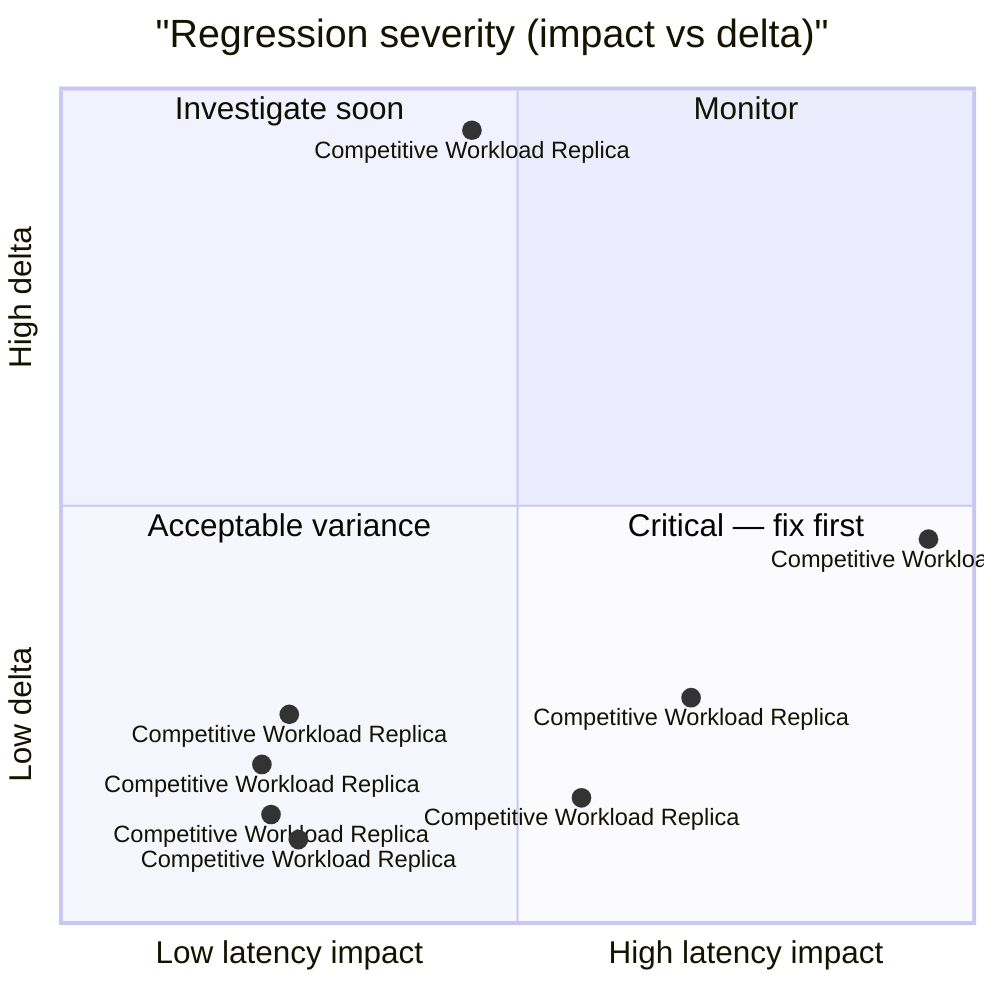

# 🚀 SQLite Performance Ledger

> [!NOTE] Competitive comparisons based on publicly available documentation as of June 2026. All SveltyCMS metrics self-measured via `bun test tests/benchmarks/`.

> [!IMPORTANT]
> **Console-only by default.** Use `BENCHMARK_RECORD=1` to write results to this report.
>
> ```bash
> BENCHMARK_RECORD=1 bun test tests/benchmarks/auth-performance.test.ts
> ```
>
> The full matrix runner (`bun run scripts/benchmark-matrix/index.ts --db=sqlite`) always records.

<!-- BENCHMARK_START -->

<!-- EXECUTIVE_START -->
<!-- LATEST_AUDIT_HEADER -->

## 📊 Latest Performance Audit

<!-- EXECUTIVE_FIX_NOTES_START -->

### 📝 Fix Overlays

> [!NOTE]
> Phase notes and remediation entries appear here after matrix or surgical runs.

<!-- EXECUTIVE_FIX_NOTES_END -->

> [!NOTE]
> **Partial update** — dimension rollups and issues reflect only tests invoked in this run.

**✅ PASS** _(partial invocation)_ · 1/62 tests · 61 skipped · **sqlite** · standalone run

### Dimension health

| Dimension      | Tests | Status | Worst Δ | Issues |
| -------------- | ----: | ------ | ------- | ------ |
| **Core**       |    10 | 🟢     | +85%    | 0      |
| **API**        |     0 | ⚪     | —       | 0      |
| **Scale**      |     0 | ⚪     | —       | 0      |
| **Resilience** |     0 | ⚪     | —       | 0      |

### Issues (action required)

> ✅ **All clear** — no regressions or budget violations detected.

### Executive latency matrix

| Scenario                         | Latency  | Trend                                      | Budget | Result |
| -------------------------------- | -------- | ------------------------------------------ | ------ | ------ |
| **Competitive Workload Replica** | 3.443ms  | ⚪ stable at 3.16ms (±1.93ms) (7 runs)     | < 5ms  | 🟢     |
| **Competitive Workload Replica** | 6.574ms  | ⚪ stable at 6.51ms (±2.19ms) (7 runs)     | < 5ms  | 🟢     |
| **Competitive Workload Replica** | 5.943ms  | 🔴 slower: 3.21ms → 5.94ms (+85%) (7 runs) | < 5ms  | 🟢     |
| **Competitive Workload Replica** | 2.983ms  | ⚪ stable at 2.69ms (±1.56ms) (7 runs)     | < 5ms  | 🟢     |
| **Competitive Workload Replica** | 3.271ms  | ⚪ stable at 2.70ms (±1.28ms) (7 runs)     | < 5ms  | 🟢     |
| **Competitive Workload Replica** | 2.904ms  | ⚪ stable at 2.51ms (±1.29ms) (7 runs)     | < 5ms  | 🟢     |
| **Competitive Workload Replica** | 7.505ms  | ⚪ stable at 6.63ms (±1.80ms) (7 runs)     | < 5ms  | 🟢     |
| **Competitive Workload Replica** | 13.136ms | ⚪ stable at 9.42ms (±4.08ms) (7 runs)     | < 5ms  | 🟢     |
| **Competitive Workload Replica** | 9.051ms  | ⚪ stable at 11.79ms (±3.93ms) (7 runs)    | < 5ms  | 🟢     |
| **Competitive Workload Replica** | 9.226ms  | ⚪ stable at 7.07ms (±2.25ms) (7 runs)     | < 5ms  | 🟢     |

### Historical pulse

> **Scope:** Sparklines only — full run tables: [`tests/benchmarks/results/history.sqlite`](../../../tests/benchmarks/results/history.sqlite)

| Metric                                             | Trend | Sparkline | Latest  |
| -------------------------------------------------- | ----- | --------- | ------- |
| database performance (FIND MANY (limit 50)) (warm) | 🟢    | `█▇▂▁▁▁▁` | 0.093ms |

<details>
<summary>📈 Latency trend chart (last 10 runs)</summary>

```mermaid
xychart-beta
  title "sqlite REST p95 (last 10 runs)"
  x-axis ["R1", "R2", "R3", "R4", "R5", "R6", "R7", "R8", "R9", "R10"]
  y-axis "Latency (ms)"
  line "p95" : [0.000, 0.000, 0.000, 0.000, 0.000, 0.000, 0.000, 0.000, 0.000, 0.000]
```

</details>
<details>
<summary>📊 Regression severity matrix (quadrant)</summary>


```mermaid
quadrantChart
  title "Regression severity (impact vs delta)"
  x-axis Low latency impact --> High latency impact
  y-axis Low delta --> High delta
  quadrant-1 Monitor
  quadrant-2 Investigate soon
  quadrant-3 Acceptable variance
  quadrant-4 Critical — fix first
    Competitive Workload Replica: [0.26, 0.10]
    Competitive Workload Replica: [0.45, 0.95]
    Competitive Workload Replica: [0.23, 0.13]
    Competitive Workload Replica: [0.25, 0.25]
    Competitive Workload Replica: [0.22, 0.19]
    Competitive Workload Replica: [0.57, 0.15]
    Competitive Workload Replica: [0.95, 0.46]
    Competitive Workload Replica: [0.69, 0.27]
```

</details>

<!-- EXECUTIVE_PARTIAL_WATERMARK -->

<!-- EXECUTIVE_ALERTS_START -->
<!-- EXECUTIVE_ALERTS_END -->

<!-- EXECUTIVE_END -->

<!-- SUMMARY_START -->

<!-- SUMMARY_RUN_OVERLAY_START -->

### Current Run Summary (2026-08-26)

> **Scope:** Only tests that ran in THIS invocation.

> ⚠️ Executive PASS/FAIL reflects the last full matrix run.

**Run ID:** `cc360b68-32a2-49ae-83fd-58bb39286ec9` · **Tests invoked:** 1 · **Metrics:** 10 · **DB:** sqlite

| Test                         | Metric                                   | Avg (ms) | p95 (ms) | RPS  | Trend | Detail                                     |
| ---------------------------- | ---------------------------------------- | -------- | -------- | ---- | ----- | ------------------------------------------ |
| Competitive Workload Replica | findById (Concurrent 8c)                 | 3.443    | 5.092    | 2223 | 🟢    | ⚪ stable at 3.16ms (±1.93ms) (7 runs)     |
| Competitive Workload Replica | findByIdRandom (Concurrent 8c)           | 6.574    | 9.025    | 1203 | 🟢    | ⚪ stable at 6.51ms (±2.19ms) (7 runs)     |
| Competitive Workload Replica | listFilterSort (Concurrent 8c)           | 2.983    | 4.504    | 2560 | 🟢    | ⚪ stable at 2.69ms (±1.56ms) (7 runs)     |
| Competitive Workload Replica | listLarge (Concurrent 8c)                | 3.271    | 4.892    | 2354 | 🟢    | ⚪ stable at 2.70ms (±1.28ms) (7 runs)     |
| Competitive Workload Replica | findMissing (Concurrent 8c)              | 2.904    | 4.516    | 2681 | 🟢    | ⚪ stable at 2.51ms (±1.29ms) (7 runs)     |
| Competitive Workload Replica | GraphQL Collection Query (Concurrent 8c) | 7.505    | 9.825    | 1053 | 🟢    | ⚪ stable at 6.63ms (±1.80ms) (7 runs)     |
| Competitive Workload Replica | create (Concurrent 8c)                   | 13.136   | 43.903   | 607  | 🟢    | ⚪ stable at 9.42ms (±4.08ms) (7 runs)     |
| Competitive Workload Replica | update (Concurrent 8c)                   | 9.051    | 10.665   | 866  | 🟢    | ⚪ stable at 11.79ms (±3.93ms) (7 runs)    |
| Competitive Workload Replica | mixed (Concurrent 8c 50/50)              | 9.226    | 30.527   | 852  | 🟢    | ⚪ stable at 7.07ms (±2.25ms) (7 runs)     |
| Competitive Workload Replica | listPlain (Concurrent 8c)                | 5.943    | 10.328   | 1265 | ⚪    | 🔴 slower: 3.21ms → 5.94ms (+85%) (7 runs) |

<!-- SUMMARY_RUN_OVERLAY_END -->

<!-- SUMMARY_HISTORY_START -->

### Historical Trends (2026-08-26)

> **Scope:** Sparklines only — full run tables live in `history.sqlite` (link below). Runs = sparkline bar count.

**Detail:** [`tests/benchmarks/results/history.sqlite`](../../../tests/benchmarks/results/history.sqlite) · `SELECT test_id, phase, avg_ms, p95_ms, rps, timestamp FROM runs WHERE db_type='sqlite' AND redis=0 ORDER BY timestamp DESC`

**Series:** 5 · **DB:** sqlite

| Metric                              | Trend | Sparkline (last 7) | Latest  |
| ----------------------------------- | ----- | ------------------ | ------- |
| DATABASE PERFORMANCE (warm)         | 🟢    | `▁▃▁▁█▄▃`          | 0.448ms |
| HOOKS PERFORMANCE (warm)            | 🟢    | `▂█▁▃▁`            | 0.312ms |
| SEO PERFORMANCE (warm)              | 🟢    | `▁█▁▂`             | 2.811ms |
| COMPETITIVE WORKLOAD REPLICA (warm) | ⚪    | `▅▁▁▁▄██`          | 9.051ms |
| MIDDLEWARE FLAMEGRAPH (warm)        | ⚪    | `▃▁▁▃▂▂█`          | 2.578ms |

<!-- SUMMARY_HISTORY_END --><!-- SUMMARY_END -->

<!-- LEDGER_START -->

## 🔬 Full benchmark ledger (58 modules)

Expand dimension groups, then any row, for ASCII truth tables. Executive summary above shows pass/fail and issues only.

<!-- LEDGER_DIMENSION:CORE:START -->

<details id="ledger-dimension-core">
<summary><strong>Core</strong> · 37 tests</summary>

<!-- SECTION:API_LATENCY:START -->

<details id="section-api_latency">
<summary><strong>🏷️ API LAYER LATENCY</strong> · 🟢 3.907ms · ➡️ recorded (awaiting trend) · <a href="../../../tests/benchmarks/api-latency.test.ts">source</a></summary>

<!-- LEDGER_TRUTH_START -->

```text
╔═════════════════════════════════════════════════════════════════════════════════════════╗
║                             SVELTYCMS  —  API LAYER LATENCY                             ║
║                       File: tests/benchmarks/api-latency.test.ts                        ║
║                                Ran: 2026-08-23 22:47:11                                 ║
║       Cold full-pipeline findById + warm TURBO-HIT path after responseCache fill.       ║
╠═════════════════════════════════════════════════════════════════════════════════════════╣
║ HTTP: findById @ 8c            │        3.907 ms │ p95:        6.414 ms │ RPS:      1,755 ║
║ HTTP: findById TURBO-HIT @ 8c  │        1.323 ms │ p95:        2.435 ms │ RPS:      3,417 ║
╚═════════════════════════════════════════════════════════════════════════════════════════╝
```

<!-- LEDGER_TRUTH_END -->

</details>
<!-- SECTION:API_LATENCY:END -->

<!-- SECTION:COLD_START:START -->
<details id="section-cold_start">
<summary><strong>🏷️ cold start phased</strong> · 🟢 726.134ms · ➡️ ⚪ established at 726.13ms (1 run) (2026-08-25 11:25:43) · <a href="../../../tests/benchmarks/cold-start-phased.test.ts">source</a></summary>
<!-- LEDGER_TRUTH_START -->
```text
╔═════════════════════════════════════════════════════════════════════════════════════════╗
║                           SVELTYCMS — PHASED COLD START AUDIT                           ║
║                    File: tests/benchmarks/cold-start-phased.test.ts                     ║
║                                Ran: 2026-08-25 11:25:43                                 ║
║       Measures server cold-start latency to READY state, using the built server.        ║
╠═════════════════════════════════════════════════════════════════════════════════════════╣
║ Cold Start (IDLE → READY)      │      726.134 ms │ p95:      942.901 ms │ RPS:          0 ║
╚═════════════════════════════════════════════════════════════════════════════════════════╝
```
<!-- LEDGER_TRUTH_END -->

</details>
<!-- SECTION:COLD_START:END -->

<!-- SECTION:TRUTH_AUDIT:START -->

<details id="section-truth_audit">
<summary><strong>🏷️ SRE TRUTH AUDIT</strong> · ⚪ ⏳ pending · ➡️ pending · <a href="../../../tests/benchmarks/truth-latency.test.ts">source</a></summary>

<!-- LEDGER_TRUTH_START -->

```text
╔═════════════════════════════════════════════════════════════════════════════════════════╗
║                               SVELTYCMS — SRE TRUTH AUDIT                               ║
║                      File: tests/benchmarks/truth-latency.test.ts                       ║
║                                Ran: 2026-08-25 11:25:47                                 ║
║     Validates performance claims by comparing SDK, Middleware, and Real HTTP Stack      ║
╠═════════════════════════════════════════════════════════════════════════════════════════╣
║ Logic Baseline                 │        0.000 ms │ p95:        0.000 ms │ RPS:    869,041 ║
║ Local SDK (Full)               │        0.003 ms │ p95:        0.006 ms │ RPS:    259,414 ║
║ HTTP End-to-End                │        0.318 ms │ p95:        0.426 ms │ RPS:      3,132 ║
╚═════════════════════════════════════════════════════════════════════════════════════════╝
```

<!-- LEDGER_TRUTH_END -->

</details>
<!-- SECTION:TRUTH_AUDIT:END -->

<!-- SECTION:SCAN:START -->

<details id="section-scan">
<summary><strong>🏷️ Self-Healing Content Scan</strong> · 🟢 1.671ms · ➡️ recorded (awaiting trend) · <a href="../../../tests/benchmarks/content-scan.test.ts">source</a></summary>

<!-- LEDGER_TRUTH_START -->

```text
╔═════════════════════════════════════════════════════════════════════════════════════════╗
║                             SVELTYCMS — CONTENT SCAN AUDIT                              ║
║                       File: tests/benchmarks/content-scan.test.ts                       ║
║                                Ran: 2026-08-23 22:49:48                                 ║
║    Measures filesystem + metadata processing for self-healing collections discovery     ║
╠═════════════════════════════════════════════════════════════════════════════════════════╣
║ Content Scan (Self-Healing)    │        1.671 ms │ p95:        3.039 ms │ RPS:        547 ║
╚═════════════════════════════════════════════════════════════════════════════════════════╝
```

<!-- LEDGER_TRUTH_END -->

</details>
<!-- SECTION:SCAN:END -->

<!-- SECTION:INCREMENTAL:START -->

<details id="section-incremental">
<summary><strong>🏷️ Incremental Content Reload</strong> · 🟢 0.326ms · ➡️ recorded (awaiting trend) · <a href="../../../tests/benchmarks/content-incremental-reload.test.ts">source</a></summary>

<!-- LEDGER_TRUTH_START -->

```text
╔═════════════════════════════════════════════════════════════════════════════════════════╗
║                      SVELTYCMS — INCREMENTAL CONTENT RELOAD AUDIT                       ║
║                File: tests/benchmarks/content-incremental-reload.test.ts                ║
║                                Ran: 2026-08-23 22:49:49                                 ║
║          Measures surgical single-file fullReload vs full reconciliation path           ║
╠═════════════════════════════════════════════════════════════════════════════════════════╣
║ Incremental fullReload (1 file) │        0.326 ms │ p95:        0.580 ms │ RPS:      3,036 ║
║ Full Reconciliation Reload     │        0.306 ms │ p95:        0.424 ms │ RPS:      3,240 ║
╚═════════════════════════════════════════════════════════════════════════════════════════╝
```

<!-- LEDGER_TRUTH_END -->

</details>
<!-- SECTION:INCREMENTAL:END -->

<!-- SECTION:HOOKS_TRACE:START -->

<details id="section-hooks_trace">
<summary><strong>🏷️ Middleware & Hooks Performance</strong> · 🟢 0.134ms · ➡️ recorded (awaiting trend) · <a href="../../../tests/benchmarks/hooks-performance.test.ts">source</a></summary>

<!-- LEDGER_TRUTH_START -->

```text
╔═════════════════════════════════════════════════════════════════════════════════════════╗
║                          SVELTYCMS — MIDDLEWARE & HOOKS AUDIT                           ║
║                    File: tests/benchmarks/hooks-performance.test.ts                     ║
║                                Ran: 2026-08-25 11:26:38                                 ║
║Measures the cost of the full middleware chain including Turbo, Security, Auth, and Audit via HTTP E2E.║
╠═════════════════════════════════════════════════════════════════════════════════════════╣
║ Static Asset (No Middleware)   │        0.134 ms │ p95:        0.208 ms │ RPS:      6,983 ║
║ Turbo Pipeline (Light)         │        0.207 ms │ p95:        0.350 ms │ RPS:      3,680 ║
║ Full Security + Auth Pipeline  │        0.323 ms │ p95:        0.521 ms │ RPS:      2,848 ║
║ REST with API Caching          │        0.325 ms │ p95:        0.424 ms │ RPS:      2,912 ║
║ Mutation (audit logging disabled) │        0.750 ms │ p95:        1.475 ms │ RPS:      1,173 ║
╚═════════════════════════════════════════════════════════════════════════════════════════╝
```

<!-- LEDGER_TRUTH_END -->

</details>
<!-- SECTION:HOOKS_TRACE:END -->

<!-- SECTION:EDGE_SYNC:START -->

<details id="section-edge_sync">
<summary><strong>🏷️ Edge Sync & Distributed Cache</strong> · ⏳ pending · ➡️ baseline · <a href="../../../tests/benchmarks/edge-sync.test.ts">source</a></summary>

<!-- LEDGER_TRUTH_START -->

> ⏳ Pending — Verifies distributed L1/L2 cache invalidation latency across simulated nodes.

<!-- LEDGER_TRUTH_END -->

</details>
<!-- SECTION:EDGE_SYNC:END -->

<!-- SECTION:TELEMETRY:START -->

<details id="section-telemetry">
<summary><strong>🏷️ Telemetry Collection & Signing</strong> · ⚪ ⏳ pending · ➡️ pending · <a href="../../../tests/benchmarks/telemetry-performance.test.ts">source</a></summary>

<!-- LEDGER_TRUTH_START -->

```text
╔═════════════════════════════════════════════════════════════════════════════════════════╗
║                       SVELTYCMS — TELEMETRY & UPDATE PERFORMANCE                        ║
║                  File: tests/benchmarks/telemetry-performance.test.ts                   ║
║                                Ran: 2026-08-23 22:48:21                                 ║
║Measures telemetry update check latency and memory impact on both happy-path and failure-path scenarios.║
╠═════════════════════════════════════════════════════════════════════════════════════════╣
║ Telemetry (Happy Path)         │        0.000 ms │ p95:        0.001 ms │ RPS:    941,472 ║
║ Telemetry (Failure Path)       │        0.001 ms │ p95:        0.002 ms │ RPS:  1,019,888 ║
╚═════════════════════════════════════════════════════════════════════════════════════════╝
```

<!-- LEDGER_TRUTH_END -->

</details>
<!-- SECTION:TELEMETRY:END -->

<!-- SECTION:STATE_MACHINE:START -->

<details id="section-state_machine">
<summary><strong>🏷️ State Machine Transitions</strong> · 🟢 22.902ms · ➡️ recorded (awaiting trend) · <a href="../../../tests/benchmarks/state-machine-transition.test.ts">source</a></summary>

<!-- LEDGER_TRUTH_START -->

```text
╔═════════════════════════════════════════════════════════════════════════════════════════╗
║                           SVELTYCMS — STATE MACHINE INTEGRITY                           ║
║                 File: tests/benchmarks/state-machine-transition.test.ts                 ║
║                                Ran: 2026-08-23 22:49:53                                 ║
║Simulates rapid system re-initializations and verifies valid self-healing state transitions under stress.║
╠═════════════════════════════════════════════════════════════════════════════════════════╣
║ State Transition (READY -> IDLE -> READY) │       22.902 ms │ p95:       26.811 ms │ RPS:         44 ║
╚═════════════════════════════════════════════════════════════════════════════════════════╝
```

<!-- LEDGER_TRUTH_END -->

</details>
<!-- SECTION:STATE_MACHINE:END -->

<!-- SECTION:DB_RAW_P95:START -->
<details id="section-db_raw_p95">
<summary><strong>🏷️ database performance</strong> · 🟢 0.291ms · ➡️ ⚪ established at 0.291ms (1 run) (2026-08-25 11:26:18) · <a href="../../../tests/benchmarks/database-performance.test.ts">source</a></summary>
<!-- LEDGER_TRUTH_START -->
```text
╔═════════════════════════════════════════════════════════════════════════════════════════╗
║                    SVELTYCMS — DATABASE ADAPTER PERFORMANCE (SQLITE)                    ║
║                   File: tests/benchmarks/database-performance.test.ts                   ║
║                                Ran: 2026-08-25 11:26:18                                 ║
║   Measures raw CRUD performance, indexing efficiency, and connection pool resilience    ║
╠═════════════════════════════════════════════════════════════════════════════════════════╣
║ INSERT                         │        0.032 ms │ p95:        0.093 ms │ RPS:     15,063 ║
║ FIND ONE                       │        0.004 ms │ p95:        0.006 ms │ RPS:    216,302 ║
║ FIND MANY (limit 50)           │        0.072 ms │ p95:        0.094 ms │ RPS:     12,956 ║
║ QUERY BUILDER LIST (50)        │        0.420 ms │ p95:        0.634 ms │ RPS:      2,222 ║
║ FIND PAGE (50 hasMore)         │        0.080 ms │ p95:        0.099 ms │ RPS:     11,734 ║
║ FIND PAGE keyset               │        0.066 ms │ p95:        0.082 ms │ RPS:     14,324 ║
║ FIND MANY offset 50            │        0.041 ms │ p95:        0.060 ms │ RPS:     21,727 ║
║ LIST+COUNT (legacy)            │        0.151 ms │ p95:        0.170 ms │ RPS:      6,283 ║
║ UPDATE                         │        0.018 ms │ p95:        0.023 ms │ RPS:     32,133 ║
║ UPDATE (no-returning)          │        0.016 ms │ p95:        0.022 ms │ RPS:     37,365 ║
║ NATIVE UPSERT                  │        0.034 ms │ p95:        0.041 ms │ RPS:     20,064 ║
║ COUNT                          │        0.104 ms │ p95:        0.108 ms │ RPS:      9,425 ║
║ COUNT ESTIMATE                 │        0.012 ms │ p95:        0.015 ms │ RPS:     71,917 ║
║ COUNT CACHED                   │        0.001 ms │ p95:        0.002 ms │ RPS:    890,847 ║
║ DELETE                         │        0.031 ms │ p95:        0.042 ms │ RPS:     20,958 ║
║ BULK INSERT (100)              │        0.918 ms │ p95:        9.392 ms │ RPS:        592 ║
║ BULK UPDATE (100 heterogeneous) │        0.413 ms │ p95:        0.450 ms │ RPS:      2,240 ║
║ BULK UPDATE (100 homogeneous)  │        0.291 ms │ p95:        0.322 ms │ RPS:      3,110 ║
╚═════════════════════════════════════════════════════════════════════════════════════════╝
```
<!-- LEDGER_TRUTH_END -->

</details>
<!-- SECTION:DB_RAW_P95:END -->

<!-- SECTION:ACID:START -->
<details id="section-acid">
<summary><strong>🏷️ transaction acid</strong> · 🟢 0.098ms · ➡️ ⚪ established at 0.098ms (1 run) (2026-08-25 11:26:24) · <a href="../../../tests/benchmarks/transaction-acid.test.ts">source</a></summary>
<!-- LEDGER_TRUTH_START -->
```text
╔═════════════════════════════════════════════════════════════════════════════════════════╗
║                            SVELTYCMS — ACID INTEGRITY AUDIT                             ║
║                     File: tests/benchmarks/transaction-acid.test.ts                     ║
║                                Ran: 2026-08-25 11:26:24                                 ║
║  Measures transaction commit latencies and rollback overhead across database adapters   ║
╠═════════════════════════════════════════════════════════════════════════════════════════╣
║ TX Commit                      │        0.108 ms │ p95:        0.230 ms │ RPS:     14,206 ║
║ TX Rollback Integrity          │        0.098 ms │ p95:        0.116 ms │ RPS:     10,088 ║
╚═════════════════════════════════════════════════════════════════════════════════════════╝
```
<!-- LEDGER_TRUTH_END -->

</details>
<!-- SECTION:ACID:END -->

<!-- SECTION:CACHE:START -->
<details id="section-cache">
<summary><strong>🏷️ Cache</strong> · 🟢 0.259ms · ➡️ ⚪ established at 0.259ms (1 run) (2026-08-25 11:26:29) · <a href="../../../tests/benchmarks/cache-performance.test.ts">source</a></summary>
<!-- LEDGER_TRUTH_START -->
```text
╔═════════════════════════════════════════════════════════════════════════════════════════╗
║                           SVELTYCMS — CACHE EFFICIENCY AUDIT                            ║
║                    File: tests/benchmarks/cache-performance.test.ts                     ║
║                                Ran: 2026-08-25 11:26:29                                 ║
║  Measures cache hit vs miss latency and efficiency via real HTTP end-to-end requests.   ║
╠═════════════════════════════════════════════════════════════════════════════════════════╣
║ Cache Miss (Bypass)            │        0.259 ms │ p95:        0.542 ms │ RPS:      3,448 ║
╚═════════════════════════════════════════════════════════════════════════════════════════╝
```
<!-- LEDGER_TRUTH_END -->

</details>
<!-- SECTION:CACHE:END -->

<!-- SECTION:CACHE_EFFICIENCY:START -->
<details id="section-cache_efficiency">
<summary><strong>🏷️ cache hit ratio</strong> · 🟢 0.400ms · ➡️ recorded (awaiting trend) · <a href="../../../tests/benchmarks/cache-hit-ratio.test.ts">source</a></summary>
<!-- LEDGER_TRUTH_START -->
```text
╔═════════════════════════════════════════════════════════════════════════════════════════╗
║                           SVELTYCMS — CACHE EFFICIENCY AUDIT                            ║
║                     File: tests/benchmarks/cache-hit-ratio.test.ts                      ║
║                                Ran: 2026-08-23 18:33:30                                 ║
║Measures Redis cache efficiency including hit rate, miss penalty, invalidation speed, and cold/warm fill.║
╠═════════════════════════════════════════════════════════════════════════════════════════╣
║ Cache Miss (Cold)              │        0.400 ms │ p95:        0.495 ms │ RPS:      2,459 ║
║ Cache Hit (Warm)               │        0.822 ms │ p95:        1.272 ms │ RPS:      3,246 ║
║ Cache Invalidation             │        1.563 ms │ p95:        2.236 ms │ RPS:        638 ║
╚═════════════════════════════════════════════════════════════════════════════════════════╝
```
<!-- LEDGER_TRUTH_END -->

</details>
<!-- SECTION:CACHE_EFFICIENCY:END -->

<!-- SECTION:BUILD:START -->

<details id="section-build">
<summary><strong>🏷️ Production Build Analysis</strong> · ⚪ ⏳ pending · ➡️ pending · <a href="../../../tests/benchmarks/build-analysis.test.ts">source</a></summary>

<!-- LEDGER_TRUTH_START -->

```text
╔═════════════════════════════════════════════════════════════════════════════════════════╗
║                          SVELTYCMS — PRODUCTION BUILD ANALYSIS                          ║
║                      File: tests/benchmarks/build-analysis.test.ts                      ║
║                                Ran: 2026-08-23 22:51:07                                 ║
║       Measures compilation speed, bundle size trends, and tree-shaking efficiency       ║
╠═════════════════════════════════════════════════════════════════════════════════════════╣
║ Production Build               │        0.000 ms │ p95:        0.000 ms │ RPS:          0 ║
╚═════════════════════════════════════════════════════════════════════════════════════════╝
```

<!-- LEDGER_TRUTH_END -->

</details>
<!-- SECTION:BUILD:END -->

<!-- SECTION:DX_TOOLING:START -->

<details id="section-dx_tooling">
<summary><strong>🏷️ DX Toolchain Performance</strong> · ⏳ pending · ➡️ baseline · <a href="../../../tests/benchmarks/dev-dependency-load.test.ts">source</a></summary>

<!-- LEDGER_TRUTH_START -->

> ⏳ Pending — Measures overhead of the build, sync, and lint toolchain.

<!-- LEDGER_TRUTH_END -->

</details>
<!-- SECTION:DX_TOOLING:END -->

<!-- SECTION:CACHE_SVC:START -->

<details id="section-cache_svc">
<summary><strong>🏷️ CacheService Micro-Benchmark</strong> · ⚪ ⏳ pending · ➡️ pending · <a href="../../../tests/benchmarks/cache-service.test.ts">source</a></summary>

<!-- LEDGER_TRUTH_START -->

```text
╔═════════════════════════════════════════════════════════════════════════════════════════╗
║                           SVELTYCMS — CACHE SERVICE TELEMETRY                           ║
║                      File: tests/benchmarks/cache-service.test.ts                       ║
║                                Ran: 2026-08-23 22:49:43                                 ║
║        Measures L1 cache hit latency and pattern invalidation overhead at scale         ║
╠═════════════════════════════════════════════════════════════════════════════════════════╣
║ Cache L1 Hit                   │        0.000 ms │ p95:        0.001 ms │ RPS:  1,564,305 ║
║ Pattern Invalidation (1k items @ 200k noise) │        4.069 ms │ p95:        5.311 ms │ RPS:        246 ║
║ Pattern Invalidation (namespaced keys) │        2.158 ms │ p95:        2.657 ms │ RPS:        463 ║
╚═════════════════════════════════════════════════════════════════════════════════════════╝
```

<!-- LEDGER_TRUTH_END -->

</details>
<!-- SECTION:CACHE_SVC:END -->

<!-- SECTION:LOCAL_API:START -->

<details id="section-local_api">
<summary><strong>🏷️ LocalCMS SDK Overhead</strong> · 🟢 0.084ms · ➡️ recorded (awaiting trend) · <a href="../../../tests/benchmarks/local-api-performance.test.ts">source</a></summary>

<!-- LEDGER_TRUTH_START -->

```text
╔═════════════════════════════════════════════════════════════════════════════════════════╗
║                        SVELTYCMS — LOCAL SDK BENCHMARK (SQLITE)                         ║
║                   File: tests/benchmarks/local-api-throughput.test.ts                   ║
║                                Ran: 2026-08-23 22:49:03                                 ║
║        Measures write throughput, read throughput, and SDK overhead in one pass.        ║
╠═════════════════════════════════════════════════════════════════════════════════════════╣
║ Writes (1000)                  │        0.084 ms │ p95:        0.000 ms │ RPS:     11,910 ║
║ Reads (1000)                   │        0.009 ms │ p95:        0.000 ms │ RPS:    107,301 ║
╚═════════════════════════════════════════════════════════════════════════════════════════╝
```

<!-- LEDGER_TRUTH_END -->

</details>
<!-- SECTION:LOCAL_API:END -->

<!-- SECTION:SETUP_PROXY:START -->

<details id="section-setup_proxy">
<summary><strong>🏷️ Setup Proxy & Bootstrap Isolation</strong> · ⏳ pending · ➡️ baseline · <a href="../../../tests/benchmarks/setup-proxy.test.ts">source</a></summary>

<!-- LEDGER_TRUTH_START -->

> ⏳ Pending — Setup proxy isolation and bootstrap security gating.

<!-- LEDGER_TRUTH_END -->

</details>
<!-- SECTION:SETUP_PROXY:END -->

<!-- SECTION:HTTP:START -->
<details id="section-http">
<summary><strong>🏷️ HTTP</strong> · 🟢 0.318ms · ➡️ ⚪ established at 0.318ms (1 run) (2026-08-25 11:25:58) · <a href="../../../tests/benchmarks/truth-latency.test.ts">source</a></summary>
<!-- LEDGER_TRUTH_START -->
> ⏳ Pending
<!-- LEDGER_TRUTH_END -->

</details>
<!-- SECTION:HTTP:END -->

<!-- SECTION:LOGIC:START -->
<details id="section-logic">
<summary><strong>🏷️ Logic</strong> · 🟢 ⏳ pending · ➡️ ⚪ established at 0ms (1 run) (2026-08-25 11:25:58) · <a href="../../../tests/benchmarks/truth-latency.test.ts">source</a></summary>
<!-- LEDGER_TRUTH_START -->
> ⏳ Pending
<!-- LEDGER_TRUTH_END -->

</details>
<!-- SECTION:LOGIC:END -->

<!-- SECTION:SDK:START -->
<details id="section-sdk">
<summary><strong>🏷️ SDK</strong> · 🟢 0.003ms · ➡️ ⚪ established at 0.003ms (1 run) (2026-08-25 11:25:58) · <a href="../../../tests/benchmarks/truth-latency.test.ts">source</a></summary>
<!-- LEDGER_TRUTH_START -->
```text
╔═════════════════════════════════════════════════════════════════════════════════════════╗
║                         SVELTYCMS — LOCALCMS CRUD TAX (SQLITE)                          ║
║                      File: tests/benchmarks/local-cms-crud.test.ts                      ║
║                                Ran: 2026-08-25 10:50:51                                 ║
║            Measures full CollectionsNamespace tax — not raw db.crud — so SDK            ║
╠═════════════════════════════════════════════════════════════════════════════════════════╣
║ Adapter FIND ONE               │        0.004 ms │ p95:        0.006 ms │ RPS:    214,656 ║
║ LocalCMS findById (warm)       │        0.001 ms │ p95:        0.002 ms │ RPS:    626,972 ║
║ LocalCMS findById (cold)       │        0.004 ms │ p95:        0.007 ms │ RPS:    194,869 ║
║ LocalCMS create                │        0.033 ms │ p95:        0.052 ms │ RPS:     13,324 ║
║ LocalCMS update                │        0.027 ms │ p95:        0.039 ms │ RPS:     19,637 ║
║ LocalCMS mixed C/U/R           │        0.070 ms │ p95:        0.095 ms │ RPS:      7,055 ║
╚═════════════════════════════════════════════════════════════════════════════════════════╝
```
<!-- LEDGER_TRUTH_END -->

</details>
<!-- SECTION:SDK:END -->

<!-- SECTION:UNKNOWN:START -->
<details id="section-unknown">
<summary><strong>🏷️ unknown</strong> · 🟢 0.002ms · ➡️ recorded (awaiting trend) · <a href="../../../tests/benchmarks/database-performance.test.ts">source</a></summary>
<!-- LEDGER_INSIGHT_START -->
> [!NOTE]
> **Specific to this test**: Both avg and p95 degraded — likely adapter or infrastructure bottleneck. Check DB connection pool, indexes, or recent commits.  
Throughput dropped 95% — check connection pool saturation or lock contention.  
**Severe degradation** (+2182%) — review recent commits immediately.
<!-- LEDGER_INSIGHT_END -->

<!-- LEDGER_TRUTH_START -->

```text
╔═════════════════════════════════════════════════════════════════════════════════════════╗
║                      SVELTYCMS — CACHE EVICTION BOUNDARY HARDENING                      ║
║                                      File: unknown                                      ║
║                                Ran: 2026-08-23 22:49:42                                 ║
╠═════════════════════════════════════════════════════════════════════════════════════════╣
║ Cache Flooding & Eviction      │        0.002 ms │ p95:        0.002 ms │ RPS:    491,908 ║
╚═════════════════════════════════════════════════════════════════════════════════════════╝
```

<!-- LEDGER_TRUTH_END -->

</details>
<!-- SECTION:UNKNOWN:END -->

<!-- SECTION:MIDDLEWARE:START -->
<details id="section-middleware">
<summary><strong>🏷️ Middleware</strong> · 🟢 0.750ms · ➡️ ⚪ established at 0.750ms (1 run) (2026-08-25 11:26:38) · <a href="../../../tests/benchmarks/hooks-performance.test.ts">source</a></summary>
<!-- LEDGER_TRUTH_START -->
```text
╔═════════════════════════════════════════════════════════════════════════════════════════╗
║                         MIDDLEWARE FLAMEGRAPH PROFILER (SQLITE)                         ║
║                  File: tests/benchmarks/middleware-flamegraph.test.ts                   ║
║                                Ran: 2026-08-23 17:08:35                                 ║
║    Measures the isolated microsecond cost of each middleware stage in the pipeline.     ║
╠═════════════════════════════════════════════════════════════════════════════════════════╣
║ Stage 0: Raw Socket Baseline (Static Asset) │        1.048 ms │ p95:        1.937 ms │ RPS:      2,708 ║
║ Stage 1: System State + Turbo Pipeline │        0.716 ms │ p95:        1.227 ms │ RPS:      3,555 ║
║ Stage 2: WAF Security Inspection │        0.711 ms │ p95:        1.721 ms │ RPS:      3,738 ║
║ Stage 3: Token Auth Gating     │        1.162 ms │ p95:        2.452 ms │ RPS:      2,185 ║
║ Stage 4: Collection Schema Resolution │        0.969 ms │ p95:        2.000 ms │ RPS:      2,673 ║
║ Stage 5: Full REST Single Document │        0.985 ms │ p95:        2.213 ms │ RPS:      2,675 ║
║ Stage 6: GraphQL Single Query (JIT) │        2.689 ms │ p95:        4.503 ms │ RPS:      1,372 ║
╚═════════════════════════════════════════════════════════════════════════════════════════╝
```
<!-- LEDGER_TRUTH_END -->

</details>
<!-- SECTION:MIDDLEWARE:END -->

<!-- SECTION:SYSTEM:START -->
<details id="section-system">
<summary><strong>🏷️ System</strong> · 🟢 0.346ms · ➡️ ⚪ established at 0.346ms (1 run) (2026-08-25 11:26:43) · <a href="../../../tests/benchmarks/rest-api-performance.test.ts">source</a></summary>
<!-- LEDGER_TRUTH_START -->
> ⏳ Pending
<!-- LEDGER_TRUTH_END -->

</details>
<!-- SECTION:SYSTEM:END -->

<!-- SECTION:METADATA:START -->
<details id="section-metadata">
<summary><strong>🏷️ Metadata</strong> · 🟢 0.473ms · ➡️ ⚪ established at 0.473ms (1 run) (2026-08-25 11:26:43) · <a href="../../../tests/benchmarks/rest-api-performance.test.ts">source</a></summary>
<!-- LEDGER_TRUTH_START -->
> ⏳ Pending
<!-- LEDGER_TRUTH_END -->

</details>
<!-- SECTION:METADATA:END -->

<!-- SECTION:CRUD:START -->
<details id="section-crud">
<summary><strong>🏷️ CRUD</strong> · 🟢 0.515ms · ➡️ ⚪ established at 0.515ms (1 run) (2026-08-25 11:26:43) · <a href="../../../tests/benchmarks/rest-api-performance.test.ts">source</a></summary>
<!-- LEDGER_TRUTH_START -->
> ⏳ Pending
<!-- LEDGER_TRUTH_END -->

</details>
<!-- SECTION:CRUD:END -->

<!-- SECTION:CRYPTO:START -->
<details id="section-crypto">
<summary><strong>🏷️ Crypto</strong> · ⚪ 0.976ms · ↗️ 🔴 slower: 0.598ms → 0.976ms (+63%) (7 runs) (2026-08-23 16:33:40) · <a href="../../../tests/benchmarks/security-audit.test.ts">source</a></summary>
<!-- LEDGER_INSIGHT_START -->
> [!NOTE]
> **Specific to this test**: Both avg and p95 degraded — likely adapter or infrastructure bottleneck. Check DB connection pool, indexes, or recent commits.  
Throughput dropped 37% — check connection pool saturation or lock contention.  
**Severe degradation** (+63%) — review recent commits immediately.
<!-- LEDGER_INSIGHT_END -->

<!-- LEDGER_TRUTH_START -->

> ⏳ Pending

<!-- LEDGER_TRUTH_END -->

</details>
<!-- SECTION:CRYPTO:END -->

<!-- SECTION:DEFENSE:START -->
<details id="section-defense">
<summary><strong>🏷️ Defense</strong> · 🟢 ⏳ pending · ➡️ ⚪ stable at 0ms (7 runs) (2026-08-23 16:33:40) · <a href="../../../tests/benchmarks/security-audit.test.ts">source</a></summary>
<!-- LEDGER_TRUTH_START -->
> ⏳ Pending
<!-- LEDGER_TRUTH_END -->

</details>
<!-- SECTION:DEFENSE:END -->

<!-- SECTION:L1:START -->
<details id="section-l1">
<summary><strong>🏷️ L1</strong> · 🟢 4.015ms · ➡️ ⚪ established at 4.01ms (1 run) (2026-08-11 23:02:18) · <a href="../../../tests/benchmarks/cache-service.test.ts">source</a></summary>
<!-- LEDGER_TRUTH_START -->
> ⏳ Pending
<!-- LEDGER_TRUTH_END -->

</details>
<!-- SECTION:L1:END -->

<!-- SECTION:DB:START -->
<details id="section-db">
<summary><strong>🏷️ DB</strong> · 🟢 0.004ms · ➡️ ⚪ established at 0.004ms (1 run) (2026-08-25 10:50:51) · <a href="../../../tests/benchmarks/local-cms-crud.test.ts">source</a></summary>
<!-- LEDGER_TRUTH_START -->
> ⏳ Pending
<!-- LEDGER_TRUTH_END -->

</details>
<!-- SECTION:DB:END -->

<!-- SECTION:TURBO:START -->
<details id="section-turbo">
<summary><strong>🏷️ TURBO</strong> · 🟢 1.281ms · ↘️ ⚪ stable at 2.29ms (±0.787ms) (7 runs) (2026-08-13 19:09:10) · <a href="../../../tests/benchmarks/api-latency.test.ts">source</a></summary>
<!-- LEDGER_INSIGHT_START -->
> [!NOTE]
> **Specific to this test**: Performance improved — recent optimizations or cache warming likely effective.
<!-- LEDGER_INSIGHT_END -->

<!-- LEDGER_TRUTH_START -->

> ⏳ Pending

<!-- LEDGER_TRUTH_END -->

</details>
<!-- SECTION:TURBO:END -->

<!-- SECTION:STRESS:START -->
<details id="section-stress">
<summary><strong>🏷️ Stress</strong> · 🟢 0.763ms · ➡️ recorded (awaiting trend) · <a href="../../../tests/benchmarks/graphql-stress.test.ts">source</a></summary>
<!-- LEDGER_INSIGHT_START -->
> [!NOTE]
> **Specific to this test**: Avg degraded but p95 stable — possible cold-start effect, GC pause, or warmup variance.
<!-- LEDGER_INSIGHT_END -->

<!-- LEDGER_TRUTH_START -->

```text
╔═════════════════════════════════════════════════════════════════════════════════════════╗
║                            SVELTYCMS — REVISION STRESS AUDIT                            ║
║                     File: tests/benchmarks/revision-stress.test.ts                      ║
║                                Ran: 2026-08-23 22:49:02                                 ║
║Measures read and history list latency degradation under heavy revision history growth (100 revisions per entry).║
╠═════════════════════════════════════════════════════════════════════════════════════════╣
║ Latest Read (High Revision Count) │        0.763 ms │ p95:        1.436 ms │ RPS:      3,489 ║
║ History List Retrieval         │        0.499 ms │ p95:        0.677 ms │ RPS:      3,125 ║
╚═════════════════════════════════════════════════════════════════════════════════════════╝
```

<!-- LEDGER_TRUTH_END -->

</details>
<!-- SECTION:STRESS:END -->

<!-- SECTION:CLIENT:START -->
<details id="section-client">
<summary><strong>🏷️ Client</strong> · 🟢 ⏳ pending · ➡️ ⚪ established at 0ms (1 run) (2026-08-23 15:48:15) · <a href="../../../tests/benchmarks/entry-edit-hydration.test.ts">source</a></summary>
<!-- LEDGER_TRUTH_START -->
> ⏳ Pending
<!-- LEDGER_TRUTH_END -->

</details>
<!-- SECTION:CLIENT:END -->

<!-- SECTION:GRAPHQL__COLD_:START -->
<details id="section-graphql__cold_">
<summary><strong>🏷️ GraphQL (cold)</strong> · ⚪ 2.457ms · ↘️ 🟢 faster: 3.54ms → 2.46ms (-31%) (7 runs) (2026-08-23 17:29:58) · <a href="../../../tests/benchmarks/graphql-api-performance.test.ts">source</a></summary>
<!-- LEDGER_INSIGHT_START -->
> [!NOTE]
> **Specific to this test**: Performance improved — recent optimizations or cache warming likely effective.
<!-- LEDGER_INSIGHT_END -->

<!-- LEDGER_TRUTH_START -->

> ⏳ Pending

<!-- LEDGER_TRUTH_END -->

</details>
<!-- SECTION:GRAPHQL__COLD_:END -->

<!-- SECTION:GRAPHQL__HOT_:START -->
<details id="section-graphql__hot_">
<summary><strong>🏷️ GraphQL (hot)</strong> · ⚪ 2.336ms · ↘️ 🟢 faster: 3.57ms → 2.34ms (-35%) (7 runs) (2026-08-23 17:29:59) · <a href="../../../tests/benchmarks/graphql-api-performance.test.ts">source</a></summary>
<!-- LEDGER_INSIGHT_START -->
> [!NOTE]
> **Specific to this test**: Performance improved — recent optimizations or cache warming likely effective.
<!-- LEDGER_INSIGHT_END -->

<!-- LEDGER_TRUTH_START -->

> ⏳ Pending

<!-- LEDGER_TRUTH_END -->

</details>
<!-- SECTION:GRAPHQL__HOT_:END -->

<!-- SECTION:CONTENT:START -->
<details id="section-content">
<summary><strong>🏷️ Content</strong> · 🟢 1.160ms · ➡️ ⚪ established at 1.16ms (1 run) (2026-08-23 19:49:09) · <a href="../../../tests/benchmarks/seo-performance.test.ts">source</a></summary>
<!-- LEDGER_TRUTH_START -->
> ⏳ Pending
<!-- LEDGER_TRUTH_END -->

</details>
<!-- SECTION:CONTENT:END -->

<!-- SECTION:ANALYTICS:START -->
<details id="section-analytics">
<summary><strong>🏷️ Analytics</strong> · 🟢 2.538ms · ➡️ ⚪ established at 2.54ms (1 run) (2026-08-23 19:49:09) · <a href="../../../tests/benchmarks/seo-performance.test.ts">source</a></summary>
<!-- LEDGER_TRUTH_START -->
> ⏳ Pending
<!-- LEDGER_TRUTH_END -->

</details>
<!-- SECTION:ANALYTICS:END -->

</details>

<!-- LEDGER_DIMENSION:CORE:END -->

<!-- LEDGER_DIMENSION:API:START -->

<details id="ledger-dimension-api">
<summary><strong>API</strong> · 15 tests</summary>

<!-- SECTION:AI_OVERHEAD:START -->

<details id="section-ai_overhead">
<summary><strong>🏷️ AI Bus & Inference Overhead</strong> · ⚪ ⏳ pending · ➡️ pending · <a href="../../../tests/benchmarks/ai-performance.test.ts">source</a></summary>

<!-- LEDGER_TRUTH_START -->

```text
╔═════════════════════════════════════════════════════════════════════════════════════════╗
║                           SVELTYCMS — AI INFRASTRUCTURE AUDIT                           ║
║                      File: tests/benchmarks/ai-performance.test.ts                      ║
║                                Ran: 2026-08-23 22:48:19                                 ║
║ Measures the latency tax of internal CMS logic for AI enrichment and layout generation. ║
╠═════════════════════════════════════════════════════════════════════════════════════════╣
║ AI Text Enrichment             │        0.000 ms │ p95:        0.002 ms │ RPS:    728,863 ║
║ AI Layout Spec Generation      │        0.000 ms │ p95:        0.001 ms │ RPS:  1,263,690 ║
╚═════════════════════════════════════════════════════════════════════════════════════════╝
```

<!-- LEDGER_TRUTH_END -->

</details>
<!-- SECTION:AI_OVERHEAD:END -->

<!-- SECTION:TEMPORAL:START -->

<details id="section-temporal">
<summary><strong>🏷️ Temporal Integrity Audit</strong> · 🟢 2.777ms · ➡️ recorded (awaiting trend) · <a href="../../../tests/benchmarks/temporal-integrity.test.ts">source</a></summary>

<!-- LEDGER_TRUTH_START -->

```text
╔═════════════════════════════════════════════════════════════════════════════════════════╗
║                             SVELTYCMS — TEMPORAL INTEGRITY                              ║
║                    File: tests/benchmarks/temporal-integrity.test.ts                    ║
║                                Ran: 2026-08-23 22:48:41                                 ║
║Validates deterministic UTC normalization of ISO date strings across timezone offsets for consistent persistence.║
╠═════════════════════════════════════════════════════════════════════════════════════════╣
║ Timezone Ingestion             │        2.777 ms │ p95:        2.777 ms │ RPS:        360 ║
╚═════════════════════════════════════════════════════════════════════════════════════════╝
```

<!-- LEDGER_TRUTH_END -->

</details>
<!-- SECTION:TEMPORAL:END -->

<!-- SECTION:WIDGETS:START -->

<details id="section-widgets">
<summary><strong>🏷️ Core Widgets Overhead</strong> · ⏳ pending · ➡️ baseline · <a href="../../../tests/benchmarks/widget-performance.test.ts">source</a></summary>

<!-- LEDGER_TRUTH_START -->

> ⏳ Pending — Audits server-side processing cost of built-in widgets (Input, RichText, Relation).

<!-- LEDGER_TRUTH_END -->

</details>
<!-- SECTION:WIDGETS:END -->

<!-- SECTION:UX_VITALITY:START -->

<details id="section-ux_vitality">
<summary><strong>🏷️ Simulated Admin UX Vitality</strong> · 🟢 0.725ms · ➡️ recorded (awaiting trend) · <a href="../../../tests/benchmarks/admin-ux-vitality.test.ts">source</a></summary>

<!-- LEDGER_TRUTH_START -->

```text
╔═════════════════════════════════════════════════════════════════════════════════════════╗
║                          SVELTYCMS  —  ADMIN UX VITALITY AUDIT                          ║
║                    File: tests/benchmarks/admin-ux-vitality.test.ts                     ║
║                                Ran: 2026-08-23 22:47:41                                 ║
║             Forms and widget registry performance via real HTTP endpoints.              ║
╠═════════════════════════════════════════════════════════════════════════════════════════╣
║ Schema Resolution (8f)         │        0.725 ms │ p95:        1.160 ms │ RPS:      3,634 ║
║ Collection List (11 cols)      │        0.708 ms │ p95:        1.161 ms │ RPS:      3,705 ║
╚═════════════════════════════════════════════════════════════════════════════════════════╝
```

<!-- LEDGER_TRUTH_END -->

</details>
<!-- SECTION:UX_VITALITY:END -->

<!-- SECTION:EDIT_HYDRATE:START -->

<details id="section-edit_hydrate">
<summary><strong>🏷️ Entry Edit Hydration</strong> · 🟢 0.021ms · ➡️ recorded (awaiting trend) · <a href="../../../tests/benchmarks/entry-edit-hydration.test.ts">source</a></summary>

<!-- LEDGER_TRUTH_START -->

```text
╔═════════════════════════════════════════════════════════════════════════════════════════╗
║                        SVELTYCMS  —  ENTRY EDIT HYDRATION AUDIT                         ║
║                   File: tests/benchmarks/entry-edit-hydration.test.ts                   ║
║                                Ran: 2026-08-23 22:48:05                                 ║
║Measures 50-field form mount (widget loader resolve + prefetch) and first-input sync latency.║
╠═════════════════════════════════════════════════════════════════════════════════════════╣
║ 50-Field Loader Resolve        │        0.021 ms │ p95:        0.029 ms │ RPS:     31,300 ║
║ Widget Prefetch (5 types)      │        0.009 ms │ p95:        0.014 ms │ RPS:    101,041 ║
║ First Input (field patch)      │        0.000 ms │ p95:        0.000 ms │ RPS:  2,668,659 ║
║ First Input (JSON.stringify)   │        0.004 ms │ p95:        0.004 ms │ RPS:    217,877 ║
╚═════════════════════════════════════════════════════════════════════════════════════════╝
```

<!-- LEDGER_TRUTH_END -->

</details>
<!-- SECTION:EDIT_HYDRATE:END -->

<!-- SECTION:MEDIA:START -->

<details id="section-media">
<summary><strong>🏷️ Media Engine & DAM Overhead</strong> · 🟢 110.549ms · ➡️ recorded (awaiting trend) · <a href="../../../tests/benchmarks/media-performance.test.ts">source</a></summary>

<!-- LEDGER_TRUTH_START -->

```text
╔═════════════════════════════════════════════════════════════════════════════════════════╗
║                            SVELTYCMS — MEDIA PIPELINE AUDIT                             ║
║                    File: tests/benchmarks/media-performance.test.ts                     ║
║                                Ran: 2026-08-23 22:50:17                                 ║
║           Measures full upload, processing, and storage pipeline via HTTP E2E           ║
╠═════════════════════════════════════════════════════════════════════════════════════════╣
║ SDK: Media Processing          │      110.549 ms │ p95:      130.514 ms │ RPS:         18 ║
║ HTTP: Media Upload             │      114.566 ms │ p95:      152.379 ms │ RPS:         15 ║
╚═════════════════════════════════════════════════════════════════════════════════════════╝
```

<!-- LEDGER_TRUTH_END -->

</details>
<!-- SECTION:MEDIA:END -->

<!-- SECTION:RELATIONAL:START -->

<details id="section-relational">
<summary><strong>🏷️ Relational & Nested Queries</strong> · 🟢 2.837ms · ➡️ recorded (awaiting trend) · <a href="../../../tests/benchmarks/relational-performance.test.ts">source</a></summary>

<!-- LEDGER_TRUTH_START -->

```text
╔═════════════════════════════════════════════════════════════════════════════════════════╗
║                          SVELTYCMS — RELATIONAL RESOLVER AUDIT                          ║
║                  File: tests/benchmarks/relational-performance.test.ts                  ║
║                                Ran: 2026-08-23 22:47:53                                 ║
║Measures GraphQL resolver performance for shallow and deep relational queries including joins and nested population.║
╠═════════════════════════════════════════════════════════════════════════════════════════╣
║ Shallow Relational Query       │        2.837 ms │ p95:        3.955 ms │ RPS:      1,834 ║
║ Deep Relational Query          │        1.555 ms │ p95:        2.794 ms │ RPS:      1,585 ║
╚═════════════════════════════════════════════════════════════════════════════════════════╝
```

<!-- LEDGER_TRUTH_END -->

</details>
<!-- SECTION:RELATIONAL:END -->

<!-- SECTION:OPENAPI:START -->

<details id="section-openapi">
<summary><strong>🏷️ OpenAPI Specification Performance</strong> · 🟢 0.559ms · ➡️ recorded (awaiting trend) · <a href="../../../tests/benchmarks/openapi-performance.test.ts">source</a></summary>

<!-- LEDGER_TRUTH_START -->

```text
╔═════════════════════════════════════════════════════════════════════════════════════════╗
║                        SVELTYCMS — OPENAPI SPEC GENERATION AUDIT                        ║
║                   File: tests/benchmarks/openapi-performance.test.ts                    ║
║                                Ran: 2026-08-23 22:47:48                                 ║
║Measures dynamic OpenAPI spec generation speed and cached documentation endpoint performance.║
╠═════════════════════════════════════════════════════════════════════════════════════════╣
║ Cold OpenAPI Generation        │        0.559 ms │ p95:        1.043 ms │ RPS:      1,789 ║
║ Warm OpenAPI Hit (Cached)      │        0.366 ms │ p95:        0.507 ms │ RPS:      2,473 ║
╚═════════════════════════════════════════════════════════════════════════════════════════╝
```

<!-- LEDGER_TRUTH_END -->

</details>
<!-- SECTION:OPENAPI:END -->

<!-- SECTION:AUTH_TRACE:START -->

<details id="section-auth_trace">
<summary><strong>🏷️ Auth & RBAC Performance</strong> · 🟢 0.327ms · ➡️ recorded (awaiting trend) · <a href="../../../tests/benchmarks/auth-performance.test.ts">source</a></summary>

<!-- LEDGER_TRUTH_START -->

```text
╔═════════════════════════════════════════════════════════════════════════════════════════╗
║                          SVELTYCMS — AUTHENTICATION TELEMETRY                           ║
║                     File: tests/benchmarks/auth-performance.test.ts                     ║
║                                Ran: 2026-08-23 22:47:14                                 ║
║             Authentication & RBAC Pipeline Benchmark (Production Optimized)             ║
╠═════════════════════════════════════════════════════════════════════════════════════════╣
║ Auth Validation @ 1c           │        0.327 ms │ p95:        0.456 ms │ RPS:      2,776 ║
║ HTTP Auth Pipeline @ 8c        │        1.230 ms │ p95:        2.153 ms │ RPS:      3,811 ║
╚═════════════════════════════════════════════════════════════════════════════════════════╝
```

<!-- LEDGER_TRUTH_END -->

</details>
<!-- SECTION:AUTH_TRACE:END -->

<!-- SECTION:SECURITY:START -->
<details id="section-security">
<summary><strong>🏷️ Security</strong> · 🟢 0.002ms · ➡️ recorded (awaiting trend) · <a href="../../../tests/benchmarks/security-audit.test.ts">source</a></summary>
<!-- LEDGER_INSIGHT_START -->
> [!NOTE]
> **Specific to this test**: Performance improved — recent optimizations or cache warming likely effective.
<!-- LEDGER_INSIGHT_END -->

<!-- LEDGER_TRUTH_START -->

```text
╔═════════════════════════════════════════════════════════════════════════════════════════╗
║                        SVELTYCMS — SECURITY INFRASTRUCTURE AUDIT                        ║
║                      File: tests/benchmarks/security-audit.test.ts                      ║
║                                Ran: 2026-08-23 22:49:35                                 ║
║Measures overhead of WAF request analysis, audit log persistence, Argon2id password hashing, and RBAC permission checks.║
╠═════════════════════════════════════════════════════════════════════════════════════════╣
║ WAF Deep Analysis              │        0.002 ms │ p95:        0.005 ms │ RPS:    614,062 ║
║ WAF Inspect (clean URL)        │        0.000 ms │ p95:        0.000 ms │ RPS:  1,873,653 ║
║ Audit Log Dispatch (disabled no-op) │        0.001 ms │ p95:        0.002 ms │ RPS:  1,073,826 ║
║ Argon2id Password Hashing      │        0.472 ms │ p95:        0.563 ms │ RPS:      2,113 ║
║ Dispatcher-Only Permission Check │        0.000 ms │ p95:        0.001 ms │ RPS:  1,600,615 ║
║ Full Defense-in-Depth Check    │        0.000 ms │ p95:        0.000 ms │ RPS:  1,573,614 ║
║ Admin Verification + Permission Check │        0.000 ms │ p95:        0.000 ms │ RPS:  3,165,559 ║
╚═════════════════════════════════════════════════════════════════════════════════════════╝
```

<!-- LEDGER_TRUTH_END -->

</details>
<!-- SECTION:SECURITY:END -->

<!-- SECTION:REST:START -->

<details id="section-rest">
<summary><strong>🏷️ REST API Performance</strong> · 🟢 0.346ms · ➡️ recorded (awaiting trend) · <a href="../../../tests/benchmarks/rest-api-performance.test.ts">source</a></summary>

<!-- LEDGER_TRUTH_START -->

```text
╔═════════════════════════════════════════════════════════════════════════════════════════╗
║                          SVELTYCMS — ENTERPRISE REST API AUDIT                          ║
║                   File: tests/benchmarks/rest-api-performance.test.ts                   ║
║                                Ran: 2026-08-25 11:26:43                                 ║
║Measures latency, throughput, and correctness of core REST endpoints: health check, schema, CRUD list, and search.║
╠═════════════════════════════════════════════════════════════════════════════════════════╣
║ Health Check                   │        0.346 ms │ p95:        0.795 ms │ RPS:      7,402 ║
║ Collection Schema              │        0.473 ms │ p95:        0.819 ms │ RPS:      5,426 ║
║ Collection Find (List)         │        0.453 ms │ p95:        0.731 ms │ RPS:      5,716 ║
║ Collection Search              │        0.515 ms │ p95:        0.841 ms │ RPS:      5,093 ║
╚═════════════════════════════════════════════════════════════════════════════════════════╝
```

<!-- LEDGER_TRUTH_END -->

</details>
<!-- SECTION:REST:END -->

<!-- SECTION:GRAPHQL:START -->

<details id="section-graphql">
<summary><strong>🏷️ GraphQL API Performance</strong> · 🟢 1.048ms · ➡️ recorded (awaiting trend) · <a href="../../../tests/benchmarks/graphql-api-performance.test.ts">source</a></summary>

<!-- LEDGER_TRUTH_START -->

```text
╔═════════════════════════════════════════════════════════════════════════════════════════╗
║                          SVELTYCMS — GRAPHQL PERFORMANCE AUDIT                          ║
║                 File: tests/benchmarks/graphql-api-performance.test.ts                  ║
║                                Ran: 2026-08-23 22:47:22                                 ║
║              Measures GraphQL resolver performance across query scenarios,              ║
╠═════════════════════════════════════════════════════════════════════════════════════════╣
║ GQL: System Health [cold]      │        1.048 ms │ p95:        1.733 ms │ RPS:        951 ║
║ GQL: System Health [hot]       │        0.962 ms │ p95:        1.641 ms │ RPS:      1,038 ║
║ GQL: Collection List [cold]    │        2.970 ms │ p95:        3.998 ms │ RPS:      1,811 ║
║ GQL: Collection List [hot]     │        2.722 ms │ p95:        3.771 ms │ RPS:      1,985 ║
║ GQL: Concurrent Load [cold]    │        2.335 ms │ p95:        3.228 ms │ RPS:      1,952 ║
║ GQL: Concurrent Load [hot]     │        2.310 ms │ p95:        3.081 ms │ RPS:      1,971 ║
╚═════════════════════════════════════════════════════════════════════════════════════════╝
```

<!-- LEDGER_TRUTH_END -->

</details>
<!-- SECTION:GRAPHQL:END -->

<!-- SECTION:SEO:START -->

<details id="section-seo">
<summary><strong>🏷️ Enterprise SEO Suite Audit</strong> · 🟢 0.861ms · ➡️ recorded (awaiting trend) · <a href="../../../tests/benchmarks/seo-performance.test.ts">source</a></summary>

<!-- LEDGER_TRUTH_START -->

```text
╔═════════════════════════════════════════════════════════════════════════════════════════╗
║                            SVELTYCMS — ENTERPRISE SEO AUDIT                             ║
║                     File: tests/benchmarks/seo-performance.test.ts                      ║
║                                Ran: 2026-08-23 22:47:57                                 ║
║Measures redirect lookup latency, dynamic sitemap.xml generation, robots.txt serving, and 404 logging performance.║
╠═════════════════════════════════════════════════════════════════════════════════════════╣
║ Redirect Lookup (301)          │        0.861 ms │ p95:        1.814 ms │ RPS:      5,592 ║
║ Dynamic Sitemap XML            │        0.565 ms │ p95:        1.017 ms │ RPS:      8,840 ║
║ Robots.txt Generation          │        1.709 ms │ p95:        2.572 ms │ RPS:      3,572 ║
║ Missing Path (404 Log)         │        1.688 ms │ p95:        2.904 ms │ RPS:      2,767 ║
╚═════════════════════════════════════════════════════════════════════════════════════════╝
```

<!-- LEDGER_TRUTH_END -->

</details>
<!-- SECTION:SEO:END -->

<!-- SECTION:BROADCAST:START -->

<details id="section-broadcast">
<summary><strong>🏷️ REAL-TIME BROADCAST AUDIT</strong> · 🟢 0.207ms · ➡️ recorded (awaiting trend) · <a href="../../../tests/benchmarks/websocket-broadcast.test.ts">source</a></summary>

<!-- LEDGER_TRUTH_START -->

```text
╔═════════════════════════════════════════════════════════════════════════════════════════╗
║                        SVELTYCMS — YJS COLLABORATION SYNC AUDIT                         ║
║                   File: tests/benchmarks/websocket-broadcast.test.ts                    ║
║                                Ran: 2026-08-23 22:51:02                                 ║
║   Measures end-to-end Yjs update propagation latency and connection handshake timing.   ║
╠═════════════════════════════════════════════════════════════════════════════════════════╣
║ Yjs CRDT Update Sync           │        0.207 ms │ p95:        0.315 ms │ RPS:      4,702 ║
╚═════════════════════════════════════════════════════════════════════════════════════════╝
```

<!-- LEDGER_TRUTH_END -->

</details>
<!-- SECTION:BROADCAST:END -->

<!-- SECTION:REAL_TIME:START -->

<details id="section-real_time">
<summary><strong>🏷️ WebSocket & Realtime Latency</strong> · ⏳ pending · ➡️ baseline · <a href="../../../tests/benchmarks/realtime-performance.test.ts">source</a></summary>

<!-- LEDGER_TRUTH_START -->

> ⏳ Pending — Benchmarks WebSocket connection/broadcast latency.

<!-- LEDGER_TRUTH_END -->

</details>
<!-- SECTION:REAL_TIME:END -->

</details>

<!-- LEDGER_DIMENSION:API:END -->

<!-- LEDGER_DIMENSION:SCALE:START -->

<details id="ledger-dimension-scale">
<summary><strong>Scale</strong> · 20 tests</summary>

<!-- SECTION:NEGATIVE_CACHE:START -->

<details id="section-negative_cache">
<summary><strong>🏷️ Negative Cache Performance</strong> · ⏳ pending · ➡️ baseline · <a href="../../../tests/benchmarks/negative-cache.test.ts">source</a></summary>

<!-- LEDGER_TRUTH_START -->

> ⏳ Pending — Benchmarks 404-miss response times and cache lookup speedup.

<!-- LEDGER_TRUTH_END -->

</details>
<!-- SECTION:NEGATIVE_CACHE:END -->

<!-- SECTION:REVISION_STRESS:START -->

<details id="section-revision_stress">
<summary><strong>🏷️ Revision & History Growth</strong> · 🟢 0.888ms · ➡️ recorded (awaiting trend) · <a href="../../../tests/benchmarks/revision-stress.test.ts">source</a></summary>

<!-- LEDGER_TRUTH_START -->

```text
╔═════════════════════════════════════════════════════════════════════════════════════════╗
║                            SVELTYCMS — REVISION STRESS AUDIT                            ║
║                     File: tests/benchmarks/revision-stress.test.ts                      ║
║                                Ran: 2026-08-11 22:07:53                                 ║
║Measures read and history list latency degradation under heavy revision history growth (100 revisions per entry).║
╠═════════════════════════════════════════════════════════════════════════════════════════╣
║ Latest Read (High Revision Count) │        0.888 ms │ p95:        1.917 ms │ RPS:      1,127 ║
║ History List Retrieval         │        0.543 ms │ p95:        0.866 ms │ RPS:      1,841 ║
╚═════════════════════════════════════════════════════════════════════════════════════════╝
```

<!-- LEDGER_TRUTH_END -->

</details>
<!-- SECTION:REVISION_STRESS:END -->

<!-- SECTION:MEMORY:START -->

<details id="section-memory">
<summary><strong>🏷️ Memory Stability & GC Behavior</strong> · ⏳ pending · ➡️ baseline · <a href="../../../tests/benchmarks/memory-stability.test.ts">source</a></summary>

<!-- LEDGER_TRUTH_START -->

> ⏳ Pending — Long-running soak test to identify memory leaks and GC pressure.

<!-- LEDGER_TRUTH_END -->

</details>
<!-- SECTION:MEMORY:END -->

<!-- SECTION:TENANCY:START -->

<details id="section-tenancy">
<summary><strong>🏷️ Multi-Tenant Performance & Isolation</strong> · ⏳ pending · ➡️ baseline · <a href="../../../tests/benchmarks/multi-tenant-performance.test.ts">source</a></summary>

<!-- LEDGER_TRUTH_START -->

> ⏳ Pending — Stress-tests cross-tenant isolation and security boundary latency.

<!-- LEDGER_TRUTH_END -->

</details>
<!-- SECTION:TENANCY:END -->

<!-- SECTION:MIXED:START -->

<details id="section-mixed">
<summary><strong>🏷️ Realistic Mixed Workload</strong> · 🟢 1.521ms · ➡️ recorded (awaiting trend) · <a href="../../../tests/benchmarks/mixed-workload.test.ts">source</a></summary>

<!-- LEDGER_TRUTH_START -->

```text
╔═════════════════════════════════════════════════════════════════════════════════════════╗
║                            SVELTYCMS — MIXED WORKLOAD AUDIT                             ║
║                      File: tests/benchmarks/mixed-workload.test.ts                      ║
║                                Ran: 2026-08-23 22:48:01                                 ║
║Simulates real-world traffic with a weighted mix of reads, searches, GraphQL queries, and metadata requests.║
╠═════════════════════════════════════════════════════════════════════════════════════════╣
║ Mixed Workload                 │        1.521 ms │ p95:        2.940 ms │ RPS:      3,142 ║
╚═════════════════════════════════════════════════════════════════════════════════════════╝
```

<!-- LEDGER_TRUTH_END -->

</details>
<!-- SECTION:MIXED:END -->

<!-- SECTION:GQL_STRESS:START -->

<details id="section-gql_stress">
<summary><strong>🏷️ GraphQL Load Stress</strong> · 🟢 2.515ms · ➡️ recorded (awaiting trend) · <a href="../../../tests/benchmarks/graphql-stress.test.ts">source</a></summary>

<!-- LEDGER_TRUTH_START -->

```text
╔═════════════════════════════════════════════════════════════════════════════════════════╗
║                         SVELTYCMS — GRAPHQL CAPACITY DISCOVERY                          ║
║                      File: tests/benchmarks/graphql-stress.test.ts                      ║
║                                Ran: 2026-08-23 22:47:30                                 ║
║  Discovers the server's maximum sustainable GraphQL throughput by ramping concurrency   ║
╠═════════════════════════════════════════════════════════════════════════════════════════╣
║ GQL: 5c Warmup                 │        2.515 ms │ p95:        3.310 ms │ RPS:      1,731 ║
║ GQL: 10c Light                 │        4.418 ms │ p95:        5.945 ms │ RPS:      1,997 ║
║ GQL: 20c Moderate              │       11.953 ms │ p95:       16.780 ms │ RPS:      1,548 ║
║ GQL: 40c Heavy                 │       23.692 ms │ p95:       29.949 ms │ RPS:      1,564 ║
║ GQL: 60c Stress                │       34.329 ms │ p95:       42.971 ms │ RPS:      1,568 ║
║ GQL: 80c Extreme               │       39.408 ms │ p95:       47.376 ms │ RPS:      1,710 ║
║ GQL: 100c Max                  │       48.342 ms │ p95:       61.980 ms │ RPS:      1,677 ║
╚═════════════════════════════════════════════════════════════════════════════════════════╝
```

<!-- LEDGER_TRUTH_END -->

</details>
<!-- SECTION:GQL_STRESS:END -->

<!-- SECTION:MIGRATION:START -->
<details id="section-migration">
<summary><strong>🏷️ migration scale</strong> · 🟢 14.315ms · ➡️ recorded (awaiting trend) · <a href="../../../tests/benchmarks/migration-scale.test.ts">source</a></summary>
<!-- LEDGER_TRUTH_START -->
```text
╔═════════════════════════════════════════════════════════════════════════════════════════╗
║                           SVELTYCMS — MIGRATION & SCALE AUDIT                           ║
║                     File: tests/benchmarks/migration-scale.test.ts                      ║
║                                Ran: 2026-08-23 22:50:35                                 ║
║Measures bulk ingestion throughput for 10,000 entries and post-migration random lookup performance.║
╠═════════════════════════════════════════════════════════════════════════════════════════╣
║ Bulk Migration (10k)           │       14.315 ms │ p95:       32.415 ms │ RPS:         70 ║
║ Post-Migration Read            │        1.327 ms │ p95:        2.581 ms │ RPS:      2,779 ║
╚═════════════════════════════════════════════════════════════════════════════════════════╝
```
<!-- LEDGER_TRUTH_END -->

</details>
<!-- SECTION:MIGRATION:END -->

<!-- SECTION:INDEX_PRESSURE:START -->
<details id="section-index_pressure">
<summary><strong>🏷️ index pressure</strong> · 🟢 0.481ms · ➡️ recorded (awaiting trend) · <a href="../../../tests/benchmarks/index-pressure.test.ts">source</a></summary>
<!-- LEDGER_TRUTH_START -->
```text
╔═════════════════════════════════════════════════════════════════════════════════════════╗
║                           SVELTYCMS  —  INDEX PRESSURE AUDIT                            ║
║                      File: tests/benchmarks/index-pressure.test.ts                      ║
║                                Ran: 2026-08-23 22:48:56                                 ║
║    Measures read performance with sorting and filtering on a large entry collection.    ║
╠═════════════════════════════════════════════════════════════════════════════════════════╣
║ Sorted List (25k rows)         │        0.481 ms │ p95:        0.600 ms │ RPS:      2,064 ║
║ Filtered Query (25k rows)      │        0.487 ms │ p95:        0.648 ms │ RPS:      2,043 ║
╚═════════════════════════════════════════════════════════════════════════════════════════╝
```
<!-- LEDGER_TRUTH_END -->

</details>
<!-- SECTION:INDEX_PRESSURE:END -->

<!-- SECTION:CONTENT_STRESS:START -->

<details id="section-content_stress">
<summary><strong>🏷️ Content Scale Stress</strong> · 🟢 0.826ms · ➡️ recorded (awaiting trend) · <a href="../../../tests/benchmarks/content-scale-stress.test.ts">source</a></summary>

<!-- LEDGER_TRUTH_START -->

```text
╔═════════════════════════════════════════════════════════════════════════════════════════╗
║                        SVELTYCMS  —  CONTENT SCALE STRESS AUDIT                         ║
║                   File: tests/benchmarks/content-scale-stress.test.ts                   ║
║                                Ran: 2026-08-23 22:49:51                                 ║
║Measures file-scanning and content discovery performance at extreme scale (1,000+ collections)║
╠═════════════════════════════════════════════════════════════════════════════════════════╣
║ Cold Stress Scan (1k)          │        0.826 ms │ p95:        2.989 ms │ RPS:      1,211 ║
║ Warm Stress Scan (1k)          │        0.175 ms │ p95:        0.348 ms │ RPS:      5,534 ║
╚═════════════════════════════════════════════════════════════════════════════════════════╝
```

<!-- LEDGER_TRUTH_END -->

</details>
<!-- SECTION:CONTENT_STRESS:END -->

<!-- SECTION:MEDIA_UPLOAD:START -->

<details id="section-media_upload">
<summary><strong>🏷️ Media Upload Stress & Throughput</strong> · 🟢 1.431ms · ➡️ recorded (awaiting trend) · <a href="../../../tests/benchmarks/media-upload-stress.test.ts">source</a></summary>

<!-- LEDGER_TRUTH_START -->

```text
╔═════════════════════════════════════════════════════════════════════════════════════════╗
║                          SVELTYCMS — MEDIA UPLOAD STRESS AUDIT                          ║
║                   File: tests/benchmarks/media-upload-stress.test.ts                    ║
║                                Ran: 2026-08-23 22:50:20                                 ║
║Measures throughput for large file uploads, concurrent transfers, and streaming efficiency.║
╠═════════════════════════════════════════════════════════════════════════════════════════╣
║ Single Upload (0.1MB)          │        1.431 ms │ p95:        2.593 ms │ RPS:        692 ║
║ Small Upload (20KB)            │        3.418 ms │ p95:        4.887 ms │ RPS:      1,000 ║
╚═════════════════════════════════════════════════════════════════════════════════════════╝
```

<!-- LEDGER_TRUTH_END -->

</details>
<!-- SECTION:MEDIA_UPLOAD:END -->

<!-- SECTION:JOURNEY:START -->

<details id="section-journey">
<summary><strong>🏷️ Full Client Journey Simulation</strong> · 🟢 3.211ms · ➡️ recorded (awaiting trend) · <a href="../../../tests/benchmarks/client-journey.test.ts">source</a></summary>

<!-- LEDGER_TRUTH_START -->

```text
╔═════════════════════════════════════════════════════════════════════════════════════════╗
║                              SVELTYCMS  —  WORLD LIFE DATA                              ║
║                      File: tests/benchmarks/client-journey.test.ts                      ║
║                                Ran: 2026-08-23 22:48:43                                 ║
║Measures cumulative latency of a realistic editorial user workflow: Auth → List → View → Edit → Save.║
╠═════════════════════════════════════════════════════════════════════════════════════════╣
║ Full Journey @ 1c              │        3.211 ms │ p95:        4.286 ms │ RPS:        310 ║
╚═════════════════════════════════════════════════════════════════════════════════════════╝
```

<!-- LEDGER_TRUTH_END -->

</details>
<!-- SECTION:JOURNEY:END -->

<!-- SECTION:CONCURRENCY:START -->

<details id="section-concurrency">
<summary><strong>🏷️ Concurrency & Race Condition</strong> · ⚪ ⏳ pending · ➡️ pending · <a href="../../../tests/benchmarks/concurrency-race.test.ts">source</a></summary>

<!-- LEDGER_TRUTH_START -->

```text
╔═════════════════════════════════════════════════════════════════════════════════════════╗
║                         SVELTYCMS — THROUGHPUT SCALING (SQLITE)                         ║
║                  File: tests/benchmarks/concurrency-throughput.test.ts                  ║
║                                Ran: 2026-08-23 22:50:51                                 ║
║             Phased wave writes across 10 / 100 / 1000 documents. Loads are              ║
╠═════════════════════════════════════════════════════════════════════════════════════════╣
║ 10 docs × 10 (100 writes)      │        0.000 ms │ p95:        0.000 ms │ RPS:        493 ║
║ 100 docs × 1 (100 writes)      │        0.000 ms │ p95:        0.000 ms │ RPS:        426 ║
║ 1000 docs × 1 (1000 writes)    │        0.000 ms │ p95:        0.000 ms │ RPS:        417 ║
╚═════════════════════════════════════════════════════════════════════════════════════════╝
```

<!-- LEDGER_TRUTH_END -->

</details>
<!-- SECTION:CONCURRENCY:END -->

<!-- SECTION:THROUGHPUT:START -->

<details id="section-throughput">
<summary><strong>🏷️ Multi-Doc Concurrency Throughput</strong> · ⏳ pending · ➡️ baseline · <a href="../../../tests/benchmarks/concurrency-throughput.test.ts">source</a></summary>

<!-- LEDGER_TRUTH_START -->

> ⏳ Pending — Measures throughput scaling across 10, 100, 1000 documents.

<!-- LEDGER_TRUTH_END -->

</details>
<!-- SECTION:THROUGHPUT:END -->

<!-- SECTION:MAXRPS:START -->

<details id="section-maxrps">
<summary><strong>🏷️ Max Throughput — No Throttle</strong> · ⏳ pending · ➡️ baseline · <a href="../../../tests/benchmarks/concurrency-max.test.ts">source</a></summary>

<!-- LEDGER_TRUTH_START -->

> ⏳ Pending — 1000 concurrent writes across 100 docs — no semaphore.

<!-- LEDGER_TRUTH_END -->

</details>
<!-- SECTION:MAXRPS:END -->

<!-- SECTION:LOCALSDK:START -->

<details id="section-localsdk">
<summary><strong>🏷️ Local SDK Throughput</strong> · ⏳ pending · ➡️ baseline · <a href="../../../tests/benchmarks/local-api-throughput.test.ts">source</a></summary>

<!-- LEDGER_TRUTH_START -->

> ⏳ Pending — 1000 direct adapter calls — no HTTP, no middleware.

<!-- LEDGER_TRUTH_END -->

</details>
<!-- SECTION:LOCALSDK:END -->

<!-- SECTION:FAST_FAIL:START -->

<details id="section-fast_fail">
<summary><strong>🏷️ Failure Propagation & Fast-Fail Audit</strong> · ⏳ pending · ➡️ baseline · <a href="../../../tests/benchmarks/failure-propagation.test.ts">source</a></summary>

<!-- LEDGER_TRUTH_START -->

> ⏳ Pending — Measures system overhead when downstream dependencies (DB/Redis) fail or timeout.

<!-- LEDGER_TRUTH_END -->

</details>
<!-- SECTION:FAST_FAIL:END -->

<!-- SECTION:RESILIENCE:START -->

<details id="section-resilience">
<summary><strong>🏷️ Chaos & Infrastructure Resilience</strong> · 🟢 0.750ms · ➡️ recorded (awaiting trend) · <a href="../../../tests/benchmarks/chaos-resilience.test.ts">source</a></summary>

<!-- LEDGER_TRUTH_START -->

```text
╔═════════════════════════════════════════════════════════════════════════════════════════╗
║                            SVELTYCMS — CIRCUIT BREAKER AUDIT                            ║
║                 File: tests/benchmarks/circuit-breaker-failover.test.ts                 ║
║                                Ran: 2026-08-11 13:34:09                                 ║
║Simulates external service failures and measures system graceful degradation via circuit breaker patterns.║
╠═════════════════════════════════════════════════════════════════════════════════════════╣
║ Circuit Breaker Fallback       │        0.750 ms │ p95:        1.504 ms │ RPS:      1,334 ║
╚═════════════════════════════════════════════════════════════════════════════════════════╝
```

<!-- LEDGER_TRUTH_END -->

</details>
<!-- SECTION:RESILIENCE:END -->

<!-- SECTION:PROD_DAY:START -->

<details id="section-prod_day">
<summary><strong>🏷️ Production Day Simulation</strong> · ⏳ pending · ➡️ baseline · <a href="../../../tests/benchmarks/production-day.test.ts">source</a></summary>

<!-- LEDGER_TRUTH_START -->

> ⏳ Pending — Full production day with mixed workload, 100% reliability.

<!-- LEDGER_TRUTH_END -->

</details>
<!-- SECTION:PROD_DAY:END -->

<!-- SECTION:SOAK:START -->

<details id="section-soak">
<summary><strong>🏷️ Longevity Soak (Memory Stability)</strong> · ⏳ pending · ➡️ baseline · <a href="../../../tests/benchmarks/longevity-soak.test.ts">source</a></summary>

<!-- LEDGER_TRUTH_START -->

> ⏳ Pending — Sustained mixed workload with periodic memory sampling — detects slow leaks over time.

<!-- LEDGER_TRUTH_END -->

</details>
<!-- SECTION:SOAK:END -->

<!-- SECTION:STREAMING:START -->

<details id="section-streaming">
<summary><strong>🏷️ Large Payload Streaming</strong> · 🟢 4.320ms · ➡️ recorded (awaiting trend) · <a href="../../../tests/benchmarks/large-payload-streaming.test.ts">source</a></summary>

<!-- LEDGER_TRUTH_START -->

```text
╔═════════════════════════════════════════════════════════════════════════════════════════╗
║                        SVELTYCMS — LARGE PAYLOAD STREAMING AUDIT                        ║
║                 File: tests/benchmarks/large-payload-streaming.test.ts                  ║
║                                Ran: 2026-08-23 22:50:27                                 ║
║  Measures download/upload throughput and memory efficiency for large files (5MB-10MB)   ║
╠═════════════════════════════════════════════════════════════════════════════════════════╣
║ Upload 0.1MB                   │        4.320 ms │ p95:        6.069 ms │ RPS:        230 ║
║ Download 0.1MB                 │        2.380 ms │ p95:        3.120 ms │ RPS:      1,424 ║
║ Upload 0.2MB                   │        4.132 ms │ p95:        5.716 ms │ RPS:        242 ║
║ Download 0.2MB                 │        4.069 ms │ p95:       14.173 ms │ RPS:        887 ║
╚═════════════════════════════════════════════════════════════════════════════════════════╝
```

<!-- LEDGER_TRUTH_END -->

</details>
<!-- SECTION:STREAMING:END -->

</details>

<!-- LEDGER_DIMENSION:SCALE:END -->

<!-- LEDGER_DIMENSION:RESILIENCE:START -->

<details id="ledger-dimension-resilience">
<summary><strong>Resilience</strong> · 5 tests</summary>

<!-- SECTION:CIRCUIT_BREAKER:START -->

<details id="section-circuit_breaker">
<summary><strong>🏷️ Circuit Breaker Failover</strong> · ⏳ pending · ➡️ baseline · <a href="../../../tests/benchmarks/circuit-breaker-failover.test.ts">source</a></summary>

<!-- LEDGER_TRUTH_START -->

> ⏳ Pending — Measures system graceful degradation when external services fail.

<!-- LEDGER_TRUTH_END -->

</details>
<!-- SECTION:CIRCUIT_BREAKER:END -->

<!-- SECTION:THROTTLING:START -->

<details id="section-throttling">
<summary><strong>🏷️ Throttling & Backoff Stress</strong> · 🟢 2.907ms · ➡️ recorded (awaiting trend) · <a href="../../../tests/benchmarks/throttling-backoff-stress.test.ts">source</a></summary>

<!-- LEDGER_TRUTH_START -->

```text
╔═════════════════════════════════════════════════════════════════════════════════════════╗
║                              SVELTYCMS — THROTTLING AUDIT                               ║
║                File: tests/benchmarks/throttling-backoff-stress.test.ts                 ║
║                                Ran: 2026-08-11 20:01:20                                 ║
║Simulates high-velocity traffic from a single client IP to verify rate-limiting enforcement and backoff consistency.║
╠═════════════════════════════════════════════════════════════════════════════════════════╣
║ Throttling Enforcement         │        2.907 ms │ p95:        6.843 ms │ RPS:        344 ║
╚═════════════════════════════════════════════════════════════════════════════════════════╝
```

<!-- LEDGER_TRUTH_END -->

</details>
<!-- SECTION:THROTTLING:END -->

<!-- SECTION:GDPR:START -->

<details id="section-gdpr">
<summary><strong>🏷️ GDPR Compliance Speed</strong> · ⏳ pending · ➡️ baseline · <a href="../../../tests/benchmarks/right-to-be-forgotten-audit.test.ts">source</a></summary>

<!-- LEDGER_TRUTH_START -->

> ⏳ Pending — Measures performance of deep-deletion across all linked tables.

<!-- LEDGER_TRUTH_END -->

</details>
<!-- SECTION:GDPR:END -->

<!-- SECTION:SOVEREIGNTY:START -->

<details id="section-sovereignty">
<summary><strong>🏷️ Data Residency & Sovereignty</strong> · ⏳ pending · ➡️ baseline · <a href="../../../tests/benchmarks/data-residency-failover.test.ts">source</a></summary>

<!-- LEDGER_TRUTH_START -->

> ⏳ Pending — PII blocking and data sovereignty enforcement with cross-region failover.

<!-- LEDGER_TRUTH_END -->

</details>
<!-- SECTION:SOVEREIGNTY:END -->

<!-- SECTION:FAILOVER:START -->

<details id="section-failover">
<summary><strong>🏷️ Database Failover & Reconnection</strong> · 🟢 46.935ms · ➡️ recorded (awaiting trend) · <a href="../../../tests/benchmarks/database-failover.test.ts">source</a></summary>

<!-- LEDGER_TRUTH_START -->

```text
╔═════════════════════════════════════════════════════════════════════════════════════════╗
║                      SVELTYCMS — REINITIALIZE RESILIENCE (SQLite)                       ║
║                    File: tests/benchmarks/database-failover.test.ts                     ║
║                                Ran: 2026-08-12 11:44:34                                 ║
║ Simulates database connection loss mid-request and measures circuit breaker activation, ║
╠═════════════════════════════════════════════════════════════════════════════════════════╣
║ Reinitialize Recovery          │       46.935 ms │ p95:       46.935 ms │ RPS:          0 ║
╚═════════════════════════════════════════════════════════════════════════════════════════╝
```

<!-- LEDGER_TRUTH_END -->

</details>
<!-- SECTION:FAILOVER:END -->

</details>

<!-- LEDGER_DIMENSION:RESILIENCE:END -->
<!-- LEDGER_END -->

<!-- METADATA_START -->

> ⏳ Host environment populates after matrix run.

<!-- METADATA_END -->

<!-- BENCHMARK_END -->
