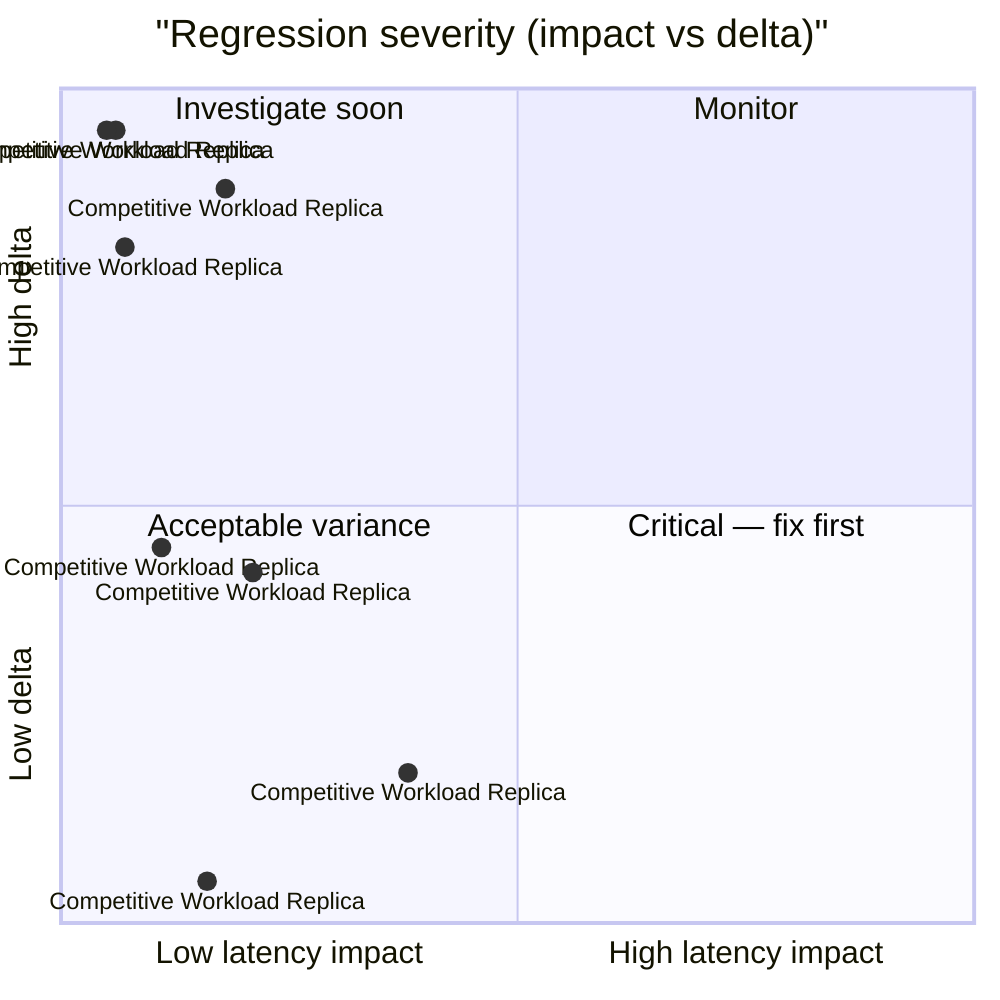

# 🚀 SQLite Performance Ledger

> [!NOTE] Competitive comparisons based on publicly available documentation as of June 2026. All SveltyCMS metrics self-measured via `bun test tests/benchmarks/`.

> [!IMPORTANT]
> **Console-only by default.** Use `BENCHMARK_RECORD=1` to write results to this report.
>
> ```bash
> BENCHMARK_RECORD=1 bun test tests/benchmarks/auth-performance.test.ts
> ```
>
> The full matrix runner (`bun run scripts/benchmark-matrix/index.ts --db=sqlite`) always records.

<!-- BENCHMARK_START -->

<!-- EXECUTIVE_START -->
<!-- LATEST_AUDIT_HEADER -->

## 📊 Latest Performance Audit

<!-- EXECUTIVE_FIX_NOTES_START -->

### 📝 Fix Overlays

> [!NOTE]
> Phase notes and remediation entries appear here after matrix or surgical runs.

<!-- EXECUTIVE_FIX_NOTES_END -->

> [!NOTE]
> **Partial update** — dimension rollups and issues reflect only tests invoked in this run.

**✅ PASS** _(partial invocation)_ · 1/62 tests · 61 skipped · **sqlite** · standalone run

### Dimension health

| Dimension      | Tests | Status | Worst Δ | Issues |
| -------------- | ----: | ------ | ------- | ------ |
| **Core**       |    21 | 🟢     | +298%   | 0      |
| **API**        |     0 | ⚪     | —       | 0      |
| **Scale**      |     0 | ⚪     | —       | 0      |
| **Resilience** |     0 | ⚪     | —       | 0      |

### Issues (action required)

> ✅ **All clear** — no regressions or budget violations detected.

### Executive latency matrix

| Scenario                         | Latency  | Trend                                         | Budget | Result |
| -------------------------------- | -------- | --------------------------------------------- | ------ | ------ |
| **Competitive Workload Replica** | 0.653ms  | 🔴 slower: 0.164ms → 0.653ms (+298%) (7 runs) | < 5ms  | 🟢     |
| **Competitive Workload Replica** | 2.189ms  | 🔴 slower: 0.606ms → 2.19ms (+261%) (7 runs)  | < 5ms  | 🟢     |
| **Competitive Workload Replica** | 0.663ms  | ⚪ stable at 0.689ms (±0.630ms) (7 runs)      | < 5ms  | 🟢     |
| **Competitive Workload Replica** | 1.950ms  | ⚪ stable at 1.74ms (±1.13ms) (7 runs)        | < 5ms  | 🟢     |
| **Competitive Workload Replica** | 0.847ms  | 🔴 slower: 0.248ms → 0.847ms (+242%) (7 runs) | < 5ms  | 🟢     |
| **Competitive Workload Replica** | 2.613ms  | 🔴 slower: 1.16ms → 2.61ms (+125%) (7 runs)   | < 5ms  | 🟢     |
| **Competitive Workload Replica** | 1.295ms  | ⚪ stable at 0.551ms (±0.992ms) (7 runs)      | < 5ms  | 🟢     |
| **Competitive Workload Replica** | 4.591ms  | ⚪ stable at 2.99ms (±1.25ms) (7 runs)        | < 5ms  | 🟢     |
| **Competitive Workload Replica** | 0.757ms  | 🔴 slower: 0.191ms → 0.757ms (+296%) (7 runs) | < 5ms  | 🟢     |
| **Competitive Workload Replica** | 2.105ms  | 🔴 slower: 0.777ms → 2.10ms (+171%) (7 runs)  | < 5ms  | 🟢     |
| **Competitive Workload Replica** | 0.651ms  | 🔴 slower: 0.171ms → 0.651ms (+281%) (7 runs) | < 5ms  | 🟢     |
| **Competitive Workload Replica** | 1.759ms  | 🔴 slower: 0.541ms → 1.76ms (+225%) (7 runs)  | < 5ms  | 🟢     |
| **Competitive Workload Replica** | 1.955ms  | ⚪ stable at 1.75ms (±2.72ms) (7 runs)        | < 5ms  | 🟢     |
| **Competitive Workload Replica** | 12.202ms | 🔴 slower: 5.18ms → 12.20ms (+135%) (7 runs)  | < 5ms  | 🟢     |
| **Competitive Workload Replica** | 1.838ms  | ⚪ stable at 1.74ms (±2.75ms) (7 runs)        | < 5ms  | 🟢     |
| **Competitive Workload Replica** | 9.867ms  | 🔴 slower: 5.39ms → 9.87ms (+83%) (7 runs)    | < 5ms  | 🟢     |
| **Competitive Workload Replica** | 3.512ms  | 🔴 slower: 1.03ms → 3.51ms (+242%) (7 runs)   | < 5ms  | 🟢     |
| **Competitive Workload Replica** | 7.395ms  | 🔴 slower: 2.71ms → 7.39ms (+172%) (7 runs)   | < 5ms  | 🟢     |
| **Competitive Workload Replica** | 1.916ms  | ⚪ stable at 1.27ms (±0.834ms) (7 runs)       | < 5ms  | 🟢     |
| **Competitive Workload Replica** | 7.023ms  | 🔴 slower: 2.93ms → 7.02ms (+140%) (7 runs)   | < 5ms  | 🟢     |
| **Ingestion**                    | 5.855ms  | ⚪ established at 5.85ms (1 run)              | < 5ms  | 🟢     |

### Historical pulse

> **Scope:** Sparklines only — full run tables: [`tests/benchmarks/results/history.sqlite`](../../../tests/benchmarks/results/history.sqlite)

| Metric                                                    | Trend | Sparkline      | Latest     |
| --------------------------------------------------------- | ----- | -------------- | ---------- |
| api latency (HTTP: findById @ 8c (Cold)) (warm)           | 🟢    | `▂▅▆▇█▆▇▃▁▄▂▄` | 2.547ms    |
| auth performance (Auth Validation @ 1c) (warm)            | 🟢    | `▄▁▂▂▂▂▂▆▂▁▁█` | 0.595ms    |
| cold start phased (Cold Start (IDLE → HTTP READY)) (cold) | 🟢    | `▁`            | 1694.351ms |
| database performance (BULK INSERT (100)) (warm)           | 🟢    | `███▇█▁▁`      | 0.825ms    |

<details>
<summary>📈 Latency trend chart (last 10 runs)</summary>

```mermaid
xychart-beta
  title "sqlite REST p95 (last 10 runs)"
  x-axis ["R1", "R2", "R3", "R4", "R5", "R6", "R7", "R8", "R9", "R10"]
  y-axis "Latency (ms)"
  line "p95" : [0.000, 0.000, 0.000, 0.000, 0.000, 0.000, 0.000, 0.000, 0.000, 0.000]
```

</details>
<details>
<summary>📊 Regression severity matrix (quadrant)</summary>


```mermaid
quadrantChart
  title "Regression severity (impact vs delta)"
  x-axis Low latency impact --> High latency impact
  y-axis Low delta --> High delta
  quadrant-1 Monitor
  quadrant-2 Investigate soon
  quadrant-3 Acceptable variance
  quadrant-4 Critical — fix first
    Competitive Workload Replica: [0.05, 0.95]
    Competitive Workload Replica: [0.18, 0.88]
    Competitive Workload Replica: [0.16, 0.05]
    Competitive Workload Replica: [0.07, 0.81]
    Competitive Workload Replica: [0.21, 0.42]
    Competitive Workload Replica: [0.11, 0.45]
    Competitive Workload Replica: [0.38, 0.18]
    Competitive Workload Replica: [0.06, 0.95]
```

</details>

<!-- EXECUTIVE_PARTIAL_WATERMARK -->

<!-- EXECUTIVE_ALERTS_START -->
<!-- EXECUTIVE_ALERTS_END -->

<!-- EXECUTIVE_END -->

<!-- SUMMARY_START -->
<!-- SUMMARY_RUN_OVERLAY_START -->

### Current Run Summary (2026-09-26)

> **Scope:** Only tests that ran in THIS invocation.

> ⚠️ Executive PASS/FAIL reflects the last full matrix run.

**Run ID:** `01a0dd42-fb6d-75a0-95d0-fcd97e2a5508` · **Tests invoked:** 1 · **Metrics:** 21 · **DB:** sqlite

| Test                         | Metric                              | Avg (ms) | p95 (ms) | RPS  | Trend | Detail                                        |
| ---------------------------- | ----------------------------------- | -------- | -------- | ---- | ----- | --------------------------------------------- |
| Competitive Workload Replica | findByIdRandom (Warm Sequential)    | 0.663    | 0.858    | 1501 | 🟢    | ⚪ stable at 0.430ms (±0.248ms) (7 runs)      |
| Competitive Workload Replica | findByIdRandom (Warm Concurrent 8c) | 1.950    | 2.537    | 4063 | 🟢    | ⚪ stable at 2.06ms (±1.58ms) (7 runs)        |
| Competitive Workload Replica | listFilterSort (Warm Concurrent 8c) | 2.613    | 3.299    | 3009 | 🟢    | ⚪ stable at 1.72ms (±0.889ms) (7 runs)       |
| Competitive Workload Replica | listLarge (Warm Sequential)         | 1.295    | 2.027    | 770  | 🟢    | ⚪ stable at 0.711ms (±0.737ms) (7 runs)      |
| Competitive Workload Replica | listLarge (Warm Concurrent 8c)      | 4.591    | 5.595    | 1703 | 🟢    | ⚪ stable at 3.41ms (±1.07ms) (7 runs)        |
| Competitive Workload Replica | listPlain (Warm Concurrent 8c)      | 2.105    | 2.915    | 3731 | 🟢    | ⚪ stable at 1.27ms (±0.758ms) (7 runs)       |
| Competitive Workload Replica | Seed Burst (50 docs, HTTP)          | 5.855    | 5.855    | 171  | 🟢    | ⚪ established at 5.85ms (1 run)              |
| Competitive Workload Replica | findById (Warm Sequential)          | 0.653    | 0.813    | 1524 | ⚪    | 🔴 slower: 0.268ms → 0.653ms (+144%) (7 runs) |
| Competitive Workload Replica | findById (Warm Concurrent 8c)       | 2.189    | 2.961    | 3626 | ⚪    | 🔴 slower: 1.06ms → 2.19ms (+107%) (7 runs)   |
| Competitive Workload Replica | listFilterSort (Warm Sequential)    | 0.847    | 0.894    | 1175 | ⚪    | 🔴 slower: 0.321ms → 0.847ms (+164%) (7 runs) |
| Competitive Workload Replica | listPlain (Warm Sequential)         | 0.757    | 1.077    | 1315 | ⚪    | 🔴 slower: 0.320ms → 0.757ms (+137%) (7 runs) |
| Competitive Workload Replica | findMissing (Warm Sequential)       | 0.651    | 0.823    | 1527 | ⚪    | 🔴 slower: 0.245ms → 0.651ms (+166%) (7 runs) |
| Competitive Workload Replica | findMissing (Warm Concurrent 8c)    | 1.759    | 2.082    | 4454 | ⚪    | 🔴 slower: 0.878ms → 1.76ms (+100%) (7 runs)  |
| Competitive Workload Replica | create (Warm Sequential)            | 1.955    | 2.185    | 510  | ⚪    | 🔴 slower: 0.855ms → 1.96ms (+129%) (7 runs)  |
| Competitive Workload Replica | create (Warm Concurrent 8c)         | 12.202   | 15.978   | 649  | ⚪    | 🔴 slower: 6.26ms → 12.20ms (+95%) (7 runs)   |
| Competitive Workload Replica | update (Warm Sequential)            | 1.838    | 2.378    | 543  | ⚪    | 🔴 slower: 0.794ms → 1.84ms (+131%) (7 runs)  |
| Competitive Workload Replica | update (Warm Concurrent 8c)         | 9.867    | 13.077   | 801  | ⚪    | 🔴 slower: 5.32ms → 9.87ms (+85%) (7 runs)    |
| Competitive Workload Replica | graphql (Warm Sequential)           | 3.512    | 3.904    | 284  | ⚪    | 🔴 slower: 0.984ms → 3.51ms (+257%) (7 runs)  |
| Competitive Workload Replica | graphql (Warm Concurrent 8c)        | 7.395    | 9.036    | 1064 | ⚪    | 🔴 slower: 2.72ms → 7.39ms (+171%) (7 runs)   |
| Competitive Workload Replica | mixed (Warm Sequential)             | 1.916    | 4.326    | 521  | ⚪    | 🔴 slower: 0.651ms → 1.92ms (+194%) (7 runs)  |
| Competitive Workload Replica | mixed (Warm Concurrent 8c)          | 7.023    | 15.370   | 1119 | ⚪    | 🔴 slower: 3.00ms → 7.02ms (+134%) (7 runs)   |

<!-- SUMMARY_RUN_OVERLAY_END -->

<!-- SUMMARY_HISTORY_START -->

### Historical Trends (2026-09-26)

> **Mode:** production-parity matrix runs only (`run_mode='matrix'` + `server_mode='production'` — `NODE_ENV=production`, no `TEST_MODE`). Standalone/mode-variant samples are recorded but never trended here.

> **Scope:** Sparklines only — full run tables live in `history.sqlite` (link below). Runs = sparkline bar count.

**Detail:** [`tests/benchmarks/results/history.sqlite`](../../../tests/benchmarks/results/history.sqlite) · `SELECT test_id, phase, server_mode, avg_ms, p95_ms, rps, timestamp FROM runs WHERE db_type='sqlite' AND redis=0 ORDER BY timestamp DESC`

**Series:** 5 · **DB:** sqlite

| Metric                              | Trend | Sparkline (last 7) | Latest   |
| ----------------------------------- | ----- | ------------------ | -------- |
| AUTH PERFORMANCE (warm)             | 🟢    | `▂▁▁█▁▁▁`          | 0.576ms  |
| COMPETITIVE WORKLOAD REPLICA (warm) | 🟢    | `▂▃▁▇▂█▃`          | 1.386ms  |
| MEDIA PERFORMANCE (warm)            | 🟢    | `▁▆█▁▁▆█`          | 51.908ms |
| API LATENCY (warm)                  | ⚪    | `▁█▄▂▁▁█`          | 5.997ms  |
| AUTH SESSION AMR (warm)             | ⚪    | `▆▆▁▇█▆▁`          | 0.005ms  |

<!-- SUMMARY_HISTORY_END --><!-- SUMMARY_END -->

<details>
<summary>📊 Infrastructure drill-down (expand for adapter, hooks, memory trends)</summary>

## 📊 Infrastructure drill-down

### 🏷️ Mixed Workload Performance {#mixedAvg}

**Mixed p95:** — (not measured in this run) | **Trend:** ⚪ (—)

> Production request mix: 60% Reads, 20% Writes, 15% GraphQL, 5% Media.

### 🏷️ Database Adapter Performance {#dbRaw}

**Raw Adapter p95:** — (not measured in this run) | **Target:** < 50ms | **Trend:** ⚪ (—)

> Direct database access latency (bypass CMS logic).

### 🏷️ Middleware & Hooks Audit {#hooks}

**Middleware p95:** — (not measured in this run) | **Target:** < 2ms | **Trend:** ⚪ (—)

> Total overhead of security, logging, and auth hooks.

### 🏷️ Memory Stability Audit {#memGrowth}

**Memory RSS Δ:** — (not measured in this run) | **Target:** < 60MB | **Trend:** ⚪ (—)

> Peak memory growth during stress workload.

### Enterprise scale audit

### 🏷️ Multi-Tenancy Performance {#tenancyAvg}

**Tenancy p95:** — (not measured in this run) | **Trend:** ⚪ (—)

> Measures latency across tenant isolation boundaries.

### 🏷️ Relational Resolver Latency {#relationalAvg}

**Relational p95:** — (not measured in this run) | **Trend:** ⚪ (—)

> Tests performance of complex JOINs and nested relationship population.

### 🏷️ Telemetry & Update Performance {#telemetryAvg}

**Telemetry p95:** — (not measured in this run) | **Trend:** ⚪ (—)

> Measures overhead of telemetry collection and cryptographic signing.

</details>

<!-- LEDGER_START -->

## 🔬 Full benchmark ledger (58 modules)

Expand dimension groups, then any row, for ASCII truth tables. Executive summary above shows pass/fail and issues only.

<!-- LEDGER_DIMENSION:CORE:START -->

<details id="ledger-dimension-core">
<summary><strong>Core</strong> · 91 tests</summary>

<!-- SECTION:API_LATENCY:START -->
<details id="section-api_latency">
<summary><strong>🏷️ API LAYER LATENCY</strong> · 🟢 12.210ms · ➡️ recorded (awaiting trend) · <a href="../../../tests/benchmarks/api-latency.test.ts">source</a></summary>
<!-- LEDGER_INSIGHT_START -->
> [!NOTE]
> **Specific to this test**: Both avg and p95 degraded — likely adapter or infrastructure bottleneck. Check DB connection pool, indexes, or recent commits.  
Throughput dropped 88% — check connection pool saturation or lock contention.  
**Severe degradation** (+915%) — review recent commits immediately.
> **Check**: `src/routes/api/[...path]/+server.ts` · `src/hooks.server.ts`
<!-- LEDGER_INSIGHT_END -->

<!-- LEDGER_TRUTH_START -->

```text
╔═══════════════════════════════════════════════════════════════════════════════════════════════════════╗
║                                     SVELTYCMS — API LAYER LATENCY                                     ║
║                              File: tests/benchmarks/api-latency.test.ts                               ║
║                                       Ran: 2026-09-26 09:43:28                                        ║
║              Cold full-pipeline findById + warm TURBO-HIT path after responseCache fill.              ║
╠═══════════════════════════════════════════════════════════════════════════════════════════════════════╣
║ HTTP: findById @ 8c (Cold)   │ Cold:    12.21 ms │ Warm:     6.598 ms │ p95:     9.095 ms │   1,186 RPS ║
║ HTTP: findById TURBO-HIT @ 8c (Warm) │ Cold:     1.37 ms │ Warm:     3.043 ms │ p95:     4.169 ms │   2,598 RPS ║
╚═══════════════════════════════════════════════════════════════════════════════════════════════════════╝
```

<!-- LEDGER_TRUTH_END -->

</details>
<!-- SECTION:API_LATENCY:END -->

<!-- SECTION:COLD_START:START -->
<details id="section-cold_start">
<summary><strong>🏷️ PHASED COLD START</strong> · 🟢 2196.844ms · ➡️ recorded (awaiting trend) · <a href="../../../tests/benchmarks/cold-start-phased.test.ts">source</a></summary>
<!-- LEDGER_TRUTH_START -->
```text
╔═══════════════════════════════════════════════════════════════════════════════════════════════════════╗
║                                  SVELTYCMS — PHASED COLD START AUDIT                                  ║
║                           File: tests/benchmarks/cold-start-phased.test.ts                            ║
║                                       Ran: 2026-09-26 09:45:07                                        ║
║            Measures process spawn, dependency hydration, and first-request TTFB readiness.            ║
╠═══════════════════════════════════════════════════════════════════════════════════════════════════════╣
║ Initial Cold Boot (Fresh Process) │     2196.844 ms │ p95:     2196.844 ms │ RPS:          0 ║
║ Steady-State Respawn (Average) │     2660.207 ms │ p95:     2831.767 ms │ RPS:          0 ║
╚═══════════════════════════════════════════════════════════════════════════════════════════════════════╝
```
<!-- LEDGER_TRUTH_END -->

</details>
<!-- SECTION:COLD_START:END -->

<!-- SECTION:TRUTH_AUDIT:START -->
<details id="section-truth_audit">
<summary><strong>🏷️ SRE TRUTH AUDIT</strong> · 🟢 0.110ms · ➡️ recorded (awaiting trend) · <a href="../../../tests/benchmarks/truth-latency.test.ts">source</a></summary>
<!-- LEDGER_TRUTH_START -->
```text
╔═══════════════════════════════════════════════════════════════════════════════════════════════════════╗
║                                      SVELTYCMS — SRE TRUTH AUDIT                                      ║
║                             File: tests/benchmarks/truth-latency.test.ts                              ║
║                                       Ran: 2026-09-26 10:05:05                                        ║
║            Validates performance claims by comparing SDK, Middleware, and Real HTTP Stack             ║
╠═══════════════════════════════════════════════════════════════════════════════════════════════════════╣
║ Logic Baseline               │ Cold:     0.11 ms │ Warm:     0.001 ms │ p95:     0.001 ms │ 194,641 RPS ║
║ Local SDK (Full)             │ Cold:    13.61 ms │ Warm:     0.034 ms │ p95:     0.055 ms │  27,435 RPS ║
║ HTTP End-to-End              │ Cold:    29.49 ms │ Warm:     0.911 ms │ p95:     1.122 ms │   1,093 RPS ║
║ HTTP Cold (Cache-Busted)     │ Cold:     4.08 ms │ Warm:     1.290 ms │ p95:     1.618 ms │     772 RPS ║
╚═══════════════════════════════════════════════════════════════════════════════════════════════════════╝
```
<!-- LEDGER_TRUTH_END -->

</details>
<!-- SECTION:TRUTH_AUDIT:END -->

<!-- SECTION:SCAN:START -->
<details id="section-scan">
<summary><strong>🏷️ Self-Healing Content Scan</strong> · 🟢 4.741ms · ➡️ recorded (awaiting trend) · <a href="../../../tests/benchmarks/content-scan.test.ts">source</a></summary>
<!-- LEDGER_TRUTH_START -->
```text
╔═══════════════════════════════════════════════════════════════════════════════════════════════════════╗
║                                    SVELTYCMS — CONTENT SCAN AUDIT                                     ║
║                              File: tests/benchmarks/content-scan.test.ts                              ║
║                                       Ran: 2026-09-26 09:46:43                                        ║
║          Measures filesystem + metadata processing and persistent Mtime dirty-bit discovery.          ║
╠═══════════════════════════════════════════════════════════════════════════════════════════════════════╣
║ Cold Discovery (Filesystem I/O) │        4.741 ms │ p95:        8.645 ms │ RPS:        211 ║
║ Warm Discovery (Mtime Tree Hit) │ Cold:     2.54 ms │ Warm:     1.128 ms │ p95:     2.073 ms │     851 RPS ║
╚═══════════════════════════════════════════════════════════════════════════════════════════════════════╝
```
<!-- LEDGER_TRUTH_END -->

</details>
<!-- SECTION:SCAN:END -->

<!-- SECTION:INCREMENTAL:START -->
<details id="section-incremental">
<summary><strong>🏷️ Incremental Content Reload</strong> · 🟢 3.120ms · ➡️ recorded (awaiting trend) · <a href="../../../tests/benchmarks/content-incremental-reload.test.ts">source</a></summary>
<!-- LEDGER_TRUTH_START -->
```text
╔═══════════════════════════════════════════════════════════════════════════════════════════════════════╗
║                             SVELTYCMS — INCREMENTAL CONTENT RELOAD AUDIT                              ║
║                       File: tests/benchmarks/content-incremental-reload.test.ts                       ║
║                                       Ran: 2026-09-26 09:46:33                                        ║
║      Measures surgical single-file fullReload vs full reconciliation path and batch processing.       ║
╠═══════════════════════════════════════════════════════════════════════════════════════════════════════╣
║ Incremental fullReload (1 file) │ Cold:     3.12 ms │ Warm:     0.182 ms │ p95:     0.445 ms │   4,884 RPS ║
║ Full Reconciliation Reload   │ Cold:     4.71 ms │ Warm:     0.890 ms │ p95:     1.142 ms │   1,100 RPS ║
║ Sequential 10-File Reload    │ Cold:     7.62 ms │ Warm:     1.215 ms │ p95:     1.579 ms │     822 RPS ║
║ Batched 10-File Reload       │ Cold:     1.48 ms │ Warm:     0.594 ms │ p95:     0.791 ms │   1,678 RPS ║
╚═══════════════════════════════════════════════════════════════════════════════════════════════════════╝
```
<!-- LEDGER_TRUTH_END -->

</details>
<!-- SECTION:INCREMENTAL:END -->

<!-- SECTION:HOOKS_TRACE:START -->
<details id="section-hooks_trace">
<summary><strong>🏷️ Middleware & Hooks Performance</strong> · 🟢 5.190ms · ➡️ recorded (awaiting trend) · <a href="../../../tests/benchmarks/hooks-performance.test.ts">source</a></summary>
<!-- LEDGER_TRUTH_START -->
```text
╔═══════════════════════════════════════════════════════════════════════════════════════════════════════╗
║                                 SVELTYCMS — MIDDLEWARE & HOOKS AUDIT                                  ║
║                           File: tests/benchmarks/hooks-performance.test.ts                            ║
║                                       Ran: 2026-09-26 09:50:35                                        ║
║Measures the cost of the full middleware chain including Turbo, Security, Auth, and Audit via HTTP E2E.║
╠═══════════════════════════════════════════════════════════════════════════════════════════════════════╣
║ Static Asset (No Middleware) │ Cold:     5.19 ms │ Warm:     1.844 ms │ p95:     2.299 ms │     536 RPS ║
║ Turbo Pipeline (Light)       │ Cold:     2.15 ms │ Warm:     0.980 ms │ p95:     1.181 ms │   1,009 RPS ║
║ Full Security + Auth Pipeline │ Cold:     3.88 ms │ Warm:     0.740 ms │ p95:     0.954 ms │   1,327 RPS ║
║ REST with API Caching        │ Cold:     3.46 ms │ Warm:     0.680 ms │ p95:     0.907 ms │   1,427 RPS ║
║ Mutation (audit logging disabled) │ Cold:     7.19 ms │ Warm:     1.554 ms │ p95:     2.204 ms │     642 RPS ║
╚═══════════════════════════════════════════════════════════════════════════════════════════════════════╝
```
<!-- LEDGER_TRUTH_END -->

</details>
<!-- SECTION:HOOKS_TRACE:END -->

<!-- SECTION:EDGE_SYNC:START -->
<details id="section-edge_sync">
<summary><strong>🏷️ Edge Sync & Distributed Cache</strong> · ⚪ ⏳ pending · ➡️ — · <a href="../../../tests/benchmarks/edge-sync.test.ts">source</a></summary>
<!-- LEDGER_TRUTH_START -->
```text
╔═══════════════════════════════════════════════════════════════════════════════════════════════════════╗
║                                SVELTYCMS — EDGE SYNC PROPAGATION AUDIT                                ║
║                               File: tests/benchmarks/edge-sync.test.ts                                ║
║                                       Ran: 2026-08-29 20:50:29                                        ║
║    Measures cache invalidation propagation latency across real edge nodes via live Redis Pub/Sub.     ║
╠═══════════════════════════════════════════════════════════════════════════════════════════════════════╣
║ Edge Sync Propagation        │ Cold:    12.83 ms │ Warm:    15.477 ms │ p95:    16.083 ms │      67 RPS ║
╚═══════════════════════════════════════════════════════════════════════════════════════════════════════╝
```
<!-- LEDGER_TRUTH_END -->

</details>
<!-- SECTION:EDGE_SYNC:END -->

<!-- SECTION:TELEMETRY:START -->
<details id="section-telemetry">
<summary><strong>🏷️ Telemetry Collection & Signing</strong> · 🟢 0.510ms · ➡️ recorded (awaiting trend) · <a href="../../../tests/benchmarks/telemetry-performance.test.ts">source</a></summary>
<!-- LEDGER_TRUTH_START -->
```text
╔═══════════════════════════════════════════════════════════════════════════════════════════════════════╗
║                              SVELTYCMS — TELEMETRY & UPDATE PERFORMANCE                               ║
║                         File: tests/benchmarks/telemetry-performance.test.ts                          ║
║                                       Ran: 2026-09-26 10:04:44                                        ║
║Measures telemetry update check latency and memory impact on both happy-path and failure-path scenarios.║
╠═══════════════════════════════════════════════════════════════════════════════════════════════════════╣
║ Telemetry (Happy Path)       │ Cold:     0.51 ms │ Warm:     0.001 ms │ p95:     0.003 ms │ 539,471 RPS ║
║ Telemetry (Failure Path)     │ Cold:     0.20 ms │ Warm:     0.001 ms │ p95:     0.004 ms │ 381,752 RPS ║
╚═══════════════════════════════════════════════════════════════════════════════════════════════════════╝
```
<!-- LEDGER_TRUTH_END -->

</details>
<!-- SECTION:TELEMETRY:END -->

<!-- SECTION:STATE_MACHINE:START -->
<details id="section-state_machine">
<summary><strong>🏷️ State Machine Transitions</strong> · 🟢 356.160ms · ➡️ recorded (awaiting trend) · <a href="../../../tests/benchmarks/state-machine-transition.test.ts">source</a></summary>
<!-- LEDGER_TRUTH_START -->
```text
╔═══════════════════════════════════════════════════════════════════════════════════════════════════════╗
║                                  SVELTYCMS — STATE MACHINE INTEGRITY                                  ║
║                        File: tests/benchmarks/state-machine-transition.test.ts                        ║
║                                       Ran: 2026-09-26 10:04:39                                        ║
║Measures state machine self-healing transition latencies, convergence settling time, and health probe consistency under stress.║
╠═══════════════════════════════════════════════════════════════════════════════════════════════════════╣
║ State Transition (Transient) │ Cold:   356.16 ms │ Warm:   242.899 ms │ p95:   340.928 ms │       4 RPS ║
║ Self-Healing Full Convergence │ Cold:   189.64 ms │ Warm:   183.146 ms │ p95:   226.206 ms │       6 RPS ║
╚═══════════════════════════════════════════════════════════════════════════════════════════════════════╝
```
<!-- LEDGER_TRUTH_END -->

</details>
<!-- SECTION:STATE_MACHINE:END -->

<!-- SECTION:DB_RAW_P95:START -->
<details id="section-db_raw_p95">
<summary><strong>🏷️ database performance</strong> · 🟢 0.820ms · ➡️ recorded (awaiting trend) · <a href="../../../tests/benchmarks/database-performance.test.ts">source</a></summary>
<!-- LEDGER_INSIGHT_START -->
> [!NOTE]
> **Specific to this test**: Performance improved — recent optimizations or cache warming likely effective.
<!-- LEDGER_INSIGHT_END -->

<!-- LEDGER_TRUTH_START -->

```text
╔═══════════════════════════════════════════════════════════════════════════════════════════════════════╗
║                           SVELTYCMS — DATABASE ADAPTER PERFORMANCE (SQLITE)                           ║
║                          File: tests/benchmarks/database-performance.test.ts                          ║
║                                       Ran: 2026-09-26 09:47:22                                        ║
║          Measures raw CRUD performance, indexing efficiency, and connection pool resilience.          ║
╠═══════════════════════════════════════════════════════════════════════════════════════════════════════╣
║ INSERT                       │ Cold:     0.82 ms │ Warm:     0.128 ms │ p95:     0.327 ms │   4,615 RPS ║
║ FIND ONE                     │ Cold:     0.81 ms │ Warm:     0.010 ms │ p95:     0.019 ms │  73,663 RPS ║
║ FIND MANY (limit 50)         │ Cold:     1.27 ms │ Warm:     0.155 ms │ p95:     0.246 ms │   5,941 RPS ║
║ FILTER (blob field, 1 match) │ Cold:     2.88 ms │ Warm:     0.286 ms │ p95:     0.538 ms │   3,161 RPS ║
║ QUERY BUILDER LIST (50)      │ Cold:     6.29 ms │ Warm:     1.768 ms │ p95:     2.378 ms │     532 RPS ║
║ FIND PAGE (50 hasMore)       │ Cold:     2.50 ms │ Warm:     0.180 ms │ p95:     0.302 ms │   5,064 RPS ║
║ FIND PAGE keyset             │ Cold:     2.14 ms │ Warm:     0.156 ms │ p95:     0.314 ms │   5,449 RPS ║
║ FIND MANY offset 50          │ Cold:     1.14 ms │ Warm:     0.092 ms │ p95:     0.161 ms │   9,543 RPS ║
║ LIST+COUNT (legacy)          │ Cold:     2.41 ms │ Warm:     0.244 ms │ p95:     0.380 ms │   3,595 RPS ║
║ UPDATE                       │ Cold:     1.42 ms │ Warm:     0.073 ms │ p95:     0.160 ms │   9,538 RPS ║
║ UPDATE (no-returning)        │ Cold:     1.00 ms │ Warm:     0.064 ms │ p95:     0.115 ms │  11,514 RPS ║
║ NATIVE UPSERT                │ Cold:     1.70 ms │ Warm:     0.113 ms │ p95:     0.231 ms │   6,703 RPS ║
║ COUNT                        │ Cold:     1.62 ms │ Warm:     0.124 ms │ p95:     0.203 ms │   7,259 RPS ║
║ COUNT ESTIMATE               │ Cold:     0.91 ms │ Warm:     0.027 ms │ p95:     0.037 ms │  33,024 RPS ║
║ COUNT CACHED                 │ Cold:     1.45 ms │ Warm:     0.002 ms │ p95:     0.004 ms │ 403,698 RPS ║
║ DELETE (Active Rows)         │ Cold:     7.42 ms │ Warm:     0.070 ms │ p95:     0.155 ms │   8,311 RPS ║
║ BULK INSERT (100)            │ Cold:     3.22 ms │ Warm:     1.585 ms │ p95:     2.865 ms │     440 RPS ║
║ BULK UPDATE (100 heterogeneous) │ Cold:    16.21 ms │ Warm:     1.690 ms │ p95:     2.455 ms │     514 RPS ║
║ BULK UPDATE (100 homogeneous) │ Cold:     5.34 ms │ Warm:     1.139 ms │ p95:     2.181 ms │     743 RPS ║
╚═══════════════════════════════════════════════════════════════════════════════════════════════════════╝
```

<!-- LEDGER_TRUTH_END -->

</details>
<!-- SECTION:DB_RAW_P95:END -->

<!-- SECTION:ACID:START -->
<details id="section-acid">
<summary><strong>🏷️ ACID Transaction Overhead</strong> · 🟢 0.920ms · ➡️ recorded (awaiting trend) · <a href="../../../tests/benchmarks/transaction-acid.test.ts">source</a></summary>
<!-- LEDGER_TRUTH_START -->
```text
╔═══════════════════════════════════════════════════════════════════════════════════════════════════════╗
║                                   SVELTYCMS — ACID INTEGRITY AUDIT                                    ║
║                            File: tests/benchmarks/transaction-acid.test.ts                            ║
║                                       Ran: 2026-09-26 10:05:01                                        ║
║         Measures transaction commit latencies and rollback overhead across database adapters          ║
╠═══════════════════════════════════════════════════════════════════════════════════════════════════════╣
║ TX Commit                    │ Cold:     0.92 ms │ Warm:     0.027 ms │ p95:     0.069 ms │  43,839 RPS ║
║ TX Rollback Integrity        │ Cold:     5.69 ms │ Warm:     0.193 ms │ p95:     0.341 ms │   4,357 RPS ║
╚═══════════════════════════════════════════════════════════════════════════════════════════════════════╝
```
<!-- LEDGER_TRUTH_END -->

</details>
<!-- SECTION:ACID:END -->

<!-- SECTION:CACHE:START -->
<details id="section-cache">
<summary><strong>🏷️ System Cache Efficiency</strong> · 🟢 4.170ms · ➡️ recorded (awaiting trend) · <a href="../../../tests/benchmarks/cache-performance.test.ts">source</a></summary>
<!-- LEDGER_TRUTH_START -->
```text
╔═══════════════════════════════════════════════════════════════════════════════════════════════════════╗
║                             SVELTYCMS — NEGATIVE CACHE PERFORMANCE AUDIT                              ║
║                             File: tests/benchmarks/negative-cache.test.ts                             ║
║                                       Ran: 2026-09-26 09:59:18                                        ║
║Measures Bloom-filter style missing-key cache speedup for repeated misses against direct database miss baselines.║
╠═══════════════════════════════════════════════════════════════════════════════════════════════════════╣
║ Direct DB Miss Baseline      │ Cold:     4.17 ms │ Warm:     0.070 ms │ p95:     0.102 ms │  13,100 RPS ║
║ Cold Miss (Bypass Cache)     │ Cold:     7.78 ms │ Warm:     0.120 ms │ p95:     0.186 ms │   6,950 RPS ║
║ Hot Miss (Negative Cache)    │ Cold:     0.80 ms │ Warm:     0.002 ms │ p95:     0.005 ms │ 286,417 RPS ║
╚═══════════════════════════════════════════════════════════════════════════════════════════════════════╝
```
<!-- LEDGER_TRUTH_END -->

</details>
<!-- SECTION:CACHE:END -->

<!-- SECTION:CACHE_EFFICIENCY:START -->
<details id="section-cache_efficiency">
<summary><strong>🏷️ Cache Hit/Miss Ratio & Efficiency</strong> · 🟢 1.252ms · ➡️ recorded (awaiting trend) · <a href="../../../tests/benchmarks/cache-hit-ratio.test.ts">source</a></summary>
<!-- LEDGER_TRUTH_START -->
```text
╔═══════════════════════════════════════════════════════════════════════════════════════════════════════╗
║                                  SVELTYCMS — CACHE EFFICIENCY AUDIT                                   ║
║                            File: tests/benchmarks/cache-hit-ratio.test.ts                             ║
║                                       Ran: 2026-09-26 09:44:05                                        ║
║           Measures true cold-fill, warm hit ratio, miss penalty, and invalidation latency.            ║
╠═══════════════════════════════════════════════════════════════════════════════════════════════════════╣
║ Cache Cold Fill (Miss + Repopulate) │        1.252 ms │ p95:        2.580 ms │ RPS:        799 ║
║ Cache Hit (Warm)             │ Cold:     1.23 ms │ Warm:     0.546 ms │ p95:     0.863 ms │   1,739 RPS ║
║ Bypass Cache (Direct DB)     │ Cold:     1.76 ms │ Warm:     0.741 ms │ p95:     1.064 ms │   1,342 RPS ║
║ Cache Invalidation           │ Cold:     2.48 ms │ Warm:     1.633 ms │ p95:     2.260 ms │     592 RPS ║
╚═══════════════════════════════════════════════════════════════════════════════════════════════════════╝
```
<!-- LEDGER_TRUTH_END -->

</details>
<!-- SECTION:CACHE_EFFICIENCY:END -->

<!-- SECTION:BUILD:START -->
<details id="section-build">
<summary><strong>🏷️ Production Build Analysis</strong> · ⚪ ⏳ pending · ➡️ pending · <a href="../../../tests/benchmarks/build-analysis.test.ts">source</a></summary>
<!-- LEDGER_TRUTH_START -->
```text
╔═══════════════════════════════════════════════════════════════════════════════════════════════════════╗
║                                 SVELTYCMS — PRODUCTION BUILD ANALYSIS                                 ║
║                             File: tests/benchmarks/build-analysis.test.ts                             ║
║                                       Ran: 2026-09-26 09:43:59                                        ║
║              Measures compilation speed, bundle size trends, and tree-shaking efficiency              ║
╠═══════════════════════════════════════════════════════════════════════════════════════════════════════╣
║ Production Build               │        0.000 ms │ p95:        0.000 ms │ RPS:          0 ║
╚═══════════════════════════════════════════════════════════════════════════════════════════════════════╝
```
<!-- LEDGER_TRUTH_END -->

</details>
<!-- SECTION:BUILD:END -->

<!-- SECTION:DX_TOOLING:START -->
<details id="section-dx_tooling">
<summary><strong>🏷️ DX Toolchain Performance</strong> · ⚪ ⏳ pending · ➡️ — · <a href="../../../tests/benchmarks/dev-dependency-load.test.ts">source</a></summary>
<!-- LEDGER_TRUTH_START -->
> ⏳ **DX Toolchain Performance**: Pending execution.
> 🎯 Measures overhead of the build, sync, and lint toolchain.
<!-- LEDGER_TRUTH_END -->

</details>
<!-- SECTION:DX_TOOLING:END -->

<!-- SECTION:CACHE_SVC:START -->
<details id="section-cache_svc">
<summary><strong>🏷️ CacheService Micro-Benchmark</strong> · 🟢 3.713ms · ➡️ recorded (awaiting trend) · <a href="../../../tests/benchmarks/cache-service.test.ts">source</a></summary>
<!-- LEDGER_TRUTH_START -->
```text
╔═══════════════════════════════════════════════════════════════════════════════════════════════════════╗
║                                  SVELTYCMS — CACHE SERVICE TELEMETRY                                  ║
║                             File: tests/benchmarks/cache-service.test.ts                              ║
║                                       Ran: 2026-09-26 09:44:13                                        ║
║               Measures L1 cache hit latency and pattern invalidation overhead at scale.               ║
╠═══════════════════════════════════════════════════════════════════════════════════════════════════════╣
║ Cache L1 Hit                 │ Cold:     0.16 ms │ Warm:     0.001 ms │ p95:     0.002 ms │ 693,491 RPS ║
║ Pattern Invalidation (1k items @ 25k noise) │        3.713 ms │ p95:        6.185 ms │ RPS:        269 ║
║ Pattern Invalidation (Namespaced 1k @ 50k noise) │        2.297 ms │ p95:        2.983 ms │ RPS:        435 ║
╚═══════════════════════════════════════════════════════════════════════════════════════════════════════╝
```
<!-- LEDGER_TRUTH_END -->

</details>
<!-- SECTION:CACHE_SVC:END -->

<!-- SECTION:LOCAL_API:START -->
<details id="section-local_api">
<summary><strong>🏷️ LocalCMS SDK Overhead</strong> · ⚪ ⏳ pending · ➡️ — · <a href="../../../tests/benchmarks/local-api-performance.test.ts">source</a></summary>
<!-- LEDGER_TRUTH_START -->
```text
╔═════════════════════════════════════════════════════════════════════════════════════════╗
║                     SVELTYCMS — DIRECT ADAPTER THROUGHPUT (SQLITE)                      ║
║                   File: tests/benchmarks/local-api-throughput.test.ts                   ║
║                                Ran: 2026-08-28 10:17:19                                 ║
║Measures direct adapter write throughput, read throughput, and percentile latencies with zero HTTP overhead.║
╠═════════════════════════════════════════════════════════════════════════════════════════╣
║ Writes (1000 atomic increments) │        0.598 ms │ p95:        0.588 ms │ RPS:      9,965 ║
║ Reads (1000 point lookups)     │        0.573 ms │ p95:        1.451 ms │ RPS:     76,610 ║
╚═════════════════════════════════════════════════════════════════════════════════════════╝
```
<!-- LEDGER_TRUTH_END -->

</details>
<!-- SECTION:LOCAL_API:END -->

<!-- SECTION:SETUP_PROXY:START -->
<details id="section-setup_proxy">
<summary><strong>🏷️ Setup Proxy & Bootstrap Isolation</strong> · 🟢 2832.998ms · ➡️ recorded (awaiting trend) · <a href="../../../tests/benchmarks/setup-proxy.test.ts">source</a></summary>
<!-- LEDGER_TRUTH_START -->
```text
╔═══════════════════════════════════════════════════════════════════════════════════════════════════════╗
║                            SVELTYCMS — INFRASTRUCTURE BOOT & ROUTING AUDIT                            ║
║                              File: tests/benchmarks/setup-proxy.test.ts                               ║
║                                       Ran: 2026-09-26 10:02:19                                        ║
║Measures cold-start initialization latency and proxy header parsing overhead for enterprise deployments.║
╠═══════════════════════════════════════════════════════════════════════════════════════════════════════╣
║ Cold Start                     │     2832.998 ms │ p95:     2853.440 ms │ RPS:          0 ║
║ Proxy Header Parsing         │ Cold:     9.02 ms │ Warm:     2.932 ms │ p95:     4.297 ms │   1,817 RPS ║
╚═══════════════════════════════════════════════════════════════════════════════════════════════════════╝
```
<!-- LEDGER_TRUTH_END -->

</details>
<!-- SECTION:SETUP_PROXY:END -->

<!-- SECTION:HTTP:START -->
<details id="section-http">
<summary><strong>🏷️ HTTP</strong> · 🟢 3.666ms · ➡️ ⚪ established at 3.67ms (1 run) (2026-09-26 09:43:08) · <a href="../../../tests/benchmarks/admin-ux-vitality.test.ts">source</a></summary>
<!-- LEDGER_TRUTH_START -->
> ⏳ Pending
<!-- LEDGER_TRUTH_END -->

</details>
<!-- SECTION:HTTP:END -->

<!-- SECTION:LOGIC:START -->
<details id="section-logic">
<summary><strong>🏷️ Logic</strong> · 🟢 ⏳ pending · ➡️ ⚪ stable at 0ms (7 runs) (2026-09-18 18:12:39) · <a href="../../../tests/benchmarks/truth-latency.test.ts">source</a></summary>
<!-- LEDGER_TRUTH_START -->
> ⏳ Pending
<!-- LEDGER_TRUTH_END -->

</details>
<!-- SECTION:LOGIC:END -->

<!-- SECTION:SDK:START -->
<details id="section-sdk">
<summary><strong>🏷️ SDK</strong> · 🟢 0.274ms · ➡️ recorded (awaiting trend) · <a href="../../../tests/benchmarks/media-performance.test.ts">source</a></summary>
<!-- LEDGER_INSIGHT_START -->
> [!NOTE]
> **Specific to this test**: Performance improved — recent optimizations or cache warming likely effective.
<!-- LEDGER_INSIGHT_END -->

<!-- LEDGER_TRUTH_START -->

```text
╔═══════════════════════════════════════════════════════════════════════════════════════════════════════╗
║                              SVELTYCMS — SDK VS DIRECT ADAPTER (SQLITE)                               ║
║                          File: tests/benchmarks/local-sdk-vs-direct.test.ts                           ║
║                                       Ran: 2026-09-26 09:51:25                                        ║
║Measures the exact SDK tax across Create, Find, and Update pathways with isolated GC sweeps and zero-allocation key pools.║
╠═══════════════════════════════════════════════════════════════════════════════════════════════════════╣
║ Direct insert                  │        0.274 ms │ p95:        0.274 ms │ RPS:      3,654 ║
║ SDK create (full)              │        0.333 ms │ p95:        0.333 ms │ RPS:      3,007 ║
║ Direct findOne                 │        0.017 ms │ p95:        0.017 ms │ RPS:     58,792 ║
║ SDK find (bypassCache)         │        0.033 ms │ p95:        0.033 ms │ RPS:     30,741 ║
║ Direct update                  │        0.164 ms │ p95:        0.164 ms │ RPS:      6,098 ║
║ SDK update (full)              │        0.180 ms │ p95:        0.180 ms │ RPS:      5,570 ║
║ SDK create (detached)          │        0.255 ms │ p95:        0.255 ms │ RPS:      3,921 ║
║ SDK update (detached)          │        0.138 ms │ p95:        0.138 ms │ RPS:      7,222 ║
╚═══════════════════════════════════════════════════════════════════════════════════════════════════════╝
```

<!-- LEDGER_TRUTH_END -->

</details>
<!-- SECTION:SDK:END -->

<!-- SECTION:UNKNOWN:START -->
<details id="section-unknown">
<summary><strong>🏷️ unknown</strong> · 🟢 0.002ms · ➡️ recorded (awaiting trend) · <a href="../../../tests/benchmarks/database-performance.test.ts">source</a></summary>
<!-- LEDGER_INSIGHT_START -->
> [!NOTE]
> **Specific to this test**: Both avg and p95 degraded — likely adapter or infrastructure bottleneck. Check DB connection pool, indexes, or recent commits.  
Throughput dropped 95% — check connection pool saturation or lock contention.  
**Severe degradation** (+2182%) — review recent commits immediately.
<!-- LEDGER_INSIGHT_END -->

<!-- LEDGER_TRUTH_START -->

```text
╔═════════════════════════════════════════════════════════════════════════════════════════╗
║                      SVELTYCMS — CACHE EVICTION BOUNDARY HARDENING                      ║
║                                      File: unknown                                      ║
║                                Ran: 2026-08-23 22:49:42                                 ║
╠═════════════════════════════════════════════════════════════════════════════════════════╣
║ Cache Flooding & Eviction      │        0.002 ms │ p95:        0.002 ms │ RPS:    491,908 ║
╚═════════════════════════════════════════════════════════════════════════════════════════╝
```

<!-- LEDGER_TRUTH_END -->

</details>
<!-- SECTION:UNKNOWN:END -->

<!-- SECTION:MIDDLEWARE:START -->
<details id="section-middleware">
<summary><strong>🏷️ Middleware</strong> · 🟢 0.590ms · ➡️ ⚪ stable at 0.571ms (±0.025ms) (7 runs) (2026-09-18 18:14:06) · <a href="../../../tests/benchmarks/hooks-performance.test.ts">source</a></summary>
<!-- LEDGER_TRUTH_START -->
```text
╔═══════════════════════════════════════════════════════════════════════════════════════════════════════╗
║                                MIDDLEWARE FLAMEGRAPH PROFILER (SQLITE)                                ║
║                         File: tests/benchmarks/middleware-flamegraph.test.ts                          ║
║                                       Ran: 2026-09-04 14:47:59                                        ║
║Measures isolated microsecond cost and incremental deltas of each middleware stage from edge to database.║
╠═══════════════════════════════════════════════════════════════════════════════════════════════════════╣
║ Stage 0: Raw Socket Baseline (Static Asset) │ Cold:     2.47 ms │ Warm:     0.959 ms │ p95:     1.919 ms │   3,735 RPS ║
║ Stage 1: System State + Turbo Pipeline │ Cold:     1.28 ms │ Warm:     0.688 ms │ p95:     1.207 ms │   5,347 RPS ║
║ Stage 2: WAF Security Inspection │ Cold:     0.98 ms │ Warm:     0.419 ms │ p95:     1.193 ms │   8,073 RPS ║
║ Stage 3: Token Auth Gating   │ Cold:     3.60 ms │ Warm:     0.838 ms │ p95:     1.047 ms │   4,596 RPS ║
║ Stage 4: Collection Schema Resolution │ Cold:     2.68 ms │ Warm:     0.720 ms │ p95:     1.095 ms │   5,120 RPS ║
║ Stage 5: Full REST Single Document │ Cold:     1.58 ms │ Warm:     0.687 ms │ p95:     0.810 ms │   5,495 RPS ║
║ Stage 6: GraphQL Single Query (JIT) │ Cold:     2.45 ms │ Warm:     1.082 ms │ p95:     1.212 ms │   3,654 RPS ║
╚═══════════════════════════════════════════════════════════════════════════════════════════════════════╝
```
<!-- LEDGER_TRUTH_END -->

</details>
<!-- SECTION:MIDDLEWARE:END -->

<!-- SECTION:SYSTEM:START -->
<details id="section-system">
<summary><strong>🏷️ System</strong> · 🟢 0.434ms · ↗️ ⚪ stable at 0.389ms (±0.041ms) (7 runs) (2026-09-18 18:14:16) · <a href="../../../tests/benchmarks/rest-api-performance.test.ts">source</a></summary>
<!-- LEDGER_INSIGHT_START -->
> [!NOTE]
> **Specific to this test**: Avg degraded but p95 stable — possible cold-start effect, GC pause, or warmup variance.
<!-- LEDGER_INSIGHT_END -->

<!-- LEDGER_TRUTH_START -->

> ⏳ Pending

<!-- LEDGER_TRUTH_END -->

</details>
<!-- SECTION:SYSTEM:END -->

<!-- SECTION:METADATA:START -->
<details id="section-metadata">
<summary><strong>🏷️ Metadata</strong> · 🟢 0.704ms · ➡️ ⚪ stable at 0.684ms (±0.097ms) (7 runs) (2026-09-18 18:14:16) · <a href="../../../tests/benchmarks/rest-api-performance.test.ts">source</a></summary>
<!-- LEDGER_TRUTH_START -->
> ⏳ Pending
<!-- LEDGER_TRUTH_END -->

</details>
<!-- SECTION:METADATA:END -->

<!-- SECTION:CRUD:START -->
<details id="section-crud">
<summary><strong>🏷️ CRUD</strong> · 🟢 0.515ms · ➡️ ⚪ established at 0.515ms (1 run) (2026-08-25 11:26:43) · <a href="../../../tests/benchmarks/rest-api-performance.test.ts">source</a></summary>
<!-- LEDGER_TRUTH_START -->
> ⏳ Pending
<!-- LEDGER_TRUTH_END -->

</details>
<!-- SECTION:CRUD:END -->

<!-- SECTION:CRYPTO:START -->
<details id="section-crypto">
<summary><strong>🏷️ Crypto</strong> · 🟢 0.553ms · ↘️ ⚪ stable at 0.863ms (±1.22ms) (7 runs) (2026-09-03 20:15:16) · <a href="../../../tests/benchmarks/security-audit.test.ts">source</a></summary>
<!-- LEDGER_INSIGHT_START -->
> [!NOTE]
> **Specific to this test**: Performance improved — recent optimizations or cache warming likely effective.
<!-- LEDGER_INSIGHT_END -->

<!-- LEDGER_TRUTH_START -->

> ⏳ Pending

<!-- LEDGER_TRUTH_END -->

</details>
<!-- SECTION:CRYPTO:END -->

<!-- SECTION:DEFENSE:START -->
<details id="section-defense">
<summary><strong>🏷️ Defense</strong> · 🟢 ⏳ pending · ➡️ ⚪ stable at 0ms (7 runs) (2026-08-23 16:33:40) · <a href="../../../tests/benchmarks/security-audit.test.ts">source</a></summary>
<!-- LEDGER_TRUTH_START -->
> ⏳ Pending
<!-- LEDGER_TRUTH_END -->

</details>
<!-- SECTION:DEFENSE:END -->

<!-- SECTION:L1:START -->
<details id="section-l1">
<summary><strong>🏷️ L1</strong> · 🟢 4.015ms · ➡️ ⚪ established at 4.01ms (1 run) (2026-08-11 23:02:18) · <a href="../../../tests/benchmarks/cache-service.test.ts">source</a></summary>
<!-- LEDGER_TRUTH_START -->
> ⏳ Pending
<!-- LEDGER_TRUTH_END -->

</details>
<!-- SECTION:L1:END -->

<!-- SECTION:DB:START -->
<details id="section-db">
<summary><strong>🏷️ DB</strong> · 🟢 0.551ms · ➡️ ⚪ stable at 0.526ms (±0.126ms) (3 runs) (2026-09-25 12:11:39) · <a href="../../../tests/benchmarks/media-performance.test.ts">source</a></summary>
<!-- LEDGER_TRUTH_START -->
> ⏳ Pending
<!-- LEDGER_TRUTH_END -->

</details>
<!-- SECTION:DB:END -->

<!-- SECTION:TURBO:START -->
<details id="section-turbo">
<summary><strong>🏷️ TURBO</strong> · 🟢 1.535ms · ➡️ ⚪ stable at 1.54ms (±0.088ms) (4 runs) (2026-09-19 00:14:34) · <a href="../../../tests/benchmarks/api-latency.test.ts">source</a></summary>
<!-- LEDGER_TRUTH_START -->
> ⏳ Pending
<!-- LEDGER_TRUTH_END -->

</details>
<!-- SECTION:TURBO:END -->

<!-- SECTION:STRESS:START -->
<details id="section-stress">
<summary><strong>🏷️ Stress</strong> · 🟢 20.136ms · ↘️ ⚪ stable at 58.86ms (±68.22ms) (7 runs) (2026-09-02 18:21:18) · <a href="../../../tests/benchmarks/graphql-stress.test.ts">source</a></summary>
<!-- LEDGER_INSIGHT_START -->
> [!NOTE]
> **Specific to this test**: Performance improved — recent optimizations or cache warming likely effective.
<!-- LEDGER_INSIGHT_END -->

<!-- LEDGER_TRUTH_START -->

```text
╔═══════════════════════════════════════════════════════════════════════════════════════════════════════╗
║                                   SVELTYCMS — REVISION STRESS AUDIT                                   ║
║                            File: tests/benchmarks/revision-stress.test.ts                             ║
║                                       Ran: 2026-08-29 21:33:01                                        ║
║Measures latest read degradation, history retrieval speed, and storage footprint under heavy revision growth (100 revisions).║
╠═══════════════════════════════════════════════════════════════════════════════════════════════════════╣
║ Clean Document Read (Baseline) │ Cold:     1.70 ms │ Warm:     1.217 ms │ p95:     2.091 ms │   3,099 RPS ║
║ Latest Read (100 Revisions)  │ Cold:     1.52 ms │ Warm:     1.171 ms │ p95:     2.263 ms │   3,094 RPS ║
║ History List Retrieval       │ Cold:     5.34 ms │ Warm:     0.599 ms │ p95:     1.053 ms │   3,010 RPS ║
╚═══════════════════════════════════════════════════════════════════════════════════════════════════════╝
```

<!-- LEDGER_TRUTH_END -->

</details>
<!-- SECTION:STRESS:END -->

<!-- SECTION:CLIENT:START -->
<details id="section-client">
<summary><strong>🏷️ Client</strong> · 🟢 ⏳ pending · ➡️ ⚪ established at 0ms (1 run) (2026-08-23 15:48:15) · <a href="../../../tests/benchmarks/entry-edit-hydration.test.ts">source</a></summary>
<!-- LEDGER_TRUTH_START -->
> ⏳ Pending
<!-- LEDGER_TRUTH_END -->

</details>
<!-- SECTION:CLIENT:END -->

<!-- SECTION:GRAPHQL__COLD_:START -->
<details id="section-graphql__cold_">
<summary><strong>🏷️ GraphQL (cold)</strong> · 🟢 5.374ms · ➡️ ⚪ established at 5.37ms (1 run) (2026-09-20 15:54:11) · <a href="../../../tests/benchmarks/graphql-api-performance.test.ts">source</a></summary>
<!-- LEDGER_TRUTH_START -->
> ⏳ Pending
<!-- LEDGER_TRUTH_END -->

</details>
<!-- SECTION:GRAPHQL__COLD_:END -->

<!-- SECTION:GRAPHQL__HOT_:START -->
<details id="section-graphql__hot_">
<summary><strong>🏷️ GraphQL (hot)</strong> · 🟢 2.751ms · ➡️ ⚪ established at 2.75ms (1 run) (2026-09-20 15:54:12) · <a href="../../../tests/benchmarks/graphql-api-performance.test.ts">source</a></summary>
<!-- LEDGER_TRUTH_START -->
> ⏳ Pending
<!-- LEDGER_TRUTH_END -->

</details>
<!-- SECTION:GRAPHQL__HOT_:END -->

<!-- SECTION:CONTENT:START -->
<details id="section-content">
<summary><strong>🏷️ Content</strong> · 🟢 165.180ms · ➡️ recorded (awaiting trend) · <a href="../../../tests/benchmarks/seo-performance.test.ts">source</a></summary>
<!-- LEDGER_INSIGHT_START -->
> [!NOTE]
> **Specific to this test**: Both avg and p95 degraded — likely adapter or infrastructure bottleneck. Check DB connection pool, indexes, or recent commits.  
Throughput dropped 53% — check connection pool saturation or lock contention.  
**Severe degradation** (+305%) — review recent commits immediately.
<!-- LEDGER_INSIGHT_END -->

<!-- LEDGER_TRUTH_START -->

```text
╔═══════════════════════════════════════════════════════════════════════════════════════════════════════╗
║                                    CONTENT PACKAGE AUDIT (SQLITE)                                     ║
║                            File: tests/benchmarks/content-package.test.ts                             ║
║                                       Ran: 2026-09-26 09:46:36                                        ║
║                 Measures export/import throughput via ContentPackageService directly,                 ║
╠═══════════════════════════════════════════════════════════════════════════════════════════════════════╣
║ Content Export (100 entries) │ Cold:   165.18 ms │ Warm:    23.537 ms │ p95:    25.927 ms │      43 RPS ║
║ Content Import Plan (100 entries) │ Cold:    24.24 ms │ Warm:    18.180 ms │ p95:    23.359 ms │      55 RPS ║
╚═══════════════════════════════════════════════════════════════════════════════════════════════════════╝
```

<!-- LEDGER_TRUTH_END -->

</details>
<!-- SECTION:CONTENT:END -->

<!-- SECTION:ANALYTICS:START -->
<details id="section-analytics">
<summary><strong>🏷️ Analytics</strong> · 🟢 55.434ms · ↗️ ⚪ stable at 15.13ms (±53.44ms) (3 runs) (2026-08-29 12:58:02) · <a href="../../../tests/benchmarks/seo-performance.test.ts">source</a></summary>
<!-- LEDGER_INSIGHT_START -->
> [!NOTE]
> **Specific to this test**: Both avg and p95 degraded — likely adapter or infrastructure bottleneck. Check DB connection pool, indexes, or recent commits.  
Throughput dropped 82% — check connection pool saturation or lock contention.  
**Severe degradation** (+266%) — review recent commits immediately.
<!-- LEDGER_INSIGHT_END -->

<!-- LEDGER_TRUTH_START -->

> ⏳ Pending

<!-- LEDGER_TRUTH_END -->

</details>
<!-- SECTION:ANALYTICS:END -->

<!-- SECTION:STATUS:START -->
<details id="section-status">
<summary><strong>🏷️ Status</strong> · 🟢 4.627ms · ➡️ ⚪ established at 4.63ms (1 run) (2026-08-28 09:35:03) · <a href="../../../tests/benchmarks/config-promotion.test.ts">source</a></summary>
<!-- LEDGER_TRUTH_START -->
> ⏳ Pending
<!-- LEDGER_TRUTH_END -->

</details>
<!-- SECTION:STATUS:END -->

<!-- SECTION:10_COLLECTIONS:START -->
<details id="section-10_collections">
<summary><strong>🏷️ 10 collections</strong> · 🟢 8.165ms · ➡️ ⚪ established at 8.16ms (1 run) (2026-08-28 09:35:03) · <a href="../../../tests/benchmarks/config-promotion.test.ts">source</a></summary>
<!-- LEDGER_TRUTH_START -->
> ⏳ Pending
<!-- LEDGER_TRUTH_END -->

</details>
<!-- SECTION:10_COLLECTIONS:END -->

<!-- SECTION:50_COLLECTIONS:START -->
<details id="section-50_collections">
<summary><strong>🏷️ 50 collections</strong> · 🟢 8.746ms · ➡️ ⚪ established at 8.75ms (1 run) (2026-08-28 09:35:03) · <a href="../../../tests/benchmarks/config-promotion.test.ts">source</a></summary>
<!-- LEDGER_TRUTH_START -->
> ⏳ Pending
<!-- LEDGER_TRUTH_END -->

</details>
<!-- SECTION:50_COLLECTIONS:END -->

<!-- SECTION:100_COLLECTIONS:START -->
<details id="section-100_collections">
<summary><strong>🏷️ 100 collections</strong> · 🟢 11.605ms · ➡️ ⚪ established at 11.61ms (1 run) (2026-08-28 09:35:03) · <a href="../../../tests/benchmarks/config-promotion.test.ts">source</a></summary>
<!-- LEDGER_TRUTH_START -->
> ⏳ Pending
<!-- LEDGER_TRUTH_END -->

</details>
<!-- SECTION:100_COLLECTIONS:END -->

<!-- SECTION:PLANNING:START -->
<details id="section-planning">
<summary><strong>🏷️ Planning</strong> · 🟢 6.756ms · ➡️ ⚪ established at 6.76ms (1 run) (2026-08-28 09:35:03) · <a href="../../../tests/benchmarks/config-promotion.test.ts">source</a></summary>
<!-- LEDGER_TRUTH_START -->
> ⏳ Pending
<!-- LEDGER_TRUTH_END -->

</details>
<!-- SECTION:PLANNING:END -->

<!-- SECTION:APPLY:START -->
<details id="section-apply">
<summary><strong>🏷️ Apply</strong> · 🟢 17.580ms · ➡️ ⚪ established at 17.58ms (1 run) (2026-08-28 09:35:03) · <a href="../../../tests/benchmarks/config-promotion.test.ts">source</a></summary>
<!-- LEDGER_TRUTH_START -->
> ⏳ Pending
<!-- LEDGER_TRUTH_END -->

</details>
<!-- SECTION:APPLY:END -->

<!-- SECTION:CACHE__MISS_:START -->
<details id="section-cache__miss_">
<summary><strong>🏷️ Cache (Miss)</strong> · 🟢 0.997ms · ↘️ ⚪ stable at 1.20ms (±1.53ms) (7 runs) (2026-09-18 23:31:06) · <a href="../../../tests/benchmarks/cache-hit-ratio.test.ts">source</a></summary>
<!-- LEDGER_INSIGHT_START -->
> [!NOTE]
> **Specific to this test**: Performance improved — recent optimizations or cache warming likely effective.
<!-- LEDGER_INSIGHT_END -->

<!-- LEDGER_TRUTH_START -->

> ⏳ Pending

<!-- LEDGER_TRUTH_END -->

</details>
<!-- SECTION:CACHE__MISS_:END -->

<!-- SECTION:CACHE__HIT_:START -->
<details id="section-cache__hit_">
<summary><strong>🏷️ Cache (Hit)</strong> · 🟢 0.301ms · ↘️ ⚪ stable at 0.337ms (±0.933ms) (7 runs) (2026-09-18 23:31:06) · <a href="../../../tests/benchmarks/cache-hit-ratio.test.ts">source</a></summary>
<!-- LEDGER_INSIGHT_START -->
> [!NOTE]
> **Specific to this test**: Performance improved — recent optimizations or cache warming likely effective.
<!-- LEDGER_INSIGHT_END -->

<!-- LEDGER_TRUTH_START -->

> ⏳ Pending

<!-- LEDGER_TRUTH_END -->

</details>
<!-- SECTION:CACHE__HIT_:END -->

<!-- SECTION:DATABASE:START -->
<details id="section-database">
<summary><strong>🏷️ Database</strong> · 🟢 0.298ms · ↘️ ⚪ stable at 0.354ms (±1.18ms) (7 runs) (2026-09-18 23:31:06) · <a href="../../../tests/benchmarks/cache-hit-ratio.test.ts">source</a></summary>
<!-- LEDGER_INSIGHT_START -->
> [!NOTE]
> **Specific to this test**: Performance improved — recent optimizations or cache warming likely effective.
<!-- LEDGER_INSIGHT_END -->

<!-- LEDGER_TRUTH_START -->

> ⏳ Pending

<!-- LEDGER_TRUTH_END -->

</details>
<!-- SECTION:DATABASE:END -->

<!-- SECTION:MUTATION:START -->
<details id="section-mutation">
<summary><strong>🏷️ Mutation</strong> · 🟢 0.562ms · ↘️ ⚪ stable at 1.10ms (±1.51ms) (7 runs) (2026-09-18 23:31:06) · <a href="../../../tests/benchmarks/cache-hit-ratio.test.ts">source</a></summary>
<!-- LEDGER_INSIGHT_START -->
> [!NOTE]
> **Specific to this test**: Performance improved — recent optimizations or cache warming likely effective.
<!-- LEDGER_INSIGHT_END -->

<!-- LEDGER_TRUTH_START -->

> ⏳ Pending

<!-- LEDGER_TRUTH_END -->

</details>
<!-- SECTION:MUTATION:END -->

<!-- SECTION:AUTH:START -->
<details id="section-auth">
<summary><strong>🏷️ Auth</strong> · 🟢 2.340ms · ➡️ recorded (awaiting trend) · <a href="../../../tests/benchmarks/auth-performance.test.ts">source</a></summary>
<!-- LEDGER_INSIGHT_START -->
> [!NOTE]
> **Specific to this test**: Both avg and p95 degraded — likely adapter or infrastructure bottleneck. Check DB connection pool, indexes, or recent commits.  
Throughput dropped 15% — check connection pool saturation or lock contention.
<!-- LEDGER_INSIGHT_END -->

<!-- LEDGER_TRUTH_START -->

```text
╔═══════════════════════════════════════════════════════════════════════════════════════════════════════╗
║                                 SVELTYCMS — AUTHENTICATION TELEMETRY                                  ║
║                            File: tests/benchmarks/auth-performance.test.ts                            ║
║                                       Ran: 2026-09-26 09:43:41                                        ║
║           Evaluates authenticated session resolution, RBAC evaluation, and rejection paths.           ║
╠═══════════════════════════════════════════════════════════════════════════════════════════════════════╣
║ Unauthenticated (401 reject) │ Cold:     2.34 ms │ Warm:     1.050 ms │ p95:     1.517 ms │     929 RPS ║
║ Reject: unknown session cookie │ Cold:     4.32 ms │ Warm:     1.598 ms │ p95:     2.275 ms │     604 RPS ║
║ Reject: unknown API key (Bearer sck_) │ Cold:     1.43 ms │ Warm:     0.972 ms │ p95:     1.466 ms │     989 RPS ║
║ Auth Validation @ 1c         │ Cold:     2.87 ms │ Warm:     1.109 ms │ p95:     1.511 ms │     852 RPS ║
║ HTTP Auth Pipeline @ 8c      │ Cold:    21.69 ms │ Warm:     4.040 ms │ p95:     5.520 ms │   1,951 RPS ║
║ Auth (full chain) @ 1c       │ Cold:     4.77 ms │ Warm:     0.987 ms │ p95:     1.415 ms │     977 RPS ║
╚═══════════════════════════════════════════════════════════════════════════════════════════════════════╝
```

<!-- LEDGER_TRUTH_END -->

</details>
<!-- SECTION:AUTH:END -->

<!-- SECTION:BASELINE:START -->
<details id="section-baseline">
<summary><strong>🏷️ Baseline</strong> · 🟢 1.082ms · ↘️ ⚪ stable at 3.00ms (±2.71ms) (3 runs) (2026-08-29 16:18:26) · <a href="../../../tests/benchmarks/revision-stress.test.ts">source</a></summary>
<!-- LEDGER_INSIGHT_START -->
> [!NOTE]
> **Specific to this test**: Performance improved — recent optimizations or cache warming likely effective.
<!-- LEDGER_INSIGHT_END -->

<!-- LEDGER_TRUTH_START -->

> ⏳ Pending

<!-- LEDGER_TRUTH_END -->

</details>
<!-- SECTION:BASELINE:END -->

<!-- SECTION:FIREWALL:START -->
<details id="section-firewall">
<summary><strong>🏷️ Firewall</strong> · ⚪ 31.860ms · ↗️ 🔴 slower: 9.18ms → 31.86ms (+247%) (7 runs) (2026-08-29 13:06:50) · <a href="../../../tests/benchmarks/throttling-backoff-stress.test.ts">source</a></summary>
<!-- LEDGER_INSIGHT_START -->
> [!NOTE]
> **Specific to this test**: Both avg and p95 degraded — likely adapter or infrastructure bottleneck. Check DB connection pool, indexes, or recent commits.  
Throughput dropped 67% — check connection pool saturation or lock contention.  
**Severe degradation** (+247%) — review recent commits immediately.
<!-- LEDGER_INSIGHT_END -->

<!-- LEDGER_TRUTH_START -->

> ⏳ Pending

<!-- LEDGER_TRUTH_END -->

</details>
<!-- SECTION:FIREWALL:END -->

<!-- SECTION:GATEWAY:START -->
<details id="section-gateway">
<summary><strong>🏷️ Gateway</strong> · 🟢 4.649ms · ↗️ ⚪ stable at 3.03ms (±3.49ms) (2 runs) (2026-08-29 12:55:20) · <a href="../../../tests/benchmarks/failure-propagation.test.ts">source</a></summary>
<!-- LEDGER_INSIGHT_START -->
> [!NOTE]
> **Specific to this test**: Both avg and p95 degraded — likely adapter or infrastructure bottleneck. Check DB connection pool, indexes, or recent commits.  
Throughput dropped 55% — check connection pool saturation or lock contention.  
**Severe degradation** (+53%) — review recent commits immediately.
<!-- LEDGER_INSIGHT_END -->

<!-- LEDGER_TRUTH_START -->

> ⏳ Pending

<!-- LEDGER_TRUTH_END -->

</details>
<!-- SECTION:GATEWAY:END -->

<!-- SECTION:CORE:START -->
<details id="section-core">
<summary><strong>🏷️ Core</strong> · 🟢 4.288ms · ↗️ ⚪ stable at 2.88ms (±2.09ms) (2 runs) (2026-08-29 12:55:20) · <a href="../../../tests/benchmarks/failure-propagation.test.ts">source</a></summary>
<!-- LEDGER_INSIGHT_START -->
> [!NOTE]
> **Specific to this test**: Both avg and p95 degraded — likely adapter or infrastructure bottleneck. Check DB connection pool, indexes, or recent commits.  
Throughput dropped 41% — check connection pool saturation or lock contention.  
**Severe degradation** (+49%) — review recent commits immediately.
<!-- LEDGER_INSIGHT_END -->

<!-- LEDGER_TRUTH_START -->

> ⏳ Pending

<!-- LEDGER_TRUTH_END -->

</details>
<!-- SECTION:CORE:END -->

<!-- SECTION:COLD__DB_:START -->
<details id="section-cold__db_">
<summary><strong>🏷️ Cold (DB)</strong> · 🟢 1.705ms · ➡️ ⚪ stable at 1.78ms (±2.89ms) (3 runs) (2026-09-02 18:21:28) · <a href="../../../tests/benchmarks/graphql-cache-hit.test.ts">source</a></summary>
<!-- LEDGER_TRUTH_START -->
> ⏳ Pending
<!-- LEDGER_TRUTH_END -->

</details>
<!-- SECTION:COLD__DB_:END -->

<!-- SECTION:WARM__CACHE_:START -->
<details id="section-warm__cache_">
<summary><strong>🏷️ Warm (Cache)</strong> · 🟢 0.538ms · ↘️ ⚪ stable at 0.726ms (±1.03ms) (3 runs) (2026-09-02 18:21:28) · <a href="../../../tests/benchmarks/graphql-cache-hit.test.ts">source</a></summary>
<!-- LEDGER_INSIGHT_START -->
> [!NOTE]
> **Specific to this test**: Performance improved — recent optimizations or cache warming likely effective.
<!-- LEDGER_INSIGHT_END -->

<!-- LEDGER_TRUTH_START -->

> ⏳ Pending

<!-- LEDGER_TRUTH_END -->

</details>
<!-- SECTION:WARM__CACHE_:END -->

<!-- SECTION:UPLOAD:START -->
<details id="section-upload">
<summary><strong>🏷️ Upload</strong> · 🟢 16.614ms · ↗️ ⚪ stable at 13.09ms (±12.59ms) (2 runs) (2026-08-29 13:08:24) · <a href="../../../tests/benchmarks/large-payload-streaming.test.ts">source</a></summary>
<!-- LEDGER_INSIGHT_START -->
> [!NOTE]
> **Specific to this test**: Both avg and p95 degraded — likely adapter or infrastructure bottleneck. Check DB connection pool, indexes, or recent commits.  
Throughput dropped 35% — check connection pool saturation or lock contention.  
**Severe degradation** (+27%) — review recent commits immediately.
<!-- LEDGER_INSIGHT_END -->

<!-- LEDGER_TRUTH_START -->

> ⏳ Pending

<!-- LEDGER_TRUTH_END -->

</details>
<!-- SECTION:UPLOAD:END -->

<!-- SECTION:DOWNLOAD:START -->
<details id="section-download">
<summary><strong>🏷️ Download</strong> · 🟢 21.262ms · ↗️ ⚪ stable at 15.15ms (±14.60ms) (2 runs) (2026-08-29 13:08:24) · <a href="../../../tests/benchmarks/large-payload-streaming.test.ts">source</a></summary>
<!-- LEDGER_INSIGHT_START -->
> [!NOTE]
> **Specific to this test**: Both avg and p95 degraded — likely adapter or infrastructure bottleneck. Check DB connection pool, indexes, or recent commits.  
Throughput dropped 40% — check connection pool saturation or lock contention.  
**Severe degradation** (+40%) — review recent commits immediately.
<!-- LEDGER_INSIGHT_END -->

<!-- LEDGER_TRUTH_START -->

> ⏳ Pending

<!-- LEDGER_TRUTH_END -->

</details>
<!-- SECTION:DOWNLOAD:END -->

<!-- SECTION:ADAPTER:START -->
<details id="section-adapter">
<summary><strong>🏷️ Adapter</strong> · 🟢 0.646ms · ➡️ recorded (awaiting trend) · <a href="../../../tests/benchmarks/local-api-throughput.test.ts">source</a></summary>
<!-- LEDGER_INSIGHT_START -->
> [!NOTE]
> **Specific to this test**: Performance improved — recent optimizations or cache warming likely effective.
<!-- LEDGER_INSIGHT_END -->

<!-- LEDGER_TRUTH_START -->

```text
╔═══════════════════════════════════════════════════════════════════════════════════════════════════════╗
║                            SVELTYCMS — DIRECT ADAPTER THROUGHPUT (SQLITE)                             ║
║                          File: tests/benchmarks/local-api-throughput.test.ts                          ║
║                                       Ran: 2026-09-26 09:51:10                                        ║
║Measures direct adapter write throughput, read throughput, and percentile latencies with zero HTTP overhead.║
╠═══════════════════════════════════════════════════════════════════════════════════════════════════════╣
║ Writes (1000 atomic increments) │        0.646 ms │ p95:        0.965 ms │ RPS:      6,543 ║
║ Reads (1000 point lookups)     │        0.627 ms │ p95:        1.287 ms │ RPS:     34,532 ║
╚═══════════════════════════════════════════════════════════════════════════════════════════════════════╝
```

<!-- LEDGER_TRUTH_END -->

</details>
<!-- SECTION:ADAPTER:END -->

<!-- SECTION:DETACHED:START -->
<details id="section-detached">
<summary><strong>🏷️ DETACHED</strong> · 🟢 0.144ms · ➡️ ⚪ established at 0.144ms (1 run) (2026-08-31 09:11:35) · <a href="../../../tests/benchmarks/local-sdk-vs-direct.test.ts">source</a></summary>
<!-- LEDGER_TRUTH_START -->
> ⏳ Pending
<!-- LEDGER_TRUTH_END -->

</details>
<!-- SECTION:DETACHED:END -->

<!-- SECTION:STABILITY:START -->
<details id="section-stability">
<summary><strong>🏷️ Stability</strong> · 🟢 0.670ms · ➡️ ⚪ established at 0.670ms (1 run) (2026-09-02 15:03:26) · <a href="../../../tests/benchmarks/longevity-soak.test.ts">source</a></summary>
<!-- LEDGER_TRUTH_START -->
> ⏳ Pending
<!-- LEDGER_TRUTH_END -->

</details>
<!-- SECTION:STABILITY:END -->

<!-- SECTION:STORAGE:START -->
<details id="section-storage">
<summary><strong>🏷️ Storage</strong> · 🟢 1.988ms · ↘️ ⚪ stable at 2.26ms (±0.453ms) (3 runs) (2026-09-25 12:11:39) · <a href="../../../tests/benchmarks/media-performance.test.ts">source</a></summary>
<!-- LEDGER_INSIGHT_START -->
> [!NOTE]
> **Specific to this test**: Performance improved — recent optimizations or cache warming likely effective.
<!-- LEDGER_INSIGHT_END -->

<!-- LEDGER_TRUTH_START -->

> ⏳ Pending

<!-- LEDGER_TRUTH_END -->

</details>
<!-- SECTION:STORAGE:END -->

<!-- SECTION:LARGE_FILE:START -->
<details id="section-large_file">
<summary><strong>🏷️ Large File</strong> · 🟢 3.019ms · ↘️ ⚪ stable at 4.70ms (±2.38ms) (3 runs) (2026-09-25 12:11:25) · <a href="../../../tests/benchmarks/media-upload-stress.test.ts">source</a></summary>
<!-- LEDGER_INSIGHT_START -->
> [!NOTE]
> **Specific to this test**: Performance improved — recent optimizations or cache warming likely effective.
<!-- LEDGER_INSIGHT_END -->

<!-- LEDGER_TRUTH_START -->

> ⏳ Pending

<!-- LEDGER_TRUTH_END -->

</details>
<!-- SECTION:LARGE_FILE:END -->

<!-- SECTION:SMALL_FILE:START -->
<details id="section-small_file">
<summary><strong>🏷️ Small File</strong> · 🟢 4.776ms · ↘️ ⚪ stable at 6.46ms (±1.76ms) (3 runs) (2026-09-25 12:11:25) · <a href="../../../tests/benchmarks/media-upload-stress.test.ts">source</a></summary>
<!-- LEDGER_INSIGHT_START -->
> [!NOTE]
> **Specific to this test**: Performance improved — recent optimizations or cache warming likely effective.
<!-- LEDGER_INSIGHT_END -->

<!-- LEDGER_TRUTH_START -->

> ⏳ Pending

<!-- LEDGER_TRUTH_END -->

</details>
<!-- SECTION:SMALL_FILE:END -->

<!-- SECTION:INGESTION:START -->
<details id="section-ingestion">
<summary><strong>🏷️ Ingestion</strong> · 🟢 5.855ms · ➡️ ⚪ established at 5.85ms (1 run) (2026-09-26 10:29:30) · <a href="../../../tests/benchmarks/competitive-workload-replica.test.ts">source</a></summary>
<!-- LEDGER_TRUTH_START -->
> ⏳ Pending
<!-- LEDGER_TRUTH_END -->

</details>
<!-- SECTION:INGESTION:END -->

<!-- SECTION:READ__ID_:START -->
<details id="section-read__id_">
<summary><strong>🏷️ Read (ID)</strong> · 🟢 11.277ms · ↗️ ⚪ stable at 7.83ms (±6.45ms) (2 runs) (2026-08-29 13:08:43) · <a href="../../../tests/benchmarks/migration-scale.test.ts">source</a></summary>
<!-- LEDGER_INSIGHT_START -->
> [!NOTE]
> **Specific to this test**: Both avg and p95 degraded — likely adapter or infrastructure bottleneck. Check DB connection pool, indexes, or recent commits.  
Throughput dropped 42% — check connection pool saturation or lock contention.  
**Severe degradation** (+44%) — review recent commits immediately.
<!-- LEDGER_INSIGHT_END -->

<!-- LEDGER_TRUTH_START -->

> ⏳ Pending

<!-- LEDGER_TRUTH_END -->

</details>
<!-- SECTION:READ__ID_:END -->

<!-- SECTION:READ__SCAN_:START -->
<details id="section-read__scan_">
<summary><strong>🏷️ Read (Scan)</strong> · 🟢 4.044ms · ↗️ ⚪ stable at 2.98ms (±2.87ms) (2 runs) (2026-08-29 13:08:43) · <a href="../../../tests/benchmarks/migration-scale.test.ts">source</a></summary>
<!-- LEDGER_INSIGHT_START -->
> [!NOTE]
> **Specific to this test**: Both avg and p95 degraded — likely adapter or infrastructure bottleneck. Check DB connection pool, indexes, or recent commits.  
Throughput dropped 45% — check connection pool saturation or lock contention.  
**Severe degradation** (+36%) — review recent commits immediately.
<!-- LEDGER_INSIGHT_END -->

<!-- LEDGER_TRUTH_START -->

> ⏳ Pending

<!-- LEDGER_TRUTH_END -->

</details>
<!-- SECTION:READ__SCAN_:END -->

<!-- SECTION:CORE_ENGINE:START -->
<details id="section-core_engine">
<summary><strong>🏷️ Core Engine</strong> · 🟢 0.656ms · ↗️ ⚪ stable at 0.431ms (±0.564ms) (2 runs) (2026-08-29 12:57:27) · <a href="../../../tests/benchmarks/openapi-performance.test.ts">source</a></summary>
<!-- LEDGER_INSIGHT_START -->
> [!NOTE]
> **Specific to this test**: Both avg and p95 degraded — likely adapter or infrastructure bottleneck. Check DB connection pool, indexes, or recent commits.  
Throughput dropped 63% — check connection pool saturation or lock contention.  
**Severe degradation** (+52%) — review recent commits immediately.
<!-- LEDGER_INSIGHT_END -->

<!-- LEDGER_TRUTH_START -->

> ⏳ Pending

<!-- LEDGER_TRUTH_END -->

</details>
<!-- SECTION:CORE_ENGINE:END -->

<!-- SECTION:GENERATION:START -->
<details id="section-generation">
<summary><strong>🏷️ Generation</strong> · 🟢 3.337ms · ➡️ ⚪ established at 3.34ms (1 run) (2026-08-29 12:39:17) · <a href="../../../tests/benchmarks/openapi-performance.test.ts">source</a></summary>
<!-- LEDGER_TRUTH_START -->
> ⏳ Pending
<!-- LEDGER_TRUTH_END -->

</details>
<!-- SECTION:GENERATION:END -->

<!-- SECTION:CACHED:START -->
<details id="section-cached">
<summary><strong>🏷️ Cached</strong> · ⚪ 3.911ms · ↗️ 🔴 slower: 1.16ms → 3.91ms (+236%) (2 runs) (2026-08-29 12:39:17) · <a href="../../../tests/benchmarks/openapi-performance.test.ts">source</a></summary>
<!-- LEDGER_INSIGHT_START -->
> [!NOTE]
> **Specific to this test**: Both avg and p95 degraded — likely adapter or infrastructure bottleneck. Check DB connection pool, indexes, or recent commits.  
Throughput dropped 52% — check connection pool saturation or lock contention.  
**Severe degradation** (+236%) — review recent commits immediately.
<!-- LEDGER_INSIGHT_END -->

<!-- LEDGER_TRUTH_START -->

> ⏳ Pending

<!-- LEDGER_TRUTH_END -->

</details>
<!-- SECTION:CACHED:END -->

<!-- SECTION:COLLECTIONS:START -->
<details id="section-collections">
<summary><strong>🏷️ Collections</strong> · ⚪ 2.207ms · ↘️ 🟢 faster: 5.52ms → 2.21ms (-60%) (4 runs) (2026-08-29 21:12:47) · <a href="../../../tests/benchmarks/relational-performance.test.ts">source</a></summary>
<!-- LEDGER_INSIGHT_START -->
> [!NOTE]
> **Specific to this test**: Performance improved — recent optimizations or cache warming likely effective.
<!-- LEDGER_INSIGHT_END -->

<!-- LEDGER_TRUTH_START -->

> ⏳ Pending

<!-- LEDGER_TRUTH_END -->

</details>
<!-- SECTION:COLLECTIONS:END -->

<!-- SECTION:DB_JOIN:START -->
<details id="section-db_join">
<summary><strong>🏷️ DB Join</strong> · 🟢 2.302ms · ↘️ ⚪ stable at 5.55ms (±4.34ms) (4 runs) (2026-08-29 21:12:48) · <a href="../../../tests/benchmarks/relational-performance.test.ts">source</a></summary>
<!-- LEDGER_INSIGHT_START -->
> [!NOTE]
> **Specific to this test**: Performance improved — recent optimizations or cache warming likely effective.
<!-- LEDGER_INSIGHT_END -->

<!-- LEDGER_TRUTH_START -->

> ⏳ Pending

<!-- LEDGER_TRUTH_END -->

</details>
<!-- SECTION:DB_JOIN:END -->

<!-- SECTION:L1_CACHE:START -->
<details id="section-l1_cache">
<summary><strong>🏷️ L1 Cache</strong> · ⚪ 1.121ms · ↘️ 🟢 faster: 3.13ms → 1.12ms (-64%) (4 runs) (2026-08-29 21:12:48) · <a href="../../../tests/benchmarks/relational-performance.test.ts">source</a></summary>
<!-- LEDGER_INSIGHT_START -->
> [!NOTE]
> **Specific to this test**: Performance improved — recent optimizations or cache warming likely effective.
<!-- LEDGER_INSIGHT_END -->

<!-- LEDGER_TRUTH_START -->

> ⏳ Pending

<!-- LEDGER_TRUTH_END -->

</details>
<!-- SECTION:L1_CACHE:END -->

<!-- SECTION:CRUD__GET_:START -->
<details id="section-crud__get_">
<summary><strong>🏷️ CRUD (Get)</strong> · 🟢 0.732ms · ↗️ ⚪ stable at 0.692ms (±0.101ms) (7 runs) (2026-09-18 18:14:17) · <a href="../../../tests/benchmarks/rest-api-performance.test.ts">source</a></summary>
<!-- LEDGER_INSIGHT_START -->
> [!NOTE]
> **Specific to this test**: Both avg and p95 degraded — likely adapter or infrastructure bottleneck. Check DB connection pool, indexes, or recent commits.
<!-- LEDGER_INSIGHT_END -->

<!-- LEDGER_TRUTH_START -->

> ⏳ Pending

<!-- LEDGER_TRUTH_END -->

</details>
<!-- SECTION:CRUD__GET_:END -->

<!-- SECTION:CRUD__LIST_:START -->
<details id="section-crud__list_">
<summary><strong>🏷️ CRUD (List)</strong> · 🟢 0.779ms · ↗️ ⚪ stable at 0.712ms (±0.103ms) (7 runs) (2026-09-18 18:14:17) · <a href="../../../tests/benchmarks/rest-api-performance.test.ts">source</a></summary>
<!-- LEDGER_INSIGHT_START -->
> [!NOTE]
> **Specific to this test**: Avg degraded but p95 stable — possible cold-start effect, GC pause, or warmup variance.
<!-- LEDGER_INSIGHT_END -->

<!-- LEDGER_TRUTH_START -->

> ⏳ Pending

<!-- LEDGER_TRUTH_END -->

</details>
<!-- SECTION:CRUD__LIST_:END -->

<!-- SECTION:CRUD__SEARCH_:START -->
<details id="section-crud__search_">
<summary><strong>🏷️ CRUD (Search)</strong> · 🟢 0.775ms · ↗️ ⚪ stable at 0.708ms (±0.089ms) (7 runs) (2026-09-18 18:14:18) · <a href="../../../tests/benchmarks/rest-api-performance.test.ts">source</a></summary>
<!-- LEDGER_INSIGHT_START -->
> [!NOTE]
> **Specific to this test**: Both avg and p95 degraded — likely adapter or infrastructure bottleneck. Check DB connection pool, indexes, or recent commits.
<!-- LEDGER_INSIGHT_END -->

<!-- LEDGER_TRUTH_START -->

> ⏳ Pending

<!-- LEDGER_TRUTH_END -->

</details>
<!-- SECTION:CRUD__SEARCH_:END -->

<!-- SECTION:READ_PATH:START -->
<details id="section-read_path">
<summary><strong>🏷️ Read Path</strong> · 🟢 0.740ms · ↘️ ⚪ stable at 2.45ms (±2.14ms) (3 runs) (2026-08-29 16:18:26) · <a href="../../../tests/benchmarks/revision-stress.test.ts">source</a></summary>
<!-- LEDGER_INSIGHT_START -->
> [!NOTE]
> **Specific to this test**: Performance improved — recent optimizations or cache warming likely effective.
<!-- LEDGER_INSIGHT_END -->

<!-- LEDGER_TRUTH_START -->

> ⏳ Pending

<!-- LEDGER_TRUTH_END -->

</details>
<!-- SECTION:READ_PATH:END -->

<!-- SECTION:HISTORY:START -->
<details id="section-history">
<summary><strong>🏷️ History</strong> · 🟢 0.373ms · ↘️ ⚪ stable at 0.831ms (±1.03ms) (4 runs) (2026-08-29 16:18:26) · <a href="../../../tests/benchmarks/revision-stress.test.ts">source</a></summary>
<!-- LEDGER_INSIGHT_START -->
> [!NOTE]
> **Specific to this test**: Performance improved — recent optimizations or cache warming likely effective.
<!-- LEDGER_INSIGHT_END -->

<!-- LEDGER_TRUTH_START -->

> ⏳ Pending

<!-- LEDGER_TRUTH_END -->

</details>
<!-- SECTION:HISTORY:END -->

<!-- SECTION:THREAT_SCAN:START -->
<details id="section-threat_scan">
<summary><strong>🏷️ Threat Scan</strong> · 🟢 0.001ms · ↘️ ⚪ stable at 0.002ms (±0.002ms) (3 runs) (2026-09-03 20:15:16) · <a href="../../../tests/benchmarks/security-audit.test.ts">source</a></summary>
<!-- LEDGER_INSIGHT_START -->
> [!NOTE]
> **Specific to this test**: Performance improved — recent optimizations or cache warming likely effective.
<!-- LEDGER_INSIGHT_END -->

<!-- LEDGER_TRUTH_START -->

> ⏳ Pending

<!-- LEDGER_TRUTH_END -->

</details>
<!-- SECTION:THREAT_SCAN:END -->

<!-- SECTION:AUDIT:START -->
<details id="section-audit">
<summary><strong>🏷️ right to be forgotten audit</strong> · 🟢 65.040ms · ➡️ recorded (awaiting trend) · <a href="../../../tests/benchmarks/right-to-be-forgotten-audit.test.ts">source</a></summary>
<!-- LEDGER_TRUTH_START -->
```text
╔═══════════════════════════════════════════════════════════════════════════════════════════════════════╗
║                                   SVELTYCMS — GDPR COMPLIANCE AUDIT                                   ║
║                      File: tests/benchmarks/right-to-be-forgotten-audit.test.ts                       ║
║                                       Ran: 2026-09-26 10:01:29                                        ║
║Measures the latency, cascading relational integrity, and throughput of deep user erasure across all linked repositories.║
╠═══════════════════════════════════════════════════════════════════════════════════════════════════════╣
║ Deep Deletion Speed          │ Cold:    65.04 ms │ Warm:     3.735 ms │ p95:     4.213 ms │     267 RPS ║
╚═══════════════════════════════════════════════════════════════════════════════════════════════════════╝
```
<!-- LEDGER_TRUTH_END -->

</details>
<!-- SECTION:AUDIT:END -->

<!-- SECTION:AUTH_GATE:START -->
<details id="section-auth_gate">
<summary><strong>🏷️ Auth Gate</strong> · 🟢 ⏳ pending · ➡️ ⚪ stable at 0ms (3 runs) (2026-09-03 20:15:16) · <a href="../../../tests/benchmarks/security-audit.test.ts">source</a></summary>
<!-- LEDGER_TRUTH_START -->
> ⏳ Pending
<!-- LEDGER_TRUTH_END -->

</details>
<!-- SECTION:AUTH_GATE:END -->

<!-- SECTION:STATE_LOGIC:START -->
<details id="section-state_logic">
<summary><strong>🏷️ State Logic</strong> · 🟢 30.898ms · ↘️ ⚪ stable at 34.45ms (±7.41ms) (5 runs) (2026-08-29 13:15:03) · <a href="../../../tests/benchmarks/state-machine-transition.test.ts">source</a></summary>
<!-- LEDGER_INSIGHT_START -->
> [!NOTE]
> **Specific to this test**: Performance improved — recent optimizations or cache warming likely effective.
<!-- LEDGER_INSIGHT_END -->

<!-- LEDGER_TRUTH_START -->

> ⏳ Pending

<!-- LEDGER_TRUTH_END -->

</details>
<!-- SECTION:STATE_LOGIC:END -->

<!-- SECTION:SELF_HEALING:START -->
<details id="section-self_healing">
<summary><strong>🏷️ Self-Healing</strong> · 🟢 29.325ms · ↘️ ⚪ stable at 33.05ms (±6.10ms) (5 runs) (2026-08-29 13:15:03) · <a href="../../../tests/benchmarks/state-machine-transition.test.ts">source</a></summary>
<!-- LEDGER_INSIGHT_START -->
> [!NOTE]
> **Specific to this test**: Performance improved — recent optimizations or cache warming likely effective.
<!-- LEDGER_INSIGHT_END -->

<!-- LEDGER_TRUTH_START -->

> ⏳ Pending

<!-- LEDGER_TRUTH_END -->

</details>
<!-- SECTION:SELF_HEALING:END -->

<!-- SECTION:RECOVERY:START -->
<details id="section-recovery">
<summary><strong>🏷️ Recovery</strong> · ⚪ 3.772ms · ↗️ 🔴 slower: 0.825ms → 3.77ms (+357%) (7 runs) (2026-08-29 13:06:50) · <a href="../../../tests/benchmarks/throttling-backoff-stress.test.ts">source</a></summary>
<!-- LEDGER_INSIGHT_START -->
> [!NOTE]
> **Specific to this test**: Both avg and p95 degraded — likely adapter or infrastructure bottleneck. Check DB connection pool, indexes, or recent commits.  
Throughput dropped 74% — check connection pool saturation or lock contention.  
**Severe degradation** (+357%) — review recent commits immediately.
<!-- LEDGER_INSIGHT_END -->

<!-- LEDGER_TRUTH_START -->

> ⏳ Pending

<!-- LEDGER_TRUTH_END -->

</details>
<!-- SECTION:RECOVERY:END -->

<!-- SECTION:AI:START -->
<details id="section-ai">
<summary><strong>🏷️ AI</strong> · 🟢 4.370ms · ➡️ recorded (awaiting trend) · <a href="../../../tests/benchmarks/ai-performance.test.ts">source</a></summary>
<!-- LEDGER_TRUTH_START -->
```text
╔═══════════════════════════════════════════════════════════════════════════════════════════════════════╗
║                                 SVELTYCMS — FAILURE PROPAGATION AUDIT                                 ║
║                          File: tests/benchmarks/failure-propagation.test.ts                           ║
║                                       Ran: 2026-09-26 09:49:55                                        ║
║     Measures the system's ability to reject invalid requests quickly with minimal resource waste.     ║
╠═══════════════════════════════════════════════════════════════════════════════════════════════════════╣
║ Success: Health Check @ 4c   │ Cold:     4.37 ms │ Warm:     3.074 ms │ p95:     4.961 ms │   1,246 RPS ║
║ Fast-Fail: Invalid Auth @ 4c │ Cold:     5.73 ms │ Warm:     5.210 ms │ p95:     7.749 ms │     741 RPS ║
║ Deep-Fail: 404 Collection @ 4c │ Cold:     8.54 ms │ Warm:     7.156 ms │ p95:    11.106 ms │     534 RPS ║
╚═══════════════════════════════════════════════════════════════════════════════════════════════════════╝
```
<!-- LEDGER_TRUTH_END -->

</details>
<!-- SECTION:AI:END -->

<!-- SECTION:HTTP_COLD:START -->
<details id="section-http_cold">
<summary><strong>🏷️ HTTP-Cold</strong> · 🟢 0.546ms · ➡️ ⚪ stable at 0.529ms (±0.028ms) (7 runs) (2026-09-18 18:12:39) · <a href="../../../tests/benchmarks/truth-latency.test.ts">source</a></summary>
<!-- LEDGER_TRUTH_START -->
> ⏳ Pending
<!-- LEDGER_TRUTH_END -->

</details>
<!-- SECTION:HTTP_COLD:END -->

<!-- SECTION:COMPETITIVE:START -->
<details id="section-competitive">
<summary><strong>🏷️ competitive workload replica</strong> · ⚪ 7.023ms · ↗️ 🔴 slower: 3.00ms → 7.02ms (+134%) (7 runs) (2026-09-26 10:29:30) · <a href="../../../tests/benchmarks/competitive-workload-replica.test.ts">source</a></summary>
<!-- LEDGER_INSIGHT_START -->
> [!NOTE]
> **Specific to this test**: Both avg and p95 degraded — likely adapter or infrastructure bottleneck. Check DB connection pool, indexes, or recent commits.  
Throughput dropped 53% — check connection pool saturation or lock contention.  
**Severe degradation** (+134%) — review recent commits immediately.
<!-- LEDGER_INSIGHT_END -->

<!-- LEDGER_TRUTH_START -->

```text
╔═══════════════════════════════════════════════════════════════════════════════════════════════════════╗
║                                SVELTYCMS — SEED BURST (DATASET SETUP)                                 ║
║                      File: tests/benchmarks/competitive-workload-replica.test.ts                      ║
║                                       Ran: 2026-09-26 10:29:30                                        ║
║              Seq + concurrent (8 workers), harness iteration counts, median of N rounds.              ║
╠═══════════════════════════════════════════════════════════════════════════════════════════════════════╣
║ Seed Burst (50 docs, HTTP)     │        5.855 ms │ p95:        5.855 ms │ RPS:        171 ║
╚═══════════════════════════════════════════════════════════════════════════════════════════════════════╝
```

<!-- LEDGER_TRUTH_END -->

</details>
<!-- SECTION:COMPETITIVE:END -->

<!-- SECTION:FLAMEGRAPH:START -->
<details id="section-flamegraph">
<summary><strong>🏷️ MIDDLEWARE FLAMEGRAPH PROFILER</strong> · 🟢 5.900ms · ➡️ recorded (awaiting trend) · <a href="../../../tests/benchmarks/middleware-flamegraph.test.ts">source</a></summary>
<!-- LEDGER_TRUTH_START -->
```text
╔═══════════════════════════════════════════════════════════════════════════════════════════════════════╗
║                                MIDDLEWARE FLAMEGRAPH PROFILER (SQLITE)                                ║
║                         File: tests/benchmarks/middleware-flamegraph.test.ts                          ║
║                                       Ran: 2026-09-26 09:58:54                                        ║
║Measures isolated microsecond cost and incremental deltas of each middleware stage from edge to database.║
╠═══════════════════════════════════════════════════════════════════════════════════════════════════════╣
║ Stage 0: Raw Socket Baseline (Static Asset) │ Cold:     5.90 ms │ Warm:     2.713 ms │ p95:     4.712 ms │   1,315 RPS ║
║ Stage 1: System State + Turbo Pipeline │ Cold:     3.76 ms │ Warm:     2.053 ms │ p95:     2.944 ms │   1,907 RPS ║
║ Stage 2: WAF Security Inspection │ Cold:     2.75 ms │ Warm:     1.491 ms │ p95:     2.306 ms │   2,495 RPS ║
║ Stage 3: Token Auth Gating   │ Cold:    11.50 ms │ Warm:     3.340 ms │ p95:     4.362 ms │   1,157 RPS ║
║ Stage 4: Collection Schema Resolution │ Cold:     5.83 ms │ Warm:     1.259 ms │ p95:     1.865 ms │   3,106 RPS ║
║ Stage 5: Full REST Single Document │ Cold:     4.01 ms │ Warm:     1.027 ms │ p95:     1.751 ms │   3,562 RPS ║
║ Stage 6: GraphQL Single Query (JIT) │ Cold:     7.62 ms │ Warm:     3.724 ms │ p95:     5.603 ms │   1,002 RPS ║
╚═══════════════════════════════════════════════════════════════════════════════════════════════════════╝
```
<!-- LEDGER_TRUTH_END -->

</details>
<!-- SECTION:FLAMEGRAPH:END -->

<!-- SECTION:EVENTLOOP:START -->
<details id="section-eventloop">
<summary><strong>🏷️ EVENT LOOP LAG & SATURATION</strong> · ⚪ ⏳ pending · ➡️ pending · <a href="../../../tests/benchmarks/event-loop-lag.test.ts">source</a></summary>
<!-- LEDGER_TRUTH_START -->
```text
╔═══════════════════════════════════════════════════════════════════════════════════════════════════════╗
║                                 EVENT LOOP LAG & SATURATION (SQLITE)                                  ║
║                             File: tests/benchmarks/event-loop-lag.test.ts                             ║
║                                       Ran: 2026-09-26 09:49:48                                        ║
║Measures event loop delay (p50, p95, p99, max) and microtask drain speed under concurrent write bursts.║
╠═══════════════════════════════════════════════════════════════════════════════════════════════════════╣
║ Idle Baseline Lag              │        0.000 ms │ p95:        0.000 ms │ RPS:        930 ║
║ Write Burst Lag (200 writes @ 16c) │        0.000 ms │ p95:        0.000 ms │ RPS:        345 ║
╚═══════════════════════════════════════════════════════════════════════════════════════════════════════╝
```
<!-- LEDGER_TRUTH_END -->

</details>
<!-- SECTION:EVENTLOOP:END -->

<!-- SECTION:COMPRESSION:START -->
<details id="section-compression">
<summary><strong>🏷️ Compression</strong> · 🟢 6.065ms · ➡️ ⚪ established at 6.07ms (1 run) (2026-09-19 00:14:34) · <a href="../../../tests/benchmarks/api-latency.test.ts">source</a></summary>
<!-- LEDGER_TRUTH_START -->
> ⏳ Pending
<!-- LEDGER_TRUTH_END -->

</details>
<!-- SECTION:COMPRESSION:END -->

<!-- SECTION:CO_TENANT:START -->
<details id="section-co_tenant">
<summary><strong>🏷️ Co-tenant</strong> · 🟢 0.532ms · ➡️ ⚪ established at 0.532ms (1 run) (2026-09-19 00:14:34) · <a href="../../../tests/benchmarks/api-latency.test.ts">source</a></summary>
<!-- LEDGER_TRUTH_START -->
> ⏳ Pending
<!-- LEDGER_TRUTH_END -->

</details>
<!-- SECTION:CO_TENANT:END -->

<!-- SECTION:DERIVATIVES:START -->
<details id="section-derivatives">
<summary><strong>🏷️ Derivatives</strong> · 🟢 12.788ms · ↘️ ⚪ stable at 13.50ms (±2.22ms) (3 runs) (2026-09-25 12:11:39) · <a href="../../../tests/benchmarks/media-performance.test.ts">source</a></summary>
<!-- LEDGER_INSIGHT_START -->
> [!NOTE]
> **Specific to this test**: Performance improved — recent optimizations or cache warming likely effective.
<!-- LEDGER_INSIGHT_END -->

<!-- LEDGER_TRUTH_START -->

> ⏳ Pending

<!-- LEDGER_TRUTH_END -->

</details>
<!-- SECTION:DERIVATIVES:END -->

<!-- SECTION:DEDUPE:START -->
<details id="section-dedupe">
<summary><strong>🏷️ Dedupe</strong> · 🟢 1.626ms · ↘️ ⚪ stable at 1.84ms (±0.287ms) (3 runs) (2026-09-25 12:11:39) · <a href="../../../tests/benchmarks/media-performance.test.ts">source</a></summary>
<!-- LEDGER_INSIGHT_START -->
> [!NOTE]
> **Specific to this test**: Performance improved — recent optimizations or cache warming likely effective.
<!-- LEDGER_INSIGHT_END -->

<!-- LEDGER_TRUTH_START -->

> ⏳ Pending

<!-- LEDGER_TRUTH_END -->

</details>
<!-- SECTION:DEDUPE:END -->

</details>

<!-- LEDGER_DIMENSION:CORE:END -->

<!-- LEDGER_DIMENSION:API:START -->

<details id="ledger-dimension-api">
<summary><strong>API</strong> · 16 tests</summary>

<!-- SECTION:AI_OVERHEAD:START -->
<details id="section-ai_overhead">
<summary><strong>🏷️ AI Bus & Inference Overhead</strong> · ⚪ ⏳ pending · ➡️ — · <a href="../../../tests/benchmarks/ai-performance.test.ts">source</a></summary>
<!-- LEDGER_TRUTH_START -->
```text
╔═══════════════════════════════════════════════════════════════════════════════════════════════════════╗
║                                  SVELTYCMS — AI INFRASTRUCTURE AUDIT                                  ║
║                             File: tests/benchmarks/ai-performance.test.ts                             ║
║                                       Ran: 2026-08-29 12:41:00                                        ║
║        Measures the latency tax of internal CMS logic for AI enrichment and layout generation.        ║
╠═══════════════════════════════════════════════════════════════════════════════════════════════════════╣
║ AI Text Enrichment           │ Cold:     0.27 ms │ Warm:     0.001 ms │ p95:     0.004 ms │ 159,422 RPS ║
║ AI Layout Spec Generation    │ Cold:     0.17 ms │ Warm:     0.001 ms │ p95:     0.004 ms │ 222,668 RPS ║
╚═══════════════════════════════════════════════════════════════════════════════════════════════════════╝
```
<!-- LEDGER_TRUTH_END -->

</details>
<!-- SECTION:AI_OVERHEAD:END -->

<!-- SECTION:TEMPORAL:START -->
<details id="section-temporal">
<summary><strong>🏷️ Temporal Integrity Audit</strong> · 🟢 5.520ms · ➡️ recorded (awaiting trend) · <a href="../../../tests/benchmarks/temporal-integrity.test.ts">source</a></summary>
<!-- LEDGER_TRUTH_START -->
```text
╔═══════════════════════════════════════════════════════════════════════════════════════════════════════╗
║                                 SVELTYCMS — TEMPORAL INTEGRITY AUDIT                                  ║
║                           File: tests/benchmarks/temporal-integrity.test.ts                           ║
║                                       Ran: 2026-09-26 10:04:50                                        ║
║Validates strict backend UTC normalization (ISO 8601 with trailing 'Z') across global timezone offsets, fractional timezones, and midnight transitions.║
╠═══════════════════════════════════════════════════════════════════════════════════════════════════════╣
║ Temporal Ingestion & Normalization │ Cold:     5.52 ms │ Warm:     5.786 ms │ p95:     9.165 ms │     630 RPS ║
╚═══════════════════════════════════════════════════════════════════════════════════════════════════════╝
```
<!-- LEDGER_TRUTH_END -->

</details>
<!-- SECTION:TEMPORAL:END -->

<!-- SECTION:WIDGETS:START -->
<details id="section-widgets">
<summary><strong>🏷️ Core Widgets Overhead</strong> · ⚪ ⏳ pending · ➡️ — · <a href="../../../tests/benchmarks/widget-performance.test.ts">source</a></summary>
<!-- LEDGER_TRUTH_START -->
```text
╔═══════════════════════════════════════════════════════════════════════════════════════════════════════╗
║                                   SVELTYCMS — WIDGET PIPELINE AUDIT                                   ║
║                           File: tests/benchmarks/widget-performance.test.ts                           ║
║                                       Ran: 2026-08-29 21:32:04                                        ║
║Measures the isolated middleware tax of widget transformations, lifecycle hooks, and validation pipelines across core widget types.║
╠═══════════════════════════════════════════════════════════════════════════════════════════════════════╣
║ DB Baseline (No Widgets)     │ Cold:     0.68 ms │ Warm:     0.034 ms │ p95:     0.054 ms │  24,763 RPS ║
║ Widget Pipeline (Local SDK)  │ Cold:     9.75 ms │ Warm:     0.041 ms │ p95:     0.065 ms │  20,469 RPS ║
║ Widget Matrix Dispatch (8 Core) │ Cold:     0.22 ms │ Warm:     0.000 ms │ p95:     0.001 ms │ 1,673,098 RPS ║
╚═══════════════════════════════════════════════════════════════════════════════════════════════════════╝
```
<!-- LEDGER_TRUTH_END -->

</details>
<!-- SECTION:WIDGETS:END -->

<!-- SECTION:UX_VITALITY:START -->
<details id="section-ux_vitality">
<summary><strong>🏷️ Simulated Admin UX Vitality</strong> · 🟢 10.720ms · ➡️ recorded (awaiting trend) · <a href="../../../tests/benchmarks/admin-ux-vitality.test.ts">source</a></summary>
<!-- LEDGER_TRUTH_START -->
```text
╔═══════════════════════════════════════════════════════════════════════════════════════════════════════╗
║                                 SVELTYCMS  —  ADMIN UX VITALITY AUDIT                                 ║
║                           File: tests/benchmarks/admin-ux-vitality.test.ts                            ║
║                                       Ran: 2026-09-26 09:43:08                                        ║
║                    Forms and widget registry performance via real HTTP endpoints.                     ║
╠═══════════════════════════════════════════════════════════════════════════════════════════════════════╣
║ Schema Resolution (8f)       │ Cold:    10.72 ms │ Warm:     1.655 ms │ p95:     2.984 ms │   2,275 RPS ║
║ Collection List (11 cols)    │ Cold:    11.97 ms │ Warm:     3.666 ms │ p95:     5.063 ms │   1,072 RPS ║
╚═══════════════════════════════════════════════════════════════════════════════════════════════════════╝
```
<!-- LEDGER_TRUTH_END -->

</details>
<!-- SECTION:UX_VITALITY:END -->

<!-- SECTION:EDIT_HYDRATE:START -->
<details id="section-edit_hydrate">
<summary><strong>🏷️ Entry Edit Hydration</strong> · 🟢 0.066ms · ➡️ recorded (awaiting trend) · <a href="../../../tests/benchmarks/entry-edit-hydration.test.ts">source</a></summary>
<!-- LEDGER_TRUTH_START -->
```text
╔═══════════════════════════════════════════════════════════════════════════════════════════════════════╗
║                                SVELTYCMS — ENTRY EDIT HYDRATION AUDIT                                 ║
║                          File: tests/benchmarks/entry-edit-hydration.test.ts                          ║
║                                       Ran: 2026-09-26 09:49:10                                        ║
║     Measures 50-field form mount, dynamic widget prefetch, and reactive field-patch sync latency.     ║
╠═══════════════════════════════════════════════════════════════════════════════════════════════════════╣
║ 50-Field Loader Resolve      │ Cold:     1.08 ms │ Warm:     0.042 ms │ p95:     0.071 ms │  21,126 RPS ║
║ Widget Prefetch (5 types)      │        0.066 ms │ p95:        0.231 ms │ RPS:     15,189 ║
║ First Input (field patch)    │ Cold:     0.22 ms │ Warm:     0.000 ms │ p95:     0.001 ms │ 942,063 RPS ║
║ First Input (JSON.stringify) │ Cold:     0.24 ms │ Warm:     0.002 ms │ p95:     0.004 ms │ 345,626 RPS ║
╚═══════════════════════════════════════════════════════════════════════════════════════════════════════╝
```
<!-- LEDGER_TRUTH_END -->

</details>
<!-- SECTION:EDIT_HYDRATE:END -->

<!-- SECTION:MEDIA:START -->
<details id="section-media">
<summary><strong>🏷️ Media Engine & DAM Overhead</strong> · 🟢 1.435ms · ➡️ recorded (awaiting trend) · <a href="../../../tests/benchmarks/media-performance.test.ts">source</a></summary>
<!-- LEDGER_INSIGHT_START -->
> [!NOTE]
> **Specific to this test**: Both avg and p95 degraded — likely adapter or infrastructure bottleneck. Check DB connection pool, indexes, or recent commits.  
Throughput dropped 98% — check connection pool saturation or lock contention.  
**Severe degradation** (+3952%) — review recent commits immediately.
<!-- LEDGER_INSIGHT_END -->

<!-- LEDGER_TRUTH_START -->

```text
╔═══════════════════════════════════════════════════════════════════════════════════════════════════════╗
║                                   SVELTYCMS — MEDIA PIPELINE AUDIT                                    ║
║                           File: tests/benchmarks/media-performance.test.ts                            ║
║                                       Ran: 2026-09-26 09:57:40                                        ║
║           Measures full upload, Sharp thumbnail processing, SDK vs HTTP latency, the cached           ║
╠═══════════════════════════════════════════════════════════════════════════════════════════════════════╣
║ SDK: Media Processing        │ Cold:   298.43 ms │ Warm:   273.433 ms │ p95:   347.295 ms │       7 RPS ║
║ HTTP: Media Upload           │ Cold:   222.42 ms │ Warm:   320.840 ms │ p95:   360.886 ms │       7 RPS ║
║ HTTP: On-Demand Transform (cached 320px WebP) │ Cold:    35.71 ms │ Warm:     6.058 ms │ p95:     8.752 ms │     592 RPS ║
║ Media: Derivative Fan-Out (1920px source) │ Cold:   107.29 ms │ Warm:   130.882 ms │ p95:   161.419 ms │       8 RPS ║
║ Media: Derivative Fan-Out (400px source) │ Cold:    18.93 ms │ Warm:    24.837 ms │ p95:    30.257 ms │      39 RPS ║
║ Media: Duplicate Upload (identical bytes) │ Cold:     9.62 ms │ Warm:     5.290 ms │ p95:     7.102 ms │     188 RPS ║
║ Gallery Query (4000 rows, tenant+folder, ORDER BY updatedAt DESC) │        1.435 ms │ p95:        1.772 ms │ RPS:        687 ║
╚═══════════════════════════════════════════════════════════════════════════════════════════════════════╝
```

<!-- LEDGER_TRUTH_END -->

</details>
<!-- SECTION:MEDIA:END -->

<!-- SECTION:RELATIONAL:START -->
<details id="section-relational">
<summary><strong>🏷️ Relational & Nested Queries</strong> · 🟢 8.710ms · ➡️ recorded (awaiting trend) · <a href="../../../tests/benchmarks/relational-performance.test.ts">source</a></summary>
<!-- LEDGER_TRUTH_START -->
```text
╔═══════════════════════════════════════════════════════════════════════════════════════════════════════╗
║                                 SVELTYCMS — RELATIONAL RESOLVER AUDIT                                 ║
║                         File: tests/benchmarks/relational-performance.test.ts                         ║
║                                       Ran: 2026-09-26 10:01:03                                        ║
║Measures GraphQL resolver performance for shallow listings, deep relational joins, and nested author population across cold/hot execution paths.║
╠═══════════════════════════════════════════════════════════════════════════════════════════════════════╣
║ Shallow Query (Collections)  │ Cold:     8.71 ms │ Warm:     7.607 ms │ p95:    10.878 ms │     748 RPS ║
║ Deep Join (Cold DB)          │ Cold:    10.98 ms │ Warm:    11.939 ms │ p95:    17.092 ms │     318 RPS ║
║ Deep Join (Warm Cached)      │ Cold:     3.95 ms │ Warm:     4.227 ms │ p95:     5.806 ms │     901 RPS ║
╚═══════════════════════════════════════════════════════════════════════════════════════════════════════╝
```
<!-- LEDGER_TRUTH_END -->

</details>
<!-- SECTION:RELATIONAL:END -->

<!-- SECTION:OPENAPI:START -->
<details id="section-openapi">
<summary><strong>🏷️ OpenAPI Specification Performance</strong> · 🟢 2.956ms · ➡️ recorded (awaiting trend) · <a href="../../../tests/benchmarks/openapi-performance.test.ts">source</a></summary>
<!-- LEDGER_TRUTH_START -->
```text
╔═══════════════════════════════════════════════════════════════════════════════════════════════════════╗
║                               SVELTYCMS — OPENAPI SPEC GENERATION AUDIT                               ║
║                          File: tests/benchmarks/openapi-performance.test.ts                           ║
║                                       Ran: 2026-09-26 09:59:26                                        ║
║Measures in-process dynamic OpenAPI spec generation, HTTP cold generation, and cached documentation endpoint performance.║
╠═══════════════════════════════════════════════════════════════════════════════════════════════════════╣
║ In-Process Spec Generation   │ Cold:     4.30 ms │ Warm:     0.176 ms │ p95:     0.526 ms │   4,431 RPS ║
║ HTTP Cold Generation           │        2.956 ms │ p95:        3.985 ms │ RPS:        338 ║
║ Warm OpenAPI Hit (Cached)    │ Cold:     4.44 ms │ Warm:     4.058 ms │ p95:     6.755 ms │     924 RPS ║
╚═══════════════════════════════════════════════════════════════════════════════════════════════════════╝
```
<!-- LEDGER_TRUTH_END -->

</details>
<!-- SECTION:OPENAPI:END -->

<!-- SECTION:AUTH_TRACE:START -->
<details id="section-auth_trace">
<summary><strong>🏷️ Auth & RBAC Performance</strong> · ⚪ ⏳ pending · ➡️ — · <a href="../../../tests/benchmarks/auth-performance.test.ts">source</a></summary>
<!-- LEDGER_TRUTH_START -->
```text
╔═════════════════════════════════════════════════════════════════════════════════════════╗
║                          SVELTYCMS — AUTHENTICATION TELEMETRY                           ║
║                     File: tests/benchmarks/auth-performance.test.ts                     ║
║                                Ran: 2026-08-28 09:42:21                                 ║
║    Evaluates authenticated session resolution, RBAC evaluation, and rejection paths.    ║
╠═════════════════════════════════════════════════════════════════════════════════════════╣
║ Unauthenticated (401 Fast Path) │        0.711 ms │ p95:        2.347 ms │ RPS:      1,194 ║
║ Auth Validation @ 1c           │        0.517 ms │ p95:        0.751 ms │ RPS:      1,688 ║
║ HTTP Auth Pipeline @ 8c        │        2.460 ms │ p95:        3.951 ms │ RPS:      3,089 ║
╚═════════════════════════════════════════════════════════════════════════════════════════╝
```
<!-- LEDGER_TRUTH_END -->

</details>
<!-- SECTION:AUTH_TRACE:END -->

<!-- SECTION:SECURITY:START -->
<details id="section-security">
<summary><strong>🏷️ Security Hardening & Audit</strong> · 🟢 0.340ms · ➡️ recorded (awaiting trend) · <a href="../../../tests/benchmarks/security-audit.test.ts">source</a></summary>
<!-- LEDGER_TRUTH_START -->
```text
╔═══════════════════════════════════════════════════════════════════════════════════════════════════════╗
║                               SVELTYCMS — SECURITY INFRASTRUCTURE AUDIT                               ║
║                             File: tests/benchmarks/security-audit.test.ts                             ║
║                                       Ran: 2026-09-26 10:01:50                                        ║
║Measures overhead of WAF request analysis (clean & malicious), audit log persistence, Argon2id password hashing, and RBAC permission checks.║
╠═══════════════════════════════════════════════════════════════════════════════════════════════════════╣
║ WAF Deep Analysis (Clean)    │ Cold:     0.34 ms │ Warm:     0.001 ms │ p95:     0.006 ms │ 400,320 RPS ║
║ WAF Inspect (Clean Query)    │ Cold:     1.23 ms │ Warm:     0.001 ms │ p95:     0.001 ms │ 590,188 RPS ║
║ WAF Inspect (Malicious Probe) │ Cold:     0.58 ms │ Warm:     0.002 ms │ p95:     0.004 ms │ 265,781 RPS ║
║ Audit Log Dispatch (Disabled Fast-Path) │ Cold:     0.61 ms │ Warm:     0.001 ms │ p95:     0.002 ms │ 562,324 RPS ║
║ Argon2id Password Hashing    │ Cold:     2.80 ms │ Warm:     1.968 ms │ p95:     3.590 ms │     505 RPS ║
║ Dispatcher Permission Check  │ Cold:     1.37 ms │ Warm:     0.002 ms │ p95:     0.003 ms │ 331,059 RPS ║
║ Full Defense-in-Depth (Gate + Handler) │ Cold:     0.23 ms │ Warm:     0.003 ms │ p95:     0.005 ms │ 245,104 RPS ║
║ Admin Fast-Path Verification │ Cold:     0.23 ms │ Warm:     0.001 ms │ p95:     0.001 ms │ 609,886 RPS ║
╚═══════════════════════════════════════════════════════════════════════════════════════════════════════╝
```
<!-- LEDGER_TRUTH_END -->

</details>
<!-- SECTION:SECURITY:END -->

<!-- SECTION:REST:START -->
<details id="section-rest">
<summary><strong>🏷️ REST API Performance</strong> · 🟢 5.320ms · ➡️ recorded (awaiting trend) · <a href="../../../tests/benchmarks/rest-api-performance.test.ts">source</a></summary>
<!-- LEDGER_TRUTH_START -->
```text
╔═══════════════════════════════════════════════════════════════════════════════════════════════════════╗
║                                 SVELTYCMS — ENTERPRISE REST API AUDIT                                 ║
║                          File: tests/benchmarks/rest-api-performance.test.ts                          ║
║                                       Ran: 2026-09-26 10:01:13                                        ║
║Measures latency, throughput, and correctness of core REST endpoints: health check, schema, single read, list, and search.║
╠═══════════════════════════════════════════════════════════════════════════════════════════════════════╣
║ System Health Check          │ Cold:     5.32 ms │ Warm:     2.440 ms │ p95:     3.546 ms │   1,564 RPS ║
║ Collection Schema Metadata   │ Cold:     8.78 ms │ Warm:     1.942 ms │ p95:     2.945 ms │   1,985 RPS ║
║ Single Document Read         │ Cold:     2.83 ms │ Warm:     1.822 ms │ p95:     2.648 ms │   2,143 RPS ║
║ Collection Find (List Limit 20) │ Cold:     6.91 ms │ Warm:     1.907 ms │ p95:     2.734 ms │   2,060 RPS ║
║ Collection Search Query      │ Cold:    11.12 ms │ Warm:     2.069 ms │ p95:     3.106 ms │   1,803 RPS ║
╚═══════════════════════════════════════════════════════════════════════════════════════════════════════╝
```
<!-- LEDGER_TRUTH_END -->

</details>
<!-- SECTION:REST:END -->

<!-- SECTION:GRAPHQL:START -->
<details id="section-graphql">
<summary><strong>🏷️ GraphQL API Performance</strong> · 🟢 7.280ms · ➡️ recorded (awaiting trend) · <a href="../../../tests/benchmarks/graphql-api-performance.test.ts">source</a></summary>
<!-- LEDGER_TRUTH_START -->
```text
╔═══════════════════════════════════════════════════════════════════════════════════════════════════════╗
║                                 SVELTYCMS — GRAPHQL PERFORMANCE AUDIT                                 ║
║                        File: tests/benchmarks/graphql-api-performance.test.ts                         ║
║                                       Ran: 2026-09-26 09:50:08                                        ║
║Measures GraphQL resolver performance across cold (cache-bypassed) and hot (response-cache hit) execution paths.║
╠═══════════════════════════════════════════════════════════════════════════════════════════════════════╣
║ GQL: System Health [cold]    │ Cold:     7.28 ms │ Warm:     1.698 ms │ p95:     2.535 ms │     544 RPS ║
║ GQL: System Health [hot]     │ Cold:     1.99 ms │ Warm:     1.066 ms │ p95:     1.694 ms │     908 RPS ║
║ GQL: Collection List [cold]  │ Cold:     2.54 ms │ Warm:     6.282 ms │ p95:     8.122 ms │     917 RPS ║
║ GQL: Collection List [hot]   │ Cold:     1.46 ms │ Warm:     4.853 ms │ p95:     6.742 ms │   1,194 RPS ║
║ GQL: Parameterized Query [cold] │ Cold:     3.13 ms │ Warm:     7.843 ms │ p95:    10.551 ms │   1,010 RPS ║
║ GQL: Parameterized Query [hot] │ Cold:     1.23 ms │ Warm:     5.954 ms │ p95:     8.578 ms │   1,281 RPS ║
╚═══════════════════════════════════════════════════════════════════════════════════════════════════════╝
```
<!-- LEDGER_TRUTH_END -->

</details>
<!-- SECTION:GRAPHQL:END -->

<!-- SECTION:SEO:START -->
<details id="section-seo">
<summary><strong>🏷️ Enterprise SEO Suite Audit</strong> · ⚪ ⏳ pending · ➡️ — · <a href="../../../tests/benchmarks/seo-performance.test.ts">source</a></summary>
<!-- LEDGER_TRUTH_START -->
```text
╔═══════════════════════════════════════════════════════════════════════════════════════════════════════╗
║                                   SVELTYCMS — ENTERPRISE SEO AUDIT                                    ║
║                            File: tests/benchmarks/seo-performance.test.ts                             ║
║                                       Ran: 2026-08-29 20:46:54                                        ║
║Measures redirect lookup latency, dynamic sitemap.xml generation, robots.txt serving, and 404 logging performance.║
╠═══════════════════════════════════════════════════════════════════════════════════════════════════════╣
║ Redirect Lookup (301)        │ Cold:     3.94 ms │ Warm:     1.132 ms │ p95:     1.804 ms │   6,965 RPS ║
║ Dynamic Sitemap XML          │ Cold:     4.43 ms │ Warm:     0.706 ms │ p95:     1.114 ms │  11,192 RPS ║
║ Robots.txt Generation        │ Cold:     1.89 ms │ Warm:     1.748 ms │ p95:     3.101 ms │   4,546 RPS ║
║ Missing Path (404 Log)       │ Cold:    43.22 ms │ Warm:    16.169 ms │ p95:    20.171 ms │     491 RPS ║
╚═══════════════════════════════════════════════════════════════════════════════════════════════════════╝
```
<!-- LEDGER_TRUTH_END -->

</details>
<!-- SECTION:SEO:END -->

<!-- SECTION:BROADCAST:START -->
<details id="section-broadcast">
<summary><strong>🏷️ REAL-TIME BROADCAST AUDIT</strong> · ⚪ ⏳ pending · ➡️ — · <a href="../../../tests/benchmarks/websocket-broadcast.test.ts">source</a></summary>
<!-- LEDGER_TRUTH_START -->
```text
╔═══════════════════════════════════════════════════════════════════════════════════════════════════════╗
║                               SVELTYCMS — YJS COLLABORATION SYNC AUDIT                                ║
║                          File: tests/benchmarks/websocket-broadcast.test.ts                           ║
║                                       Ran: 2026-08-29 21:35:30                                        ║
║Measures WebSocket handshake latency, bidirectional Yjs CRDT update propagation, and synchronization throughput.║
╠═══════════════════════════════════════════════════════════════════════════════════════════════════════╣
║ WS Handshake + SyncStep        │        6.930 ms │ p95:        0.000 ms │ RPS:          0 ║
║ Yjs CRDT Propagation         │ Cold:     1.80 ms │ Warm:     0.124 ms │ p95:     0.237 ms │   6,799 RPS ║
╚═══════════════════════════════════════════════════════════════════════════════════════════════════════╝
```
<!-- LEDGER_TRUTH_END -->

</details>
<!-- SECTION:BROADCAST:END -->

<!-- SECTION:REAL_TIME:START -->
<details id="section-real_time">
<summary><strong>🏷️ WebSocket & Realtime Latency</strong> · ⚪ ⏳ pending · ➡️ — · <a href="../../../tests/benchmarks/realtime-performance.test.ts">source</a></summary>
<!-- LEDGER_TRUTH_START -->
> ⏳ **WebSocket & Realtime Latency**: Pending execution.
> 🎯 Benchmarks WebSocket connection/broadcast latency.
<!-- LEDGER_TRUTH_END -->

</details>
<!-- SECTION:REAL_TIME:END -->

<!-- SECTION:GQL_CACHE:START -->
<details id="section-gql_cache">
<summary><strong>🏷️ GraphQL Response Cache Hit</strong> · 🟢 12.295ms · ➡️ recorded (awaiting trend) · <a href="../../../tests/benchmarks/graphql-cache-hit.test.ts">source</a></summary>
<!-- LEDGER_TRUTH_START -->
```text
╔═══════════════════════════════════════════════════════════════════════════════════════════════════════╗
║                                  SVELTYCMS — GRAPHQL CACHE HIT AUDIT                                  ║
║                           File: tests/benchmarks/graphql-cache-hit.test.ts                            ║
║                                       Ran: 2026-09-26 09:50:13                                        ║
║        Validates sub-millisecond L1 response cache hits, cache key isolation, and hit headers.        ║
╠═══════════════════════════════════════════════════════════════════════════════════════════════════════╣
║ Q1: Health (Cold Miss)         │       12.295 ms │ p95:       12.295 ms │ RPS:         81 ║
║ Q1: Health (L1 Hit)            │        3.254 ms │ p95:        7.162 ms │ RPS:        307 ║
║ Q2: Collections (Cold Miss)    │        5.245 ms │ p95:        5.245 ms │ RPS:        191 ║
║ Q2: Collections (L1 Hit)       │        1.792 ms │ p95:        2.110 ms │ RPS:        558 ║
╚═══════════════════════════════════════════════════════════════════════════════════════════════════════╝
```
<!-- LEDGER_TRUTH_END -->

</details>
<!-- SECTION:GQL_CACHE:END -->

</details>

<!-- LEDGER_DIMENSION:API:END -->

<!-- LEDGER_DIMENSION:SCALE:START -->

<details id="ledger-dimension-scale">
<summary><strong>Scale</strong> · 20 tests</summary>

<!-- SECTION:NEGATIVE_CACHE:START -->
<details id="section-negative_cache">
<summary><strong>🏷️ Negative Cache Performance</strong> · ⚪ ⏳ pending · ➡️ — · <a href="../../../tests/benchmarks/negative-cache.test.ts">source</a></summary>
<!-- LEDGER_TRUTH_START -->
```text
╔═════════════════════════════════════════════════════════════════════════════════════════╗
║                            NEGATIVE CACHE PERFORMANCE AUDIT                             ║
║                      File: tests/benchmarks/negative-cache.test.ts                      ║
║                                Ran: 2026-08-24 13:05:48                                 ║
║        Measures Bloom-filter style missing-key cache speedup for repeated misses        ║
╠═════════════════════════════════════════════════════════════════════════════════════════╣
║ First Miss (DB)                │        0.126 ms │ p95:        0.206 ms │ RPS:      7,727 ║
║ Cached Miss (Negative Cache)   │        0.001 ms │ p95:        0.003 ms │ RPS:    659,800 ║
╚═════════════════════════════════════════════════════════════════════════════════════════╝
```
<!-- LEDGER_TRUTH_END -->

</details>
<!-- SECTION:NEGATIVE_CACHE:END -->

<!-- SECTION:REVISION_STRESS:START -->
<details id="section-revision_stress">
<summary><strong>🏷️ Revision & History Growth</strong> · ⚪ ⏳ pending · ➡️ — · <a href="../../../tests/benchmarks/revision-stress.test.ts">source</a></summary>
<!-- LEDGER_TRUTH_START -->
```text
╔═══════════════════════════════════════════════════════════════════════════════════════════════════════╗
║                                   SVELTYCMS — REVISION STRESS AUDIT                                   ║
║                            File: tests/benchmarks/revision-stress.test.ts                             ║
║                                       Ran: 2026-08-29 20:47:57                                        ║
║Measures latest read degradation, history retrieval speed, and storage footprint under heavy revision growth (100 revisions).║
╠═══════════════════════════════════════════════════════════════════════════════════════════════════════╣
║ Clean Document Read (Baseline) │ Cold:     1.68 ms │ Warm:     1.065 ms │ p95:     1.967 ms │   3,542 RPS ║
║ Latest Read (100 Revisions)  │ Cold:     1.54 ms │ Warm:     1.032 ms │ p95:     2.009 ms │   3,511 RPS ║
║ History List Retrieval       │ Cold:     4.96 ms │ Warm:     0.550 ms │ p95:     0.773 ms │   3,285 RPS ║
╚═══════════════════════════════════════════════════════════════════════════════════════════════════════╝
```
<!-- LEDGER_TRUTH_END -->

</details>
<!-- SECTION:REVISION_STRESS:END -->

<!-- SECTION:MEMORY:START -->
<details id="section-memory">
<summary><strong>🏷️ Memory Stability & GC Behavior</strong> · ⚪ ⏳ pending · ➡️ pending · <a href="../../../tests/benchmarks/memory-stability.test.ts">source</a></summary>
<!-- LEDGER_TRUTH_START -->
```text
╔═══════════════════════════════════════════════════════════════════════════════════════════════════════╗
║                                  SVELTYCMS — MEMORY STABILITY AUDIT                                   ║
║                            File: tests/benchmarks/memory-stability.test.ts                            ║
║                                       Ran: 2026-09-26 09:58:44                                        ║
║Tracks RSS, heap, and external memory growth under sustained mixed load with automated regression leak detection.║
╠═══════════════════════════════════════════════════════════════════════════════════════════════════════╣
║ Memory Profile                 │        0.000 ms │ p95:        0.000 ms │ RPS:        568 ║
╚═══════════════════════════════════════════════════════════════════════════════════════════════════════╝
```
<!-- LEDGER_TRUTH_END -->

</details>
<!-- SECTION:MEMORY:END -->

<!-- SECTION:TENANCY:START -->
<details id="section-tenancy">
<summary><strong>🏷️ Multi-Tenant Performance & Isolation</strong> · ⚪ ⏳ pending · ➡️ — · <a href="../../../tests/benchmarks/multi-tenant-performance.test.ts">source</a></summary>
<!-- LEDGER_TRUTH_START -->
```text
╔═══════════════════════════════════════════════════════════════════════════════════════════════════════╗
║                              SVELTYCMS — MULTI-TENANCY PERFORMANCE AUDIT                              ║
║                        File: tests/benchmarks/multi-tenant-performance.test.ts                        ║
║                                       Ran: 2026-08-29 20:46:42                                        ║
║Measures the overhead of tenant isolation, context switching, and data partitioning across many tenants.║
╠═══════════════════════════════════════════════════════════════════════════════════════════════════════╣
║ Single Tenant Baseline       │ Cold:     2.56 ms │ Warm:     1.579 ms │ p95:     2.159 ms │   5,008 RPS ║
║ Multi-Tenant Context Switching │ Cold:     1.09 ms │ Warm:     1.426 ms │ p95:     1.988 ms │   5,483 RPS ║
╚═══════════════════════════════════════════════════════════════════════════════════════════════════════╝
```
<!-- LEDGER_TRUTH_END -->

</details>
<!-- SECTION:TENANCY:END -->

<!-- SECTION:MIXED:START -->
<details id="section-mixed">
<summary><strong>🏷️ Realistic Mixed Workload</strong> · 🟢 3.860ms · ➡️ recorded (awaiting trend) · <a href="../../../tests/benchmarks/mixed-workload.test.ts">source</a></summary>
<!-- LEDGER_TRUTH_START -->
```text
╔═══════════════════════════════════════════════════════════════════════════════════════════════════════╗
║                                   SVELTYCMS — MIXED WORKLOAD AUDIT                                    ║
║                             File: tests/benchmarks/mixed-workload.test.ts                             ║
║                                       Ran: 2026-09-26 09:59:10                                        ║
║Simulates real-world traffic with a weighted mix of reads, searches, GraphQL queries, and metadata requests with per-operation telemetry.║
╠═══════════════════════════════════════════════════════════════════════════════════════════════════════╣
║ Mixed Workload               │ Cold:    11.26 ms │ Warm:     3.412 ms │ p95:     6.214 ms │   2,239 RPS ║
║ Mix: REST Read                 │        3.860 ms │ p95:        6.934 ms │ RPS:        387 ║
║ Mix: REST Search               │        3.974 ms │ p95:        6.771 ms │ RPS:        125 ║
║ Mix: GraphQL                   │        4.675 ms │ p95:        8.045 ms │ RPS:         94 ║
║ Mix: Metadata                  │        3.652 ms │ p95:        5.731 ms │ RPS:         35 ║
╚═══════════════════════════════════════════════════════════════════════════════════════════════════════╝
```
<!-- LEDGER_TRUTH_END -->

</details>
<!-- SECTION:MIXED:END -->

<!-- SECTION:GQL_STRESS:START -->
<details id="section-gql_stress">
<summary><strong>🏷️ GraphQL Load Stress</strong> · 🟢 10.880ms · ➡️ recorded (awaiting trend) · <a href="../../../tests/benchmarks/graphql-stress.test.ts">source</a></summary>
<!-- LEDGER_TRUTH_START -->
```text
╔═══════════════════════════════════════════════════════════════════════════════════════════════════════╗
║                                SVELTYCMS — GRAPHQL CAPACITY DISCOVERY                                 ║
║                             File: tests/benchmarks/graphql-stress.test.ts                             ║
║                                       Ran: 2026-09-26 09:50:27                                        ║
║                Discovers maximum sustainable GraphQL throughput by ramping concurrency                ║
╠═══════════════════════════════════════════════════════════════════════════════════════════════════════╣
║ GQL: 5c Warmup               │ Cold:    10.88 ms │ Warm:     6.847 ms │ p95:     9.251 ms │     708 RPS ║
║ GQL: 10c Light               │ Cold:     2.98 ms │ Warm:    10.676 ms │ p95:    17.299 ms │     891 RPS ║
║ GQL: 20c Moderate            │ Cold:     2.67 ms │ Warm:    15.894 ms │ p95:    26.721 ms │   1,168 RPS ║
║ GQL: 40c Heavy               │ Cold:     2.85 ms │ Warm:    34.494 ms │ p95:    44.578 ms │   1,141 RPS ║
║ GQL: 60c Stress              │ Cold:     2.45 ms │ Warm:    49.758 ms │ p95:    59.148 ms │   1,205 RPS ║
║ GQL: 80c Extreme             │ Cold:     1.99 ms │ Warm:    64.524 ms │ p95:    78.810 ms │   1,228 RPS ║
║ GQL: 100c Max                │ Cold:     2.29 ms │ Warm:    84.335 ms │ p95:   113.089 ms │   1,161 RPS ║
╚═══════════════════════════════════════════════════════════════════════════════════════════════════════╝
```
<!-- LEDGER_TRUTH_END -->

</details>
<!-- SECTION:GQL_STRESS:END -->

<!-- SECTION:MIGRATION:START -->
<details id="section-migration">
<summary><strong>🏷️ Bulk Migration & Scale</strong> · 🟢 56.540ms · ➡️ recorded (awaiting trend) · <a href="../../../tests/benchmarks/migration-scale.test.ts">source</a></summary>
<!-- LEDGER_TRUTH_START -->
```text
╔═══════════════════════════════════════════════════════════════════════════════════════════════════════╗
║                                  SVELTYCMS — MIGRATION & SCALE AUDIT                                  ║
║                            File: tests/benchmarks/migration-scale.test.ts                             ║
║                                       Ran: 2026-09-26 09:59:03                                        ║
║Measures bulk ingestion throughput for 10,000 entries, random point-lookups, and indexed range scans across large datasets.║
╠═══════════════════════════════════════════════════════════════════════════════════════════════════════╣
║ Bulk Migration (10k docs)    │ Cold:    56.54 ms │ Warm:    26.776 ms │ p95:    47.670 ms │  16,712 RPS ║
║ Random Point Lookup          │ Cold:     7.20 ms │ Warm:     3.357 ms │ p95:     4.358 ms │   1,756 RPS ║
║ Range Scan & Pagination      │ Cold:    23.98 ms │ Warm:     2.347 ms │ p95:     3.650 ms │   2,340 RPS ║
╚═══════════════════════════════════════════════════════════════════════════════════════════════════════╝
```
<!-- LEDGER_TRUTH_END -->

</details>
<!-- SECTION:MIGRATION:END -->

<!-- SECTION:INDEX_PRESSURE:START -->
<details id="section-index_pressure">
<summary><strong>🏷️ Million-Row Index Pressure</strong> · 🟢 162.050ms · ➡️ recorded (awaiting trend) · <a href="../../../tests/benchmarks/index-pressure.test.ts">source</a></summary>
<!-- LEDGER_TRUTH_START -->
```text
╔═══════════════════════════════════════════════════════════════════════════════════════════════════════╗
║                                  SVELTYCMS  —  INDEX PRESSURE AUDIT                                   ║
║                             File: tests/benchmarks/index-pressure.test.ts                             ║
║                                       Ran: 2026-09-26 09:50:51                                        ║
║           Measures read performance with sorting and filtering on a large entry collection.           ║
╠═══════════════════════════════════════════════════════════════════════════════════════════════════════╣
║ Sorted List (25k rows)       │ Cold:   162.05 ms │ Warm:     1.307 ms │ p95:     1.629 ms │     763 RPS ║
║ Filtered Query (25k rows)    │ Cold:    13.74 ms │ Warm:     1.320 ms │ p95:     1.601 ms │     755 RPS ║
╚═══════════════════════════════════════════════════════════════════════════════════════════════════════╝
```
<!-- LEDGER_TRUTH_END -->

</details>
<!-- SECTION:INDEX_PRESSURE:END -->

<!-- SECTION:CONTENT_STRESS:START -->
<details id="section-content_stress">
<summary><strong>🏷️ Content Scale Stress</strong> · 🟢 33.571ms · ➡️ recorded (awaiting trend) · <a href="../../../tests/benchmarks/content-scale-stress.test.ts">source</a></summary>
<!-- LEDGER_TRUTH_START -->
```text
╔═══════════════════════════════════════════════════════════════════════════════════════════════════════╗
║                                SVELTYCMS — CONTENT SCALE STRESS AUDIT                                 ║
║                          File: tests/benchmarks/content-scale-stress.test.ts                          ║
║                                       Ran: 2026-09-26 09:46:39                                        ║
║        Measures file-scanning and content discovery performance at scale (1,000+ collections).        ║
╠═══════════════════════════════════════════════════════════════════════════════════════════════════════╣
║ Cold Stress Scan (1000 files)  │       33.571 ms │ p95:       41.067 ms │ RPS:         30 ║
║ Warm Stress Scan (1000 files) │ Cold:     0.78 ms │ Warm:     0.249 ms │ p95:     0.469 ms │   3,767 RPS ║
╚═══════════════════════════════════════════════════════════════════════════════════════════════════════╝
```
<!-- LEDGER_TRUTH_END -->

</details>
<!-- SECTION:CONTENT_STRESS:END -->

<!-- SECTION:MEDIA_UPLOAD:START -->
<details id="section-media_upload">
<summary><strong>🏷️ Media Upload Stress & Throughput</strong> · 🟢 175.990ms · ➡️ recorded (awaiting trend) · <a href="../../../tests/benchmarks/media-upload-stress.test.ts">source</a></summary>
<!-- LEDGER_TRUTH_START -->
```text
╔═══════════════════════════════════════════════════════════════════════════════════════════════════════╗
║                                 SVELTYCMS — MEDIA UPLOAD STRESS AUDIT                                 ║
║                          File: tests/benchmarks/media-upload-stress.test.ts                           ║
║                                       Ran: 2026-09-26 09:57:47                                        ║
║Measures throughput for large file uploads, concurrent transfers, and streaming efficiency with valid media fixtures.║
╠═══════════════════════════════════════════════════════════════════════════════════════════════════════╣
║ Single Upload (0.01MB)       │ Cold:   175.99 ms │ Warm:    12.496 ms │ p95:    15.854 ms │      78 RPS ║
║ Small Upload (0MB @ 4c)      │ Cold:    23.42 ms │ Warm:    18.273 ms │ p95:    22.096 ms │     217 RPS ║
╚═══════════════════════════════════════════════════════════════════════════════════════════════════════╝
```
<!-- LEDGER_TRUTH_END -->

</details>
<!-- SECTION:MEDIA_UPLOAD:END -->

<!-- SECTION:JOURNEY:START -->
<details id="section-journey">
<summary><strong>🏷️ Full Client Journey Simulation</strong> · 🟢 34.260ms · ➡️ recorded (awaiting trend) · <a href="../../../tests/benchmarks/client-journey.test.ts">source</a></summary>
<!-- LEDGER_TRUTH_START -->
```text
╔═══════════════════════════════════════════════════════════════════════════════════════════════════════╗
║                                     SVELTYCMS  —  WORLD LIFE DATA                                     ║
║                             File: tests/benchmarks/client-journey.test.ts                             ║
║                                       Ran: 2026-09-26 09:44:48                                        ║
║ Measures cumulative latency of a realistic editorial user workflow: Auth → List → View → Edit → Save. ║
╠═══════════════════════════════════════════════════════════════════════════════════════════════════════╣
║ Full Journey @ 1c            │ Cold:    34.26 ms │ Warm:     5.195 ms │ p95:     6.255 ms │     192 RPS ║
╚═══════════════════════════════════════════════════════════════════════════════════════════════════════╝
```
<!-- LEDGER_TRUTH_END -->

</details>
<!-- SECTION:JOURNEY:END -->

<!-- SECTION:CONCURRENCY:START -->
<details id="section-concurrency">
<summary><strong>🏷️ Concurrency & Race Condition</strong> · 🟢 15.003ms · ➡️ recorded (awaiting trend) · <a href="../../../tests/benchmarks/concurrency-race.test.ts">source</a></summary>
<!-- LEDGER_TRUTH_START -->
```text
╔═══════════════════════════════════════════════════════════════════════════════════════════════════════╗
║                                SVELTYCMS — THROUGHPUT SCALING (SQLITE)                                ║
║                         File: tests/benchmarks/concurrency-throughput.test.ts                         ║
║                                       Ran: 2026-09-26 09:46:19                                        ║
║          Phased wave writes across 10 / 100 / 1000 documents with inline stream consumption.          ║
╠═══════════════════════════════════════════════════════════════════════════════════════════════════════╣
║ 10 docs × 10 (100 writes)      │       15.003 ms │ p95:       27.006 ms │ RPS:        411 ║
║ 100 docs × 1 (100 writes)      │       14.563 ms │ p95:       26.655 ms │ RPS:        422 ║
║ 1000 docs × 1 (1000 writes)    │       13.450 ms │ p95:       24.336 ms │ RPS:        395 ║
╚═══════════════════════════════════════════════════════════════════════════════════════════════════════╝
```
<!-- LEDGER_TRUTH_END -->

</details>
<!-- SECTION:CONCURRENCY:END -->

<!-- SECTION:THROUGHPUT:START -->
<details id="section-throughput">
<summary><strong>🏷️ Multi-Doc Concurrency Throughput</strong> · ⚪ ⏳ pending · ➡️ — · <a href="../../../tests/benchmarks/concurrency-throughput.test.ts">source</a></summary>
<!-- LEDGER_TRUTH_START -->
```text
╔═══════════════════════════════════════════════════════════════════════════════════════════════════════╗
║                            SVELTYCMS — DIRECT ADAPTER THROUGHPUT (SQLITE)                             ║
║                          File: tests/benchmarks/local-api-throughput.test.ts                          ║
║                                       Ran: 2026-09-18 23:12:29                                        ║
║Measures direct adapter write throughput, read throughput, and percentile latencies with zero HTTP overhead.║
╠═══════════════════════════════════════════════════════════════════════════════════════════════════════╣
║ Writes (1000 atomic increments) │        0.368 ms │ p95:        0.411 ms │ RPS:     18,331 ║
║ Reads (1000 point lookups)     │        0.340 ms │ p95:        0.983 ms │ RPS:    127,039 ║
╚═══════════════════════════════════════════════════════════════════════════════════════════════════════╝
```
<!-- LEDGER_TRUTH_END -->

</details>
<!-- SECTION:THROUGHPUT:END -->

<!-- SECTION:MAXRPS:START -->
<details id="section-maxrps">
<summary><strong>🏷️ Max Throughput — No Throttle</strong> · ⚪ ⏳ pending · ➡️ — · <a href="../../../tests/benchmarks/concurrency-max.test.ts">source</a></summary>
<!-- LEDGER_TRUTH_START -->
> ⏳ **Max Throughput — No Throttle**: Pending execution.
> 🎯 1000 concurrent writes across 100 docs — no semaphore.
<!-- LEDGER_TRUTH_END -->

</details>
<!-- SECTION:MAXRPS:END -->

<!-- SECTION:LOCALSDK:START -->
<details id="section-localsdk">
<summary><strong>🏷️ Local SDK Throughput</strong> · ⚪ ⏳ pending · ➡️ — · <a href="../../../tests/benchmarks/local-api-throughput.test.ts">source</a></summary>
<!-- LEDGER_TRUTH_START -->
> ⏳ **Local SDK Throughput**: Pending execution.
> 🎯 1000 direct adapter calls — no HTTP, no middleware.
<!-- LEDGER_TRUTH_END -->

</details>
<!-- SECTION:LOCALSDK:END -->

<!-- SECTION:FAST_FAIL:START -->
<details id="section-fast_fail">
<summary><strong>🏷️ Failure Propagation & Fast-Fail Audit</strong> · ⚪ ⏳ pending · ➡️ — · <a href="../../../tests/benchmarks/failure-propagation.test.ts">source</a></summary>
<!-- LEDGER_TRUTH_START -->
> ⏳ **Failure Propagation & Fast-Fail Audit**: Pending execution.
> 🎯 Measures system overhead when downstream dependencies (DB/Redis) fail or timeout.
<!-- LEDGER_TRUTH_END -->

</details>
<!-- SECTION:FAST_FAIL:END -->

<!-- SECTION:RESILIENCE:START -->
<details id="section-resilience">
<summary><strong>🏷️ Chaos & Infrastructure Resilience</strong> · 🟢 10.530ms · ➡️ recorded (awaiting trend) · <a href="../../../tests/benchmarks/chaos-resilience.test.ts">source</a></summary>
<!-- LEDGER_TRUTH_START -->
```text
╔═══════════════════════════════════════════════════════════════════════════════════════════════════════╗
║                                   SVELTYCMS — CIRCUIT BREAKER AUDIT                                   ║
║                        File: tests/benchmarks/circuit-breaker-failover.test.ts                        ║
║                                       Ran: 2026-09-26 09:44:44                                        ║
║Simulates external service failures and measures system graceful degradation via circuit breaker patterns.║
╠═══════════════════════════════════════════════════════════════════════════════════════════════════════╣
║ Circuit Breaker Fallback     │ Cold:    10.53 ms │ Warm:     1.555 ms │ p95:     2.483 ms │   1,269 RPS ║
╚═══════════════════════════════════════════════════════════════════════════════════════════════════════╝
```
<!-- LEDGER_TRUTH_END -->

</details>
<!-- SECTION:RESILIENCE:END -->

<!-- SECTION:PROD_DAY:START -->
<details id="section-prod_day">
<summary><strong>🏷️ Production Day Simulation</strong> · ⚪ ⏳ pending · ➡️ — · <a href="../../../tests/benchmarks/production-day.test.ts">source</a></summary>
<!-- LEDGER_TRUTH_START -->
> ⏳ **Production Day Simulation**: Pending execution.
> 🎯 Full production day with mixed workload, 100% reliability.
<!-- LEDGER_TRUTH_END -->

</details>
<!-- SECTION:PROD_DAY:END -->

<!-- SECTION:SOAK:START -->
<details id="section-soak">
<summary><strong>🏷️ Longevity Soak (Memory Stability)</strong> · 🟢 1.570ms · ➡️ recorded (awaiting trend) · <a href="../../../tests/benchmarks/longevity-soak.test.ts">source</a></summary>
<!-- LEDGER_TRUTH_START -->
```text
╔═══════════════════════════════════════════════════════════════════════════════════════════════════════╗
║                                   SVELTYCMS — LONGEVITY SOAK AUDIT                                    ║
║                             File: tests/benchmarks/longevity-soak.test.ts                             ║
║                                       Ran: 2026-09-26 09:56:33                                        ║
║     Sustained mixed read/write workload over configurable hours with periodic memory/CPU sampling     ║
╠═══════════════════════════════════════════════════════════════════════════════════════════════════════╣
║ 0.08h Longevity Soak           │        1.570 ms │ p95:        3.100 ms │ RPS:         94 ║
╚═══════════════════════════════════════════════════════════════════════════════════════════════════════╝
```
<!-- LEDGER_TRUTH_END -->

</details>
<!-- SECTION:SOAK:END -->

<!-- SECTION:STREAMING:START -->
<details id="section-streaming">
<summary><strong>🏷️ Large Payload Streaming</strong> · 🟢 142.420ms · ➡️ recorded (awaiting trend) · <a href="../../../tests/benchmarks/large-payload-streaming.test.ts">source</a></summary>
<!-- LEDGER_TRUTH_START -->
```text
╔═══════════════════════════════════════════════════════════════════════════════════════════════════════╗
║                               SVELTYCMS — LARGE PAYLOAD STREAMING AUDIT                               ║
║                        File: tests/benchmarks/large-payload-streaming.test.ts                         ║
║                                       Ran: 2026-09-26 09:51:04                                        ║
║Measures upload/download throughput, zero-buffer streaming, and memory efficiency under large payloads.║
╠═══════════════════════════════════════════════════════════════════════════════════════════════════════╣
║ Upload 0.5MB                 │ Cold:   142.42 ms │ Warm:    14.413 ms │ p95:    18.882 ms │      69 RPS ║
║ Download 0.5MB               │ Cold:    55.61 ms │ Warm:    14.766 ms │ p95:    16.775 ms │     259 RPS ║
║ Upload 1MB                   │ Cold:    18.55 ms │ Warm:    14.836 ms │ p95:    18.252 ms │      67 RPS ║
║ Download 1MB                 │ Cold:    12.76 ms │ Warm:    18.592 ms │ p95:    21.711 ms │     207 RPS ║
╚═══════════════════════════════════════════════════════════════════════════════════════════════════════╝
```
<!-- LEDGER_TRUTH_END -->

</details>
<!-- SECTION:STREAMING:END -->

</details>

<!-- LEDGER_DIMENSION:SCALE:END -->

<!-- LEDGER_DIMENSION:RESILIENCE:START -->

<details id="ledger-dimension-resilience">
<summary><strong>Resilience</strong> · 5 tests</summary>

<!-- SECTION:CIRCUIT_BREAKER:START -->
<details id="section-circuit_breaker">
<summary><strong>🏷️ Circuit Breaker Failover</strong> · ⚪ ⏳ pending · ➡️ — · <a href="../../../tests/benchmarks/circuit-breaker-failover.test.ts">source</a></summary>
<!-- LEDGER_TRUTH_START -->
```text
╔═══════════════════════════════════════════════════════════════════════════════════════════════════════╗
║                                   SVELTYCMS — CIRCUIT BREAKER AUDIT                                   ║
║                        File: tests/benchmarks/circuit-breaker-failover.test.ts                        ║
║                                       Ran: 2026-08-29 12:55:29                                        ║
║Simulates external service failures and measures system graceful degradation via circuit breaker patterns.║
╠═══════════════════════════════════════════════════════════════════════════════════════════════════════╣
║ Circuit Breaker Fallback     │ Cold:     3.95 ms │ Warm:     2.072 ms │ p95:     5.310 ms │     930 RPS ║
╚═══════════════════════════════════════════════════════════════════════════════════════════════════════╝
```
<!-- LEDGER_TRUTH_END -->

</details>
<!-- SECTION:CIRCUIT_BREAKER:END -->

<!-- SECTION:THROTTLING:START -->
<details id="section-throttling">
<summary><strong>🏷️ Throttling & Backoff Stress</strong> · ⚪ ⏳ pending · ➡️ — · <a href="../../../tests/benchmarks/throttling-backoff-stress.test.ts">source</a></summary>
<!-- LEDGER_TRUTH_START -->
```text
╔═════════════════════════════════════════════════════════════════════════════════════════╗
║                              SVELTYCMS — THROTTLING AUDIT                               ║
║                File: tests/benchmarks/throttling-backoff-stress.test.ts                 ║
║                                Ran: 2026-08-11 20:01:20                                 ║
║Simulates high-velocity traffic from a single client IP to verify rate-limiting enforcement and backoff consistency.║
╠═════════════════════════════════════════════════════════════════════════════════════════╣
║ Throttling Enforcement         │        2.907 ms │ p95:        6.843 ms │ RPS:        344 ║
╚═════════════════════════════════════════════════════════════════════════════════════════╝
```
<!-- LEDGER_TRUTH_END -->

</details>
<!-- SECTION:THROTTLING:END -->

<!-- SECTION:GDPR:START -->
<details id="section-gdpr">
<summary><strong>🏷️ GDPR Compliance Speed</strong> · ⚪ ⏳ pending · ➡️ — · <a href="../../../tests/benchmarks/right-to-be-forgotten-audit.test.ts">source</a></summary>
<!-- LEDGER_TRUTH_START -->
```text
╔═══════════════════════════════════════════════════════════════════════════════════════════════════════╗
║                                   SVELTYCMS — GDPR COMPLIANCE AUDIT                                   ║
║                      File: tests/benchmarks/right-to-be-forgotten-audit.test.ts                       ║
║                                       Ran: 2026-09-08 15:25:25                                        ║
║Measures the latency, cascading relational integrity, and throughput of deep user erasure across all linked repositories.║
╠═══════════════════════════════════════════════════════════════════════════════════════════════════════╣
║ Deep Deletion Speed          │ Cold:     5.35 ms │ Warm:     0.891 ms │ p95:     1.096 ms │     936 RPS ║
╚═══════════════════════════════════════════════════════════════════════════════════════════════════════╝
```
<!-- LEDGER_TRUTH_END -->

</details>
<!-- SECTION:GDPR:END -->

<!-- SECTION:SOVEREIGNTY:START -->
<details id="section-sovereignty">
<summary><strong>🏷️ Data Residency & Sovereignty</strong> · ⚪ ⏳ pending · ➡️ — · <a href="../../../tests/benchmarks/data-residency-failover.test.ts">source</a></summary>
<!-- LEDGER_TRUTH_START -->
```text
╔═══════════════════════════════════════════════════════════════════════════════════════════════════════╗
║                            SVELTYCMS — DATA RESIDENCY & SOVEREIGNTY AUDIT                             ║
║                        File: tests/benchmarks/data-residency-failover.test.ts                         ║
║                                       Ran: 2026-08-29 13:00:04                                        ║
║   Evaluates policy enforcement overhead, cross-region isolation, and verified PII field scrubbing.    ║
╠═══════════════════════════════════════════════════════════════════════════════════════════════════════╣
║ Native Boundary Write (No Intercept) │ Cold:     6.78 ms │ Warm:     2.825 ms │ p95:     6.181 ms │     280 RPS ║
║ Cross-Boundary Policy Enforcement │ Cold:    32.78 ms │ Warm:     2.300 ms │ p95:     5.737 ms │     353 RPS ║
╚═══════════════════════════════════════════════════════════════════════════════════════════════════════╝
```
<!-- LEDGER_TRUTH_END -->

</details>
<!-- SECTION:SOVEREIGNTY:END -->

<!-- SECTION:FAILOVER:START -->
<details id="section-failover">
<summary><strong>🏷️ Database Failover & Reconnection</strong> · 🟢 173.690ms · ➡️ recorded (awaiting trend) · <a href="../../../tests/benchmarks/database-failover.test.ts">source</a></summary>
<!-- LEDGER_TRUTH_START -->
```text
╔═══════════════════════════════════════════════════════════════════════════════════════════════════════╗
║                             SVELTYCMS — REINITIALIZE RESILIENCE (SQLite)                              ║
║                           File: tests/benchmarks/database-failover.test.ts                            ║
║                                       Ran: 2026-09-26 09:46:52                                        ║
║        Simulates database connection loss mid-request and measures circuit breaker activation,        ║
╠═══════════════════════════════════════════════════════════════════════════════════════════════════════╣
║ Reinitialize Recovery          │      173.690 ms │ p95:      173.690 ms │ RPS:          0 ║
╚═══════════════════════════════════════════════════════════════════════════════════════════════════════╝
```
<!-- LEDGER_TRUTH_END -->

</details>
<!-- SECTION:FAILOVER:END -->

</details>

<!-- LEDGER_DIMENSION:RESILIENCE:END -->
<!-- LEDGER_END -->

<!-- METADATA_START -->

## 🔬 Host environment

| Host     | Platform | Arch | Cores | RAM  | Runtime   |
| -------- | -------- | ---- | ----: | ---- | --------- |
| RKroells | win32    | x64  |    24 | 63GB | Bun 1.4.2 |

<!-- METADATA_END -->

<!-- BENCHMARK_END -->
