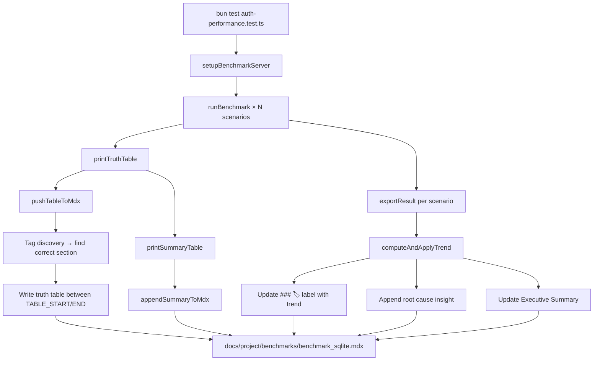

# 🚀 SveltyCMS Performance Benchmarks

> [!IMPORTANT]
> **Intelligence Features**: Cross-test correlation, adaptive budgets, forecasting, fix suggestions, differential execution, sub-component timing, memory trend tracking.
> Each `bun test` run updates its section immediately. Trend labels show performance changes vs a rolling baseline.

## 🔬 How a Single Benchmark Pushes Data

When you run with `BENCHMARK_RECORD=1`:

```bash
BENCHMARK_RECORD=1 bun test tests/benchmarks/auth-performance.test.ts
```

> [!NOTE]
> Without `BENCHMARK_RECORD=1`, benchmarks print to console only — no MDX files are modified.
> The full matrix runner (`scripts/benchmark-matrix/`) always records.

The data flows through this shared intelligence pipeline:



### Step-by-step

| Step | Function                 | What happens                                                                                 |
| ---- | ------------------------ | -------------------------------------------------------------------------------------------- |
| 1    | `setupBenchmarkServer()` | Starts a SvelteKit server on a random port, seeds test data                                  |
| 2    | `runBenchmark()`         | Runs the test scenario N times, collects timing data                                         |
| 3    | `exportResult()`         | Saves JSON to `results/sqlite/`, saves to `history.jsonl`, triggers trend analysis           |
| 4    | `computeAndApplyTrend()` | Reads rolling median from history, computes delta with lower confidence for single-test runs |
| 5    | `printTruthTable()`      | Builds ASCII table → calls `pushTableToMdx()`                                                |
| 6    | `pushTableToMdx()`       | Discovers the correct `<!-- TAG_TABLE_START -->` section, writes truth table + placeholders  |
| 7    | `printSummaryTable()`    | Builds summary table → calls `appendSummaryToMdx()`                                          |

### Guardrails

| Guard                      | Behavior                                                                              |
| -------------------------- | ------------------------------------------------------------------------------------- |
| **`BENCHMARK_RECORD=1`**   | Gates all MDX writes. Without it, benchmarks are console-only. Matrix always records. |
| **Single-test confidence** | Root cause is marked "suspected" without cross-test correlation                       |
| **Partial-run watermark**  | `📋 Partial update: auth-performance / SQLITE / 2026-05-30` in Executive Summary      |
| **Stable IDs**             | Each run keyed as `test/db/redis/mode/metric` for durable trend history               |
| **Per-DB budgets**         | SQLite gets different thresholds than PostgreSQL (`PER_DIMENSION_BUDGETS`)            |

### Key functions (in `benchmark-reporting.ts`)

| Function                                                 | Purpose                                                                          |
| -------------------------------------------------------- | -------------------------------------------------------------------------------- |
| `reportBenchmark(result, opts)`                          | Main entry point — normalizes, persists to SQLite, analyzes trends, updates MDX  |
| `pushTableToMdx(title, table, shortLabel)`               | Writes truth table between `<!-- TAG_TABLE_START -->` / `<!-- TAG_TABLE_END -->` |
| `appendSummaryToMdx(content, shortLabel)`                | Appends summary metrics before `<!-- TAG_TABLE_END -->`                          |
| `computeAndApplyTrend(result, shortLabel, phase)`        | Bridge from benchmark-utils — discovers test file and calls `reportBenchmark`    |
| `registerTestMeta(testFile, proves, codePaths, impact)`  | Registers educational metadata for a test                                        |
| `buildAndWriteExecutiveSummary(trackedTests, isPartial)` | Builds ranked executive summary from history.sqlite                              |

### Module Architecture

| Module                   | Purpose                                                                |
| ------------------------ | ---------------------------------------------------------------------- |
| `benchmark-reporting.ts` | Public facade — `reportBenchmark()` with 4 modes                       |
| `benchmark-history.ts`   | SQLite persistence (WAL, transactions, `INSERT OR IGNORE`, stable IDs) |
| `benchmark-analysis.ts`  | Trend analysis, root cause classification, budget enforcement          |
| `benchmark-mdx.ts`       | MDX file I/O — atomic writes (temp→rename), file mutex, tag discovery  |
| `benchmark-summary.ts`   | Ranked executive summary — top regressions, shared causes, noisy tests |
| `benchmark-meta.ts`      | Educational metadata for all 48 tests (code paths, impact, proves)     |

## 🧠 Smart Features

| Feature                       | Description                                                                                                              |
| ----------------------------- | ------------------------------------------------------------------------------------------------------------------------ |
| **Record Mode Gates**         | `BENCHMARK_RECORD=1` enables MDX writes; without it, benchmarks are console-only. Matrix always records.                 |
| **Instant MDX Updates**       | Each recorded `bun test` writes truth table + trend + insight directly to its report section                             |
| **Rolling Trend Baseline**    | Compares current run against median of recent runs from `history.sqlite` (canonical)                                     |
| **Severity Thresholds**       | ⚪ <5% stable, 🟡 5-10% watch, 🟠 10-20% warning, 🔴 >20% regression                                                     |
| **Multi-Metric Tracking**     | Label shows `avg`, `p95`, and `rps` deltas: `🔴 avg +35% p95 +22% (12 runs)`                                             |
| **Root Cause Classification** | 7 categories: normal variance, adapter bottleneck, cold start, GC pause, improvement, throughput drop, severe regression |
| **Confidence Levels**         | Single-test = "suspected", matrix with correlation = "confirmed", low samples = "watch"                                  |
| **Code Path Recommendations** | Each regression links to specific source files to investigate (`src/hooks/handle-authentication.ts` · ...)               |
| **Executive Summary Alerts**  | Regression alerts appear at the top of the report with severity ranking                                                  |
| **Partial-Run Watermark**     | `📋 Partial update: auth-performance / SQLITE / 2026-05-30` when not all tests ran                                       |
| **Tag Discovery**             | Matches test filename to MDX section via prefix/substring/bidirectional matching                                         |
| **Atomic MDX Writes**         | Temp file + rename prevents half-written reports                                                                         |
| **Idempotent SQLite**         | `INSERT OR IGNORE` prevents duplicate rows on retry                                                                      |
| **Per-DB Budgets**            | SQLite/PG/MariaDB/MongoDB each have different cold/warm/CRUD/cache/concurrency budgets                                   |
| **48 Enhanced Sections**      | 9 dimensions: Baseline, Adapter, Internals, Logic, API, Scale, Resilience, Security, Governance                          |

## 📝 Creating a New Benchmark

Every benchmark test MUST follow this structure to integrate with the reporting pipeline:

### Required structure

```typescript
/**
 * @file tests/benchmarks/my-benchmark.test.ts
 * @description One-line description of what this benchmark measures.
 */
import {
  test,
  runBenchmark,
  exportResult,
  printTruthTable,
  printSummaryTable,
  getDbType,
  // ... other imports as needed
} from "./benchmark-utils";
import "../unit/bun-preload.ts";

test("My Benchmark Name", async () => {
  // 1. Setup: start server, seed data
  const server = await setupBenchmarkServer();
  const baseUrl = server.baseUrl;

  // 2. Run benchmark scenarios
  const result = await runBenchmark({
    name: "Scenario Name", // appears in truth table
    iterations: 100,
    concurrency: 4,
    onIteration: async (i) => {
      // Your benchmark logic here
      await fetch(`${baseUrl}/api/...`);
    },
  });

  // 3. Export results (triggers trend computation)
  exportResult(result);

  // 4. Write truth table to MDX
  printTruthTable({
    title: "SVELTYCMS — MY BENCHMARK AUDIT",
    shortLabel: "MyBench", // used for tag matching
    results: [{ ...result, name: "Scenario Name" }],
  });

  // 5. Write summary to MDX
  printSummaryTable([
    { key: "Latency", val: result.avgMs, unit: "ms" },
    { key: "Throughput", val: result.rps, unit: "req/s" },
  ]);
}, 120000);
```

### Required checklist

- [ ] `@file` and `@description` header comments
- [ ] Import from `./benchmark-utils`
- [ ] Call `setupBenchmarkServer()` (if server needed) or standalone setup
- [ ] Call `runBenchmark()` with `name`, `iterations`, `concurrency`, `onIteration`
- [ ] Call `exportResult(result)` for EACH scenario (triggers trend + history)
- [ ] Call `printTruthTable()` with `title`, `shortLabel`, `results`
- [ ] Call `printSummaryTable()` with array of `{key, val, unit}`
- [ ] Wrap in `test("name", async () => {...}, timeout)`
- [ ] Register in `scripts/benchmark-matrix/benchmark-scripts.ts` with `path`, `label`, `shortLabel`, `section`

### Tag matching rules

The `pushTableToMdx` function discovers the correct MDX section by:

1. Getting the test filename from the call stack (e.g., `my-benchmark.test.ts` → base `my_benchmark`)
2. Scanning all `<!-- TAG_TABLE_START -->` tags in the MDX
3. Matching via: prefix match, substring match, or bidirectional match
4. Falling back to `shortLabel` from `printTruthTable`

**Important**: The `shortLabel` in `printTruthTable` MUST match the tag slug in the MDX or share a common prefix.

## 📊 Report Structure

Each report section follows this layout:

````
### 🏷️ Test Name 🔴 avg +25%          ← label with trend (outside tags, persists)
<!-- TAG_TABLE_START -->              ← data starts here (replaced each run)

```text
╔══════════════════════════════╗
║ TITLE + DB TYPE               ║
║ File: path/to/test            ║
║ @description text             ║
╠══════════════════════════════╣
║ Name │ avg │ p95 │ p99.9 │ RPS║
╚══════════════════════════════╝
````

```text
╔═══ FINAL AUDIT SUMMARY ═══╗
║ Key │ Value                ║
╚════════════════════════════╝
```

> 🔴 Both avg and p95 degraded — likely adapter bottleneck. ← "Why" insight

<!-- TAG_TABLE_END -->                ← data ends here

````

## ⚡ Executive Summary Matrix

| Database | Status | Report |
| :--- | :--- | :--- |
| 🗄️ **SQLITE** | Pending | [benchmark_sqlite.mdx](./benchmark_sqlite.mdx) |
| ⚡ **SQLITE+REDIS** | Pending | [benchmark_sqlite_redis.mdx](./benchmark_sqlite_redis.mdx) |
| 🍃 **MONGODB** | Pending | [benchmark_mongodb.mdx](./benchmark_mongodb.mdx) |
| 🔥 **MONGODB+REDIS** | Pending | [benchmark_mongodb_redis.mdx](./benchmark_mongodb_redis.mdx) |
| 🐘 **POSTGRESQL** | Pending | [benchmark_postgresql.mdx](./benchmark_postgresql.mdx) |
| 💎 **POSTGRESQL+REDIS** | Pending | [benchmark_postgresql_redis.mdx](./benchmark_postgresql_redis.mdx) |
| 🐬 **MARIADB** | Pending | [benchmark_mariadb.mdx](./benchmark_mariadb.mdx) |
| 🔱 **MARIADB+REDIS** | Pending | [benchmark_mariadb_redis.mdx](./benchmark_mariadb_redis.mdx) |

## 🔬 How to Run

**Single test:**
```bash
bun test tests/benchmarks/auth-performance.test.ts
````

**All SQLite benchmarks:**

```bash
bun run scripts/benchmark-matrix/index.ts --sql
```

**Filter by section:**

```bash
bun run scripts/benchmark-matrix/index.ts --section=api
```

## 🖥️ Data Sources

| Source                   | Path                                            |
| ------------------------ | ----------------------------------------------- |
| Individual results       | `tests/benchmarks/results/<db>/`                |
| History (trend baseline) | `tests/benchmarks/results/history.jsonl`        |
| Report templates         | `docs/project/benchmarks/benchmark_<db>.mdx`    |
| Benchmark scripts config | `scripts/benchmark-matrix/benchmark-scripts.ts` |
| Trend + insights         | `tests/benchmarks/benchmark-reporting.ts`       |
| Test utilities           | `tests/benchmarks/benchmark-utils.ts`           |
