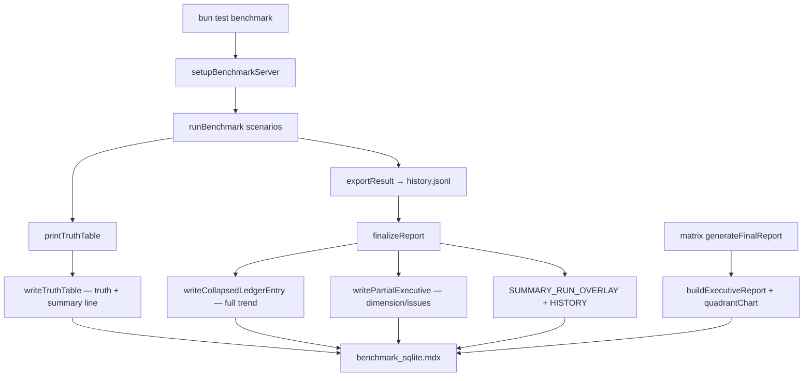

# 🚀 SveltyCMS Performance Benchmarks

> [!IMPORTANT]
> **EU Compliance**: Competitive comparisons are based on publicly available documentation as of June 2026. All SveltyCMS metrics are self-measured via reproducible suites (`bun test tests/benchmarks/`). See [Competitive Comparison](../competitive-comparison.mdx) for methodology.
>
> **Console-only by default.** Set `BENCHMARK_RECORD=1` to write MDX reports. The matrix runner always records.

## Report layout (progressive disclosure)

Each per-DB report (`benchmark_<db>.mdx`) is a **single-page dashboard** with replace-not-append zones:

| Zone          | What you see                                                                                      | MDX features                                           |
| ------------- | ------------------------------------------------------------------------------------------------- | ------------------------------------------------------ |
| **EXECUTIVE** | ✅/❌ pass badge, dimension health, issues-only table, latency matrix, sparklines, mermaid charts | `[!NOTE]` / `[!WARNING]`, tables, collapsed mermaid    |
| **SUMMARY**   | Current run overlay (this invocation) + historical sparklines (Rule C)                            | Zone markers, no duplicate tables                      |
| **LEDGER**    | Four dimension groups → collapsed per-test `<details>` with ASCII truth tables                    | Nested `<details>`, anchor drill-down `#section-{tag}` |
| **METADATA**  | Host environment reproduction table                                                               | Markdown table                                         |

Dimension groups match executive rollups: **Core**, **API**, **Scale**, **Resilience**.

### Latest middleware gains (SQLite matrix, 2026-07-05)

Full matrix: **53 passed / 4 failed / 4 skipped** in 255s. Hooks via `hooks-performance.test.ts` — full security stack, no turbo-auth shortcut:

| Scenario             | Avg     | p95     | Peak RPS |
| -------------------- | ------- | ------- | -------- |
| Static asset         | 0.085ms | 0.127ms | 9,776    |
| Turbo pipeline       | 0.527ms | 0.652ms | 1,569    |
| Full auth + security | 0.780ms | 0.883ms | 1,176    |
| REST API cache HIT   | 0.765ms | 1.046ms | 1,113    |
| Mutation + audit     | 2.924ms | 3.510ms | 342      |

Compared to 2026-07-04 ledger: full auth **−19%**, full-auth p95 **−28%**, turbo **−11%**. Warmed matrix shared-server peak: **0.555ms** full-auth avg. See [Server Hooks](../../reference/architecture/server-hooks.mdx) and [SQLite ledger](./benchmark_sqlite.mdx#section-hooks_trace).

## Record modes

| Mode      | Trigger                                     | SQLite history |                 MDX writes                  | Executive               |
| --------- | ------------------------------------------- | :------------: | :-----------------------------------------: | ----------------------- |
| `none`    | `bun test` (default)                        |       ❌       |                     ❌                      | ❌                      |
| `history` | `BENCHMARK_HISTORY_ONLY=1`                  |       ✅       |                     ❌                      | ❌                      |
| `partial` | `BENCHMARK_RECORD=1 bun test …`             |       ✅       | ✅ ledger + summary + **partial executive** | Scoped to invoked tests |
| `full`    | `bun run scripts/benchmark-matrix/index.ts` |       ✅       |                ✅ all zones                 | Full matrix executive   |

## Data flow



### Step-by-step

| Step | Function                                  | What happens                                                                      |
| ---- | ----------------------------------------- | --------------------------------------------------------------------------------- |
| 1    | `setupBenchmarkServer()`                  | Shared or spawned server; `TEST_API_SECRET` + `BENCHMARK=true` for testing API    |
| 2    | `runBenchmark()`                          | Timed iterations with abort-on-consecutive-errors                                 |
| 3    | `exportResult()`                          | Appends debug log to `history.jsonl`; registers test file for finalize            |
| 4    | `printTruthTable()` → `writeTruthTable()` | Surgical write: ASCII truth table **and** refreshed `<summary>` line              |
| 5    | `finalizeReport()`                        | SQLite persist, collapsed ledger with trend, **partial executive**, summary slots |
| 6    | Matrix `generateFinalReport()`            | Full executive, infrastructure collapse, dimension-grouped ledger regroup         |

## MDX zones (writers must respect)

```
<!-- EXECUTIVE_START -->     ← matrix or partial executive (replace only)
<!-- SUMMARY_START -->       ← Rule C: RUN overlay vs HISTORY (separate slots)
<!-- LEDGER_START -->        ← dimension groups + SECTION:TAG pairs
<!-- METADATA_START -->      ← host reproduction table
```

**Rule C:** Current Run and Historical Trends never share the same slot. Full run tables live in `tests/benchmarks/results/history.sqlite`.

## Key modules

| Module                                  | Purpose                                                                    |
| --------------------------------------- | -------------------------------------------------------------------------- |
| `benchmark-executive.ts`                | Dimension rollups, issues table, mermaid `xychart-beta` + `quadrantChart`  |
| `benchmark-mdx.ts`                      | Zone writes, dimension grouping, surgical summary parity, shell generation |
| `benchmark-reporting.ts`                | `finalizeReport()`, partial executive, `BENCHMARK_RECORD` gate             |
| `benchmark-dimensions.ts`               | Section → Core/API/Scale/Resilience mapping                                |
| `scripts/benchmark-matrix/reporting.ts` | Matrix `generateFinalReport()` orchestration                               |
| `scripts/lint-benchmark-mdx.ts`         | CI guard — zones, markers, closed `<details>`                              |

## Guardrails

| Guard                   | Behavior                                                    |
| ----------------------- | ----------------------------------------------------------- |
| `BENCHMARK_RECORD=1`    | Gates MDX mutation (matrix/CI always on)                    |
| `appendSummaryToMdx`    | **No-op** — no duplicate ASCII summary boxes                |
| `isSpecificInsight()`   | Filters generic SWOT boilerplate from `[!NOTE]` overlays    |
| `normalizeLedgerZone()` | Strips stray flat trend headings outside `<details>`        |
| `lint:benchmark-mdx`    | Fails CI on zone drift, duplicate tags, unclosed sections   |
| Partial executive       | `isPartial` watermark; rollups scoped to invoked tests only |

## Creating a new benchmark

1. Add `tests/benchmarks/my-benchmark.test.ts` with `exportResult`, `printTruthTable`, `printSummaryTable`.
2. Register in `scripts/benchmark-matrix/benchmark-scripts.ts` (`section` drives dimension group).
3. Regenerate shells: `bun run scripts/benchmark-matrix/generate-benchmark-reports.ts --force-all`.
4. Run with recording: `BENCHMARK_RECORD=1 bun test tests/benchmarks/my-benchmark.test.ts`.

Required header fields: `@file`, `@description`, optional `@phase` (`cold` | `warm` | `mixed`).

## How to run

**Console only (safe for dev):**

```bash
bun test tests/benchmarks/auth-performance.test.ts
```

**Single test with MDX + partial executive:**

```bash
BENCHMARK_RECORD=1 bun test tests/benchmarks/auth-performance.test.ts
```

**Full SQLite matrix (all DBs available with Docker):**

```bash
bun run scripts/benchmark-matrix/index.ts --db=sqlite
```

**All databases (Docker required for MariaDB/PostgreSQL/MongoDB):**

```bash
bun run scripts/benchmark-matrix/index.ts --continue-on-error
```

**Validate report shape:**

```bash
bun run lint:benchmark-mdx
```

## Data sources

| Source            | Path                                            |
| ----------------- | ----------------------------------------------- |
| Canonical history | `tests/benchmarks/results/history.sqlite`       |
| Debug log         | `tests/benchmarks/results/history.jsonl`        |
| Per-run JSON      | `tests/benchmarks/results/<db>/`                |
| Report shells     | `docs/project/benchmarks/benchmark_<db>.mdx`    |
| Script registry   | `scripts/benchmark-matrix/benchmark-scripts.ts` |

<!-- SUMMARY_MATRIX_START -->

### ⚡ Executive Summary Matrix

| Database | Status | Cold Start | REST p95 | GQL Avg | CPU | Memory |
| :------- | :----- | :--------- | :------- | :------ | :-- | :----- |

<!-- SUMMARY_MATRIX_END -->

## Related

- [Competitive Comparison](../competitive-comparison.mdx)
- [Technical Evaluation 2026](../technical-evaluation-2026.mdx)
- [Contributing Docs — Mermaid & admonitions](../../contributing/contributing-docs.mdx)
